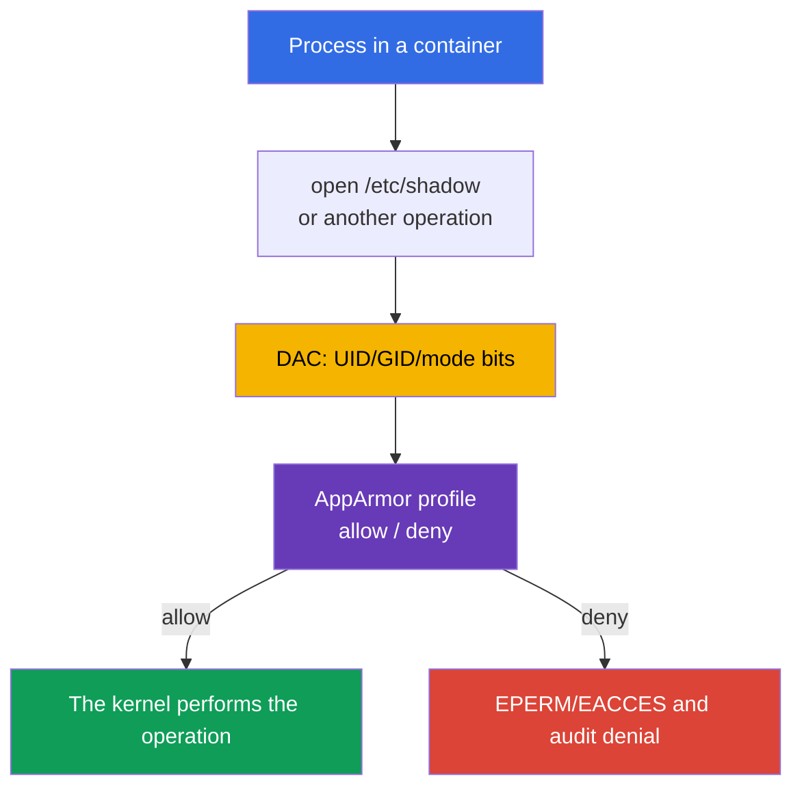

[Русская версия](ru.md) · [Versión en español](es.md) · [Version française](fr.md) · [Deutsche Version](de.md) · [ქართული ვერსია](ge.md) · [繁體中文版](tw.md) · [日本語版](jp.md)

# Chapter 16. AppArmor

> **The problem.** A shell in a container or an application error becomes more dangerous when a process
> with a suitable UID or capability can read a sensitive path, execute a file, or
> access kernel objects permitted by ordinary Linux permissions. Without a mandatory
> policy, the kernel does not limit such actions according to the workload's purpose,
> rather than only by UID.

> **What comes next.** In chapters 14-15, we reduced the host attack surface and access to it. Now
> we add mandatory access control (MAC) for container processes: AppArmor permits
> only explicitly described actions with files, capabilities, the network, and other kernel objects.
> This is the **System Hardening** CKS domain (10%). In the next chapter, the same defence in depth
> will be extended with seccomp, which filters system calls.

> **What you need from CKA.** Basic `securityContext`, non-root execution, capabilities, and
> `allowPrivilegeEscalation` are covered in [CKA chapter 20](../../../cka/course/20/README.md) and
> practiced in [CKA lab 106](../../../cka/labs/106/README.MD). Here, `securityContext`
> serves as the Kubernetes interface to an AppArmor profile, and the main task is to prepare a profile on
> the node, assign it to a Pod, and prove that the denial actually took effect.

> 🧠 AppArmor is a path-based MAC between a process and the kernel; it complements DAC, capabilities, seccomp, and RBAC, but does not replace any of those layers.

## 16.1. AppArmor: a policy between a process and the kernel

Ordinary Linux permissions (DAC) check UID, GID, and mode bits. If a process has obtained an appropriate
UID or capability, a DAC check alone may not be enough. **AppArmor** adds
Mandatory Access Control: the kernel compares the process action with the profile, and even a privileged
process cannot cancel a policy denial itself. Kubernetes has a separate case to consider:
a `privileged` container ignores its assigned AppArmor profile and starts without that
restriction, so privileged is not an AppArmor barrier.



AppArmor is a path-based MAC: rules describe paths and operations, for example read `r`, write
`w`, append `a`, `l` (link), `k` (lock), `m` (memory map), and execution transitions
`ix`/`px`/`cx`. Mount operations belong to a separate rule class rather than file
permissions. A profile is applied to a process at `exec` or when the container starts; child
processes normally inherit it or transition into a policy according to its rules.
This is not a replacement for UID, capability, seccomp, NetworkPolicy, or
RBAC: each layer limits a different attack path.

| Layer | Question it answers | Control example |
|---|---|---|
| DAC | Does the UID/GID have ordinary permission for the object? | owner and `0640` |
| AppArmor | Does the profile permit this action and path? | `deny /etc/shadow r,` |
| capabilities | Is the separate kernel privilege present? | no `CAP_SYS_ADMIN` |
| seccomp | Is the syscall permitted? | `mount(2)` is denied |
| RBAC | Can the identity call the Kubernetes API? | no `get secrets` |

AppArmor is particularly common on Ubuntu and Debian. An SELinux-oriented node uses
labels and type enforcement rather than AppArmor profiles. First identify the actual
mechanism of the node image; you cannot move an AppArmor profile to SELinux and expect it to apply.

> 🎯 Distinguish `enforce` from `complain`, load the profile on the actual node, set `securityContext.appArmorProfile`, and confirm the process's effective profile.

## 16.2. Profiles and enforce/complain modes

A profile is a policy with a unique name that is loaded into the kernel. Files usually reside in
`/etc/apparmor.d/`, but a file's presence does not make a profile **active** - successful loading
through the parser does. After a node restart, the AppArmor package or managed node
configuration must restore it.

A profile has two important modes:

| Mode | Behavior | When to use it |
|---|---|---|
| `enforce` | an operation outside the policy is blocked; the kernel records a denial | normal production mode after testing |
| `complain` | the operation is permitted, but the violation is recorded in audit/log | observe real workloads and refine the policy |

`complain` is not protection: it gathers data to build a minimal policy.
Operations not allowed by the profile are normally permitted and logged in this mode, but
an **explicit `deny` continues to block** the matching operation. Do not leave `complain`
as a permanent workaround for application errors. After reviewing permissions,
move the profile to `enforce` and test the useful scenario together with the expected denial.

A minimal demonstration profile shows the principle. The `/** rix,` rule is intentionally
broad so that the example does not require every loader and library to be listed; in production,
replace it with specific paths, abstractions, and the required operations.

```text
# /etc/apparmor.d/k8s-demo
#include <tunables/global>

profile k8s-demo flags=(attach_disconnected,mediate_deleted) {
  #include <abstractions/base>

  /** rix,
  audit deny /etc/shadow r,
}
```

`deny` takes precedence over an allowing rule for a matching operation. This profile is suitable
only for an isolated exercise: a production policy starts with process requirements,
readonly/writable directories, sockets, certificates, and explicit execution transitions.

## 16.3. Node: parser, `aa-status`, and the profile lifecycle

For `Localhost`, Kubernetes does not send profile text to kubelet and does not copy it between nodes.
A named `Localhost` profile with the exact name must be loaded into the kernel in advance on every node
where the workload is allowed to run. The container runtime provides `RuntimeDefault`: the user
does not have to deliver a named `Localhost` profile to `/etc/apparmor.d/` in advance.

On the node, first make sure AppArmor is enabled, then load and inventory the policy:

```bash
# On the node, not inside an ordinary Pod.
sudo cat /sys/module/apparmor/parameters/enabled
# Expected: Y

sudo aa-status
sudo apparmor_status
sudo apparmor_parser -r -W /etc/apparmor.d/k8s-demo
# Presence and kernel effective mode; plain aa-status grep alone is not mode proof.
sudo aa-status | grep -F 'k8s-demo'
sudo grep -F 'k8s-demo' /sys/kernel/security/apparmor/profiles
```

`aa-status` (an alias for `apparmor_status`) shows whether the module is enabled, how many profiles
are loaded, and which processes are in enforce/complain. `apparmor_parser` reads a policy and
passes it to the kernel; remember the main operations like this:

```bash
# Add a new profile or replace the loaded profile after changing the file.
sudo apparmor_parser -r -W /etc/apparmor.d/k8s-demo

# Temporarily collect audit signals without blocking, then enable blocking.
sudo aa-complain /etc/apparmor.d/k8s-demo
sudo grep -F 'k8s-demo' /sys/kernel/security/apparmor/profiles
sudo aa-enforce /etc/apparmor.d/k8s-demo
sudo grep -F 'k8s-demo' /sys/kernel/security/apparmor/profiles

# Remove a profile from the kernel only during a controlled decommissioning.
sudo apparmor_parser -R /etc/apparmor.d/k8s-demo
```

`-r` replaces the loaded version; `-R` unloads it. `aa-complain` and `aa-enforce`
switch the mode of an already loaded profile and reload it themselves: a Pod restart is not required
for the mode change itself. Before removal, find the Pods and processes
that can still use it. Do not edit policy blindly on a production node: an error
can prevent a workload from starting or break an application after reload. First check
syntax and rollout on a dedicated node.

Distinguish `apparmor_parser` flags: `-p` only expands `#include` and prints the result; `-Q`
compiles a policy but does not load it into the kernel; `-r` replaces the loaded version. For a safe
check, use `-Q -K`, then `-r -W`.

```bash
# -Q compiles without loading into the kernel; -K prevents cache reuse.
# -p is not a complete compile check.
sudo apparmor_parser -Q -K /etc/apparmor.d/k8s-demo >/dev/null
sudo apparmor_parser -r -W /etc/apparmor.d/k8s-demo
sudo aa-status
```

`aa-status` shows state on the node, not the Kubernetes specification. For a cluster with
multiple node pools, inspect every pool: the scheduler does not know the contents of
`/etc/apparmor.d` and cannot itself guarantee that the `Localhost` profile is on the selected
node.

## 16.4. Kubernetes API: current `appArmorProfile`

The current Kubernetes API sets a profile through
`securityContext.appArmorProfile`. The field can be in the Pod `securityContext` as a baseline for
containers, or in an individual container's `securityContext` if it needs a narrower
policy. Do not assign different profiles to a Pod unnecessarily: that complicates audit and
investigation.

| `type` | Value | When to use it |
|---|---|---|
| `RuntimeDefault` | profile supplied by the container runtime | a secure common baseline if the runtime and node support it |
| `Localhost` | named profile preloaded on the node | verified application-specific policy |
| `Unconfined` | AppArmor does not constrain the container | only a temporary diagnostic exception with an explicit risk owner |

Explicit `type: RuntimeDefault` requires available AppArmor: without it, such a Pod will not
be admitted. If `appArmorProfile` is not set, the runtime default is applied only when
AppArmor is available; otherwise the container starts without AppArmor confinement. Therefore,
the absence of the field is not equivalent to explicit `RuntimeDefault`.

For an ordinary workload, start with the runtime profile and other baseline restrictions:

```yaml
apiVersion: v1
kind: Pod
metadata:
  name: runtime-default-aa
  namespace: demo
spec:
  securityContext:
    appArmorProfile:
      type: RuntimeDefault
  containers:
  - name: app
    image: nginx:1.30.4
    securityContext:
      allowPrivilegeEscalation: false
      capabilities:
        drop: ["ALL"]
```

For a custom `Localhost` profile, specify precisely the name loaded in the kernel, without the
`/etc/apparmor.d/` path or the legacy `localhost/` prefix:

```yaml
apiVersion: v1
kind: Pod
metadata:
  name: apparmor-localhost
  namespace: demo
spec:
  # Placement constraint is part of the contract if the profile is not on every node.
  nodeSelector:
    kubernetes.io/hostname: worker-1
  securityContext:
    appArmorProfile:
      type: Localhost
      localhostProfile: k8s-demo
  containers:
  - name: app
    image: busybox:1.36.1
    command: ["sh", "-c", "sleep 3600"]
    securityContext:
      allowPrivilegeEscalation: false
      capabilities:
        drop: ["ALL"]
```

Before applying it, prepare `k8s-demo` on `worker-1`; afterward, wait for startup and
check the manifest, placement, and the process's effective profile:

```bash
kubectl apply -f apparmor-localhost.yaml
kubectl wait -n demo --for=condition=Ready pod/apparmor-localhost --timeout=120s
kubectl get pod -n demo apparmor-localhost -o wide
kubectl get pod -n demo apparmor-localhost \
  -o jsonpath='{.spec.securityContext.appArmorProfile}{"\n"}'
kubectl exec -n demo apparmor-localhost -- cat /proc/1/attr/current
```

The last command confirms the profile under which the kernel executes container PID 1; output
depends on the runtime and can include the mode in parentheses. This is stronger than checking
YAML alone: the YAML can be correct while the container cannot start on a node without the profile.

> 🔬 A beta annotation is needed to recognize and safely migrate an old manifest; for new workloads, use only `securityContext.appArmorProfile`.

## 16.5. Legacy annotation: read, migrate, do not mix

Before Kubernetes v1.30, AppArmor was set per container through a beta annotation:

```yaml
metadata:
  annotations:
    container.apparmor.security.beta.kubernetes.io/app: localhost/k8s-demo
```

The complete legacy value depends on the mode: `runtime/default`, `unconfined`, or
`localhost/<profile-name>`. The key must end with the **exact container name**. For example,
an old Pod for the `app` container looked like this:

```yaml
apiVersion: v1
kind: Pod
metadata:
  name: apparmor-legacy
  namespace: demo
  annotations:
    container.apparmor.security.beta.kubernetes.io/app: localhost/k8s-demo
spec:
  containers:
  - name: app
    image: busybox:1.36.1
    command: ["sh", "-c", "sleep 3600"]
```

This is a legacy interface. For new manifests, use `securityContext.appArmorProfile`;
do not create one object with both the new field and an annotation, especially with different
values. During migration, first identify the Kubernetes and runtime version, replace the annotation
with the equivalent API field, apply it on a test node, and check `/proc/1/attr/current`.

Quick audit of old objects:

```bash
kubectl get pod -A -o json | jq -r '
  .items[]
  | select(.metadata.annotations != null)
  | .metadata.annotations
  | to_entries[]
  | select(.key | startswith("container.apparmor.security.beta.kubernetes.io/"))
  | [.key, .value] | @tsv'

kubectl get pod -A -o jsonpath='{range .items[*]}{.metadata.namespace}{"/"}{.metadata.name}{"\t"}{.spec.securityContext.appArmorProfile}{"\n"}{end}'
```

An empty Pod audit result does not prove that there is no container-level override or legacy
configuration in a controller. Also inspect the templates of Deployment, StatefulSet,
DaemonSet, Job, and CronJob: for the first four, inspect `.spec.template.metadata.annotations`,
`.spec.template.spec.securityContext.appArmorProfile`, and container overrides; for CronJob,
inspect the same fields under `.spec.jobTemplate.spec.template`. During migration, fix the
controller/template manifest, not only the Pod it created.

> 🎯 Distinguish a container-creation error from a runtime denial, then confirm the node, profile name and loading, effective enforcement, and kernel evidence; do not replace the cause with `Unconfined`.

## 16.6. Startup failure and denial: diagnose at the correct layer

`Localhost` profiles have two distinct failure categories.

1. **The container is not created.** AppArmor is disabled on the node, the runtime does not support the required
   mode, the profile name is not loaded, or the Pod landed on another node. This is a lifecycle failure:
   look for a Pod event and kubelet/runtime state.
2. **The container runs but an action is denied.** A profile in `enforce` blocks a path,
   capability, network, mount, or another object. This is a runtime denial: the application normally
   receives `Permission denied`, and the kernel records `apparmor="DENIED"`.

Start with Kubernetes, then move to the actual node:

```bash
NS=demo
POD=apparmor-localhost

kubectl get pod -n "$NS" "$POD" -o wide
kubectl describe pod -n "$NS" "$POD"
kubectl get events -n "$NS" \
  --field-selector involvedObject.name="$POD" --sort-by=.lastTimestamp
kubectl get pod -n "$NS" "$POD" -o yaml
```

If the status is `Pending`, `ContainerCreating`, `CreateContainerError`, or the container did not become
Ready, the event usually names the profile or the node-local cause. Obtain the node from
`-o wide`, connect only with authorized administrative access, and check:

```bash
# On the node selected by the scheduler.
sudo aa-status
sudo aa-status | grep -F 'k8s-demo'
sudo journalctl -u kubelet --since '15 minutes ago'
if command -v ausearch >/dev/null 2>&1 && sudo systemctl is-active --quiet auditd; then
  sudo ausearch -m AVC,USER_AVC -ts recent | grep -F 'apparmor=' || true
elif sudo test -r /var/log/audit/audit.log; then
  sudo grep -F 'apparmor=' /var/log/audit/audit.log || true
else
  sudo journalctl -k --since '15 minutes ago' | grep -Ei 'apparmor|denied' || true
  sudo dmesg --level=err,warn | grep -Ei 'apparmor|denied' || true
fi
```

Do not remedy such a failure by replacing `Localhost` with `Unconfined` or `privileged: true`. First
compare the type and name in the manifested Pod, the node name, `aa-status`, runtime version, and
profile delivery mechanism. If a profile must exist only on a dedicated pool, pin the workload using
`nodeSelector`, affinity, or a trusted label, and protect that label with a node-management process.

## 16.7. Verifying enforce and complain

Check the process's effective mode, not only the presence of its name in `aa-status`. `audit deny
/etc/shadow r,` blocks in `complain` too, so it tests an audited explicit deny rather than proving
`enforce`. For the mode probe, use an implicitly denied write: the profile does not allow write in `/`.

```bash
kubectl exec -n demo apparmor-localhost -- cat /proc/1/attr/current
# Expected: k8s-demo (enforce)
kubectl exec -n demo apparmor-localhost -- touch /aa-mode-probe-enforce
# Expected: Permission denied: implicit denial in enforce.
kubectl exec -n demo apparmor-localhost -- cat /etc/shadow
# Expected: Permission denied and audit evidence: audit deny.

sudo aa-complain /etc/apparmor.d/k8s-demo
sudo grep -F 'k8s-demo' /sys/kernel/security/apparmor/profiles
kubectl exec -n demo apparmor-localhost -- cat /proc/1/attr/current
# Expected: k8s-demo (complain)
kubectl exec -n demo apparmor-localhost -- touch /aa-mode-probe-complain
# Expected: success and ALLOWED/complain telemetry.
kubectl exec -n demo apparmor-localhost -- cat /etc/shadow
# Permission denied: explicit audit deny also takes effect in complain.
sudo aa-enforce /etc/apparmor.d/k8s-demo
```

For evidence, check the audit subsystem first (`ausearch` with active auditd, then
`/var/log/audit/audit.log`); `journalctl -k` and `dmesg` are fallbacks. If sources are unavailable,
that is `REVIEW_REQUIRED`, not evidence of an absent denial.


## 16.8. How this helps: on the exam and in real work

**On the exam.** Quickly identify the node, check `aa-status`, load or replace the required
profile with `apparmor_parser`, move it to `aa-enforce`/`aa-complain` as required, and set the
Pod with the current `appArmorProfile`. After applying it, do not look only at YAML:
`kubectl describe pod`, `/proc/1/attr/current`, and source-aware AppArmor audit evidence
distinguish a scheduling/profile-delivery error from a real denial. Look for a denial first through
`ausearch` with active auditd or `/var/log/audit/audit.log`; use `journalctl -k` and `dmesg`
as fallbacks on the specific node. Recognize the old annotation, but use it only if the task
explicitly requires legacy compatibility.

**In real work.** AppArmor reduces the consequences of a vulnerable process only when the
policy is delivered to every required node, reflects the real application contract, and is observed.
Automated profile rollout, a short complain period, review of new permissions, and an alert on
`DENIED` create a verifiable boundary rather than a "policy file somewhere on a node."

> 🎯 Be able to diagnose why an AppArmor profile was not applied or a workload will not start.

### 16.8.1. Troubleshooting: "The profile does not work because..."

Below, `NS`, `POD`, and `CTR` mean namespace, Pod, and container. Always first identify the
actual node: diagnosing AppArmor on a different node proves nothing about the container.

#### The profile is not loaded on the node where the scheduler placed the Pod

In a multi-node cluster, `apparmor_parser` may have completed successfully on `worker-1`, but the Pod
landed on `worker-2`. Kubernetes does not move profiles between nodes, and the scheduler does not read
the kernel policy contents. As a result, `Localhost` usually causes a container-creation error,
or rollout works for only some replicas.

```bash
NS=demo
POD=apparmor-localhost

kubectl get pod -n "$NS" "$POD" -o wide
kubectl describe pod -n "$NS" "$POD"
# Connect to exactly the node in the NODE column.
sudo aa-status | grep -F 'k8s-demo'
sudo journalctl -u kubelet --since '15 minutes ago'
```

Fix: deliver and load the profile with `sudo apparmor_parser -r -W` on every node of the allowed
pool before rollout, or pin the Pod with `nodeSelector`/affinity to a pool with managed
delivery. Do not fix this by replacing `Localhost` with `Unconfined`.

#### The name in the manifest does not match the name inside the profile

`localhostProfile` and the legacy `localhost/<name>` value refer to the name declared inside
the profile, not necessarily the file name. For `/etc/apparmor.d/k8s-demo`, that is
the `profile k8s-demo {` line; a `profile web-app {` declaration requires
`localhostProfile: web-app`, even if the file remains named `k8s-demo`.

```bash
# On the actual node: compare the policy name with the actually loaded name.
sudo grep -nE '^[[:space:]]*profile[[:space:]]+' /etc/apparmor.d/k8s-demo
sudo aa-status | grep -F 'k8s-demo'
sudo aa-status | grep -F 'web-app'

# In Kubernetes: check both the new API and legacy annotation during migration.
kubectl get pod -n "$NS" "$POD" \
  -o jsonpath='{.spec.securityContext.appArmorProfile.localhostProfile}{"\n"}'
kubectl describe pod -n "$NS" "$POD"
```

Fix: make the declaration, `localhostProfile`, and, if it is still used, the legacy annotation
use one exact name. Then reload the profile using `apparmor_parser -r -W` and create a new
Pod; the old process is not proof that the corrected policy was assigned.

#### The application works in `complain`, but gets `Permission denied` in `enforce`

Usually the policy lacks a required `allow` for a path or operation, for example a runtime
directory, certificate, Unix socket, or file that the application reads only after
startup. In `complain`, a missing allow is normally only logged; in `enforce`, it is
blocked. An explicit `deny` differs: it blocks in `complain` too, so do not remove it
for testing.

```bash
# On the actual node after a controlled probe: auditd/audit.log first, journal/dmesg fallback.
sudo aa-status | grep -F 'k8s-demo'
if command -v ausearch >/dev/null 2>&1 && sudo systemctl is-active --quiet auditd; then
  sudo ausearch -m AVC,USER_AVC -ts recent | grep -E 'apparmor="DENIED"|profile="k8s-demo"' || true
elif sudo test -r /var/log/audit/audit.log; then
  sudo grep -E 'apparmor="DENIED"|profile="k8s-demo"' /var/log/audit/audit.log || true
else
  # Kernel logging is a valid fallback when auditd/audit.log is unavailable.
  if sudo journalctl -k --since '10 minutes ago' >/dev/null 2>&1; then
    sudo journalctl -k --since '10 minutes ago' | \
      grep -E 'apparmor="DENIED"|profile="k8s-demo"' || true
  elif sudo dmesg >/dev/null 2>&1; then
    sudo dmesg | grep -i apparmor || true
  else
    echo 'REVIEW_REQUIRED: no readable AppArmor audit source' >&2
  fi
fi

# In Kubernetes, record the container and observed symptom.
kubectl describe pod -n "$NS" "$POD"
kubectl logs -n "$NS" "$POD" -c "$CTR" --tail=100
```

Fix: map `operation=` and `name=` from the denial to the application contract,
add the smallest justified allow rule on a test node, check positive and negative
scenarios, and only then enable `aa-enforce`. Do not add broad `/** rw,` and do not move a
production workload into indefinite `complain`.

#### The node or runtime does not support AppArmor, or the profile only exists in a file

AppArmor requires a Linux kernel with an enabled and active LSM; on a non-Linux node, a kernel without
AppArmor, or a runtime without support, assigning a profile will not become a working barrier.
Separately, kubelet does **not** scan the directory or load AppArmor policy: a file in
`/etc/apparmor.d/` is useless by itself until `apparmor_parser` has passed it to the kernel.
Check this before looking for an error in YAML.

```bash
# On the actual node.
uname -s
sudo cat /sys/module/apparmor/parameters/enabled 2>/dev/null || true
sudo aa-status
sudo dmesg | grep -i apparmor || true
sudo journalctl -k --since '15 minutes ago' | grep -Ei 'apparmor|lsm' || true
sudo journalctl -u kubelet --since '15 minutes ago'

# A Kubernetes event often indicates an unsupported runtime or unloaded profile.
kubectl describe pod -n "$NS" "$POD"
```

Fix: use a Linux node pool with AppArmor enabled and a compatible runtime, or do not claim
AppArmor as a mandatory control on such a platform. For a supported node, keep the file in managed
configuration and explicitly load it with `apparmor_parser` on every target node; do not rely
on the kubelet directory as a policy-delivery mechanism.

> ### 🔴 Attacker's view
> **Asset:** host filesystem and syscalls accessible to the container.
>
> **Starting foothold:** RCE in a container.
>
> **Attacker objective:** perform an action outside the application: access a protected path or execute a prohibited syscall.
>
> **Abuse path:** try to escape the profile boundaries if it is loaded or named incorrectly, or is in `complain` instead of `enforce`.
>
> **Expected evidence:** an effective AppArmor profile and a denial event in an available audit source:
> `ausearch`/`audit.log` or `journalctl -k`/`dmesg` as a fallback.
>
> **Control:** a verified profile in `enforce` mode and a check through `aa-status`.
>
> **Retest:** the prohibited action remains blocked after remediation.

## 16.9. Self-check questions

<details>
<summary>1. Why does AppArmor not replace UID/GID, capabilities, seccomp, or RBAC?</summary>

These controls answer different questions: DAC checks UID/GID and mode bits, capabilities are
separate kernel privileges, seccomp defines permitted syscalls, and RBAC governs an identity's
Kubernetes API access. AppArmor adds path-based MAC for process actions according to its profile.
Therefore, a profile complements rather than removes the need for non-root, dropped capabilities,
seccomp, and minimal RBAC.
</details>

<details>
<summary>2. How does `enforce` differ from `complain`, and why cannot the latter be considered protection?</summary>

In `enforce`, an operation outside the policy is blocked and the kernel records a denial. In `complain`,
an unpermitted operation normally runs and is logged to gather the application's real requirements;
an explicit `deny` still blocks a match. This mode is useful temporarily to refine a policy, but it
is not a permanent protection barrier.
</details>

<details>
<summary>3. How do `aa-status` and `apparmor_parser -r` prove different parts of a profile's state?</summary>

`aa-status` shows AppArmor state on the node: the enabled module, loaded profiles, their modes,
and processes. `apparmor_parser -r -W <file>` syntactically reads policy and adds or replaces
its loaded version in the kernel. The existence of the file itself proves nothing; after the parser,
confirm the name and mode with `aa-status`.
</details>

<details>
<summary>4. Why can a `Localhost` profile produce `CreateContainerError` after a successful
   `kubectl apply`?</summary>

`kubectl apply` accepts the manifest, but the container runtime can apply `Localhost` only when a profile
with the exact name is already loaded in the kernel of the node selected by the scheduler. The profile
may be absent on that node, AppArmor/runtime may not support the required mode, or the Pod may land in
another node pool. Find the reason in `kubectl describe pod`, events, the actual node, `aa-status`,
and kubelet logs.
</details>

<details>
<summary>5. Which `appArmorProfile.type` values are permitted, and when is `Unconfined` justified?</summary>

The permitted values are `RuntimeDefault`, `Localhost`, and `Unconfined`. `RuntimeDefault` is a common
baseline with available AppArmor, while `Localhost` is for a verified application-specific profile
preloaded on the node. `Unconfined` is justified only as a temporary diagnostic exception with an
explicit risk owner, not as a way to fix profile failure.
</details>

<details>
<summary>6. How is the legacy AppArmor annotation written for a container named `app` and profile
   `k8s-demo`?</summary>

The key must end in the exact container name, and the Localhost value receives the legacy prefix.
In this case, the entry is: `container.apparmor.security.beta.kubernetes.io/app: localhost/k8s-demo`.
This is a beta annotation for audit and migration; new manifests use
`securityContext.appArmorProfile` and do not mix both interfaces.
</details>

<details>
<summary>7. Which commands prove the selected node, the process's effective profile, and a blocked action at once?</summary>

The selected node is shown by `kubectl get pod -n demo apparmor-localhost -o wide`; on that node,
verify the profile with `sudo aa-status | grep -F 'k8s-demo'`. The effective profile of PID 1 is
confirmed by `kubectl exec -n demo apparmor-localhost -- cat /proc/1/attr/current`. Check the denial
with `kubectl exec ... -- cat /etc/shadow`, expecting `Permission denied`, and a corresponding
AppArmor audit event from that node's source: auditd/`audit.log` or the kernel journal as a fallback.
</details>

<details>
<summary>8. **Flashback (chapter 18).** PSA `restricted` from chapter 18 requires `RuntimeDefault`/
   `Localhost` for seccomp, but does **not** require a specific AppArmor profile beyond a
   `RuntimeDefault`/non-disabled default. Precisely where does what built-in PSA checks end, and the area
   that can be closed only by an explicitly assigned `Localhost` AppArmor profile from this chapter begin?</summary>

PSA checks Pod-spec admissibility against its built-in standard, including a non-disabled AppArmor
default and `RuntimeDefault`/`Localhost` for seccomp, but it does not model the path and operation
contract of a specific application. It does not deliver or verify a node-local named AppArmor policy.
An explicit `Localhost` profile closes that next area: kernel enforcement of specific permitted paths,
file operations, capabilities, network, or mount rules on the selected node.
</details>

## Practice

First practice `securityContext`, non-root execution, and capabilities in
[CKA lab 106](../../../cka/labs/106/README.MD) - this is a prerequisite, not the chapter's main
practice. Then, on a test node, create the `k8s-demo` profile, load it with
`apparmor_parser`, assign a Pod with `appArmorProfile.type: Localhost`, and compare behavior
in `complain` and `enforce`. In the next [chapter 17](../17/README.md), add seccomp: AppArmor
will limit profile objects and operations, while seccomp limits the set of syscalls available to the process.

🧪 Main CKS practice: [Lab 106 - AppArmor and seccomp](../../labs/106/README.MD)

📘 Prerequisite / supporting practice (SecurityContext and capabilities):
[tasks/cka/labs/106](../../../cka/labs/106/README.MD)
🌐 Additional interactive practice (killer.sh/killercoda, external resource): [apparmor](https://killercoda.com/killer-shell-cks/scenario/apparmor)

## References

- [Kubernetes: Restrict a Container's Access to Resources with AppArmor](https://kubernetes.io/docs/tutorials/security/apparmor/)
- [Kubernetes API: AppArmorProfile](https://kubernetes.io/docs/reference/kubernetes-api/workload-resources/pod-v1/#AppArmorProfile)
- [AppArmor: official documentation](https://apparmor.net/)
- [AppArmor project: Wiki](https://gitlab.com/apparmor/apparmor/-/wikis/home)
- [Kubernetes: Pod Security Standards](https://kubernetes.io/docs/concepts/security/pod-security-standards/)

---
[Table of contents](../README.md) · [Chapter 15](../15/README.md) · [Chapter 17](../17/README.md)
