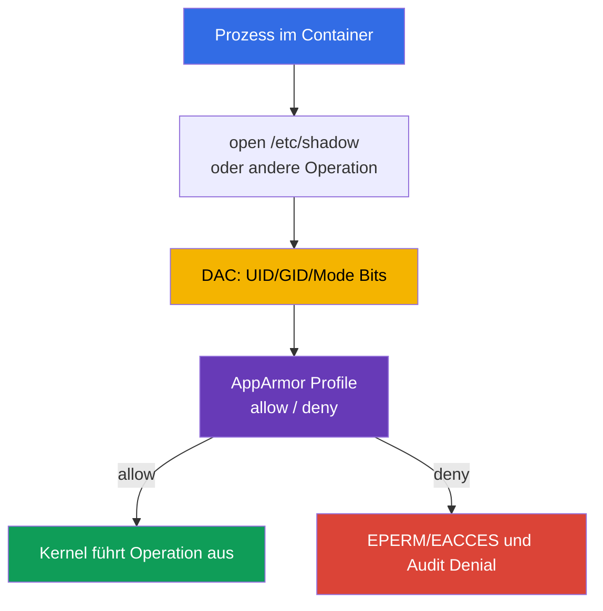

[Русская версия](ru.md) · [Eng version](README.md) · [Versión en español](es.md) · [Version française](fr.md) · [ქართული ვერსია](ge.md) · [繁體中文版](tw.md) · [日本語版](jp.md)

# Kapitel 16. AppArmor

> **Das Problem.** Eine Shell in einem Container oder ein Anwendungsfehler werden gefährlicher, wenn ein Prozess mit passender UID oder Capability einen sensitiven Pfad lesen, eine Datei ausführen oder auf Kernel-Objekte zugreifen kann, die gewöhnliche Linux Permissions erlauben. Ohne eine verpflichtende Policy begrenzt der Kernel solche Aktionen nicht nach dem Zweck des Workload, sondern nur nach UID.

> **Was kommt als Nächstes.** In Kapitel 14-15 haben wir die Angriffsfläche des Host und den Zugriff darauf reduziert. Jetzt fügen wir Mandatory Access Control (MAC) für Containerprozesse hinzu: AppArmor erlaubt nur ausdrücklich beschriebene Aktionen mit Dateien, Capabilities, Netzwerk und anderen Kernel-Objekten. Dies ist die CKS-Domain **System Hardening** (10%). Im nächsten Kapitel ergänzt seccomp dieselbe Defense in Depth durch das Filtern von System Calls.

> **Was Sie aus CKA benötigen.** Grundlegendes zu `securityContext`, Non-Root-Ausführung, Capabilities und `allowPrivilegeEscalation` wird in [CKA-Kapitel 20](../../../cka/course/20/de.md) behandelt und im [CKA-Lab 106](../../../cka/labs/106/README_DE.MD) geübt. Hier dient `securityContext` als Kubernetes-Schnittstelle zum AppArmor Profile; die Hauptaufgabe besteht darin, das Profile auf dem Node vorzubereiten, einem Pod zuzuweisen und zu belegen, dass das Verbot tatsächlich greift.

> 🧠 AppArmor ist path-based MAC zwischen Prozess und Kernel; es ergänzt DAC, Capabilities, seccomp und RBAC, ersetzt aber keine dieser Ebenen.

## 16.1. AppArmor: Policy zwischen Prozess und Kernel

Gewöhnliche Linux-Rechte (DAC) prüfen UID, GID und Mode Bits. Hat ein Prozess die passende UID oder Capability erhalten, kann eine DAC-Prüfung allein unzureichend sein. **AppArmor** fügt Mandatory Access Control hinzu: Der Kernel gleicht die Prozessaktion mit dem Profile ab, und selbst ein privilegierter Prozess kann einen Policy Denial nicht selbst aufheben. In Kubernetes ist ein Fall besonders wichtig: Ein `privileged` Container ignoriert das ihm zugewiesene AppArmor Profile und startet ohne diese Einschränkung, daher ist privileged keine AppArmor-Barriere.



AppArmor ist path-based MAC: Regeln beschreiben Pfade und Operationen, beispielsweise Lesen `r`, Schreiben `w`, Anhängen `a`, `l` (Link), `k` (Lock), `m` (Memory Map) sowie Execution Transitions `ix`/`px`/`cx`. Mount-Operationen gehören zu einer separaten Regelklasse und nicht zu File Permissions. Ein Profile wird einem Prozess bei `exec` oder beim Start des Containers zugewiesen; Kindprozesse erben die Policy üblicherweise oder wechseln gemäß ihren Regeln in sie über. Dies ist kein Ersatz für UID, Capability, seccomp, NetworkPolicy oder RBAC: Jede Ebene beschränkt einen anderen Angriffsweg.

| Ebene | Welche Frage beantwortet sie? | Beispiel-Control |
|---|---|---|
| DAC | besitzt UID/GID das gewöhnliche Recht auf ein Objekt? | Owner und `0640` |
| AppArmor | erlaubt das Profile diese Aktion und diesen Pfad? | `deny /etc/shadow r,` |
| Capabilities | ist eine separate Kernel-Privilegierung vorhanden? | kein `CAP_SYS_ADMIN` |
| seccomp | ist der System Call erlaubt? | `mount(2)` verboten |
| RBAC | kann die Identity die Kubernetes API aufrufen? | kein `get secrets` |

AppArmor ist besonders auf Ubuntu und Debian verbreitet. Auf einem SELinux-orientierten Node werden Labels und Type Enforcement verwendet, keine AppArmor Profiles. Bestimmen Sie zuerst den tatsächlichen Mechanismus des Node Image; Sie können ein AppArmor Profile nicht auf SELinux übertragen und dessen Anwendung erwarten.

> 🎯 Unterscheiden Sie `enforce` und `complain`, laden Sie das Profile auf den tatsächlichen Node, weisen Sie `securityContext.appArmorProfile` zu und bestätigen Sie das effektive Profile des Prozesses.

## 16.2. Profile und Modi enforce/complain

Ein Profile ist eine Policy mit einem eindeutigen Namen, die in den Kernel geladen wird. Dateien liegen üblicherweise unter `/etc/apparmor.d/`, aber **aktiv** wird ein Profile nicht durch das Vorhandensein der Datei, sondern durch erfolgreiches Laden mit dem Parser. Nach dem Reboot des Node muss es das AppArmor Package oder die verwaltete Node-Konfiguration wiederherstellen.

Ein Profile hat zwei wichtige Modi:

| Modus | Verhalten | Wann verwenden |
|---|---|---|
| `enforce` | eine Operation außerhalb der Policy wird blockiert; der Kernel schreibt einen Denial | regulärer Production-Modus nach Tests |
| `complain` | eine Operation wird erlaubt, aber die Verletzung wird in Audit/Log erfasst | Beobachtung echter Workloads und Verfeinerung der Policy |

`complain` ist kein Schutz: Es sammelt Daten zum Erstellen einer minimalen Policy. In diesem Modus werden nicht vom Profile erlaubte Operationen üblicherweise zugelassen und protokolliert, aber ein **explizites `deny` blockiert** die passende Operation weiterhin. Behalten Sie `complain` nicht als dauerhafte Kompensation für Anwendungsfehler. Stellen Sie das Profile nach Review der Erlaubnisse auf `enforce` um und prüfen Sie den nützlichen Use Case zusammen mit dem erwarteten Denial.

Das minimale Demonstrations-Profile zeigt das Prinzip. Die Regel `/** rix,` ist absichtlich breit, damit das Beispiel nicht jeden Loader und jede Library aufzählen muss; in der Produktion wird sie durch konkrete Pfade, Abstractions und benötigte Operationen ersetzt.

```text
# /etc/apparmor.d/k8s-demo
#include <tunables/global>

profile k8s-demo flags=(attach_disconnected,mediate_deleted) {
  #include <abstractions/base>

  /** rix,
  audit deny /etc/shadow r,
}
```

`deny` hat Vorrang vor einer erlaubenden Regel für die passende Operation. Dieses Profile eignet sich nur für eine isolierte Übung: Eine Production Policy beginnt mit den Anforderungen des Prozesses, readonly/writable Directories, Sockets, Zertifikaten und expliziten Execution Transitions.

## 16.3. Node: Parser, `aa-status` und Lifecycle des Profile

Bei `Localhost` übergibt Kubernetes den Text des Profile nicht an kubelet und kopiert ihn nicht zwischen Nodes. Ein benanntes `Localhost` Profile mit exakt diesem Namen muss im Kernel jedes Node vorab geladen sein, auf dem der Workload laufen darf. `RuntimeDefault` stellt die container runtime bereit: Der Benutzer muss nicht vorab ein benanntes `Localhost` Profile nach `/etc/apparmor.d` ausliefern.

Stellen Sie auf dem Node zuerst sicher, dass AppArmor aktiviert ist, und laden und inventarisieren Sie dann die Policy:

```bash
# Auf dem Node, nicht in einem gewöhnlichen Pod.
sudo cat /sys/module/apparmor/parameters/enabled
# Erwartet: Y

sudo aa-status
sudo apparmor_status
sudo apparmor_parser -r -W /etc/apparmor.d/k8s-demo
# Vorhandensein und effektiver Kernel-Modus; ein einfaches aa-status grep beweist den Modus nicht allein.
sudo aa-status | grep -F 'k8s-demo'
sudo grep -F 'k8s-demo' /sys/kernel/security/apparmor/profiles
```

`aa-status` (Alias `apparmor_status`) zeigt, ob das Modul aktiviert ist, wie viele Profiles geladen sind und welche Prozesse sich in enforce/complain befinden. `apparmor_parser` liest die Policy und übergibt sie dem Kernel; die wichtigsten Operationen lassen sich so merken:

```bash
# Neues Profile hinzufügen oder ein geladenes Profile nach Änderung der Datei ersetzen.
sudo apparmor_parser -r -W /etc/apparmor.d/k8s-demo

# Vorübergehend Audit-Signale ohne Blockierung sammeln, dann Blockierung aktivieren.
sudo aa-complain /etc/apparmor.d/k8s-demo
sudo grep -F 'k8s-demo' /sys/kernel/security/apparmor/profiles
sudo aa-enforce /etc/apparmor.d/k8s-demo
sudo grep -F 'k8s-demo' /sys/kernel/security/apparmor/profiles

# Profile nur bei kontrollierter Außerbetriebnahme aus dem Kernel entfernen.
sudo apparmor_parser -R /etc/apparmor.d/k8s-demo
```

`-r` ersetzt die geladene Version, `-R` lädt sie aus. `aa-complain` und `aa-enforce` schalten den Modus eines bereits geladenen Profile um und führen selbst dessen Reload durch: Für die Änderung des Modus selbst ist kein Pod Restart erforderlich. Suchen Sie vor der Entfernung Pods und Prozesse, die es noch verwenden könnten. Bearbeiten Sie Policy auf einem Production Node nicht auf Verdacht: Ein Fehler kann den Start eines Workload verhindern oder die Anwendung nach Reload brechen. Prüfen Sie zuerst Syntax und Rollout auf einem dedizierten Node.

Unterscheiden Sie die Flags von `apparmor_parser`: `-p` expandiert nur `#include` und gibt das Ergebnis aus; `-Q` kompiliert die Policy, lädt sie aber nicht in den Kernel; `-r` ersetzt die geladene Version. Verwenden Sie zur sicheren Prüfung `-Q -K`, danach `-r -W`.

```bash
# -Q kompiliert ohne Laden in den Kernel; -K verbietet die Wiederverwendung des Cache.
# -p ist keine vollständige Compile-Prüfung.
sudo apparmor_parser -Q -K /etc/apparmor.d/k8s-demo >/dev/null
sudo apparmor_parser -r -W /etc/apparmor.d/k8s-demo
sudo aa-status
```

`aa-status` zeigt den Zustand auf dem Node, nicht die Kubernetes-Spezifikation. Prüfen Sie bei einem Cluster mit mehreren Node Pools jeden Pool: Der Scheduler kennt den Inhalt von `/etc/apparmor.d` nicht und garantiert nicht selbst, dass das `Localhost` Profile auf dem ausgewählten Node vorhanden ist.

## 16.4. Kubernetes API: aktuelles `appArmorProfile`

Die aktuelle Kubernetes API legt das Profile über `securityContext.appArmorProfile` fest. Das Feld kann als Baseline für Container im Pod `securityContext` stehen oder im `securityContext` eines einzelnen Containers, wenn dieser eine engere Policy benötigt. Geben Sie einem Pod nicht ohne Not verschiedene Profiles: Das erschwert Audit und Untersuchung.

| `type` | Wert | Wann verwenden |
|---|---|---|
| `RuntimeDefault` | von der container runtime bereitgestelltes Profile | sichere gemeinsame Baseline, wenn runtime und Node sie unterstützen |
| `Localhost` | benanntes, vorab auf dem Node geladenes Profile | geprüfte anwendungsspezifische Policy |
| `Unconfined` | AppArmor begrenzt den Container nicht | nur temporäre diagnostische Ausnahme mit ausdrücklichem Risikoverantwortlichen |

Ein explizit angegebenes `type: RuntimeDefault` verlangt verfügbares AppArmor: Ohne dieses wird der Pod nicht zugelassen. Ist `appArmorProfile` nicht angegeben, gilt Runtime Default nur bei verfügbarem AppArmor; andernfalls startet der Container ohne AppArmor-Einschränkung. Das Fehlen des Felds entspricht daher nicht explizitem `RuntimeDefault`.

Beginnen Sie für einen gewöhnlichen Workload mit dem Runtime Profile und anderen grundlegenden Einschränkungen:

```yaml
apiVersion: v1
kind: Pod
metadata:
  name: runtime-default-aa
  namespace: demo
spec:
  securityContext:
    appArmorProfile:
      type: RuntimeDefault
  containers:
  - name: app
    image: nginx:1.30.4
    securityContext:
      allowPrivilegeEscalation: false
      capabilities:
        drop: ["ALL"]
```

Geben Sie für ein eigenes `Localhost` Profile genau den im Kernel geladenen Namen ohne Pfad `/etc/apparmor.d/` und ohne den Legacy-Präfix `localhost/` an:

```yaml
apiVersion: v1
kind: Pod
metadata:
  name: apparmor-localhost
  namespace: demo
spec:
  # Placement-Einschränkung ist Teil des Vertrags, wenn das Profile nicht auf allen Nodes vorhanden ist.
  nodeSelector:
    kubernetes.io/hostname: worker-1
  securityContext:
    appArmorProfile:
      type: Localhost
      localhostProfile: k8s-demo
  containers:
  - name: app
    image: busybox:1.36.1
    command: ["sh", "-c", "sleep 3600"]
    securityContext:
      allowPrivilegeEscalation: false
      capabilities:
        drop: ["ALL"]
```

Bereiten Sie `k8s-demo` vor dem Anwenden auf `worker-1` vor und warten Sie danach auf den Start; prüfen Sie Manifest, Placement und effektives Profile des Prozesses:

```bash
kubectl apply -f apparmor-localhost.yaml
kubectl wait -n demo --for=condition=Ready pod/apparmor-localhost --timeout=120s
kubectl get pod -n demo apparmor-localhost -o wide
kubectl get pod -n demo apparmor-localhost \
  -o jsonpath='{.spec.securityContext.appArmorProfile}{"\n"}'
kubectl exec -n demo apparmor-localhost -- cat /proc/1/attr/current
```

Der letzte Befehl bestätigt, unter welchem Profile der Kernel PID 1 des Containers ausführt; die Ausgabe hängt von der runtime ab und kann den Modus in Klammern enthalten. Das ist stärker als die Prüfung allein von YAML: YAML kann korrekt sein, während der Container auf einem Node ohne Profile nicht startet.

> 🔬 Die Beta-Annotation wird benötigt, um ein altes Manifest zu erkennen und sicher zu migrieren; verwenden Sie für einen neuen Workload nur `securityContext.appArmorProfile`.

## 16.5. Legacy Annotation: lesen, migrieren, nicht mischen

Vor Kubernetes v1.30 wurde AppArmor pro Container über eine Beta-Annotation festgelegt:

```yaml
metadata:
  annotations:
    container.apparmor.security.beta.kubernetes.io/app: localhost/k8s-demo
```

Der vollständige Legacy-Wert hängt vom Modus ab: `runtime/default`, `unconfined` oder `localhost/<profile-name>`. Der Schlüssel muss mit dem **exakten Containernamen** enden. Für den Container `app` sah ein alter Pod beispielsweise so aus:

```yaml
apiVersion: v1
kind: Pod
metadata:
  name: apparmor-legacy
  namespace: demo
  annotations:
    container.apparmor.security.beta.kubernetes.io/app: localhost/k8s-demo
spec:
  containers:
  - name: app
    image: busybox:1.36.1
    command: ["sh", "-c", "sleep 3600"]
```

Dies ist eine Legacy-Schnittstelle. Verwenden Sie für neue Manifeste `securityContext.appArmorProfile`; erstellen Sie nicht ein Objekt gleichzeitig mit dem neuen Feld und der Annotation, insbesondere nicht mit unterschiedlichen Werten. Bestimmen Sie bei der Migration zuerst Kubernetes- und Runtime-Version, ersetzen Sie die Annotation durch das äquivalente API-Feld, wenden Sie es auf einem Test-Node an und prüfen Sie `/proc/1/attr/current`.

Schnelles Audit alter Objekte:

```bash
kubectl get pod -A -o json | jq -r '
  .items[]
  | select(.metadata.annotations != null)
  | .metadata.annotations
  | to_entries[]
  | select(.key | startswith("container.apparmor.security.beta.kubernetes.io/"))
  | [.key, .value] | @tsv'

kubectl get pod -A -o jsonpath='{range .items[*]}{.metadata.namespace}{"/"}{.metadata.name}{"\t"}{.spec.securityContext.appArmorProfile}{"\n"}{end}'
```

Ein leeres Ergebnis des Pod Audit beweist nicht, dass kein Container-Level Override oder keine Legacy-Konfiguration in einem Controller vorhanden ist. Prüfen Sie zusätzlich die Templates von Deployment, StatefulSet, DaemonSet, Job und CronJob: bei den ersten vier `.spec.template.metadata.annotations`, `.spec.template.spec.securityContext.appArmorProfile` und Container Overrides; bei CronJob dieselben Felder unter `.spec.jobTemplate.spec.template`. Korrigieren Sie bei der Migration das Controller-/Template-Manifest, nicht nur den von ihm erstellten Pod.

> 🎯 Unterscheiden Sie Fehler beim Erstellen des Containers von Runtime Denial und bestätigen Sie dann Node, Name und Laden des Profile, effektive Enforcement und Kernel Evidence; ersetzen Sie die Ursache nicht durch `Unconfined`.

## 16.6. Startfehler und Denial: auf der richtigen Ebene diagnostizieren

Bei einem `Localhost` Profile gibt es zwei unterschiedliche Fehlerkategorien.

1. **Der Container wird nicht erstellt.** AppArmor ist auf dem Node deaktiviert, die runtime unterstützt den benötigten Modus nicht, der Profilname ist nicht geladen oder der Pod wurde auf einen anderen Node eingeplant. Dies ist ein Lifecycle Failure: Suchen Sie nach Pod Event sowie kubelet-/Runtime-Zustand.
2. **Der Container läuft, aber die Aktion wird abgewiesen.** Das Profile in `enforce` blockiert Pfad, Capability, Netzwerk, Mount oder ein anderes Objekt. Dies ist ein Runtime Denial: Die Anwendung erhält üblicherweise `Permission denied` und der Kernel schreibt `apparmor="DENIED"`.

Beginnen Sie mit Kubernetes und gehen Sie danach zum tatsächlichen Node über:

```bash
NS=demo
POD=apparmor-localhost

kubectl get pod -n "$NS" "$POD" -o wide
kubectl describe pod -n "$NS" "$POD"
kubectl get events -n "$NS" \
  --field-selector involvedObject.name="$POD" --sort-by=.lastTimestamp
kubectl get pod -n "$NS" "$POD" -o yaml
```

Wenn der Status `Pending`, `ContainerCreating`, `CreateContainerError` lautet oder der Container nicht `Ready` wird, zeigt das Event üblicherweise den Profilnamen oder die Node-lokale Ursache. Ermitteln Sie den Node über `-o wide`, verbinden Sie sich nur über erlaubten administrativen Zugang und prüfen Sie:

```bash
# Auf dem vom Scheduler ausgewählten Node.
sudo aa-status
sudo aa-status | grep -F 'k8s-demo'
sudo journalctl -u kubelet --since '15 minutes ago'
if command -v ausearch >/dev/null 2>&1 && sudo systemctl is-active --quiet auditd; then
  sudo ausearch -m AVC,USER_AVC -ts recent | grep -F 'apparmor=' || true
elif sudo test -r /var/log/audit/audit.log; then
  sudo grep -F 'apparmor=' /var/log/audit/audit.log || true
else
  sudo journalctl -k --since '15 minutes ago' | grep -Ei 'apparmor|denied' || true
  sudo dmesg --level=err,warn | grep -Ei 'apparmor|denied' || true
fi
```

Beheben Sie einen solchen Fehler nicht durch das Ersetzen von `Localhost` durch `Unconfined` oder `privileged: true`. Gleichen Sie zuerst Typ und Name im manifestierten Pod, Node-Name, `aa-status`, Runtime-Version und Auslieferungsmethode des Profile ab. Soll das Profile nur auf einem separaten Pool leben, verankern Sie den Workload mit `nodeSelector`, Affinity oder einem vertrauenswürdigen Label, und schützen Sie das Label selbst durch den Node-Verwaltungsprozess.

## 16.7. Enforce und complain prüfen

Prüfen Sie den effektiven Modus des Prozesses, nicht nur das Vorhandensein des Namens in `aa-status`. `audit deny /etc/shadow r,` blockiert auch in `complain`, daher ist dies ein Test für audited explicit deny und kein Beweis für `enforce`. Verwenden Sie für die Mode Probe einen implizit verbotenen Schreibzugriff: Das Profile erlaubt kein Schreiben in `/`.

```bash
kubectl exec -n demo apparmor-localhost -- cat /proc/1/attr/current
# Erwartet: k8s-demo (enforce)
kubectl exec -n demo apparmor-localhost -- touch /aa-mode-probe-enforce
# Erwartet Permission denied: impliziter Denial in enforce.
kubectl exec -n demo apparmor-localhost -- cat /etc/shadow
# Erwartet Permission denied und Audit Evidence: audit deny.

sudo aa-complain /etc/apparmor.d/k8s-demo
sudo grep -F 'k8s-demo' /sys/kernel/security/apparmor/profiles
kubectl exec -n demo apparmor-localhost -- cat /proc/1/attr/current
# Erwartet: k8s-demo (complain)
kubectl exec -n demo apparmor-localhost -- touch /aa-mode-probe-complain
# Erwartet Erfolg und ALLOWED/complain Telemetry.
kubectl exec -n demo apparmor-localhost -- cat /etc/shadow
# Permission denied: expliziter Audit Deny gilt auch in complain.
sudo aa-enforce /etc/apparmor.d/k8s-demo
```

Prüfen Sie für Evidence zuerst das Audit Subsystem (`ausearch` bei aktivem auditd, danach `/var/log/audit/audit.log`); `journalctl -k` und `dmesg` sind Fallback. Sind diese Quellen nicht verfügbar, ist dies `REVIEW_REQUIRED`, kein Beleg für das Fehlen eines Denial.

## 16.8. So hilft dies: in der Prüfung und in der Praxis

**In der Prüfung.** Ermitteln Sie schnell den Node, prüfen Sie `aa-status`, laden oder ersetzen Sie das
erforderliche Profile mit `apparmor_parser`, schalten Sie es gemäß der Vorgabe mit `aa-enforce`/`aa-complain`
um und weisen Sie dem Pod das aktuelle `appArmorProfile` zu. Prüfen Sie nach dem Anwenden nicht nur
das YAML: `kubectl describe pod`, `/proc/1/attr/current` und quellenbezogene AppArmor Audit-Evidenz
unterscheiden einen Scheduling-/Profilbereitstellungsfehler von einem echten Denial. Suchen Sie nach einem Denial
zuerst mit `ausearch` bei aktivem auditd oder in `/var/log/audit/audit.log`; `journalctl -k` und `dmesg`
verwenden Sie als Fallback auf dem konkreten Node. Erkennen Sie die alte Annotation, verwenden Sie
sie aber nur, wenn die Aufgabe ausdrücklich Legacy-Kompatibilität verlangt.

**In der Praxis.** AppArmor mindert die Folgen eines verwundbaren Prozesses nur dann,
wenn die Policy auf allen erforderlichen Nodes bereitgestellt ist, den tatsächlichen Vertrag der Anwendung
abbildet und überwacht wird. Automatisierter Profile-Rollout, eine kurze complain-Phase, Review neuer
Berechtigungen und ein Alert bei `DENIED` schaffen eine prüfbare Sicherheitsgrenze anstelle einer „Policy-Datei
irgendwo auf dem Node“.

> 🎯 Diagnostizieren können, warum ein AppArmor Profile nicht angewendet wurde oder ein Workload nicht startet.

### 16.8.1. Troubleshooting: „Das Profile funktioniert nicht, weil ...“

Im Folgenden bezeichnen `NS`, `POD` und `CTR` Namespace, Pod und Container. Ermitteln Sie immer zuerst
den tatsächlichen Node: Die AppArmor-Diagnose auf einem anderen Node belegt nichts über den Container.

#### Das Profile ist nicht auf dem Node geladen, auf den der Scheduler den Pod platziert hat

In einem Multi-Node-Cluster kann `apparmor_parser` auf `worker-1` erfolgreich ausgeführt worden sein,
während der Pod auf `worker-2` gelandet ist. Kubernetes überträgt ein Profile nicht zwischen Nodes, und der
Scheduler liest den Inhalt der Kernel Policy nicht. Dadurch führt `Localhost` gewöhnlich zu einem Fehler bei der
Container-Erstellung, oder der Rollout funktioniert nur bei einem Teil der Replikas.

```bash
NS=demo
POD=apparmor-localhost

kubectl get pod -n "$NS" "$POD" -o wide
kubectl describe pod -n "$NS" "$POD"
# Verbinden Sie sich mit genau dem Node aus der Spalte NODE.
sudo aa-status | grep -F 'k8s-demo'
sudo journalctl -u kubelet --since '15 minutes ago'
```

Behebung: Stellen Sie das Profile mit `sudo apparmor_parser -r -W` vor dem Rollout auf jedem
Node des zulässigen Pool bereit und laden Sie es, oder binden Sie den Pod mit `nodeSelector`/affinity an
einen Pool mit verwalteter Bereitstellung. Beheben Sie dies nicht, indem Sie `Localhost` durch `Unconfined` ersetzen.

#### Der Name im Manifest stimmt nicht mit dem Namen im Profile überein

`localhostProfile` und der Legacy-Wert `localhost/<name>` verweisen auf den Namen, der im
Profile selbst deklariert ist, nicht zwingend auf den Dateinamen. Für die Datei `/etc/apparmor.d/k8s-demo` ist
dies genau die Zeile `profile k8s-demo {`; der Eintrag `profile web-app {` erfordert
`localhostProfile: web-app`, selbst wenn der Dateiname `k8s-demo` bleibt.

```bash
# Auf dem tatsächlichen Node: Vergleichen Sie den Namen in der Policy mit dem tatsächlich geladenen Namen.
sudo grep -nE '^[[:space:]]*profile[[:space:]]+' /etc/apparmor.d/k8s-demo
sudo aa-status | grep -F 'k8s-demo'
sudo aa-status | grep -F 'web-app'

# In Kubernetes: Prüfen Sie bei einer Migration sowohl die neue API als auch die Legacy Annotation.
kubectl get pod -n "$NS" "$POD" \
  -o jsonpath='{.spec.securityContext.appArmorProfile.localhostProfile}{"\n"}'
kubectl describe pod -n "$NS" "$POD"
```

Behebung: Bringen Sie Deklaration, `localhostProfile` und - falls sie noch verwendet wird - die
Legacy Annotation auf einen einzigen exakten Namen. Laden Sie das Profile dann mit `apparmor_parser -r -W`
neu und erstellen Sie einen neuen Pod; der alte Prozess beweist nicht, dass die korrigierte Policy zugewiesen wurde.

#### Die Anwendung funktioniert in `complain`, erhält aber in `enforce` `Permission denied`

In der Regel fehlt der Policy ein notwendiges `allow` für einen Pfad oder eine Operation, etwa für
ein Runtime-Verzeichnis, Zertifikat, Unix Socket oder eine Datei, die die Anwendung erst nach dem
Start liest. In `complain` wird ein fehlendes Allow üblicherweise nur protokolliert; in `enforce` wird es
blockiert. Ein explizites `deny` ist anders: Es blockiert auch in `complain`; entfernen Sie es daher
nicht für einen Test.

```bash
# Auf dem tatsächlichen Node nach einem kontrollierten Test: zuerst auditd/audit.log, journal/dmesg als Fallback.
sudo aa-status | grep -F 'k8s-demo'
if command -v ausearch >/dev/null 2>&1 && sudo systemctl is-active --quiet auditd; then
  sudo ausearch -m AVC,USER_AVC -ts recent | grep -E 'apparmor="DENIED"|profile="k8s-demo"' || true
elif sudo test -r /var/log/audit/audit.log; then
  sudo grep -E 'apparmor="DENIED"|profile="k8s-demo"' /var/log/audit/audit.log || true
else
  # Kernel-Protokollierung ist ein gültiger Fallback, wenn auditd/audit.log nicht verfügbar ist.
  if sudo journalctl -k --since '10 minutes ago' >/dev/null 2>&1; then
    sudo journalctl -k --since '10 minutes ago' | \
      grep -E 'apparmor="DENIED"|profile="k8s-demo"' || true
  elif sudo dmesg >/dev/null 2>&1; then
    sudo dmesg | grep -i apparmor || true
  else
    echo 'REVIEW_REQUIRED: no readable AppArmor audit source' >&2
  fi
fi

# Halten Sie in Kubernetes den Container und das beobachtete Symptom fest.
kubectl describe pod -n "$NS" "$POD"
kubectl logs -n "$NS" "$POD" -c "$CTR" --tail=100
```

Behebung: Gleichen Sie `operation=` und `name=` aus dem Denial mit dem Anwendungsvertrag ab,
fügen Sie auf einem Test-Node die kleinste begründete Allow-Regel hinzu, prüfen Sie positive und negative
Szenarien und schalten Sie erst dann `aa-enforce` ein. Fügen Sie kein breites `/** rw,` hinzu und
versetzen Sie keinen Production Workload dauerhaft in `complain`.

#### Node oder Runtime unterstützen AppArmor nicht, oder das Profile liegt nur in einer Datei

AppArmor benötigt einen Linux Kernel mit aktiviertem und aktivem LSM; auf einem Nicht-Linux-Node, einem Kernel ohne
AppArmor oder einer Runtime ohne Unterstützung wird die Profile-Zuweisung keine wirksame Barriere.
Außerdem durchsucht kubelet **nicht** das Verzeichnis und lädt keine AppArmor Policy: Eine Datei in
`/etc/apparmor.d/` ist für sich nutzlos, bis `apparmor_parser` sie an den Kernel übergeben hat.
Prüfen Sie dies, bevor Sie im YAML nach einem Fehler suchen.

```bash
# Auf dem tatsächlichen Node.
uname -s
sudo cat /sys/module/apparmor/parameters/enabled 2>/dev/null || true
sudo aa-status
sudo dmesg | grep -i apparmor || true
sudo journalctl -k --since '15 minutes ago' | grep -Ei 'apparmor|lsm' || true
sudo journalctl -u kubelet --since '15 minutes ago'

# Das Kubernetes-Ereignis weist oft auf eine nicht unterstützte Runtime oder ein nicht geladenes Profile hin.
kubectl describe pod -n "$NS" "$POD"
```

Behebung: Verwenden Sie einen Linux Node Pool mit aktiviertem AppArmor und einer kompatiblen Runtime oder
deklarieren Sie AppArmor auf einer solchen Plattform nicht als verpflichtendes Control. Halten Sie für einen unterstützten Node
die Datei in einer verwalteten Konfiguration vor und laden Sie sie auf jedem Ziel-Node explizit mit `apparmor_parser`;
verlassen Sie sich nicht auf das kubelet-Verzeichnis als Mechanismus für die Policy-Bereitstellung.

> ### 🔴 Sicht des Angreifers
> **Schutzgut:** Host-Dateisystem und Syscalls, auf die der Container zugreifen kann.
>
> **Ausgangslage:** RCE im Container.
>
> **Ziel des Angreifers:** eine Aktion außerhalb der Anwendung ausführen: auf einen geschützten Pfad zugreifen oder einen verbotenen Syscall ausführen.
>
> **Missbrauchspfad:** versuchen, die Grenzen des Profile zu verlassen, wenn es falsch geladen, benannt oder in `complain` statt in `enforce` ist.
>
> **Erwartete Belege:** effektives AppArmor Profile und ein Denial Event in einer verfügbaren Audit-Quelle:
> `ausearch`/`audit.log` oder `journalctl -k`/`dmesg` als Fallback.
>
> **Kontrolle:** verifiziertes Profile im Modus `enforce` und Prüfung mit `aa-status`.
>
> **Erneuter Test:** Die verbotene Operation bleibt nach der Behebung blockiert.

## 16.9. Fragen zur Selbstkontrolle

<details>
<summary>1. Warum ersetzt AppArmor nicht UID/GID, Capabilities, seccomp oder RBAC?</summary>

Diese Controls beantworten unterschiedliche Fragen: DAC prüft UID/GID und Mode Bits, Capabilities - separate Kernel-Privilegien, seccomp - erlaubte Syscalls und RBAC - den Kubernetes API-Zugriff einer Identity. AppArmor fügt path-based MAC für Prozessaktionen gemäß Profile hinzu. Deshalb ergänzt ein Profile die Notwendigkeit von Non-Root, gedroppten Capabilities, seccomp und minimalem RBAC, hebt sie aber nicht auf.
</details>

<details>
<summary>2. Worin unterscheidet sich `enforce` von `complain`, und warum darf der zweite Modus nicht als Schutz gelten?</summary>

In `enforce` wird eine Operation außerhalb der Policy blockiert, und der Kernel schreibt einen Denial. In `complain` wird eine nicht erlaubte Operation üblicherweise ausgeführt und protokolliert, um die tatsächlichen Anforderungen der Anwendung zu sammeln; ein explizites `deny` blockiert einen Treffer dennoch weiter. Dieser Modus ist vorübergehend zur Verfeinerung der Policy nützlich, aber keine dauerhafte Schutzbarriere.
</details>

<details>
<summary>3. Wie belegen `aa-status` und `apparmor_parser -r` unterschiedliche Teile des Profile-Zustands?</summary>

`aa-status` zeigt den Zustand von AppArmor auf dem Node: aktiviertes Module, geladene Profiles, ihre Modi und Prozesse. `apparmor_parser -r -W <file>` liest die Policy syntaktisch ein und fügt ihre geladene Version dem Kernel hinzu oder ersetzt sie. Das Vorhandensein einer Datei belegt für sich nichts; nach dem Parser müssen Name und Modus mit `aa-status` bestätigt werden.
</details>

<details>
<summary>4. Warum kann ein `Localhost` Profile nach erfolgreichem `kubectl apply` `CreateContainerError` verursachen?</summary>

`kubectl apply` akzeptiert das Manifest, doch die Container Runtime kann `Localhost` nur anwenden, wenn ein Profile mit dem exakten Namen bereits im Kernel des vom Scheduler ausgewählten Node geladen ist. Das Profile kann auf diesem Node fehlen, AppArmor/Runtime unterstützt den benötigten Modus möglicherweise nicht, oder der Pod gelangt in einen anderen Node Pool. Suchen Sie die Ursache in `kubectl describe pod`, den Events, dem tatsächlichen Node, `aa-status` und den kubelet Logs.
</details>

<details>
<summary>5. Welche Werte sind für `appArmorProfile.type` zulässig, und wann ist `Unconfined` gerechtfertigt?</summary>

Zulässig sind `RuntimeDefault`, `Localhost` und `Unconfined`. `RuntimeDefault` dient bei verfügbarem AppArmor als gemeinsame Baseline, `Localhost` hingegen für eine geprüfte anwendungsspezifische Policy, die vorab auf dem Node geladen wurde. `Unconfined` ist nur als temporäre diagnostische Ausnahme mit einem expliziten Risikoverantwortlichen gerechtfertigt, nicht als Weg, einen Fehler des Profile zu beheben.
</details>

<details>
<summary>6. Wie wird die Legacy AppArmor Annotation für einen Container mit dem Namen `app` und dem Profile `k8s-demo` geschrieben?</summary>

Der Key muss auf den exakten Containernamen enden, und für Localhost erhält der Wert das Legacy-Präfix. In diesem Fall lautet der Eintrag: `container.apparmor.security.beta.kubernetes.io/app: localhost/k8s-demo`. Dies ist eine Beta Annotation für Audit und Migration; neue Manifeste verwenden `securityContext.appArmorProfile` und vermischen nicht beide Schnittstellen.
</details>

<details>
<summary>7. Welche Befehle belegen gleichzeitig den ausgewählten Node, das effektive Profile des Prozesses und eine blockierte Aktion?</summary>

Der ausgewählte Node wird mit `kubectl get pod -n demo apparmor-localhost -o wide` angezeigt; auf diesem Node wird das Vorhandensein des Profile mit `sudo aa-status | grep -F 'k8s-demo'` geprüft. Das effektive Profile von PID 1 bestätigt `kubectl exec -n demo apparmor-localhost -- cat /proc/1/attr/current`. Der Denial wird mit `kubectl exec ... -- cat /etc/shadow` und dem erwarteten `Permission denied` sowie dem zugehörigen AppArmor Audit Event in der Quelle dieses Node geprüft: auditd/`audit.log` oder Kernel Journal als Fallback.
</details>

<details>
<summary>8. **Rückblick (Kapitel 18).** PSA `restricted` aus Kapitel 18 verlangt `RuntimeDefault`/`Localhost` für seccomp, aber **kein** konkretes AppArmor Profile über `RuntimeDefault`/einen nicht deaktivierten Default hinaus. Wo genau endet das, was das eingebaute PSA prüft, und wo beginnt der Bereich, den nur ein explizit zugewiesenes `Localhost` AppArmor Profile aus diesem Kapitel schließen kann?</summary>

PSA prüft die Zulässigkeit der Pod-Spezifikation nach dem eingebauten Standard, einschließlich eines nicht deaktivierten AppArmor Default und `RuntimeDefault`/`Localhost` für seccomp, modelliert aber nicht den Vertrag für Pfade und Operationen einer konkreten Anwendung. Es liefert keine Node-lokale benannte AppArmor Policy aus und prüft sie auch nicht. Ein explizites `Localhost` Profile schließt diesen folgenden Bereich: Kernel-Durchsetzung konkreter erlaubter Pfade, Dateivorgänge, Capabilities, Netzwerk- oder Mount-Regeln auf dem ausgewählten Node.
</details>

## Praxis

Üben Sie zunächst `securityContext`, Non-Root-Ausführung und Capabilities im
[CKA-Lab 106](../../../cka/labs/106/README_DE.MD) - dies ist eine Voraussetzung, nicht die Hauptpraxis
für das Thema dieses Kapitels. Erstellen Sie anschließend auf einem Test-Node das Profile `k8s-demo`, laden Sie es mit
`apparmor_parser`, weisen Sie einen Pod mit `appArmorProfile.type: Localhost` zu und vergleichen Sie das Verhalten
in `complain` und `enforce`. Ergänzen Sie im nächsten [Kapitel 17](../17/de.md) seccomp: AppArmor
beschränkt die Objekte und Operationen des Profile, seccomp dagegen die dem Prozess verfügbaren Syscalls.

🧪 Hauptpraxis für CKS: [Lab 106 - AppArmor und seccomp](../../labs/106/README_DE.MD)

📘 Voraussetzung / unterstützende Praxis (SecurityContext und Capabilities):
[tasks/cka/labs/106](../../../cka/labs/106/README_DE.MD)
🌐 Zusätzliche interaktive Praxis (killer.sh/killercoda, externe Ressource): [apparmor](https://killercoda.com/killer-shell-cks/scenario/apparmor)

## Links

- [Kubernetes: Den Zugriff eines Containers auf Ressourcen mit AppArmor beschränken](https://kubernetes.io/docs/tutorials/security/apparmor/)
- [Kubernetes API: AppArmorProfile](https://kubernetes.io/docs/reference/kubernetes-api/workload-resources/pod-v1/#AppArmorProfile)
- [AppArmor: offizielle Dokumentation](https://apparmor.net/)
- [AppArmor-Projekt: Wiki](https://gitlab.com/apparmor/apparmor/-/wikis/home)
- [Kubernetes: Pod Security Standards](https://kubernetes.io/docs/concepts/security/pod-security-standards/)

---
[Inhaltsverzeichnis](../README_DE.md) · [Kapitel 15](../15/de.md) · [Kapitel 17](../17/de.md)
