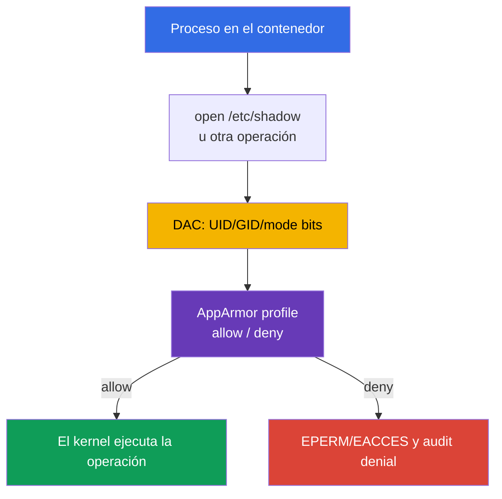

[Русская версия](ru.md) · [Eng version](README.md) · [Version française](fr.md) · [Deutsche Version](de.md) · [ქართული ვერსია](ge.md) · [繁體中文版](tw.md) · [日本語版](jp.md)

# Capítulo 16. AppArmor

> **Problema.** Un shell dentro de un contenedor o un error de la aplicación se vuelven más peligrosos si un proceso
> con el UID o capability adecuado puede leer una ruta sensible, ejecutar un archivo o
> acceder a objetos del kernel permitidos por los permisos habituales de Linux. Sin una policy
> obligatoria, el kernel no limita tales acciones por el propósito del workload, sino solo por el UID.

> **Qué sigue.** En los capítulos 14-15 redujimos la superficie del host y el acceso a él. Ahora
> añadiremos control de acceso obligatorio (mandatory access control, MAC) para los procesos de contenedor: AppArmor permite
> solo las acciones explícitamente descritas sobre archivos, capabilities, red y otros objetos del kernel.
> Este es el dominio **System Hardening** de CKS (10%). En el capítulo siguiente, la misma defensa en profundidad
> se completará con seccomp, que filtra las llamadas al sistema.

> **Qué se necesita de CKA.** El `securityContext` básico, la ejecución non-root, capabilities y
> `allowPrivilegeEscalation` se explican en el [capítulo 20 de CKA](../../../cka/course/20/es.md) y
> se practican en el [laboratorio 106 de CKA](../../../cka/labs/106/README_ES.MD). Aquí, `securityContext`
> sirve como la interfaz de Kubernetes con el profile de AppArmor, y la tarea principal es preparar el profile en
> el nodo, asignarlo a un Pod y demostrar que la prohibición realmente funcionó.

> 🧠 AppArmor es un MAC basado en rutas entre el proceso y el kernel; complementa DAC, capabilities, seccomp y RBAC, pero no sustituye ninguna de estas capas.

## 16.1. AppArmor: policy entre el proceso y el kernel

Los permisos habituales de Linux (DAC) comprueban UID, GID y mode bits. Si un proceso obtiene el
UID o capability adecuado, una sola comprobación DAC puede no ser suficiente. **AppArmor** añade
Mandatory Access Control: el kernel compara la acción del proceso con el profile, e incluso un proceso con
privilegios no puede revocar por sí mismo una denegación de la policy. En Kubernetes hay un caso particular:
un contenedor `privileged` ignora el AppArmor profile asignado y se inicia sin esta
restricción; por ello, privileged no constituye una barrera de AppArmor.



AppArmor es un MAC basado en rutas: las reglas describen rutas y operaciones, por ejemplo lectura `r`, escritura
`w`, adición `a`, `l` (link), `k` (lock), `m` (memory map), así como transiciones de ejecución
`ix`/`px`/`cx`. Las operaciones mount pertenecen a una clase de reglas separada, no a los
permissions de archivos. El profile se aplica al proceso durante `exec` o al iniciar el contenedor; los procesos
hijos normalmente heredan o transitan a la policy según sus reglas. No sustituye UID, capability, seccomp, NetworkPolicy ni
RBAC: cada capa limita una ruta de ataque distinta.

| Capa | Qué pregunta responde | Ejemplo de control |
|---|---|---|
| DAC | ¿tiene UID/GID un permiso habitual sobre el objeto? | owner y `0640` |
| AppArmor | ¿permite el profile esta acción y ruta? | `deny /etc/shadow r,` |
| capabilities | ¿existe un privilegio separado del kernel? | ausencia de `CAP_SYS_ADMIN` |
| seccomp | ¿está permitido el syscall? | `mount(2)` prohibido |
| RBAC | ¿puede la identity invocar la API de Kubernetes? | no tiene `get secrets` |

AppArmor es especialmente común en Ubuntu y Debian. En un nodo orientado a SELinux se
usan labels y type enforcement, no un AppArmor profile. Primero determine el mecanismo real de la imagen
del nodo; no se puede trasladar un profile de AppArmor a SELinux y esperar que se aplique.

> 🎯 Distinga `enforce` y `complain`, cargue el profile en el nodo real, asigne `securityContext.appArmorProfile` y confirme el profile efectivo del proceso.

## 16.2. Profile y modos enforce/complain

Un profile es una policy con nombre único que se carga en el kernel. Los archivos suelen estar en
`/etc/apparmor.d/`, pero lo que hace que un profile esté **activo** no es la presencia del archivo, sino su carga correcta
mediante el parser. Tras reiniciar el nodo, el paquete AppArmor o la configuración administrada
del nodo debe restaurarlo.

Un profile tiene dos modos importantes:

| Modo | Comportamiento | Cuándo usarlo |
|---|---|---|
| `enforce` | se bloquea una operación fuera de la policy; el kernel escribe un denial | modo normal de production tras las pruebas |
| `complain` | se permite la operación, pero la infracción se registra en audit/log | observar la carga real y perfeccionar la policy |

`complain` no es una protección: recopila datos para construir una policy mínima.
Las operaciones no permitidas por el profile normalmente pasan y se registran en este modo, pero
**un `deny` explícito sigue bloqueando** la operación que coincide. No se debe mantener `complain`
como compensación permanente de errores de la aplicación. Tras revisar los permisos,
pase el profile a `enforce` y compruebe el escenario útil junto con la denegación esperada.

Un profile demostrativo mínimo muestra el principio. La regla `/** rix,` es deliberadamente
amplia para que el ejemplo no requiera enumerar cada loader y library; en production se sustituye
por rutas concretas, abstractions y las operaciones necesarias.

```text
# /etc/apparmor.d/k8s-demo
#include <tunables/global>

profile k8s-demo flags=(attach_disconnected,mediate_deleted) {
  #include <abstractions/base>

  /** rix,
  audit deny /etc/shadow r,
}
```

`deny` tiene prioridad sobre una regla permisiva para la operación que coincide. Este profile sirve
solo para un ejercicio aislado: una policy de production comienza con los requisitos del proceso,
directorios readonly/writable, sockets, certificates y transiciones de ejecución explícitas.

## 16.3. Nodo: parser, `aa-status` y ciclo de vida del profile

Para `Localhost`, Kubernetes no transmite el texto del profile al kubelet ni lo copia entre nodos.
Un profile `Localhost` nombrado con el nombre exacto debe cargarse de antemano en el kernel de cada nodo
donde se permita ejecutar el workload. `RuntimeDefault` lo proporciona el container runtime: el usuario
no tiene que entregar de antemano un profile `Localhost` nombrado a `/etc/apparmor.d`.

En el nodo, primero asegúrese de que AppArmor está habilitado; después cargue e inventaríe la policy:

```bash
# En el nodo, no dentro de un Pod habitual.
sudo cat /sys/module/apparmor/parameters/enabled
# Se espera: Y

sudo aa-status
sudo apparmor_status
sudo apparmor_parser -r -W /etc/apparmor.d/k8s-demo
# Presencia y modo efectivo en el kernel; un grep simple de aa-status no demuestra el modo.
sudo aa-status | grep -F 'k8s-demo'
sudo grep -F 'k8s-demo' /sys/kernel/security/apparmor/profiles
```

`aa-status` (sinónimo de `apparmor_status`) muestra si el module está habilitado, cuántos profiles
están cargados y qué procesos se encuentran en enforce/complain. `apparmor_parser` lee la policy y
la entrega al kernel; las operaciones principales se recuerdan cómodamente así:

```bash
# Añadir uno nuevo o sustituir el profile cargado tras modificar el archivo.
sudo apparmor_parser -r -W /etc/apparmor.d/k8s-demo

# Recopilar temporalmente señales de audit sin bloquear; después habilitar el bloqueo.
sudo aa-complain /etc/apparmor.d/k8s-demo
sudo grep -F 'k8s-demo' /sys/kernel/security/apparmor/profiles
sudo aa-enforce /etc/apparmor.d/k8s-demo
sudo grep -F 'k8s-demo' /sys/kernel/security/apparmor/profiles

# Eliminar el profile del kernel solo al retirarlo de forma controlada.
sudo apparmor_parser -R /etc/apparmor.d/k8s-demo
```

`-r` sustituye la versión cargada; `-R` la descarga. `aa-complain` y `aa-enforce`
cambian el modo del profile ya cargado y hacen por sí mismos su reload: no hace falta reiniciar el Pod para
el propio cambio de modo. Antes de eliminarlo, busque los Pod y procesos
que todavía puedan utilizarlo. No edite una policy en un nodo de production al azar: un error
puede impedir que el workload se inicie o romper la aplicación tras el reload. Primero compruebe
la sintaxis y el rollout en un nodo dedicado.

Distinga los flags de `apparmor_parser`: `-p` solo expande `#include` e imprime el resultado; `-Q` compila la policy, pero no la carga en el kernel; `-r` sustituye la versión cargada. Para una comprobación segura, use `-Q -K`, después `-r -W`.

```bash
# -Q compila sin cargar en el kernel; -K prohíbe reutilizar la caché.
# -p no es una comprobación completa de compilación.
sudo apparmor_parser -Q -K /etc/apparmor.d/k8s-demo >/dev/null
sudo apparmor_parser -r -W /etc/apparmor.d/k8s-demo
sudo aa-status
```

`aa-status` muestra el estado en el nodo, no la especificación de Kubernetes. Para un clúster con
varios node pool, compruebe cada pool: el scheduler no conoce el contenido de
`/etc/apparmor.d` y por sí solo no garantiza que el profile `Localhost` esté en el nodo elegido.

## 16.4. API de Kubernetes: `appArmorProfile` actual

La API actual de Kubernetes define el profile mediante
`securityContext.appArmorProfile`. El campo puede estar en el `securityContext` del Pod como baseline para
los contenedores o en el `securityContext` de un contenedor concreto, si necesita una policy más
estrecha. No asigne profiles distintos a un mismo Pod sin necesidad: complica el audit y la
investigación.

| `type` | Valor | Cuándo usarlo |
|---|---|---|
| `RuntimeDefault` | profile suministrado por el container runtime | baseline común seguro, si el runtime y el nodo lo admiten |
| `Localhost` | profile nombrado, cargado de antemano en el nodo | policy verificada y específica de la aplicación |
| `Unconfined` | AppArmor no restringe el contenedor | solo una excepción diagnóstica temporal con un propietario explícito del riesgo |

Un `type: RuntimeDefault` indicado explícitamente requiere AppArmor disponible: sin él, ese Pod no
será admitido. Si no se establece `appArmorProfile`, el runtime default se aplica solo cuando
AppArmor está disponible; de lo contrario, el contenedor se inicia sin una restricción de AppArmor. Por tanto, la ausencia
del campo no equivale a un `RuntimeDefault` explícito.

Para una carga habitual, comience con el runtime profile y otras restricciones básicas:

```yaml
apiVersion: v1
kind: Pod
metadata:
  name: runtime-default-aa
  namespace: demo
spec:
  securityContext:
    appArmorProfile:
      type: RuntimeDefault
  containers:
  - name: app
    image: nginx:1.30.4
    securityContext:
      allowPrivilegeEscalation: false
      capabilities:
        drop: ["ALL"]
```

Para un profile `Localhost` propio se indica exactamente el nombre cargado en el kernel, sin la ruta
`/etc/apparmor.d/` y sin el prefijo legacy `localhost/`:

```yaml
apiVersion: v1
kind: Pod
metadata:
  name: apparmor-localhost
  namespace: demo
spec:
  # La restricción de placement es parte del contrato si el profile no está en todos los nodos.
  nodeSelector:
    kubernetes.io/hostname: worker-1
  securityContext:
    appArmorProfile:
      type: Localhost
      localhostProfile: k8s-demo
  containers:
  - name: app
    image: busybox:1.36.1
    command: ["sh", "-c", "sleep 3600"]
    securityContext:
      allowPrivilegeEscalation: false
      capabilities:
        drop: ["ALL"]
```

Antes de aplicarlo, prepare `k8s-demo` en `worker-1` y, después, espere a que inicie y
compruebe el manifest, placement y el profile efectivo del proceso:

```bash
kubectl apply -f apparmor-localhost.yaml
kubectl wait -n demo --for=condition=Ready pod/apparmor-localhost --timeout=120s
kubectl get pod -n demo apparmor-localhost -o wide
kubectl get pod -n demo apparmor-localhost \
  -o jsonpath='{.spec.securityContext.appArmorProfile}{"\n"}'
kubectl exec -n demo apparmor-localhost -- cat /proc/1/attr/current
```

El último comando confirma bajo qué profile ejecuta el kernel el PID 1 del contenedor; la salida
depende del runtime y puede contener el modo entre paréntesis. Esto es más sólido que comprobar solo
YAML: YAML puede ser correcto, pero el contenedor podría no haber iniciado en un nodo sin el profile.

> 🔬 La anotación beta sirve para reconocer y migrar de forma segura un manifest antiguo; para un workload nuevo use solo `securityContext.appArmorProfile`.

## 16.5. Legacy annotation: leer, migrar, no mezclar

Antes de Kubernetes v1.30, AppArmor se definía por contenedor mediante la anotación beta:

```yaml
metadata:
  annotations:
    container.apparmor.security.beta.kubernetes.io/app: localhost/k8s-demo
```

El valor legacy completo depende del modo: `runtime/default`, `unconfined` o
`localhost/<profile-name>`. La clave debe terminar con el **nombre exacto del contenedor**. Por ejemplo,
para el contenedor `app`, el Pod antiguo tenía este aspecto:

```yaml
apiVersion: v1
kind: Pod
metadata:
  name: apparmor-legacy
  namespace: demo
  annotations:
    container.apparmor.security.beta.kubernetes.io/app: localhost/k8s-demo
spec:
  containers:
  - name: app
    image: busybox:1.36.1
    command: ["sh", "-c", "sleep 3600"]
```

Esta es una interfaz legacy. Para manifest nuevos use `securityContext.appArmorProfile`;
no cree un objeto a la vez con el campo nuevo y la anotación, especialmente con valores diferentes.
Durante la migración, primero averigüe la versión de Kubernetes y el runtime, sustituya la annotation
por el campo de API equivalente, aplíquelo en un nodo de prueba y compruebe `/proc/1/attr/current`.

Una auditoría rápida de objetos antiguos:

```bash
kubectl get pod -A -o json | jq -r '
  .items[]
  | select(.metadata.annotations != null)
  | .metadata.annotations
  | to_entries[]
  | select(.key | startswith("container.apparmor.security.beta.kubernetes.io/"))
  | [.key, .value] | @tsv'

kubectl get pod -A -o jsonpath='{range .items[*]}{.metadata.namespace}{"/"}{.metadata.name}{"\t"}{.spec.securityContext.appArmorProfile}{"\n"}{end}'
```

Un resultado vacío de la auditoría de Pod no demuestra la ausencia de un override a nivel de contenedor ni de una
configuration legacy en un controller. Compruebe además los templates de Deployment, StatefulSet,
DaemonSet, Job y CronJob: para los cuatro primeros, `.spec.template.metadata.annotations`,
`.spec.template.spec.securityContext.appArmorProfile` y los overrides de contenedor; para CronJob,
los mismos campos bajo `.spec.jobTemplate.spec.template`. Durante la migración, corrija el manifest del controller/template,
no solo el Pod creado por él.

> 🎯 Distinga un error de creación del contenedor de un runtime denial; después confirme el nodo, el nombre y la carga del profile, el enforcement efectivo y la evidencia del kernel; no sustituya la causa por `Unconfined`.

## 16.6. Fallo de inicio y denial: diagnosticar en la capa correcta

Un profile `Localhost` tiene dos categorías distintas de problemas.

1. **El contenedor no se crea.** AppArmor está deshabilitado en el nodo, el runtime no admite el
   modo necesario, el nombre del profile no está cargado o el Pod llegó a otro nodo. Esto es un
   lifecycle failure: busque el event del Pod y el estado de kubelet/runtime.
2. **El contenedor funciona, pero se rechaza la acción.** El profile en `enforce` bloquea una ruta,
   capability, red, mount u otro objeto. Esto es un runtime denial: normalmente la aplicación
   recibe `Permission denied`, y el kernel escribe `apparmor="DENIED"`.

Comience con Kubernetes y después pase al nodo real:

```bash
NS=demo
POD=apparmor-localhost

kubectl get pod -n "$NS" "$POD" -o wide
kubectl describe pod -n "$NS" "$POD"
kubectl get events -n "$NS" \
  --field-selector involvedObject.name="$POD" --sort-by=.lastTimestamp
kubectl get pod -n "$NS" "$POD" -o yaml
```

Si el status es `Pending`, `ContainerCreating`, `CreateContainerError` o el contenedor no pasa a
Ready, el evento normalmente muestra el nombre del profile o la causa local del nodo. Obtenga el nodo desde
`-o wide`, conéctese solo con acceso administrativo autorizado y compruebe:

```bash
# En el nodo elegido por el scheduler.
sudo aa-status
sudo aa-status | grep -F 'k8s-demo'
sudo journalctl -u kubelet --since '15 minutes ago'
if command -v ausearch >/dev/null 2>&1 && sudo systemctl is-active --quiet auditd; then
  sudo ausearch -m AVC,USER_AVC -ts recent | grep -F 'apparmor=' || true
elif sudo test -r /var/log/audit/audit.log; then
  sudo grep -F 'apparmor=' /var/log/audit/audit.log || true
else
  sudo journalctl -k --since '15 minutes ago' | grep -Ei 'apparmor|denied' || true
  sudo dmesg --level=err,warn | grep -Ei 'apparmor|denied' || true
fi
```

No trate ese fallo sustituyendo `Localhost` por `Unconfined` o `privileged: true`. Primero
compare el tipo y el nombre en el Pod manifestado, node name, `aa-status`, la versión del runtime y el método de entrega
del profile. Si el profile debe existir solo en un pool concreto, fije el workload mediante
`nodeSelector`, affinity o un label de confianza, y proteja el propio label con el proceso de gestión
de nodos.

## 16.7. Comprobación de enforce y complain

Compruebe el modo efectivo del proceso, no solo la presencia del nombre en `aa-status`. `audit deny
/etc/shadow r,` bloquea también en `complain`, por lo que es una prueba de un explicit deny auditado, no una
demostración de `enforce`. Para la comprobación de modo use una escritura implícitamente prohibida: el profile no
concede write en `/`.

```bash
kubectl exec -n demo apparmor-localhost -- cat /proc/1/attr/current
# Se espera: k8s-demo (enforce)
kubectl exec -n demo apparmor-localhost -- touch /aa-mode-probe-enforce
# Se espera Permission denied: denegación implícita en enforce.
kubectl exec -n demo apparmor-localhost -- cat /etc/shadow
# Se espera Permission denied y evidencia de audit: audit deny.

sudo aa-complain /etc/apparmor.d/k8s-demo
sudo grep -F 'k8s-demo' /sys/kernel/security/apparmor/profiles
kubectl exec -n demo apparmor-localhost -- cat /proc/1/attr/current
# Se espera: k8s-demo (complain)
kubectl exec -n demo apparmor-localhost -- touch /aa-mode-probe-complain
# Se espera éxito y telemetría ALLOWED/complain.
kubectl exec -n demo apparmor-localhost -- cat /etc/shadow
# Permission denied: el audit deny explícito también se aplica en complain.
sudo aa-enforce /etc/apparmor.d/k8s-demo
```

Para obtener evidencia, primero compruebe el audit subsystem (`ausearch` con auditd activo, después
`/var/log/audit/audit.log`); `journalctl -k` y `dmesg` son fallback. Si las fuentes no están disponibles,
es `REVIEW_REQUIRED`, no una prueba de ausencia de denial.


## 16.8. Cómo será útil: en el examen y en el trabajo real

**En el examen.** Determine rápidamente el nodo, compruebe `aa-status`, cargue o sustituya el
profile requerido mediante `apparmor_parser`, páselo a `aa-enforce`/`aa-complain` según la
condición y defina el Pod con el `appArmorProfile` actual. Tras aplicarlo, no mire solo
YAML: `kubectl describe pod`, `/proc/1/attr/current` y la evidencia de audit de AppArmor consciente de la fuente
distinguen un error de scheduling/entrega de profile de un denial real. Busque el denial ante todo
mediante `ausearch` con auditd activo o `/var/log/audit/audit.log`; use `journalctl -k` y `dmesg`
como fallback del nodo concreto. Reconozca la annotation antigua, pero
úsela solo si la tarea exige explícitamente compatibilidad legacy.

**En el trabajo real.** AppArmor reduce las consecuencias de un proceso vulnerable solo cuando la
policy se entrega a todos los nodos necesarios, refleja el contrato real de la aplicación y se
observa. El rollout automático del profile, un periodo corto de complain, la revisión de nuevos
permisos y una alerta sobre `DENIED` crean una boundary verificable en lugar de «un archivo de policy en algún lugar del
nodo».

> 🎯 Saber diagnosticar por qué un profile de AppArmor no se aplicó o por qué el workload no se inicia.

### 16.8.1. Troubleshooting: «El profile no funciona porque…»

A continuación, `NS`, `POD` y `CTR` designan el namespace, Pod y contenedor. Primero averigüe siempre
el nodo real: diagnosticar AppArmor en otro nodo no demuestra nada sobre el contenedor.

#### El profile no está cargado en el nodo donde el scheduler colocó el Pod

En un clúster multi-node, `apparmor_parser` podría haberse ejecutado correctamente en `worker-1`, pero el Pod
acabó en `worker-2`. Kubernetes no transfiere el profile entre nodos y el scheduler no lee el
contenido de la policy del kernel. Como resultado, `Localhost` normalmente produce un error de creación del contenedor,
o el rollout solo funciona en parte de las réplicas.

```bash
NS=demo
POD=apparmor-localhost

kubectl get pod -n "$NS" "$POD" -o wide
kubectl describe pod -n "$NS" "$POD"
# Conéctese exactamente al nodo de la columna NODE.
sudo aa-status | grep -F 'k8s-demo'
sudo journalctl -u kubelet --since '15 minutes ago'
```

Corrección: entregue y cargue el profile mediante `sudo apparmor_parser -r -W` en cada
nodo del pool permitido antes del rollout, o fije el Pod con `nodeSelector`/affinity al pool con
entrega administrada. No lo corrija sustituyendo `Localhost` por `Unconfined`.

#### El nombre en el manifest no coincide con el nombre dentro del profile

`localhostProfile` y el valor legacy `localhost/<name>` hacen referencia al nombre declarado en
el propio profile, no necesariamente al nombre de archivo. Para el archivo `/etc/apparmor.d/k8s-demo` es
precisamente la línea `profile k8s-demo {`; una entrada `profile web-app {` requiere
`localhostProfile: web-app`, aunque el nombre de archivo siga siendo `k8s-demo`.

```bash
# En el nodo real: compare el nombre en la policy con el nombre realmente cargado.
sudo grep -nE '^[[:space:]]*profile[[:space:]]+' /etc/apparmor.d/k8s-demo
sudo aa-status | grep -F 'k8s-demo'
sudo aa-status | grep -F 'web-app'

# En Kubernetes: compruebe tanto la API nueva como la annotation legacy durante la migración.
kubectl get pod -n "$NS" "$POD" \
  -o jsonpath='{.spec.securityContext.appArmorProfile.localhostProfile}{"\n"}'
kubectl describe pod -n "$NS" "$POD"
```

Corrección: lleve a un mismo nombre exacto la declaration, `localhostProfile` y, si todavía
se utiliza, la annotation legacy. Después haga reload del profile mediante `apparmor_parser -r -W` y
cree un Pod nuevo; el proceso antiguo no demuestra la asignación de la policy corregida.

#### En `complain` la aplicación funciona, y en `enforce` recibe `Permission denied`

Normalmente falta en la policy el `allow` necesario para una ruta u operación, por ejemplo un directorio de
runtime, un certificate, un Unix-socket o un archivo que la aplicación lee solo después del
inicio. En `complain`, la ausencia de allow normalmente solo se registra; en `enforce`, se
bloquea. Un `deny` explícito es distinto: bloquea también en `complain`, así que no lo elimine
para comprobarlo.

```bash
# En el nodo real después de un probe controlado: auditd/audit.log primero; journal/dmesg como fallback.
sudo aa-status | grep -F 'k8s-demo'
if command -v ausearch >/dev/null 2>&1 && sudo systemctl is-active --quiet auditd; then
  sudo ausearch -m AVC,USER_AVC -ts recent | grep -E 'apparmor="DENIED"|profile="k8s-demo"' || true
elif sudo test -r /var/log/audit/audit.log; then
  sudo grep -E 'apparmor="DENIED"|profile="k8s-demo"' /var/log/audit/audit.log || true
else
  # El registro del kernel es un fallback válido cuando auditd/audit.log no está disponible.
  if sudo journalctl -k --since '10 minutes ago' >/dev/null 2>&1; then
    sudo journalctl -k --since '10 minutes ago' | \
      grep -E 'apparmor="DENIED"|profile="k8s-demo"' || true
  elif sudo dmesg >/dev/null 2>&1; then
    sudo dmesg | grep -i apparmor || true
  else
    echo 'REVIEW_REQUIRED: no readable AppArmor audit source' >&2
  fi
fi

# En Kubernetes, fije el contenedor y el síntoma observado.
kubectl describe pod -n "$NS" "$POD"
kubectl logs -n "$NS" "$POD" -c "$CTR" --tail=100
```

Corrección: relacione `operation=` y `name=` del denial con el contrato de la aplicación,
añada una regla allow mínima y justificada en un nodo de prueba, compruebe escenarios positivo y negativo,
y solo entonces habilite `aa-enforce`. No añada un `/** rw,` amplio ni pase un workload de production a
`complain` indefinido.

#### El nodo o el runtime no admite AppArmor, o el profile solo está en un archivo

AppArmor requiere un kernel Linux con LSM habilitado y activo; en un nodo no Linux, un
kernel sin AppArmor o un runtime sin soporte, asignar el profile no se convertirá en una barrera funcional.
Además, kubelet **no** escanea el directorio ni carga la policy de AppArmor: un archivo en
`/etc/apparmor.d/` por sí solo es inútil hasta que `apparmor_parser` lo haya entregado al kernel.
Compruebe esto antes de buscar el error en YAML.

```bash
# En el nodo real.
uname -s
sudo cat /sys/module/apparmor/parameters/enabled 2>/dev/null || true
sudo aa-status
sudo dmesg | grep -i apparmor || true
sudo journalctl -k --since '15 minutes ago' | grep -Ei 'apparmor|lsm' || true
sudo journalctl -u kubelet --since '15 minutes ago'

# El event de Kubernetes suele indicar un runtime no admitido o un profile no cargado.
kubectl describe pod -n "$NS" "$POD"
```

Corrección: use un Linux node pool con AppArmor habilitado y un runtime compatible, o no
declare AppArmor como un control obligatorio en esa plataforma. Para un nodo compatible,
mantenga el archivo en una configuración administrada y cárguelo explícitamente con `apparmor_parser` en cada nodo
objetivo; no considere el directorio de kubelet como un mecanismo de entrega de policy.

> ### 🔴 Perspectiva del atacante
> **Asset:** host filesystem y syscalls accesibles al contenedor.
>
> **Starting foothold:** RCE en el contenedor.
>
> **Attacker objective:** realizar una acción fuera de la aplicación: acceder a un path protegido o ejecutar un syscall prohibido.
>
> **Abuse path:** intentar salir de los límites del profile si está cargado, nombrado incorrectamente o se encuentra en `complain` en lugar de `enforce`.
>
> **Expected evidence:** AppArmor profile efectivo y un evento denial en una fuente de audit disponible:
> `ausearch`/`audit.log` o `journalctl -k`/`dmesg` como fallback.
>
> **Control:** profile verificado en modo `enforce` y comprobación mediante `aa-status`.
>
> **Retest:** la operación prohibida sigue bloqueada después de la corrección.

## 16.9. Preguntas de autoevaluación

<details>
<summary>1. ¿Por qué AppArmor no sustituye UID/GID, capabilities, seccomp ni RBAC?</summary>

Estos controles responden a preguntas diferentes: DAC comprueba UID/GID y mode bits, capabilities son privilegios separados del kernel, seccomp son los syscalls permitidos, y RBAC es el acceso de la identity a la API de Kubernetes. AppArmor añade MAC basado en rutas para las acciones del proceso según el profile. Por ello, el profile complementa, pero no elimina la necesidad de non-root, dropped capabilities, seccomp y RBAC mínimo.
</details>

<details>
<summary>2. ¿En qué se diferencia `enforce` de `complain`, y por qué el segundo modo no puede considerarse protección?</summary>

En `enforce`, una operación fuera de la policy se bloquea y el kernel registra un denial. En `complain`, la operación no permitida normalmente se ejecuta y se registra, para reunir los requisitos reales de la aplicación; un `deny` explícito continúa bloqueando de todos modos la coincidencia. Este modo es útil temporalmente para perfeccionar la policy, pero no es una barrera de protección permanente.
</details>

<details>
<summary>3. ¿Cómo demuestran `aa-status` y `apparmor_parser -r` partes distintas del estado del profile?</summary>

`aa-status` muestra el estado de AppArmor en el nodo: module habilitado, profiles cargados, sus modos y procesos. `apparmor_parser -r -W <file>` lee sintácticamente la policy y añade o sustituye su versión cargada en el kernel. La presencia del archivo por sí sola no demuestra nada; después del parser hay que confirmar el nombre y el modo con `aa-status`.
</details>

<details>
<summary>4. ¿Por qué un profile `Localhost` puede producir `CreateContainerError` tras un
   `kubectl apply` correcto?</summary>

`kubectl apply` acepta el manifest, pero el container runtime puede aplicar `Localhost` solo si el profile con el nombre exacto ya está cargado en el kernel del nodo elegido por el scheduler. El profile puede faltar en ese nodo, AppArmor/runtime puede no admitir el modo necesario o el Pod puede llegar a otro node pool. La causa se busca en `kubectl describe pod`, los eventos, el nodo real, `aa-status` y los logs de kubelet.
</details>

<details>
<summary>5. ¿Qué valores de `appArmorProfile.type` están permitidos y cuándo está justificado `Unconfined`?</summary>

Se permiten `RuntimeDefault`, `Localhost` y `Unconfined`. `RuntimeDefault` sirve como baseline común con AppArmor disponible, y `Localhost` para un profile verificado y específico de la aplicación, cargado de antemano en el nodo. `Unconfined` solo se justifica como excepción diagnóstica temporal con un propietario explícito del riesgo, no como forma de corregir un profile failure.
</details>

<details>
<summary>6. ¿Cómo se escribe la legacy AppArmor annotation para un contenedor llamado `app` y un profile
   `k8s-demo`?</summary>

La clave debe terminar en el nombre exacto del contenedor, y para Localhost el valor recibe el prefijo legacy. En este caso, la entrada es: `container.apparmor.security.beta.kubernetes.io/app: localhost/k8s-demo`. Es una anotación beta para audit y migración; en manifest nuevos se usa `securityContext.appArmorProfile` y no se mezclan ambas interfaces.
</details>

<details>
<summary>7. ¿Qué comandos demostrarán simultáneamente el nodo elegido, el profile efectivo del proceso y
   la acción bloqueada?</summary>

El nodo elegido lo muestra `kubectl get pod -n demo apparmor-localhost -o wide`, y en ese nodo la presencia del profile se comprueba con `sudo aa-status | grep -F 'k8s-demo'`. El profile efectivo de PID 1 se confirma con `kubectl exec -n demo apparmor-localhost -- cat /proc/1/attr/current`. La denegación se comprueba con `kubectl exec ... -- cat /etc/shadow`, esperando `Permission denied` y el evento de audit de AppArmor correspondiente en la fuente de ese nodo: auditd/`audit.log` o el journal del kernel como fallback.
</details>

<details>
<summary>8. **Flashback (capítulo 18).** PSA `restricted` del capítulo 18 exige `RuntimeDefault`/
   `Localhost` para seccomp, pero **no** exige un AppArmor profile concreto más allá de
   `RuntimeDefault`/default no deshabilitado. ¿Dónde termina exactamente lo que comprueba el
   PSA incorporado y empieza la zona que solo puede cubrir un profile `Localhost` AppArmor
   asignado explícitamente de este capítulo?</summary>

PSA comprueba la admisibilidad del Pod-spec según el estándar incorporado, incluido un AppArmor default no deshabilitado y `RuntimeDefault`/`Localhost` para seccomp, pero no modela el contrato de rutas y operaciones de una aplicación concreta. No entrega ni comprueba una policy de AppArmor nombrada local del nodo. Un profile `Localhost` explícito cubre esta zona siguiente: kernel enforce de rutas permitidas concretas, file operations, capabilities, reglas de red o mount en el nodo elegido.
</details>

## Práctica

Primero practique `securityContext`, la ejecución non-root y capabilities en el
[laboratorio 106 de CKA](../../../cka/labs/106/README_ES.MD): es un prerequisite, no la práctica
principal del tema del capítulo. Después, en un nodo de prueba cree el profile `k8s-demo`, cárguelo mediante
`apparmor_parser`, asigne un Pod con `appArmorProfile.type: Localhost` y compare el comportamiento
en `complain` y `enforce`. En el siguiente [capítulo 17](../17/es.md) añada seccomp: AppArmor
restringirá los objetos y operaciones del profile, y seccomp el conjunto de syscalls disponible para el proceso.

🧪 Práctica principal de CKS: [Laboratorio 106 - AppArmor y seccomp](../../labs/106/README_ES.MD)

📘 Prerequisite / práctica auxiliar (SecurityContext y capabilities):
[tasks/cka/labs/106](../../../cka/labs/106/README_ES.MD)
🌐 Práctica interactiva adicional (killer.sh/killercoda, recurso externo): [apparmor](https://killercoda.com/killer-shell-cks/scenario/apparmor)

## Enlaces

- [Kubernetes: Restrict a Container's Access to Resources with AppArmor](https://kubernetes.io/docs/tutorials/security/apparmor/)
- [Kubernetes API: AppArmorProfile](https://kubernetes.io/docs/reference/kubernetes-api/workload-resources/pod-v1/#AppArmorProfile)
- [AppArmor: documentación oficial](https://apparmor.net/)
- [Proyecto AppArmor: Wiki](https://gitlab.com/apparmor/apparmor/-/wikis/home)
- [Kubernetes: Pod Security Standards](https://kubernetes.io/docs/concepts/security/pod-security-standards/)

---
[Índice](../README_ES.md) · [Capítulo 15](../15/es.md) · [Capítulo 17](../17/es.md)
