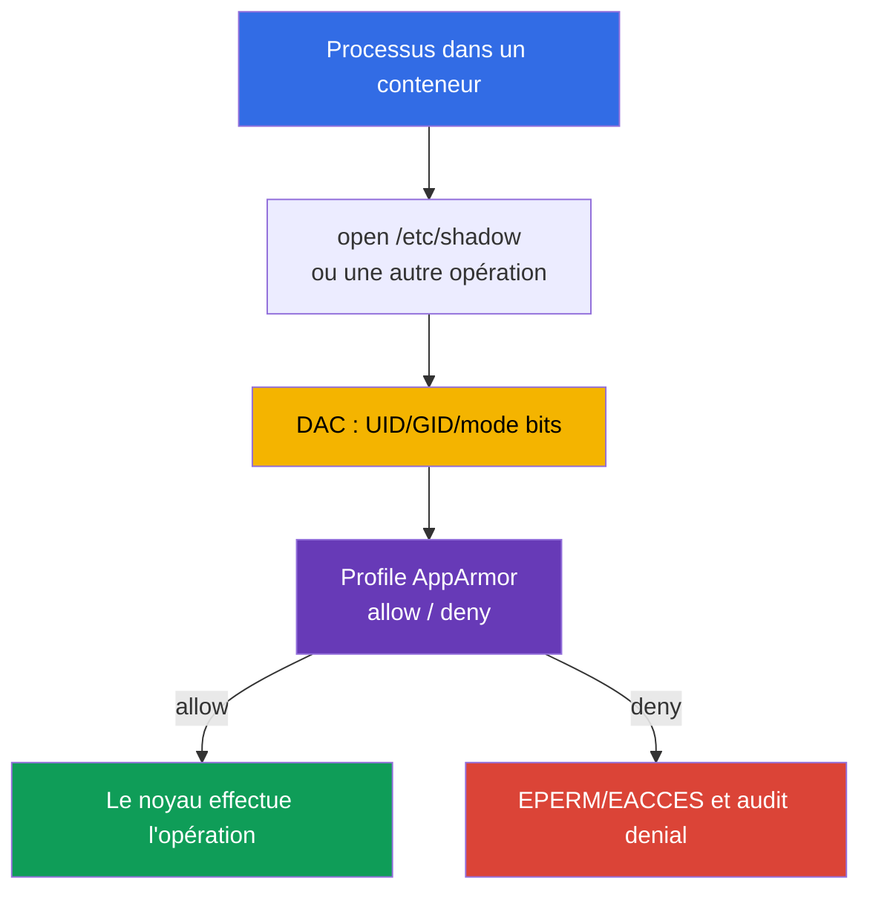

[Русская версия](ru.md) · [Eng version](README.md) · [Versión en español](es.md) · [Deutsche Version](de.md) · [ქართული ვერსია](ge.md) · [繁體中文版](tw.md) · [日本語版](jp.md)

# Chapitre 16. AppArmor

> **Le problème.** Un shell dans un conteneur ou une erreur d'application devient plus dangereux lorsqu'un processus
> doté d'un UID ou d'une capability appropriée peut lire un chemin sensible, exécuter un fichier ou
> accéder à des objets du noyau autorisés par les permissions Linux ordinaires. Sans policy
> obligatoire, le noyau ne limite pas ces actions selon la finalité du workload, mais uniquement selon l'UID.

> **La suite.** Dans les chapitres 14-15, nous avons réduit la surface de l'hôte et l'accès à celui-ci. Ajoutons maintenant
> le contrôle d'accès obligatoire (mandatory access control, MAC) aux processus de conteneur : AppArmor n'autorise
> que les actions explicitement décrites sur les fichiers, les capabilities, le réseau et les autres objets du noyau.
> C'est le domaine **System Hardening** de CKS (10 %). Dans le chapitre suivant, la même defence-in-depth
> sera complétée par seccomp, qui filtre les appels système.

> **Ce qu'il faut connaître de CKA.** Le `securityContext` de base, l'exécution non-root, les capabilities et
> `allowPrivilegeEscalation` sont présentés dans le [chapitre 20 de CKA](../../../cka/course/20/fr.md) et
> mis en pratique dans le [lab 106 de CKA](../../../cka/labs/106/README_FR.MD). Ici, `securityContext`
> sert d'interface Kubernetes avec un profile AppArmor, et la tâche principale consiste à préparer un profile sur
> la node, à l'assigner à un Pod et à démontrer que le refus a effectivement eu lieu.

> 🧠 AppArmor est un MAC fondé sur les chemins entre le processus et le noyau ; il complète DAC, capabilities, seccomp et RBAC, mais ne remplace aucune de ces couches.

## 16.1. AppArmor : une policy entre le processus et le noyau

Les permissions Linux ordinaires (DAC) vérifient l'UID, le GID et les mode bits. Si un processus a obtenu un
UID ou une capability appropriée, une vérification DAC seule peut ne pas suffire. **AppArmor** ajoute
un Mandatory Access Control : le noyau compare l'action du processus au profile, et même un processus
privilégié ne peut pas annuler lui-même un refus de policy. Kubernetes comporte un cas particulier :
un conteneur `privileged` ignore le profile AppArmor qui lui est assigné et démarre sans cette
restriction ; privileged n'est donc pas une barrière AppArmor.



AppArmor est un MAC fondé sur les chemins : les règles décrivent les chemins et les opérations, par exemple la lecture `r`, l'écriture
`w`, l'ajout `a`, `l` (link), `k` (lock), `m` (memory map), ainsi que les transitions d'exécution
`ix`/`px`/`cx`. Les opérations mount appartiennent à une classe de règles distincte, et non aux
permissions de fichiers. Un profile est appliqué au processus lors de `exec` ou au démarrage du conteneur ; les processus
enfants l'héritent normalement ou passent dans une policy conformément à ses règles. Ce n'est pas un remplacement de l'UID,
de la capability, de seccomp, de NetworkPolicy ou de RBAC : chaque couche limite un chemin d'attaque différent.

| Couche | Question à laquelle elle répond | Exemple de contrôle |
|---|---|---|
| DAC | L'UID/GID possède-t-il le droit ordinaire sur l'objet ? | owner et `0640` |
| AppArmor | Le profile autorise-t-il cette action et ce chemin ? | `deny /etc/shadow r,` |
| capabilities | La capacité distincte du noyau est-elle présente ? | absence de `CAP_SYS_ADMIN` |
| seccomp | Le syscall est-il autorisé ? | `mount(2)` est interdit |
| RBAC | L'identity peut-elle appeler l'API Kubernetes ? | pas de `get secrets` |

AppArmor est particulièrement répandu sur Ubuntu et Debian. Une node orientée SELinux utilise
des labels et le type enforcement plutôt que des profiles AppArmor. Commencez par identifier le mécanisme réel
de l'image de node ; vous ne pouvez pas déplacer un profile AppArmor vers SELinux et vous attendre à son application.

> 🎯 Distinguez `enforce` de `complain`, chargez le profile sur la node réelle, assignez `securityContext.appArmorProfile` et confirmez le profile effectif du processus.

## 16.2. Profile et modes enforce/complain

Un profile est une policy portant un nom unique, chargée dans le kernel. Les fichiers se trouvent généralement dans
`/etc/apparmor.d/`, mais la présence d'un fichier ne rend pas le profile **actif** : seule une charge réussie
par le parser le fait. Après le redémarrage d'une node, le package AppArmor ou la configuration gérée de la node
doit le restaurer.

Un profile possède deux modes importants :

| Mode | Comportement | Quand l'utiliser |
|---|---|---|
| `enforce` | une opération hors de la policy est bloquée ; le kernel écrit un denial | mode production normal après test |
| `complain` | l'opération est autorisée, mais la violation est enregistrée dans audit/log | observation de la charge réelle et amélioration de la policy |

`complain` n'est pas une protection : il collecte les données nécessaires pour construire une policy minimale.
Les opérations non autorisées par le profile sont normalement laissées passer et journalisées dans ce mode, mais
un **`deny` explicite continue de bloquer** l'opération correspondante. Ne laissez pas `complain`
compenser durablement les erreurs de l'application. Après avoir revu les permissions,
passez le profile à `enforce` et vérifiez le scénario utile avec le refus attendu.

Le profile de démonstration minimal montre le principe. La règle `/** rix,` est volontairement
large, afin que l'exemple n'exige pas d'énumérer chaque loader et chaque library ; en production, elle est remplacée
par des chemins précis, des abstractions et les opérations nécessaires.

```text
# /etc/apparmor.d/k8s-demo
#include <tunables/global>

profile k8s-demo flags=(attach_disconnected,mediate_deleted) {
  #include <abstractions/base>

  /** rix,
  audit deny /etc/shadow r,
}
```

`deny` a priorité sur une règle d'autorisation pour une opération correspondante. Ce profile ne convient
qu'à un exercice isolé : une policy de production commence par les exigences du processus,
les répertoires readonly/writable, les sockets, les certificats et les transitions d'exécution explicites.

## 16.3. Node : parser, `aa-status` et cycle de vie du profile

Pour `Localhost`, Kubernetes ne transmet pas le texte du profile à kubelet et ne le copie pas entre les nodes.
Un profile `Localhost` nommé, avec un nom exact, doit être chargé à l'avance dans le kernel de chaque node
où l'exécution du workload est autorisée. `RuntimeDefault` est fourni par le container runtime : l'utilisateur
n'a pas besoin de livrer à l'avance un profile `Localhost` nommé dans `/etc/apparmor.d`.

Sur la node, vérifiez d'abord qu'AppArmor est activé, puis chargez et inventoriez la policy :

```bash
# Sur la node, et non dans un Pod ordinaire.
sudo cat /sys/module/apparmor/parameters/enabled
# Résultat attendu : Y

sudo aa-status
sudo apparmor_status
sudo apparmor_parser -r -W /etc/apparmor.d/k8s-demo
# Présence et mode effectif dans le kernel ; aa-status grep seul ne prouve pas le mode.
sudo aa-status | grep -F 'k8s-demo'
sudo grep -F 'k8s-demo' /sys/kernel/security/apparmor/profiles
```

`aa-status` (synonyme de `apparmor_status`) indique si le module est activé, combien de profiles sont
chargés et quels processus sont en enforce/complain. `apparmor_parser` lit la policy et la transmet au
kernel ; il est pratique de retenir les opérations principales ainsi :

```bash
# Ajouter un nouveau profile ou remplacer le profile chargé après modification du fichier.
sudo apparmor_parser -r -W /etc/apparmor.d/k8s-demo

# Collecter temporairement les signaux audit sans blocage, puis activer le blocage.
sudo aa-complain /etc/apparmor.d/k8s-demo
sudo grep -F 'k8s-demo' /sys/kernel/security/apparmor/profiles
sudo aa-enforce /etc/apparmor.d/k8s-demo
sudo grep -F 'k8s-demo' /sys/kernel/security/apparmor/profiles

# Retirer le profile du kernel uniquement pendant une mise hors service contrôlée.
sudo apparmor_parser -R /etc/apparmor.d/k8s-demo
```

`-r` remplace la version chargée ; `-R` la décharge. `aa-complain` et `aa-enforce`
basculent le mode d'un profile déjà chargé et effectuent eux-mêmes son reload : il n'est pas nécessaire de redémarrer le Pod
pour le seul changement de mode. Avant le retrait, trouvez les Pod et les processus
qui peuvent encore l'utiliser. Ne modifiez pas une policy à l'aveugle sur une node de production : une erreur
peut empêcher le workload de démarrer ou casser l'application après reload. Vérifiez d'abord la
syntaxe et le rollout sur une node dédiée.

Distinguez les flags de `apparmor_parser` : `-p` ne développe que `#include` et affiche le résultat ; `-Q` compile la
policy, mais ne la charge pas dans le kernel ; `-r` remplace la version chargée. Pour une vérification
sûre, utilisez `-Q -K`, puis `-r -W`.

```bash
# -Q compile sans charger dans le kernel ; -K interdit la réutilisation du cache.
# -p n'est pas une vérification complète de compilation.
sudo apparmor_parser -Q -K /etc/apparmor.d/k8s-demo >/dev/null
sudo apparmor_parser -r -W /etc/apparmor.d/k8s-demo
sudo aa-status
```

`aa-status` montre l'état de la node, et non la spécification Kubernetes. Pour un cluster comportant
plusieurs node pools, contrôlez chaque pool : scheduler ne connaît pas le contenu de
`/etc/apparmor.d` et ne garantit pas à lui seul que le profile `Localhost` est présent sur la node choisie.

## 16.4. API Kubernetes : `appArmorProfile` actuel

L'API Kubernetes actuelle définit le profile avec
`securityContext.appArmorProfile`. Le champ peut figurer dans le `securityContext` du Pod comme baseline pour les
conteneurs ou dans le `securityContext` d'un conteneur spécifique s'il requiert une policy plus étroite. N'assignez
pas différents profiles à un même Pod sans nécessité : cela complique audit et investigation.

| `type` | Valeur | Quand l'utiliser |
|---|---|---|
| `RuntimeDefault` | profile fourni par le container runtime | baseline général sûr, si runtime et node le prennent en charge |
| `Localhost` | profile nommé, chargé à l'avance sur la node | policy vérifiée et spécifique à l'application |
| `Unconfined` | AppArmor ne restreint pas le conteneur | exception temporaire de diagnostic uniquement, avec un propriétaire de risque explicite |

Un `type: RuntimeDefault` indiqué explicitement requiert un AppArmor disponible : sans lui, ce Pod ne
sera pas admis. Si `appArmorProfile` n'est pas défini, le runtime default n'est appliqué que lorsqu'AppArmor
est disponible ; sinon le conteneur démarre sans restriction AppArmor. L'absence du champ n'est donc pas
équivalente à un `RuntimeDefault` explicite.

Pour une charge ordinaire, commencez par le profile runtime et les autres restrictions de base :

```yaml
apiVersion: v1
kind: Pod
metadata:
  name: runtime-default-aa
  namespace: demo
spec:
  securityContext:
    appArmorProfile:
      type: RuntimeDefault
  containers:
  - name: app
    image: nginx:1.30.4
    securityContext:
      allowPrivilegeEscalation: false
      capabilities:
        drop: ["ALL"]
```

Pour un profile `Localhost` propre, indiquez précisément le nom chargé dans le kernel, sans le chemin
`/etc/apparmor.d/` ni le préfixe legacy `localhost/` :

```yaml
apiVersion: v1
kind: Pod
metadata:
  name: apparmor-localhost
  namespace: demo
spec:
  # La contrainte de placement fait partie du contrat si le profile n'est pas sur toutes les nodes.
  nodeSelector:
    kubernetes.io/hostname: worker-1
  securityContext:
    appArmorProfile:
      type: Localhost
      localhostProfile: k8s-demo
  containers:
  - name: app
    image: busybox:1.36.1
    command: ["sh", "-c", "sleep 3600"]
    securityContext:
      allowPrivilegeEscalation: false
      capabilities:
        drop: ["ALL"]
```

Avant l'application, préparez `k8s-demo` sur `worker-1`, puis - après - attendez le démarrage et
vérifiez le manifest, le placement et le profile effectif du processus :

```bash
kubectl apply -f apparmor-localhost.yaml
kubectl wait -n demo --for=condition=Ready pod/apparmor-localhost --timeout=120s
kubectl get pod -n demo apparmor-localhost -o wide
kubectl get pod -n demo apparmor-localhost \
  -o jsonpath='{.spec.securityContext.appArmorProfile}{"\n"}'
kubectl exec -n demo apparmor-localhost -- cat /proc/1/attr/current
```

La dernière commande confirme sous quel profile le kernel exécute le PID 1 du conteneur ; la sortie
dépend du runtime et peut contenir le mode entre parenthèses. C'est plus solide que de vérifier le YAML seul :
le YAML peut être correct, mais le conteneur peut ne pas avoir démarré sur une node sans profile.

> 🔬 L'annotation beta permet de reconnaître et de migrer sans risque un ancien manifest ; pour un nouveau workload, utilisez uniquement `securityContext.appArmorProfile`.

## 16.5. Legacy annotation : lire, migrer, ne pas mélanger

Avant Kubernetes v1.30, AppArmor était défini par conteneur avec une annotation beta :

```yaml
metadata:
  annotations:
    container.apparmor.security.beta.kubernetes.io/app: localhost/k8s-demo
```

La valeur legacy complète dépend du mode : `runtime/default`, `unconfined` ou
`localhost/<profile-name>`. La clé doit se terminer par le **nom exact du conteneur**. Par exemple,
pour le conteneur `app`, l'ancien Pod ressemblait à ceci :

```yaml
apiVersion: v1
kind: Pod
metadata:
  name: apparmor-legacy
  namespace: demo
  annotations:
    container.apparmor.security.beta.kubernetes.io/app: localhost/k8s-demo
spec:
  containers:
  - name: app
    image: busybox:1.36.1
    command: ["sh", "-c", "sleep 3600"]
```

Ceci est une interface legacy. Pour les nouveaux manifest, utilisez `securityContext.appArmorProfile` ;
ne créez pas un objet avec le nouveau champ et l'annotation en même temps, en particulier avec des
valeurs différentes. Lors de la migration, identifiez d'abord la version de Kubernetes et le runtime, remplacez l'annotation
par le champ API équivalent, appliquez sur une node de test et vérifiez `/proc/1/attr/current`.

Audit rapide des anciens objets :

```bash
kubectl get pod -A -o json | jq -r '
  .items[]
  | select(.metadata.annotations != null)
  | .metadata.annotations
  | to_entries[]
  | select(.key | startswith("container.apparmor.security.beta.kubernetes.io/"))
  | [.key, .value] | @tsv'

kubectl get pod -A -o jsonpath='{range .items[*]}{.metadata.namespace}{"/"}{.metadata.name}{"\t"}{.spec.securityContext.appArmorProfile}{"\n"}{end}'
```

Un résultat vide de l'audit des Pod ne prouve pas l'absence de container-level override ou de configuration legacy
dans un controller. Vérifiez en plus les templates de Deployment, StatefulSet,
DaemonSet, Job et CronJob : pour les quatre premiers - `.spec.template.metadata.annotations`,
`.spec.template.spec.securityContext.appArmorProfile` et les overrides de conteneur ; pour CronJob -
les mêmes champs sous `.spec.jobTemplate.spec.template`. Lors de la migration, corrigez le manifest du controller/template,
et non seulement le Pod qu'il a créé.

> 🎯 Distinguez l'erreur de création du conteneur d'un runtime denial, puis confirmez la node, le nom et le chargement du profile, l'enforcement effectif et la preuve du kernel ; ne remplacez pas la cause par `Unconfined`.

## 16.6. Échec de démarrage et denial : diagnostiquer à la bonne couche

Avec un profile `Localhost`, il existe deux catégories de dysfonctionnement distinctes.

1. **Le conteneur n'est pas créé.** AppArmor est désactivé sur la node, le runtime ne prend pas en charge le
   mode requis, le profile nommé n'est pas chargé ou le Pod est arrivé sur une autre node. C'est un lifecycle failure :
   cherchez l'event du Pod et l'état de kubelet/runtime.
2. **Le conteneur fonctionne, mais l'action est refusée.** Le profile en `enforce` bloque un chemin,
   une capability, le réseau, un mount ou un autre objet. C'est un runtime denial : l'application
   reçoit normalement `Permission denied`, et le kernel écrit `apparmor="DENIED"`.

Commencez par Kubernetes, puis passez à la node réelle :

```bash
NS=demo
POD=apparmor-localhost

kubectl get pod -n "$NS" "$POD" -o wide
kubectl describe pod -n "$NS" "$POD"
kubectl get events -n "$NS" \
  --field-selector involvedObject.name="$POD" --sort-by=.lastTimestamp
kubectl get pod -n "$NS" "$POD" -o yaml
```

Si status est `Pending`, `ContainerCreating`, `CreateContainerError` ou si le conteneur n'est pas devenu
Ready, l'event indique généralement le nom du profile ou la cause node-local. Obtenez la node avec
`-o wide`, connectez-vous uniquement avec un accès administratif autorisé et vérifiez :

```bash
# Sur la node choisie par scheduler.
sudo aa-status
sudo aa-status | grep -F 'k8s-demo'
sudo journalctl -u kubelet --since '15 minutes ago'
if command -v ausearch >/dev/null 2>&1 && sudo systemctl is-active --quiet auditd; then
  sudo ausearch -m AVC,USER_AVC -ts recent | grep -F 'apparmor=' || true
elif sudo test -r /var/log/audit/audit.log; then
  sudo grep -F 'apparmor=' /var/log/audit/audit.log || true
else
  sudo journalctl -k --since '15 minutes ago' | grep -Ei 'apparmor|denied' || true
  sudo dmesg --level=err,warn | grep -Ei 'apparmor|denied' || true
fi
```

Ne traitez pas cet échec en remplaçant `Localhost` par `Unconfined` ou `privileged: true`. Vérifiez d'abord
le type et le nom dans le Pod manifesté, le nom de node, `aa-status`, la version du runtime et la méthode de livraison
du profile. Si le profile ne doit vivre que sur un pool particulier, fixez le workload par
`nodeSelector`, affinity ou un label de confiance, et protégez ce label avec le processus de gestion des nodes.

## 16.7. Vérifier enforce et complain

Vérifiez le mode effectif du processus, et non seulement la présence du nom dans `aa-status`. `audit deny
/etc/shadow r,` bloque aussi en `complain` ; c'est donc un test de deny explicite audité, et non une
preuve de `enforce`. Pour la sonde de mode, utilisez une écriture implicitement refusée : le profile ne
donne pas le droit d'écrire dans `/`.

```bash
kubectl exec -n demo apparmor-localhost -- cat /proc/1/attr/current
# Résultat attendu : k8s-demo (enforce)
kubectl exec -n demo apparmor-localhost -- touch /aa-mode-probe-enforce
# Permission denied attendu : refus implicite en enforce.
kubectl exec -n demo apparmor-localhost -- cat /etc/shadow
# Permission denied et audit evidence attendus : audit deny.

sudo aa-complain /etc/apparmor.d/k8s-demo
sudo grep -F 'k8s-demo' /sys/kernel/security/apparmor/profiles
kubectl exec -n demo apparmor-localhost -- cat /proc/1/attr/current
# Résultat attendu : k8s-demo (complain)
kubectl exec -n demo apparmor-localhost -- touch /aa-mode-probe-complain
# Succès attendu et télémétrie ALLOWED/complain.
kubectl exec -n demo apparmor-localhost -- cat /etc/shadow
# Permission denied : l'audit deny explicite s'applique aussi en complain.
sudo aa-enforce /etc/apparmor.d/k8s-demo
```

Pour obtenir l'evidence, vérifiez d'abord le sous-système audit (`ausearch` si auditd est actif, puis
`/var/log/audit/audit.log`) ; `journalctl -k` et `dmesg` sont des fallback. Si les sources ne sont pas disponibles,
c'est `REVIEW_REQUIRED`, et non la preuve de l'absence de denial.


## 16.8. Comment cela sera utile : à l'examen et au travail réel

**À l'examen.** Identifiez rapidement la node, vérifiez `aa-status`, chargez ou remplacez le
profile requis avec `apparmor_parser`, basculez-le vers `aa-enforce`/`aa-complain` selon
la condition et définissez le Pod avec l'actuel `appArmorProfile`. Après l'application, ne regardez pas seulement
le YAML : `kubectl describe pod`, `/proc/1/attr/current` et une AppArmor audit evidence consciente de la source
distinguent une erreur de scheduling/profile delivery d'un véritable denial. Cherchez le denial en premier
lieu avec `ausearch` si auditd est actif ou `/var/log/audit/audit.log` ; utilisez `journalctl -k` et `dmesg`
comme fallback de la node concernée. Reconnaissez l'ancienne annotation, mais
utilisez-la uniquement si la tâche exige explicitement la compatibilité legacy.

**Dans le travail réel.** AppArmor réduit les conséquences d'un processus vulnérable seulement lorsque
la policy est livrée sur toutes les nodes nécessaires, reflète le véritable contrat de l'application et
est observée. Le rollout automatisé du profile, une brève période complain, la revue des nouvelles
permissions et une alerte sur `DENIED` créent une boundary vérifiable au lieu d'un « fichier de policy quelque part sur
la node ».

> 🎯 Savoir diagnostiquer pourquoi un profile AppArmor ne s'est pas appliqué ou pourquoi le workload ne démarre pas.

### 16.8.1. Troubleshooting : « Le profile ne fonctionne pas parce que... »

Ci-dessous, `NS`, `POD` et `CTR` désignent le namespace, le Pod et le conteneur. Commencez toujours par identifier
la node réelle : un diagnostic AppArmor sur une autre node ne prouve rien au sujet du conteneur.

#### Le profile n'est pas chargé sur la node où scheduler a placé le Pod

Dans un cluster multi-node, `apparmor_parser` peut avoir été exécuté avec succès sur `worker-1`, mais le Pod
s'est retrouvé sur `worker-2`. Kubernetes ne transfère pas le profile entre les nodes et scheduler ne lit pas le
contenu de la kernel policy. Par conséquent, `Localhost` produit généralement une erreur de création du conteneur,
ou le rollout ne fonctionne que pour une partie des replicas.

```bash
NS=demo
POD=apparmor-localhost

kubectl get pod -n "$NS" "$POD" -o wide
kubectl describe pod -n "$NS" "$POD"
# Connectez-vous précisément à la node de la colonne NODE.
sudo aa-status | grep -F 'k8s-demo'
sudo journalctl -u kubelet --since '15 minutes ago'
```

Correctif : livrez et chargez le profile par `sudo apparmor_parser -r -W` sur chaque
node du pool autorisé avant le rollout ou fixez le Pod avec `nodeSelector`/affinity sur un pool dont la livraison est
gérée. Ne corrigez pas cela en remplaçant `Localhost` par `Unconfined`.

#### Le nom dans le manifest ne correspond pas au nom dans le profile

`localhostProfile` et la valeur legacy `localhost/<name>` font référence au nom déclaré dans
le profile lui-même, et pas nécessairement au nom du fichier. Pour le fichier `/etc/apparmor.d/k8s-demo`, il s'agit
précisément de la ligne `profile k8s-demo {` ; une entrée `profile web-app {` nécessite
`localhostProfile: web-app`, même si le nom du fichier reste `k8s-demo`.

```bash
# Sur la node réelle : comparez le nom dans la policy et le nom réellement chargé.
sudo grep -nE '^[[:space:]]*profile[[:space:]]+' /etc/apparmor.d/k8s-demo
sudo aa-status | grep -F 'k8s-demo'
sudo aa-status | grep -F 'web-app'

# Dans Kubernetes : vérifiez le nouvel API et la legacy annotation pendant la migration.
kubectl get pod -n "$NS" "$POD" \
  -o jsonpath='{.spec.securityContext.appArmorProfile.localhostProfile}{"\n"}'
kubectl describe pod -n "$NS" "$POD"
```

Correctif : unifiez le nom exact dans la declaration, `localhostProfile` et, si elle est
encore utilisée, la legacy annotation. Ensuite, rechargez le profile avec `apparmor_parser -r -W` et
créez un nouveau Pod ; l'ancien processus ne prouve pas l'assignation de la policy corrigée.

#### En `complain`, l'application fonctionne, mais en `enforce`, elle reçoit `Permission denied`

En général, la policy n'a pas le `allow` nécessaire pour le chemin ou l'opération, par exemple pour un
répertoire runtime, un certificat, un Unix-socket ou un fichier que l'application ne lit qu'après
son démarrage. En `complain`, l'absence de allow est généralement seulement journalisée ; en `enforce`, elle
est bloquée. Un `deny` explicite est différent : il bloque également en `complain`, ne le supprimez donc pas
pour la vérification.

```bash
# Sur la node réelle après une probe contrôlée : auditd/audit.log d'abord, journal/dmesg en fallback.
sudo aa-status | grep -F 'k8s-demo'
if command -v ausearch >/dev/null 2>&1 && sudo systemctl is-active --quiet auditd; then
  sudo ausearch -m AVC,USER_AVC -ts recent | grep -E 'apparmor="DENIED"|profile="k8s-demo"' || true
elif sudo test -r /var/log/audit/audit.log; then
  sudo grep -E 'apparmor="DENIED"|profile="k8s-demo"' /var/log/audit/audit.log || true
else
  # La journalisation du kernel est un fallback valide si auditd/audit.log n'est pas disponible.
  if sudo journalctl -k --since '10 minutes ago' >/dev/null 2>&1; then
    sudo journalctl -k --since '10 minutes ago' | \
      grep -E 'apparmor="DENIED"|profile="k8s-demo"' || true
  elif sudo dmesg >/dev/null 2>&1; then
    sudo dmesg | grep -i apparmor || true
  else
    echo 'REVIEW_REQUIRED: no readable AppArmor audit source' >&2
  fi
fi

# Dans Kubernetes, consignez le conteneur et le symptôme observé.
kubectl describe pod -n "$NS" "$POD"
kubectl logs -n "$NS" "$POD" -c "$CTR" --tail=100
```

Correctif : faites correspondre `operation=` et `name=` du denial avec le contrat de l'application,
ajoutez la règle allow minimale et justifiée sur une node de test, vérifiez les scénarios positif et négatif
et seulement ensuite activez `aa-enforce`. N'ajoutez pas un large `/** rw,` et ne faites pas passer un
workload de production à un `complain` indéfini.

#### La node ou le runtime ne prend pas en charge AppArmor, ou le profile ne fait que se trouver dans un fichier

AppArmor requiert un kernel Linux avec un LSM activé et actif ; sur une node non-Linux, un kernel sans
AppArmor ou un runtime sans support, l'assignation d'un profile ne deviendra pas une barrière fonctionnelle.
En outre, kubelet **ne** scanne pas le répertoire et ne charge pas les AppArmor policy : un fichier dans
`/etc/apparmor.d/` ne sert à rien tant que `apparmor_parser` ne l'a pas transmis au kernel.
Vérifiez cela avant de chercher une erreur dans le YAML.

```bash
# Sur la node réelle.
uname -s
sudo cat /sys/module/apparmor/parameters/enabled 2>/dev/null || true
sudo aa-status
sudo dmesg | grep -i apparmor || true
sudo journalctl -k --since '15 minutes ago' | grep -Ei 'apparmor|lsm' || true
sudo journalctl -u kubelet --since '15 minutes ago'

# L'event Kubernetes indique souvent un runtime non pris en charge ou un profile non chargé.
kubectl describe pod -n "$NS" "$POD"
```

Correctif : utilisez un pool de nodes Linux avec AppArmor activé et un runtime compatible, ou ne
déclarez pas AppArmor comme control obligatoire sur une telle plateforme. Pour une node prise en charge,
conservez le fichier dans une configuration gérée et chargez-le explicitement avec `apparmor_parser` sur chaque
node cible ; ne comptez pas sur le répertoire de kubelet comme mécanisme de livraison de policy.

> ### 🔴 Vue de l'attaquant
> **Asset :** filesystem de l'hôte et syscalls accessibles au conteneur.
>
> **Starting foothold :** RCE dans le conteneur.
>
> **Objectif de l'attaquant :** effectuer une action hors de l'application : accéder à un path protégé ou exécuter un syscall interdit.
>
> **Chemin d'abus :** tenter de sortir des limites du profile, s'il est chargé ou nommé incorrectement, ou s'il est en `complain` au lieu de `enforce`.
>
> **Evidence attendue :** profile AppArmor effectif et denial event dans une source audit accessible :
> `ausearch`/`audit.log` ou `journalctl -k`/`dmesg` comme fallback.
>
> **Control :** profile vérifié en mode `enforce` et contrôle avec `aa-status`.
>
> **Retest :** l'opération interdite reste bloquée après le correctif.

## 16.9. Questions d'auto-évaluation

<details>
<summary>1. Pourquoi AppArmor ne remplace-t-il pas UID/GID, capabilities, seccomp ou RBAC ?</summary>

Ces contrôles répondent à des questions différentes : DAC vérifie UID/GID et les mode bits, capabilities -
des privilèges distincts du kernel, seccomp - les syscalls admissibles, et RBAC - l'accès à l'API Kubernetes
de l'identity. AppArmor ajoute un MAC path-based pour les actions du processus selon le profile. Un profile
complète donc, mais n'annule pas, la nécessité de non-root, des capabilities supprimées, de seccomp et d'un RBAC minimal.
</details>

<details>
<summary>2. Quelle est la différence entre `enforce` et `complain`, et pourquoi le second mode ne peut-il pas être considéré comme une protection ?</summary>

En `enforce`, une opération hors de la policy est bloquée et le kernel enregistre un denial. En `complain`, une
opération non autorisée est normalement exécutée et journalisée pour recueillir les exigences réelles de l'application ;
un `deny` explicite continue de bloquer une correspondance. Ce mode est utile temporairement pour améliorer la policy,
mais ne constitue pas une barrière de protection durable.
</details>

<details>
<summary>3. Comment `aa-status` et `apparmor_parser -r` prouvent-ils des parties différentes de l'état du profile ?</summary>

`aa-status` montre l'état d'AppArmor sur la node : module activé, profiles chargés, leurs modes et leurs processus.
`apparmor_parser -r -W <file>` lit syntaxiquement la policy et ajoute ou remplace sa version chargée dans le kernel.
La présence du fichier ne prouve rien à elle seule ; après parser, il faut confirmer le nom et le mode avec `aa-status`.
</details>

<details>
<summary>4. Pourquoi un profile `Localhost` peut-il produire `CreateContainerError` après un `kubectl apply` réussi ?</summary>

`kubectl apply` accepte le manifest, mais le container runtime ne peut appliquer `Localhost` que si le profile
portant le nom exact est déjà chargé dans le kernel de la node choisie par scheduler. Le profile peut manquer sur
cette node, AppArmor/runtime peut ne pas prendre en charge le mode requis, ou le Pod peut arriver dans un autre node pool.
La cause se cherche dans `kubectl describe pod`, les events, la node réelle, `aa-status` et les logs de kubelet.
</details>

<details>
<summary>5. Quelles valeurs de `appArmorProfile.type` sont admises, et quand `Unconfined` est-il justifié ?</summary>

Les valeurs admises sont `RuntimeDefault`, `Localhost` et `Unconfined`. `RuntimeDefault` sert de baseline général
lorsqu'AppArmor est disponible, tandis que `Localhost` convient à un profile vérifié et spécifique à l'application,
chargé à l'avance sur la node. `Unconfined` n'est justifié que comme exception de diagnostic temporaire avec un propriétaire
de risque explicite, et non comme moyen de corriger un profile failure.
</details>

<details>
<summary>6. Comment s'écrit la legacy AppArmor annotation pour un conteneur nommé `app` et le profile `k8s-demo` ?</summary>

La clé doit se terminer par le nom exact du conteneur et, pour Localhost, la valeur reçoit le préfixe legacy.
Dans ce cas, l'entrée est : `container.apparmor.security.beta.kubernetes.io/app: localhost/k8s-demo`. C'est une
annotation beta pour l'audit et la migration ; les nouveaux manifest utilisent `securityContext.appArmorProfile` et ne mélangent pas les deux interfaces.
</details>

<details>
<summary>7. Quelles commandes prouvent simultanément la node choisie, le profile effectif du processus et l'action bloquée ?</summary>

La node choisie est affichée par `kubectl get pod -n demo apparmor-localhost -o wide`, et sur cette node,
la présence du profile est vérifiée avec `sudo aa-status | grep -F 'k8s-demo'`. Le profile effectif du PID 1 est confirmé
par `kubectl exec -n demo apparmor-localhost -- cat /proc/1/attr/current`. Le refus est vérifié avec
`kubectl exec ... -- cat /etc/shadow`, avec le `Permission denied` attendu, et avec l'AppArmor audit event correspondant
dans la source de cette node : auditd/`audit.log` ou le kernel journal comme fallback.
</details>

<details>
<summary>8. **Flashback (chapitre 18).** PSA `restricted` du chapitre 18 exige `RuntimeDefault`/
   `Localhost` pour seccomp, mais **n'exige pas** de profile AppArmor particulier au-delà de
   `RuntimeDefault`/default non désactivé. Où s'arrête exactement ce que vérifie le PSA intégré, et où commence la zone
   que seul un profile AppArmor `Localhost` explicitement assigné de ce chapitre peut couvrir ?</summary>

PSA vérifie l'admissibilité de la Pod-spec selon le standard intégré, y compris un default AppArmor non désactivé
et `RuntimeDefault`/`Localhost` pour seccomp, mais ne modélise pas le contrat de chemins et d'opérations d'une
application particulière. Il ne livre ni ne vérifie une AppArmor policy nommée node-local. Un profile `Localhost`
explicite couvre cette zone suivante : le kernel enforce de chemins autorisés précis, de file operations, capabilities,
règles de réseau ou de mount sur la node choisie.
</details>

## Pratique

Commencez par pratiquer `securityContext`, l'exécution non-root et les capabilities dans
le [lab 106 de CKA](../../../cka/labs/106/README_FR.MD) - c'est un prerequisite, et non la pratique principale
du thème du chapitre. Ensuite, sur une node de test, créez le profile `k8s-demo`, chargez-le avec
`apparmor_parser`, assignez un Pod avec `appArmorProfile.type: Localhost` et comparez le comportement
en `complain` et `enforce`. Dans le [chapitre 17](../17/fr.md) suivant, ajoutez seccomp : AppArmor
limitera les objets et les opérations du profile, et seccomp - l'ensemble des syscalls disponibles pour le processus.

🧪 Pratique CKS principale : [Lab 106 - AppArmor et seccomp](../../labs/106/README_FR.MD)

📘 Prerequisite / pratique auxiliaire (SecurityContext et capabilities) :
[tasks/cka/labs/106](../../../cka/labs/106/README_FR.MD)
🌐 Pratique interactive supplémentaire (killer.sh/killercoda, ressource externe) : [apparmor](https://killercoda.com/killer-shell-cks/scenario/apparmor)

## Liens

- [Kubernetes : Restrict a Container's Access to Resources with AppArmor](https://kubernetes.io/docs/tutorials/security/apparmor/)
- [API Kubernetes : AppArmorProfile](https://kubernetes.io/docs/reference/kubernetes-api/workload-resources/pod-v1/#AppArmorProfile)
- [AppArmor : documentation officielle](https://apparmor.net/)
- [Projet AppArmor : Wiki](https://gitlab.com/apparmor/apparmor/-/wikis/home)
- [Kubernetes : Pod Security Standards](https://kubernetes.io/docs/concepts/security/pod-security-standards/)

---
[Table des matières](../README_FR.md) · [Chapitre 15](../15/fr.md) · [Chapitre 17](../17/fr.md)
