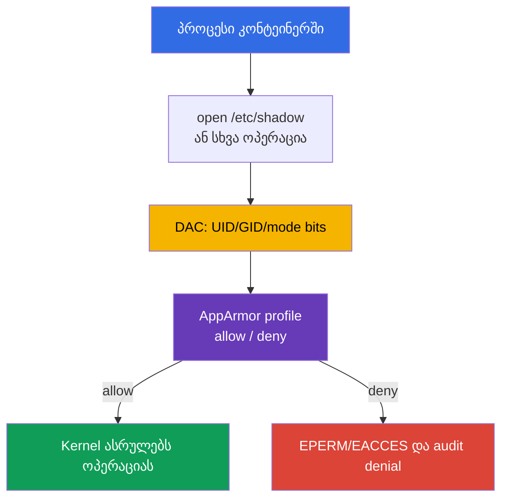

[Русская версия](ru.md) · [Eng version](README.md) · [Versión en español](es.md) · [Version française](fr.md) · [Deutsche Version](de.md) · [繁體中文版](tw.md) · [日本語版](jp.md)

# თავი 16. AppArmor

> **პრობლემა.** კონტეინერში გახსნილი shell ან აპლიკაციის შეცდომა უფრო საშიში ხდება, როცა
> პროცესს, რომელსაც აქვს შესაბამისი UID ან capability, შეუძლია წაიკითხოს მგრძნობიარე path,
> გაუშვას ფაილი ან მიწვდეს kernel-ის ობიექტებს, რომლებსაც ჩვეულებრივი Linux permissions
> უშვებს. სავალდებულო policy-ის გარეშე kernel ასეთ ქმედებებს workload-ის დანიშნულების
> მიხედვით კი არ ზღუდავს, არამედ მხოლოდ UID-ის მიხედვით.

> **რა არის შემდეგ.** მე-14-15 თავებში შევამცირეთ host-ის ზედაპირი და მასზე წვდომა. ახლა
> დავამატოთ mandatory access control (MAC) კონტეინერის პროცესებისთვის: AppArmor უშვებს
> მხოლოდ ცალსახად აღწერილ ქმედებებს ფაილებთან, capability-ებთან, ქსელთან და სხვა
> kernel-ის ობიექტებთან. ეს არის CKS-ის **System Hardening** დომენი (10%). შემდეგ თავში
> იმავე defence-in-depth-ს ავსებს seccomp, რომელიც filter-ავს system call-ებს.

> **რა გჭირდებათ CKA-დან.** საბაზისო `securityContext`, non-root გაშვება, capability-ები
> და `allowPrivilegeEscalation` განხილულია [CKA-ს მე-20 თავში](../../../cka/course/20/ge.md)
> და ივარჯიშება [CKA-ს 106-ე ლაბში](../../../cka/labs/106/README_GE.MD). აქ
> `securityContext` ემსახურება Kubernetes-ის ინტერფეისს AppArmor-ის profile-თან; მთავარი
> ამოცანაა profile-ის მომზადება node-ზე, მისი მინიჭება Pod-ისთვის და იმის დამტკიცება, რომ
> აკრძალვა მართლაც მუშაობს.

> 🧠 AppArmor არის path-based MAC პროცესსა და kernel-ს შორის; ის ავსებს DAC-ს,
> capability-ებს, seccomp-ს და RBAC-ს, მაგრამ არცერთ ამ შრეს არ ანაცვლებს.

## 16.1. AppArmor: policy პროცესსა და kernel-ს შორის

ჩვეულებრივი Linux უფლებები (DAC) ამოწმებს UID-ს, GID-ს და mode bits-ს. თუ პროცესმა
მიიღო შესაბამისი UID ან capability, მხოლოდ DAC-შემოწმება შეიძლება არასაკმარისი აღმოჩნდეს.
**AppArmor** ამატებს Mandatory Access Control-ს: kernel ადარებს პროცესის ქმედებას
profile-ს, და თვით პრივილეგირებულ პროცესსაც კი არ შეუძლია თავად გააუქმოს policy-ის
უარყოფა. Kubernetes-ში მნიშვნელოვანია ცალკე შემთხვევა: `privileged` კონტეინერი
უგულებელყოფს მისთვის მინიჭებულ AppArmor-ის profile-ს და იწყებს მუშაობას ამ შეზღუდვის
გარეშე, ამიტომ privileged არ არის AppArmor-ის ბარიერი.



AppArmor - path-based MAC-ია: წესები აღწერს path-ებს და ოპერაციებს, მაგალითად, კითხვას
`r`, ჩაწერას `w`, დამატებას `a`, `l` (link), `k` (lock), `m` (memory map), ასევე
შესრულების გადასვლებს `ix`/`px`/`cx`. mount-ის ოპერაციები ცალკე კლასის წესებს
მიეკუთვნება და არა file permissions-ს. profile ენიჭება პროცესს `exec`-ის დროს ან
კონტეინერის სტარტისას; შვილობილი პროცესები, როგორც წესი, ან იმემკვიდრებენ policy-ს, ან
გადადიან მასში საკუთარი წესების მიხედვით. ეს არ არის UID-ის, capability-ის, seccomp-ის,
NetworkPolicy-ის ან RBAC-ის ჩანაცვლება: თითოეული შრე ზღუდავს თავდასხმის საკუთარ გზას.

| შრე | რომელ კითხვას პასუხობს | კონტროლის მაგალითი |
|---|---|---|
| DAC | აქვს თუ არა UID/GID-ს ჩვეულებრივი უფლება ობიექტზე? | owner და `0640` |
| AppArmor | უშვებს თუ არა profile ამ ქმედებას და path-ს? | `deny /etc/shadow r,` |
| capabilities | არის თუ არა ცალკე kernel-ის პრივილეგია? | არ არის `CAP_SYS_ADMIN` |
| seccomp | დაშვებულია თუ არა syscall? | `mount(2)` აკრძალულია |
| RBAC | შეუძლია თუ არა identity-ს Kubernetes API-ის გამოძახება? | არ არის `get secrets` |

AppArmor განსაკუთრებით გავრცელებულია Ubuntu-სა და Debian-ზე. SELinux-ორიენტირებულ
node-ზე იყენებენ label-ებს და type enforcement-ს და არა AppArmor-ის profile-ს. ჯერ
დაადგინეთ node-ის image-ის რეალური მექანიზმი; AppArmor-ის profile-ს ვერ გადაიტანთ
SELinux-ზე და ვერ ელოდებით მის გამოყენებას.

> 🎯 განასხვავეთ `enforce` და `complain`, ჩატვირთეთ profile ფაქტობრივ node-ზე, მიანიჭეთ
> `securityContext.appArmorProfile` და დაადასტურეთ პროცესის effective profile.

## 16.2. Profile და enforce/complain რეჟიმები

Profile - უნიკალური სახელის მქონე policy-ია, რომელიც kernel-ში იტვირთება. ფაილები
ჩვეულებრივ ინახება `/etc/apparmor.d/`-ში, მაგრამ profile-ს **აქტიურს** არა ფაილის
არსებობა ხდის, არამედ parser-ით წარმატებული ჩატვირთვა. node-ის გადატვირთვის შემდეგ
მისი აღდგენა AppArmor-ის პაკეტმა ან node-ის მართვად კონფიგურაციამ უნდა უზრუნველყოს.

Profile-ს ორი მნიშვნელოვანი რეჟიმი აქვს:

| რეჟიმი | ქცევა | როდის გამოვიყენოთ |
|---|---|---|
| `enforce` | policy-ს გარეთ ოპერაცია იბლოკება; kernel წერს denial-ს | ჩვეულებრივი production-რეჟიმი ტესტის შემდეგ |
| `complain` | ოპერაცია დაშვებულია, მაგრამ დარღვევა ფიქსირდება audit/log-ში | რეალური დატვირთვის დაკვირვება და policy-ის დახვეწა |

`complain` არ არის დაცვა: ის აგროვებს მონაცემებს მინიმალური policy-ის ასაგებად.
ოპერაციები, რომლებიც profile-ით არ არის დაშვებული, ამ რეჟიმში, როგორც წესი, ტარდება
და ფიქსირდება ჟურნალში, მაგრამ **ცალსახა `deny` კვლავ ბლოკავს** დამთხვეულ ოპერაციას.
არ დატოვოთ `complain` აპლიკაციის შეცდომების მუდმივ კომპენსაციად. ნებართვების review-ის
შემდეგ გადაიყვანეთ profile `enforce`-ში და შეამოწმეთ სასარგებლო სცენარი მოსალოდნელ
უარყოფასთან ერთად.

მინიმალური საჩვენებელი profile გვიჩვენებს პრინციპს. წესი `/** rix,` განზრახ ფართოა,
რათა მაგალითს არ დასჭირდეს ყოველი loader-ისა და library-ის ჩამონათვალი; production-ში
მას ცვლის კონკრეტული path-ები, abstractions და საჭირო ოპერაციები.

```text
# /etc/apparmor.d/k8s-demo
#include <tunables/global>

profile k8s-demo flags=(attach_disconnected,mediate_deleted) {
  #include <abstractions/base>

  /** rix,
  audit deny /etc/shadow r,
}
```

`deny`-ს პრიორიტეტი აქვს დამთხვეული ოპერაციისთვის დაშვების წესთან შედარებით. ეს
profile ვარგისია მხოლოდ იზოლირებული სავარჯიშოსთვის: production-policy იწყება
პროცესის მოთხოვნებით, readonly/writable დირექტორიებით, socket-ებით, სერტიფიკატებით
და explicit execution transitions-ით.

## 16.3. Node: parser, `aa-status` და profile-ის სასიცოცხლო ციკლი

`Localhost`-ისთვის Kubernetes არ გადასცემს profile-ის ტექსტს kubelet-ს და არ ასლავს
მას node-ებს შორის. named `Localhost` profile ზუსტი სახელით უნდა იყოს წინასწარ
ჩატვირთული თითოეული node-ის kernel-ში, სადაც workload-ის გაშვება დაშვებულია.
`RuntimeDefault`-ს გვთავაზობს container runtime: მომხმარებელს არ სჭირდება named
`Localhost` profile-ის წინასწარ მიწოდება `/etc/apparmor.d`-ში.

node-ზე ჯერ დარწმუნდით, რომ AppArmor ჩართულია, შემდეგ ჩატვირთეთ და ინვენტარიზაცია
გაუკეთეთ policy-ს:

```bash
# node-ზე, არა ჩვეულებრივ Pod-ში.
sudo cat /sys/module/apparmor/parameters/enabled
# მოსალოდნელია: Y

sudo aa-status
sudo apparmor_status
sudo apparmor_parser -r -W /etc/apparmor.d/k8s-demo
# არსებობა და kernel-ის effective რეჟიმი; მხოლოდ aa-status grep-ით რეჟიმის მტკიცება არასაკმარისია.
sudo aa-status | grep -F 'k8s-demo'
sudo grep -F 'k8s-demo' /sys/kernel/security/apparmor/profiles
```

`aa-status` (სინონიმი `apparmor_status`) გვიჩვენებს, ჩართულია თუ არა module,
რამდენი profile არის ჩატვირთული და რომელი პროცესებია enforce/complain-ში.
`apparmor_parser` კითხულობს policy-ს და გადასცემს kernel-ს; ძირითადი ოპერაციები
ასე ჯობია დავიმახსოვროთ:

```bash
# ახალი profile-ის დამატება ან ჩატვირთული profile-ის ჩანაცვლება ფაილის ცვლილების შემდეგ.
sudo apparmor_parser -r -W /etc/apparmor.d/k8s-demo

# დროებით audit-სიგნალების შეგროვება ბლოკირების გარეშე, შემდეგ ბლოკირების ჩართვა.
sudo aa-complain /etc/apparmor.d/k8s-demo
sudo grep -F 'k8s-demo' /sys/kernel/security/apparmor/profiles
sudo aa-enforce /etc/apparmor.d/k8s-demo
sudo grep -F 'k8s-demo' /sys/kernel/security/apparmor/profiles

# profile-ის kernel-იდან წაშლა მხოლოდ კონტროლირებადი ექსპლუატაციიდან გამოყვანისას.
sudo apparmor_parser -R /etc/apparmor.d/k8s-demo
```

`-r` ცვლის ჩატვირთულ ვერსიას; `-R` გამოტვირთავს მას. `aa-complain` და `aa-enforce`
გადართავენ უკვე ჩატვირთული profile-ის რეჟიმს და თავადვე ასრულებენ მის reload-ს:
თავად რეჟიმის შესაცვლელად Pod-ის restart არ სჭირდება. წაშლამდე მოძებნეთ Pod-ები და
პროცესები, რომლებსაც ჯერ კიდევ შეუძლიათ მისი გამოყენება. არ დაარედაქტიროთ policy
production-node-ზე ცდომილებით: შეცდომამ შეიძლება ხელი შეუშალოს workload-ის სტარტს ან
დაამტვრიოს აპლიკაცია reload-ის შემდეგ. ჯერ შეამოწმეთ syntax და rollout გამოყოფილ
node-ზე.

განასხვავეთ `apparmor_parser`-ის flags: `-p` მხოლოდ შლის `#include`-ს და ბეჭდავს
შედეგს; `-Q` კომპილირებს policy-ს, მაგრამ არ ტვირთავს მას kernel-ში; `-r` ცვლის
ჩატვირთულ ვერსიას. უსაფრთხო შემოწმებისთვის გამოიყენეთ `-Q -K`, შემდეგ `-r -W`.

```bash
# -Q კომპილირებს kernel-ში ჩატვირთვის გარეშე; -K კრძალავს cache-ის ხელახლა გამოყენებას.
# -p არ არის სრული compile-შემოწმება.
sudo apparmor_parser -Q -K /etc/apparmor.d/k8s-demo >/dev/null
sudo apparmor_parser -r -W /etc/apparmor.d/k8s-demo
sudo aa-status
```

`aa-status` გვიჩვენებს მდგომარეობას node-ზე და არა Kubernetes-ის სპეციფიკაციას.
რამდენიმე node pool-ის მქონე კლასტერისთვის შეამოწმეთ თითოეული pool: scheduler-მა
არ იცის `/etc/apparmor.d`-ის შემცველობა და თავისთავად არ იძლევა გარანტიას, რომ
`Localhost` profile არსებობს არჩეულ node-ზე.

## 16.4. Kubernetes API: აქტუალური `appArmorProfile`

Kubernetes-ის აქტუალური API profile-ს განსაზღვრავს `securityContext.appArmorProfile`-ის
საშუალებით. ველი შეიძლება იყოს Pod-ის `securityContext`-ში, როგორც baseline
კონტეინერებისთვის, ან ცალკეული კონტეინერის `securityContext`-ში, თუ მას ვიწრო
policy სჭირდება. არ მიანიჭოთ ერთ Pod-ს სხვადასხვა profile-ები საჭიროების გარეშე:
ეს ართულებს audit-ს და გამოძიებას.

| `type` | მნიშვნელობა | როდის გამოვიყენოთ |
|---|---|---|
| `RuntimeDefault` | container runtime-ის მიერ მოწოდებული profile | უსაფრთხო საერთო baseline, თუ runtime-ს და node-ს მხარდაჭერა აქვთ |
| `Localhost` | named profile, წინასწარ ჩატვირთული node-ზე | გადამოწმებული აპლიკაცია-სპეციფიკური policy |
| `Unconfined` | AppArmor არ ზღუდავს კონტეინერს | მხოლოდ დიაგნოსტიკური დროებითი გამონაკლისი რისკის ცალსახა პასუხისმგებელი პირით |

ცალსახად მითითებული `type: RuntimeDefault` მოითხოვს ხელმისაწვდომ AppArmor-ს: მის
გარეშე ასეთი Pod არ დაიშვება. თუ `appArmorProfile` არ არის მითითებული, runtime
default გამოიყენება მხოლოდ ხელმისაწვდომი AppArmor-ის შემთხვევაში; წინააღმდეგ
შემთხვევაში კონტეინერი იწყებს მუშაობას AppArmor-ის შეზღუდვის გარეშე. ამიტომ ველის
არარსებობა არ არის ეკვივალენტური ცალსახა `RuntimeDefault`-ისა.

ჩვეულებრივი დატვირთვისთვის დაიწყეთ runtime profile-ითა და სხვა საბაზისო
შეზღუდვებით:

```yaml
apiVersion: v1
kind: Pod
metadata:
  name: runtime-default-aa
  namespace: demo
spec:
  securityContext:
    appArmorProfile:
      type: RuntimeDefault
  containers:
  - name: app
    image: nginx:1.30.4
    securityContext:
      allowPrivilegeEscalation: false
      capabilities:
        drop: ["ALL"]
```

საკუთარი `Localhost` profile-ისთვის უთითებენ ზუსტად იმ სახელს, რომელიც kernel-შია
ჩატვირთული, path-ის `/etc/apparmor.d/`-ის და legacy-პრეფიქსის `localhost/`-ის
გარეშე:

```yaml
apiVersion: v1
kind: Pod
metadata:
  name: apparmor-localhost
  namespace: demo
spec:
  # Placement-ის შეზღუდვა კონტრაქტის ნაწილია, თუ profile ყველა node-ზე არ არის.
  nodeSelector:
    kubernetes.io/hostname: worker-1
  securityContext:
    appArmorProfile:
      type: Localhost
      localhostProfile: k8s-demo
  containers:
  - name: app
    image: busybox:1.36.1
    command: ["sh", "-c", "sleep 3600"]
    securityContext:
      allowPrivilegeEscalation: false
      capabilities:
        drop: ["ALL"]
```

გამოყენებამდე მოამზადეთ `k8s-demo` `worker-1`-ზე, ხოლო შემდეგ დაელოდეთ სტარტს და
შეამოწმეთ manifest, placement და პროცესის effective profile:

```bash
kubectl apply -f apparmor-localhost.yaml
kubectl wait -n demo --for=condition=Ready pod/apparmor-localhost --timeout=120s
kubectl get pod -n demo apparmor-localhost -o wide
kubectl get pod -n demo apparmor-localhost \
  -o jsonpath='{.spec.securityContext.appArmorProfile}{"\n"}'
kubectl exec -n demo apparmor-localhost -- cat /proc/1/attr/current
```

ბოლო ბრძანება ადასტურებს, რა profile-ის ქვეშ ასრულებს kernel კონტეინერის PID 1-ს;
შედეგი დამოკიდებულია runtime-ზე და შეიძლება შეიცავდეს რეჟიმს ფრჩხილებში. ეს
უფრო ძლიერია, ვიდრე მხოლოდ YAML-ის შემოწმება: YAML შეიძლება იყოს გამართული, მაშინ
როცა container ვერ გაეშვა node-ზე profile-ის გარეშე.

> 🔬 Beta-annotation სჭირდება ძველი manifest-ის ამოსაცნობად და უსაფრთხოდ
> გადასატანად; ახალი workload-ისთვის გამოიყენეთ მხოლოდ `securityContext.appArmorProfile`.

## 16.5. Legacy annotation: წაკითხვა, გადატანა, არ აურიოთ

Kubernetes v1.30-მდე AppArmor ინიჭებოდა per-container beta-annotation-ის
საშუალებით:

```yaml
metadata:
  annotations:
    container.apparmor.security.beta.kubernetes.io/app: localhost/k8s-demo
```

სრული legacy-მნიშვნელობა დამოკიდებულია რეჟიმზე: `runtime/default`, `unconfined`
ან `localhost/<profile-name>`. key უნდა მთავრდებოდეს **ზუსტად კონტეინერის
სახელით**. მაგალითად, `app` კონტეინერისთვის ძველი Pod ასე გამოიყურებოდა:

```yaml
apiVersion: v1
kind: Pod
metadata:
  name: apparmor-legacy
  namespace: demo
  annotations:
    container.apparmor.security.beta.kubernetes.io/app: localhost/k8s-demo
spec:
  containers:
  - name: app
    image: busybox:1.36.1
    command: ["sh", "-c", "sleep 3600"]
```

ეს legacy-ინტერფეისია. ახალი manifest-ებისთვის გამოიყენეთ
`securityContext.appArmorProfile`; არ შექმნათ ერთი ობიექტი ერთდროულად ახალი
ველითა და annotation-ით, განსაკუთრებით სხვადასხვა მნიშვნელობით. გადატანისას ჯერ
დაადგინეთ Kubernetes-ისა და runtime-ის ვერსია, შეცვალეთ annotation ეკვივალენტური
API-ველით, გამოიყენეთ ტესტ-node-ზე და შეამოწმეთ `/proc/1/attr/current`.

ძველი ობიექტების სწრაფი audit:

```bash
kubectl get pod -A -o json | jq -r '
  .items[]
  | select(.metadata.annotations != null)
  | .metadata.annotations
  | to_entries[]
  | select(.key | startswith("container.apparmor.security.beta.kubernetes.io/"))
  | [.key, .value] | @tsv'

kubectl get pod -A -o jsonpath='{range .items[*]}{.metadata.namespace}{"/"}{.metadata.name}{"\t"}{.spec.securityContext.appArmorProfile}{"\n"}{end}'
```

Pod audit-ის ცარიელი შედეგი არ ადასტურებს container-level override-ის ან
legacy-კონფიგურაციის არარსებობას controller-ში. დამატებით შეამოწმეთ Deployment-ის,
StatefulSet-ის, DaemonSet-ის, Job-ისა და CronJob-ის template-ები: პირველი
ოთხისთვის — `.spec.template.metadata.annotations`,
`.spec.template.spec.securityContext.appArmorProfile` და container override-ები;
CronJob-ისთვის — იგივე ველები `.spec.jobTemplate.spec.template`-ის ქვეშ. გადატანისას
შეასწორეთ controller/template manifest, და არა მხოლოდ მის მიერ შექმნილი Pod.

> 🎯 განასხვავეთ კონტეინერის შექმნის შეცდომა runtime denial-ისგან, შემდეგ
> დაადასტურეთ node, სახელი და profile-ის ჩატვირთვა, effective enforcement და
> kernel evidence; მიზეზი არ ჩაანაცვლოთ `Unconfined`-ით.

## 16.6. სტარტის ჩავარდნა და denial: სწორ შრეზე დიაგნოსტიკა

`Localhost` profile-ს ორი განსხვავებული უწესივრობის კატეგორია აქვს.

1. **კონტეინერი არ იქმნება.** AppArmor გამორთულია node-ზე, runtime არ უჭერს
   მხარს საჭირო რეჟიმს, profile-ის სახელი არ არის ჩატვირთული ან Pod სხვა node-ზე
   მოხვდა. ეს lifecycle failure-ია: მოძებნეთ Pod-ის event და kubelet/runtime-ის
   მდგომარეობა.
2. **კონტეინერი მუშაობს, მაგრამ ქმედება უარყოფილია.** profile `enforce`-ში
   ბლოკავს path-ს, capability-ს, ქსელს, mount-ს ან სხვა ობიექტს. ეს runtime
   denial-ია: აპლიკაცია, როგორც წესი, იღებს `Permission denied`-ს, ხოლო kernel
   წერს `apparmor="DENIED"`-ს.

დაიწყეთ Kubernetes-იდან, შემდეგ გადადით ფაქტობრივ node-ზე:

```bash
NS=demo
POD=apparmor-localhost

kubectl get pod -n "$NS" "$POD" -o wide
kubectl describe pod -n "$NS" "$POD"
kubectl get events -n "$NS" \
  --field-selector involvedObject.name="$POD" --sort-by=.lastTimestamp
kubectl get pod -n "$NS" "$POD" -o yaml
```

თუ status არის `Pending`, `ContainerCreating`, `CreateContainerError` ან
კონტეინერი არ გახდა Ready, event ჩვეულებრივ აჩვენებს profile-ის სახელს ან
node-ლოკალურ მიზეზს. მიიღეთ node `-o wide`-დან, დაუკავშირდით მხოლოდ დაშვებული
ადმინისტრაციული წვდომით და შეამოწმეთ:

```bash
# scheduler-ის მიერ არჩეულ node-ზე.
sudo aa-status
sudo aa-status | grep -F 'k8s-demo'
sudo journalctl -u kubelet --since '15 minutes ago'
if command -v ausearch >/dev/null 2>&1 && sudo systemctl is-active --quiet auditd; then
  sudo ausearch -m AVC,USER_AVC -ts recent | grep -F 'apparmor=' || true
elif sudo test -r /var/log/audit/audit.log; then
  sudo grep -F 'apparmor=' /var/log/audit/audit.log || true
else
  sudo journalctl -k --since '15 minutes ago' | grep -Ei 'apparmor|denied' || true
  sudo dmesg --level=err,warn | grep -Ei 'apparmor|denied' || true
fi
```

ასეთი ჩავარდნა ნუ გამოასწორეთ `Localhost`-ის `Unconfined`-ით ან
`privileged: true`-თი ჩანაცვლებით. ჯერ შეადარეთ type და სახელი manifest-ირებულ
Pod-ში, node-ის სახელი, `aa-status`, runtime-ის ვერსია და profile-ის მიწოდების
წესი. თუ profile-მა უნდა იცხოვროს მხოლოდ ცალკე pool-ზე, დაამაგრეთ workload
`nodeSelector`-ით, affinity-ით ან სანდო label-ით, ხოლო თავად label-ი დაიცავით
node-ების მართვის პროცესით.

## 16.7. Enforce-ისა და complain-ის შემოწმება

შეამოწმეთ პროცესის effective რეჟიმი და არა მხოლოდ სახელის არსებობა `aa-status`-ში.
`audit deny /etc/shadow r,` ბლოკავს `complain`-შიც, ამიტომ ეს არის audited
explicit deny-ის ტესტი და არა `enforce`-ის მტკიცებულება. mode probe-ისთვის
გამოიყენეთ იმპლიციტურად აკრძალული ჩაწერა: profile არ იძლევა ჩაწერას `/`-ში.

```bash
kubectl exec -n demo apparmor-localhost -- cat /proc/1/attr/current
# მოსალოდნელია: k8s-demo (enforce)
kubectl exec -n demo apparmor-localhost -- touch /aa-mode-probe-enforce
# მოსალოდნელია Permission denied: იმპლიციტური denial enforce-ში.
kubectl exec -n demo apparmor-localhost -- cat /etc/shadow
# მოსალოდნელია Permission denied და audit evidence: audit deny.

sudo aa-complain /etc/apparmor.d/k8s-demo
sudo grep -F 'k8s-demo' /sys/kernel/security/apparmor/profiles
kubectl exec -n demo apparmor-localhost -- cat /proc/1/attr/current
# მოსალოდნელია: k8s-demo (complain)
kubectl exec -n demo apparmor-localhost -- touch /aa-mode-probe-complain
# მოსალოდნელია წარმატება და ALLOWED/complain telemetry.
kubectl exec -n demo apparmor-localhost -- cat /etc/shadow
# Permission denied: ცალსახა audit deny მოქმედებს complain-შიც.
sudo aa-enforce /etc/apparmor.d/k8s-demo
```

evidence-ისთვის ჯერ შეამოწმეთ audit subsystem (`ausearch` აქტიური auditd-ის დროს,
შემდეგ `/var/log/audit/audit.log`); `journalctl -k` და `dmesg` — fallback-ია. თუ
წყაროები მიუწვდომელია, ეს არის `REVIEW_REQUIRED`, და არა denial-ის არარსებობის
მტკიცებულება.


## 16.8. როგორ გამოგადგებათ: გამოცდაზე და რეალურ სამუშაოში

**გამოცდაზე.** სწრაფად დაადგინეთ node, შეამოწმეთ `aa-status`, ჩატვირთეთ ან
ჩაანაცვლეთ საჭირო profile `apparmor_parser`-ით, გადართეთ ის `aa-enforce`/`aa-complain`-ით
პირობის მიხედვით და მიანიჭეთ Pod-ს აქტუალური `appArmorProfile`. გამოყენების შემდეგ ნუ
შემოიფარგლებით მხოლოდ YAML-ით: `kubectl describe pod`, `/proc/1/attr/current` და
წყაროზე დაფუძნებული AppArmor audit evidence განასხვავებს scheduling/profile-მიწოდების
შეცდომას ნამდვილი denial-ისგან. denial-ს ეძებეთ პირველ რიგში `ausearch`-ით აქტიური
auditd-ის დროს ან `/var/log/audit/audit.log`-ში; `journalctl -k` და `dmesg`
გამოიყენეთ როგორც კონკრეტული node-ის fallback. ძველი annotation ამოიცანით, მაგრამ
გამოიყენეთ იგი მხოლოდ მაშინ, თუ დავალება ცალსახად მოითხოვს legacy-თავსებადობას.

**რეალურ სამუშაოში.** AppArmor ამცირებს დაუცველი პროცესის შედეგებს მხოლოდ მაშინ,
როცა policy მიწოდებულია ყველა საჭირო node-ზე, ასახავს აპლიკაციის ნამდვილ კონტრაქტს
და ექვემდებარება დაკვირვებას. profile-ის ავტომატური rollout, მოკლე complain-პერიოდი,
ახალი ნებართვების review და alert `DENIED`-ზე ქმნის შემოწმებად boundary-ს, ნაცვლად
„policy-ფაილისა სადღაც node-ზე“.

> 🎯 შეძლოთ დიაგნოსტიკა, თუ რატომ არ გამოიყენა AppArmor-ის profile ან რატომ არ
> იწყებს workload მუშაობას.

### 16.8.1. Troubleshooting: „Profile არ მუშაობს, რადგან…"

ქვემოთ `NS`, `POD` და `CTR` აღნიშნავს namespace-ს, Pod-სა და კონტეინერს. ჯერ
ყოველთვის დაადგინეთ ფაქტობრივი node: AppArmor-ის დიაგნოსტიკა სხვა node-ზე
კონტეინერის შესახებ არაფერს ამტკიცებს.

#### Profile არ არის ჩატვირთული node-ზე, სადაც scheduler-მა Pod მოათავსა

Multi-node კლასტერში `apparmor_parser` შეიძლება წარმატებით შესრულებულიყო
`worker-1`-ზე, მაგრამ Pod მოხვდა `worker-2`-ზე. Kubernetes არ გადააქვს profile
node-ებს შორის და scheduler არ კითხულობს kernel policy-ის შემცველობას. შედეგად
`Localhost`, როგორც წესი, იძლევა container-ის შექმნის შეცდომას, ან rollout
მუშაობს მხოლოდ რეპლიკების ნაწილთან.

```bash
NS=demo
POD=apparmor-localhost

kubectl get pod -n "$NS" "$POD" -o wide
kubectl describe pod -n "$NS" "$POD"
# დაუკავშირდით ზუსტად იმ node-ს NODE სვეტიდან.
sudo aa-status | grep -F 'k8s-demo'
sudo journalctl -u kubelet --since '15 minutes ago'
```

გამოსწორება: მიაწოდეთ და ჩატვირთეთ profile `sudo apparmor_parser -r -W`-ით
დაშვებული pool-ის თითოეულ node-ზე rollout-მდე, ან დაამაგრეთ Pod
`nodeSelector`/affinity-ით pool-ზე მართვადი მიწოდებით. ეს არ გამოასწოროთ
`Localhost`-ის `Unconfined`-ით ჩანაცვლებით.

#### სახელი manifest-ში არ ემთხვევა სახელს profile-ის შიგნით

`localhostProfile` და legacy-მნიშვნელობა `localhost/<name>` მიუთითებს სახელს,
რომელიც გამოცხადებულია თავად profile-ში და არა აუცილებლად ფაილის სახელს. ფაილისთვის
`/etc/apparmor.d/k8s-demo` ეს არის ზუსტად სტრიქონი `profile k8s-demo {`; ჩანაწერი
`profile web-app {` მოითხოვს `localhostProfile: web-app`-ს, თუნდაც ფაილის სახელი
დარჩეს `k8s-demo`.

```bash
# ფაქტობრივ node-ზე: შეადარეთ სახელი policy-ში და რეალურად ჩატვირთული სახელი.
sudo grep -nE '^[[:space:]]*profile[[:space:]]+' /etc/apparmor.d/k8s-demo
sudo aa-status | grep -F 'k8s-demo'
sudo aa-status | grep -F 'web-app'

# Kubernetes-ში: გადატანისას შეამოწმეთ როგორც ახალი API, ასევე legacy annotation.
kubectl get pod -n "$NS" "$POD" \
  -o jsonpath='{.spec.securityContext.appArmorProfile.localhostProfile}{"\n"}'
kubectl describe pod -n "$NS" "$POD"
```

გამოსწორება: მოიყვანეთ ერთ ზუსტ სახელზე declaration, `localhostProfile` და, თუ
ჯერ კიდევ გამოიყენება, legacy annotation. შემდეგ reload-ი გაუკეთეთ profile-ს
`apparmor_parser -r -W`-ით და შექმენით ახალი Pod; ძველი პროცესი არ ადასტურებს
გასწორებული policy-ის მინიჭებას.

#### `complain`-ში აპლიკაცია მუშაობს, ხოლო `enforce`-ში იღებს `Permission denied`-ს

ჩვეულებრივ policy-ს აკლია საჭირო `allow` path-ისთვის ან ოპერაციისთვის, მაგალითად,
runtime-დირექტორიისთვის, სერტიფიკატისთვის, Unix-socket-ისთვის ან ფაილისთვის,
რომელსაც აპლიკაცია კითხულობს მხოლოდ სტარტის შემდეგ. `complain`-ში allow-ის
არარსებობა, როგორც წესი, მხოლოდ ფიქსირდება ჟურნალში; `enforce`-ში ის იბლოკება.
ცალსახა `deny` განსხვავდება: ის ბლოკავს `complain`-შიც, ამიტომ ის არ წაშალოთ
ტესტისთვის.

```bash
# ფაქტობრივ node-ზე controlled probe-ის შემდეგ: ჯერ auditd/audit.log, შემდეგ journal/dmesg fallback.
sudo aa-status | grep -F 'k8s-demo'
if command -v ausearch >/dev/null 2>&1 && sudo systemctl is-active --quiet auditd; then
  sudo ausearch -m AVC,USER_AVC -ts recent | grep -E 'apparmor="DENIED"|profile="k8s-demo"' || true
elif sudo test -r /var/log/audit/audit.log; then
  sudo grep -E 'apparmor="DENIED"|profile="k8s-demo"' /var/log/audit/audit.log || true
else
  # Kernel-ის ჟურნალირება ვალიდური fallback-ია, როცა auditd/audit.log მიუწვდომელია.
  if sudo journalctl -k --since '10 minutes ago' >/dev/null 2>&1; then
    sudo journalctl -k --since '10 minutes ago' | \
      grep -E 'apparmor="DENIED"|profile="k8s-demo"' || true
  elif sudo dmesg >/dev/null 2>&1; then
    sudo dmesg | grep -i apparmor || true
  else
    echo 'REVIEW_REQUIRED: no readable AppArmor audit source' >&2
  fi
fi

# Kubernetes-ში დააფიქსირეთ კონტეინერი და დაკვირვებული სიმპტომი.
kubectl describe pod -n "$NS" "$POD"
kubectl logs -n "$NS" "$POD" -c "$CTR" --tail=100
```

გამოსწორება: შეადარეთ `operation=` და `name=` denial-იდან აპლიკაციის კონტრაქტს,
დაამატეთ მინიმალური დასაბუთებული allow-წესი ტესტ-node-ზე, შეამოწმეთ დადებითი და
უარყოფითი სცენარები და მხოლოდ შემდეგ ჩართეთ `aa-enforce`. არ დაამატოთ ფართო
`/** rw,` და production workload-ი არ გადაიყვანოთ უვადო `complain`-ში.

#### Node ან runtime არ უჭერს მხარს AppArmor-ს, ან profile მხოლოდ ფაილშია

AppArmor მოითხოვს Linux kernel-ს ჩართული და აქტიური LSM-ით; არა-Linux node-ზე,
AppArmor-ის გარეშე kernel-ზე ან მხარდაუჭერელ runtime-ზე profile-ის მინიჭება
სამუშაო ბარიერად არ იქცევა. ცალკე, kubelet **არ** სკანირავს დირექტორიას და არ
ტვირთავს AppArmor-ის policy-ს: ფაილი `/etc/apparmor.d/`-ში თავისთავად უსარგებლოა,
სანამ `apparmor_parser`-მა ის kernel-ს არ გადასცა. ეს შეამოწმეთ, სანამ YAML-ში
შეცდომას ეძებთ.

```bash
# ფაქტობრივ node-ზე.
uname -s
sudo cat /sys/module/apparmor/parameters/enabled 2>/dev/null || true
sudo aa-status
sudo dmesg | grep -i apparmor || true
sudo journalctl -k --since '15 minutes ago' | grep -Ei 'apparmor|lsm' || true
sudo journalctl -u kubelet --since '15 minutes ago'

# Kubernetes-ის event ხშირად მიუთითებს მხარდაუჭერელ runtime-ზე ან არაჩატვირთულ profile-ზე.
kubectl describe pod -n "$NS" "$POD"
```

გამოსწორება: გამოიყენეთ Linux node pool ჩართული AppArmor-ითა და თავსებადი
runtime-ით, ან არ გამოაცხადოთ AppArmor სავალდებულო კონტროლად ასეთ პლატფორმაზე.
მხარდაჭერილი node-ისთვის შეინახეთ ფაილი მართვად კონფიგურაციაში და ცალსახად
ჩატვირთეთ ის `apparmor_parser`-ით თითოეულ სამიზნე node-ზე; ნუ დაეყრდნობით
kubelet-ის დირექტორიას, როგორც policy-ის მიწოდების მექანიზმს.

> ### 🔴 თავდამსხმელის მზერა
> **Asset:** host-ის ფაილური სისტემა და syscall-ები, რომლებსაც კონტეინერი
> მიუწვდება.
>
> **Starting foothold:** RCE კონტეინერში.
>
> **Attacker objective:** შეასრულოს ქმედება აპლიკაციის ფარგლებს გარეთ: მიწვდეს
> დაცულ path-ს ან გაუშვას აკრძალული syscall.
>
> **Abuse path:** შეეცადოს გასცდეს profile-ის საზღვრებს, თუ ის არასწორად არის
> ჩატვირთული, დასახელებული ან იმყოფება `complain`-ში `enforce`-ის ნაცვლად.
>
> **Expected evidence:** effective AppArmor profile და denial event ხელმისაწვდომ
> audit წყაროში: `ausearch`/`audit.log` ან `journalctl -k`/`dmesg` როგორც fallback.
>
> **Control:** გადამოწმებული profile `enforce` რეჟიმში და შემოწმება
> `aa-status`-ით.
>
> **Retest:** აკრძალული ოპერაცია გასწორების შემდეგ რჩება დაბლოკილი.

## 16.9. კითხვები თვითშემოწმებისთვის

<details>
<summary>1. რატომ არ ანაცვლებს AppArmor UID/GID-ს, capability-ებს, seccomp-ს ან RBAC-ს?</summary>

ეს კონტროლები სხვადასხვა კითხვას პასუხობს: DAC ამოწმებს UID/GID-სა და mode bits-ს, capability-ები — ცალკეულ kernel-ის პრივილეგიებს, seccomp — დაშვებულ syscall-ებს, ხოლო RBAC — identity-ის Kubernetes API-წვდომას. AppArmor ამატებს path-based MAC-ს პროცესის ქმედებებისთვის profile-ის მიხედვით. ამიტომ profile ავსებს, მაგრამ არ აუქმებს non-root-ის, dropped capability-ების, seccomp-ისა და მინიმალური RBAC-ის საჭიროებას.
</details>

<details>
<summary>2. რით განსხვავდება `enforce` `complain`-ისგან, და რატომ არ შეიძლება მეორე რეჟიმის დაცვად ჩათვლა?</summary>

`enforce`-ში policy-ს გარეთ ოპერაცია იბლოკება, ხოლო kernel წერს denial-ს. `complain`-ში დაუშვებელი ოპერაცია, როგორც წესი, სრულდება და ფიქსირდება ჟურნალში, რათა შეგროვდეს აპლიკაციის ფაქტობრივი მოთხოვნები; ცალსახა `deny` მაინც აგრძელებს დამთხვევის ბლოკირებას. ასეთი რეჟიმი სასარგებლოა დროებით policy-ის დასახვეწად, მაგრამ არ არის მუდმივი დაცვის ბარიერი.
</details>

<details>
<summary>3. როგორ ამტკიცებენ `aa-status` და `apparmor_parser -r` profile-ის მდგომარეობის სხვადასხვა ნაწილს?</summary>

`aa-status` გვიჩვენებს AppArmor-ის მდგომარეობას node-ზე: ჩართული module, ჩატვირთული profile-ები, მათი რეჟიმები და პროცესები. `apparmor_parser -r -W <file>` სინტაქსურად კითხულობს policy-ს და უმატებს ან ცვლის მის ჩატვირთულ ვერსიას kernel-ში. ფაილის არსებობა თავისთავად არაფერს ამტკიცებს; parser-ის შემდეგ საჭიროა სახელისა და რეჟიმის დადასტურება `aa-status`-ით.
</details>

<details>
<summary>4. რატომ შეიძლება `Localhost` profile-მა გამოიწვიოს `CreateContainerError` წარმატებული
   `kubectl apply`-ის შემდეგ?</summary>

`kubectl apply` იღებს manifest-ს, მაგრამ container runtime-ს `Localhost`-ის გამოყენება შეუძლია მხოლოდ იმ შემთხვევაში, თუ ზუსტი სახელის profile უკვე ჩატვირთულია scheduler-ის მიერ არჩეული node-ის kernel-ში. profile შეიძლება არ იყოს ამ node-ზე, AppArmor/runtime-მა შეიძლება არ დაუჭიროს მხარი საჭირო რეჟიმს, ან Pod შეიძლება სხვა node pool-ზე მოხვდეს. მიზეზი მოძებნეთ `kubectl describe pod`-ში, event-ებში, ფაქტობრივ node-ზე, `aa-status`-სა და kubelet-ის ლოგებში.
</details>

<details>
<summary>5. რომელი მნიშვნელობებია დაშვებული `appArmorProfile.type`-ისთვის და როდის არის `Unconfined` გამართლებული?</summary>

დაშვებულია `RuntimeDefault`, `Localhost` და `Unconfined`. `RuntimeDefault` ემსახურება საერთო baseline-ს ხელმისაწვდომი AppArmor-ის დროს, ხოლო `Localhost` — გადამოწმებული აპლიკაცია-სპეციფიკური profile-ისთვის, წინასწარ ჩატვირთულისთვის node-ზე. `Unconfined` გამართლებულია მხოლოდ როგორც დროებითი დიაგნოსტიკური გამონაკლისი რისკის ცალსახა პასუხისმგებელი პირით და არა როგორც profile-ის ჩავარდნის გამოსწორების საშუალება.
</details>

<details>
<summary>6. როგორ იწერება legacy AppArmor annotation `app` სახელის მქონე კონტეინერისა და
   `k8s-demo` profile-ისთვის?</summary>

Key უნდა მთავრდებოდეს ზუსტად კონტეინერის სახელით, ხოლო Localhost-ისთვის მნიშვნელობა იღებს legacy-პრეფიქსს. ამ შემთხვევაში ჩანაწერია: `container.apparmor.security.beta.kubernetes.io/app: localhost/k8s-demo`. ეს არის beta-annotation audit-ისა და გადატანისთვის; ახალ manifest-ებში იყენებენ `securityContext.appArmorProfile`-ს და არ ურევენ ორივე ინტერფეისს.
</details>

<details>
<summary>7. რომელი ბრძანებები ადასტურებს ერთდროულად არჩეულ node-ს, პროცესის effective profile-ს და
   დაბლოკილ ქმედებას?</summary>

არჩეულ node-ს გვიჩვენებს `kubectl get pod -n demo apparmor-localhost -o wide`, ხოლო ამ node-ზე profile-ის არსებობას ამოწმებს `sudo aa-status | grep -F 'k8s-demo'`. PID 1-ის effective profile-ს ადასტურებს `kubectl exec -n demo apparmor-localhost -- cat /proc/1/attr/current`. უარყოფა მოწმდება `kubectl exec ... -- cat /etc/shadow`-ით, მოსალოდნელი `Permission denied`-ითა და
შესაბამისი AppArmor audit event-ით ამ node-ის წყაროში: auditd/`audit.log` ან kernel
journal fallback-ად.
</details>

<details>
<summary>8. **Flashback (მე-18 თავი).** PSA `restricted` მე-18 თავიდან მოითხოვს `RuntimeDefault`/
   `Localhost`-ს seccomp-ისთვის, მაგრამ **არ** მოითხოვს კონკრეტულ AppArmor profile-ს
   `RuntimeDefault`/გამოურთველი default-ის მეტ დონეზე. სად ზუსტად მთავრდება ის, რასაც
   ამოწმებს ჩაშენებული PSA, და სად იწყება ზონა, რომლის დახურვაც მხოლოდ ამ თავში
   განხილულ ცალსახად მინიჭებულ `Localhost` AppArmor profile-ს შეუძლია?</summary>

PSA ამოწმებს Pod-spec-ის დაშვებადობას ჩაშენებული სტანდარტის მიხედვით, მათ შორის გამოურთველ AppArmor default-ს და `RuntimeDefault`/`Localhost`-ს seccomp-ისთვის, მაგრამ არ ახდენს კონკრეტული აპლიკაციის path-ებისა და ოპერაციების კონტრაქტის მოდელირებას. ის არ აწვდის და არ ამოწმებს node-ლოკალურ named AppArmor policy-ს. ცალსახა `Localhost` profile ხურავს ამ შემდეგ ზონას: kernel-ის enforcement კონკრეტული დაშვებული path-ების, ფაილის ოპერაციების, capability-ების, ქსელის ან mount-წესების არჩეულ node-ზე.
</details>

## პრაქტიკა

ჯერ ივარჯიშეთ `securityContext`, non-root გაშვება და capability-ები
[CKA-ს 106-ე ლაბში](../../../cka/labs/106/README_GE.MD) — ეს prerequisite-ია და არა
თავის თემის ძირითადი პრაქტიკა. შემდეგ ტესტ-node-ზე შექმენით profile `k8s-demo`,
ჩატვირთეთ ის `apparmor_parser`-ით, მიანიჭეთ Pod-ს `appArmorProfile.type: Localhost`
და შეადარეთ ქცევა `complain`-სა და `enforce`-ში. შემდეგ [მე-17
თავში](../17/ge.md) დაამატეთ seccomp: AppArmor ზღუდავს ობიექტებსა და
profile-ის ოპერაციებს, ხოლო seccomp — პროცესისთვის ხელმისაწვდომ syscall-ების
ნაკრებს.

🧪 ძირითადი CKS-პრაქტიკა: [ლაბი 106 - AppArmor და seccomp](../../labs/106/README_GE.MD)

📘 Prerequisite / დამხმარე პრაქტიკა (SecurityContext და capability-ები):
[tasks/cka/labs/106](../../../cka/labs/106/README_GE.MD)
🌐 დამატებითი ინტერაქტიული პრაქტიკა (killer.sh/killercoda, გარე რესურსი): [apparmor](https://killercoda.com/killer-shell-cks/scenario/apparmor)

## ბმულები

- [Kubernetes: Restrict a Container's Access to Resources with AppArmor](https://kubernetes.io/docs/tutorials/security/apparmor/)
- [Kubernetes API: AppArmorProfile](https://kubernetes.io/docs/reference/kubernetes-api/workload-resources/pod-v1/#AppArmorProfile)
- [AppArmor: ოფიციალური დოკუმენტაცია](https://apparmor.net/)
- [AppArmor project: Wiki](https://gitlab.com/apparmor/apparmor/-/wikis/home)
- [Kubernetes: Pod Security Standards](https://kubernetes.io/docs/concepts/security/pod-security-standards/)

---
[სარჩევი](../README_GE.md) · [თავი 15](../15/ge.md) · [თავი 17](../17/ge.md)
