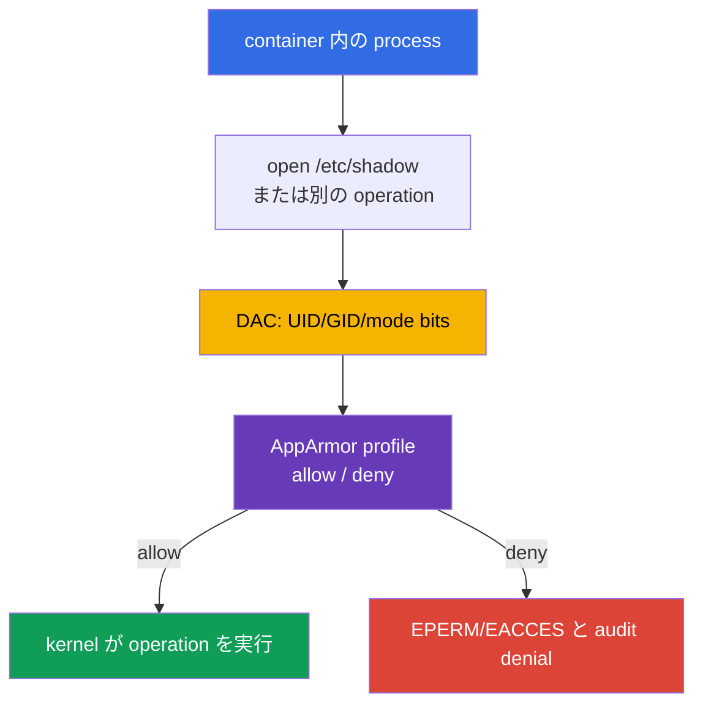

[Русская версия](ru.md) · [Eng version](README.md) · [Versión en español](es.md) · [Version française](fr.md) · [Deutsche Version](de.md) · [ქართული ვერსია](ge.md) · [繁體中文版](tw.md)

# 第16章. AppArmor

> **課題。** container 内の Shell または application error は、適切な UID または capability を持つ process が sensitive path を読める、file を実行できる、または通常の Linux permissions が許す kernel object に access できる場合、より危険になります。mandatory policy がなければ、kernel は UID だけでなく workload の用途に応じてこれらの action を制限しません。

> **この後。** 第14〜15章では host surface と host への access を減らしました。次に container process に mandatory access control（MAC）を追加します。AppArmor は file、capabilities、network、その他の kernel object に対する明示的な action だけを許可します。これは CKS の **System Hardening** domain（10%）です。次章では同じ defence-in-depth を、system call を filter する seccomp で完成させます。

> **CKA で必要な知識。** 基本的な `securityContext`、non-root execution、capabilities、`allowPrivilegeEscalation` は[CKA 第20章](../../../cka/course/20/jp.md)で扱い、[CKA Lab 106](../../../cka/labs/106/README_JP.MD)で練習します。ここで `securityContext` は Kubernetes から AppArmor profile への interface であり、主な task は node 上で profile を準備し、Pod に割り当て、deny が実際に機能したことを証明することです。

> 🧠 AppArmor は process と kernel の間の path-based MAC です。DAC、capabilities、seccomp、RBAC を補完しますが、これらの layer を置き換えません。

## 16.1. AppArmor: process と kernel の間の policy

通常の Linux permissions（DAC）は UID、GID、mode bits を確認します。process が適切な UID または capability を得た場合、DAC check だけでは不十分なことがあります。**AppArmor** は Mandatory Access Control を追加します。kernel は process action を profile と照合し、privilege を持つ process でも policy の deny を自ら取り消せません。Kubernetes には重要な特例があります。`privileged` container は割り当てられた AppArmor profile を無視して、この制限なしに起動します。そのため privileged は AppArmor barrier ではありません。



AppArmor は path-based MAC です。rule は path と operation を記述します。たとえば read `r`、write `w`、append `a`、`l`（link）、`k`（lock）、`m`（memory map）、execution transition の `ix`/`px`/`cx` です。mount operation は file permissions でなく別の rule class に属します。profile は `exec` 時または container start 時に process へ適用されます。child process は通常 inherit するか、policy rule に従って transition します。これは UID、capability、seccomp、NetworkPolicy、RBAC の代替ではありません。各 layer は別の attack path を制限します。

| Layer | 答える問い | control の例 |
|---|---|---|
| DAC | UID/GID は object に通常の permission を持つか？ | owner と `0640` |
| AppArmor | profile はこの action と path を許可するか？ | `deny /etc/shadow r,` |
| capabilities | 個別の kernel privilege を持つか？ | `CAP_SYS_ADMIN` がない |
| seccomp | syscall は許可されるか？ | `mount(2)` は deny |
| RBAC | identity は Kubernetes API を呼べるか？ | `get secrets` なし |

AppArmor は Ubuntu と Debian で特に一般的です。SELinux-oriented node では AppArmor profile でなく label と type enforcement を使います。最初に node image の actual mechanism を定めます。AppArmor profile を SELinux に持ち込み、適用されると期待してはいけません。

> 🎯 `enforce` と `complain` を区別し、actual node に profile を load し、`securityContext.appArmorProfile` を割り当て、process の effective profile を確認します。

## 16.2. Profile と enforce/complain mode

Profile は unique name を持つ policy で、kernel に load されます。file は通常 `/etc/apparmor.d/` にありますが、file の存在ではなく parser による successful load が profile を**active**にします。node reboot 後は AppArmor package または managed node configuration がそれを restore する必要があります。

profile には二つの重要な mode があります。

| Mode | Behavior | 使用する場面 |
|---|---|---|
| `enforce` | policy 外の operation を block し、kernel が denial を記録する | test 後の standard production mode |
| `complain` | operation は許可するが、violation を audit/log に記録する | real workload の observation と policy の改善 |

`complain` は protection ではありません。minimal policy を作る data を集めるものです。profile が許可しない operation は通常この mode では通過し log に記録されますが、**explicit `deny` は一致する operation を引き続き block します**。application error の permanent compensation として `complain` を残してはいけません。permission の review 後に profile を `enforce` へ移し、expected deny と共に useful scenario を確認します。

minimal demonstration profile は原理を示します。`/** rix,` rule は、example で各 loader と library を列挙しなくてよいよう意図して broad です。production では具体的な path、abstraction、必要な operation に置き換えます。

```text
# /etc/apparmor.d/k8s-demo
#include <tunables/global>

profile k8s-demo flags=(attach_disconnected,mediate_deleted) {
  #include <abstractions/base>

  /** rix,
  audit deny /etc/shadow r,
}
```

`deny` は一致する operation の allow rule より priority を持ちます。この profile は isolated exercise だけに適します。production policy は process requirement、readonly/writable directory、socket、certificate、explicit execution transition から始まります。

## 16.3. Node: parser、`aa-status`、profile lifecycle

`Localhost` では Kubernetes は profile text を kubelet に渡さず、node 間に copy もしません。workload の execution が許可される各 node で、exact name を持つ named `Localhost` profile を事前に kernel へ load する必要があります。`RuntimeDefault` は container runtime が提供します。user は named `Localhost` profile を `/etc/apparmor.d` へ事前に配布する必要がありません。

node では最初に AppArmor が enabled か確認してから、policy を load し inventory します。

```bash
# node 上で実行する。通常の Pod 内ではない。
sudo cat /sys/module/apparmor/parameters/enabled
# Expected: Y

sudo aa-status
sudo apparmor_status
sudo apparmor_parser -r -W /etc/apparmor.d/k8s-demo
# Presence と kernel effective mode。単なる aa-status grep は mode の証明にならない。
sudo aa-status | grep -F 'k8s-demo'
sudo grep -F 'k8s-demo' /sys/kernel/security/apparmor/profiles
```

`aa-status`（alias は `apparmor_status`）は、module が enabled か、何個の profile が load されているか、どの process が enforce/complain にあるかを表示します。`apparmor_parser` は policy を読んで kernel へ渡します。主要な operation は次のように覚えると便利です。

```bash
# 新しい profile を追加するか、file の変更後に load 済み profile を置換する。
sudo apparmor_parser -r -W /etc/apparmor.d/k8s-demo

# block せず temporary に audit signal を集め、その後 enforcement を有効にする。
sudo aa-complain /etc/apparmor.d/k8s-demo
sudo grep -F 'k8s-demo' /sys/kernel/security/apparmor/profiles
sudo aa-enforce /etc/apparmor.d/k8s-demo
sudo grep -F 'k8s-demo' /sys/kernel/security/apparmor/profiles

# controlled decommission のときだけ kernel から profile を削除する。
sudo apparmor_parser -R /etc/apparmor.d/k8s-demo
```

`-r` は load 済み version を置換し、`-R` は unload します。`aa-complain` と `aa-enforce` は load 済み profile の mode を切り替え、自ら reload を実行します。mode 変更そのものに Pod restart は必要ありません。remove の前に、まだそれを使う Pod と process を見つけます。production node で policy を推測して編集してはいけません。error により workload が start できなくなる、または reload 後に application が壊れる可能性があります。最初に syntax と dedicated node での rollout を確認します。

`apparmor_parser` flag を区別します。`-p` は `#include` だけを展開し結果を表示します。`-Q` は policy を compile しますが kernel に load しません。`-r` は load 済み version を置換します。safe check には `-Q -K` を使い、次に `-r -W` を使います。

```bash
# -Q は kernel へ load せず compile する。-K は cache の再利用を禁止する。
# -p は完全な compile check ではない。
sudo apparmor_parser -Q -K /etc/apparmor.d/k8s-demo >/dev/null
sudo apparmor_parser -r -W /etc/apparmor.d/k8s-demo
sudo aa-status
```

`aa-status` は Kubernetes specification でなく node の state を示します。複数 node pool の cluster では各 pool を確認します。scheduler は `/etc/apparmor.d` の内容を知らず、それだけでは選択した node に `Localhost` profile があることを保証しません。

## 16.4. Kubernetes API: 現行の `appArmorProfile`

現行の Kubernetes API は `securityContext.appArmorProfile` で profile を指定します。field は Pod `securityContext` 内で container の baseline にでき、より狭い policy が必要なら individual container の `securityContext` にも置けます。必要なく一つの Pod に異なる profile を与えてはいけません。audit と investigation を複雑にします。

| `type` | Meaning | 使用する場面 |
|---|---|---|
| `RuntimeDefault` | container runtime が提供する profile | runtime と node が support する場合の安全な common baseline |
| `Localhost` | node に事前 load された named profile | verified application-specific policy |
| `Unconfined` | AppArmor は container を制限しない | explicit risk owner を持つ diagnostic temporary exception のみ |

明示的な `type: RuntimeDefault` は、利用可能な AppArmor を要求します。これがなければ Pod は admission されません。`appArmorProfile` が指定されない場合、runtime default は利用可能な AppArmor があるときだけ適用されます。なければ container は AppArmor restriction なしで起動します。したがって field がないことは explicit な `RuntimeDefault` と同じではありません。

通常の workload では runtime profile と他の basic restriction から始めます。

```yaml
apiVersion: v1
kind: Pod
metadata:
  name: runtime-default-aa
  namespace: demo
spec:
  securityContext:
    appArmorProfile:
      type: RuntimeDefault
  containers:
  - name: app
    image: nginx:1.30.4
    securityContext:
      allowPrivilegeEscalation: false
      capabilities:
        drop: ["ALL"]
```

custom `Localhost` profile では、`/etc/apparmor.d/` path や legacy `localhost/` prefix なしに、kernel へ load した正確な name を指定します。

```yaml
apiVersion: v1
kind: Pod
metadata:
  name: apparmor-localhost
  namespace: demo
spec:
  # profile が全 node にない場合、placement restriction は contract の一部。
  nodeSelector:
    kubernetes.io/hostname: worker-1
  securityContext:
    appArmorProfile:
      type: Localhost
      localhostProfile: k8s-demo
  containers:
  - name: app
    image: busybox:1.36.1
    command: ["sh", "-c", "sleep 3600"]
    securityContext:
      allowPrivilegeEscalation: false
      capabilities:
        drop: ["ALL"]
```

apply 前に `worker-1` 上で `k8s-demo` を準備し、後で start を待ち、manifest、placement、process の effective profile を確認します。

```bash
kubectl apply -f apparmor-localhost.yaml
kubectl wait -n demo --for=condition=Ready pod/apparmor-localhost --timeout=120s
kubectl get pod -n demo apparmor-localhost -o wide
kubectl get pod -n demo apparmor-localhost \
  -o jsonpath='{.spec.securityContext.appArmorProfile}{"\n"}'
kubectl exec -n demo apparmor-localhost -- cat /proc/1/attr/current
```

最後の command は、container の PID 1 を kernel がどの profile で実行するかを確認します。output は runtime に依存し、括弧内に mode を含むことがあります。これは YAML だけの check より強力です。YAML が正しくても、profile のない node では container が start できないことがあります。

> 🔬 Beta annotation は old manifest を認識し安全に migrate するためのものです。new workload では `securityContext.appArmorProfile` だけを使います。

## 16.5. Legacy annotation: 読む、migrate する、混在させない

Kubernetes v1.30 より前は、AppArmor を beta annotation により per-container で指定していました。

```yaml
metadata:
  annotations:
    container.apparmor.security.beta.kubernetes.io/app: localhost/k8s-demo
```

complete legacy value は mode に依存します。`runtime/default`、`unconfined`、または `localhost/<profile-name>` です。key は**正確な container name**で終わらなければなりません。たとえば container `app` の old Pod は次のとおりです。

```yaml
apiVersion: v1
kind: Pod
metadata:
  name: apparmor-legacy
  namespace: demo
  annotations:
    container.apparmor.security.beta.kubernetes.io/app: localhost/k8s-demo
spec:
  containers:
  - name: app
    image: busybox:1.36.1
    command: ["sh", "-c", "sleep 3600"]
```

これは legacy interface です。new manifest では `securityContext.appArmorProfile` を使います。特に異なる value で、new field と annotation の両方を持つ一 object を作ってはいけません。migration では最初に Kubernetes と runtime の version を調べ、annotation を equivalent API field に置き換え、test node に apply して `/proc/1/attr/current` を確認します。

old object の quick audit:

```bash
kubectl get pod -A -o json | jq -r '
  .items[]
  | select(.metadata.annotations != null)
  | .metadata.annotations
  | to_entries[]
  | select(.key | startswith("container.apparmor.security.beta.kubernetes.io/"))
  | [.key, .value] | @tsv'

kubectl get pod -A -o jsonpath='{range .items[*]}{.metadata.namespace}{"/"}{.metadata.name}{"\t"}{.spec.securityContext.appArmorProfile}{"\n"}{end}'
```

empty Pod audit result は、container-level override または controller 内の legacy configuration がないことを証明しません。Deployment、StatefulSet、DaemonSet、Job、CronJob の template も追加で確認します。最初の四つは `.spec.template.metadata.annotations`、`.spec.template.spec.securityContext.appArmorProfile`、container override、CronJob は `.spec.jobTemplate.spec.template` 配下の同じ field です。migration では、controller/template manifest を修正し、それが作成した Pod だけを修正しません。

> 🎯 container creation error と runtime denial を区別してから、node、name、profile load、effective enforcement、kernel evidence を確認します。原因を `Unconfined` に置き換えてはいけません。

## 16.6. Start failure と denial: 正しい layer で診断する

`Localhost` profile には二つの異なる failure category があります。

1. **container が作成されない。** node で AppArmor が disabled、runtime が必要な mode を support しない、profile name が load されていない、または Pod が別の node に置かれました。これは lifecycle failure です。Pod event と kubelet/runtime state を探します。
2. **container は動作するが action が拒否される。** `enforce` の profile が path、capability、network、mount、または他の object を block します。これは runtime denial です。application は通常 `Permission denied` を受け、kernel は `apparmor="DENIED"` を記録します。

Kubernetes から始め、次に actual node へ進みます。

```bash
NS=demo
POD=apparmor-localhost

kubectl get pod -n "$NS" "$POD" -o wide
kubectl describe pod -n "$NS" "$POD"
kubectl get events -n "$NS" \
  --field-selector involvedObject.name="$POD" --sort-by=.lastTimestamp
kubectl get pod -n "$NS" "$POD" -o yaml
```

status が `Pending`、`ContainerCreating`、`CreateContainerError`、または container が Ready にならない場合、event は通常 profile name または node-local cause を示します。`-o wide` から node を取得し、許可された administrative access だけで接続して確認します。

```bash
# scheduler が選択した node 上で実行する。
sudo aa-status
sudo aa-status | grep -F 'k8s-demo'
sudo journalctl -u kubelet --since '15 minutes ago'
if command -v ausearch >/dev/null 2>&1 && sudo systemctl is-active --quiet auditd; then
  sudo ausearch -m AVC,USER_AVC -ts recent | grep -F 'apparmor=' || true
elif sudo test -r /var/log/audit/audit.log; then
  sudo grep -F 'apparmor=' /var/log/audit/audit.log || true
else
  sudo journalctl -k --since '15 minutes ago' | grep -Ei 'apparmor|denied' || true
  sudo dmesg --level=err,warn | grep -Ei 'apparmor|denied' || true
fi
```

この failure を `Localhost` から `Unconfined` または `privileged: true` へ変えて修復してはいけません。最初に manifested Pod の type と name、node name、`aa-status`、runtime version、profile delivery method を照合します。profile が dedicated pool にだけ存在すべきなら、workload を `nodeSelector`、affinity、または trusted label に固定し、label 自体は node management process で保護します。

## 16.7. enforce と complain の検証

`aa-status` に name が存在するだけでなく、process の effective mode を確認します。`audit deny /etc/shadow r,` は `complain` でも block するため、これは audited explicit deny の test であり `enforce` の証明ではありません。mode probe では implicitly denied な write を使います。profile は `/` への write を許可していません。

```bash
kubectl exec -n demo apparmor-localhost -- cat /proc/1/attr/current
# Expected: k8s-demo (enforce)
kubectl exec -n demo apparmor-localhost -- touch /aa-mode-probe-enforce
# Expected Permission denied: implicit denial in enforce.
kubectl exec -n demo apparmor-localhost -- cat /etc/shadow
# Expected Permission denied and audit evidence: audit deny.

sudo aa-complain /etc/apparmor.d/k8s-demo
sudo grep -F 'k8s-demo' /sys/kernel/security/apparmor/profiles
kubectl exec -n demo apparmor-localhost -- cat /proc/1/attr/current
# Expected: k8s-demo (complain)
kubectl exec -n demo apparmor-localhost -- touch /aa-mode-probe-complain
# Expected success and ALLOWED/complain telemetry.
kubectl exec -n demo apparmor-localhost -- cat /etc/shadow
# Permission denied: explicit audit deny applies in complain too.
sudo aa-enforce /etc/apparmor.d/k8s-demo
```

evidence では最初に audit subsystem（active auditd では `ausearch`、次に `/var/log/audit/audit.log`）を確認します。`journalctl -k` と `dmesg` は fallback です。source が使えない場合は denial がない証明ではなく `REVIEW_REQUIRED` です。


## 16.8. この知識が役立つ場面: 試験と実務

**試験で。** node を素早く定め、`aa-status` を確認し、必要な profile を `apparmor_parser` で load または置換し、条件に従って `aa-enforce`/`aa-complain` に移し、Pod に現行の `appArmorProfile` を指定します。apply 後は YAML だけを見ません。`kubectl describe pod`、`/proc/1/attr/current`、source-aware AppArmor audit evidence が scheduling/profile delivery error と real denial を区別します。denial はまず active auditd なら `ausearch`、または `/var/log/audit/audit.log` で探します。`journalctl -k` と `dmesg` は specific node の fallback として使います。old annotation は認識しますが、task が legacy compatibility を明示的に要求する場合だけ使います。

**実務で。** AppArmor が vulnerable process の impact を減らすのは、policy が必要なすべての node に配布され、real application contract を反映し、監視される場合だけです。automatic profile rollout、short complain period、new permission の review、`DENIED` の alert により、「node のどこかにある policy file」でなく verifiable boundary ができます。

> 🎯 AppArmor profile が適用されない理由、または workload が start しない理由を診断できること。

### 16.8.1. Troubleshooting: 「profile が機能しない理由は…」

以下で `NS`、`POD`、`CTR` は namespace、Pod、container を指します。最初に常に actual node を確認します。別 node での AppArmor diagnostic は container について何も証明しません。

#### scheduler が Pod を置いた node に profile が load されていない

multi-node cluster では、`apparmor_parser` が `worker-1` で成功していても、Pod が `worker-2` に置かれることがあります。Kubernetes は node 間で profile を移さず、scheduler は kernel policy の内容を読みません。その結果、`Localhost` は通常 container creation error を出すか、rollout が一部 replica だけで動作します。

```bash
NS=demo
POD=apparmor-localhost

kubectl get pod -n "$NS" "$POD" -o wide
kubectl describe pod -n "$NS" "$POD"
# NODE column の node に接続する。
sudo aa-status | grep -F 'k8s-demo'
sudo journalctl -u kubelet --since '15 minutes ago'
```

Fix: rollout 前に allowed pool の各 node へ `sudo apparmor_parser -r -W` で profile を配布して load するか、managed delivery を持つ pool に Pod を `nodeSelector`/affinity で固定します。`Localhost` を `Unconfined` に変えて修復してはいけません。

#### manifest の name が profile 内の name と一致しない

`localhostProfile` と legacy value の `localhost/<name>` は、必ずしも file name ではなく profile 自体で宣言した name を参照します。file `/etc/apparmor.d/k8s-demo` では `profile k8s-demo {` の string が name です。file name が `k8s-demo` のままでも `profile web-app {` なら `localhostProfile: web-app` が必要です。

```bash
# actual node 上: policy 内の name と actual に load された name を比較する。
sudo grep -nE '^[[:space:]]*profile[[:space:]]+' /etc/apparmor.d/k8s-demo
sudo aa-status | grep -F 'k8s-demo'
sudo aa-status | grep -F 'web-app'

# Kubernetes 上: migration 中は new API と legacy annotation の両方を確認する。
kubectl get pod -n "$NS" "$POD" \
  -o jsonpath='{.spec.securityContext.appArmorProfile.localhostProfile}{"\n"}'
kubectl describe pod -n "$NS" "$POD"
```

Fix: declaration、`localhostProfile`、まだ使用中なら legacy annotation を一つの exact name に合わせます。次に `apparmor_parser -r -W` で profile を reload し、新しい Pod を作成します。old process は corrected policy が割り当てられた証明ではありません。

#### `complain` では application が動作するが、`enforce` では `Permission denied` になる

通常、policy に path または operation の必要な `allow` がありません。たとえば runtime directory、certificate、Unix socket、または application が start 後にのみ読む file です。`complain` では allow の欠如は通常 log だけに記録されますが、`enforce` では block されます。explicit `deny` は異なります。`complain` でも block するので、test のために削除してはいけません。

```bash
# controlled probe の後、actual node で実行する: auditd/audit.log first、journal/dmesg fallback。
sudo aa-status | grep -F 'k8s-demo'
if command -v ausearch >/dev/null 2>&1 && sudo systemctl is-active --quiet auditd; then
  sudo ausearch -m AVC,USER_AVC -ts recent | grep -E 'apparmor="DENIED"|profile="k8s-demo"' || true
elif sudo test -r /var/log/audit/audit.log; then
  sudo grep -E 'apparmor="DENIED"|profile="k8s-demo"' /var/log/audit/audit.log || true
else
  # auditd/audit.log が使えない場合、kernel logging は有効な fallback。
  if sudo journalctl -k --since '10 minutes ago' >/dev/null 2>&1; then
    sudo journalctl -k --since '10 minutes ago' | \
      grep -E 'apparmor="DENIED"|profile="k8s-demo"' || true
  elif sudo dmesg >/dev/null 2>&1; then
    sudo dmesg | grep -i apparmor || true
  else
    echo 'REVIEW_REQUIRED: no readable AppArmor audit source' >&2
  fi
fi

# Kubernetes で container と observed symptom を記録する。
kubectl describe pod -n "$NS" "$POD"
kubectl logs -n "$NS" "$POD" -c "$CTR" --tail=100
```

Fix: denial の `operation=` と `name=` を application contract と対応付け、test node に minimal で justified な allow rule を追加し、positive と negative scenario を確認してから `aa-enforce` を有効にします。broad な `/** rw,` を追加したり、production workload を無期限の `complain` にしてはいけません。

#### node または runtime が AppArmor を support しない、または profile が file にあるだけ

AppArmor には enabled かつ active な LSM を持つ Linux kernel が必要です。non-Linux node、AppArmor のない kernel、または support しない runtime では profile assignment は working barrier になりません。また kubelet は directory を scan して AppArmor policy を load **しません**。`/etc/apparmor.d/` の file は、`apparmor_parser` が kernel に渡すまで単独では無意味です。YAML error を探す前にこれを確認します。

```bash
# actual node 上。
uname -s
sudo cat /sys/module/apparmor/parameters/enabled 2>/dev/null || true
sudo aa-status
sudo dmesg | grep -i apparmor || true
sudo journalctl -k --since '15 minutes ago' | grep -Ei 'apparmor|lsm' || true
sudo journalctl -u kubelet --since '15 minutes ago'

# Kubernetes event は unsupported runtime または unloaded profile を示すことが多い。
kubectl describe pod -n "$NS" "$POD"
```

Fix: AppArmor を enabled にし compatible runtime を持つ Linux node pool を使うか、その platform で AppArmor を required control と宣言しません。supported node では file を managed configuration に保管し、target node ごとに `apparmor_parser` で明示的に load します。kubelet directory を policy delivery mechanism と考えてはいけません。

> ### 🔴 攻撃者の視点
> **Asset:** container が access できる host filesystem と syscall。
>
> **Starting foothold:** container 内の RCE。
>
> **Attacker objective:** application の境界外で action を実行する。protected path に access するか、forbidden syscall を実行する。
>
> **Abuse path:** profile が不正に load または命名されている、あるいは `enforce` でなく `complain` にある場合、profile boundary を越えようとする。
>
> **Expected evidence:** accessible audit source の effective AppArmor profile と denial event: `ausearch`/`audit.log`、または fallback としての `journalctl -k`/`dmesg`。
>
> **Control:** `enforce` mode の verified profile と `aa-status` による確認。
>
> **Retest:** fix 後も forbidden operation が block されたままであること。

## 16.9. Self-check question

<details>
<summary>1. AppArmor が UID/GID、capabilities、seccomp、RBAC を置き換えないのはなぜですか？</summary>

これらの control は異なる問いに答えます。DAC は UID/GID と mode bits、capabilities は個別の kernel privilege、seccomp は許可される syscall、RBAC は identity の Kubernetes API access を確認します。AppArmor は profile による process action の path-based MAC を追加します。したがって profile は non-root、dropped capabilities、seccomp、minimal RBAC の必要性を補完しますが、なくすものではありません。
</details>

<details>
<summary>2. `enforce` と `complain` はどう異なり、なぜ後者を protection と見なせないのですか？</summary>

`enforce` では policy 外の operation が block され、kernel が denial を記録します。`complain` では通常、許可されない operation が実行されて log に記録され、real application requirement を集めます。explicit `deny` は一致を引き続き block します。この mode は policy 改善の temporary use には有用ですが、permanent protection barrier ではありません。
</details>

<details>
<summary>3. `aa-status` と `apparmor_parser -r` は profile state のどの異なる部分を証明しますか？</summary>

`aa-status` は node 上の AppArmor state、enabled module、load 済み profile、その mode、process を表示します。`apparmor_parser -r -W <file>` は policy を syntax として読み、load 済み version を kernel に追加または置換します。file の存在だけでは何も証明しません。parser の後、`aa-status` で name と mode を確認する必要があります。
</details>

<details>
<summary>4. `kubectl apply` が成功しても、なぜ `Localhost` profile は `CreateContainerError` を起こし得ますか？</summary>

`kubectl apply` は manifest を受け入れますが、container runtime が `Localhost` を適用できるのは、exact name を持つ profile が scheduler が選んだ node の kernel に事前 load されている場合だけです。その node に profile がない、AppArmor/runtime が必要な mode を support しない、または Pod が別 node pool に置かれることがあります。原因は `kubectl describe pod`、event、actual node、`aa-status`、kubelet log で探します。
</details>

<details>
<summary>5. 許可される `appArmorProfile.type` value は何で、`Unconfined` はいつ正当化されますか？</summary>

許可されるのは `RuntimeDefault`、`Localhost`、`Unconfined` です。`RuntimeDefault` は available AppArmor で common baseline を提供し、`Localhost` は node に事前 load された verified application-specific profile 用です。`Unconfined` が正当化されるのは explicit risk owner を持つ temporary diagnostic exception だけであり、profile failure を修復する方法ではありません。
</details>

<details>
<summary>6. name が `app`、profile が `k8s-demo` の container に対する legacy AppArmor annotation はどう書きますか？</summary>

key は exact container name で終わる必要があり、Localhost の value には legacy prefix を付けます。この場合は `container.apparmor.security.beta.kubernetes.io/app: localhost/k8s-demo` です。これは audit と migration 用の beta annotation です。new manifest では `securityContext.appArmorProfile` を使い、二つの interface を混在させません。
</details>

<details>
<summary>7. 選択された node、process の effective profile、block された action を同時に証明する command は何ですか？</summary>

選択された node は `kubectl get pod -n demo apparmor-localhost -o wide` で示し、その node で profile の存在を `sudo aa-status | grep -F 'k8s-demo'` で確認します。PID 1 の effective profile は `kubectl exec -n demo apparmor-localhost -- cat /proc/1/attr/current` で確認します。deny は expected `Permission denied` を伴う `kubectl exec ... -- cat /etc/shadow` と、その node source の対応する AppArmor audit event で確認します。auditd/`audit.log`、または fallback として kernel journal を使います。
</details>

<details>
<summary>8. **Flashback（第18章）。** 第18章の PSA `restricted` は seccomp に `RuntimeDefault`/`Localhost` を要求しますが、disabled default を除き specific AppArmor profile を要求**しません**。built-in PSA が検査する範囲はどこまでで、この章で explicit に割り当てた `Localhost` AppArmor profile だけが閉じられる範囲はどこからですか？</summary>

PSA は built-in standard に対する Pod-spec の許容性を検査します。これには disabled でない AppArmor default と seccomp の `RuntimeDefault`/`Localhost` が含まれますが、specific application の path と operation contract は model 化しません。node-local named AppArmor policy の配布や確認もしません。explicit な `Localhost` profile は次の範囲を閉じます。選択した node 上で kernel が enforce する、specific の allowed path、file operation、capability、network、mount rule です。
</details>

## Practice

まず[CKA Lab 106](../../../cka/labs/106/README_JP.MD)で `securityContext`、non-root execution、capabilities を練習します。これは chapter topic の main practice ではなく prerequisite です。次に test node で `k8s-demo` profile を作り、`apparmor_parser` で load し、`appArmorProfile.type: Localhost` を持つ Pod を割り当て、`complain` と `enforce` の behavior を比較します。次の[第17章](../17/jp.md)で seccomp を追加します。AppArmor は profile の object と operation を制限し、seccomp は process が利用できる syscall set を制限します。

🧪 メイン CKS practice: [Lab 106 - AppArmor と seccomp](../../labs/106/README_JP.MD)

📘 Prerequisite / 補助 practice（SecurityContext と capabilities）:
[tasks/cka/labs/106](../../../cka/labs/106/README_JP.MD)
🌐 追加 interactive practice（killer.sh/killercoda、external resource）: [apparmor](https://killercoda.com/killer-shell-cks/scenario/apparmor)

## Links

- [Kubernetes: AppArmor による container resource access の制限](https://kubernetes.io/docs/tutorials/security/apparmor/)
- [Kubernetes API: AppArmorProfile](https://kubernetes.io/docs/reference/kubernetes-api/workload-resources/pod-v1/#AppArmorProfile)
- [AppArmor: official documentation](https://apparmor.net/)
- [AppArmor project: Wiki](https://gitlab.com/apparmor/apparmor/-/wikis/home)
- [Kubernetes: Pod Security Standards](https://kubernetes.io/docs/concepts/security/pod-security-standards/)

---
[目次](../README_JP.md) · [第15章](../15/jp.md) · [第17章](../17/jp.md)
