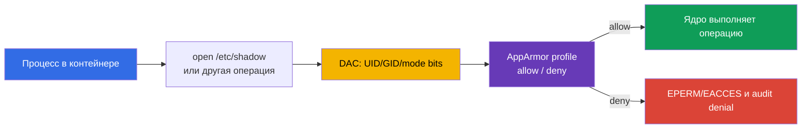

[Eng version](README.md) · [Versión en español](es.md) · [Version française](fr.md) · [Deutsche Version](de.md) · [ქართული ვერსია](ge.md) · [繁體中文版](tw.md) · [日本語版](jp.md)

# Глава 16. AppArmor

> **Что дальше.** В главах 14-15 мы уменьшили поверхность хоста и доступ к нему. Теперь
> добавим обязательный контроль доступа (MAC) для процессов контейнера: AppArmor разрешает
> только явно описанные действия с файлами, capabilities, сетью и другими объектами ядра.
> Это домен **System Hardening** CKS (10%). В следующей главе тот же defence-in-depth
> достроит seccomp, фильтрующий системные вызовы.

> **Что нужно из CKA.** Базовый `securityContext`, non-root запуск, capabilities и
> `allowPrivilegeEscalation` разобраны в [главе 20 CKA](../../../cka/course/20/ru.md) и
> отрабатываются в [лабе 106 CKA](../../../cka/labs/106/README_RU.MD). Здесь `securityContext`
> служит интерфейсом Kubernetes к profile AppArmor, а главная задача - подготовить profile на
> ноде, назначить его Pod и доказать, что запрет действительно сработал.

## 16.1. AppArmor: policy между процессом и ядром

Обычные права Linux (DAC) проверяют UID, GID и mode bits. Если процесс получил подходящий
UID либо capability, одной DAC-проверки может быть недостаточно. **AppArmor** добавляет
Mandatory Access Control: ядро сверяет действие процесса с profile, и даже процесс с
привилегиями не может сам отменить отказ policy.



AppArmor - path-based MAC: правила описывают пути и операции, например чтение `r`, запись
`w`, выполнение `ix`/`px`, создание `c`, rename `k`, lock `l` и mount. Profile применяют к
процессу при `exec` или при старте контейнера; дочерние процессы обычно наследуют либо
переходят в policy по её правилам. Это не замена UID, capability, seccomp, NetworkPolicy или
RBAC: каждый слой ограничивает другой путь атаки.

| Слой | На какой вопрос отвечает | Пример контроля |
|---|---|---|
| DAC | имеет ли UID/GID обычное право на объект? | owner и `0640` |
| AppArmor | допускает ли profile это действие и путь? | `deny /etc/shadow r,` |
| capabilities | есть ли отдельная привилегия ядра? | отсутствие `CAP_SYS_ADMIN` |
| seccomp | разрешён ли syscall? | `mount(2)` запрещён |
| RBAC | может ли identity вызвать Kubernetes API? | нет `get secrets` |

AppArmor особенно распространён на Ubuntu и Debian. На SELinux-ориентированной ноде
используют labels и type enforcement, а не AppArmor profile. Сначала определите реальный
механизм образа ноды; нельзя перенести профиль AppArmor в SELinux и ожидать применения.

## 16.2. Profile и режимы enforce/complain

Profile - policy с уникальным именем, загружаемая в kernel. Файлы обычно лежат в
`/etc/apparmor.d/`, но **активным** profile делает не наличие файла, а успешная загрузка
через parser. После перезагрузки ноды его должен восстанавливать пакет AppArmor либо
управляемая конфигурация ноды.

У profile два важных режима:

| Режим | Поведение | Когда использовать |
|---|---|---|
| `enforce` | операция вне policy блокируется; kernel пишет denial | штатный production-режим после теста |
| `complain` | операция разрешается, но нарушение записывается в audit/log | наблюдение за реальной нагрузкой и доработка policy |

`complain` не является защитой: он собирает данные для построения минимальной policy.
Нельзя оставить его как постоянную компенсацию ошибок приложения. После ревью разрешений
переводите profile в `enforce` и проверяйте полезный сценарий вместе с ожидаемым отказом.

Минимальный демонстрационный profile показывает принцип. Правило `/** rix,` намеренно
широкое, чтобы пример не требовал перечислять каждый loader и library; в production его
заменяют конкретными путями, abstractions и нужными операциями.

```text
# /etc/apparmor.d/k8s-demo
#include <tunables/global>

profile k8s-demo flags=(attach_disconnected,mediate_deleted) {
  #include <abstractions/base>

  /** rix,
  deny /etc/shadow r,
}
```

`deny` имеет приоритет над разрешающим правилом для совпавшей операции. Этот profile годится
только для изолированного упражнения: production-policy начинается с требований процесса,
readonly/writable directories, sockets, certificates и explicit execution transitions.

## 16.3. Нода: parser, `aa-status` и жизненный цикл profile

Kubernetes не передаёт текст profile kubelet и не копирует его между нодами. Kubelet и
runtime могут применить **только profile, уже загруженный в kernel именно той ноды**, где
будет создан контейнер. Поэтому profile - часть image pipeline, cloud-init, Ansible, DaemonSet
с доверенной моделью доставки или другого node configuration management.

На ноде сначала убедитесь, что AppArmor включён, затем загрузите и инвентаризируйте policy:

```bash
# На ноде, не внутри обычного Pod.
sudo cat /sys/module/apparmor/parameters/enabled
# Ожидается: Y

sudo aa-status
sudo apparmor_status
sudo apparmor_parser -r -W /etc/apparmor.d/k8s-demo
sudo aa-status | grep -F 'k8s-demo'
```

`aa-status` (синоним `apparmor_status`) показывает, включён ли module, сколько profile
загружено и какие процессы находятся в enforce/complain. `apparmor_parser` читает policy и
передаёт её kernel; основные операции удобно помнить так:

```bash
# Добавить новый либо заменить загруженный profile после изменения файла.
sudo apparmor_parser -r -W /etc/apparmor.d/k8s-demo

# Временно собрать audit-сигналы без блокировки, затем включить блокировку.
sudo aa-complain /etc/apparmor.d/k8s-demo
sudo aa-status | grep -F 'k8s-demo'
sudo aa-enforce /etc/apparmor.d/k8s-demo

# Удалить profile из kernel только при контролируемом выводе из эксплуатации.
sudo apparmor_parser -R /etc/apparmor.d/k8s-demo
```

`-r` заменяет загруженную версию; `-R` выгружает её. Перед удалением найдите Pod и процессы,
которые ещё могут её использовать. Не редактируйте policy на production-ноде наугад: ошибка
может не дать workload стартовать либо сломать приложение после reload. Сначала проверяйте
синтаксис и rollout на выделенной ноде.

```bash
sudo apparmor_parser -p /etc/apparmor.d/k8s-demo >/dev/null
sudo apparmor_parser -r -W /etc/apparmor.d/k8s-demo
sudo aa-status
```

`aa-status` показывает состояние на ноде, а не спецификацию Kubernetes. Для кластера с
несколькими node pool проверяйте каждый pool: scheduler не знает содержимое
`/etc/apparmor.d` и сам по себе не гарантирует, что `Localhost` profile есть на выбранной
ноде.

## 16.4. Kubernetes API: актуальный `appArmorProfile`

Актуальный API Kubernetes задаёт profile через
`securityContext.appArmorProfile`. Поле может быть в Pod `securityContext` как baseline для
контейнеров или в `securityContext` отдельного контейнера, если ему требуется более узкая
policy. Не выдавайте одному Pod разные profiles без необходимости: это усложняет audit и
расследование.

| `type` | Значение | Когда использовать |
|---|---|---|
| `RuntimeDefault` | профиль, поставляемый container runtime | безопасный общий baseline, если runtime и нода его поддерживают |
| `Localhost` | named profile, заранее загруженный на ноде | проверенная application-specific policy |
| `Unconfined` | AppArmor не ограничивает контейнер | только диагностическое временное исключение с явным владельцем риска |

Для обычной нагрузки начните с runtime profile и других базовых ограничений:

```yaml
apiVersion: v1
kind: Pod
metadata:
  name: runtime-default-aa
  namespace: demo
spec:
  securityContext:
    appArmorProfile:
      type: RuntimeDefault
  containers:
  - name: app
    image: nginx:1.27.4
    securityContext:
      allowPrivilegeEscalation: false
      capabilities:
        drop: ["ALL"]
```

Для собственного `Localhost` profile указывают именно имя, загруженное в kernel, без пути
`/etc/apparmor.d/` и без legacy-префикса `localhost/`:

```yaml
apiVersion: v1
kind: Pod
metadata:
  name: apparmor-localhost
  namespace: demo
spec:
  # Ограничение placement - часть контракта, если profile есть не на всех нодах.
  nodeSelector:
    kubernetes.io/hostname: worker-1
  securityContext:
    appArmorProfile:
      type: Localhost
      localhostProfile: k8s-demo
  containers:
  - name: app
    image: busybox:1.36.1
    command: ["sh", "-c", "sleep 3600"]
    securityContext:
      allowPrivilegeEscalation: false
      capabilities:
        drop: ["ALL"]
```

Перед применением подготовьте `k8s-demo` на `worker-1`, а после - дождитесь старта и
проверьте manifest, placement и effective profile процесса:

```bash
kubectl apply -f apparmor-localhost.yaml
kubectl wait -n demo --for=condition=Ready pod/apparmor-localhost --timeout=120s
kubectl get pod -n demo apparmor-localhost -o wide
kubectl get pod -n demo apparmor-localhost \
  -o jsonpath='{.spec.securityContext.appArmorProfile}{"\n"}'
kubectl exec -n demo apparmor-localhost -- cat /proc/1/attr/current
```

Последняя команда подтверждает, под каким profile kernel исполняет PID 1 контейнера; вывод
зависит от runtime и может содержать режим в скобках. Это сильнее, чем проверка только
YAML: YAML может быть корректным, а container мог не стартовать на ноде без profile.

## 16.5. Legacy annotation: читать, мигрировать, не смешивать

До появления API-поля Kubernetes задавал AppArmor per-container через beta-аннотацию:

```yaml
metadata:
  annotations:
    container.apparmor.security.beta.kubernetes.io/app: localhost/k8s-demo
```

Полное legacy-значение зависит от режима: `runtime/default`, `unconfined` либо
`localhost/<profile-name>`. Ключ обязан оканчиваться **точным именем контейнера**. Например,
для container `app` старый Pod выглядел так:

```yaml
apiVersion: v1
kind: Pod
metadata:
  name: apparmor-legacy
  namespace: demo
  annotations:
    container.apparmor.security.beta.kubernetes.io/app: localhost/k8s-demo
spec:
  containers:
  - name: app
    image: busybox:1.36.1
    command: ["sh", "-c", "sleep 3600"]
```

Это legacy-интерфейс. Для новых manifest используйте `securityContext.appArmorProfile`;
не создавайте один объект одновременно с новым полем и аннотацией, особенно с разными
значениями. При миграции сначала выясните версию Kubernetes и runtime, замените annotation
на эквивалентное API-поле, примените на тестовой ноде и проверьте `/proc/1/attr/current`.

Быстрый audit старых объектов:

```bash
kubectl get pod -A -o json | jq -r '
  .items[]
  | select(.metadata.annotations != null)
  | .metadata.annotations
  | to_entries[]
  | select(.key | startswith("container.apparmor.security.beta.kubernetes.io/"))
  | [.key, .value] | @tsv'

kubectl get pod -A -o jsonpath='{range .items[*]}{.metadata.namespace}{"/"}{.metadata.name}{"\t"}{.spec.securityContext.appArmorProfile}{"\n"}{end}'
```

Пустой результат второго запроса не доказывает отсутствие container-level override; при
ревью production workload смотрите и `.spec.containers[*].securityContext.appArmorProfile`.

## 16.6. Отказ старта и denial: диагностировать на правильном слое

У `Localhost` profile есть две разные категории неисправностей.

1. **Контейнер не создаётся.** AppArmor выключен на ноде, runtime не поддерживает нужный
   режим, имя profile не загружено либо Pod попал на другую ноду. Это lifecycle failure:
   ищите event Pod и состояние kubelet/runtime.
2. **Контейнер работает, но действие отвергнуто.** Profile в `enforce` блокирует путь,
   capability, network, mount или другой объект. Это runtime denial: приложение обычно
   получает `Permission denied`, а kernel пишет `apparmor="DENIED"`.

Начинайте с Kubernetes, затем переходите на фактическую ноду:

```bash
NS=demo
POD=apparmor-localhost

kubectl get pod -n "$NS" "$POD" -o wide
kubectl describe pod -n "$NS" "$POD"
kubectl get events -n "$NS" \
  --field-selector involvedObject.name="$POD" --sort-by=.lastTimestamp
kubectl get pod -n "$NS" "$POD" -o yaml
```

Если status `Pending`, `ContainerCreating`, `CreateContainerError` или container не стал
Ready, событие обычно показывает имя profile или node-local причину. Получите ноду из
`-o wide`, подключитесь только с разрешённым административным доступом и проверьте:

```bash
# На ноде, выбранной scheduler.
sudo aa-status
sudo aa-status | grep -F 'k8s-demo'
sudo journalctl -u kubelet --since '15 minutes ago'
sudo journalctl -k --since '15 minutes ago' | grep -Ei 'apparmor|denied'
sudo dmesg --level=err,warn | grep -Ei 'apparmor|denied' || true
```

Не лечите такой сбой заменой `Localhost` на `Unconfined` или `privileged: true`. Сначала
сверьте тип и имя в manifested Pod, node name, `aa-status`, версию runtime и способ доставки
profile. Если profile должен жить только на отдельном pool, закрепите workload
`nodeSelector`, affinity или доверенным label, а сам label защищайте процессом управления
нодами.

## 16.7. Проверка enforce и complain

Проверка должна доказывать **и нормальную работу, и отрицательный сценарий**. Для
демонстрационного profile из раздела 16.2 используйте из уже работающего Pod чтение
разрешённого файла и запрещённого `/etc/shadow`:

```bash
kubectl exec -n demo apparmor-localhost -- sh -c '
  cat /etc/hostname
  cat /etc/shadow
'
# Первый вызов успешен; второй должен завершиться Permission denied.

kubectl exec -n demo apparmor-localhost -- cat /proc/1/attr/current
```

В `enforce` отказ обязателен и сопровождается kernel audit record. На ноде ищите профиль,
операцию и путь, а не ослабляйте policy по одному имени ошибки:

```bash
sudo journalctl -k --since '10 minutes ago' | \
  grep -E 'apparmor="DENIED"|profile="k8s-demo"'
```

В `complain` та же операция пройдёт, но станет telemetry. Переводить profile в complain
надо до создания **нового** test Pod или контролируемого restart workload: уже работающий
процесс не является надёжной проверкой того, какой profile назначит runtime следующему
container.

```bash
# На целевой ноде: наблюдение, test/restart Pod, сбор событий.
sudo aa-complain /etc/apparmor.d/k8s-demo
sudo aa-status | grep -F 'k8s-demo'

kubectl delete pod -n demo apparmor-localhost
kubectl apply -f apparmor-localhost.yaml
kubectl wait -n demo --for=condition=Ready pod/apparmor-localhost --timeout=120s
kubectl exec -n demo apparmor-localhost -- cat /etc/shadow

sudo journalctl -k --since '10 minutes ago' | grep -Ei 'apparmor|k8s-demo'

# После review минимальных разрешений вернуть настоящий барьер.
sudo aa-enforce /etc/apparmor.d/k8s-demo
```

Сохраняйте сам profile, версию image, вывод `aa-status`, node и expected/actual result в
change record. `complain`-лог показывает, что приложение сделало; он не означает, что это
действие следует автоматически разрешить. Разрешайте только обоснованный путь и операцию,
затем повторяйте тест в `enforce`.

## 16.8. Типичные ошибки и быстрый путь к причине

| Симптом | Вероятная причина | Что проверить и исправить |
|---|---|---|
| Pod не создаётся после `Localhost` | profile отсутствует на выбранной ноде | `kubectl describe pod`, node из `-o wide`, `aa-status`, delivery profile на весь допустимый pool |
| `aa-status` не видит profile после правки файла | файл не загружен либо parser сообщил syntax error | `apparmor_parser -p`, затем `apparmor_parser -r -W` |
| Application получает `Permission denied` | profile в enforce блокирует нужный путь/операцию | kernel `DENIED`, путь, operation; тестировать точечное правило в complain |
| `cat /proc/1/attr/current` не ожидаемый | смотрят не тот container, есть override или старый Pod | container name, Pod/container `securityContext`, recreate Pod после изменений |
| Legacy annotation не действует | ключ не совпадает с container name или версия ожидает current API | точное имя container; мигрировать на `appArmorProfile` |
| Profile есть на одной ноде, но rollout нестабилен | scheduler переносит реплики на node без profile | одинаковая delivery на pool либо node affinity/selector и проверка каждого pool |
| «Решение» - `Unconfined` или `privileged` | security control отключён вместо диагностики | восстановить least privilege, найти конкретный denial и сузить исключение |

## 16.9. Как это применяют в продакшене

- **Profile как код.** Храните profile рядом с workload и node-image/automation, тестируйте
  parser и rollout на каждом поддерживаемом pool. Файл в личной SSH-сессии не является
  управляемой конфигурацией.
- **Сначала RuntimeDefault, затем Localhost.** Runtime profile - полезный baseline для
  совместимого workload. Кастомный `Localhost` profile вводите для измеренной угрозы и
  известного процесса, а не как необоснованный deny-list.
- **Complain ограничен по времени.** Соберите требуемые операции на representative
  traffic, проведите review, включите enforce и поставьте alert на новые denials.
- **Policy и scheduling связаны.** AppArmor зависит от ноды. Либо доставляйте profile на
  все допустимые ноды, либо явно ограничивайте placement и проверяйте label/node pool.
- **Не один барьер.** Profile сочетается с non-root, `allowPrivilegeEscalation: false`,
  `capabilities.drop: [ALL]`, `seccompProfile: RuntimeDefault`, readonly filesystem,
  NetworkPolicy и минимальным RBAC. Ни один из них не заменяет остальные.

## 16.10. Мини-глоссарий

- **AppArmor** - path-based Linux MAC, ограничивающий операции процесса profile.
- **profile** - набор правил AppArmor с именем, загружаемый в kernel.
- **enforce** - режим, в котором нарушение policy блокируется.
- **complain** - режим журналирования нарушений без блокировки.
- **`aa-status`** - просмотр состояния AppArmor, загруженных profiles и режимов.
- **`apparmor_parser`** - проверка, загрузка, замена и выгрузка profile.
- **`RuntimeDefault`** - profile, поставляемый выбранным container runtime.
- **`Localhost`** - Kubernetes type для profile, заранее загруженного на ноде.
- **legacy annotation** - устаревшая beta-аннотация `container.apparmor.security.beta.kubernetes.io/<container>`.
- **denial** - audit-запись о действии, запрещённом AppArmor policy.

## 16.11. Итоги главы

- AppArmor - обязательный path-based контроль поверх обычных Linux permissions; он
  дополняет capabilities, seccomp и остальные security-границы.
- Profile сначала должен быть синтаксически корректен и загружен в kernel ноды;
  `aa-status` и `apparmor_parser` проверяют это, файл сам по себе - нет.
- `complain` собирает нарушения без блокировки, `enforce` реально блокирует. Полезный
  workflow: test -> complain -> review -> enforce -> проверка отказа.
- Новый Kubernetes API - `securityContext.appArmorProfile` с `RuntimeDefault`, `Localhost`
  или редким `Unconfined`; legacy annotation нужна для audit и миграции, не для новых Pod.
- `Localhost` profile - node-local dependency. Scheduler не доставляет его и может выбрать
  ноду без policy, поэтому необходимы единый node pool либо явное ограничение placement.
- Доказательство защиты включает manifest, node, `aa-status`, `/proc/1/attr/current`,
  expected denial приложения и kernel audit log.

## 16.12. Как это пригодится: на экзамене и в реальной работе

**На экзамене.** Быстро определите node, проверьте `aa-status`, загрузите либо замените
требуемый profile через `apparmor_parser`, переведите его `aa-enforce`/`aa-complain` по
условию и задайте Pod актуальным `appArmorProfile`. После применения смотрите не только
YAML: `kubectl describe pod`, `/proc/1/attr/current` и `journalctl -k` отличают ошибку
scheduling/profile delivery от настоящего denial. Старую annotation распознавайте, но
используйте её только если задача явно требует legacy-совместимость.

**В реальной работе.** AppArmor уменьшает последствия уязвимого процесса только тогда,
когда policy доставлена на все нужные ноды, отражает настоящий контракт приложения и
наблюдается. Автоматический rollout profile, короткий complain-период, review новых
разрешений и alert на `DENIED` создают проверяемую boundary вместо «файла policy где-то на
ноде».

## 16.13. Вопросы для самопроверки

1. Почему AppArmor не заменяет UID/GID, capabilities, seccomp или RBAC?
2. Чем `enforce` отличается от `complain`, и почему второй режим нельзя считать защитой?
3. Как `aa-status` и `apparmor_parser -r` доказывают разные части состояния profile?
4. Почему `Localhost` profile может дать `CreateContainerError` после успешного
   `kubectl apply`?
5. Какие значения `appArmorProfile.type` допустимы и когда оправдан `Unconfined`?
6. Как записывается legacy AppArmor annotation для container с именем `app` и profile
   `k8s-demo`?
7. Какие команды докажут одновременно выбранную ноду, effective profile процесса и
   заблокированное действие?

## Практика

Сначала отработайте `securityContext`, non-root запуск и capabilities в
[лабе 106 CKA](../../../cka/labs/106/README_RU.MD). Затем на test-ноде создайте profile
`k8s-demo`, загрузите его parser'ом, назначьте Pod с
`appArmorProfile.type: Localhost` и сравните поведение в `complain` и `enforce`. В следующей [главе 17](../17/ru.md) добавьте
seccomp: AppArmor ограничит объекты и операции profile, а seccomp - доступный процессу
набор syscalls.

🧪 Лаба 106 (SecurityContext и capabilities):
[tasks/cka/labs/106](../../../cka/labs/106/README_RU.MD)

---
[Оглавление](../README_RU.md) · [Глава 15](../15/ru.md) · [Глава 17](../17/ru.md)
