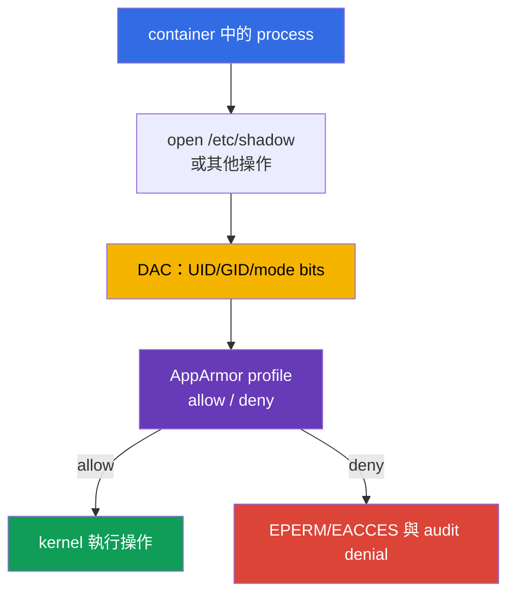

[Русская версия](ru.md) · [Eng version](README.md) · [Versión en español](es.md) · [Version française](fr.md) · [Deutsche Version](de.md) · [ქართული ვერსია](ge.md) · [日本語版](jp.md)

# 第 16 章。AppArmor

> **問題。** 若具備適當 UID 或 capability 的 process 可以讀取敏感路徑、執行檔案，或存取一般
> Linux permissions 所允許的 kernel objects，container 中的 shell 或 application error 便會更加
> 危險。沒有強制 policy 時，kernel 不會依 workload 的用途限制這些操作，而只會依 UID 限制。

> **接下來。** 第 14-15 章降低了 host 及對其存取的攻擊面。現在為 container processes 加上
> mandatory access control（MAC）：AppArmor 僅允許明確描述的檔案操作、capabilities、network
> 與其他 kernel objects。這是 CKS 的 **System Hardening** 領域（10%）。下一章會以過濾
> system calls 的 seccomp 完成同樣的 defence-in-depth。

> **需要的 CKA 基礎。** 基本的 `securityContext`、non-root execution、capabilities 與
> `allowPrivilegeEscalation` 見[CKA 第 20 章](../../../cka/course/20/tw.md)，並於
> [CKA Lab 106](../../../cka/labs/106/README_TW.MD)練習。本章中，`securityContext` 是
> Kubernetes 連接 AppArmor profile 的介面；主要任務是於 node 準備 profile、將它指派給 Pod，
> 並證明拒絕確實生效。

> 🧠 AppArmor 是 process 與 kernel 之間的 path-based MAC；它補足 DAC、capabilities、seccomp 與 RBAC，但不能取代任何一層。

## 16.1. AppArmor：process 與 kernel 之間的 policy

一般 Linux permissions（DAC）檢查 UID、GID 與 mode bits。若 process 取得適當 UID 或
capability，單靠 DAC 檢查可能不足。**AppArmor** 加入 Mandatory Access Control：kernel 將
process action 與 profile 比對，即使有 privileges 的 process 也無法自行撤銷 policy denial。
Kubernetes 有一個特殊情況：`privileged` container 會忽略指派的 AppArmor profile，並在沒有這項
限制下執行，因此 privileged 並不是 AppArmor barrier。



AppArmor 是 path-based MAC：rules 描述 paths 與 operations，例如讀取 `r`、寫入 `w`、
附加 `a`、`l`（link）、`k`（lock）、`m`（memory map），以及 execution transitions
`ix`/`px`/`cx`。Mount operations 屬於獨立 rule class，而不是 file permissions。Profile 在
`exec` 或 container start 時套用至 process；child processes 通常會依其 rules 繼承或轉換至
policy。它不能取代 UID、capability、seccomp、NetworkPolicy 或 RBAC：每個 layer 限制不同的
attack path。

| Layer | 回答的問題 | 控制範例 |
|---|---|---|
| DAC | UID/GID 是否具有物件的一般權限？ | owner 與 `0640` |
| AppArmor | profile 是否允許此 action 與 path？ | `deny /etc/shadow r,` |
| capabilities | 是否具有個別 kernel privilege？ | 沒有 `CAP_SYS_ADMIN` |
| seccomp | syscall 是否允許？ | 禁止 `mount(2)` |
| RBAC | identity 是否可呼叫 Kubernetes API？ | 沒有 `get secrets` |

AppArmor 在 Ubuntu 與 Debian 特別常見。以 SELinux 為主的 node 使用 labels 與 type enforcement，
而非 AppArmor profile。先確認 node image 的實際機制；不能將 AppArmor profile 移至 SELinux
並期望它生效。

> 🎯 區分 `enforce` 與 `complain`，在實際 node 載入 profile，指派 `securityContext.appArmorProfile`，並確認 process 的 effective profile。

## 16.2. Profile 與 enforce/complain modes

Profile 是具有唯一名稱、載入 kernel 的 policy。檔案通常位於 `/etc/apparmor.d/`，但讓 profile
成為**active** 的不是檔案存在，而是透過 parser 成功載入。node reboot 後，AppArmor package 或
受管理的 node configuration 必須恢復它。

Profile 有兩個重要 modes：

| Mode | 行為 | 使用時機 |
|---|---|---|
| `enforce` | policy 外的 operation 遭封鎖；kernel 寫入 denial | 測試後正常的 production mode |
| `complain` | operation 被允許，但 violation 會寫入 audit/log | 觀察實際 workload 並精進 policy |

`complain` 並非防護：它收集資料來建立最小 policy。在此 mode，profile 未允許的 operations
通常會通過並記錄，但**明確 `deny` 仍會封鎖**符合的 operation。不能將 `complain` 永久作為
application errors 的補償。review permissions 後，將 profile 轉為 `enforce`，並同時驗證正常
scenario 與預期 denial。

最小的 demonstration profile 說明其原理。`/** rix,` rule 有意設定寬鬆，讓範例不必列出每一個
loader 與 library；production 中應以具體 paths、abstractions 與必要 operations 取代它。

```text
# /etc/apparmor.d/k8s-demo
#include <tunables/global>

profile k8s-demo flags=(attach_disconnected,mediate_deleted) {
  #include <abstractions/base>

  /** rix,
  audit deny /etc/shadow r,
}
```

`deny` 對符合 operation 的允許 rule 具有優先權。此 profile 僅適合隔離練習：production policy
從 process requirements、readonly/writable directories、sockets、certificates 與 explicit
execution transitions 開始。

## 16.3. Node：parser、`aa-status` 與 profile lifecycle

對 Kubernetes `Localhost` 而言，kubelet 不會傳遞 profile text，也不會在 nodes 間複製它。
精確名稱的 named `Localhost` profile 必須事先載入 kernel 的每個允許 workload 執行的 node。
`RuntimeDefault` 由 container runtime 提供：使用者無需將 named `Localhost` profile 事先交付
到 `/etc/apparmor.d`。

先在 node 確認 AppArmor 已啟用，然後載入並盤點 policy：

```bash
# 在 node 上，而非一般 Pod 內。
sudo cat /sys/module/apparmor/parameters/enabled
# 預期：Y

sudo aa-status
sudo apparmor_status
sudo apparmor_parser -r -W /etc/apparmor.d/k8s-demo
# 是否存在及 kernel effective mode；單用 aa-status grep 並不足以證明 mode。
sudo aa-status | grep -F 'k8s-demo'
sudo grep -F 'k8s-demo' /sys/kernel/security/apparmor/profiles
```

`aa-status`（`apparmor_status` 的同義名稱）顯示 module 是否啟用、載入多少 profile，以及哪些
processes 處於 enforce/complain。`apparmor_parser` 讀取 policy 並傳遞給 kernel；主要操作可如此
記憶：

```bash
# 在檔案變更後新增或替換載入的 profile。
sudo apparmor_parser -r -W /etc/apparmor.d/k8s-demo

# 暫時收集 audit signals 而不封鎖，然後啟用封鎖。
sudo aa-complain /etc/apparmor.d/k8s-demo
sudo grep -F 'k8s-demo' /sys/kernel/security/apparmor/profiles
sudo aa-enforce /etc/apparmor.d/k8s-demo
sudo grep -F 'k8s-demo' /sys/kernel/security/apparmor/profiles

# 僅在受控制地停用時，才從 kernel 移除 profile。
sudo apparmor_parser -R /etc/apparmor.d/k8s-demo
```

`-r` 替換已載入版本；`-R` 卸載它。`aa-complain` 與 `aa-enforce` 切換已載入 profile 的 mode，
而且會自行 reload：僅為切換 mode 不需 restart Pod。移除前，找出可能仍使用它的 Pod 與
processes。不要隨意在 production node 編輯 policy：錯誤可能使 workload 無法 start，或在 reload
後破壞 application。先在專用 node 驗證 syntax 與 rollout。

請區分 `apparmor_parser` flags：`-p` 僅展開 `#include` 並列印結果；`-Q` 編譯 policy，卻不將其
載入 kernel；`-r` 替換已載入版本。安全檢查使用 `-Q -K`，然後使用 `-r -W`。

```bash
# -Q 在不載入 kernel 的情況下編譯；-K 禁止重用 cache。
# -p 並非完整的 compile check。
sudo apparmor_parser -Q -K /etc/apparmor.d/k8s-demo >/dev/null
sudo apparmor_parser -r -W /etc/apparmor.d/k8s-demo
sudo aa-status
```

`aa-status` 顯示 node 上的狀態，而非 Kubernetes specification。對有多個 node pools 的 cluster，
請檢查每個 pool：scheduler 不知道 `/etc/apparmor.d` 的內容，也不會自行保證選定 node 已存在
`Localhost` profile。

## 16.4. Kubernetes API：目前的 `appArmorProfile`

目前的 Kubernetes API 透過 `securityContext.appArmorProfile` 指定 profile。此 field 可在 Pod
`securityContext` 中作為 containers 的 baseline，或在個別 container 的 `securityContext` 中設定，
若它需要更窄的 policy。非必要時不要給同一 Pod 不同 profiles：這會使 audit 與 investigation
更複雜。

| `type` | 值 | 使用時機 |
|---|---|---|
| `RuntimeDefault` | container runtime 提供的 profile | 若 runtime 與 node 支援，安全的共同 baseline |
| `Localhost` | 事先載入 node 的 named profile | 已驗證、application-specific policy |
| `Unconfined` | AppArmor 不限制 container | 僅作為具有明確 risk owner 的暫時診斷例外 |

明確指定 `type: RuntimeDefault` 需要可用的 AppArmor：沒有它，這類 Pod 不會被接受。若未設定
`appArmorProfile`，runtime default 僅在 AppArmor 可用時套用；否則 container 在沒有 AppArmor
限制下啟動。因此，未指定 field 並不等同於明確的 `RuntimeDefault`。

一般 workload 以 runtime profile 與其他 baseline restrictions 開始：

```yaml
apiVersion: v1
kind: Pod
metadata:
  name: runtime-default-aa
  namespace: demo
spec:
  securityContext:
    appArmorProfile:
      type: RuntimeDefault
  containers:
  - name: app
    image: nginx:1.30.4
    securityContext:
      allowPrivilegeEscalation: false
      capabilities:
        drop: ["ALL"]
```

自訂 `Localhost` profile 指定的是載入 kernel 的名稱，不含 `/etc/apparmor.d/` path，也不含
legacy prefix `localhost/`：

```yaml
apiVersion: v1
kind: Pod
metadata:
  name: apparmor-localhost
  namespace: demo
spec:
  # 若 profile 並非存在所有 nodes，placement restriction 是 contract 的一部分。
  nodeSelector:
    kubernetes.io/hostname: worker-1
  securityContext:
    appArmorProfile:
      type: Localhost
      localhostProfile: k8s-demo
  containers:
  - name: app
    image: busybox:1.36.1
    command: ["sh", "-c", "sleep 3600"]
    securityContext:
      allowPrivilegeEscalation: false
      capabilities:
        drop: ["ALL"]
```

套用前，在 `worker-1` 準備 `k8s-demo`，之後等待 start 並檢查 manifest、placement 與 process 的
effective profile：

```bash
kubectl apply -f apparmor-localhost.yaml
kubectl wait -n demo --for=condition=Ready pod/apparmor-localhost --timeout=120s
kubectl get pod -n demo apparmor-localhost -o wide
kubectl get pod -n demo apparmor-localhost \
  -o jsonpath='{.spec.securityContext.appArmorProfile}{"\n"}'
kubectl exec -n demo apparmor-localhost -- cat /proc/1/attr/current
```

最後一條 command 證明 kernel 以何種 profile 執行 container PID 1；output 取決於 runtime，且可能
在 parentheses 內含 mode。這比僅檢查 YAML 更有力：YAML 可能正確，但 container 可能因 node
沒有 profile 而無法 start。

> 🔬 Beta annotation 的用途是辨識並安全遷移舊 manifest；對新的 workload，僅使用 `securityContext.appArmorProfile`。

## 16.5. Legacy annotation：讀取、遷移、不混用

Kubernetes v1.30 前，AppArmor 透過 beta annotation 為每個 container 指定：

```yaml
metadata:
  annotations:
    container.apparmor.security.beta.kubernetes.io/app: localhost/k8s-demo
```

完整 legacy value 取決於 mode：`runtime/default`、`unconfined` 或 `localhost/<profile-name>`。
Key 必須以**精確 container name**結尾。例如，對 `app` container，舊 Pod 如下：

```yaml
apiVersion: v1
kind: Pod
metadata:
  name: apparmor-legacy
  namespace: demo
  annotations:
    container.apparmor.security.beta.kubernetes.io/app: localhost/k8s-demo
spec:
  containers:
  - name: app
    image: busybox:1.36.1
    command: ["sh", "-c", "sleep 3600"]
```

這是 legacy interface。新的 manifests 使用 `securityContext.appArmorProfile`；不要讓同一 object
同時存在新 field 與 annotation，特別是值不同時。遷移時，先確認 Kubernetes 與 runtime version，
將 annotation 取代成等效 API field，在 test node 套用，並檢查 `/proc/1/attr/current`。

快速 audit 舊 objects：

```bash
kubectl get pod -A -o json | jq -r '
  .items[]
  | select(.metadata.annotations != null)
  | .metadata.annotations
  | to_entries[]
  | select(.key | startswith("container.apparmor.security.beta.kubernetes.io/"))
  | [.key, .value] | @tsv'

kubectl get pod -A -o jsonpath='{range .items[*]}{.metadata.namespace}{"/"}{.metadata.name}{"\t"}{.spec.securityContext.appArmorProfile}{"\n"}{end}'
```

Pod audit 的空結果不能證明 controller 中不存在 container-level override 或 legacy configuration。
另行檢查 Deployment、StatefulSet、DaemonSet、Job 與 CronJob 的 templates：前四者使用
`.spec.template.metadata.annotations`、`.spec.template.spec.securityContext.appArmorProfile` 與
container overrides；CronJob 在 `.spec.jobTemplate.spec.template` 下使用相同 fields。遷移時修正
controller/template manifest，而不是只修正其建立的 Pod。

> 🎯 區分 container creation failure 與 runtime denial，接著確認 node、profile name 與載入狀態、effective enforcement 與 kernel evidence；不要以 `Unconfined` 取代根本原因。

## 16.6. Start failure 與 denial：在正確 layer 診斷

`Localhost` profile 有兩種不同類別的 failures。

1. **Container 未建立。** node 上未啟用 AppArmor、runtime 不支援所需 mode、profile name 未載入，
   或 Pod 被放置到另一個 node。這是 lifecycle failure：尋找 Pod event 與 kubelet/runtime 狀態。
2. **Container 正在運作，但 action 被拒絕。** `enforce` 中的 profile 封鎖 path、capability、
   network、mount 或其他 object。這是 runtime denial：application 通常會收到 `Permission denied`，
   kernel 會寫入 `apparmor="DENIED"`。

從 Kubernetes 開始，然後移至實際 node：

```bash
NS=demo
POD=apparmor-localhost

kubectl get pod -n "$NS" "$POD" -o wide
kubectl describe pod -n "$NS" "$POD"
kubectl get events -n "$NS" \
  --field-selector involvedObject.name="$POD" --sort-by=.lastTimestamp
kubectl get pod -n "$NS" "$POD" -o yaml
```

若 status 為 `Pending`、`ContainerCreating`、`CreateContainerError`，或 container 未成為 Ready，
event 通常顯示 profile name 或 node-local cause。從 `-o wide` 取得 node，僅透過允許的管理存取連線，
然後檢查：

```bash
# 在 scheduler 選定的 node 上。
sudo aa-status
sudo aa-status | grep -F 'k8s-demo'
sudo journalctl -u kubelet --since '15 minutes ago'
if command -v ausearch >/dev/null 2>&1 && sudo systemctl is-active --quiet auditd; then
  sudo ausearch -m AVC,USER_AVC -ts recent | grep -F 'apparmor=' || true
elif sudo test -r /var/log/audit/audit.log; then
  sudo grep -F 'apparmor=' /var/log/audit/audit.log || true
else
  sudo journalctl -k --since '15 minutes ago' | grep -Ei 'apparmor|denied' || true
  sudo dmesg --level=err,warn | grep -Ei 'apparmor|denied' || true
fi
```

不要以 `Unconfined` 或 `privileged: true` 取代 `Localhost` 來處理這類 failure。先比對 manifested
Pod 中的 type 與 name、node name、`aa-status`、runtime version 與 profile delivery method。若
profile 應只存在專用 pool，將 workload 以 `nodeSelector`、affinity 或受信任 label 固定，並透過
node management process 保護該 label。

## 16.7. 驗證 enforce 與 complain

驗證 process 的 effective mode，而不只是 `aa-status` 中有 name。`audit deny /etc/shadow r,`
在 `complain` 中也會封鎖，因此它是 audited explicit deny 的測試，而不是 `enforce` 的證明。
Mode probe 請使用隱含禁止的寫入：profile 不允許寫入 `/`。

```bash
kubectl exec -n demo apparmor-localhost -- cat /proc/1/attr/current
# 預期：k8s-demo (enforce)
kubectl exec -n demo apparmor-localhost -- touch /aa-mode-probe-enforce
# 預期 Permission denied：enforce 中的 implicit denial。
kubectl exec -n demo apparmor-localhost -- cat /etc/shadow
# 預期 Permission denied 與 audit evidence：audit deny。

sudo aa-complain /etc/apparmor.d/k8s-demo
sudo grep -F 'k8s-demo' /sys/kernel/security/apparmor/profiles
kubectl exec -n demo apparmor-localhost -- cat /proc/1/attr/current
# 預期：k8s-demo (complain)
kubectl exec -n demo apparmor-localhost -- touch /aa-mode-probe-complain
# 預期成功及 ALLOWED/complain telemetry。
kubectl exec -n demo apparmor-localhost -- cat /etc/shadow
# Permission denied：explicit audit deny 在 complain 中也生效。
sudo aa-enforce /etc/apparmor.d/k8s-demo
```

取得 evidence 時，先檢查 audit subsystem（auditd active 時的 `ausearch`，然後
`/var/log/audit/audit.log`）；`journalctl -k` 與 `dmesg` 是 fallback。若 sources 無法使用，
此為 `REVIEW_REQUIRED`，而不是沒有 denial 的證明。


## 16.8. 這在考試與實務工作如何運用

**在考試中。** 快速找出 node、檢查 `aa-status`、透過 `apparmor_parser` 載入或替換需要的
profile、依條件以 `aa-enforce`/`aa-complain` 切換它，並在 Pod 設定目前的 `appArmorProfile`。
套用後不只看 YAML：`kubectl describe pod`、`/proc/1/attr/current` 與 source-aware AppArmor audit
evidence 可區分 scheduling/profile delivery failure 和真正的 denial。首先透過 active auditd 的
`ausearch` 或 `/var/log/audit/audit.log` 尋找 denial；使用該 node 的 `journalctl -k` 與 `dmesg`
作為 fallback。辨識舊 annotation，但只有題目明確需要 legacy compatibility 時才使用它。

**在實務工作中。** AppArmor 僅在 policy 已交付至所有必要 nodes、反映真實 application contract
且受到觀察時，才可降低 vulnerable process 的後果。自動化 profile rollout、短暫 complain period、
review 新 permissions 與對 `DENIED` 的 alert，會建立可驗證的 boundary，而非「node 某處的一個
policy file」。

> 🎯 能診斷 AppArmor profile 為何未套用或 workload 為何未啟動。

### 16.8.1. Troubleshooting：「profile 不運作，因為...」

以下 `NS`、`POD` 與 `CTR` 分別表示 namespace、Pod 與 container。務必先找出實際 node：在另一
node 診斷 AppArmor，無法證明任何關於 container 的事。

#### Profile 未載入 scheduler 放置 Pod 的 node

在 multi-node cluster 中，`apparmor_parser` 可能已在 `worker-1` 成功執行，但 Pod 卻到了
`worker-2`。Kubernetes 不會在 nodes 間移動 profile，scheduler 也不會讀取 kernel policy 的內容。
結果 `Localhost` 通常造成 container creation error，或 rollout 僅在部分 replicas 運作。

```bash
NS=demo
POD=apparmor-localhost

kubectl get pod -n "$NS" "$POD" -o wide
kubectl describe pod -n "$NS" "$POD"
# 僅連線至 NODE 欄中的 node。
sudo aa-status | grep -F 'k8s-demo'
sudo journalctl -u kubelet --since '15 minutes ago'
```

修正方式：rollout 前，透過 `sudo apparmor_parser -r -W` 將 profile 交付並載入允許 pool 的每個
node，或以 `nodeSelector`/affinity 將 Pod 固定於具有受管理 delivery 的 pool。不要以
`Unconfined` 取代 `Localhost` 來修正此問題。

#### Manifest 中的 name 與 profile 內的 name 不符

`localhostProfile` 與 legacy value `localhost/<name>` 指向 profile 本身宣告的 name，而不一定是
file name。對檔案 `/etc/apparmor.d/k8s-demo`，它正是 `profile k8s-demo {` 這一行；即使 file name
仍為 `k8s-demo`，`profile web-app {` 也需要 `localhostProfile: web-app`。

```bash
# 在實際 node：比對 policy 中的 name 與實際載入的 name。
sudo grep -nE '^[[:space:]]*profile[[:space:]]+' /etc/apparmor.d/k8s-demo
sudo aa-status | grep -F 'k8s-demo'
sudo aa-status | grep -F 'web-app'

# 在 Kubernetes：遷移時同時檢查新 API 與 legacy annotation。
kubectl get pod -n "$NS" "$POD" \
  -o jsonpath='{.spec.securityContext.appArmorProfile.localhostProfile}{"\n"}'
kubectl describe pod -n "$NS" "$POD"
```

修正方式：將 declaration、`localhostProfile` 及（若仍使用）legacy annotation 統一成一個精確
name。接著透過 `apparmor_parser -r -W` reload profile，並建立新的 Pod；舊 process 並不是已修正
policy assignment 的證明。

#### 在 `complain` 中 application 可運作，但在 `enforce` 得到 `Permission denied`

通常 policy 缺少 path 或 operation 必要的 `allow`，例如 runtime directory、certificate、
Unix-socket，或 application 僅在 start 後讀取的 file。在 `complain` 中，缺少 allow 通常只會
記錄；在 `enforce` 則會封鎖。Explicit `deny` 不同：它在 `complain` 仍會封鎖，因此不要為了測試
而移除它。

```bash
# 在實際 node 的 controlled probe 後：優先 auditd/audit.log，journal/dmesg 作為 fallback。
sudo aa-status | grep -F 'k8s-demo'
if command -v ausearch >/dev/null 2>&1 && sudo systemctl is-active --quiet auditd; then
  sudo ausearch -m AVC,USER_AVC -ts recent | grep -E 'apparmor="DENIED"|profile="k8s-demo"' || true
elif sudo test -r /var/log/audit/audit.log; then
  sudo grep -E 'apparmor="DENIED"|profile="k8s-demo"' /var/log/audit/audit.log || true
else
  # 當 auditd/audit.log 無法使用時，kernel logging 是有效 fallback。
  if sudo journalctl -k --since '10 minutes ago' >/dev/null 2>&1; then
    sudo journalctl -k --since '10 minutes ago' | \
      grep -E 'apparmor="DENIED"|profile="k8s-demo"' || true
  elif sudo dmesg >/dev/null 2>&1; then
    sudo dmesg | grep -i apparmor || true
  else
    echo 'REVIEW_REQUIRED: no readable AppArmor audit source' >&2
  fi
fi

# 在 Kubernetes 中記錄 container 與觀察到的 symptom。
kubectl describe pod -n "$NS" "$POD"
kubectl logs -n "$NS" "$POD" -c "$CTR" --tail=100
```

修正方式：將 denial 的 `operation=` 與 `name=` 對應 application contract，在 test node 加入最小且
合理的 allow rule，驗證 positive 與 negative scenarios，接著才啟用 `aa-enforce`。不要加入寬廣的
`/** rw,`，也不要將 production workload 轉成無限期的 `complain`。

#### Node 或 runtime 不支援 AppArmor，或 profile 僅存在於檔案中

AppArmor 需要啟用且 active 的 Linux kernel LSM；非 Linux node、沒有 AppArmor 的 kernel，或不支援
它的 runtime，無法使 profile assignment 成為有效 barrier。此外，kubelet **不會**掃描目錄並載入
AppArmor policy：在 `apparmor_parser` 將檔案交付 kernel 前，單獨的 `/etc/apparmor.d/` 檔案毫無用處。
在尋找 YAML error 前先檢查這點。

```bash
# 在實際 node 上。
uname -s
sudo cat /sys/module/apparmor/parameters/enabled 2>/dev/null || true
sudo aa-status
sudo dmesg | grep -i apparmor || true
sudo journalctl -k --since '15 minutes ago' | grep -Ei 'apparmor|lsm' || true
sudo journalctl -u kubelet --since '15 minutes ago'

# Kubernetes event 通常會指出不支援的 runtime 或未載入的 profile。
kubectl describe pod -n "$NS" "$POD"
```

修正方式：使用啟用 AppArmor 並有相容 runtime 的 Linux node pool，或在該 platform 不將 AppArmor
宣告為必要 control。對支援的 node，將 file 保存在 managed configuration，並在每個 target node
透過 `apparmor_parser` 明確載入；不要把 kubelet directory 當作 policy delivery mechanism。

> ### 🔴 攻擊者視角
> **Asset：**container 可存取的 host filesystem 與 syscalls。
>
> **Starting foothold：**container 中的 RCE。
>
> **Attacker objective：**執行 application 外的 action：存取受保護 path，或執行被禁止的 syscall。
>
> **Abuse path：**若 profile 未正確載入、命名，或處於 `complain` 而非 `enforce`，嘗試突破 profile boundary。
>
> **Expected evidence：**可用 audit source 中的 effective AppArmor profile 與 denial event：
> `ausearch`/`audit.log`，或作為 fallback 的 `journalctl -k`/`dmesg`。
>
> **Control：**經驗證、處於 `enforce` mode 的 profile，以及透過 `aa-status` 的檢查。
>
> **Retest：**修正後，被禁止 operation 仍遭封鎖。

## 16.9. 自我檢查問題

<details>
<summary>1. 為什麼 AppArmor 不能取代 UID/GID、capabilities、seccomp 或 RBAC？</summary>

這些 controls 回答不同問題：DAC 檢查 UID/GID 與 mode bits，capabilities 檢查個別 kernel privileges，
seccomp 檢查允許的 syscalls，而 RBAC 檢查 identity 的 Kubernetes API access。AppArmor 為 process
actions 加入依 profile 的 path-based MAC。因此 profile 是補充，而不會消除 non-root、dropped
capabilities、seccomp 與最小 RBAC 的需要。
</details>

<details>
<summary>2. `enforce` 和 `complain` 有何差異，為何後者不能視為防護？</summary>

在 `enforce` 中，policy 外的 operation 會被封鎖，kernel 寫入 denial。在 `complain` 中，未允許的
operation 通常會執行並被記錄，以收集 application 的實際需求；明確的 `deny` 仍會封鎖相符項目。
此 mode 適合暫時用來精進 policy，但不是長期的安全 barrier。
</details>

<details>
<summary>3. `aa-status` 與 `apparmor_parser -r` 如何證明 profile state 的不同部分？</summary>

`aa-status` 顯示 node 上 AppArmor 的 state：啟用的 module、已載入 profiles、其 modes 與
processes。`apparmor_parser -r -W <file>` 會從 syntax 讀取 policy，並將其載入版本加入或替換到
kernel。檔案存在本身不證明任何事；parser 後，需以 `aa-status` 確認 name 與 mode。
</details>

<details>
<summary>4. 為什麼在 `kubectl apply` 成功後，`Localhost` profile 仍可能產生 `CreateContainerError`？</summary>

`kubectl apply` 接受 manifest，但只有當具有精確 name 的 profile 已載入 scheduler 選定 node 的
kernel，container runtime 才可套用 `Localhost`。該 node 可能沒有 profile、AppArmor/runtime 可能
不支援所需 mode，或 Pod 可能被放置在其他 node pool。應在 `kubectl describe pod`、events、
實際 node、`aa-status` 與 kubelet logs 尋找原因。
</details>

<details>
<summary>5. 允許哪些 `appArmorProfile.type` values，何時 `Unconfined` 有正當理由？</summary>

允許 `RuntimeDefault`、`Localhost` 與 `Unconfined`。`RuntimeDefault` 在有可用 AppArmor 時作為
共用 baseline，`Localhost` 則用於已驗證、預先載入 node 的 application-specific profile。
`Unconfined` 只可作為具有明確 risk owner 的暫時診斷例外，而不是修復 profile failure 的方式。
</details>

<details>
<summary>6. 名為 `app` 的 container 和 `k8s-demo` profile，其 legacy AppArmor annotation 如何寫？</summary>

Key 必須以精確 container name 結尾，而 Localhost value 使用 legacy prefix。在此情況，條目為：
`container.apparmor.security.beta.kubernetes.io/app: localhost/k8s-demo`。它是用於 audit 與
migration 的 beta annotation；新的 manifests 使用 `securityContext.appArmorProfile`，且不混用
兩種 interfaces。
</details>

<details>
<summary>7. 哪些 commands 能同時證明選定 node、process effective profile 與被封鎖的 action？</summary>

選定 node 以 `kubectl get pod -n demo apparmor-localhost -o wide` 顯示，並在該 node 使用
`sudo aa-status | grep -F 'k8s-demo'` 檢查 profile 是否存在。PID 1 的 effective profile 由
`kubectl exec -n demo apparmor-localhost -- cat /proc/1/attr/current` 確認。以預期得到
`Permission denied` 的 `kubectl exec ... -- cat /etc/shadow`，及相同 node source 中對應的
AppArmor audit event 來檢查 denial：auditd/`audit.log` 或作為 fallback 的 kernel journal。
</details>

<details>
<summary>8. **Flashback（第 18 章）。** 第 18 章的 PSA `restricted` 要求 seccomp 使用 `RuntimeDefault`/
   `Localhost`，但**不**要求具體的 AppArmor profile，只要求 `RuntimeDefault`/未停用的 default。內建 PSA 檢查的範圍在哪裡結束，而只有本章明確指派的 `Localhost` AppArmor profile 能處理的範圍又從哪裡開始？</summary>

PSA 依內建 standard 檢查 Pod-spec 的可接受性，包括未停用的 AppArmor default 與 seccomp 的
`RuntimeDefault`/`Localhost`，但不會模擬具體 application 的 paths 與 operations contract。它不會
交付或檢查 node-local named AppArmor policy。明確的 `Localhost` profile 負責下一個範圍：在選定
node 上，kernel 對具體允許的 path、file operations、capabilities、network 或 mount rules 進行
enforce。
</details>

## 練習

先在[CKA Lab 106](../../../cka/labs/106/README_TW.MD)練習 `securityContext`、non-root execution
與 capabilities - 這是 prerequisite，而非本章主題的實作。接著在 test node 建立 `k8s-demo`
profile，透過 `apparmor_parser` 載入它，指派具有 `appArmorProfile.type: Localhost` 的 Pod，並比較
`complain` 與 `enforce` 的行為。在下一[第 17 章](../17/tw.md)加入 seccomp：AppArmor 限制 profile
objects 與 operations，而 seccomp 限制 process 可用的 syscalls。

🧪 主要 CKS 練習：[Lab 106 - AppArmor 與 seccomp](../../labs/106/README_TW.MD)

📘 Prerequisite / 輔助練習（SecurityContext 與 capabilities）：
[tasks/cka/labs/106](../../../cka/labs/106/README_TW.MD)
🌐 額外互動式練習（killer.sh/killercoda，外部資源）：[apparmor](https://killercoda.com/killer-shell-cks/scenario/apparmor)

## 連結

- [Kubernetes：以 AppArmor 限制 Container 對 Resources 的存取](https://kubernetes.io/docs/tutorials/security/apparmor/)
- [Kubernetes API：AppArmorProfile](https://kubernetes.io/docs/reference/kubernetes-api/workload-resources/pod-v1/#AppArmorProfile)
- [AppArmor：官方文件](https://apparmor.net/)
- [AppArmor project：Wiki](https://gitlab.com/apparmor/apparmor/-/wikis/home)
- [Kubernetes：Pod Security Standards](https://kubernetes.io/docs/concepts/security/pod-security-standards/)

---
[目錄](../README_TW.md) · [第 15 章](../15/tw.md) · [第 17 章](../17/tw.md)
