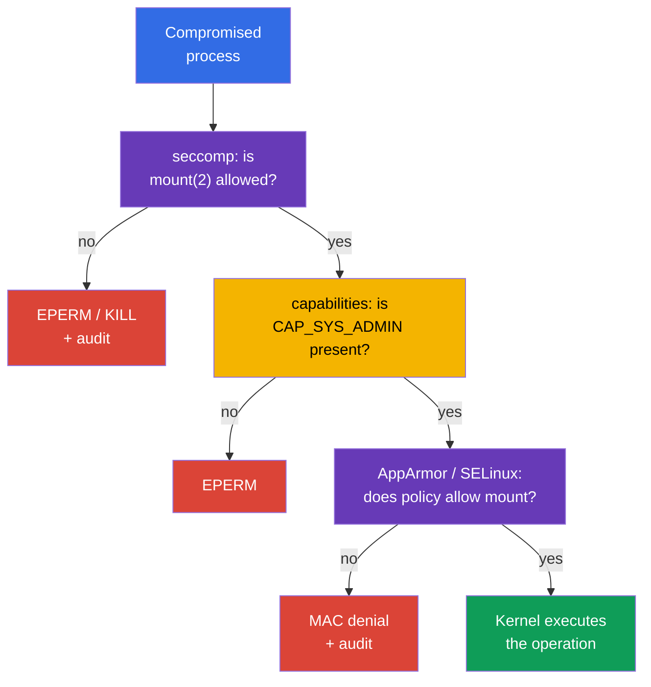

[Русская версия](ru.md) · [Versión en español](es.md) · [Version française](fr.md) · [Deutsche Version](de.md) · [ქართული ვერსია](ge.md) · [繁體中文版](tw.md) · [日本語版](jp.md)

# Chapter 17. seccomp: a minimal set of system calls

> **Problem.** A compromised process in a container has the same kernel system-call interface as a legitimate application and can use rarely needed `mount`, `unshare`, `bpf`, or `clone` calls to escape isolation or develop a kernel exploit. Even without an extra capability, such a kernel API expands the attack surface; seccomp leaves the process only a pre-validated set of syscalls.

> **What comes next.** AppArmor in [chapter 16](../16/README.md) restricted the paths and kernel objects with which a process can work. Now we add a filter at an even lower layer: **seccomp** matches a process's system calls (syscalls) against profile rules and chooses an action for each one, such as allow, error, terminate, or log. This is the **System Hardening** CKS domain (10%). In the next part of the course, these same restrictions will become part of a hardened `SecurityContext` and Pod Security Standards.

> **What you need from CKA.** Basic `securityContext`, non-root execution, `allowPrivilegeEscalation: false`, and Linux capabilities are covered in [CKA chapter 20](../../../cka/course/20/README.md). First practise them in [CKA lab 106](../../../cka/labs/106/README.MD): seccomp does not replace `capabilities.drop: ["ALL"]`; it reduces the kernel API available to a process.

> 🧠 Seccomp filters syscalls and returns allow, `ERRNO`, kill, or `LOG`; capabilities, DAC, and MAC are checked separately.

## 17.1. What seccomp protects

An application does not call kernel functions directly. A library or runtime ultimately makes a **system call**: `openat(2)` opens a file, `socket(2)` creates a socket, `clone(2)` creates a process or thread, and `mount(2)` mounts a filesystem. A compromised process gets the same kernel interface. Many syscalls are not needed by a normal web server or worker, but are useful for container escape, changing a namespace, loading BPF programs, or mounting.

seccomp (secure computing mode) is a Linux kernel mechanism that matches every process syscall against a BPF filter and chooses an action: allow it, return an error, terminate the process, create an audit event, or pass the decision to a userspace notifier. Kubernetes assigns such a filter to container processes through `securityContext.seccompProfile`.

```mermaid
flowchart TB
    process["Container process"] --> call["syscall: mount, clone, openat ..."]
    call --> filter["seccomp BPF filter"]
    filter -->|"ALLOW"| kernel["Kernel executes the syscall"]
    filter -->|"ERRNO / KILL"| blocked["EPERM, ENOSYS, or termination"]
    filter -->|"LOG"| audit["kernel audit / journal"]
    style process fill:#326ce5,color:#fff
    style filter fill:#673ab7,color:#fff
    style kernel fill:#0f9d58,color:#fff
    style blocked fill:#db4437,color:#fff
    style audit fill:#f4b400,color:#000
```

The filter is attached to a process and inherited by child processes. It grants no permissions: if seccomp allows a syscall, normal kernel checks still apply. For example, an allowed `mount(2)` still requires the capability and appropriate mount namespace/LSM permissions. Conversely, `CAP_SYS_ADMIN` does not override a seccomp denial. seccomp is therefore the final narrow barrier before the kernel API, not a universal replacement for other controls.

| Mechanism | Question it answers | Example |
|---|---|---|
| UID/GID and DAC | can the identity work with the object? | file permissions `0640` |
| capabilities | is a special kernel privilege present? | no `CAP_SYS_ADMIN` |
| seccomp | is this specific syscall allowed? | `unshare(2)` returns `EPERM` |
| AppArmor / SELinux | does the MAC policy permit the object and operation? | AppArmor denies reading `/etc/shadow` |
| RBAC | can the identity call the Kubernetes API? | no `get secrets` |

seccomp does not restrict networking by address or port, does not check Kubernetes RBAC, and does not make an image safe. host namespaces, hostPath, and excessive capabilities make the risk much higher. In particular, `privileged: true` always starts a container with seccomp `Unconfined`: Kubernetes does not apply a profile to such a container. For an ordinary workload, the baseline combination looks like this:

```yaml
securityContext:
  runAsNonRoot: true
  seccompProfile:
    type: RuntimeDefault
containers:
- name: app
  image: nginxinc/nginx-unprivileged:1.30.4-alpine-slim
  ports:
  - containerPort: 8080
  securityContext:
    allowPrivilegeEscalation: false
    capabilities:
      drop: ["ALL"]
```

## 17.2. seccomp modes and filter actions

The kernel supports a strict legacy mode and a filtering mode. Containers almost always use filter mode: the runtime loads a BPF program from an OCI/Kubernetes profile before starting the process. `/proc/<pid>/status` contains `Seccomp: 2` when filter mode is enabled for a process; `0` means no seccomp and `1` means legacy strict mode. The value `2` itself does not prove *which* profile is loaded, but is useful during diagnosis.

In a JSON profile, actions are specified by libseccomp/OCI values. Their meaning matters more than memorising every name:

| Action | Result | Typical use |
|---|---|---|
| `SCMP_ACT_ALLOW` | the syscall executes | allow-list of required calls |
| `SCMP_ACT_ERRNO` | the syscall does not execute; the process receives errno | predictably deny an unnecessary action |
| `SCMP_ACT_KILL_PROCESS` | the kernel terminates the entire process | strict fail-closed action for an explicitly dangerous syscall |
| `SCMP_ACT_KILL_THREAD` | the kernel terminates the calling thread | usually avoided: a multithreaded process can remain in an odd state |
| `SCMP_ACT_TRAP` | the process receives `SIGSYS` | specialised handling, not a standard baseline |
| `SCMP_ACT_LOG` | the syscall is allowed; the kernel attempts to write an audit event | inventory calls before enforcement |
| `SCMP_ACT_NOTIFY` | the decision is passed to a userspace supervisor | specialised architecture; not a replacement for normal policy |

`SCMP_ACT_LOG` does not block a syscall. It is useful for a short controlled test, but is noisy in logs and is not production protection. `SCMP_ACT_ERRNO` without a specified errno normally returns `EPERM`; a specific value can be set separately. Do not choose `KILL` merely because it is "stricter": sudden process death can turn an insignificant call into an outage and diagnosis into a difficult crash loop.

The two policy approaches look different:

- **deny-list:** `defaultAction: SCMP_ACT_ALLOW`; separate dangerous syscalls receive `ERRNO` or `KILL`. This is easier for compatibility, but new or forgotten syscalls remain available.
- **allow-list:** `defaultAction: SCMP_ACT_ERRNO`; the permitted groups are listed in `syscalls`. This is stronger and requires a measured, tested application contract.

`RuntimeDefault` normally provides a safe runtime baseline. A custom allow-list makes sense only after observing and testing the actual application, its probes, entrypoint, DNS/TLS, and periodic tasks. Never build it from one successful `curl` or one `strace`.

> 🎯 Select `RuntimeDefault` or a validated `Localhost` profile and prove effective seccomp for the required container; one `EPERM` does not prove a seccomp denial.

## 17.3. Kubernetes API: `RuntimeDefault`, `Localhost`, `Unconfined`

The current Kubernetes API specifies seccomp in `securityContext.seccompProfile`. You can set it on a Pod as a baseline for every container or on an individual container when it needs a narrower policy. Container-level `securityContext` takes precedence for that container. Avoid different filters unless necessary: they make rollout, audit, and root-cause analysis harder.

| `type` | What is assigned | When to choose it |
|---|---|---|
| `RuntimeDefault` | profile supplied by the container runtime | normal baseline for a regular workload |
| `Localhost` | JSON profile available locally on the node | validated application-specific syscall contract |
| `Unconfined` | no seccomp filter is applied | only a temporary diagnostic exception with an owner and expiry |

### `RuntimeDefault`: a secure starting point

`RuntimeDefault` asks the runtime to apply its default profile. Its exact contents depend on the runtime and version, so it must not be assumed to be the same JSON on every platform. Do not replace it with `Unconfined` if the application has not yet been investigated: first prove the specific conflict through an event, logs, and a test.

```yaml
apiVersion: v1
kind: Pod
metadata:
  name: runtime-default-seccomp
  namespace: demo
spec:
  securityContext:
    seccompProfile:
      type: RuntimeDefault
  containers:
  - name: app
    image: nginx:1.30.4
    securityContext:
      allowPrivilegeEscalation: false
      capabilities:
        drop: ["ALL"]
```
Check the stored specification, state, and effective process mode:

```bash
kubectl apply -f runtime-default-seccomp.yaml
kubectl wait -n demo --for=condition=Ready pod/runtime-default-seccomp --timeout=120s
kubectl get pod -n demo runtime-default-seccomp \
  -o jsonpath='{.spec.securityContext.seccompProfile.type}{"\n"}'
kubectl describe pod -n demo runtime-default-seccomp
kubectl exec -n demo runtime-default-seccomp -- grep '^Seccomp:' /proc/1/status
# Expected: Seccomp: 2; this confirms filter mode, not profile identity.
```

If the cluster-wide default already enables `RuntimeDefault`, the explicit field is still useful: the manifest carries intent with the workload, an admission policy can check it, and a reviewer should not have to guess the node/runtime configuration.

### `seccompDefault`: a node default for a manifest without the field

The `seccompDefault` feature has been stable since Kubernetes v1.27. When it is enabled, kubelet applies `RuntimeDefault` to a workload with no specified seccomp profile. It is enabled with the kubelet `--seccomp-default` flag or a kubelet configuration field:

```yaml
seccompDefault: true
```

This is a node-level setting, so a manifest without `seccompProfile` can effectively get `RuntimeDefault` on a node with `seccompDefault` enabled or `Unconfined` on one without it. Do not use an absent field as a security contract: specify `RuntimeDefault` explicitly for a portable baseline. Explicit `Unconfined` remains an exception, and `privileged: true` always gives `Unconfined` regardless of the profile in the manifest.

Check the actual configuration on the Pod's **actual** node rather than guessing from the cluster version. The commands below read only the kubelet command line and one explicitly specified field; first obtain the node name with `kubectl get pod -o wide` and use authorised administrative access to it:

```bash
# On the actual Pod node. sudo opens /proc; pipefail prevents a hidden read failure.
set -o pipefail
KPID=$(pgrep -xo kubelet) || { echo 'ERROR: kubelet not found' >&2; exit 1; }
if ! sudo cat "/proc/$KPID/cmdline" | tr '\0' '\n' | \
  awk '$0 == "--config" { print; getline; print; next }
       $0 == "--config-dir" { print; getline; print; next }
       /^--(config|config-dir|seccomp-default)(=|$)/'; then
  echo 'REVIEW_REQUIRED: cannot read kubelet command line reliably' >&2
  exit 2
fi

# --config-dir drop-ins are supported by kubelet v1.36. Resolve relative paths against
# kubelet working directory, read every .conf in kubelet merge order, then apply CLI flags.
# If paths/order/merged value cannot be determined exactly, report REVIEW_REQUIRED; do not
# infer seccompDefault from one config.yaml.
```

`--config`, `--config-dir` drop-ins, and `--seccomp-default` are sources of kubelet configuration; CLI flags override merged file configuration. Do not publish an entire config or arbitrary `/proc` command line in a ticket. Then compare the intended state with process mode. The precedence is container-level profile, then Pod-level profile, then the node default when a profile is absent; `privileged` is the exception and remains `Unconfined`.

```bash
NS=demo
POD=runtime-default-seccomp
CTR=app

kubectl get pod -n "$NS" "$POD" \
  -o jsonpath='{.spec.securityContext.seccompProfile}{"\n"}'
kubectl get pod -n "$NS" "$POD" \
  -o jsonpath='{.spec.containers[?(@.name=="app")].securityContext.seccompProfile}{"\n"}'
kubectl exec -n "$NS" "$POD" -c "$CTR" -- grep '^Seccomp:' /proc/1/status
```

`Seccomp: 2` confirms filter mode, while `Seccomp: 0` confirms that no filter is present. `/proc` does not reveal the JSON name or the exact contents of `RuntimeDefault`; effective profile identity is established jointly by manifest precedence, actual kubelet configuration/flags, runtime records, and expected behaviour. For a privileged container, a Kubernetes profile cannot become effective even if the field appears in YAML.

### `Localhost`: a path is not absolute

`Localhost` selects a custom JSON profile. Kubernetes does not pass JSON through a Pod or copy it with the scheduler: kubelet reads the file **on the selected node** from the seccomp profiles directory. By default this is `/var/lib/kubelet/seccomp`, so the `profiles` subdirectory and `audit.json` file physically look like this:

```text
/var/lib/kubelet/seccomp/profiles/audit.json
```

The manifest specifies a path **relative to the kubelet seccomp root**, without a leading `/`:

```yaml
securityContext:
  seccompProfile:
    type: Localhost
    localhostProfile: profiles/audit.json
```

`localhostProfile: /var/lib/kubelet/seccomp/profiles/audit.json` is incorrect: an absolute path is not an API contract. It is also incorrect to assume `/var/lib/kubelet` when kubelet starts with a different `--root-dir`: the profile root is then `<root-dir>/seccomp`. On managed nodes, learn the actual kubelet configuration from the platform owner; do not search for files at random on a production node.

The complete example with a node-local dependency:

```yaml
apiVersion: v1
kind: Pod
metadata:
  name: localhost-seccomp
  namespace: demo
spec:
  # Specify only a trusted label/pool to which automation has delivered the profile.
  nodeSelector:
    seccomp.example.com/profiles: "v1"
  securityContext:
    seccompProfile:
      type: Localhost
      localhostProfile: profiles/audit.json
  containers:
  - name: app
    image: busybox:1.36.1
    command: ["sh", "-c", "sleep 3600"]
    securityContext:
      allowPrivilegeEscalation: false
      capabilities:
        drop: ["ALL"]
```

Do not place a user-controlled label on a node merely for this manifest: the label, profile, and placement are part of trusted node configuration. Either deliver the same profile to the entire eligible pool, or restrict scheduling with a protected label/affinity and verify every pool before rollout.

### `privileged` is always `Unconfined`

Kubernetes starts a container with `securityContext.privileged: true` as seccomp `Unconfined` and applies neither `RuntimeDefault` nor `Localhost` to it. Therefore YAML containing `privileged: true` and `seccompProfile` does not mean two active layers: the seccomp profile cannot become effective here. Do not try to "fix" this by replacing the profile or looking for JSON on the node. Remove `privileged` if it is not justified, then assign a minimal profile.

Safe diagnosis first records the conflicting desired state and only then inspects the required container process:

```bash
NS=demo
POD=example
CTR=app

kubectl get pod -n "$NS" "$POD" \
  -o jsonpath='{.spec.containers[?(@.name=="app")].securityContext.privileged}{"\n"}'
kubectl get pod -n "$NS" "$POD" \
  -o jsonpath='{.spec.containers[?(@.name=="app")].securityContext.seccompProfile}{"\n"}'
kubectl exec -n "$NS" "$POD" -c "$CTR" -- grep '^Seccomp:' /proc/1/status
```

For a privileged container without a filter installed by the application itself, expect `Seccomp: 0`. A profile field in a manifest is useful only as evidence of incorrect intent, not as proof it was applied. `Seccomp: 2` in the process proves only filter mode and requires separate investigation of the process/runtime; it does not make a Kubernetes profile effective for a privileged container.

### `Unconfined` and the obsolete annotation

`Unconfined` disables this layer for a container. It can be used as a short exception, for example for a controlled comparison on a test node, but not as a permanent "solution" to `Operation not permitted`. Record the owner, removal deadline, and specific reason; then restore least privilege.

Old manifests can use the `seccomp.security.alpha.kubernetes.io/pod` or `container.seccomp.security.alpha.kubernetes.io/<container>` annotation. This is a historical interface: since Kubernetes v1.25 these annotations are **non-functional** and do not assign a seccomp profile. Their presence in a modern cluster is an audit signal, not working compatibility; replace them with `securityContext.seccompProfile`. Do not mix the annotation and API field, especially with different values. After migration, test the new Pod and check its effective mode.

> 🎯 Build a `Localhost` JSON profile in OCI seccomp format, load it on the required node, and confirm the container's effective mode.

## 17.4. JSON profile: structure and a safe example

A `Localhost` profile is JSON in OCI seccomp format. Its architecture, default action, and rule array matter. Name syscalls by Linux ABI, not by a shell command name: `mount` means `mount(2)`, not the `/bin/mount` utility.

Below is a small **audit profile for a test node**. It allows all syscalls but tells the kernel to log attempts to use `unshare`, `setns`, `mount`, and `bpf`. It does not protect a workload; its purpose is to demonstrate the `Localhost` path and collect an observable event before writing a real restrictive profile.

```json
{
  "defaultAction": "SCMP_ACT_ALLOW",
  "architectures": [
    "SCMP_ARCH_X86_64"
  ],
  "syscalls": [
    {
      "names": ["unshare", "setns", "mount", "bpf"],
      "action": "SCMP_ACT_LOG"
    }
  ]
}
```

> 🔬 `syscalls[].args`, `errnoRet`, and filtering on syscall arguments are narrow version- and architecture-dependent details.

OCI seccomp can match not only a syscall name, but also its arguments through `syscalls[].args` (`index`, `value`, optional `valueTwo`, `op`). For example, the next rule returns `EPERM` only for `socket(2)` with domain `AF_PACKET` (17), without denying other socket domains:

```json
{
  "names": ["socket"],
  "action": "SCMP_ACT_ERRNO",
  "errnoRet": 1,
  "args": [{"index": 0, "value": 17, "op": "SCMP_CMP_EQ"}]
}
```

Argument numbers and values depend on the syscall ABI, so test this type of filter on every target architecture/runtime and do not move it between platforms without validation.

For ARM64, the `architectures` set must match the node architecture (for example, `SCMP_ARCH_AARCH64`); do not copy x86_64 JSON to an ARM node. In a heterogeneous cluster, a profile either contains correct ABI entries for every supported node pool, or the workload is explicitly restricted to a compatible pool.

Node automation, not an ordinary Pod, installs and verifies the profile. The example below is for a dedicated test node and illustrates the default kubelet path:

```bash
# On a test node, with administrative access.
sudo install -d -m 0755 /var/lib/kubelet/seccomp/profiles
sudo install -m 0644 audit.json /var/lib/kubelet/seccomp/profiles/audit.json
sudo test -r /var/lib/kubelet/seccomp/profiles/audit.json
sudo jq empty /var/lib/kubelet/seccomp/profiles/audit.json
```

`jq empty` validates JSON syntax but does not prove syscall-name semantics or runtime compatibility. Before a production rollout, add a container-start test on every target runtime version, then prepare rollback as a release of a new validated profile version, not a manual edit on a live node.

Below is an enforce profile using a deny-list. It demonstrates a predictable denial: syscalls are allowed by default and a few actions receive `EPERM`. This file does not replace `RuntimeDefault` and is not by itself a sufficient production policy.

```json
{
  "defaultAction": "SCMP_ACT_ALLOW",
  "architectures": [
    "SCMP_ARCH_X86_64"
  ],
  "syscalls": [
    {
      "names": ["unshare", "setns", "mount"],
      "action": "SCMP_ACT_ERRNO",
      "errnoRet": 1
    },
    {
      "names": ["bpf", "keyctl", "perf_event_open"],
      "action": "SCMP_ACT_ERRNO",
      "errnoRet": 1
    }
  ]
}
```

`errnoRet: 1` means `EPERM`. If a process receives `Operation not permitted`, that does not automatically prove seccomp: capabilities, AppArmor, SELinux, or ordinary permissions can return the same errno. You need the manifest, process status, and kernel audit/log together.

## 17.5. Observation: syscall audit and kernel log

A short audit phase answers "which syscalls are actually required?" and must not become an endless production mode. Use representative traffic on a test node, including startup, liveness/readiness probes, TLS/DNS, worker jobs, graceful shutdown, and error paths. Collect data for a limited time and correlate it with PID/container and image version.

For the audit profile from the previous section, apply the Pod, then make a safe call check. In a container without `CAP_SYS_ADMIN`, `unshare` will normally still fail; for an audit it is sufficient that the syscall was attempted and reached the kernel.

```bash
kubectl apply -f localhost-seccomp.yaml
kubectl wait -n demo --for=condition=Ready pod/localhost-seccomp --timeout=120s
kubectl get pod -n demo localhost-seccomp -o wide
kubectl exec -n demo localhost-seccomp -- sh -c 'unshare -Ur true || true'
kubectl exec -n demo localhost-seccomp -- grep '^Seccomp:' /proc/1/status
```

Then connect to the node reported by `kubectl get ... -o wide` and look for seccomp records in the kernel journal. The precise format depends on the kernel, auditd, and logging pipeline; a record normally includes `type=SECCOMP`, `syscall=`, `pid=`, `comm=`, and arch. Do not expect one invariant text on every distribution.

```bash
# On the selected node, limit the time window and look for several known variants.
sudo journalctl -k --since '10 minutes ago' | \
  grep -Ei 'seccomp|type=SECCOMP|audit.*syscall' || true

# If auditd is installed and permitted by your operations procedure:
sudo ausearch -m SECCOMP -ts recent 2>/dev/null || true
```

To correlate a record with a container, you need the node, time, process name/PID, and runtime ID. Do not treat the entire kernel journal as a "Pod log": kubelet, the runtime, and other workloads run on one node. First collect Kubernetes context:

```bash
NS=demo
POD=localhost-seccomp

kubectl get pod -n "$NS" "$POD" -o wide
kubectl get pod -n "$NS" "$POD" \
  -o jsonpath='{.spec.securityContext.seccompProfile}{"\n"}'
kubectl describe pod -n "$NS" "$POD"
```

On the node, an administrator can obtain the container ID and host PID if access rules permit it:

```bash
# On node: select exactly one current Ready sandbox, then exactly one app container.
mapfile -t POD_IDS < <(
  sudo crictl pods --name '^localhost-seccomp$' --namespace '^demo$' --state ready -q
)
if [ "${#POD_IDS[@]}" -ne 1 ]; then
  printf 'REVIEW_REQUIRED: expected exactly one Ready pod sandbox, found %s\n' "${#POD_IDS[@]}" >&2
  exit 2
fi
POD_ID=${POD_IDS[0]}
mapfile -t CONTAINER_IDS < <(
  sudo crictl ps --pod "$POD_ID" --name '^app$' -q
)
if [ "${#CONTAINER_IDS[@]}" -ne 1 ]; then
  printf 'REVIEW_REQUIRED: expected exactly one running app container, found %s\n' "${#CONTAINER_IDS[@]}" >&2
  exit 2
fi
CONTAINER_ID=${CONTAINER_IDS[0]}
# .info is runtime-specific verbose data, not a portable CRI PID contract.
HOST_PID=$(sudo crictl inspect "$CONTAINER_ID" | jq -r '.info.pid // empty')
if ! [[ "$HOST_PID" =~ ^[0-9]+$ ]]; then
  echo 'REVIEW_REQUIRED: runtime did not expose host PID as .info.pid; use its documented node-local inspection method' >&2
  exit 2
fi
sudo grep '^Seccomp:' "/proc/$HOST_PID/status"
```

`strace` is useful for local reproducible research, but it changes timing and adds load. Do not attach it for a long time to a busy production PID. On a test node, run a short trace of a process or command and compare syscall names with the profile:

```bash
HOST_PID=replace-with-host-pid
sudo strace -f -p "$HOST_PID" -e trace=%process,%network,%file
# Stop the trace after a short controlled test.
```

`strace` shows process calls, whereas `SCMP_ACT_LOG` provides kernel telemetry. Neither should automatically generate an allow-list: retain a minimal policy after threat review, not after mechanically adding every observed syscall.

## 17.6. Verification and debugging: from YAML to the kernel

There are two distinct groups of seccomp failures, and the verification order saves time.

1. **The container was not created.** With `Localhost`, the file was not found, the path is not relative, the JSON/runtime is unsupported, or the Pod was scheduled to a node without the profile. Inspect Pod events, the node, and kubelet/runtime logs.
2. **The container runs but the syscall is rejected.** The seccomp filter was applied and the application receives `EPERM`, `ENOSYS`, `SIGSYS`, or terminates. Inspect effective mode, the application log, and kernel audit records.

### Fast verification order

```bash
NS=demo
POD=localhost-seccomp
CTR=app

# 1. Desired state: Pod- and container-level contexts can differ.
kubectl get pod -n "$NS" "$POD" -o jsonpath='{.spec.securityContext.seccompProfile}{"\n"}'
kubectl get pod -n "$NS" "$POD" \
  -o jsonpath='{.spec.containers[?(@.name=="app")].securityContext.seccompProfile}{"\n"}'

# 2. Lifecycle and the selected node.
kubectl get pod -n "$NS" "$POD" -o wide
kubectl describe pod -n "$NS" "$POD"
kubectl get events -n "$NS" --field-selector involvedObject.name="$POD" \
  --sort-by=.lastTimestamp

# 3. Effective process state, if the container started.
kubectl exec -n "$NS" "$POD" -c "$CTR" -- grep '^Seccomp:' /proc/1/status
```

If `kubectl exec` is not possible, do not start by assuming a blocked syscall: read `describe` and events first. For `Localhost`, an event often directly identifies a missing profile or its load error. Check the exact `localhostProfile` value; it is not a filename "somewhere on the node" and is not an absolute path.

On the actual node, diagnose the path, read permission, and kubelet, but do not copy secrets or the content of a production profile into a ticket unnecessarily:

```bash
# On the selected node. Substitute root-dir from the actual kubelet command line/config.
KUBELET_ROOT=/var/lib/kubelet
sudo test -r "$KUBELET_ROOT/seccomp/profiles/audit.json"
sudo stat "$KUBELET_ROOT/seccomp/profiles/audit.json"
sudo journalctl -u kubelet --since '15 minutes ago'
sudo journalctl -k --since '15 minutes ago' | grep -Ei 'seccomp|SECCOMP|audit' || true
```

### Symptom table

| Symptom | Likely cause | Evidence and safe correction |
|---|---|---|
| `CreateContainerError` after `Localhost` | profile is absent on the selected node or the path is wrong | `describe`, node from `-o wide`, exact relative name, and file below the kubelet seccomp root |
| Pod scheduled to the wrong place | profile was not delivered to the whole pool | check node label, automation delivery, and placement; do not weaken the profile |
| `Seccomp: 0` in a running container | no profile assigned, `Unconfined` specified, container privileged, or node default disabled | compare Pod/container `securityContext` and `privileged`, then actual kubelet flags/config on the node |
| `Seccomp: 2`, but the application gets `EPERM` | possible seccomp, capability/MAC/DAC denial, or all at once | kernel audit, AppArmor/SELinux logs, capabilities, and the precise syscall |
| `SIGSYS` or process killed | profile uses `TRAP`/`KILL` | check JSON, exit code, and runtime logs; reproduce on a test node |
| JSON is readable by `jq`, but the container does not start | schema, ABI, runtime version, or seccomp support are incompatible | kubelet/runtime event and isolated compatibility test |
| rollout fails only for some replicas | node pools differ by profile/runtime/architecture | inventory every pool, pin a compatible pool, or use uniform managed delivery |
| "fix" through `Unconfined`/`privileged` | protection was disabled and the cause was not found | restore the baseline, identify the specific syscall, and use a minimal justified exception |

Read `/proc/1/status` in the required container. In a multi-container Pod, PID 1 of each container has a separate view; `kubectl exec` without `-c` can select the wrong container. `Seccomp: 2` proves filter mode; verification of profile identity remains the combination of Pod spec, runtime/kubelet records, node delivery, and expected behaviour.

### Verify a negative scenario

For the enforce JSON from section 17.4, create a separate test Pod with `localhostProfile: profiles/restrict.json`. Do not modify a file on a production node under a running rollout: prepare a new version, verify it, and only then change the workload reference.

```bash
kubectl exec -n demo localhost-seccomp -- sh -c 'mount -t tmpfs tmpfs /tmp/x'
# Expected: mount: permission denied (or comparable EPERM).

kubectl exec -n demo localhost-seccomp -- grep '^Seccomp:' /proc/1/status
# Expected: Seccomp: 2
```

This command is insufficient for attribution: `mount` can be denied by an absent capability. For learning evidence, record the profile, `Seccomp: 2`, command stderr, and the matching node audit/log. In a real investigation, isolate the test and do not add `CAP_SYS_ADMIN` merely to bypass one restriction and "test" another.

> 🧠 Seccomp controls syscalls, capabilities control privileges, and AppArmor/SELinux control access to objects and operations.

## 17.7. How seccomp, capabilities, and AppArmor fit together

These controls check one action at different layers. Consider a compromised process attempting to call `mount(2)`:



The order of internal kernel checks and the precise errno depend on the syscall and kernel version, but the defence-in-depth model remains: passing one layer does not override another. This leads to practical rules.

- **Capabilities reduce authority.** `drop: ["ALL"]` removes unnecessary kernel privileges. If an application truly needs a privileged port, restore only `NET_BIND_SERVICE`, not `SYS_ADMIN`.
- **seccomp reduces the API surface.** It can deny a syscall regardless of how high the process's privileges are. `RuntimeDefault` is the standard baseline; `Localhost` requires a measured contract and node delivery.
- **AppArmor/SELinux restrict objects and operations.** The AppArmor path-based policy from [chapter 16](../16/README.md) can deny a specific path even after a syscall is allowed. SELinux solves a similar problem through labels/type enforcement on suitable operating systems.
- **`allowPrivilegeEscalation: false` connects the model.** For Linux, it forbids gaining new privileges and prevents a process from obtaining additional privileges through setuid binaries or file capabilities; it is not a substitute for seccomp, but is a useful additional boundary.

Do not try to prove seccomp merely by showing that a capability is absent: that proves only one independent barrier. Nor should you add a capability to test seccomp on a production workload. Run a narrow experiment in a separate namespace/node and remove resources afterwards.

> 🏭 `Localhost` profile: a versioned artifact with an owner, runtime/ABI tests, delivery, canary, and rollback.

## 17.8. Operations: profile as code, not as a file on a node

A `Localhost` profile is part of the platform contract. The scheduler does not read `/var/lib/kubelet/seccomp` contents or transfer JSON to a node. Reliable operations require a managed end-to-end lifecycle.

1. **Define the threat and owner.** State which syscall reduces the risk and which workload/version the profile covers. "Deny everything just in case" is not a specification.
2. **Observe in a controlled manner.** On a test node, use brief audit/profile tracing for a representative workload, including startup and failure paths. Preserve image digest, node OS, kernel, and runtime version.
3. **Create minimal JSON and validate compatibility.** Validate JSON, ABI, and startup on every supported architecture/runtime. A new image or dependency can change the syscall set.
4. **Deliver the profile as a versioned artifact.** Node image, cloud-init, or configuration management must install the file before workload scheduling. Do not give an unprivileged Pod write access to the kubelet directory.
5. **Link delivery and placement.** The same profile on a pool is simpler and safer; otherwise use a trusted node label/affinity and verify inventory.
6. **Roll out gradually.** Start with a canary; check Ready, application SLO, and `SECCOMP`/runtime events. Rollback needs an owner and a verified manifest.
7. **Observe denials; do not turn off protection.** An alert correlates node audit with the workload. The correction is a justified narrow profile or application change, not perpetual `Unconfined`.

For a normal production workload, the combination of `RuntimeDefault`, non-root, `allowPrivilegeEscalation: false`, dropped capabilities, and MAC policy is often sufficient. A custom profile is justified where the risk and contract are well understood; profile complexity is also an operational risk.

When custom seccomp/AppArmor/SELinux profiles must be distributed and recorded at cluster scale, consider **Security Profiles Operator (SPO)** as the production path: it manages the profile lifecycle and recording workflow rather than manually copying JSON to the kubelet directory on every node. This does not remove the need for tests, versioning, or placement control, but makes profile delivery platform-managed.

`restricted` Pod Security Standards require seccomp `RuntimeDefault` or `Localhost`; `Unconfined` does not meet this baseline. An admission policy helps ensure a workload without seccomp does not appear due to an omission in a chart. Admission does not check that custom JSON exists on a node - that remains a node-lifecycle and rollout responsibility.

## 17.9. Mini-glossary

- **syscall** - a system call through which a process requests an operation from the kernel.
- **seccomp** - the Linux mechanism for filtering a process's syscalls.
- **BPF filter** - a filter program the kernel executes for a syscall in filter mode.
- **`RuntimeDefault`** - a seccomp profile supplied by the selected container runtime.
- **`Localhost`** - the Kubernetes type for a JSON profile available locally on a node.
- **`localhostProfile`** - a JSON profile path relative to the kubelet seccomp root.
- **`Unconfined`** - no seccomp filter for a container; a temporary exception, not a baseline.
- **allow-list** - a policy whose default action denies and whose allowed syscalls are stated explicitly.
- **deny-list** - a policy whose default action allows and whose individual syscalls are denied.
- **`SCMP_ACT_LOG`** - an action that allows a syscall and asks the kernel to log it.
- **`SCMP_ACT_ERRNO`** - an action that returns an error from a syscall without executing it.
- **`SECCOMP` audit record** - a kernel/audit entry for an event related to seccomp.

## 17.10. Chapter summary

- seccomp filters syscalls at the process-kernel boundary; it complements rather than replaces capabilities, AppArmor/SELinux, DAC, RBAC, and SecurityContext.
- For a normal workload, explicitly set `seccompProfile.type: RuntimeDefault` together with non-root, `allowPrivilegeEscalation: false`, and minimal capabilities. `seccompDefault` has been stable since v1.27, but a node default does not replace explicit intent in a manifest.
- A `Localhost` profile is JSON on a node. `localhostProfile` is always relative to the kubelet seccomp root: with the default root, `/var/lib/kubelet/seccomp/profiles/audit.json` is specified as `profiles/audit.json`.
- A custom profile requires versioning, architecture/runtime testing, managed delivery to every eligible node, and linked scheduling. The scheduler does not deliver JSON itself.
- `SCMP_ACT_LOG` provides temporary observation, not protection; `ERRNO`/`KILL` block with different consequences for availability and diagnosis.
- Verification includes the desired Pod/container context, `privileged`, node and events, actual kubelet flags/config, `Seccomp: 2` in the required container, application result, and a matching kernel audit/log. One `EPERM` is insufficient for attribution.

## 17.11. How this helps: on the exam and in real work

**On the exam.** Quickly distinguish `RuntimeDefault` from `Localhost`, remember the relative `localhostProfile` path, kubelet `seccompDefault`, and the rule that `privileged` is always `Unconfined`. Check the result with `kubectl describe`, `-o jsonpath`, the selected node, and `/proc/1/status`. With `CreateContainerError`, first read the event and check the node-local profile; with `EPERM`, do not blame seccomp before checking capabilities and AppArmor/SELinux logs.

**In real work.** Runtime default provides a portable baseline, while custom seccomp is a contract between the application, runtime, and node platform. A useful result requires the complete workflow: measured syscalls, threat review, versioned JSON, canary, audit correlation, and fast rollback. "A file on one node" and permanent `Unconfined` are not hardening.

## 17.12. Self-check questions

<details>
<summary>1. How does seccomp differ from Linux capabilities, and why does one control not replace the other?</summary>

Capabilities determine whether a process has a special kernel privilege, such as `CAP_SYS_ADMIN`; seccomp decides whether a particular syscall is allowed. An allowed seccomp call still goes through normal capabilities, namespace, and LSM checks, while a capability does not override a seccomp denial. Therefore the baseline combines `drop: ["ALL"]` with `RuntimeDefault`.
</details>

<details>
<summary>2. Why is `RuntimeDefault` better than `Unconfined` for an ordinary workload?</summary>

`RuntimeDefault` asks the runtime to apply its standard seccomp profile and creates a portable baseline for an ordinary workload. `Unconfined` disables this layer and is acceptable only as a short diagnostic exception with an owner and deadline. The explicit manifest field also records intent without depending on a node default.
</details>

<details>
<summary>3. Which path goes in `localhostProfile` if the file is at `/var/lib/kubelet/seccomp/profiles/audit.json`?</summary>

Specify `profiles/audit.json`. The value is always relative to the kubelet seccomp root, not an absolute path on the node filesystem. With another `--root-dir`, the physical profile root changes, but the API's relative-path rule remains.
</details>

<details>
<summary>4. Why do an absolute `localhostProfile` path and a profile on only one node cause rollout problems?</summary>

An absolute path does not satisfy the Kubernetes API contract: kubelet expects a path relative to its seccomp root. The scheduler does not transfer a JSON profile between nodes, so a Pod scheduled to a node without the file gets a container-creation error. The profile, its delivery, and placement must be one coordinated trusted node-pool configuration.
</details>

<details>
<summary>5. What does `SCMP_ACT_LOG` do, and why is it not enforce mode?</summary>

`SCMP_ACT_LOG` allows a syscall and asks the kernel to create an audit event; it is for short, controlled observation. It does not block the call, can create extensive log noise, and is not production protection. Enforcement uses, for example, `SCMP_ACT_ERRNO` or a deliberately chosen `KILL`.
</details>

<details>
<summary>6. Which data is needed to distinguish a seccomp denial from an absent capability or an AppArmor denial?</summary>

You need the declared Pod/container security context, effective `Seccomp` in the required container, the precise syscall, and kernel audit/log. `EPERM` alone is insufficient: capabilities, AppArmor, SELinux, or ordinary permissions can return it. The chapter also recommends correlating node, PID/container ID, time, and `SECCOMP` records.
</details>

<details>
<summary>7. What does `Seccomp: 2` in `/proc/1/status` prove, and what does it not prove?</summary>

`Seccomp: 2` proves filter mode is enabled for the inspected process; `0` means no filter and `1` means legacy strict mode. The number does not disclose JSON name, contents, or effective profile identity. Establish those by combining manifest precedence, kubelet/runtime configuration, profile delivery, and expected behaviour.
</details>

<details>
<summary>8. Why cannot an allow-list profile be built from one application run?</summary>

One successful `curl` does not cover startup, probes, DNS/TLS, periodic tasks, graceful shutdown, and error paths. An allow-list needs a measured, tested contract for the real application on target runtimes and architectures. Observation and `strace` help collect data, but observed syscalls must not be mechanically turned into policy without threat review.
</details>

<details>
<summary>9. **Flashback (chapter 20).** Imagine a `ValidatingAdmissionPolicy` from chapter 20 that requires `seccompProfile.type` in a manifest. Why does passing that policy at admission still not guarantee real syscall protection - what must match at the node/kubelet level for a seccomp filter to actually work?</summary>

The admission policy checks only YAML before the object is stored and does not confirm that a node can apply the profile. On the actual node, seccomp support in runtime/kubelet, the effective `securityContext` including container override, and, for `Localhost`, a compatible JSON below the kubelet seccomp root must match. The container must also not be `privileged`, because Kubernetes starts it `Unconfined`; verify the result through events and `Seccomp: 2` in the required process.
</details>

> 🏭 `RuntimeDefault` in template/admission; custom `Localhost` - a versioned profile with a compatible pool, observation, and rollback.

## 17.13. How this is used in production

For ordinary stateless workloads, a platform team sets `seccompProfile.type: RuntimeDefault` in a chart or base manifest and denies `Unconfined` with admission policy. Protection then does not depend on whether each service owner remembered the field, while the manifest still documents the expected baseline explicitly. Together with non-root, `allowPrivilegeEscalation: false`, dropped capabilities, and AppArmor/SELinux, this reduces the impact of an application vulnerability exploit.

Use a custom `Localhost` profile only for a workload with a clear syscall contract, for example an isolated batch worker or a sensitive service. Store the profile in a repository as a versioned artifact, test it on every architecture and runtime version, and have automation deliver it to the entire eligible node pool before rollout. The manifest refers to a profile version through relative `localhostProfile`, while scheduling is constrained to a trusted pool where the file is guaranteed to exist.

The change passes through a test node with representative traffic, a canary, and observation of startup, probes, error rate, and `SECCOMP`/runtime events. On a failure, the team first correlates Pod spec, node, `Seccomp: 2`, syscall, and kernel audit record, then makes a narrow justified profile or application change. Do not permanently switch a service to `Unconfined`, add `CAP_SYS_ADMIN`, or edit JSON on a running node: this hides the cause, creates differences between replicas, and weakens protection.

## Practice

First complete [CKA lab 106](../../../cka/labs/106/README.MD): it reinforces `SecurityContext`, non-root, and capabilities needed to interpret seccomp failures correctly. Then, on a dedicated test node, create `profiles/audit.json`, apply a Pod with `Localhost`, find a `SECCOMP`/kernel record, and replace the audit profile with a narrow validated enforce profile. Before that, revisit [chapter 16](../16/README.md): AppArmor restricts objects and operations, while seccomp restricts the syscall set itself.

## Links

- [Kubernetes: Restrict a Container's Syscalls with seccomp](https://kubernetes.io/docs/tutorials/security/seccomp/)
- [Kubernetes: Linux kernel security constraints](https://kubernetes.io/docs/concepts/security/linux-kernel-security-constraints/)
- [Kubernetes API: SeccompProfile](https://kubernetes.io/docs/reference/kubernetes-api/workload-resources/pod-v1/#SeccompProfile)
- [Kubernetes: Pod Security Standards](https://kubernetes.io/docs/concepts/security/pod-security-standards/)
- [Linux kernel: Seccomp BPF (SECure COMPuting with filters)](https://docs.kernel.org/userspace-api/seccomp_filter.html)

## Mixed checkpoint: System Hardening complete

Before proceeding to Minimize Microservice Vulnerabilities, spend 15-20 minutes without hints checking that the System Hardening domain (chapters 14-17) has stuck:

1. Find one unnecessary listening port or service on a test node and explain how to decide whether it can be disabled (chapter 14).
2. Name two least-privilege levels - the Linux user on the host and the Kubernetes API - and give one specific example for each (chapter 15).
3. Switch a Pod's AppArmor profile from `enforce` to `complain` and explain why `complain` cannot be presented as proof of protection on the exam (chapter 16).
4. **Mixed exercise.** Take RBAC (chapter 10, the Cluster Hardening domain) and AppArmor/seccomp (chapters 16-17, this domain): a user has RBAC `create pods`, while admission does not restrict `securityContext`. Why does RBAC itself not control Linux syscalls? Can the user request `Unconfined`/`privileged` and bypass available seccomp/AppArmor? Which admission enforcement (PSA `restricted`, ValidatingAdmissionPolicy, Gatekeeper, Kyverno, or platform equivalent) is needed so hardening cannot be disabled in a manifest?
5. Set `seccompProfile.type: RuntimeDefault` for a test Pod and explain how it differs from `Unconfined` in allow-list/deny-list terms (chapter 17).

If exercise 4 was difficult, return to chapters 10 and 16-17 together.

---
[Contents](../README.md) · [Chapter 16](../16/README.md)

