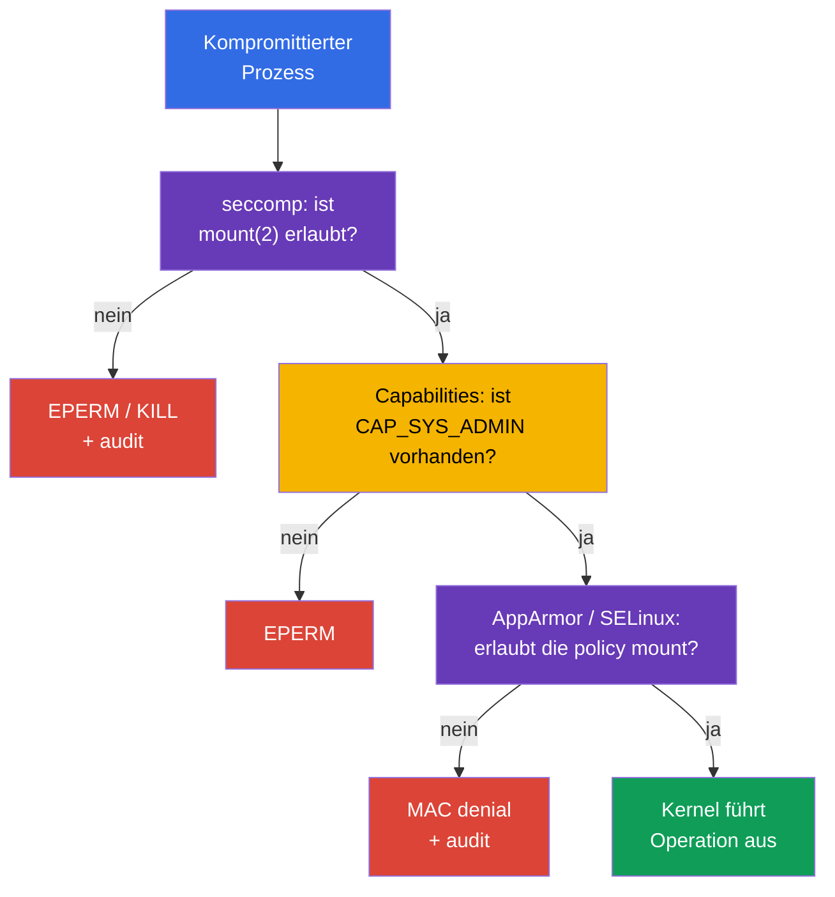

[Русская версия](ru.md) · [Eng version](README.md) · [Versión en español](es.md) · [Version française](fr.md) · [ქართული ვერსია](ge.md) · [繁體中文版](tw.md) · [日本語版](jp.md)

# Kapitel 17. seccomp: ein minimaler Satz von Systemaufrufen

> **Das Problem.** Ein kompromittierter Prozess in einem Container erhält dieselbe Schnittstelle für Systemaufrufe zum Kernel wie eine legitime Anwendung und kann selten benötigte `mount`, `unshare`, `bpf` oder `clone` verwenden, um aus der Isolation auszubrechen oder einen kernel exploit weiterzuentwickeln. Selbst ohne zusätzliche Capability vergrößert eine solche Kernel-API die Angriffsfläche; seccomp lässt dem Prozess vorab nur einen geprüften Satz von syscalls.

> **Was kommt als Nächstes.** AppArmor aus [Kapitel 16](../16/de.md) hat eingeschränkt, mit welchen Pfaden und Kernel-Objekten ein Prozess arbeiten darf. Nun fügen wir einen Filter auf einer noch niedrigeren Ebene hinzu: **seccomp** gleicht die Systemaufrufe (syscalls) eines Prozesses mit den Regeln eines Profile ab und wählt für jeden eine Aktion, beispielsweise erlauben, einen Fehler zurückgeben, beenden oder protokollieren. Dies ist die CKS-Domain **System Hardening** (10 %). Im nächsten Teil des Kurses werden dieselben Einschränkungen Teil eines gehärteten `SecurityContext` und der Pod Security Standards.

> **Was Sie aus CKA benötigen.** Grundlegendes zu `securityContext`, Non-Root-Ausführung, `allowPrivilegeEscalation: false` und Linux Capabilities wird in [CKA-Kapitel 20](../../../cka/course/20/de.md) behandelt. Üben Sie sie zuerst im [CKA-Lab 106](../../../cka/labs/106/README_DE.MD): seccomp ersetzt nicht `capabilities.drop: ["ALL"]`, sondern verringert die dem Prozess verfügbare Kernel-API.

> 🧠 Seccomp filtert syscalls und gibt allow, `ERRNO`, kill oder `LOG` zurück; Capabilities, DAC und MAC werden separat geprüft.

## 17.1. Was seccomp schützt

Eine Anwendung ruft Kernel-Funktionen nicht direkt auf. Eine Bibliothek oder runtime führt schließlich einen **System Call** aus: `openat(2)` öffnet eine Datei, `socket(2)` erstellt einen Socket, `clone(2)` erstellt einen Prozess oder Thread, `mount(2)` mountet ein Dateisystem. Ein kompromittierter Prozess erhält dieselbe Schnittstelle zum Kernel. Viele syscalls werden von einem gewöhnlichen Webserver oder Worker nicht benötigt, sind aber für einen container escape, das Wechseln eines namespace, das Laden von BPF-Programmen oder das Mounten nützlich.

seccomp (secure computing mode) ist ein Mechanismus des Linux Kernel, der jeden syscall eines Prozesses mit einem BPF-Filter abgleicht und eine Aktion wählt: erlauben, einen Fehler zurückgeben, den Prozess beenden, ein audit event erstellen oder die Entscheidung an einen userspace-notifier übergeben. Kubernetes weist einen solchen Filter den Prozessen eines Containers über `securityContext.seccompProfile` zu.

```mermaid
flowchart TB
    process["Prozess im Container"] --> call["syscall: mount, clone, openat ..."]
    call --> filter["seccomp-BPF-Filter"]
    filter -->|"ALLOW"| kernel["Kernel führt syscall aus"]
    filter -->|"ERRNO / KILL"| blocked["EPERM, ENOSYS oder Beendigung"]
    filter -->|"LOG"| audit["Kernel-Audit / Journal"]
    style process fill:#326ce5,color:#fff
    style filter fill:#673ab7,color:#fff
    style kernel fill:#0f9d58,color:#fff
    style blocked fill:#db4437,color:#fff
    style audit fill:#f4b400,color:#000
```

Der Filter ist an einen Prozess gebunden und wird von Kindprozessen geerbt. Er erteilt keine Berechtigungen: Wenn seccomp einen syscall durchlässt, bleiben die gewöhnlichen Kernel-Prüfungen weiterhin bestehen. Beispielsweise benötigt ein erlaubtes `mount(2)` weiterhin eine Capability und die erforderlichen Mount-Namespace-/LSM-Rechte. Umgekehrt hebt `CAP_SYS_ADMIN` eine seccomp denial nicht auf. seccomp ist daher die letzte schmale Barriere vor der Kernel-API und kein universeller Ersatz für die übrigen Controls.

| Mechanismus | Beantwortete Frage | Beispiel |
|---|---|---|
| UID/GID und DAC | darf die Identity mit dem Objekt arbeiten? | Dateirechte `0640` |
| Capabilities | ist eine besondere Kernel-Privilegierung vorhanden? | kein `CAP_SYS_ADMIN` |
| seccomp | ist der konkrete syscall erlaubt? | `unshare(2)` gibt `EPERM` zurück |
| AppArmor / SELinux | erlaubt die MAC policy das Objekt und die Operation? | AppArmor verbietet das Lesen von `/etc/shadow` |
| RBAC | darf die Identity die Kubernetes API aufrufen? | kein `get secrets` |

seccomp beschränkt das Netzwerk nicht auf Ebene von Adressen und Ports, prüft Kubernetes RBAC nicht und macht ein Image nicht sicher. Host namespaces, hostPath und übermäßige Capabilities erhöhen das Risiko erheblich. Darüber hinaus startet `privileged: true` einen Container immer mit seccomp `Unconfined`: Kubernetes wendet auf einen solchen Container kein Profile an. Für einen gewöhnlichen Workload sieht die Basiskombination so aus:

```yaml
securityContext:
  runAsNonRoot: true
  seccompProfile:
    type: RuntimeDefault
containers:
- name: app
  image: nginxinc/nginx-unprivileged:1.30.4-alpine-slim
  ports:
  - containerPort: 8080
  securityContext:
    allowPrivilegeEscalation: false
    capabilities:
      drop: ["ALL"]
```

## 17.2. seccomp-Modi und Filteraktionen

Der Kernel unterstützt den strikten legacy-Modus und den Filtermodus. In Containern wird fast immer der Filtermodus verwendet: Die runtime lädt vor dem Start des Prozesses ein BPF-Programm aus einem OCI/Kubernetes Profile. Das Feld `/proc/<pid>/status` enthält `Seccomp: 2`, wenn für den Prozess der Filtermodus aktiviert ist; `0` bedeutet kein seccomp, `1` den legacy strict mode. Der Wert `2` belegt selbst nicht, *welches* Profile geladen ist, ist aber bei der Diagnose hilfreich.

In einem JSON-Profile werden Aktionen durch Werte von libseccomp/OCI angegeben. Ihre Bedeutung ist wichtiger als sich jeden Namen zu merken:

| Aktion | Ergebnis | Typische Verwendung |
|---|---|---|
| `SCMP_ACT_ALLOW` | syscall wird ausgeführt | allow-list der benötigten Aufrufe |
| `SCMP_ACT_ERRNO` | syscall wird nicht ausgeführt, der Prozess erhält errno | eine unnötige Aktion vorhersehbar verbieten |
| `SCMP_ACT_KILL_PROCESS` | der Kernel beendet den gesamten Prozess | hartes fail-closed für einen explizit gefährlichen syscall |
| `SCMP_ACT_KILL_THREAD` | der Kernel beendet den aufrufenden Thread | gewöhnlich vermeiden: Ein multithread-Prozess kann in einem seltsamen Zustand bleiben |
| `SCMP_ACT_TRAP` | der Prozess erhält `SIGSYS` | spezialisierte Behandlung, keine gewöhnliche Baseline |
| `SCMP_ACT_LOG` | syscall ist erlaubt, der Kernel versucht, ein audit event zu schreiben | Inventarisierung von Aufrufen vor enforce |
| `SCMP_ACT_NOTIFY` | die Entscheidung wird an einen userspace supervisor übergeben | spezielle Architektur; kein Ersatz für eine gewöhnliche policy |

`SCMP_ACT_LOG` blockiert den syscall nicht. Es ist für einen kurzen controlled test nützlich, verursacht jedoch Rauschen in den Logs und ist kein Production-Schutz. `SCMP_ACT_ERRNO` gibt ohne angegebenes errno normalerweise `EPERM` zurück; ein konkreter Wert kann separat angegeben werden. Wählen Sie `KILL` nicht nur, weil es „strenger“ ist: Der plötzliche Tod des Prozesses kann einen unwesentlichen Aufruf in einen outage verwandeln und die Diagnose in einen komplizierten crash loop.

Zwei Policy-Richtungen sehen unterschiedlich aus:

- **deny-list:** `defaultAction: SCMP_ACT_ALLOW`, einzelne gefährliche syscalls erhalten `ERRNO` oder `KILL`. Dies ist einfacher für die Kompatibilität, aber neue oder vergessene syscalls bleiben verfügbar.
- **allow-list:** `defaultAction: SCMP_ACT_ERRNO`, erlaubte Gruppen sind in `syscalls` aufgeführt. Dies ist stärker und erfordert einen gemessenen, getesteten Application-Vertrag.

`RuntimeDefault` bietet gewöhnlich eine sichere runtime-Baseline. Eine Custom allow-list ist erst nach Beobachtung und Test der tatsächlichen Anwendung, ihrer probes, ihres entrypoint, DNS/TLS und periodischer Aufgaben sinnvoll. Erstellen Sie sie niemals anhand eines einzigen erfolgreichen `curl` oder eines einzigen `strace`.

> 🎯 Wählen Sie `RuntimeDefault` oder ein geprüftes `Localhost` und belegen Sie effektives seccomp für den benötigten Container; ein einzelnes `EPERM` belegt keine seccomp denial.

## 17.3. Kubernetes API: `RuntimeDefault`, `Localhost`, `Unconfined`

Die aktuelle Kubernetes API legt seccomp in `securityContext.seccompProfile` fest. Es kann am Pod als Baseline für alle Container oder an einem konkreten Container gesetzt werden, wenn dieser eine engere policy benötigt. Das `securityContext` auf Container-Ebene hat für diesen Container Vorrang. Vermeiden Sie unterschiedliche Filter ohne Notwendigkeit: Sie erschweren rollout, audit und die Suche nach der Ursache einer Ablehnung.

| `type` | Was zugewiesen wird | Wann wählen |
|---|---|---|
| `RuntimeDefault` | Profile, das von der container runtime bereitgestellt wird | normale Baseline für einen gewöhnlichen Workload |
| `Localhost` | JSON-Profile, das lokal auf dem Node verfügbar ist | geprüfter Application-spezifischer syscall-Vertrag |
| `Unconfined` | der seccomp-Filter wird nicht angewendet | nur eine vorübergehende Diagnoseausnahme mit Owner und Frist |

### `RuntimeDefault`: sicherer Ausgangspunkt

`RuntimeDefault` fordert die runtime auf, ihr Standard-Profile anzuwenden. Sein genauer Inhalt hängt von runtime und Version ab; daher darf nicht angenommen werden, dass es auf allen Plattformen dasselbe JSON ist. Ersetzen Sie es nicht durch `Unconfined`, wenn die Anwendung noch nicht untersucht wurde: Belegen Sie zuerst den konkreten Konflikt durch event, Logs und einen Test.

```yaml
apiVersion: v1
kind: Pod
metadata:
  name: runtime-default-seccomp
  namespace: demo
spec:
  securityContext:
    seccompProfile:
      type: RuntimeDefault
  containers:
  - name: app
    image: nginx:1.30.4
    securityContext:
      allowPrivilegeEscalation: false
      capabilities:
        drop: ["ALL"]
```

Prüfen Sie die gespeicherte specification, den Zustand und den effektiven Modus des Prozesses:

```bash
kubectl apply -f runtime-default-seccomp.yaml
kubectl wait -n demo --for=condition=Ready pod/runtime-default-seccomp --timeout=120s
kubectl get pod -n demo runtime-default-seccomp \
  -o jsonpath='{.spec.securityContext.seccompProfile.type}{"\n"}'
kubectl describe pod -n demo runtime-default-seccomp
kubectl exec -n demo runtime-default-seccomp -- grep '^Seccomp:' /proc/1/status
# Erwartet wird Seccomp: 2; dies bestätigt den Filtermodus, nicht aber die Identität des Profile.
```

Auch wenn ein clusterweiter Default bereits `RuntimeDefault` aktiviert, bleibt das explizite Feld nützlich: Das Manifest transportiert die Absicht mit dem Workload, eine admission policy kann sie prüfen, und die prüfende Person muss die Node-/runtime-Konfiguration nicht erraten.

### `seccompDefault`: Node-Default für ein Manifest ohne Feld

Die Funktion `seccompDefault` ist seit Kubernetes v1.27 stabil. Wenn sie aktiviert ist, wendet kubelet `RuntimeDefault` auf einen Workload an, für den kein seccomp Profile angegeben ist. Sie wird mit dem kubelet-Flag `--seccomp-default` oder dem kubelet-Konfigurationsfeld aktiviert:

```yaml
seccompDefault: true
```

Dies ist eine Einstellung auf Node-Ebene; daher kann ein Manifest ohne `seccompProfile` tatsächlich `RuntimeDefault` auf einem Node mit aktiviertem `seccompDefault` oder `Unconfined` auf einem Node ohne diese Einstellung erhalten. Verwenden Sie das Fehlen des Felds nicht als Security Contract: Für eine übertragbare Baseline geben Sie `RuntimeDefault` explizit an. Ein explizites `Unconfined` bleibt eine Ausnahme, und `privileged: true` ergibt unabhängig vom Profile im Manifest immer `Unconfined`.

Prüfen Sie die tatsächliche Konfiguration auf dem **tatsächlichen** Node des Pod, statt sie aus der Cluster-Version zu erraten. Die folgenden Befehle lesen nur die kubelet-Kommandozeile und ein explizit angegebenes Feld; ermitteln Sie zuerst den Node-Namen mit `kubectl get pod -o wide` und verwenden Sie den erlaubten administrativen Zugriff darauf:

```bash
# Auf dem tatsächlichen Node des Pod. sudo öffnet /proc; pipefail verhindert einen verdeckten Lesefehler.
set -o pipefail
KPID=$(pgrep -xo kubelet) || { echo 'ERROR: kubelet not found' >&2; exit 1; }
if ! sudo cat "/proc/$KPID/cmdline" | tr '\0' '\n' | \
  awk '$0 == "--config" { print; getline; print; next }
       $0 == "--config-dir" { print; getline; print; next }
       /^--(config|config-dir|seccomp-default)(=|$)/'; then
  echo 'REVIEW_REQUIRED: cannot read kubelet command line reliably' >&2
  exit 2
fi

# --config-dir-Drop-ins werden ab kubelet v1.36 unterstützt. Lösen Sie relative Pfade relativ zum
# kubelet-Arbeitsverzeichnis auf, lesen Sie jede .conf in kubelet-Merge-Reihenfolge und wenden Sie dann CLI-Flags an.
# Wenn Pfade/Reihenfolge/zusammengeführter Wert nicht genau bestimmt werden können, melden Sie REVIEW_REQUIRED; leiten Sie
# seccompDefault nicht aus nur einer config.yaml ab.
```

`--config`, `--config-dir`-Drop-ins und `--seccomp-default` sind Quellen der kubelet-Konfiguration; CLI-Flags überschreiben die zusammengeführte Dateikonfiguration. Veröffentlichen Sie nicht die gesamte Konfiguration oder eine beliebige `/proc`-Kommandozeile in einem Ticket. Vergleichen Sie anschließend den intended state mit dem Prozessmodus. Die Priorität lautet: Profile auf Container-Ebene, dann Profile auf Pod-Ebene, dann der Node-Default bei fehlendem Profile; `privileged` ist die Ausnahme und bleibt `Unconfined`.

```bash
NS=demo
POD=runtime-default-seccomp
CTR=app

kubectl get pod -n "$NS" "$POD" \
  -o jsonpath='{.spec.securityContext.seccompProfile}{"\n"}'
kubectl get pod -n "$NS" "$POD" \
  -o jsonpath='{.spec.containers[?(@.name=="app")].securityContext.seccompProfile}{"\n"}'
kubectl exec -n "$NS" "$POD" -c "$CTR" -- grep '^Seccomp:' /proc/1/status
```

`Seccomp: 2` bestätigt den Filtermodus, und `Seccomp: 0` das Fehlen eines Filters. `/proc` offenbart weder den JSON-Namen noch den genauen Inhalt von `RuntimeDefault`; die Identität des effektiven Profile wird gemeinsam durch die precedence aus dem Manifest, die tatsächliche kubelet-Konfiguration/-Flags, runtime records und das erwartete Verhalten bestätigt. Für einen privileged Container kann das Kubernetes Profile nicht effektiv werden, selbst wenn das Feld im YAML vorhanden ist.

### `Localhost`: path ist nicht absolut

`Localhost` wählt ein Custom JSON-Profile. Kubernetes überträgt das JSON nicht über den Pod, und der Scheduler kopiert es nicht: kubelet liest die Datei **auf dem ausgewählten Node** aus dem Verzeichnis der seccomp Profiles. Standardmäßig ist das `/var/lib/kubelet/seccomp`; damit befinden sich das Unterverzeichnis `profiles` und die Datei `audit.json` physisch hier:

```text
/var/lib/kubelet/seccomp/profiles/audit.json
```

Im Manifest wird der path **relativ zum seccomp root von kubelet** ohne führendes `/` angegeben:

```yaml
securityContext:
  seccompProfile:
    type: Localhost
    localhostProfile: profiles/audit.json
```

`localhostProfile: /var/lib/kubelet/seccomp/profiles/audit.json` ist falsch: Ein absoluter path ist kein API-Vertrag. Ebenso ist es falsch, `/var/lib/kubelet` anzunehmen, wenn kubelet mit einem anderen `--root-dir` läuft: Dann ist das Profile-root `<root-dir>/seccomp`. Erfragen Sie auf managed Nodes die tatsächliche kubelet-Konfiguration beim Eigentümer der Plattform; suchen Sie nicht auf gut Glück nach Dateien auf einem Production-Node.

Vollständiges Beispiel mit einer Node-lokalen dependency:

```yaml
apiVersion: v1
kind: Pod
metadata:
  name: localhost-seccomp
  namespace: demo
spec:
  # Geben Sie nur einen vertrauenswürdigen Label/Pool an, auf den das Profile durch automation ausgeliefert wurde.
  nodeSelector:
    seccomp.example.com/profiles: "v1"
  securityContext:
    seccompProfile:
      type: Localhost
      localhostProfile: profiles/audit.json
  containers:
  - name: app
    image: busybox:1.36.1
    command: ["sh", "-c", "sleep 3600"]
    securityContext:
      allowPrivilegeEscalation: false
      capabilities:
        drop: ["ALL"]
```

Setzen Sie nicht allein für dieses Manifest ein user-controlled Label auf einen Node: Label, Profile und placement sind Teil der vertrauenswürdigen Node-Konfiguration. Liefern Sie entweder dasselbe Profile an den gesamten zulässigen Pool aus oder begrenzen Sie das Scheduling mit einem geschützten Label/Affinity und prüfen Sie jeden Pool vor dem rollout.

### `privileged` immer `Unconfined`

Kubernetes führt einen Container mit `securityContext.privileged: true` als seccomp `Unconfined` aus und wendet darauf weder `RuntimeDefault` noch `Localhost` an. Daher bedeutet YAML mit `privileged: true` und `seccompProfile` nicht zwei wirksame Schichten: Das seccomp Profile wird hier nicht effektiv. Versuchen Sie nicht, dies durch Ersetzen des Profile zu „beheben“ oder auf dem Node nach JSON zu suchen. Entfernen Sie `privileged`, wenn es nicht begründet ist, und weisen Sie anschließend das minimale Profile zu.

Eine sichere Diagnose erfasst zuerst den konfliktierenden desired state und betrachtet erst dann den Prozess des benötigten Containers:

```bash
NS=demo
POD=example
CTR=app

kubectl get pod -n "$NS" "$POD" \
  -o jsonpath='{.spec.containers[?(@.name=="app")].securityContext.privileged}{"\n"}'
kubectl get pod -n "$NS" "$POD" \
  -o jsonpath='{.spec.containers[?(@.name=="app")].securityContext.seccompProfile}{"\n"}'
kubectl exec -n "$NS" "$POD" -c "$CTR" -- grep '^Seccomp:' /proc/1/status
```

Für einen privileged Container ohne einen von der Anwendung selbst gesetzten Filter wird `Seccomp: 0` erwartet. Das Profile-Feld im Manifest ist nur als Anzeichen einer fehlerhaften Absicht nützlich, nicht als Beleg seiner Anwendung. `Seccomp: 2` beim Prozess belegt nur den Filtermodus und erfordert eine separate Untersuchung von Prozess/runtime; es macht ein Kubernetes Profile nicht für einen privileged Container effektiv.

### `Unconfined` und veraltete annotation

`Unconfined` deaktiviert diese Schicht für den Container. Es kann als kurze Ausnahme verwendet werden, beispielsweise für einen controlled comparison auf einem Test-Node, jedoch nicht als dauerhafte „Lösung“ für `Operation not permitted`. Dokumentieren Sie Owner, Entfernungsfrist und konkreten Grund; stellen Sie danach least privilege wieder her.

Alte Manifeste können die annotation `seccomp.security.alpha.kubernetes.io/pod` oder `container.seccomp.security.alpha.kubernetes.io/<container>` verwenden. Dies ist eine historische Schnittstelle: Seit Kubernetes v1.25 sind diese annotations **nicht funktionsfähig** und weisen kein seccomp Profile zu. Ihr Vorhandensein in einem modernen Cluster ist ein Signal für ein audit und keine funktionierende Kompatibilität; ersetzen Sie sie durch `securityContext.seccompProfile`. Mischen Sie annotation und API-Feld nicht, besonders nicht mit unterschiedlichen Werten. Testen Sie nach der Migration den neuen Pod und prüfen Sie seinen effektiven Modus.

> 🎯 Erstellen Sie ein JSON-Profile `Localhost` nach dem OCI-seccomp-Format, laden Sie es auf den benötigten Node und bestätigen Sie den effektiven Modus des Containers.

## 17.4. JSON-Profile: Struktur und sicheres Beispiel

Ein `Localhost` Profile ist JSON im OCI-seccomp-Format. Darin sind die Architektur, die Standardaktion und das Regelarray wichtig. Benennen Sie syscalls nach dem Linux ABI, nicht nach dem Namen eines shell-Befehls: `mount` bedeutet `mount(2)`, nicht das Dienstprogramm `/bin/mount`.

Unten ist ein kleines **Audit-Profile für einen Test-Node**. Es erlaubt alle syscalls, veranlasst den Kernel jedoch, Versuche mit `unshare`, `setns`, `mount` und `bpf` zu protokollieren. Es schützt den Workload nicht; seine Aufgabe ist es, den `Localhost`-Weg zu zeigen und ein beobachtbares event zu erfassen, bevor ein echtes restrict Profile geschrieben wird.

```json
{
  "defaultAction": "SCMP_ACT_ALLOW",
  "architectures": [
    "SCMP_ARCH_X86_64"
  ],
  "syscalls": [
    {
      "names": ["unshare", "setns", "mount", "bpf"],
      "action": "SCMP_ACT_LOG"
    }
  ]
}
```

> 🔬 `syscalls[].args`, `errnoRet` und die Filterung nach syscall-Argumenten sind enge versions- und architekturabhängige Details.

OCI seccomp kann nicht nur den Namen eines syscall, sondern über `syscalls[].args` auch seine Argumente abgleichen (`index`, `value`, optionales `valueTwo`, `op`). Beispielsweise gibt die folgende Regel `EPERM` nur für `socket(2)` mit der domain `AF_PACKET` (17) zurück, ohne andere socket domains zu verbieten:

```json
{
  "names": ["socket"],
  "action": "SCMP_ACT_ERRNO",
  "errnoRet": 1,
  "args": [{"index": 0, "value": 17, "op": "SCMP_CMP_EQ"}]
}
```

Argumentnummern und Werte hängen vom syscall ABI ab; daher wird ein solcher Filter auf jeder Zielarchitektur/runtime getestet und nicht ohne Prüfung zwischen Plattformen übertragen.

Für ARM64 muss der Satz `architectures` zur Architektur des Node passen (beispielsweise `SCMP_ARCH_AARCH64`); kopieren Sie kein x86_64-JSON auf einen ARM-Node. In einem heterogenen Cluster enthält das Profile entweder die korrekten ABI für jeden unterstützten Node-Pool, oder der Workload ist ausdrücklich auf einen kompatiblen Pool beschränkt.

Das Profile wird durch Node automation abgelegt und geprüft, nicht durch einen gewöhnlichen Pod. Das folgende Beispiel ist für einen dedizierten Test-Node bestimmt und veranschaulicht den kubelet-Standardpfad:

```bash
# Auf dem Test-Node mit administrativem Zugriff.
sudo install -d -m 0755 /var/lib/kubelet/seccomp/profiles
sudo install -m 0644 audit.json /var/lib/kubelet/seccomp/profiles/audit.json
sudo test -r /var/lib/kubelet/seccomp/profiles/audit.json
sudo jq empty /var/lib/kubelet/seccomp/profiles/audit.json
```

`jq empty` prüft die JSON-Syntax, belegt jedoch nicht die Semantik der syscall-Namen oder die runtime-Kompatibilität. Fügen Sie vor einem Production-Rollout einen Starttest des Containers auf jeder Zielversion der runtime hinzu und bereiten Sie anschließend den Rollback als Veröffentlichung einer neuen geprüften Profile-Version vor, nicht als manuelle Bearbeitung eines Live-Node.

Unten ist ein Beispiel für ein enforce-Profile mit deny-list. Es dient dazu, eine vorhersehbare Ablehnung zu demonstrieren: Standardmäßig sind syscalls erlaubt, einige Aktionen erhalten jedoch `EPERM`. Diese Datei ersetzt `RuntimeDefault` nicht und ist für sich genommen keine ausreichende Production policy.

```json
{
  "defaultAction": "SCMP_ACT_ALLOW",
  "architectures": [
    "SCMP_ARCH_X86_64"
  ],
  "syscalls": [
    {
      "names": ["unshare", "setns", "mount"],
      "action": "SCMP_ACT_ERRNO",
      "errnoRet": 1
    },
    {
      "names": ["bpf", "keyctl", "perf_event_open"],
      "action": "SCMP_ACT_ERRNO",
      "errnoRet": 1
    }
  ]
}
```

`errnoRet: 1` bedeutet `EPERM`. Wenn ein Prozess `Operation not permitted` erhält, belegt dies seccomp nicht automatisch: Capabilities, AppArmor, SELinux oder gewöhnliche Berechtigungen können dasselbe errno zurückgeben. Es werden gleichzeitig Manifest, Prozessstatus und Kernel-Audit/-Log benötigt.

## 17.5. Beobachtung: syscall-Audit und Kernel-Log

Ein kurzer Audit-Schritt beantwortet die Frage „welche syscalls werden tatsächlich benötigt?“ und darf nicht zu einem endlosen Production-Modus werden. Verwenden Sie representative traffic auf einem Test-Node, einschließlich Startup, Liveness-/Readiness-Probes, TLS/DNS, Worker-Jobs, graceful shutdown und error paths. Sammeln Sie Daten für eine begrenzte Zeit und beziehen Sie sie auf PID/Container und die Image-Version.

Wenden Sie für das Audit-Profile aus dem vorherigen Abschnitt den Pod an und führen Sie dann eine sichere Prüfung des Aufrufs durch. In einem Container ohne `CAP_SYS_ADMIN` schlägt `unshare` normalerweise ohnehin fehl; für das Audit genügt es, dass der syscall versucht wurde und der Kernel ihn erhalten hat.

```bash
kubectl apply -f localhost-seccomp.yaml
kubectl wait -n demo --for=condition=Ready pod/localhost-seccomp --timeout=120s
kubectl get pod -n demo localhost-seccomp -o wide
kubectl exec -n demo localhost-seccomp -- sh -c 'unshare -Ur true || true'
kubectl exec -n demo localhost-seccomp -- grep '^Seccomp:' /proc/1/status
```

Verbinden Sie sich anschließend mit dem Node aus `kubectl get ... -o wide` und suchen Sie im Kernel-Journal nach seccomp records. Das genaue Format hängt von Kernel, auditd und der logging pipeline ab; ein record enthält normalerweise `type=SECCOMP`, `syscall=`, `pid=`, `comm=` und arch. Erwarten Sie keinen identischen und unveränderlichen Text auf allen Distributionen.

```bash
# Beschränken Sie auf dem ausgewählten Node das Zeitfenster und suchen Sie mehrere bekannte Varianten.
sudo journalctl -k --since '10 minutes ago' | \
  grep -Ei 'seccomp|type=SECCOMP|audit.*syscall' || true

# Wenn auditd installiert und durch Ihre Betriebsprozedur zugelassen ist:
sudo ausearch -m SECCOMP -ts recent 2>/dev/null || true
```

Um einen record mit dem Container abzugleichen, benötigen Sie Node, Zeit, Prozessname/PID und runtime ID. Betrachten Sie nicht das gesamte Kernel-Journal als „Pod-Log“: Auf einem Node laufen kubelet, runtime und andere Workloads. Sammeln Sie zuerst den Kubernetes-Kontext:

```bash
NS=demo
POD=localhost-seccomp

kubectl get pod -n "$NS" "$POD" -o wide
kubectl get pod -n "$NS" "$POD" \
  -o jsonpath='{.spec.securityContext.seccompProfile}{"\n"}'
kubectl describe pod -n "$NS" "$POD"
```

Auf dem Node kann der Administrator die Container-ID und Host-PID erhalten, wenn dies durch die Zugriffsregeln erlaubt ist:

```bash
# Auf dem Node: Wählen Sie genau eine aktuelle Ready-Sandbox und dann genau einen App-Container.
mapfile -t POD_IDS < <(
  sudo crictl pods --name '^localhost-seccomp$' --namespace '^demo$' --state ready -q
)
if [ "${#POD_IDS[@]}" -ne 1 ]; then
  printf 'REVIEW_REQUIRED: expected exactly one Ready pod sandbox, found %s\n' "${#POD_IDS[@]}" >&2
  exit 2
fi
POD_ID=${POD_IDS[0]}
mapfile -t CONTAINER_IDS < <(
  sudo crictl ps --pod "$POD_ID" --name '^app$' -q
)
if [ "${#CONTAINER_IDS[@]}" -ne 1 ]; then
  printf 'REVIEW_REQUIRED: expected exactly one running app container, found %s\n' "${#CONTAINER_IDS[@]}" >&2
  exit 2
fi
CONTAINER_ID=${CONTAINER_IDS[0]}
# .info sind runtime-spezifische ausführliche Daten, kein portabler CRI-PID-Vertrag.
HOST_PID=$(sudo crictl inspect "$CONTAINER_ID" | jq -r '.info.pid // empty')
if ! [[ "$HOST_PID" =~ ^[0-9]+$ ]]; then
  echo 'REVIEW_REQUIRED: runtime did not expose host PID as .info.pid; use its documented node-local inspection method' >&2
  exit 2
fi
sudo grep '^Seccomp:' "/proc/$HOST_PID/status"
```

`strace` ist für lokale reproduzierbare Untersuchungen nützlich, verändert jedoch selbst das timing und verursacht Last. Hängen Sie es nicht lange an eine hoch ausgelastete Production-PID an. Auf einem Test-Node können Sie einen kurzen trace eines Prozesses oder Befehls ausführen und die Namen der syscalls mit dem Profile abgleichen:

```bash
HOST_PID=replace-with-host-pid
sudo strace -f -p "$HOST_PID" -e trace=%process,%network,%file
# Beenden Sie den trace nach einem kurzen controlled test.
```

`strace` zeigt die Aufrufe des Prozesses, während `SCMP_ACT_LOG` Kernel telemetry liefert. Keines von beiden darf automatisch eine allow-list erzeugen: Behalten Sie die policy nach einem Threat Review minimal, nicht nach dem mechanischen Hinzufügen aller beobachteten syscalls.

## 17.6. Überprüfung und Debugging: von YAML bis zum Kernel

Bei seccomp gibt es zwei verschiedene Gruppen von Ablehnungen; die Prüfungsreihenfolge spart Zeit.

1. **Container wurde nicht erstellt.** Bei `Localhost` wird die Datei nicht gefunden, der path ist nicht relativ, JSON/runtime wird nicht unterstützt oder der Pod wurde auf einem Node ohne Profile scheduled. Prüfen Sie Pod-event, Node und kubelet/runtime-Logs.
2. **Container läuft, aber syscall wird abgelehnt.** Der seccomp-Filter ist angewendet, die Anwendung erhält `EPERM`, `ENOSYS`, `SIGSYS` oder wird beendet. Prüfen Sie den effektiven Modus, Application-Log und Kernel-Audit-records.

### Schnelle Prüfungsreihenfolge

```bash
NS=demo
POD=localhost-seccomp
CTR=app

# 1. Desired state: Pod- und Container-Kontexte können unterschiedlich sein.
kubectl get pod -n "$NS" "$POD" -o jsonpath='{.spec.securityContext.seccompProfile}{"\n"}'
kubectl get pod -n "$NS" "$POD" \
  -o jsonpath='{.spec.containers[?(@.name=="app")].securityContext.seccompProfile}{"\n"}'

# 2. Lifecycle und ausgewählter Node.
kubectl get pod -n "$NS" "$POD" -o wide
kubectl describe pod -n "$NS" "$POD"
kubectl get events -n "$NS" --field-selector involvedObject.name="$POD" \
  --sort-by=.lastTimestamp

# 3. Effektiver Prozessstatus, wenn der Container gestartet ist.
kubectl exec -n "$NS" "$POD" -c "$CTR" -- grep '^Seccomp:' /proc/1/status
```

Wenn `kubectl exec` nicht möglich ist, beginnen Sie nicht mit der Annahme eines blockierten syscall: Lesen Sie zuerst `describe` und events. Bei `Localhost` weist das event oft direkt auf ein fehlendes Profile oder einen Ladefehler hin. Prüfen Sie den genauen Wert von `localhostProfile`; dies ist nicht der Dateiname „irgendwo auf dem Node“ und kein absoluter path.

Diagnostizieren Sie auf dem tatsächlichen Node path, Leserechte und kubelet, kopieren Sie jedoch nicht ohne Notwendigkeit Secrets oder den Inhalt eines Production Profile in ein Ticket:

```bash
# Auf dem ausgewählten Node. Übernehmen Sie root-dir aus der tatsächlichen kubelet-Kommandozeile/-Konfiguration.
KUBELET_ROOT=/var/lib/kubelet
sudo test -r "$KUBELET_ROOT/seccomp/profiles/audit.json"
sudo stat "$KUBELET_ROOT/seccomp/profiles/audit.json"
sudo journalctl -u kubelet --since '15 minutes ago'
sudo journalctl -k --since '15 minutes ago' | grep -Ei 'seccomp|SECCOMP|audit' || true
```

### Symptomtabelle

| Symptom | Wahrscheinliche Ursache | Beleg und sichere Korrektur |
|---|---|---|
| `CreateContainerError` nach `Localhost` | Profile fehlt auf dem ausgewählten Node oder der path ist falsch | `describe`, Node aus `-o wide`, exakter relativer Name und Datei unter kubelet seccomp root |
| Pod wurde zum falschen Ort scheduled | Profile wurde nicht an den gesamten Pool ausgeliefert | Node-Label, automation delivery und placement prüfen; Profile nicht lockern |
| `Seccomp: 0` in einem laufenden Container | Profile ist nicht zugewiesen, `Unconfined` ist gesetzt, Container ist privileged oder Node-Default ist deaktiviert | Pod-/Container-`securityContext` und `privileged` vergleichen, dann tatsächliche kubelet-Flags/-Konfiguration auf dem Node |
| `Seccomp: 2`, aber die Anwendung gibt `EPERM` zurück | seccomp denial, Capability-/MAC-/DAC-denial oder alles zugleich möglich | Kernel-Audit, AppArmor-/SELinux-Logs, Capabilities und den genauen syscall prüfen |
| `SIGSYS` oder Prozess beendet | Profile verwendet `TRAP`/`KILL` | JSON, exit code und runtime-Logs prüfen; auf einem Test-Node reproduzieren |
| JSON lässt sich mit `jq` lesen, aber Container startet nicht | schema, ABI, runtime-Version oder seccomp support sind inkompatibel | kubelet/runtime-event und isolierter Kompatibilitätstest |
| rollout bricht nur bei einem Teil der Replikate | Node-Pools unterscheiden sich bei Profile/runtime/Architektur | jeden Pool inventarisieren, kompatiblen Pool pinnen oder einheitliche managed delivery |
| „Behebung“ über `Unconfined`/`privileged` | Schutz wurde deaktiviert, Ursache nicht gefunden | Baseline wiederherstellen, konkreten syscall und minimale begründete Ausnahme bestimmen |

`/proc/1/status` muss beim benötigten Container gelesen werden. In einem Multi-Container-Pod hat PID 1 jedes Containers eine eigene Sicht; `kubectl exec` ohne `-c` kann den falschen Container auswählen. `Seccomp: 2` belegt das Vorhandensein des Filtermodus, während die Überprüfung der Profile-Identität eine Kombination aus Pod spec, runtime/kubelet records, Node delivery und erwartetem Verhalten bleibt.

### Negativszenario prüfen

Erstellen Sie für das enforce JSON aus Abschnitt 17.4 einen separaten Test-Pod und weisen Sie `localhostProfile: profiles/restrict.json` zu. Ändern Sie nicht die Datei auf einem Production-Node unter einem laufenden rollout: Bereiten Sie eine neue Version vor, prüfen Sie sie und ändern Sie erst dann die Workload-Referenz.

```bash
kubectl exec -n demo localhost-seccomp -- sh -c 'mount -t tmpfs tmpfs /tmp/x'
# Erwartet wird: mount: permission denied (oder ähnliches EPERM).

kubectl exec -n demo localhost-seccomp -- grep '^Seccomp:' /proc/1/status
# Erwartet wird: Seccomp: 2
```

Dieser Befehl reicht für die attribution nicht aus: mount kann durch eine fehlende Capability verboten sein. Halten Sie für einen Lernnachweis Profile, `Seccomp: 2`, stderr des Befehls und das zugehörige Node-Audit/-Log fest. Isolieren Sie in einer realen Untersuchung den Test und fügen Sie nicht `CAP_SYS_ADMIN` hinzu, nur um eine Einschränkung zu umgehen und eine andere zu „prüfen“.

> 🧠 Seccomp kontrolliert syscalls, Capabilities Privilegien, AppArmor/SELinux den Zugriff auf Objekte und Operationen.

## 17.7. seccomp, Capabilities und AppArmor verbinden

Diese Controls prüfen dieselbe Aktion auf unterschiedlichen Ebenen. Betrachten wir den Versuch eines kompromittierten Prozesses, `mount(2)` aufzurufen:



Die Reihenfolge interner Kernel-Prüfungen und das konkrete errno hängen vom syscall und der Kernel-Version ab, doch das defence-in-depth-Modell bleibt: Das erfolgreiche Durchlaufen einer Ebene hebt die andere nicht auf. Daraus folgen praktische Regeln.

- **Capabilities verringern Berechtigungen.** `drop: ["ALL"]` entfernt unnötige Kernel-Privilegien. Benötigt eine Anwendung tatsächlich einen privileged port, wird nur `NET_BIND_SERVICE` zurückgegeben, nicht `SYS_ADMIN`.
- **seccomp verringert die API-Angriffsfläche.** Es kann einen syscall unabhängig davon verbieten, wie hoch die Privilegien des Prozesses sind. `RuntimeDefault` ist die Standard-Baseline; `Localhost` verlangt einen gemessenen Vertrag und Node delivery.
- **AppArmor/SELinux beschränken Objekte und Operationen.** Die path-based policy von AppArmor aus [Kapitel 16](../16/de.md) kann einen konkreten path auch nach einem erlaubten syscall verbieten. SELinux löst eine ähnliche Aufgabe durch labels/type enforcement auf den entsprechenden Betriebssystemen.
- **`allowPrivilegeEscalation: false` verbindet das Modell.** Unter Linux verbietet dies das Erlangen neuer Privilegien und hindert den Prozess daran, durch setuid/file capabilities mehr Rechte zu erhalten; es ist kein Ersatz für seccomp, aber eine nützliche zusätzliche Grenze.

Versuchen Sie nicht, seccomp durch eine fehlende Capability zu belegen: Das beweist nur eine der unabhängigen Barrieren. Fügen Sie auch keine Capability hinzu, um seccomp auf einem Production-Workload zu testen. Führen Sie ein enges Experiment in einem separaten namespace/Node durch und entfernen Sie danach die Ressourcen.

> 🏭 `Localhost` Profile: versioned artifact mit Owner, runtime-/ABI-Tests, delivery, canary und rollback.

## 17.8. Betrieb: Profile als Code, nicht als Datei auf dem Node

Ein `Localhost` Profile ist Teil des platform contract. Der Scheduler liest den Inhalt von `/var/lib/kubelet/seccomp` nicht und überträgt JSON nicht auf einen Node. Zuverlässiger Betrieb erfordert einen vollständigen verwalteten Lifecycle.

1. **Definieren Sie Bedrohung und Owner.** Geben Sie an, welcher syscall das Risiko verringert und welchen Workload/welche Version das Profile abdeckt. „Wir verbieten vorsichtshalber alles“ ist keine Spezifikation.
2. **Beobachten Sie kontrolliert.** Verwenden Sie auf einem Test-Node kurzes Audit/Profile tracing für den representative Workload, einschließlich Startup und failure paths. Bewahren Sie Image-Digest, Node-OS, Kernel und runtime-Version auf.
3. **Erstellen Sie minimales JSON und prüfen Sie die Kompatibilität.** Validieren Sie JSON, ABI und Start auf jeder unterstützten Architektur/runtime. Ein neues Image oder eine dependency kann den Satz der syscalls verändern.
4. **Liefern Sie das Profile als versioned artifact aus.** Node Image, cloud-init oder configuration management müssen die Datei vor dem Scheduling des Workload installieren. Geben Sie einem nicht privilegierten Pod keinen Schreibzugriff auf das kubelet-Verzeichnis.
5. **Verbinden Sie delivery und placement.** Ein identisches Profile im Pool ist einfacher und sicherer; andernfalls verwenden Sie ein vertrauenswürdiges Node label/affinity und prüfen Sie das inventory.
6. **Führen Sie den Rollout schrittweise durch.** Beginnen Sie mit einem canary, prüfen Sie Ready, Application SLO und `SECCOMP`/runtime events. Der Rollback benötigt einen Owner und ein geprüftes Manifest.
7. **Beobachten Sie den Denial, deaktivieren Sie nicht den Schutz.** Ein Alert verbindet das Node-Audit mit dem Workload. Die Korrektur ist eine begründete, enge Änderung am Profile oder an der Anwendung, nicht ein unbefristetes `Unconfined`.

Für einen gewöhnlichen Production-Workload genügt oft die Kombination aus `RuntimeDefault`, Non-Root, `allowPrivilegeEscalation: false`, Drop Capabilities und MAC policy. Ein Custom Profile ist dort gerechtfertigt, wo Risiko und Vertrag gut bekannt sind; die Komplexität eines Profile ist selbst ein operational risk.

Wenn Custom seccomp/AppArmor/SELinux Profiles im Cluster verteilt und aufgezeichnet werden müssen, ziehen Sie **Security Profiles Operator (SPO)** als Production-Weg in Betracht: Er verwaltet Lifecycle und recording workflow der Profiles statt JSON manuell in das kubelet-Verzeichnis jedes Node zu kopieren. Dies hebt Tests, versioning und die Kontrolle des placement nicht auf, macht die Profile-Delivery aber durch die Plattform verwaltbar.

Pod Security Standards der Stufe `restricted` verlangen seccomp `RuntimeDefault` oder `Localhost`; `Unconfined` entspricht dieser Baseline nicht. Eine admission policy ist nützlich, damit kein Workload ohne seccomp aufgrund einer Auslassung im chart entsteht. Admission prüft jedoch nicht das Vorhandensein von Custom JSON auf dem Node - das bleibt Aufgabe von Node Lifecycle und Rollout.

## 17.9. Mini-Glossar

- **syscall** - Systemaufruf, mit dem ein Prozess eine Operation beim Kernel anfordert.
- **seccomp** - Linux-Mechanismus zum Filtern der syscalls eines Prozesses.
- **BPF filter** - Filterprogramm, das der Kernel für einen syscall im filter mode ausführt.
- **`RuntimeDefault`** - seccomp Profile, das von der ausgewählten container runtime bereitgestellt wird.
- **`Localhost`** - Kubernetes type für ein JSON Profile, das lokal auf dem Node verfügbar ist.
- **`localhostProfile`** - relativ zum kubelet seccomp root angegebener path des JSON Profile.
- **`Unconfined`** - kein seccomp-Filter für den Container; temporäre Ausnahme, keine Baseline.
- **allow-list** - policy, bei der die Standardaktion verbietet und erlaubte syscalls explizit aufgeführt sind.
- **deny-list** - policy, bei der die Standardaktion erlaubt und einzelne syscalls verboten sind.
- **`SCMP_ACT_LOG`** - action, die den syscall erlaubt und den Kernel um seine Protokollierung bittet.
- **`SCMP_ACT_ERRNO`** - action, die dem syscall einen Fehler zurückgibt, ohne ihn auszuführen.
- **`SECCOMP` audit record** - Kernel-/Audit-Eintrag zu einem seccomp-Ereignis.

## 17.10. Zusammenfassung des Kapitels

- seccomp filtert syscalls an der Grenze zwischen Prozess und Kernel; es ergänzt Capabilities, AppArmor/SELinux, DAC, RBAC und SecurityContext, ersetzt sie aber nicht.
- Geben Sie für einen gewöhnlichen Workload `seccompProfile.type: RuntimeDefault` zusammen mit Non-Root, `allowPrivilegeEscalation: false` und minimalen Capabilities explizit an. `seccompDefault` ist seit v1.27 stabil, doch der Node-Default ersetzt keine explizite Absicht im Manifest.
- Ein `Localhost` Profile ist JSON auf dem Node. `localhostProfile` ist immer relativ zum kubelet seccomp root: Für den Standard-root wird die Datei `/var/lib/kubelet/seccomp/profiles/audit.json` als `profiles/audit.json` angegeben.
- Ein Custom Profile erfordert Versionierung, architecture-/runtime-Testing, managed delivery auf alle zulässigen Nodes und zugehöriges Scheduling. Der Scheduler liefert JSON nicht selbst aus.
- `SCMP_ACT_LOG` ermöglicht temporäre Beobachtung, aber keinen Schutz; `ERRNO`/`KILL` blockieren mit unterschiedlichen Folgen für Verfügbarkeit und Diagnose.
- Die Prüfung umfasst den gewünschten Pod-/Container-Context, `privileged`, Node und events, die tatsächlichen kubelet-Flags/-Konfiguration, `Seccomp: 2` im benötigten Container, Application Result und das zugeordnete Kernel-Audit/-Log. Ein einzelnes `EPERM` reicht für die attribution nicht aus.

## 17.11. Nutzen für Prüfung und reale Arbeit

**In der Prüfung.** Unterscheiden Sie schnell `RuntimeDefault` von `Localhost`, merken Sie sich den relativen path `localhostProfile`, kubelet `seccompDefault` und die Regel: `privileged` ist immer `Unconfined`. Prüfen Sie das Ergebnis mit `kubectl describe`, `-o jsonpath`, dem ausgewählten Node und `/proc/1/status`. Lesen Sie bei `CreateContainerError` zuerst das event und prüfen Sie das Node-lokale Profile; erklären Sie bei `EPERM` seccomp nicht für schuldig, bevor Sie Capabilities und AppArmor-/SELinux-Logs geprüft haben.

**In der realen Arbeit.** Runtime default bietet eine übertragbare Baseline, und Custom seccomp ist ein Vertrag zwischen Anwendung, runtime und Node platform. Nur ein vollständiger Workflow liefert ein nützliches Ergebnis: gemessene syscalls, Threat Review, versioned JSON, canary, Audit-Korrelation und schneller Rollback. Eine „Datei auf einem Node“ und permanentes `Unconfined` sind kein Hardening.

## 17.12. Fragen zur Selbstkontrolle

<details>
<summary>1. Worin unterscheidet sich seccomp von Linux Capabilities, und warum ersetzt ein Control das andere nicht?</summary>

Capabilities bestimmen, ob ein Prozess eine besondere Kernel-Privilegierung wie `CAP_SYS_ADMIN` besitzt; seccomp entscheidet, ob ein konkreter syscall erlaubt ist. Ein durch seccomp erlaubter Aufruf durchläuft weiterhin die gewöhnlichen Prüfungen für Capabilities, namespace und LSM, und eine Capability hebt eine seccomp denial nicht auf. Deshalb kombiniert die Baseline dieses Kapitels `drop: ["ALL"]` mit `RuntimeDefault`.
</details>

<details>
<summary>2. Warum ist `RuntimeDefault` für einen gewöhnlichen Workload besser als `Unconfined`?</summary>

`RuntimeDefault` fordert die runtime auf, ihr normales seccomp Profile anzuwenden, und erstellt eine übertragbare Baseline für einen gewöhnlichen Workload. `Unconfined` deaktiviert diese Schicht und ist nur als kurze Diagnoseausnahme mit Owner und Frist zulässig. Das explizite Feld im Manifest hält außerdem die Absicht fest, ohne sich auf den Node-Default zu verlassen.
</details>

<details>
<summary>3. Welcher path wird in `localhostProfile` eingetragen, wenn sich die Datei in `/var/lib/kubelet/seccomp/profiles/audit.json` befindet?</summary>

Es muss `profiles/audit.json` angegeben werden. Der Wert ist immer relativ zum kubelet seccomp root und kein absoluter path im Filesystem des Node. Bei einem anderen `--root-dir` ändert sich der physische Profile-root, die relative API-Regel bleibt jedoch bestehen.
</details>

<details>
<summary>4. Warum verursachen ein absoluter path in `localhostProfile` und ein Profile, das nur auf einem Node vorhanden ist, Probleme während eines Rollout?</summary>

Ein absoluter path entspricht nicht dem Kubernetes-API-Vertrag: kubelet erwartet einen path relativ zu seinem seccomp root. Der Scheduler überträgt das JSON Profile nicht zwischen Nodes; daher erhält ein Pod, der auf einem Node ohne Datei scheduled ist, einen Container-Erstellungsfehler. Profile, seine Delivery und sein placement müssen eine abgestimmte vertrauenswürdige Konfiguration des Node-Pool bilden.
</details>

<details>
<summary>5. Was tut `SCMP_ACT_LOG`, und warum ist dies kein enforce-Modus?</summary>

`SCMP_ACT_LOG` erlaubt den syscall und fordert den Kernel auf, ein audit event zu erstellen; es dient einer kurzen kontrollierten Beobachtung. Es blockiert den Aufruf nicht, kann viel Rauschen in Logs erzeugen und ist kein Production-Schutz. Für enforce werden beispielsweise `SCMP_ACT_ERRNO` oder ein bewusst gewähltes `KILL` verwendet.
</details>

<details>
<summary>6. Welche Daten werden benötigt, um einen seccomp denial von einer fehlenden Capability oder einem AppArmor denial zu unterscheiden?</summary>

Es werden der deklarierte Pod-/Container-Security-Context, effektives `Seccomp` des benötigten Containers, der genaue syscall und das Kernel-Audit/-Log benötigt. `EPERM` allein reicht nicht: Capabilities, AppArmor, SELinux oder gewöhnliche Berechtigungen können es zurückgeben. Das Kapitel empfiehlt außerdem, Node, PID/Container-ID, Zeit und `SECCOMP`-Records abzugleichen.
</details>

<details>
<summary>7. Was belegt `Seccomp: 2` in `/proc/1/status`, und was belegt es nicht?</summary>

`Seccomp: 2` belegt, dass für den geprüften Prozess der Filtermodus aktiviert ist; `0` bedeutet keinen Filter und `1` den legacy strict mode. Diese Zahl offenbart weder JSON-Name noch Inhalt noch Identität des effektiven Profile. Dafür werden Manifest precedence, kubelet/runtime-Konfiguration, Profile-Delivery und erwartetes Verhalten zusammen betrachtet.
</details>

<details>
<summary>8. Warum darf ein allow-list Profile nicht aus einem einzigen Start der Anwendung erstellt werden?</summary>

Ein einzelnes erfolgreiches `curl` deckt weder Startup, Probes, DNS/TLS, periodische Aufgaben, graceful shutdown noch error paths ab. Eine allow-list verlangt einen gemessenen und getesteten Vertrag der realen Anwendung auf Ziel-runtimes und -Architekturen. Beobachtung und `strace` helfen beim Sammeln von Daten, doch beobachtete syscalls dürfen ohne Threat Review nicht mechanisch in policy überführt werden.
</details>

<details>
<summary>9. **Rückblick (Kapitel 20).** Stellen Sie sich eine `ValidatingAdmissionPolicy` aus Kapitel 20 vor, die `seccompProfile.type` im Manifest verlangt. Warum garantiert das Bestehen einer solchen policy bei der admission noch keinen tatsächlichen syscall-Schutz - was muss auf Node-/kubelet-Ebene genau zur Anforderung der policy passen, damit der seccomp-Filter wirklich wirksam wird?</summary>

Die Admission policy prüft nur YAML vor dem Speichern des Objekts und bestätigt nicht, dass der Node das Profile anwenden kann. Auf dem tatsächlichen Node müssen seccomp-Unterstützung durch runtime/kubelet, effektives `securityContext` unter Berücksichtigung des Container override und bei `Localhost` das Vorhandensein eines kompatiblen JSON unter dem kubelet seccomp root übereinstimmen. Der Container darf zudem nicht `privileged` sein, da Kubernetes ihn als `Unconfined` ausführt; das Ergebnis wird über events und `Seccomp: 2` im benötigten Prozess überprüft.
</details>

> 🏭 `RuntimeDefault` in template/admission; Custom `Localhost` - versioned Profile mit kompatiblem Pool, Beobachtung und rollback.

## 17.13. Anwendung in Production

Für gewöhnliche stateless Workloads legt das platform team `seccompProfile.type: RuntimeDefault` in einem chart oder einem Basis-Manifest fest und verbietet `Unconfined` durch eine admission policy. So hängt der Schutz nicht davon ab, ob der Owner jedes Service daran denkt, das Feld hinzuzufügen, während das Manifest die erwartete Baseline dennoch ausdrücklich dokumentiert. Zusammen mit Non-Root, `allowPrivilegeEscalation: false`, Drop Capabilities und AppArmor/SELinux verringert dies die Folgen der Ausnutzung einer Schwachstelle in der Anwendung.

Ein Custom `Localhost` Profile wird nur auf Workloads mit einem klaren syscall-Vertrag angewendet, beispielsweise auf einen isolierten Batch Worker oder einen sensiblen Service. Das Profile wird im Repository als versioned artifact gespeichert, auf jeder Architektur und runtime-Version getestet, und automation liefert es vor dem Rollout an jeden zulässigen Node-Pool aus. Das Manifest verweist mit relativem `localhostProfile` auf die Profile-Version, und das Scheduling wird auf einen vertrauenswürdigen Pool beschränkt, in dem die Datei garantiert vorhanden ist.

Die Änderung durchläuft einen Test-Node mit representative traffic, einen canary und die Beobachtung von Startup, Probes, Error Rate und `SECCOMP`/runtime events. Bei einer Ablehnung gleicht das Team zuerst Pod spec, Node, `Seccomp: 2`, syscall und Kernel audit record ab und nimmt dann eine enge begründete Änderung am Profile oder an der Anwendung vor. Den Service dauerhaft auf `Unconfined` zu schalten, `CAP_SYS_ADMIN` hinzuzufügen oder JSON auf einem laufenden Node zu bearbeiten ist nicht zulässig: Dies verdeckt die Ursache, schafft Unterschiede zwischen Replikas und schwächt den Schutz.

## Praxis

Führen Sie zuerst [CKA-Lab 106](../../../cka/labs/106/README_DE.MD) durch: Es festigt `SecurityContext`, Non-Root und Capabilities, die zur korrekten Interpretation von seccomp-Ablehnungen nötig sind. Erstellen Sie dann auf einem dedizierten Test-Node `profiles/audit.json`, wenden Sie einen Pod mit `Localhost` an, finden Sie den `SECCOMP`/Kernel record und ersetzen Sie das Audit-Profile durch ein enges, geprüftes enforce Profile. Wiederholen Sie zuvor [Kapitel 16](../16/de.md): AppArmor beschränkt Objekte und Operationen, seccomp den Satz der syscalls selbst.

## Links

- [Kubernetes: Systemaufrufe eines Containers mit seccomp beschränken](https://kubernetes.io/docs/tutorials/security/seccomp/)
- [Kubernetes: Sicherheitsbeschränkungen des Linux-Kernel](https://kubernetes.io/docs/concepts/security/linux-kernel-security-constraints/)
- [Kubernetes API: SeccompProfile](https://kubernetes.io/docs/reference/kubernetes-api/workload-resources/pod-v1/#SeccompProfile)
- [Kubernetes: Pod Security Standards](https://kubernetes.io/docs/concepts/security/pod-security-standards/)
- [Linux-Kernel: Seccomp BPF (SECure COMPuting with filters)](https://docs.kernel.org/userspace-api/seccomp_filter.html)

## Gemischter Kontrollpunkt: System Hardening abgeschlossen

Prüfen Sie 15-20 Minuten ohne Hilfe, ob die Domain System Hardening (Kapitel 14-17) sitzt, bevor Sie zu Minimize Microservice Vulnerabilities übergehen:

1. Finden Sie auf einem Test-Node einen überflüssigen lauschenden Port oder Service und erklären Sie, wie entschieden wird, ob er deaktiviert werden kann (Kapitel 14).
2. Nennen Sie zwei Ebenen von least privilege - den Linux-Benutzer auf dem Host und die Kubernetes API - und geben Sie für jede ein konkretes Beispiel an (Kapitel 15).
3. Wechseln Sie das AppArmor Profile eines Pod von `enforce` zu `complain` und erklären Sie, warum `complain` in der Prüfung nicht als Beleg für Schutz präsentiert werden kann (Kapitel 16).
4. **Gemischte Aufgabe.** Betrachten Sie RBAC (Kapitel 10, Domain Cluster Hardening) und AppArmor/seccomp (Kapitel 16-17, diese Domain): Ein Benutzer hat RBAC `create pods`, und admission beschränkt `securityContext` nicht. Warum kontrolliert RBAC selbst keine Linux syscalls? Kann der Benutzer `Unconfined`/`privileged` anfordern und verfügbares seccomp/AppArmor umgehen? Welche admission enforcement (PSA `restricted`, ValidatingAdmissionPolicy, Gatekeeper, Kyverno oder platform equivalent) ist nötig, damit Hardening in einem Manifest nicht deaktiviert werden kann?
5. Legen Sie `seccompProfile.type: RuntimeDefault` für einen Test-Pod fest und erklären Sie, wie dies sich in Bezug auf allow-list/deny-list von `Unconfined` unterscheidet (Kapitel 17).

Wenn Aufgabe 4 Schwierigkeiten bereitet hat, kehren Sie gemeinsam zu Kapitel 10 und 16-17 zurück.

---
[Inhaltsverzeichnis](../README_DE.md) · [Kapitel 16](../16/de.md)
