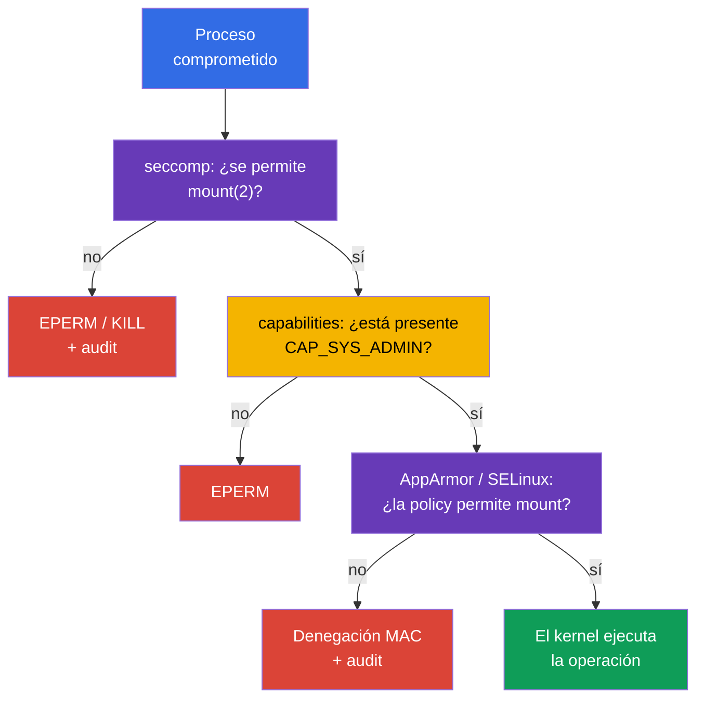

[Русская версия](ru.md) · [Eng version](README.md) · [Version française](fr.md) · [Deutsche Version](de.md) · [ქართული ვერსია](ge.md) · [繁體中文版](tw.md) · [日本語版](jp.md)

# Capítulo 17. seccomp: un conjunto mínimo de llamadas al sistema

> **Problema.** Un proceso comprometido en un contenedor dispone de la misma interfaz de llamadas al sistema del kernel que una aplicación legítima y puede usar las llamadas poco necesarias `mount`, `unshare`, `bpf` o `clone` para escapar del aislamiento o desarrollar un exploit del kernel. Incluso sin una capability adicional, tal API del kernel amplía la superficie de ataque; seccomp deja al proceso únicamente un conjunto de syscalls validado previamente.

> **Qué sigue.** AppArmor en el [capítulo 16](../16/es.md) restringió las rutas y los objetos del kernel con los que puede trabajar un proceso. Ahora añadimos un filtro en una capa aún más baja: **seccomp** compara las llamadas al sistema (syscalls) de un proceso con las reglas del profile y elige una acción para cada una, por ejemplo permitir, devolver un error, terminar o registrar. Este es el dominio **System Hardening** de CKS (10%). En la siguiente parte del curso, estas mismas restricciones pasarán a formar parte de un `SecurityContext` reforzado y de los Pod Security Standards.

> **Lo que necesita de CKA.** El `securityContext` básico, la ejecución non-root, `allowPrivilegeEscalation: false` y las Linux capabilities se explican en el [capítulo 20 de CKA](../../../cka/course/20/es.md). Practíquelos primero en el [laboratorio 106 de CKA](../../../cka/labs/106/README_ES.MD): seccomp no sustituye a `capabilities.drop: ["ALL"]`; reduce la API del kernel disponible para un proceso.

> 🧠 Seccomp filtra syscalls y devuelve allow, `ERRNO`, kill o `LOG`; capabilities, DAC y MAC se comprueban por separado.

## 17.1. Qué protege seccomp

Una aplicación no llama directamente a las funciones del kernel. Una biblioteca o runtime acaba realizando una **llamada al sistema**: `openat(2)` abre un archivo, `socket(2)` crea un socket, `clone(2)` crea un proceso o thread, y `mount(2)` monta un filesystem. Un proceso comprometido obtiene la misma interfaz del kernel. Muchas syscalls no son necesarias para un servidor web o worker normal, pero resultan útiles para escapar de un contenedor, cambiar un namespace, cargar programas BPF o montar.

seccomp (secure computing mode) es un mecanismo del kernel Linux que compara cada syscall de un proceso con un filtro BPF y elige una acción: permitirla, devolver un error, terminar el proceso, crear un evento de audit o pasar la decisión a un notificador en userspace. Kubernetes asigna tal filtro a los procesos de un contenedor mediante `securityContext.seccompProfile`.

```mermaid
flowchart TB
    process["Proceso del contenedor"] --> call["syscall: mount, clone, openat ..."]
    call --> filter["Filtro BPF de seccomp"]
    filter -->|"ALLOW"| kernel["El kernel ejecuta la syscall"]
    filter -->|"ERRNO / KILL"| blocked["EPERM, ENOSYS o terminación"]
    filter -->|"LOG"| audit["audit / journal del kernel"]
    style process fill:#326ce5,color:#fff
    style filter fill:#673ab7,color:#fff
    style kernel fill:#0f9d58,color:#fff
    style blocked fill:#db4437,color:#fff
    style audit fill:#f4b400,color:#000
```

El filtro se adjunta a un proceso y los procesos hijo lo heredan. No concede permisos: si seccomp permite una syscall, las comprobaciones normales del kernel siguen aplicándose. Por ejemplo, un `mount(2)` permitido todavía requiere la capability y los permisos apropiados de mount namespace/LSM. A la inversa, `CAP_SYS_ADMIN` no anula una denegación de seccomp. Por tanto, seccomp es la última barrera estrecha ante la API del kernel, no un sustituto universal de otros controles.

| Mecanismo | Pregunta que responde | Ejemplo |
|---|---|---|
| UID/GID y DAC | ¿puede la identity trabajar con el objeto? | permisos de archivo `0640` |
| capabilities | ¿existe un privilegio especial del kernel? | no hay `CAP_SYS_ADMIN` |
| seccomp | ¿está permitida esta syscall específica? | `unshare(2)` devuelve `EPERM` |
| AppArmor / SELinux | ¿la policy MAC permite el objeto y la operación? | AppArmor deniega la lectura de `/etc/shadow` |
| RBAC | ¿puede la identity llamar a la API de Kubernetes? | no hay `get secrets` |

seccomp no restringe la red por dirección o puerto, no comprueba Kubernetes RBAC ni hace segura una image. Los host namespaces, hostPath y las capabilities excesivas elevan mucho el riesgo. En particular, `privileged: true` siempre inicia un contenedor con seccomp `Unconfined`: Kubernetes no aplica un profile a tal contenedor. Para una carga de trabajo normal, la combinación baseline es esta:

```yaml
securityContext:
  runAsNonRoot: true
  seccompProfile:
    type: RuntimeDefault
containers:
- name: app
  image: nginxinc/nginx-unprivileged:1.30.4-alpine-slim
  ports:
  - containerPort: 8080
  securityContext:
    allowPrivilegeEscalation: false
    capabilities:
      drop: ["ALL"]
```

## 17.2. Modos de seccomp y acciones del filtro

El kernel admite un modo estricto heredado y un modo de filtrado. Los contenedores casi siempre usan el modo de filtrado: el runtime carga un programa BPF desde un profile OCI/Kubernetes antes de iniciar el proceso. `/proc/<pid>/status` contiene `Seccomp: 2` cuando el modo de filtrado está habilitado para un proceso; `0` significa que no hay seccomp y `1` significa el modo estricto heredado. El valor `2` no prueba por sí mismo *qué* profile se ha cargado, pero es útil durante el diagnóstico.

En un profile JSON, las acciones se especifican mediante valores libseccomp/OCI. Su significado importa más que memorizar cada nombre:

| Acción | Resultado | Uso típico |
|---|---|---|
| `SCMP_ACT_ALLOW` | la syscall se ejecuta | allow-list de llamadas necesarias |
| `SCMP_ACT_ERRNO` | la syscall no se ejecuta; el proceso recibe errno | denegar de forma predecible una acción innecesaria |
| `SCMP_ACT_KILL_PROCESS` | el kernel termina todo el proceso | acción fail-closed estricta para una syscall explícitamente peligrosa |
| `SCMP_ACT_KILL_THREAD` | el kernel termina el thread que llama | suele evitarse: un proceso multithread puede quedar en un estado extraño |
| `SCMP_ACT_TRAP` | el proceso recibe `SIGSYS` | gestión especializada, no un baseline estándar |
| `SCMP_ACT_LOG` | la syscall se permite; el kernel intenta escribir un evento de audit | inventario de llamadas antes de enforce |
| `SCMP_ACT_NOTIFY` | la decisión se pasa a un supervisor en userspace | arquitectura especializada; no sustituye una policy normal |

`SCMP_ACT_LOG` no bloquea una syscall. Es útil para una prueba breve y controlada, pero genera ruido en los logs y no es protección de producción. `SCMP_ACT_ERRNO` sin un errno indicado devuelve normalmente `EPERM`; un valor concreto puede establecerse por separado. No elija `KILL` solo porque sea "más estricto": la muerte repentina del proceso puede convertir una llamada irrelevante en una interrupción y el diagnóstico en un crash loop difícil.

Los dos enfoques de policy son distintos:

- **deny-list:** `defaultAction: SCMP_ACT_ALLOW`; las syscalls peligrosas separadas reciben `ERRNO` o `KILL`. Es más fácil para la compatibilidad, pero las syscalls nuevas u olvidadas siguen disponibles.
- **allow-list:** `defaultAction: SCMP_ACT_ERRNO`; los grupos permitidos se enumeran en `syscalls`. Es más fuerte y exige un contrato de aplicación medido y probado.

`RuntimeDefault` normalmente proporciona un baseline seguro del runtime. Una allow-list custom tiene sentido solo después de observar y probar la aplicación real, sus probes, entrypoint, DNS/TLS y tareas periódicas. Nunca la construya a partir de un único `curl` correcto o un único `strace`.

> 🎯 Elija `RuntimeDefault` o un profile `Localhost` validado y demuestre el seccomp efectivo para el contenedor requerido; un solo `EPERM` no demuestra una denegación de seccomp.

## 17.3. API de Kubernetes: `RuntimeDefault`, `Localhost`, `Unconfined`

La API actual de Kubernetes especifica seccomp en `securityContext.seccompProfile`. Puede establecerlo en un Pod como baseline para cada contenedor o en un contenedor individual cuando necesite una policy más estricta. El `securityContext` de nivel de contenedor tiene prioridad para ese contenedor. Evite filtros distintos salvo que sea necesario: dificultan el rollout, el audit y el análisis de la causa raíz.

| `type` | Qué se asigna | Cuándo elegirlo |
|---|---|---|
| `RuntimeDefault` | profile proporcionado por el container runtime | baseline normal para una carga de trabajo habitual |
| `Localhost` | profile JSON disponible localmente en la node | contrato de syscalls específico de la aplicación y validado |
| `Unconfined` | no se aplica ningún filtro seccomp | solo una excepción diagnóstica temporal con responsable y fecha de expiración |

### `RuntimeDefault`: un punto de partida seguro

`RuntimeDefault` pide al runtime que aplique su profile predeterminado. Su contenido exacto depende del runtime y de la versión, así que no se debe suponer que sea el mismo JSON en todas las plataformas. No lo sustituya por `Unconfined` si la aplicación aún no se ha investigado: primero demuestre el conflicto específico mediante un evento, logs y una prueba.

```yaml
apiVersion: v1
kind: Pod
metadata:
  name: runtime-default-seccomp
  namespace: demo
spec:
  securityContext:
    seccompProfile:
      type: RuntimeDefault
  containers:
  - name: app
    image: nginx:1.30.4
    securityContext:
      allowPrivilegeEscalation: false
      capabilities:
        drop: ["ALL"]
```
Compruebe la especificación almacenada, el estado y el modo efectivo del proceso:

```bash
kubectl apply -f runtime-default-seccomp.yaml
kubectl wait -n demo --for=condition=Ready pod/runtime-default-seccomp --timeout=120s
kubectl get pod -n demo runtime-default-seccomp \
  -o jsonpath='{.spec.securityContext.seccompProfile.type}{"\n"}'
kubectl describe pod -n demo runtime-default-seccomp
kubectl exec -n demo runtime-default-seccomp -- grep '^Seccomp:' /proc/1/status
# Se espera: Seccomp: 2; esto confirma el modo de filtro, no la identidad del profile.
```

Si el default de todo el clúster ya habilita `RuntimeDefault`, el campo explícito sigue siendo útil: el manifest lleva la intención con la carga de trabajo, una policy de admission puede comprobarlo y quien lo revise no debería tener que adivinar la configuración de la node/runtime.

### `seccompDefault`: un default de node para un manifest sin el campo

La función `seccompDefault` es estable desde Kubernetes v1.27. Cuando está habilitada, kubelet aplica `RuntimeDefault` a una carga de trabajo sin profile seccomp indicado. Se habilita con el flag `--seccomp-default` de kubelet o con un campo de configuración de kubelet:

```yaml
seccompDefault: true
```

Este es un ajuste de nivel de node, por lo que un manifest sin `seccompProfile` puede obtener efectivamente `RuntimeDefault` en una node con `seccompDefault` habilitado o `Unconfined` en una que no lo tenga. No use un campo ausente como contrato de seguridad: indique `RuntimeDefault` explícitamente para un baseline portable. El `Unconfined` explícito sigue siendo una excepción, y `privileged: true` siempre proporciona `Unconfined` independientemente del profile del manifest.

Compruebe la configuración real en la node **real** del Pod en lugar de adivinar a partir de la versión del clúster. Los comandos siguientes solo leen la línea de comandos de kubelet y un campo explícitamente indicado; obtenga primero el nombre de la node con `kubectl get pod -o wide` y use acceso administrativo autorizado a ella:

```bash
# En la node real del Pod. sudo abre /proc; pipefail evita un fallo de lectura oculto.
set -o pipefail
KPID=$(pgrep -xo kubelet) || { echo 'ERROR: kubelet not found' >&2; exit 1; }
if ! sudo cat "/proc/$KPID/cmdline" | tr '\0' '\n' | \
  awk '$0 == "--config" { print; getline; print; next }
       $0 == "--config-dir" { print; getline; print; next }
       /^--(config|config-dir|seccomp-default)(=|$)/'; then
  echo 'REVIEW_REQUIRED: cannot read kubelet command line reliably' >&2
  exit 2
fi

# Los drop-ins de --config-dir se admiten desde kubelet v1.36. Resuelva las rutas relativas
# respecto al directorio de trabajo de kubelet, lea cada .conf en el orden de fusión de kubelet
# y luego aplique los flags CLI. Si no puede determinar exactamente rutas, orden o valor fusionado,
# informe REVIEW_REQUIRED; no deduzca seccompDefault de un único config.yaml.
```

Los drop-ins de `--config`, `--config-dir` y `--seccomp-default` son fuentes de configuración de kubelet; los flags CLI anulan la configuración de archivos fusionada. No publique una configuración completa ni una línea de comandos arbitraria de `/proc` en un ticket. Después compare el estado deseado con el modo del proceso. La prioridad es el profile de nivel de contenedor, luego el profile de nivel de Pod y después el default de node cuando falta un profile; `privileged` es la excepción y permanece `Unconfined`.

```bash
NS=demo
POD=runtime-default-seccomp
CTR=app

kubectl get pod -n "$NS" "$POD" \
  -o jsonpath='{.spec.securityContext.seccompProfile}{"\n"}'
kubectl get pod -n "$NS" "$POD" \
  -o jsonpath='{.spec.containers[?(@.name=="app")].securityContext.seccompProfile}{"\n"}'
kubectl exec -n "$NS" "$POD" -c "$CTR" -- grep '^Seccomp:' /proc/1/status
```

`Seccomp: 2` confirma el modo de filtro, mientras que `Seccomp: 0` confirma que no hay ningún filtro. `/proc` no revela el nombre JSON ni el contenido exacto de `RuntimeDefault`; la identidad del profile efectivo se establece conjuntamente mediante la prioridad del manifest, la configuración/flags reales de kubelet, los registros del runtime y el comportamiento esperado. Para un contenedor privileged, un profile de Kubernetes no puede ser efectivo aunque el campo aparezca en YAML.

### `Localhost`: una ruta no es absoluta

`Localhost` selecciona un profile JSON custom. Kubernetes no pasa JSON a través de un Pod ni lo copia con el scheduler: kubelet lee el archivo **en la node seleccionada** desde el directorio de profiles seccomp. Por defecto es `/var/lib/kubelet/seccomp`, así que el subdirectorio `profiles` y el archivo `audit.json` físicamente tienen este aspecto:

```text
/var/lib/kubelet/seccomp/profiles/audit.json
```

El manifest indica una ruta **relativa al root de seccomp de kubelet**, sin una `/` inicial:

```yaml
securityContext:
  seccompProfile:
    type: Localhost
    localhostProfile: profiles/audit.json
```

`localhostProfile: /var/lib/kubelet/seccomp/profiles/audit.json` es incorrecto: una ruta absoluta no es un contrato de API. También es incorrecto asumir `/var/lib/kubelet` cuando kubelet se inicia con otro `--root-dir`: el root del profile será entonces `<root-dir>/seccomp`. En nodes gestionadas, conozca la configuración real de kubelet a través del responsable de la plataforma; no busque archivos al azar en una node de producción.

El ejemplo completo con una dependencia local de la node:

```yaml
apiVersion: v1
kind: Pod
metadata:
  name: localhost-seccomp
  namespace: demo
spec:
  # Indique solo un label/pool de confianza al que la automatización haya entregado el profile.
  nodeSelector:
    seccomp.example.com/profiles: "v1"
  securityContext:
    seccompProfile:
      type: Localhost
      localhostProfile: profiles/audit.json
  containers:
  - name: app
    image: busybox:1.36.1
    command: ["sh", "-c", "sleep 3600"]
    securityContext:
      allowPrivilegeEscalation: false
      capabilities:
        drop: ["ALL"]
```

No coloque un label controlado por un usuario en una node únicamente para este manifest: el label, el profile y la placement forman parte de una configuración confiable de node. Entregue el mismo profile a todo el pool elegible, o restrinja el scheduling con un label/affinity protegido y compruebe cada pool antes del rollout.

### `privileged` siempre es `Unconfined`

Kubernetes inicia un contenedor con `securityContext.privileged: true` como seccomp `Unconfined` y no le aplica ni `RuntimeDefault` ni `Localhost`. Por tanto, un YAML que contiene `privileged: true` y `seccompProfile` no significa que haya dos capas activas: el profile seccomp no puede ser efectivo aquí. No intente "arreglarlo" sustituyendo el profile o buscando JSON en la node. Elimine `privileged` si no está justificado y después asigne un profile mínimo.

Un diagnóstico seguro primero registra el estado deseado conflictivo y solo después inspecciona el proceso del contenedor requerido:

```bash
NS=demo
POD=example
CTR=app

kubectl get pod -n "$NS" "$POD" \
  -o jsonpath='{.spec.containers[?(@.name=="app")].securityContext.privileged}{"\n"}'
kubectl get pod -n "$NS" "$POD" \
  -o jsonpath='{.spec.containers[?(@.name=="app")].securityContext.seccompProfile}{"\n"}'
kubectl exec -n "$NS" "$POD" -c "$CTR" -- grep '^Seccomp:' /proc/1/status
```

Para un contenedor privileged sin un filtro instalado por la propia aplicación, espere `Seccomp: 0`. Un campo de profile en un manifest sirve solo como evidencia de una intención incorrecta, no como prueba de que se haya aplicado. `Seccomp: 2` en el proceso demuestra únicamente el modo de filtro y requiere una investigación separada del proceso/runtime; no vuelve efectivo un profile de Kubernetes para un contenedor privileged.

### `Unconfined` y la annotation obsoleta

`Unconfined` deshabilita esta capa para un contenedor. Puede usarse como una excepción breve, por ejemplo para una comparación controlada en una node de prueba, pero no como una "solución" permanente a `Operation not permitted`. Registre el responsable, la fecha límite de retirada y el motivo específico; después restaure el mínimo privilegio.

Los manifests antiguos pueden usar la annotation `seccomp.security.alpha.kubernetes.io/pod` o `container.seccomp.security.alpha.kubernetes.io/<container>`. Esta es una interfaz histórica: desde Kubernetes v1.25, estas annotations son **no funcionales** y no asignan un profile seccomp. Su presencia en un clúster moderno es una señal de audit, no compatibilidad funcional; sustitúyalas por `securityContext.seccompProfile`. No mezcle la annotation y el campo de API, especialmente con valores distintos. Después de migrar, pruebe el nuevo Pod y compruebe su modo efectivo.

> 🎯 Cree un profile JSON `Localhost` en formato OCI seccomp, cárguelo en la node requerida y confirme el modo efectivo del contenedor.

## 17.4. Profile JSON: estructura y ejemplo seguro

Un profile `Localhost` es JSON en formato OCI seccomp. Su arquitectura, acción predeterminada y array de reglas importan. Nombre las syscalls según la ABI Linux, no según el nombre de un comando de shell: `mount` significa `mount(2)`, no la utilidad `/bin/mount`.

A continuación hay un pequeño **profile de audit para una node de prueba**. Permite todas las syscalls, pero indica al kernel que registre los intentos de usar `unshare`, `setns`, `mount` y `bpf`. No protege una carga de trabajo; su fin es demostrar la ruta `Localhost` y recoger un evento observable antes de escribir un profile restrictivo real.

```json
{
  "defaultAction": "SCMP_ACT_ALLOW",
  "architectures": [
    "SCMP_ARCH_X86_64"
  ],
  "syscalls": [
    {
      "names": ["unshare", "setns", "mount", "bpf"],
      "action": "SCMP_ACT_LOG"
    }
  ]
}
```

> 🔬 `syscalls[].args`, `errnoRet` y el filtrado por argumentos de syscalls son detalles limitados que dependen de la versión y de la arquitectura.

OCI seccomp puede comparar no solo el nombre de una syscall, sino también sus argumentos mediante `syscalls[].args` (`index`, `value`, `valueTwo` opcional, `op`). Por ejemplo, la siguiente regla devuelve `EPERM` solo para `socket(2)` con dominio `AF_PACKET` (17), sin denegar otros dominios de socket:

```json
{
  "names": ["socket"],
  "action": "SCMP_ACT_ERRNO",
  "errnoRet": 1,
  "args": [{"index": 0, "value": 17, "op": "SCMP_CMP_EQ"}]
}
```

Los números y valores de argumentos dependen de la ABI de la syscall, así que pruebe este tipo de filtro en cada arquitectura/runtime de destino y no lo traslade entre plataformas sin validación.

Para ARM64, el conjunto `architectures` debe coincidir con la arquitectura de la node (por ejemplo, `SCMP_ARCH_AARCH64`); no copie JSON x86_64 a una node ARM. En un clúster heterogéneo, un profile contiene entradas ABI correctas para cada pool de nodes compatible, o la carga de trabajo se restringe explícitamente a un pool compatible.

La automatización de nodes, no un Pod ordinario, instala y verifica el profile. El siguiente ejemplo es para una node de prueba dedicada e ilustra la ruta predeterminada de kubelet:

```bash
# En una node de prueba, con acceso administrativo.
sudo install -d -m 0755 /var/lib/kubelet/seccomp/profiles
sudo install -m 0644 audit.json /var/lib/kubelet/seccomp/profiles/audit.json
sudo test -r /var/lib/kubelet/seccomp/profiles/audit.json
sudo jq empty /var/lib/kubelet/seccomp/profiles/audit.json
```

`jq empty` valida la sintaxis JSON, pero no demuestra la semántica de los nombres de syscall ni la compatibilidad del runtime. Antes de un rollout de producción, añada una prueba de inicio de contenedor en cada versión de runtime de destino y después prepare el rollback como una publicación de una versión nueva de profile validada, no como una edición manual en una node activa.

A continuación hay un profile enforce que usa una deny-list. Demuestra una denegación predecible: las syscalls se permiten por defecto y unas pocas acciones reciben `EPERM`. Este archivo no sustituye a `RuntimeDefault` y por sí solo no es una policy de producción suficiente.

```json
{
  "defaultAction": "SCMP_ACT_ALLOW",
  "architectures": [
    "SCMP_ARCH_X86_64"
  ],
  "syscalls": [
    {
      "names": ["unshare", "setns", "mount"],
      "action": "SCMP_ACT_ERRNO",
      "errnoRet": 1
    },
    {
      "names": ["bpf", "keyctl", "perf_event_open"],
      "action": "SCMP_ACT_ERRNO",
      "errnoRet": 1
    }
  ]
}
```

`errnoRet: 1` significa `EPERM`. Si un proceso recibe `Operation not permitted`, esto no demuestra automáticamente seccomp: capabilities, AppArmor, SELinux o permisos ordinarios pueden devolver el mismo errno. Necesita conjuntamente el manifest, el estado del proceso y el audit/log del kernel.

## 17.5. Observación: audit de syscalls y log del kernel

Una fase breve de audit responde «¿qué syscalls se requieren realmente?» y no debe convertirse en un modo de producción interminable. Use tráfico representativo en una node de prueba, incluidos el inicio, probes de liveness/readiness, TLS/DNS, trabajos worker, apagado ordenado y rutas de error. Recopile datos durante un tiempo limitado y correlaciónelos con PID/contenedor y versión de image.

Para el profile de audit de la sección anterior, aplique el Pod y haga después una comprobación de llamada segura. En un contenedor sin `CAP_SYS_ADMIN`, `unshare` normalmente seguirá fallando; para un audit basta que la syscall se haya intentado y haya llegado al kernel.

```bash
kubectl apply -f localhost-seccomp.yaml
kubectl wait -n demo --for=condition=Ready pod/localhost-seccomp --timeout=120s
kubectl get pod -n demo localhost-seccomp -o wide
kubectl exec -n demo localhost-seccomp -- sh -c 'unshare -Ur true || true'
kubectl exec -n demo localhost-seccomp -- grep '^Seccomp:' /proc/1/status
```

Después conecte a la node indicada por `kubectl get ... -o wide` y busque registros de seccomp en el journal del kernel. El formato preciso depende del kernel, auditd y el pipeline de logging; un registro normalmente incluye `type=SECCOMP`, `syscall=`, `pid=`, `comm=` y arch. No espere un texto invariable en todas las distribuciones.

```bash
# En la node seleccionada, limite la ventana de tiempo y busque varias variantes conocidas.
sudo journalctl -k --since '10 minutes ago' | \
  grep -Ei 'seccomp|type=SECCOMP|audit.*syscall' || true

# Si auditd está instalado y permitido por su procedimiento de operaciones:
sudo ausearch -m SECCOMP -ts recent 2>/dev/null || true
```

Para correlacionar un registro con un contenedor, necesita la node, el momento, el nombre/PID de proceso y el ID del runtime. No trate el journal completo del kernel como un «log de Pod»: kubelet, el runtime y otras cargas de trabajo se ejecutan en una node. Primero recopile el contexto de Kubernetes:

```bash
NS=demo
POD=localhost-seccomp

kubectl get pod -n "$NS" "$POD" -o wide
kubectl get pod -n "$NS" "$POD" \
  -o jsonpath='{.spec.securityContext.seccompProfile}{"\n"}'
kubectl describe pod -n "$NS" "$POD"
```

En la node, un administrador puede obtener el ID del contenedor y el PID del host si las reglas de acceso lo permiten:

```bash
# En la node: seleccione exactamente un sandbox Ready actual y después exactamente un contenedor app.
mapfile -t POD_IDS < <(
  sudo crictl pods --name '^localhost-seccomp$' --namespace '^demo$' --state ready -q
)
if [ "${#POD_IDS[@]}" -ne 1 ]; then
  printf 'REVIEW_REQUIRED: expected exactly one Ready pod sandbox, found %s\n' "${#POD_IDS[@]}" >&2
  exit 2
fi
POD_ID=${POD_IDS[0]}
mapfile -t CONTAINER_IDS < <(
  sudo crictl ps --pod "$POD_ID" --name '^app$' -q
)
if [ "${#CONTAINER_IDS[@]}" -ne 1 ]; then
  printf 'REVIEW_REQUIRED: expected exactly one running app container, found %s\n' "${#CONTAINER_IDS[@]}" >&2
  exit 2
fi
CONTAINER_ID=${CONTAINER_IDS[0]}
# .info son datos detallados específicos del runtime, no un contrato PID CRI portable.
HOST_PID=$(sudo crictl inspect "$CONTAINER_ID" | jq -r '.info.pid // empty')
if ! [[ "$HOST_PID" =~ ^[0-9]+$ ]]; then
  echo 'REVIEW_REQUIRED: runtime did not expose host PID as .info.pid; use its documented node-local inspection method' >&2
  exit 2
fi
sudo grep '^Seccomp:' "/proc/$HOST_PID/status"
```

`strace` es útil para investigación local reproducible, pero cambia el timing y añade carga. No lo adjunte durante mucho tiempo a un PID de producción ocupado. En una node de prueba, ejecute un trace corto de un proceso o comando y compare los nombres de syscall con el profile:

```bash
HOST_PID=replace-with-host-pid
sudo strace -f -p "$HOST_PID" -e trace=%process,%network,%file
# Detenga el trace después de una prueba breve y controlada.
```

`strace` muestra llamadas del proceso, mientras que `SCMP_ACT_LOG` proporciona telemetría del kernel. Ninguno debe generar automáticamente una allow-list: conserve una policy mínima tras la revisión de amenazas, no tras añadir mecánicamente cada syscall observada.

## 17.6. Verificación y debugging: desde YAML hasta el kernel

Hay dos grupos distintos de fallos de seccomp, y el orden de verificación ahorra tiempo.

1. **El contenedor no se creó.** Con `Localhost`, no se encontró el archivo, la ruta no es relativa, el JSON/runtime no es compatible, o el Pod se programó en una node sin el profile. Inspeccione los eventos del Pod, la node y los logs de kubelet/runtime.
2. **El contenedor se ejecuta, pero se rechaza la syscall.** Se aplicó el filtro seccomp y la aplicación recibe `EPERM`, `ENOSYS`, `SIGSYS` o termina. Inspeccione el modo efectivo, el log de la aplicación y los registros de audit del kernel.

### Orden rápido de verificación

```bash
NS=demo
POD=localhost-seccomp
CTR=app

# 1. Estado deseado: los contextos de nivel Pod y de contenedor pueden diferir.
kubectl get pod -n "$NS" "$POD" -o jsonpath='{.spec.securityContext.seccompProfile}{"\n"}'
kubectl get pod -n "$NS" "$POD" \
  -o jsonpath='{.spec.containers[?(@.name=="app")].securityContext.seccompProfile}{"\n"}'

# 2. Ciclo de vida y la node seleccionada.
kubectl get pod -n "$NS" "$POD" -o wide
kubectl describe pod -n "$NS" "$POD"
kubectl get events -n "$NS" --field-selector involvedObject.name="$POD" \
  --sort-by=.lastTimestamp

# 3. Estado efectivo del proceso, si el contenedor se inició.
kubectl exec -n "$NS" "$POD" -c "$CTR" -- grep '^Seccomp:' /proc/1/status
```

Si `kubectl exec` no es posible, no empiece suponiendo una syscall bloqueada: lea primero `describe` y los eventos. Para `Localhost`, un evento suele identificar directamente un profile ausente o su error de carga. Compruebe el valor exacto de `localhostProfile`; no es un nombre de archivo «en algún lugar de la node» ni una ruta absoluta.

En la node real, diagnostique la ruta, el permiso de lectura y kubelet, pero no copie secretos ni el contenido de un profile de producción a un ticket innecesariamente:

```bash
# En la node seleccionada. Sustituya root-dir por el de la línea de comandos/config real de kubelet.
KUBELET_ROOT=/var/lib/kubelet
sudo test -r "$KUBELET_ROOT/seccomp/profiles/audit.json"
sudo stat "$KUBELET_ROOT/seccomp/profiles/audit.json"
sudo journalctl -u kubelet --since '15 minutes ago'
sudo journalctl -k --since '15 minutes ago' | grep -Ei 'seccomp|SECCOMP|audit' || true
```

### Tabla de síntomas

| Síntoma | Causa probable | Evidencia y corrección segura |
|---|---|---|
| `CreateContainerError` después de `Localhost` | el profile no está en la node seleccionada o la ruta es incorrecta | `describe`, node de `-o wide`, nombre relativo exacto y archivo bajo el root seccomp de kubelet |
| Pod programado en un lugar incorrecto | el profile no se entregó a todo el pool | compruebe label de node, entrega de automatización y placement; no debilite el profile |
| `Seccomp: 0` en un contenedor en ejecución | no se asignó profile, se indicó `Unconfined`, el contenedor es privileged o el default de node está deshabilitado | compare `securityContext` y `privileged` de Pod/contenedor, y después los flags/config reales de kubelet en la node |
| `Seccomp: 2`, pero la aplicación recibe `EPERM` | posible denegación de seccomp, capability/MAC/DAC, o todas a la vez | audit del kernel, logs de AppArmor/SELinux, capabilities y la syscall precisa |
| `SIGSYS` o proceso terminado | el profile usa `TRAP`/`KILL` | compruebe JSON, código de salida y logs del runtime; reprodúzcalo en una node de prueba |
| JSON se lee con `jq`, pero el contenedor no inicia | schema, ABI, versión de runtime o soporte seccomp incompatibles | evento de kubelet/runtime y prueba aislada de compatibilidad |
| el rollout falla solo en algunas réplicas | los pools de nodes difieren en profile/runtime/arquitectura | inventaríe cada pool, fije un pool compatible o use entrega gestionada uniforme |
| «arreglo» mediante `Unconfined`/`privileged` | se deshabilitó la protección y no se encontró la causa | restaure el baseline, identifique la syscall específica y use una excepción mínima justificada |

Lea `/proc/1/status` en el contenedor requerido. En un Pod con múltiples contenedores, el PID 1 de cada contenedor tiene una vista independiente; `kubectl exec` sin `-c` puede seleccionar el contenedor equivocado. `Seccomp: 2` demuestra el modo de filtro; la verificación de la identidad del profile sigue siendo la combinación de especificación del Pod, registros runtime/kubelet, entrega a la node y comportamiento esperado.

### Verificar un escenario negativo

Para el JSON enforce de la sección 17.4, cree un Pod de prueba separado con `localhostProfile: profiles/restrict.json`. No modifique un archivo en una node de producción durante un rollout en curso: prepare una versión nueva, verifíquela y solo entonces cambie la referencia de la carga de trabajo.

```bash
kubectl exec -n demo localhost-seccomp -- sh -c 'mount -t tmpfs tmpfs /tmp/x'
# Se espera: mount: permission denied (o un EPERM comparable).

kubectl exec -n demo localhost-seccomp -- grep '^Seccomp:' /proc/1/status
# Se espera: Seccomp: 2
```

Este comando no basta para la atribución: `mount` puede ser denegado por una capability ausente. Como evidencia de aprendizaje, registre el profile, `Seccomp: 2`, stderr del comando y el audit/log coincidente de la node. En una investigación real, aísle la prueba y no añada `CAP_SYS_ADMIN` solo para saltarse una restricción y «probar» otra.

> 🧠 Seccomp controla syscalls, capabilities controlan privilegios y AppArmor/SELinux controlan el acceso a objetos y operaciones.

## 17.7. Cómo se relacionan seccomp, capabilities y AppArmor

Estos controles comprueban una acción en capas distintas. Considere un proceso comprometido que intenta llamar a `mount(2)`:



El orden de las comprobaciones internas del kernel y el errno preciso dependen de la syscall y de la versión del kernel, pero el modelo de defensa en profundidad se mantiene: superar una capa no anula otra. De ello se derivan reglas prácticas.

- **Las capabilities reducen la autoridad.** `drop: ["ALL"]` elimina privilegios del kernel innecesarios. Si una aplicación realmente necesita un puerto privilegiado, restaure solo `NET_BIND_SERVICE`, no `SYS_ADMIN`.
- **seccomp reduce la superficie de API.** Puede denegar una syscall independientemente de cuán altos sean los privilegios del proceso. `RuntimeDefault` es el baseline estándar; `Localhost` exige un contrato medido y entrega a la node.
- **AppArmor/SELinux restringen objetos y operaciones.** La policy de AppArmor basada en rutas del [capítulo 16](../16/es.md) puede denegar una ruta específica incluso después de permitir una syscall. SELinux resuelve un problema similar mediante labels/type enforcement en sistemas operativos adecuados.
- **`allowPrivilegeEscalation: false` conecta el modelo.** En Linux, prohíbe obtener nuevos privilegios e impide que un proceso consiga privilegios adicionales mediante binarios setuid o file capabilities; no sustituye seccomp, pero es una frontera adicional útil.

No intente demostrar seccomp solo mostrando que falta una capability: eso demuestra únicamente una barrera independiente. Tampoco añada una capability para probar seccomp en una carga de trabajo de producción. Ejecute un experimento limitado en un namespace/node separado y elimine después los recursos.

> 🏭 Profile `Localhost`: un artefacto versionado con responsable, pruebas de runtime/ABI, entrega, canary y rollback.

## 17.8. Operaciones: profile como código, no como archivo en una node

Un profile `Localhost` es parte del contrato de la plataforma. El scheduler no lee el contenido de `/var/lib/kubelet/seccomp` ni transfiere JSON a una node. Las operaciones fiables exigen un ciclo de vida integral gestionado.

1. **Defina la amenaza y el responsable.** Indique qué syscall reduce el riesgo y qué carga de trabajo/versión cubre el profile. «Denegar todo por si acaso» no es una especificación.
2. **Observe de manera controlada.** En una node de prueba, use audit/tracing de profile breves para una carga representativa, incluidos inicio y rutas de error. Conserve el digest de image, el OS de la node, kernel y versión de runtime.
3. **Cree JSON mínimo y valide compatibilidad.** Valide JSON, ABI e inicio en cada arquitectura/runtime compatible. Una image o dependencia nueva puede cambiar el conjunto de syscalls.
4. **Entregue el profile como artefacto versionado.** La image de node, cloud-init o la gestión de configuración debe instalar el archivo antes de programar la carga de trabajo. No conceda a un Pod no privilegiado acceso de escritura al directorio de kubelet.
5. **Vincule entrega y placement.** El mismo profile en un pool es más simple y seguro; de lo contrario, use un label/affinity de node de confianza y compruebe el inventario.
6. **Haga rollout gradual.** Empiece con un canary; compruebe Ready, SLO de la aplicación y eventos `SECCOMP`/runtime. El rollback necesita un responsable y un manifest verificado.
7. **Observe las denegaciones; no desactive la protección.** Una alerta correlaciona el audit de la node con la carga de trabajo. La corrección es un profile limitado y justificado o un cambio de aplicación, no `Unconfined` perpetuo.

Para una carga de trabajo de producción normal, suele bastar la combinación de `RuntimeDefault`, non-root, `allowPrivilegeEscalation: false`, capabilities descartadas y policy MAC. Un profile custom se justifica cuando el riesgo y el contrato se conocen bien; la complejidad del profile también es un riesgo operativo.

Cuando los profiles seccomp/AppArmor/SELinux custom deben distribuirse y registrarse a escala de clúster, considere **Security Profiles Operator (SPO)** como vía de producción: gestiona el ciclo de vida de los profiles y el workflow de grabación en lugar de copiar manualmente JSON al directorio kubelet de cada node. Esto no elimina la necesidad de pruebas, versionado o control de placement, pero hace que la entrega de profiles esté gestionada por la plataforma.

Los Pod Security Standards `restricted` exigen seccomp `RuntimeDefault` o `Localhost`; `Unconfined` no cumple este baseline. Una policy de admission ayuda a garantizar que una carga de trabajo sin seccomp no aparezca por una omisión en un chart. Admission no comprueba que el JSON custom exista en una node - eso sigue siendo responsabilidad del ciclo de vida de node y del rollout.

## 17.9. Miniglosario

- **syscall** - una llamada al sistema mediante la que un proceso solicita una operación al kernel.
- **seccomp** - el mecanismo Linux para filtrar las syscalls de un proceso.
- **Filtro BPF** - programa de filtro que el kernel ejecuta para una syscall en modo de filtrado.
- **`RuntimeDefault`** - profile seccomp proporcionado por el container runtime seleccionado.
- **`Localhost`** - tipo de Kubernetes para un profile JSON disponible localmente en una node.
- **`localhostProfile`** - ruta de profile JSON relativa al root seccomp de kubelet.
- **`Unconfined`** - ningún filtro seccomp para un contenedor; una excepción temporal, no un baseline.
- **allow-list** - una policy cuya acción predeterminada deniega y cuyas syscalls permitidas se declaran explícitamente.
- **deny-list** - una policy cuya acción predeterminada permite y cuyas syscalls individuales se deniegan.
- **`SCMP_ACT_LOG`** - una acción que permite una syscall y pide al kernel que la registre.
- **`SCMP_ACT_ERRNO`** - una acción que devuelve un error de una syscall sin ejecutarla.
- **Registro de audit `SECCOMP`** - una entrada de kernel/audit para un evento relacionado con seccomp.

## 17.10. Resumen del capítulo

- seccomp filtra syscalls en el límite proceso-kernel; complementa en lugar de sustituir capabilities, AppArmor/SELinux, DAC, RBAC y SecurityContext.
- Para una carga de trabajo normal, establezca explícitamente `seccompProfile.type: RuntimeDefault` junto con non-root, `allowPrivilegeEscalation: false` y capabilities mínimas. `seccompDefault` es estable desde v1.27, pero un default de node no sustituye la intención explícita en un manifest.
- Un profile `Localhost` es JSON en una node. `localhostProfile` siempre es relativo al root seccomp de kubelet: con el root predeterminado, `/var/lib/kubelet/seccomp/profiles/audit.json` se indica como `profiles/audit.json`.
- Un profile custom exige versionado, pruebas de arquitectura/runtime, entrega gestionada a cada node elegible y scheduling vinculado. El scheduler no entrega JSON por sí mismo.
- `SCMP_ACT_LOG` proporciona observación temporal, no protección; `ERRNO`/`KILL` bloquean con consecuencias distintas para la disponibilidad y el diagnóstico.
- La verificación incluye el contexto deseado de Pod/contenedor, `privileged`, node y eventos, flags/config reales de kubelet, `Seccomp: 2` en el contenedor requerido, resultado de aplicación y un audit/log de kernel coincidente. Un solo `EPERM` no basta para la atribución.

## 17.11. Cómo ayuda: en el examen y en el trabajo real

**En el examen.** Distinga rápidamente `RuntimeDefault` de `Localhost`, recuerde la ruta relativa `localhostProfile`, `seccompDefault` de kubelet y la regla de que `privileged` siempre es `Unconfined`. Compruebe el resultado con `kubectl describe`, `-o jsonpath`, la node seleccionada y `/proc/1/status`. Ante `CreateContainerError`, primero lea el evento y compruebe el profile local de la node; ante `EPERM`, no culpe a seccomp antes de comprobar capabilities y los logs de AppArmor/SELinux.

**En el trabajo real.** El default del runtime proporciona un baseline portable, mientras que seccomp custom es un contrato entre la aplicación, el runtime y la plataforma de node. Un resultado útil exige el workflow completo: syscalls medidas, revisión de amenazas, JSON versionado, canary, correlación de audit y rollback rápido. «Un archivo en una node» y `Unconfined` permanente no son hardening.

## 17.12. Preguntas de autoevaluación

<details>
<summary>1. ¿En qué se diferencia seccomp de las Linux capabilities y por qué un control no sustituye al otro?</summary>

Las capabilities determinan si un proceso dispone de un privilegio especial del kernel, como `CAP_SYS_ADMIN`; seccomp decide si se permite una syscall concreta. Una llamada permitida por seccomp sigue pasando por las comprobaciones normales de capabilities, namespace y LSM, mientras que una capability no anula una denegación de seccomp. Por eso el baseline combina `drop: ["ALL"]` con `RuntimeDefault`.
</details>

<details>
<summary>2. ¿Por qué `RuntimeDefault` es mejor que `Unconfined` para una carga de trabajo habitual?</summary>

`RuntimeDefault` pide al runtime que aplique su profile seccomp estándar y crea un baseline portable para una carga de trabajo habitual. `Unconfined` deshabilita esta capa y es aceptable solo como una excepción diagnóstica breve con responsable y fecha límite. El campo explícito del manifest también registra la intención sin depender de un default de node.
</details>

<details>
<summary>3. ¿Qué ruta se indica en `localhostProfile` si el archivo está en `/var/lib/kubelet/seccomp/profiles/audit.json`?</summary>

Indique `profiles/audit.json`. El valor siempre es relativo al root seccomp de kubelet, no una ruta absoluta en el filesystem de la node. Con otro `--root-dir`, cambia el root físico de profiles, pero se mantiene la regla de ruta relativa de la API.
</details>

<details>
<summary>4. ¿Por qué una ruta `localhostProfile` absoluta y un profile presente en una sola node causan problemas de rollout?</summary>

Una ruta absoluta no satisface el contrato de API de Kubernetes: kubelet espera una ruta relativa a su root seccomp. El scheduler no transfiere un profile JSON entre nodes, por lo que un Pod programado en una node sin el archivo recibe un error de creación de contenedor. El profile, su entrega y la placement deben ser una configuración de pool de nodes confiable y coordinada.
</details>

<details>
<summary>5. ¿Qué hace `SCMP_ACT_LOG` y por qué no es modo enforce?</summary>

`SCMP_ACT_LOG` permite una syscall y pide al kernel que cree un evento de audit; es para observación breve y controlada. No bloquea la llamada, puede crear mucho ruido de logs y no es protección de producción. El enforce usa, por ejemplo, `SCMP_ACT_ERRNO` o un `KILL` elegido deliberadamente.
</details>

<details>
<summary>6. ¿Qué datos se necesitan para distinguir una denegación de seccomp de una capability ausente o de una denegación de AppArmor?</summary>

Necesita el contexto de seguridad declarado de Pod/contenedor, `Seccomp` efectivo en el contenedor requerido, la syscall precisa y el audit/log del kernel. `EPERM` por sí solo no basta: capabilities, AppArmor, SELinux o permisos ordinarios pueden devolverlo. El capítulo también recomienda correlacionar node, ID de PID/contenedor, momento y registros `SECCOMP`.
</details>

<details>
<summary>7. ¿Qué demuestra `Seccomp: 2` en `/proc/1/status` y qué no demuestra?</summary>

`Seccomp: 2` demuestra que el modo de filtrado está habilitado para el proceso inspeccionado; `0` significa que no hay filtro y `1` significa modo estricto heredado. El número no revela el nombre JSON, el contenido ni la identidad del profile efectivo. Establézcalos combinando la prioridad del manifest, la configuración kubelet/runtime, la entrega del profile y el comportamiento esperado.
</details>

<details>
<summary>8. ¿Por qué no se puede construir un profile allow-list a partir de una ejecución de aplicación?</summary>

Un único `curl` correcto no cubre el inicio, probes, DNS/TLS, tareas periódicas, apagado ordenado ni rutas de error. Una allow-list necesita un contrato medido y probado para la aplicación real en los runtimes y arquitecturas de destino. La observación y `strace` ayudan a recopilar datos, pero las syscalls observadas no deben convertirse mecánicamente en policy sin revisión de amenazas.
</details>

<details>
<summary>9. **Flashback (capítulo 20).** Imagine una `ValidatingAdmissionPolicy` del capítulo 20 que exige `seccompProfile.type` en un manifest. ¿Por qué superar esa policy durante admission aún no garantiza protección real de syscalls? ¿Qué debe coincidir en el nivel de node/kubelet para que un filtro seccomp funcione realmente?</summary>

La policy de admission comprueba solo YAML antes de que se almacene el objeto y no confirma que una node pueda aplicar el profile. En la node real, deben coincidir el soporte seccomp en runtime/kubelet, el `securityContext` efectivo, incluida la override de contenedor, y, para `Localhost`, un JSON compatible bajo el root seccomp de kubelet. El contenedor tampoco debe ser `privileged`, porque Kubernetes lo inicia como `Unconfined`; compruebe el resultado mediante eventos y `Seccomp: 2` en el proceso requerido.
</details>

> 🏭 `RuntimeDefault` en template/admission; `Localhost` custom - un profile versionado con pool compatible, observación y rollback.

## 17.13. Cómo se usa en producción

Para cargas de trabajo stateless habituales, un equipo de plataforma establece `seccompProfile.type: RuntimeDefault` en un chart o manifest base y deniega `Unconfined` mediante una policy de admission. Así la protección no depende de que cada responsable de servicio recuerde el campo, mientras el manifest documenta explícitamente el baseline esperado. Junto con non-root, `allowPrivilegeEscalation: false`, capabilities descartadas y AppArmor/SELinux, esto reduce el impacto de explotar una vulnerabilidad de aplicación.

Use un profile `Localhost` custom solo para una carga de trabajo con contrato de syscalls claro, por ejemplo un batch worker aislado o un servicio sensible. Almacene el profile en un repositorio como artefacto versionado, pruébelo en cada arquitectura y versión de runtime, y haga que la automatización lo entregue a todo el pool de nodes elegible antes del rollout. El manifest se refiere a una versión de profile mediante `localhostProfile` relativo, mientras el scheduling se restringe a un pool de confianza donde se garantiza que el archivo existe.

El cambio pasa por una node de prueba con tráfico representativo, un canary y observación de inicio, probes, tasa de errores y eventos `SECCOMP`/runtime. Ante un fallo, el equipo primero correlaciona la spec del Pod, node, `Seccomp: 2`, syscall y registro de audit del kernel, y después realiza un cambio limitado y justificado en el profile o la aplicación. No cambie permanentemente un servicio a `Unconfined`, añada `CAP_SYS_ADMIN` ni edite JSON en una node en ejecución: esto oculta la causa, crea diferencias entre réplicas y debilita la protección.

## Práctica

Complete primero el [laboratorio 106 de CKA](../../../cka/labs/106/README_ES.MD): refuerza `SecurityContext`, non-root y capabilities necesarios para interpretar correctamente los fallos de seccomp. Después, en una node de prueba dedicada, cree `profiles/audit.json`, aplique un Pod con `Localhost`, encuentre un registro `SECCOMP`/kernel y sustituya el profile de audit por un profile enforce estrecho y validado. Antes, revise el [capítulo 16](../16/es.md): AppArmor restringe objetos y operaciones, mientras que seccomp restringe el conjunto de syscalls en sí.

## Enlaces

- [Kubernetes: Restringir las syscalls de un contenedor con seccomp](https://kubernetes.io/docs/tutorials/security/seccomp/)
- [Kubernetes: Restricciones de seguridad del kernel Linux](https://kubernetes.io/docs/concepts/security/linux-kernel-security-constraints/)
- [API de Kubernetes: SeccompProfile](https://kubernetes.io/docs/reference/kubernetes-api/workload-resources/pod-v1/#SeccompProfile)
- [Kubernetes: Pod Security Standards](https://kubernetes.io/docs/concepts/security/pod-security-standards/)
- [Kernel Linux: Seccomp BPF (SECure COMPuting con filtros)](https://docs.kernel.org/userspace-api/seccomp_filter.html)

## Punto de control mixto: System Hardening completado

Antes de continuar con Minimize Microservice Vulnerabilities, dedique 15-20 minutos sin pistas a comprobar que el dominio System Hardening (capítulos 14-17) ha quedado asimilado:

1. Encuentre un puerto o servicio de escucha innecesario en una node de prueba y explique cómo decidir si puede deshabilitarse (capítulo 14).
2. Nombre dos niveles de mínimo privilegio - el usuario Linux en el host y la API de Kubernetes - y dé un ejemplo específico de cada uno (capítulo 15).
3. Cambie el profile AppArmor de un Pod de `enforce` a `complain` y explique por qué `complain` no puede presentarse como prueba de protección en el examen (capítulo 16).
4. **Ejercicio mixto.** Considere RBAC (capítulo 10, el dominio Cluster Hardening) y AppArmor/seccomp (capítulos 16-17, este dominio): un usuario tiene RBAC `create pods`, mientras admission no restringe `securityContext`. ¿Por qué RBAC por sí solo no controla las syscalls Linux? ¿Puede el usuario solicitar `Unconfined`/`privileged` y omitir seccomp/AppArmor disponible? ¿Qué enforcement de admission (PSA `restricted`, ValidatingAdmissionPolicy, Gatekeeper, Kyverno o equivalente de plataforma) se necesita para que el hardening no pueda deshabilitarse en un manifest?
5. Establezca `seccompProfile.type: RuntimeDefault` para un Pod de prueba y explique en qué se diferencia de `Unconfined` en términos de allow-list/deny-list (capítulo 17).

Si el ejercicio 4 le resultó difícil, vuelva a los capítulos 10 y 16-17 juntos.

---
[Índice](../README_ES.md) · [Capítulo 16](../16/es.md)
