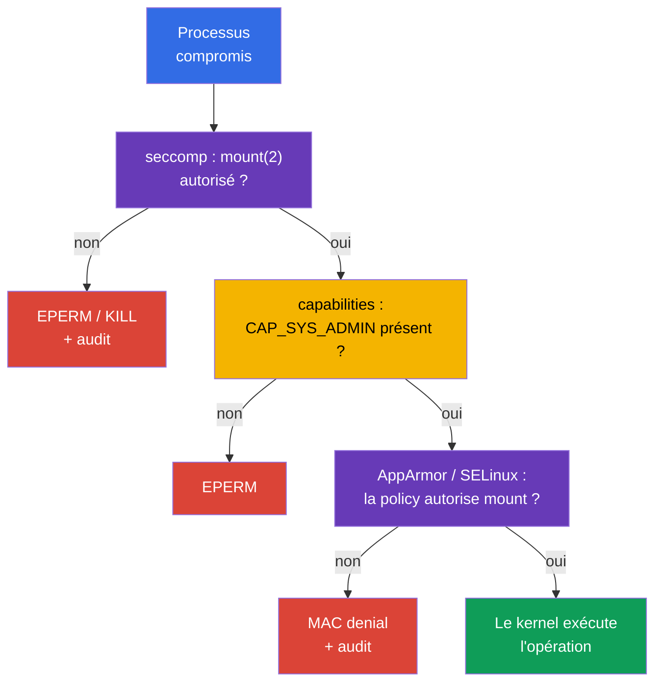

[Русская версия](ru.md) · [Eng version](README.md) · [Versión en español](es.md) · [Deutsche Version](de.md) · [ქართული ვერსია](ge.md) · [繁體中文版](tw.md) · [日本語版](jp.md)

# Chapitre 17. seccomp : un ensemble minimal d'appels système

> **Problème.** Un processus compromis dans un conteneur dispose de la même interface d'appels système vers le kernel qu'une application légitime, et peut employer les appels rarement nécessaires `mount`, `unshare`, `bpf` ou `clone` pour sortir de l'isolation ou développer un kernel exploit. Même sans capability supplémentaire, cette API du kernel élargit la surface d'attaque ; seccomp ne laisse au processus qu'un ensemble validé de syscalls.

> **La suite.** AppArmor, dans le [chapitre 16](../16/fr.md), a limité les chemins et objets du kernel avec lesquels un processus peut travailler. Nous ajoutons maintenant un filtre à un niveau encore plus bas : **seccomp** compare les appels système (syscalls) d'un processus aux règles d'un profile et choisit une action pour chacun, par exemple autoriser, retourner une erreur, terminer ou journaliser. Cela relève du domaine **System Hardening** du CKS (10 %). Dans la partie suivante du cours, ces mêmes restrictions feront partie d'un `SecurityContext` renforcé et des Pod Security Standards.

> **Prérequis CKA.** Les bases de `securityContext`, de l'exécution non-root, de `allowPrivilegeEscalation: false` et des Linux capabilities sont traitées dans le [chapitre 20 CKA](../../../cka/course/20/fr.md). Exercez-vous d'abord dans le [lab 106 CKA](../../../cka/labs/106/README_FR.MD) : seccomp ne remplace pas `capabilities.drop: ["ALL"]`, mais réduit l'API du kernel disponible au processus.

> 🧠 Seccomp filtre les syscalls et retourne allow, `ERRNO`, kill ou `LOG` ; capabilities, DAC et MAC sont vérifiés séparément.

## 17.1. Ce que protège seccomp

Une application n'appelle pas directement les fonctions du kernel. Une bibliothèque ou un runtime finit par effectuer un **system call** : `openat(2)` ouvre un fichier, `socket(2)` crée un socket, `clone(2)` crée un processus ou un thread, `mount(2)` monte un filesystem. Un processus compromis obtient la même interface vers le kernel. De nombreux syscalls ne sont pas nécessaires à un serveur web ou un worker ordinaire, mais sont utiles pour un container escape, changer de namespace, charger des programmes BPF ou monter un filesystem.

seccomp (secure computing mode) est un mécanisme du Linux kernel qui compare chaque syscall d'un processus à un filtre BPF et choisit une action : l'autoriser, retourner une erreur, terminer le processus, créer un audit event ou transmettre la décision à un userspace notifier. Kubernetes attribue un tel filtre aux processus du conteneur via `securityContext.seccompProfile`.

```mermaid
flowchart TB
    process["Processus du conteneur"] --> call["syscall : mount, clone, openat ..."]
    call --> filter["Filtre seccomp BPF"]
    filter -->|"ALLOW"| kernel["Le kernel exécute le syscall"]
    filter -->|"ERRNO / KILL"| blocked["EPERM, ENOSYS ou terminaison"]
    filter -->|"LOG"| audit["audit / journal du kernel"]
    style process fill:#326ce5,color:#fff
    style filter fill:#673ab7,color:#fff
    style kernel fill:#0f9d58,color:#fff
    style blocked fill:#db4437,color:#fff
    style audit fill:#f4b400,color:#000
```

Le filtre est attaché à un processus et hérité par les processus enfants. Il n'accorde aucune permission : si seccomp laisse passer un syscall, les vérifications ordinaires du kernel restent applicables. Par exemple, un `mount(2)` autorisé exige toujours une capability ainsi que les permissions appropriées de mount namespace/LSM. À l'inverse, `CAP_SYS_ADMIN` n'annule pas un refus seccomp. seccomp est donc la dernière barrière étroite devant l'API du kernel, et non un remplacement universel des autres controls.

| Mécanisme | Question à laquelle il répond | Exemple |
|---|---|---|
| UID/GID et DAC | l'identity peut-elle travailler avec l'objet ? | permissions de fichier `0640` |
| capabilities | une privilege spéciale du kernel est-elle présente ? | pas de `CAP_SYS_ADMIN` |
| seccomp | ce syscall précis est-il autorisé ? | `unshare(2)` retourne `EPERM` |
| AppArmor / SELinux | la MAC policy autorise-t-elle l'objet et l'opération ? | AppArmor interdit la lecture de `/etc/shadow` |
| RBAC | l'identity peut-elle appeler l'API Kubernetes ? | pas de `get secrets` |

seccomp ne limite pas le réseau par adresse ou port, ne vérifie pas Kubernetes RBAC et ne rend pas une image sûre. Les host namespaces, hostPath et des capabilities excessives augmentent fortement le risque. En particulier, `privileged: true` démarre toujours un conteneur avec seccomp `Unconfined` : Kubernetes n'applique pas de profile à un tel conteneur. Pour un workload ordinaire, la combinaison de base ressemble à ceci :

```yaml
securityContext:
  runAsNonRoot: true
  seccompProfile:
    type: RuntimeDefault
containers:
- name: app
  image: nginxinc/nginx-unprivileged:1.30.4-alpine-slim
  ports:
  - containerPort: 8080
  securityContext:
    allowPrivilegeEscalation: false
    capabilities:
      drop: ["ALL"]
```

## 17.2. Modes seccomp et actions du filtre

Le kernel prend en charge le mode legacy strict et le mode filtrant. Dans les conteneurs, on utilise presque toujours le filter mode : le runtime charge un programme BPF issu d'un profile OCI/Kubernetes avant le démarrage du processus. Le champ `/proc/<pid>/status` contient `Seccomp: 2` lorsque le filter mode est activé pour le processus ; `0` signifie l'absence de seccomp, `1` le legacy strict mode. La valeur `2` ne prouve pas à elle seule *quel* profile est chargé, mais elle est utile au diagnostic.

Dans un JSON profile, les actions sont définies par des valeurs libseccomp/OCI. Leur sens compte davantage que la mémorisation de chaque nom :

| Action | Résultat | Usage courant |
|---|---|---|
| `SCMP_ACT_ALLOW` | le syscall est exécuté | allow-list des appels nécessaires |
| `SCMP_ACT_ERRNO` | le syscall n'est pas exécuté, le processus reçoit errno | interdire de façon prévisible une action inutile |
| `SCMP_ACT_KILL_PROCESS` | le kernel termine l'ensemble du processus | fail-closed strict pour un syscall explicitement dangereux |
| `SCMP_ACT_KILL_THREAD` | le kernel termine le thread appelant | généralement évité : un processus multithread peut rester dans un état étrange |
| `SCMP_ACT_TRAP` | le processus reçoit `SIGSYS` | traitement spécialisé, pas un baseline habituel |
| `SCMP_ACT_LOG` | le syscall est autorisé, le kernel tente d'écrire un audit event | inventaire des appels avant enforce |
| `SCMP_ACT_NOTIFY` | la décision est transmise à un userspace supervisor | architecture spéciale ; ne remplace pas une policy ordinaire |

`SCMP_ACT_LOG` ne bloque pas le syscall. Il est utile pour un court controlled test, mais génère du bruit dans les logs et n'est pas une protection de production. `SCMP_ACT_ERRNO` sans errno précisé renvoie généralement `EPERM` ; une valeur précise peut être définie séparément. Ne choisissez pas `KILL` uniquement parce qu'il est « plus strict » : la mort soudaine du processus peut transformer un appel non essentiel en outage, et le diagnostic en crash loop complexe.

Deux orientations de policy se présentent différemment :

- **deny-list :** `defaultAction: SCMP_ACT_ALLOW`, des syscalls dangereux particuliers reçoivent `ERRNO` ou `KILL`. Cette approche est plus simple pour la compatibilité, mais les syscalls nouveaux ou oubliés restent accessibles.
- **allow-list :** `defaultAction: SCMP_ACT_ERRNO`, les groupes autorisés sont énumérés dans `syscalls`. C'est plus robuste et demande un contrat d'application mesuré et testé.

`RuntimeDefault` fournit habituellement un baseline sûr du runtime. Une allow-list custom n'a de sens qu'après l'observation et le test de l'application réelle, de ses probes, de son entrypoint, de DNS/TLS et de ses tâches périodiques. Ne la construisez jamais sur un seul `curl` réussi ou un seul `strace`.

> 🎯 Choisissez `RuntimeDefault` ou un `Localhost` vérifié et démontrez le seccomp effectif du bon conteneur ; un seul `EPERM` ne prouve pas un seccomp denial.

## 17.3. API Kubernetes : `RuntimeDefault`, `Localhost`, `Unconfined`

L'API Kubernetes actuelle définit seccomp dans `securityContext.seccompProfile`. Il peut être défini au niveau du Pod comme baseline pour tous les conteneurs, ou sur un container particulier qui nécessite une policy plus étroite. Le `securityContext` au niveau du container est prioritaire pour ce conteneur. Évitez les filtres différents sans nécessité : ils compliquent rollout, audit et la recherche de la cause d'un échec.

| `type` | Ce qui est attribué | Quand le choisir |
|---|---|---|
| `RuntimeDefault` | profile fourni par le container runtime | baseline normal pour un workload ordinaire |
| `Localhost` | JSON profile disponible localement sur la node | contrat de syscalls spécifique à l'application et vérifié |
| `Unconfined` | le filtre seccomp n'est pas appliqué | uniquement une exception de diagnostic temporaire avec propriétaire et échéance |

### `RuntimeDefault` : point de départ sûr

`RuntimeDefault` demande au runtime d'appliquer son profile standard. Son contenu exact dépend du runtime et de sa version ; il ne faut donc pas supposer qu'il s'agit du même JSON sur toutes les plateformes. Ne le remplacez pas par `Unconfined` si l'application n'a pas encore été étudiée : démontrez d'abord le conflit précis par les events, les logs et un test.

```yaml
apiVersion: v1
kind: Pod
metadata:
  name: runtime-default-seccomp
  namespace: demo
spec:
  securityContext:
    seccompProfile:
      type: RuntimeDefault
  containers:
  - name: app
    image: nginx:1.30.4
    securityContext:
      allowPrivilegeEscalation: false
      capabilities:
        drop: ["ALL"]
```

Vérifiez la specification enregistrée, l'état et le mode effectif du processus :

```bash
kubectl apply -f runtime-default-seccomp.yaml
kubectl wait -n demo --for=condition=Ready pod/runtime-default-seccomp --timeout=120s
kubectl get pod -n demo runtime-default-seccomp \
  -o jsonpath='{.spec.securityContext.seccompProfile.type}{"\n"}'
kubectl describe pod -n demo runtime-default-seccomp
kubectl exec -n demo runtime-default-seccomp -- grep '^Seccomp:' /proc/1/status
# Attendu : Seccomp: 2 ; cela confirme le filter mode, mais pas l'identité du profile.
```

Même si le default à l'échelle du cluster active déjà `RuntimeDefault`, le champ explicite reste utile : le manifest transporte l'intention avec le workload, une admission policy peut le vérifier, et la personne qui vérifie ne doit pas deviner la configuration de la node/runtime.

### `seccompDefault` : default de node pour un manifest sans champ

La fonctionnalité `seccompDefault` est stable depuis Kubernetes v1.27. Lorsqu'elle est activée, kubelet applique `RuntimeDefault` à un workload dont le seccomp profile n'est pas précisé. On l'active avec le flag kubelet `--seccomp-default` ou le champ de configuration kubelet :

```yaml
seccompDefault: true
```

Il s'agit d'un paramètre au niveau de la node ; un manifest sans `seccompProfile` peut donc effectivement recevoir `RuntimeDefault` sur une node où `seccompDefault` est activé ou `Unconfined` sur une node où il ne l'est pas. N'utilisez pas l'absence du champ comme security contract : pour un baseline portable, définissez explicitement `RuntimeDefault`. Un `Unconfined` explicite reste une exception et `privileged: true` produit toujours `Unconfined`, quel que soit le profile dans le manifest.

Vérifiez la configuration réelle sur la node **effective** du Pod, plutôt que de la déduire de la version du cluster. Les commandes ci-dessous ne lisent que la ligne de commande kubelet et un champ explicitement indiqué ; obtenez d'abord le nom de la node avec `kubectl get pod -o wide` et utilisez l'accès administratif autorisé à celle-ci :

```bash
# Sur la node effective du Pod. sudo ouvre /proc ; pipefail évite une erreur de lecture masquée.
set -o pipefail
KPID=$(pgrep -xo kubelet) || { echo 'ERROR: kubelet not found' >&2; exit 1; }
if ! sudo cat "/proc/$KPID/cmdline" | tr '\0' '\n' | \
  awk '$0 == "--config" { print; getline; print; next }
       $0 == "--config-dir" { print; getline; print; next }
       /^--(config|config-dir|seccomp-default)(=|$)/'; then
  echo 'REVIEW_REQUIRED: cannot read kubelet command line reliably' >&2
  exit 2
fi

# Les drop-ins --config-dir sont pris en charge par kubelet v1.36. Résolvez les chemins relatifs par rapport au
# répertoire de travail kubelet, lisez chaque .conf dans l'ordre de fusion kubelet, puis appliquez les flags CLI.
# Si les chemins, l'ordre ou la valeur fusionnée ne peuvent pas être déterminés exactement, signalez REVIEW_REQUIRED ; ne
# déduisez pas seccompDefault d'un seul config.yaml.
```

`--config`, les drop-ins `--config-dir` et `--seccomp-default` sont les sources de configuration de kubelet ; les CLI flags remplacent la configuration fusionnée des fichiers. Ne publiez pas l'intégralité de la configuration ni une ligne de commande `/proc` arbitraire dans un ticket. Comparez ensuite l'intended state au mode du processus. La priorité est la suivante : profile au niveau container, puis profile au niveau Pod, puis default de node en cas d'absence de profile ; `privileged` est l'exception et reste `Unconfined`.

```bash
NS=demo
POD=runtime-default-seccomp
CTR=app

kubectl get pod -n "$NS" "$POD" \
  -o jsonpath='{.spec.securityContext.seccompProfile}{"\n"}'
kubectl get pod -n "$NS" "$POD" \
  -o jsonpath='{.spec.containers[?(@.name=="app")].securityContext.seccompProfile}{"\n"}'
kubectl exec -n "$NS" "$POD" -c "$CTR" -- grep '^Seccomp:' /proc/1/status
```

`Seccomp: 2` confirme le filter mode, tandis que `Seccomp: 0` confirme l'absence de filtre. `/proc` ne révèle ni le nom du JSON ni le contenu précis de `RuntimeDefault` ; l'identité du profile effectif est démontrée par la combinaison de la precedence dans le manifest, de la configuration/flags kubelet effectifs, des records du runtime et du comportement attendu. Pour un privileged container, le Kubernetes profile ne peut pas devenir effectif, même si le champ est présent dans le YAML.

### `Localhost` : le path n'est pas absolu

`Localhost` sélectionne un JSON profile custom. Kubernetes ne transmet pas le JSON via le Pod et le scheduler ne le copie pas : kubelet lit le fichier **sur la node sélectionnée** dans le répertoire des seccomp profiles. Par défaut, il s'agit de `/var/lib/kubelet/seccomp` ; ainsi, le sous-répertoire `profiles` et le fichier `audit.json` se trouvent physiquement ici :

```text
/var/lib/kubelet/seccomp/profiles/audit.json
```

Dans le manifest, indiquez un chemin **relatif au seccomp root de kubelet**, sans `/` initial :

```yaml
securityContext:
  seccompProfile:
    type: Localhost
    localhostProfile: profiles/audit.json
```

`localhostProfile: /var/lib/kubelet/seccomp/profiles/audit.json` est incorrect : un chemin absolu n'est pas le contrat de l'API. Il est également incorrect de supposer `/var/lib/kubelet` si kubelet est lancé avec un autre `--root-dir` : dans ce cas, le root des profiles est `<root-dir>/seccomp`. Sur les managed nodes, renseignez-vous auprès du propriétaire de la plateforme sur la configuration kubelet réelle ; ne recherchez pas des fichiers au hasard sur une production node.

Exemple complet avec une node-local dependency :

```yaml
apiVersion: v1
kind: Pod
metadata:
  name: localhost-seccomp
  namespace: demo
spec:
  # Indiquez uniquement un label/pool de confiance auquel le profile a été livré par automation.
  nodeSelector:
    seccomp.example.com/profiles: "v1"
  securityContext:
    seccompProfile:
      type: Localhost
      localhostProfile: profiles/audit.json
  containers:
  - name: app
    image: busybox:1.36.1
    command: ["sh", "-c", "sleep 3600"]
    securityContext:
      allowPrivilegeEscalation: false
      capabilities:
        drop: ["ALL"]
```

N'attribuez pas un label user-controlled à une node uniquement pour ce manifest : label, profile et placement font partie de la configuration de node de confiance. Livrez soit un profile identique à tout le pool admissible, soit limitez le scheduling par un label/affinity protégé et vérifiez chaque pool avant le rollout.

### `privileged` est toujours `Unconfined`

Kubernetes exécute un conteneur avec `securityContext.privileged: true` comme seccomp `Unconfined` et ne lui applique ni `RuntimeDefault` ni `Localhost`. Par conséquent, un YAML avec `privileged: true` et `seccompProfile` ne signifie pas que deux couches sont actives : le seccomp profile ne deviendra pas effectif ici. N'essayez pas de « corriger » cela en remplaçant le profile ou en cherchant un JSON sur la node. Retirez `privileged` s'il n'est pas justifié, puis attribuez le profile minimal.

Un diagnostic sûr fixe d'abord le desired state conflictuel, puis examine le processus du bon conteneur :

```bash
NS=demo
POD=example
CTR=app

kubectl get pod -n "$NS" "$POD" \
  -o jsonpath='{.spec.containers[?(@.name=="app")].securityContext.privileged}{"\n"}'
kubectl get pod -n "$NS" "$POD" \
  -o jsonpath='{.spec.containers[?(@.name=="app")].securityContext.seccompProfile}{"\n"}'
kubectl exec -n "$NS" "$POD" -c "$CTR" -- grep '^Seccomp:' /proc/1/status
```

Pour un privileged container sans filtre installé par l'application elle-même, on attend `Seccomp: 0`. Le champ profile du manifest n'est utile que comme indice d'une intention erronée, et non comme preuve de son application. `Seccomp: 2` dans le processus prouve seulement le filter mode et exige une investigation distincte du processus/runtime ; il ne rend pas un Kubernetes profile effectif pour un privileged container.

### `Unconfined` et annotation obsolète

`Unconfined` désactive cette couche pour le conteneur. Son utilisation peut être acceptable comme exception courte, par exemple pour une controlled comparison sur une test node, mais non comme « solution » permanente à `Operation not permitted`. Consignez le owner, la date de retrait et la cause précise ; rétablissez ensuite le least privilege.

Les anciens manifests peuvent utiliser l'annotation `seccomp.security.alpha.kubernetes.io/pod` ou `container.seccomp.security.alpha.kubernetes.io/<container>`. Il s'agit d'une interface historique : depuis Kubernetes v1.25, ces annotations sont **non fonctionnelles** et n'attribuent aucun seccomp profile. Leur présence dans un cluster moderne est un signal pour un audit, et non une compatibilité opérationnelle ; remplacez-les par `securityContext.seccompProfile`. Ne mélangez pas l'annotation et le champ d'API, surtout avec des valeurs différentes. Après la migration, testez le nouveau Pod et vérifiez son mode effectif.

> 🎯 Construisez un JSON profile `Localhost` au format OCI seccomp, chargez-le sur la node requise et confirmez le mode effectif du conteneur.

## 17.4. JSON profile : structure et exemple sûr

Un profile `Localhost` est un JSON au format OCI seccomp. L'architecture, l'action par défaut et le tableau de règles y sont importants. Nommez les syscalls selon le Linux ABI, et non selon le nom d'une commande shell : `mount` désigne `mount(2)`, pas l'utilitaire `/bin/mount`.

Ci-dessous se trouve un petit **audit-profile pour une test node**. Il autorise tous les syscalls, mais oblige le kernel à journaliser les tentatives de `unshare`, `setns`, `mount` et `bpf`. Il ne protège pas le workload ; son but est d'illustrer le chemin `Localhost` et de recueillir un événement observé avant d'écrire un véritable restrict profile.

```json
{
  "defaultAction": "SCMP_ACT_ALLOW",
  "architectures": [
    "SCMP_ARCH_X86_64"
  ],
  "syscalls": [
    {
      "names": ["unshare", "setns", "mount", "bpf"],
      "action": "SCMP_ACT_LOG"
    }
  ]
}
```

> 🔬 `syscalls[].args`, `errnoRet` et le filtrage par arguments de syscall sont des détails étroits dépendants de la version et de l'architecture.

OCI seccomp peut comparer non seulement le nom du syscall, mais également ses arguments via `syscalls[].args` (`index`, `value`, `valueTwo` facultatif, `op`). Par exemple, la règle suivante renvoie `EPERM` uniquement pour `socket(2)` avec le domain `AF_PACKET` (17), sans interdire les autres socket domains :

```json
{
  "names": ["socket"],
  "action": "SCMP_ACT_ERRNO",
  "errnoRet": 1,
  "args": [{"index": 0, "value": 17, "op": "SCMP_CMP_EQ"}]
}
```

Les numéros d'arguments et les valeurs dépendent du syscall ABI ; un tel filtre doit donc être testé sur chaque architecture/runtime cible et ne doit pas être transféré entre plateformes sans vérification.

Pour ARM64, l'ensemble `architectures` doit correspondre à l'architecture de la node (par exemple `SCMP_ARCH_AARCH64`) ; ne copiez pas un JSON x86_64 vers une ARM node. Dans un heterogeneous cluster, le profile contient soit les ABI corrects pour chaque node pool pris en charge, soit le workload est explicitement limité à un pool compatible.

Le profile est déposé et vérifié par node automation, non par un Pod ordinaire. L'exemple ci-dessous est destiné à une test-node dédiée et illustre le default path kubelet :

```bash
# Sur la test-node, avec un accès administratif.
sudo install -d -m 0755 /var/lib/kubelet/seccomp/profiles
sudo install -m 0644 audit.json /var/lib/kubelet/seccomp/profiles/audit.json
sudo test -r /var/lib/kubelet/seccomp/profiles/audit.json
sudo jq empty /var/lib/kubelet/seccomp/profiles/audit.json
```

`jq empty` vérifie la syntaxe JSON, mais ne prouve pas la sémantique des syscall names ni la compatibilité du runtime. Avant un production rollout, ajoutez un test de démarrage du container sur chaque version de runtime cible, puis préparez le rollback comme publication d'une nouvelle version de profile validée, et non comme une modification manuelle d'une live node.

Ci-dessous, un exemple de enforce-profile avec deny-list. Il sert à démontrer un refus prévisible : par défaut les syscalls sont autorisés, mais quelques actions reçoivent `EPERM`. Ce fichier ne remplace pas `RuntimeDefault` et n'est pas, à lui seul, une production policy suffisante.

```json
{
  "defaultAction": "SCMP_ACT_ALLOW",
  "architectures": [
    "SCMP_ARCH_X86_64"
  ],
  "syscalls": [
    {
      "names": ["unshare", "setns", "mount"],
      "action": "SCMP_ACT_ERRNO",
      "errnoRet": 1
    },
    {
      "names": ["bpf", "keyctl", "perf_event_open"],
      "action": "SCMP_ACT_ERRNO",
      "errnoRet": 1
    }
  ]
}
```

`errnoRet: 1` signifie `EPERM`. Si un processus reçoit `Operation not permitted`, cela ne prouve pas automatiquement seccomp : capabilities, AppArmor, SELinux ou les permissions ordinaires peuvent retourner le même errno. Il faut simultanément le manifest, l'état du processus et le kernel audit/log.

## 17.5. Observation : syscall audit et kernel log

Une courte étape d'audit répond à la question « quels syscalls sont réellement nécessaires ? » et ne doit pas devenir un mode de production infini. Utilisez du representative traffic sur une test node, y compris le démarrage, les liveness/readiness probes, TLS/DNS, les worker jobs, le graceful shutdown et les error paths. Collectez les données pendant un temps limité et mettez-les en relation avec le PID/container et la version de l'image.

Pour l'audit profile de la section précédente, appliquez le Pod, puis effectuez une vérification sûre de l'appel. Dans un conteneur sans `CAP_SYS_ADMIN`, `unshare` échoue habituellement de toute façon ; pour l'audit, il suffit que le syscall soit attempted et que le kernel l'ait reçu.

```bash
kubectl apply -f localhost-seccomp.yaml
kubectl wait -n demo --for=condition=Ready pod/localhost-seccomp --timeout=120s
kubectl get pod -n demo localhost-seccomp -o wide
kubectl exec -n demo localhost-seccomp -- sh -c 'unshare -Ur true || true'
kubectl exec -n demo localhost-seccomp -- grep '^Seccomp:' /proc/1/status
```

Connectez-vous ensuite à la node indiquée par `kubectl get ... -o wide` et recherchez les seccomp records dans le kernel journal. Le format précis dépend du kernel, d'auditd et du logging pipeline ; le record contient généralement `type=SECCOMP`, `syscall=`, `pid=`, `comm=` et arch. N'attendez pas un texte identique et immuable sur toutes les distributions.

```bash
# Sur la node choisie, limitez la fenêtre temporelle et cherchez plusieurs variantes connues.
sudo journalctl -k --since '10 minutes ago' | \
  grep -Ei 'seccomp|type=SECCOMP|audit.*syscall' || true

# Si auditd est installé et autorisé par votre procédure d'exploitation :
sudo ausearch -m SECCOMP -ts recent 2>/dev/null || true
```

Pour corréler un record avec le conteneur, il faut la node, l'heure, le process name/PID et le runtime ID. Ne considérez pas l'intégralité du kernel journal comme le « log du Pod » : kubelet, le runtime et d'autres workload tournent sur une même node. Commencez par collecter le contexte Kubernetes :

```bash
NS=demo
POD=localhost-seccomp

kubectl get pod -n "$NS" "$POD" -o wide
kubectl get pod -n "$NS" "$POD" \
  -o jsonpath='{.spec.securityContext.seccompProfile}{"\n"}'
kubectl describe pod -n "$NS" "$POD"
```

Sur la node, l'administrateur peut obtenir le container ID et le host PID si les règles d'accès le permettent :

```bash
# Sur la node : sélectionnez exactement un sandbox Ready actuel, puis exactement un app container.
mapfile -t POD_IDS < <(
  sudo crictl pods --name '^localhost-seccomp$' --namespace '^demo$' --state ready -q
)
if [ "${#POD_IDS[@]}" -ne 1 ]; then
  printf 'REVIEW_REQUIRED: expected exactly one Ready pod sandbox, found %s\n' "${#POD_IDS[@]}" >&2
  exit 2
fi
POD_ID=${POD_IDS[0]}
mapfile -t CONTAINER_IDS < <(
  sudo crictl ps --pod "$POD_ID" --name '^app$' -q
)
if [ "${#CONTAINER_IDS[@]}" -ne 1 ]; then
  printf 'REVIEW_REQUIRED: expected exactly one running app container, found %s\n' "${#CONTAINER_IDS[@]}" >&2
  exit 2
fi
CONTAINER_ID=${CONTAINER_IDS[0]}
# .info est une donnée détaillée spécifique au runtime, pas un contrat portable de CRI PID.
HOST_PID=$(sudo crictl inspect "$CONTAINER_ID" | jq -r '.info.pid // empty')
if ! [[ "$HOST_PID" =~ ^[0-9]+$ ]]; then
  echo 'REVIEW_REQUIRED: runtime did not expose host PID as .info.pid; use its documented node-local inspection method' >&2
  exit 2
fi
sudo grep '^Seccomp:' "/proc/$HOST_PID/status"
```

`strace` est utile pour une investigation locale reproductible, mais il modifie lui-même le timing et crée une charge. Ne vous attachez pas longtemps à un production PID fortement chargé. Sur une test node, vous pouvez lancer un court trace d'un processus ou d'une commande et comparer les noms des syscalls au profile :

```bash
HOST_PID=replace-with-host-pid
sudo strace -f -p "$HOST_PID" -e trace=%process,%network,%file
# Arrêtez le trace après un court controlled test.
```

`strace` montre les appels du processus et `SCMP_ACT_LOG` fournit la kernel telemetry. Aucun des deux ne doit générer automatiquement une allow-list : conservez une policy minimale après un threat review, et non après l'ajout mécanique de tous les observed syscalls.

## 17.6. Vérification et debugging : du YAML au kernel

Pour seccomp, il existe deux groupes d'échecs distincts ; l'ordre de vérification fait gagner du temps.

1. **Le container n'est pas créé.** Avec `Localhost`, le fichier est introuvable, le chemin n'est pas relatif, le JSON/runtime n'est pas pris en charge ou le Pod est scheduled sur une node sans profile. Consultez les Pod events, la node et les kubelet/runtime logs.
2. **Le container s'exécute, mais le syscall est rejected.** Le filtre seccomp est appliqué ; l'application reçoit `EPERM`, `ENOSYS`, `SIGSYS` ou se termine. Consultez le mode effectif, l'application log et les kernel audit records.

### Ordre de vérification rapide

```bash
NS=demo
POD=localhost-seccomp
CTR=app

# 1. Desired state : les contexts au niveau Pod et container peuvent différer.
kubectl get pod -n "$NS" "$POD" -o jsonpath='{.spec.securityContext.seccompProfile}{"\n"}'
kubectl get pod -n "$NS" "$POD" \
  -o jsonpath='{.spec.containers[?(@.name=="app")].securityContext.seccompProfile}{"\n"}'

# 2. Lifecycle et node sélectionnée.
kubectl get pod -n "$NS" "$POD" -o wide
kubectl describe pod -n "$NS" "$POD"
kubectl get events -n "$NS" --field-selector involvedObject.name="$POD" \
  --sort-by=.lastTimestamp

# 3. État effectif du processus, si le container a démarré.
kubectl exec -n "$NS" "$POD" -c "$CTR" -- grep '^Seccomp:' /proc/1/status
```

Si `kubectl exec` est impossible, ne partez pas de l'hypothèse d'un syscall bloqué : lisez d'abord `describe` et les events. Pour `Localhost`, l'event signale souvent directement un profile absent ou une erreur de chargement. Vérifiez la valeur exacte de `localhostProfile` ; ce n'est pas un nom de fichier « quelque part sur la node », ni un path absolu.

Sur la node effective, diagnostiquez le chemin, les droits de lecture et kubelet, mais ne copiez pas de secrets ni le contenu d'un production profile dans un ticket sans nécessité :

```bash
# Sur la node sélectionnée. Remplacez root-dir par la command line/config kubelet effective.
KUBELET_ROOT=/var/lib/kubelet
sudo test -r "$KUBELET_ROOT/seccomp/profiles/audit.json"
sudo stat "$KUBELET_ROOT/seccomp/profiles/audit.json"
sudo journalctl -u kubelet --since '15 minutes ago'
sudo journalctl -k --since '15 minutes ago' | grep -Ei 'seccomp|SECCOMP|audit' || true
```

### Tableau des symptômes

| Symptôme | Cause probable | Preuve et correction sûre |
|---|---|---|
| `CreateContainerError` après `Localhost` | profile absent sur la node choisie ou chemin erroné | `describe`, node issue de `-o wide`, nom relatif exact et fichier sous le seccomp root kubelet |
| Pod scheduled au mauvais endroit | profile non livré à tout le pool | vérifier node label, automation delivery et placement ; ne pas affaiblir le profile |
| `Seccomp: 0` dans un conteneur en cours d'exécution | profile non attribué, `Unconfined` défini, container privileged ou node default désactivé | comparer `securityContext` Pod/container et `privileged`, puis les kubelet flags/config effectifs sur la node |
| `Seccomp: 2`, mais l'application retourne `EPERM` | seccomp denial, capability/MAC/DAC denial, ou tous à la fois, possibles | kernel audit, logs AppArmor/SELinux, capabilities et syscall précis |
| `SIGSYS` ou process killed | le profile utilise `TRAP`/`KILL` | vérifier JSON, exit code et runtime logs ; reproduire sur une test node |
| JSON est lu par `jq`, mais le container ne démarre pas | schema, ABI, runtime version ou seccomp support incompatibles | kubelet/runtime event et isolated compatibility test |
| rollout échoue seulement pour une partie des replicas | node pools distincts par profile/runtime/architecture | inventory de chaque pool, pin d'un pool compatible ou managed delivery uniforme |
| « correction » via `Unconfined`/`privileged` | la protection a été désactivée, la cause n'a pas été trouvée | restaurer le baseline, isoler le syscall précis et l'exception minimale justifiée |

`/proc/1/status` doit être lu dans le bon container. Dans un multi-container Pod, le PID 1 de chaque container a sa propre vue ; `kubectl exec` sans `-c` peut sélectionner le mauvais conteneur. `Seccomp: 2` prouve la présence du filter mode, tandis que la vérification de l'identité du profile reste une combinaison de Pod spec, records runtime/kubelet, node delivery et expected behavior.

### Vérifier le scénario négatif

Pour le JSON enforce de la section 17.4, créez un Pod de test distinct en attribuant `localhostProfile: profiles/restrict.json`. Ne modifiez pas un fichier sur une production node sous un rollout actif : préparez une nouvelle version, vérifiez-la, puis modifiez seulement la référence du workload.

```bash
kubectl exec -n demo localhost-seccomp -- sh -c 'mount -t tmpfs tmpfs /tmp/x'
# Attendu : mount: permission denied (ou un EPERM analogue).

kubectl exec -n demo localhost-seccomp -- grep '^Seccomp:' /proc/1/status
# Attendu : Seccomp: 2
```

Cette commande ne suffit pas pour l'attribution : mount peut être interdit par l'absence de capability. Pour une preuve pédagogique, consignez le profile, `Seccomp: 2`, stderr de la commande et le node audit/log correspondant. Dans une investigation réelle, isolez le test et n'ajoutez pas `CAP_SYS_ADMIN` uniquement pour contourner une restriction et en « vérifier » une autre.

> 🧠 Seccomp contrôle les syscalls, les capabilities - les privileges, AppArmor/SELinux - l'accès aux objets et aux opérations.

## 17.7. Relier seccomp, capabilities et AppArmor

Ces controls vérifient une même action à des couches différentes. Considérons la tentative d'un processus compromis d'appeler `mount(2)` :



L'ordre des kernel checks internes et l'errno précis dépendent du syscall et de la version du kernel, mais le modèle defence-in-depth demeure : le passage réussi à travers une couche n'annule pas une autre. Il en résulte les règles pratiques suivantes.

- **Les capabilities réduisent les autorisations.** `drop: ["ALL"]` retire les kernel privileges inutiles. Si l'application a réellement besoin d'un privileged port, ne rétablissez que `NET_BIND_SERVICE`, et non `SYS_ADMIN`.
- **seccomp réduit la surface de l'API.** Il peut interdire un syscall indépendamment de l'importance des privileges du processus. `RuntimeDefault` est le baseline standard ; `Localhost` exige un contrat mesuré et une node delivery.
- **AppArmor/SELinux limitent les objets et opérations.** La path-based policy AppArmor du [chapitre 16](../16/fr.md) peut interdire un chemin précis même après un syscall autorisé. SELinux résout une tâche comparable par labels/type enforcement sur les OS correspondants.
- **`allowPrivilegeEscalation: false` relie le modèle.** Sous Linux, cela interdit gaining new privileges et empêche un processus d'obtenir plus de droits par setuid/file capabilities ; ce n'est pas un substitut à seccomp, mais une frontière supplémentaire utile.

N'essayez pas de démontrer seccomp par l'absence d'une capability : cela ne prouve qu'une des barrières indépendantes. Et n'ajoutez pas une capability pour tester seccomp sur un production workload. Réalisez une expérience étroite dans un namespace/node distinct et supprimez les ressources à son issue.

> 🏭 Un profile `Localhost` est un versioned artifact avec owner, tests runtime/ABI, delivery, canary et rollback.

## 17.8. Exploitation : le profile comme code, pas comme fichier sur une node

Un profile `Localhost` fait partie du platform contract. Le scheduler ne lit pas le contenu de `/var/lib/kubelet/seccomp` et ne transporte pas le JSON vers une node. Une exploitation fiable exige un lifecycle complet et géré.

1. **Définissez la menace et le propriétaire.** Indiquez quel syscall réduit le risque et quel workload/version est couvert par le profile. « Nous interdirons tout au cas où » n'est pas une spécification.
2. **Observez de manière contrôlée.** Sur une test node, utilisez un audit/profile tracing bref pour le representative workload, y compris le démarrage et les failure paths. Conservez image digest, node OS, kernel et runtime version.
3. **Créez un JSON minimal et vérifiez la compatibilité.** Validez le JSON, l'ABI et le démarrage sur chaque architecture/runtime pris en charge. Une nouvelle image ou dependency peut modifier l'ensemble des syscalls.
4. **Livrez le profile comme versioned artifact.** Node image, cloud-init ou configuration management doivent installer le fichier avant le scheduling du workload. Ne donnez pas à un Pod non privilégié le droit d'écrire dans le répertoire kubelet.
5. **Liez delivery et placement.** Un profile identique sur le pool est plus simple et plus sûr ; sinon, utilisez un node label/affinity de confiance et vérifiez l'inventory.
6. **Faites le roll out progressivement.** Commencez par un canary, vérifiez Ready, l'application SLO et les `SECCOMP`/runtime events. Le rollback doit avoir un owner et un manifest vérifié.
7. **Observez les deny, ne désactivez pas la protection.** L'alert relie le node audit au workload. La correction est une modification étroite et justifiée du profile ou de l'application, et non un `Unconfined` sans échéance.

Pour un workload ordinaire en production, la combinaison `RuntimeDefault`, non-root, `allowPrivilegeEscalation: false`, drop capabilities et MAC policy suffit souvent. Un profile custom est justifié là où le risque et le contrat sont bien connus ; la complexité du profile est elle aussi un operational risk.

Lorsqu'il faut distribuer et enregistrer à l'échelle du cluster des profiles seccomp/AppArmor/SELinux custom, envisagez **Security Profiles Operator (SPO)** comme approche de production : il gère le lifecycle et le recording workflow des profiles au lieu de copier manuellement du JSON dans le répertoire kubelet de chaque node. Cela ne supprime ni les tests, ni le versioning, ni le contrôle du placement, mais rend la delivery du profile gérée par la plateforme.

Les Pod Security Standards au niveau `restricted` exigent seccomp `RuntimeDefault` ou `Localhost` ; `Unconfined` ne satisfait pas ce baseline. Une admission policy est utile pour éviter qu'un workload sans seccomp apparaisse à cause d'un oubli dans un chart. Mais l'admission ne vérifie pas la présence du JSON custom sur la node : cela reste la responsabilité du node lifecycle et du rollout.

## 17.9. Mini-glossaire

- **syscall** - appel système par lequel un processus demande une opération au kernel.
- **seccomp** - mécanisme Linux de filtrage des syscalls d'un processus.
- **BPF filter** - programme de filtre exécuté par le kernel pour un syscall en filter mode.
- **`RuntimeDefault`** - seccomp profile fourni par le container runtime sélectionné.
- **`Localhost`** - Kubernetes type pour un JSON profile disponible localement sur une node.
- **`localhostProfile`** - chemin du JSON profile relatif au seccomp root kubelet.
- **`Unconfined`** - absence de filtre seccomp pour le container ; exception temporaire, pas un baseline.
- **allow-list** - policy où l'action par défaut interdit et les syscalls permis sont explicitement énumérés.
- **deny-list** - policy où l'action par défaut autorise et des syscalls particuliers sont interdits.
- **`SCMP_ACT_LOG`** - action qui autorise le syscall et demande au kernel de le journaliser.
- **`SCMP_ACT_ERRNO`** - action qui retourne une erreur au syscall sans l'exécuter.
- **`SECCOMP` audit record** - enregistrement kernel/audit d'un événement lié à seccomp.

## 17.10. Bilan du chapitre

- seccomp filtre les syscalls à la frontière entre le processus et le kernel ; il complète, sans les remplacer, capabilities, AppArmor/SELinux, DAC, RBAC et SecurityContext.
- Pour un workload ordinaire, définissez explicitement `seccompProfile.type: RuntimeDefault` avec non-root, `allowPrivilegeEscalation: false` et des capabilities minimales. `seccompDefault` est stable depuis v1.27, mais le default de node ne remplace pas l'intention explicite dans le manifest.
- Un profile `Localhost` est un JSON sur une node. `localhostProfile` est toujours relatif au seccomp root kubelet : pour le root par défaut, le fichier `/var/lib/kubelet/seccomp/profiles/audit.json` est défini comme `profiles/audit.json`.
- Un profile custom nécessite versioning, architecture/runtime testing, managed delivery sur toutes les nodes admissibles et un scheduling associé. Le scheduler ne livre pas lui-même le JSON.
- `SCMP_ACT_LOG` apporte une observation temporaire, mais pas de protection ; `ERRNO`/`KILL` bloquent avec des conséquences différentes pour disponibilité et diagnostic.
- La vérification inclut le context Pod/container voulu, `privileged`, node et events, les kubelet flags/config effectifs, `Seccomp: 2` dans le bon container, le résultat de l'application et le kernel audit/log corrélé. Un seul `EPERM` ne suffit pas pour l'attribution.

## 17.11. Utilité pour l'examen et le travail réel

**À l'examen.** Distinguez rapidement `RuntimeDefault` de `Localhost`, souvenez-vous du chemin relatif `localhostProfile`, de `seccompDefault` kubelet et de la règle : `privileged` est toujours `Unconfined`. Vérifiez le résultat avec `kubectl describe`, `-o jsonpath`, la node sélectionnée et `/proc/1/status`. En cas de `CreateContainerError`, lisez d'abord l'event et vérifiez le node-local profile ; en cas de `EPERM`, ne déclarez pas seccomp responsable avant d'avoir vérifié capabilities et les logs AppArmor/SELinux.

**Dans le travail réel.** Runtime default fournit un baseline portable, et seccomp custom est un contrat entre l'application, le runtime et la node platform. Seul un workflow complet fournit un résultat utile : measured syscalls, threat review, versioned JSON, canary, audit correlation et rollback rapide. Un « fichier sur une node » et un `Unconfined` permanent ne constituent pas du hardening.

## 17.12. Questions d'auto-évaluation

<details>
<summary>1. En quoi seccomp diffère-t-il des Linux capabilities et pourquoi un control ne remplace-t-il pas l'autre ?</summary>

Les capabilities déterminent si un processus dispose d'une privilege spéciale du kernel, par exemple `CAP_SYS_ADMIN` ; seccomp décide si un syscall précis est autorisé. Un appel autorisé par seccomp passe encore les vérifications ordinaires de capabilities, namespace et LSM, et une capability n'annule pas un seccomp-denial. C'est pourquoi le baseline de ce chapitre associe `drop: ["ALL"]` à `RuntimeDefault`.
</details>

<details>
<summary>2. Pourquoi `RuntimeDefault` est-il préférable à `Unconfined` pour un workload ordinaire ?</summary>

`RuntimeDefault` demande au runtime d'appliquer son seccomp-profile normal et crée un baseline portable pour un workload ordinaire. `Unconfined` désactive cette couche et n'est acceptable que comme exception de diagnostic courte, avec owner et échéance. Le champ explicite du manifest fixe aussi l'intention sans dépendre du node default.
</details>

<details>
<summary>3. Quel chemin écrit-on dans `localhostProfile` si le fichier se trouve dans `/var/lib/kubelet/seccomp/profiles/audit.json` ?</summary>

Il faut indiquer `profiles/audit.json`. La valeur est toujours relative au seccomp root kubelet et non un chemin absolu du filesystem de la node. Avec un autre `--root-dir`, le root physique des profiles change, mais la règle relative de l'API demeure.
</details>

<details>
<summary>4. Pourquoi un path absolu dans `localhostProfile` et un profile présent sur une seule node causent-ils des problèmes pendant un rollout ?</summary>

Un chemin absolu ne respecte pas le contrat de l'API Kubernetes : kubelet attend un chemin relatif à son seccomp root. Le scheduler ne transporte pas le JSON profile entre les nodes ; un Pod scheduled sur une node sans fichier reçoit donc une erreur de création du container. Profile, delivery et placement doivent former une configuration de confiance cohérente du node pool.
</details>

<details>
<summary>5. Que fait `SCMP_ACT_LOG` et pourquoi n'est-ce pas un mode enforce ?</summary>

`SCMP_ACT_LOG` autorise le syscall et demande au kernel de créer un audit event ; il sert à une observation courte et contrôlée. Il ne bloque pas l'appel, peut créer beaucoup de bruit dans les logs et n'est pas une protection de production. Pour enforce, on utilise par exemple `SCMP_ACT_ERRNO` ou un `KILL` choisi consciemment.
</details>

<details>
<summary>6. Quelles données sont nécessaires pour distinguer un seccomp denial de l'absence d'une capability ou d'un AppArmor denial ?</summary>

Il faut le Pod/container security context déclaré, le `Seccomp` effectif du bon conteneur, le syscall précis et le kernel audit/log. `EPERM` seul est insuffisant : capabilities, AppArmor, SELinux ou des permissions ordinaires peuvent le retourner. Le chapitre recommande aussi de corréler node, PID/container ID, heure et records `SECCOMP`.
</details>

<details>
<summary>7. Que prouve `Seccomp: 2` dans `/proc/1/status`, et que ne prouve-t-il pas ?</summary>

`Seccomp: 2` prouve que le filter mode est activé pour le processus vérifié ; `0` signifie l'absence de filtre et `1` le legacy strict mode. Ce chiffre ne révèle ni le nom du JSON, ni son contenu, ni l'identité du profile effectif. Pour cela, on relie la precedence du manifest, la configuration kubelet/runtime, la delivery du profile et le comportement attendu.
</details>

<details>
<summary>8. Pourquoi une allow-list profile ne doit-elle pas être construite sur une seule exécution de l'application ?</summary>

Un seul `curl` réussi ne couvre ni démarrage, ni probes, ni DNS/TLS, ni tâches périodiques, ni graceful shutdown, ni error paths. Une allow-list exige un contrat mesuré et testé de l'application réelle sur les runtime et architectures cibles. L'observation et `strace` aident à recueillir des données, mais les observed syscalls ne doivent pas être mécaniquement transformés en policy sans threat review.
</details>

<details>
<summary>9. **Flashback (chapitre 20).** Imaginez une `ValidatingAdmissionPolicy` du chapitre 20 qui exige `seccompProfile.type` dans le manifest. Pourquoi le passage de cette policy à l'admission ne garantit-il toujours pas une protection réelle des syscalls - que doit précisément correspondre au niveau de la node/kubelet à l'exigence de la policy pour que le filtre seccomp fonctionne effectivement ?</summary>

L'admission-policy ne vérifie que le YAML avant l'enregistrement de l'objet et ne confirme pas que la node pourra appliquer le profile. Sur la node effective, la prise en charge de seccomp par runtime/kubelet, le `securityContext` effectif tenant compte du container override et, pour `Localhost`, l'existence d'un JSON compatible sous le seccomp root kubelet doivent correspondre. Le container ne doit pas non plus être `privileged`, car Kubernetes l'exécute `Unconfined` ; le résultat est vérifié par les événements et `Seccomp: 2` dans le bon processus.
</details>

> 🏭 `RuntimeDefault` dans template/admission ; `Localhost` custom - versioned profile avec pool compatible, observation et rollback.

## 17.13. Application en production

Pour les stateless workload ordinaires, la platform team fixe `seccompProfile.type: RuntimeDefault` dans un chart ou un manifest de base et interdit `Unconfined` par admission policy. La protection ne dépend ainsi pas du fait que le propriétaire de chaque service pense à ajouter le champ, tandis que le manifest documente explicitement le baseline attendu. Avec non-root, `allowPrivilegeEscalation: false`, drop capabilities et AppArmor/SELinux, cela limite les conséquences de l'exploitation d'une vulnérabilité de l'application.

Un profile `Localhost` custom ne s'applique qu'aux workload ayant un syscall-contract clair, par exemple un batch worker isolé ou un service sensible. Le profile est stocké dans le repository comme versioned artifact, vérifié sur chaque architecture et version de runtime, et l'automation le livre à tout node pool admissible avant le rollout. Le manifest référence la version du profile par `localhostProfile` relatif, et le scheduling est limité à un pool de confiance où ce fichier est garanti.

La modification passe par une test node avec representative traffic, un canary et l'observation du démarrage, des probes, de l'error rate et des `SECCOMP`/runtime events. En cas d'échec, l'équipe corrèle d'abord Pod spec, node, `Seccomp: 2`, syscall et kernel audit record, puis effectue un changement étroit et justifié du profile ou de l'application. Il ne faut pas basculer durablement le service vers `Unconfined`, ajouter `CAP_SYS_ADMIN` ni modifier le JSON sur une node en cours d'exécution : cela masque la cause, crée des différences entre replicas et affaiblit la protection.

## Pratique

Effectuez d'abord le [lab 106 CKA](../../../cka/labs/106/README_FR.MD) : il renforce `SecurityContext`, non-root et capabilities, nécessaires à l'interprétation correcte des échecs seccomp. Ensuite, sur une test-node dédiée, créez `profiles/audit.json`, appliquez un Pod avec `Localhost`, trouvez le `SECCOMP`/kernel record et remplacez l'audit profile par un enforce profile étroit et vérifié. Avant cela, reprenez le [chapitre 16](../16/fr.md) : AppArmor limite les objets et opérations, seccomp l'ensemble même des syscalls.

## Liens

- [Kubernetes : Restrict a Container's Syscalls with seccomp](https://kubernetes.io/docs/tutorials/security/seccomp/)
- [Kubernetes : Linux kernel security constraints](https://kubernetes.io/docs/concepts/security/linux-kernel-security-constraints/)
- [API Kubernetes : SeccompProfile](https://kubernetes.io/docs/reference/kubernetes-api/workload-resources/pod-v1/#SeccompProfile)
- [Kubernetes : Pod Security Standards](https://kubernetes.io/docs/concepts/security/pod-security-standards/)
- [Linux kernel : Seccomp BPF (SECure COMPuting with filters)](https://docs.kernel.org/userspace-api/seccomp_filter.html)

## Point de contrôle mixte : System Hardening terminé

Avant de passer à Minimize Microservice Vulnerabilities, vérifiez pendant 15-20 minutes, sans aide, que le domaine System Hardening (chapitres 14-17) est acquis :

1. Trouvez sur une test node un port ou service superflu en écoute et expliquez comment décider s'il peut être désactivé (chapitre 14).
2. Nommez deux niveaux de least privilege - l'utilisateur Linux sur l'hôte et l'API Kubernetes - et donnez un exemple concret pour chacun (chapitre 15).
3. Basculez le AppArmor profile d'un Pod de `enforce` à `complain` et expliquez pourquoi `complain` ne peut pas être présenté comme une preuve de protection à l'examen (chapitre 16).
4. **Exercice mixte.** Prenez RBAC (chapitre 10, domaine Cluster Hardening) et AppArmor/seccomp (chapitres 16-17, ce domaine) : un utilisateur a RBAC `create pods`, et l'admission ne limite pas `securityContext`. Pourquoi RBAC ne contrôle-t-il pas lui-même les Linux syscalls ? L'utilisateur peut-il demander `Unconfined`/`privileged` et contourner les seccomp/AppArmor disponibles ? Quelle admission enforcement (PSA `restricted`, ValidatingAdmissionPolicy, Gatekeeper, Kyverno ou platform equivalent) faut-il pour que le hardening ne puisse pas être désactivé dans un manifest ?
5. Définissez `seccompProfile.type: RuntimeDefault` pour un Pod de test et expliquez en quoi cela diffère de `Unconfined` en termes de allow-list/deny-list (chapitre 17).

Si l'exercice 4 a posé des difficultés, revenez aux chapitres 10 et 16-17 ensemble.

---
[Table des matières](../README_FR.md) · [Chapitre 16](../16/fr.md)
