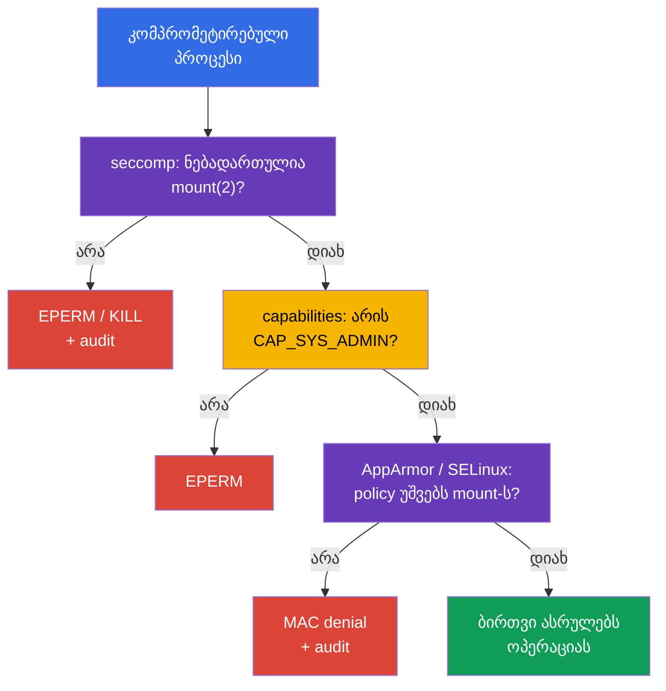

[Русская версия](ru.md) · [Eng version](README.md) · [Versión en español](es.md) · [Version française](fr.md) · [Deutsche Version](de.md) · [繁體中文版](tw.md) · [日本語版](jp.md)

# თავი 17. seccomp: სისტემური გამოძახებების მინიმალური ნაკრები

> **პრობლემა.** კონტეინერში კომპრომეტირებული პროცესი იღებს ბირთვისკენ სისტემური
> გამოძახებების იმავე ინტერფეისს, რაც ლეგიტიმური აპლიკაცია, და შეუძლია იშვიათად საჭირო
> `mount`, `unshare`, `bpf` ან `clone` გამოიყენოს იზოლაციიდან გასასვლელად ან kernel
> exploit-ის განვითარებისთვის. ზედმეტი capability-ის გარეშეც ასეთი ბირთვის API აფართოებს
> შეტევის ზედაპირს; seccomp წინასწარ პროცესს უტოვებს მხოლოდ შემოწმებულ syscalls-ის ნაკრებს.

> **რა არის შემდეგ.** AppArmor-მა [მე-16 თავიდან](../16/ge.md) შემოსაზღვრა, რომელ
> გზებთან და ბირთვის ობიექტებთან შეუძლია პროცესს მუშაობა. ახლა დავამატოთ ფილტრი კიდევ
> უფრო დაბალ დონეზე: **seccomp** ადარებს პროცესის სისტემურ გამოძახებებს (syscalls)
> profile-ის წესებს და თითოეულისთვის ირჩევს მოქმედებას, მაგალითად ნებართვას, შეცდომას,
> დასრულებას ან ჟურნალირებას. ეს არის CKS-ის დომენი **System Hardening** (10%). კურსის
> შემდეგ ნაწილში ეს იგივე შეზღუდვები გახდება გამაგრებული `SecurityContext`-ისა და Pod
> Security Standards-ის ნაწილი.

> **რა გჭირდებათ CKA-დან.** საბაზისო `securityContext`, non-root გაშვება,
> `allowPrivilegeEscalation: false` და Linux capabilities განხილულია
> [CKA-ს 20-ე თავში](../../../cka/course/20/ge.md). ჯერ ისინი დაამუშავეთ
> [CKA-ს 106-ე ლაბაში](../../../cka/labs/106/README_GE.MD): seccomp არ ანაცვლებს
> `capabilities.drop: ["ALL"]`-ს, არამედ ამცირებს პროცესისთვის ხელმისაწვდომ ბირთვის API-ს.

> 🧠 Seccomp ფილტრავს syscalls-ს და აბრუნებს allow, `ERRNO`, kill ან `LOG`-ს; capabilities, DAC და MAC ცალკე მოწმდება.

## 17.1. რას იცავს seccomp

აპლიკაცია ბირთვის ფუნქციებს პირდაპირ არ იძახებს. ბიბლიოთეკა ან runtime საბოლოოდ
აკეთებს **system call**-ს: `openat(2)` ხსნის ფაილს, `socket(2)` ქმნის socket-ს,
`clone(2)` ქმნის პროცესს ან thread-ს, `mount(2)` ამონტაჟებს ფაილურ სისტემას.
კომპრომეტირებულ პროცესს ჩნდება ბირთვისკენ იგივე ინტერფეისი. ჩვეულებრივი
web-სერვერისთვის ან worker-ისთვის ბევრი syscalls საჭირო არ არის, მაგრამ სასარგებლოა
container escape-სთვის, namespace-ის შეცვლისთვის, BPF-პროგრამების ჩატვირთვისთვის ან
mount-ისთვის.

seccomp (secure computing mode) - Linux kernel-ის მექანიზმია, რომელიც პროცესის
თითოეულ syscall-ს ადარებს BPF-ფილტრს და ირჩევს მოქმედებას: დაუშვას, დააბრუნოს
შეცდომა, დაასრულოს პროცესი, შექმნას audit event ან გადასცეს გადაწყვეტილება
userspace-notifier-ს. Kubernetes ასეთ ფილტრს კონტეინერის პროცესებს ანიჭებს
`securityContext.seccompProfile`-ის მეშვეობით.

```mermaid
flowchart TB
    process["კონტეინერის პროცესი"] --> call["syscall: mount, clone, openat ..."]
    call --> filter["seccomp BPF filter"]
    filter -->|"ALLOW"| kernel["ბირთვი ასრულებს syscall-ს"]
    filter -->|"ERRNO / KILL"| blocked["EPERM, ENOSYS ან დასრულება"]
    filter -->|"LOG"| audit["kernel audit / journal"]
    style process fill:#326ce5,color:#fff
    style filter fill:#673ab7,color:#fff
    style kernel fill:#0f9d58,color:#fff
    style blocked fill:#db4437,color:#fff
    style audit fill:#f4b400,color:#000
```

ფილტრი მიბმულია პროცესთან და გადადის შვილობილ პროცესებზე. ის ნებართვებს არ იძლევა:
თუ syscall გატარებულია seccomp-ის მიერ, ჩვეულებრივი kernel-შემოწმებები მაინც
რჩება ძალაში. მაგალითად, ნებადართულ `mount(2)`-საც კვლავ დასჭირდება capability და
საჭირო mount namespace/LSM-უფლებები. და პირიქით, `CAP_SYS_ADMIN` არ აუქმებს
seccomp-denial-ს. ამიტომ seccomp - ბირთვის API-ის წინა ბოლო ვიწრო ბარიერია და არა
დანარჩენი controls-ის უნივერსალური ჩანაცვლება.

| მექანიზმი | კითხვა, რომელზეც პასუხობს | მაგალითი |
|---|---|---|
| UID/GID და DAC | შეუძლია თუ არა identity-ს ობიექტთან მუშაობა? | ფაილის უფლებები `0640` |
| capabilities | არსებობს თუ არა ბირთვის სპეციალური პრივილეგია? | არ არის `CAP_SYS_ADMIN` |
| seccomp | ნებადართულია თუ არა კონკრეტული syscall? | `unshare(2)` აბრუნებს `EPERM`-ს |
| AppArmor / SELinux | უშვებს თუ არა MAC policy ობიექტსა და ოპერაციას? | AppArmor კრძალავს `/etc/shadow`-ის წაკითხვას |
| RBAC | შეუძლია თუ არა identity-ს Kubernetes API-ის გამოძახება? | არ არის `get secrets` |

seccomp არ ზღუდავს ქსელს მისამართებისა და პორტების დონეზე, არ ამოწმებს Kubernetes
RBAC-ს და image-ს უსაფრთხოს არ ხდის. host namespaces, hostPath და ჭარბი capabilities
რისკს გაცილებით მაღლა სწევს. ცალკე, `privileged: true` კონტეინერს ყოველთვის უშვებს
seccomp `Unconfined`-ით: Kubernetes profile ასეთ კონტეინერზე არ გამოიყენება.
ჩვეულებრივი workload-ისთვის საბაზისო კავშირი ასე გამოიყურება:

```yaml
securityContext:
  runAsNonRoot: true
  seccompProfile:
    type: RuntimeDefault
containers:
- name: app
  image: nginxinc/nginx-unprivileged:1.30.4-alpine-slim
  ports:
  - containerPort: 8080
  securityContext:
    allowPrivilegeEscalation: false
    capabilities:
      drop: ["ALL"]
```

## 17.2. seccomp-ის რეჟიმები და ფილტრის მოქმედებები

Kernel უჭერს მხარს მკაცრ legacy-რეჟიმსა და ფილტრის რეჟიმს. კონტეინერებში თითქმის
ყოველთვის გამოიყენება filter mode: runtime პროცესის გაშვებამდე ტვირთავს
BPF-პროგრამას OCI/Kubernetes profile-იდან. ველი `/proc/<pid>/status` შეიცავს
`Seccomp: 2`-ს, როცა პროცესისთვის ჩართულია filter mode; `0` ნიშნავს seccomp-ის
არარსებობას, `1` - legacy strict mode-ს. თავად მნიშვნელობა `2` არ ამტკიცებს, *რომელი*
profile-ია ჩატვირთული, მაგრამ დიაგნოსტიკისას სასარგებლოა.

JSON-profile-ში მოქმედებები მითითებულია libseccomp/OCI-ის მნიშვნელობებით. მათი
მნიშვნელობა უფრო მნიშვნელოვანია, ვიდრე ყოველი სახელის დამახსოვრება:

| მოქმედება | შედეგი | ტიპური გამოყენება |
|---|---|---|
| `SCMP_ACT_ALLOW` | syscall სრულდება | საჭირო გამოძახებების allow-list |
| `SCMP_ACT_ERRNO` | syscall არ სრულდება, პროცესი იღებს errno-ს | ზედმეტი მოქმედების პროგნოზირებადად აკრძალვა |
| `SCMP_ACT_KILL_PROCESS` | kernel ასრულებს მთელ პროცესს | მკაცრი fail-closed აშკარად საშიში syscall-ისთვის |
| `SCMP_ACT_KILL_THREAD` | kernel ასრულებს გამომძახებელ thread-ს | ჩვეულებრივ ერიდებიან: multithread-პროცესს შეუძლია უცნაურ მდგომარეობაში დარჩეს |
| `SCMP_ACT_TRAP` | პროცესი იღებს `SIGSYS`-ს | სპეციალიზებული დამუშავება, არა ჩვეულებრივი baseline |
| `SCMP_ACT_LOG` | syscall ნებადართულია, kernel ცდილობს audit event-ის ჩაწერას | ინვენტარიზაცია enforce-მდე |
| `SCMP_ACT_NOTIFY` | გადაწყვეტილება გადაეცემა userspace supervisor-ს | სპეციალური არქიტექტურა; არ არის ჩვეულებრივი policy-ის ჩანაცვლება |

`SCMP_ACT_LOG` არ ბლოკავს syscall-ს. ის სასარგებლოა მოკლე controlled test-ისთვის,
მაგრამ ხმაურს ქმნის ლოგებში და არ არის production-დაცვა. `SCMP_ACT_ERRNO` მითითებული
errno-ის გარეშე ჩვეულებრივ იძლევა `EPERM`-ს; კონკრეტული მნიშვნელობა ცალკე
შეიძლება მითითდეს. ნუ აირჩევთ `KILL`-ს მხოლოდ იმიტომ, რომ ის „უფრო მკაცრია“: პროცესის
მოულოდნელმა სიკვდილმა შეიძლება არასაჭირო გამოძახება outage-ად აქციოს, ხოლო
დიაგნოსტიკა - რთულ crash loop-ად.

Policy-ის ორი მიმართულება სხვადასხვანაირად გამოიყურება:

- **deny-list:** `defaultAction: SCMP_ACT_ALLOW`, ცალკეული საშიში syscalls იღებენ
  `ERRNO`-ს ან `KILL`-ს. ეს უფრო მარტივია თავსებადობისთვის, მაგრამ ახალი ან
  დავიწყებული syscalls ხელმისაწვდომი რჩება.
- **allow-list:** `defaultAction: SCMP_ACT_ERRNO`, `syscalls`-ში ჩამოთვლილია
  ნებადართული ჯგუფები. ეს უფრო ძლიერია და მოითხოვს აპლიკაციის გაზომილ, ტესტირებულ
  კონტრაქტს.

`RuntimeDefault` ჩვეულებრივ იძლევა უსაფრთხო runtime-baseline-ს. Custom allow-list
აზრს იძენს მხოლოდ რეალური აპლიკაციის, მისი probes-ის, entrypoint-ის, DNS/TLS-ისა და
პერიოდული ამოცანების დაკვირვებისა და ტესტის შემდეგ. არასდროს ააგოთ ის ერთი
წარმატებული `curl`-ის ან ერთი `strace`-ის მიხედვით.

> 🎯 აირჩიეთ `RuntimeDefault` ან შემოწმებული `Localhost` და დაამტკიცეთ საჭირო კონტეინერის effective seccomp; ერთი `EPERM` seccomp-denial-ს არ ამტკიცებს.

## 17.3. Kubernetes API: `RuntimeDefault`, `Localhost`, `Unconfined`

აქტუალური Kubernetes API seccomp-ს `securityContext.seccompProfile`-ში აყენებს.
შეგიძლიათ ის დააყენოთ Pod-ზე, როგორც baseline ყველა კონტეინერისთვის, ან კონკრეტულ
container-ზე, როცა მას უფრო ვიწრო policy სჭირდება. Container-level `securityContext`-ს
ამ კონტეინერისთვის უპირატესობა აქვს. ერიდეთ საჭიროების გარეშე სხვადასხვა ფილტრებს:
ისინი ართულებენ rollout-ს, audit-ს და უარის მიზეზის ძებნას.

| `type` | რა ენიჭება | როდის ავირჩიოთ |
|---|---|---|
| `RuntimeDefault` | profile, რომელსაც აწვდის container runtime | ჩვეულებრივი workload-ის ნორმალური baseline |
| `Localhost` | JSON profile, ხელმისაწვდომი ლოკალურად node-ზე | შემოწმებული, აპლიკაცია-სპეციფიკური syscall-კონტრაქტი |
| `Unconfined` | seccomp-ფილტრი არ გამოიყენება | მხოლოდ დროებითი დიაგნოსტიკური გამონაკლისი owner-ითა და ვადით |

### `RuntimeDefault`: უსაფრთხო ამოსავალი წერტილი

`RuntimeDefault` ითხოვს, რომ runtime-მა გამოიყენოს თავისი სტანდარტული profile.
მისი ზუსტი შემცველობა დამოკიდებულია runtime-სა და ვერსიაზე, ამიტომ არ შეიძლება
ვიფიქროთ, რომ ეს ყველა პლატფორმაზე ერთი და იმავე JSON-ია. ნუ ჩაანაცვლებთ მას
`Unconfined`-ით, თუ აპლიკაცია ჯერ არ არის გამოკვლეული: ჯერ დაამტკიცეთ კონკრეტული
კონფლიქტი event-ით, ლოგებითა და ტესტით.

```yaml
apiVersion: v1
kind: Pod
metadata:
  name: runtime-default-seccomp
  namespace: demo
spec:
  securityContext:
    seccompProfile:
      type: RuntimeDefault
  containers:
  - name: app
    image: nginx:1.30.4
    securityContext:
      allowPrivilegeEscalation: false
      capabilities:
        drop: ["ALL"]
```

შეამოწმეთ შენახული specification, მდგომარეობა და პროცესის effective რეჟიმი:

```bash
kubectl apply -f runtime-default-seccomp.yaml
kubectl wait -n demo --for=condition=Ready pod/runtime-default-seccomp --timeout=120s
kubectl get pod -n demo runtime-default-seccomp \
  -o jsonpath='{.spec.securityContext.seccompProfile.type}{"\n"}'
kubectl describe pod -n demo runtime-default-seccomp
kubectl exec -n demo runtime-default-seccomp -- grep '^Seccomp:' /proc/1/status
# მოსალოდნელია Seccomp: 2; ეს ადასტურებს filter mode-ს, მაგრამ არა profile-ის იდენტურობას.
```

თუ cluster-wide default უკვე ითვალისწინებს `RuntimeDefault`-ს, აშკარა ველი მაინც
სასარგებლოა: manifest ატარებს ჩანაფიქრს workload-თან ერთად, admission policy-ს
შეუძლია მისი შემოწმება, ხოლო შემმოწმებელს node/runtime-კონფიგურაციის გამოცნობა არ
სჭირდება.

### `seccompDefault`: node-ის default manifest-ისთვის ველის გარეშე

ფუნქცია `seccompDefault` სტაბილურია Kubernetes v1.27-იდან. თუ ის ჩართულია, kubelet
`RuntimeDefault`-ს იყენებს workload-ზე, რომლისთვისაც seccomp profile მითითებული არ
არის. ის ირთვება kubelet-ის ფლაგით `--seccomp-default` ან kubelet-ის კონფიგურაციის
ველით:

```yaml
seccompDefault: true
```

ეს არის node-level პარამეტრი, ამიტომ `seccompProfile`-ის გარეშე manifest-მა შეიძლება
ფაქტობრივად მიიღოს `RuntimeDefault` ჩართული `seccompDefault`-ის მქონე node-ზე ან
`Unconfined` მისი გარეშე node-ზე. ველის არარსებობა ნუ გამოიყენებთ security contract-ად:
გადატანადი baseline-სთვის `RuntimeDefault` აშკარად მიუთითეთ. აშკარა `Unconfined`
გამონაკლისად რჩება, ხოლო `privileged: true` ყოველთვის იძლევა `Unconfined`-ს, manifest-ში
profile-ის მიუხედავად.

შეამოწმეთ რეალური კონფიგურაცია Pod-ის **ფაქტობრივ** node-ზე და არა კლასტერის
ვერსიის მიხედვით გამოცნობით. ქვემოთ მოცემული ბრძანებები კითხულობს მხოლოდ kubelet-ის
command line-სა და ერთ აშკარად მითითებულ ველს; ჯერ მიიღეთ node-ის სახელი
`kubectl get pod -o wide`-იდან და გამოიყენეთ მასზე ნებადართული ადმინისტრაციული
წვდომა:

```bash
# Pod-ის ფაქტობრივ node-ზე. sudo ხსნის /proc-ს; pipefail ხელს უშლის დამალულ read failure-ს.
set -o pipefail
KPID=$(pgrep -xo kubelet) || { echo 'ERROR: kubelet not found' >&2; exit 1; }
if ! sudo cat "/proc/$KPID/cmdline" | tr '\0' '\n' | \
  awk '$0 == "--config" { print; getline; print; next }
       $0 == "--config-dir" { print; getline; print; next }
       /^--(config|config-dir|seccomp-default)(=|$)/'; then
  echo 'REVIEW_REQUIRED: cannot read kubelet command line reliably' >&2
  exit 2
fi

# --config-dir drop-ins მხარდაჭერილია kubelet v1.36-დან. გადაწყვიტეთ ფარდობითი ბილიკები
# kubelet-ის სამუშაო დირექტორიის მიმართ, წაიკითხეთ ყოველი .conf kubelet-ის merge-თანმიმდევრობით
# და შემდეგ გამოიყენეთ CLI-ფლაგები. თუ ბილიკები/თანმიმდევრობა/გაერთიანებული მნიშვნელობა
# ზუსტად ვერ დგინდება, აცნობეთ REVIEW_REQUIRED; ნუ გამოიტანთ დასკვნას
# seccompDefault-ის შესახებ ერთი config.yaml-ის მიხედვით.
```

`--config`, `--config-dir` drop-ins და `--seccomp-default` - kubelet-ის კონფიგურაციის
წყაროებია; CLI-ფლაგები გადაფარავს გაერთიანებულ ფაილურ კონფიგურაციას. ნუ გამოაქვეყნებთ
მთელ config-ს ან თვითნებურ `/proc` command line-ს ticket-ში. შემდეგ შეადარეთ
intended state პროცესის რეჟიმს. პრიორიტეტი ასეთია: container-level profile, შემდეგ
Pod-level profile, შემდეგ node-ის default ველის არარსებობისას; `privileged` არის
გამონაკლისი და რჩება `Unconfined`.

```bash
NS=demo
POD=runtime-default-seccomp
CTR=app

kubectl get pod -n "$NS" "$POD" \
  -o jsonpath='{.spec.securityContext.seccompProfile}{"\n"}'
kubectl get pod -n "$NS" "$POD" \
  -o jsonpath='{.spec.containers[?(@.name=="app")].securityContext.seccompProfile}{"\n"}'
kubectl exec -n "$NS" "$POD" -c "$CTR" -- grep '^Seccomp:' /proc/1/status
```

`Seccomp: 2` ადასტურებს filter mode-ს, ხოლო `Seccomp: 0` - ფილტრის არარსებობას.
`/proc` არ ამჟღავნებს JSON-ის სახელს ან `RuntimeDefault`-ის ზუსტ შემცველობას;
effective profile-ის იდენტურობას ერთად ადასტურებს manifest-ის precedence, ფაქტობრივი
kubelet-კონფიგურაცია/ფლაგები, runtime-ის records და მოსალოდნელი ქცევა. privileged
container-ისთვის Kubernetes profile ეფექტური ვერ ხდება, თუნდაც ველი YAML-ში იყოს
წარმოდგენილი.

### `Localhost`: path არ არის აბსოლუტური

`Localhost` custom JSON profile-ს ირჩევს. Kubernetes JSON-ს Pod-ით არ გადასცემს და
scheduler-იც მას არ ასლავს: kubelet ფაილს **არჩეულ node-ზე** კითხულობს seccomp
profiles-ის დირექტორიიდან. ნაგულისხმევად ეს არის `/var/lib/kubelet/seccomp`, ანუ
ქვედირექტორია `profiles` და ფაილი `audit.json` ფიზიკურად ასეთი იქნება:

```text
/var/lib/kubelet/seccomp/profiles/audit.json
```

manifest-ში path მითითებულია **kubelet-ის seccomp root-ის მიმართ**, საწყისი `/`-ის
გარეშე:

```yaml
securityContext:
  seccompProfile:
    type: Localhost
    localhostProfile: profiles/audit.json
```

`localhostProfile: /var/lib/kubelet/seccomp/profiles/audit.json` არასწორია:
აბსოლუტური path API-ის კონტრაქტი არ არის. ანალოგიურად არასწორია, ვივარაუდოთ
`/var/lib/kubelet`, თუ kubelet სხვა `--root-dir`-ით არის გაშვებული: მაშინ
profiles-ის root არის `<root-dir>/seccomp`. managed nodes-ზე გაარკვიეთ kubelet-ის
რეალური კონფიგურაცია პლატფორმის მფლობელთან; ნუ დაეძებთ ფაილებს production-node-ზე
თავისი ინტუიციით.

სრული მაგალითი node-local dependency-ით:

```yaml
apiVersion: v1
kind: Pod
metadata:
  name: localhost-seccomp
  namespace: demo
spec:
  # მიუთითეთ მხოლოდ სანდო label/pool, რომელზეც profile automation-ითაა მიწოდებული.
  nodeSelector:
    seccomp.example.com/profiles: "v1"
  securityContext:
    seccompProfile:
      type: Localhost
      localhostProfile: profiles/audit.json
  containers:
  - name: app
    image: busybox:1.36.1
    command: ["sh", "-c", "sleep 3600"]
    securityContext:
      allowPrivilegeEscalation: false
      capabilities:
        drop: ["ALL"]
```

ნუ დააყენებთ user-controlled label-ს node-ზე მხოლოდ ამ manifest-ისთვის: label,
profile და placement წარმოადგენენ სანდო node-კონფიგურაციის ნაწილს. ან მიაწოდეთ
ერთი და იგივე profile მთელ დასაშვებ pool-ს, ან შეზღუდეთ scheduling დაცული
label/affinity-ით და შეამოწმეთ ყოველი pool rollout-მდე.

### `privileged` ყოველთვის `Unconfined`

Kubernetes კონტეინერს `securityContext.privileged: true`-ით უშვებს seccomp
`Unconfined`-ად და მასზე არც `RuntimeDefault`-ს იყენებს, არც `Localhost`-ს. ამიტომ
YAML `privileged: true`-ითა და `seccompProfile`-ით ორ მოქმედ შრეს არ ნიშნავს:
seccomp profile აქ ეფექტური არ ხდება. ნუ შეეცდებით ამის „გამოსწორებას“ profile-ის
შეცვლით ან JSON-ის ძებნას node-ზე. მოაშორეთ `privileged`, თუ ის დასაბუთებული არ
არის, და შემდეგ მიანიჭეთ მინიმალური profile.

უსაფრთხო დიაგნოსტიკა ჯერ აფიქსირებს კონფლიქტურ desired state-ს და მხოლოდ შემდეგ
უყურებს საჭირო კონტეინერის პროცესს:

```bash
NS=demo
POD=example
CTR=app

kubectl get pod -n "$NS" "$POD" \
  -o jsonpath='{.spec.containers[?(@.name=="app")].securityContext.privileged}{"\n"}'
kubectl get pod -n "$NS" "$POD" \
  -o jsonpath='{.spec.containers[?(@.name=="app")].securityContext.seccompProfile}{"\n"}'
kubectl exec -n "$NS" "$POD" -c "$CTR" -- grep '^Seccomp:' /proc/1/status
```

privileged კონტეინერისთვის, რომელსაც აპლიკაციამ თავად ფილტრი არ დაუყენა,
მოსალოდნელია `Seccomp: 0`. manifest-ში profile-ის ველი სასარგებლოა მხოლოდ
როგორც შეცდომითი ჩანაფიქრის ნიშანი და არა როგორც მისი გამოყენების მტკიცებულება.
`Seccomp: 2` პროცესთან ადასტურებს მხოლოდ filter mode-ს და მოითხოვს
პროცესის/runtime-ის ცალკე გამოძიებას; ის Kubernetes profile-ს ეფექტურს არ ხდის
privileged კონტეინერისთვის.

### `Unconfined` და მოძველებული annotation

`Unconfined` კონტეინერისთვის ამ შრეს გამორთავს. მისი გამოყენება დასაშვებია როგორც
მოკლე გამონაკლისი, მაგალითად controlled comparison-ისთვის test-node-ზე, მაგრამ არა
როგორც `Operation not permitted`-ის მუდმივი „გადაწყვეტა“. ჩაწერეთ owner, მოშორების
ვადა და კონკრეტული მიზეზი; შემდეგ აღადგინეთ least privilege.

ძველმა manifest-ებმა შეიძლება გამოიყენონ annotation
`seccomp.security.alpha.kubernetes.io/pod` ან
`container.seccomp.security.alpha.kubernetes.io/<container>`. ეს ისტორიული
ინტერფეისია: Kubernetes v1.25-იდან ეს annotations **არაფუნქციონალურია** და
seccomp profile-ს არ ანიჭებს. მათი არსებობა თანამედროვე კლასტერში audit-ისთვის
სიგნალია და არა მოქმედი თავსებადობა; ჩაანაცვლეთ ისინი `securityContext.seccompProfile`-ით.
ნუ აურევთ annotation-სა და API-ველს ერთად, განსაკუთრებით სხვადასხვა
მნიშვნელობებით. მიგრაციის შემდეგ დატესტეთ ახალი Pod და შეამოწმეთ მისი effective
რეჟიმი.

> 🎯 შეადგინეთ JSON-profile `Localhost` OCI seccomp format-ის მიხედვით, ჩატვირთეთ საჭირო node-ზე და დაადასტურეთ კონტეინერის effective რეჟიმი.

## 17.4. JSON-profile: სტრუქტურა და უსაფრთხო მაგალითი

`Localhost` profile - JSON OCI seccomp format-ში. მასში მნიშვნელოვანია არქიტექტურა,
default action და წესების მასივი. syscalls დაასახელეთ Linux ABI-ის მიხედვით და არა
shell-ბრძანების სახელით: `mount` ნიშნავს `mount(2)`-ს და არა უტილიტას `/bin/mount`.

ქვემოთ - მცირე **audit-profile test-node-ისთვის**. ის უშვებს ყველა syscalls-ს,
მაგრამ ბირთვს აიძულებს ჟურნალში ჩაწეროს `unshare`, `setns`, `mount` და `bpf`-ის
მცდელობები. ის workload-ს არ იცავს; მისი ამოცანაა `Localhost`-გზის ჩვენება და
დაკვირვებადი event-ის შეგროვება, სანამ დაიწერება რეალური restrict profile.

```json
{
  "defaultAction": "SCMP_ACT_ALLOW",
  "architectures": [
    "SCMP_ARCH_X86_64"
  ],
  "syscalls": [
    {
      "names": ["unshare", "setns", "mount", "bpf"],
      "action": "SCMP_ACT_LOG"
    }
  ]
}
```

> 🔬 `syscalls[].args`, `errnoRet` და syscall-არგუმენტების მიხედვით ფილტრაცია — ვიწრო, ვერსია- და არქიტექტურა-დამოკიდებული დეტალებია.

OCI seccomp-ს შეუძლია არა მხოლოდ syscall-ის სახელის, არამედ `syscalls[].args`-ის
მეშვეობით მისი არგუმენტების შედარებაც (`index`, `value`, არასავალდებულო
`valueTwo`, `op`). მაგალითად, შემდეგი წესი `EPERM`-ს აბრუნებს მხოლოდ `socket(2)`-ისთვის
domain-ით `AF_PACKET` (17), დანარჩენი socket domains-ის აკრძალვის გარეშე:

```json
{
  "names": ["socket"],
  "action": "SCMP_ACT_ERRNO",
  "errnoRet": 1,
  "args": [{"index": 0, "value": 17, "op": "SCMP_CMP_EQ"}]
}
```

არგუმენტების ნომრები და მნიშვნელობები დამოკიდებულია syscall ABI-ზე, ამიტომ ასეთი
ფილტრი ტესტირდება ყოველ სამიზნე არქიტექტურაზე/runtime-ზე და შემოწმების გარეშე არ
გადადის პლატფორმებს შორის.

ARM64-სთვის ნაკრები `architectures` უნდა შეესაბამებოდეს node-ის არქიტექტურას
(მაგალითად, `SCMP_ARCH_AARCH64`); ნუ დააკოპირებთ x86_64 JSON-ს ARM node-ზე.
ჰეტეროგენულ კლასტერში profile ან შეიცავს სწორ ABI-ს ყოველი მხარდაჭერილი node
pool-ისთვის, ან workload აშკარად შეზღუდულია თავსებად pool-ზე.

Profile-ს node-ის automation დებს და ამოწმებს და არა ჩვეულებრივი Pod. ქვემოთ
მოცემული მაგალითი გამიზნულია გამოყოფილი test-node-ისთვის და გვიჩვენებს kubelet-ის
default path-ს:

```bash
# Test-node-ზე, ადმინისტრაციული წვდომით.
sudo install -d -m 0755 /var/lib/kubelet/seccomp/profiles
sudo install -m 0644 audit.json /var/lib/kubelet/seccomp/profiles/audit.json
sudo test -r /var/lib/kubelet/seccomp/profiles/audit.json
sudo jq empty /var/lib/kubelet/seccomp/profiles/audit.json
```

`jq empty` ამოწმებს JSON-ის სინტაქსს, მაგრამ არ ამტკიცებს syscall-სახელების
სემანტიკას ან runtime-თავსებადობას. production rollout-მდე დაამატეთ კონტეინერის
გაშვების ტესტი ყოველ სამიზნე runtime-ვერსიაზე, შემდეგ კი მოამზადეთ rollback,
როგორც ახალი შემოწმებული profile-ვერსიის გამოშვება და არა live node-ის ხელით
რედაქტირება.

ქვემოთ enforce-profile-ის მაგალითია deny-list-ით. ის საჭიროა პროგნოზირებადი
უარის საჩვენებლად: ნაგულისხმევად syscalls ნებადართულია, ხოლო რამდენიმე მოქმედება
იღებს `EPERM`-ს. ასეთი ფაილი `RuntimeDefault`-ს არ ანაცვლებს და თავისთავად
საკმარისი production policy არ არის.

```json
{
  "defaultAction": "SCMP_ACT_ALLOW",
  "architectures": [
    "SCMP_ARCH_X86_64"
  ],
  "syscalls": [
    {
      "names": ["unshare", "setns", "mount"],
      "action": "SCMP_ACT_ERRNO",
      "errnoRet": 1
    },
    {
      "names": ["bpf", "keyctl", "perf_event_open"],
      "action": "SCMP_ACT_ERRNO",
      "errnoRet": 1
    }
  ]
}
```

`errnoRet: 1` ნიშნავს `EPERM`-ს. თუ პროცესი იღებს `Operation not permitted`-ს,
ეს ავტომატურად seccomp-ს არ ამტკიცებს: იგივე errno-ს შეუძლიათ დააბრუნონ
capabilities-მა, AppArmor-მა, SELinux-მა ან ჩვეულებრივმა უფლებებმა. ერთდროულად
საჭიროა manifest, პროცესის status და kernel audit/log.

## 17.5. დაკვირვება: syscall-audit და kernel-log

მოკლე audit-ეტაპი პასუხობს კითხვას „რომელი syscalls არის რეალურად საჭირო?“ და არ
უნდა გადაიქცეს უსასრულო production-რეჟიმად. გამოიყენეთ representative traffic
test-node-ზე, startup-ის, liveness/readiness probes-ის, TLS/DNS-ის, worker-jobs-ის,
graceful shutdown-ისა და error paths-ის ჩათვლით. შეაგროვეთ მონაცემები შეზღუდული
დროით და დააკავშირეთ PID/კონტეინერსა და image-ვერსიასთან.

წინა ნაწილის audit-profile-ისთვის გამოიყენეთ Pod, შემდეგ ჩაატარეთ გამოძახების
უსაფრთხო შემოწმება. `CAP_SYS_ADMIN`-ის გარეშე კონტეინერში `unshare` ჩვეულებრივ
ისედაც შეცდომით სრულდება; audit-ისთვის საკმარისია, რომ syscall attempted იყო და
kernel-მა მიიღო ის.

```bash
kubectl apply -f localhost-seccomp.yaml
kubectl wait -n demo --for=condition=Ready pod/localhost-seccomp --timeout=120s
kubectl get pod -n demo localhost-seccomp -o wide
kubectl exec -n demo localhost-seccomp -- sh -c 'unshare -Ur true || true'
kubectl exec -n demo localhost-seccomp -- grep '^Seccomp:' /proc/1/status
```

შემდეგ დაუკავშირდით node-ს, რომელსაც მიუთითებს `kubectl get ... -o wide`, და
seccomp records-ს მოძებნეთ kernel journal-ში. ზუსტი ფორმატი დამოკიდებულია kernel-ზე,
auditd-ზე და logging pipeline-ზე; ჩანაწერში ჩვეულებრივ არის `type=SECCOMP`,
`syscall=`, `pid=`, `comm=` და arch. ნუ ელოდებით ერთსა და იმავე უცვლელ ტექსტს ყველა
დისტრიბუციაზე.

```bash
# არჩეულ node-ზე შემოსაზღვრეთ დროის ფანჯარა და მოძებნეთ რამდენიმე ცნობილი ვარიანტი.
sudo journalctl -k --since '10 minutes ago' | \
  grep -Ei 'seccomp|type=SECCOMP|audit.*syscall' || true

# თუ auditd დაყენებულია და ნებადართულია თქვენი ექსპლუატაციის პროცედურით:
sudo ausearch -m SECCOMP -ts recent 2>/dev/null || true
```

ჩანაწერის კონტეინერთან შესაბამისობისთვის საჭიროა node, დრო, პროცესის
სახელი/PID და runtime ID. მთელი kernel journal არ ჩათვალოთ „Pod-ის ლოგად“: ერთ
node-ზე მუშაობს kubelet, runtime და სხვა workload-ები. ჯერ შეაგროვეთ
Kubernetes-კონტექსტი:

```bash
NS=demo
POD=localhost-seccomp

kubectl get pod -n "$NS" "$POD" -o wide
kubectl get pod -n "$NS" "$POD" \
  -o jsonpath='{.spec.securityContext.seccompProfile}{"\n"}'
kubectl describe pod -n "$NS" "$POD"
```

node-ზე ადმინისტრატორს, თუ დაშვების წესები ამის საშუალებას აძლევს, შეუძლია
მიიღოს container ID და host PID:

```bash
# Node-ზე: შევარჩიოთ ზუსტად ერთი მიმდინარე Ready sandbox, შემდეგ ზუსტად ერთი app-კონტეინერი.
mapfile -t POD_IDS < <(
  sudo crictl pods --name '^localhost-seccomp$' --namespace '^demo$' --state ready -q
)
if [ "${#POD_IDS[@]}" -ne 1 ]; then
  printf 'REVIEW_REQUIRED: expected exactly one Ready pod sandbox, found %s\n' "${#POD_IDS[@]}" >&2
  exit 2
fi
POD_ID=${POD_IDS[0]}
mapfile -t CONTAINER_IDS < <(
  sudo crictl ps --pod "$POD_ID" --name '^app$' -q
)
if [ "${#CONTAINER_IDS[@]}" -ne 1 ]; then
  printf 'REVIEW_REQUIRED: expected exactly one running app container, found %s\n' "${#CONTAINER_IDS[@]}" >&2
  exit 2
fi
CONTAINER_ID=${CONTAINER_IDS[0]}
# .info არის runtime-სპეციფიკური დაწვრილებითი მონაცემი და არა portable CRI-PID-კონტრაქტი.
HOST_PID=$(sudo crictl inspect "$CONTAINER_ID" | jq -r '.info.pid // empty')
if ! [[ "$HOST_PID" =~ ^[0-9]+$ ]]; then
  echo 'REVIEW_REQUIRED: runtime did not expose host PID as .info.pid; use its documented node-local inspection method' >&2
  exit 2
fi
sudo grep '^Seccomp:' "/proc/$HOST_PID/status"
```

`strace` სასარგებლოა ლოკალური, რეპროდუცირებადი კვლევისთვის, მაგრამ თავადვე ცვლის
timing-ს და ქმნის დატვირთვას. ნუ დაუკავშირდებით მას ხანგრძლივად მაღალდატვირთულ
production-PID-ს. test-node-ზე შეგიძლიათ გაუშვათ პროცესის ან ბრძანების მოკლე trace
და syscalls-ის სახელები profile-ს შეადაროთ:

```bash
HOST_PID=replace-with-host-pid
sudo strace -f -p "$HOST_PID" -e trace=%process,%network,%file
# შეაჩერეთ trace მოკლე controlled test-ის შემდეგ.
```

`strace` აჩვენებს პროცესის გამოძახებებს, ხოლო `SCMP_ACT_LOG` იძლევა kernel
telemetry-ს. არცერთმა მათგანმა ავტომატურად არ უნდა შექმნას allow-list: policy
მინიმალურად შეინარჩუნეთ threat-review-ის შემდეგ და არა ყველა დაკვირვებული
syscall-ის მექანიკური დამატების შემდეგ.

## 17.6. შემოწმება და debugging: YAML-იდან kernel-მდე

seccomp-ისთვის უარების ორი განსხვავებული ჯგუფი არსებობს, და შემოწმების
თანმიმდევრობა დროს ზოგავს.

1. **კონტეინერი არ შექმნილა.** `Localhost`-ში ფაილი ვერ მოიძებნა, path არ არის
   ფარდობითი, JSON/runtime მხარდაუჭერელია ან Pod scheduled არის node-ზე profile-ის
   გარეშე. შეხედეთ Pod-event-ს, node-სა და kubelet/runtime-ლოგებს.
2. **კონტეინერი მუშაობს, მაგრამ syscall უარყოფილია.** seccomp-ფილტრი
   გამოყენებულია, აპლიკაცია იღებს `EPERM`-ს, `ENOSYS`-ს, `SIGSYS`-ს ან
   სრულდება. შეხედეთ effective რეჟიმს, აპლიკაციის ლოგსა და kernel audit-records-ს.

### სწრაფი შემოწმების თანმიმდევრობა

```bash
NS=demo
POD=localhost-seccomp
CTR=app

# 1. Desired state: Pod- და container-level კონტექსტები შეიძლება განსხვავდებოდეს.
kubectl get pod -n "$NS" "$POD" -o jsonpath='{.spec.securityContext.seccompProfile}{"\n"}'
kubectl get pod -n "$NS" "$POD" \
  -o jsonpath='{.spec.containers[?(@.name=="app")].securityContext.seccompProfile}{"\n"}'

# 2. Lifecycle და არჩეული node.
kubectl get pod -n "$NS" "$POD" -o wide
kubectl describe pod -n "$NS" "$POD"
kubectl get events -n "$NS" --field-selector involvedObject.name="$POD" \
  --sort-by=.lastTimestamp

# 3. Effective process state, თუ კონტეინერი გაეშვა.
kubectl exec -n "$NS" "$POD" -c "$CTR" -- grep '^Seccomp:' /proc/1/status
```

თუ `kubectl exec` შეუძლებელია, ნუ დაიწყებთ ბლოკირებული syscall-ის ვარაუდით: ჯერ
წაიკითხეთ `describe` და events. `Localhost`-ისთვის event ხშირად პირდაპირ
მიუთითებს ნაკლულ profile-ზე ან მისი ჩატვირთვის შეცდომაზე. შეამოწმეთ
`localhostProfile`-ის ზუსტი მნიშვნელობა; ეს არ არის ფაილის სახელი „სადღაც
node-ზე“ და არ არის აბსოლუტური path.

ფაქტობრივ node-ზე დიაგნოსტირეთ path, წაკითხვის უფლებები და kubelet, მაგრამ ნუ
დააკოპირებთ secrets-ს ან production profile-ის შემცველობას ticket-ში საჭიროების
გარეშე:

```bash
# არჩეულ node-ზე. ჩასვით root-dir kubelet-ის ფაქტობრივი command line-იდან/config-იდან.
KUBELET_ROOT=/var/lib/kubelet
sudo test -r "$KUBELET_ROOT/seccomp/profiles/audit.json"
sudo stat "$KUBELET_ROOT/seccomp/profiles/audit.json"
sudo journalctl -u kubelet --since '15 minutes ago'
sudo journalctl -k --since '15 minutes ago' | grep -Ei 'seccomp|SECCOMP|audit' || true
```

### სიმპტომების ცხრილი

| სიმპტომი | სავარაუდო მიზეზი | მტკიცებულება და უსაფრთხო შესწორება |
|---|---|---|
| `CreateContainerError` `Localhost`-ის შემდეგ | profile არარსებობს არჩეულ node-ზე ან path არასწორია | `describe`, node `-o wide`-იდან, ზუსტი ფარდობითი სახელი და ფაილი kubelet-ის seccomp root-ის ქვეშ |
| Pod scheduled არასწორ ადგილზე | profile არ არის მიწოდებული მთელ pool-ზე | შემოწმდეს node label, automation delivery და placement; ნუ შეასუსტებთ profile-ს |
| `Seccomp: 0` მომუშავე კონტეინერში | profile არ არის მინიჭებული, დაყენებულია `Unconfined`, კონტეინერი privileged-ია ან node-ის default გამორთულია | შედარდეს Pod-/container-`securityContext` და `privileged`, შემდეგ ფაქტობრივი kubelet-ფლაგები/config node-ზე |
| `Seccomp: 2`, მაგრამ აპლიკაცია აბრუნებს `EPERM`-ს | შესაძლებელია seccomp denial, capability/MAC/DAC denial ან ორივე ერთად | kernel audit, AppArmor/SELinux ლოგები, capabilities და ზუსტი syscall |
| `SIGSYS` ან პროცესი killed | profile იყენებს `TRAP`/`KILL`-ს | შემოწმდეს JSON, exit code და runtime-ლოგები; აღდგეს test-node-ზე |
| JSON `jq`-ით იკითხება, მაგრამ კონტეინერი არ იწყება | schema, ABI, runtime-ვერსია ან seccomp support შეუთავსებელია | kubelet/runtime-event და იზოლირებული თავსებადობის ტესტი |
| rollout ირღვევა მხოლოდ რეპლიკების ნაწილზე | node pools განსხვავდება profile/runtime/architecture-ით | ყოველი pool-ის ინვენტარიზაცია, თავსებადი pool-ის pin ან ერთიანი managed delivery |
| „გასწორება“ `Unconfined`/`privileged`-ით | დაცვა გამორთულია, მიზეზი ვერ მოიძებნა | დაბრუნდეს baseline, გამოვლინდეს კონკრეტული syscall და მინიმალური დასაბუთებული გამონაკლისი |

`/proc/1/status` საჭირო კონტეინერთან უნდა წაიკითხოთ. multi-container Pod-ში
ყოველი კონტეინერის PID 1-ს ცალკე წარმოდგენა აქვს; `kubectl exec` `-c`-ის გარეშე
შეიძლება არასწორ კონტეინერს აირჩევს. `Seccomp: 2` ადასტურებს filter mode-ის
არსებობას, ხოლო profile-ის იდენტურობის დამტკიცება რჩება Pod spec-ის,
runtime/kubelet-records-ის, node delivery-ისა და მოსალოდნელი ქცევის ერთობლიობად.

### ვამოწმებთ უარყოფით სცენარს

17.4-ე ნაწილის enforce JSON-ისთვის შექმენით ცალკე test Pod, მიანიჭეთ
`localhostProfile: profiles/restrict.json`. ნუ შეცვლით ფაილს production-node-ზე
მომუშავე rollout-ის ქვეშ: მოამზადეთ ახალი ვერსია, შეამოწმეთ და მხოლოდ შემდეგ
შეცვალეთ workload-ის ბმული.

```bash
kubectl exec -n demo localhost-seccomp -- sh -c 'mount -t tmpfs tmpfs /tmp/x'
# მოსალოდნელია: mount: permission denied (ან ანალოგიური EPERM).

kubectl exec -n demo localhost-seccomp -- grep '^Seccomp:' /proc/1/status
# მოსალოდნელია: Seccomp: 2
```

ეს ბრძანება attribution-ისთვის საკმარისი არ არის: mount შეიძლება ნაკლული
capability-ის გამო იყოს აკრძალული. სასწავლო მტკიცებულებისთვის დააფიქსირეთ
profile, `Seccomp: 2`, ბრძანების stderr და შესაბამისი node audit/log. რეალურ
გამოძიებაში იზოლირეთ ტესტი და ნუ დაამატებთ `CAP_SYS_ADMIN`-ს მხოლოდ იმისთვის,
რომ ერთი შეზღუდვა გვერდი აუარეს და „შეამოწმონ“ მეორე.

> 🧠 Seccomp აკონტროლებს syscalls-ს, capabilities — პრივილეგიებს, AppArmor/SELinux — ობიექტებსა და ოპერაციებზე წვდომას.

## 17.7. როგორ დავაკავშიროთ seccomp, capabilities და AppArmor

ეს controls ერთსა და იმავე მოქმედებას სხვადასხვა შრეზე ამოწმებს. განვიხილოთ
კომპრომეტირებული პროცესის მცდელობა, გამოიძახოს `mount(2)`:



შიდა kernel-შემოწმებების თანმიმდევრობა და კონკრეტული errno დამოკიდებულია
syscall-სა და kernel-ვერსიაზე, მაგრამ defence-in-depth-მოდელი უცვლელი რჩება:
ერთი შრის წარმატებული გავლა მეორეს არ აუქმებს. აქედან გამომდინარეობს
პრაქტიკული წესები.

- **Capabilities ამცირებს უფლებამოსილებებს.** `drop: ["ALL"]` აშორებს ზედმეტ
  ბირთვის privileges-ს. თუ აპლიკაციას მართლა სჭირდება privileged port,
  უბრუნდება მხოლოდ `NET_BIND_SERVICE` და არა `SYS_ADMIN`.
- **seccomp ამცირებს API-ზედაპირს.** მას შეუძლია აკრძალოს syscall
  დამოუკიდებლად იმისგან, თუ რამდენად მაღალია პროცესის privileges. `RuntimeDefault`
  - სტანდარტული baseline-ია; `Localhost` საჭიროებს გაზომილ კონტრაქტსა და node
  delivery-ს.
- **AppArmor/SELinux ზღუდავს ობიექტებსა და ოპერაციებს.** AppArmor-ის
  path-based policy [მე-16 თავიდან](../16/ge.md) კონკრეტულ path-ს ნებადართული
  syscall-ის შემდეგაც შეუძლია აკრძალოს. SELinux ანალოგიურ ამოცანას წყვეტს
  labels/type enforcement-ით შესაბამის ოპერაციულ სისტემებზე.
- **`allowPrivilegeEscalation: false` აკავშირებს მოდელს.** Linux-ისთვის ეს
  კრძალავს new privileges-ის მიღებას და პროცესს ხელს უშლის, setuid/file
  capabilities-ის მეშვეობით მეტი უფლება მიიღოს; ეს seccomp-ის ჩანაცვლება არ
  არის, მაგრამ სასარგებლო დამატებითი საზღვარია.

ნუ შეეცდებით seccomp-ის დამტკიცებას იმით, რომ capability არ არსებობს: ეს
მხოლოდ ერთი დამოუკიდებელი ბარიერის დამტკიცებაა. და ნუ დაამატებთ capability-ს
production-workload-ზე seccomp-ის ტესტირებისთვის. ჩაატარეთ ვიწრო ექსპერიმენტი
ცალკე namespace/node-ზე და მის შემდეგ წაშალეთ რესურსები.

> 🏭 `Localhost` profile: versioned artifact owner-ით, runtime-/ABI-ტესტებით, delivery-ით, canary-ითა და rollback-ით.

## 17.8. ექსპლუატაცია: profile კოდად, ხოლო არა ფაილად node-ზე

`Localhost` profile - platform contract-ის ნაწილია. Scheduler არ კითხულობს
`/var/lib/kubelet/seccomp`-ის შემცველობას და JSON-ს node-ზე არ გადააქვს. საიმედო
ექსპლუატაცია მოითხოვს მართვად, სრულ lifecycle-ს.

1. **განსაზღვრეთ საფრთხე და owner.** მიუთითეთ, რომელი syscall ამცირებს რისკს
   და რომელ workload/ვერსიას ეხმარება profile. „ყოველი შემთხვევისთვის
   ყველაფერს ავკრძალავთ“ სპეციფიკაცია არ არის.
2. **დააკვირდით მართვადად.** test-node-ზე გამოიყენეთ მოკლე audit/profile
   tracing representative workload-ისთვის, startup-ისა და failure paths-ის
   ჩათვლით. შეინახეთ image digest, node OS, kernel და runtime-ვერსია.
3. **შექმენით მინიმალური JSON და შეამოწმეთ თავსებადობა.** დაავალიდირეთ JSON,
   ABI და გაშვება ყოველ მხარდაჭერილ არქიტექტურაზე/runtime-ზე. ახალმა image-მა
   ან dependency-მ შეიძლება შეცვალოს syscalls-ის ნაკრები.
4. **მიაწოდეთ profile, როგორც versioned artifact.** Node image-მა, cloud-init-მა
   ან configuration management-მა ფაილი workload-ის scheduling-მდე უნდა
   დააყენოს. ნუ მისცემთ არაპრივილეგირებულ Pod-ს ჩაწერის წვდომას kubelet-ის
   დირექტორიაზე.
5. **დააკავშირეთ delivery და placement.** ერთი და იგივე profile pool-ზე
   უფრო მარტივი და უსაფრთხოა; სხვა შემთხვევაში გამოიყენეთ სანდო node
   label/affinity და შეამოწმეთ inventory.
6. **გაუშვით rollout თანდათანობით.** დაიწყეთ canary-ით, შეამოწმეთ Ready,
   აპლიკაციის SLO და `SECCOMP`/runtime events. rollback-ს უნდა ჰყავდეს owner
   და შემოწმებული manifest.
7. **დააკვირდით denial-ს, ნუ გამორთავთ დაცვას.** Alert აკავშირებს node
   audit-ს workload-თან. გასწორება - profile-ის ან აპლიკაციის დასაბუთებული,
   ვიწრო ცვლილებაა და არა უვადო `Unconfined`.

ჩვეულებრივი production workload-ისთვის ხშირად საკმარისია `RuntimeDefault`-ის,
non-root-ის, `allowPrivilegeEscalation: false`-ის, drop capabilities-ისა და MAC
policy-ის კომბინაცია. Custom profile გამართლებულია იქ, სადაც რისკი და
კონტრაქტი კარგადაა ცნობილი; profile-ის სირთულე თავადაც operational risk-ია.

როცა custom seccomp/AppArmor/SELinux profiles საჭიროა კლასტერის მასშტაბით
გავრცელდეს და ჩაიწეროს, განიხილეთ **Security Profiles Operator (SPO)**
production-გზად: ის მართავს profiles-ის lifecycle-სა და recording workflow-ს
ხელით JSON-ის ყოველ node-ის kubelet-დირექტორიაში კოპირების ნაცვლად. ეს არ
აუქმებს ტესტებს, versioning-სა და placement-ის კონტროლს, მაგრამ profile-ის
delivery-ს პლატფორმის მიერ მართვადს ხდის.

`restricted` დონის Pod Security Standards მოითხოვს seccomp `RuntimeDefault`-ს
ან `Localhost`-ს; `Unconfined` ამ baseline-ს არ შეესაბამება. admission policy
სასარგებლოა იმისთვის, რომ chart-ში გამოტოვების გამო workload seccomp-ის
გარეშე არ გაჩნდეს. მაგრამ admission არ ამოწმებს custom JSON-ის არსებობას
node-ზე - ეს კვლავ node lifecycle-ისა და rollout-ის ამოცანაა.

## 17.9. მინი-ლექსიკონი

- **syscall** - სისტემური გამოძახება, რომლის მეშვეობითაც პროცესი ითხოვს
  ოპერაციას kernel-თან.
- **seccomp** - Linux-მექანიზმი პროცესის syscalls-ის ფილტრაციისთვის.
- **BPF filter** - ფილტრის პროგრამა, რომელსაც kernel syscall-ისთვის filter
  mode-ში ასრულებს.
- **`RuntimeDefault`** - seccomp profile, რომელსაც აწვდის არჩეული container
  runtime.
- **`Localhost`** - Kubernetes type JSON profile-ისთვის, ხელმისაწვდომი
  ლოკალურად node-ზე.
- **`localhostProfile`** - JSON profile-ის path, ფარდობითი kubelet-ის seccomp
  root-ის მიმართ.
- **`Unconfined`** - seccomp-ფილტრის არარსებობა კონტეინერისთვის; დროებითი
  გამონაკლისი და არა baseline.
- **allow-list** - policy, სადაც default action კრძალავს, ხოლო ნებადართული
  syscalls აშკარად ჩამოთვლილია.
- **deny-list** - policy, სადაც default action უშვებს, ხოლო ცალკეული syscalls
  აკრძალულია.
- **`SCMP_ACT_LOG`** - action, რომელიც უშვებს syscall-ს და ბირთვს
  ჟურნალირებას სთხოვს.
- **`SCMP_ACT_ERRNO`** - action, რომელიც syscall-ს შეცდომას აბრუნებს მისი
  შესრულების გარეშე.
- **`SECCOMP` audit record** - kernel/audit ჩანაწერი, რომელიც ეხება
  seccomp-ს დაკავშირებულ მოვლენას.

## 17.10. თავის შეჯამება

- seccomp ფილტრავს syscalls-ს პროცესსა და kernel-ს შორის საზღვარზე; ის
  ავსებს და არ ანაცვლებს capabilities-ს, AppArmor/SELinux-ს, DAC-ს, RBAC-სა
  და SecurityContext-ს.
- ჩვეულებრივი workload-ისთვის აშკარად მიუთითეთ `seccompProfile.type:
  RuntimeDefault` non-root-თან, `allowPrivilegeEscalation: false`-თან და
  მინიმალურ capabilities-თან ერთად. `seccompDefault` სტაბილურია v1.27-იდან,
  მაგრამ node-ის default არ ანაცვლებს manifest-ში აშკარა ჩანაფიქრს.
- `Localhost` profile - JSON node-ზე. `localhostProfile` ყოველთვის
  ფარდობითია kubelet-ის seccomp root-ის მიმართ: default root-ისთვის ფაილი
  `/var/lib/kubelet/seccomp/profiles/audit.json` მიეთითება როგორც
  `profiles/audit.json`.
- Custom profile მოითხოვს versioning-ს, architecture/runtime-ტესტირებას,
  managed delivery-ს ყველა დასაშვებ node-ზე და დაკავშირებულ scheduling-ს.
  Scheduler თავად JSON-ს არ ავრცელებს.
- `SCMP_ACT_LOG` იძლევა დროებით დაკვირვებას, მაგრამ არა დაცვას; `ERRNO`/`KILL`
  ბლოკავს ხელმისაწვდომობისა და დიაგნოსტიკისთვის განსხვავებული შედეგებით.
- შემოწმება მოიცავს desired Pod/container-კონტექსტს, `privileged`-ს, node-სა
  და events-ს, ფაქტობრივ kubelet-ფლაგებს/config-ს, `Seccomp: 2`-ს საჭირო
  კონტეინერში, აპლიკაციის შედეგსა და შესაბამის kernel audit/log-ს. ერთი
  `EPERM` attribution-ისთვის საკმარისი არ არის.

## 17.11. როგორ გამოგადგებათ ეს: გამოცდაზე და რეალურ სამუშაოში

**გამოცდაზე.** სწრაფად გაარჩიეთ `RuntimeDefault` `Localhost`-ისგან,
დაიმახსოვრეთ `localhostProfile`-ის ფარდობითი path, kubelet-ის
`seccompDefault` და წესი: `privileged` ყოველთვის `Unconfined`-ია. შეამოწმეთ
შედეგი `kubectl describe`-ით, `-o jsonpath`-ით, არჩეული node-ითა და
`/proc/1/status`-ით. `CreateContainerError`-ის დროს ჯერ წაიკითხეთ event და
შეამოწმეთ node-local profile; `EPERM`-ის დროს ნუ გამოაცხადებთ seccomp-ს
დამნაშავედ capabilities-ისა და AppArmor/SELinux-ლოგების შემოწმებამდე.

**რეალურ სამუშაოში.** Runtime default იძლევა გადატანად baseline-ს, ხოლო
custom seccomp - აპლიკაციას, runtime-სა და node-პლატფორმას შორის
კონტრაქტია. სასარგებლო შედეგს იძლევა მხოლოდ სრული workflow: გაზომილი
syscalls, საფრთხის review, versioned JSON, canary, audit-კორელაცია და
სწრაფი rollback. „ფაილი ერთ node-ზე“ და მუდმივი `Unconfined` hardening არ
არის.

## 17.12. კითხვები თვითშემოწმებისთვის

<details>
<summary>1. რით განსხვავდება seccomp Linux capabilities-ისგან და რატომ არ ანაცვლებს ერთი control მეორეს?</summary>

Capabilities განსაზღვრავს, აქვს თუ არა პროცესს ბირთვის სპეციალური
პრივილეგია, მაგალითად `CAP_SYS_ADMIN`; seccomp წყვეტს, ნებადართულია თუ არა
კონკრეტული syscall. seccomp-ის ნებადართული გამოძახება მაინც გადის
capabilities-ის, namespace-ისა და LSM-ის ჩვეულებრივ შემოწმებებს, ხოლო
capability seccomp-denial-ს არ აუქმებს. ამიტომ baseline-ისთვის თავი
აერთიანებს `drop: ["ALL"]`-ს `RuntimeDefault`-თან.
</details>

<details>
<summary>2. რატომ არის `RuntimeDefault` `Unconfined`-ზე უკეთესი ჩვეულებრივი workload-ისთვის?</summary>

`RuntimeDefault` ითხოვს, რომ runtime-მა გამოიყენოს თავისი შტატული seccomp-profile
და ქმნის გადატანად baseline-ს ჩვეულებრივი workload-ისთვის. `Unconfined`
ამ შრეს გამორთავს და დასაშვებია მხოლოდ როგორც მოკლე დიაგნოსტიკური
გამონაკლისი owner-ითა და ვადით. manifest-ში აშკარა ველი ასევე აფიქსირებს
ჩანაფიქრს node-ის default-ზე დაყრდნობის გარეშე.
</details>

<details>
<summary>3. რომელი path დაიწეროს `localhostProfile`-ში, თუ ფაილი მდებარეობს `/var/lib/kubelet/seccomp/profiles/audit.json`-ში?</summary>

საჭიროა მითითდეს `profiles/audit.json`. მნიშვნელობა ყოველთვის ფარდობითია
kubelet-ის seccomp root-ის მიმართ და არ არის აბსოლუტური path node-ის
ფაილურ სისტემაში. სხვა `--root-dir`-ის შემთხვევაში იცვლება profiles-ის
ფიზიკური root, მაგრამ API-ის ფარდობითი წესი ინარჩუნებს ძალას.
</details>

<details>
<summary>4. რატომ ქმნის აბსოლუტური path `localhostProfile`-ში და profile მხოლოდ ერთ node-ზე პრობლემებს rollout-ის დროს?</summary>

აბსოლუტური path არ შეესაბამება Kubernetes API-ის კონტრაქტს: kubelet path-ს
ელოდება თავისი seccomp root-ის მიმართ. Scheduler JSON profile-ს node-ებს
შორის არ გადააქვს, ამიტომ Pod, რომელიც scheduled არის ფაილის გარეშე
node-ზე, კონტეინერის შექმნის შეცდომას მიიღებს. Profile, მისი delivery და
placement node pool-ის შეთანხმებული, სანდო კონფიგურაცია უნდა იყოს.
</details>

<details>
<summary>5. რას აკეთებს `SCMP_ACT_LOG` და რატომ არ არის ეს enforce-რეჟიმი?</summary>

`SCMP_ACT_LOG` უშვებს syscall-ს და ბირთვს audit event-ის შექმნას სთხოვს;
ის საჭიროა მოკლე კონტროლირებადი დაკვირვებისთვის. ის გამოძახებას არ
ბლოკავს, შეუძლია ლოგებში ბევრი ხმაურის შექმნა და არ არის production-დაცვა.
enforce-სთვის გამოიყენება, მაგალითად, `SCMP_ACT_ERRNO` ან შეგნებულად
არჩეული `KILL`.
</details>

<details>
<summary>6. რა მონაცემები სჭირდება, რომ გავარჩიოთ seccomp denial ნაკლული capability-ისგან ან AppArmor denial-ისგან?</summary>

საჭიროა declared Pod/container security context, საჭირო კონტეინერის
effective `Seccomp`, ზუსტი syscall და kernel audit/log. `EPERM` თავისთავად
საკმარისი არ არის: მას შეუძლიათ დააბრუნონ capabilities-მა, AppArmor-მა,
SELinux-მა ან ჩვეულებრივმა უფლებებმა. თავი ასევე გვირჩევს შევადაროთ node,
PID/container ID, დრო და `SECCOMP` ჩანაწერები.
</details>

<details>
<summary>7. რას ამტკიცებს `Seccomp: 2` `/proc/1/status`-ში და რას არ ამტკიცებს?</summary>

`Seccomp: 2` ამტკიცებს, რომ შემოწმებულ პროცესს ჩართული აქვს filter mode;
`0` ნიშნავს ფილტრის არარსებობას, ხოლო `1` - legacy strict mode-ს. ეს ციფრი
არ ამჟღავნებს JSON-ის სახელს, შემცველობას ან effective profile-ის
იდენტურობას. ამისთვის ერთად ითვალისწინებენ manifest-ის precedence-ს,
kubelet/runtime-კონფიგურაციას, profile-ის delivery-სა და მოსალოდნელ ქცევას.
</details>

<details>
<summary>8. რატომ არ შეიძლება allow-list profile-ის აგება აპლიკაციის ერთი გაშვების მიხედვით?</summary>

ერთი წარმატებული `curl` არ ფარავს startup-ს, probes-ს, DNS/TLS-ს,
პერიოდულ ამოცანებს, graceful shutdown-სა და error paths-ს. allow-list
მოითხოვს რეალური აპლიკაციის გაზომილ და ტესტირებულ კონტრაქტს სამიზნე
runtime-ებსა და არქიტექტურებზე. დაკვირვება და `strace` ეხმარება
მონაცემების შეგროვებას, მაგრამ დაკვირვებული syscalls მექანიკურად არ
შეიძლება გადაიქცეს policy-დ საფრთხის review-ის გარეშე.
</details>

<details>
<summary>9. **Flashback (მე-20 თავი).** წარმოიდგინეთ `ValidatingAdmissionPolicy` მე-20 თავიდან, რომელიც manifest-ში მოითხოვს `seccompProfile.type`-ს. რატომ არ იძლევა ასეთი policy-ის გავლა admission-ზე რეალური syscall-დაცვის გარანტიას - რა უნდა დაემთხვეს ზუსტად node-/kubelet-დონეზე policy-ის მოთხოვნას, რომ seccomp-ფილტრი მართლა ამუშავდეს?</summary>

Admission-policy ამოწმებს მხოლოდ YAML-ს ობიექტის ჩაწერამდე და არ
ადასტურებს, რომ node-ს შეუძლია profile-ის გამოყენება. ფაქტობრივ node-ზე
უნდა დაემთხვეს seccomp-ის მხარდაჭერა runtime/kubelet-ის მიერ, effective
`securityContext` container override-ის გათვალისწინებით და, `Localhost`-ისთვის
- თავსებადი JSON-ის არსებობა kubelet-ის seccomp root-ის ქვეშ. კონტეინერი
ასევე არ უნდა იყოს `privileged`, რადგან Kubernetes მას `Unconfined`-ად
უშვებს; შედეგი მოწმდება events-ითა და საჭირო პროცესის `Seccomp: 2`-ით.
</details>

> 🏭 `RuntimeDefault` template/admission-ში; custom `Localhost` — versioned profile თავსებადი pool-ით, დაკვირვებითა და rollback-ით.

## 17.13. როგორ გამოიყენება ეს production-ში

ჩვეულებრივი stateless workload-ისთვის platform team ფიქსირებს
`seccompProfile.type: RuntimeDefault`-ს chart-ში ან საბაზისო manifest-ში
და კრძალავს `Unconfined`-ს admission policy-ით. ასე დაცვა არ არის
დამოკიდებული იმაზე, გაახსენდა თუ არა ყოველი სერვისის owner-ს ველის
დამატება, ხოლო manifest მაინც აშკარად აფიქსირებს მოსალოდნელ baseline-ს.
non-root-თან, `allowPrivilegeEscalation: false`-თან, drop capabilities-თან
და AppArmor/SELinux-თან ერთად ეს ამცირებს აპლიკაციაში დაუცველობის
ექსპლუატაციის შედეგებს.

Custom `Localhost` profile გამოიყენება მხოლოდ workload-ზე გასაგები
syscall-კონტრაქტით, მაგალითად იზოლირებულ batch worker-ზე ან
მგრძნობიარე სერვისზე. Profile ინახება repository-ში, როგორც versioned
artifact, მოწმდება ყოველ არქიტექტურასა და runtime-ვერსიაზე, ხოლო
automation მას rollout-მდე ავრცელებს მთელ დასაშვებ node pool-ზე.
manifest ეყრდნობა profile-ის ვერსიას ფარდობითი `localhostProfile`-ით,
ხოლო scheduling შეზღუდულია სანდო pool-ზე, სადაც ეს ფაილი გარანტირებულად
არსებობს.

ცვლილება გადის test-node-ზე representative traffic-ით, canary-ით და
startup-ის, probes-ის, error rate-ისა და `SECCOMP`/runtime events-ის
დაკვირვებით. უარის შემთხვევაში გუნდი ჯერ ადარებს Pod spec-ს, node-ს,
`Seccomp: 2`-ს, syscall-ს და kernel audit record-ს, შემდეგ ღებულობს
ვიწრო, დასაბუთებულ ცვლილებას profile-ში ან აპლიკაციაში. სერვისის
მუდმივად `Unconfined`-ზე გადართვა, `CAP_SYS_ADMIN`-ის დამატება ან JSON-ის
რედაქტირება მომუშავე node-ზე დაუშვებელია: ეს მალავს მიზეზს, ქმნის
სხვაობას რეპლიკებს შორის და ასუსტებს დაცვას.

## პრაქტიკა

ჯერ შეასრულეთ [CKA-ს 106-ე ლაბა](../../../cka/labs/106/README_GE.MD): ის
განამტკიცებს `SecurityContext`-ს, non-root-სა და capabilities-ს, რომლებიც
საჭიროა seccomp-უარების სწორი ინტერპრეტაციისთვის. შემდეგ გამოყოფილ
test-node-ზე შექმენით `profiles/audit.json`, გამოიყენეთ Pod `Localhost`-ით,
იპოვეთ `SECCOMP`/kernel record და ჩაანაცვლეთ audit-profile ვიწრო,
შემოწმებული enforce-profile-ით. ამის წინ გაიმეორეთ [მე-16 თავი](../16/ge.md):
AppArmor ზღუდავს ობიექტებსა და ოპერაციებს, seccomp - თავად syscalls-ის
ნაკრებს.

## ბმულები

- [Kubernetes: Restrict a Container's Syscalls with seccomp](https://kubernetes.io/docs/tutorials/security/seccomp/)
- [Kubernetes: Linux kernel security constraints](https://kubernetes.io/docs/concepts/security/linux-kernel-security-constraints/)
- [Kubernetes API: SeccompProfile](https://kubernetes.io/docs/reference/kubernetes-api/workload-resources/pod-v1/#SeccompProfile)
- [Kubernetes: Pod Security Standards](https://kubernetes.io/docs/concepts/security/pod-security-standards/)
- [Linux kernel: Seccomp BPF (SECure COMPuting with filters)](https://docs.kernel.org/userspace-api/seccomp_filter.html)

## შერეული საკონტროლო წერტილი: System Hardening დასრულებულია

Minimize Microservice Vulnerabilities-ზე გადასვლამდე შეამოწმეთ 15-20 წუთის
განმავლობაში, მინიშნებების გარეშე, რომ დომენი System Hardening (მე-14-17
თავები) განმტკიცდა:

1. იპოვეთ ტესტურ node-ზე ერთი ზედმეტი მოსმენადი პორტი ან სერვისი და
   ახსენით, როგორ გადავწყვიტოთ, შეიძლება თუ არა მისი გამორთვა (მე-14 თავი).
2. დაასახელეთ least privilege-ის ორი დონე - Linux-მომხმარებელი host-ზე და
   Kubernetes API - და მოიყვანეთ ერთი კონკრეტული მაგალითი ორივესთვის
   (მე-15 თავი).
3. გადართეთ Pod-ის AppArmor profile `enforce`-დან `complain`-ზე და ახსენით,
   რატომ არ შეიძლება `complain`-ის გამოცდაზე დაცვის მტკიცებულებად წარდგენა
   (მე-16 თავი).
4. **შერეული დავალება.** განიხილეთ RBAC (მე-10 თავი, Cluster Hardening
   დომენი) და AppArmor/seccomp (მე-16-17 თავები, ეს დომენი): მომხმარებელს
   აქვს RBAC `create pods`, ხოლო admission `securityContext`-ს არ ზღუდავს.
   რატომ არ აკონტროლებს RBAC თავად Linux syscalls-ს? შეუძლია თუ არა
   მომხმარებელს მოითხოვოს `Unconfined`/`privileged` და გვერდი აუაროს
   ხელმისაწვდომ seccomp/AppArmor-ს? რომელი admission enforcement (PSA
   `restricted`, ValidatingAdmissionPolicy, Gatekeeper, Kyverno ან
   platform-ის ეკვივალენტი) სჭირდება, რომ hardening manifest-ში
   ვერ გაითიშოს?
5. მიუთითეთ `seccompProfile.type: RuntimeDefault` ტესტური Pod-ისთვის და
   ახსენით, რით განსხვავდება ეს `Unconfined`-ისგან allow-list/deny-list-ის
   თვალსაზრისით (მე-17 თავი).

თუ მე-4 დავალებამ სირთულე გამოიწვია - დაუბრუნდით მე-10 და მე-16-17 თავებს
ერთად.

---
[სარჩევი](../README_GE.md) · [თავი 16](../16/ge.md)
