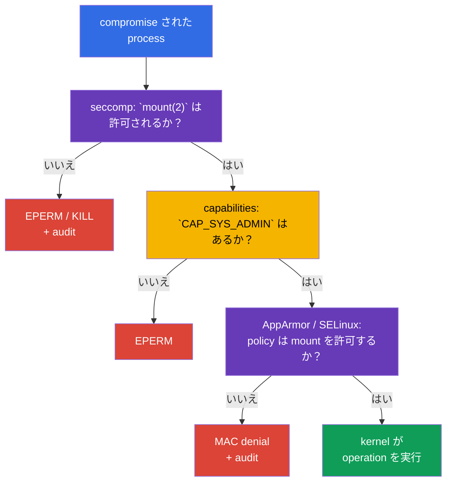

[Русская версия](ru.md) · [Eng version](README.md) · [Versión en español](es.md) · [Version française](fr.md) · [Deutsche Version](de.md) · [ქართული ვერსია](ge.md) · [繁體中文版](tw.md)

# 第17章. seccomp: 最小限の system call set

> **課題。** container 内で compromise された process は、正規 application と同じ kernel system call interface を取得し、isolation からの escape や kernel exploit の展開に、通常は不要な `mount`、`unshare`、`bpf`、`clone` を使用できます。余分な capability がなくても、この kernel API は attack surface を広げます。seccomp は検証済みの syscall set だけを事前に process に残します。

> **この後。** [第16章](../16/jp.md)の AppArmor は、process が扱える path と kernel object を制限しました。ここでは、さらに低い layer の filter を追加します。**seccomp** は process の system call（syscall）を profile rule と照合し、各 call に allow、error、terminate、logging などの action を選択します。これは CKS の **System Hardening** domain（10%）です。course の次の部分では、同じ制限が安全な `SecurityContext` と Pod Security Standards の一部になります。

> **CKA で必要な知識。** 基本的な `securityContext`、non-root execution、`allowPrivilegeEscalation: false`、Linux capabilities は[CKA 第20章](../../../cka/course/20/jp.md)で扱います。まず[CKA Lab 106](../../../cka/labs/106/README_JP.MD)で練習してください。seccomp は `capabilities.drop: ["ALL"]` を置き換えるのではなく、process が利用できる kernel API を縮小します。

> 🧠 Seccomp は syscall を filter し、allow、`ERRNO`、kill、`LOG` を返します。capabilities、DAC、MAC は別途確認されます。

## 17.1. seccomp が保護するもの

application は kernel function を直接呼び出しません。library または runtime が最終的に **system call** を実行します。`openat(2)` は file を開き、`socket(2)` は socket を作成し、`clone(2)` は process または thread を作成し、`mount(2)` は file system を mount します。compromise された process も同じ kernel interface を持ちます。通常の web server や worker には多くの syscall は不要ですが、container escape、namespace の変更、BPF program の load、mount に有用です。

seccomp（secure computing mode）は Linux kernel の mechanism で、process の各 syscall を BPF filter と照合し、allow、error の返却、process の terminate、audit event の生成、userspace notifier への判断の委譲を選択します。Kubernetes はこの filter を `securityContext.seccompProfile` を通じて container process に割り当てます。

```mermaid
flowchart TB
    process["container process"] --> call["syscall: mount, clone, openat ..."]
    call --> filter["seccomp BPF filter"]
    filter -->|"ALLOW"| kernel["kernel が syscall を実行"]
    filter -->|"ERRNO / KILL"| blocked["EPERM、ENOSYS、または terminate"]
    filter -->|"LOG"| audit["kernel audit / journal"]
    style process fill:#326ce5,color:#fff
    style filter fill:#673ab7,color:#fff
    style kernel fill:#0f9d58,color:#fff
    style blocked fill:#db4437,color:#fff
    style audit fill:#f4b400,color:#000
```

filter は process に紐付き、child process に inherit されます。これは permission を与えません。syscall が seccomp を通過しても、通常の kernel check は残ります。たとえば許可された `mount(2)` にも capability と適切な mount namespace/LSM permission が必要です。反対に、`CAP_SYS_ADMIN` が seccomp denial を取り消すことはありません。したがって seccomp は kernel API の直前にある最後の狭い barrier であり、他の control を一律に置き換えるものではありません。

| mechanism | 答える問い | 例 |
|---|---|---|
| UID/GID と DAC | identity は object を操作できるか？ | file permission `0640` |
| capabilities | 特別な kernel privilege があるか？ | `CAP_SYS_ADMIN` がない |
| seccomp | 特定の syscall は許可されるか？ | `unshare(2)` は `EPERM` を返す |
| AppArmor / SELinux | MAC policy は object と operation を許可するか？ | AppArmor が `/etc/shadow` の read を deny |
| RBAC | identity は Kubernetes API を呼び出せるか？ | `get secrets` がない |

seccomp は address と port の layer で network を制限せず、Kubernetes RBAC を確認せず、image を安全にもしません。host namespaces、hostPath、過剰な capabilities は risk を大きく高めます。また、`privileged: true` は常に seccomp `Unconfined` で container を起動します。Kubernetes profile はその container に適用されません。通常の workload の baseline は次のようになります。

```yaml
securityContext:
  runAsNonRoot: true
  seccompProfile:
    type: RuntimeDefault
containers:
- name: app
  image: nginxinc/nginx-unprivileged:1.30.4-alpine-slim
  ports:
  - containerPort: 8080
  securityContext:
    allowPrivilegeEscalation: false
    capabilities:
      drop: ["ALL"]
```

## 17.2. seccomp の mode と filter action

kernel は strict legacy mode と filtering mode を support します。container では、ほぼ常に filter mode が使われます。runtime は process start 前に OCI/Kubernetes profile の BPF program を load します。process で filter mode が enabled のとき、`/proc/<pid>/status` には `Seccomp: 2` が含まれます。`0` は seccomp がないこと、`1` は legacy strict mode を意味します。`2` の値自体は、どの profile が load されたかを証明しませんが、diagnostic には有用です。

JSON profile では action は libseccomp/OCI の値で指定します。すべての name を暗記するより意味が重要です。

| action | 結果 | 典型的な用途 |
|---|---|---|
| `SCMP_ACT_ALLOW` | syscall が実行される | 必要な call の allow-list |
| `SCMP_ACT_ERRNO` | syscall は実行されず、process は errno を受け取る | 不要な action を予測可能な形で deny |
| `SCMP_ACT_KILL_PROCESS` | kernel が process 全体を terminate する | 明らかに危険な syscall に対する厳格な fail-closed |
| `SCMP_ACT_KILL_THREAD` | kernel が呼び出した thread を terminate する | 通常は避ける。multi-thread process が不自然な状態で残ることがある |
| `SCMP_ACT_TRAP` | process は `SIGSYS` を受け取る | 専用の handling。通常の baseline ではない |
| `SCMP_ACT_LOG` | syscall は許可され、kernel は audit event の記録を試みる | enforce 前の call inventory |
| `SCMP_ACT_NOTIFY` | 判断が userspace supervisor に渡される | 特別な architecture。通常の policy の代替ではない |

`SCMP_ACT_LOG` は syscall を block しません。短い controlled test には役立ちますが、log が多く、production protection ではありません。errno を指定しない `SCMP_ACT_ERRNO` は通常 `EPERM` を返します。特定の値は別に指定できます。「より厳しい」からという理由だけで `KILL` を選ばないでください。process の突然の死は、重要でない call を outage に変え、diagnostic を難しい crash loop にする可能性があります。

policy には二つの方向があります。

- **deny-list:** `defaultAction: SCMP_ACT_ALLOW` とし、個別の危険な syscall に `ERRNO` または `KILL` を指定します。compatibility は高めですが、新規または見落とした syscall が利用可能なままです。
- **allow-list:** `defaultAction: SCMP_ACT_ERRNO` とし、`syscalls` に許可する group を列挙します。こちらは強力ですが、測定・test 済みの application contract が必要です。

`RuntimeDefault` は通常 runtime の安全な baseline になります。custom allow-list が意味を持つのは、actual application、その probes、entrypoint、DNS/TLS、periodic task を observation・test した後だけです。成功した一度の `curl` や一度の `strace` だけで作成してはいけません。

> 🎯 `RuntimeDefault` または検証済みの `Localhost` を選び、対象 container の effective seccomp を証明してください。一つの `EPERM` は seccomp denial の証拠ではありません。

## 17.3. Kubernetes API: `RuntimeDefault`、`Localhost`、`Unconfined`

現在の Kubernetes API は `securityContext.seccompProfile` で seccomp を指定します。すべての container の baseline として Pod に設定することも、より狭い policy が必要な特定 container に設定することもできます。container-level `securityContext` は、その container で優先されます。必要がないのに異なる filter を使わないでください。rollout、audit、denial の原因調査が複雑になります。

| `type` | 割り当てられるもの | 選ぶ場面 |
|---|---|---|
| `RuntimeDefault` | container runtime が提供する profile | 通常 workload の baseline |
| `Localhost` | node 上で local に利用可能な JSON profile | 検証済み application-specific syscall contract |
| `Unconfined` | seccomp filter を適用しない | owner と期限を持つ一時的な diagnostic exception のみ |

### `RuntimeDefault`: 安全な出発点

`RuntimeDefault` は runtime に標準 profile を適用するよう求めます。その正確な内容は runtime と version に依存するため、すべての platform で同じ JSON だと考えてはいけません。application をまだ調査していないなら、`Unconfined` に置き換えないでください。まず event、log、test で具体的な conflict を証明します。

```yaml
apiVersion: v1
kind: Pod
metadata:
  name: runtime-default-seccomp
  namespace: demo
spec:
  securityContext:
    seccompProfile:
      type: RuntimeDefault
  containers:
  - name: app
    image: nginx:1.30.4
    securityContext:
      allowPrivilegeEscalation: false
      capabilities:
        drop: ["ALL"]
```

保存された specification、state、effective process mode を確認します。

```bash
kubectl apply -f runtime-default-seccomp.yaml
kubectl wait -n demo --for=condition=Ready pod/runtime-default-seccomp --timeout=120s
kubectl get pod -n demo runtime-default-seccomp \
  -o jsonpath='{.spec.securityContext.seccompProfile.type}{"\n"}'
kubectl describe pod -n demo runtime-default-seccomp
kubectl exec -n demo runtime-default-seccomp -- grep '^Seccomp:' /proc/1/status
# Seccomp: 2 が想定されます。これは filter mode を確認しますが、profile の identity は確認しません。
```

cluster-wide default がすでに `RuntimeDefault` を有効にしていても、明示的な field は有用です。manifest が workload とともに intention を運び、admission policy がそれを確認でき、reviewer は node/runtime configuration を推測する必要がありません。

### `seccompDefault`: field のない manifest に対する node default

`seccompDefault` feature は Kubernetes v1.27 から stable です。有効にすると、kubelet は seccomp profile を指定しない workload に `RuntimeDefault` を適用します。kubelet flag `--seccomp-default` または kubelet configuration field で有効にします。

```yaml
seccompDefault: true
```

これは node-level setting です。そのため `seccompProfile` のない manifest は、`seccompDefault` を有効にした node では実際に `RuntimeDefault` を取得し、無効な node では `Unconfined` を取得する場合があります。field がないことを security contract に使用しないでください。portable baseline では `RuntimeDefault` を明示的に設定します。明示的な `Unconfined` は exception のままであり、`privileged: true` は manifest の profile に関係なく常に `Unconfined` になります。

cluster version から推測せず、Pod の**実際の** node で real configuration を確認してください。下の command は kubelet command line と明示的に指定した一つの field だけを読みます。まず `kubectl get pod -o wide` で node 名を取得し、許可された administrative access を使ってください。

```bash
# Pod の実際の node で実行します。sudo は /proc を開き、pipefail は隠れた read failure を防ぎます。
set -o pipefail
KPID=$(pgrep -xo kubelet) || { echo 'ERROR: kubelet not found' >&2; exit 1; }
if ! sudo cat "/proc/$KPID/cmdline" | tr '\0' '\n' | \
  awk '$0 == "--config" { print; getline; print; next }
       $0 == "--config-dir" { print; getline; print; next }
       /^--(config|config-dir|seccomp-default)(=|$)/'; then
  echo 'REVIEW_REQUIRED: cannot read kubelet command line reliably' >&2
  exit 2
fi

# --config-dir の drop-in は kubelet v1.36 で support されます。relative path は
# kubelet working directory を基準に解決し、kubelet merge order ですべての .conf を読み、その後 CLI flag を適用します。
# path/order/merged value を正確に決定できない場合は REVIEW_REQUIRED を報告します。単一の config.yaml から
# seccompDefault を推測しないでください。
```

`--config`、`--config-dir` drop-in、`--seccomp-default` は kubelet setting の source であり、CLI flag は merge 済み file configuration を override します。ticket に config 全体や任意の `/proc` command line を掲載しないでください。次に intended state を process mode と照合します。priority は container-level profile、次に Pod-level profile、次に profile がない場合の node default です。`privileged` は exception で、`Unconfined` のままです。

```bash
NS=demo
POD=runtime-default-seccomp
CTR=app

kubectl get pod -n "$NS" "$POD" \
  -o jsonpath='{.spec.securityContext.seccompProfile}{"\n"}'
kubectl get pod -n "$NS" "$POD" \
  -o jsonpath='{.spec.containers[?(@.name=="app")].securityContext.seccompProfile}{"\n"}'
kubectl exec -n "$NS" "$POD" -c "$CTR" -- grep '^Seccomp:' /proc/1/status
```

`Seccomp: 2` は filter mode を確認し、`Seccomp: 0` は filter がないことを示します。`/proc` は JSON 名や `RuntimeDefault` の正確な内容を明かしません。effective profile の identity は、manifest の precedence、実際の kubelet configuration/flags、runtime record、期待される behavior を合わせて確認します。privileged container では、YAML に field があっても Kubernetes profile は effective になりません。

### `Localhost`: path は absolute ではない

`Localhost` は custom JSON profile を選択します。Kubernetes は Pod 経由で JSON を渡さず、scheduler が copy することもありません。kubelet は**選択された node 上で** seccomp profile directory から file を読みます。default は `/var/lib/kubelet/seccomp` です。つまり subdirectory `profiles` と file `audit.json` は物理的には次のようになります。

```text
/var/lib/kubelet/seccomp/profiles/audit.json
```

manifest では、先頭の `/` なしで kubelet の seccomp root **relative** の path を指定します。

```yaml
securityContext:
  seccompProfile:
    type: Localhost
    localhostProfile: profiles/audit.json
```

`localhostProfile: /var/lib/kubelet/seccomp/profiles/audit.json` は誤りです。absolute path は API contract ではありません。同様に、kubelet が別の `--root-dir` で起動している場合は profile root が `<root-dir>/seccomp` になるため、`/var/lib/kubelet` を仮定するのも誤りです。managed node では platform owner に real kubelet configuration を確認してください。production node で file を当てずっぽうに探さないでください。

node-local dependency を含む完全な例です。

```yaml
apiVersion: v1
kind: Pod
metadata:
  name: localhost-seccomp
  namespace: demo
spec:
  # profile が automation により配布済みの、trusted label/pool だけを指定します。
  nodeSelector:
    seccomp.example.com/profiles: "v1"
  securityContext:
    seccompProfile:
      type: Localhost
      localhostProfile: profiles/audit.json
  containers:
  - name: app
    image: busybox:1.36.1
    command: ["sh", "-c", "sleep 3600"]
    securityContext:
      allowPrivilegeEscalation: false
      capabilities:
        drop: ["ALL"]
```

この manifest のためだけに user-controlled label を node に設定しないでください。label、profile、placement は trusted node configuration の一部です。許容する pool 全体に同じ profile を配布するか、protected label/affinity で scheduling を制限し、rollout 前に各 pool を確認してください。

### `privileged` は常に `Unconfined`

Kubernetes は `securityContext.privileged: true` の container を seccomp `Unconfined` として起動し、`RuntimeDefault` も `Localhost` も適用しません。したがって、`privileged: true` と `seccompProfile` を含む YAML は、二つの有効な layer を意味しません。ここで seccomp profile は effective になりません。profile の変更で「修正」しようとしたり、node 上の JSON を探したりしないでください。`privileged` に根拠がないなら削除し、その後に最小の profile を割り当てます。

安全な diagnostic では、まず conflict する desired state を記録し、その後に対象 container の process を確認します。

```bash
NS=demo
POD=example
CTR=app

kubectl get pod -n "$NS" "$POD" \
  -o jsonpath='{.spec.containers[?(@.name=="app")].securityContext.privileged}{"\n"}'
kubectl get pod -n "$NS" "$POD" \
  -o jsonpath='{.spec.containers[?(@.name=="app")].securityContext.seccompProfile}{"\n"}'
kubectl exec -n "$NS" "$POD" -c "$CTR" -- grep '^Seccomp:' /proc/1/status
```

application 自身が filter を設定していない privileged container では、`Seccomp: 0` が想定されます。manifest の profile field は、適用の証拠でなく誤った intention の印としてのみ有用です。process の `Seccomp: 2` は filter mode だけを証明し、process/runtime の別途調査が必要です。privileged container に対して Kubernetes profile が effective になるわけではありません。

### `Unconfined` と obsolete annotation

`Unconfined` は container のこの layer を無効にします。test node での controlled comparison など短い exception として使うことはできますが、恒久的な `Operation not permitted` の「解決策」にしてはいけません。owner、removal deadline、具体的な理由を記録し、その後 least privilege を復元してください。

古い manifest は annotation `seccomp.security.alpha.kubernetes.io/pod` または `container.seccomp.security.alpha.kubernetes.io/<container>` を使用することがあります。これは historical interface です。Kubernetes v1.25 以降、これらの annotation は**機能せず**、seccomp profile を割り当てません。modern cluster での存在は working compatibility ではなく audit の signal です。`securityContext.seccompProfile` に置き換えてください。特に異なる値で annotation と API field を混在させないでください。migration 後は新しい Pod を test し、その effective mode を確認します。

> 🎯 OCI seccomp format に従って `Localhost` の JSON profile を作成し、対象 node に load して、container の effective mode を確認してください。

## 17.4. JSON profile: structure と安全な例

`Localhost` profile は OCI seccomp format の JSON です。architecture、default action、rule array が重要です。syscall は shell command 名ではなく Linux ABI 名で指定してください。`mount` は utility `/bin/mount` ではなく `mount(2)` を意味します。

以下は小さな **test node 用 audit profile** です。すべての syscall を許可しますが、`unshare`、`setns`、`mount`、`bpf` の試行を kernel に記録させます。これは workload を保護しません。その目的は `Localhost` の path を示し、実際の restrict profile を書く前に観測可能な event を集めることです。

```json
{
  "defaultAction": "SCMP_ACT_ALLOW",
  "architectures": [
    "SCMP_ARCH_X86_64"
  ],
  "syscalls": [
    {
      "names": ["unshare", "setns", "mount", "bpf"],
      "action": "SCMP_ACT_LOG"
    }
  ]
}
```

> 🔬 `syscalls[].args`、`errnoRet`、syscall argument による filtering は、狭い version- および architecture-dependent detail です。

OCI seccomp は syscall 名だけでなく、`syscalls[].args`（`index`、`value`、optional の `valueTwo`、`op`）を通じてその argument も照合できます。たとえば次の rule は、他の socket domain を deny せず、domain `AF_PACKET`（17）の `socket(2)` にだけ `EPERM` を返します。

```json
{
  "names": ["socket"],
  "action": "SCMP_ACT_ERRNO",
  "errnoRet": 1,
  "args": [{"index": 0, "value": 17, "op": "SCMP_CMP_EQ"}]
}
```

argument number と値は syscall ABI に依存するため、このような filter は対象 architecture/runtime ごとに test し、検証なしに platform 間で移植しません。

ARM64 では `architectures` set は node の architecture（たとえば `SCMP_ARCH_AARCH64`）に一致する必要があります。x86_64 JSON を ARM node に copy しないでください。heterogeneous cluster では、profile は support される node pool ごとに正しい ABI を含めるか、workload を compatible pool に明示的に制限します。

profile の配置と確認は通常 Pod ではなく node automation が行います。以下の例は専用 test node 向けで、kubelet default path を示しています。

```bash
# administrative access を持つ test node で実行します。
sudo install -d -m 0755 /var/lib/kubelet/seccomp/profiles
sudo install -m 0644 audit.json /var/lib/kubelet/seccomp/profiles/audit.json
sudo test -r /var/lib/kubelet/seccomp/profiles/audit.json
sudo jq empty /var/lib/kubelet/seccomp/profiles/audit.json
```

`jq empty` は JSON syntax を確認しますが、syscall name の semantic や runtime compatibility を証明しません。production rollout 前に、対象の各 runtime version で container start test を追加してください。その後、live node を手動で編集するのではなく、新しい検証済み profile version の release として rollback を準備します。

以下は deny-list を使用する enforce profile の例です。これは予測可能な denial を示すためのものです。default では syscall を許可し、いくつかの action に `EPERM` を返します。この file は `RuntimeDefault` を置き換えず、それ自体で十分な production policy でもありません。

```json
{
  "defaultAction": "SCMP_ACT_ALLOW",
  "architectures": [
    "SCMP_ARCH_X86_64"
  ],
  "syscalls": [
    {
      "names": ["unshare", "setns", "mount"],
      "action": "SCMP_ACT_ERRNO",
      "errnoRet": 1
    },
    {
      "names": ["bpf", "keyctl", "perf_event_open"],
      "action": "SCMP_ACT_ERRNO",
      "errnoRet": 1
    }
  ]
}
```

`errnoRet: 1` は `EPERM` を意味します。process が `Operation not permitted` を受け取っても、自動的に seccomp の証拠にはなりません。同じ errno は capabilities、AppArmor、SELinux、通常の permissions も返すことがあります。manifest、process status、kernel audit/log がそろって必要です。

## 17.5. observation: syscall audit と kernel log

短い audit phase は「実際に必要な syscall は何か」という問いに答えるもので、終わりのない production mode にしてはいけません。startup、liveness/readiness probes、TLS/DNS、worker job、graceful shutdown、error path を含む representative traffic を test node で使用します。data は限られた時間だけ集め、PID/container と image version に対応付けます。

前の section の audit profile では、Pod を apply してから安全な call check を行います。`CAP_SYS_ADMIN` のない container では `unshare` は通常やはり error になります。audit にとっては、syscall が attempted され、kernel が受け取ったことで十分です。

```bash
kubectl apply -f localhost-seccomp.yaml
kubectl wait -n demo --for=condition=Ready pod/localhost-seccomp --timeout=120s
kubectl get pod -n demo localhost-seccomp -o wide
kubectl exec -n demo localhost-seccomp -- sh -c 'unshare -Ur true || true'
kubectl exec -n demo localhost-seccomp -- grep '^Seccomp:' /proc/1/status
```

次に `kubectl get ... -o wide` が示す node へ接続し、kernel journal で seccomp record を探します。具体的な format は kernel、auditd、logging pipeline に依存します。record には通常 `type=SECCOMP`、`syscall=`、`pid=`、`comm=`、arch が含まれます。すべての distribution で変わらない一つの text を期待しないでください。

```bash
# 選択した node で実行します。時間 window を制限し、複数の既知 pattern を検索します。
sudo journalctl -k --since '10 minutes ago' | \
  grep -Ei 'seccomp|type=SECCOMP|audit.*syscall' || true

# auditd が installed され、運用 procedure で許可されている場合:
sudo ausearch -m SECCOMP -ts recent 2>/dev/null || true
```

record を container に対応付けるには、node、time、process name/PID、runtime ID が必要です。kernel journal 全体を「Pod の log」と見なさないでください。同じ node では kubelet、runtime、その他の workload も動作します。まず Kubernetes context を集めます。

```bash
NS=demo
POD=localhost-seccomp

kubectl get pod -n "$NS" "$POD" -o wide
kubectl get pod -n "$NS" "$POD" \
  -o jsonpath='{.spec.securityContext.seccompProfile}{"\n"}'
kubectl describe pod -n "$NS" "$POD"
```

node 上では、access rule が許可する場合に administrator が container ID と host PID を取得できます。

```bash
# Node 上: current Ready sandbox を正確に一つ選び、その後 app container を正確に一つ選びます。
mapfile -t POD_IDS < <(
  sudo crictl pods --name '^localhost-seccomp$' --namespace '^demo$' --state ready -q
)
if [ "${#POD_IDS[@]}" -ne 1 ]; then
  printf 'REVIEW_REQUIRED: expected exactly one Ready pod sandbox, found %s\n' "${#POD_IDS[@]}" >&2
  exit 2
fi
POD_ID=${POD_IDS[0]}
mapfile -t CONTAINER_IDS < <(
  sudo crictl ps --pod "$POD_ID" --name '^app$' -q
)
if [ "${#CONTAINER_IDS[@]}" -ne 1 ]; then
  printf 'REVIEW_REQUIRED: expected exactly one running app container, found %s\n' "${#CONTAINER_IDS[@]}" >&2
  exit 2
fi
CONTAINER_ID=${CONTAINER_IDS[0]}
# .info は runtime-specific verbose data であり、portable な CRI PID contract ではありません。
HOST_PID=$(sudo crictl inspect "$CONTAINER_ID" | jq -r '.info.pid // empty')
if ! [[ "$HOST_PID" =~ ^[0-9]+$ ]]; then
  echo 'REVIEW_REQUIRED: runtime did not expose host PID as .info.pid; use its documented node-local inspection method' >&2
  exit 2
fi
sudo grep '^Seccomp:' "/proc/$HOST_PID/status"
```

`strace` は local で再現可能な investigation には有用ですが、それ自体が timing を変え負荷を生みます。高負荷 production PID に長時間 attach しないでください。test node では、process または command の短い trace を実行し、syscall 名を profile と照合できます。

```bash
HOST_PID=replace-with-host-pid
sudo strace -f -p "$HOST_PID" -e trace=%process,%network,%file
# 短い controlled test の後に trace を停止してください。
```

`strace` は process の call を示し、`SCMP_ACT_LOG` は kernel telemetry を提供します。どちらも自動的に allow-list を生成してはいけません。observed syscall を機械的にすべて追加するのでなく、threat review 後に minimal policy を残してください。

## 17.6. verification と debugging: YAML から kernel まで

seccomp の failure には異なる二つの group があり、check の順序で時間を節約できます。

1. **Container が作成されない。** `Localhost` で file が見つからない、path が relative でない、JSON/runtime が support されない、または Pod が profile のない node に scheduled されています。Pod event、node、kubelet/runtime log を確認します。
2. **Container は動作するが syscall が rejected される。** seccomp filter が適用され、application は `EPERM`、`ENOSYS`、`SIGSYS` を受け取るか terminate されます。effective mode、application log、kernel audit record を確認します。

### 迅速な check 順序

```bash
NS=demo
POD=localhost-seccomp
CTR=app

# 1. Desired state: Pod-level と container-level context は異なる場合があります。
kubectl get pod -n "$NS" "$POD" -o jsonpath='{.spec.securityContext.seccompProfile}{"\n"}'
kubectl get pod -n "$NS" "$POD" \
  -o jsonpath='{.spec.containers[?(@.name=="app")].securityContext.seccompProfile}{"\n"}'

# 2. Lifecycle と選択された node。
kubectl get pod -n "$NS" "$POD" -o wide
kubectl describe pod -n "$NS" "$POD"
kubectl get events -n "$NS" --field-selector involvedObject.name="$POD" \
  --sort-by=.lastTimestamp

# 3. container が start した場合の effective process state。
kubectl exec -n "$NS" "$POD" -c "$CTR" -- grep '^Seccomp:' /proc/1/status
```

`kubectl exec` ができない場合、blocked syscall を仮定して始めないでください。まず `describe` と event を読んでください。`Localhost` では event が missing profile またはその load error を直接指摘することがよくあります。正確な `localhostProfile` 値を確認します。これは「node 上のどこか」にある file 名でも absolute path でもありません。

実際の node では path、read permission、kubelet を診断します。ただし必要がない限り、secret や production profile の content を ticket に copy しないでください。

```bash
# 選択した node で実行します。actual kubelet command line/config の root-dir を代入してください。
KUBELET_ROOT=/var/lib/kubelet
sudo test -r "$KUBELET_ROOT/seccomp/profiles/audit.json"
sudo stat "$KUBELET_ROOT/seccomp/profiles/audit.json"
sudo journalctl -u kubelet --since '15 minutes ago'
sudo journalctl -k --since '15 minutes ago' | grep -Ei 'seccomp|SECCOMP|audit' || true
```

### symptom table

| symptom | 考えられる原因 | 証拠と安全な修正 |
|---|---|---|
| `CreateContainerError` after `Localhost` | profile が選択された node にない、または path が誤っている | `describe`、`-o wide` の node、正確な relative name、kubelet seccomp root 配下の file |
| Pod が誤った場所に scheduled される | profile が pool 全体に配布されていない | node label、automation delivery、placement を確認する。profile を弱めない |
| running container で `Seccomp: 0` | profile が割り当てられていない、`Unconfined` が指定された、container が privileged、または node default が無効 | Pod/container の `securityContext` と `privileged`、次に node 上の actual kubelet flags/config を比較する |
| `Seccomp: 2` だが application が `EPERM` を返す | seccomp denial、capability/MAC/DAC denial、またはすべての可能性 | kernel audit、AppArmor/SELinux log、capabilities、正確な syscall |
| `SIGSYS` または process killed | profile が `TRAP`/`KILL` を使っている | JSON、exit code、runtime log を確認し、test node で再現する |
| JSON は `jq` で読めるが container が start しない | schema、ABI、runtime version、または seccomp support が incompatible | kubelet/runtime event と isolated compatibility test |
| rollout が一部 replica だけで失敗する | node pool の profile/runtime/architecture が異なる | 各 pool を inventory し、compatible pool に pin するか統一した managed delivery を行う |
| `Unconfined`/`privileged` による「修正」 | protection を無効化し、原因を見つけていない | baseline を戻し、具体的な syscall と最小の根拠ある exception を特定する |

`/proc/1/status` は対象 container で読む必要があります。multi-container Pod では各 container の PID 1 は別の view を持ちます。`-c` なしの `kubectl exec` は誤った container を選ぶことがあります。`Seccomp: 2` は filter mode の存在を証明しますが、profile identity の verification には Pod spec、runtime/kubelet record、node delivery、expected behavior を組み合わせる必要があります。

### negative scenario を検証する

section 17.4 の enforce JSON では、`localhostProfile: profiles/restrict.json` を割り当てて別の test Pod を作成します。running rollout 中の production node で file を変更しないでください。新しい version を準備し、検証してから workload reference を変更します。

```bash
kubectl exec -n demo localhost-seccomp -- sh -c 'mount -t tmpfs tmpfs /tmp/x'
# 想定: mount: permission denied（または同様の EPERM）。

kubectl exec -n demo localhost-seccomp -- grep '^Seccomp:' /proc/1/status
# 想定: Seccomp: 2
```

この command だけでは attribution に不十分です。`mount` は不足した capability でも deny されることがあります。training の proof では、profile、`Seccomp: 2`、command の stderr、対応する node audit/log を記録します。実際の investigation では test を isolate し、一つの restriction を bypass して別のものを「test」するためだけに `CAP_SYS_ADMIN` を追加しないでください。

> 🧠 Seccomp は syscall を control し、capabilities は privilege を、AppArmor/SELinux は object と operation への access を control します。

## 17.7. seccomp、capabilities、AppArmor を結び付ける

これらの control は、一つの action を異なる layer で check します。compromise された process が `mount(2)` を呼ぶ試みを考えます。



internal kernel check の順序と具体的な errno は syscall と kernel version に依存しますが、defence-in-depth model は変わりません。一つの layer を成功して通過しても、別の layer は無効になりません。ここから practical rule が導かれます。

- **Capabilities は authority を縮小します。** `drop: ["ALL"]` は不要な kernel privilege を除去します。application が本当に privileged port を必要とするなら、`SYS_ADMIN` でなく `NET_BIND_SERVICE` だけを戻します。
- **seccomp は API surface を縮小します。** process の privilege がどれほど高くても syscall を deny できます。`RuntimeDefault` は standard baseline です。`Localhost` には測定済み contract と node delivery が必要です。
- **AppArmor/SELinux は object と operation を制限します。** [第16章](../16/jp.md)の AppArmor path-based policy は、syscall が許可された後でも特定 path を deny できます。SELinux は該当 OS で label/type enforcement により似た task を扱います。
- **`allowPrivilegeEscalation: false` は model を結びます。** Linux では new privilege の取得を禁止し、setuid/file capabilities による process の権限拡大を妨げます。seccomp の代替ではありませんが、有用な追加の boundary です。

capability がないことだけで seccomp を証明しようとしないでください。それは独立した barrier の一つだけを証明します。また、production workload で seccomp を test するために capability を追加しないでください。別の namespace/node で狭い experiment を行い、その後 resource を削除します。

> 🏭 `Localhost` profile: owner、runtime/ABI test、delivery、canary、rollback を備えた versioned artifact。

## 17.8. operation: node 上の file ではなく code としての profile

`Localhost` profile は platform contract の一部です。scheduler は `/var/lib/kubelet/seccomp` の content を読まず、JSON を node に配布しません。信頼できる operation には管理された lifecycle 全体が必要です。

1. **threat と owner を定義する。** どの syscall が risk を減らし、profile がどの workload/version を対象にするかを指定します。「念のためすべて deny」は specification ではありません。
2. **controlled に観測する。** test node で、startup と failure path を含む representative workload に対して短い audit/profile tracing を使用します。image digest、node OS、kernel、runtime version を保存します。
3. **minimal JSON を作成し compatibility を確認する。** JSON、ABI、support される architecture/runtime ごとの start を validate します。新しい image や dependency は syscall set を変える可能性があります。
4. **versioned artifact として profile を配布する。** node image、cloud-init、configuration management が workload scheduling 前に file を install する必要があります。unprivileged Pod に kubelet directory への write access を与えないでください。
5. **delivery と placement を結び付ける。** pool 全体で同じ profile にする方が単純で安全です。そうでない場合は trusted node label/affinity を使い、inventory を確認します。
6. **段階的に roll out する。** canary から開始し、Ready、application SLO、`SECCOMP`/runtime event を確認します。rollback には owner と検証済み manifest が必要です。
7. **deny を観測し、protection を無効にしない。** alert は node audit を workload と対応付けます。修正は根拠のある狭い profile または application の change であり、期限のない `Unconfined` ではありません。

通常の production workload では、多くの場合 `RuntimeDefault`、non-root、`allowPrivilegeEscalation: false`、dropped capabilities、MAC policy の組み合わせで十分です。custom profile が正当化されるのは、risk と contract がよく分かっている場合です。profile の複雑さも operational risk になります。

custom seccomp/AppArmor/SELinux profile を cluster scale で配布・record する必要がある場合は、production path として **Security Profiles Operator（SPO）**を検討してください。各 node の kubelet directory に JSON を手動 copy する代わりに、profile の lifecycle と recording workflow を管理します。これにより test、versioning、placement control が不要になるわけではありませんが、profile delivery を platform-managed にできます。

`restricted` level の Pod Security Standards は seccomp `RuntimeDefault` または `Localhost` を要求します。`Unconfined` はこの baseline を満たしません。admission policy は、chart の omission により seccomp のない workload が現れないようにするのに有用です。ただし admission は custom JSON が node に存在することを確認しません。これは引き続き node lifecycle と rollout の task です。

## 17.9. ミニ glossary

- **syscall** — process が kernel に operation を要求する system call。
- **seccomp** — process の syscall を filter する Linux mechanism。
- **BPF filter** — filter mode で kernel が syscall ごとに実行する filter program。
- **`RuntimeDefault`** — 選択した container runtime が提供する seccomp profile。
- **`Localhost`** — node で local に利用可能な JSON profile 用の Kubernetes type。
- **`localhostProfile`** — kubelet seccomp root relative の JSON profile path。
- **`Unconfined`** — container に seccomp filter がないこと。baseline でなく temporary exception。
- **allow-list** — default action が deny で、許可する syscall を明示的に列挙する policy。
- **deny-list** — default action が allow で、個別の syscall を deny する policy。
- **`SCMP_ACT_LOG`** — syscall を許可し、kernel に logging を要求する action。
- **`SCMP_ACT_ERRNO`** — syscall を実行せず error を返す action。
- **`SECCOMP` audit record** — seccomp に関連する event の kernel/audit record。

## 17.10. chapter のまとめ

- seccomp は process と kernel の boundary で syscall を filter します。capabilities、AppArmor/SELinux、DAC、RBAC、SecurityContext を補完し、置き換えません。
- 通常の workload では、non-root、`allowPrivilegeEscalation: false`、minimal capabilities とともに `seccompProfile.type: RuntimeDefault` を明示的に指定してください。`seccompDefault` は v1.27 から stable ですが、node default は manifest の explicit intention を置き換えません。
- `Localhost` profile は node 上の JSON です。`localhostProfile` は常に kubelet seccomp root relative です。default root では file `/var/lib/kubelet/seccomp/profiles/audit.json` を `profiles/audit.json` と指定します。
- custom profile には versioning、architecture/runtime test、許可されるすべての node への managed delivery、関連付けられた scheduling が必要です。scheduler 自体は JSON を配布しません。
- `SCMP_ACT_LOG` は一時的な observation を提供しますが protection ではありません。`ERRNO`/`KILL` は availability と diagnostic に異なる影響を持って block します。
- verification には desired Pod/container context、`privileged`、node と event、actual kubelet flags/config、対象 container の `Seccomp: 2`、application result、対応付けた kernel audit/log を含めます。一つの `EPERM` では attribution に不十分です。

## 17.11. exam と実務での役立ち方

**exam で。** `RuntimeDefault` と `Localhost` をすぐ区別し、`localhostProfile` の relative path、kubelet の `seccompDefault`、`privileged` は常に `Unconfined` という rule を覚えてください。`kubectl describe`、`-o jsonpath`、選択された node、`/proc/1/status` で result を確認します。`CreateContainerError` ではまず event を読み node-local profile を確認します。`EPERM` では capabilities と AppArmor/SELinux log を確認する前に seccomp を原因と断定しないでください。

**実務で。** runtime default は portable baseline を与え、custom seccomp は application、runtime、node platform 間の contract です。価値があるのは complete workflow だけです。measured syscall、threat review、versioned JSON、canary、audit correlation、迅速な rollback。「一つの node 上の file」と permanent `Unconfined` は hardening ではありません。

## 17.12. self-check question

<details>
<summary>1. seccomp は Linux capabilities とどう異なり、なぜ一方の control が他方を置き換えないのですか？</summary>

capabilities は process に `CAP_SYS_ADMIN` などの special kernel privilege があるかを定めます。seccomp は特定の syscall が許可されるかを決めます。seccomp で許可された call も通常の capabilities、namespace、LSM check を通過し、capability が seccomp denial を取り消すことはありません。したがって baseline では `drop: ["ALL"]` と `RuntimeDefault` を組み合わせます。
</details>

<details>
<summary>2. 通常の workload では、なぜ `Unconfined` より `RuntimeDefault` が優れていますか？</summary>

`RuntimeDefault` は runtime に標準 seccomp profile の適用を求め、通常 workload に portable baseline を作ります。`Unconfined` はこの layer を無効にし、owner と期限を持つ短い diagnostic exception としてのみ許容されます。manifest の explicit field は node default に依存せず intention も記録します。
</details>

<details>
<summary>3. file が `/var/lib/kubelet/seccomp/profiles/audit.json` にある場合、`localhostProfile` にはどの path を書きますか？</summary>

`profiles/audit.json` を指定します。この value は常に kubelet seccomp root relative であり、node filesystem の absolute path ではありません。`--root-dir` が異なる場合、physical profile root は変わりますが、API の relative rule は維持されます。
</details>

<details>
<summary>4. `localhostProfile` の absolute path と、profile が一つの node だけにあることが rollout で問題になるのはなぜですか？</summary>

absolute path は Kubernetes API contract に一致しません。kubelet は自身の seccomp root relative の path を期待します。scheduler は JSON profile を node 間で配布しないため、file のない node に scheduled された Pod は container creation error を受けます。profile、その delivery、placement は一貫した trusted node pool configuration でなければなりません。
</details>

<details>
<summary>5. `SCMP_ACT_LOG` は何をし、なぜ enforce mode ではないのですか？</summary>

`SCMP_ACT_LOG` は syscall を許可し、kernel に audit event の作成を求めます。これは短い controlled observation 用です。call を block せず、多くの log noise を発生させることがあり、production protection ではありません。enforce には、たとえば `SCMP_ACT_ERRNO` または意図的に選んだ `KILL` を使います。
</details>

<details>
<summary>6. seccomp denial を不足した capability や AppArmor denial と区別するには、どの data が必要ですか？</summary>

declared Pod/container security context、対象 container の effective `Seccomp`、正確な syscall、kernel audit/log が必要です。`EPERM` だけでは不十分です。capabilities、AppArmor、SELinux、通常の permission も返すことがあります。この chapter では、node、PID/container ID、time、`SECCOMP` record の対応付けも推奨します。
</details>

<details>
<summary>7. `/proc/1/status` の `Seccomp: 2` は何を証明し、何を証明しませんか？</summary>

`Seccomp: 2` は、確認対象の process で filter mode が enabled であることを証明します。`0` は filter がないことを、`1` は legacy strict mode を意味します。この number は JSON 名、content、effective profile identity を明かしません。そのため manifest precedence、kubelet/runtime configuration、profile delivery、expected behavior を組み合わせます。
</details>

<details>
<summary>8. allow-list profile を一度の application run だけで作れないのはなぜですか？</summary>

成功した一度の `curl` は startup、probe、DNS/TLS、periodic task、graceful shutdown、error path を含みません。allow-list には対象 runtime と architecture 上の actual application について、測定・test 済みの contract が必要です。observation と `strace` は data collection に役立ちますが、observed syscall を threat review なしに機械的に policy にしてはいけません。
</details>

<details>
<summary>9. **Flashback（第20章）。** manifest に `seccompProfile.type` を要求する第20章の `ValidatingAdmissionPolicy` を想像してください。この policy を admission で通過しても、actual syscall protection が保証されないのはなぜですか？ seccomp filter が実際に動作するため、node/kubelet level では policy の要求と何が一致する必要がありますか？</summary>

admission policy は object を保存する前の YAML だけを check し、node が profile を適用できることは確認しません。実際の node では、runtime/kubelet の seccomp support、container override を考慮した effective `securityContext`、`Localhost` では kubelet seccomp root 配下に compatible JSON が存在することが一致する必要があります。Kubernetes は `privileged` container を `Unconfined` として起動するため、container も `privileged` であってはいけません。event と対象 process の `Seccomp: 2` で result を確認します。
</details>

> 🏭 template/admission には `RuntimeDefault` を、custom `Localhost` には compatible pool、observation、rollback を備えた versioned profile を使用します。

## 17.13. production での適用方法

通常の stateless workload では、platform team は chart または base manifest に `seccompProfile.type: RuntimeDefault` を固定し、admission policy で `Unconfined` を deny します。これにより protection は各 service owner が field を追加したことに依存せず、manifest も期待する baseline を明示的に document します。non-root、`allowPrivilegeEscalation: false`、dropped capabilities、AppArmor/SELinux と組み合わせることで、application vulnerability exploit の影響を減らします。

custom `Localhost` profile は、isolated batch worker や sensitive service のような、明確な syscall contract を持つ workload だけに適用します。profile は repository に versioned artifact として保管し、各 architecture と runtime version で check します。automation は rollout 前に許可された node pool 全体へ配布します。manifest は relative `localhostProfile` で profile version を参照し、file の存在が保証される trusted pool に scheduling を制限します。

change は representative traffic を使う test node、canary、startup、probe、error rate、`SECCOMP`/runtime event の observation を経ます。failure 時、team はまず Pod spec、node、`Seccomp: 2`、syscall、kernel audit record を対応付け、その後に根拠のある狭い profile または application change を行います。service を恒久的に `Unconfined` に切り替えたり、`CAP_SYS_ADMIN` を追加したり、running node で JSON を編集してはいけません。これは原因を隠し、replica 間の差を作り、protection を弱めます。

## Practice

まず[CKA Lab 106](../../../cka/labs/106/README_JP.MD)を行ってください。これは seccomp denial を正しく解釈するのに必要な `SecurityContext`、non-root、capabilities を定着させます。次に専用 test node で `profiles/audit.json` を作成し、`Localhost` を持つ Pod を apply し、`SECCOMP`/kernel record を探して、audit profile を狭く検証済みの enforce profile に置き換えます。その前に[第16章](../16/jp.md)を復習してください。AppArmor は object と operation を制限し、seccomp は syscall set 自体を制限します。

## Links

- [Kubernetes: Restrict a Container's Syscalls with seccomp](https://kubernetes.io/docs/tutorials/security/seccomp/)
- [Kubernetes: Linux kernel security constraints](https://kubernetes.io/docs/concepts/security/linux-kernel-security-constraints/)
- [Kubernetes API: SeccompProfile](https://kubernetes.io/docs/reference/kubernetes-api/workload-resources/pod-v1/#SeccompProfile)
- [Kubernetes: Pod Security Standards](https://kubernetes.io/docs/concepts/security/pod-security-standards/)
- [Linux kernel: Seccomp BPF (SECure COMPuting with filters)](https://docs.kernel.org/userspace-api/seccomp_filter.html)

## Mixed checkpoint: System Hardening 完了

Minimize Microservice Vulnerabilities に進む前に、prompt なしで 15〜20 分かけて、System Hardening domain（第14〜17章）が定着したことを確認してください。

1. test node で余分な listening port または service を一つ見つけ、disable できるかを決める方法を説明してください（第14章）。
2. host 上の Linux user と Kubernetes API という二つの least privilege layer を挙げ、それぞれの具体的な例を一つ示してください（第15章）。
3. Pod の AppArmor profile を `enforce` から `complain` に切り替え、exam で `complain` を protection の証拠として示せない理由を説明してください（第16章）。
4. **mixed task。** RBAC（Cluster Hardening domain の第10章）と AppArmor/seccomp（この domain の第16〜17章）を考えます。user は RBAC の `create pods` を持ち、admission は `securityContext` を制限しません。なぜ RBAC だけでは Linux syscall を control しないのですか？ user は `Unconfined`/`privileged` を要求して利用可能な seccomp/AppArmor を bypass できますか？ manifest で hardening を無効化できないようにするには、どの admission enforcement（PSA `restricted`、ValidatingAdmissionPolicy、Gatekeeper、Kyverno、または platform equivalent）が必要ですか？
5. test Pod に `seccompProfile.type: RuntimeDefault` を設定し、allow-list/deny-list の観点でこれが `Unconfined` とどう異なるかを説明してください（第17章）。

task 4 が難しかった場合は、第10章と第16〜17章を合わせて見直してください。

---
[目次](../README_JP.md) · [第16章](../16/jp.md)
