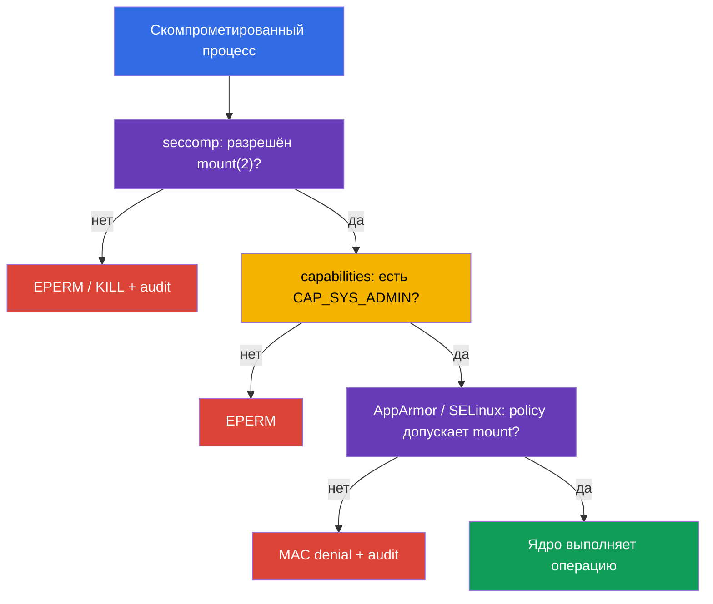

<!-- Standalone RU release: ссылки на переводы удалены, потому что соответствующие файлы не входят в архив. -->

# Глава 17. seccomp: минимальный набор системных вызовов

> **Что дальше.** AppArmor из [главы 16](../16/ru.md) ограничил, с какими путями и
> объектами ядра может работать процесс. Теперь добавим фильтр на ещё более низком уровне:
> **seccomp** разрешает процессу только нужные системные вызовы (syscalls). Это домен
> **System Hardening** CKS (10%). В следующей части курса эти же ограничения станут частью
> защищённого `SecurityContext` и Pod Security Standards.

> **Что нужно из CKA.** Базовые `securityContext`, non-root запуск,
> `allowPrivilegeEscalation: false` и Linux capabilities разобраны в
> [главе 20 CKA](../../../cka/course/20/ru.md). Сначала отработайте их в
> [лабе 106 CKA](../../../cka/labs/106/README_RU.MD): seccomp не заменяет
> `capabilities.drop: ["ALL"]`, а уменьшает доступный процессу API ядра.

## 17.1. Что seccomp защищает

Приложение не вызывает функции ядра напрямую. Библиотека или runtime в итоге делает
**system call**: `openat(2)` открывает файл, `socket(2)` создаёт сокет, `clone(2)` создаёт
процесс или thread, `mount(2)` монтирует файловую систему. У скомпрометированного процесса
появляется тот же интерфейс к ядру. Многие syscalls для обычного веб-сервера или worker не
нужны, но полезны для container escape, смены namespace, загрузки BPF-программ или
монтирования.

seccomp (secure computing mode) - механизм Linux kernel, который сопоставляет каждый syscall
процесса с BPF-фильтром и выбирает действие: разрешить, вернуть ошибку, завершить процесс,
создать audit event либо передать решение userspace-notifier. Kubernetes назначает такой
фильтр процессам контейнера через `securityContext.seccompProfile`.

```mermaid
flowchart LR
    process["Процесс контейнера"] --> call["syscall: mount, clone, openat ..."]
    call --> filter["seccomp BPF filter"]
    filter -->|"ALLOW"| kernel["Ядро выполняет syscall"]
    filter -->|"ERRNO / KILL"| blocked["EPERM, ENOSYS или завершение"]
    filter -->|"LOG"| audit["kernel audit / journal"]
    style process fill:#326ce5,color:#fff
    style filter fill:#673ab7,color:#fff
    style kernel fill:#0f9d58,color:#fff
    style blocked fill:#db4437,color:#fff
    style audit fill:#f4b400,color:#000
```

Фильтр привязан к процессу и наследуется дочерними процессами. Он не даёт разрешений: если
syscall пропущен seccomp, обычные проверки kernel всё равно остаются. Например, разрешённый
`mount(2)` ещё потребует capability и нужные mount namespace/LSM-права. И наоборот,
`CAP_SYS_ADMIN` не отменяет seccomp-denial. Поэтому seccomp - последний узкий барьер перед
API ядра, а не универсальная замена остальных controls.

| Механизм | Вопрос, на который отвечает | Пример |
|---|---|---|
| UID/GID и DAC | может ли identity работать с объектом? | права файла `0640` |
| capabilities | есть ли специальная привилегия ядра? | нет `CAP_SYS_ADMIN` |
| seccomp | разрешён ли конкретный syscall? | `unshare(2)` возвращает `EPERM` |
| AppArmor / SELinux | допускает ли MAC policy объект и операцию? | AppArmor запрещает чтение `/etc/shadow` |
| RBAC | может ли identity вызвать Kubernetes API? | нет `get secrets` |

seccomp не ограничивает сеть на уровне адресов и портов, не проверяет Kubernetes RBAC и не
делает образ безопасным. `privileged: true`, host namespaces, hostPath и чрезмерные
capabilities могут сделать риск намного выше, даже если профиль seccomp назначен. Для
обычного workload базовая связка выглядит так:

```yaml
securityContext:
  runAsNonRoot: true
  seccompProfile:
    type: RuntimeDefault
containers:
- name: app
  image: nginxinc/nginx-unprivileged:1.30.4-alpine-slim
  ports:
  - containerPort: 8080
  securityContext:
    allowPrivilegeEscalation: false
    capabilities:
      drop: ["ALL"]
```

## 17.2. Режимы seccomp и действия фильтра

Kernel поддерживает строгий legacy-режим и фильтрующий режим. В контейнерах практически
всегда используется filter mode: runtime загружает BPF-программу из OCI/Kubernetes profile
перед запуском процесса. Поле `/proc/<pid>/status` содержит `Seccomp: 2`, когда для
процесса включён filter mode; `0` означает отсутствие seccomp, `1` - legacy strict mode.
Само значение `2` не доказывает, *какой* профиль загружен, но полезно при диагностике.

В JSON-профиле действия задаются значениями libseccomp/OCI. Их смысл важнее запоминания
каждого имени:

| Действие | Результат | Типичное применение |
|---|---|---|
| `SCMP_ACT_ALLOW` | syscall выполняется | allow-list нужных вызовов |
| `SCMP_ACT_ERRNO` | syscall не выполняется, процесс получает errno | предсказуемо запретить ненужное действие |
| `SCMP_ACT_KILL_PROCESS` | kernel завершает весь процесс | жёсткий fail-closed для явно опасного syscall |
| `SCMP_ACT_KILL_THREAD` | kernel завершает вызывающий thread | обычно избегают: многопоточный процесс может остаться в странном состоянии |
| `SCMP_ACT_TRAP` | процесс получает `SIGSYS` | специализированная обработка, не обычный baseline |
| `SCMP_ACT_LOG` | syscall разрешён, kernel пытается записать audit event | инвентаризация вызовов до enforce |
| `SCMP_ACT_NOTIFY` | решение передаётся userspace supervisor | специальная архитектура; не замена обычной policy |

`SCMP_ACT_LOG` не блокирует syscall. Он полезен для краткого controlled test, но шумит в
логах и не является production-защитой. `SCMP_ACT_ERRNO` без указанного errno обычно
даёт `EPERM`; конкретное значение можно задать отдельно. Не выбирайте `KILL` только потому,
что он «строже»: внезапная смерть процесса может превратить несущественный вызов в outage,
а диагностику - в сложный crash loop.

Два направления policy выглядят по-разному:

- **deny-list:** `defaultAction: SCMP_ACT_ALLOW`, отдельные опасные syscalls получают
  `ERRNO` или `KILL`. Это проще для совместимости, но новые или забытые syscalls остаются
  доступными.
- **allow-list:** `defaultAction: SCMP_ACT_ERRNO`, в `syscalls` перечислены разрешённые
  группы. Это сильнее и требует измеренного, протестированного контракта приложения.

`RuntimeDefault` обычно даёт безопасный baseline runtime. Custom allow-list имеет смысл
только после наблюдения и теста реального приложения, его probes, entrypoint, DNS/TLS и
периодических задач. Никогда не строите его по одному удачному `curl` или одному `strace`.

## 17.3. Kubernetes API: `RuntimeDefault`, `Localhost`, `Unconfined`

Актуальный Kubernetes API задаёт seccomp в `securityContext.seccompProfile`. Его можно
поставить на Pod как baseline для всех контейнеров или на конкретный container, когда ему
нужна более узкая policy. Container-level `securityContext` имеет приоритет для этого
контейнера. Избегайте разных фильтров без необходимости: они усложняют rollout, audit и
поиск причины отказа.

| `type` | Что назначается | Когда выбирать |
|---|---|---|
| `RuntimeDefault` | профиль, поставляемый container runtime | нормальный baseline для обычной нагрузки |
| `Localhost` | JSON profile, доступный локально на ноде | проверенный application-specific контракт syscalls |
| `Unconfined` | фильтр seccomp не применяется | лишь временное диагностическое исключение с владельцем и сроком |

### `RuntimeDefault`: безопасная отправная точка

`RuntimeDefault` просит runtime применить его стандартный профиль. Его точное содержимое
зависит от runtime и версии, поэтому нельзя считать, что это один и тот же JSON на всех
платформах. Не заменяйте его на `Unconfined`, если приложение пока не было исследовано:
сначала докажите конкретный конфликт через event, логи и тест.

```yaml
apiVersion: v1
kind: Pod
metadata:
  name: runtime-default-seccomp
  namespace: demo
spec:
  securityContext:
    seccompProfile:
      type: RuntimeDefault
  containers:
  - name: app
    image: nginx:1.30.4
    securityContext:
      allowPrivilegeEscalation: false
      capabilities:
        drop: ["ALL"]
```

Проверьте сохранённую specification, состояние и режим effective процесса:

```bash
kubectl apply -f runtime-default-seccomp.yaml
kubectl wait -n demo --for=condition=Ready pod/runtime-default-seccomp --timeout=120s
kubectl get pod -n demo runtime-default-seccomp \
  -o jsonpath='{.spec.securityContext.seccompProfile.type}{"\n"}'
kubectl describe pod -n demo runtime-default-seccomp
kubectl exec -n demo runtime-default-seccomp -- grep '^Seccomp:' /proc/1/status
# Ожидается Seccomp: 2; это подтверждает filter mode, но не идентичность profile.
```

Если cluster-wide default уже включает `RuntimeDefault`, явное поле всё равно полезно:
manifest переносит намерение вместе с workload, admission policy может его проверить, а
проверяющий не должен угадывать node/runtime configuration.

### `Localhost`: path не является абсолютным

`Localhost` выбирает custom JSON profile. Kubernetes не передаёт JSON через Pod и не копирует
его планировщиком: kubelet читает файл **на выбранной ноде** из каталога seccomp profiles.
По умолчанию это `/var/lib/kubelet/seccomp`, то есть подкаталог `profiles` и файл
`audit.json` физически будут такими:

```text
/var/lib/kubelet/seccomp/profiles/audit.json
```

В manifest указывается путь **относительно seccomp root kubelet**, без начального `/`:

```yaml
securityContext:
  seccompProfile:
    type: Localhost
    localhostProfile: profiles/audit.json
```

`localhostProfile: /var/lib/kubelet/seccomp/profiles/audit.json` неверен: абсолютный путь
не является контрактом API. Аналогично неверно предполагать `/var/lib/kubelet`, если
kubelet запускается с другим `--root-dir`: тогда root профилей -
`<root-dir>/seccomp`. На managed nodes узнайте реальную конфигурацию kubelet у владельца
платформы; не ищите файлы на production-ноде наугад.

Полный пример с node-local dependency:

```yaml
apiVersion: v1
kind: Pod
metadata:
  name: localhost-seccomp
  namespace: demo
spec:
  # Указывайте только доверенный label/pool, на который profile доставлен automation.
  nodeSelector:
    seccomp.example.com/profiles: "v1"
  securityContext:
    seccompProfile:
      type: Localhost
      localhostProfile: profiles/audit.json
  containers:
  - name: app
    image: busybox:1.36.1
    command: ["sh", "-c", "sleep 3600"]
    securityContext:
      allowPrivilegeEscalation: false
      capabilities:
        drop: ["ALL"]
```

Не ставьте user-controlled label на ноду только ради этого manifest: label, profile и
placement являются частью доверенной node configuration. Либо доставляйте одинаковый profile
на весь допустимый pool, либо ограничивайте scheduling защищённым label/affinity и
проверяйте каждый pool перед rollout.

### `Unconfined` и устаревшая annotation

`Unconfined` отключает этот слой для контейнера. Его допустимо использовать как короткое
исключение, например для controlled comparison на test node, но не как постоянное «решение»
`Operation not permitted`. Запишите owner, срок удаления и конкретную причину; затем
восстановите least privilege.

Старые manifest могут использовать annotation
`seccomp.security.alpha.kubernetes.io/pod` или
`container.seccomp.security.alpha.kubernetes.io/<container>`. Это legacy-интерфейс:
распознайте его при audit, но для новых workload используйте `seccompProfile`. Не смешивайте
annotation и API-поле, особенно с разными значениями. При миграции сначала проверьте версию
кластера и runtime, перенесите назначение в `securityContext`, протестируйте новый Pod и
проверьте его effective mode.

## 17.4. JSON-профиль: структура и безопасный пример

Профиль `Localhost` - JSON в OCI seccomp format. В нём важны архитектура, действие по
умолчанию и массив правил. Называйте syscalls по Linux ABI, а не по имени shell-команды:
`mount` означает `mount(2)`, а не утилиту `/bin/mount`.

Ниже - небольшой **аудит-профиль для test node**. Он позволяет все syscalls, но заставляет
kernel журналировать попытки `unshare`, `setns`, `mount` и `bpf`. Он не защищает workload;
его задача - показать путь `Localhost` и собрать наблюдаемое событие перед тем, как писать
реальное restrict profile.

```json
{
  "defaultAction": "SCMP_ACT_ALLOW",
  "architectures": [
    "SCMP_ARCH_X86_64"
  ],
  "syscalls": [
    {
      "names": ["unshare", "setns", "mount", "bpf"],
      "action": "SCMP_ACT_LOG"
    }
  ]
}
```

Для ARM64 набор `architectures` должен соответствовать архитектуре node (например,
`SCMP_ARCH_AARCH64`); не копируйте x86_64 JSON на ARM node. В heterogeneous cluster profile
либо содержит корректные ABI для каждого поддерживаемого node pool, либо workload явно
ограничен совместимым pool.

Профиль кладёт и проверяет node automation, а не обычный Pod. Пример ниже предназначен для
выделенной test-ноды и иллюстрирует default path kubelet:

```bash
# На test-ноде, с административным доступом.
sudo install -d -m 0755 /var/lib/kubelet/seccomp/profiles
sudo install -m 0644 audit.json /var/lib/kubelet/seccomp/profiles/audit.json
sudo test -r /var/lib/kubelet/seccomp/profiles/audit.json
sudo jq empty /var/lib/kubelet/seccomp/profiles/audit.json
```

`jq empty` проверяет синтаксис JSON, но не доказывает семантику syscall names или
совместимость runtime. Перед production rollout добавьте тест запуска container на каждой
целевой версии runtime, затем подготовьте rollback как выпуск новой проверенной profile
версии, а не ручное редактирование live node.

Ниже пример enforce-профиля с deny-list. Он нужен для демонстрации предсказуемого отказа:
по умолчанию syscalls разрешены, а несколько действий получают `EPERM`. Такой файл не
заменяет `RuntimeDefault` и не является достаточной production policy сам по себе.

```json
{
  "defaultAction": "SCMP_ACT_ALLOW",
  "architectures": [
    "SCMP_ARCH_X86_64"
  ],
  "syscalls": [
    {
      "names": ["unshare", "setns", "mount"],
      "action": "SCMP_ACT_ERRNO",
      "errnoRet": 1
    },
    {
      "names": ["bpf", "keyctl", "perf_event_open"],
      "action": "SCMP_ACT_ERRNO",
      "errnoRet": 1
    }
  ]
}
```

`errnoRet: 1` означает `EPERM`. Если процесс получает `Operation not permitted`, это не
доказывает seccomp автоматически: тот же errno могут вернуть capabilities, AppArmor,
SELinux или обычные права. Нужны одновременно manifest, status процесса и kernel audit/log.

## 17.5. Наблюдение: syscall audit и kernel log

Краткий audit этап отвечает на вопрос «какие syscalls реально нужны?» и не должен
превращаться в бесконечный production-режим. Используйте representative traffic на test
node, включая startup, liveness/readiness probes, TLS/DNS, worker jobs, graceful shutdown
и error paths. Собирайте данные ограниченное время и соотносите их с PID/container и
версией образа.

Для audit profile из предыдущего раздела примените Pod, затем сделайте безопасную проверку
вызова. В контейнере без `CAP_SYS_ADMIN` `unshare` обычно всё равно завершается ошибкой;
для audit достаточно, что syscall attempted и kernel получил его.

```bash
kubectl apply -f localhost-seccomp.yaml
kubectl wait -n demo --for=condition=Ready pod/localhost-seccomp --timeout=120s
kubectl get pod -n demo localhost-seccomp -o wide
kubectl exec -n demo localhost-seccomp -- sh -c 'unshare -Ur true || true'
kubectl exec -n demo localhost-seccomp -- grep '^Seccomp:' /proc/1/status
```

Затем подключитесь к node, указанной `kubectl get ... -o wide`, и ищите seccomp records в
kernel journal. Конкретный формат зависит от kernel, auditd и logging pipeline; в записи
обычно есть `type=SECCOMP`, `syscall=`, `pid=`, `comm=` и arch. Не ожидайте один неизменный
текст на всех дистрибутивах.

```bash
# На выбранной ноде, ограничьте временное окно и ищите несколько известных вариантов.
sudo journalctl -k --since '10 minutes ago' | \
  grep -Ei 'seccomp|type=SECCOMP|audit.*syscall' || true

# Если auditd установлен и разрешён вашей процедурой эксплуатации:
sudo ausearch -m SECCOMP -ts recent 2>/dev/null || true
```

Для сопоставления записи с контейнером нужны node, время, process name/PID и runtime ID.
Не считайте весь kernel journal «логом Pod»: на одной node работают kubelet, runtime и
другие workload. Сначала соберите Kubernetes-контекст:

```bash
NS=demo
POD=localhost-seccomp

kubectl get pod -n "$NS" "$POD" -o wide
kubectl get pod -n "$NS" "$POD" \
  -o jsonpath='{.spec.securityContext.seccompProfile}{"\n"}'
kubectl describe pod -n "$NS" "$POD"
```

На node администратор может получить container ID и host PID, если это разрешено правилами
доступа:

```bash
# На ноде; выберите фактическое имя/ID, не копируйте его из другого Pod.
sudo crictl ps --name localhost-seccomp
sudo crictl inspect <container-id> | jq '.info.pid'
sudo grep '^Seccomp:' /proc/<pid>/status
```

`strace` полезен для локального воспроизводимого исследования, но сам меняет timing и
создаёт нагрузку. Не подключайтесь надолго к высоконагруженному production PID. На test node
можно запустить короткий trace процесса или команды и сопоставить имена syscalls с
профилем:

```bash
sudo strace -f -p <pid> -e trace=%process,%network,%file
# Остановите trace после короткого controlled test.
```

`strace` показывает вызовы процесса, а `SCMP_ACT_LOG` даёт kernel telemetry. Ни один из них
не должен автоматически генерировать allow-list: оставляйте минимальную policy после review
угрозы, а не после механического добавления всех observed syscalls.

## 17.6. Проверка и debugging: от YAML до kernel

Для seccomp есть две разные группы отказов, и порядок проверки экономит время.

1. **Container не создан.** В `Localhost` не найден файл, путь не относительный,
   JSON/runtime не поддержан либо Pod scheduled на node без profile. Смотрите event Pod,
   node и kubelet/runtime logs.
2. **Container работает, но syscall rejected.** seccomp filter применён, приложение
   получает `EPERM`, `ENOSYS`, `SIGSYS` или завершается. Смотрите effective mode,
   application log и kernel audit records.

### Быстрый порядок проверки

```bash
NS=demo
POD=localhost-seccomp
CTR=app

# 1. Desired state: Pod- и container-level contexts могут различаться.
kubectl get pod -n "$NS" "$POD" -o jsonpath='{.spec.securityContext.seccompProfile}{"\n"}'
kubectl get pod -n "$NS" "$POD" \
  -o jsonpath='{.spec.containers[?(@.name=="app")].securityContext.seccompProfile}{"\n"}'

# 2. Lifecycle и выбранная node.
kubectl get pod -n "$NS" "$POD" -o wide
kubectl describe pod -n "$NS" "$POD"
kubectl get events -n "$NS" --field-selector involvedObject.name="$POD" \
  --sort-by=.lastTimestamp

# 3. Effective process state, если container стартовал.
kubectl exec -n "$NS" "$POD" -c "$CTR" -- grep '^Seccomp:' /proc/1/status
```

Если `kubectl exec` невозможен, не начинайте с предположения о blocked syscall: сначала
прочитайте `describe` и events. Для `Localhost` event часто прямо указывает отсутствующий
profile или ошибку его загрузки. Проверьте точное значение `localhostProfile`; это не имя
файла «где-то на node» и не абсолютный path.

На фактической node диагностируйте путь, права чтения и kubelet, но не копируйте секреты или
содержимое production profile в тикет без необходимости:

```bash
# На выбранной node, только после подтверждения --root-dir kubelet.
sudo test -r /var/lib/kubelet/seccomp/profiles/audit.json
sudo stat /var/lib/kubelet/seccomp/profiles/audit.json
sudo journalctl -u kubelet --since '15 minutes ago'
sudo journalctl -k --since '15 minutes ago' | grep -Ei 'seccomp|SECCOMP|audit' || true
```

### Таблица симптомов

| Симптом | Вероятная причина | Доказательство и безопасная правка |
|---|---|---|
| `CreateContainerError` после `Localhost` | profile отсутствует на выбранной node или путь неверен | `describe`, node из `-o wide`, точное относительное имя и файл под kubelet seccomp root |
| Pod scheduled не туда | profile доставлен не на весь pool | проверить node label, automation delivery и placement; не ослаблять профиль |
| `Seccomp: 0` в работающем контейнере | profile не назначен, override имеет `Unconfined` либо runtime/default не применился | сравнить Pod и container `securityContext`, admission/runtime configuration |
| `Seccomp: 2`, но приложение даёт `EPERM` | возможен seccomp denial, capability/MAC/DAC denial или все сразу | kernel audit, AppArmor/SELinux logs, capabilities и точный syscall |
| `SIGSYS` или process killed | profile использует `TRAP`/`KILL` | проверить JSON, exit code и runtime logs; воспроизвести на test node |
| JSON читается `jq`, но container не стартует | schema, ABI, runtime version или seccomp support несовместимы | kubelet/runtime event и isolated compatibility test |
| rollout ломается лишь на части реплик | node pools различаются по profile/runtime/architecture | inventory каждого pool, pin compatible pool или единый managed delivery |
| «исправление» через `Unconfined`/`privileged` | защиту выключили, причину не нашли | вернуть baseline, выделить конкретный syscall и минимальное обоснованное исключение |

`/proc/1/status` нужно читать у нужного container. В multi-container Pod PID 1 каждого
container имеет отдельное представление; `kubectl exec` без `-c` может выбрать не тот
контейнер. `Seccomp: 2` доказывает наличие filter mode, а verification identity профиля
остается связкой из Pod spec, runtime/kubelet records, node delivery и expected behavior.

### Проверяем отрицательный сценарий

Для enforce JSON из раздела 17.4 создайте отдельный test Pod, назначив
`localhostProfile: profiles/restrict.json`. Не меняйте file на production node под
работающим rollout: подготовьте новую версию, проверьте и только потом меняйте ссылку
workload.

```bash
kubectl exec -n demo localhost-seccomp -- sh -c 'mount -t tmpfs tmpfs /tmp/x'
# Ожидается: mount: permission denied (или аналогичный EPERM).

kubectl exec -n demo localhost-seccomp -- grep '^Seccomp:' /proc/1/status
# Ожидается: Seccomp: 2
```

Этой команды недостаточно для attribution: mount может быть запрещён отсутствующей
capability. Для учебного доказательства фиксируйте profile, `Seccomp: 2`, stderr команды и
соответствующий node audit/log. В реальном расследовании изолируйте тест и не добавляйте
`CAP_SYS_ADMIN` лишь для того, чтобы обойти одно ограничение и «проверить» другое.

## 17.7. Как связать seccomp, capabilities и AppArmor

Эти controls проверяют одно действие на разных слоях. Рассмотрим попытку скомпрометированного
процесса вызвать `mount(2)`:



Порядок внутренних kernel checks и конкретный errno зависят от syscall и версии kernel, но
модель defence-in-depth остаётся: успешное прохождение одного слоя не отменяет другой. Из
этого следуют практические правила.

- **Capabilities сокращают полномочия.** `drop: ["ALL"]` убирает ненужные kernel
  privileges. Если приложению действительно нужен privileged port, возвращают только
  `NET_BIND_SERVICE`, а не `SYS_ADMIN`.
- **seccomp сокращает поверхность API.** Он может запретить syscall независимо от того,
  насколько высоки privileges процесса. `RuntimeDefault` - стандартный baseline;
  `Localhost` требует измеренного контракта и node delivery.
- **AppArmor/SELinux ограничивают объекты и операции.** AppArmor path-based policy из
  [главы 16](../16/ru.md) может запретить конкретный путь даже после разрешённого syscall.
  SELinux решает похожую задачу labels/type enforcement на соответствующих ОС.
- **`allowPrivilegeEscalation: false` связывает модель.** Для Linux это запрещает gaining
  new privileges и мешает процессу получить больше прав через setuid/file capabilities;
  это не подмена seccomp, но полезная дополнительная граница.

Не пытайтесь доказать seccomp тем, что capability отсутствует: это доказывает только один
из независимых барьеров. И не добавляйте capability ради теста seccomp на production
workload. Делайте узкий эксперимент в отдельном namespace/node и после него удаляйте
ресурсы.

## 17.8. Эксплуатация: profile как код, а не как файл на ноде

`Localhost` profile - часть platform contract. Scheduler не читает содержимое
`/var/lib/kubelet/seccomp` и не переносит JSON на node. Надёжная эксплуатация требует
управляемого полного lifecycle.

1. **Определите угрозу и владельца.** Укажите, какой syscall сокращает риск и какой
   workload/version profile покрывает. «На всякий случай запретим всё» не является
   спецификацией.
2. **Наблюдайте контролируемо.** На test node используйте краткий audit/profile tracing
   для representative workload, включая startup и failure paths. Сохраняйте image digest,
   node OS, kernel и runtime version.
3. **Сделайте минимальный JSON и проверьте совместимость.** Validate JSON, ABI и запуск
   на каждой поддерживаемой архитектуре/runtime. Новый image или dependency может изменить
   набор syscalls.
4. **Доставьте profile как версионируемый артефакт.** Node image, cloud-init или
   configuration management должны установить файл до scheduling workload. Не давайте
   непривилегированному Pod доступ писать в kubelet directory.
5. **Свяжите delivery и placement.** Одинаковый profile на pool проще и безопаснее;
   иначе используйте доверенный node label/affinity и проверяйте inventory.
6. **Roll out постепенно.** Начните с canary, проверьте Ready, application SLO и
   `SECCOMP`/runtime events. У rollback должен быть владелец и проверенный manifest.
7. **Наблюдайте deny, не отключайте защиту.** Alert связывает node audit с workload.
   Исправление - обоснованный узкий change profile или приложения, а не бессрочный
   `Unconfined`.

Для production обычной нагрузки часто достаточно комбинации `RuntimeDefault`, non-root,
`allowPrivilegeEscalation: false`, drop capabilities и MAC policy. Custom profile оправдан
там, где риск и контракт хорошо известны; сложность profile - тоже operational risk.

Pod Security Standards уровня `restricted` требуют seccomp `RuntimeDefault` или
`Localhost`; `Unconfined` этому baseline не соответствует. Admission policy полезна для
того, чтобы workload без seccomp не появился из-за пропуска в chart. Но admission не
проверяет наличие custom JSON на node - это всё ещё задача node lifecycle и rollout.

## 17.9. Мини-глоссарий

- **syscall** - системный вызов, через который процесс запрашивает операцию у kernel.
- **seccomp** - Linux-механизм фильтрации syscalls процесса.
- **BPF filter** - программа фильтра, которую kernel исполняет для syscall в filter mode.
- **`RuntimeDefault`** - seccomp profile, поставляемый выбранным container runtime.
- **`Localhost`** - Kubernetes type для JSON profile, доступного локально на node.
- **`localhostProfile`** - относительный к kubelet seccomp root путь JSON profile.
- **`Unconfined`** - отсутствие seccomp-фильтра для container; временное исключение, не baseline.
- **allow-list** - policy, где default action запрещает, а разрешённые syscalls перечислены явно.
- **deny-list** - policy, где default action разрешает, а отдельные syscalls запрещены.
- **`SCMP_ACT_LOG`** - action, который разрешает syscall и просит kernel его журналировать.
- **`SCMP_ACT_ERRNO`** - action, возвращающий syscall ошибку без его выполнения.
- **`SECCOMP` audit record** - kernel/audit запись о событии, относящемся к seccomp.

## 17.10. Итоги главы

- seccomp фильтрует syscalls у границы процесса и kernel; он дополняет, а не заменяет
  capabilities, AppArmor/SELinux, DAC, RBAC и SecurityContext.
- Для обычного workload явно задавайте `seccompProfile.type: RuntimeDefault` вместе с
  non-root, `allowPrivilegeEscalation: false` и минимальными capabilities.
- `Localhost` profile - JSON на node. `localhostProfile` всегда относителен к kubelet
  seccomp root: для default root файл
  `/var/lib/kubelet/seccomp/profiles/audit.json` задаётся как `profiles/audit.json`.
- Custom profile требует версионирования, architecture/runtime testing, managed delivery
  на все допустимые nodes и связанного scheduling. Scheduler сам JSON не доставляет.
- `SCMP_ACT_LOG` даёт временное наблюдение, но не защиту; `ERRNO`/`KILL` блокируют с
  разными последствиями для доступности и диагностики.
- Проверка включает desired Pod/container context, node и events, `Seccomp: 2` в нужном
  container, application result и сопоставленный kernel audit/log. Одного `EPERM` для
  attribution недостаточно.

## 17.11. Как это пригодится: на экзамене и в реальной работе

**На экзамене.** Быстро отличите `RuntimeDefault` от `Localhost`, помните относительный
путь `localhostProfile` и проверьте результат через `kubectl describe`, `-o jsonpath`,
выбранную node и `/proc/1/status`. При `CreateContainerError` первым делом читайте event и
проверяйте node-local profile; при `EPERM` не объявляйте seccomp виновником до проверки
capabilities и AppArmor/SELinux logs.

**В реальной работе.** Runtime default даёт переносимый baseline, а custom seccomp -
контракт между приложением, runtime и node platform. Полезный результат даёт только полный
workflow: measured syscalls, review угрозы, versioned JSON, canary, audit correlation и
быстрый rollback. «Файл на одной ноде» и постоянный `Unconfined` не являются hardening.

## 17.12. Вопросы для самопроверки

1. Чем seccomp отличается от Linux capabilities и почему один control не заменяет другой?
2. Почему `RuntimeDefault` лучше `Unconfined` для обычной нагрузки?
3. Какой путь пишут в `localhostProfile`, если файл находится в
   `/var/lib/kubelet/seccomp/profiles/audit.json`?
4. Почему абсолютный path в `localhostProfile` и profile только на одной node приводят к
   проблемам при rollout?
5. Что делает `SCMP_ACT_LOG`, и почему это не режим enforce?
6. Какие данные нужны, чтобы отличить seccomp denial от отсутствующей capability или
   AppArmor denial?
7. Что доказывает `Seccomp: 2` в `/proc/1/status`, а чего он не доказывает?
8. Почему allow-list profile нельзя строить по одному запуску приложения?

## 17.13. Как это применяют в продакшене

Для обычных stateless workload platform team фиксирует
`seccompProfile.type: RuntimeDefault` в chart или базовом manifest и запрещает
`Unconfined` admission policy. Так защита не зависит от того, вспомнил ли владелец
каждого сервиса добавить поле, а manifest всё равно явно документирует ожидаемый
baseline. Вместе с non-root, `allowPrivilegeEscalation: false`, drop capabilities и
AppArmor/SELinux это уменьшает последствия эксплуатации уязвимости в приложении.

Custom `Localhost` profile применяют только к workload с понятным syscall-контрактом,
например к изолированному batch worker или чувствительному сервису. Профиль хранят в
репозитории как версионируемый артефакт, проверяют на каждой архитектуре и версии
runtime, а automation доставляет его на весь допустимый node pool до rollout. Manifest
ссылается на версию профиля относительным `localhostProfile`, а scheduling ограничивают
доверенным pool, где этот файл гарантированно есть.

Изменение проходит через test node с representative traffic, canary и наблюдение за
startup, probes, error rate и `SECCOMP`/runtime events. При отказе команда сначала
сопоставляет Pod spec, node, `Seccomp: 2`, syscall и kernel audit record, затем делает
узкое обоснованное изменение profile или приложения. Постоянно переключать сервис на
`Unconfined`, добавлять `CAP_SYS_ADMIN` или редактировать JSON на работающей ноде нельзя:
это скрывает причину, создаёт разницу между репликами и ослабляет защиту.

## Практика

Сначала выполните [лабу 106 CKA](../../../cka/labs/106/README_RU.MD): она закрепляет
`SecurityContext`, non-root и capabilities, которые нужны для корректной интерпретации
seccomp-отказов. Затем на выделенной test-ноде создайте `profiles/audit.json`, примените
Pod с `Localhost`, найдите `SECCOMP`/kernel record и замените audit profile узким
проверенным enforce profile. Перед этим повторите [главу 16](../16/ru.md): AppArmor
ограничивает объекты и операции, seccomp - сам набор syscalls.

## Ссылки

- [Kubernetes: Restrict a Container's Syscalls with seccomp](https://kubernetes.io/docs/tutorials/security/seccomp/)
- [Kubernetes: Linux kernel security constraints](https://kubernetes.io/docs/concepts/security/linux-kernel-security-constraints/)
- [Kubernetes API: SeccompProfile](https://kubernetes.io/docs/reference/kubernetes-api/workload-resources/pod-v1/#SeccompProfile)
- [Kubernetes: Pod Security Standards](https://kubernetes.io/docs/concepts/security/pod-security-standards/)
- [Linux kernel: Seccomp BPF (SECure COMPuting with filters)](https://docs.kernel.org/userspace-api/seccomp_filter.html)

---
[Оглавление](../README_RU.md) · [Глава 16](../16/ru.md)