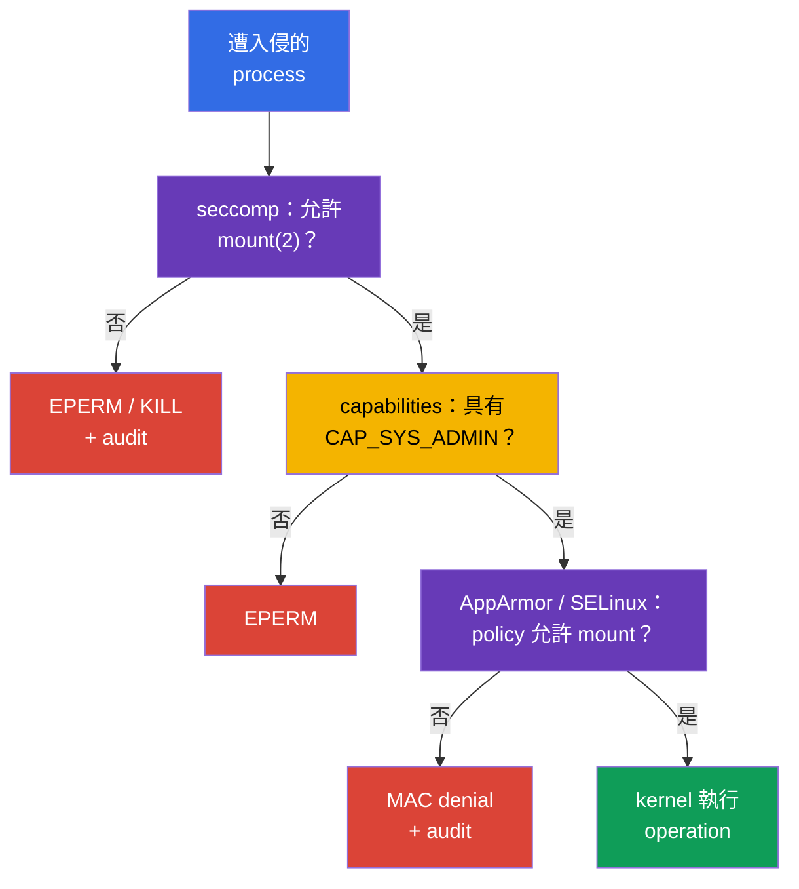

[Русская версия](ru.md) · [Eng version](README.md) · [Versión en español](es.md) · [Version française](fr.md) · [Deutsche Version](de.md) · [ქართული ვერსია](ge.md) · [日本語版](jp.md)

# 第 17 章。seccomp：最小 system calls 集合

> **問題。** Container 中遭入侵的 process 與合法 application 擁有相同的 kernel system call
> interface，並可能使用很少需要的 `mount`、`unshare`、`bpf` 或 `clone` 逃離 isolation 或推進
> kernel exploit。即使沒有多餘 capability，這種 kernel API 也會擴大攻擊面；seccomp 預先僅保留
> process 已驗證的 syscalls 集合。

> **接下來。** [第 16 章](../16/tw.md)的 AppArmor 限制 process 可使用的 paths 與 kernel
> objects。現在加入更低層的 filter：**seccomp** 將 process 的 system calls（syscalls）與 profile
> rules 比對，並為每個 call 選擇 action，例如 allow、error、termination 或 logging。這是 CKS 的
> **System Hardening** 領域（10%）。下一部分課程會將相同限制納入受保護的 `SecurityContext` 與
> Pod Security Standards。

> **需要的 CKA 基礎。** 基本的 `securityContext`、non-root execution、
> `allowPrivilegeEscalation: false` 與 Linux capabilities 見
> [CKA 第 20 章](../../../cka/course/20/tw.md)。先在
> [CKA Lab 106](../../../cka/labs/106/README_TW.MD)練習：seccomp 不能取代
> `capabilities.drop: ["ALL"]`，而是減少 process 可使用的 kernel API。

> 🧠 Seccomp 過濾 syscalls 並回傳 allow、`ERRNO`、kill 或 `LOG`；capabilities、DAC 與 MAC 會另行檢查。

## 17.1. seccomp 保護什麼

Application 不會直接呼叫 kernel functions。Library 或 runtime 最終會進行 **system call**：
`openat(2)` 開啟檔案、`socket(2)` 建立 socket、`clone(2)` 建立 process 或 thread、`mount(2)`
mount filesystem。遭入侵的 process 會取得相同 kernel interface。許多 syscalls 對一般 web server
或 worker 並非必要，卻有助於 container escape、namespace change、載入 BPF programs 或 mounting。

seccomp（secure computing mode）是 Linux kernel mechanism，將每個 process syscall 與 BPF filter
比對，並選擇 action：allow、回傳 error、terminate process、建立 audit event，或將決策交給
userspace notifier。Kubernetes 透過 `securityContext.seccompProfile` 為 container processes
指派此 filter。

```mermaid
flowchart TB
    process["container process"] --> call["syscall: mount, clone, openat ..."]
    call --> filter["seccomp BPF filter"]
    filter -->|"ALLOW"| kernel["kernel 執行 syscall"]
    filter -->|"ERRNO / KILL"| blocked["EPERM、ENOSYS 或 termination"]
    filter -->|"LOG"| audit["kernel audit / journal"]
    style process fill:#326ce5,color:#fff
    style filter fill:#673ab7,color:#fff
    style kernel fill:#0f9d58,color:#fff
    style blocked fill:#db4437,color:#fff
    style audit fill:#f4b400,color:#000
```

Filter 綁定於 process，並由 child processes 繼承。它不會授予 permissions：即使 syscall 通過
seccomp，一般 kernel checks 仍然存在。例如，允許的 `mount(2)` 仍需要 capability 及適當的
mount namespace/LSM permissions。反之，`CAP_SYS_ADMIN` 不會取消 seccomp denial。因此 seccomp
是 kernel API 前最後一道狹窄屏障，並非取代其他 controls 的通用方案。

| Mechanism | 回答的問題 | 範例 |
|---|---|---|
| UID/GID 與 DAC | identity 是否可使用 object？ | file permission `0640` |
| capabilities | 是否具有特殊 kernel privilege？ | 沒有 `CAP_SYS_ADMIN` |
| seccomp | 特定 syscall 是否允許？ | `unshare(2)` 回傳 `EPERM` |
| AppArmor / SELinux | MAC policy 是否允許 object 與 operation？ | AppArmor 禁止讀取 `/etc/shadow` |
| RBAC | identity 是否可呼叫 Kubernetes API？ | 沒有 `get secrets` |

seccomp 不會在 address 與 port 層限制 network、不會檢查 Kubernetes RBAC，也不會使 image 安全。
Host namespaces、hostPath 與過多 capabilities 會大幅提高風險。另請注意，`privileged: true`
一律以 seccomp `Unconfined` 啟動 container：Kubernetes profile 不會套用至該 container。一般
workload 的 baseline 組合如下：

```yaml
securityContext:
  runAsNonRoot: true
  seccompProfile:
    type: RuntimeDefault
containers:
- name: app
  image: nginxinc/nginx-unprivileged:1.30.4-alpine-slim
  ports:
  - containerPort: 8080
  securityContext:
    allowPrivilegeEscalation: false
    capabilities:
      drop: ["ALL"]
```

## 17.2. seccomp modes 與 filter actions

Kernel 支援 strict legacy mode 與 filter mode。Containers 幾乎一律使用 filter mode：runtime 在
process start 前，從 OCI/Kubernetes profile 載入 BPF program。`/proc/<pid>/status` 在 process
啟用 filter mode 時含有 `Seccomp: 2`；`0` 表示沒有 seccomp，`1` 是 legacy strict mode。`2`
本身不證明載入**哪一個** profile，但可用於 debugging。

JSON profile 的 actions 以 libseccomp/OCI values 指定。意義比記住每個 name 更重要：

| Action | 結果 | 典型用途 |
|---|---|---|
| `SCMP_ACT_ALLOW` | 執行 syscall | allow-list 必要 calls |
| `SCMP_ACT_ERRNO` | 不執行 syscall，process 收到 errno | 可預期地禁止不必要 action |
| `SCMP_ACT_KILL_PROCESS` | kernel 終止整個 process | 對明確危險 syscall 的嚴格 fail-closed |
| `SCMP_ACT_KILL_THREAD` | kernel 終止呼叫的 thread | 通常避免：multithreaded process 可能處於異常狀態 |
| `SCMP_ACT_TRAP` | process 收到 `SIGSYS` | 特殊處理，而非一般 baseline |
| `SCMP_ACT_LOG` | 允許 syscall，kernel 嘗試寫入 audit event | enforce 前盤點 calls |
| `SCMP_ACT_NOTIFY` | 決策交給 userspace supervisor | 特殊架構；不取代一般 policy |

`SCMP_ACT_LOG` 不封鎖 syscall。它適合短暫 controlled test，但會造成 logs 雜訊，並不是
production protection。未指定 errno 的 `SCMP_ACT_ERRNO` 通常產生 `EPERM`；可以另行指定具體
value。不要只因 `KILL`「較嚴格」就選它：process 突然死亡可能將無關緊要的 call 變成 outage，
並讓 debugging 成為複雜 crash loop。

兩種 policy directions 不同：

- **deny-list：**`defaultAction: SCMP_ACT_ALLOW`，個別危險 syscalls 得到 `ERRNO` 或 `KILL`。
  相容性較容易，但新的或遺漏的 syscalls 仍可使用。
- **allow-list：**`defaultAction: SCMP_ACT_ERRNO`，在 `syscalls` 列出允許 groups。這更強，
  並需要已測量、已測試的 application contract。

`RuntimeDefault` 通常提供安全的 runtime baseline。Custom allow-list 僅在觀察並測試真實
application、其 probes、entrypoint、DNS/TLS 與 periodic tasks 後才有意義。絕不可只根據一次
成功的 `curl` 或一次 `strace` 建立它。

> 🎯 選擇 `RuntimeDefault` 或已驗證的 `Localhost`，並證明所需 container 的 effective seccomp；單一 `EPERM` 不證明 seccomp denial。

## 17.3. Kubernetes API：`RuntimeDefault`、`Localhost`、`Unconfined`

目前 Kubernetes API 在 `securityContext.seccompProfile` 指定 seccomp。它可設於 Pod 作為所有
containers 的 baseline，或設於特定 container（當它需要更窄 policy）。Container-level
`securityContext` 對該 container 優先。非必要時避免不同 filters：它們會複雜化 rollout、audit
與 denial 根因追查。

| `type` | 指派內容 | 何時選擇 |
|---|---|---|
| `RuntimeDefault` | container runtime 提供的 profile | 一般 workload 的正常 baseline |
| `Localhost` | node 本機可用的 JSON profile | 已驗證、application-specific syscalls contract |
| `Unconfined` | 不套用 seccomp filter | 僅具 owner 與期限的暫時診斷例外 |

### `RuntimeDefault`：安全起點

`RuntimeDefault` 要求 runtime 套用其 default profile。它的確切內容取決於 runtime 與 version，
因此不能假定所有 platforms 都是同一 JSON。Application 尚未研究時，不要以 `Unconfined` 取代它：
先透過 event、logs 與 test 證明具體 conflict。

```yaml
apiVersion: v1
kind: Pod
metadata:
  name: runtime-default-seccomp
  namespace: demo
spec:
  securityContext:
    seccompProfile:
      type: RuntimeDefault
  containers:
  - name: app
    image: nginx:1.30.4
    securityContext:
      allowPrivilegeEscalation: false
      capabilities:
        drop: ["ALL"]
```

檢查儲存的 specification、state 與 effective process mode：

```bash
kubectl apply -f runtime-default-seccomp.yaml
kubectl wait -n demo --for=condition=Ready pod/runtime-default-seccomp --timeout=120s
kubectl get pod -n demo runtime-default-seccomp \
  -o jsonpath='{.spec.securityContext.seccompProfile.type}{"\n"}'
kubectl describe pod -n demo runtime-default-seccomp
kubectl exec -n demo runtime-default-seccomp -- grep '^Seccomp:' /proc/1/status
# 預期 Seccomp: 2；這證明 filter mode，但不證明 profile identity。
```

即使 cluster-wide default 已啟用 `RuntimeDefault`，明確 field 仍很有用：manifest 與 workload
一同攜帶 intent，admission policy 可驗證它，且 reviewer 不必猜測 node/runtime configuration。

### `seccompDefault`：沒有 field 的 manifest 的 node default

`seccompDefault` 功能自 Kubernetes v1.27 起穩定。啟用時，kubelet 為沒有指定 seccomp profile
的 workload 套用 `RuntimeDefault`。它透過 kubelet flag `--seccomp-default` 或 kubelet
configuration field 啟用：

```yaml
seccompDefault: true
```

這是 node-level setting，因此沒有 `seccompProfile` 的 manifest 在已啟用 `seccompDefault` 的 node
可實際得到 `RuntimeDefault`，或在未啟用的 node 得到 `Unconfined`。不要將缺少 field 視為
security contract：要有可移植 baseline，請明確設定 `RuntimeDefault`。明確 `Unconfined` 仍是例外，
而 `privileged: true` 無論 manifest profile 為何，一律給予 `Unconfined`。

在 Pod 的**實際** node 檢查真實 configuration，而不要依 cluster version 猜測。下列 commands
只讀取 kubelet command line 與一個明確指定 field；先從 `kubectl get pod -o wide` 取得 node name，
並使用允許的 administrative access：

```bash
# 在 Pod 的實際 node。sudo 開啟 /proc；pipefail 防止隱藏的 read failure。
set -o pipefail
KPID=$(pgrep -xo kubelet) || { echo 'ERROR: kubelet not found' >&2; exit 1; }
if ! sudo cat "/proc/$KPID/cmdline" | tr '\0' '\n' | \
  awk '$0 == "--config" { print; getline; print; next }
       $0 == "--config-dir" { print; getline; print; next }
       /^--(config|config-dir|seccomp-default)(=|$)/'; then
  echo 'REVIEW_REQUIRED: cannot read kubelet command line reliably' >&2
  exit 2
fi

# kubelet v1.36 支援 --config-dir drop-ins。將 relative paths 依 kubelet working directory 解析，
# 依 kubelet merge order 讀取每個 .conf，然後套用 CLI flags。
# 若無法精確判定 paths/order/merged value，請回報 REVIEW_REQUIRED；不要只由一個 config.yaml
# 推論 seccompDefault。
```

`--config`、`--config-dir` drop-ins 與 `--seccomp-default` 是 kubelet configuration sources；
CLI flags 覆蓋 merged file configuration。不要在 ticket 公開整份 config 或任意 `/proc` command line。
接著將 intended state 與 process mode 比對。優先順序是：container-level profile、接著 Pod-level
profile、接著沒有 profile 時的 node default；`privileged` 是例外且維持 `Unconfined`。

```bash
NS=demo
POD=runtime-default-seccomp
CTR=app

kubectl get pod -n "$NS" "$POD" \
  -o jsonpath='{.spec.securityContext.seccompProfile}{"\n"}'
kubectl get pod -n "$NS" "$POD" \
  -o jsonpath='{.spec.containers[?(@.name=="app")].securityContext.seccompProfile}{"\n"}'
kubectl exec -n "$NS" "$POD" -c "$CTR" -- grep '^Seccomp:' /proc/1/status
```

`Seccomp: 2` 證明 filter mode，`Seccomp: 0` 證明沒有 filter。`/proc` 不會揭露 JSON name 或
`RuntimeDefault` 的確切內容；effective profile identity 應結合 manifest precedence、實際
kubelet configuration/flags、runtime records 與預期 behavior 證明。即使 YAML 有 field，
Kubernetes profile 對 privileged container 也無法成為 effective。

### `Localhost`：path 並非 absolute

`Localhost` 選擇 custom JSON profile。Kubernetes 不會透過 Pod 傳遞 JSON，也不會由 scheduler
複製它：kubelet 從**選定 node**的 seccomp profiles directory 讀取 file。預設為
`/var/lib/kubelet/seccomp`，因此 subdirectory `profiles` 與 file `audit.json` 的實體路徑為：

```text
/var/lib/kubelet/seccomp/profiles/audit.json
```

Manifest 的 path 是**相對於 kubelet seccomp root**，不含開頭 `/`：

```yaml
securityContext:
  seccompProfile:
    type: Localhost
    localhostProfile: profiles/audit.json
```

`localhostProfile: /var/lib/kubelet/seccomp/profiles/audit.json` 不正確：absolute path 並非 API
contract。類似地，不可假設 `/var/lib/kubelet`，若 kubelet 使用不同 `--root-dir` 啟動，則 profiles
root 為 `<root-dir>/seccomp`。對 managed nodes，向 platform owner 查明實際 kubelet configuration；
不要在 production node 盲目尋找 files。

包含 node-local dependency 的完整範例：

```yaml
apiVersion: v1
kind: Pod
metadata:
  name: localhost-seccomp
  namespace: demo
spec:
  # 僅指定由 automation 交付 profile 的 trusted label/pool。
  nodeSelector:
    seccomp.example.com/profiles: "v1"
  securityContext:
    seccompProfile:
      type: Localhost
      localhostProfile: profiles/audit.json
  containers:
  - name: app
    image: busybox:1.36.1
    command: ["sh", "-c", "sleep 3600"]
    securityContext:
      allowPrivilegeEscalation: false
      capabilities:
        drop: ["ALL"]
```

不要只為此 manifest 在 node 設定 user-controlled label：label、profile 與 placement 是 trusted
node configuration 的一部分。要麼將相同 profile 交付整個允許 pool，要麼以受保護的 label/affinity
限制 scheduling，並在 rollout 前檢查每個 pool。

### `privileged` 一律是 `Unconfined`

Kubernetes 以 seccomp `Unconfined` 執行 `securityContext.privileged: true` 的 container，且不對其
套用 `RuntimeDefault` 或 `Localhost`。因此同時有 `privileged: true` 與 `seccompProfile` 的 YAML
不表示兩個 active layers：此處 seccomp profile 不會 effective。不要藉由替換 profile「修復」它，
或在 node 尋找 JSON。若 `privileged` 無正當理由，將它移除，然後指派最小 profile。

安全 debugging 先記錄衝突的 desired state，再觀察所需 container process：

```bash
NS=demo
POD=example
CTR=app

kubectl get pod -n "$NS" "$POD" \
  -o jsonpath='{.spec.containers[?(@.name=="app")].securityContext.privileged}{"\n"}'
kubectl get pod -n "$NS" "$POD" \
  -o jsonpath='{.spec.containers[?(@.name=="app")].securityContext.seccompProfile}{"\n"}'
kubectl exec -n "$NS" "$POD" -c "$CTR" -- grep '^Seccomp:' /proc/1/status
```

若 privileged container 未由 application 自行設定 filter，預期 `Seccomp: 0`。Manifest 的 profile
field 只能作為錯誤 intent 的跡象，而非已套用的證明。Process 出現 `Seccomp: 2` 僅證明 filter
mode，需對 process/runtime 另行調查；它不會讓 Kubernetes profile 對 privileged container 生效。

### `Unconfined` 與過時 annotation

`Unconfined` 對 container 停用此 layer。可將其作為短暫 exception，例如在 test node 進行
controlled comparison，但不能作為永久「解決」`Operation not permitted` 的方法。記錄 owner、
removal deadline 與具體原因，然後恢復 least privilege。

舊 manifest 可能使用 annotation `seccomp.security.alpha.kubernetes.io/pod` 或
`container.seccomp.security.alpha.kubernetes.io/<container>`。這是歷史 interface：自 Kubernetes
v1.25 起，這些 annotations **沒有功能**，不會指派 seccomp profile。它們存在於現代 cluster 是
audit signal，而不是可用 compatibility；改為 `securityContext.seccompProfile`。不要混用 annotation
與 API field，特別是 values 不同時。遷移後，測試新 Pod 並確認 effective mode。

> 🎯 依 OCI seccomp format 建立 `Localhost` JSON profile，載入所需 node，並確認 container 的 effective mode。

## 17.4. JSON profile：structure 與安全範例

`Localhost` profile 是 OCI seccomp format 的 JSON。architecture、default action 與 rules array
都很重要。以 Linux ABI name 指稱 syscalls，而非 shell command name：`mount` 表示 `mount(2)`，
不是 `/bin/mount` utility。

下方是小型的 **test node audit profile**。它允許所有 syscalls，但要求 kernel 記錄
`unshare`、`setns`、`mount` 與 `bpf` attempts。它不保護 workload；目的是展示 `Localhost` path，
並在撰寫真正的 restrictive profile 前收集可觀察 event。

```json
{
  "defaultAction": "SCMP_ACT_ALLOW",
  "architectures": [
    "SCMP_ARCH_X86_64"
  ],
  "syscalls": [
    {
      "names": ["unshare", "setns", "mount", "bpf"],
      "action": "SCMP_ACT_LOG"
    }
  ]
}
```

> 🔬 `syscalls[].args`、`errnoRet` 與依 syscall arguments 過濾，是狹窄且 version-、architecture-dependent 的細節。

OCI seccomp 不僅可比對 syscall name，也可經 `syscalls[].args`（`index`、`value`、可選
`valueTwo`、`op`）比對 arguments。例如，下列 rule 僅對 domain `AF_PACKET`（17）的 `socket(2)`
回傳 `EPERM`，不禁止其他 socket domains：

```json
{
  "names": ["socket"],
  "action": "SCMP_ACT_ERRNO",
  "errnoRet": 1,
  "args": [{"index": 0, "value": 17, "op": "SCMP_CMP_EQ"}]
}
```

Argument numbers 與 values 取決於 syscall ABI，因此在每個 target architecture/runtime 測試此類
filter，且未驗證前不要跨 platforms 移植。

對 ARM64，`architectures` 必須符合 node architecture（例如 `SCMP_ARCH_AARCH64`）；不要將 x86_64
JSON 複製到 ARM node。對 heterogeneous cluster，profile 要麼包含各支援 node pool 的正確 ABI，
要麼將 workload 明確限制到相容 pool。

Profile 由 node automation 放置與驗證，而不是一般 Pod。下例用於專用 test node，並說明 kubelet
default path：

```bash
# 在 test node 上，具有 administrative access。
sudo install -d -m 0755 /var/lib/kubelet/seccomp/profiles
sudo install -m 0644 audit.json /var/lib/kubelet/seccomp/profiles/audit.json
sudo test -r /var/lib/kubelet/seccomp/profiles/audit.json
sudo jq empty /var/lib/kubelet/seccomp/profiles/audit.json
```

`jq empty` 檢查 JSON syntax，但不證明 syscall names 的 semantics 或 runtime compatibility。
Production rollout 前，為每個 target runtime version 新增 container start test，然後將 rollback
準備為發行新的已驗證 profile version，而非手動編輯 live node。

下方是具有 deny-list 的 enforce profile 範例。它用於展示可預期 denial：default 允許 syscalls，
但數個 actions 得到 `EPERM`。這種 file 不取代 `RuntimeDefault`，且本身並不足以構成 production
policy。

```json
{
  "defaultAction": "SCMP_ACT_ALLOW",
  "architectures": [
    "SCMP_ARCH_X86_64"
  ],
  "syscalls": [
    {
      "names": ["unshare", "setns", "mount"],
      "action": "SCMP_ACT_ERRNO",
      "errnoRet": 1
    },
    {
      "names": ["bpf", "keyctl", "perf_event_open"],
      "action": "SCMP_ACT_ERRNO",
      "errnoRet": 1
    }
  ]
}
```

`errnoRet: 1` 表示 `EPERM`。若 process 收到 `Operation not permitted`，不會自動證明 seccomp：
capabilities、AppArmor、SELinux 或一般 permissions 都可能回傳相同 errno。需要同時確認 manifest、
process status 與 kernel audit/log。

## 17.5. 觀察：syscall audit 與 kernel log

短暫 audit 階段回答「實際需要哪些 syscalls？」而不應成為無止境 production mode。在 test node 使用 representative traffic，包括 startup、liveness/readiness probes、TLS/DNS、worker jobs、graceful shutdown 和 error paths。限時收集資料，並關聯 PID/container 與 image version。

對上一節 audit profile 套用 Pod，接著安全測試 call。沒有 `CAP_SYS_ADMIN` 的 container 中 `unshare` 通常仍失敗；audit 只需 syscall 被 attempted 且 kernel 收到它。

```bash
kubectl apply -f localhost-seccomp.yaml
kubectl wait -n demo --for=condition=Ready pod/localhost-seccomp --timeout=120s
kubectl get pod -n demo localhost-seccomp -o wide
kubectl exec -n demo localhost-seccomp -- sh -c 'unshare -Ur true || true'
kubectl exec -n demo localhost-seccomp -- grep '^Seccomp:' /proc/1/status
```

接著連線至 `kubectl get ... -o wide` 指出的 node，在 kernel journal 尋找 seccomp records。格式取決於 kernel、auditd 與 logging pipeline；record 通常含 `type=SECCOMP`、`syscall=`、`pid=`、`comm=` 與 arch。不要期待所有 distributions 有固定文字。

```bash
# 在選定 node，限制時間範圍並搜尋數個已知 variants。
sudo journalctl -k --since '10 minutes ago' | \
  grep -Ei 'seccomp|type=SECCOMP|audit.*syscall' || true

# 若已安裝 auditd 且程序允許：
sudo ausearch -m SECCOMP -ts recent 2>/dev/null || true
```

將 record 對應到 container 需要 node、time、process name/PID 與 runtime ID。不要將整個 kernel journal 視為「Pod log」：同一 node 也有 kubelet、runtime 與其他 workloads。先收集 Kubernetes context：

```bash
NS=demo
POD=localhost-seccomp

kubectl get pod -n "$NS" "$POD" -o wide
kubectl get pod -n "$NS" "$POD" \
  -o jsonpath='{.spec.securityContext.seccompProfile}{"\n"}'
kubectl describe pod -n "$NS" "$POD"
```

若 access policy 允許，node administrator 可取得 container ID 與 host PID：

```bash
# 在 node：選擇恰好一個目前 Ready sandbox，再選擇恰好一個 app container。
mapfile -t POD_IDS < <(
  sudo crictl pods --name '^localhost-seccomp$' --namespace '^demo$' --state ready -q
)
if [ "${#POD_IDS[@]}" -ne 1 ]; then
  printf 'REVIEW_REQUIRED: expected exactly one Ready pod sandbox, found %s\n' "${#POD_IDS[@]}" >&2
  exit 2
fi
POD_ID=${POD_IDS[0]}
mapfile -t CONTAINER_IDS < <(
  sudo crictl ps --pod "$POD_ID" --name '^app$' -q
)
if [ "${#CONTAINER_IDS[@]}" -ne 1 ]; then
  printf 'REVIEW_REQUIRED: expected exactly one running app container, found %s\n' "${#CONTAINER_IDS[@]}" >&2
  exit 2
fi
CONTAINER_ID=${CONTAINER_IDS[0]}
# .info 是 runtime-specific verbose data，而不是可攜的 CRI PID contract。
HOST_PID=$(sudo crictl inspect "$CONTAINER_ID" | jq -r '.info.pid // empty')
if ! [[ "$HOST_PID" =~ ^[0-9]+$ ]]; then
  echo 'REVIEW_REQUIRED: runtime did not expose host PID as .info.pid; use its documented node-local inspection method' >&2
  exit 2
fi
sudo grep '^Seccomp:' "/proc/$HOST_PID/status"
```

`strace` 適合本機可重現研究，但會改變 timing 並造成負載。不要長時間 attach 至高負載 production PID。test node 可短暫 trace process 或 command，並將 syscall names 與 profile 比對：

```bash
HOST_PID=replace-with-host-pid
sudo strace -f -p "$HOST_PID" -e trace=%process,%network,%file
# 在短暫 controlled test 後停止 trace。
```

`strace` 顯示 process calls，`SCMP_ACT_LOG` 提供 kernel telemetry。兩者都不應自動產生 allow-list：最小 policy 要經 threat review，而不是機械加入所有 observed syscalls。

## 17.6. 驗證與 debugging：從 YAML 到 kernel

seccomp 有兩類 failures，按順序檢查可節省時間。

1. **Container 未建立。** `Localhost` 找不到 file、path 非 relative、JSON/runtime 不受支援，或 Pod scheduled 到沒有 profile 的 node。查看 Pod event、node 與 kubelet/runtime logs。
2. **Container 運作中但 syscall 被拒絕。** 已套用 seccomp filter，application 收到 `EPERM`、`ENOSYS`、`SIGSYS` 或被終止。查看 effective mode、application log 與 kernel audit records。

### 快速檢查順序

```bash
NS=demo
POD=localhost-seccomp
CTR=app

# 1. Desired state：Pod- 與 container-level contexts 可能不同。
kubectl get pod -n "$NS" "$POD" -o jsonpath='{.spec.securityContext.seccompProfile}{"\n"}'
kubectl get pod -n "$NS" "$POD" \
  -o jsonpath='{.spec.containers[?(@.name=="app")].securityContext.seccompProfile}{"\n"}'

# 2. Lifecycle 與選定 node。
kubectl get pod -n "$NS" "$POD" -o wide
kubectl describe pod -n "$NS" "$POD"
kubectl get events -n "$NS" --field-selector involvedObject.name="$POD" \
  --sort-by=.lastTimestamp

# 3. 若 container 已啟動，檢查 effective process state。
kubectl exec -n "$NS" "$POD" -c "$CTR" -- grep '^Seccomp:' /proc/1/status
```

若無法 `kubectl exec`，不要假定 blocked syscall：先讀 `describe` 和 events。對 `Localhost`，event 通常指出缺少 profile 或載入錯誤。檢查精確 `localhostProfile`；它不是 node 某處的 file name，也不是 absolute path。

在實際 node 診斷 path、read permissions 與 kubelet，但無必要時不要將 secrets 或 production profile content 複製到 ticket：

```bash
# 在選定 node。以實際 kubelet command line/config 的 root-dir 取代。
KUBELET_ROOT=/var/lib/kubelet
sudo test -r "$KUBELET_ROOT/seccomp/profiles/audit.json"
sudo stat "$KUBELET_ROOT/seccomp/profiles/audit.json"
sudo journalctl -u kubelet --since '15 minutes ago'
sudo journalctl -k --since '15 minutes ago' | grep -Ei 'seccomp|SECCOMP|audit' || true
```

### 症狀表

| 症狀 | 可能原因 | 證據與安全修正 |
|---|---|---|
| `CreateContainerError` 在 `Localhost` 後 | 選定 node 沒有 profile 或 path 錯誤 | `describe`、`-o wide` node、精確 relative name 及 kubelet seccomp root 下的 file |
| Pod scheduled 到錯誤位置 | profile 未交付整個 pool | 檢查 node label、automation delivery 與 placement；不要弱化 profile |
| 運作中 container 顯示 `Seccomp: 0` | 未指派 profile、設定 `Unconfined`、container privileged，或 node default 未啟用 | 比對 Pod/container context 與 `privileged`，再檢查 node kubelet flags/config |
| `Seccomp: 2` 但 application 得到 `EPERM` | 可能是 seccomp、capability/MAC/DAC denial，或多者同時 | kernel audit、AppArmor/SELinux logs、capabilities 與精確 syscall |
| `SIGSYS` 或 process killed | profile 使用 `TRAP`/`KILL` | 檢查 JSON、exit code、runtime logs；在 test node 重現 |
| JSON 可被 `jq` 讀取但 container 未啟動 | schema、ABI、runtime version 或 seccomp support 不相容 | kubelet/runtime event 與 isolated compatibility test |
| 僅部分 replicas rollout 失敗 | node pools 的 profile/runtime/architecture 不同 | inventory 每個 pool、pin 相容 pool 或統一 managed delivery |
| 透過 `Unconfined`/`privileged`「修復」 | 防護被停用，原因未找到 | 恢復 baseline，找出特定 syscall 與最小合理例外 |

必須在所需 container 讀取 `/proc/1/status`。Multi-container Pod 中每個 container PID 1 有獨立視圖；未帶 `-c` 的 `kubectl exec` 可能選錯 container。`Seccomp: 2` 證明 filter mode，profile identity 仍需結合 Pod spec、runtime/kubelet records、node delivery 與 expected behavior。

### 驗證 negative scenario

對 17.4 enforce JSON 建立獨立 test Pod，指派 `localhostProfile: profiles/restrict.json`。不要在運行 rollout 的 production node 變更 file：準備新 version、驗證後才改 workload reference。

```bash
kubectl exec -n demo localhost-seccomp -- sh -c 'mount -t tmpfs tmpfs /tmp/x'
# 預期：mount: permission denied（或相近的 EPERM）。

kubectl exec -n demo localhost-seccomp -- grep '^Seccomp:' /proc/1/status
# 預期：Seccomp: 2
```

這些 commands 不足以 attribution：mount 也可能被缺少 capability 禁止。教學證據應記錄 profile、`Seccomp: 2`、command stderr 與對應 node audit/log。實際調查隔離 test，不要為繞過一層、驗證另一層而新增 `CAP_SYS_ADMIN`。

> 🧠 Seccomp 控制 syscalls，capabilities 控制 privileges，AppArmor/SELinux 控制 objects 與 operations。

## 17.7. 如何結合 seccomp、capabilities 與 AppArmor

這些 controls 在不同 layers 檢查同一 action。考慮遭入侵 process 嘗試 `mount(2)`：



Kernel checks 的順序與 errno 取決於 syscall/kernel version，但 defence-in-depth 不變：通過一層不會取消另一層。

- **Capabilities 縮小 privileges。** `drop: ["ALL"]` 移除不必要 kernel privileges；若 application 需要 privileged port，只加回 `NET_BIND_SERVICE`，而非 `SYS_ADMIN`。
- **seccomp 縮小 API surface。** 它可不論 process privileges 而禁止 syscall。`RuntimeDefault` 是 baseline；`Localhost` 需要測量 contract 與 node delivery。
- **AppArmor/SELinux 限制 objects 與 operations。** [第 16 章](../16/tw.md)的 AppArmor path-based policy 可在 syscall 允許後禁止特定 path；SELinux 在相應 OS 以 labels/type enforcement 處理相似問題。
- **`allowPrivilegeEscalation: false` 連結模型。** 在 Linux 它禁止 gaining new privileges，防止經 setuid/file capabilities 取得更多權限；不取代 seccomp，但提供額外邊界。

不要以缺少 capability 證明 seccomp；那僅證明一個獨立 barrier。也不要為在 production workload 測試 seccomp 而加 capability。請在獨立 namespace/node 做狹窄 experiment，再清理資源。

> 🏭 `Localhost` profile：具有 owner、runtime/ABI tests、delivery、canary 與 rollback 的 versioned artifact。

## 17.8. 操作：profile 是程式碼，而不是 node 上的檔案

`Localhost` profile 是 platform contract。Scheduler 不會讀取 `/var/lib/kubelet/seccomp` 或將 JSON 移到 node。可靠 operations 需要受管理 lifecycle。

1. **定義 threat 與 owner。** 指出降低風險的 syscall 和 profile 覆蓋的 workload/version；「以防萬一禁止一切」不是 specification。
2. **受控制地觀察。** 在 test node 對 representative workload 短暫 audit/profile trace，包含 startup/failure paths；保存 image digest、node OS、kernel、runtime version。
3. **建立最小 JSON 並驗證 compatibility。** 驗證 JSON、ABI、各支援 architecture/runtime 的 container start；新 image/dependency 可改變 syscall 集合。
4. **以 versioned artifact 交付 profile。** Node image、cloud-init 或 configuration management 必須在 workload scheduling 前安裝 file；不允許 unprivileged Pod 寫 kubelet directory。
5. **連結 delivery 與 placement。** 相同 profile 覆蓋 pool 更簡單安全；否則使用 trusted node label/affinity 並檢查 inventory。
6. **漸進 rollout。** 從 canary 開始，檢查 Ready、application SLO 及 `SECCOMP`/runtime events；rollback 有 owner 與已驗證 manifest。
7. **觀察 deny，不停用保護。** Alert 關聯 node audit 與 workload；修正是合理的狹窄 profile/application change，不是永久 `Unconfined`。

一般 production workload 常以 `RuntimeDefault`、non-root、`allowPrivilegeEscalation: false`、drop capabilities 與 MAC policy 即足夠。Custom profile 僅在風險和 contract 明確時合理，且 complexity 也是 operational risk。

需要在 cluster 規模交付與 recording custom seccomp/AppArmor/SELinux profiles 時，可考慮 **Security Profiles Operator（SPO）**：它管理 profile lifecycle/recording，而非每個 node 手動複製 JSON。它不取消 tests、versioning 或 placement control，但使 delivery 由 platform 管理。

`restricted` Pod Security Standards 要求 `RuntimeDefault` 或 `Localhost`；`Unconfined` 不符合 baseline。Admission policy 可防止 chart 遺漏 seccomp，但不驗證 node custom JSON 的存在，這仍是 node lifecycle/rollout 工作。

## 17.9. 小型詞彙表

- **syscall** - process 向 kernel 請求 operation 的 system call。
- **seccomp** - 過濾 process syscalls 的 Linux mechanism。
- **BPF filter** - kernel 在 filter mode 為 syscall 執行的 filter program。
- **`RuntimeDefault`** - 選定 container runtime 提供的 seccomp profile。
- **`Localhost`** - Kubernetes type，表示 node 本機 JSON profile。
- **`localhostProfile`** - 相對於 kubelet seccomp root 的 JSON path。
- **`Unconfined`** - container 沒有 seccomp filter；暫時例外，非 baseline。
- **allow-list** - default action 拒絕，明確列出允許 syscalls 的 policy。
- **deny-list** - default action 允許，禁止個別 syscalls 的 policy。
- **`SCMP_ACT_LOG`** - 允許 syscall 並要求 kernel 記錄的 action。
- **`SCMP_ACT_ERRNO`** - 不執行 syscall 而回傳 error 的 action。
- **`SECCOMP` audit record** - kernel/audit 的 seccomp event record。

## 17.10. 本章總結

- seccomp 在 process/kernel 邊界過濾 syscalls，補足而非取代 capabilities、AppArmor/SELinux、DAC、RBAC 與 SecurityContext。
- 一般 workload 明確設定 `seccompProfile.type: RuntimeDefault`，搭配 non-root、`allowPrivilegeEscalation: false` 與最小 capabilities。v1.27 的 `seccompDefault` 不取代 manifest 明確 intent。
- `Localhost` 是 node JSON；`localhostProfile` 相對 kubelet seccomp root：`/var/lib/kubelet/seccomp/profiles/audit.json` 寫為 `profiles/audit.json`。
- Custom profile 需要 versioning、architecture/runtime testing、managed delivery 至所有允許 nodes 與相連 scheduling；scheduler 不交付 JSON。
- `SCMP_ACT_LOG` 僅暫時觀察，`ERRNO`/`KILL` 封鎖並對 availability/debugging 有不同後果。
- 驗證包括 Pod/container context、`privileged`、node/events、kubelet flags/config、正確 container 的 `Seccomp: 2`、application result 與關聯 audit/log；單一 `EPERM` 不足 attribution。

## 17.11. 這在考試與實務工作如何運用

**在考試中。** 區分 `RuntimeDefault` 和 `Localhost`，記得 relative `localhostProfile`、kubelet `seccompDefault` 及 privileged 一律 `Unconfined`。以 `kubectl describe`、`-o jsonpath`、node 和 `/proc/1/status` 驗證。`CreateContainerError` 先讀 event/node profile；`EPERM` 要先排除 capabilities、AppArmor/SELinux。

**在實務中。** Runtime default 是可攜 baseline，custom seccomp 是 application、runtime、node platform contract。需完整 workflow：measured syscalls、threat review、versioned JSON、canary、audit correlation、fast rollback。「一個 node 上的檔案」或永久 `Unconfined` 不是 hardening。

## 17.12. 自我檢查問題

<details>
<summary>1. seccomp 與 Linux capabilities 有何不同，為何一個 control 不能取代另一個？</summary>

Capabilities 決定特定 kernel privilege（如 `CAP_SYS_ADMIN`）；seccomp 決定 syscall 是否允許。允許的 syscall 仍經 capabilities、namespace、LSM checks，capability 不取消 seccomp denial；故 baseline 結合 `drop: ["ALL"]` 與 `RuntimeDefault`。
</details>

<details>
<summary>2. 為何一般 workload 的 `RuntimeDefault` 優於 `Unconfined`？</summary>

`RuntimeDefault` 請 runtime 套用標準 profile，建立可攜 baseline。`Unconfined` 停用此 layer，只能是有 owner/期限的短暫診斷例外；manifest field 亦記錄 intent。
</details>

<details>
<summary>3. file 在 `/var/lib/kubelet/seccomp/profiles/audit.json` 時，`localhostProfile` 寫什麼？</summary>

`profiles/audit.json`。它永遠相對 kubelet seccomp root；不同 `--root-dir` 改變實體 root，但不變更 API relative rule。
</details>

<details>
<summary>4. 為何 absolute `localhostProfile` 與只在一個 node 的 profile 會造成 rollout 問題？</summary>

Absolute path 不符合 API contract，kubelet 預期相對 root。Scheduler 不搬移 JSON；Pod 若到沒有 file 的 node 會有 creation error。Profile、delivery、placement 必須是受信任一致的 node pool configuration。
</details>

<details>
<summary>5. `SCMP_ACT_LOG` 做什麼，為何不是 enforce？</summary>

它允許 syscall 並請 kernel 建 audit event，適合短暫 observation；不封鎖、會產生 log noise，也不是 production protection。Enforce 用 `SCMP_ACT_ERRNO` 或審慎的 `KILL`。
</details>

<details>
<summary>6. 如何分辨 seccomp denial、缺少 capability 或 AppArmor denial？</summary>

需要 Pod/container context、正確 container effective `Seccomp`、精確 syscall、kernel audit/log。`EPERM` 可來自 capabilities、AppArmor、SELinux、一般 permissions；也關聯 node、PID/container ID、time、`SECCOMP` records。
</details>

<details>
<summary>7. `/proc/1/status` 的 `Seccomp: 2` 證明與不證明什麼？</summary>

它證明 process 的 filter mode；`0` 無 filter，`1` legacy strict。它不揭露 JSON name/content/profile identity；需結合 manifest precedence、kubelet/runtime configuration、delivery、expected behavior。
</details>

<details>
<summary>8. 為何不能根據一次 application run 建 allow-list？</summary>

一次 `curl` 不涵蓋 startup、probes、DNS/TLS、periodic tasks、shutdown、error paths。Allow-list 需在 target runtime/architecture 測量、測試；observed syscalls 不可未經 threat review 機械轉 policy。
</details>

<details>
<summary>9. **Flashback（第 20 章）。** 為何要求 `seccompProfile.type` 的 `ValidatingAdmissionPolicy` 通過後，仍不保證實際 protection？node/kubelet 要符合什麼？</summary>

Admission 僅於寫入前檢查 YAML。實際 node 需有 seccomp runtime/kubelet support、考慮 container override 後的 effective context；`Localhost` 需在 kubelet root 有相容 JSON；container 不可 privileged。用 events 與正確 process 的 `Seccomp: 2` 驗證。
</details>

> 🏭 template/admission 採 `RuntimeDefault`；custom `Localhost` 是有相容 pool、observability、rollback 的 versioned profile。

## 17.13. 如何在 production 套用

Platform team 為 stateless workload 在 chart/base manifest 固定 `seccompProfile.type: RuntimeDefault`，並以 admission policy 禁止 `Unconfined`。這不依賴 service owner 是否記得 field，且結合 non-root、`allowPrivilegeEscalation: false`、drop capabilities、AppArmor/SELinux 降低 vulnerability exploitation 後果。

Custom `Localhost` 僅給 syscall contract 明確的 workload。Profile 在 repository versioned、每 architecture/runtime 驗證，automation 在 rollout 前交付允許 pool；manifest 以 relative profile version 引用，scheduling 限制 trusted pool。變更經 test node、representative traffic、canary、startup/probes/error rate/`SECCOMP` events 觀察；denial 時關聯 spec、node、`Seccomp: 2`、syscall/audit，再做狹窄 change。永久 `Unconfined`、加 `CAP_SYS_ADMIN`、編輯 live node JSON 都會隱藏原因、造成 replica drift、削弱防護。

## 練習

先完成[CKA Lab 106](../../../cka/labs/106/README_TW.MD)，它鞏固 `SecurityContext`、non-root、capabilities。再於 test node 建 `profiles/audit.json`，以 `Localhost` 套用 Pod、找 `SECCOMP`/kernel record，再以驗證的 narrow enforce profile 取代 audit profile。複習[第 16 章](../16/tw.md)：AppArmor 限制 objects/operations，seccomp 限制 syscall 集合。

## 連結

- [Kubernetes：以 seccomp 限制 Container Syscalls](https://kubernetes.io/docs/tutorials/security/seccomp/)
- [Kubernetes：Linux kernel security constraints](https://kubernetes.io/docs/concepts/security/linux-kernel-security-constraints/)
- [Kubernetes API：SeccompProfile](https://kubernetes.io/docs/reference/kubernetes-api/workload-resources/pod-v1/#SeccompProfile)
- [Kubernetes：Pod Security Standards](https://kubernetes.io/docs/concepts/security/pod-security-standards/)
- [Linux kernel：Seccomp BPF（SECure COMPuting with filters）](https://docs.kernel.org/userspace-api/seccomp_filter.html)

## 混合檢查點：System Hardening 已完成

進入 Minimize Microservice Vulnerabilities 前，用 15-20 分鐘無提示確認第 14-17 章：

1. 在 test node 找一個多餘 listening port/service，說明如何決定能否關閉（第 14 章）。
2. 說出 host Linux user 與 Kubernetes API 兩個 least privilege levels，各舉一例（第 15 章）。
3. 將 Pod AppArmor profile 從 `enforce` 切至 `complain`，說明為何不能在考試中當作 protection 證明（第 16 章）。
4. **混合任務。** user 有 RBAC `create pods`、admission 不限制 `securityContext` 時，為何 RBAC 不控制 Linux syscalls？是否能以 `Unconfined`/`privileged` 繞過 seccomp/AppArmor？PSA `restricted`、ValidatingAdmissionPolicy、Gatekeeper、Kyverno 或 platform equivalent 等哪種 admission enforcement 可避免 manifest 停用 hardening？
5. 對 test Pod 設定 `seccompProfile.type: RuntimeDefault`，以 allow-list/deny-list 解釋與 `Unconfined` 的不同（第 17 章）。

第 4 題困難時，回到第 10 與第 16-17 章。

---
[目錄](../README_TW.md) · [第 16 章](../16/tw.md)
