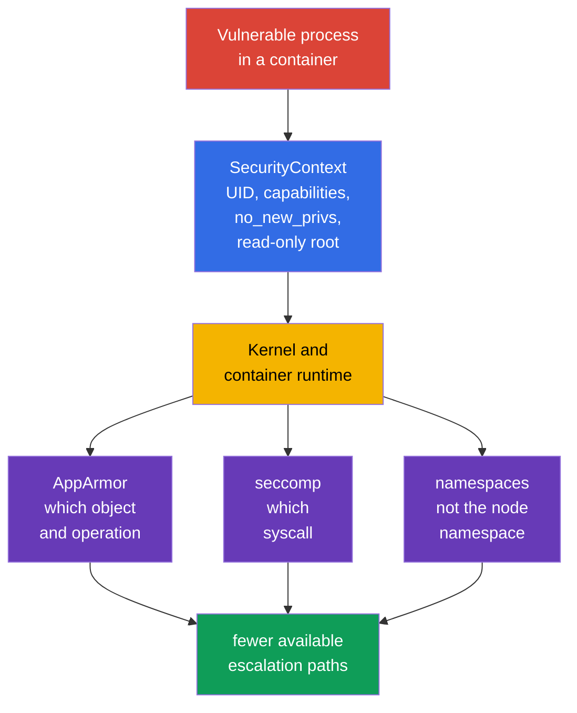
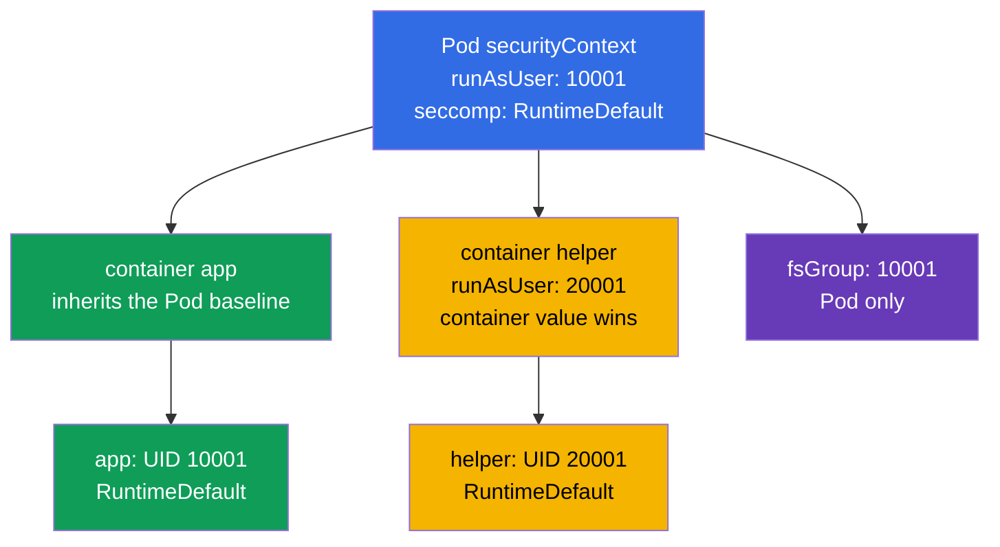
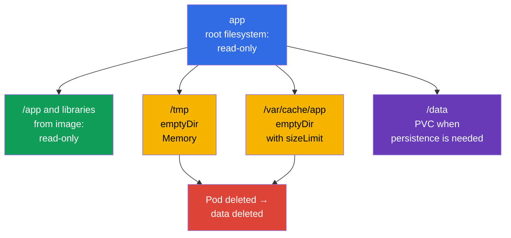

[Русская версия](ru.md) · [Versión en español](es.md) · [Version française](fr.md) · [Deutsche Version](de.md) · [ქართული ვერსია](ge.md) · [繁體中文版](tw.md) · [日本語版](jp.md)

# Chapter 18. Hardened SecurityContext: minimum process privileges

> **The problem.** An application vulnerability turns from a shell in one container into a node takeover
> or persistence if the process runs as root, retains capabilities, can elevate
> privileges, or can replace binaries in a writable root filesystem. Without one constraining
> contract, an insecure default in a Pod or sidecar expands the consequences of compromise;
> a hardened `SecurityContext` cuts off those extra paths in advance.

> **What comes next.** AppArmor limited the objects a process can access, and seccomp limited
> the system calls it can make. Now we combine these and basic process restrictions
> into one reproducible Pod contract: non-root, an empty capability set, no privilege
> escalation, a read-only root filesystem, and a seccomp profile. This is part of the official
> **Minimize Microservice Vulnerabilities (20%)** CKS domain: `SecurityContext` and Pod Security
> Standards. Cluster Setup relates to it indirectly:
> node kubelet and runtime must support and apply these settings. The aim is not to
> "set every true/false", but to give every container exactly the privileges it needs and prove it.

> **What you need from CKA.** `SecurityContext` fields, UID/GID, capabilities, and Pod/container levels
> are covered in [CKA chapter 20](../../../cka/course/20/README.md). Here they are used as a unified
> hardened baseline with `seccompProfile`, no `privileged` or host namespaces,
> writable `emptyDir`, and a check of effective state rather than YAML alone.

> 🧠 `SecurityContext` constrains process privileges, but does not eliminate image vulnerabilities, RBAC, network, or resource risks.

## 18.1. Model: protecting the process, not a "secure image"

A container isolates the filesystem and namespaces, but its process still accesses the kernel. If the
process is compromised, an extra UID 0, capability, writable root filesystem, or access to a node
namespace expands the consequences. `SecurityContext` passes specific process boundaries to the
runtime; it does not replace fixing image vulnerabilities, RBAC, NetworkPolicy, AppArmor, or
seccomp. It also does **not set** CPU, memory, or ephemeral-storage requests/limits and does not
protect against resource exhaustion/noisy neighbors: those are separate Pod fields and controls such as
`LimitRange`/`ResourceQuota`.



An important limitation: `runAsNonRoot: true` is a startup check, not a sandbox. A non-root process
with `CAP_SYS_ADMIN`, `privileged: true`, `hostPID: true`, or a writable `hostPath` can still
obtain a dangerous route to the node. Conversely, seccomp does not fix an application that writes a
secret to `/tmp`. Protection is built in layers.

| Boundary | What it reduces | What it does not guarantee |
|---|---|---|
| UID/GID and `runAsNonRoot` | consequences of running as root, permission errors | absence of Linux capabilities and host access |
| `capabilities.drop: ["ALL"]` | distinct kernel privileges | application and network security |
| `allowPrivilegeEscalation: false` | transition through setuid/setgid and file capabilities | absence of capabilities already granted |
| `readOnlyRootFilesystem: true` | writes to the writable rootfs layer, persistence, and binary replacement | no writes to volumes, `emptyDir`, and memory |
| `seccompProfile` | set of available syscalls | access to permitted files or API |
| no `privileged`, `host*`, `hostPath` | direct route to namespaces, devices, and node data | correct Kubernetes API authorization |

> 🎯 Baseline: non-root identity, `drop: ["ALL"]`, `allowPrivilegeEscalation: false`, a read-only root filesystem, `RuntimeDefault`, and narrow writable volumes.

## 18.2. Hardened baseline: one Pod, multiple boundaries

Below is a practical baseline for an HTTP application. It deliberately uses high port `8080`:
no `NET_BIND_SERVICE` capability is needed. The image must contain user UID `10001`
and be able to work with a read-only root filesystem. Do not substitute this with a blind `runAsUser`:
first verify that the program reads configuration and certificates and that its write directories are moved to
volumes.

```yaml
apiVersion: v1
kind: Pod
metadata:
  name: hardened-web
  labels:
    app: hardened-web
spec:
  automountServiceAccountToken: false
  securityContext:                         # shared Pod settings
    runAsNonRoot: true
    runAsUser: 10001
    runAsGroup: 10001
    fsGroup: 10001
    seccompProfile:
      type: RuntimeDefault
  containers:
  - name: app
    image: registry.example.invalid/web:1.4.2
    ports:
    - containerPort: 8080
    securityContext:                       # settings for app itself
      privileged: false
      allowPrivilegeEscalation: false
      readOnlyRootFilesystem: true
      capabilities:
        drop:
        - ALL
    volumeMounts:
    - name: tmp
      mountPath: /tmp
    - name: cache
      mountPath: /var/cache/web
  volumes:
  - name: tmp
    emptyDir:
      medium: Memory
      sizeLimit: 64Mi
  - name: cache
    emptyDir:
      sizeLimit: 256Mi
```

This is not a universal "paste and forget" manifest. `automountServiceAccountToken: false`
is appropriate only when the application does not need the Kubernetes API. If it needs a token,
create a separate ServiceAccount with minimal RBAC rather than restore the default token. `emptyDir.medium: Memory`
is fast, but consumes Pod/node memory and can cause OOM when full; for a disk cache,
normally retain the default filesystem and set a `sizeLimit`.

### What exactly protects here

- **`runAsNonRoot: true`** rejects startup when the effective UID is 0. Explicit
  `runAsUser: 10001` and `runAsGroup: 10001` prevent runtime dependence on an unclear image `USER`.
  The nonzero UID must have appropriate access to image files.
- **`capabilities.drop: ["ALL"]`** removes capabilities that the runtime might retain by
  default. Add an exception only after measuring a need. For example,
  `NET_BIND_SERVICE` is justified for a legacy process on port 80, but moving the
  application to 8080 and leaving the set empty is preferable.
- **`allowPrivilegeEscalation: false`** sets Linux `no_new_privs`: exec cannot obtain
  additional privileges through a setuid/setgid binary or file capabilities. It does not remove privileges
  already granted to the container and does not replace `drop: ALL`. Kubernetes makes this value effective
  `true` if the container is `privileged` or has `CAP_SYS_ADMIN`.
- **`readOnlyRootFilesystem: true`** makes the container's writable root filesystem unavailable
  for writes; image layers are immutable already. It does not restrict explicitly mounted volumes:
  they remain writable or read-only according to their mount options and permissions, so a
  writable mount must not be `hostPath`.
- **`seccompProfile.type: RuntimeDefault`** enables the default runtime profile for every
  Pod container. It excludes several rarely needed and risky syscalls, but compatibility must be
  tested with the real workload.
- **`fsGroup: 10001`** helps a non-root process get group access to supported
  volumes. It is a Pod setting, not a way to fix ownership of every image-layer file.

> 🎯 A container-level override acts only on that container; check capabilities, `privileged`, escalation, and read-only root filesystem on app, sidecar, and initContainer.

## 18.3. Field placement and level conflicts

`securityContext` exists at Pod level (`spec.securityContext`) and at the level of each
container (`spec.containers[].securityContext`, including init and ephemeral containers).
Not every field is permitted at both levels. For fields available in both places, the container
value takes precedence **for that container**. The Pod value remains the baseline for
neighboring containers.



| Field | Where to set it | Rule and practical conclusion |
|---|---|---|
| `runAsUser`, `runAsGroup`, `runAsNonRoot` | Pod and container | a container override affects only it; do not hide an exception in a sidecar |
| `seccompProfile` | Pod and container | a container profile override is stronger; set `RuntimeDefault` on the Pod and document every `Localhost` override |
| `fsGroup`, `fsGroupChangePolicy`, `supplementalGroups`, `supplementalGroupsPolicy` | Pod only | this is the context of the shared Pod and its volumes; container `fsGroup` does not exist |
| `capabilities`, `privileged`, `allowPrivilegeEscalation`, `readOnlyRootFilesystem` | container only | repeat hardened settings for **every** container and initContainer |
| `hostNetwork`, `hostPID`, `hostIPC`, `hostUsers` | Pod spec | this is not `securityContext`; a container cannot safely "override" host namespace access |

A conflict example is useful for diagnostics:

```yaml
spec:
  securityContext:
    runAsNonRoot: true
    runAsUser: 10001
    seccompProfile:
      type: RuntimeDefault
  containers:
  - name: app
    image: registry.example.invalid/app:1.4.2
    securityContext:
      runAsUser: 20001                 # effective app UID will be 20001
      seccompProfile:
        type: Localhost                 # not RuntimeDefault
        localhostProfile: profiles/app.json
```

Here `app` runs as UID `20001` and gets a node-local profile. `runAsNonRoot: true`
is inherited unless overridden. This is not itself an error, but `Localhost` requires
that the profile is already installed on **every** node where the Pod can land; otherwise the container
will not be created. Do not judge by only one `spec.securityContext`: inspect every container.

> 🔬 `Strict` disables implicit image groups and requires checking Kubernetes/CRI support and node behavior.

### `supplementalGroupsPolicy: Strict`: without implicit image groups

By default, `Merge` adds membership of the primary user from the image `/etc/group` to supplementary groups.
`Strict` does not merge this: only GID from `fsGroup`, `supplementalGroups`,
and `runAsGroup` remain. This is useful when a group declared in an image must not give the process
unexpected access to a volume.

```yaml
apiVersion: v1
kind: Pod
metadata:
  name: strict-groups
spec:
  securityContext:
    runAsUser: 1000
    runAsGroup: 3000
    fsGroup: 4000
    supplementalGroups: [5000]
    supplementalGroupsPolicy: Strict
  containers:
  - name: app
    image: registry.example.invalid/app:1.4.2
```

`supplementalGroupsPolicy` is GA/stable in Kubernetes v1.35 (lifecycle: alpha v1.31 → beta
v1.33 → GA v1.35), according to the official Kubernetes release blog. The
`SupplementalGroupsPolicy` feature gate is fixed as enabled by default. CRI support is still needed:
known support exists in containerd from v2.0 and CRI-O from v1.31. Check the node through `status.features.supplementalGroupsPolicy: true`. Starting with v1.33,
kubelet rejects a Pod with `Strict` on an unsupported node rather than silently applying `Merge`;
events will contain `SupplementalGroupsPolicyNotSupported`.

> 🔬 SELinux labels, `procMount`, sysctls, and Windows identity require checking Kubernetes, runtime, CSI, OS, and policy.

### Advanced: SELinux, `/proc`, sysctls, and Windows scope

These are fields of the same `SecurityContext`, but they are not the universal Linux baseline above.
`seLinuxOptions` on a Pod or container sets the process SELinux label; a container-level value
overrides the Pod-level value. During normal recursive SELinux relabeling, the **container runtime**
changes the inode label of volume content before the container uses it - not kubelet.
Pod-level `seLinuxChangePolicy: MountOption` requests relabeling through mount option
`-o context=`, but does not guarantee it by itself. For a PVC with an access mode other than
`ReadWriteOncePod`, Kubernetes v1.36 requires the `SELinuxMount` feature gate enabled (it is
disabled by default) and `CSIDriver.spec.seLinuxMount: true` in the CSI driver; otherwise Kubernetes
uses normal recursive relabeling. Do not change a label or policy for speed without testing
isolation and compatibility with the specific CSI/filesystem.

> 🔬 **Upstream v1.37.** In Kubernetes v1.37, `SELinuxMount` became GA and is enabled by default. Before upgrading an SELinux-enabled cluster, check volume-label conflicts; if necessary, a workload can explicitly keep recursive behavior with `spec.securityContext.seLinuxChangePolicy: Recursive`. Details: [Kubernetes v1.37 Security Delta](../APPENDIX_K8S_137_SECURITY_DELTA.md).

`procMount` is a container-level Linux option only: the safe `Default` keeps sensitive parts of
`/proc` masked; `Unmasked` expands process visibility and is unsuitable for restricted workloads.
Starting with Kubernetes v1.30, `Unmasked` is allowed only for a Pod in a user namespace,
that is, with `spec.hostUsers: false`. Pod-level `securityContext.sysctls` sets
sysctls for the Pod network/IPC namespace. Use only safe sysctls from the Kubernetes documentation;
unsafe sysctls require a kubelet allowlist and can conflict with host namespaces, so this is a conscious
node-level exception, not an application setting.

These Linux controls do not apply to Windows. Set the Windows-container identity with
`windowsOptions.runAsUserName` on the Pod or container (the container override takes precedence);
configure GMSA there if needed. Check the username, image, and Windows-node support separately:
Linux `runAsUser`/UID and SELinux do not substitute for `runAsUserName`.

> 🧠 Init, sidecar, and ephemeral containers have their own effective parameters; a weak container bypasses Pod hardening.

### Init, sidecar, and ephemeral containers - separate processes

`initContainers` run before the application, but can create files with unsuitable owner/mode
or require excessive privileges. For hardened workloads, use the same principle: explicit
non-root UID, drop all capabilities, no escalation, read-only root, and a separate writable volume
if needed. Do not run an initContainer as root solely for `chown -R`: it often masks an image error.
First try `fsGroup`, correct ownership in the image, or storage-class policy; a privileged exception
must be short, justified, and isolated.

An ephemeral container added through `kubectl debug` also does not automatically inherit the workload's
container security context. It is useful for controlled incident response, but must not become a bypass
of PSA or the hardened baseline: agree its image, identity, and admission policy, limit its lifetime,
and record the change. For permanent diagnostics, modify the Deployment template and create a new Pod,
instead of trying to modify the immutable `securityContext` of a running Pod.

> 🎯 Remove `privileged`, `hostPID`, `hostNetwork`, `hostIPC`, and broad `hostPath`: a non-root UID does not close these escape routes from the Pod boundary.

## 18.4. `privileged` and `host*`: dangerous Pod-boundary bypasses

Some settings give a process access not merely to its own Pod, but to node resources.
They can be needed by CNI, CSI, node monitoring, or a runtime agent, but are almost never needed
by an ordinary API, worker, or batch job. "The process is not root" does not make such access safe.

| Setting | What it opens | Why it is a risk | Safe alternative |
|---|---|---|---|
| `privileged: true` | almost all capabilities, devices, and weakened runtime isolation | container compromise is close to node compromise | an ordinary container with `drop: ALL`; add one capability only when the need is proven |
| `hostPID: true` | node processes in the PID namespace | host processes can be viewed/signaled and sensitive `/proc` data collected | metrics API, kubelet summary API, or a separate trusted node agent |
| `hostNetwork: true` | node network namespace, host ports, and its IP | bypasses Pod-network isolation, port conflicts, access to node localhost services | Service, Ingress, NetworkPolicy, and ordinary Pod networking |
| `hostIPC: true` | node IPC namespace | access to shared memory and IPC of host processes | volume, Service, or message queue with auth |
| `hostPath` volume | selected node filesystem path | reading kubelet credentials, container sockets, runtime state, or writing to host | PVC, ConfigMap, Secret, `emptyDir`; a narrow read-only path only for a trusted daemon |

`privileged: true` forcibly makes `allowPrivilegeEscalation` effective `true` and conflicts
with the hardened-workload goal. Such a container also gets seccomp `Unconfined`, ignores AppArmor,
and its SELinux context becomes `unconfined_t`. Do not try to "fix" this with a neighboring
`allowPrivilegeEscalation: false`: the container remains privileged. The same effective rule for
`allowPrivilegeEscalation` applies with `CAP_SYS_ADMIN`. Similarly, `hostNetwork: true` cannot
be made safe with NetworkPolicy alone, since NetworkPolicy is normally designed for ordinary Pod networking,
not the node network namespace.

```yaml
# Red flags for an ordinary application
spec:
  hostPID: true
  hostNetwork: true
  containers:
  - name: app
    securityContext:
      privileged: true
    volumeMounts:
    - name: host-root
      mountPath: /host
  volumes:
  - name: host-root
    hostPath:
      path: /
```

For an investigation, first find **why** the setting appeared: a Helm chart, injected
sidecar, initContainer, DaemonSet, or manual patch. Do not remove `host*` from a CNI/CSI/monitoring
DaemonSet without understanding its contract: you can break networking or storage across the cluster.
For ordinary workloads, replace access with a supported API/volume and test rollout in staging.

Quick audit of all Pods by namespace:

```bash
kubectl get pods -A -o json | jq -r '
  def allContainers: ((.spec.containers // []) + (.spec.initContainers // []) + (.spec.ephemeralContainers // []));
  .items[]
  | [allContainers[] | select(.securityContext.privileged == true) | .name] as $privileged
  | [(.spec.volumes // [])[] | select(.hostPath != null) | (.name + "=" + .hostPath.path)] as $hostPaths
  | select(.spec.hostPID == true or .spec.hostNetwork == true or .spec.hostIPC == true or ($privileged|length)>0 or ($hostPaths|length)>0)
  | [.metadata.namespace, .metadata.name,
     ("hostPID=" + ((.spec.hostPID // false)|tostring)),
     ("hostNetwork=" + ((.spec.hostNetwork // false)|tostring)),
     ("hostIPC=" + ((.spec.hostIPC // false)|tostring)),
     ("privileged=" + ($privileged|join(","))),
     ("hostPath=" + ($hostPaths|join(",")))] | @tsv'
```

The command shows candidates, not a verdict. A system namespace and DaemonSet require
contextual review: owner, purpose, node placement, minimal access, manifest, and
admission control.

> 🔬 UID/GID mapping and Linux, kernel, CRI/OCI runtime, and filesystem requirements for `hostUsers: false`.

### `hostUsers: false`: user namespaces in Kubernetes v1.36

In Kubernetes v1.36, user namespaces are stable. `hostUsers: false` asks kubelet to create a Pod
user namespace and select a non-overlapping UID/GID mapping: UID 0 or `runAsUser` inside
the container is mapped to an unprivileged node UID/GID. Capabilities apply only in
that namespace: for example, `CAP_SYS_ADMIN` grants no privileges outside that user namespace. This is an additional
barrier for a workload that needs root inside the container but does not need access to host
namespaces or node resources.

```yaml
apiVersion: v1
kind: Pod
metadata:
  name: userns-tool
spec:
  hostUsers: false
  containers:
  - name: tool
    image: registry.example.invalid/tool:1.4.2
    securityContext:
      allowPrivilegeEscalation: false
      capabilities:
        drop: ["ALL"]
```

This is Linux-only mode. By default, it cannot be combined with `hostNetwork`, `hostPID`, or
`hostIPC`, and raw block volumes through `volumeDevices` are also prohibited. In v1.36, the
`UserNamespacesHostNetworkSupport` alpha gate (default `false`) separately permits `hostNetwork: true`
with `hostUsers: false`; `hostPID` and `hostIPC` remain prohibited. A hardened baseline must not rely
on this alpha exception: that combination requires an explicit gate, separate review, and threat-model
validation. Idmapped mounts are required on the node filesystem
and all volumes, with a supporting CRI/OCI runtime and compatible kernel; current documentation
lists containerd v2.0+, CRI-O v1.25+, runc v1.2+, or crun v1.9+. NFS does not support
idmapped mounts. Before rollout, verify these conditions on every node where the Pod can land.

> 🎯 When a write fails, identify the path and add the smallest `emptyDir` or PVC with appropriate permissions and lifecycle.

## 18.5. A read-only root filesystem without breaking the application

`readOnlyRootFilesystem: true` exposes implicit writes: PID files, temporary files,
cache, generated config, logs, or package-manager data. The solution is not to remove the
restriction, but to explicitly describe every writable path and its lifecycle.



`emptyDir` is created for a Pod on the node and shared by its containers. It survives a
container restart in the same Pod but disappears when the Pod is deleted/recreated; it is not storage
for data that must be recovered. `sizeLimit` limits the expected volume only, but does not replace
requests/limits and node ephemeral-storage monitoring.

Example for a program that needs `/tmp`, a runtime directory, and cache:

```yaml
spec:
  securityContext:
    runAsNonRoot: true
    runAsUser: 10001
    runAsGroup: 10001
    fsGroup: 10001
    seccompProfile:
      type: RuntimeDefault
  containers:
  - name: app
    image: registry.example.invalid/reporter:2.1.0
    securityContext:
      allowPrivilegeEscalation: false
      readOnlyRootFilesystem: true
      capabilities:
        drop: ["ALL"]
    volumeMounts:
    - name: tmp
      mountPath: /tmp
    - name: run
      mountPath: /var/run/reporter
    - name: cache
      mountPath: /var/cache/reporter
  volumes:
  - name: tmp
    emptyDir:
      medium: Memory
      sizeLimit: 32Mi
  - name: run
    emptyDir:
      sizeLimit: 8Mi
  - name: cache
    emptyDir:
      sizeLimit: 128Mi
```

Do not mount `emptyDir` over `/` and do not make a broad writable mount such as `/var` without
an application contract: doing so hides writes you wanted to control. Targeted paths better
show exactly what is permitted. Logs normally go to stdout/stderr; a file in `emptyDir` is justified
only when required by the application or a local sidecar.

### Debugging without removing hardening

`Read-only file system` is a useful symptom. First identify the path, then decide whether it is
temporary, cache, or data. Do not treat an incident by adding `privileged: true` or writing to
`hostPath`.

```bash
# Events and the cause of CreateContainerConfigError/CrashLoopBackOff
kubectl describe pod hardened-web
kubectl logs hardened-web -c app --previous

# Only with authorized exec: check mounts and file permissions inside the app
kubectl exec hardened-web -c app -- id
kubectl exec hardened-web -c app -- sh -c 'mount | grep -E " /tmp |/var/cache/web"'
kubectl exec hardened-web -c app -- sh -c 'touch /tmp/probe && rm /tmp/probe'

# Compare actual volumeMounts with the workload template
kubectl get pod hardened-web -o yaml
```

If the application needs a shell tool, do not add it to the production image "for debugging" and do
not make the root filesystem writable. Prefer logs, metrics, traces, a temporary hardened debug
Pod with explicit NetworkPolicy, or an agreed ephemeral-container procedure. After diagnosis, delete the
debug artifact and add a minimal `emptyDir` mount to the template if the write is really part of the contract.

> 🎯 Use `RuntimeDefault` and prove its effect through `/proc/1/status`; `Localhost` requires profile delivery to every eligible node.

## 18.6. Seccomp in the baseline: RuntimeDefault, Localhost, and proof

`seccompProfile` defines the kernel reaction to system calls. For a normal workload, use
`RuntimeDefault`: the runtime applies its supported profile. `Unconfined` removes this
boundary and is unsuitable for a hardened baseline. `Localhost` is needed only when the team owns
the profile, delivers it to every suitable node, and tests runtime upgrades.

| Type | When to use it | Operational risk |
|---|---|---|
| `RuntimeDefault` | baseline for almost all applications | profile depends on runtime and version; test upgrades |
| `Localhost` | narrow syscall contract delivered by node configuration management | a missing file on one node causes container-creation failure |
| `Unconfined` | short diagnostic exception with explicit approval | no syscall boundary; the exception easily becomes permanent |

```yaml
# Pod baseline: all containers inherit it when no container override is set
spec:
  securityContext:
    seccompProfile:
      type: RuntimeDefault
```

For `Localhost`, the path is relative to the kubelet seccomp directory, not the container
filesystem. Do not copy a JSON profile into a ConfigMap and expect kubelet to see it. Deliver the
profile to nodes through a trusted method, pin scheduling to nodes where it exists, and prove
effective application. The detailed model and syscall-denial troubleshooting are in
[chapter 17](../17/README.md).

Checking from inside the process Linux namespace:

```bash
kubectl exec hardened-web -c app -- sh -c 'grep -E "^(NoNewPrivs|Seccomp):" /proc/1/status'
# Expected: NoNewPrivs: 1 and Seccomp: 2 (filter) for a typical RuntimeDefault runtime
```

`Seccomp: 2` proves a filter is enabled for PID 1, but does not prove that the required syscall is
blocked by your intended profile. For `Localhost`, add a controlled negative
test, expect `EPERM`/`Operation not permitted`, and check the node/runtime log. Do not turn a real
exploit into a test: test a safe forbidden syscall in an isolated environment.

> 🎯 Check intent in the template, admission/startup, and the process's effective state; `kubectl apply` does not prove UID, capabilities, seccomp, or write denial.

## 18.7. Verification: manifest, effective state, and negative scenarios

Verification consists of three distinct questions:

1. **Intent:** the Deployment/Pod template contains the required fields.
2. **Admission and startup:** the Pod is accepted, created on the expected node, and the container is
   actually Running; events show no UID/profile/volume-ownership conflict.
3. **Runtime effect:** the process has a non-root UID, an empty capability set, `NoNewPrivs`,
   a seccomp filter, and only expected writable mount points.

Checking only `kubectl apply` is insufficient: the API can accept an object, then kubelet can encounter
`CreateContainerConfigError`, the image can fail for lack of permission, or the container can have
a container-level override.

### 1. Compare the template and all containers

```bash
# Declarative intent of the current training Pod.
kubectl get pod hardened-web -o yaml
# In production, the source of truth for a managed workload is its controller template:
# kubectl get deploy <deployment-name> -o yaml

# Pod-level context and the context of every regular/init container
kubectl get pod hardened-web -o jsonpath='{.spec.securityContext}{"\n"}'
kubectl get pod hardened-web -o jsonpath='{range .spec.containers[*]}{.name}{": "}{.securityContext}{"\n"}{end}'
kubectl get pod hardened-web -o jsonpath='{range .spec.initContainers[*]}{.name}{": "}{.securityContext}{"\n"}{end}'

# Host namespaces and privileged flag must be searched separately
kubectl get pod hardened-web -o jsonpath='{.spec.hostPID}{" "}{.spec.hostNetwork}{" "}{.spec.hostIPC}{"\n"}'
kubectl get pod hardened-web -o json | jq '
  ((.spec.containers // []) + (.spec.initContainers // []) + (.spec.ephemeralContainers // []))
  | .[] | {name, privileged: (.securityContext.privileged // false)}'
```

JSONPath shows declared configuration. For an absent boolean field, empty output does not
equal `false`: audit requirements must be explicit rather than rely on a default.
Also check `initContainers`, injected service-mesh/observability sidecars, and ephemeral
containers: one weak container shares the network and volumes of the same Pod.

### 2. Verify startup and effective identity

```bash
kubectl wait --for=condition=Ready pod/hardened-web --timeout=90s
kubectl describe pod hardened-web

kubectl exec hardened-web -c app -- id
# Expected: uid=10001(...) gid=10001(...) and no uid=0

kubectl exec hardened-web -c app -- sh -c 'grep -E "^(Cap(Inh|Prm|Eff|Bnd|Amb)|NoNewPrivs|Seccomp):" /proc/1/status'
```

In `/proc/1/status`, effective capabilities for `drop: ALL` must be zero. The
`NoNewPrivs: 1` field confirms escalation denial. `Seccomp: 2` normally means a filter, but
inspect the real runtime and do not replace verification with interpreting one number. If the image
does not contain `sh`, use an authorized diagnostic image/ephemeral procedure or inspect state
through node/runtime tools with access control.

### 3. Negative checks and typical results

| Check | Expected result | If the result differs |
|---|---|---|
| `id -u` in app | not `0` | image/override starts root; check Pod and container contexts |
| write to `/` | `Read-only file system` | root filesystem is not read-only or write reached a broad mount |
| write to `/tmp` | succeeds in the dedicated `emptyDir` | no mount, wrong UID/GID, or `fsGroup` unsupported by volume driver |
| setuid-escalation attempt | no new privileges, `NoNewPrivs: 1` | `allowPrivilegeEscalation` absent/true, container privileged, has `CAP_SYS_ADMIN`, or wrong runtime policy |
| unsafe syscall in a test Pod | seccomp denial | profile not applied, test uses the wrong syscall, or a different container ran |
| Pod with `privileged: true` in a restricted namespace | admission reject | PSA/policy is not enforce or namespace has an exception |

A negative write test in `/` must not modify the application. Use a separate smoke-test Pod or a
harmless path, after excluding a volume mount. In production, first test an observed copy of the workload:
tests must not accidentally fill `emptyDir`, remove cache, or trigger a restart.

## 18.8. Common failures and safe remediation

| Symptom | Likely cause | Remediation |
|---|---|---|
| `container has runAsNonRoot and image will run as root` | image has no non-root USER and UID is not set | build the image with a non-root USER or explicitly set a verified nonzero UID |
| `Permission denied` on a mounted volume | UID/GID do not match, `fsGroup` was not applied by the driver | check ownership, storage driver, and `fsGroup`; do not use blanket `chmod 777` |
| `Read-only file system` | app writes PID/cache/temp in the image layer | add a narrow `emptyDir` or PVC exactly at the required path |
| Pod is not created with `Localhost` seccomp | profile is absent on the selected node | deliver the profile and restrict placement, or return to `RuntimeDefault` |
| port 80 does not open | non-root and no `NET_BIND_SERVICE` | listen on a high port and set Service `targetPort`; a capability is only a justified exception |
| sidecar breaks after hardening | SecurityContext is set only on app or sidecar writes to the root filesystem | a hardened context and explicit writable volumes are needed for every container |
| PSA rejects the Pod | prohibited setting (`privileged`, host namespace, `Unconfined`) | remove the bypass; create an exception separately, minimally, and temporarily |

Do not copy secrets into writable `emptyDir` if the application can read them from a mounted Secret. If a
program must transform a certificate/configuration, make a separate small writable volume, minimize its
lifetime and permissions, and do not mix it with shared cache. `readOnlyRootFilesystem` does not protect
volume contents from another container in the same Pod that also mounts that volume.

> 🏭 Versioned templates, inventory, image remediation, canary, runtime tests, admission guardrails, and documented exceptions.

## 18.9. Phased rollout of the hardened baseline

Implement the baseline in a Deployment/StatefulSet/Job template and Helm chart, not manually in a
created Pod. The `securityContext` of most running Pods is immutable: release a correct change through a
new ReplicaSet/Pod and observe rollout.

1. Inventory processes, writable paths, low ports, volume ownership, syscall/profile
   requirements, and current `privileged`/`host*` exceptions.
2. Fix the image: non-root `USER`, files readable by the required UID/GID, application writes to
   documented directories rather than `/`.
3. Add the Pod baseline: `runAsNonRoot`, explicit nonzero UID/GID, `RuntimeDefault` seccomp,
   and `fsGroup` if needed.
4. Add a container baseline **for all** app/init/sidecar containers: `drop: ["ALL"]`,
   `allowPrivilegeEscalation: false`, `readOnlyRootFilesystem: true`, `privileged: false`.
5. Move required writable paths to narrow `emptyDir`/PVC mount points with `sizeLimit` and
   requests/limits; remove the unused ServiceAccount token.
6. Run readiness, functional, and negative tests, then inspect effective `/proc` and mounts.
7. Enable an admission guardrail (Pod Security Admission restricted and/or a policy engine) so the
   next chart version cannot restore a privileged/host namespace or `Unconfined`.
8. Document and regularly review every exception: owner, reason, scope,
   expiration, required capability/profile, and test evidence.

## 18.10. Self-check questions

<details>
<summary>1. Why does `runAsNonRoot: true` not make a Pod with `privileged: true` secure?</summary>

`runAsNonRoot` checks the effective UID at startup, but is not a sandbox. `privileged: true` grants
almost all capabilities and device access, makes seccomp effective `Unconfined`, and AppArmor is
ignored. A non-root process with that access still has dangerous routes to the node.
</details>

<details>
<summary>2. Which container securityContext fields must be set separately for an initContainer and sidecar?</summary>

Set `capabilities.drop: ["ALL"]`, `allowPrivilegeEscalation: false`, `readOnlyRootFilesystem: true`,
and, when necessary, `privileged: false` separately on every app, sidecar, and initContainer.
Pod-level `runAsNonRoot`, UID/GID, and `seccompProfile` provide a baseline, but a container can
override it. Therefore check all container lists, including injected sidecars.
</details>

<details>
<summary>3. What is a container's effective UID when the Pod sets `runAsUser: 10001` and the container sets `runAsUser: 20001`?</summary>

That container's effective UID is `20001`. For fields available at both levels, the container-level
value takes precedence only for that container. Pod-level `10001` remains the baseline for neighboring
containers without an override.
</details>

<details>
<summary>4. Why cannot `fsGroup` be considered a mechanism to fix permissions of all image-layer files?</summary>

`fsGroup` is a Pod setting that helps with group access to supported volumes. It is not intended to
change the owner of every image-layer file and does not replace correct ownership and UID in the image.
For writable paths, explicitly select a volume and verify storage-driver support as well.
</details>

<details>
<summary>5. How does `RuntimeDefault` differ operationally from a `Localhost` seccomp profile?</summary>

`RuntimeDefault` uses a supported runtime profile and suits almost every workload as a baseline.
`Localhost` refers to JSON that trusted automation delivers in advance to every eligible node under the
kubelet seccomp root. Absence of the file on a selected node causes container-creation failure, so
versioning, placement, and runtime compatibility are required.
</details>

<details>
<summary>6. What data survives a container restart but disappears when a Pod with `emptyDir` is deleted?</summary>

`emptyDir` contents survive a container restart within the same Pod. When the Pod is deleted or
recreated, the volume disappears with its data. It is therefore suitable for `/tmp`, a runtime directory,
and cache, but not data that must be recovered.
</details>

<details>
<summary>7. Why does `allowPrivilegeEscalation: false` not replace `capabilities.drop: ["ALL"]`?</summary>

`allowPrivilegeEscalation: false` enables `no_new_privs` and prevents obtaining additional privileges through a
setuid/setgid binary or file capabilities. It does not remove capabilities already granted to the
container. Therefore, the baseline separately removes the starting set using `drop: ["ALL"]`.
</details>

<details>
<summary>8. Which three independent checks are needed to prove hardening after `kubectl apply`?</summary>

First check intent: the security context in the template and on all containers. Then confirm admission
and startup: the Pod is Ready and events show no UID, profile, or volume conflict. Finally verify the
runtime effect: a non-root UID, zero capabilities, `NoNewPrivs`, seccomp, and only expected writable
mounts, including negative scenarios.
</details>

<details>
<summary>9. Why do `hostNetwork` and `hostPID` require review even with a non-root UID?</summary>

`hostPID` exposes node processes and sensitive `/proc` data, while `hostNetwork` provides the node
network namespace, IP, host ports, and localhost services. This access to host resources is not removed
by one non-root UID. For an ordinary workload, this chapter recommends a Service, ordinary Pod networking,
NetworkPolicy, or a supported API instead of a host namespace.
</details>

<details>
<summary>10. **Flashback (chapter 10).** PSA acts through namespace labels, which can be set when
creating the object rather than only through a separate `patch`. Chapter 10 describes RBAC control for
**changing** labels on an existing namespace (`patch` labels on a `Namespace`), but not for
**creating** a namespace. Why is RBAC restricting only the `create` verb on `namespaces` insufficient
to guarantee that a new namespace receives `enforce=restricted`, and which mechanism (RBAC or
admission level) is actually needed to close this specific PSA-bypass route?</summary>

RBAC `create namespaces` determines whether an identity can create the object, but does not validate
required metadata labels in the new request. A user with that permission can create a namespace without
`pod-security.kubernetes.io/enforce=restricted`, and PSA then uses default configuration, which need
not be restricted. An admission-level policy is needed, for example a ValidatingAdmissionPolicy or
policy engine requiring the labels at CREATE; RBAC remains an additional restriction on who can create
namespaces.
</details>

> 🏭 Shared chart/template and CI/admission policy; an exception has a scope, owner, reason, review date, and evidence.

## 18.11. How this is applied in production

A team defines the baseline in a shared Helm chart or library template instead of copying it
between manifests. Each deviation has a record: owner, reason, scope,
review date, and a test confirming its necessity. In CI, it is useful to check rendered
manifests for `privileged`, `host*`, `hostPath`, `Unconfined`, and absent required fields;
in the cluster, complement that check with Pod Security Admission or a policy engine.

Adopt it in stages: first run a workload with observable logs and metrics in
staging, then enable restrictions for one replica or a canary and watch rollout, startup
errors, and ephemeral-storage consumption. Once the contract is confirmed, move changes into the
workload template. Isolate node agents that genuinely need host access or special
capabilities from application namespaces and review them separately.

## 18.12. Mini-glossary

| Term | Short meaning |
|---|---|
| **SecurityContext** | Kubernetes fields that set the identity and restrictions of a process or Pod. |
| **capability** | A distinct Linux privilege; `drop: ["ALL"]` removes the starting set. |
| **no_new_privs** | Kernel flag preventing additional privileges through `exec`; set by `allowPrivilegeEscalation: false`. |
| **read-only root filesystem** | The container root filesystem is mounted read-only; writes to the writable rootfs layer are denied, while permitted writes move to volumes. |
| **seccomp** | Process syscall filter; `RuntimeDefault` is the supported runtime baseline. |
| **effective state** | The actual UID, capabilities, mounts, and seccomp of a process after startup, rather than manifest fields alone. |
| **host namespace** | A node namespace that a Pod can share through `hostPID`, `hostNetwork`, or `hostIPC`. |

## 18.13. Chapter summary

1. Process hardening requires a combination of non-root identity, an empty capability set,
   no escalation, a read-only root filesystem, and seccomp, not one field.
2. Pod-level and container-level settings have different scopes; every app, sidecar, and
   initContainer must be checked separately.
3. `privileged`, `host*`, and `hostPath` are exceptions with risk to the node, not convenient
   application defaults.
4. Writable paths must be explicit, narrow, and supplied with suitable volume, ownership, and
   limits.
5. Proving hardening includes template intent, successful startup, and runtime process checks
   with negative scenarios.

## 18.14. How this helps: on the exam and in real work

**On the exam.** First identify the level of each field: set `fsGroup` for the Pod, while
capabilities and `allowPrivilegeEscalation` are for a container. Fix the manifest through the
controller or recreate the Pod, then confirm the result with `kubectl describe`, `id`,
`/proc/1/status`, and a writable-`emptyDir` check. For seccomp, distinguish `RuntimeDefault` from
`Localhost`: the latter requires a profile on the node.

**In real work.** The same order turns hardening into a repeatable process: the secure
baseline lives in a template, admission prevents regression, and rollout and runtime signals
show incompatibilities. Every exception gets a minimal scope, an owner, and a review date, so a
temporary concession does not become a permanent vulnerability.

## Practice

Practice the hardened template in [CKA lab 107](../../../cka/labs/107/README.MD):
use `emptyDir` as explicitly described ephemeral writable storage and check the result with
`check_result`. Then, on a separate test workload, add the baseline from this chapter: a non-root UID,
`drop: ["ALL"]`, `allowPrivilegeEscalation: false`, a read-only root filesystem, `emptyDir`
for `/tmp`, and `RuntimeDefault`. Prove `id`, `NoNewPrivs`, `Seccomp`, mount points, and
the expected write denial in root. For detailed syscall-policy diagnostics, return to
[chapter 17](../17/README.md).

🧪 Lab 107 (multi-container Pod, `emptyDir`, and writable-path debugging):
[tasks/cka/labs/107](../../../cka/labs/107/README.MD)

🌐 Additional interactive practice (killer.sh/killercoda, external resource): [privileged-containers](https://killercoda.com/killer-shell-cks/scenario/privileged-containers) · [privilege-escalation-containers](https://killercoda.com/killer-shell-cks/scenario/privilege-escalation-containers)

## Reference materials

- [Kubernetes: Configure a Security Context for a Pod or Container](https://kubernetes.io/docs/tasks/configure-pod-container/security-context/)
- [Kubernetes: Pod Security Standards](https://kubernetes.io/docs/concepts/security/pod-security-standards/)
- [Kubernetes: Restrict a Container's Syscalls with seccomp](https://kubernetes.io/docs/tutorials/security/seccomp/)
- [Kubernetes: Volumes - emptyDir](https://kubernetes.io/docs/concepts/storage/volumes/#emptydir)
- [Kubernetes: Linux kernel security constraints](https://kubernetes.io/docs/concepts/security/linux-kernel-security-constraints/)
- [Kubernetes: User Namespaces](https://kubernetes.io/docs/concepts/workloads/pods/user-namespaces/)

---
[Contents](../README.md) · [Chapter 17](../17/README.md) · [Chapter 19](../19/README.md)
