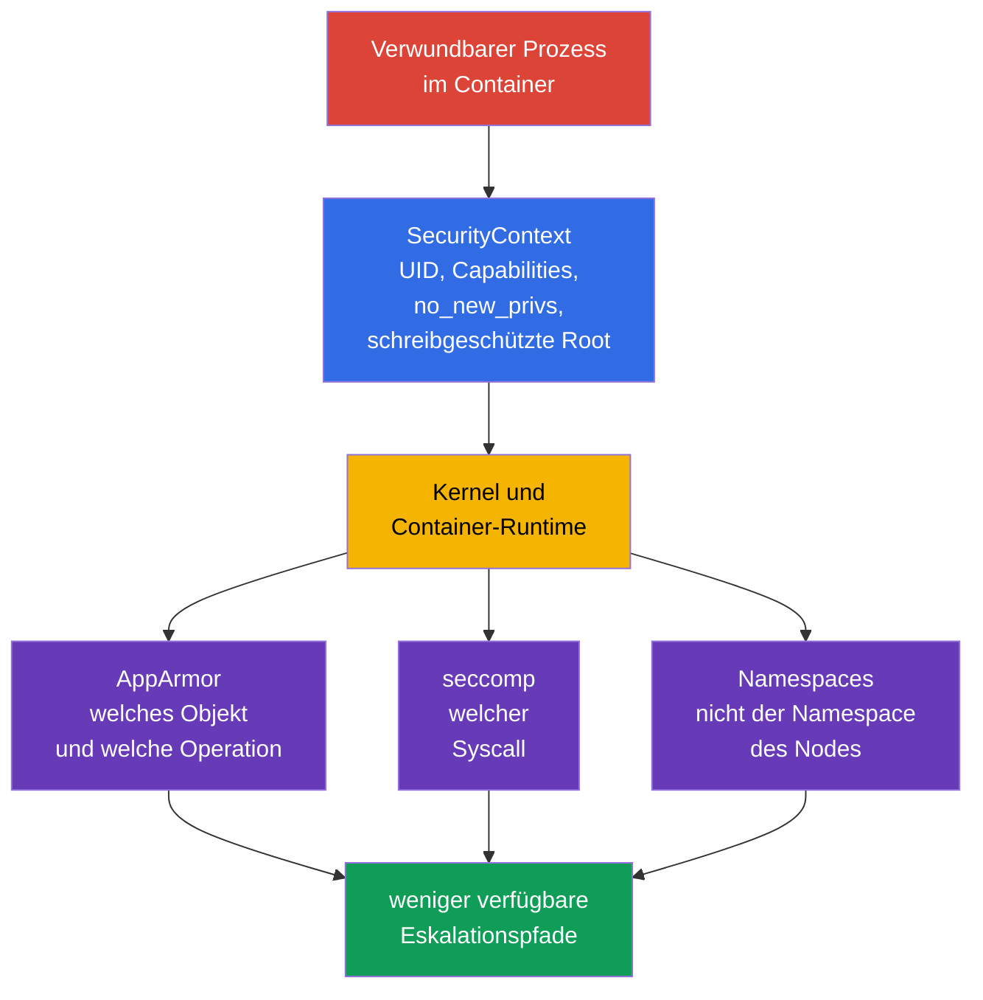
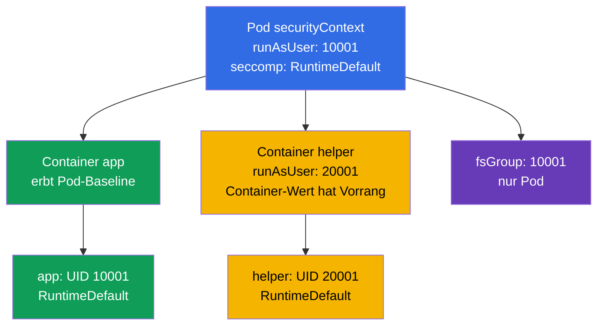
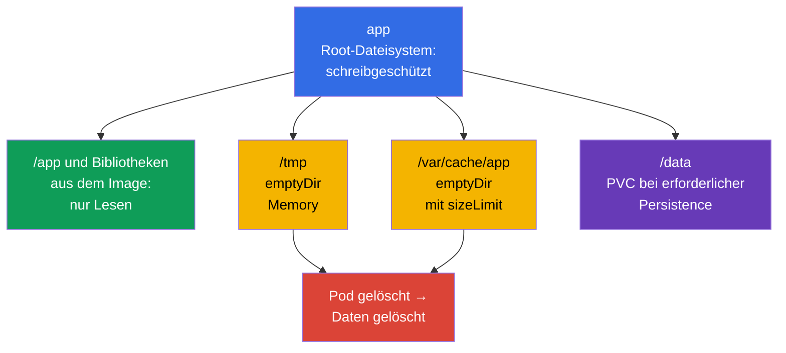

[Русская версия](ru.md) · [Eng version](README.md) · [Versión en español](es.md) · [Version française](fr.md) · [ქართული ვერსია](ge.md) · [繁體中文版](tw.md) · [日本語版](jp.md)

# Kapitel 18. Gehärteter SecurityContext: minimale Prozessprivilegien

> **Das Problem.** Eine Schwachstelle in einer Anwendung wird aus einer Shell in einem Container zur Übernahme
> eines Nodes oder zu Persistence, wenn der Prozess als root läuft, Capabilities behält, seine
> Privilegien erhöhen oder Binärdateien in einem beschreibbaren Root-Dateisystem ersetzen kann. Ohne einen einheitlichen
> restriktiven Vertrag erweitert ein unsicherer Default in einem Pod oder Sidecar die Folgen einer Kompromittierung;
> ein gehärteter `SecurityContext` schneidet diese zusätzlichen Wege im Voraus ab.

> **Was kommt als Nächstes.** AppArmor hat eingeschränkt, auf welche Objekte ein Prozess zugreifen kann, und seccomp -
> welche System Calls er ausführen kann. Nun bündeln wir diese und die grundlegenden Prozessbeschränkungen
> in einem reproduzierbaren Pod-Vertrag: non-root, ein leerer Satz an Capabilities, keine
> Privilegienerhöhung, ein schreibgeschütztes Root-Dateisystem und ein seccomp-Profil. Dies ist Material der offiziellen
> CKS-Domain **Minimize Microservice Vulnerabilities (20%)**: `SecurityContext` und Pod Security
> Standards. Cluster Setup gehört indirekt dazu:
> kubelet und die Runtime der Nodes müssen diese Einstellungen unterstützen und anwenden. Das Ziel ist nicht,
> „alle true/false zu setzen“,
> sondern jedem Container genau die erforderlichen Rechte zu geben und dies nachweisen zu können.

> **Was Sie aus CKA benötigen.** Die Felder `SecurityContext`, UID/GID, Capabilities und Pod-/Container-Ebenen
> werden in [CKA-Kapitel 20](../../../cka/course/20/de.md) behandelt. Hier werden sie als einheitliche
> gehärtete Baseline zusammen mit `seccompProfile`, dem Verzicht auf `privileged` und Host-Namespaces,
> beschreibbarem `emptyDir` und der Prüfung des effektiven Zustands eingesetzt, nicht nur des YAML.

> 🧠 `SecurityContext` beschränkt die Rechte des Prozesses, beseitigt aber keine Schwachstellen des Images, in RBAC, im Netzwerk oder bei Ressourcen.

## 18.1. Modell: den Prozess schützen, nicht ein „sicheres Image“

Ein Container isoliert Dateisystem und Namespaces, doch sein Prozess greift weiterhin auf den Kernel zu. Wird der
Prozess kompromittiert, erweitern eine zusätzliche UID 0, eine Capability, ein beschreibbares Root-Dateisystem oder Zugriff auf
einen Node-Namespace die Folgen. `SecurityContext` übergibt der Runtime konkrete Prozessgrenzen;
er ersetzt weder die Behebung von Image-Schwachstellen noch RBAC, NetworkPolicy, AppArmor oder
seccomp. Er legt auch **nicht** CPU-, Memory- oder Ephemeral-Storage-Requests/Limits fest und
schützt nicht vor Resource Exhaustion/Noisy Neighbors: Dies sind eigene Pod-Felder und Controls wie
`LimitRange`/`ResourceQuota`.



Wichtige Einschränkung: `runAsNonRoot: true` ist eine Startprüfung, keine Sandbox. Ein Non-root-Prozess
mit `CAP_SYS_ADMIN`, `privileged: true`, `hostPID: true` oder einem beschreibbaren `hostPath` kann weiterhin
einen gefährlichen Weg zum Node erhalten. Umgekehrt behebt seccomp keine Anwendung, die ein
Secret nach `/tmp` schreibt. Schutz wird schichtweise aufgebaut.

| Grenze | Was sie reduziert | Was sie nicht garantiert |
|---|---|---|
| UID/GID und `runAsNonRoot` | Folgen der Ausführung als root, Fehler bei Zugriffsrechten | Fehlen von Linux Capabilities und Host-Zugriff |
| `capabilities.drop: ["ALL"]` | einzelne Kernel-Privilegien | Sicherheit der Anwendung und des Netzwerks |
| `allowPrivilegeEscalation: false` | Übergang über setuid/setgid und File Capabilities | Fehlen bereits gewährter Capabilities |
| `readOnlyRootFilesystem: true` | Schreiben in die beschreibbare Rootfs-Schicht, Persistence und Ersetzen von Binärdateien | Verbot des Schreibens in Volumes, `emptyDir` und Memory |
| `seccompProfile` | Satz verfügbarer Syscalls | Zugriff auf erlaubte Dateien oder APIs |
| kein `privileged`, `host*`, `hostPath` | direkter Weg zu Namespaces, Geräten und Node-Daten | korrekte Autorisierung der Kubernetes API |

> 🎯 Baseline: Non-root-Identity, `drop: ["ALL"]`, `allowPrivilegeEscalation: false`, schreibgeschütztes Root-Dateisystem, `RuntimeDefault` und eng begrenzte beschreibbare Volumes.

## 18.2. Gehärtete Baseline: ein Pod, mehrere Grenzen

Nachfolgend eine praktische Baseline für eine HTTP-Anwendung. Sie verwendet absichtlich den hohen Port `8080`:
Dadurch wird keine Capability `NET_BIND_SERVICE` benötigt. Das Image muss den Benutzer mit UID `10001` enthalten
und mit einem schreibgeschützten Root-Dateisystem arbeiten können. Ersetzen Sie dies nicht durch ein blindes `runAsUser`:
Prüfen Sie zuerst, dass das Programm Konfiguration und Zertifikate liest und seine beschreibbaren Verzeichnisse in
Volumes ausgelagert sind.

```yaml
apiVersion: v1
kind: Pod
metadata:
  name: hardened-web
  labels:
    app: hardened-web
spec:
  automountServiceAccountToken: false
  securityContext:                         # gemeinsame Pod-Einstellungen
    runAsNonRoot: true
    runAsUser: 10001
    runAsGroup: 10001
    fsGroup: 10001
    seccompProfile:
      type: RuntimeDefault
  containers:
  - name: app
    image: registry.example.invalid/web:1.4.2
    ports:
    - containerPort: 8080
    securityContext:                       # Einstellungen speziell für app
      privileged: false
      allowPrivilegeEscalation: false
      readOnlyRootFilesystem: true
      capabilities:
        drop:
        - ALL
    volumeMounts:
    - name: tmp
      mountPath: /tmp
    - name: cache
      mountPath: /var/cache/web
  volumes:
  - name: tmp
    emptyDir:
      medium: Memory
      sizeLimit: 64Mi
  - name: cache
    emptyDir:
      sizeLimit: 256Mi
```

Dies ist kein universelles Manifest zum „Einfügen und Vergessen“. `automountServiceAccountToken: false`
ist nur passend, wenn die Anwendung keine Kubernetes API benötigt. Wird ein Token benötigt, erstellen Sie
einen separaten ServiceAccount und minimales RBAC, statt den Default-Token zurückzugeben. `emptyDir.medium: Memory`
ist schnell, verbraucht aber Memory des Pod/Nodes und kann beim Füllen zu OOM führen; für einen Disk-Cache
lässt man normalerweise das Default-Dateisystem und setzt ein `sizeLimit`.

### Was hier genau schützt

- **`runAsNonRoot: true`** lehnt den Start ab, wenn die effektive UID 0 ist. Explizite
  `runAsUser: 10001` und `runAsGroup: 10001` verhindern, dass die Runtime von einem unklaren `USER` im Image abhängt.
  Die von null verschiedene UID muss den verfügbaren Rechten auf die Dateien des Images entsprechen.
- **`capabilities.drop: ["ALL"]`** entfernt Capabilities, die die Runtime standardmäßig belassen
  könnte. Fügen Sie eine Ausnahme nur nach einem messbaren Bedarf hinzu. Beispielsweise ist
  `NET_BIND_SERVICE` für einen Legacy-Prozess auf Port 80 begründbar, besser ist jedoch, die
  Anwendung auf 8080 umzustellen und den Satz leer zu lassen.
- **`allowPrivilegeEscalation: false`** setzt Linux `no_new_privs`: exec kann über eine
  setuid/setgid-Binärdatei oder File Capabilities keine weiteren Rechte erhalten. Dies entzieht keine Rechte,
  die dem Container bereits gewährt wurden, und ersetzt nicht `drop: ALL`. Kubernetes macht diesen Wert effektiv
  `true`, wenn der Container `privileged` ist oder `CAP_SYS_ADMIN` hat.
- **`readOnlyRootFilesystem: true`** macht das beschreibbare Root-Dateisystem des Containers
  nicht beschreibbar; Image-Layer sind ohnehin immutable. Dies beschränkt keine explizit gemounteten Volumes:
  Sie bleiben gemäß ihren Mount-Optionen und Permissions beschreibbar oder schreibgeschützt, daher
  darf ein beschreibbarer Mount kein `hostPath` sein.
- **`seccompProfile.type: RuntimeDefault`** aktiviert das Runtime-Default-Profil für alle
  Container des Pods. Es schneidet eine Reihe selten benötigter und riskanter Syscalls ab, die Kompatibilität
  wird jedoch unter echter Last geprüft.
- **`fsGroup: 10001`** hilft dem Non-root-Prozess, Gruppenzugriff auf unterstützte
  Volumes zu erhalten. Dies ist eine Pod-Einstellung, keine Methode, den Owner jeder Datei im Image-Layer zu korrigieren.

> 🎯 Ein Override auf Container-Ebene gilt nur für diesen Container; prüfen Sie Capabilities, `privileged`, Escalation und schreibgeschütztes Root-Dateisystem bei app, Sidecar und initContainer.

## 18.3. Feldplatzierung und Konflikte zwischen Ebenen

`securityContext` gibt es auf Pod-Ebene (`spec.securityContext`) und auf Ebene jedes
Containers (`spec.containers[].securityContext` sowie init- und Ephemeral-Container).
Nicht alle Felder sind auf beiden Ebenen zulässig. Bei Feldern, die an beiden Stellen verfügbar sind, hat der
Container-Wert **für diesen Container** Vorrang. Der Pod-Wert bleibt die Baseline für
benachbarte Container.



| Feld | Wo es gesetzt wird | Regel und praktische Schlussfolgerung |
|---|---|---|
| `runAsUser`, `runAsGroup`, `runAsNonRoot` | Pod und Container | Container-Override gilt nur für ihn; verstecken Sie keine Ausnahme in einem Sidecar |
| `seccompProfile` | Pod und Container | Container-Profil-Override hat Vorrang; setzen Sie `RuntimeDefault` auf dem Pod und dokumentieren Sie jeden `Localhost`-Override |
| `fsGroup`, `fsGroupChangePolicy`, `supplementalGroups`, `supplementalGroupsPolicy` | nur Pod | dies ist der gemeinsame Kontext des Pods und seiner Volumes; ein Container-`fsGroup` existiert nicht |
| `capabilities`, `privileged`, `allowPrivilegeEscalation`, `readOnlyRootFilesystem` | nur Container | wiederholen Sie die gehärteten Einstellungen bei **jedem** Container und initContainer |
| `hostNetwork`, `hostPID`, `hostIPC`, `hostUsers` | Pod spec | dies ist kein `securityContext`; ein Container kann Zugriff auf einen Host-Namespace nicht sicher „überschreiben“ |

Ein Konfliktbeispiel ist bei der Diagnose nützlich:

```yaml
spec:
  securityContext:
    runAsNonRoot: true
    runAsUser: 10001
    seccompProfile:
      type: RuntimeDefault
  containers:
  - name: app
    image: registry.example.invalid/app:1.4.2
    securityContext:
      runAsUser: 20001                 # effektive UID von app ist 20001
      seccompProfile:
        type: Localhost                 # nicht RuntimeDefault
        localhostProfile: profiles/app.json
```

Hier startet `app` als UID `20001` und erhält ein node-lokales Profil. `runAsNonRoot: true`
wird geerbt, sofern es nicht überschrieben wird. Das ist an sich kein Fehler, aber `Localhost` verlangt,
dass das Profil bereits auf **jedem** Node installiert ist, auf dem der Pod landen kann; andernfalls wird der Container
nicht erstellt. Beurteilen Sie nicht nur ein `spec.securityContext`: Prüfen Sie jeden Container.

> 🔬 `Strict` deaktiviert implizite Gruppen des Images und erfordert die Prüfung von Kubernetes-/CRI-Support und Node-Verhalten.

### `supplementalGroupsPolicy: Strict`: ohne implizite Image-Gruppen

Standardmäßig fügt `Merge` die Mitgliedschaft des primären Benutzers aus `/etc/group` des
Images zu den Supplementary Groups hinzu. `Strict` führt diesen Merge nicht aus: Es bleiben nur die GIDs aus
`fsGroup`, `supplementalGroups` und `runAsGroup`. Das ist nützlich, wenn eine im Image deklarierte
Gruppe dem Prozess keinen unerwarteten Zugriff auf ein Volume geben soll.

```yaml
apiVersion: v1
kind: Pod
metadata:
  name: strict-groups
spec:
  securityContext:
    runAsUser: 1000
    runAsGroup: 3000
    fsGroup: 4000
    supplementalGroups: [5000]
    supplementalGroupsPolicy: Strict
  containers:
  - name: app
    image: registry.example.invalid/app:1.4.2
```

`supplementalGroupsPolicy` ist in Kubernetes v1.35 GA/stable (Lifecycle: alpha v1.31 → beta
v1.33 → GA v1.35), laut offiziellem Kubernetes-Release-Blog. Das Feature Gate
`SupplementalGroupsPolicy` ist im Zustand enabled by default festgelegt. Dennoch wird eine CRI mit
Support benötigt: Bekannter Support besteht bei containerd ab v2.0 und CRI-O ab v1.31. Prüfen Sie den Node über `status.features.supplementalGroupsPolicy: true`. Ab v1.33
lehnt kubelet einen Pod mit `Strict` auf einem nicht unterstützten Node ab, statt stillschweigend `Merge` anzuwenden; in
den Events steht `SupplementalGroupsPolicyNotSupported`.

> 🔬 SELinux-Labels, `procMount`, sysctls und Windows-Identity erfordern die Prüfung von Kubernetes, Runtime, CSI, OS und Policy.

### Fortgeschritten: SELinux, `/proc`, sysctls und Windows-Scope

Dies sind Felder desselben `SecurityContext`, aber sie gehören nicht zur obigen universellen Linux-Baseline.
`seLinuxOptions` auf Pod oder Container legt das SELinux-Label des Prozesses fest; ein Wert auf Container-Ebene
überschreibt den auf Pod-Ebene. Beim gewöhnlichen rekursiven SELinux-Relabeling ändert die **Container-Runtime**
das Inode-Label des Inhalts eines Volumes, bevor der Container es verwendet - nicht kubelet.
`seLinuxChangePolicy: MountOption` auf Pod-Ebene fordert Relabeling über die Mount-Option
`-o context=` an, garantiert es aber nicht selbst. Für PVC mit einem Access Mode, der von
`ReadWriteOncePod` abweicht, benötigt Kubernetes v1.36 das aktivierte Feature Gate `SELinuxMount` (es ist
standardmäßig deaktiviert) und `CSIDriver.spec.seLinuxMount: true` beim CSI-Treiber; andernfalls verwendet Kubernetes
das gewöhnliche rekursive Relabeling. Ändern Sie Label oder Policy nicht zugunsten der Geschwindigkeit ohne einen Test
der Isolierung und Kompatibilität des jeweiligen CSI/Dateisystems.

> 🔬 **Upstream v1.37.** In Kubernetes v1.37 wurde `SELinuxMount` GA und ist standardmäßig aktiviert. Prüfen Sie vor dem Upgrade eines SELinux-aktivierten Clusters Konflikte von Volume-Labels; bei Bedarf kann ein Workload das rekursive Verhalten explizit mit `spec.securityContext.seLinuxChangePolicy: Recursive` beibehalten. Details: [Kubernetes v1.37 Security Delta](../APPENDIX_K8S_137_SECURITY_DELTA_DE.md).

`procMount` ist eine Linux-Option nur auf Container-Ebene: Der sichere Default `Default` lässt die sensiblen Teile von
`/proc` maskiert; `Unmasked` erweitert die Sicht des Prozesses und eignet sich nicht für eingeschränkte Workloads.
Ab Kubernetes v1.30 ist `Unmasked` nur für einen Pod in einem User Namespace zulässig,
also bei `spec.hostUsers: false`. `securityContext.sysctls` auf Pod-Ebene legt
sysctls für den Network-/IPC-Namespace des Pods fest. Verwenden Sie nur sichere sysctls aus der Kubernetes-Dokumentation;
unsichere sysctls benötigen eine kubelet-Allowlist und können mit Host-Namespaces kollidieren,
daher sind sie eine bewusste Ausnahme auf Node-Ebene, keine Anwendungseinstellung.

Für Windows gelten diese Linux-Controls nicht. Die Identity eines Windows-Containers wird über
`windowsOptions.runAsUserName` auf Pod- oder Container-Ebene festgelegt (der Container-Override hat Vorrang);
bei Bedarf wird dort auch GMSA konfiguriert. Prüfen Sie Benutzername, Image und Support des Windows-Nodes separat:
Linux `runAsUser`/UID und SELinux ersetzen `runAsUserName` nicht.

> 🧠 Init-, Sidecar- und Ephemeral-Container haben eigene effektive Parameter; ein schwacher Container umgeht das Hardening des Pods.

### Init-, Sidecar- und Ephemeral-Container - getrennte Prozesse

`initContainers` werden vor der Anwendung ausgeführt, können aber Dateien mit ungeeignetem Owner/Mode erstellen
oder übermäßige Rechte benötigen. Für gehärtete Workloads erhalten sie dasselbe Prinzip:
explizite Non-root-UID, alle Capabilities entfernen, keine Escalation, schreibgeschützte Root und ein separates beschreibbares Volume,
falls nötig. Starten Sie einen initContainer nicht als root nur für `chown -R`: Das verschleiert oft
einen Image-Fehler. Versuchen Sie zuerst `fsGroup`, korrekten Ownership im Image oder eine Storage-Class-
Policy; eine privilegierte Ausnahme muss kurz, begründet und isoliert sein.

Ein Ephemeral-Container, der über `kubectl debug` hinzugefügt wird, erbt ebenfalls nicht automatisch den
Container-Security-Context des Workloads. Er ist für kontrollierte Incident Response nützlich, darf aber
nicht zu einer Umgehung von PSA oder der gehärteten Baseline werden: Stimmen Sie Image, Identity und
Admission Policy ab, begrenzen Sie seine Lebensdauer und dokumentieren Sie die Änderung. Ändern Sie für permanente Diagnosen
das Deployment-Template und erstellen Sie einen neuen Pod, statt zu versuchen, den unveränderlichen
`securityContext` eines bereits laufenden Pods zu ändern.

> 🎯 Entfernen Sie `privileged`, `hostPID`, `hostNetwork`, `hostIPC` und breites `hostPath`: Eine Non-root-UID schließt diese Wege aus der Pod-Grenze nicht.

## 18.4. `privileged` und `host*`: gefährliche Umgehungen der Pod-Grenze

Einige Einstellungen geben einem Prozess nicht nur Zugriff auf seinen eigenen Pod, sondern auf Ressourcen des Nodes.
Sie können für CNI, CSI, Node-Monitoring oder Runtime-Agents benötigt werden, sind aber fast nie für
eine gewöhnliche API, einen Worker oder Batch Job erforderlich. „Der Prozess ist nicht root“ macht einen solchen Zugriff nicht sicher.

| Einstellung | Was sie öffnet | Warum dies ein Risiko ist | Sichere Alternative |
|---|---|---|---|
| `privileged: true` | fast alle Capabilities, Geräte und gelockerte Runtime-Isolation | die Kompromittierung des Containers kommt der Kompromittierung des Nodes nahe | gewöhnlicher Container mit `drop: ALL`; nur bei nachgewiesenem Bedarf eine Capability hinzufügen |
| `hostPID: true` | Prozesse des Nodes im PID-Namespace | Host-Prozesse können eingesehen/signaliert und sensible `/proc`-Daten gesammelt werden | Metrics API, kubelet Summary API oder ein separater vertrauenswürdiger Node-Agent |
| `hostNetwork: true` | Network-Namespace des Nodes, Host-Ports und dessen IP | Umgehung der Pod-Netzwerkisolierung, Port-Konflikte, Zugriff auf localhost-Services des Nodes | Service, Ingress, NetworkPolicy und gewöhnliches Pod-Netzwerk |
| `hostIPC: true` | IPC-Namespace des Nodes | Zugriff auf Shared Memory und IPC von Host-Prozessen | Volume, Service oder Message Queue mit Auth |
| `hostPath`-Volume | ausgewählter Pfad des Dateisystems des Nodes | Lesen von kubelet-Credentials, Container-Sockets, Runtime-State oder Schreiben auf den Host | PVC, ConfigMap, Secret, `emptyDir`; enger schreibgeschützter Pfad nur für einen vertrauenswürdigen Daemon |

`privileged: true` macht `allowPrivilegeEscalation` effektiv zwingend zu `true` und
steht im Widerspruch zum Ziel eines gehärteten Workloads. Ein solcher Container erhält außerdem seccomp `Unconfined`,
AppArmor wird für ihn ignoriert und der SELinux-Context wird `unconfined_t`. Versuchen Sie nicht,
dies mit einem benachbarten `allowPrivilegeEscalation: false` zu „korrigieren“: Der Container bleibt
privilegiert. Dieselbe effektive Regel für `allowPrivilegeEscalation` gilt bei
`CAP_SYS_ADMIN`. Ebenso lässt sich `hostNetwork: true` nicht mit einer einzigen
`NetworkPolicy` sicher machen, da NetworkPolicy gewöhnlich für ein normales Pod-Netzwerk konzipiert ist, nicht für
den Network-Namespace des Nodes.

```yaml
# Rote Flaggen für eine gewöhnliche Anwendung
spec:
  hostPID: true
  hostNetwork: true
  containers:
  - name: app
    securityContext:
      privileged: true
    volumeMounts:
    - name: host-root
      mountPath: /host
  volumes:
  - name: host-root
    hostPath:
      path: /
```

Ermitteln Sie bei einer Untersuchung zuerst, **warum** die Einstellung hinzugekommen ist: Helm Chart, injizierter
Sidecar, initContainer, DaemonSet oder manueller Patch. Entfernen Sie `host*` nicht aus einem CNI-/CSI-/Monitoring-
DaemonSet, ohne seinen Vertrag zu verstehen: Das Netzwerk oder Storage des gesamten Clusters kann brechen. Für
gewöhnliche Workloads ersetzen Sie den Zugriff durch eine unterstützte API/ein unterstütztes Volume und prüfen den Rollout in Staging.

Schneller Audit aller Pods über Namespaces hinweg:

```bash
kubectl get pods -A -o json | jq -r '
  def allContainers: ((.spec.containers // []) + (.spec.initContainers // []) + (.spec.ephemeralContainers // []));
  .items[]
  | [allContainers[] | select(.securityContext.privileged == true) | .name] as $privileged
  | [(.spec.volumes // [])[] | select(.hostPath != null) | (.name + "=" + .hostPath.path)] as $hostPaths
  | select(.spec.hostPID == true or .spec.hostNetwork == true or .spec.hostIPC == true or ($privileged|length)>0 or ($hostPaths|length)>0)
  | [.metadata.namespace, .metadata.name,
     ("hostPID=" + ((.spec.hostPID // false)|tostring)),
     ("hostNetwork=" + ((.spec.hostNetwork // false)|tostring)),
     ("hostIPC=" + ((.spec.hostIPC // false)|tostring)),
     ("privileged=" + ($privileged|join(","))),
     ("hostPath=" + ($hostPaths|join(",")))] | @tsv'
```

Der Befehl zeigt Kandidaten, aber kein Urteil. Ein System-Namespace und DaemonSet benötigen einen
kontextbezogenen Review: Owner, Zweck, Node Placement, minimaler Zugriff, Manifest und
Admission Control.

> 🔬 UID/GID-Mapping und Anforderungen von Linux, Kernel, CRI/OCI-Runtime und Dateisystemen für `hostUsers: false`.

### `hostUsers: false`: User Namespaces in Kubernetes v1.36

In Kubernetes v1.36 sind User Namespaces stable. `hostUsers: false` weist kubelet an, für den Pod einen
User Namespace zu erstellen und ein sich nicht überschneidendes UID/GID-Mapping auszuwählen: UID 0 oder `runAsUser` im
Container wird auf eine nicht privilegierte UID/GID des Nodes abgebildet. Capabilities gelten nur in
diesem Namespace: Beispielsweise gibt `CAP_SYS_ADMIN` keine Rechte außerhalb davon. Dies ist eine zusätzliche
Barriere für Workloads, die root innerhalb des Containers benötigen, aber keinen Zugriff auf Host-
Namespaces oder Ressourcen des Nodes benötigen.

```yaml
apiVersion: v1
kind: Pod
metadata:
  name: userns-tool
spec:
  hostUsers: false
  containers:
  - name: tool
    image: registry.example.invalid/tool:1.4.2
    securityContext:
      allowPrivilegeEscalation: false
      capabilities:
        drop: ["ALL"]
```

Dies ist ein Linux-only-Modus. Standardmäßig kann er nicht mit `hostNetwork`, `hostPID` oder
`hostIPC` kombiniert werden, und Raw Block Volumes über `volumeDevices` sind ebenfalls verboten. In v1.36 erlaubt
das Alpha Gate `UserNamespacesHostNetworkSupport` (Default `false`) separat `hostNetwork: true`
mit `hostUsers: false`; `hostPID` und `hostIPC` bleiben verboten. Die gehärtete Baseline darf sich
nicht auf diese Alpha-Ausnahme stützen: Eine solche Kombination erfordert ein explizites Gate, einen separaten Review und
eine Prüfung des Threat Models. Idmapped Mounts auf dem Dateisystem des Nodes
und auf allen Volumes, eine unterstützende CRI/OCI-Runtime und ein kompatibler Kernel sind erforderlich; in der aktuellen Dokumentation
werden containerd v2.0+, CRI-O v1.25+, runc v1.2+ oder crun v1.9+ genannt. NFS unterstützt keine
Idmapped Mounts. Prüfen Sie diese Bedingungen vor dem Rollout auf allen Nodes, auf denen der Pod landen kann.

> 🎯 Finden Sie bei einem Schreibfehler den Pfad und fügen Sie ein minimales `emptyDir` oder PVC mit passenden Rechten und Lifecycle hinzu.

## 18.5. Schreibgeschütztes Root-Dateisystem ohne die Anwendung zu beschädigen

`readOnlyRootFilesystem: true` erkennt implizite Schreibvorgänge: PID-Dateien, temporäre Dateien,
Cache, generierte Konfiguration, Logs oder Package Manager. Die Lösung besteht nicht darin, die Einschränkung aufzuheben, sondern
jeden beschreibbaren Pfad und seinen Lifecycle explizit zu beschreiben.



`emptyDir` wird für den Pod auf dem Node erstellt und von seinen Containern gemeinsam verwendet. Es übersteht einen Restart
des Containers innerhalb desselben Pods, verschwindet aber nach dem Löschen/Neuerstellen des Pods; es ist kein Storage
für Daten, die wiederhergestellt werden müssen. `sizeLimit` begrenzt genau den erwarteten Umfang, ersetzt aber
weder Requests/Limits noch Monitoring des Node Ephemeral Storage.

Beispiel für ein Programm, das `/tmp`, ein Runtime-Verzeichnis und Cache benötigt:

```yaml
spec:
  securityContext:
    runAsNonRoot: true
    runAsUser: 10001
    runAsGroup: 10001
    fsGroup: 10001
    seccompProfile:
      type: RuntimeDefault
  containers:
  - name: app
    image: registry.example.invalid/reporter:2.1.0
    securityContext:
      allowPrivilegeEscalation: false
      readOnlyRootFilesystem: true
      capabilities:
        drop: ["ALL"]
    volumeMounts:
    - name: tmp
      mountPath: /tmp
    - name: run
      mountPath: /var/run/reporter
    - name: cache
      mountPath: /var/cache/reporter
  volumes:
  - name: tmp
    emptyDir:
      medium: Memory
      sizeLimit: 32Mi
  - name: run
    emptyDir:
      sizeLimit: 8Mi
  - name: cache
    emptyDir:
      sizeLimit: 128Mi
```

Mounten Sie `emptyDir` nicht über `/` und erstellen Sie keinen breiten beschreibbaren Mount wie `/var` ohne
Anwendungsvertrag: Das verbirgt erneut Schreibvorgänge, die Sie kontrollieren wollten. Punktgenaue
Pfade zeigen besser, was genau erlaubt ist. Logs werden normalerweise an stdout/stderr gesendet;
eine Datei auf `emptyDir` ist nur gerechtfertigt, wenn die Anwendung oder ein lokaler Sidecar sie benötigt.

### Debugging ohne das Hardening aufzuheben

Das Symptom `Read-only file system` ist ein nützliches Signal. Bestimmen Sie zuerst den Pfad und entscheiden Sie dann,
ob er temporär ist, ob es sich um Cache oder Daten handelt. Behandeln Sie einen Incident nicht durch das Hinzufügen von `privileged: true` oder
durch Schreiben in `hostPath`.

```bash
# Events und Ursache von CreateContainerConfigError/CrashLoopBackOff
kubectl describe pod hardened-web
kubectl logs hardened-web -c app --previous

# Nur bei erlaubtem exec: Mount und Rechte innerhalb von app prüfen
kubectl exec hardened-web -c app -- id
kubectl exec hardened-web -c app -- sh -c 'mount | grep -E " /tmp |/var/cache/web"'
kubectl exec hardened-web -c app -- sh -c 'touch /tmp/probe && rm /tmp/probe'

# Tatsächliche volumeMounts mit dem Workload-Template abgleichen
kubectl get pod hardened-web -o yaml
```

Benötigt die Anwendung ein Shell-Tool, fügen Sie es nicht „zum Debuggen“ dem Production-Image hinzu
und machen Sie das Root-Dateisystem nicht beschreibbar. Bevorzugt sind Logs, Metrics, Traces, ein temporärer
gehärteter Debug-Pod mit expliziter NetworkPolicy oder eine abgestimmte Ephemeral-Container-Prozedur.
Entfernen Sie nach der Diagnose das Debug-Artefakt und nehmen Sie einen minimalen `emptyDir`-Mount in das Template auf,
wenn der Schreibvorgang tatsächlich Teil des Vertrags ist.

> 🎯 Verwenden Sie `RuntimeDefault` und belegen Sie den Effekt über `/proc/1/status`; `Localhost` erfordert die Bereitstellung des Profils auf jedem zulässigen Node.

## 18.6. Seccomp in der Baseline: RuntimeDefault, Localhost und Nachweis

`seccompProfile` legt die Reaktion des Kernels auf System Calls fest. Verwenden Sie für einen regulären Workload
`RuntimeDefault`: Die Runtime wendet ihr unterstütztes Profil an. `Unconfined` deaktiviert diese
Grenze und passt nicht zu einer gehärteten Baseline. `Localhost` ist nur erforderlich, wenn das Team das
Profil verantwortet, seine Bereitstellung auf allen passenden Nodes gewährleistet und Runtime-Updates testet.

| Typ | Wann verwenden | Betriebliches Risiko |
|---|---|---|
| `RuntimeDefault` | Baseline für fast alle Anwendungen | Profil hängt von Runtime und Version ab; Updates testen |
| `Localhost` | enger Syscall-Vertrag, bereitgestellt durch Node Configuration Management | Fehlen der Datei auf einem Node führt zu einem Fehler bei der Container-Erstellung |
| `Unconfined` | kurze diagnostische Ausnahme mit expliziter Genehmigung | keine Syscall-Grenze; Ausnahme wird leicht dauerhaft |

```yaml
# Pod-Baseline: Alle Container erben sie, sofern kein Container-Override gesetzt ist
spec:
  securityContext:
    seccompProfile:
      type: RuntimeDefault
```

Bei `Localhost` ist der Pfad relativ zum seccomp-Verzeichnis des kubelet angegeben, nicht relativ zum
Dateisystem des Containers. Kopieren Sie das JSON-Profil nicht in eine ConfigMap und erwarten Sie nicht, dass kubelet es
sieht. Das Profil muss auf vertrauenswürdige Weise auf die Nodes ausgeliefert werden, Scheduling muss auf Nodes festgelegt sein,
auf denen es vorhanden ist, und die tatsächliche Anwendung muss belegt werden. Ein ausführliches Modell und die Fehlersuche bei Syscall Denials finden Sie
in [Kapitel 17](../17/de.md).

Prüfung innerhalb des Linux-Namespace des Prozesses:

```bash
kubectl exec hardened-web -c app -- sh -c 'grep -E "^(NoNewPrivs|Seccomp):" /proc/1/status'
# Erwartet: NoNewPrivs: 1 und Seccomp: 2 (Filter) für eine typische RuntimeDefault-Runtime
```

`Seccomp: 2` beweist, dass für PID 1 ein Filter aktiviert ist, aber nicht, dass der erforderliche Syscall
von genau Ihrem vorgesehenen Profil blockiert wird. Fügen Sie für `Localhost` einen kontrollierten negativen
Test, das erwartete `EPERM`/`Operation not permitted` und die Prüfung des Node-/Runtime-Logs hinzu. Machen Sie
einen produktiven Exploit nicht zur Prüfung: Testen Sie einen sicheren verbotenen Syscall in einer isolierten
Umgebung.

> 🎯 Prüfen Sie Intent im Template, Admission/Start und den effektiven Zustand des Prozesses; `kubectl apply` beweist weder UID, Capabilities, seccomp noch verweigertes Schreiben.

## 18.7. Überprüfung: Manifest, effektiver Zustand und negative Szenarien

Die Überprüfung besteht aus drei verschiedenen Fragen:

1. **Intent:** Das Deployment-/Pod-Template enthält die erforderlichen Felder.
2. **Admission und Start:** Der Pod ist akzeptiert, auf dem erwarteten Node erstellt und der Container ist tatsächlich
   Running; Events weisen auf keinen Konflikt bei UID/Profil/Volume-Ownership hin.
3. **Runtime-Effekt:** Der Prozess hat eine Non-root-UID, einen leeren Capability-Satz, `NoNewPrivs`,
   einen seccomp-Filter und nur die erwarteten beschreibbaren Mount Points.

Nur `kubectl apply` zu prüfen, reicht nicht aus: Die API kann das Objekt akzeptieren, während kubelet später
`CreateContainerConfigError` erhält, das Image wegen fehlender Rechte abstürzt oder der Container einen
Container-Level-Override hat.

### 1. Template und alle Container abgleichen

```bash
# Deklarativer Intent des aktuellen Übungs-Pods.
kubectl get pod hardened-web -o yaml
# In Production ist die Source of Truth eines verwalteten Workloads dessen Controller-Template:
# kubectl get deploy <deployment-name> -o yaml

# Pod-Level-Context und Context jedes regulären/init-Containers
kubectl get pod hardened-web -o jsonpath='{.spec.securityContext}{"\n"}'
kubectl get pod hardened-web -o jsonpath='{range .spec.containers[*]}{.name}{": "}{.securityContext}{"\n"}{end}'
kubectl get pod hardened-web -o jsonpath='{range .spec.initContainers[*]}{.name}{": "}{.securityContext}{"\n"}{end}'

# Host-Namespaces und privileged Flag müssen getrennt gesucht werden
kubectl get pod hardened-web -o jsonpath='{.spec.hostPID}{" "}{.spec.hostNetwork}{" "}{.spec.hostIPC}{"\n"}'
kubectl get pod hardened-web -o json | jq '
  ((.spec.containers // []) + (.spec.initContainers // []) + (.spec.ephemeralContainers // []))
  | .[] | {name, privileged: (.securityContext.privileged // false)}'
```

JSONPath zeigt die deklarierte Konfiguration. Bei einem fehlenden Boolean-Feld ist leere Ausgabe nicht
gleich `false`: In Audit-Anforderungen müssen die Werte explizit sein, statt sich auf einen Default zu verlassen.
Prüfen Sie auch `initContainers`, injizierte Service-Mesh-/Observability-Sidecars und Ephemeral-
Container: Ein schwacher Container teilt Netzwerk und Volumes desselben Pods.

### 2. Start und effektive Identity prüfen

```bash
kubectl wait --for=condition=Ready pod/hardened-web --timeout=90s
kubectl describe pod hardened-web

kubectl exec hardened-web -c app -- id
# Erwartet: uid=10001(...) gid=10001(...) und keine uid=0

kubectl exec hardened-web -c app -- sh -c 'grep -E "^(Cap(Inh|Prm|Eff|Bnd|Amb)|NoNewPrivs|Seccomp):" /proc/1/status'
```

In `/proc/1/status` müssen die effektiven Capabilities bei `drop: ALL` null sein. Das Feld
`NoNewPrivs: 1` bestätigt das Escalation-Verbot. `Seccomp: 2` bedeutet üblicherweise Filter, prüfen Sie jedoch
die tatsächliche Runtime und ersetzen Sie die Prüfung nicht durch die Interpretation einer einzigen Zahl. Enthält das Image
kein `sh`, verwenden Sie ein zulässiges Diagnostic-Image/eine Ephemeral-Prozedur oder
prüfen Sie den Zustand über Node-/Runtime-Tools mit Zugriffskontrolle.

### 3. Negative Prüfungen und typische Ergebnisse

| Prüfung | Erwartetes Ergebnis | Falls etwas anderes geschieht |
|---|---|---|
| `id -u` in app | nicht `0` | Image/Override startet als root; Pod- und Container-Contexts prüfen |
| Schreiben nach `/` | `Read-only file system` | Root-Dateisystem ist nicht schreibgeschützt oder Schreiben gelangte in einen breiten Mount |
| Schreiben nach `/tmp` | erfolgreich im zugewiesenen `emptyDir` | kein Mount, falsche UID/GID oder `fsGroup` wird vom Volume-Treiber nicht unterstützt |
| Versuch einer setuid-Escalation | keine neuen Rechte, `NoNewPrivs: 1` | `allowPrivilegeEscalation` fehlt/true, Container ist privileged, hat `CAP_SYS_ADMIN` oder die Runtime-Policy stimmt nicht |
| unsicherer Syscall im Test-Pod | seccomp-Verweigerung | Profil nicht angewendet, Test nutzt falschen Syscall oder ein anderer Container läuft |
| Pod mit `privileged: true` in einem Restricted-Namespace | Admission-Reject | PSA/Policy ist nicht enforce oder Namespace hat eine Ausnahme |

Ein negativer Schreibtest nach `/` darf die Anwendung nicht verändern. Verwenden Sie einen separaten
Smoke-Test-Pod oder einen harmlosen Pfad, nachdem Sie einen Volume-Mount zuvor ausgeschlossen haben. Prüfen Sie in Production
zuerst eine beobachtete Kopie des Workloads: Tests dürfen `emptyDir` nicht versehentlich füllen,
Cache löschen oder einen Restart auslösen.

## 18.8. Typische Fehler und sichere Behebung

| Symptom | Wahrscheinliche Ursache | Behebung |
|---|---|---|
| `container has runAsNonRoot and image will run as root` | Image gibt keinen Non-root-USER an und UID ist nicht gesetzt | Image mit Non-root-USER bauen oder explizit eine bestätigte Nonzero-UID setzen |
| `Permission denied` auf einem gemounteten Volume | UID/GID stimmen nicht überein, `fsGroup` wird vom Treiber nicht angewendet | Ownership, Storage-Treiber und `fsGroup` prüfen; kein pauschales `chmod 777` ausführen |
| `Read-only file system` | app schreibt PID/Cache/Temp in einen Image-Layer | enges `emptyDir` oder PVC genau auf dem erforderlichen Pfad hinzufügen |
| Pod wird mit `Localhost` seccomp nicht erstellt | Profil fehlt auf dem ausgewählten Node | Profil ausliefern und Placement einschränken oder zu `RuntimeDefault` zurückkehren |
| Port 80 wird nicht geöffnet | Non-root und kein `NET_BIND_SERVICE` | hohen Port abhören und Service-`targetPort` setzen; Capability nur als begründete Ausnahme |
| Sidecar bricht nach dem Hardening | SecurityContext nur für app gesetzt oder Sidecar schreibt in das Root-Dateisystem | gehärteter Context und explizite beschreibbare Volumes sind für jeden Container erforderlich |
| PSA lehnt den Pod ab | verbotene Einstellung (`privileged`, Host-Namespace, `Unconfined`) | Umgehung entfernen; Ausnahme getrennt, minimal und temporär gestalten |

Secrets sollten nicht in ein beschreibbares `emptyDir` kopiert werden, wenn die Anwendung sie als
gemountetes Secret lesen kann. Muss ein Programm ein Zertifikat/eine Konfiguration umwandeln,
erstellen Sie ein separates kleines beschreibbares Volume, minimieren Sie dessen Lifecycle und Rechte und
vermischen Sie es nicht mit allgemeinem Cache. `readOnlyRootFilesystem` schützt den Inhalt eines Volumes nicht vor einem anderen
Container desselben Pods, dem dieses Volume ebenfalls gemountet ist.

> 🏭 Versionierte Templates, Inventar, Image-Behebung, Canary, Runtime-Tests, Admission Guardrails und dokumentierte Ausnahmen.

## 18.9. Schrittweise Einführung der gehärteten Baseline

Führen Sie die Baseline im Deployment-/StatefulSet-/Job-Template und Helm Chart ein, nicht manuell in
einem erstellten Pod. Der `securityContext` der meisten Running Pods ist immutable: Eine korrekte Änderung wird
durch einen neuen ReplicaSet/Pod ausgerollt und der Rollout beobachtet.

1. Inventarisieren Sie Prozesse, beschreibbare Pfade, Low Ports, Volume-Ownership, Syscall-/Profil-
   Anforderungen und aktuelle `privileged`/`host*`-Ausnahmen.
2. Korrigieren Sie das Image: Non-root-`USER`, Dateien sind für die benötigte UID/GID lesbar, die Anwendung schreibt in
   dokumentierte Verzeichnisse statt nach `/`.
3. Fügen Sie die Pod-Baseline hinzu: `runAsNonRoot`, explizite Nonzero-UID/GID, `RuntimeDefault` seccomp
   und bei Bedarf `fsGroup`.
4. Fügen Sie die Container-Baseline **für alle** app-/init-/Sidecar-Container hinzu: `drop: ["ALL"]`,
   `allowPrivilegeEscalation: false`, `readOnlyRootFilesystem: true`, `privileged: false`.
5. Lagern Sie benötigte beschreibbare Pfade in enge `emptyDir`-/PVC-Mount Points mit `sizeLimit` und
   Requests/Limits aus; entfernen Sie den ungenutzten ServiceAccount-Token.
6. Führen Sie Readiness-, Functional- und Negative-Tests aus und prüfen Sie anschließend effektives `/proc` und Mounts.
7. Aktivieren Sie einen Admission Guardrail (Pod Security Admission Restricted und/oder Policy Engine), damit
   die nächste Chart-Version nicht wieder privileged/Host-Namespace oder `Unconfined` einführt.
8. Dokumentieren und überprüfen Sie regelmäßig jede Ausnahme: Owner, Grund, Scope,
   Frist, erforderliche Capability/Profil und Testnachweis.

## 18.10. Fragen zur Selbstkontrolle

<details>
<summary>1. Warum macht `runAsNonRoot: true` einen Pod mit `privileged: true` nicht sicher?</summary>

`runAsNonRoot` prüft beim Start die effektive UID, ist aber keine Sandbox. `privileged: true` gewährt nahezu alle Capabilities und Zugriff auf Geräte, macht seccomp effektiv zu `Unconfined`, und AppArmor wird ignoriert. Ein Non-root-Prozess mit diesem Zugriff erhält weiterhin gefährliche Wege zum Node.
</details>

<details>
<summary>2. Welche Felder des Container-SecurityContext müssen für initContainer und Sidecar separat gesetzt werden?</summary>

Für jede app, jeden Sidecar und jeden initContainer werden `capabilities.drop: ["ALL"]`, `allowPrivilegeEscalation: false`, `readOnlyRootFilesystem: true` und bei Bedarf `privileged: false` separat gesetzt. Pod-Level-`runAsNonRoot`, UID/GID und `seccompProfile` geben eine Baseline vor, der Container kann sie jedoch überschreiben. Daher müssen alle Container-Listen einschließlich injizierter Sidecars geprüft werden.
</details>

<details>
<summary>3. Welche effektive UID hat ein Container, wenn der Pod `runAsUser: 10001` und der Container `runAsUser: 20001` setzt?</summary>

Die effektive UID dieses Containers ist `20001`. Bei Feldern, die auf zwei Ebenen verfügbar sind, hat der Wert auf Container-Ebene nur für diesen Container Vorrang. Die Pod-Level-`10001` bleibt die Baseline für benachbarte Container ohne Override.
</details>

<details>
<summary>4. Warum kann `fsGroup` nicht als Mechanismus zur Korrektur der Berechtigungen aller Dateien eines Image-Layers gelten?</summary>

`fsGroup` ist eine Pod-Einstellung, die beim Gruppenzugriff auf unterstützte Volumes hilft. Sie ist nicht dafür vorgesehen, den Owner aller Dateien eines Image-Layers zu ändern, und ersetzt weder korrekten Ownership noch UID im Image. Für beschreibbare Pfade müssen Sie außerdem ein Volume explizit auswählen und den Support des Storage-Treibers prüfen.
</details>

<details>
<summary>5. Worin unterscheidet sich `RuntimeDefault` operational von einem `Localhost`-seccomp-Profil?</summary>

`RuntimeDefault` verwendet das unterstützte Runtime-Profil und eignet sich als Baseline für fast alle Workloads. `Localhost` verweist auf JSON, das vertrauenswürdige Automation vorab auf jeden zulässigen Node unter dem kubelet-seccomp-Root ausliefert. Fehlt die Datei auf dem ausgewählten Node, führt das zu einem Fehler bei der Container-Erstellung; daher sind Versionierung, Placement und Runtime-Kompatibilität erforderlich.
</details>

<details>
<summary>6. Welche Daten überstehen einen Container-Restart, verschwinden aber beim Löschen eines Pods mit `emptyDir`?</summary>

Der Inhalt von `emptyDir` übersteht einen Container-Restart innerhalb desselben Pods. Beim Löschen oder Neuerstellen des Pods verschwindet das Volume zusammen mit den Daten. Daher eignet es sich für `/tmp`, Runtime-Verzeichnisse und Cache, nicht jedoch für Daten, die wiederhergestellt werden müssen.
</details>

<details>
<summary>7. Warum ersetzt `allowPrivilegeEscalation: false` nicht `capabilities.drop: ["ALL"]`?</summary>

`allowPrivilegeEscalation: false` aktiviert `no_new_privs` und verhindert, dass über eine setuid/setgid-Binärdatei oder File Capabilities neue Rechte erlangt werden. Es entzieht dem Container keine bereits gewährten Capabilities. Deshalb entfernt die Baseline den anfänglichen Satz separat über `drop: ["ALL"]`.
</details>

<details>
<summary>8. Welche drei unabhängigen Prüfungen sind erforderlich, um Hardening nach `kubectl apply` nachzuweisen?</summary>

Zuerst prüfen Sie den Intent: Security Context im Template und bei allen Containern. Anschließend bestätigen Sie Admission und Start: Pod Ready, Events zeigen keinen Konflikt bei UID, Profil oder Volume. Schließlich prüfen Sie den Runtime-Effekt: Non-root-UID, null Capabilities, `NoNewPrivs`, seccomp und nur erwartete beschreibbare Mounts, einschließlich negativer Szenarien.
</details>

<details>
<summary>9. Warum erfordern `hostNetwork` und `hostPID` selbst bei einer Non-root-UID einen Review?</summary>

`hostPID` öffnet die Prozesse und sensiblen `/proc`-Daten des Nodes, während `hostNetwork` den Network-Namespace, IP, Host-Ports und localhost-Services des Nodes bereitstellt. Dies ist Zugriff auf Host-Ressourcen, der nicht durch eine einzelne Non-root-UID beseitigt wird. Für einen gewöhnlichen Workload empfiehlt das Kapitel Service, gewöhnliches Pod-Netzwerk, NetworkPolicy oder eine unterstützte API anstelle eines Host-Namespace.
</details>

<details>
<summary>10. **Rückblick (Kapitel 10).** PSA wirkt über Namespace-Labels, die bereits beim Erstellen des Objekts gesetzt werden können, nicht nur über einen separaten `patch`. Kapitel 10 behandelt die RBAC-Kontrolle für die **Änderung** der Labels eines bestehenden Namespace (`patch` labels `Namespace`), nicht jedoch für das **Erstellen** eines Namespace selbst. Warum reicht eine einzelne RBAC-Einschränkung des Verbs `create` für `namespaces` nicht aus, um zu garantieren, dass ein neuer Namespace `enforce=restricted` erhält, und welcher Mechanismus (RBAC oder Admission-Ebene) wird tatsächlich benötigt, um genau diesen PSA-Umgehungsweg zu schließen?</summary>

RBAC `create namespaces` entscheidet, ob eine Identity ein Objekt erstellen darf, prüft aber nicht die erforderlichen Metadata-Labels in der neuen Anfrage. Ein Benutzer mit diesem Recht kann einen Namespace ohne `pod-security.kubernetes.io/enforce=restricted` erstellen, und PSA greift dann gemäß der Default-Konfiguration, die nicht restricted sein muss. Erforderlich ist eine Policy auf Admission-Ebene, beispielsweise ValidatingAdmissionPolicy oder eine Policy Engine, die die benötigten Labels bei CREATE verlangt; RBAC bleibt eine zusätzliche Einschränkung des Kreises der Namespace-Ersteller.
</details>

> 🏭 Gemeinsames Chart/Template und CI-/Admission-Policy; eine Ausnahme erhält Scope, Owner, Grund, Prüffrist und Evidence.

## 18.11. So wird es in Production angewendet

Das Team verankert die Baseline in einem gemeinsamen Helm Chart oder Library-Template, statt sie
zwischen Manifesten zu kopieren. Für jede Abweichung wird ein Eintrag geführt: Owner, Grund, Scope,
Prüfdatum und ein Test, der die Notwendigkeit bestätigt. In CI ist es sinnvoll, das gerenderte
Manifest auf `privileged`, `host*`, `hostPath`, `Unconfined` und das Fehlen erforderlicher Felder zu prüfen;
im Cluster wird diese Prüfung durch Pod Security Admission oder eine Policy Engine ergänzt.

Die Einführung erfolgt schrittweise: Zuerst wird der Workload mit beobachtbaren Logs und Metrics in
Staging ausgeführt, dann werden Einschränkungen für eine Replik oder einen Canary aktiviert und Rollout, Startfehler
und die Nutzung von Ephemeral Storage beobachtet. Nach Bestätigung des Vertrags gehen die Änderungen in das
Workload-Template ein. Node-Agents, die tatsächlich Host-Zugriff oder spezielle
Capabilities benötigen, werden von Application-Namespaces isoliert und separat überprüft.

## 18.12. Mini-Glossar

| Begriff | Kurzbeschreibung |
|---|---|
| **SecurityContext** | Kubernetes-Felder, die Identity und Einschränkungen eines Prozesses oder Pods festlegen. |
| **Capability** | Eigenständiges Linux-Privileg; `drop: ["ALL"]` entfernt den anfänglichen Satz. |
| **no_new_privs** | Kernel-Flag, das den Erwerb zusätzlicher Rechte über `exec` verhindert; `allowPrivilegeEscalation: false` aktiviert es. |
| **Read-only Root Filesystem** | Das Root-Dateisystem des Containers ist schreibgeschützt gemountet; Schreiben in die beschreibbare Rootfs-Schicht ist verboten, erlaubte Schreibvorgänge werden in Volumes ausgelagert. |
| **seccomp** | Filter für System Calls eines Prozesses; `RuntimeDefault` ist die unterstützte Runtime-Baseline. |
| **Effektiver Zustand** | Die tatsächlichen UID, Capabilities, Mounts und seccomp des Prozesses nach dem Start, nicht nur Manifest-Felder. |
| **Host-Namespace** | Namespace des Nodes, den ein Pod über `hostPID`, `hostNetwork` oder `hostIPC` teilen kann. |

## 18.13. Zusammenfassung des Kapitels

1. Prozess-Hardening erfordert die Kombination aus Non-root-Identity, leerem Capability-Satz,
   Escalation-Verbot, schreibgeschütztem Root-Dateisystem und seccomp, nicht nur ein Feld.
2. Einstellungen auf Pod- und Container-Ebene haben verschiedene Geltungsbereiche; jede app, jeder Sidecar und
   jeder initContainer müssen separat geprüft werden.
3. `privileged`, `host*` und `hostPath` sind Ausnahmen mit Risiko für den Node, keine bequemen Defaults
   für die Anwendung.
4. Beschreibbare Pfade müssen explizit, eng begrenzt und durch ein passendes Volume, Ownership und
   Limits abgesichert sein.
5. Der Nachweis des Hardening umfasst Intent im Template, erfolgreichen Start und die Runtime-Prüfung
   des Prozesses mit negativen Szenarien.

## 18.14. Nutzen auf der Prüfung und in der Praxis

**Auf der Prüfung.** Bestimmen Sie zuerst die Ebene jedes Feldes: `fsGroup` wird für den Pod gesetzt,
Capabilities und `allowPrivilegeEscalation` dagegen für den Container. Korrigieren Sie das Manifest über
den Controller oder erstellen Sie den Pod neu, und bestätigen Sie anschließend das Ergebnis mit `kubectl describe`, `id`,
`/proc/1/status` und der Prüfung eines beschreibbaren `emptyDir`. Unterscheiden Sie bei seccomp `RuntimeDefault` und
`Localhost`: Letzteres erfordert das Profil auf dem Node.

**In der Praxis.** Dieselbe Reihenfolge macht Hardening zu einem wiederholbaren Prozess: Die sichere
Baseline befindet sich im Template, Admission verhindert Regressionen, und Rollout sowie Runtime-Signale
zeigen Inkompatibilitäten. Jede Ausnahme erhält minimalen Scope, einen Verantwortlichen und
   eine Prüffrist, sodass ein vorübergehendes Zugeständnis nicht zu einer dauerhaften Schwachstelle wird.

## Praxis

Üben Sie das gehärtete Template im [CKA-Lab 107](../../../cka/labs/107/README_DE.MD):
Verwenden Sie `emptyDir` als explizit beschriebenen ephemeren beschreibbaren Storage und prüfen Sie das Ergebnis mit
`check_result`. Fügen Sie dann bei einem separaten Test-Workload die Baseline dieses Kapitels hinzu: Non-root-UID,
`drop: ["ALL"]`, `allowPrivilegeEscalation: false`, schreibgeschütztes Root-Dateisystem, `emptyDir`
für `/tmp` und `RuntimeDefault`. Belegen Sie `id`, `NoNewPrivs`, `Seccomp`, Mount Points und
die erwartete Schreibverweigerung im Root. Kehren Sie für die tiefe Diagnose einer Syscall-Policy zu
[Kapitel 17](../17/de.md) zurück.

🧪 Lab 107 (Multi-Container-Pod, `emptyDir` und Debugging beschreibbarer Pfade):
[tasks/cka/labs/107](../../../cka/labs/107/README_DE.MD)

🌐 Zusätzliche interaktive Praxis (killer.sh/killercoda, externe Ressource): [privilegierte Container](https://killercoda.com/killer-shell-cks/scenario/privileged-containers) · [Container mit Privilegieneskalation](https://killercoda.com/killer-shell-cks/scenario/privilege-escalation-containers)

## Referenzmaterial

- [Kubernetes: Security Context für einen Pod oder Container konfigurieren](https://kubernetes.io/docs/tasks/configure-pod-container/security-context/)
- [Kubernetes: Pod Security Standards](https://kubernetes.io/docs/concepts/security/pod-security-standards/)
- [Kubernetes: System Calls eines Containers mit seccomp beschränken](https://kubernetes.io/docs/tutorials/security/seccomp/)
- [Kubernetes: Volumes - emptyDir](https://kubernetes.io/docs/concepts/storage/volumes/#emptydir)
- [Kubernetes: Linux-Kernel-Sicherheitsbeschränkungen](https://kubernetes.io/docs/concepts/security/linux-kernel-security-constraints/)
- [Kubernetes: User Namespaces](https://kubernetes.io/docs/concepts/workloads/pods/user-namespaces/)

---
[Inhaltsverzeichnis](../README_DE.md) · [Kapitel 17](../17/de.md) · [Kapitel 19](../19/de.md)
