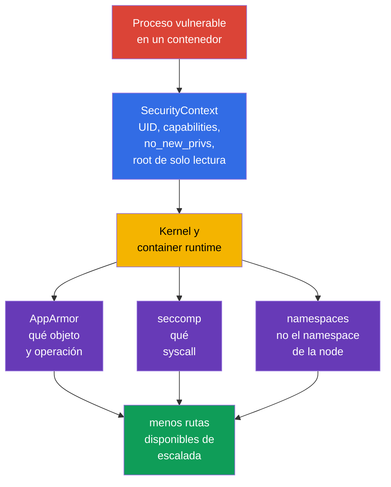
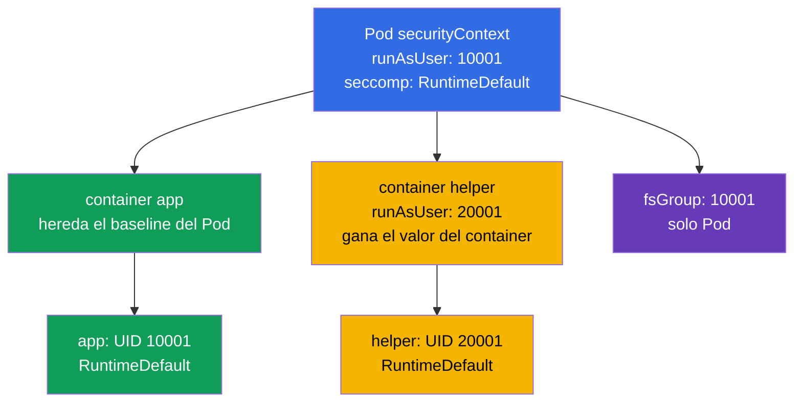
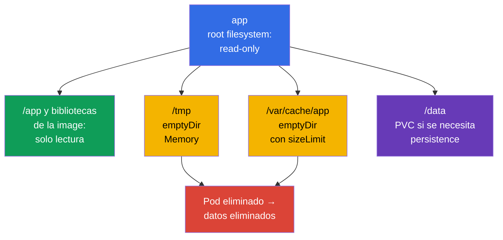

[Русская версия](ru.md) · [Eng version](README.md) · [Version française](fr.md) · [Deutsche Version](de.md) · [ქართული ვერსია](ge.md) · [繁體中文版](tw.md) · [日本語版](jp.md)

# Capítulo 18. SecurityContext hardened: privilegios mínimos del proceso

> **El problema.** Una vulnerabilidad de la aplicación pasa de ser una shell en un contenedor a tomar
> la node o lograr persistence si el proceso se ejecuta como root, conserva capabilities, puede elevar
> privilegios o sustituir binarios en un root filesystem con escritura. Sin un único contrato restrictivo,
> un default inseguro en un Pod o sidecar amplía las consecuencias de una vulneración; un `SecurityContext`
> hardened corta de antemano esas rutas adicionales.

> **Qué sigue.** AppArmor limitó los objetos a los que puede acceder un proceso y seccomp - las llamadas
> de sistema que puede realizar. Ahora reuniremos estas restricciones y las básicas del proceso en un
> contrato de Pod reproducible: non-root, conjunto vacío de capabilities, prohibición de elevar
> privilegios, root filesystem de solo lectura y perfil seccomp. Es material del dominio oficial
> **Minimize Microservice Vulnerabilities (20%)** de CKS: `SecurityContext` y Pod Security Standards.
> Cluster Setup se relaciona indirectamente: kubelet y el runtime de las nodes deben admitir y aplicar
> estos ajustes. El objetivo no es «poner todos los true/false», sino dar a cada contenedor exactamente
> los permisos que necesita y poder demostrarlo.

> **Lo necesario de CKA.** Los campos de `SecurityContext`, UID/GID, capabilities y niveles de Pod/contenedor
> se explican en el [capítulo 20 de CKA](../../../cka/course/20/es.md). Aquí se aplican como un baseline
> hardened único junto con `seccompProfile`, la ausencia de `privileged` y host namespaces, `emptyDir`
> con escritura y la comprobación del estado effective, no solo del YAML.

> 🧠 `SecurityContext` restringe los privilegios del proceso, pero no elimina vulnerabilidades de la image, RBAC, red o recursos.

## 18.1. Modelo: proteger el proceso, no una «image segura»

Un contenedor aísla el filesystem y los namespaces, pero su proceso todavía accede al kernel. Si el
proceso se ve comprometido, un UID 0, capability, root filesystem con escritura o acceso adicional a un
namespace de la node amplía las consecuencias. `SecurityContext` entrega al runtime límites concretos del
proceso; no sustituye corregir vulnerabilidades de la image, RBAC, NetworkPolicy, AppArmor o seccomp.
Tampoco **establece** requests/limits de CPU, memory o ephemeral-storage ni protege frente a resource
exhaustion/noisy-neighbor: son campos y controls distintos del Pod, como `LimitRange`/`ResourceQuota`.



Una limitación importante: `runAsNonRoot: true` es una comprobación de inicio, no un sandbox. Un proceso
non-root con `CAP_SYS_ADMIN`, `privileged: true`, `hostPID: true` o un `hostPath` con escritura aún puede
obtener una ruta peligrosa a la node. A la inversa, seccomp no corrige una aplicación que escribe un
secret en `/tmp`. La protección se construye por capas.

| Límite | Qué reduce | Qué no garantiza |
|---|---|---|
| UID/GID y `runAsNonRoot` | consecuencias de ejecutar como root, errores de permisos | ausencia de Linux capabilities y acceso al host |
| `capabilities.drop: ["ALL"]` | privilegios concretos del kernel | seguridad de la aplicación y de la red |
| `allowPrivilegeEscalation: false` | transición mediante setuid/setgid y file capabilities | ausencia de capabilities ya concedidas |
| `readOnlyRootFilesystem: true` | escritura en la capa rootfs con escritura, persistence y sustitución de binarios | prohibición de escribir en volumes, `emptyDir` y memory |
| `seccompProfile` | conjunto de syscalls disponibles | acceso a archivos o API permitidos |
| ausencia de `privileged`, `host*`, `hostPath` | ruta directa a namespaces, dispositivos y datos de la node | autorización correcta de la API de Kubernetes |

> 🎯 Baseline: identidad non-root, `drop: ["ALL"]`, `allowPrivilegeEscalation: false`, root filesystem de solo lectura, `RuntimeDefault` y volumes de escritura estrechos.

## 18.2. Baseline hardened: un Pod, varios límites

A continuación hay un baseline práctico para una aplicación HTTP. Usa deliberadamente el high port
`8080`: así no hace falta la capability `NET_BIND_SERVICE`. La image debe contener el usuario UID
`10001` y poder funcionar con root filesystem de solo lectura. No sustituya esto por un `runAsUser` a
ciegas: primero compruebe que el programa lee la configuración y los certificados y que sus directorios
de escritura se trasladaron a volumes.

```yaml
apiVersion: v1
kind: Pod
metadata:
  name: hardened-web
  labels:
    app: hardened-web
spec:
  automountServiceAccountToken: false
  securityContext:                         # ajustes compartidos del Pod
    runAsNonRoot: true
    runAsUser: 10001
    runAsGroup: 10001
    fsGroup: 10001
    seccompProfile:
      type: RuntimeDefault
  containers:
  - name: app
    image: registry.example.invalid/web:1.4.2
    ports:
    - containerPort: 8080
    securityContext:                       # ajustes de la propia app
      privileged: false
      allowPrivilegeEscalation: false
      readOnlyRootFilesystem: true
      capabilities:
        drop:
        - ALL
    volumeMounts:
    - name: tmp
      mountPath: /tmp
    - name: cache
      mountPath: /var/cache/web
  volumes:
  - name: tmp
    emptyDir:
      medium: Memory
      sizeLimit: 64Mi
  - name: cache
    emptyDir:
      sizeLimit: 256Mi
```

No es un manifiesto universal de «pegar y olvidar». `automountServiceAccountToken: false` es adecuado
solo cuando la aplicación no necesita la API de Kubernetes. Si necesita el token, defina un
ServiceAccount separado y RBAC mínimo en vez de restaurar el token default. `emptyDir.medium: Memory`
es rápido, pero consume memory del Pod/node y, al llenarse, puede provocar OOM; para cache de disco se
suele conservar el filesystem default y establecer `sizeLimit`.

### Qué protege exactamente aquí

- **`runAsNonRoot: true`** rechaza el inicio si el UID effective resulta ser 0. Los valores explícitos
  `runAsUser: 10001` y `runAsGroup: 10001` evitan que el runtime dependa de un `USER` impreciso de la image.
  El UID distinto de cero debe tener permisos adecuados sobre los archivos de la image.
- **`capabilities.drop: ["ALL"]`** elimina capabilities que el runtime podría conservar por default.
  Añada una excepción solo después de una necesidad medible. Por ejemplo, `NET_BIND_SERVICE` se justifica
  para un proceso legacy en el puerto 80, pero es preferible trasladar la aplicación a 8080 y dejar el
  conjunto vacío.
- **`allowPrivilegeEscalation: false`** establece `no_new_privs` de Linux: exec no puede obtener más
  privilegios mediante un binario setuid/setgid o file capabilities. No quita privilegios ya concedidos al
  contenedor ni reemplaza `drop: ALL`. Kubernetes hace que este valor sea effective `true` si el contenedor
  es `privileged` o tiene `CAP_SYS_ADMIN`.
- **`readOnlyRootFilesystem: true`** deja inaccesible para escritura el root filesystem con escritura del
  contenedor; las image layers ya son immutable. No restringe los volumes montados explícitamente: siguen
  siendo writable o read-only según sus mount options y permissions, por lo que un mount con escritura no
  debe ser `hostPath`.
- **`seccompProfile.type: RuntimeDefault`** habilita el perfil default del runtime para todos los
  contenedores del Pod. Excluye algunos syscalls poco necesarios y riesgosos, pero la compatibilidad se
  debe probar con la carga real.
- **`fsGroup: 10001`** ayuda al proceso non-root a obtener acceso de grupo a volumes admitidos. Es un ajuste
  de Pod, no una forma de corregir el owner de cada archivo de la image layer.

> 🎯 Un override de nivel container actúa solo en ese container; compruebe capabilities, `privileged`, escalada y root filesystem de solo lectura en app, sidecar e initContainer.

## 18.3. Ubicación de campos y conflictos de nivel

`securityContext` existe a nivel de Pod (`spec.securityContext`) y a nivel de cada container
(`spec.containers[].securityContext`, así como init y ephemeral containers). No todos los campos se
permiten en ambos niveles. Para los campos disponibles en ambos lugares, el valor del container tiene
prioridad **para ese container**. El valor del Pod sigue siendo el baseline para containers vecinos.



| Campo | Dónde se configura | Regla y conclusión práctica |
|---|---|---|
| `runAsUser`, `runAsGroup`, `runAsNonRoot` | Pod y container | un override de container solo lo afecta a él; no oculte una excepción en un sidecar |
| `seccompProfile` | Pod y container | el override de perfil del container es más fuerte; establezca `RuntimeDefault` en el Pod y documente cualquier override `Localhost` |
| `fsGroup`, `fsGroupChangePolicy`, `supplementalGroups`, `supplementalGroupsPolicy` | solo Pod | es el contexto del Pod compartido y sus volumes; no existe `fsGroup` de container |
| `capabilities`, `privileged`, `allowPrivilegeEscalation`, `readOnlyRootFilesystem` | solo container | repita los ajustes hardened para **cada** container e initContainer |
| `hostNetwork`, `hostPID`, `hostIPC`, `hostUsers` | Pod spec | no es `securityContext`; un container no puede «anular» de forma segura el acceso al host namespace |

Un ejemplo de conflicto es útil para el diagnóstico:

```yaml
spec:
  securityContext:
    runAsNonRoot: true
    runAsUser: 10001
    seccompProfile:
      type: RuntimeDefault
  containers:
  - name: app
    image: registry.example.invalid/app:1.4.2
    securityContext:
      runAsUser: 20001                 # el UID effective de app será 20001
      seccompProfile:
        type: Localhost                 # no RuntimeDefault
        localhostProfile: profiles/app.json
```

Aquí `app` se ejecuta como UID `20001` y obtiene un perfil local de la node. Hereda
`runAsNonRoot: true` salvo que se anule. No es un error por sí mismo, pero `Localhost` exige que el
perfil ya esté instalado en **cada** node donde pueda ubicarse el Pod; de lo contrario el container no
se creará. No juzgue solo un `spec.securityContext`: inspeccione cada container.

> 🔬 `Strict` deshabilita los grupos implícitos de la image y exige comprobar la compatibilidad Kubernetes/CRI y el comportamiento de la node.

### `supplementalGroupsPolicy: Strict`: sin grupos implícitos de la image

Por default, `Merge` añade a los supplementary groups la pertenencia del primary user de `/etc/group` de
la image. `Strict` no hace esa mezcla: solo permanecen los GID de `fsGroup`, `supplementalGroups` y
`runAsGroup`. Es útil cuando un grupo declarado en la image no debe dar al proceso acceso inesperado a un
volume.

```yaml
apiVersion: v1
kind: Pod
metadata:
  name: strict-groups
spec:
  securityContext:
    runAsUser: 1000
    runAsGroup: 3000
    fsGroup: 4000
    supplementalGroups: [5000]
    supplementalGroupsPolicy: Strict
  containers:
  - name: app
    image: registry.example.invalid/app:1.4.2
```

`supplementalGroupsPolicy` es GA/stable en Kubernetes v1.35 (ciclo de vida: alpha v1.31 → beta
v1.33 → GA v1.35), según el release blog oficial de Kubernetes. El feature gate
`SupplementalGroupsPolicy` está fijado como enabled by default. Aun así se requiere un CRI compatible:
hay soporte conocido en containerd desde v2.0 y CRI-O desde v1.31. Compruebe la node mediante
`status.features.supplementalGroupsPolicy: true`. Desde v1.33 kubelet rechaza un Pod con `Strict` en una
node no admitida, en vez de aplicar silenciosamente `Merge`; los eventos contendrán
`SupplementalGroupsPolicyNotSupported`.

> 🔬 Los SELinux labels, `procMount`, sysctls e identidad Windows requieren comprobar Kubernetes, runtime, CSI, SO y policy.

### Avanzado: SELinux, `/proc`, sysctls y alcance Windows

Son campos del mismo `SecurityContext`, pero no conforman el baseline Linux universal anterior.
`seLinuxOptions` en el Pod o container establece el SELinux label del proceso; el valor de nivel container
anula el de nivel Pod. Durante el relabel recursivo habitual de SELinux, el **container runtime** cambia el
label inode del contenido del volume antes de que lo use el container - no kubelet. El
`seLinuxChangePolicy: MountOption` de nivel Pod solicita relabel mediante la mount option
`-o context=`, pero por sí solo no lo garantiza. Para un PVC con access mode distinto de
`ReadWriteOncePod`, Kubernetes v1.36 requiere el feature gate `SELinuxMount` habilitado (está deshabilitado
por default) y `CSIDriver.spec.seLinuxMount: true` en el CSI driver; de otro modo Kubernetes usa el
relabel recursivo habitual. No cambie un label o policy por rapidez sin probar aislamiento y compatibilidad
con el CSI/filesystem concreto.

> 🔬 **Upstream v1.37.** En Kubernetes v1.37, `SELinuxMount` pasó a GA y se habilita por default. Antes de actualizar un cluster con SELinux, compruebe conflictos de volume-label; si es necesario, un workload puede conservar explícitamente el comportamiento recursivo con `spec.securityContext.seLinuxChangePolicy: Recursive`. Detalles: [Kubernetes v1.37 Security Delta](../APPENDIX_K8S_137_SECURITY_DELTA_ES.md).

`procMount` es una opción Linux solo de nivel container: el `Default` seguro mantiene enmascaradas las
partes sensibles de `/proc`; `Unmasked` amplía la visibilidad del proceso y no es apropiado para workload
restricted. Desde Kubernetes v1.30, `Unmasked` solo se permite para un Pod en user namespace, es decir,
con `spec.hostUsers: false`. `securityContext.sysctls` de nivel Pod define sysctls para el network/IPC
namespace del Pod. Use solo safe sysctls de la documentación de Kubernetes; los unsafe sysctls requieren
una allowlist de kubelet y pueden entrar en conflicto con host namespaces, por lo que son una excepción
consciente de nivel node, no un ajuste de la aplicación.

Estos controls Linux no se aplican a Windows. La identidad del Windows-container se define mediante
`windowsOptions.runAsUserName` en el Pod o container (el override del container tiene prioridad); allí
también se configura GMSA si hace falta. Compruebe separadamente el nombre de usuario, la image y el
soporte de la Windows-node: `runAsUser`/UID de Linux y SELinux no sustituyen a `runAsUserName`.

> 🧠 Los init, sidecar y ephemeral container tienen parámetros effective propios; un container débil elude el hardening del Pod.

### Init, sidecar y ephemeral container: procesos independientes

`initContainers` se ejecutan antes de la aplicación, pero pueden crear archivos con owner/mode inadecuado
o requerir privilegios excesivos. Para un workload hardened reciben el mismo principio: UID non-root
explícito, eliminar todas las capabilities, sin escalada, root read-only y un volume writable separado si
se necesita. No ejecute un initContainer como root solo para `chown -R`: a menudo oculta un error de la
image. Pruebe primero `fsGroup`, ownership correcto en la image o una storage-class policy; la excepción
privilegiada debe ser breve, justificada y aislada.

Un ephemeral container añadido mediante `kubectl debug` tampoco hereda automáticamente el container
security context del workload. Es útil para una incident response controlada, pero no debe convertirse en
un bypass de PSA o del baseline hardened: acuerde su image, identidad y admission policy, limite su vida y
registre el cambio. Para diagnóstico permanente, modifique el template de Deployment y cree un Pod nuevo,
en lugar de intentar cambiar el `securityContext` inmutable de un Pod en ejecución.

> 🎯 Elimine `privileged`, `hostPID`, `hostNetwork`, `hostIPC` y `hostPath` amplio: un UID non-root no cierra estas rutas de salida del límite del Pod.

## 18.4. `privileged` y `host*`: bypasses peligrosos del límite del Pod

Algunos ajustes dan al proceso acceso no solo a su propio Pod, sino a recursos de la node. Pueden ser
necesarios para CNI, CSI, node monitoring o un runtime agent, pero casi nunca para una API, worker o batch
job ordinario. «El proceso no es root» no vuelve seguro tal acceso.

| Ajuste | Qué abre | Por qué es un riesgo | Alternativa segura |
|---|---|---|---|
| `privileged: true` | casi todas las capabilities, dispositivos y aislamiento runtime debilitado | comprometer el container es casi comprometer la node | container ordinario con `drop: ALL`; añadir una capability solo con necesidad demostrada |
| `hostPID: true` | procesos de la node en el PID namespace | se pueden ver/enviar señales a procesos host y recopilar datos sensibles de `/proc` | metrics API, kubelet summary API o un node-agent confiable separado |
| `hostNetwork: true` | network namespace de la node, host ports y su IP | elude aislamiento de red del Pod, conflictos de puertos, acceso a servicios localhost de la node | Service, Ingress, NetworkPolicy y red de Pod ordinaria |
| `hostIPC: true` | IPC namespace de la node | acceso a memoria compartida e IPC de procesos host | volume, Service o cola de mensajes con auth |
| volume `hostPath` | ruta elegida del filesystem de la node | lectura de kubelet credentials, container sockets, runtime state o escritura en host | PVC, ConfigMap, Secret, `emptyDir`; ruta read-only estrecha solo para daemon confiable |

`privileged: true` hace forzosamente que `allowPrivilegeEscalation` sea effective `true` y entra en
conflicto con el objetivo de un workload hardened. Ese container también obtiene seccomp `Unconfined`,
AppArmor se ignora y su SELinux context pasa a ser `unconfined_t`. No intente «corregirlo» con un
`allowPrivilegeEscalation: false` vecino: el container continúa siendo privilegiado. La misma regla
effective de `allowPrivilegeEscalation` se aplica con `CAP_SYS_ADMIN`. De manera similar,
`hostNetwork: true` no se puede hacer seguro solo con NetworkPolicy, porque normalmente NetworkPolicy se
diseña para la red normal de Pod, no el network namespace de la node.

```yaml
# Señales de alerta para una aplicación ordinaria
spec:
  hostPID: true
  hostNetwork: true
  containers:
  - name: app
    securityContext:
      privileged: true
    volumeMounts:
    - name: host-root
      mountPath: /host
  volumes:
  - name: host-root
    hostPath:
      path: /
```

Para investigar, primero determine **por qué** apareció el ajuste: Helm chart, sidecar injected,
initContainer, DaemonSet o patch manual. No elimine `host*` de un DaemonSet de CNI/CSI/monitoring sin
comprender su contrato: puede romper la red o el storage de todo el cluster. Para un workload ordinario,
sustituya el acceso por una API/volume admitido y pruebe el rollout en staging.

Auditoría rápida de todos los Pods por namespaces:

```bash
kubectl get pods -A -o json | jq -r '
  def allContainers: ((.spec.containers // []) + (.spec.initContainers // []) + (.spec.ephemeralContainers // []));
  .items[]
  | [allContainers[] | select(.securityContext.privileged == true) | .name] as $privileged
  | [(.spec.volumes // [])[] | select(.hostPath != null) | (.name + "=" + .hostPath.path)] as $hostPaths
  | select(.spec.hostPID == true or .spec.hostNetwork == true or .spec.hostIPC == true or ($privileged|length)>0 or ($hostPaths|length)>0)
  | [.metadata.namespace, .metadata.name,
     ("hostPID=" + ((.spec.hostPID // false)|tostring)),
     ("hostNetwork=" + ((.spec.hostNetwork // false)|tostring)),
     ("hostIPC=" + ((.spec.hostIPC // false)|tostring)),
     ("privileged=" + ($privileged|join(","))),
     ("hostPath=" + ($hostPaths|join(",")))] | @tsv'
```

El comando muestra candidatos, no un veredicto. Un system namespace y DaemonSet requieren revisión con
contexto: owner, propósito, node placement, acceso mínimo, manifest y control de admission.

> 🔬 UID/GID mapping y requisitos de Linux, kernel, CRI/OCI runtime y filesystems para `hostUsers: false`.

### `hostUsers: false`: user namespaces en Kubernetes v1.36

En Kubernetes v1.36 los user namespaces son stable. `hostUsers: false` solicita a kubelet crear un user
namespace para el Pod y elegir un mapeo UID/GID sin superposición: UID 0 o `runAsUser` dentro del
container se asigna a un UID/GID no privilegiado de la node. Las capabilities actúan solo en ese
namespace: por ejemplo, `CAP_SYS_ADMIN` no concede privilegios fuera de él. Es una barrera adicional para
un workload que necesita root dentro del container pero no acceso a host namespaces ni recursos de la
node.

```yaml
apiVersion: v1
kind: Pod
metadata:
  name: userns-tool
spec:
  hostUsers: false
  containers:
  - name: tool
    image: registry.example.invalid/tool:1.4.2
    securityContext:
      allowPrivilegeEscalation: false
      capabilities:
        drop: ["ALL"]
```

Es un modo solo Linux. Por default no se puede combinar con `hostNetwork`, `hostPID` ni `hostIPC`, y
tampoco se permiten raw block volumes mediante `volumeDevices`. En v1.36, el alpha gate
`UserNamespacesHostNetworkSupport` (default `false`) permite separadamente `hostNetwork: true` con
`hostUsers: false`; `hostPID` y `hostIPC` siguen prohibidos. Un baseline hardened no debe depender de esa
excepción alpha: la combinación requiere gate explícito, revisión separada y validación del threat model.
Se necesitan idmapped mounts en el filesystem de la node y todos los volumes, un CRI/OCI runtime compatible
y kernel compatible; la documentación actual indica containerd v2.0+, CRI-O v1.25+, runc v1.2+ o crun
v1.9+. NFS no admite idmapped mounts. Antes del rollout, compruebe estas condiciones en cada node donde
pueda ubicarse el Pod.

> 🎯 Cuando falla una escritura, identifique la ruta y añada el `emptyDir` o PVC más pequeño con permissions y lifecycle adecuados.

## 18.5. Root filesystem de solo lectura sin romper la aplicación

`readOnlyRootFilesystem: true` revela escrituras implícitas: archivos PID, temporales, cache,
configuración generada, logs o package manager. La solución no es eliminar la restricción, sino describir
explícitamente cada ruta writable y su lifecycle.



`emptyDir` se crea para un Pod en la node y lo comparten sus containers. Sobrevive al restart de un
container en el mismo Pod, pero desaparece al eliminar/recrear el Pod; no es storage para datos que deban
recuperarse. `sizeLimit` limita solo el volumen esperado, pero no reemplaza requests/limits ni monitoring
del ephemeral storage de la node.

Ejemplo para un programa que necesita `/tmp`, un runtime directory y cache:

```yaml
spec:
  securityContext:
    runAsNonRoot: true
    runAsUser: 10001
    runAsGroup: 10001
    fsGroup: 10001
    seccompProfile:
      type: RuntimeDefault
  containers:
  - name: app
    image: registry.example.invalid/reporter:2.1.0
    securityContext:
      allowPrivilegeEscalation: false
      readOnlyRootFilesystem: true
      capabilities:
        drop: ["ALL"]
    volumeMounts:
    - name: tmp
      mountPath: /tmp
    - name: run
      mountPath: /var/run/reporter
    - name: cache
      mountPath: /var/cache/reporter
  volumes:
  - name: tmp
    emptyDir:
      medium: Memory
      sizeLimit: 32Mi
  - name: run
    emptyDir:
      sizeLimit: 8Mi
  - name: cache
    emptyDir:
      sizeLimit: 128Mi
```

No monte `emptyDir` sobre `/` ni haga un mount writable amplio como `/var` sin un contrato de la
aplicación: volvería a ocultar las escrituras que se querían controlar. Las rutas concretas muestran mejor
qué está permitido. Los logs suelen enviarse a stdout/stderr; un archivo en `emptyDir` se justifica solo si
lo exige la aplicación o un sidecar local.

### Debug sin eliminar el hardening

El síntoma `Read-only file system` es útil. Primero identifique la ruta y decida si es temporal, cache o
datos. No trate un incident añadiendo `privileged: true` o escribiendo en `hostPath`.

```bash
# Eventos y causa de CreateContainerConfigError/CrashLoopBackOff
kubectl describe pod hardened-web
kubectl logs hardened-web -c app --previous

# Solo con exec autorizado: comprobar mounts y permisos dentro de app
kubectl exec hardened-web -c app -- id
kubectl exec hardened-web -c app -- sh -c 'mount | grep -E " /tmp |/var/cache/web"'
kubectl exec hardened-web -c app -- sh -c 'touch /tmp/probe && rm /tmp/probe'

# Comparar volumeMounts efectivos con el template del workload
kubectl get pod hardened-web -o yaml
```

Si la aplicación necesita una herramienta de shell, no la añada a la production image «para depurar» ni
haga writable el root filesystem. Son preferibles logs, metrics, trace, un Pod temporal hardened de debug
con NetworkPolicy explícita o un procedimiento acordado para ephemeral container. Tras el diagnóstico,
elimine el debug-artifact y añada un mount `emptyDir` mínimo al template si la escritura realmente forma
parte del contrato.

> 🎯 Use `RuntimeDefault` y demuestre su efecto mediante `/proc/1/status`; `Localhost` exige entregar el perfil a cada node elegible.

## 18.6. Seccomp en el baseline: RuntimeDefault, Localhost y demostración

`seccompProfile` define la reacción del kernel ante las system calls. Para un workload normal use
`RuntimeDefault`: el runtime aplica su profile admitido. `Unconfined` deshabilita ese límite y no es
adecuado para un baseline hardened. `Localhost` solo se necesita cuando el equipo posee el profile,
garantiza su entrega a todas las nodes adecuadas y prueba actualizaciones del runtime.

| Tipo | Cuándo usarlo | Riesgo operativo |
|---|---|---|
| `RuntimeDefault` | baseline para casi todas las aplicaciones | el profile depende del runtime y la versión; pruebe las actualizaciones |
| `Localhost` | syscall-contract estrecho, entregado mediante node configuration management | ausencia del archivo en una node causa error al crear el container |
| `Unconfined` | excepción diagnóstica breve con approval explícito | no hay syscall boundary; la excepción se vuelve fácilmente permanente |

```yaml
# Baseline del Pod: todos los containers lo heredan si no se define un override de container
spec:
  securityContext:
    seccompProfile:
      type: RuntimeDefault
```

Para `Localhost`, la ruta es relativa al seccomp directory de kubelet, no al filesystem del container. No
copie el JSON profile a un ConfigMap esperando que kubelet lo vea. El profile debe entregarse a las nodes
de forma confiable, fijar scheduling a las nodes donde existe y demostrar la aplicación effective. El
modelo detallado y la depuración de syscall denials están en el [capítulo 17](../17/es.md).

Comprobación dentro del Linux namespace del proceso:

```bash
kubectl exec hardened-web -c app -- sh -c 'grep -E "^(NoNewPrivs|Seccomp):" /proc/1/status'
# Esperado: NoNewPrivs: 1 y Seccomp: 2 (filter) para un runtime típico RuntimeDefault
```

`Seccomp: 2` demuestra que hay un filter activo para PID 1, pero no que el syscall requerido esté
bloqueado por su intended profile. Para `Localhost`, añada un negative test controlado, el
`EPERM`/`Operation not permitted` esperado y la comprobación del log node/runtime. No convierta un exploit
de producción en comprobación: pruebe un syscall prohibido seguro en un entorno aislado.

> 🎯 Compruebe intent en el template, admission/inicio y estado effective del proceso; `kubectl apply` no demuestra UID, capabilities, seccomp ni rechazo de escritura.

## 18.7. Verificación: manifest, estado effective y escenarios negativos

La comprobación consta de tres preguntas diferentes:

1. **Intent:** el template de Deployment/Pod contiene los campos requeridos.
2. **Admission e inicio:** el Pod fue aceptado, creado en la node esperada y el container está realmente
   Running; los eventos no indican un conflicto de UID/profile/volume ownership.
3. **Efecto runtime:** el proceso tiene UID non-root, capability set vacío, `NoNewPrivs`, seccomp filter y
   solo los writable mount points previstos.

Comprobar solo `kubectl apply` no basta: la API puede aceptar el objeto, pero kubelet puede obtener luego
`CreateContainerConfigError`, la image puede caer por permisos inexistentes o el container puede tener un
override de nivel container.

### 1. Comparar el template y todos los containers

```bash
# Intent declarativo del Pod de práctica actual.
kubectl get pod hardened-web -o yaml
# En production, la fuente de verdad de un workload gestionado es su template de controller:
# kubectl get deploy <deployment-name> -o yaml

# Contexto de nivel Pod y contexto de cada container normal/init
kubectl get pod hardened-web -o jsonpath='{.spec.securityContext}{"\n"}'
kubectl get pod hardened-web -o jsonpath='{range .spec.containers[*]}{.name}{": "}{.securityContext}{"\n"}{end}'
kubectl get pod hardened-web -o jsonpath='{range .spec.initContainers[*]}{.name}{": "}{.securityContext}{"\n"}{end}'

# Los host namespaces y el flag privileged se buscan por separado
kubectl get pod hardened-web -o jsonpath='{.spec.hostPID}{" "}{.spec.hostNetwork}{" "}{.spec.hostIPC}{"\n"}'
kubectl get pod hardened-web -o json | jq '
  ((.spec.containers // []) + (.spec.initContainers // []) + (.spec.ephemeralContainers // []))
  | .[] | {name, privileged: (.securityContext.privileged // false)}'
```

JSONPath mostrará la configuración declarada. Para un campo boolean ausente, salida vacía no equivale a
`false`: los requisitos de audit deben ser explícitos y no depender del default. Compruebe también
`initContainers`, sidecars injected de service-mesh/observability y ephemeral containers: un container débil
comparte la red y los volumes del mismo Pod.

### 2. Verificar el inicio y la identidad effective

```bash
kubectl wait --for=condition=Ready pod/hardened-web --timeout=90s
kubectl describe pod hardened-web

kubectl exec hardened-web -c app -- id
# Esperado: uid=10001(...) gid=10001(...) y no uid=0

kubectl exec hardened-web -c app -- sh -c 'grep -E "^(Cap(Inh|Prm|Eff|Bnd|Amb)|NoNewPrivs|Seccomp):" /proc/1/status'
```

En `/proc/1/status`, las effective capabilities para `drop: ALL` deben ser cero. El campo
`NoNewPrivs: 1` confirma la prohibición de escalada. `Seccomp: 2` suele significar filter, pero observe el
runtime real y no sustituya la comprobación por interpretar una cifra. Si la image no contiene `sh`, use una
diagnostic image/procedimiento ephemeral permitido o compruebe el estado mediante herramientas de
node/runtime con control de acceso.

### 3. Comprobaciones negativas y resultados típicos

| Comprobación | Resultado esperado | Si ocurre algo distinto |
|---|---|---|
| `id -u` en app | distinto de `0` | image/override ejecuta root; compruebe contextos de Pod y container |
| escritura en `/` | `Read-only file system` | root filesystem no es read-only o la escritura alcanzó un mount amplio |
| escritura en `/tmp` | correcta en el `emptyDir` dedicado | falta mount, UID/GID erróneos o el volume driver no admite `fsGroup` |
| intento de setuid escalation | sin nuevos privilegios, `NoNewPrivs: 1` | `allowPrivilegeEscalation` ausente/true, container privileged, tiene `CAP_SYS_ADMIN` o runtime policy incorrecta |
| syscall inseguro en test Pod | rechazo de seccomp | profile no aplicado, test no usa ese syscall o se inició otro container |
| Pod con `privileged: true` en namespace restricted | admission reject | PSA/policy no está enforce o el namespace tiene excepción |

El test negativo de escritura en `/` no debe modificar la aplicación. Use un smoke-test Pod separado o una
ruta inocua, excluyendo antes un volume mount. En production, pruebe primero una copia observable del
workload: los tests no deben llenar accidentalmente `emptyDir`, eliminar cache ni provocar restart.

## 18.8. Fallos habituales y corrección segura

| Síntoma | Causa probable | Corrección |
|---|---|---|
| `container has runAsNonRoot and image will run as root` | la image no declara un USER non-root y no se indicó UID | construir la image con USER non-root o indicar explícitamente un UID no cero confirmado |
| `Permission denied` en un volume montado | UID/GID no coinciden, el driver no aplicó `fsGroup` | comprobar ownership, storage driver y `fsGroup`; no aplicar indiscriminadamente `chmod 777` |
| `Read-only file system` | app escribe PID/cache/temp en image layer | añadir un `emptyDir` o PVC estrecho justo en la ruta necesaria |
| el Pod no se crea con seccomp `Localhost` | falta el profile en la node elegida | entregar el profile y restringir placement o volver a `RuntimeDefault` |
| el puerto 80 no abre | non-root sin `NET_BIND_SERVICE` | escuchar un high port y usar el `targetPort` del Service; capability solo como excepción justificada |
| tras hardening falla un sidecar | SecurityContext solo se indicó para app o sidecar escribe en root filesystem | cada container necesita contexto hardened y volumes writable explícitos |
| PSA rechaza el Pod | ajuste prohibido (`privileged`, host namespace, `Unconfined`) | eliminar el bypass; formalizar la excepción por separado, mínima y temporal |

No copie secrets a un `emptyDir` writable si la aplicación puede leerlos como Secret montado. Si el
programa debe transformar un certificado/configuración, cree un volume writable pequeño separado, minimice
su lifetime y permissions y no lo mezcle con cache compartido. `readOnlyRootFilesystem` no protege el
contenido de un volume frente a otro container del mismo Pod que también tenga montado ese volume.

> 🏭 Versioned templates, inventory, corrección de image, canary, runtime tests, admission guardrails y excepciones documentadas.

## 18.9. Implantación gradual del baseline hardened

Implante el baseline en el template de Deployment/StatefulSet/Job y Helm chart, no manualmente en un Pod
creado. El `securityContext` de la mayoría de los Pods running es immutable: el cambio correcto publica
una nueva ReplicaSet/Pod y observa el rollout.

1. Haga inventario de procesos, writable paths, low ports, volume ownership, requisitos de syscall/profile
   y excepciones `privileged`/`host*` actuales.
2. Corrija la image: `USER` non-root, archivos legibles por UID/GID requerido y aplicación que escribe en
   directories documentados, no en `/`.
3. Añada el baseline de Pod: `runAsNonRoot`, UID/GID no cero explícito, seccomp `RuntimeDefault` y, si hace
   falta, `fsGroup`.
4. Añada el baseline container **a todos** los app/init/sidecar containers: `drop: ["ALL"]`,
   `allowPrivilegeEscalation: false`, `readOnlyRootFilesystem: true`, `privileged: false`.
5. Mueva los writable paths necesarios a mount points `emptyDir`/PVC estrechos con `sizeLimit` y
   requests/limits; elimine el ServiceAccount token no usado.
6. Ejecute readiness, functional y negative tests, después inspeccione `/proc` y mounts effective.
7. Active un admission guardrail (Pod Security Admission restricted y/o policy engine) para que la siguiente
   versión del chart no devuelva privileged/host namespace o `Unconfined`.
8. Documente y revise periódicamente cada excepción: owner, motivo, scope, plazo, capability/profile
   requerido y prueba del test.

## 18.10. Preguntas de autoevaluación

<details>
<summary>1. ¿Por qué `runAsNonRoot: true` no vuelve seguro un Pod con `privileged: true`?</summary>

`runAsNonRoot` comprueba el UID effective al iniciar, pero no es sandbox. `privileged: true` concede casi
todas las capabilities y acceso a dispositivos, hace effective seccomp `Unconfined` e ignora AppArmor. Un
proceso non-root con tal acceso aún obtiene rutas peligrosas a la node.
</details>

<details>
<summary>2. ¿Qué campos de container securityContext deben definirse por separado para initContainer y sidecar?</summary>

Para cada app, sidecar e initContainer se definen por separado `capabilities.drop: ["ALL"]`,
`allowPrivilegeEscalation: false`, `readOnlyRootFilesystem: true` y, si hace falta, `privileged: false`.
`runAsNonRoot`, UID/GID y `seccompProfile` de nivel Pod aportan el baseline, pero el container puede
anularlo. Por tanto se comprueban todas las listas de containers, incluidos los sidecars injected.
</details>

<details>
<summary>3. ¿Cuál será el UID effective de un container si el Pod establece `runAsUser: 10001` y el container `runAsUser: 20001`?</summary>

El UID effective de ese container será `20001`. Para campos disponibles en dos niveles, el valor de nivel
container tiene prioridad solo para ese container. El `10001` del nivel Pod permanece como baseline para
containers vecinos sin override.
</details>

<details>
<summary>4. ¿Por qué no se debe considerar `fsGroup` un mecanismo para corregir permisos de todos los archivos de image layer?</summary>

`fsGroup` es un ajuste de Pod que ayuda al acceso de grupo en volumes admitidos. No está destinado a
cambiar el owner de todos los archivos de image layer ni sustituye ownership y UID correctos en la image.
Para rutas writable también hay que elegir explícitamente un volume y comprobar el soporte del storage driver.
</details>

<details>
<summary>5. ¿En qué se diferencia operationally el profile seccomp `RuntimeDefault` de `Localhost`?</summary>

`RuntimeDefault` usa el profile admitido por el runtime y sirve de baseline a casi todos los workloads.
`Localhost` hace referencia a JSON que una automation confiable entrega antes a cada node elegible bajo el
seccomp root de kubelet. La falta del archivo en la node elegida causa un error de creación del container,
por lo que se necesitan versioning, placement y compatibilidad runtime.
</details>

<details>
<summary>6. ¿Qué datos sobreviven al restart de un container pero desaparecen al eliminar un Pod con `emptyDir`?</summary>

El contenido de `emptyDir` sobrevive al restart del container dentro del mismo Pod. Al eliminar o recrear
el Pod, el volume desaparece con los datos. Por eso sirve para `/tmp`, runtime directory y cache, pero no
para datos que deban recuperarse.
</details>

<details>
<summary>7. ¿Por qué `allowPrivilegeEscalation: false` no sustituye `capabilities.drop: ["ALL"]`?</summary>

`allowPrivilegeEscalation: false` habilita `no_new_privs` e impide obtener nuevos privilegios mediante un
binario setuid/setgid o file capabilities. No quita capabilities ya concedidas al container. Por ello el
baseline elimina además el conjunto inicial mediante `drop: ["ALL"]`.
</details>

<details>
<summary>8. ¿Qué tres comprobaciones independientes se necesitan para demostrar el hardening tras `kubectl apply`?</summary>

Primero se comprueba el intent: security context en el template y todos los containers. Después se confirma
admission e inicio: Pod Ready y events sin conflictos de UID, profile o volume. Por último se comprueba el
runtime effect: UID non-root, capabilities nulas, `NoNewPrivs`, seccomp y solo writable mounts previstos,
incluidos los escenarios negativos.
</details>

<details>
<summary>9. ¿Por qué `hostNetwork` y `hostPID` requieren review incluso con UID non-root?</summary>

`hostPID` abre procesos y datos `/proc` sensibles de la node, mientras `hostNetwork` proporciona network
namespace, IP, host ports y servicios localhost de la node. Es acceso a recursos host que un UID non-root
no elimina. Para workload ordinario el capítulo recomienda Service, red Pod normal, NetworkPolicy o una API
admitida en vez de host namespace.
</details>

<details>
<summary>10. **Flashback (capítulo 10).** PSA actúa mediante namespace labels que pueden establecerse al crear el objeto, no solo con un `patch` separado. El capítulo 10 describe el control RBAC para **modificar** labels de un namespace existente (`patch` labels `Namespace`), no para la propia **creación** del namespace. ¿Por qué una restricción RBAC al verbo `create` de `namespaces` no basta para garantizar que un namespace nuevo obtenga `enforce=restricted`, y qué mecanismo (RBAC o de nivel admission) se necesita realmente para cerrar esa ruta de bypass de PSA?</summary>

RBAC `create namespaces` decide si una identity puede crear el objeto, pero no comprueba metadata labels
obligatorios en la nueva solicitud. Una persona con ese permiso puede crear un namespace sin
`pod-security.kubernetes.io/enforce=restricted`, y PSA actuará según una default configuration que no tiene
por qué ser restricted. Hace falta una policy de nivel admission, por ejemplo ValidatingAdmissionPolicy o
policy engine, que exija los labels en CREATE; RBAC sigue siendo una restricción complementaria sobre quién
puede crear namespaces.
</details>

> 🏭 Chart/template común y CI/admission policy; una excepción tiene scope, owner, motivo, plazo de revisión y evidence.

## 18.11. Aplicación en producción

El equipo fija el baseline en un Helm chart común o library template, no lo copia entre manifests. Para cada
desviación mantiene un registro: owner, motivo, scope, fecha de revisión y test que prueba la necesidad.
En CI conviene comprobar el rendered manifest para `privileged`, `host*`, `hostPath`, `Unconfined` y campos
obligatorios ausentes; en el cluster la comprobación se complementa con Pod Security Admission o policy engine.

La implantación se hace por fases: primero se ejecuta el workload con logs y metrics observables en staging,
después se habilitan las restricciones para una réplica o canary y se siguen el rollout, errores de inicio y
consumo de ephemeral storage. Tras confirmar el contrato, los cambios entran en el template del workload.
Los node agents que realmente necesitan host access o capabilities especiales se aíslan de application
namespaces y se revisan por separado.

## 18.12. Mini-glosario

| Término | Significado breve |
|---|---|
| **SecurityContext** | Campos Kubernetes que establecen la identity y restricciones de un proceso o Pod. |
| **capability** | Privilegio Linux individual; `drop: ["ALL"]` elimina el conjunto inicial. |
| **no_new_privs** | Flag del kernel que impide obtener privilegios adicionales mediante `exec`; lo habilita `allowPrivilegeEscalation: false`. |
| **read-only root filesystem** | El root filesystem del container se monta read-only; se prohíbe escribir en la rootfs writable y las escrituras permitidas se mueven a volumes. |
| **seccomp** | Filtro de system calls del proceso; `RuntimeDefault` es el baseline admitido por runtime. |
| **effective state** | UID, capabilities, mounts y seccomp reales del proceso tras iniciar, no solo campos del manifest. |
| **host namespace** | Namespace de la node que un Pod puede compartir mediante `hostPID`, `hostNetwork` o `hostIPC`. |

## 18.13. Resumen del capítulo

1. El hardening del proceso requiere combinar identidad non-root, conjunto vacío de capabilities,
   prohibición de escalada, root filesystem read-only y seccomp, no un único campo.
2. Los ajustes de nivel Pod y container tienen alcances distintos; cada app, sidecar e initContainer debe
   comprobarse por separado.
3. `privileged`, `host*` y `hostPath` son excepciones con riesgo para la node, no defaults cómodos para la
   aplicación.
4. Los writable paths deben ser explícitos, estrechos y contar con volume, ownership y límites adecuados.
5. La demostración de hardening incluye intent en el template, inicio correcto y comprobación runtime del
   proceso con escenarios negativos.

## 18.14. Cómo sirve esto: en el examen y en el trabajo real

**En el examen.** Primero determine el nivel de cada campo: `fsGroup` se define para el Pod, mientras
capabilities y `allowPrivilegeEscalation` son para el container. Corrija el manifest mediante el controller
o recree el Pod; después confirme el resultado con `kubectl describe`, `id`, `/proc/1/status` y una
comprobación del `emptyDir` writable. Para seccomp distinga `RuntimeDefault` de `Localhost`: el segundo
requiere el profile en la node.

**En el trabajo real.** El mismo orden convierte el hardening en un proceso repetible: el baseline seguro
reside en el template, admission evita regresiones y las señales de rollout y runtime muestran
incompatibilidades. Cada excepción recibe scope mínimo, responsable y plazo de revisión, de modo que una
concesión temporal no se vuelve una vulnerabilidad permanente.

## Práctica

Practique el template hardened en la [lab 107 de CKA](../../../cka/labs/107/README_ES.MD): use `emptyDir`
como storage ephemeral writable descrito explícitamente y compruebe el resultado mediante `check_result`.
Después, en un test workload separado añada el baseline de este capítulo: UID non-root, `drop: ["ALL"]`,
`allowPrivilegeEscalation: false`, root filesystem read-only, `emptyDir` para `/tmp` y `RuntimeDefault`.
Demuestre `id`, `NoNewPrivs`, `Seccomp`, mount points y el rechazo esperado de escritura en la raíz. Para
un diagnóstico profundo de syscall policy, vuelva al [capítulo 17](../17/es.md).

🧪 Lab 107 (multi-container Pod, `emptyDir` y debugging de writable paths):
[tasks/cka/labs/107](../../../cka/labs/107/README_ES.MD)

🌐 Práctica interactiva adicional (killer.sh/killercoda, recurso externo): [privileged-containers](https://killercoda.com/killer-shell-cks/scenario/privileged-containers) · [privilege-escalation-containers](https://killercoda.com/killer-shell-cks/scenario/privilege-escalation-containers)

## Materiales de referencia

- [Kubernetes: Configure a Security Context for a Pod or Container](https://kubernetes.io/docs/tasks/configure-pod-container/security-context/)
- [Kubernetes: Pod Security Standards](https://kubernetes.io/docs/concepts/security/pod-security-standards/)
- [Kubernetes: Restrict a Container's Syscalls with seccomp](https://kubernetes.io/docs/tutorials/security/seccomp/)
- [Kubernetes: Volumes - emptyDir](https://kubernetes.io/docs/concepts/storage/volumes/#emptydir)
- [Kubernetes: Linux kernel security constraints](https://kubernetes.io/docs/concepts/security/linux-kernel-security-constraints/)
- [Kubernetes: User Namespaces](https://kubernetes.io/docs/concepts/workloads/pods/user-namespaces/)

---
[Índice](../README_ES.md) · [Capítulo 17](../17/es.md) · [Capítulo 19](../19/es.md)
