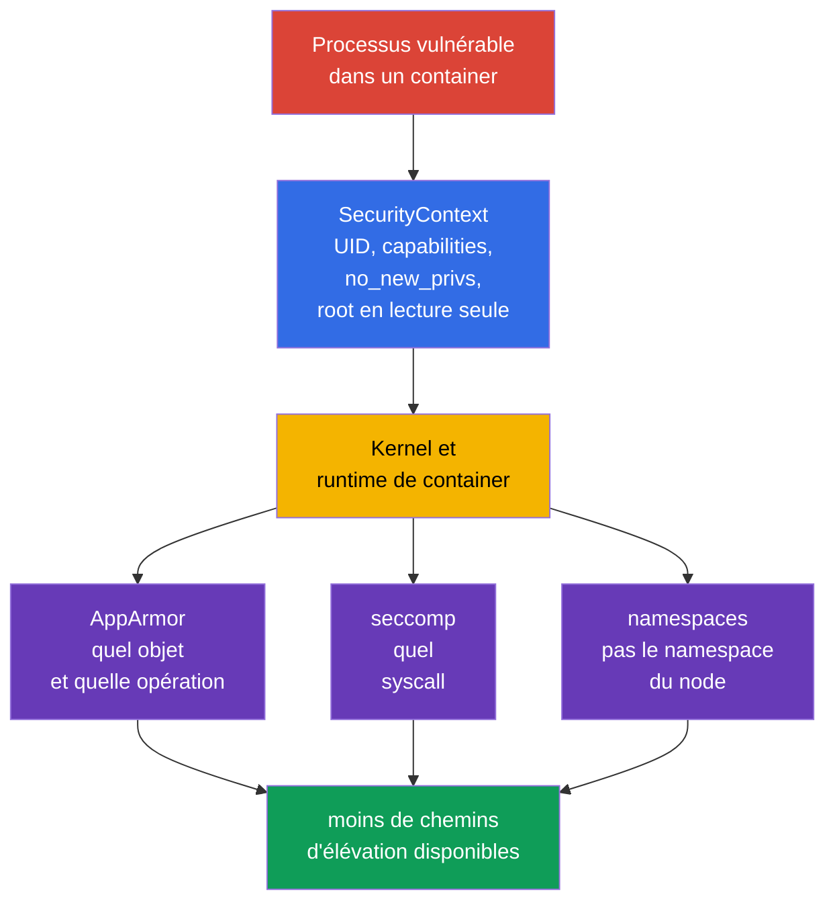
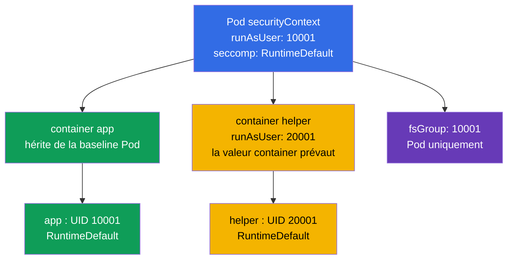
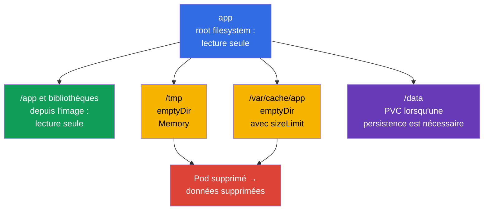

[Русская версия](ru.md) · [Eng version](README.md) · [Versión en español](es.md) · [Deutsche Version](de.md) · [ქართული ვერსია](ge.md) · [繁體中文版](tw.md) · [日本語版](jp.md)

# Chapitre 18. SecurityContext renforcé : privilèges minimaux du processus

> **Le problème.** Une vulnérabilité applicative passe d'un shell dans un container à la prise de contrôle
> d'un node ou à la persistence si le processus s'exécute en root, conserve des capabilities, peut élever ses
> privilèges ou remplacer des binaires dans un root filesystem accessible en écriture. Sans contrat
> restrictif unique, une valeur par défaut non sûre dans un Pod ou un sidecar étend les conséquences d'une compromission ;
> un `SecurityContext` renforcé bloque à l'avance ces chemins supplémentaires.

> **La suite.** AppArmor a limité les objets auxquels un processus peut accéder, et seccomp a limité
> les appels système qu'il peut effectuer. Nous combinons maintenant ces restrictions et les restrictions de base du processus
> en un contrat Pod reproductible : non-root, un ensemble vide de capabilities, aucune élévation de
> privilèges, un root filesystem en lecture seule et un profil seccomp. Cela fait partie du domaine officiel CKS
> **Minimize Microservice Vulnerabilities (20%)** : `SecurityContext` et Pod Security
> Standards. Cluster Setup y est lié indirectement :
> le kubelet et le runtime du node doivent prendre en charge et appliquer ces paramètres. L'objectif n'est pas de
> « définir chaque true/false », mais de donner à chaque container exactement les privilèges nécessaires et de le prouver.

> **Prérequis CKA.** Les champs `SecurityContext`, UID/GID, capabilities et niveaux Pod/container
> sont traités dans le [chapitre 20 de CKA](../../../cka/course/20/fr.md). Ici, ils servent de baseline
> renforcée unifiée avec `seccompProfile`, sans `privileged` ni host namespaces,
> avec `emptyDir` accessible en écriture et avec la vérification de l'état effectif, pas seulement du YAML.

> 🧠 `SecurityContext` limite les privilèges du processus, mais n'élimine pas les vulnérabilités d'image ni les risques RBAC, réseau ou de ressources.

## 18.1. Modèle : protéger le processus, pas une « image sûre »

Un container isole le filesystem et les namespaces, mais son processus accède toujours au kernel. Si le
processus est compromis, un UID 0 supplémentaire, une capability, un root filesystem accessible en écriture ou l'accès à un
namespace de node étend les conséquences. `SecurityContext` transmet des limites précises du processus au
runtime ; il ne remplace pas la correction des vulnérabilités d'image, RBAC, NetworkPolicy, AppArmor ou
seccomp. Il ne **définit pas non plus** les requests/limits de CPU, mémoire ou ephemeral-storage et ne
protège pas contre l'épuisement des ressources ou les noisy neighbors : ce sont des champs Pod et contrôles distincts, tels que
`LimitRange`/`ResourceQuota`.



Limite importante : `runAsNonRoot: true` est un contrôle au démarrage, pas une sandbox. Un processus non-root
avec `CAP_SYS_ADMIN`, `privileged: true`, `hostPID: true` ou un `hostPath` accessible en écriture peut toujours
obtenir un chemin dangereux vers le node. Inversement, seccomp ne corrige pas une application qui écrit un
secret dans `/tmp`. La protection se construit par couches.

| Limite | Ce qu'elle réduit | Ce qu'elle ne garantit pas |
|---|---|---|
| UID/GID et `runAsNonRoot` | conséquences d'une exécution en root, erreurs de permissions | absence de Linux capabilities et d'accès host |
| `capabilities.drop: ["ALL"]` | privilèges distincts du kernel | sécurité de l'application et du réseau |
| `allowPrivilegeEscalation: false` | transition via setuid/setgid et file capabilities | absence de capabilities déjà accordées |
| `readOnlyRootFilesystem: true` | écritures dans la couche rootfs accessible en écriture, persistence et remplacement de binaires | absence d'écriture dans les volumes, `emptyDir` et la mémoire |
| `seccompProfile` | ensemble des syscalls disponibles | accès aux fichiers ou à l'API autorisés |
| absence de `privileged`, `host*`, `hostPath` | chemin direct vers namespaces, devices et données du node | autorisation correcte de Kubernetes API |

> 🎯 Baseline : identité non-root, `drop: ["ALL"]`, `allowPrivilegeEscalation: false`, root filesystem en lecture seule, `RuntimeDefault` et volumes accessibles en écriture étroits.

## 18.2. Baseline renforcée : un Pod, plusieurs limites

Voici une baseline pratique pour une application HTTP. Elle utilise délibérément le port élevé `8080` :
aucune capability `NET_BIND_SERVICE` n'est nécessaire. L'image doit contenir l'utilisateur UID `10001`
et pouvoir fonctionner avec un root filesystem en lecture seule. Ne remplacez pas cela par un `runAsUser` aveugle :
vérifiez d'abord que le programme lit la configuration et les certificats et que ses répertoires d'écriture sont déplacés vers des
volumes.

```yaml
apiVersion: v1
kind: Pod
metadata:
  name: hardened-web
  labels:
    app: hardened-web
spec:
  automountServiceAccountToken: false
  securityContext:                         # paramètres Pod partagés
    runAsNonRoot: true
    runAsUser: 10001
    runAsGroup: 10001
    fsGroup: 10001
    seccompProfile:
      type: RuntimeDefault
  containers:
  - name: app
    image: registry.example.invalid/web:1.4.2
    ports:
    - containerPort: 8080
    securityContext:                       # paramètres de l'application elle-même
      privileged: false
      allowPrivilegeEscalation: false
      readOnlyRootFilesystem: true
      capabilities:
        drop:
        - ALL
    volumeMounts:
    - name: tmp
      mountPath: /tmp
    - name: cache
      mountPath: /var/cache/web
  volumes:
  - name: tmp
    emptyDir:
      medium: Memory
      sizeLimit: 64Mi
  - name: cache
    emptyDir:
      sizeLimit: 256Mi
```

Ce n'est pas un manifeste universel à « copier-coller et oublier ». `automountServiceAccountToken: false`
ne convient que si l'application n'a pas besoin de Kubernetes API. Si elle a besoin d'un token,
créez un ServiceAccount séparé avec un RBAC minimal plutôt que de restaurer le token par défaut. `emptyDir.medium: Memory`
est rapide, mais consomme la mémoire du Pod/node et peut provoquer un OOM lorsqu'il est plein ; pour un cache disque,
conservez normalement le filesystem par défaut et définissez un `sizeLimit`.

### Ce qui protège exactement ici

- **`runAsNonRoot: true`** refuse le démarrage lorsque l'UID effectif est 0. Les valeurs explicites
  `runAsUser: 10001` et `runAsGroup: 10001` évitent que le runtime dépende d'un `USER` d'image ambigu.
  L'UID non nul doit disposer d'un accès approprié aux fichiers de l'image.
- **`capabilities.drop: ["ALL"]`** retire les capabilities que le runtime pourrait conserver par
  défaut. N'ajoutez une exception qu'après avoir mesuré le besoin. Par exemple,
  `NET_BIND_SERVICE` se justifie pour un processus historique sur le port 80, mais déplacer
  l'application vers 8080 et laisser l'ensemble vide est préférable.
- **`allowPrivilegeEscalation: false`** définit `no_new_privs` de Linux : exec ne peut pas obtenir
  de privilèges supplémentaires via un binaire setuid/setgid ou des file capabilities. Cela ne retire pas les privilèges
  déjà accordés au container et ne remplace pas `drop: ALL`. Kubernetes rend cette valeur effective à
  `true` si le container est `privileged` ou possède `CAP_SYS_ADMIN`.
- **`readOnlyRootFilesystem: true`** rend le root filesystem accessible en écriture du container indisponible
  pour les écritures ; les couches d'image sont déjà immuables. Cela ne restreint pas les volumes montés explicitement :
  ils restent accessibles en écriture ou en lecture seule suivant leurs options de montage et leurs permissions ; un
  montage accessible en écriture ne doit donc pas être un `hostPath`.
- **`seccompProfile.type: RuntimeDefault`** active le profil runtime par défaut pour chaque
  container du Pod. Il exclut plusieurs syscalls rarement nécessaires et risqués, mais la compatibilité doit être
  testée avec le workload réel.
- **`fsGroup: 10001`** aide un processus non-root à obtenir un accès de groupe aux
  volumes pris en charge. C'est un paramètre Pod, pas un moyen de corriger l'ownership de chaque fichier de couche d'image.

> 🎯 Un override au niveau container n'agit que sur ce container ; vérifiez capabilities, `privileged`, escalation et root filesystem en lecture seule sur app, sidecar et initContainer.

## 18.3. Emplacement des champs et conflits de niveaux

`securityContext` existe au niveau Pod (`spec.securityContext`) et au niveau de chaque
container (`spec.containers[].securityContext`, y compris les containers init et ephemeral).
Chaque champ n'est pas autorisé aux deux niveaux. Pour les champs disponibles aux deux endroits, la valeur
du container prévaut **pour ce container**. La valeur Pod demeure la baseline des
containers voisins.



| Champ | Où le définir | Règle et conclusion pratique |
|---|---|---|
| `runAsUser`, `runAsGroup`, `runAsNonRoot` | Pod et container | un override container ne l'affecte que lui ; ne cachez pas une exception dans un sidecar |
| `seccompProfile` | Pod et container | un override de profil container est plus fort ; définissez `RuntimeDefault` sur le Pod et documentez chaque override `Localhost` |
| `fsGroup`, `fsGroupChangePolicy`, `supplementalGroups`, `supplementalGroupsPolicy` | Pod uniquement | c'est le contexte du Pod partagé et de ses volumes ; il n'existe pas de `fsGroup` container |
| `capabilities`, `privileged`, `allowPrivilegeEscalation`, `readOnlyRootFilesystem` | container uniquement | répétez les paramètres renforcés pour **chaque** container et initContainer |
| `hostNetwork`, `hostPID`, `hostIPC`, `hostUsers` | Pod spec | ce n'est pas un `securityContext` ; un container ne peut pas « override » en toute sécurité l'accès à un host namespace |

Un exemple de conflit est utile pour le diagnostic :

```yaml
spec:
  securityContext:
    runAsNonRoot: true
    runAsUser: 10001
    seccompProfile:
      type: RuntimeDefault
  containers:
  - name: app
    image: registry.example.invalid/app:1.4.2
    securityContext:
      runAsUser: 20001                 # l'UID effectif de app sera 20001
      seccompProfile:
        type: Localhost                 # pas RuntimeDefault
        localhostProfile: profiles/app.json
```

Ici, `app` s'exécute avec UID `20001` et reçoit un profil local au node. `runAsNonRoot: true`
est hérité sauf override. Ce n'est pas une erreur en soi, mais `Localhost` exige
que le profil soit déjà installé sur **chaque** node où le Pod peut être placé ; sinon le container
ne sera pas créé. Ne jugez pas uniquement un `spec.securityContext` : inspectez chaque container.

> 🔬 `Strict` désactive les groupes implicites de l'image et exige de vérifier le support Kubernetes/CRI et le comportement du node.

### `supplementalGroupsPolicy: Strict` : sans groupes implicites de l'image

Par défaut, `Merge` ajoute l'appartenance de l'utilisateur principal de `/etc/group` de l'image aux groupes supplémentaires.
`Strict` ne les fusionne pas : seuls les GID de `fsGroup`, `supplementalGroups`
et `runAsGroup` demeurent. C'est utile lorsqu'un groupe déclaré dans une image ne doit pas donner au processus
un accès inattendu à un volume.

```yaml
apiVersion: v1
kind: Pod
metadata:
  name: strict-groups
spec:
  securityContext:
    runAsUser: 1000
    runAsGroup: 3000
    fsGroup: 4000
    supplementalGroups: [5000]
    supplementalGroupsPolicy: Strict
  containers:
  - name: app
    image: registry.example.invalid/app:1.4.2
```

`supplementalGroupsPolicy` est GA/stable dans Kubernetes v1.35 (cycle : alpha v1.31 → beta
v1.33 → GA v1.35), d'après le blog de publication officiel de Kubernetes. Le feature gate
`SupplementalGroupsPolicy` est fixé comme activé par défaut. Le support CRI reste nécessaire :
il est connu dans containerd à partir de v2.0 et CRI-O à partir de v1.31. Vérifiez le node via `status.features.supplementalGroupsPolicy: true`. À partir de v1.33,
kubelet rejette un Pod avec `Strict` sur un node non pris en charge au lieu d'appliquer silencieusement `Merge` ;
les événements contiennent `SupplementalGroupsPolicyNotSupported`.

> 🔬 Les labels SELinux, `procMount`, sysctls et l'identité Windows exigent de vérifier Kubernetes, le runtime, CSI, l'OS et la policy.

### Avancé : SELinux, `/proc`, sysctls et périmètre Windows

Ce sont des champs du même `SecurityContext`, mais ils ne forment pas la baseline Linux universelle ci-dessus.
`seLinuxOptions` sur un Pod ou un container définit le label SELinux du processus ; une valeur au niveau container
override celle du niveau Pod. Lors du relabeling SELinux récursif normal, le **container runtime**
modifie le label inode du contenu du volume avant son utilisation par le container - pas kubelet.
`seLinuxChangePolicy: MountOption` au niveau Pod demande le relabeling via l'option de montage
`-o context=`, sans le garantir à lui seul. Pour un PVC avec un access mode autre que
`ReadWriteOncePod`, Kubernetes v1.36 exige le feature gate `SELinuxMount` activé (il est
désactivé par défaut) et `CSIDriver.spec.seLinuxMount: true` dans le driver CSI ; sinon Kubernetes
utilise le relabeling récursif normal. Ne changez pas un label ou une policy pour gagner en vitesse sans tester
l'isolation et la compatibilité avec le CSI/filesystem concerné.

> 🔬 **Upstream v1.37.** Dans Kubernetes v1.37, `SELinuxMount` est devenu GA et est activé par défaut. Avant de mettre à niveau un cluster SELinux-enabled, vérifiez les conflits de labels de volume ; si nécessaire, un workload peut conserver explicitement le comportement récursif avec `spec.securityContext.seLinuxChangePolicy: Recursive`. Détails : [Kubernetes v1.37 Security Delta](../APPENDIX_K8S_137_SECURITY_DELTA_FR.md).

`procMount` est une option Linux au seul niveau container : le `Default` sûr conserve masquées les parties sensibles de
`/proc` ; `Unmasked` étend la visibilité du processus et ne convient pas aux workloads restreints.
À partir de Kubernetes v1.30, `Unmasked` n'est autorisé que pour un Pod dans un user namespace,
c'est-à-dire avec `spec.hostUsers: false`. `securityContext.sysctls` au niveau Pod définit les
sysctls pour le namespace réseau/IPC du Pod. Utilisez uniquement les sysctls sûrs de la documentation Kubernetes ;
les sysctls non sûrs nécessitent une allowlist kubelet et peuvent entrer en conflit avec les host namespaces : c'est donc une exception
consciente au niveau node, pas un paramètre applicatif.

Ces contrôles Linux ne s'appliquent pas à Windows. Définissez l'identité du container Windows avec
`windowsOptions.runAsUserName` sur le Pod ou le container (l'override container prévaut) ;
configurez GMSA à cet endroit si nécessaire. Vérifiez séparément le username, l'image et le support Windows-node :
`runAsUser`/UID Linux et SELinux ne remplacent pas `runAsUserName`.

> 🧠 Les containers init, sidecar et ephemeral possèdent leurs propres paramètres effectifs ; un container faible contourne le hardening du Pod.

### Containers init, sidecar et ephemeral - processus distincts

Les `initContainers` s'exécutent avant l'application, mais peuvent créer des fichiers avec un owner/mode inadapté
ou nécessiter des privilèges excessifs. Pour les workloads renforcés, appliquez le même principe :
UID non-root explicite, suppression de toutes les capabilities, pas d'escalation, root en lecture seule et volume distinct accessible en écriture
si nécessaire. N'exécutez pas un initContainer en root uniquement pour `chown -R` : cela masque souvent une erreur d'image.
Essayez d'abord `fsGroup`, un ownership correct dans l'image ou une policy storage-class ; une exception privilégiée
doit être courte, justifiée et isolée.

Un container ephemeral ajouté avec `kubectl debug` n'hérite pas non plus automatiquement du
container security context du workload. Il est utile à la réponse contrôlée à incident, mais ne doit pas devenir un contournement
de PSA ou de la baseline renforcée : convenez de son image, de son identité et de sa admission policy, limitez sa durée de vie
et enregistrez le changement. Pour le diagnostic permanent, modifiez le template Deployment et créez un nouveau Pod,
au lieu de tenter de modifier le `securityContext` immuable d'un Pod en cours d'exécution.

> 🎯 Supprimez `privileged`, `hostPID`, `hostNetwork`, `hostIPC` et les `hostPath` larges : un UID non-root ne ferme pas ces voies de sortie de la limite Pod.

## 18.4. `privileged` et `host*` : contournements dangereux de la limite Pod

Certains paramètres donnent à un processus accès non seulement à son propre Pod, mais aux ressources du node.
Ils peuvent être nécessaires à CNI, CSI, au monitoring de node ou à un runtime agent, mais ne sont presque jamais nécessaires
à une API, un worker ou un batch job ordinaire. « Le processus n'est pas root » ne rend pas cet accès sûr.

| Paramètre | Ce qu'il ouvre | Pourquoi c'est un risque | Alternative sûre |
|---|---|---|---|
| `privileged: true` | presque toutes les capabilities, devices et une isolation runtime affaiblie | compromission du container proche de celle du node | container ordinaire avec `drop: ALL` ; n'ajouter une capability que si le besoin est prouvé |
| `hostPID: true` | processus du node dans le PID namespace | visualisation/signalement des processus host et collecte de données `/proc` sensibles | metrics API, kubelet summary API ou node agent de confiance séparé |
| `hostNetwork: true` | network namespace du node, host ports et son IP | contourne l'isolation réseau Pod, conflits de ports, accès aux services localhost du node | Service, Ingress, NetworkPolicy et réseau Pod ordinaire |
| `hostIPC: true` | IPC namespace du node | accès à la mémoire partagée et à l'IPC des processus host | volume, Service ou file de messages avec auth |
| volume `hostPath` | chemin filesystem de node choisi | lecture des credentials kubelet, container sockets, état runtime ou écriture dans host | PVC, ConfigMap, Secret, `emptyDir` ; chemin étroit en lecture seule pour un daemon de confiance seulement |

`privileged: true` rend obligatoirement `allowPrivilegeEscalation` effectif à `true` et entre en conflit
avec l'objectif du workload renforcé. Un tel container reçoit aussi seccomp `Unconfined`, ignore AppArmor,
et son contexte SELinux devient `unconfined_t`. N'essayez pas de le « corriger » avec un
`allowPrivilegeEscalation: false` voisin : le container demeure privilégié. La même règle effective pour
`allowPrivilegeEscalation` s'applique avec `CAP_SYS_ADMIN`. De même, `hostNetwork: true` ne peut pas
être rendu sûr par NetworkPolicy seule, car NetworkPolicy est normalement conçue pour le réseau Pod ordinaire,
pas le network namespace du node.

```yaml
# Signaux d'alerte pour une application ordinaire
spec:
  hostPID: true
  hostNetwork: true
  containers:
  - name: app
    securityContext:
      privileged: true
    volumeMounts:
    - name: host-root
      mountPath: /host
  volumes:
  - name: host-root
    hostPath:
      path: /
```

Pour une enquête, recherchez d'abord **pourquoi** le paramètre est apparu : chart Helm, sidecar
injecté, initContainer, DaemonSet ou patch manuel. Ne retirez pas `host*` d'un DaemonSet CNI/CSI/monitoring
sans comprendre son contrat : vous pourriez casser le réseau ou le stockage de tout le cluster.
Pour les workloads ordinaires, remplacez l'accès par une API/un volume pris en charge et testez le rollout en staging.

Audit rapide de tous les Pods par namespace :

```bash
kubectl get pods -A -o json | jq -r '
  def allContainers: ((.spec.containers // []) + (.spec.initContainers // []) + (.spec.ephemeralContainers // []));
  .items[]
  | [allContainers[] | select(.securityContext.privileged == true) | .name] as $privileged
  | [(.spec.volumes // [])[] | select(.hostPath != null) | (.name + "=" + .hostPath.path)] as $hostPaths
  | select(.spec.hostPID == true or .spec.hostNetwork == true or .spec.hostIPC == true or ($privileged|length)>0 or ($hostPaths|length)>0)
  | [.metadata.namespace, .metadata.name,
     ("hostPID=" + ((.spec.hostPID // false)|tostring)),
     ("hostNetwork=" + ((.spec.hostNetwork // false)|tostring)),
     ("hostIPC=" + ((.spec.hostIPC // false)|tostring)),
     ("privileged=" + ($privileged|join(","))),
     ("hostPath=" + ($hostPaths|join(",")))] | @tsv'
```

La commande affiche des candidats, pas un verdict. Un namespace système et un DaemonSet exigent
une revue contextuelle : owner, objectif, placement sur node, accès minimal, manifeste et
admission control.

> 🔬 Mapping UID/GID et exigences Linux, kernel, runtime CRI/OCI et filesystem pour `hostUsers: false`.

### `hostUsers: false` : user namespaces dans Kubernetes v1.36

Dans Kubernetes v1.36, les user namespaces sont stables. `hostUsers: false` demande à kubelet de créer un
user namespace de Pod et de choisir un mapping UID/GID non chevauchant : UID 0 ou `runAsUser` dans
le container est mappé vers un UID/GID de node non privilégié. Les capabilities ne s'appliquent que dans
ce namespace : par exemple, `CAP_SYS_ADMIN` n'accorde aucun privilège en dehors de ce user namespace. C'est une barrière
supplémentaire pour un workload qui nécessite root dans le container mais pas l'accès aux host
namespaces ou ressources du node.

```yaml
apiVersion: v1
kind: Pod
metadata:
  name: userns-tool
spec:
  hostUsers: false
  containers:
  - name: tool
    image: registry.example.invalid/tool:1.4.2
    securityContext:
      allowPrivilegeEscalation: false
      capabilities:
        drop: ["ALL"]
```

Ce mode est réservé à Linux. Par défaut, il ne peut pas être combiné avec `hostNetwork`, `hostPID` ou
`hostIPC`, et les raw block volumes via `volumeDevices` sont également interdits. Dans v1.36, le gate alpha
`UserNamespacesHostNetworkSupport` (par défaut `false`) permet séparément `hostNetwork: true`
avec `hostUsers: false` ; `hostPID` et `hostIPC` restent interdits. Une baseline renforcée ne doit pas reposer
sur cette exception alpha : cette combinaison exige un gate explicite, une revue distincte et une validation du
threat model. Des idmapped mounts sont requis sur le filesystem du node
et tous les volumes, avec un runtime CRI/OCI pris en charge et un kernel compatible ; la documentation actuelle
liste containerd v2.0+, CRI-O v1.25+, runc v1.2+ ou crun v1.9+. NFS ne prend pas en charge les
idmapped mounts. Avant le rollout, vérifiez ces conditions sur chaque node où le Pod peut être placé.

> 🎯 Lorsqu'une écriture échoue, identifiez le chemin et ajoutez le plus petit `emptyDir` ou PVC avec permissions et lifecycle appropriés.

## 18.5. Un root filesystem en lecture seule sans casser l'application

`readOnlyRootFilesystem: true` révèle les écritures implicites : fichiers PID, fichiers temporaires,
cache, configuration générée, logs ou données du package manager. La solution n'est pas de supprimer la
restriction, mais de décrire explicitement chaque chemin accessible en écriture et son lifecycle.



`emptyDir` est créé pour un Pod sur le node et partagé par ses containers. Il survit au
redémarrage d'un container dans le même Pod, mais disparaît lorsque le Pod est supprimé/recréé ; ce n'est pas du stockage
pour des données à récupérer. `sizeLimit` limite seulement le volume attendu, mais ne remplace pas
les requests/limits ni le monitoring de l'ephemeral-storage du node.

Exemple pour un programme qui nécessite `/tmp`, un répertoire runtime et un cache :

```yaml
spec:
  securityContext:
    runAsNonRoot: true
    runAsUser: 10001
    runAsGroup: 10001
    fsGroup: 10001
    seccompProfile:
      type: RuntimeDefault
  containers:
  - name: app
    image: registry.example.invalid/reporter:2.1.0
    securityContext:
      allowPrivilegeEscalation: false
      readOnlyRootFilesystem: true
      capabilities:
        drop: ["ALL"]
    volumeMounts:
    - name: tmp
      mountPath: /tmp
    - name: run
      mountPath: /var/run/reporter
    - name: cache
      mountPath: /var/cache/reporter
  volumes:
  - name: tmp
    emptyDir:
      medium: Memory
      sizeLimit: 32Mi
  - name: run
    emptyDir:
      sizeLimit: 8Mi
  - name: cache
    emptyDir:
      sizeLimit: 128Mi
```

Ne montez pas `emptyDir` sur `/` et ne créez pas de montage large accessible en écriture comme `/var` sans
contrat applicatif : cela masque les écritures que vous souhaitez contrôler. Des chemins ciblés
montrent mieux ce qui est exactement autorisé. Les logs vont normalement vers stdout/stderr ; un fichier dans `emptyDir` se justifie
uniquement lorsqu'il est exigé par l'application ou un sidecar local.

### Debug sans supprimer le hardening

`Read-only file system` est un symptôme utile. Identifiez d'abord le chemin, puis déterminez s'il s'agit de
temporaire, cache ou données. Ne traitez pas un incident en ajoutant `privileged: true` ou en écrivant dans
`hostPath`.

```bash
# Événements et cause de CreateContainerConfigError/CrashLoopBackOff
kubectl describe pod hardened-web
kubectl logs hardened-web -c app --previous

# Uniquement avec exec autorisé : vérifier les montages et permissions de fichiers dans app
kubectl exec hardened-web -c app -- id
kubectl exec hardened-web -c app -- sh -c 'mount | grep -E " /tmp |/var/cache/web"'
kubectl exec hardened-web -c app -- sh -c 'touch /tmp/probe && rm /tmp/probe'

# Comparer les volumeMounts effectifs avec le template du workload
kubectl get pod hardened-web -o yaml
```

Si l'application nécessite un shell tool, ne l'ajoutez pas à l'image de production « pour le debug » et ne rendez pas
le root filesystem accessible en écriture. Préférez logs, métriques, traces, un Pod debug renforcé temporaire
avec NetworkPolicy explicite ou une procédure convenue de container ephemeral. Après le diagnostic, supprimez
l'artefact de debug et ajoutez au template un montage `emptyDir` minimal si l'écriture fait réellement partie du contrat.

> 🎯 Utilisez `RuntimeDefault` et prouvez son effet par `/proc/1/status` ; `Localhost` exige la livraison du profil sur chaque node éligible.

## 18.6. Seccomp dans la baseline : RuntimeDefault, Localhost et preuve

`seccompProfile` définit la réaction du kernel aux appels système. Pour un workload normal, utilisez
`RuntimeDefault` : le runtime applique son profil pris en charge. `Unconfined` supprime cette
limite et ne convient pas à une baseline renforcée. `Localhost` n'est nécessaire que lorsque l'équipe possède
le profil, le livre à chaque node approprié et teste les mises à niveau du runtime.

| Type | Quand l'utiliser | Risque opérationnel |
|---|---|---|
| `RuntimeDefault` | baseline de presque toutes les applications | le profil dépend du runtime et de la version ; tester les mises à niveau |
| `Localhost` | contrat syscall étroit livré par node configuration management | fichier absent sur un node entraînant l'échec de création du container |
| `Unconfined` | courte exception de diagnostic avec approval explicite | absence de limite syscall ; l'exception devient facilement permanente |

```yaml
# Baseline Pod : tous les containers l'héritent si aucun override container n'est défini
spec:
  securityContext:
    seccompProfile:
      type: RuntimeDefault
```

Pour `Localhost`, le chemin est relatif au répertoire seccomp kubelet, pas au filesystem du
container. Ne copiez pas un profil JSON dans un ConfigMap en espérant que kubelet le voie. Livrez le
profil aux nodes par une méthode de confiance, épinglez le scheduling aux nodes où il existe et prouvez
l'application effective. Le modèle détaillé et le diagnostic du refus de syscall se trouvent dans le
[chapitre 17](../17/fr.md).

Checking from inside the process Linux namespace:

```bash
kubectl exec hardened-web -c app -- sh -c 'grep -E "^(NoNewPrivs|Seccomp):" /proc/1/status'
# Attendu : NoNewPrivs: 1 et Seccomp: 2 (filter) pour un runtime RuntimeDefault typique
```

`Seccomp: 2` prouve qu'un filter est activé pour PID 1, mais ne prouve pas que le syscall requis est
bloqué par le profil voulu. Pour `Localhost`, ajoutez un test négatif
contrôlé, attendez `EPERM`/`Operation not permitted` et vérifiez le log node/runtime. Ne transformez pas un véritable
exploit en test : testez un syscall interdit sûr dans un environnement isolé.

> 🎯 Vérifiez l'intention dans le template, admission/démarrage et l'état effectif du processus ; `kubectl apply` ne prouve ni UID, ni capabilities, ni seccomp, ni refus d'écriture.

## 18.7. Vérification : manifeste, état effectif et scénarios négatifs

La vérification comporte trois questions distinctes :

1. **Intention :** le template Deployment/Pod contient les champs requis.
2. **Admission et démarrage :** le Pod est accepté, créé sur le node attendu et le container est
   réellement Running ; les événements ne montrent aucun conflit UID/profil/ownership de volume.
3. **Effet runtime :** le processus possède un UID non-root, un ensemble de capabilities vide, `NoNewPrivs`,
   un filter seccomp et uniquement les points de montage accessibles en écriture attendus.

Vérifier uniquement `kubectl apply` est insuffisant : l'API peut accepter un objet, puis kubelet peut rencontrer
`CreateContainerConfigError`, l'image peut échouer par manque de permission ou le container peut posséder
un override au niveau container.

### 1. Comparer le template et tous les containers

```bash
# Intention déclarative du Pod d'entraînement courant.
kubectl get pod hardened-web -o yaml
# En production, la source de vérité d'un workload géré est son template controller :
# kubectl get deploy <deployment-name> -o yaml

# Contexte Pod et contexte de chaque container normal/init
kubectl get pod hardened-web -o jsonpath='{.spec.securityContext}{"\n"}'
kubectl get pod hardened-web -o jsonpath='{range .spec.containers[*]}{.name}{": "}{.securityContext}{"\n"}{end}'
kubectl get pod hardened-web -o jsonpath='{range .spec.initContainers[*]}{.name}{": "}{.securityContext}{"\n"}{end}'

# Host namespaces and privileged flag must be searched separately
kubectl get pod hardened-web -o jsonpath='{.spec.hostPID}{" "}{.spec.hostNetwork}{" "}{.spec.hostIPC}{"\n"}'
kubectl get pod hardened-web -o json | jq '
  ((.spec.containers // []) + (.spec.initContainers // []) + (.spec.ephemeralContainers // []))
  | .[] | {name, privileged: (.securityContext.privileged // false)}'
```

JSONPath shows declared configuration. For an absent boolean field, empty output does not
equal `false`: audit requirements must be explicit rather than rely on a default.
Also check `initContainers`, injected service-mesh/observability sidecars, and ephemeral
containers: one weak container shares the network and volumes of the same Pod.

### 2. Verify startup and effective identity

```bash
kubectl wait --for=condition=Ready pod/hardened-web --timeout=90s
kubectl describe pod hardened-web

kubectl exec hardened-web -c app -- id
# Expected: uid=10001(...) gid=10001(...) and no uid=0

kubectl exec hardened-web -c app -- sh -c 'grep -E "^(Cap(Inh|Prm|Eff|Bnd|Amb)|NoNewPrivs|Seccomp):" /proc/1/status'
```

In `/proc/1/status`, effective capabilities for `drop: ALL` must be zero. The
`NoNewPrivs: 1` field confirms escalation denial. `Seccomp: 2` normally means a filter, but
inspect the real runtime and do not replace verification with interpreting one number. If the image
does not contain `sh`, use an authorized diagnostic image/ephemeral procedure or inspect state
through node/runtime tools with access control.

### 3. Negative checks and typical results

| Check | Expected result | If the result differs |
|---|---|---|
| `id -u` in app | not `0` | image/override starts root; check Pod and container contexts |
| write to `/` | `Read-only file system` | root filesystem is not read-only or write reached a broad mount |
| write to `/tmp` | succeeds in the dedicated `emptyDir` | no mount, wrong UID/GID, or `fsGroup` unsupported by volume driver |
| setuid-escalation attempt | no new privileges, `NoNewPrivs: 1` | `allowPrivilegeEscalation` absent/true, container privileged, has `CAP_SYS_ADMIN`, or wrong runtime policy |
| unsafe syscall in a test Pod | seccomp denial | profile not applied, test uses the wrong syscall, or a different container ran |
| Pod with `privileged: true` in a restricted namespace | admission reject | PSA/policy is not enforce or namespace has an exception |

A negative write test in `/` must not modify the application. Use a separate smoke-test Pod or a
harmless path, after excluding a volume mount. In production, first test an observed copy of the workload:
tests must not accidentally fill `emptyDir`, remove cache, or trigger a restart.

## 18.8. Common failures and safe remediation

| Symptom | Likely cause | Remediation |
|---|---|---|
| `container has runAsNonRoot and image will run as root` | image has no non-root USER and UID is not set | build the image with a non-root USER or explicitly set a verified nonzero UID |
| `Permission denied` on a mounted volume | UID/GID do not match, `fsGroup` was not applied by the driver | check ownership, storage driver, and `fsGroup`; do not use blanket `chmod 777` |
| `Read-only file system` | app writes PID/cache/temp in the image layer | add a narrow `emptyDir` or PVC exactly at the required path |
| Pod is not created with `Localhost` seccomp | profile is absent on the selected node | deliver the profile and restrict placement, or return to `RuntimeDefault` |
| port 80 does not open | non-root and no `NET_BIND_SERVICE` | listen on a high port and set Service `targetPort`; a capability is only a justified exception |
| sidecar breaks after hardening | SecurityContext is set only on app or sidecar writes to the root filesystem | a hardened context and explicit writable volumes are needed for every container |
| PSA rejects the Pod | prohibited setting (`privileged`, host namespace, `Unconfined`) | remove the bypass; create an exception separately, minimally, and temporarily |

Ne copiez pas de secrets dans un `emptyDir` accessible en écriture si l'application peut les lire depuis un Secret monté. Si un
programme doit transformer un certificat/une configuration, créez un petit volume accessible en écriture séparé, limitez sa
durée de vie et ses permissions, et ne le mélangez pas au cache partagé. `readOnlyRootFilesystem` ne protège pas
le contenu du volume contre un autre container du même Pod qui monte également ce volume.

> 🏭 Templates versionnés, inventaire, remédiation des images, canary, tests runtime, admission guardrails et exceptions documentées.

## 18.9. Déploiement progressif de la baseline renforcée

Implémentez la baseline dans un template Deployment/StatefulSet/Job et un chart Helm, pas manuellement dans un
Pod créé. Le `securityContext` de la plupart des Pods exécutés est immuable : publiez un changement correct via un
nouveau ReplicaSet/Pod et observez le rollout.

1. Inventoriez processus, chemins d'écriture, low ports, ownership des volumes, exigences syscall/profil
   et exceptions `privileged`/`host*` actuelles.
2. Corrigez l'image : `USER` non-root, fichiers lisibles par UID/GID requis, écritures de l'application dans
   des répertoires documentés plutôt que `/`.
3. Ajoutez la baseline Pod : `runAsNonRoot`, UID/GID non nuls explicites, seccomp `RuntimeDefault`
   et `fsGroup` si nécessaire.
4. Ajoutez une baseline container **pour tous** les containers app/init/sidecar : `drop: ["ALL"]`,
   `allowPrivilegeEscalation: false`, `readOnlyRootFilesystem: true`, `privileged: false`.
5. Déplacez les chemins d'écriture requis vers des mount points `emptyDir`/PVC étroits avec `sizeLimit` et
   requests/limits ; retirez le token ServiceAccount inutilisé.
6. Exécutez des tests readiness, fonctionnels et négatifs, puis inspectez `/proc` et les montages effectifs.
7. Activez un admission guardrail (Pod Security Admission restricted et/ou policy engine) afin que la
   prochaine version du chart ne puisse pas restaurer un host namespace privileged ou `Unconfined`.
8. Documentez et revoyez régulièrement chaque exception : owner, raison, scope,
   expiration, capability/profil requis et preuve de test.

## 18.10. Questions d'auto-évaluation

<details>
<summary>1. Pourquoi `runAsNonRoot: true` ne rend-il pas sûr un Pod avec `privileged: true` ?</summary>

`runAsNonRoot` vérifie l'UID effectif au démarrage, mais ce n'est pas un bac à sable. `privileged: true` accorde
presque toutes les capabilities et l'accès aux devices, rend seccomp effectif à `Unconfined`, et AppArmor est
ignoré. Un processus non-root disposant de cet accès conserve des chemins dangereux vers le node.
</details>

<details>
<summary>2. Quels champs de securityContext du container doivent être définis séparément pour un initContainer et un sidecar ?</summary>

Définissez `capabilities.drop: ["ALL"]`, `allowPrivilegeEscalation: false`, `readOnlyRootFilesystem: true`
et, si nécessaire, `privileged: false` séparément pour chaque app, sidecar et initContainer.
`runAsNonRoot`, UID/GID et `seccompProfile` au niveau Pod constituent une baseline, mais un container peut
la remplacer. Vérifiez donc toutes les listes de containers, y compris les sidecars injectés.
</details>

<details>
<summary>3. Quel est l'UID effectif d'un container lorsque le Pod définit `runAsUser: 10001` et le container `runAsUser: 20001` ?</summary>

L'UID effectif de ce container est `20001`. Pour les champs disponibles aux deux niveaux, la valeur au niveau
container prévaut uniquement pour ce container. La valeur Pod `10001` reste la baseline des
containers voisins sans override.
</details>

<details>
<summary>4. Pourquoi `fsGroup` ne peut-il pas être considéré comme un mécanisme de correction des permissions de tous les fichiers des couches d'image ?</summary>

`fsGroup` est un paramètre Pod qui facilite l'accès de groupe aux volumes pris en charge. Il n'est pas destiné à
changer le propriétaire de chaque fichier des couches d'image et ne remplace pas un ownership et un UID corrects dans l'image.
Pour les chemins accessibles en écriture, sélectionnez explicitement un volume et vérifiez également la prise en charge du driver de stockage.
</details>

<details>
<summary>5. En quoi `RuntimeDefault` diffère-t-il, sur le plan opérationnel, d'un profil seccomp `Localhost` ?</summary>

`RuntimeDefault` utilise un profil runtime pris en charge et convient comme baseline à presque tous les workloads.
`Localhost` désigne du JSON qu'une automatisation de confiance livre à l'avance à chaque node éligible sous la
racine seccomp de kubelet. L'absence du fichier sur un node sélectionné provoque l'échec de création du container, ce qui exige
versioning, placement et compatibilité du runtime.
</details>

<details>
<summary>6. Quelles données survivent au redémarrage d'un container mais disparaissent lorsqu'un Pod avec `emptyDir` est supprimé ?</summary>

Le contenu d'`emptyDir` survit au redémarrage d'un container dans le même Pod. Lorsque le Pod est supprimé ou
recréé, le volume disparaît avec ses données. Il convient donc à `/tmp`, à un répertoire runtime
et au cache, mais pas à des données qui doivent être récupérées.
</details>

<details>
<summary>7. Pourquoi `allowPrivilegeEscalation: false` ne remplace-t-il pas `capabilities.drop: ["ALL"]` ?</summary>

`allowPrivilegeEscalation: false` active `no_new_privs` et empêche l'obtention de privilèges supplémentaires via un
binaire setuid/setgid ou des file capabilities. Il ne retire pas les capabilities déjà accordées au
container. La baseline retire donc séparément l'ensemble initial avec `drop: ["ALL"]`.
</details>

<details>
<summary>8. Quelles trois vérifications indépendantes sont nécessaires pour prouver le renforcement après `kubectl apply` ?</summary>

Vérifiez d'abord l'intention : le security context dans le template et sur tous les containers. Confirmez ensuite l'admission
et le démarrage : le Pod est Ready et les événements ne signalent aucun conflit d'UID, de profil ou de volume. Vérifiez enfin l'effet
runtime : un UID non-root, zéro capability, `NoNewPrivs`, seccomp et uniquement les points de montage accessibles en écriture
attendus, y compris les scénarios négatifs.
</details>

<details>
<summary>9. Pourquoi `hostNetwork` et `hostPID` exigent-ils une revue même avec un UID non-root ?</summary>

`hostPID` expose les processus du node et des données `/proc` sensibles, tandis que `hostNetwork` fournit le
network namespace, l'IP, les host ports et les services localhost du node. Cet accès aux ressources host n'est pas supprimé
par un UID non-root. Pour un workload ordinaire, ce chapitre recommande un Service, un réseau Pod ordinaire,
NetworkPolicy ou une API prise en charge à la place d'un host namespace.
</details>

<details>
<summary>10. **Rappel (chapitre 10).** PSA agit par les labels de namespace, qui peuvent être définis lors de
la création de l'objet plutôt que seulement par un `patch` séparé. Le chapitre 10 décrit le contrôle RBAC pour la
**modification** des labels d'un namespace existant (`patch` de labels sur un `Namespace`), mais pas pour la
**création** d'un namespace. Pourquoi un RBAC qui restreint uniquement le verbe `create` sur `namespaces` ne suffit-il pas
à garantir qu'un nouveau namespace reçoive `enforce=restricted`, et quel mécanisme (RBAC ou niveau
d'admission) est réellement nécessaire pour fermer cette voie précise de contournement de PSA ?</summary>

RBAC `create namespaces` détermine si une identité peut créer l'objet, mais ne valide pas les labels metadata
obligatoires dans la nouvelle requête. Un utilisateur disposant de cette permission peut créer un namespace sans
`pod-security.kubernetes.io/enforce=restricted`, et PSA utilise alors la configuration par défaut, qui peut
ne pas être restricted. Une policy au niveau admission est nécessaire, par exemple une ValidatingAdmissionPolicy ou un
policy engine exigeant les labels lors de CREATE ; RBAC reste une restriction supplémentaire sur les personnes pouvant créer des
namespaces.
</details>

> 🏭 Chart/template partagé et policy CI/admission ; une exception a une portée, un propriétaire, une raison, une date de revue et des preuves.

## 18.11. Comment cela est appliqué en production

Une équipe définit la baseline dans un chart Helm partagé ou un template de bibliothèque au lieu de la copier
entre les manifestes. Chaque dérogation est enregistrée avec son propriétaire, sa raison, sa portée,
sa date de revue et un test confirmant sa nécessité. Dans CI, il est utile de vérifier les manifestes
rendus pour `privileged`, `host*`, `hostPath`, `Unconfined` et les champs requis absents ;
dans le cluster, complétez cette vérification avec Pod Security Admission ou un policy engine.

Adoptez-la par étapes : exécutez d'abord un workload avec des logs et métriques observables en
staging, puis activez les restrictions pour une réplique ou un canary et surveillez le rollout, les erreurs de
démarrage et la consommation d'ephemeral-storage. Une fois le contrat confirmé, reportez les changements dans le
template du workload. Isolez des namespaces d'application les agents de node qui nécessitent réellement un accès host ou des
capabilities spéciales et examinez-les séparément.

## 18.12. Mini-glossaire

| Terme | Signification brève |
|---|---|
| **SecurityContext** | Champs Kubernetes qui définissent l'identité et les restrictions d'un processus ou d'un Pod. |
| **capability** | Privilège Linux distinct ; `drop: ["ALL"]` retire l'ensemble initial. |
| **no_new_privs** | Indicateur du kernel empêchant l'obtention de privilèges supplémentaires via `exec` ; défini par `allowPrivilegeEscalation: false`. |
| **root filesystem en lecture seule** | Le root filesystem du container est monté en lecture seule ; les écritures dans la couche rootfs accessible en écriture sont refusées, tandis que les écritures autorisées vont dans des volumes. |
| **seccomp** | Filtre d'appels système du processus ; `RuntimeDefault` est la baseline runtime prise en charge. |
| **état effectif** | UID, capabilities, montages et seccomp réels d'un processus après son démarrage, plutôt que les seuls champs du manifeste. |
| **host namespace** | Namespace de node qu'un Pod peut partager via `hostPID`, `hostNetwork` ou `hostIPC`. |

## 18.13. Résumé du chapitre

1. Le renforcement d'un processus exige de combiner une identité non-root, un ensemble de capabilities vide,
   l'absence d'escalation, un root filesystem en lecture seule et seccomp, et non un seul champ.
2. Les paramètres au niveau Pod et au niveau container ont des portées différentes ; chaque app, sidecar et
   initContainer doit être vérifié séparément.
3. `privileged`, `host*` et `hostPath` sont des exceptions risquées pour le node, et non des valeurs par défaut
   pratiques pour une application.
4. Les chemins accessibles en écriture doivent être explicites, étroits et fournis avec le volume, l'ownership et les
   limites adaptés.
5. La preuve du renforcement comprend l'intention du template, un démarrage réussi et des vérifications runtime du processus
   avec des scénarios négatifs.

## 18.14. Utilité : à l'examen et dans le travail réel

**À l'examen.** Identifiez d'abord le niveau de chaque champ : définissez `fsGroup` pour le Pod, tandis que
les capabilities et `allowPrivilegeEscalation` concernent un container. Corrigez le manifeste via le
controller ou recréez le Pod, puis confirmez le résultat avec `kubectl describe`, `id`,
`/proc/1/status` et une vérification d'`emptyDir` accessible en écriture. Pour seccomp, distinguez `RuntimeDefault` de
`Localhost` : ce dernier exige un profil sur le node.

**Dans le travail réel.** Le même ordre transforme le renforcement en processus reproductible : la baseline
sûre réside dans un template, l'admission empêche la régression et les signaux de rollout et de runtime
montrent les incompatibilités. Chaque exception reçoit une portée minimale, un propriétaire et une date de revue, afin qu'une
concession temporaire ne devienne pas une vulnérabilité permanente.

## Pratique

Exercez le template renforcé dans le [laboratoire CKA 107](../../../cka/labs/107/README_FR.MD) :
utilisez `emptyDir` comme stockage éphémère accessible en écriture explicitement décrit et vérifiez le résultat avec
`check_result`. Puis, sur un workload de test séparé, ajoutez la baseline de ce chapitre : un UID non-root,
`drop: ["ALL"]`, `allowPrivilegeEscalation: false`, un root filesystem en lecture seule, `emptyDir`
pour `/tmp` et `RuntimeDefault`. Prouvez `id`, `NoNewPrivs`, `Seccomp`, les points de montage et
le refus d'écriture attendu dans le root filesystem. Pour le diagnostic approfondi d'une policy d'appels système, revenez au
[chapitre 17](../17/fr.md).

🧪 Laboratoire 107 (Pod à plusieurs containers, `emptyDir` et diagnostic des chemins d'écriture) :
[tasks/cka/labs/107](../../../cka/labs/107/README_FR.MD)

🌐 Pratique interactive supplémentaire (killer.sh/killercoda, ressource externe) : [privileged-containers](https://killercoda.com/killer-shell-cks/scenario/privileged-containers) · [privilege-escalation-containers](https://killercoda.com/killer-shell-cks/scenario/privilege-escalation-containers)

## Documents de référence

- [Kubernetes : Configurer un SecurityContext pour un Pod ou un container](https://kubernetes.io/docs/tasks/configure-pod-container/security-context/)
- [Kubernetes : Standards de sécurité des Pods](https://kubernetes.io/docs/concepts/security/pod-security-standards/)
- [Kubernetes : Restreindre les appels système d'un container avec seccomp](https://kubernetes.io/docs/tutorials/security/seccomp/)
- [Kubernetes : Volumes - emptyDir](https://kubernetes.io/docs/concepts/storage/volumes/#emptydir)
- [Kubernetes : Contraintes de sécurité du kernel Linux](https://kubernetes.io/docs/concepts/security/linux-kernel-security-constraints/)
- [Kubernetes : User namespaces](https://kubernetes.io/docs/concepts/workloads/pods/user-namespaces/)

---
[Table des matières](../README_FR.md) · [Chapitre 17](../17/fr.md) · [Chapitre 19](../19/fr.md)
