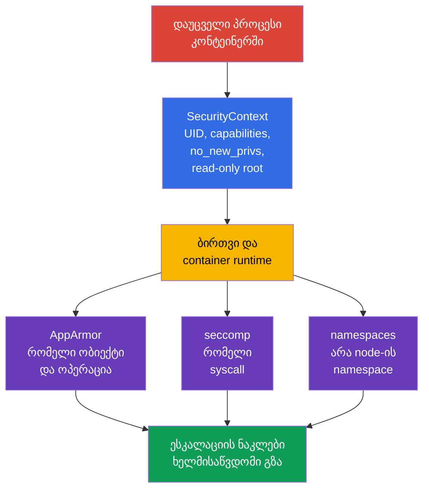
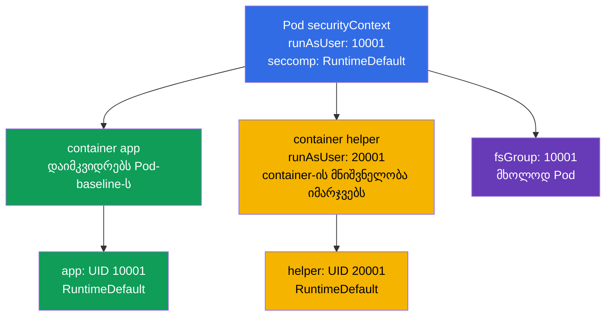
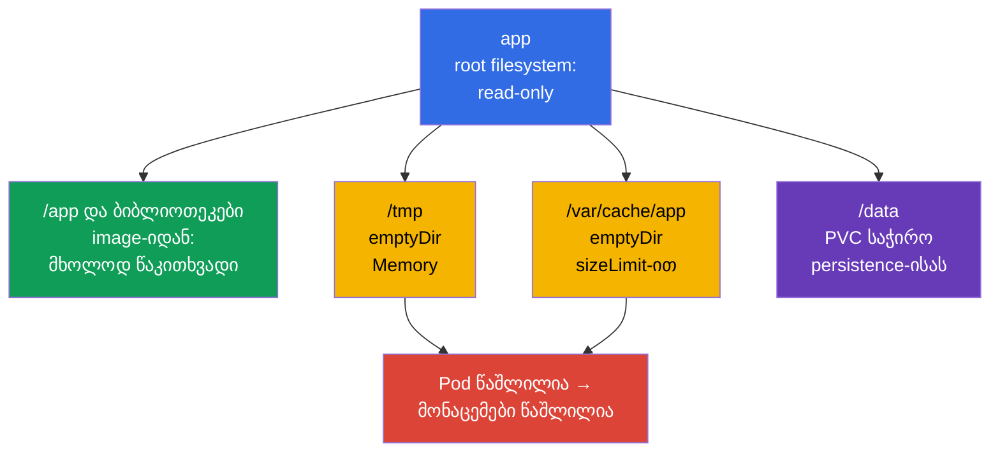

[Русская версия](ru.md) · [Eng version](README.md) · [Versión en español](es.md) · [Version française](fr.md) · [Deutsche Version](de.md) · [繁體中文版](tw.md) · [日本語版](jp.md)

# თავი 18. გამკვრივებული SecurityContext: პროცესის მინიმალური პრივილეგიები

> **პრობლემა.** დაუცველობა აპლიკაციაში shell-იდან ერთ კონტეინერში node-ის ხელში ჩაგდებად ან
> persistence-ად იქცევა, თუ პროცესი მუშაობს root-ის სახელით, ინარჩუნებს capabilities-ს,
> შეუძლია გაზარდოს პრივილეგიები ან ჩაანაცვლოს binary-ები writable root filesystem-ში. ერთიანი
> შემზღუდავი კონტრაქტის გარეშე ერთი დაუცველი default Pod-ში ან sidecar-ში აფართოებს
> კომპრომეტაციის შედეგებს; გამკვრივებული `SecurityContext` წინასწარ კვეთს ამ ზედმეტ გზებს.

> **რა არის შემდეგ.** AppArmor ზღუდავდა, რომელ ობიექტებთან შეეძლო პროცესს მიმართვა, ხოლო
> seccomp - რომელი system call-ების გაკეთება შეეძლო. ახლა შევკრიბოთ ეს და პროცესის საბაზისო
> შეზღუდვები ერთ განმეორებად Pod-კონტრაქტში: non-root, capabilities-ის ცარიელი ნაკრები,
> პრივილეგიების გაზრდის აკრძალვა, მხოლოდ წაკითხვადი root filesystem და seccomp-პროფილი. ეს
> არის CKS-ის ოფიციალური დომენის **Minimize Microservice Vulnerabilities (20%)** მასალა:
> `SecurityContext` და Pod Security Standards. Cluster Setup მას ირიბად
> ეხება: node-ების kubelet-სა და runtime-ს უნდა შეეძლოთ ამ პარამეტრების მხარდაჭერა და
> გამოყენება. მიზანი არ არის „ყველგან true/false დაყენება",
> არამედ ის, რომ ყოველმა კონტეინერმა მიიღოს ზუსტად საჭირო უფლებები და ეს დამტკიცებადი იყოს.

> **რა გჭირდებათ CKA-დან.** `SecurityContext`-ის ველები, UID/GID, capabilities და Pod-/
> კონტეინერ-დონეები განხილულია [CKA-ს 20-ე თავში](../../../cka/course/20/ge.md). აქ ისინი
> გამოიყენება, როგორც ერთიანი გამკვრივებული baseline `seccompProfile`-თან, `privileged`-სა
> და host namespaces-ზე უარის თქმასთან, writable `emptyDir`-თან და effective-მდგომარეობის
> შემოწმებასთან ერთად, და არა მხოლოდ YAML-თან.

> 🧠 `SecurityContext` ზღუდავს პროცესის უფლებებს, მაგრამ არ აღმოფხვრის image-ის, RBAC-ის, ქსელის ან რესურსების დაუცველობებს.

## 18.1. მოდელი: პროცესის დაცვა, და არა „უსაფრთხო image"

კონტეინერი იზოლირებს filesystem-სა და namespaces-ს, მაგრამ მისი პროცესი მაინც მიმართავს
ბირთვს. თუ პროცესი კომპრომეტირებულია, ზედმეტი UID 0, capability, writable root filesystem
ან node-ის namespace-ზე წვდომა აფართოებს შედეგებს. `SecurityContext` runtime-ს გადასცემს
პროცესის კონკრეტულ საზღვრებს; ის არ ცვლის image-ის დაუცველობების გასწორებას, RBAC-ს,
NetworkPolicy-ს, AppArmor-ს ან seccomp-ს. ის ასევე **არ** განსაზღვრავს CPU-, memory- ან
ephemeral-storage requests/limits-ს და არ იცავს resource exhaustion/noisy-neighbor-ისგან:
ეს ცალკე Pod-ველები და კონტროლებია, როგორიცაა `LimitRange`/`ResourceQuota`.



მნიშვნელოვანი შეზღუდვა: `runAsNonRoot: true` - გაშვების შემოწმებაა და არა sandbox. Non-root
პროცესს `CAP_SYS_ADMIN`-ით, `privileged: true`-ით, `hostPID: true`-ით ან writable
`hostPath`-ით მაინც შეუძლია მიიღოს საშიში გზა node-მდე. და პირიქით, seccomp არ გამოასწორებს
აპლიკაციას, რომელიც secret-ს `/tmp`-ში წერს. დაცვა შენდება ფენებად.

| საზღვარი | რას ამცირებს | რას არ უზრუნველყოფს |
|---|---|---|
| UID/GID და `runAsNonRoot` | root-ის სახელით გაშვების შედეგებს, წვდომის უფლებების შეცდომებს | Linux capabilities-ისა და host-წვდომის არარსებობას |
| `capabilities.drop: ["ALL"]` | ბირთვის ცალკეულ პრივილეგიებს | აპლიკაციისა და ქსელის უსაფრთხოებას |
| `allowPrivilegeEscalation: false` | გადასვლას setuid/setgid-ისა და file capabilities-ის მეშვეობით | უკვე გაცემული capabilities-ის არარსებობას |
| `readOnlyRootFilesystem: true` | ჩაწერას writable rootfs-ფენაში, persistence-ს და binary-ების ჩანაცვლებას | ტომებში, `emptyDir`-სა და memory-ში ჩაწერის აკრძალვას |
| `seccompProfile` | ხელმისაწვდომი syscalls-ის ნაკრებს | წვდომას ნებადართულ ფაილებთან ან API-სთან |
| `privileged`-ის, `host*`-ის, `hostPath`-ის არარსებობა | პირდაპირ გზას namespaces-მდე, მოწყობილობებამდე და node-ის მონაცემებამდე | Kubernetes API-ის სწორ ავტორიზაციას |

> 🎯 Baseline: non-root identity, `drop: ["ALL"]`, `allowPrivilegeEscalation: false`, მხოლოდ წაკითხვადი root filesystem, `RuntimeDefault` და ვიწრო writable ტომები.

## 18.2. გამკვრივებული baseline: ერთი Pod, რამდენიმე საზღვარი

ქვემოთ - პრაქტიკული baseline HTTP-აპლიკაციისთვის. ის განზრახ იყენებს high port `8080`-ს:
ასე არ სჭირდება capability `NET_BIND_SERVICE`. Image-ს უნდა ჰქონდეს მომხმარებელი UID
`10001`-ით და უნდა შეეძლოს მუშაობა read-only root filesystem-ით. ნუ ჩაანაცვლებთ ამას ბრმა
`runAsUser`-ით: ჯერ შეამოწმეთ, რომ პროგრამა კითხულობს კონფიგურაციასა და სერტიფიკატებს, ხოლო
მისი ჩაწერის კატალოგები ტომებში არის გატანილი.

```yaml
apiVersion: v1
kind: Pod
metadata:
  name: hardened-web
  labels:
    app: hardened-web
spec:
  automountServiceAccountToken: false
  securityContext:                         # Pod-ის საერთო პარამეტრები
    runAsNonRoot: true
    runAsUser: 10001
    runAsGroup: 10001
    fsGroup: 10001
    seccompProfile:
      type: RuntimeDefault
  containers:
  - name: app
    image: registry.example.invalid/web:1.4.2
    ports:
    - containerPort: 8080
    securityContext:                       # კონკრეტულად app-ის პარამეტრები
      privileged: false
      allowPrivilegeEscalation: false
      readOnlyRootFilesystem: true
      capabilities:
        drop:
        - ALL
    volumeMounts:
    - name: tmp
      mountPath: /tmp
    - name: cache
      mountPath: /var/cache/web
  volumes:
  - name: tmp
    emptyDir:
      medium: Memory
      sizeLimit: 64Mi
  - name: cache
    emptyDir:
      sizeLimit: 256Mi
```

ეს არ არის უნივერსალური „ჩასვი და დაივიწყე" manifest. `automountServiceAccountToken: false`
შესაფერისია მხოლოდ მაშინ, როცა აპლიკაციას Kubernetes API არ სჭირდება. თუ ტოკენი
საჭიროა, შექმენით ცალკე ServiceAccount და მინიმალური RBAC, და არა დააბრუნოთ default
token. `emptyDir.medium: Memory` სწრაფია, მაგრამ ხარჯავს Pod-ის/node-ის memory-ს და
გავსების შემთხვევაში შეუძლია OOM-მდე მიგვიყვანოს; disk-cache-ისთვის ჩვეულებრივ ტოვებენ
default filesystem-ს და აყენებენ `sizeLimit`-ს.

### რა იცავს კონკრეტულად აქ

- **`runAsNonRoot: true`** უარყოფს გაშვებას, თუ effective UID აღმოჩნდა 0. ცხადი
  `runAsUser: 10001` და `runAsGroup: 10001` არ აძლევს runtime-ს image-ის ბუნდოვან
  `USER`-ზე დამოკიდებულობის საშუალებას. ნულისგან განსხვავებული UID უნდა შეესაბამებოდეს
  image-ის ფაილებზე ხელმისაწვდომ უფლებებს.
- **`capabilities.drop: ["ALL"]`** აშორებს capabilities-ს, რომლებიც runtime-ს
  ნაგულისხმევად შეეძლო დაეტოვებინა. დაამატეთ გამონაკლისი მხოლოდ გაზომვადი საჭიროების
  შემდეგ. მაგალითად, `NET_BIND_SERVICE` გამართლებულია legacy-პროცესისთვის 80-ე პორტზე,
  მაგრამ სასურველია აპლიკაცია გადავიდეს 8080-ზე და ნაკრები ცარიელი დარჩეს.
- **`allowPrivilegeEscalation: false`** აყენებს Linux `no_new_privs`-ს: exec-ს არ შეუძლია
  მეტი უფლების მიღება setuid/setgid binary-ის ან file capabilities-ის მეშვეობით. ეს არ
  აშორებს კონტეინერისთვის უკვე გაცემულ უფლებებს და არ ცვლის `drop: ALL`-ს. Kubernetes ამ
  მნიშვნელობას ხდის effective `true`-ს, თუ კონტეინერი არის `privileged` ან აქვს
  `CAP_SYS_ADMIN`.
- **`readOnlyRootFilesystem: true`** ხდის კონტეინერის writable root filesystem-ს
  ჩაუწერელს; image-ის layers ისედაც immutable-ია. ეს ცხადად mount-გაკეთებულ ტომებს არ
  ზღუდავს: ისინი წერადი ან წაკითხვადი რჩება საკუთარი mount-ოფციებისა და permissions-ის
  მიხედვით, ამიტომ writable mount არ უნდა იყოს `hostPath`.
- **`seccompProfile.type: RuntimeDefault`** რთავს runtime-ის ნაგულისხმევ პროფილს Pod-ის
  ყველა კონტეინერისთვის. ის კვეთს იშვიათად საჭირო და რისკიან syscalls-ების რიგს, მაგრამ
  თავსებადობა მოწმდება რეალურ დატვირთვაზე.
- **`fsGroup: 10001`** ეხმარება non-root პროცესს, მიიღოს ჯგუფური წვდომა მხარდაჭერილ
  volume-ზე. ეს არის Pod-პარამეტრი და არა image layer-ის ყოველი ფაილის owner-ის შესწორების
  ხერხი.

> 🎯 Container-დონის override მოქმედებს მხოლოდ ამ container-ზე; capabilities, `privileged`, escalation და read-only root filesystem შეამოწმეთ app-ში, sidecar-ში და initContainer-ში.

## 18.3. ველების განლაგება და კონფლიქტები დონეებს შორის

`securityContext` არსებობს Pod-დონეზე (`spec.securityContext`) და თითოეული
კონტეინერის დონეზე (`spec.containers[].securityContext`, ასევე init- და ephemeral
კონტეინერებში). ყველა ველი ორივე დონეზე დასაშვები არ არის. ველებისთვის, რომლებიც
ორივე ადგილას ხელმისაწვდომია, კონტეინერის მნიშვნელობას აქვს პრიორიტეტი **ამ
კონტეინერისთვის**. Pod-ის მნიშვნელობა რჩება baseline-ად მეზობელი კონტეინერებისთვის.



| ველი | სად აყენებენ | წესი და პრაქტიკული დასკვნა |
|---|---|---|
| `runAsUser`, `runAsGroup`, `runAsNonRoot` | Pod და container | container-ის override მოქმედებს მხოლოდ მასზე; არ დამალოთ გამონაკლისი sidecar-ში |
| `seccompProfile` | Pod და container | container-პროფილის override ძლიერია; დააყენეთ `RuntimeDefault` Pod-ზე და დოკუმენტირება გაუკეთეთ ყოველ `Localhost`-override-ს |
| `fsGroup`, `fsGroupChangePolicy`, `supplementalGroups`, `supplementalGroupsPolicy` | მხოლოდ Pod | ეს არის საერთო Pod-ის და მისი ტომების კონტექსტი; container-ის `fsGroup` არ არსებობს |
| `capabilities`, `privileged`, `allowPrivilegeEscalation`, `readOnlyRootFilesystem` | მხოლოდ container | გაიმეორეთ გამკვრივებული პარამეტრები **ყოველ** container-სა და initContainer-ში |
| `hostNetwork`, `hostPID`, `hostIPC`, `hostUsers` | Pod spec | ეს არ არის `securityContext`; container-ს არ შეუძლია უსაფრთხოდ „გადაფაროს" host namespace-ზე წვდომა |

კონფლიქტის მაგალითი დიაგნოსტიკაში სასარგებლოა:

```yaml
spec:
  securityContext:
    runAsNonRoot: true
    runAsUser: 10001
    seccompProfile:
      type: RuntimeDefault
  containers:
  - name: app
    image: registry.example.invalid/app:1.4.2
    securityContext:
      runAsUser: 20001                 # app-ის effective UID იქნება 20001
      seccompProfile:
        type: Localhost                 # არა RuntimeDefault
        localhostProfile: profiles/app.json
```

აქ `app` ეშვება UID `20001`-ით და იღებს node-ლოკალურ პროფილს. `runAsNonRoot: true`
დამკვიდრებულია, თუ ის არ არის override-გაკეთებული. ეს თავისთავად შეცდომა არ არის, მაგრამ
`Localhost` მოითხოვს, რომ პროფილი უკვე დაყენებული იყოს **ყოველ** node-ზე, სადაც Pod-ს
შეუძლია მოხვდეს; წინააღმდეგ შემთხვევაში კონტეინერი არ შეიქმნება. ნუ განსჯით ერთი
`spec.securityContext`-ით: შეამოწმეთ ყოველი container.

> 🔬 `Strict` გამორთავს image-ის ირიბ ჯგუფებს და მოითხოვს Kubernetes/CRI support-ისა და node-ის რეაქციის შემოწმებას.

### `supplementalGroupsPolicy: Strict`: image-ის ირიბი ჯგუფების გარეშე

ნაგულისხმევად `Merge` supplementary groups-ს ამატებს image-ის `/etc/group`-იდან primary
user-ის წევრობას. `Strict` ამ merge-ს არ აკეთებს: რჩება მხოლოდ GID-ები `fsGroup`-იდან,
`supplementalGroups`-იდან და `runAsGroup`-იდან. ეს სასარგებლოა, როცა image-ში
გამოცხადებულმა ჯგუფმა პროცესს არ უნდა მისცეს მოულოდნელი წვდომა volume-ზე.

```yaml
apiVersion: v1
kind: Pod
metadata:
  name: strict-groups
spec:
  securityContext:
    runAsUser: 1000
    runAsGroup: 3000
    fsGroup: 4000
    supplementalGroups: [5000]
    supplementalGroupsPolicy: Strict
  containers:
  - name: app
    image: registry.example.invalid/app:1.4.2
```

`supplementalGroupsPolicy` — GA/stable Kubernetes v1.35-ში (lifecycle: alpha v1.31 → beta
v1.33 → GA v1.35), ოფიციალური Kubernetes release blog-ის მიხედვით. Feature gate
`SupplementalGroupsPolicy` დაფიქსირებულია enabled by default მდგომარეობაში. მაინც
საჭიროა CRI support-ით: ცნობილი support აქვს containerd-ს v2.0-იდან და CRI-O-ს
v1.31-იდან. შეამოწმეთ node `status.features.supplementalGroupsPolicy: true`-ით. v1.33-იდან
kubelet უარყოფს Pod-ს `Strict`-ით მხარდაუჭერელ node-ზე და არა ჩუმად იყენებს `Merge`-ს;
events-ში იქნება `SupplementalGroupsPolicyNotSupported`.

> 🔬 SELinux labels, `procMount`, sysctls და Windows identity მოითხოვს Kubernetes-ის, runtime-ის, CSI-ის, OS-ისა და policy-ის შემოწმებას.

### გაფართოებული: SELinux, `/proc`, sysctls და Windows-scope

ეს იმავე `SecurityContext`-ის ველებია, მაგრამ ისინი არ წარმოადგენენ ზემოთ ჩამოთვლილ
უნივერსალურ Linux-baseline-ს. `seLinuxOptions` Pod-ზე ან container-ზე ადგენს პროცესის
SELinux label-ს; container-დონის მნიშვნელობა Pod-დონის მნიშვნელობას გადაფარავს. ჩვეულებრივი
რეკურსიული SELinux relabel-ისას სწორედ **container runtime** ცვლის ტომის შემცველობის
inode-label-ს, სანამ container-ი მას გამოიყენებს - და არა kubelet. Pod-დონის
`seLinuxChangePolicy: MountOption` ითხოვს relabel-ს mount-ოფცია `-o context=`-ის
მეშვეობით, მაგრამ თავისთავად ამას არ იძლევა გარანტიად. PVC-სთვის access mode-ით,
რომელიც `ReadWriteOncePod`-ისგან განსხვავდება, Kubernetes v1.36-ში საჭიროა ჩართული feature
gate `SELinuxMount` (ის ნაგულისხმევად გამორთულია) და CSI-დრაივერისთვის
`CSIDriver.spec.seLinuxMount: true`; წინააღმდეგ შემთხვევაში Kubernetes იყენებს ჩვეულებრივ
რეკურსიულ relabel-ს. ნუ შეცვლით label-ს ან policy-ს სისწრაფის გულისთვის კონკრეტული
CSI-ისა/ფაილური სისტემის იზოლაციისა და თავსებადობის ტესტის გარეშე.

> 🔬 **Upstream v1.37.** Kubernetes v1.37-ში `SELinuxMount` გახდა GA და ჩართულია ნაგულისხმევად. SELinux-ჩართული კლასტერის upgrade-მდე შეამოწმეთ volume-label-ის კონფლიქტები; საჭიროების შემთხვევაში workload-ს შეუძლია ცხადად შეინარჩუნოს რეკურსიული ქცევა `spec.securityContext.seLinuxChangePolicy: Recursive`-ის მეშვეობით. დეტალები: [Kubernetes v1.37 Security Delta](../APPENDIX_K8S_137_SECURITY_DELTA_GE.md).

`procMount` — მხოლოდ container-დონის Linux-ოფციაა: უსაფრთხო default `Default` ტოვებს
`/proc`-ის მგრძნობიარე ნაწილებს დაფარულს; `Unmasked` აფართოებს პროცესის ხედვას და
არ შეესაბამება restricted workload-ს. Kubernetes v1.30-იდან `Unmasked` დასაშვებია
მხოლოდ user namespace-ში მყოფი Pod-ისთვის, ანუ `spec.hostUsers: false`-ის შემთხვევაში.
Pod-დონის `securityContext.sysctls` ადგენს sysctls-ს Pod-ის network-/IPC-namespace-ისთვის.
გამოიყენეთ მხოლოდ safe sysctls Kubernetes-ის დოკუმენტაციიდან; unsafe sysctls მოითხოვს
kubelet-ის allowlist-ს და შეუძლია კონფლიქტში მოვიდეს host namespaces-თან, ამიტომ ეს
გააზრებული node-დონის გამონაკლისია და არა აპლიკაციის პარამეტრი.

Windows-ისთვის ეს Linux-კონტროლები არ გამოიყენება. Windows-container-ის identity-ს
ადგენენ `windowsOptions.runAsUserName`-ით Pod-ზე ან container-ზე (container-override-ს
აქვს პრიორიტეტი); საჭიროების შემთხვევაში იქვე ეწყობა GMSA. შეამოწმეთ username, image და
Windows-node-ის support ცალკე: Linux `runAsUser`/UID და SELinux არ არის
`runAsUserName`-ის ჩანაცვლება.

> 🧠 Init, sidecar და ephemeral container-ს აქვთ საკუთარი effective-პარამეტრები; სუსტი კონტეინერი აღწევს ირგვლივ Pod-ის hardening-ს.

### Init, sidecar და ephemeral container - ცალკეული პროცესები

`initContainers` სრულდება აპლიკაციამდე, მაგრამ შეუძლია შექმნას ფაილები შეუსაბამო
owner/mode-ით ან მოითხოვოს ზედმეტი უფლებები. გამკვრივებული workload-ისთვის ისინი იღებენ
იმავე პრინციპს: ცხადი non-root UID, ყველა capabilities-ის მოხსნა, no escalation,
read-only root და ცალკე writable ტომი, თუ ეს საჭიროა. ნუ გაუშვებთ initContainer-ს root-ად
მხოლოდ `chown -R`-ისთვის: ეს ხშირად ნიღბავს image-ის შეცდომას. ჯერ სცადეთ `fsGroup`,
image-ში სწორი ownership ან storage-class policy; privileged გამონაკლისი უნდა იყოს
მოკლე, დასაბუთებული და იზოლირებული.

Ephemeral container, დამატებული `kubectl debug`-ის მეშვეობით, ასევე ავტომატურად არ
დაიმკვიდრებს workload-ის container security context-ს. ის სასარგებლოა controlled
incident response-ისთვის, მაგრამ არ უნდა იქცეს PSA-ის ან გამკვრივებული baseline-ის
გვერდის ავლის გზად: შეათანხმეთ მისი image, identity და admission policy, შეზღუდეთ
სიცოცხლის ხანგრძლივობა და დააფიქსირეთ ცვლილება. მუდმივი დიაგნოსტიკისთვის შეცვალეთ
Deployment-template და შექმენით ახალი Pod, და არ სცადოთ უკვე გაშვებული Pod-ის
უცვლელი `securityContext`-ის შეცვლა.

> 🎯 მოაშორეთ `privileged`, `hostPID`, `hostNetwork`, `hostIPC` და ფართო `hostPath`: non-root UID არ ხურავს Pod-ის საზღვრის გადალახვის ამ გზებს.

## 18.4. `privileged` და `host*`: Pod-ის საზღვრის საშიში გვერდის ავლა

ზოგიერთი პარამეტრი პროცესს აძლევს წვდომას არა მხოლოდ საკუთარ Pod-ზე, არამედ
node-ის რესურსებზე. ისინი შეიძლება საჭირო იყოს CNI-ს, CSI-ს, node monitoring-ს ან
runtime agent-ს, მაგრამ თითქმის არასოდეს არის საჭირო ჩვეულებრივ API-ს, worker-ს ან
batch job-ს. „პროცესი არ არის root" ასეთ წვდომას უსაფრთხოს არ ხდის.

| პარამეტრი | რას ხსნის | რატომ არის ეს რისკი | უსაფრთხო ალტერნატივა |
|---|---|---|---|
| `privileged: true` | თითქმის ყველა capabilities, მოწყობილობებს და runtime isolation-ის შესუსტებას | კონტეინერის კომპრომეტაცია node-ის კომპრომეტაციასთან ახლოსაა | ჩვეულებრივი container `drop: ALL`-ით; ერთი capability დაამატეთ მხოლოდ დამტკიცებული საჭიროებისას |
| `hostPID: true` | node-ის პროცესებს PID-namespace-ში | შესაძლებელია host-პროცესების ხედვა/სიგნალის გაგზავნა, მგრძნობიარე `/proc`-მონაცემების შეგროვება | Metrics API, kubelet Summary API ან ცალკე სანდო node-agent |
| `hostNetwork: true` | node-ის network-namespace-ს, host-პორტებსა და მის IP-ს | Pod-ქსელის იზოლაციის გვერდის ავლას, პორტების კონფლიქტს, node-ის localhost-სერვისებზე წვდომას | Service, Ingress, NetworkPolicy და ჩვეულებრივი Pod-ქსელი |
| `hostIPC: true` | node-ის IPC-namespace-ს | წვდომას host-პროცესების shared memory-სა და IPC-ზე | volume, Service ან auth-ის მქონე message queue |
| `hostPath`-ტომი | node-ის filesystem-ის შერჩეულ გზას | kubelet-credentials-ის, container-socket-ების, runtime-state-ის წაკითხვას ან host-ზე ჩაწერას | PVC, ConfigMap, Secret, `emptyDir`; ვიწრო read-only გზა მხოლოდ სანდო daemon-ისთვის |

`privileged: true` აიძულებს `allowPrivilegeEscalation`-ს effective `true` გახდეს და
ეწინააღმდეგება გამკვრივებული workload-ის მიზანს. ასეთი container ასევე იღებს seccomp
`Unconfined`-ს, AppArmor მისთვის იგნორირდება, ხოლო SELinux context ხდება `unconfined_t`.
ნუ ეცდებით ამის „გასწორებას" მეზობელი `allowPrivilegeEscalation: false`-ით: container
რჩება privileged-ად. იგივე effective-წესი `allowPrivilegeEscalation`-ისთვის მოქმედებს
`CAP_SYS_ADMIN`-ის დროსაც. ანალოგიურად, `hostNetwork: true`-ს ვერ გახდით უსაფრთხოს
ერთი `NetworkPolicy`-ით, რადგან NetworkPolicy ჩვეულებრივ გათვლილია ჩვეულებრივ
Pod-ქსელზე და არა node-ის ქსელურ namespace-ზე.

```yaml
# წითელი ალმები ჩვეულებრივი აპლიკაციისთვის
spec:
  hostPID: true
  hostNetwork: true
  containers:
  - name: app
    securityContext:
      privileged: true
    volumeMounts:
    - name: host-root
      mountPath: /host
  volumes:
  - name: host-root
    hostPath:
      path: /
```

გამოძიებისთვის ჯერ იპოვეთ, **რატომ** გაჩნდა პარამეტრი: Helm chart, injected sidecar,
initContainer, DaemonSet თუ ხელით patch. ნუ მოაშორებთ `host*`-ს CNI-/CSI-/monitoring
DaemonSet-იდან მისი კონტრაქტის გაგების გარეშე: შეიძლება ჩაიშალოს მთელი კლასტერის ქსელი
ან storage. ჩვეულებრივი workload-ისთვის ჩაანაცვლეთ წვდომა მხარდაჭერილი API-თ/volume-ით
და შეამოწმეთ rollout staging-ში.

სწრაფი აუდიტი ყველა Pod-ისთვის namespaces-ის მიხედვით:

```bash
kubectl get pods -A -o json | jq -r '
  def allContainers: ((.spec.containers // []) + (.spec.initContainers // []) + (.spec.ephemeralContainers // []));
  .items[]
  | [allContainers[] | select(.securityContext.privileged == true) | .name] as $privileged
  | [(.spec.volumes // [])[] | select(.hostPath != null) | (.name + "=" + .hostPath.path)] as $hostPaths
  | select(.spec.hostPID == true or .spec.hostNetwork == true or .spec.hostIPC == true or ($privileged|length)>0 or ($hostPaths|length)>0)
  | [.metadata.namespace, .metadata.name,
     ("hostPID=" + ((.spec.hostPID // false)|tostring)),
     ("hostNetwork=" + ((.spec.hostNetwork // false)|tostring)),
     ("hostIPC=" + ((.spec.hostIPC // false)|tostring)),
     ("privileged=" + ($privileged|join(","))),
     ("hostPath=" + ($hostPaths|join(",")))] | @tsv'
```

ბრძანება აჩვენებს კანდიდატებს, მაგრამ არა verdict-ს. სისტემურ namespace-ს და
DaemonSet-ს სჭირდება კონტექსტური review: owner, დანიშნულება, node placement, მინიმალური
წვდომა, manifest და admission-კონტროლი.

> 🔬 UID/GID mapping და Linux-ის, ბირთვის, CRI/OCI-runtime-ისა და ფაილური სისტემების მოთხოვნები `hostUsers: false`-ისთვის.

### `hostUsers: false`: user namespaces Kubernetes v1.36-ში

Kubernetes v1.36-ში user namespaces stable-ია. `hostUsers: false` სთხოვს kubelet-ს,
Pod-ისთვის შექმნას user namespace და შეარჩიოს არაგადაკვეთადი UID/GID mapping: UID 0 ან
`runAsUser` container-ის შიგნით ასახვას node-ის არაპრივილეგირებულ UID/GID-ზე. Capabilities
მოქმედებს მხოლოდ ამ namespace-ში: მაგალითად, `CAP_SYS_ADMIN` მის ფარგლებს გარეთ
უფლებას არ იძლევა. ეს დამატებითი ბარიერია workload-ისთვის, რომელსაც container-ის შიგნით
root სჭირდება, მაგრამ host namespaces-ზე ან node-ის რესურსებზე წვდომა არ სჭირდება.

```yaml
apiVersion: v1
kind: Pod
metadata:
  name: userns-tool
spec:
  hostUsers: false
  containers:
  - name: tool
    image: registry.example.invalid/tool:1.4.2
    securityContext:
      allowPrivilegeEscalation: false
      capabilities:
        drop: ["ALL"]
```

ეს Linux-only რეჟიმია. ნაგულისხმევად მისი შეთავსება არ შეიძლება `hostNetwork`-თან,
`hostPID`-თან ან `hostIPC`-თან, ხოლო raw block volumes `volumeDevices`-ის მეშვეობითაც
აკრძალულია. v1.36-ში alpha gate `UserNamespacesHostNetworkSupport` (default `false`)
ცალკე ანებართლებს `hostNetwork: true`-ს `hostUsers: false`-თან ერთად; `hostPID` და
`hostIPC` ისევ აკრძალულია. გამკვრივებული baseline არ უნდა ეყრდნობოდეს ამ alpha-
გამონაკლისს: ასეთი შეთანხმება მოითხოვს ცხად gate-ს, ცალკე review-სა და threat model-ის
შემოწმებას. საჭიროა idmapped mounts node-ის filesystem-სა და ყველა volume-ზე,
მხარდამჭერი CRI/OCI-runtime და თავსებადი ბირთვი; აქტუალურ დოკუმენტაციაში მითითებულია
containerd v2.0+, CRI-O v1.25+, runc v1.2+ ან crun v1.9+. NFS-ს idmapped mounts-ის
support არ აქვს. rollout-მდე შეამოწმეთ ეს პირობები ყველა node-ზე, სადაც Pod-ს შეუძლია
მოხვდეს.

> 🎯 ჩაწერის შეცდომისას იპოვეთ path და დაამატეთ მინიმალური `emptyDir` ან PVC შესაფერისი უფლებებითა და lifecycle-ით.

## 18.5. Read-only root filesystem აპლიკაციის დაზიანების გარეშე

`readOnlyRootFilesystem: true` აღმოაჩენს ირიბ ჩაწერებს: PID-ფაილებს, დროებით
ფაილებს, cache-ს, generated config-ს, logs-ს ან package manager-ს. გადაწყვეტა არ არის
შეზღუდვის მოხსნა, არამედ ყოველი writable path-ისა და მისი lifecycle-ის ცხადად აღწერა.



`emptyDir` იქმნება Pod-ისთვის node-ზე და საზიარო ხდება მისი კონტეინერებისთვის. ის
გადაურჩება container-ის restart-ს იმავე Pod-ის ფარგლებში, მაგრამ ქრება Pod-ის
წაშლის/ხელახლა შექმნის შემდეგ; ეს არ არის storage მონაცემებისთვის, რომლებიც უნდა
აღდგეს. `sizeLimit` ზღუდავს ზუსტად მოსალოდნელ მოცულობას, მაგრამ არ ცვლის
requests/limits-ს და node ephemeral storage-ის monitoring-ს.

მაგალითი პროგრამისთვის, რომელსაც სჭირდება `/tmp`, runtime-დირექტორია და cache:

```yaml
spec:
  securityContext:
    runAsNonRoot: true
    runAsUser: 10001
    runAsGroup: 10001
    fsGroup: 10001
    seccompProfile:
      type: RuntimeDefault
  containers:
  - name: app
    image: registry.example.invalid/reporter:2.1.0
    securityContext:
      allowPrivilegeEscalation: false
      readOnlyRootFilesystem: true
      capabilities:
        drop: ["ALL"]
    volumeMounts:
    - name: tmp
      mountPath: /tmp
    - name: run
      mountPath: /var/run/reporter
    - name: cache
      mountPath: /var/cache/reporter
  volumes:
  - name: tmp
    emptyDir:
      medium: Memory
      sizeLimit: 32Mi
  - name: run
    emptyDir:
      sizeLimit: 8Mi
  - name: cache
    emptyDir:
      sizeLimit: 128Mi
```

ნუ გააკეთებთ mount `emptyDir`-ს `/`-ზე და ნუ გააკეთებთ ფართო writable mount-ს,
როგორიცაა `/var`, აპლიკაციის კონტრაქტის გარეშე: ეს ისევ მალავს ჩაწერებს, რომლებიც
გინდოდათ გეკონტროლებინათ. წერტილოვანი გზები უკეთ აჩვენებს, რა არის ზუსტად ნებადართული.
Logs ჩვეულებრივ იგზავნება stdout/stderr-ზე; ფაილი `emptyDir`-ზე გამართლებულია მხოლოდ
მაშინ, თუ ეს ესაჭიროება აპლიკაციას ან ლოკალურ sidecar-ს.

### Debug hardening-ის მოხსნის გარეშე

სიმპტომი `Read-only file system` - სასარგებლო სიგნალია. ჯერ დაადგინეთ path, შემდეგ
გადაწყვიტეთ, დროებითია თუ არა ის, cache არის თუ მონაცემები. ნუ „მოაგვარებთ" incident-ს
`privileged: true`-ის დამატებით ან `hostPath`-ში ჩაწერით.

```bash
# Events და CreateContainerConfigError/CrashLoopBackOff-ის მიზეზი
kubectl describe pod hardened-web
kubectl logs hardened-web -c app --previous

# მხოლოდ ნებადართული exec-ის შემთხვევაში: შეამოწმეთ mount და უფლებები app-ის შიგნით
kubectl exec hardened-web -c app -- id
kubectl exec hardened-web -c app -- sh -c 'mount | grep -E " /tmp |/var/cache/web"'
kubectl exec hardened-web -c app -- sh -c 'touch /tmp/probe && rm /tmp/probe'

# შეადარეთ ფაქტობრივი volumeMounts workload-ის template-ს
kubectl get pod hardened-web -o yaml
```

თუ აპლიკაციას shell-ინსტრუმენტი სჭირდება, ნუ დაამატებთ მას production-image-ში „debug-
ისთვის" და ნუ გახდით root filesystem writable-ს. სასურველია logs, metrics, trace,
დროებითი გამკვრივებული debug-Pod ცხადი NetworkPolicy-თი ან შეთანხმებული ephemeral-
container procedure. დიაგნოსტიკის შემდეგ წაშალეთ debug-არტეფაქტი და თუ ჩაწერა
მართლაც კონტრაქტის ნაწილია, ჩართეთ template-ში მინიმალური `emptyDir`-mount.

> 🎯 გამოიყენეთ `RuntimeDefault` და დაამტკიცეთ ეფექტი `/proc/1/status`-ის მეშვეობით; `Localhost` მოითხოვს პროფილის მიწოდებას ყოველ დასაშვებ node-ზე.

## 18.6. Seccomp baseline-ში: RuntimeDefault, Localhost და მტკიცებულება

`seccompProfile` ადგენს ბირთვის რეაქციას system calls-ზე. ჩვეულებრივი workload-ისთვის
გამოიყენეთ `RuntimeDefault`: runtime გამოიყენებს საკუთარ მხარდაჭერილ პროფილს. `Unconfined`
გამორთავს ამ საზღვარს და არ ესადაგება გამკვრივებულ baseline-ს. `Localhost` საჭიროა
მხოლოდ მაშინ, როცა გუნდი ფლობს პროფილს, უზრუნველყოფს მის მიწოდებას ყველა შესაფერის
node-ზე და ტესტავს runtime-ის განახლებებს.

| ტიპი | როდის გამოვიყენოთ | ოპერაციული რისკი |
|---|---|---|
| `RuntimeDefault` | baseline თითქმის ყველა აპლიკაციისთვის | პროფილი დამოკიდებულია runtime-სა და ვერსიაზე; განახლებები ტესტეთ |
| `Localhost` | ვიწრო syscall-კონტრაქტი, მიწოდებული node configuration management-ით | ფაილის არარსებობა ერთ node-ზე იწვევს container-ის შექმნის შეცდომას |
| `Unconfined` | მოკლე დიაგნოსტიკური გამონაკლისი ცხადი approval-ით | syscall-საზღვრის არარსებობა; გამონაკლისი ადვილად ხდება მუდმივი |

```yaml
# Pod-baseline: დაიმკვიდრებს ყველა container, თუ container-override არ დაუყენებიათ
spec:
  securityContext:
    seccompProfile:
      type: RuntimeDefault
```

`Localhost`-ისთვის path მითითებულია kubelet-ის seccomp-დირექტორიის მიმართ ფარდობითად,
და არა container-ის filesystem-ის მიმართ ფარდობითად. ნუ დააკოპირებთ JSON-პროფილს
ConfigMap-ში და ნუ ელოდებით, რომ kubelet მას დაინახავს. პროფილი უნდა მიეწოდოს node-ებს
სანდო ხერხით, scheduling უნდა იყოს მიმაგრებული node-ებზე, სადაც ის არსებობს, და
ფაქტობრივი გამოყენება უნდა დამტკიცდეს. დეტალური მოდელი და syscall denials-ის დებაგი -
[მე-17 თავში](../17/ge.md).

პროცესის Linux namespace-ის შიგნიდან შემოწმება:

```bash
kubectl exec hardened-web -c app -- sh -c 'grep -E "^(NoNewPrivs|Seccomp):" /proc/1/status'
# მოსალოდნელია: NoNewPrivs: 1 და Seccomp: 2 (filter) ტიპური RuntimeDefault-runtime-სთვის
```

`Seccomp: 2` ამტკიცებს, რომ PID 1-ისთვის ჩართულია ფილტრი, მაგრამ არ ამტკიცებს, რომ
საჭირო syscall დაბლოკილია ზუსტად თქვენი intended profile-ით. `Localhost`-ისთვის დაამატეთ
controlled negative test, მოსალოდნელი `EPERM`/`Operation not permitted` და node-/
runtime-log-ის შემოწმება. ნუ აქცევთ საბრძოლო exploit-ს შემოწმებად: ტესტირება
გაუკეთეთ უსაფრთხო აკრძალულ syscall-ს იზოლირებულ სტენდზე.

> 🎯 შეამოწმეთ intent template-ში, admission/გაშვება და პროცესის effective-მდგომარეობა; `kubectl apply` არ ამტკიცებს UID-ს, capabilities-ს, seccomp-ს ან ჩაწერის უარყოფას.

## 18.7. შემოწმება: manifest, effective-მდგომარეობა და უარყოფითი სცენარები

შემოწმება შედგება სამი განსხვავებული კითხვისგან:

1. **Intent:** Deployment-/Pod-template შეიცავს საჭირო ველებს.
2. **Admission და გაშვება:** Pod მიღებულია, შექმნილია მოსალოდნელ node-ზე და container
   მართლაც არის Running; events-ში არ ჩანს UID-ის/profile-ის/volume ownership-ის
   კონფლიქტი.
3. **Runtime-ეფექტი:** პროცესს აქვს non-root UID, ცარიელი capability-ნაკრები,
   `NoNewPrivs`, seccomp-ფილტრი და მხოლოდ მოსალოდნელი writable mount points.

მხოლოდ `kubectl apply`-ის შემოწმება საკმარისი არ არის: API-მ შეიძლება მიიღოს ობიექტი,
ხოლო kubelet-მა შემდეგ მიიღოს `CreateContainerConfigError`, image ჩავარდეს უფლებების
არარსებობის გამო ან container-ს ჰქონდეს container-დონის override.

### 1. Template-ისა და ყველა container-ის შედარება

```bash
# მიმდინარე სასწავლო Pod-ის დეკლარაციული intent.
kubectl get pod hardened-web -o yaml
# Production-ში მართვადი workload-ის source of truth — მისი controller-template:
# kubectl get deploy <deployment-name> -o yaml

# Pod-დონის context და ყოველი ჩვეულებრივი/init container-ის context
kubectl get pod hardened-web -o jsonpath='{.spec.securityContext}{"\n"}'
kubectl get pod hardened-web -o jsonpath='{range .spec.containers[*]}{.name}{": "}{.securityContext}{"\n"}{end}'
kubectl get pod hardened-web -o jsonpath='{range .spec.initContainers[*]}{.name}{": "}{.securityContext}{"\n"}{end}'

# Host namespaces და privileged flag ცალკე უნდა მოვძებნოთ
kubectl get pod hardened-web -o jsonpath='{.spec.hostPID}{" "}{.spec.hostNetwork}{" "}{.spec.hostIPC}{"\n"}'
kubectl get pod hardened-web -o json | jq '
  ((.spec.containers // []) + (.spec.initContainers // []) + (.spec.ephemeralContainers // []))
  | .[] | {name, privileged: (.securityContext.privileged // false)}'
```

JSONPath აჩვენებს declared configuration-ს. არარსებული boolean-ველისთვის ცარიელი
გამოტანა არ ნიშნავს `false`-ს: audit-ის მოთხოვნები უნდა იყოს explicit, და არ უნდა
ითვლისწინებდეს default-ზე. შეამოწმეთ ასევე `initContainers`, injected service-mesh/
observability-sidecars და ephemeral containers: ერთი სუსტი container იზიარებს იმავე
Pod-ის ქსელსა და volumes-ს.

### 2. გაშვებისა და effective identity-ის შემოწმება

```bash
kubectl wait --for=condition=Ready pod/hardened-web --timeout=90s
kubectl describe pod hardened-web

kubectl exec hardened-web -c app -- id
# მოსალოდნელია: uid=10001(...) gid=10001(...) და არა uid=0

kubectl exec hardened-web -c app -- sh -c 'grep -E "^(Cap(Inh|Prm|Eff|Bnd|Amb)|NoNewPrivs|Seccomp):" /proc/1/status'
```

`/proc/1/status`-ში `drop: ALL`-ისთვის effective capabilities უნდა იყოს ნული. ველი
`NoNewPrivs: 1` ადასტურებს escalation-ის აკრძალვას. `Seccomp: 2` ჩვეულებრივ ნიშნავს
ფილტრს, მაგრამ დააკვირდით რეალურ runtime-ს და ნუ ჩაანაცვლებთ შემოწმებას ერთი ციფრის
ინტერპრეტაციით. თუ image-ს `sh` არ აქვს, გამოიყენეთ ნებადართული diagnostic-image/
ephemeral-პროცედურა ან შეამოწმეთ მდგომარეობა node-/runtime-ინსტრუმენტებით წვდომის
კონტროლით.

### 3. უარყოფითი შემოწმებები და ტიპური შედეგები

| შემოწმება | მოსალოდნელი შედეგი | თუ სხვაგვარად გამოვიდა |
|---|---|---|
| `id -u` app-ში | არა `0` | image/override უშვებს root-ს; შეამოწმეთ Pod- და container-contexts |
| ჩაწერა `/`-ში | `Read-only file system` | root filesystem არ არის read-only ან ჩაწერა მოხვდა ფართო mount-ში |
| ჩაწერა `/tmp`-ში | წარმატებული გამოყოფილ `emptyDir`-ში | mount არ არის, UID/GID არასწორია ან `fsGroup`-ს volume-driver არ უჭერს მხარს |
| setuid escalation-ის მცდელობა | ახალი უფლებები არ არის, `NoNewPrivs: 1` | `allowPrivilegeEscalation` არ არის/true, container privileged-ია, აქვს `CAP_SYS_ADMIN` ან runtime-policy არასწორია |
| საშიში syscall test-Pod-ში | seccomp-ის უარყოფა | profile არ არის გამოყენებული, test არასწორ syscall-ს ამოწმებს ან სხვა container მუშაობს |
| Pod `privileged: true`-ით restricted namespace-ში | admission reject | PSA/policy არ enforce-დება ან namespace-ს აქვს გამონაკლისი |

უარყოფითმა ტესტმა `/`-ში ჩაწერისთვის არ უნდა შეცვალოს აპლიკაცია. გამოიყენეთ ცალკე
smoke-test-Pod ან უვნებელი path, ჯერ გამორიცხეთ volume mount. Production-ში ჯერ
შეამოწმეთ workload-ის დაკვირვებადი ასლი: ტესტებმა არ უნდა შემთხვევით შეავსონ
`emptyDir`, წაშალონ cache ან გამოიწვიონ restart.

## 18.8. ტიპური ჩავარდნები და უსაფრთხო გასწორება

| სიმპტომი | სავარაუდო მიზეზი | გასწორება |
|---|---|---|
| `container has runAsNonRoot and image will run as root` | image-ში მითითებული არ არის non-root USER, UID დაუყენებელია | ააშენეთ image non-root USER-ით ან ცხადად დააყენეთ დამტკიცებული ნულის-არა UID |
| `Permission denied` mounted volume-ზე | UID/GID არ ემთხვევა, `fsGroup` არ არის გამოყენებული driver-ის მიერ | შეამოწმეთ ownership, storage-driver, `fsGroup`; ნუ გააკეთებთ ბრმა `chmod 777` |
| `Read-only file system` | app წერს PID/cache/temp-ს image-layer-ში | დაამატეთ ვიწრო `emptyDir` ან PVC ზუსტად საჭირო path-ზე |
| Pod არ იქმნება `Localhost` seccomp-ით | profile არ არის არჩეულ node-ზე | მიაწოდეთ profile და შეზღუდეთ placement ან დაბრუნდით `RuntimeDefault`-ზე |
| 80-ე პორტი არ იხსნება | non-root და `NET_BIND_SERVICE` არ არის | მოუსმინეთ high port-ს და დააყენეთ Service `targetPort`; capability - მხოლოდ დასაბუთებული გამონაკლისი |
| hardening-ის შემდეგ ჩაიშლება sidecar | SecurityContext დაყენებულია მხოლოდ app-ისთვის ან sidecar წერს root filesystem-ში | გამკვრივებული context და ცხადი writable ტომები საჭიროა ყოველი container-ისთვის |
| PSA უარყოფს Pod-ს | აკრძალული პარამეტრი (`privileged`, host namespace, `Unconfined`) | მოაშორეთ გვერდის ავლა; გამონაკლისი გააფორმეთ ცალკე, მინიმალურად და დროებით |

Secrets არ უნდა დაკოპირდეს writable `emptyDir`-ში, თუ აპლიკაციას შეუძლია მათი
წაკითხვა mounted Secret-ის სახით. თუ პროგრამა იძულებულია გარდაქმნას სერტიფიკატი/
კონფიგურაცია, გააკეთეთ ცალკე პატარა writable volume, მინიმუმამდე დაიყვანეთ მისი
lifetime და უფლებები, ნუ აურევთ საერთო cache-თან. `readOnlyRootFilesystem` არ იცავს
volume-ის შემცველობას იმავე Pod-ის სხვა container-ისგან, რომელსაც ეს ტომი ასევე
mount-გაკეთებული აქვს.

> 🏭 Versioned templates, inventory, image-ის გასწორება, canary, runtime-ტესტები, admission guardrails და დოკუმენტირებული გამონაკლისები.

## 18.9. გამკვრივებული baseline-ის ეტაპობრივი დანერგვა

დანერგეთ baseline Deployment-/StatefulSet-/Job-template-სა და Helm chart-ში, და არა
ხელით შექმნილ Pod-ში. უმეტესი running Pod-ის `securityContext` immutable-ია: სწორი
ცვლილება გამოიცემა ახალი ReplicaSet-ით/Pod-ით და დაკვირვება ხდება rollout-ზე.

1. ჩაატარეთ ინვენტარიზაცია: პროცესები, writable paths, low ports, volume ownership,
   syscall/profile მოთხოვნები და მიმდინარე `privileged`/`host*`-გამონაკლისები.
2. გაასწორეთ image: non-root `USER`, ფაილები საჭირო UID/GID-ისთვის წაკითხვადია,
   აპლიკაცია წერს დოკუმენტირებულ დირექტორიებში და არა `/`-ში.
3. დაამატეთ Pod-baseline: `runAsNonRoot`, ცხადი ნულის-არა UID/GID, `RuntimeDefault`
   seccomp და საჭიროებისას `fsGroup`.
4. დაამატეთ container-baseline **ყველა** app-/init-/sidecar-container-ისთვის:
   `drop: ["ALL"]`, `allowPrivilegeEscalation: false`, `readOnlyRootFilesystem: true`,
   `privileged: false`.
5. გაიტანეთ საჭირო writable paths ვიწრო `emptyDir`-/PVC mount-points-ში `sizeLimit`-ითა
   და requests/limits-ით; წაშალეთ გამოუყენებელი ServiceAccount token.
6. ჩაატარეთ readiness, functional და negative ტესტები, შემდეგ შეამოწმეთ effective
   `/proc` და mounts.
7. ჩართეთ admission guardrail (Pod Security Admission restricted და/ან policy engine),
   რომ chart-ის შემდეგმა ვერსიამ არ დააბრუნოს privileged/host namespace ან `Unconfined`.
8. დოკუმენტირება გაუკეთეთ და რეგულარულად გადახედეთ ყოველ გამონაკლისს: owner, მიზეზი,
   scope, ვადა, საჭირო capability/profile და ტესტის მტკიცებულება.

## 18.10. კითხვები თვითშემოწმებისთვის

<details>
<summary>1. რატომ არ ხდის `runAsNonRoot: true` უსაფრთხოს Pod-ს `privileged: true`-ით?</summary>

`runAsNonRoot` ამოწმებს effective UID-ს გაშვებისას, მაგრამ არ არის sandbox. `privileged: true` აძლევს თითქმის ყველა capabilities-ს და წვდომას მოწყობილობებზე, seccomp-ს ხდის effective `Unconfined`-ად, ხოლო AppArmor იგნორირდება. Non-root პროცესი ასეთი წვდომით მაინც იღებს საშიშ გზებს node-მდე.
</details>

<details>
<summary>2. Container securityContext-ის რომელი ველები უნდა დაყენდეს ცალკე initContainer-ისა და sidecar-ისთვის?</summary>

ყოველი app-ის, sidecar-ისა და initContainer-ისთვის ცალკე უნდა დაყენდეს `capabilities.drop: ["ALL"]`, `allowPrivilegeEscalation: false`, `readOnlyRootFilesystem: true` და საჭიროებისას `privileged: false`. Pod-დონის `runAsNonRoot`, UID/GID და `seccompProfile` იძლევა baseline-ს, მაგრამ container-ს შეუძლია მისი override. ამიტომ საჭიროა ყველა container-ების სიის შემოწმება, injected sidecars-ის ჩათვლით.
</details>

<details>
<summary>3. რა იქნება effective UID container-ისთვის, თუ Pod ადგენს `runAsUser: 10001`-ს, ხოლო container - `runAsUser: 20001`-ს?</summary>

ამ container-ის effective UID იქნება `20001`. ველებისთვის, რომლებიც ხელმისაწვდომია ორივე დონეზე, container-დონის მნიშვნელობას პრიორიტეტი აქვს მხოლოდ ამ container-ისთვის. Pod-დონის `10001` რჩება baseline-ად მეზობელი container-ებისთვის override-ის გარეშე.
</details>

<details>
<summary>4. რატომ არ შეიძლება `fsGroup` ჩაითვალოს image-layer-ის ყველა ფაილის უფლებების გასწორების მექანიზმად?</summary>

`fsGroup` — Pod-პარამეტრია, რომელიც ეხმარება ჯგუფურ წვდომას მხარდაჭერილ volume-ზე. ის არ არის განკუთვნილი image-layer-ის ყველა ფაილის owner-ის შესაცვლელად და არ ცვლის image-ში სწორ ownership-სა და UID-ს. Writable paths-ისთვის ასევე საჭიროა ცხადად volume-ის არჩევა და storage-driver-ის support-ის შემოწმება.
</details>

<details>
<summary>5. რით განსხვავდება `RuntimeDefault` ოპერაციულად `Localhost` seccomp-profile-ისგან?</summary>

`RuntimeDefault` იყენებს runtime-ის მხარდაჭერილ პროფილს და ესადაგება baseline-ად თითქმის ყველა workload-ს. `Localhost` მიმართავს JSON-ს, რომელსაც სანდო automation წინასწარ აწვდის ყოველ დასაშვებ node-ს kubelet seccomp root-ის ქვეშ. ფაილის არარსებობა არჩეულ node-ზე იწვევს container-ის შექმნის შეცდომას, ამიტომ საჭიროა versioning, placement და runtime-თავსებადობა.
</details>

<details>
<summary>6. რომელი მონაცემები გადაურჩება container-ის restart-ს, მაგრამ გაქრება Pod-ის წაშლისას `emptyDir`-ით?</summary>

`emptyDir`-ის შემცველობა გადაურჩება container-ის restart-ს იმავე Pod-ის ფარგლებში. Pod-ის წაშლისას ან ხელახლა შექმნისას ტომი მონაცემებთან ერთად ქრება. ამიტომ ის შესაფერისია `/tmp`-ისთვის, runtime-დირექტორიისთვის და cache-ისთვის, მაგრამ არა მონაცემებისთვის, რომლებიც უნდა აღდგეს.
</details>

<details>
<summary>7. რატომ არ ცვლის `allowPrivilegeEscalation: false` `capabilities.drop: ["ALL"]`-ს?</summary>

`allowPrivilegeEscalation: false` რთავს `no_new_privs`-ს და კრძალავს ახალი უფლებების მიღებას setuid/setgid binary-ის ან file capabilities-ის მეშვეობით. ის არ აშორებს container-ისთვის უკვე გაცემულ capabilities-ს. ამიტომ baseline ცალკე აშორებს საწყის ნაკრებს `drop: ["ALL"]`-ის მეშვეობით.
</details>

<details>
<summary>8. სამი დამოუკიდებელი შემოწმებიდან რომელია საჭირო, რომ დამტკიცდეს hardening `kubectl apply`-ის შემდეგ?</summary>

ჯერ მოწმდება intent: security context template-ში და ყველა container-ში. შემდეგ დასტურდება admission და გაშვება: Pod Ready, events არ აჩვენებს UID-ის, profile-ის ან volume-ის კონფლიქტს. საბოლოოდ მოწმდება runtime-ეფექტი: non-root UID, ნულოვანი capabilities, `NoNewPrivs`, seccomp და მხოლოდ მოსალოდნელი writable mounts, უარყოფითი სცენარების ჩათვლით.
</details>

<details>
<summary>9. რატომ საჭიროებს `hostNetwork` და `hostPID` review-ს non-root UID-ის შემთხვევაშიც?</summary>

`hostPID` ხსნის node-ის პროცესებსა და მგრძნობიარე `/proc`-მონაცემებს, ხოლო `hostNetwork` აძლევს network-namespace-ს, IP-ს, host-პორტებსა და node-ის localhost-სერვისებს. ეს არის წვდომა host-რესურსებზე, რომელსაც ერთი non-root UID არ აღმოფხვრის. ჩვეულებრივი workload-ისთვის თავი გვირჩევს Service-ს, ჩვეულებრივ Pod-ქსელს, NetworkPolicy-ს ან მხარდაჭერილ API-ს host namespace-ის ნაცვლად.
</details>

<details>
<summary>10. **Flashback (მე-10 თავი).** PSA მოქმედებს namespace-ის labels-ის მეშვეობით, რომლებიც შეიძლება დაყენდეს ობიექტის შექმნისთანავე, და არა მხოლოდ ცალკე `patch`-ით. მე-10 თავი აღწერს RBAC-კონტროლს არსებული namespace-ის labels-ის **შეცვლისთვის** (`patch` labels `Namespace`), მაგრამ არა თავად namespace-ის **შექმნისთვის**. რატომ არ არის საკმარისი ერთი RBAC-შეზღუდვა verb `create`-ისთვის `namespaces`-ზე, რომ გარანტირებულ იქნას, ახალმა namespace-მა მიიღოს `enforce=restricted`, და რომელი მექანიზმია (RBAC თუ admission-დონის) სინამდვილეში საჭირო, რომ დაიხუროს ზუსტად ეს PSA-გვერდის ავლის გზა?</summary>

RBAC `create namespaces` წყვეტს, შეუძლია თუ არა identity-ს ობიექტის შექმნა, მაგრამ არ ამოწმებს სავალდებულო metadata-labels-ს ახალ მოთხოვნაში. მომხმარებელს ამ უფლებით შეუძლია შექმნას namespace `pod-security.kubernetes.io/enforce=restricted`-ის გარეშე, ხოლო PSA მოქმედებს default configuration-ის მიხედვით, რომელიც restricted-ად ყოფნას არ ვალდებულდება. საჭიროა admission-დონის policy, მაგალითად ValidatingAdmissionPolicy ან policy engine, რომელიც CREATE-ზე მოითხოვს საჭირო labels-ს; RBAC რჩება დამატებით შეზღუდვად namespace-ის შემქმნელთა წრისთვის.
</details>

> 🏭 საერთო chart/template და CI/admission-policy; გამონაკლისს აქვს scope, owner, მიზეზი, გადახედვის ვადა და evidence.

## 18.11. როგორ გამოიყენება ეს პროდაქშენში

გუნდი baseline-ს ამაგრებს საერთო Helm chart-ში ან library-template-ში, და არ
აკოპირებს მას manifests-ს შორის. ყოველი გადახრისთვის ინახავენ ჩანაწერს: owner,
მიზეზი, scope, გადახედვის თარიღი და ტესტი, რომელიც ადასტურებს საჭიროებას. CI-ში
სასარგებლოა rendered manifest-ის შემოწმება `privileged`-ზე, `host*`-ზე, `hostPath`-ზე,
`Unconfined`-ზე და სავალდებულო ველების არარსებობაზე; კლასტერში ამ შემოწმებას ავსებს
Pod Security Admission ან policy engine.

დანერგვა ხდება ეტაპობრივად: ჯერ workload-ს უშვებენ დაკვირვებადი logs-ითა და
metrics-ით staging-ში, შემდეგ რთავენ შეზღუდვებს ერთი replica-სთვის ან canary-სთვის და
აკვირდებიან rollout-ს, გაშვების შეცდომებსა და ephemeral storage-ის მოხმარებას.
კონტრაქტის დადასტურების შემდეგ ცვლილებები ხვდება workload-template-ში. Node agents,
რომლებსაც მართლაც სჭირდებათ host-წვდომა ან განსაკუთრებული capabilities, იზოლირდება
application namespaces-ისგან და ცალკე გადაიხედება.

## 18.12. მინი-ლექსიკონი

| ტერმინი | მოკლე მნიშვნელობა |
|---|---|
| **SecurityContext** | Kubernetes-ველები, რომლებიც ადგენენ პროცესის ან Pod-ის identity-სა და შეზღუდვებს. |
| **capability** | ცალკეული Linux-პრივილეგია; `drop: ["ALL"]` აშორებს საწყის ნაკრებს. |
| **no_new_privs** | ბირთვის ალამი, რომელიც კრძალავს დამატებითი უფლებების მიღებას `exec`-ის მეშვეობით; მას რთავს `allowPrivilegeEscalation: false`. |
| **read-only root filesystem** | container-ის root filesystem mount-გაკეთებულია read-only-ად; writable rootfs-ფენაში ჩაწერა აკრძალულია, ხოლო ნებადართული ჩაწერები გატანილია ტომებში. |
| **seccomp** | პროცესის system calls-ის ფილტრი; `RuntimeDefault` - მხარდაჭერილი runtime-baseline. |
| **effective state** | პროცესის რეალური UID, capabilities, mounts და seccomp გაშვების შემდეგ, და არა მხოლოდ manifest-ის ველები. |
| **host namespace** | node-ის namespace, რომლის გაზიარებაც Pod-ს შეუძლია `hostPID`-ის, `hostNetwork`-ის ან `hostIPC`-ის მეშვეობით. |

## 18.13. თავის დასკვნები

1. პროცესის hardening მოითხოვს non-root identity-ის, capabilities-ის ცარიელი ნაკრების,
   escalation-ის აკრძალვის, read-only root filesystem-ისა და seccomp-ის შერწყმას, და არა
   ერთ ველს.
2. Pod-დონისა და container-დონის პარამეტრებს განსხვავებული მოქმედების არეალი აქვს;
   ყოველი app, sidecar და initContainer უნდა შემოწმდეს ცალკე.
3. `privileged`, `host*` და `hostPath` - node-ისთვის რისკის მქონე გამონაკლისებია, და არა
   მოსახერხებელი defaults აპლიკაციისთვის.
4. Writable paths უნდა იყოს ცხადი, ვიწრო და უზრუნველყოფილი შესაფერისი volume-ით,
   ownership-ითა და ლიმიტებით.
5. Hardening-ის მტკიცებულება მოიცავს intent-ს template-ში, წარმატებულ გაშვებას და
   პროცესის runtime-შემოწმებას უარყოფითი სცენარებით.

## 18.14. როგორ გამოადგებათ ეს: გამოცდაზე და რეალურ სამუშაოში

**გამოცდაზე.** ჯერ განსაზღვრეთ ყოველი ველის დონე: `fsGroup` დაყენებულია Pod-ისთვის,
ხოლო capabilities და `allowPrivilegeEscalation` - container-ისთვის. გაასწორეთ manifest
controller-ის მეშვეობით ან ხელახლა შექმენით Pod, შემდეგ დაადასტურეთ შედეგი
`kubectl describe`-ით, `id`-ით, `/proc/1/status`-ითა და writable `emptyDir`-ის შემოწმებით.
Seccomp-ისთვის განასხვავეთ `RuntimeDefault` და `Localhost`: მეორეს პროფილი node-ზე
სჭირდება.

**რეალურ სამუშაოში.** იგივე თანმიმდევრობა hardening-ს აქცევს განმეორებად პროცესად:
უსაფრთხო baseline მდებარეობს template-ში, admission ხელს უშლის regression-ს, ხოლო
rollout და runtime-სიგნალები აჩვენებს შეუთავსებლობებს. ყოველ გამონაკლისს ენიჭება
მინიმალური scope, პასუხისმგებელი პირი და გადახედვის ვადა, ამიტომ დროებითი დათმობა არ
იქცევა მუდმივ დაუცველობად.

## პრაქტიკა

დახვეწეთ გამკვრივებული template [CKA-ს 107-ე ლაბაში](../../../cka/labs/107/README_GE.MD):
გამოიყენეთ `emptyDir` როგორც ცხადად აღწერილი ეფემერული writable storage და შეამოწმეთ
result `check_result`-ის მეშვეობით. შემდეგ ცალკე test-workload-ზე დაამატეთ ამ თავის
baseline: non-root UID, `drop: ["ALL"]`, `allowPrivilegeEscalation: false`, read-only
root filesystem, `emptyDir` `/tmp`-ისთვის და `RuntimeDefault`. დაამტკიცეთ `id`,
`NoNewPrivs`, `Seccomp`, mount points და მოსალოდნელი უარყოფა root-ში ჩაწერისას. Syscall-
policy-ის ღრმა დიაგნოსტიკისთვის დაბრუნდით [მე-17 თავში](../17/ge.md).

🧪 ლაბა 107 (multi-container Pod, `emptyDir` და writable-path debugging):
[tasks/cka/labs/107](../../../cka/labs/107/README_GE.MD)

🌐 დამატებითი ინტერაქტიული პრაქტიკა (killer.sh/killercoda, გარე რესურსი): [privileged-containers](https://killercoda.com/killer-shell-cks/scenario/privileged-containers) · [privilege-escalation-containers](https://killercoda.com/killer-shell-cks/scenario/privilege-escalation-containers)

## საცნობარო მასალები

- [Kubernetes: Configure a Security Context for a Pod or Container](https://kubernetes.io/docs/tasks/configure-pod-container/security-context/)
- [Kubernetes: Pod Security Standards](https://kubernetes.io/docs/concepts/security/pod-security-standards/)
- [Kubernetes: Restrict a Container's Syscalls with seccomp](https://kubernetes.io/docs/tutorials/security/seccomp/)
- [Kubernetes: Volumes - emptyDir](https://kubernetes.io/docs/concepts/storage/volumes/#emptydir)
- [Kubernetes: Linux kernel security constraints](https://kubernetes.io/docs/concepts/security/linux-kernel-security-constraints/)
- [Kubernetes: User Namespaces](https://kubernetes.io/docs/concepts/workloads/pods/user-namespaces/)

---
[სარჩევი](../README_GE.md) · [თავი 17](../17/ge.md) · [თავი 19](../19/ge.md)
