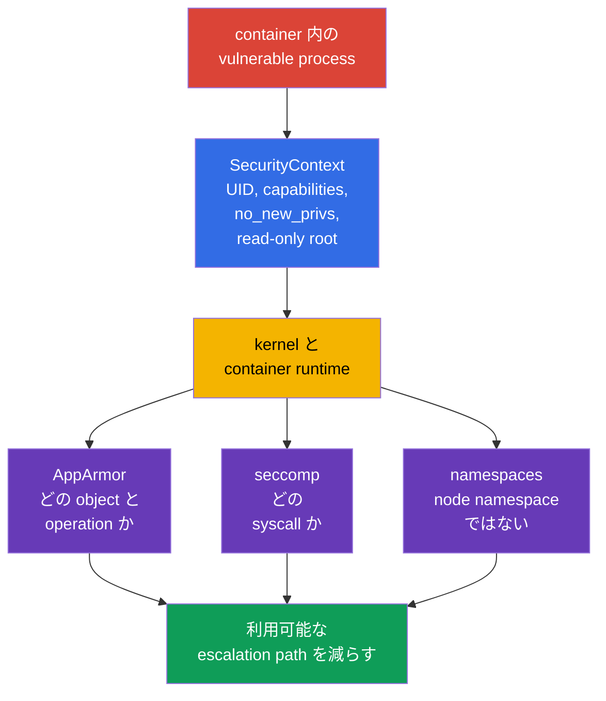
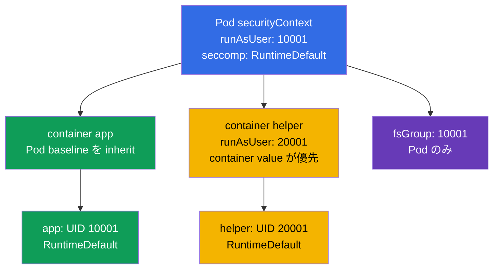
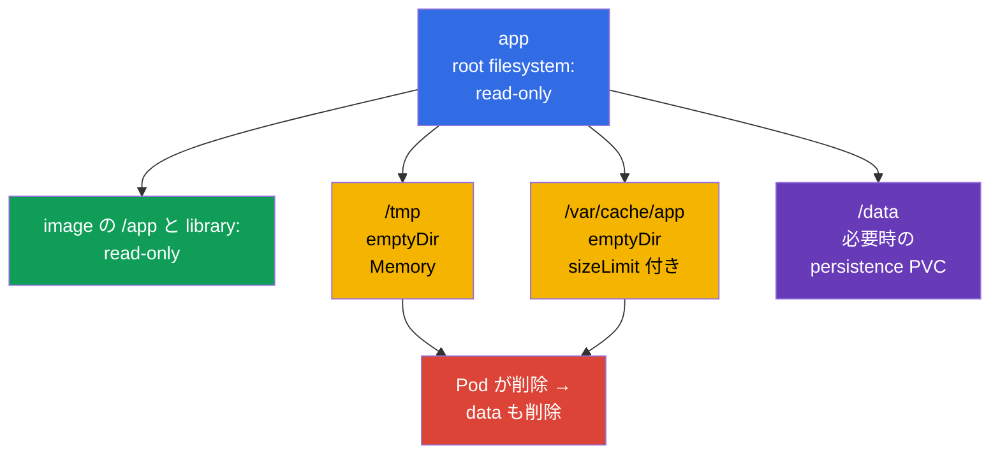

[Русская версия](ru.md) · [Eng version](README.md) · [Versión en español](es.md) · [Version française](fr.md) · [Deutsche Version](de.md) · [ქართული ვერსია](ge.md) · [繁體中文版](tw.md)

# 第18章. Hardened SecurityContext: process privilege の最小化

> **課題。** application の vulnerability は、process が root で動作し、capabilities を保持し、privilege を elevate でき、writable root filesystem 内の binary を置換できる場合、container 内の shell から node takeover または persistence へ変わります。Pod または sidecar の安全でない一つの default は、統一された limiting contract がなければ compromise の impact を拡大します。hardened `SecurityContext` はこの余分な path を事前に遮断します。

> **この後。** AppArmor は process が access できる object を、seccomp は実行できる system call を制限しました。次にこれらと basic process restriction を、一つの reproducible Pod contract にまとめます。non-root、empty capability set、privilege escalation の禁止、read-only root filesystem、seccomp profile です。これは CKS の公式 **Minimize Microservice Vulnerabilities（20%）**domain、`SecurityContext` と Pod Security Standards の material です。Cluster Setup はこれに間接的に関係します。node の kubelet と runtime がこれらの setting を support し適用する必要があるためです。目的は「すべてを true/false にする」ことではなく、各 container に必要な privilege だけを与え、それを証明可能にすることです。

> **CKA で必要な知識。** `SecurityContext` field、UID/GID、capabilities、Pod/container level は[CKA 第20章](../../../cka/course/20/jp.md)で扱います。ここでは `seccompProfile`、`privileged` と host namespace の拒否、writable `emptyDir`、YAML だけでなく effective state の確認と共に、single hardened baseline として適用します。

> 🧠 `SecurityContext` は process privilege を制限しますが、image vulnerability、RBAC、network、resource を排除するものではありません。

## 18.1. モデル: 「安全な image」ではなく process を守る

container は filesystem と namespace を isolate しますが、その process はなお kernel に access します。process が compromise されると、余分な UID 0、capability、writable root filesystem、node namespace への access が impact を拡大します。`SecurityContext` は runtime に specific process boundary を渡します。image vulnerability の fix、RBAC、NetworkPolicy、AppArmor、seccomp を置き換えるものではありません。また CPU、memory、ephemeral-storage の requests/limits を**設定せず**、resource exhaustion/noisy-neighbor から保護もしません。これは別の Pod field と `LimitRange`/`ResourceQuota` のような control です。



重要な制限として、`runAsNonRoot: true` は start check であり sandbox ではありません。`CAP_SYS_ADMIN`、`privileged: true`、`hostPID: true`、writable `hostPath` を持つ non-root process はなお node への危険な path を得る可能性があります。逆に seccomp は `/tmp` に Secret を書く application を直しません。defense は layer で構築します。

| Boundary | 減らすもの | 保証しないもの |
|---|---|---|
| UID/GID と `runAsNonRoot` | root execution の impact、permission error | Linux capabilities と host access の欠如 |
| `capabilities.drop: ["ALL"]` | individual kernel privilege | application と network の安全性 |
| `allowPrivilegeEscalation: false` | setuid/setgid と file capabilities による transition | すでに付与された capabilities の欠如 |
| `readOnlyRootFilesystem: true` | writable rootfs layer への write、persistence、binary replacement | volume、`emptyDir`、memory への write の禁止 |
| `seccompProfile` | available syscall set | permitted file または API への access |
| `privileged`、`host*`、`hostPath` の不使用 | node namespace、device、data への direct path | Kubernetes API の correct authorization |

> 🎯 Baseline: non-root identity、`drop: ["ALL"]`、`allowPrivilegeEscalation: false`、read-only root filesystem、`RuntimeDefault`、narrow な writable volume。

## 18.2. Hardened baseline: 一つの Pod、複数の boundary

以下は HTTP application の practical baseline です。capability `NET_BIND_SERVICE` が不要なよう、意図して high port `8080` を使います。image は UID `10001` の user を含み、read-only root filesystem で動作できる必要があります。これを blind な `runAsUser` で置き換えてはいけません。まず program が configuration と certificate を読め、その write directory が volume に移されていることを確認します。

```yaml
apiVersion: v1
kind: Pod
metadata:
  name: hardened-web
  labels:
    app: hardened-web
spec:
  automountServiceAccountToken: false
  securityContext:                         # Pod 共通の setting
    runAsNonRoot: true
    runAsUser: 10001
    runAsGroup: 10001
    fsGroup: 10001
    seccompProfile:
      type: RuntimeDefault
  containers:
  - name: app
    image: registry.example.invalid/web:1.4.2
    ports:
    - containerPort: 8080
    securityContext:                       # app 専用の setting
      privileged: false
      allowPrivilegeEscalation: false
      readOnlyRootFilesystem: true
      capabilities:
        drop:
        - ALL
    volumeMounts:
    - name: tmp
      mountPath: /tmp
    - name: cache
      mountPath: /var/cache/web
  volumes:
  - name: tmp
    emptyDir:
      medium: Memory
      sizeLimit: 64Mi
  - name: cache
    emptyDir:
      sizeLimit: 256Mi
```

これは universal な「paste して忘れる」manifest ではありません。`automountServiceAccountToken: false` は application が Kubernetes API を必要としない場合だけ適切です。token が必要なら default token を戻さず、dedicated ServiceAccount と minimal RBAC を設定します。`emptyDir.medium: Memory` は高速ですが Pod/node memory を消費し、full になると OOM を起こし得ます。disk cache では通常 default filesystem を残し、`sizeLimit` を設定します。

### ここで何が守られるか

- **`runAsNonRoot: true`** は effective UID が 0 なら start を拒否します。explicit な `runAsUser: 10001` と `runAsGroup: 10001` は、runtime が unclear な image `USER` に依存することを防ぎます。nonzero UID は image file の available permission と一致する必要があります。
- **`capabilities.drop: ["ALL"]`** は runtime が default で残す可能性のある capability を除去します。exception は measurable need の後にだけ追加します。たとえば port 80 の legacy process では `NET_BIND_SERVICE` が正当化されることがありますが、application を 8080 に移し set を empty のままにするほうが望ましいです。
- **`allowPrivilegeEscalation: false`** は Linux の `no_new_privs` を設定します。exec は setuid/setgid binary または file capabilities により privilege を増やせません。これは container にすでに付与された privilege を取り除くものではなく、`drop: ALL` を置き換えません。container が `privileged` または `CAP_SYS_ADMIN` を持つ場合、Kubernetes はこの effective value を `true` にします。
- **`readOnlyRootFilesystem: true`** は container の writable root filesystem を write 不可にします。image layer はすでに immutable です。明示的に mount した volume を制限するものではありません。mount option と permission に従い writable/read-only のままなので、writable mount は `hostPath` にしてはいけません。
- **`seccompProfile.type: RuntimeDefault`** は Pod の全 container に runtime default profile を有効にします。rarely required で risky な syscall の一部を除きますが、real workload で compatibility を確認します。
- **`fsGroup: 10001`** は non-root process が support する volume へ group access を得る助けになります。これは Pod setting であり、image layer の各 file owner を直す方法ではありません。

> 🎯 Container-level override はその container だけに適用されます。capability、`privileged`、escalation、read-only root filesystem は app、sidecar、initContainer すべてで確認します。

## 18.3. Field の順序と level conflict

`securityContext` は Pod level（`spec.securityContext`）と、各 container level（`spec.containers[].securityContext`、さらに init- と ephemeral container）にあります。すべての field が両 level で許可されるわけではありません。両方で使える field は container value が**その container に対して**priority を持ちます。Pod value は sibling container の baseline のままです。



| Field | 設定する場所 | Rule と practical conclusion |
|---|---|---|
| `runAsUser`、`runAsGroup`、`runAsNonRoot` | Pod と container | container override はその container だけに作用する。sidecar に exception を隠さない |
| `seccompProfile` | Pod と container | container profile override が優先。Pod に `RuntimeDefault` を設定し、すべての `Localhost` override を document する |
| `fsGroup`、`fsGroupChangePolicy`、`supplementalGroups`、`supplementalGroupsPolicy` | Pod のみ | common Pod と volume の context。container `fsGroup` は存在しない |
| `capabilities`、`privileged`、`allowPrivilegeEscalation`、`readOnlyRootFilesystem` | container のみ | **各** container と initContainer に hardened setting を繰り返す |
| `hostNetwork`、`hostPID`、`hostIPC`、`hostUsers` | Pod spec | `securityContext` ではない。container は host namespace access を安全に「override」できない |

conflict example は diagnostic に有用です。

```yaml
spec:
  securityContext:
    runAsNonRoot: true
    runAsUser: 10001
    seccompProfile:
      type: RuntimeDefault
  containers:
  - name: app
    image: registry.example.invalid/app:1.4.2
    securityContext:
      runAsUser: 20001                 # app の effective UID は 20001
      seccompProfile:
        type: Localhost                 # RuntimeDefault ではない
        localhostProfile: profiles/app.json
```

ここで `app` は UID `20001` と node-local profile で起動します。`runAsNonRoot: true` は override しなければ inherit されます。これはそれ自体 error ではありませんが、`Localhost` は Pod が置かれ得る**すべての**node に profile がすでに install されていることを要求します。そうでなければ container は作成されません。一つの `spec.securityContext` だけで判断せず、各 container を inspect します。

> 🔬 `Strict` は implicit image group を無効にし、Kubernetes/CRI support と node response の確認を要求します。

### `supplementalGroupsPolicy: Strict`: implicit image group なし

default では `Merge` が image の `/etc/group` から primary user の supplementary group membership を追加します。`Strict` はこの merge を行いません。`fsGroup`、`supplementalGroups`、`runAsGroup` の GID だけが残ります。image 内で宣言した group が process に unexpected volume access を与えてはいけない場合に有用です。

```yaml
apiVersion: v1
kind: Pod
metadata:
  name: strict-groups
spec:
  securityContext:
    runAsUser: 1000
    runAsGroup: 3000
    fsGroup: 4000
    supplementalGroups: [5000]
    supplementalGroupsPolicy: Strict
  containers:
  - name: app
    image: registry.example.invalid/app:1.4.2
```

公式 Kubernetes release blog によると、`supplementalGroupsPolicy` は Kubernetes v1.35 で GA/stable です（lifecycle: alpha v1.31 → beta v1.33 → GA v1.35）。feature gate `SupplementalGroupsPolicy` は enabled by default に固定されています。それでも support する CRI が必要です。known support は containerd v2.0 以降と CRI-O v1.31 以降にあります。node は `status.features.supplementalGroupsPolicy: true` で確認します。v1.33 以降、kubelet は unsupported node 上の `Strict` Pod を、silent に `Merge` を適用せず reject します。event には `SupplementalGroupsPolicyNotSupported` が表示されます。

> 🔬 SELinux label、`procMount`、sysctl、Windows identity は Kubernetes、runtime、CSI、OS、policy の確認を必要とします。

### Advanced: SELinux、`/proc`、sysctl、Windows scope

これらは同じ `SecurityContext` の field ですが、上記の universal Linux baseline ではありません。Pod または container の `seLinuxOptions` は process の SELinux label を設定します。container-level value は Pod-level を override します。通常の recursive SELinux relabel では、**container runtime** が container による使用前に volume content の inode label を変更します。kubelet ではありません。Pod-level の `seLinuxChangePolicy: MountOption` は mount option `-o context=` による relabel を要求しますが、それ自体は保証しません。Kubernetes v1.36 で access mode が `ReadWriteOncePod` 以外の PVC には、enabled `SELinuxMount` feature gate（default では disabled）と CSI driver の `CSIDriver.spec.seLinuxMount: true` が必要です。そうでなければ Kubernetes は通常の recursive relabel を使用します。specific CSI/filesystem の isolation と compatibility を test せず、speed のために label や policy を変えてはいけません。

> 🔬 **Upstream v1.37。** Kubernetes v1.37 では `SELinuxMount` が GA となり enabled by default になりました。SELinux-enabled cluster の upgrade 前に volume-label conflict を確認します。必要なら workload は `spec.securityContext.seLinuxChangePolicy: Recursive` により recursive behavior を明示的に保持できます。詳細: [Kubernetes v1.37 Security Delta](../APPENDIX_K8S_137_SECURITY_DELTA_JP.md)。

`procMount` は container-level Linux option だけです。safe default の `Default` は sensitive `/proc` の一部を masked のままにします。`Unmasked` は process view を拡大し restricted workload には適しません。Kubernetes v1.30 以降、`Unmasked` は user namespace の Pod、すなわち `spec.hostUsers: false` にだけ許可されます。Pod-level の `securityContext.sysctls` は Pod の network/IPC namespace に sysctl を設定します。Kubernetes documentation にある safe sysctl だけを使います。unsafe sysctl は kubelet allowlist を要求し host namespace と conflict し得るため、application setting ではなく deliberate node-level exception です。

Windows ではこれらの Linux control は適用されません。Windows container identity は Pod または container の `windowsOptions.runAsUserName` で指定します（container override が priority を持つ）。必要ならそこに GMSA も設定します。user name、image、Windows node support は個別に確認します。Linux の `runAsUser`/UID と SELinux は `runAsUserName` の代替ではありません。

> 🧠 Init、sidecar、ephemeral container は独自の effective parameter を持ちます。weak container は Pod hardening を bypass します。

### Init、sidecar、ephemeral container - separate process

`initContainers` は application より前に実行されますが、inappropriate owner/mode の file を作成したり、extra privilege を要求したりできます。hardened workload では同じ原則を受けます。explicit non-root UID、drop all capability、no escalation、read-only root、必要なら separate writable volume です。`chown -R` のためだけに initContainer を root で動かしてはいけません。これは image error を隠すことが多いです。最初に `fsGroup`、image 内の correct ownership、storage-class policy を試します。privileged exception は short、justified、isolated である必要があります。

`kubectl debug` により追加する ephemeral container も、workload container security context を自動で inherit しません。controlled incident response に有用ですが、PSA または hardened baseline の bypass になってはいけません。image、identity、admission policy を合わせ、lifetime を制限し change を記録します。permanent diagnostic には Deployment template を変更して new Pod を作成します。すでに running の Pod の immutable `securityContext` を変えようとしてはいけません。

> 🎯 `privileged`、`hostPID`、`hostNetwork`、`hostIPC`、broad な `hostPath` を除去します。non-root UID は Pod boundary を越えるこれらの path を閉じません。

## 18.4. `privileged` と `host*`: Pod boundary の危険な bypass

一部の setting は process に自身の Pod だけでなく node resource への access を与えます。CNI、CSI、node monitoring、runtime agent に必要なことはありますが、通常の API、worker、batch job にはほぼ不要です。「process が root ではない」ことは、この access を安全にしません。

| Setting | 開くもの | risk の理由 | 安全な alternative |
|---|---|---|---|
| `privileged: true` | ほぼすべての capability、device、runtime isolation の緩和 | container compromise は node compromise に近い | `drop: ALL` を持つ通常の container。証明された必要時だけ一つの capability を追加 |
| `hostPID: true` | PID namespace 内の node process | host process の閲覧/signaling、sensitive な `/proc` data の収集が可能 | metrics API、kubelet summary API、または separate trusted node-agent |
| `hostNetwork: true` | node の network namespace、host port、その IP | Pod network isolation の bypass、port conflict、node localhost service への access | Service、Ingress、NetworkPolicy、通常の Pod network |
| `hostIPC: true` | node の IPC namespace | host process の shared memory と IPC への access | auth を持つ volume、Service、message queue |
| `hostPath` volume | node filesystem の selected path | kubelet credential、container socket、runtime state の read、または host への write | PVC、ConfigMap、Secret、`emptyDir`。trusted daemon だけに narrow read-only path |

`privileged: true` は `allowPrivilegeEscalation` の effective value を強制的に `true` にし、hardened workload の目的と conflict します。この container は seccomp `Unconfined` も受け、AppArmor は無視され、SELinux context は `unconfined_t` になります。隣にある `allowPrivilegeEscalation: false` で「fix」しようとしてはいけません。container は privileged のままです。`CAP_SYS_ADMIN` にも `allowPrivilegeEscalation` の同じ effective rule が適用されます。同様に、`hostNetwork: true` は一つの `NetworkPolicy` だけでは安全にできません。NetworkPolicy は通常 node network namespace でなく ordinary Pod network 用です。

```yaml
# 通常 application の red flag
spec:
  hostPID: true
  hostNetwork: true
  containers:
  - name: app
    securityContext:
      privileged: true
    volumeMounts:
    - name: host-root
      mountPath: /host
  volumes:
  - name: host-root
    hostPath:
      path: /
```

investigation では最初に、この setting が**なぜ**現れたかを見つけます。Helm chart、injected sidecar、initContainer、DaemonSet、manual patch です。その contract を理解せず CNI/CSI/monitoring DaemonSet から `host*` を remove してはいけません。cluster 全体の network または storage を壊すことがあります。通常 workload では supported API/volume に access を置き換え、staging で rollout を確認します。

すべての namespace の Pod を quick audit します。

```bash
kubectl get pods -A -o json | jq -r '
  def allContainers: ((.spec.containers // []) + (.spec.initContainers // []) + (.spec.ephemeralContainers // []));
  .items[]
  | [allContainers[] | select(.securityContext.privileged == true) | .name] as $privileged
  | [(.spec.volumes // [])[] | select(.hostPath != null) | (.name + "=" + .hostPath.path)] as $hostPaths
  | select(.spec.hostPID == true or .spec.hostNetwork == true or .spec.hostIPC == true or ($privileged|length)>0 or ($hostPaths|length)>0)
  | [.metadata.namespace, .metadata.name,
     ("hostPID=" + ((.spec.hostPID // false)|tostring)),
     ("hostNetwork=" + ((.spec.hostNetwork // false)|tostring)),
     ("hostIPC=" + ((.spec.hostIPC // false)|tostring)),
     ("privileged=" + ($privileged|join(","))),
     ("hostPath=" + ($hostPaths|join(",")))] | @tsv'
```

command は candidate を示しますが verdict ではありません。system namespace と DaemonSet は contextual review を要します。owner、purpose、node placement、minimal access、manifest、admission control です。

> 🔬 `hostUsers: false` の UID/GID mapping と Linux、kernel、CRI/OCI runtime、filesystem の requirement。

### `hostUsers: false`: Kubernetes v1.36 の user namespace

Kubernetes v1.36 では user namespace は stable です。`hostUsers: false` は kubelet に Pod の user namespace 作成と non-overlapping UID/GID mapping の選択を要求します。container 内の UID 0 または `runAsUser` は unprivileged node UID/GID に map されます。capability はこの namespace 内だけで機能します。たとえば `CAP_SYS_ADMIN` は外部で privilege を与えません。これは container 内で root が必要でも host namespace や node resource への access は不要な workload の additional barrier です。

```yaml
apiVersion: v1
kind: Pod
metadata:
  name: userns-tool
spec:
  hostUsers: false
  containers:
  - name: tool
    image: registry.example.invalid/tool:1.4.2
    securityContext:
      allowPrivilegeEscalation: false
      capabilities:
        drop: ["ALL"]
```

これは Linux-only mode です。default では `hostNetwork`、`hostPID`、`hostIPC` と組み合わせられず、`volumeDevices` による raw block volume も forbidden です。v1.36 の alpha gate `UserNamespacesHostNetworkSupport`（default `false`）は、`hostUsers: false` と `hostNetwork: true` を別途許可します。`hostPID` と `hostIPC` は forbidden のままです。hardened baseline はこの alpha exception に依存してはいけません。この combination は explicit gate、separate review、threat model の確認を必要とします。node filesystem とすべての volume に idmapped mount、support する CRI/OCI runtime、compatible kernel が必要です。current documentation では containerd v2.0+、CRI-O v1.25+、runc v1.2+、crun v1.9+ が挙げられます。NFS は idmapped mount を support しません。rollout 前に Pod が配置され得るすべての node でこれらを確認します。

> 🎯 write error では path を見つけ、appropriate permission と lifecycle を持つ minimal `emptyDir` または PVC を追加します。

## 18.5. application を壊さない read-only root filesystem

`readOnlyRootFilesystem: true` は implicit write を発見します。PID file、temporary file、cache、generated config、log、package manager です。解決策は restriction を外すことではなく、各 writable path とその lifecycle を明示的に記述することです。



`emptyDir` は node 上で Pod 用に作成され、その container 間で shared されます。同じ Pod 内で container restart を越えて存続しますが、Pod の delete/recreate 後には消えます。recovery が必要な data の storage には適しません。`sizeLimit` は expected volume だけを制限しますが、request/limit と node ephemeral storage monitoring の代わりにはなりません。

`/tmp`、runtime directory、cache が必要な program の example:

```yaml
spec:
  securityContext:
    runAsNonRoot: true
    runAsUser: 10001
    runAsGroup: 10001
    fsGroup: 10001
    seccompProfile:
      type: RuntimeDefault
  containers:
  - name: app
    image: registry.example.invalid/reporter:2.1.0
    securityContext:
      allowPrivilegeEscalation: false
      readOnlyRootFilesystem: true
      capabilities:
        drop: ["ALL"]
    volumeMounts:
    - name: tmp
      mountPath: /tmp
    - name: run
      mountPath: /var/run/reporter
    - name: cache
      mountPath: /var/cache/reporter
  volumes:
  - name: tmp
    emptyDir:
      medium: Memory
      sizeLimit: 32Mi
  - name: run
    emptyDir:
      sizeLimit: 8Mi
  - name: cache
    emptyDir:
      sizeLimit: 128Mi
```

`emptyDir` を `/` の上に mount したり、application contract なしに `/var` のような broad writable mount を作ったりしてはいけません。これは制御したい write を再び隠します。pinpoint path は何が許可されているかをよりよく示します。log は通常 stdout/stderr に送ります。`emptyDir` 上の file は application または local sidecar が要求するときだけ正当化されます。

### hardening を外さない Debug

`Read-only file system` symptom は useful signal です。最初に path を定め、temporary、cache、data のどれかを決めます。incident を `privileged: true` の追加または `hostPath` への write で直してはいけません。

```bash
# event と CreateContainerConfigError/CrashLoopBackOff の cause
kubectl describe pod hardened-web
kubectl logs hardened-web -c app --previous

# allowed exec の場合だけ: app 内の mount と permission を確認する
kubectl exec hardened-web -c app -- id
kubectl exec hardened-web -c app -- sh -c 'mount | grep -E " /tmp |/var/cache/web"'
kubectl exec hardened-web -c app -- sh -c 'touch /tmp/probe && rm /tmp/probe'

# actual volumeMounts を workload template と照合する
kubectl get pod hardened-web -o yaml
```

application が shell tool を必要とする場合、debug のために production image へ追加したり、root filesystem を writable にしたりしてはいけません。logs、metrics、trace、explicit NetworkPolicy を持つ temporary hardened debug Pod、または coordinated ephemeral container procedure が望ましいです。diagnostic 後に debug artifact を削除し、write が実際に contract の一部なら minimal `emptyDir` mount を template に追加します。

> 🎯 `RuntimeDefault` を使い、`/proc/1/status` を通じて effect を証明します。`Localhost` はすべての allowed node への profile delivery を要求します。

## 18.6. baseline の Seccomp: RuntimeDefault、Localhost、証明

`seccompProfile` は system call に対する kernel response を指定します。standard workload には `RuntimeDefault` を使います。runtime が supported profile を適用します。`Unconfined` はこの boundary を無効にし、hardened baseline には適しません。`Localhost` は team が profile を所有し、appropriate node のすべてへの delivery を保証し、runtime update を test する場合だけに必要です。

| Type | 使用する場面 | Operational risk |
|---|---|---|
| `RuntimeDefault` | ほぼ全 application の baseline | profile は runtime と version に依存。update を test する |
| `Localhost` | node configuration management で配布された narrow syscall contract | 一 node の file 不在が container creation error を起こす |
| `Unconfined` | explicit approval を伴う short diagnostic exception | syscall boundary の欠如。exception が permanent になりやすい |

```yaml
# Pod baseline: container override を設定しない限り、全 container が inherit する
spec:
  securityContext:
    seccompProfile:
      type: RuntimeDefault
```

`Localhost` では path は container filesystem でなく kubelet の seccomp directory に相対的です。JSON profile を ConfigMap に copy して kubelet が見つけると期待してはいけません。profile は trusted method で node に配布し、それがある node に scheduling を固定して、actual application を証明する必要があります。syscall denial の detailed model と debugging は[第17章](../17/jp.md)にあります。

process の Linux namespace 内から検証します。

```bash
kubectl exec hardened-web -c app -- sh -c 'grep -E "^(NoNewPrivs|Seccomp):" /proc/1/status'
# 期待値: typical RuntimeDefault runtime では NoNewPrivs: 1 と Seccomp: 2 (filter)
```

`Seccomp: 2` は PID 1 の filter 有効化を証明しますが、needed syscall が intended profile により block されたことは証明しません。`Localhost` では controlled negative test、expected `EPERM`/`Operation not permitted`、node/runtime log の確認を追加します。verification を combat exploit にしてはいけません。isolated environment で safe な forbidden syscall を test します。

> 🎯 template の intent、admission/start、process の effective state を確認します。`kubectl apply` は UID、capability、seccomp、write denial を証明しません。

## 18.7. 検証: manifest、effective state、negative scenario

verification は三つの異なる問いから成ります。

1. **Intent:** Deployment/Pod template に必要な field がある。
2. **Admission と start:** Pod は受理され、expected node で作成され、container は実際に Running。event は UID/profile/volume ownership の conflict を示さない。
3. **Runtime effect:** process は non-root UID、empty capability set、`NoNewPrivs`、seccomp filter、expected writable mount point だけを持つ。

`kubectl apply` だけの check は不十分です。API が object を受け入れても、kubelet が後で `CreateContainerConfigError` を受ける、image が permission 不足で crash する、container-level override が存在することがあります。

### 1. template とすべての container を照合する

```bash
# 現在の training Pod の declarative intent。
kubectl get pod hardened-web -o yaml
# production では managed workload の source of truth は controller template:
# kubectl get deploy <deployment-name> -o yaml

# Pod-level context と各通常/init container の context
kubectl get pod hardened-web -o jsonpath='{.spec.securityContext}{"\n"}'
kubectl get pod hardened-web -o jsonpath='{range .spec.containers[*]}{.name}{": "}{.securityContext}{"\n"}{end}'
kubectl get pod hardened-web -o jsonpath='{range .spec.initContainers[*]}{.name}{": "}{.securityContext}{"\n"}{end}'

# Host namespace と privileged flag は別に探す必要がある
kubectl get pod hardened-web -o jsonpath='{.spec.hostPID}{" "}{.spec.hostNetwork}{" "}{.spec.hostIPC}{"\n"}'
kubectl get pod hardened-web -o json | jq '
  ((.spec.containers // []) + (.spec.initContainers // []) + (.spec.ephemeralContainers // []))
  | .[] | {name, privileged: (.securityContext.privileged // false)}'
```

JSONPath は declared configuration を示します。absent boolean field の empty output は `false` と同じではありません。audit requirement は default に頼らず explicit である必要があります。`initContainers`、injected service-mesh/observability sidecar、ephemeral container も確認します。一つの weak container は同じ Pod の network と volume を共有します。

### 2. start と effective identity を確認する

```bash
kubectl wait --for=condition=Ready pod/hardened-web --timeout=90s
kubectl describe pod hardened-web

kubectl exec hardened-web -c app -- id
# 期待値: uid=10001(...) gid=10001(...)、uid=0 ではない

kubectl exec hardened-web -c app -- sh -c 'grep -E "^(Cap(Inh|Prm|Eff|Bnd|Amb)|NoNewPrivs|Seccomp):" /proc/1/status'
```

`/proc/1/status` では `drop: ALL` の effective capability は zero である必要があります。`NoNewPrivs: 1` field は escalation の禁止を確認します。`Seccomp: 2` は通常 filter を意味しますが、actual runtime を確認し、一つの digit の解釈で check を置き換えてはいけません。image に `sh` がない場合は、approved diagnostic image/ephemeral procedure を使うか、access control を持つ node/runtime tool で state を確認します。

### 3. Negative check と typical result

| Check | Expected result | 異なる場合 |
|---|---|---|
| app 内の `id -u` | `0` ではない | image/override が root で実行している。Pod と container context を確認 |
| `/` への write | `Read-only file system` | root filesystem が read-only でない、または write が broad mount に入った |
| `/tmp` への write | dedicated `emptyDir` で成功 | mount がない、UID/GID が誤り、または volume driver が `fsGroup` を support しない |
| setuid escalation の試行 | new privilege なし、`NoNewPrivs: 1` | `allowPrivilegeEscalation` が absent/true、container が privileged、`CAP_SYS_ADMIN` を持つ、または runtime policy が違う |
| test Pod の unsafe syscall | seccomp denial | profile が適用されていない、test が別 syscall、または別 container を実行した |
| restricted namespace の `privileged: true` Pod | admission reject | PSA/policy が enforce されていない、または namespace に exception がある |

`/` への write の negative test は application を変更してはいけません。volume mount を事前に除外した separate smoke-test Pod または harmless path を使います。production では最初に observed workload copy を確認します。test が accidental に `emptyDir` を満たす、cache を削除する、restart を起こすべきではありません。

## 18.8. Typical failure と safe fix

| Symptom | Likely cause | Fix |
|---|---|---|
| `container has runAsNonRoot and image will run as root` | image が non-root USER を指定せず、UID も未指定 | non-root USER を持つ image を build するか、verified nonzero UID を明示的に設定 |
| mount volume の `Permission denied` | UID/GID が不一致、driver が `fsGroup` を適用しない | ownership、storage driver、`fsGroup` を確認。blanket な `chmod 777` をしない |
| `Read-only file system` | app が image layer に PID/cache/temp を write する | 必要な path だけに narrow な `emptyDir` または PVC を追加 |
| `Localhost` seccomp で Pod が作成されない | selected node に profile がない | profile を配布して placement を制限するか、`RuntimeDefault` に戻す |
| port 80 が open できない | non-root で `NET_BIND_SERVICE` がない | high port で listen し Service `targetPort` を設定。capability は justified exception のみ |
| hardening 後に sidecar が壊れる | SecurityContext が app だけに設定された、または sidecar が root filesystem に write する | hardened context と explicit writable volume は各 container に必要 |
| PSA が Pod を reject | forbidden setting（`privileged`、host namespace、`Unconfined`） | bypass を remove。exception は separate、minimal、temporary に扱う |

application が mounted Secret として read できるなら、Secret を writable `emptyDir` に copy してはいけません。program が certificate/configuration を transform せざるを得ない場合は、separate small writable volume を作り、その lifetime と permission を最小化し、common cache と混ぜません。`readOnlyRootFilesystem` は、同じ volume を mount した同一 Pod の別 container から volume content を保護しません。

> 🏭 Versioned template、inventory、image fix、canary、runtime test、admission guardrail、documented exception。

## 18.9. hardened baseline の段階的導入

created Pod を手動でなく、Deployment/StatefulSet/Job template と Helm chart に baseline を導入します。ほとんどの running Pod の `securityContext` は immutable です。correct change は新しい ReplicaSet/Pod として release し、rollout を監視します。

1. process、writable path、low port、volume ownership、syscall/profile requirement、current の `privileged`/`host*` exception を inventory します。
2. image を fix します。non-root `USER`、必要な UID/GID が読める file、`/` ではなく documented directory への application write です。
3. Pod baseline を追加します。`runAsNonRoot`、explicit nonzero UID/GID、`RuntimeDefault` seccomp、必要なら `fsGroup`。
4. **すべての** app/init/sidecar container に container baseline を追加します。`drop: ["ALL"]`、`allowPrivilegeEscalation: false`、`readOnlyRootFilesystem: true`、`privileged: false`。
5. required writable path を、`sizeLimit` と requests/limits を持つ narrow な `emptyDir`/PVC mount point に移し、unused ServiceAccount token を remove します。
6. readiness、functional、negative test を実行し、effective `/proc` と mount を inspect します。
7. admission guardrail（Pod Security Admission restricted および/または policy engine）を有効にし、次の chart version が privileged/host namespace または `Unconfined` を戻さないようにします。
8. 各 exception を document し定期的に review します。owner、reason、scope、expiry、required capability/profile、test evidence です。

## 18.10. Self-check question

<details>
<summary>1. `runAsNonRoot: true` は、なぜ `privileged: true` を持つ Pod を安全にしないのですか？</summary>

`runAsNonRoot` は start 時に effective UID を確認しますが sandbox ではありません。`privileged: true` はほぼすべての capability と device access を与え、seccomp を effective `Unconfined` にし、AppArmor は無視されます。この access を持つ non-root process はなお node への危険な path を得ます。
</details>

<details>
<summary>2. initContainer と sidecar に別途設定すべき container securityContext field は何ですか？</summary>

各 app、sidecar、initContainer には `capabilities.drop: ["ALL"]`、`allowPrivilegeEscalation: false`、`readOnlyRootFilesystem: true`、必要なら `privileged: false` を別途設定します。Pod-level の `runAsNonRoot`、UID/GID、`seccompProfile` は baseline を与えますが、container は override できます。したがって injected sidecar を含むすべての container list を確認します。
</details>

<details>
<summary>3. Pod が `runAsUser: 10001` を設定し、container が `runAsUser: 20001` を設定する場合、container の effective UID は何ですか？</summary>

この container の effective UID は `20001` です。二 level で利用できる field では、container-level value がその container だけで priority を持ちます。Pod-level の `10001` は override がない sibling container の baseline のままです。
</details>

<details>
<summary>4. `fsGroup` を image layer のすべての file permission を修正する mechanism と見なせないのはなぜですか？</summary>

`fsGroup` は Pod setting であり、support する volume への group access を助けます。image layer の全 file owner を変える目的ではなく、image の correct ownership と UID を置き換えません。writable path では volume も明示的に選び、storage driver support を確認する必要があります。
</details>

<details>
<summary>5. `RuntimeDefault` と `Localhost` seccomp profile は operationally どう異なりますか？</summary>

`RuntimeDefault` は supported runtime profile を使い、baseline としてほぼすべての workload に適します。`Localhost` は trusted automation が kubelet seccomp root 配下の各 allowed node に事前配布する JSON を参照します。selected node に file がないと container creation error になるため、versioning、placement、runtime compatibility が必要です。
</details>

<details>
<summary>6. `emptyDir` を持つ Pod で、container restart を越えて存続し、Pod deletion で消える data は何ですか？</summary>

`emptyDir` content は同じ Pod 内の container restart を越えて存続します。Pod が delete または recreate されると volume は data と共に消えます。そのため `/tmp`、runtime directory、cache に適しますが、recovery が必要な data には不適切です。
</details>

<details>
<summary>7. `allowPrivilegeEscalation: false` が `capabilities.drop: ["ALL"]` を置き換えないのはなぜですか？</summary>

`allowPrivilegeEscalation: false` は `no_new_privs` を有効にし、setuid/setgid binary または file capabilities による new privilege の取得を禁止します。container にすでに与えられた capability は取り除きません。そのため baseline は `drop: ["ALL"]` によって initial set を別途除去します。
</details>

<details>
<summary>8. `kubectl apply` 後の hardening を証明する三つの independent check は何ですか？</summary>

最初に intent を確認します。template とすべての container の security context です。次に admission と start を確認します。Pod が Ready で、event に UID/profile/volume conflict がありません。最後に runtime effect を確認します。negative scenario を含め、non-root UID、zero capability、`NoNewPrivs`、seccomp、expected writable mount です。
</details>

<details>
<summary>9. non-root UID でも `hostNetwork` と `hostPID` が review を必要とするのはなぜですか？</summary>

`hostPID` は node の process と sensitive `/proc` data を開き、`hostNetwork` は node の network namespace、IP、host port、localhost service を与えます。これは一つの non-root UID で排除できない host resource への access です。通常 workload では host namespace の代わりに Service、ordinary Pod network、NetworkPolicy、supported API を推奨します。
</details>

<details>
<summary>10. **Flashback（第10章）。** PSA は object creation 時に設定できる namespace label を通じて作用し、separate `patch` だけではありません。第10章では existing namespace の label **変更**に対する RBAC control（Namespace label の `patch`）を扱いますが、namespace **作成**自体については扱いません。`namespaces` の verb `create` への RBAC restriction だけでは、新しい namespace が `enforce=restricted` を得る保証にならないのはなぜですか？ また PSA bypass のこの path を閉じるには、実際に RBAC と admission-level のどちらの mechanism が必要ですか？</summary>

RBAC の `create namespaces` は identity が object を作成できるかを決めますが、新しい request の required metadata label は確認しません。この permission を持つ user は `pod-security.kubernetes.io/enforce=restricted` なしの namespace を作れ、PSA は restricted である必要のない default configuration に従います。CREATE 時に required label を強制する ValidatingAdmissionPolicy または policy engine のような admission-level policy が必要です。RBAC は namespace creator の scope を制限する additional control のままです。
</details>

> 🏭 common chart/template と CI/admission policy。exception には scope、owner、reason、review expiry、evidence。

## 18.11. production での適用

team は baseline を manifest 間で copy せず、common Helm chart または library template に固定します。各 deviation には record を残します。owner、reason、scope、review date、need を確認する test です。CI では rendered manifest の `privileged`、`host*`、`hostPath`、`Unconfined`、required field の absence を check するのが有用です。cluster ではこれを Pod Security Admission または policy engine で補完します。

導入は段階的に行います。まず observed log と metric を持つ workload を staging で起動し、次に一 replica または canary で restriction を有効にして rollout、start error、ephemeral storage consumption を監視します。contract 確認後、change を workload template に入れます。実際に host access または special capability を必要とする node agent は application namespace から isolate し、別途 review します。

## 18.12. ミニ glossary

| Term | 簡潔な意味 |
|---|---|
| **SecurityContext** | process または Pod の identity と restriction を指定する Kubernetes field。 |
| **capability** | individual Linux privilege。`drop: ["ALL"]` は initial set を除去する。 |
| **no_new_privs** | `exec` による additional privilege の取得を禁じる kernel flag。`allowPrivilegeEscalation: false` が有効にする。 |
| **read-only root filesystem** | container root filesystem は read-only mount。writable rootfs layer への write は禁止され、allowed write は volume に移す。 |
| **seccomp** | process の system call filter。`RuntimeDefault` は supported runtime baseline。 |
| **effective state** | manifest field だけでなく start 後の real UID、capability、mount、seccomp。 |
| **host namespace** | Pod が `hostPID`、`hostNetwork`、`hostIPC` で share できる node namespace。 |

## 18.13. 章のまとめ

1. process hardening には、一 field でなく non-root identity、empty capability set、escalation の禁止、read-only root filesystem、seccomp の組み合わせが必要です。
2. Pod-level と container-level setting には異なる scope があります。各 app、sidecar、initContainer を別途確認します。
3. `privileged`、`host*`、`hostPath` は node risk を伴う exception であり、application の convenient default ではありません。
4. Writable path は explicit かつ narrow にし、appropriate volume、ownership、limit を備える必要があります。
5. hardening の証明には template 内の intent、successful start、negative scenario を伴う process runtime verification が含まれます。

## 18.14. この知識が役立つ場面: 試験と実務

**試験で。** 最初に各 field の level を定めます。`fsGroup` は Pod に設定し、capability と `allowPrivilegeEscalation` は container に設定します。controller で manifest を修正するか Pod を recreate し、その後 `kubectl describe`、`id`、`/proc/1/status`、writable `emptyDir` の check で結果を確認します。seccomp は `RuntimeDefault` と `Localhost` を区別します。後者は node 上の profile を要求します。

**実務で。** 同じ順序により hardening は repeatable process になります。safe baseline は template にあり、admission は regression を防ぎ、rollout と runtime signal は incompatibility を示します。各 exception には minimal scope、responsible owner、review expiry を設定するため、temporary concession が permanent vulnerability になりません。

## Practice

[CKA Lab 107](../../../cka/labs/107/README_JP.MD)で hardened template を練習します。`emptyDir` を explicitly described ephemeral writable storage として使い、`check_result` で result を確認します。次に separate test workload に、この章の baseline を追加します。non-root UID、`drop: ["ALL"]`、`allowPrivilegeEscalation: false`、read-only root filesystem、`/tmp` 用の `emptyDir`、`RuntimeDefault` です。`id`、`NoNewPrivs`、`Seccomp`、mount point、root への expected write denial を証明します。syscall policy の deep diagnostic は[第17章](../17/jp.md)に戻ります。

🧪 Lab 107（multi-container Pod、`emptyDir`、writable-path debugging）:
[tasks/cka/labs/107](../../../cka/labs/107/README_JP.MD)

🌐 追加 interactive practice（killer.sh/killercoda、external resource）: [privileged-containers](https://killercoda.com/killer-shell-cks/scenario/privileged-containers) · [privilege-escalation-containers](https://killercoda.com/killer-shell-cks/scenario/privilege-escalation-containers)

## Reference material

- [Kubernetes: Pod または Container の Security Context を設定する](https://kubernetes.io/docs/tasks/configure-pod-container/security-context/)
- [Kubernetes: Pod Security Standards](https://kubernetes.io/docs/concepts/security/pod-security-standards/)
- [Kubernetes: seccomp による Container syscall の制限](https://kubernetes.io/docs/tutorials/security/seccomp/)
- [Kubernetes: Volumes - emptyDir](https://kubernetes.io/docs/concepts/storage/volumes/#emptydir)
- [Kubernetes: Linux kernel security constraint](https://kubernetes.io/docs/concepts/security/linux-kernel-security-constraints/)
- [Kubernetes: User Namespaces](https://kubernetes.io/docs/concepts/workloads/pods/user-namespaces/)

---
[目次](../README_JP.md) · [第17章](../17/jp.md) · [第19章](../19/jp.md)
