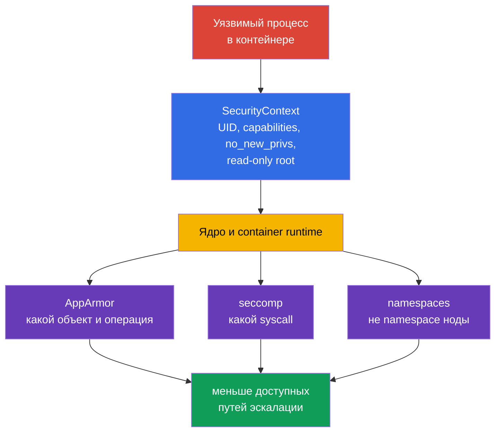
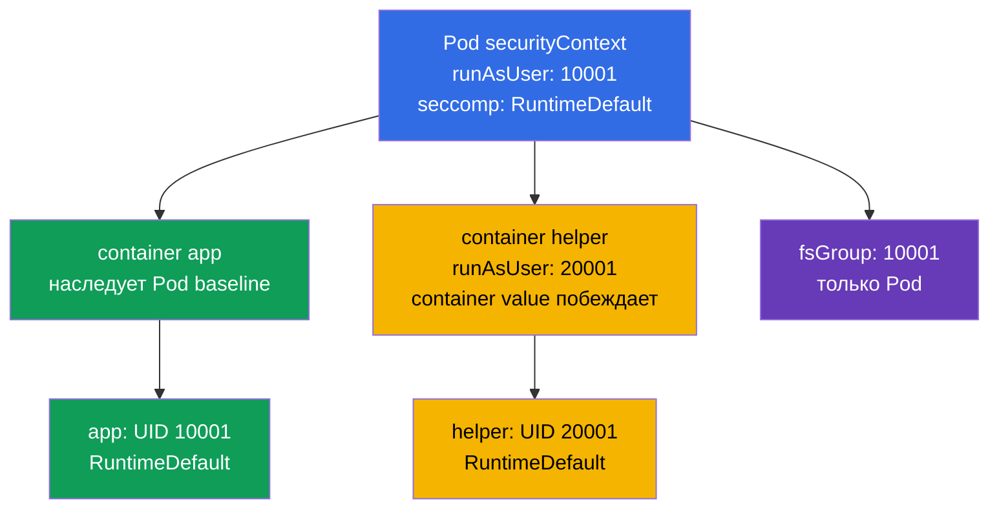
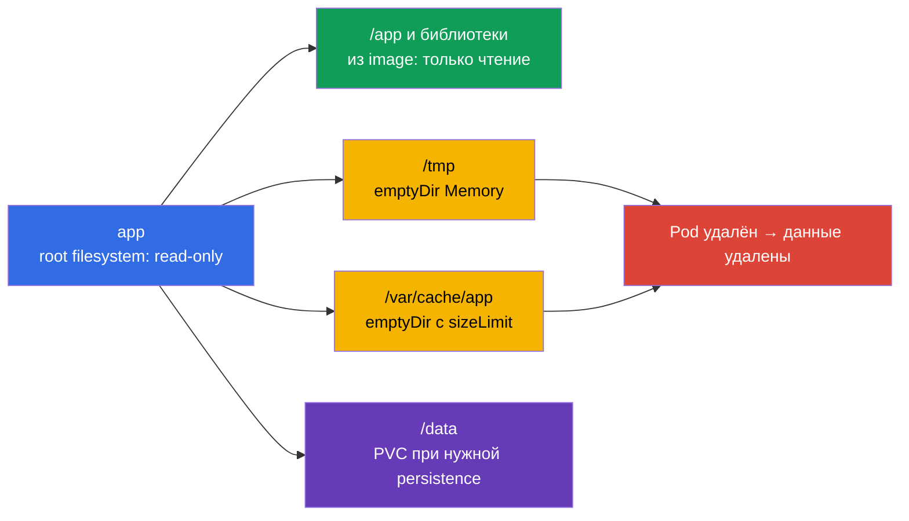

[Eng version](README.md) · [Versión en español](es.md) · [Version française](fr.md) · [Deutsche Version](de.md) · [ქართული ვერსია](ge.md) · [繁體中文版](tw.md) · [日本語版](jp.md)

# Глава 18. Hardened SecurityContext: минимальные привилегии процесса

> **Что дальше.** AppArmor ограничил, к каким объектам может обращаться процесс, а seccomp -
> какие системные вызовы он может сделать. Теперь соберём эти и базовые ограничения процесса
> в один воспроизводимый контракт Pod: non-root, пустой набор capabilities, запрет повышения
> привилегий, неизменяемый root filesystem и профиль seccomp. Это домен **Cluster Setup** и
> **Microservice Vulnerability Mitigation** CKS. Цель не в том, чтобы «поставить все true/false»,
> а в том, чтобы каждый контейнер получил ровно нужные ему права и это можно было доказать.

> **Что нужно из CKA.** Поля `SecurityContext`, UID/GID, capabilities и уровни Pod/контейнера
> разобраны в [главе 20 CKA](../../../cka/course/20/ru.md). Здесь их применяют как единый
> hardened baseline вместе с `seccompProfile`, отказом от `privileged` и host namespaces,
> writable `emptyDir` и проверкой effective-состояния, а не только YAML.

## 18.1. Модель: защита процесса, а не «безопасный образ»

Контейнер изолирует filesystem и namespaces, но его процесс всё ещё обращается к ядру. Если
процесс скомпрометирован, лишний UID 0, capability, writable root filesystem или доступ к
namespace ноды расширяют последствия. `SecurityContext` передаёт runtime конкретные границы
процесса; он не заменяет исправление уязвимостей образа, RBAC, NetworkPolicy, AppArmor или
seccomp.



Важное ограничение: `runAsNonRoot: true` - проверка запуска, а не sandbox. Non-root процесс
с `CAP_SYS_ADMIN`, `privileged: true`, `hostPID: true` или writable `hostPath` всё ещё может
получить опасный путь к ноде. И наоборот, seccomp не исправит приложение, которое пишет
секрет в `/tmp`. Защита строится слоями.

| Граница | Что уменьшает | Чего не гарантирует |
|---|---|---|
| UID/GID и `runAsNonRoot` | последствия запуска от root, ошибки прав доступа | отсутствие Linux capabilities и host-доступа |
| `capabilities.drop: ["ALL"]` | отдельные привилегии ядра | безопасность приложения и сети |
| `allowPrivilegeEscalation: false` | переход через setuid/setgid и file capabilities | отсутствие уже выданных capabilities |
| `readOnlyRootFilesystem: true` | запись в image layer, persistence и подмену бинарников | запрет записи в тома, `emptyDir` и memory |
| `seccompProfile` | набор доступных syscalls | доступ к разрешённым файлам или API |
| отсутствие `privileged`, `host*`, `hostPath` | прямой путь к namespaces, устройствам и данным ноды | корректную авторизацию Kubernetes API |

## 18.2. Hardened baseline: один Pod, несколько границ

Ниже - практический baseline для HTTP-приложения. Он намеренно использует high port `8080`:
так не нужна capability `NET_BIND_SERVICE`. Образ обязан содержать пользователя UID `10001`
и уметь работать с read-only root filesystem. Не подменяйте это слепым `runAsUser`: сначала
проверьте, что программа читает конфигурацию и сертификаты, а её каталоги записи вынесены в
тома.

```yaml
apiVersion: v1
kind: Pod
metadata:
  name: hardened-web
  labels:
    app: hardened-web
spec:
  automountServiceAccountToken: false
  securityContext:                         # общие настройки Pod
    runAsNonRoot: true
    runAsUser: 10001
    runAsGroup: 10001
    fsGroup: 10001
    seccompProfile:
      type: RuntimeDefault
  containers:
  - name: app
    image: registry.example.invalid/web:1.4.2
    ports:
    - containerPort: 8080
    securityContext:                       # настройки именно app
      privileged: false
      allowPrivilegeEscalation: false
      readOnlyRootFilesystem: true
      capabilities:
        drop:
        - ALL
    volumeMounts:
    - name: tmp
      mountPath: /tmp
    - name: cache
      mountPath: /var/cache/web
  volumes:
  - name: tmp
    emptyDir:
      medium: Memory
      sizeLimit: 64Mi
  - name: cache
    emptyDir:
      sizeLimit: 256Mi
```

Это не универсальный «вставить и забыть» манифест. `automountServiceAccountToken: false`
уместен только когда приложению не нужен Kubernetes API. Если токен нужен, задайте отдельный
ServiceAccount и минимальный RBAC, а не возвращайте default token. `emptyDir.medium: Memory`
быстр, но расходует memory Pod/ноды и при заполнении способен привести к OOM; для дискового
кеша обычно оставляют default filesystem и ставят `sizeLimit`.

### Что именно здесь защищает

- **`runAsNonRoot: true`** отклоняет запуск, если effective UID оказался 0. Явные
  `runAsUser: 10001` и `runAsGroup: 10001` не дают runtime зависеть от неясного `USER` образа.
  Ненулевой UID должен соответствовать доступным правам на файлы образа.
- **`capabilities.drop: ["ALL"]`** убирает capabilities, которые runtime мог бы оставить по
  умолчанию. Добавляйте исключение только после измеримой потребности. Например,
  `NET_BIND_SERVICE` оправдан для legacy-процесса на порту 80, но предпочтительнее перевести
  приложение на 8080 и оставить набор пустым.
- **`allowPrivilegeEscalation: false`** выставляет Linux `no_new_privs`: exec не может получить
  больше прав через setuid/setgid бинарник или file capabilities. Это не отнимает права,
  уже выданные контейнеру, и не заменяет `drop: ALL`.
- **`readOnlyRootFilesystem: true`** делает image layer неизменяемым. Приложение по-прежнему
  может писать в явно смонтированные тома, поэтому writable mount не должен быть `hostPath`.
- **`seccompProfile.type: RuntimeDefault`** включает профиль runtime по умолчанию для всех
  контейнеров Pod. Он отсекает ряд редко нужных и рискованных syscalls, но совместимость
  проверяют на настоящей нагрузке.
- **`fsGroup: 10001`** помогает non-root процессу получить групповой доступ к поддерживаемым
  volume. Это настройка Pod, не способ исправить владельца каждого файла в image layer.

## 18.3. Порядок полей и конфликты уровней

`securityContext` существует на уровне Pod (`spec.securityContext`) и на уровне каждого
контейнера (`spec.containers[].securityContext`, а также init- и ephemeral containers).
Не все поля допустимы на обоих уровнях. Для полей, доступных в обоих местах, значение
контейнера имеет приоритет **для этого контейнера**. Значение Pod остаётся baseline для
соседних контейнеров.



| Поле | Где задают | Правило и практический вывод |
|---|---|---|
| `runAsUser`, `runAsGroup`, `runAsNonRoot` | Pod и container | container override действует только на него; не прячьте исключение в sidecar |
| `seccompProfile` | Pod и container | container profile override сильнее; задайте `RuntimeDefault` на Pod и документируйте любой `Localhost` override |
| `fsGroup`, `fsGroupChangePolicy`, `supplementalGroups` | только Pod | это контекст общего Pod и его volumes; контейнерный `fsGroup` не существует |
| `capabilities`, `privileged`, `allowPrivilegeEscalation`, `readOnlyRootFilesystem` | только container | повторите hardened-настройки у **каждого** container и initContainer |
| `hostNetwork`, `hostPID`, `hostIPC`, `hostUsers` | Pod spec | это не `securityContext`; контейнер не может безопасно «переопределить» доступ к host namespace |

Пример конфликта полезен в диагностике:

```yaml
spec:
  securityContext:
    runAsNonRoot: true
    runAsUser: 10001
    seccompProfile:
      type: RuntimeDefault
  containers:
  - name: app
    image: registry.example.invalid/app:1.4.2
    securityContext:
      runAsUser: 20001                 # effective UID app будет 20001
      seccompProfile:
        type: Localhost                 # не RuntimeDefault
        localhostProfile: profiles/app.json
```

Здесь `app` запускается как UID `20001` и получает node-local профиль. `runAsNonRoot: true`
унаследован, если его не переопределили. Это не ошибка само по себе, но `Localhost` требует,
чтобы профиль уже был установлен на **каждой** ноде, куда может попасть Pod; иначе контейнер
не создастся. Не судите по одному `spec.securityContext`: inspect каждого container.

### Init, sidecar и ephemeral container - отдельные процессы

`initContainers` выполняются до приложения, но могут создать файлы с неподходящими owner/mode
или потребовать лишние права. Для hardened workload они получают такой же принцип: explicit
non-root UID, drop all capabilities, no escalation, read-only root и отдельный writable том,
если он нужен. Не запускайте initContainer root только ради `chown -R`: это часто маскирует
ошибку образа. Сначала попробуйте `fsGroup`, корректные ownership в образе или storage-class
policy; привилегированное исключение должно быть кратким, обоснованным и изолированным.

Ephemeral container, добавленный через `kubectl debug`, также не наследует автоматически
container security context workload. Он полезен для controlled incident response, но не
должен становиться обходом PSA или hardened baseline: согласуйте его image, identity и
admission policy, ограничьте время жизни и зафиксируйте изменение. Для постоянной диагностики
измените Deployment template и создайте новый Pod, а не пытайтесь менять неизменяемый
`securityContext` уже запущенного Pod.

## 18.4. `privileged` и `host*`: опасные обходы границы Pod

Некоторые настройки дают процессу доступ не просто к собственному Pod, а к ресурсам ноды.
Они могут быть нужны CNI, CSI, node monitoring или runtime agent, но почти никогда не нужны
обычному API, worker или batch job. «Процесс не root» не делает такой доступ безопасным.

| Настройка | Что открывает | Почему это риск | Безопасная альтернатива |
|---|---|---|---|
| `privileged: true` | почти все capabilities, устройства и ослабление runtime isolation | компрометация контейнера близка к компрометации ноды | обычный container с `drop: ALL`; добавить одну capability лишь при доказанной нужде |
| `hostPID: true` | процессы ноды в PID namespace | можно видеть/сигналить host-процессы, собирать чувствительные `/proc` данные | metrics API, kubelet summary API или отдельный доверенный node-agent |
| `hostNetwork: true` | network namespace ноды, host ports и её IP | обход изоляции Pod-сети, конфликты портов, доступ к localhost сервисам ноды | Service, Ingress, NetworkPolicy и обычная Pod-сеть |
| `hostIPC: true` | IPC namespace ноды | доступ к разделяемой памяти и IPC host-процессов | volume, Service или очередь сообщений с auth |
| `hostPath` volume | выбранный путь filesystem ноды | чтение kubelet credentials, container sockets, runtime state или запись в host | PVC, ConfigMap, Secret, `emptyDir`; узкий read-only путь только доверенному daemon |
| `hostUsers: false` | включает user namespace для Pod, если поддержано кластером | это **дополнительный** барьер, но не замена остальным ограничениям | включать там, где образ/runtime совместимы, не отменяя baseline |

`privileged: true` принудительно делает `allowPrivilegeEscalation` эффективным и конфликтует
с целью hardened workload. Не пытайтесь «исправить» это соседним `allowPrivilegeEscalation:
false`: контейнер остаётся привилегированным. Аналогично, `hostNetwork: true` нельзя сделать
безопасным одним `NetworkPolicy`, поскольку NetworkPolicy обычно рассчитана на обычную
Pod-сеть, а не на сетевой namespace ноды.

```yaml
# Красные флаги для обычного приложения
spec:
  hostPID: true
  hostNetwork: true
  containers:
  - name: app
    securityContext:
      privileged: true
    volumeMounts:
    - name: host-root
      mountPath: /host
  volumes:
  - name: host-root
    hostPath:
      path: /
```

Для расследования сначала найдите, **почему** настройка появилась: Helm chart, injected
sidecar, initContainer, DaemonSet или ручной patch. Не удаляйте `host*` у CNI/CSI/monitoring
DaemonSet без понимания его контракта: можно сломать сеть или storage всего кластера. Для
обычного workload заменяйте доступ на supported API/volume и проверяйте rollout в staging.

Быстрый аудит всех Pod по namespaces:

```bash
kubectl get pods -A -o json | jq -r '
  .items[] | select(
    .spec.hostPID == true or .spec.hostNetwork == true or .spec.hostIPC == true or
    any(.spec.containers[]?; .securityContext.privileged == true)
  ) | [.metadata.namespace, .metadata.name,
       ("hostPID=" + ((.spec.hostPID // false)|tostring)),
       ("hostNetwork=" + ((.spec.hostNetwork // false)|tostring)),
       ("hostIPC=" + ((.spec.hostIPC // false)|tostring))] | @tsv'
```

Команда показывает кандидатов, но не verdict. Системный namespace и DaemonSet требуют
контекстного review: владелец, назначение, node placement, минимальный доступ, manifest и
контроль admission.

## 18.5. Read-only root filesystem без поломки приложения

`readOnlyRootFilesystem: true` обнаруживает неявные записи: PID-файлы, временные файлы,
кеш, generated config, логи или package manager. Решение - не снять ограничение, а явным
образом описать каждый writable путь и его жизненный цикл.



`emptyDir` создаётся для Pod на ноде и разделяется его контейнерами. Он переживает restart
контейнера внутри того же Pod, но исчезает после удаления/пересоздания Pod; это не storage
для данных, которые нужно восстановить. `sizeLimit` ограничивает именно ожидаемый объём, но
не заменяет requests/limits и monitoring node ephemeral storage.

Пример для программы, которой нужны `/tmp`, runtime directory и cache:

```yaml
spec:
  securityContext:
    runAsNonRoot: true
    runAsUser: 10001
    runAsGroup: 10001
    fsGroup: 10001
    seccompProfile:
      type: RuntimeDefault
  containers:
  - name: app
    image: registry.example.invalid/reporter:2.1.0
    securityContext:
      allowPrivilegeEscalation: false
      readOnlyRootFilesystem: true
      capabilities:
        drop: ["ALL"]
    volumeMounts:
    - name: tmp
      mountPath: /tmp
    - name: run
      mountPath: /var/run/reporter
    - name: cache
      mountPath: /var/cache/reporter
  volumes:
  - name: tmp
    emptyDir:
      medium: Memory
      sizeLimit: 32Mi
  - name: run
    emptyDir:
      sizeLimit: 8Mi
  - name: cache
    emptyDir:
      sizeLimit: 128Mi
```

Не монтируйте `emptyDir` поверх `/` и не делайте широкий writable mount вроде `/var` без
контракта приложения: это снова скрывает записи, которые хотели контролировать. Точечные
пути лучше демонстрируют, что именно разрешено. Логи обычно отправляют в stdout/stderr;
файл на `emptyDir` оправдан только если это требуется приложению или локальному sidecar.

### Debug без снятия hardening

Симптом `Read-only file system` - полезный сигнал. Сначала определите путь, затем решите,
временный ли он, кэш это или данные. Не лечите incident добавлением `privileged: true` либо
записью в `hostPath`.

```bash
# События и причина CreateContainerConfigError/CrashLoopBackOff
kubectl describe pod hardened-web
kubectl logs hardened-web -c app --previous

# Только при разрешённом exec: проверить mount и права внутри app
kubectl exec hardened-web -c app -- id
kubectl exec hardened-web -c app -- sh -c 'mount | grep -E " /tmp |/var/cache/web"'
kubectl exec hardened-web -c app -- sh -c 'touch /tmp/probe && rm /tmp/probe'

# Сверить фактические volumeMounts с template workload
kubectl get pod hardened-web -o yaml
```

Если приложению нужен shell-инструмент, не добавляйте его в production image «для отладки» и
не делайте root filesystem writable. Предпочтительны logs, metrics, trace, temporary
hardened debug Pod с явной NetworkPolicy или согласованная ephemeral container procedure.
После диагностики удалите debug-артефакт и внесите минимальный `emptyDir` mount в template,
если запись действительно является частью контракта.

## 18.6. Seccomp в baseline: RuntimeDefault, Localhost и доказательство

`seccompProfile` задаёт реакцию ядра на системные вызовы. Для штатного workload используйте
`RuntimeDefault`: runtime применит свой поддерживаемый профиль. `Unconfined` отключает эту
границу и не подходит для hardened baseline. `Localhost` нужен только когда команда владеет
профилем, обеспечивает его доставку на все подходящие ноды и тестирует обновления runtime.

| Тип | Когда использовать | Операционный риск |
|---|---|---|
| `RuntimeDefault` | baseline почти для всех приложений | profile зависит от runtime и версии; тестируйте обновления |
| `Localhost` | узкий syscall-contract, доставленный node configuration management | отсутствие файла на одной ноде приводит к ошибке создания контейнера |
| `Unconfined` | краткое диагностическое исключение с явным approval | отсутствие syscall boundary; исключение легко становится постоянным |

```yaml
# Pod baseline: наследуют все контейнеры, если не задали container override
spec:
  securityContext:
    seccompProfile:
      type: RuntimeDefault
```

Для `Localhost` путь указан относительно seccomp directory kubelet, а не относительно
filesystem контейнера. Не копируйте JSON profile в ConfigMap и не ожидайте, что kubelet его
увидит. Профиль надо доставить на ноды доверенным способом, закрепить scheduling за нодами,
где он есть, и доказать фактическое применение. Подробная модель и отладка syscall denials -
в [главе 17](../17/ru.md).

Проверка изнутри Linux namespace процесса:

```bash
kubectl exec hardened-web -c app -- sh -c 'grep -E "^(NoNewPrivs|Seccomp):" /proc/1/status'
# Ожидаемо: NoNewPrivs: 1 и Seccomp: 2 (filter) для typical RuntimeDefault runtime
```

`Seccomp: 2` доказывает, что для PID 1 включён фильтр, но не доказывает, что нужный syscall
заблокирован именно вашим intended profile. Для `Localhost` добавьте controlled negative
test, ожидаемый `EPERM`/`Operation not permitted` и проверку node/runtime log. Не превращайте
боевой exploit в проверку: тестируйте безопасный запрещённый syscall в изолированном
стенде.

## 18.7. Проверка: manifest, effective state и отрицательные сценарии

Проверка состоит из трёх разных вопросов:

1. **Intent:** Deployment/Pod template содержит требуемые поля.
2. **Admission и запуск:** Pod принят, создан на ожидаемой ноде и контейнер действительно
   Running; события не говорят о конфликте UID/profile/volume ownership.
3. **Runtime effect:** процесс имеет non-root UID, пустой capability set, `NoNewPrivs`,
   seccomp filter и только ожидаемые writable mount points.

Проверять только `kubectl apply` недостаточно: API может принять объект, а kubelet затем
получит `CreateContainerConfigError`, образ упадёт от отсутствия прав или контейнер окажется
с container-level override.

### 1. Сверить template и все containers

```bash
# Template Deployment, а не случайно оставшийся старый Pod
kubectl get deploy hardened-web -o yaml

# Pod-level context и context каждого обычного/init container
kubectl get pod hardened-web -o jsonpath='{.spec.securityContext}{"\n"}'
kubectl get pod hardened-web -o jsonpath='{range .spec.containers[*]}{.name}{": "}{.securityContext}{"\n"}{end}'
kubectl get pod hardened-web -o jsonpath='{range .spec.initContainers[*]}{.name}{": "}{.securityContext}{"\n"}{end}'

# Host namespaces и privileged flag надо искать отдельно
kubectl get pod hardened-web -o jsonpath='{.spec.hostPID}{" "}{.spec.hostNetwork}{" "}{.spec.hostIPC}{"\n"}'
kubectl get pod hardened-web -o json | jq '.spec.containers[] | {name, privileged: .securityContext.privileged}'
```

JSONPath покажет declared configuration. Для отсутствующего boolean поля пустой вывод не
равен `false`: в audit требования должны быть explicit, а не рассчитывать на default.
Проверяйте также `initContainers`, injected service-mesh/observability sidecars и ephemeral
containers: один слабый контейнер разделяет network и volumes того же Pod.

### 2. Проверить запуск и effective identity

```bash
kubectl wait --for=condition=Ready pod/hardened-web --timeout=90s
kubectl describe pod hardened-web

kubectl exec hardened-web -c app -- id
# Ожидаемо: uid=10001(...) gid=10001(...) и нет uid=0

kubectl exec hardened-web -c app -- sh -c 'grep -E "^(Cap(Inh|Prm|Eff|Bnd|Amb)|NoNewPrivs|Seccomp):" /proc/1/status'
```

В `/proc/1/status` effective capabilities для `drop: ALL` должны быть нулевыми. Поле
`NoNewPrivs: 1` подтверждает запрет эскалации. `Seccomp: 2` обычно означает filter, но
смотрите реальный runtime и не подменяйте проверку интерпретацией одной цифры. Если image
не содержит `sh`, используйте разрешённый diagnostic image/ephemeral procedure либо
проверьте состояние через node/runtime инструменты с контролем доступа.

### 3. Отрицательные проверки и типичные результаты

| Проверка | Ожидаемый результат | Если получилось иначе |
|---|---|---|
| `id -u` в app | не `0` | образ/override запускает root; проверьте Pod и container contexts |
| запись в `/` | `Read-only file system` | root filesystem не read-only или запись попала в широкий mount |
| запись в `/tmp` | успешна в выделенном `emptyDir` | нет mount, неверные UID/GID или `fsGroup` не поддержан volume driver |
| попытка setuid escalation | нет новых прав, `NoNewPrivs: 1` | `allowPrivilegeEscalation` отсутствует/true, container privileged или runtime policy не та |
| небезопасный syscall в test Pod | отказ seccomp | profile не применён, test не тот syscall или запущен другой container |
| Pod с `privileged: true` в restricted namespace | admission reject | PSA/политика не enforce либо namespace имеет исключение |

Негативный тест записи в `/` не должен модифицировать приложение. Используйте отдельный
smoke-test Pod или безобидный путь, заранее исключив volume mount. В production сначала
проверьте наблюдаемую копию workload: тесты не должны случайно заполнить `emptyDir`, удалить
кеш или вызвать рестарт.

## 18.8. Типичные сбои и безопасное исправление

| Симптом | Вероятная причина | Исправление |
|---|---|---|
| `container has runAsNonRoot and image will run as root` | image не указывает non-root USER, а UID не задан | собрать образ с non-root USER или явно задать подтверждённый nonzero UID |
| `Permission denied` на mounted volume | UID/GID не совпадают, `fsGroup` не применён драйвером | проверить ownership, storage driver, `fsGroup`; не делать blanket `chmod 777` |
| `Read-only file system` | app пишет PID/cache/temp в image layer | добавить узкий `emptyDir` или PVC ровно на нужный путь |
| Pod не создаётся с `Localhost` seccomp | profile отсутствует на выбранной ноде | доставить profile и ограничить placement либо вернуться к `RuntimeDefault` |
| порт 80 не открывается | non-root и нет `NET_BIND_SERVICE` | слушать high port и поставить Service `targetPort`; capability - лишь обоснованное исключение |
| после hardening ломается sidecar | SecurityContext задан только app или sidecar пишет в root filesystem | hardened context и explicit writable volumes нужны каждому container |
| PSA отклоняет Pod | запретная настройка (`privileged`, host namespace, `Unconfined`) | убрать обход; исключение оформлять отдельно, минимально и временно |

Секреты не следует копировать в writable `emptyDir`, если приложение может читать их как
смонтированный Secret. Если программа вынуждена преобразовать сертификат/конфигурацию,
сделайте отдельный маленький writable volume, минимизируйте его lifetime и права, не
смешивайте с общим cache. `readOnlyRootFilesystem` не защищает содержимое тома от другого
container того же Pod, которому этот том тоже смонтирован.

## 18.9. Поэтапное внедрение hardened baseline

Внедряйте baseline в template Deployment/StatefulSet/Job и Helm chart, а не вручную в
созданный Pod. `securityContext` большинства running Pod immutable: корректное изменение
выпускают новой ReplicaSet/Pod и наблюдают rollout.

1. Инвентаризируйте процессы, writable paths, low ports, volume ownership, syscall/profile
   requirements и текущие `privileged`/`host*` исключения.
2. Исправьте образ: non-root `USER`, файлы читаемы нужным UID/GID, приложение пишет в
   документированные directories, а не в `/`.
3. Добавьте Pod baseline: `runAsNonRoot`, explicit nonzero UID/GID, `RuntimeDefault` seccomp
   и при необходимости `fsGroup`.
4. Добавьте container baseline **для всех** app/init/sidecar containers: `drop: ["ALL"]`,
   `allowPrivilegeEscalation: false`, `readOnlyRootFilesystem: true`, `privileged: false`.
5. Вынесите необходимые writable paths в узкие `emptyDir`/PVC mount points с `sizeLimit` и
   requests/limits; удалите неиспользуемый ServiceAccount token.
6. Прогоните readiness, functional и negative tests, затем inspect effective `/proc` и mounts.
7. Включите admission guardrail (Pod Security Admission restricted и/или policy engine), чтобы
   следующая версия chart не вернула privileged/host namespace или `Unconfined`.
8. Документируйте и регулярно пересматривайте каждое исключение: владелец, причина, scope,
   срок, нужная capability/profile и доказательство теста.

## 18.10. Вопросы для самопроверки

1. Почему `runAsNonRoot: true` не делает безопасным Pod с `privileged: true`?
2. Какие поля container securityContext надо задать отдельно для initContainer и sidecar?
3. Что будет effective UID у container, если Pod задаёт `runAsUser: 10001`, а container -
   `runAsUser: 20001`?
4. Почему нельзя считать `fsGroup` механизмом исправления прав всех файлов image layer?
5. Чем `RuntimeDefault` operationally отличается от `Localhost` seccomp profile?
6. Какие данные переживут restart container, но исчезнут при удалении Pod с `emptyDir`?
7. Почему `allowPrivilegeEscalation: false` не заменяет `capabilities.drop: ["ALL"]`?
8. Какие три независимые проверки нужны, чтобы доказать hardening после `kubectl apply`?
9. Почему `hostNetwork` и `hostPID` требуют review даже при non-root UID?

## 18.11. Как это применяют в продакшене

Команда закрепляет baseline в общем Helm chart или библиотечном шаблоне, а не копирует его
между манифестами. Для каждого отклонения ведут запись: владелец, причина, область действия,
дата пересмотра и тест, который подтверждает необходимость. В CI полезно проверять rendered
manifest на `privileged`, `host*`, `hostPath`, `Unconfined` и отсутствие обязательных полей;
в кластере эту проверку дополняют Pod Security Admission или policy engine.

Внедрение делают поэтапно: сначала запускают workload с наблюдаемыми логами и метриками в
staging, затем включают ограничения для одной реплики или canary и следят за rollout, ошибками
запуска и потреблением ephemeral storage. После подтверждения контракта изменения попадают в
шаблон workload. Node agents, которым действительно нужны host-доступ или специальные
capabilities, изолируют от application namespaces и пересматривают отдельно.

## 18.12. Мини-глоссарий

| Термин | Краткое значение |
|---|---|
| **SecurityContext** | Kubernetes-поля, задающие identity и ограничения процесса или Pod. |
| **capability** | Отдельная привилегия Linux; `drop: ["ALL"]` убирает стартовый набор. |
| **no_new_privs** | Флаг ядра, запрещающий получить дополнительные права через `exec`; его включает `allowPrivilegeEscalation: false`. |
| **read-only root filesystem** | Режим, в котором image layer нельзя изменять; разрешённые записи выносят в тома. |
| **seccomp** | Фильтр системных вызовов процесса; `RuntimeDefault` - поддерживаемый runtime baseline. |
| **effective state** | Реальные UID, capabilities, mounts и seccomp процесса после запуска, а не только поля манифеста. |
| **host namespace** | Namespace ноды, который Pod может разделять через `hostPID`, `hostNetwork` или `hostIPC`. |

## 18.13. Итоги главы

1. Hardening процесса требует сочетания non-root identity, пустого набора capabilities,
   запрета эскалации, read-only root filesystem и seccomp, а не одного поля.
2. Pod-level и container-level настройки имеют разные области действия; каждый app, sidecar и
   initContainer нужно проверять отдельно.
3. `privileged`, `host*` и `hostPath` - исключения с риском для ноды, а не удобные defaults
   для приложения.
4. Writable paths должны быть явными, узкими и обеспеченными подходящим volume, ownership и
   лимитами.
5. Доказательство hardening включает intent в template, успешный запуск и runtime-проверку
   процесса с отрицательными сценариями.

## 18.14. Как это пригодится: на экзамене и в реальной работе

**На экзамене.** Сначала определите уровень каждого поля: `fsGroup` задают для Pod, а
capabilities и `allowPrivilegeEscalation` - для container. Исправьте manifest через
контроллер или пересоздайте Pod, после чего подтвердите результат `kubectl describe`, `id`,
`/proc/1/status` и проверкой writable `emptyDir`. Для seccomp различайте `RuntimeDefault` и
`Localhost`: второй требует профиль на ноде.

**В реальной работе.** Этот же порядок превращает hardening в повторяемый процесс: безопасный
baseline находится в template, admission предотвращает регресс, а rollout и runtime-сигналы
показывают несовместимости. Любое исключение получает минимальный scope, ответственного и
срок пересмотра, поэтому временная уступка не становится постоянной уязвимостью.

## Практика

Отработайте hardened template в [лабе 107 CKA](../../../cka/labs/107/README_RU.MD):
используйте `emptyDir` как явно описанный эфемерный writable storage и проверьте result через
`check_result`. Затем на отдельном test workload добавьте baseline этой главы: non-root UID,
`drop: ["ALL"]`, `allowPrivilegeEscalation: false`, read-only root filesystem, `emptyDir`
для `/tmp` и `RuntimeDefault`. Докажите `id`, `NoNewPrivs`, `Seccomp`, mount points и
ожидаемый отказ записи в корень. Для глубокой диагностики syscall policy вернитесь к
[главе 17](../17/ru.md).

🧪 Лаба 107 (multi-container Pod, `emptyDir` и writable-path debugging):
[tasks/cka/labs/107](../../../cka/labs/107/README_RU.MD)

## Справочные материалы

- [Kubernetes: Configure a Security Context for a Pod or Container](https://kubernetes.io/docs/tasks/configure-pod-container/security-context/)
- [Kubernetes: Pod Security Standards](https://kubernetes.io/docs/concepts/security/pod-security-standards/)
- [Kubernetes: Restrict a Container's Syscalls with seccomp](https://kubernetes.io/docs/tutorials/security/seccomp/)
- [Kubernetes: Volumes - emptyDir](https://kubernetes.io/docs/concepts/storage/volumes/#emptydir)
- [Kubernetes: Linux kernel security constraints](https://kubernetes.io/docs/concepts/security/linux-kernel-security-constraints/)

---
[Оглавление](../README_RU.md) · [Глава 17](../17/ru.md) · [Глава 19](../19/ru.md)
