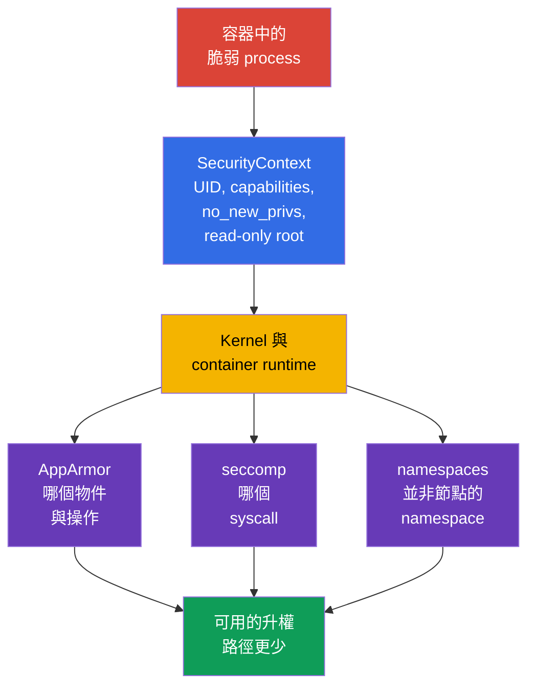
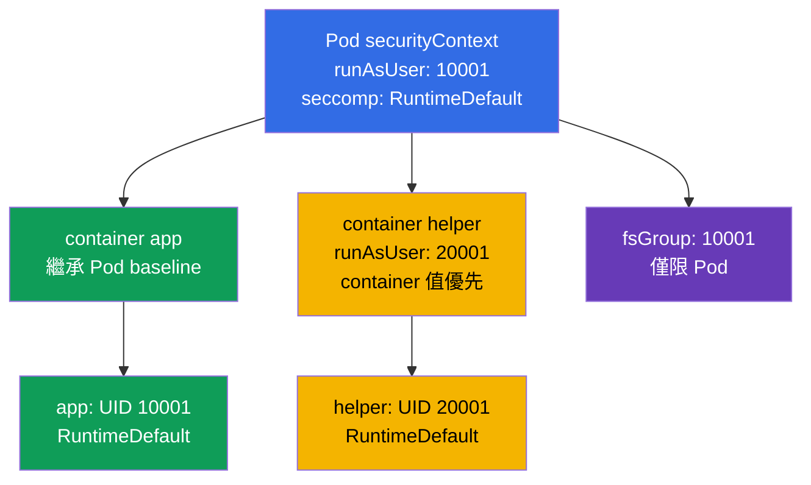
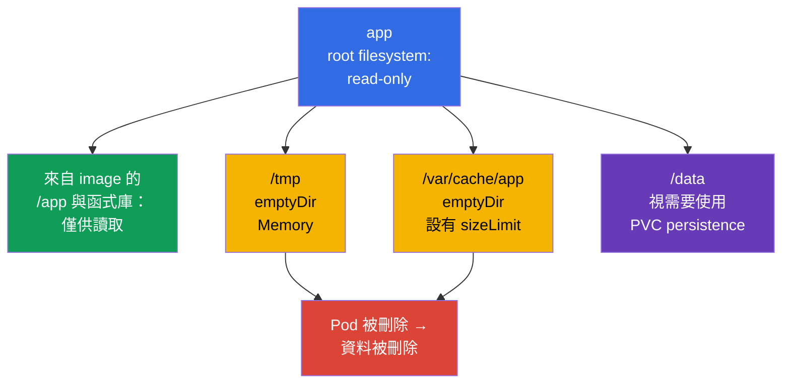

[Русская версия](ru.md) · [Eng version](README.md) · [Versión en español](es.md) · [Version française](fr.md) · [Deutsche Version](de.md) · [ქართული ვერსია](ge.md) · [日本語版](jp.md)

# 第 18 章。Hardened SecurityContext：最小化 process privileges

> **問題。** 若 process 以 root 身分執行、保有 capabilities、可提升 privileges，或能在 writable root filesystem 中替換 binaries，應用程式漏洞便會從單一 container 中的 shell 變成 node takeover 或 persistence。沒有統一的限制 contract，Pod 或 sidecar 中一個不安全的 default 都會擴大 compromise 的後果；hardened `SecurityContext` 可預先切斷這些多餘路徑。

> **接下來。** AppArmor 限制 process 可存取的 objects，而 seccomp 限制可使用的 system calls。現在把這些與基礎 process restrictions 組成可重現的 Pod contract：non-root、空 capability set、禁止 privilege escalation、read-only root filesystem 與 seccomp profile。這是 CKS 官方 **Minimize Microservice Vulnerabilities (20%)** 領域的內容：`SecurityContext` 和 Pod Security Standards。Cluster Setup 與其間接相關：node 的 kubelet 與 runtime 必須支援並套用這些 settings。目標不是「把所有欄位設為 true/false」，而是讓每個 container 只取得所需 privileges，且可加以證明。

> **需要的 CKA 基礎。** `SecurityContext`、UID/GID、capabilities 及 Pod/container levels，請見 [CKA 第 20 章](../../../cka/course/20/tw.md)。本章將它們當成統一的 hardened baseline，搭配 `seccompProfile`、拒絕 `privileged` 與 host namespaces、writable `emptyDir`，並驗證 effective state，而不只看 YAML。

> 🧠 `SecurityContext` 限制 process privileges，但不會消除 image vulnerabilities、RBAC、network 或 resource 問題。

## 18.1. 模型：保護 process，而不是「安全 image」

Container 隔離 filesystem 與 namespaces，但其 process 仍會與 kernel 互動。若 process 遭 compromise，多餘的 UID 0、capability、writable root filesystem 或 node namespace access 都會擴大後果。`SecurityContext` 向 runtime 傳達明確的 process boundaries；它無法取代修正 image vulnerabilities、RBAC、NetworkPolicy、AppArmor 或 seccomp。它也**不會設定** CPU、memory 或 ephemeral-storage requests/limits，也不能防護 resource exhaustion/noisy-neighbor：這些是獨立的 Pod fields 與 `LimitRange`/`ResourceQuota` 等 controls。



重要限制是：`runAsNonRoot: true` 是 launch check，而非 sandbox。帶有 `CAP_SYS_ADMIN`、`privileged: true`、`hostPID: true` 或 writable `hostPath` 的 non-root process，仍可能取得通往 node 的危險路徑。反之，seccomp 無法修正將 secret 寫入 `/tmp` 的 application。防護必須分層建構。

| Boundary | 可降低的項目 | 不保證的項目 |
|---|---|---|
| UID/GID 與 `runAsNonRoot` | root execution 的後果、permission mistakes | 不存在 Linux capabilities 或 host access |
| `capabilities.drop: ["ALL"]` | 個別 kernel privileges | application 與 network 安全性 |
| `allowPrivilegeEscalation: false` | 經由 setuid/setgid 和 file capabilities 的提升 | 未移除已授予的 capabilities |
| `readOnlyRootFilesystem: true` | 寫入 writable rootfs layer、persistence 與 binary replacement | 禁止寫入 volumes、`emptyDir` 和 memory |
| `seccompProfile` | 可使用的 syscalls set | 可存取 allowed files 或 API |
| 不使用 `privileged`、`host*`、`hostPath` | 直接存取 node namespaces、devices 與 data | 正確的 Kubernetes API authorization |

> 🎯 Baseline：non-root identity、`drop: ["ALL"]`、`allowPrivilegeEscalation: false`、read-only root filesystem、`RuntimeDefault` 及狹窄的 writable volumes。

## 18.2. Hardened baseline：一個 Pod，多個 boundaries

以下是 HTTP application 的實用 baseline。它刻意使用 high port `8080`，以免需要 `NET_BIND_SERVICE` capability。image 必須包含 UID `10001` 的使用者，且能在 read-only root filesystem 上運作。不要以盲目的 `runAsUser` 取代這些要求：先確認程式能讀取 configuration 與 certificates，且其 writable directories 已移至 volumes。

```yaml
apiVersion: v1
kind: Pod
metadata:
  name: hardened-web
  labels:
    app: hardened-web
spec:
  automountServiceAccountToken: false
  securityContext:                         # Pod 的通用設定
    runAsNonRoot: true
    runAsUser: 10001
    runAsGroup: 10001
    fsGroup: 10001
    seccompProfile:
      type: RuntimeDefault
  containers:
  - name: app
    image: registry.example.invalid/web:1.4.2
    ports:
    - containerPort: 8080
    securityContext:                       # 專屬於 app 的設定
      privileged: false
      allowPrivilegeEscalation: false
      readOnlyRootFilesystem: true
      capabilities:
        drop:
        - ALL
    volumeMounts:
    - name: tmp
      mountPath: /tmp
    - name: cache
      mountPath: /var/cache/web
  volumes:
  - name: tmp
    emptyDir:
      medium: Memory
      sizeLimit: 64Mi
  - name: cache
    emptyDir:
      sizeLimit: 256Mi
```

這不是可「貼上後忘掉」的通用 manifest。`automountServiceAccountToken: false` 僅在 application 不需要 Kubernetes API 時才適用。若需要 token，請設定專屬 ServiceAccount 與最小 RBAC，而不是恢復 default token。`emptyDir.medium: Memory` 很快，但會消耗 Pod/node memory，填滿時可能導致 OOM；對 disk cache 通常保留 default filesystem，並設定 `sizeLimit`。

### 這裡實際保護什麼

- **`runAsNonRoot: true`** 若 effective UID 最終為 0，則拒絕 launch。明確的 `runAsUser: 10001` 與 `runAsGroup: 10001` 讓 runtime 不必依賴不清楚的 image `USER`。nonzero UID 必須對應 image files 可用的 permissions。
- **`capabilities.drop: ["ALL"]`** 移除 runtime 原本可能保留的 capabilities。僅在有可量測需求時才加入例外。例如 legacy process 綁定 port 80 可合理使用 `NET_BIND_SERVICE`，但更好的做法是將 application 移至 8080，並保持空 set。
- **`allowPrivilegeEscalation: false`** 會設定 Linux `no_new_privs`：exec 無法藉由 setuid/setgid binary 或 file capabilities 取得更多 privileges。它不會取走已授予 container 的 privileges，也不能取代 `drop: ALL`。若 container 為 `privileged` 或具有 `CAP_SYS_ADMIN`，Kubernetes 會讓此值 effective 為 `true`。
- **`readOnlyRootFilesystem: true`** 讓 container 的 writable root filesystem 無法寫入；image layers 本來就是 immutable。它不會限制明確掛載的 volumes：這些 volumes 依其 mount options 與 permissions 維持 writable 或 read-only，因此 writable mount 不應是 `hostPath`。
- **`seccompProfile.type: RuntimeDefault`** 為所有 Pod containers 啟用 runtime default profile。它排除一些較少需要且具風險的 syscalls，但仍應在真實 workload 上驗證 compatibility。
- **`fsGroup: 10001`** 協助 non-root process 取得受支援 volume 的 group access。這是 Pod setting，並非修正 image layer 中每個 file owner 的方式。

> 🎯 Container-level override 只影響該 container；對 app、sidecar 與 initContainer 都要檢查 capabilities、`privileged`、escalation 與 read-only root filesystem。

## 18.3. Field precedence 與 level conflicts

`securityContext` 存在於 Pod level（`spec.securityContext`）和每個 container level（`spec.containers[].securityContext`，包括 init- 與 ephemeral containers）。並非每個 field 都可在兩個 levels 設定。若 field 兩處都可設定，container 值會**針對該 container**優先。Pod 值仍是相鄰 containers 的 baseline。



| Field | 設定位置 | 規則與實務結論 |
|---|---|---|
| `runAsUser`、`runAsGroup`、`runAsNonRoot` | Pod 和 container | container override 僅影響它；不要把例外藏在 sidecar |
| `seccompProfile` | Pod 和 container | container profile override 優先；在 Pod 設定 `RuntimeDefault`，並記錄所有 `Localhost` overrides |
| `fsGroup`、`fsGroupChangePolicy`、`supplementalGroups`、`supplementalGroupsPolicy` | 僅 Pod | 這是共享 Pod 與其 volumes 的 context；不存在 container `fsGroup` |
| `capabilities`、`privileged`、`allowPrivilegeEscalation`、`readOnlyRootFilesystem` | 僅 container | 在**每個** container 與 initContainer 重複 hardened settings |
| `hostNetwork`、`hostPID`、`hostIPC`、`hostUsers` | Pod spec | 它們不是 `securityContext`；container 無法安全地「override」host namespace access |

conflict 範例有助於診斷：

```yaml
spec:
  securityContext:
    runAsNonRoot: true
    runAsUser: 10001
    seccompProfile:
      type: RuntimeDefault
  containers:
  - name: app
    image: registry.example.invalid/app:1.4.2
    securityContext:
      runAsUser: 20001                 # app 的 effective UID 將會是 20001
      seccompProfile:
        type: Localhost                 # 而非 RuntimeDefault
        localhostProfile: profiles/app.json
```

此處 `app` 以 UID `20001` 執行，並使用 node-local profile。若未 override，`runAsNonRoot: true` 會被繼承。這本身並不是 error，但 `Localhost` 要求 profile 已安裝於 Pod 可能被排程到的**每個** node；否則 container 無法建立。不要只根據一個 `spec.securityContext` 判斷：請 inspect 每個 container。

> 🔬 `Strict` 會停用 image 的隱式 groups，且要求檢查 Kubernetes/CRI support 與 node response。

### `supplementalGroupsPolicy: Strict`：沒有隱式 image groups

預設的 `Merge` 會將 image `/etc/group` 中 primary user 的 membership 加到 supplementary groups。`Strict` 不執行此 merge：只保留 `fsGroup`、`supplementalGroups` 與 `runAsGroup` 的 GID。當 image 宣告的 group 不應給 process 意外的 volume access 時，這很有用。

```yaml
apiVersion: v1
kind: Pod
metadata:
  name: strict-groups
spec:
  securityContext:
    runAsUser: 1000
    runAsGroup: 3000
    fsGroup: 4000
    supplementalGroups: [5000]
    supplementalGroupsPolicy: Strict
  containers:
  - name: app
    image: registry.example.invalid/app:1.4.2
```

根據 Kubernetes 官方 release blog，`supplementalGroupsPolicy` 在 Kubernetes v1.35 為 GA/stable（lifecycle：alpha v1.31 → beta v1.33 → GA v1.35）。Feature gate `SupplementalGroupsPolicy` 固定為 enabled by default。仍需支援的 CRI：已知 containerd v2.0 及以上和 CRI-O v1.31 及以上支援。請以 `status.features.supplementalGroupsPolicy: true` 檢查 node。從 v1.33 起，kubelet 會拒絕在不支援 node 上使用 `Strict` 的 Pod，而非靜默套用 `Merge`；events 中會出現 `SupplementalGroupsPolicyNotSupported`。

> 🔬 SELinux labels、`/proc`、sysctls 與 Windows identity 需要檢查 Kubernetes、runtime、CSI、OS 及 policy。

### Advanced：SELinux、`/proc`、sysctls 與 Windows scope

這些 fields 也屬於 `SecurityContext`，但並非上方通用的 Linux baseline。Pod 或 container 的 `seLinuxOptions` 設定 process SELinux label；container-level 值會覆蓋 Pod-level 值。一般 recursive SELinux relabel 時，會在 container 使用 volume 前由 **container runtime** 變更 volume contents inode label，而不是 kubelet。Pod-level `seLinuxChangePolicy: MountOption` 請求透過 mount option `-o context=` relabel，但其本身不保證會生效。對 access mode 非 `ReadWriteOncePod` 的 PVC，在 Kubernetes v1.36 中需要啟用 `SELinuxMount` feature gate（預設為停用），且 CSI driver 的 `CSIDriver.spec.seLinuxMount: true`；否則 Kubernetes 使用一般 recursive relabel。不要為了速度變更 label 或 policy，而未測試特定 CSI/filesystem 的 isolation 與 compatibility。

> 🔬 **Upstream v1.37。** Kubernetes v1.37 中，`SELinuxMount` 成為 GA 且預設啟用。升級 SELinux-enabled cluster 前，請檢查 volume-label conflicts；必要時 workload 可藉由 `spec.securityContext.seLinuxChangePolicy: Recursive` 明確保留 recursive behavior。詳細資訊請見 [Kubernetes v1.37 Security Delta](../APPENDIX_K8S_137_SECURITY_DELTA_TW.md)。

`procMount` 是僅限 container-level 的 Linux option：安全 default `Default` 保留 `/proc` 的 sensitive parts masking；`Unmasked` 擴大 process 視野，不適合 restricted workload。從 Kubernetes v1.30 起，`Unmasked` 僅允許在 user namespace 中的 Pod，也就是使用 `spec.hostUsers: false`。Pod-level `securityContext.sysctls` 設定 Pod network/IPC namespace 的 sysctls。僅使用 Kubernetes documentation 中的 safe sysctls；unsafe sysctls 需要 kubelet allowlist，且可能與 host namespaces 衝突，因此是刻意的 node-level exception，而非 application setting。

Windows 不適用這些 Linux controls。Windows-container identity 透過 Pod 或 container 的 `windowsOptions.runAsUserName` 設定（container override 優先）；必要時也可在該處設定 GMSA。請另行檢查 user name、image 與 Windows-node support：Linux `runAsUser`/UID 與 SELinux 不能取代 `runAsUserName`。

> 🧠 Init、sidecar 與 ephemeral container 都有自己的 effective parameters；weak container 會繞過 Pod hardening。

### Init、sidecar 與 ephemeral container：獨立 processes

`initContainers` 在 application 前執行，但可能以不合適的 owner/mode 建立 files，或需要多餘 privileges。對 hardened workload，它們也遵循相同原則：explicit non-root UID、drop all capabilities、no escalation、read-only root，以及需要時的獨立 writable volume。不要只為 `chown -R` 而以 root 執行 initContainer：這常掩蓋 image 問題。先嘗試 `fsGroup`、image 中正確的 ownership 或 storage-class policy；privileged exception 必須短暫、有理由且隔離。

透過 `kubectl debug` 加入的 ephemeral container 也不會自動繼承 workload 的 container security context。它對 controlled incident response 很有用，但不應成為繞過 PSA 或 hardened baseline 的途徑：協調其 image、identity 與 admission policy，限制 lifetime，並記錄變更。對 persistent diagnostics，請變更 Deployment template 並建立新 Pod，而不是嘗試變更已執行 Pod 的 immutable `securityContext`。

> 🎯 移除 `privileged`、`hostPID`、`hostNetwork`、`hostIPC` 與寬廣的 `hostPath`：non-root UID 無法封閉這些越出 Pod boundary 的路徑。

## 18.4. `privileged` 與 `host*`：危險的 Pod boundary bypasses

某些 settings 讓 process 不只存取自己的 Pod，也能存取 node resources。它們可能為 CNI、CSI、node monitoring 或 runtime agent 所需，卻幾乎從不是一般 API、worker 或 batch job 的需求。「process 不是 root」並不會讓這類 access 安全。

| Setting | 開放的內容 | 風險原因 | 安全替代方案 |
|---|---|---|---|
| `privileged: true` | 幾乎所有 capabilities、devices 與較弱 runtime isolation | container compromise 幾乎等同 node compromise | 一般 container 使用 `drop: ALL`；僅在已證實需求時加入一項 capability |
| `hostPID: true` | PID namespace 中的 node processes | 可查看/signaling host processes、收集 sensitive `/proc` data | metrics API、kubelet summary API 或獨立且受信任的 node-agent |
| `hostNetwork: true` | node network namespace、host ports 與其 IP | 繞過 Pod-network isolation、port conflicts、存取 node localhost services | Service、Ingress、NetworkPolicy 與一般 Pod network |
| `hostIPC: true` | node IPC namespace | 存取 host-process shared memory 與 IPC | 具有 auth 的 volume、Service 或 message queue |
| `hostPath` volume | node filesystem 中選定 path | 讀取 kubelet credentials、container sockets、runtime state 或寫入 host | PVC、ConfigMap、Secret、`emptyDir`；只對 trusted daemon 提供狹窄 read-only path |

`privileged: true` 會強制使 `allowPrivilegeEscalation` effective 為 `true`，與 hardened workload 的目標衝突。此類 container 也會取得 seccomp `Unconfined`、其 AppArmor 會被忽略，SELinux context 則成為 `unconfined_t`。不要嘗試以相鄰的 `allowPrivilegeEscalation: false`「修正」它：container 仍為 privileged。`CAP_SYS_ADMIN` 同樣會讓 `allowPrivilegeEscalation` 生效為此規則。相似地，單一 `NetworkPolicy` 不能使 `hostNetwork: true` 安全，因為 NetworkPolicy 通常針對一般 Pod network 而非 node network namespace 設計。

```yaml
# 對一般應用程式而言的危險警示
spec:
  hostPID: true
  hostNetwork: true
  containers:
  - name: app
    securityContext:
      privileged: true
    volumeMounts:
    - name: host-root
      mountPath: /host
  volumes:
  - name: host-root
    hostPath:
      path: /
```

調查時，先找出 setting 出現的**原因**：Helm chart、injected sidecar、initContainer、DaemonSet 或 manual patch。未了解其 contract 前，不要從 CNI/CSI/monitoring DaemonSet 移除 `host*`：可能破壞整個 cluster 的 network 或 storage。對一般 workload，應以 supported API/volume 取代 access，並在 staging 驗證 rollout。

快速稽核所有 namespaces 中的 Pod：

```bash
kubectl get pods -A -o json | jq -r '
  def allContainers: ((.spec.containers // []) + (.spec.initContainers // []) + (.spec.ephemeralContainers // []));
  .items[]
  | [allContainers[] | select(.securityContext.privileged == true) | .name] as $privileged
  | [(.spec.volumes // [])[] | select(.hostPath != null) | (.name + "=" + .hostPath.path)] as $hostPaths
  | select(.spec.hostPID == true or .spec.hostNetwork == true or .spec.hostIPC == true or ($privileged|length)>0 or ($hostPaths|length)>0)
  | [.metadata.namespace, .metadata.name,
     ("hostPID=" + ((.spec.hostPID // false)|tostring)),
     ("hostNetwork=" + ((.spec.hostNetwork // false)|tostring)),
     ("hostIPC=" + ((.spec.hostIPC // false)|tostring)),
     ("privileged=" + ($privileged|join(","))),
     ("hostPath=" + ($hostPaths|join(",")))] | @tsv'
```

此 command 會顯示 candidates，而非 verdict。system namespace 與 DaemonSet 需要 context-aware review：owner、purpose、node placement、minimal access、manifest 與 admission control。

> 🔬 `hostUsers: false` 的 UID/GID mapping 及對 Linux、kernel、CRI/OCI runtime 與 filesystems 的 requirements。

### `hostUsers: false`：Kubernetes v1.36 的 user namespaces

在 Kubernetes v1.36 中，user namespaces 為 stable。`hostUsers: false` 請 kubelet 為 Pod 建立 user namespace，並選擇不重疊的 UID/GID mapping：container 內的 UID 0 或 `runAsUser` 會映射為 node 的 unprivileged UID/GID。capabilities 僅在此 namespace 中生效：例如 `CAP_SYS_ADMIN` 不會授予其外部 privileges。這是需要 container 內 root、但不需要 host namespaces 或 node resources access 的 workload 的額外 barrier。

```yaml
apiVersion: v1
kind: Pod
metadata:
  name: userns-tool
spec:
  hostUsers: false
  containers:
  - name: tool
    image: registry.example.invalid/tool:1.4.2
    securityContext:
      allowPrivilegeEscalation: false
      capabilities:
        drop: ["ALL"]
```

這是 Linux-only mode。預設不能與 `hostNetwork`、`hostPID` 或 `hostIPC` 合用，也禁止透過 `volumeDevices` 使用 raw block volumes。在 v1.36，alpha gate `UserNamespacesHostNetworkSupport`（預設為 `false`）會另外允許 `hostNetwork: true` 搭配 `hostUsers: false`；`hostPID` 與 `hostIPC` 仍被禁止。Hardened baseline 不應依賴此 alpha exception：此組合需要明確 gate、獨立 review 與 threat model 驗證。需要 node filesystems 及所有 volumes 的 idmapped mounts、支援的 CRI/OCI runtime 及 compatible kernel；目前 documentation 指出 containerd v2.0+、CRI-O v1.25+、runc v1.2+ 或 crun v1.9+。NFS 不支援 idmapped mounts。rollout 前，請在 Pod 可能被排程到的所有 nodes 檢查這些條件。

> 🎯 遇到 write error 時，找出 path，並加入具有合適 permissions 與 lifecycle 的最小 `emptyDir` 或 PVC。

## 18.5. Read-only root filesystem，而不破壞 application

`readOnlyRootFilesystem: true` 會揭露隱式 writes：PID files、temporary files、cache、generated config、logs 或 package manager。解法不是移除限制，而是明確描述每個 writable path 及其 lifecycle。



`emptyDir` 會為 node 上的 Pod 建立，並由其 containers 共享。它可跨同一 Pod 內的 container restart 存續，但 Pod 刪除/重新建立後就會消失；它並非應能復原 data 的 storage。`sizeLimit` 限制的是預期的 volume，但無法取代 requests/limits 或 node ephemeral storage monitoring。

以下範例適用於需要 `/tmp`、runtime directory 與 cache 的程式：

```yaml
spec:
  securityContext:
    runAsNonRoot: true
    runAsUser: 10001
    runAsGroup: 10001
    fsGroup: 10001
    seccompProfile:
      type: RuntimeDefault
  containers:
  - name: app
    image: registry.example.invalid/reporter:2.1.0
    securityContext:
      allowPrivilegeEscalation: false
      readOnlyRootFilesystem: true
      capabilities:
        drop: ["ALL"]
    volumeMounts:
    - name: tmp
      mountPath: /tmp
    - name: run
      mountPath: /var/run/reporter
    - name: cache
      mountPath: /var/cache/reporter
  volumes:
  - name: tmp
    emptyDir:
      medium: Memory
      sizeLimit: 32Mi
  - name: run
    emptyDir:
      sizeLimit: 8Mi
  - name: cache
    emptyDir:
      sizeLimit: 128Mi
```

不要在 `/` 上掛載 `emptyDir`，也不要在未有 application contract 下做寬廣 writable mount（如 `/var`）：這會再次隱藏原本要控制的 writes。精確 paths 能更清楚表達允許什麼。logs 通常應傳送至 stdout/stderr；只有 application 或 local sidecar 確實要求時，才合理在 `emptyDir` 寫入 file。

### 不移除 hardening 的 Debug

`Read-only file system` 症狀是有用的訊號。先找出 path，再決定它是 temporary、cache 或 data。不要以加入 `privileged: true` 或寫入 `hostPath` 的方式處理 incident。

```bash
# 事件以及 CreateContainerConfigError/CrashLoopBackOff 的原因
kubectl describe pod hardened-web
kubectl logs hardened-web -c app --previous

# 僅在允許 exec 的情況下：檢查 app 內部的 mount 與權限
kubectl exec hardened-web -c app -- id
kubectl exec hardened-web -c app -- sh -c 'mount | grep -E " /tmp |/var/cache/web"'
kubectl exec hardened-web -c app -- sh -c 'touch /tmp/probe && rm /tmp/probe'

# 核對實際的 volumeMounts 與 workload template
kubectl get pod hardened-web -o yaml
```

若 application 需要 shell tool，不要為了「debug」把它加入 production image，也不要讓 root filesystem writable。優先使用 logs、metrics、traces、具有明確 NetworkPolicy 的 temporary hardened debug Pod，或經核准的 ephemeral container procedure。診斷後刪除 debug artifact；若該 write 確實屬於 contract，就在 template 新增最小 `emptyDir` mount。

> 🎯 使用 `RuntimeDefault`，並透過 `/proc/1/status` 證明 effect；`Localhost` 需要將 profile 交付給每個可用 node。

## 18.6. Baseline 中的 Seccomp：RuntimeDefault、Localhost 與證明

`seccompProfile` 設定 kernel 對 system calls 的反應。對正常 workload，使用 `RuntimeDefault`：runtime 會套用其支援的 profile。`Unconfined` 停用這條 boundary，不適合 hardened baseline。只有當 team 擁有 profile、可確保其交付至所有合適 nodes，且會測試 runtime updates 時，才使用 `Localhost`。

| Type | 使用時機 | Operational risk |
|---|---|---|
| `RuntimeDefault` | 幾乎所有 applications 的 baseline | profile 取決於 runtime 及 version；應測試 updates |
| `Localhost` | 由 node configuration management 交付的狹窄 syscall contract | 某個 node 缺少 file 會造成 container creation error |
| `Unconfined` | 具有明確 approval 的短暫 diagnostic exception | 沒有 syscall boundary；exception 很容易成為永久設定 |

```yaml
# Pod baseline：若未設定 container override，所有 container 都會繼承此設定
spec:
  securityContext:
    seccompProfile:
      type: RuntimeDefault
```

對 `Localhost`，path 是相對於 kubelet 的 seccomp directory，而不是相對於 container filesystem。不要把 JSON profile 複製進 ConfigMap，並期待 kubelet 能看見它。profile 必須以可信方法交付至 nodes、將 scheduling 固定在擁有該 profile 的 nodes，並證明確實套用。詳細 model 與 syscall denial debugging，請見 [第 17 章](../17/tw.md)。

從 process 的 Linux namespace 內檢查：

```bash
kubectl exec hardened-web -c app -- sh -c 'grep -E "^(NoNewPrivs|Seccomp):" /proc/1/status'
# 預期結果：對典型的 RuntimeDefault runtime 而言，NoNewPrivs: 1 且 Seccomp: 2（filter）
```

`Seccomp: 2` 證明 PID 1 已啟用 filter，卻不能證明所需 syscall 是由您 intended profile 封鎖。對 `Localhost`，請加入受控的 negative test、預期 `EPERM`/`Operation not permitted`，並檢查 node/runtime log。不要將真正 exploit 變為驗證：在 isolated environment 測試安全的 denied syscall。

> 🎯 檢查 template 中的 intent、admission/launch 及 process effective state；`kubectl apply` 無法證明 UID、capabilities、seccomp 或 write denial。

## 18.7. 驗證：manifest、effective state 與 negative scenarios

驗證由三個不同問題組成：

1. **Intent：** Deployment/Pod template 包含所需 fields。
2. **Admission 與 launch：** Pod 已被接受、建立於預期 node，且 container 確實為 Running；events 不顯示 UID/profile/volume ownership conflict。
3. **Runtime effect：** process 有 non-root UID、空 capability set、`NoNewPrivs`、seccomp filter，且僅有預期的 writable mount points。

僅檢查 `kubectl apply` 並不足夠：API 可能接受 object，然後 kubelet 得到 `CreateContainerConfigError`、image 因缺少 permissions 而失敗，或 container 帶有 container-level override。

### 1. 比對 template 與所有 containers

```bash
# 目前這個教學用 Pod 的 declarative intent。
kubectl get pod hardened-web -o yaml
# 在 production 中，受管理 workload 的 source of truth 是其 controller template：
# kubectl get deploy <deployment-name> -o yaml

# Pod 層級的 context，以及每個一般/init container 的 context
kubectl get pod hardened-web -o jsonpath='{.spec.securityContext}{"\n"}'
kubectl get pod hardened-web -o jsonpath='{range .spec.containers[*]}{.name}{": "}{.securityContext}{"\n"}{end}'
kubectl get pod hardened-web -o jsonpath='{range .spec.initContainers[*]}{.name}{": "}{.securityContext}{"\n"}{end}'

# Host namespaces 與 privileged flag 需要另外檢查
kubectl get pod hardened-web -o jsonpath='{.spec.hostPID}{" "}{.spec.hostNetwork}{" "}{.spec.hostIPC}{"\n"}'
kubectl get pod hardened-web -o json | jq '
  ((.spec.containers // []) + (.spec.initContainers // []) + (.spec.ephemeralContainers // []))
  | .[] | {name, privileged: (.securityContext.privileged // false)}'
```

JSONPath 顯示 declared configuration。缺少 boolean field 時，空 output 不等於 `false`：audit requirement 應為 explicit，而非依賴 default。也檢查 `initContainers`、injected service-mesh/observability sidecars 與 ephemeral containers：一個 weak container 會共享同一 Pod 的 network 與 volumes。

### 2. 檢查 launch 與 effective identity

```bash
kubectl wait --for=condition=Ready pod/hardened-web --timeout=90s
kubectl describe pod hardened-web

kubectl exec hardened-web -c app -- id
# 預期結果：uid=10001(...) gid=10001(...)，且沒有 uid=0

kubectl exec hardened-web -c app -- sh -c 'grep -E "^(Cap(Inh|Prm|Eff|Bnd|Amb)|NoNewPrivs|Seccomp):" /proc/1/status'
```

在 `/proc/1/status` 中，對 `drop: ALL` 而言 effective capabilities 應為零。`NoNewPrivs: 1` 確認禁止 escalation。`Seccomp: 2` 通常代表 filter，但請檢視實際 runtime，且不要以解讀單一數字取代驗證。若 image 不含 `sh`，請使用允許的 diagnostic image/ephemeral procedure，或透過具 access control 的 node/runtime tools 檢查狀態。

### 3. Negative checks 與常見結果

| Check | 預期結果 | 若結果不同 |
|---|---|---|
| app 中的 `id -u` | 不是 `0` | image/override 以 root 執行；檢查 Pod 與 container contexts |
| 寫入 `/` | `Read-only file system` | root filesystem 不是 read-only，或 write 落在寬廣 mount |
| 寫入 `/tmp` | 在指定 `emptyDir` 成功 | 沒有 mount、UID/GID 錯誤，或 volume driver 不支援 `fsGroup` |
| 嘗試 setuid escalation | 無新 privileges，`NoNewPrivs: 1` | `allowPrivilegeEscalation` 缺少/為 true、container privileged、具有 `CAP_SYS_ADMIN`，或 runtime policy 不正確 |
| test Pod 中不安全 syscall | 被 seccomp 拒絕 | profile 未套用、test 不是該 syscall，或執行了其他 container |
| restricted namespace 中有 `privileged: true` 的 Pod | admission reject | PSA/policy 未 enforce，或 namespace 有 exception |

對 `/` 的 negative write test 不應修改 application。請使用獨立 smoke-test Pod 或無害 path，並事先排除 volume mount。在 production，先檢查 workload 的 observable copy：tests 不應意外填滿 `emptyDir`、刪除 cache 或造成 restart。

## 18.8. 常見 failures 與安全修正

| 症狀 | 可能原因 | 修正 |
|---|---|---|
| `container has runAsNonRoot and image will run as root` | image 未指定 non-root USER，且 UID 未設定 | 以 non-root USER 建置 image，或明確設定已驗證的 nonzero UID |
| mounted volume 出現 `Permission denied` | UID/GID 不相符，或 driver 未套用 `fsGroup` | 檢查 ownership、storage driver、`fsGroup`；不要 blanket `chmod 777` |
| `Read-only file system` | app 將 PID/cache/temp 寫入 image layer | 僅在所需 path 加入狹窄 `emptyDir` 或 PVC |
| 使用 `Localhost` seccomp 時 Pod 無法建立 | 選定 node 缺少 profile | 交付 profile 並限制 placement，或改回 `RuntimeDefault` |
| port 80 無法開啟 | non-root，且沒有 `NET_BIND_SERVICE` | 監聽 high port 並設定 Service `targetPort`；capability 僅為合理 exception |
| hardening 後 sidecar 故障 | `SecurityContext` 僅設給 app，或 sidecar 寫入 root filesystem | 每個 container 都需要 hardened context 與 explicit writable volumes |
| PSA 拒絕 Pod | forbidden setting（`privileged`、host namespace、`Unconfined`） | 移除 bypass；將 exception 個別、最小且暫時地處理 |

若 application 可將 secrets 作為 mounted Secret 讀取，就不應把它們複製到 writable `emptyDir`。若程式被迫轉換 certificate/configuration，請建立獨立的小型 writable volume、最小化其 lifetime 與 permissions，且勿與一般 cache 混合。`readOnlyRootFilesystem` 不會保護同一 Pod 中也掛載此 volume 的其他 container 免於讀取其內容。

> 🏭 Versioned templates、inventory、image fixes、canary、runtime tests、admission guardrails 與 documented exceptions。

## 18.9. 分階段導入 hardened baseline

將 baseline 導入 Deployment/StatefulSet/Job template 與 Helm chart，而非手動導入已建立 Pod。大多數 running Pod 的 `securityContext` 是 immutable：正確變更應建立新的 ReplicaSet/Pod，並觀察 rollout。

1. 盤點 processes、writable paths、low ports、volume ownership、syscall/profile requirements，以及目前 `privileged`/`host*` exceptions。
2. 修正 image：使用 non-root `USER`、讓 files 可由所需 UID/GID 讀取、讓 application 寫入 documented directories 而非 `/`。
3. 加入 Pod baseline：`runAsNonRoot`、明確 nonzero UID/GID、`RuntimeDefault` seccomp，並在需要時使用 `fsGroup`。
4. 為**所有** app/init/sidecar containers 加入 container baseline：`drop: ["ALL"]`、`allowPrivilegeEscalation: false`、`readOnlyRootFilesystem: true`、`privileged: false`。
5. 將必要 writable paths 移至具有 `sizeLimit` 和 requests/limits 的狹窄 `emptyDir`/PVC mount points；移除未使用的 ServiceAccount token。
6. 執行 readiness、functional 與 negative tests，然後 inspect effective `/proc` 與 mounts。
7. 啟用 admission guardrail（Pod Security Admission restricted 及/或 policy engine），以免下一個 chart version 恢復 privileged/host namespace 或 `Unconfined`。
8. 記錄並定期 review 每個 exception：owner、reason、scope、期限、所需 capability/profile 與 test evidence。

## 18.10. 自我檢查問題

<details>
<summary>1. 為什麼 `runAsNonRoot: true` 不會使具有 `privileged: true` 的 Pod 安全？</summary>

`runAsNonRoot` 會在 launch 時檢查 effective UID，但不是 sandbox。`privileged: true` 幾乎授予所有 capabilities 與 device access，使 seccomp effective 為 `Unconfined`，並忽略 AppArmor。具有這種 access 的 non-root process 仍可取得危險 node paths。
</details>

<details>
<summary>2. 哪些 container `securityContext` fields 必須為 initContainer 與 sidecar 分別設定？</summary>

對每個 app、sidecar 與 initContainer，分別設定 `capabilities.drop: ["ALL"]`、`allowPrivilegeEscalation: false`、`readOnlyRootFilesystem: true`，以及必要時的 `privileged: false`。Pod-level `runAsNonRoot`、UID/GID 和 `seccompProfile` 提供 baseline，但 container 可 override。因而應檢查所有 container lists，包括 injected sidecars。
</details>

<details>
<summary>3. 若 Pod 設定 `runAsUser: 10001`，container 設定 `runAsUser: 20001`，container 的 effective UID 是什麼？</summary>

此 container 的 effective UID 是 `20001`。對可在兩個 levels 設定的 fields，container-level 值僅對該 container 優先。Pod-level `10001` 仍是沒有 override 的相鄰 containers 的 baseline。
</details>

<details>
<summary>4. 為什麼不能將 `fsGroup` 視為修正 image layer 所有 file permissions 的機制？</summary>

`fsGroup` 是 Pod setting，有助於支援 volumes 的 group access。它不設計用來變更 image layer 中所有 files 的 owner，也無法取代 image 中正確的 ownership 與 UID。對 writable paths，還要明確選擇 volume 並檢查 storage driver support。
</details>

<details>
<summary>5. 在 operational 上，`RuntimeDefault` 與 `Localhost` seccomp profile 有何不同？</summary>

`RuntimeDefault` 使用支援的 runtime profile，適合作為幾乎所有 workloads 的 baseline。`Localhost` 參照由 trusted automation 預先交付至每個符合條件 node 的 kubelet seccomp root 下的 JSON。選定 node 缺少 file 會造成 container creation error，因此需要 versioning、placement 與 runtime compatibility。
</details>

<details>
<summary>6. `emptyDir` 中哪些 data 能跨 container restart 保留，卻會在 Pod 刪除時消失？</summary>

`emptyDir` contents 可跨同一 Pod 內的 container restart 保留。Pod 刪除或重新建立時，volume 和 data 一起消失。因此它適合 `/tmp`、runtime directory 與 cache，不適合必須復原的 data。
</details>

<details>
<summary>7. 為什麼 `allowPrivilegeEscalation: false` 不能取代 `capabilities.drop: ["ALL"]`？</summary>

`allowPrivilegeEscalation: false` 啟用 `no_new_privs`，禁止經由 setuid/setgid binary 或 file capabilities 取得新 privileges。它不會取走已授予 container 的 capabilities。因此 baseline 另以 `drop: ["ALL"]` 移除 initial set。
</details>

<details>
<summary>8. `kubectl apply` 後，要證明 hardening 需要哪三項獨立檢查？</summary>

先檢查 intent：template 和所有 containers 的 security context。接著確認 admission 與 launch：Pod Ready，events 未顯示 UID、profile 或 volume conflict。最後檢查 runtime effect：non-root UID、zero capabilities、`NoNewPrivs`、seccomp 與僅預期 writable mounts，包含 negative scenarios。
</details>

<details>
<summary>9. 為什麼即使使用 non-root UID，`hostNetwork` 與 `hostPID` 仍需要 review？</summary>

`hostPID` 開放 node processes 與 sensitive `/proc` data，而 `hostNetwork` 提供 node network namespace、IP、host ports 與 localhost services。這是對 host resources 的 access，單一 non-root UID 無法移除。對一般 workload，本章建議使用 Service、一般 Pod network、NetworkPolicy 或 supported API，而不是 host namespace。
</details>

<details>
<summary>10. **回顧（第 10 章）。** PSA 透過可在建立 object 時直接設定的 namespace labels 生效，而不僅能透過獨立 `patch` 設定。第 10 章說明了針對**變更**現有 namespace labels 的 RBAC control（`patch` Namespace labels），但未涵蓋 **建立** namespace 本身。為什麼僅用 RBAC 限制 `namespaces` 的 `create` verb，無法保證新 namespace 取得 `enforce=restricted`？要封閉這條 PSA bypass path，實際需要哪種機制（RBAC 或 admission-level）？</summary>

RBAC `create namespaces` 決定 identity 能否建立 object，卻不驗證新 request 中是否有必要的 metadata labels。具有該權限的使用者可建立沒有 `pod-security.kubernetes.io/enforce=restricted` 的 namespace，而 PSA 將依 default configuration 生效，後者不一定是 restricted。需要 admission-level policy，例如 ValidatingAdmissionPolicy 或 policy engine，在 CREATE 時要求必要 labels；RBAC 仍是縮小 namespace creators 範圍的額外限制。
</details>

> 🏭 使用共用 chart/template 與 CI/admission policy；每個 exception 都有 scope、owner、reason、review date 與 evidence。

## 18.11. 在 production 中的應用方式

Team 應將 baseline 固定在共用 Helm chart 或 library template，而不是在 manifests 之間複製。每個 deviation 都應記錄：owner、reason、scope、review date，以及證明其必要性的 test。CI 適合檢查 rendered manifest 中的 `privileged`、`host*`、`hostPath`、`Unconfined` 與缺少 required fields；在 cluster 中，Pod Security Admission 或 policy engine 補充此檢查。

採取分階段導入：先在 staging 中以 observable logs 和 metrics 啟動 workload，接著對一個 replica 或 canary 啟用 restrictions，並監控 rollout、launch errors 和 ephemeral storage consumption。確認 contract 後，再將變更放入 workload template。確實需要 host access 或特殊 capabilities 的 node agents，應與 application namespaces 隔離，並個別 review。

## 18.12. 迷你詞彙表

| Term | 簡短定義 |
|---|---|
| **SecurityContext** | 設定 process 或 Pod identity 與 restrictions 的 Kubernetes fields。 |
| **capability** | 個別 Linux privilege；`drop: ["ALL"]` 移除 initial set。 |
| **no_new_privs** | 禁止經由 `exec` 取得 additional privileges 的 kernel flag；由 `allowPrivilegeEscalation: false` 啟用。 |
| **read-only root filesystem** | Container root filesystem 以 read-only 掛載；禁止寫入 writable rootfs layer，允許的 writes 要移至 volumes。 |
| **seccomp** | Process system-call filter；`RuntimeDefault` 是支援的 runtime baseline。 |
| **effective state** | launch 後 process 的實際 UID、capabilities、mounts 及 seccomp，而非僅 manifest fields。 |
| **host namespace** | Pod 可經由 `hostPID`、`hostNetwork` 或 `hostIPC` 共享的 node namespace。 |

## 18.13. 本章總結

1. Process hardening 需要結合 non-root identity、空 capability set、禁止 escalation、read-only root filesystem 與 seccomp，而非只使用一個 field。
2. Pod-level 與 container-level settings 有不同 scope；每個 app、sidecar 與 initContainer 都必須分別檢查。
3. `privileged`、`host*` 與 `hostPath` 是有 node risk 的 exceptions，而非 application 方便的 defaults。
4. Writable paths 必須明確、狹窄，並由適當 volume、ownership 與 limits 支援。
5. Hardening 的證明涵蓋 template intent、successful launch，以及帶有 negative scenarios 的 process runtime check。

## 18.14. 適用之處：考試與實務工作

**在考試中。** 先辨別每個 field 的 level：`fsGroup` 設於 Pod，capabilities 與 `allowPrivilegeEscalation` 則設於 container。經由 controller 修正 manifest 或重新建立 Pod，再以 `kubectl describe`、`id`、`/proc/1/status` 和 writable `emptyDir` check 確認結果。對 seccomp，區分 `RuntimeDefault` 與 `Localhost`：後者需要 node 上有 profile。

**在實務工作中。** 同樣的順序讓 hardening 成為可重複的 process：安全 baseline 位於 template、admission 防止 regressions，rollout 與 runtime signals 顯示 incompatibilities。每個 exception 都有最小 scope、responsible owner 與 review date，因此 temporary concession 不會變成永久 vulnerability。

## 實作

在 [CKA Lab 107](../../../cka/labs/107/README_TW.MD) 演練 hardened template：使用 `emptyDir` 作為明確描述的 ephemeral writable storage，並以 `check_result` 驗證結果。接著在獨立 test workload 加入本章 baseline：non-root UID、`drop: ["ALL"]`、`allowPrivilegeEscalation: false`、read-only root filesystem、供 `/tmp` 使用的 `emptyDir` 與 `RuntimeDefault`。證明 `id`、`NoNewPrivs`、`Seccomp`、mount points 與預期 root write denial。若要深入診斷 syscall policy，請回到 [第 17 章](../17/tw.md)。

🧪 Lab 107（multi-container Pod、`emptyDir` 與 writable-path debugging）：
[tasks/cka/labs/107](../../../cka/labs/107/README_TW.MD)

🌐 額外互動練習（killer.sh/killercoda，外部資源）：[privileged-containers](https://killercoda.com/killer-shell-cks/scenario/privileged-containers) · [privilege-escalation-containers](https://killercoda.com/killer-shell-cks/scenario/privilege-escalation-containers)

## 參考資料

- [Kubernetes: Configure a Security Context for a Pod or Container](https://kubernetes.io/docs/tasks/configure-pod-container/security-context/)
- [Kubernetes: Pod Security Standards](https://kubernetes.io/docs/concepts/security/pod-security-standards/)
- [Kubernetes: Restrict a Container's Syscalls with seccomp](https://kubernetes.io/docs/tutorials/security/seccomp/)
- [Kubernetes: Volumes - emptyDir](https://kubernetes.io/docs/concepts/storage/volumes/#emptydir)
- [Kubernetes: Linux kernel security constraints](https://kubernetes.io/docs/concepts/security/linux-kernel-security-constraints/)
- [Kubernetes: User Namespaces](https://kubernetes.io/docs/concepts/workloads/pods/user-namespaces/)

---
[目錄](../README_TW.md) · [第 17 章](../17/tw.md) · [第 19 章](../19/tw.md)
