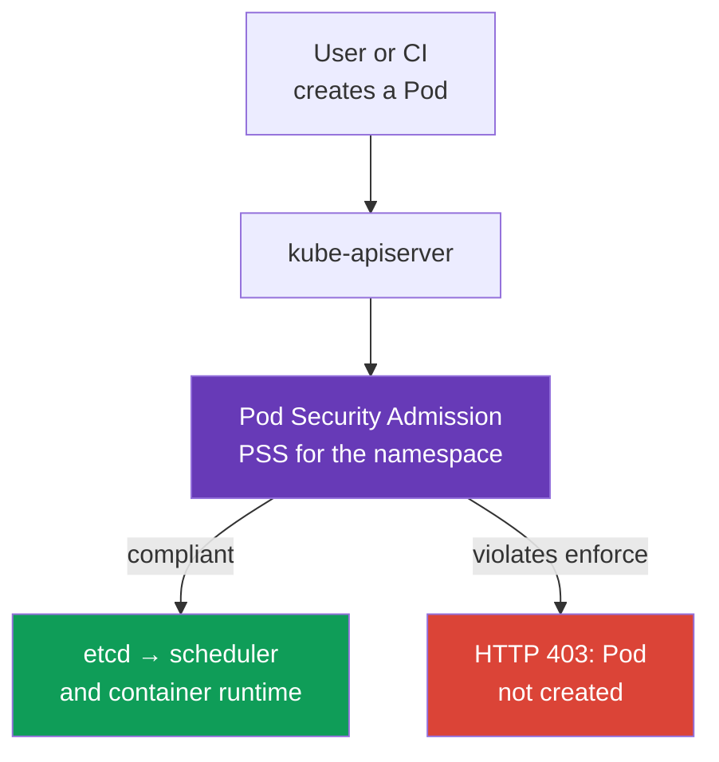
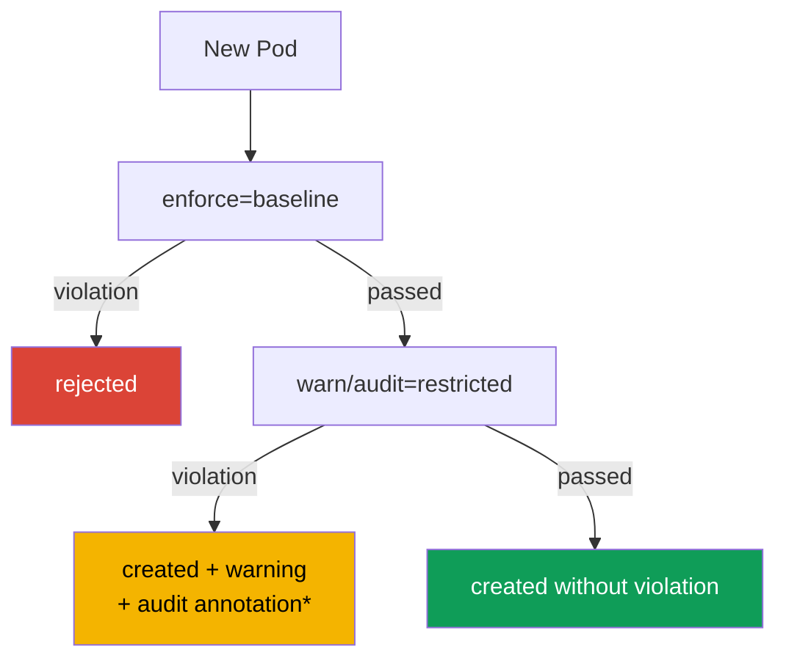

[Русская версия](ru.md) · [Versión en español](es.md) · [Version française](fr.md) · [Deutsche Version](de.md) · [ქართული ვერსია](ge.md) · [繁體中文版](tw.md) · [日本語版](jp.md)

# Chapter 19. Pod Security Admission and Pod Security Standards

> **Problem.** A developer, compromised CI, or Helm chart with the `create pods` permission can
> submit an RBAC-authorized manifest containing `privileged: true`, `hostPath: /`, or a host namespace.
> Such a Pod gives its process a path to node data and the kernel, even if a separate workload
> has a good `SecurityContext`. A shared admission boundary is needed to enforce a secure
> baseline on every Pod in a namespace before it starts.

> **What comes next.** `securityContext` describes the privileges with which a particular Pod
> *should* run, but it does not by itself prevent another manifest from requesting `privileged: true`,
> `hostPath`, or host namespaces. **Pod Security Admission (PSA)** is the built-in Kubernetes
> admission controller that checks Pods before they are written to etcd and applies the ready-made
> **Pod Security Standards (PSS)** to a namespace. It is the foundation of the CKS **Minimize
> Microservice Vulnerabilities** domain: first a secure baseline for every workload, then narrow,
> observable exceptions.

> **What you need from CKA.** The `securityContext` fields, non-root execution, capabilities,
> and `allowPrivilegeEscalation` are covered in [CKA chapter 20](../../../cka/course/20/README.md).
> Here we use them as a contract that PSA checks and enforces.

> 🧠 PSA evaluates a Pod at admission, while RBAC governs permission to create an object; the PSS `privileged`, `baseline`, and `restricted` profiles do not replace runtime hardening, networking, or scanning.

## 19.1. Why PSA is needed

A developer has permission to create a Pod, and the manifest accidentally or deliberately
contains a dangerous setting:

```yaml
apiVersion: v1
kind: Pod
metadata:
  name: node-breakout
spec:
  hostPID: true
  containers:
  - name: shell
    image: busybox:1.36.1
    command: ["sh", "-c", "sleep 3600"]
    securityContext:
      privileged: true
```

Such a container gets nearly unlimited access to the node kernel and devices; together with
`hostPID`, `hostNetwork`, or `hostPath`, this is a common path from an application compromise
to node data and neighboring Pods. YAML review is insufficient: the manifest can arrive from
CI, a Helm chart, or the API. A control **at admission** is needed, before the container starts.



PSA is a validating admission controller with fixed standards. It does not replace RBAC: RBAC
answers **who** has the `create pods` permission; PSA answers **which Pod** that user may create.
It also does not replace NetworkPolicy, seccomp, AppArmor, image scanning, or a policy engine:
each control protects a different layer.

## 19.2. PSS: three security levels

Pod Security Standards define three cumulative profiles. Choose the level separately for each
namespace.

| Profile | Purpose | What it permits or requires |
|---|---|---|
| `privileged` | system components and fully trusted workloads | deliberately unrestricted by PSA |
| `baseline` | a minimally secure shared level | blocks known escalation paths: privileged containers, host namespaces, hostPath, dangerous capabilities, and insecure settings |
| `restricted` | ordinary application workloads in production | everything from baseline plus strict least privilege: non-root, `allowPrivilegeEscalation: false`, `seccomp`, dropped capabilities, and restricted volumes |

### `privileged`: not a policy, but no restrictions

`privileged` is useful where a Kubernetes component genuinely must manage a node: CNI, CSI, or
a node agent. It is **not** a sensible default for an application namespace. A namespace without
PSA labels effectively behaves as `privileged` only with the standard PSA configuration, where
`PodSecurityConfiguration.defaults` has `enforce: privileged`. A cluster administrator can set
`baseline` or `restricted` and their version in `defaults`, so always verify the effective policy
against the namespace and admission-controller configuration, not absence of a label.

Even for a system namespace, do not grant `privileged` to an application team "to fix it".
First determine the required capability, volume, or syscall; otherwise, temporary debugging
becomes a permanent bypass of the security boundary.

### `baseline`: block obvious container-escape paths

`baseline` prohibits dangerous mechanisms that an application rarely needs: `privileged: true`,
`hostNetwork`, `hostPID`, `hostIPC`, `hostPath` volumes, unsafe SELinux/AppArmor/seccomp settings,
and dangerous Linux capabilities. It is suitable as a transitional minimum, including for a
namespace with legacy workloads.

Baseline does not promise that a process is non-root and does not require complete
`securityContext` hardening; its purpose is to prevent the most well-known paths to the host.
For an application production namespace, it is usually an intermediate state rather than the
end goal.

### `restricted`: the security contract for ordinary application workloads

`restricted` requires least privilege. Exact details depend on the PSS version, so pin the
standard version during rollout, but the essential manifest looks like this:

```yaml
apiVersion: v1
kind: Pod
metadata:
  name: web
  namespace: payments
spec:
  securityContext:
    runAsNonRoot: true
    seccompProfile:
      type: RuntimeDefault
  containers:
  - name: web
    image: nginxinc/nginx-unprivileged:1.30.4-alpine-slim
    ports:
    - containerPort: 8080
    securityContext:
      allowPrivilegeEscalation: false
      capabilities:
        drop: ["ALL"]
```

Below is a compact matrix for **PSS `restricted` v1.36**. It includes `baseline`; a rule for
each container also applies to `initContainers` and `ephemeralContainers`, unless stated otherwise.

> **⚠️ The exam runs on v1.35.** This matrix uses v1.36 as the training baseline. On the exam, use the version in the task, `v1.35`, or do not set `pod-security.kubernetes.io/*-version`; do not copy the `v1.36` label to an older cluster without checking it.

| v1.36 control | Permitted value or requirement |
|---|---|
| Host namespaces and Windows HostProcess | `hostNetwork`, `hostPID`, `hostIPC` - only `false`/unset; `windowsOptions.hostProcess` - `false`/unset |
| Privileged | `securityContext.privileged` - `false`/unset |
| Capabilities | only `NET_BIND_SERVICE` may be added; `capabilities.drop: ["ALL"]` is required |
| Host storage and ports | `hostPath` is prohibited; each `hostPort` is unset/`0` or a predefined allowlist (built-in PSA supports only unset/`0`) |
| AppArmor | `appArmorProfile.type` - unset, `RuntimeDefault`, or `Localhost`; legacy annotation - only `runtime/default` or `localhost/*` |
| SELinux | `type`: unset/empty, `container_t`, `container_init_t`, `container_kvm_t`, or `container_engine_t`; `user` and `role` are not set |
| `procMount`, seccomp, and sysctls | `procMount` - unset or `Default`; seccomp explicitly `RuntimeDefault`/`Localhost`; sysctls - only the v1.36 safe allowlist: `kernel.shm_rmid_forced`, `net.ipv4.ip_local_port_range`, `net.ipv4.ip_unprivileged_port_start`, `net.ipv4.tcp_syncookies`, `net.ipv4.ping_group_range`, `net.ipv4.ip_local_reserved_ports`, `net.ipv4.tcp_keepalive_time`, `net.ipv4.tcp_fin_timeout`, `net.ipv4.tcp_keepalive_intvl`, `net.ipv4.tcp_keepalive_probes` |
| Probes and lifecycle | do not set `host` fields in `httpGet`/`tcpSocket` probes or in `httpGet`/`tcpSocket` lifecycle hooks |
| Volumes | only `configMap`, `csi`, `downwardAPI`, `emptyDir`, `ephemeral`, `persistentVolumeClaim`, `projected`, `secret` |
| APE | `allowPrivilegeEscalation: false` |
| Run as | `runAsNonRoot: true` on the Pod or every container; if set, `runAsUser` is not `0` |

**OS-specific rule.** Starting with PSS v1.25, Linux restrictions on privilege escalation,
seccomp, and capabilities do not apply to Pods with `.spec.os.name: windows`. Do not require
`allowPrivilegeEscalation: false`, `seccompProfile`, or `drop: ALL` from a Windows Pod in the
same way as from a Linux Pod; Windows HostProcess and other applicable Windows controls are
checked separately.

`readOnlyRootFilesystem: true` is a strong security practice, but not an independent PSS
restricted requirement. Do not substitute it for required fields. If an application needs a port
below 1024, `NET_BIND_SERVICE` may be added back selectively after `drop: ["ALL"]` if the selected
PSS version permits it and the task justifies it.

**User namespaces in v1.36.** For a Linux Pod with `spec.hostUsers: false`, PSA relaxes only
the `runAsNonRoot` and `runAsUser` checks even under `baseline`/`restricted`: root inside a
separate user namespace is mapped to an unprivileged host UID. This does not cancel the other
rules in the matrix or permit host namespaces. Do not carry this exception over to an ordinary
Pod with `hostUsers` unset or `true`.

> 🎯 Migration: `warn`/`audit` → `enforce`; check namespace labels/PSS version and diagnose direct-Pod rejection with server-side dry run.

## 19.3. PSA modes: enforce, audit, and warn

The same PSS profile can be applied in three independent modes. This allows you to see the
effect of policy first and then enable prohibition.

| Mode | Result of a violation | Where to find the signal |
|---|---|---|
| `enforce` | API server rejects violating creates and policy-checked updates: create does not create a new Pod, update does not save the change | `kubectl` response, CI/CD, Event/API audit |
| `audit` | Pod is admitted; PSA adds an annotation to the corresponding audit event | control-plane audit log, if enabled |
| `warn` | Pod is admitted; client receives a warning | `kubectl` stderr/response, CI log |

`warn` and `audit` **do not protect**: a violating Pod still runs. Their purpose is inventory
before moving to `enforce`. The modes are independent: one namespace can have `enforce=baseline`
while already collecting `warn` and `audit` for `restricted`.

PSA `audit` adds an annotation to a Kubernetes audit event, but does not itself enable an API
audit backend or guarantee event retention. For evidence, check in advance that API auditing is
enabled, policy records the required requests/stages, and the operator has access to the selected
audit sink. Otherwise use `warn`, server-side dry run, and PSA metrics as supplementary signals.
Not every update of an existing Pod undergoes a policy check again: metadata-only updates (except
deprecated seccomp/AppArmor annotations), and valid changes to `.spec.activeDeadlineSeconds` and
`.spec.tolerations`, are excluded.



*An observable audit record exists only if Kubernetes API auditing is enabled and the audit policy/backend retains the corresponding event.*

## 19.4. Namespace labels and standard version

PSA is configured by namespace labels. The key format is:

```text
pod-security.kubernetes.io/<mode>=<level>
pod-security.kubernetes.io/<mode>-version=<version>
```

`<mode>` is `enforce`, `audit`, or `warn`; `<level>` is `privileged`, `baseline`, or
`restricted`. A version value is a Kubernetes minor version, such as `v1.36`, or `latest`.
Set a version separately for each mode.

PSA labels are part of the security boundary. An identity allowed to create workloads in an
application namespace must not automatically receive `create`, `patch`, or `update` on
`Namespace`: changing or removing PSA labels changes the applied policy.

```bash
# First observe restricted, while already prohibiting the most dangerous Pods.
kubectl label namespace payments \
  pod-security.kubernetes.io/enforce=baseline \
  pod-security.kubernetes.io/enforce-version=v1.36 \
  pod-security.kubernetes.io/warn=restricted \
  pod-security.kubernetes.io/warn-version=v1.36 \
  pod-security.kubernetes.io/audit=restricted \
  pod-security.kubernetes.io/audit-version=v1.36

# After fixing workloads, enable actual restricted prohibition.
kubectl label namespace payments \
  pod-security.kubernetes.io/enforce=restricted \
  pod-security.kubernetes.io/enforce-version=v1.36 --overwrite
```

PSA applies policy to new Pods and updates that are part of its policy checks. Do not expect a
label change to remove already running Pods: PSA is not a controller and does not fix existing
objects. When an `enforce` level or version label on a namespace changes, PSA checks existing
Pods and returns warnings about violations; this is a migration signal, not automatic removal.
Not every namespace change triggers such a check.

`latest` is convenient for a small test cluster, but creates production risk: after a Kubernetes
update, the standard can become stricter and reject a previously working rollout. Therefore,
the examples in this chapter pin the version to `v1.36` - the course training baseline and core
labs. For your production cluster, choose a PSS pin that matches its actual API server version;
do not use a version above it.

> **Version boundary for training, exam, and production.** The related curriculum file is now called
> `CKS_Curriculum v1.34`; that is the version of the educational document, not the runtime version.
> The course training baseline and core labs use Kubernetes `v1.36`, so the labels and matrix above
> use `v1.36`. The CKS exam environment in the pinned course snapshot uses Kubernetes `v1.35`;
> check the actual version in ExamUI before an attempt. Always choose the production PSS version by
> the API server version of that particular cluster: the training pin `v1.36` neither promises exam
> requirements nor recommends "always use v1.36" in the future.

**PSS version drift.** The `baseline`/`restricted` profiles become stricter over time: for
example, Kubernetes `v1.34` added restrictions on host fields in probes and lifecycle hooks to
Baseline/Restricted. A Pod that passes an older pin (say, `v1.31`) can therefore be rejected under
a newer standard version. A practical migration path is to pin the currently supported version,
first assess the effect in `warn`/`audit`, compare with the old pin (`v1.31`) as a migration
example if needed, and then intentionally raise `enforce`. This is why "works on an old PSS
version" does not mean "passes on a new one".

Checking the effective configuration begins with the namespace, not the Pod manifest:

```bash
kubectl get namespace payments --show-labels
kubectl get namespace payments -o jsonpath='{.metadata.labels}' ; echo
kubectl get namespace -L pod-security.kubernetes.io/enforce \
  -L pod-security.kubernetes.io/enforce-version \
  -L pod-security.kubernetes.io/warn \
  -L pod-security.kubernetes.io/audit
```

## 19.5. Migrate to restricted without disrupting delivery

Enabling `enforce=restricted` immediately on a legacy namespace is risky: a Deployment will not
create new replicas, a Job will not start, and an autoscaler or rollback can be blocked. A safe
migration separates observation from prohibition.

1. **Inventory namespaces and owners.** Find Pod templates in Deployments, StatefulSets,
   DaemonSets, Jobs, and CronJobs. Fix the controller template, not a live Pod: otherwise the
   next replica violates policy again.
2. **Start with `warn=restricted` and `audit=restricted`.** Existing traffic and CI reveal
   violators but block nothing. Before relying on audit records, check availability of API audit
   logging and the selected sink; retain available warnings/audit records as a work list.
3. **Eliminate violations in templates.** Add `runAsNonRoot`, seccomp, prohibition of escalation,
   and dropped capabilities; replace `hostPath` with a permitted volume, and a privileged function
   with a separate system component.
4. **Test negative and positive scenarios.** A good Pod must be created without a warning; a
   deliberately bad one must produce a warning/audit before enforce and rejection after it.
5. **Move first to `enforce=baseline`, then to `enforce=restricted`.** Leave `warn` and `audit`
   on restricted for at least the rollout period to see template drift.
6. **Pin the PSS version.** Update it together with a Kubernetes update and revalidation of the
   manifest.

Example of a minimal Pod-template fix:

```yaml
spec:
  template:
    spec:
      securityContext:
        runAsNonRoot: true
        seccompProfile:
          type: RuntimeDefault
      containers:
      - name: api
        image: registry.example/api@sha256:<digest>
        securityContext:
          allowPrivilegeEscalation: false
          capabilities:
            drop: ["ALL"]
```

If an image truly requires root, do not disable PSA as the first action. Check `USER` in the
Dockerfile, file ownership, application port, and writable directories; an image can usually be
adapted to a non-root UID and given an `emptyDir` for `/tmp` or cache. An exception must result
from a demonstrated technical need, not be a shortcut around migration.

## 19.6. Rejection: how to read and reproduce a denial

With `enforce`, admission returns an error before the Pod is created. This is not
`ImagePullBackOff`, a scheduler error, or a runtime denial: the Pod can have no UID at all and
not appear in `kubectl get pods`.

```bash
# Deliberately violate policy in a restricted namespace.
kubectl -n payments run privileged-test --image=busybox:1.36.1 \
  --restart=Never \
  --overrides='{
    "spec": {
      "containers": [{
        "name": "privileged-test",
        "image": "busybox:1.36.1",
        "securityContext": {"privileged": true}
      }]
    }
  }'
```

A denial that lists PodSecurity violations is expected. The message is useful as a checklist:
it will identify, for example, `privileged`, missing `runAsNonRoot`, `allowPrivilegeEscalation`,
capabilities, or seccomp. For a controller template, use dry run before rollout, but do not
treat it as evidence of enforce:

```bash
# For a Deployment, PSA applies warn/audit to spec.template, but not enforce.
kubectl apply --dry-run=server -f deployment.yaml

# To test enforce, create a separate Pod manifest from spec.template
# and check it in a namespace with the same PSA labels.
kubectl -n payments apply --dry-run=server -f rendered-pod.yaml
kubectl auth can-i create pods -n payments
kubectl get deployment -n payments api -o yaml
```

`--dry-run=server` performs the admission check but does not persist the object. For workload
resources, PSA applies `warn` and `audit` to the Pod template, but `enforce` checks the Pod only
later, when a controller creates it. A successful Deployment dry run therefore does not prove
that a controller-created Pod will pass `enforce`: check a separate Pod from the same template,
or perform a real rollout in an isolated test namespace with identical PSA labels and monitor
`kubectl rollout status` and Events. `kubectl auth can-i` distinguishes an RBAC denial from a
PSA denial. If a Pod has already been created by a controller and will not start, first inspect
`kubectl describe pod` and Events: PSA denial occurs before start, while an image, node, seccomp,
or AppArmor error occurs later and at a different layer.

> 🏭 PSA exception: minimal namespace/identity scope, owner, reason, compensating controls, and removal date.

## 19.7. Exceptions: narrow, owned, and time-limited

Some system components objectively do not comply with restricted: CNI, a CSI node plugin, a
device plugin, or a diagnostic agent. The choice is not "disable PSA for the cluster", but a
minimal exception with an owner, reason, and review deadline.

**Preferred option - a separate namespace and the least permissive sufficient level.** For
example, a system DaemonSet remains in `kube-system` or a dedicated `platform-system` with
`enforce=baseline` or, when demonstrably necessary, `privileged`; application namespaces remain
`restricted`. A namespace must not mix a trusted node agent and user workloads.

**System PSA exemptions** are configured in the admission-controller configuration, not through
a namespace label. `AdmissionConfiguration` for `PodSecurity` provides `usernames`,
`runtimeClasses`, and `namespaces` lists; an exemption applies to all PSA modes. These dimensions
are independent: a match in **any** of them (`namespace` **or** `runtimeClass` **or** `username`)
completely bypasses PSA. Do not combine several dimensions in one exemption expecting to narrow
the scope.

Only a namespace exemption is shown below. The `defaults` are shown in full; when modifying a
real configuration, retain every active value and add only the necessary narrow exception.

```yaml
apiVersion: apiserver.config.k8s.io/v1
kind: AdmissionConfiguration
plugins:
- name: PodSecurity
  configuration:
    apiVersion: pod-security.admission.config.k8s.io/v1
    kind: PodSecurityConfiguration
    defaults:
      enforce: restricted
      enforce-version: v1.36
      audit: restricted
      audit-version: v1.36
      warn: restricted
      warn-version: v1.36
    exemptions:
      usernames: []
      runtimeClasses: []
      namespaces:
      - platform-system
```

Do not copy this example blindly into a managed cluster: the way to specify admission
configuration depends on who manages kube-apiserver. Before adding an exemption, document the
reason, identity/namespace, owner, compensating controls, and removal date. Do not add a broad
group of users or put an application namespace in exemptions merely because one Deployment did
not pass migration.

A username exemption applies to the identity of a particular API request. A Pod created from a
Deployment, DaemonSet, or Job is usually created by a controller, not the original user; its
exemption is not passed to the controller-created Pod. Do not exempt controller ServiceAccounts
for a workload: this can bypass PSA for every resource that such a controller creates. Also do
not confuse a PSA exemption with RBAC. An exemption does not grant permission to create a Pod;
it merely skips the PSS check when RBAC has already allowed the request.

> 🔬 `PodSecurityPolicy` was removed in Kubernetes v1.25; move standard restrictions to PSA/PSS and organizational ones to a policy engine.

## 19.8. PSP: why old manifests do not work

**PodSecurityPolicy (PSP)** was the former Pod restriction mechanism, but it was removed from
Kubernetes in version 1.25. PSA is not an API replacement for `kind: PodSecurityPolicy`: it uses
three fixed PSS profiles and namespace labels, not an arbitrary PSP spec and RBAC `use`.

Signs of an obsolete configuration:

```yaml
apiVersion: policy/v1beta1
kind: PodSecurityPolicy
metadata:
  name: restricted
```

After API removal, such an object cannot be created, and a ClusterRole with PSP `use` does not
enable protection. During migration:

- remove `PodSecurityPolicy`, `policy/v1beta1`, and RBAC `use` rules for PSP from manifests and Helm charts;
- map the intent of the old policy to PSS: move standard requirements into `baseline` or `restricted` labels;
- move rules that PSA cannot express (a trusted registry, required labels, resource limits, a specific StorageClass) into Kyverno, Gatekeeper, or `ValidatingAdmissionPolicy`;
- start PSA in `warn`/`audit`, because PSP and PSA differ in semantics and scope;
- after cutover, verify that the admission controller is enabled, labels are assigned, and old cluster-wide bypasses have not remained.

PSA cannot be extended with custom fields. This is an advantage for basic hardening: behavior is
standardized and clear on the exam and in incident response. For organizational rules, use a
policy engine **in addition to**, not instead of, PSS.

> 🎯 Evidence: pinned labels, a permitted and a violating **direct Pod** in the namespace, and the workload's effective `securityContext`.

## 19.9. Operational checklist and verification

PSA verification must prove both configuration and result:

```bash
NS=payments
SUBJECT='system:serviceaccount:payments:ci'  # identity being checked

# PSA labels are a security boundary: the workload creator must not change namespace policy itself.
kubectl auth can-i create pods -n "$NS" --as="$SUBJECT"
kubectl auth can-i create namespaces --as="$SUBJECT"
kubectl auth can-i patch namespaces/"$NS" --as="$SUBJECT"
kubectl auth can-i update namespaces/"$NS" --as="$SUBJECT"

# 1. Assigned level and version pin.
kubectl get ns "$NS" -o jsonpath='{.metadata.labels}{"\n"}'

# 2. A direct safe Pod passes server-side admission, including enforce.
kubectl -n "$NS" apply --dry-run=server -f restricted-pod.yaml

# 3. A direct violating Pod receives warning/audit or rejection according to the mode.
kubectl -n "$NS" apply --dry-run=server -f privileged-pod.yaml

# 4. For a Deployment, server dry run shows warn/audit for spec.template,
# but only a Pod confirms enforce. Check a rendered Pod or rollout in a test namespace.
kubectl -n "$NS" apply --dry-run=server -f deployment.yaml
kubectl -n "$NS" apply --dry-run=server -f rendered-pod.yaml

# 5. Effective securityContext of the created Pod.
kubectl -n "$NS" get pod web -o jsonpath='{.spec.securityContext}{"\n"}'
kubectl -n "$NS" get pod web -o jsonpath='{.spec.containers[*].securityContext}{"\n"}'
```

| Observation | Probable cause | Action |
|---|---|---|
| `privileged` Pod passed in a supposedly restricted namespace | absent/incorrect `enforce` label, exempt Pod, or another namespace is being checked | show namespace labels, creator, and admission configuration |
| CI sees a warning but deployment was still created | `warn` or `audit`, not `enforce`, is active | this is an expected migration phase; do not call it protection |
| New rollout is rejected while old Pods run | PSA does not remove existing Pods but checks new ones | fix the controller template and repeat rollout |
| `kubectl apply` returns Forbidden and the Pod is not created | PSA or RBAC denied before persistence | compare the error text with `auth can-i` and namespace labels |
| System component breaks after restricted | component needs a permitted separate namespace or narrow exemption | do not weaken the application namespace; record the exception |

For an application/CI identity, expect `no` for `create namespaces`,
`patch namespaces/<application-namespace>`, and `update namespaces/<application-namespace>`.
Delegated namespace creation is a separate privileged workflow: PSA labels must be assigned and
protected by a platform control/admission policy.

For observability, collect API audit logs and PSA metrics `pod_security_evaluations_total`,
`pod_security_errors_total`, and `pod_security_exemptions_total` if they are available in your
distribution. Their label sets differ: evaluations have `decision`, `mode`, `policy_level`,
`policy_version`, `request_operation`, `resource`, `subresource`; errors have `fatal`,
`request_operation`, `resource`, `subresource`; exemptions have only request/resource dimensions.
The `policy` label does not exist here. For `audit`/`warn`, `decision="deny"` means a violation
of the checked policy was found, not API rejection: only `mode="enforce"` rejects a request.
In CI, add `kubectl apply --dry-run=server` of a direct Pod against a test namespace with the same
PSA labels as production; additionally test a workload template through a real rollout there.

> 🏭 IaC creates namespaces with pinned `enforce=restricted`; exceptions are stored with an expiry, and a policy engine adds organizational rules.

## 19.10. How this is applied in production

- **restricted by default for applications.** Create namespaces through a template/IaC already
  with pinned `enforce=restricted`; do not leave security to the discretion of each chart. Leave
  permission to change PSA labels to a trusted platform/security role.
- **Warning before prohibition.** A new PSS level starts with `warn` and `audit`, then becomes
  `enforce`; this prevents policy from turning a planned rollout into an incident.
- **System-component boundaries.** CNI/CSI and node agents are isolated from business workloads
  by separate namespaces, ServiceAccounts, and RBAC. `privileged` is not extended to the entire platform.
- **An exception is temporary security debt.** It has an owner, test, ticket, compensating
  controls, and removal date. An exemption is not a way to "fix" an image that can be made non-root.
- **PSA plus a policy engine.** PSA supplies the known PSS baseline; Kyverno/Gatekeeper or a
  built-in CEL policy adds organization requirements: permitted registries, image digest, labels,
  `requests`/`limits`, and Service/Ingress restrictions.

## 19.11. How this helps: on the exam and in real work

On the CKS exam, it is important to quickly distinguish a PSA rejection from RBAC, scheduler,
or container-runtime problems: check namespace PSA labels, apply the manifest through
`kubectl apply --dry-run=server`, and read the violation list in the admission error. Be able to
assign `enforce`, `warn`, and `audit`, pin the PSS version, and fix the controller template itself.

In real work, these same steps make it possible to move a namespace to `restricted` without
stopping delivery: first collect violations through `warn`/`audit`, then fix templates, and only
after validation enable `enforce`. Isolate separate system components in dedicated namespaces at
the minimum necessary level, and document every exemption with an owner and removal date.

## 19.12. Mini-glossary

- **PSA (Pod Security Admission)** - built-in validating admission controller for PSS.
- **PSS (Pod Security Standards)** - ready-made Pod security profiles: `privileged`, `baseline`, `restricted`.
- **`enforce`** - PSA mode that rejects a violating Pod.
- **`audit`** - PSA mode that does not reject a Pod and adds violation information to the
  Kubernetes audit event; an observable audit log requires separately enabled API auditing and
  an appropriate audit policy/backend.
- **`warn`** - mode that returns a warning to the client without rejecting the Pod.
- **PSS version** - standard version for a particular PSA mode; a pin protects rollout against
  an unexpected rule change after upgrade.
- **exemption** - PSA bypass for a pretrusted namespace, username, or RuntimeClass; it does not
  grant RBAC permission.
- **PSP (PodSecurityPolicy)** - PSA's predecessor, removed in Kubernetes 1.25.

## 19.13. Chapter summary

- PSA checks a Pod before it is written to etcd; it complements RBAC and `securityContext`, but
  does not replace other security controls.
- PSS supplies three profiles: unrestricted `privileged`, `baseline` against explicit node-breakout
  paths, and `restricted` for a non-root application with least privilege; absence of namespace
  labels means `privileged` only with the standard PSA defaults.
- `enforce`, `audit`, and `warn` are independent and set by namespace labels
  `pod-security.kubernetes.io/<mode>`; each can receive `<mode>-version`. Permission to change
  these labels changes the security boundary and must not automatically follow from permission to
  create workloads.
- A reliable migration goes from `warn`/`audit` to `enforce=baseline`, then to
  `enforce=restricted`, fixing templates rather than live Pods.
- PSA rejection occurs before Pod creation. Check namespace labels, effective defaults, a direct
  Pod through server-side dry run, RBAC, and the admission-error text; successful Deployment dry
  run does not confirm enforce for a Pod that a controller will later create.
- PSP was removed in 1.25. It cannot be restored with a manifest: move standard rules to PSA and
  organizational rules to a policy engine.
- Exceptions must be narrow, separate from application namespaces, documented, and temporary.

## 19.14. Self-check questions

<details>
<summary>1. How do the responsibilities of RBAC, `securityContext`, and PSA differ?</summary>

RBAC determines who can perform `create pods`. `securityContext` sets process privileges and restrictions for a particular Pod, while PSA checks before writing to etcd which Pod PSS permits for the namespace. These layers complement rather than replace each other.
</details>

<details>
<summary>2. Why should a namespace without PSA labels not be considered protected?</summary>

With standard PSA defaults, such a namespace effectively behaves as `privileged`, but an administrator can configure different defaults. Therefore absence of labels does not prove the effective policy. Check namespace labels and admission-controller configuration.
</details>

<details>
<summary>3. Which three PSS profiles exist and when is each justified?</summary>

`privileged` does not restrict a Pod through PSA and is needed only for trusted system components. `baseline` blocks known breakout paths, including privileged containers, host namespaces, and hostPath, and is useful as a transitional minimum. `restricted` adds non-root, APE false, seccomp, and dropped capabilities for ordinary production workloads.
</details>

<details>
<summary>4. How do `warn` and `audit` differ from `enforce`, and why are they not protection?</summary>

`warn` admits a Pod with a warning to the client, while `audit` adds an annotation to an audit event and also admits the Pod; observable audit evidence requires enabled API audit logging. Only `enforce` rejects a violating create and relevant PSA update before persistence. The first two modes are therefore intended for inventory and migration.
</details>

<details>
<summary>5. How do you write the label for `enforce=restricted` with a pinned PSS version (the training-cluster version)?</summary>

The chapter training baseline uses `pod-security.kubernetes.io/enforce=restricted` and `pod-security.kubernetes.io/enforce-version=v1.36`. Assign them to a namespace, for example with `kubectl label namespace payments`. Choose a production pin from the actual API server version rather than automatically carrying over the training value.
</details>

<details>
<summary>6. Why is pinning a PSS version before upgrading Kubernetes better than leaving `latest`?</summary>

PSS becomes stricter over time: the chapter notes host-field restrictions in probes and lifecycle hooks added in v1.34. With `latest`, an upgrade can unexpectedly reject a formerly working rollout. A pin lets you first assess manifests through warn/audit and update the standard intentionally.
</details>

<details>
<summary>7. Why do you fix the Deployment template rather than an already created Pod?</summary>

PSA does not fix or remove existing Pods, and the controller will create the next replica from its template. Manually modifying a live Pod does not eliminate the source of the next violation. Therefore, change the Deployment, StatefulSet, Job, or CronJob template and perform a rollout.
</details>

<details>
<summary>8. How does a PSA admission rejection differ from `ImagePullBackOff` and an RBAC denial?</summary>

PSA denies before the Pod is created and returns an error with PSS violations; the object may not receive a UID. `ImagePullBackOff` and runtime/scheduler errors occur after admission and appear in Events. RBAC also denies before persistence, but is distinguished by the response text and `kubectl auth can-i`.
</details>

<details>
<summary>9. Why is a separate namespace better than a broad exemption for CNI or CSI?</summary>

A separate namespace lets a system component receive the minimum PSS level it needs without weakening application workloads. An exemption in AdmissionConfiguration bypasses PSA in every mode for a namespace, username, or RuntimeClass. Therefore, use it only narrowly, with documentation and temporarily.
</details>

<details>
<summary>10. What happened to PodSecurityPolicy and how are rules absent from PSS covered?</summary>

PodSecurityPolicy was removed in Kubernetes 1.25, so old PSP manifests and RBAC `use` do not enable protection. Move standard requirements to PSA `baseline` or `restricted`. Implement registries, labels, limits, and other rules outside PSS with Kyverno, Gatekeeper, or ValidatingAdmissionPolicy.
</details>

<details>
<summary>11. **Flashback (chapter 30).** PSA makes a decision once - at admission, when a Pod is created. If a Pod honestly passed `enforce=restricted`, but a process inside the container later tries to run something suspicious (for example, a downloaded binary), can PSA stop it? Which layer from chapter 30 covers this runtime, rather than admission-time, moment?</summary>

No. PSA makes a decision only at admission and does not observe later process execution. Runtime-security tools from chapter 30 cover this moment: they observe process events and can detect or respond to suspicious behavior. Admission prevents dangerous configuration, while runtime detection complements it after startup.
</details>

## Practice

Practice PSA and `securityContext` in [lab 107 - PSA and SecurityContext](../../labs/107/README.MD). Create a test namespace, enable `warn=restricted` and `audit=restricted`, then apply a safe and a deliberately privileged Pod. Fix the template until the result is clean, enable `enforce=restricted`, and verify that the bad Pod receives an admission rejection while the good one is created. Then check labels and the effective `securityContext` using commands from section 19.9.

Useful official references: [Pod Security Admission](https://kubernetes.io/docs/concepts/security/pod-security-admission/), [Pod Security Standards](https://kubernetes.io/docs/concepts/security/pod-security-standards/), and [migration from PodSecurityPolicy](https://kubernetes.io/docs/tasks/configure-pod-container/migrate-from-psp/).

---
[Table of contents](../README.md) · [Chapter 18](../18/README.md) · [Chapter 20](../20/README.md)
