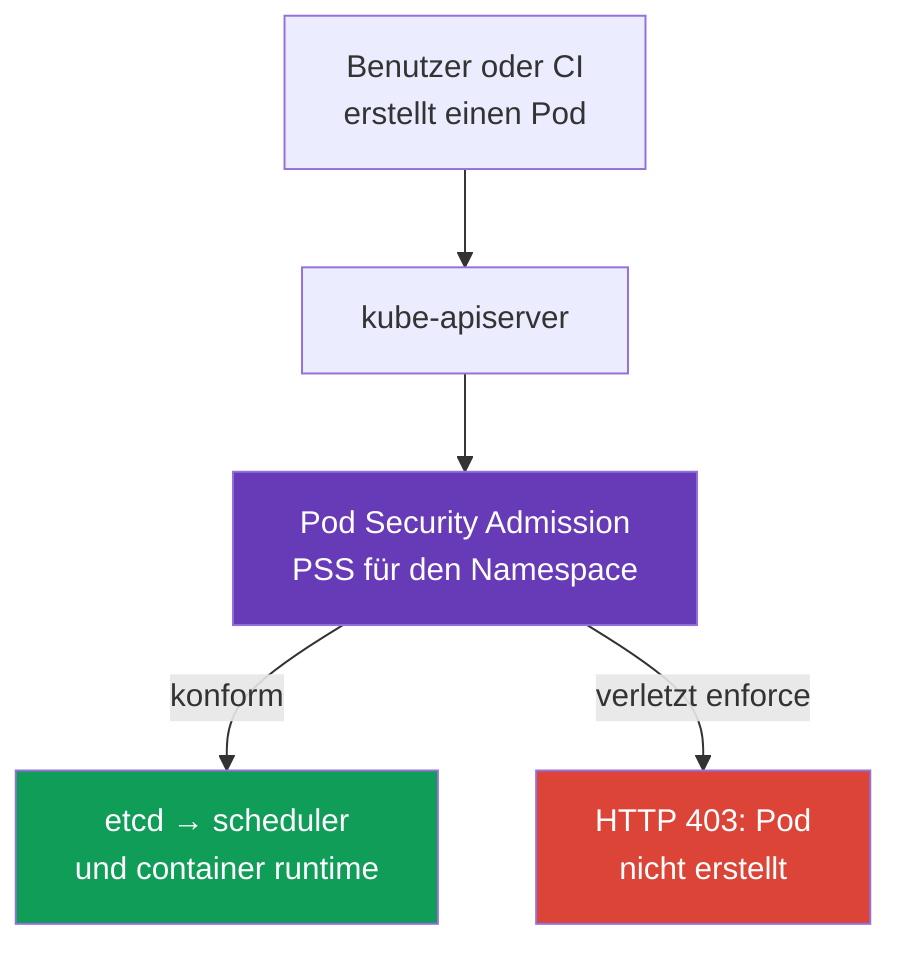
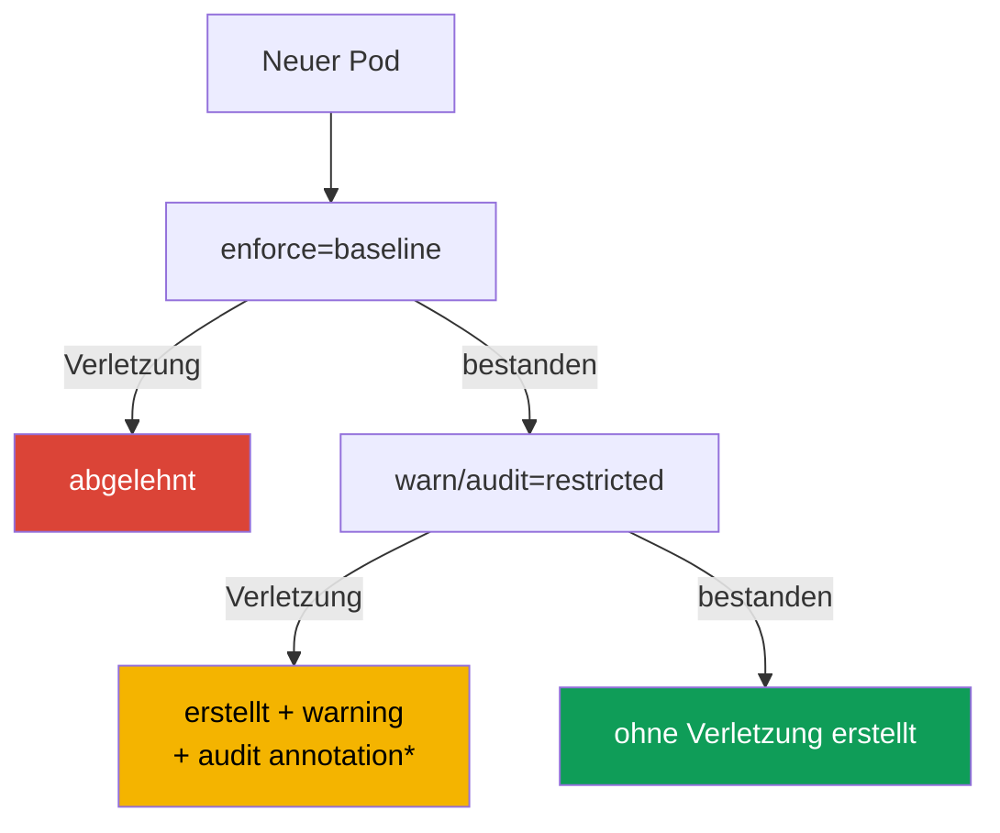

[Русская версия](ru.md) · [Eng version](README.md) · [Versión en español](es.md) · [Version française](fr.md) · [ქართული ვერსია](ge.md) · [繁體中文版](tw.md) · [日本語版](jp.md)

# Kapitel 19. Pod Security Admission und Pod Security Standards

> **Problem.** Ein Entwickler, eine kompromittierte CI oder ein Helm chart mit dem Recht `create pods` kann
> ein durch RBAC erlaubtes Manifest mit `privileged: true`, `hostPath: /` oder einem Host-Namespace
> übermitteln. Ein solcher Pod gibt seinem Prozess Zugriff auf Node-Daten und den Kernel, obwohl ein
> separates Workload einen guten `SecurityContext` haben kann. Es braucht eine gemeinsame
> Admission-Grenze, die vor dem Start einen sicheren Baseline für alle Pods in einem Namespace erzwingt.

> **Was folgt.** `securityContext` beschreibt, mit welchen Rechten ein bestimmter Pod *laufen soll*,
> verhindert jedoch nicht selbst, dass ein anderes Manifest `privileged: true`, `hostPath` oder Host-Namespaces
> anfordert. **Pod Security Admission (PSA)** ist der integrierte Kubernetes-Admission-Controller,
> der Pods vor dem Schreiben in etcd prüft und fertige **Pod Security Standards (PSS)** auf einen
> Namespace anwendet. Das ist die Grundlage der CKS-Domain **Minimize Microservice Vulnerabilities**:
> zunächst eine sichere Baseline für alle Workloads, danach enge und beobachtbare Ausnahmen.

> **Was Sie aus CKA benötigen.** Die Felder `securityContext`, der Non-root-Start, Capabilities
> und `allowPrivilegeEscalation` werden in [CKA-Kapitel 20](../../../cka/course/20/de.md) erläutert.
> Hier verwenden wir sie als Vertrag, den PSA prüft und durchsetzt.

> 🧠 PSA bewertet einen Pod bei der Admission, RBAC regelt das Recht, ein Objekt zu erstellen; die PSS-Profile `privileged`, `baseline` und `restricted` ersetzen weder Runtime-Hardening noch Netzwerk oder Scanning.

## 19.1. Warum PSA benötigt wird

Ein Entwickler hat das Recht, einen Pod zu erstellen, und das Manifest enthält versehentlich oder absichtlich
eine gefährliche Einstellung:

```yaml
apiVersion: v1
kind: Pod
metadata:
  name: node-breakout
spec:
  hostPID: true
  containers:
  - name: shell
    image: busybox:1.36.1
    command: ["sh", "-c", "sleep 3600"]
    securityContext:
      privileged: true
```

Ein solcher Container erhält fast unbegrenzten Zugriff auf Kernel und Geräte der Node; zusammen mit
`hostPID`, `hostNetwork` oder `hostPath` ist dies ein üblicher Weg von einer kompromittierten Anwendung
zu Node-Daten und benachbarten Pods. Ein YAML-Review reicht nicht aus: Das Manifest kann aus CI,
einem Helm chart oder über die API kommen. Es braucht eine Kontrolle **bei der Admission**, bevor der
Container startet.



PSA ist ein validating admission controller mit festen Standards. Er ersetzt RBAC nicht: RBAC
beantwortet, **wer** das Recht `create pods` hat; PSA beantwortet, **welchen Pod** dieser Benutzer
erstellen darf. Er ersetzt auch nicht NetworkPolicy, seccomp, AppArmor, Image-Scanning oder einen
Policy Engine: Jede Kontrolle schützt eine andere Schicht.

## 19.2. PSS: drei Sicherheitsstufen

Pod Security Standards definieren drei kumulative Profile. Die Stufe wird für jeden Namespace
getrennt gewählt.

| Profil | Zweck | Was es erlaubt oder verlangt |
|---|---|---|
| `privileged` | Systemkomponenten und vollständig vertrauenswürdige Workloads | absichtlich durch PSA nicht eingeschränkt |
| `baseline` | eine minimal sichere gemeinsame Stufe | blockiert bekannte Eskalationswege: privileged Container, Host-Namespaces, hostPath, gefährliche Capabilities und unsichere Einstellungen |
| `restricted` | gewöhnliche Anwendungs-Workloads in Production | alles aus Baseline plus striktes Least Privilege: Non-root, `allowPrivilegeEscalation: false`, `seccomp`, entfernte Capabilities und eingeschränkte Volumes |

### `privileged`: keine Policy, sondern keine Einschränkungen

`privileged` ist nützlich, wenn eine Kubernetes-Komponente tatsächlich eine Node verwalten muss:
CNI, CSI oder ein Node Agent. Es ist **kein** sinnvoller Default für einen Anwendungs-Namespace.
Ein Namespace ohne PSA-Labels verhält sich nur bei der Standard-PSA-Konfiguration effektiv wie
`privileged`, bei der `PodSecurityConfiguration.defaults` den Wert `enforce: privileged` hat.
Ein Cluster-Administrator kann in `defaults` `baseline` oder `restricted` sowie deren Version
setzen. Prüfen Sie die wirksame Policy deshalb immer anhand des Namespace und der
Admission-Controller-Konfiguration, nicht anhand eines fehlenden Labels.

Gewähren Sie `privileged` auch für einen System-Namespace keinem Anwendungsteam "zum Reparieren".
Ermitteln Sie zuerst die benötigte Capability, das Volume oder den Syscall; sonst wird temporäres
Debugging zu einem dauerhaften Bypass der Sicherheitsgrenze.

### `baseline`: offensichtliche Container-Escape-Wege blockieren

`baseline` verbietet gefährliche Mechanismen, die eine Anwendung selten benötigt: `privileged: true`,
`hostNetwork`, `hostPID`, `hostIPC`, `hostPath`-Volumes, unsichere SELinux/AppArmor/seccomp-Einstellungen
und gefährliche Linux-Capabilities. Sie eignet sich als Übergangsminimum, auch für einen Namespace
mit Legacy-Workloads.

Baseline verspricht nicht, dass ein Prozess Non-root ist, und fordert kein vollständiges
`securityContext`-Hardening. Ihr Zweck ist es, die bekanntesten Wege zum Host zu verhindern.
Für einen Anwendungs-Namespace in Production ist sie meist ein Zwischenzustand und nicht das Ziel.

### `restricted`: der Sicherheitsvertrag für gewöhnliche Anwendungs-Workloads

`restricted` verlangt Least Privilege. Die genauen Details hängen von der PSS-Version ab; fixieren
Sie die Standardversion daher während des Rollouts. Das wesentliche Manifest sieht jedoch so aus:

```yaml
apiVersion: v1
kind: Pod
metadata:
  name: web
  namespace: payments
spec:
  securityContext:
    runAsNonRoot: true
    seccompProfile:
      type: RuntimeDefault
  containers:
  - name: web
    image: nginxinc/nginx-unprivileged:1.30.4-alpine-slim
    ports:
    - containerPort: 8080
    securityContext:
      allowPrivilegeEscalation: false
      capabilities:
        drop: ["ALL"]
```

Nachfolgend steht eine kompakte Matrix für **PSS `restricted` v1.36**. Sie enthält `baseline`; eine
Regel für jeden Container gilt auch für `initContainers` und `ephemeralContainers`, sofern nichts
anderes angegeben ist.

> **⚠️ Die Prüfung läuft auf v1.35.** Diese Matrix verwendet v1.36 als Trainingsbaseline. Verwenden Sie in der Prüfung die in der Aufgabe genannte Version, `v1.35`, oder setzen Sie `pod-security.kubernetes.io/*-version` nicht; kopieren Sie das Label `v1.36` nicht ungeprüft in einen älteren Cluster.

| Kontrolle v1.36 | Zulässiger Wert oder Anforderung |
|---|---|
| Host-Namespaces und Windows HostProcess | `hostNetwork`, `hostPID`, `hostIPC` - nur `false`/nicht gesetzt; `windowsOptions.hostProcess` - `false`/nicht gesetzt |
| Privileged | `securityContext.privileged` - `false`/nicht gesetzt |
| Capabilities | nur `NET_BIND_SERVICE` darf hinzugefügt werden; `capabilities.drop: ["ALL"]` ist Pflicht |
| Host Storage und Ports | `hostPath` ist verboten; jeder `hostPort` ist nicht gesetzt/`0` oder eine vorab definierte Allowlist (integriertes PSA unterstützt nur nicht gesetzt/`0`) |
| AppArmor | `appArmorProfile.type` - nicht gesetzt, `RuntimeDefault` oder `Localhost`; Legacy Annotation - nur `runtime/default` oder `localhost/*` |
| SELinux | `type`: nicht gesetzt/leer, `container_t`, `container_init_t`, `container_kvm_t` oder `container_engine_t`; `user` und `role` werden nicht gesetzt |
| `procMount`, seccomp und sysctls | `procMount` - nicht gesetzt oder `Default`; seccomp explizit `RuntimeDefault`/`Localhost`; sysctls - nur die sichere Allowlist v1.36: `kernel.shm_rmid_forced`, `net.ipv4.ip_local_port_range`, `net.ipv4.ip_unprivileged_port_start`, `net.ipv4.tcp_syncookies`, `net.ipv4.ping_group_range`, `net.ipv4.ip_local_reserved_ports`, `net.ipv4.tcp_keepalive_time`, `net.ipv4.tcp_fin_timeout`, `net.ipv4.tcp_keepalive_intvl`, `net.ipv4.tcp_keepalive_probes` |
| Probes und Lifecycle | `host`-Felder in `httpGet`/`tcpSocket`-Probes und in `httpGet`/`tcpSocket`-Lifecycle Hooks nicht setzen |
| Volumes | nur `configMap`, `csi`, `downwardAPI`, `emptyDir`, `ephemeral`, `persistentVolumeClaim`, `projected`, `secret` |
| APE | `allowPrivilegeEscalation: false` |
| Run as | `runAsNonRoot: true` auf dem Pod oder jedem Container; `runAsUser` ist, falls gesetzt, nicht `0` |

**OS-spezifische Regel.** Seit PSS v1.25 gelten die Linux-Einschränkungen für Privilege
Escalation, seccomp und Capabilities nicht für Pods mit `.spec.os.name: windows`. Verlangen Sie
von einem Windows-Pod `allowPrivilegeEscalation: false`, `seccompProfile` oder `drop: ALL` nicht
auf dieselbe Weise wie von einem Linux-Pod; Windows HostProcess und andere anwendbare
Windows-Kontrollen werden getrennt geprüft.

`readOnlyRootFilesystem: true` ist eine starke Sicherheitsmaßnahme, jedoch keine eigenständige
PSS-restricted-Anforderung. Ersetzen Sie damit nicht die erforderlichen Felder. Benötigt eine
Anwendung einen Port unter 1024, darf `NET_BIND_SERVICE` nach `drop: ["ALL"]` gezielt wieder
hinzugefügt werden, wenn die gewählte PSS-Version dies erlaubt und die Aufgabe es rechtfertigt.

**User Namespaces in v1.36.** Für einen Linux-Pod mit `spec.hostUsers: false` lockert PSA nur die
Prüfungen `runAsNonRoot` und `runAsUser` selbst bei `baseline`/`restricted`: Root innerhalb eines
separaten User Namespace wird auf eine nicht privilegierte Host-UID abgebildet. Das hebt die
anderen Regeln der Matrix nicht auf und erlaubt keine Host-Namespaces. Übertragen Sie diese
Ausnahme nicht auf einen gewöhnlichen Pod mit nicht gesetztem oder `true` gesetztem `hostUsers`.

> 🎯 Migration: `warn`/`audit` → `enforce`; prüfen Sie Namespace-Labels/PSS-Version und diagnostizieren Sie die Ablehnung eines direkten Pods mit server-side dry run.

## 19.3. PSA-Modi: enforce, audit und warn

Dasselbe PSS-Profil kann in drei unabhängigen Modi angewendet werden. Dadurch sehen Sie zunächst
die Auswirkung der Policy und aktivieren danach das Verbot.

| Modus | Ergebnis bei einer Verletzung | Wo das Signal zu finden ist |
|---|---|---|
| `enforce` | API server lehnt verletzende Create- und policy-geprüfte Update-Anfragen ab: Create erzeugt keinen neuen Pod, Update speichert die Änderung nicht | `kubectl`-Antwort, CI/CD, Event/API audit |
| `audit` | Pod wird zugelassen; PSA fügt dem zugehörigen Audit Event eine Annotation hinzu | Audit-Log des Control Plane, falls aktiviert |
| `warn` | Pod wird zugelassen; der Client erhält eine Warnung | `kubectl` stderr/Antwort, CI-Log |

`warn` und `audit` **schützen nicht**: Ein verletzender Pod läuft weiterhin. Ihr Zweck ist die
Inventarisierung vor dem Wechsel zu `enforce`. Die Modi sind unabhängig: Ein Namespace kann
`enforce=baseline` haben und bereits `warn` und `audit` für `restricted` sammeln.

PSA `audit` fügt einem Kubernetes-Audit-Event eine Annotation hinzu, aktiviert aber selbst kein
API-Audit-Backend und garantiert keine Aufbewahrung von Events. Prüfen Sie für Evidence im Voraus,
dass API Auditing aktiviert ist, die Policy die erforderlichen Requests/Stages protokolliert und
der Operator Zugriff auf den ausgewählten Audit Sink hat. Verwenden Sie andernfalls `warn`,
server-side dry run und PSA-Metriken als ergänzende Signale. Nicht jedes Update eines bestehenden
Pods durchläuft erneut einen Policy Check: metadata-only Updates (außer veralteten seccomp/AppArmor
Annotations) sowie gültige Änderungen an `.spec.activeDeadlineSeconds` und `.spec.tolerations`
sind ausgenommen.



*Ein beobachtbarer Audit-Datensatz existiert nur, wenn Kubernetes API Auditing aktiviert ist und die Audit Policy/das Backend das zugehörige Event aufbewahrt.*

## 19.4. Namespace-Labels und Standardversion

PSA wird über Namespace-Labels konfiguriert. Das Schlüsselformat lautet:

```text
pod-security.kubernetes.io/<mode>=<level>
pod-security.kubernetes.io/<mode>-version=<version>
```

`<mode>` ist `enforce`, `audit` oder `warn`; `<level>` ist `privileged`, `baseline` oder
`restricted`. Ein Versionswert ist eine Kubernetes-Minor-Version wie `v1.36` oder `latest`.
Setzen Sie die Version für jeden Modus getrennt.

PSA-Labels sind Teil der Sicherheitsgrenze. Einer Identity, die Workloads in einem Anwendungs-
Namespace erstellen darf, darf nicht automatisch `create`, `patch` oder `update` auf `Namespace`
gegeben werden: Das Ändern oder Entfernen von PSA-Labels ändert die angewendete Policy.

```bash
# Zuerst restricted beobachten, während die gefährlichsten Pods bereits verboten werden.
kubectl label namespace payments \
  pod-security.kubernetes.io/enforce=baseline \
  pod-security.kubernetes.io/enforce-version=v1.36 \
  pod-security.kubernetes.io/warn=restricted \
  pod-security.kubernetes.io/warn-version=v1.36 \
  pod-security.kubernetes.io/audit=restricted \
  pod-security.kubernetes.io/audit-version=v1.36

# Nach der Korrektur der Workloads das tatsächliche restricted-Verbot aktivieren.
kubectl label namespace payments \
  pod-security.kubernetes.io/enforce=restricted \
  pod-security.kubernetes.io/enforce-version=v1.36 --overwrite
```

PSA wendet die Policy auf neue Pods und Updates an, die Teil seiner Policy Checks sind. Erwarten
Sie nicht, dass eine Label-Änderung bereits laufende Pods entfernt: PSA ist kein Controller und
korrigiert keine bestehenden Objekte. Ändert sich ein `enforce`-Level- oder Versionslabel an einem
Namespace, prüft PSA bestehende Pods und gibt Warnungen über Verstöße zurück; dies ist ein
Migrationssignal, keine automatische Entfernung. Nicht jede Namespace-Änderung löst eine solche
Prüfung aus.

`latest` ist für einen kleinen Test-Cluster praktisch, birgt in Production jedoch ein Risiko:
Nach einem Kubernetes-Update kann der Standard strenger werden und einen zuvor funktionierenden
Rollout ablehnen. Deshalb pinnen die Beispiele dieses Kapitels die Version auf `v1.36` - die
Trainingsbaseline des Kurses und der Core Labs. Wählen Sie für Ihren Production-Cluster einen PSS
Pin, der zu seiner tatsächlichen API-server-Version passt; verwenden Sie keine höhere Version.

> **Versionsgrenze für Training, Prüfung und Production.** Die zugehörige Curriculum-Datei heißt jetzt
> `CKS_Curriculum v1.34`; das ist die Version des Ausbildungsdokuments, nicht die Runtime-Version.
> Die Trainingsbaseline des Kurses und die Core Labs verwenden Kubernetes `v1.36`, daher nutzen die
> Labels und die obige Matrix `v1.36`. Die CKS-Prüfungsumgebung im festgehaltenen Kurs-Snapshot nutzt
> Kubernetes `v1.35`; prüfen Sie vor einem Versuch die tatsächliche Version in ExamUI. Wählen Sie die
> Production-PSS-Version stets anhand der API-server-Version dieses Clusters: Der Trainings-Pin `v1.36`
> verspricht weder Prüfungsanforderungen noch empfiehlt er, künftig "immer v1.36 zu verwenden".

**PSS-Version Drift.** Die Profile `baseline`/`restricted` werden mit der Zeit strenger: So hat
Kubernetes `v1.34` Beschränkungen für Host-Felder in Probes und Lifecycle Hooks zu Baseline/Restricted
hinzugefügt. Ein Pod, der einen älteren Pin (etwa `v1.31`) besteht, kann deshalb unter einer neueren
Standardversion abgelehnt werden. Ein praktikabler Migrationsweg ist, die aktuell unterstützte Version
zu pinnen, die Wirkung zunächst in `warn`/`audit` zu bewerten, bei Bedarf mit dem alten Pin (`v1.31`)
als Migrationsbeispiel zu vergleichen und dann `enforce` bewusst anzuheben. Deshalb bedeutet "läuft
mit einer alten PSS-Version" nicht "besteht mit einer neuen".

Die Prüfung der wirksamen Konfiguration beginnt mit dem Namespace, nicht mit dem Pod-Manifest:

```bash
kubectl get namespace payments --show-labels
kubectl get namespace payments -o jsonpath='{.metadata.labels}' ; echo
kubectl get namespace -L pod-security.kubernetes.io/enforce \
  -L pod-security.kubernetes.io/enforce-version \
  -L pod-security.kubernetes.io/warn \
  -L pod-security.kubernetes.io/audit
```

## 19.5. Zu restricted migrieren, ohne Delivery zu unterbrechen

Das sofortige Aktivieren von `enforce=restricted` auf einem Legacy-Namespace ist riskant: Ein
Deployment erzeugt keine neuen Replikate, ein Job startet nicht und ein Autoscaler oder Rollback
kann blockiert werden. Eine sichere Migration trennt Beobachtung und Verbot.

1. **Namespaces und Owner inventarisieren.** Suchen Sie Pod Templates in Deployments, StatefulSets,
   DaemonSets, Jobs und CronJobs. Korrigieren Sie das Controller-Template und nicht einen lebenden
   Pod: Andernfalls verletzt das nächste Replikat die Policy erneut.
2. **Mit `warn=restricted` und `audit=restricted` beginnen.** Bestehender Traffic und CI zeigen
   Verletzer, blockieren aber nichts. Prüfen Sie vor dem Vertrauen auf Audit-Datensätze die
   Verfügbarkeit von API Audit Logging und des ausgewählten Sinks; bewahren Sie vorhandene
   Warnungen/Audit-Datensätze als Arbeitsliste auf.
3. **Verstöße in Templates beseitigen.** Fügen Sie `runAsNonRoot`, seccomp, das Verbot der
   Privilege Escalation und entfernte Capabilities hinzu; ersetzen Sie `hostPath` durch ein
   erlaubtes Volume und eine privileged Funktion durch eine separate Systemkomponente.
4. **Negative und positive Szenarien testen.** Ein guter Pod muss ohne Warnung erstellt werden;
   ein absichtlich schlechter muss vor Enforce eine Warnung/Audit und danach eine Ablehnung erzeugen.
5. **Zuerst zu `enforce=baseline`, danach zu `enforce=restricted` wechseln.** Lassen Sie `warn`
   und `audit` mindestens für die Dauer des Rollouts auf restricted, um Template Drift zu sehen.
6. **Die PSS-Version pinnen.** Aktualisieren Sie sie gemeinsam mit einem Kubernetes-Update und
   einer erneuten Validierung des Manifests.

Beispiel für eine minimale Korrektur eines Pod-Templates:

```yaml
spec:
  template:
    spec:
      securityContext:
        runAsNonRoot: true
        seccompProfile:
          type: RuntimeDefault
      containers:
      - name: api
        image: registry.example/api@sha256:<digest>
        securityContext:
          allowPrivilegeEscalation: false
          capabilities:
            drop: ["ALL"]
```

Wenn ein Image wirklich Root benötigt, deaktivieren Sie PSA nicht als erste Maßnahme. Prüfen Sie
`USER` im Dockerfile, Dateieigentum, Anwendungsport und beschreibbare Verzeichnisse; ein Image
kann meist an eine Non-root-UID angepasst werden und ein `emptyDir` für `/tmp` oder einen Cache
erhalten. Eine Ausnahme muss aus einem nachgewiesenen technischen Bedarf entstehen, nicht als
Abkürzung um die Migration herum.

## 19.6. Rejection: eine Ablehnung lesen und reproduzieren

Mit `enforce` liefert die Admission einen Fehler zurück, bevor der Pod erstellt wird. Das ist kein
`ImagePullBackOff`, Scheduler-Fehler oder Runtime-Rejection: Der Pod kann überhaupt keine UID haben
und nicht in `kubectl get pods` erscheinen.

```bash
# Die Policy in einem restricted Namespace absichtlich verletzen.
kubectl -n payments run privileged-test --image=busybox:1.36.1 \
  --restart=Never \
  --overrides='{
    "spec": {
      "containers": [{
        "name": "privileged-test",
        "image": "busybox:1.36.1",
        "securityContext": {"privileged": true}
      }]
    }
  }'
```

Eine Ablehnung, die PodSecurity-Verstöße auflistet, wird erwartet. Die Nachricht ist als Checkliste
nützlich: Sie nennt zum Beispiel `privileged`, fehlendes `runAsNonRoot`,
`allowPrivilegeEscalation`, Capabilities oder seccomp. Verwenden Sie für ein Controller-Template
vor dem Rollout einen Dry Run, behandeln Sie ihn jedoch nicht als Nachweis für Enforce:

```bash
# Bei einem Deployment wendet PSA warn/audit auf spec.template an, aber nicht enforce.
kubectl apply --dry-run=server -f deployment.yaml

# Um enforce zu testen, ein separates Pod-Manifest aus spec.template erstellen
# und es in einem Namespace mit denselben PSA-Labels prüfen.
kubectl -n payments apply --dry-run=server -f rendered-pod.yaml
kubectl auth can-i create pods -n payments
kubectl get deployment -n payments api -o yaml
```

`--dry-run=server` führt die Admission-Prüfung aus, speichert das Objekt jedoch nicht. Auf
Workload-Ressourcen wendet PSA `warn` und `audit` auf das Pod-Template an, `enforce` prüft den Pod
jedoch erst später, wenn ihn ein Controller erstellt. Ein erfolgreicher Deployment-Dry-Run beweist
daher nicht, dass ein vom Controller erstellter Pod `enforce` besteht: Prüfen Sie einen separaten
Pod aus demselben Template oder führen Sie einen echten Rollout in einem isolierten Test-Namespace
mit identischen PSA-Labels durch und überwachen Sie `kubectl rollout status` und Events.
`kubectl auth can-i` unterscheidet eine RBAC-Ablehnung von einer PSA-Ablehnung. Wurde ein Pod bereits
von einem Controller erstellt und startet nicht, prüfen Sie zuerst `kubectl describe pod` und Events:
Eine PSA-Ablehnung erfolgt vor dem Start, ein Image-, Node-, seccomp- oder AppArmor-Fehler später
und auf einer anderen Schicht.

> 🏭 PSA-Ausnahme: minimaler Namespace-/Identity-Scope, Owner, Grund, kompensierende Controls und Entfernungsdatum.

## 19.7. Ausnahmen: eng, mit Owner und zeitlich begrenzt

Einige Systemkomponenten erfüllen restricted objektiv nicht: CNI, ein CSI Node Plugin, ein Device
Plugin oder ein Diagnose-Agent. Die Wahl lautet nicht "PSA für den Cluster deaktivieren", sondern
minimale Ausnahme mit Owner, Grund und Review-Frist.

**Bevorzugte Option - separater Namespace und die am wenigsten permissive ausreichende Stufe.**
Ein System-DaemonSet bleibt beispielsweise in `kube-system` oder einem dedizierten
`platform-system` mit `enforce=baseline` oder, wenn nachweislich erforderlich, `privileged`;
Anwendungs-Namespaces bleiben `restricted`. Ein Namespace darf keinen vertrauenswürdigen Node Agent
mit Benutzer-Workloads vermischen.

**System-PSA-Exemptions** werden in der Admission-Controller-Konfiguration eingestellt, nicht über
ein Namespace-Label. `AdmissionConfiguration` für `PodSecurity` stellt die Listen `usernames`,
`runtimeClasses` und `namespaces` bereit; eine Ausnahme gilt für alle PSA-Modi. Diese Dimensionen
sind unabhängig: Ein Treffer in **einer beliebigen** davon (`namespace` **oder** `runtimeClass`
**oder** `username`) umgeht PSA vollständig. Kombinieren Sie nicht mehrere Dimensionen in einer
Ausnahme in der Erwartung, den Scope einzuengen.

Unten wird nur eine Namespace-Ausnahme gezeigt. Die `defaults` werden vollständig gezeigt; behalten
Sie beim Ändern einer realen Konfiguration jeden aktiven Wert bei und fügen Sie nur die erforderliche
enge Ausnahme hinzu.

```yaml
apiVersion: apiserver.config.k8s.io/v1
kind: AdmissionConfiguration
plugins:
- name: PodSecurity
  configuration:
    apiVersion: pod-security.admission.config.k8s.io/v1
    kind: PodSecurityConfiguration
    defaults:
      enforce: restricted
      enforce-version: v1.36
      audit: restricted
      audit-version: v1.36
      warn: restricted
      warn-version: v1.36
    exemptions:
      usernames: []
      runtimeClasses: []
      namespaces:
      - platform-system
```

Kopieren Sie dieses Beispiel nicht blind in einen Managed Cluster: Wie die Admission-Konfiguration
angegeben wird, hängt davon ab, wer kube-apiserver verwaltet. Dokumentieren Sie vor dem Hinzufügen
einer Ausnahme Grund, Identity/Namespace, Owner, kompensierende Controls und Entfernungsdatum.
Fügen Sie weder eine breite Benutzergruppe hinzu noch einen Anwendungs-Namespace zu den Ausnahmen,
nur weil ein Deployment die Migration nicht bestanden hat.

Eine Username-Ausnahme gilt für die Identity einer bestimmten API-Anfrage. Ein Pod aus einem
Deployment, DaemonSet oder Job wird normalerweise von einem Controller und nicht vom ursprünglichen
Benutzer erstellt; dessen Ausnahme wird nicht an den vom Controller erstellten Pod weitergegeben.
Nehmen Sie Controller-ServiceAccounts für ein Workload nicht aus: Dies kann PSA für jede Ressource
umgehen, die ein solcher Controller erstellt. Verwechseln Sie auch PSA-Exemption nicht mit RBAC.
Eine Ausnahme verleiht nicht das Recht, einen Pod zu erstellen; sie überspringt nur die PSS-Prüfung,
wenn RBAC die Anfrage bereits erlaubt hat.

> 🔬 `PodSecurityPolicy` wurde in Kubernetes v1.25 entfernt; verschieben Sie Standardbeschränkungen in PSA/PSS und organisatorische in eine Policy Engine.

## 19.8. PSP: Warum alte Manifeste nicht funktionieren

**PodSecurityPolicy (PSP)** war der frühere Mechanismus für Pod-Einschränkungen, wurde jedoch in
Kubernetes Version 1.25 entfernt. PSA ist kein API-Ersatz für `kind: PodSecurityPolicy`: Es
verwendet drei feste PSS-Profile und Namespace-Labels, keine beliebige PSP Spec und kein RBAC `use`.

Anzeichen einer veralteten Konfiguration:

```yaml
apiVersion: policy/v1beta1
kind: PodSecurityPolicy
metadata:
  name: restricted
```

Nach dem Entfernen der API kann ein solches Objekt nicht erstellt werden, und eine ClusterRole mit
PSP `use` aktiviert keinen Schutz. Während der Migration:

- entfernen Sie `PodSecurityPolicy`, `policy/v1beta1` und RBAC-`use`-Regeln für PSP aus
  Manifesten und Helm Charts;
- ordnen Sie die Absicht der alten Policy PSS zu: Verschieben Sie Standardanforderungen in
  `baseline`- oder `restricted`-Labels;
- verschieben Sie Regeln, die PSA nicht ausdrücken kann (eine vertrauenswürdige Registry,
  erforderliche Labels, Resource Limits, eine konkrete StorageClass), in Kyverno, Gatekeeper oder
  `ValidatingAdmissionPolicy`;
- starten Sie PSA in `warn`/`audit`, weil PSP und PSA sich in Semantik und Scope unterscheiden;
- prüfen Sie nach dem Cutover, dass der Admission Controller aktiviert ist, Labels gesetzt sind
  und keine alten clusterweiten Bypasses übrig geblieben sind.

PSA kann nicht mit eigenen Feldern erweitert werden. Das ist ein Vorteil für grundlegendes
Hardening: Das Verhalten ist standardisiert und in Prüfung und Incident Response klar. Verwenden
Sie für organisatorische Regeln zusätzlich zu PSS eine Policy Engine, **nicht** anstelle davon.

> 🎯 Nachweis: gepinnte Labels, ein erlaubter und ein verletzender **direkter Pod** im Namespace sowie der wirksame `securityContext` des Workloads.

## 19.9. Operative Checkliste und Verifikation

Die PSA-Verifikation muss sowohl Konfiguration als auch Ergebnis nachweisen:

```bash
NS=payments
SUBJECT='system:serviceaccount:payments:ci'  # geprüfte Identity

# PSA-Labels sind eine Sicherheitsgrenze: Der Workload-Ersteller darf die Namespace-Policy nicht selbst ändern.
kubectl auth can-i create pods -n "$NS" --as="$SUBJECT"
kubectl auth can-i create namespaces --as="$SUBJECT"
kubectl auth can-i patch namespaces/"$NS" --as="$SUBJECT"
kubectl auth can-i update namespaces/"$NS" --as="$SUBJECT"

# 1. Zugewiesene Stufe und Versions-Pin.
kubectl get ns "$NS" -o jsonpath='{.metadata.labels}{"\n"}'

# 2. Ein direkter sicherer Pod besteht die serverseitige Admission, einschließlich enforce.
kubectl -n "$NS" apply --dry-run=server -f restricted-pod.yaml

# 3. Ein direkter verletzender Pod erhält entsprechend dem Modus warning/audit oder rejection.
kubectl -n "$NS" apply --dry-run=server -f privileged-pod.yaml

# 4. Für ein Deployment zeigt der serverseitige Dry Run warn/audit für spec.template,
# aber nur ein Pod bestätigt enforce. Prüfen Sie einen gerenderten Pod oder Rollout in einem Test-Namespace.
kubectl -n "$NS" apply --dry-run=server -f deployment.yaml
kubectl -n "$NS" apply --dry-run=server -f rendered-pod.yaml

# 5. Wirksamer securityContext des erstellten Pods.
kubectl -n "$NS" get pod web -o jsonpath='{.spec.securityContext}{"\n"}'
kubectl -n "$NS" get pod web -o jsonpath='{.spec.containers[*].securityContext}{"\n"}'
```

| Beobachtung | Wahrscheinliche Ursache | Aktion |
|---|---|---|
| `privileged` Pod bestand in einem vermeintlich restricted Namespace | fehlendes/falsches `enforce`-Label, ausgenommener Pod oder ein anderer Namespace wird geprüft | zeigen Sie Namespace-Labels, Ersteller und Admission-Konfiguration |
| CI sieht eine Warnung, aber das Deployment wurde dennoch erstellt | `warn` oder `audit` ist aktiv, nicht `enforce` | dies ist eine erwartete Migrationsphase; nennen Sie sie nicht Schutz |
| Neuer Rollout wird abgelehnt, alte Pods laufen | PSA entfernt keine bestehenden Pods, prüft aber neue | korrigieren Sie das Controller-Template und wiederholen Sie den Rollout |
| `kubectl apply` liefert Forbidden und der Pod wird nicht erstellt | PSA oder RBAC lehnte vor Persistence ab | vergleichen Sie den Fehlertext mit `auth can-i` und Namespace-Labels |
| Systemkomponente bricht nach restricted | Komponente benötigt einen zulässigen separaten Namespace oder eine enge Ausnahme | schwächen Sie den Anwendungs-Namespace nicht ab; dokumentieren Sie die Ausnahme |

Für eine Anwendungs-/CI-Identity erwarten Sie `no` für `create namespaces`,
`patch namespaces/<application-namespace>` und `update namespaces/<application-namespace>`.
Delegiertes Erstellen von Namespaces ist ein separater privilegierter Workflow: PSA-Labels müssen
durch eine Platform Control/Admission Policy gesetzt und geschützt werden.

Sammeln Sie für Observability API Audit Logs und die PSA-Metriken `pod_security_evaluations_total`,
`pod_security_errors_total` und `pod_security_exemptions_total`, falls sie in Ihrer Distribution
verfügbar sind. Ihre Label-Sets unterscheiden sich: Evaluations haben `decision`, `mode`,
`policy_level`, `policy_version`, `request_operation`, `resource`, `subresource`; Errors haben
`fatal`, `request_operation`, `resource`, `subresource`; Exemptions haben nur Request/Resource-
Dimensionen. Das Label `policy` existiert hier nicht. Für `audit`/`warn` bedeutet `decision="deny"`,
dass eine Verletzung der geprüften Policy gefunden wurde, nicht eine API-Ablehnung: Nur
`mode="enforce"` lehnt eine Anfrage ab. Fügen Sie in CI `kubectl apply --dry-run=server` eines
direkten Pods gegen einen Test-Namespace mit denselben PSA-Labels wie Production hinzu; prüfen Sie
ein Workload-Template dort zusätzlich über einen echten Rollout.

> 🏭 IaC erstellt Namespaces mit gepinntem `enforce=restricted`; Ausnahmen werden mit einem Ablaufdatum gespeichert, und eine Policy Engine fügt organisatorische Regeln hinzu.

## 19.10. Anwendung in Production

- **restricted als Default für Anwendungen.** Erstellen Sie Namespaces über ein Template/IaC
  bereits mit gepinntem `enforce=restricted`; überlassen Sie Sicherheit nicht dem Ermessen jedes
  Charts. Das Recht, PSA-Labels zu ändern, bleibt bei einer vertrauenswürdigen Platform-/Security-Rolle.
- **Warnung vor Verbot.** Eine neue PSS-Stufe beginnt mit `warn` und `audit` und wird danach
  `enforce`; so wird aus einem geplanten Rollout kein Incident.
- **Grenzen für Systemkomponenten.** CNI/CSI und Node Agents werden durch getrennte Namespaces,
  ServiceAccounts und RBAC von Business-Workloads isoliert. `privileged` wird nicht auf die gesamte
  Plattform ausgedehnt.
- **Eine Ausnahme ist temporäre Security Debt.** Sie hat Owner, Test, Ticket, kompensierende
  Controls und Entfernungsdatum. Eine Exemption ist kein Weg, ein Image zu "reparieren", das
  Non-root gemacht werden kann.
- **PSA plus Policy Engine.** PSA liefert die bekannte PSS-Baseline; Kyverno/Gatekeeper oder
  eine integrierte CEL Policy fügt Organisationsanforderungen hinzu: erlaubte Registries, Image
  Digest, Labels, `requests`/`limits` und Service/Ingress-Einschränkungen.

## 19.11. Nutzen für Prüfung und reale Arbeit

In der CKS-Prüfung ist es wichtig, eine PSA-Ablehnung schnell von Problemen mit RBAC, Scheduler
oder Container Runtime zu unterscheiden: Prüfen Sie PSA-Labels des Namespace, wenden Sie das
Manifest mit `kubectl apply --dry-run=server` an und lesen Sie die Liste der Verstöße im
Admission Error. Sie müssen `enforce`, `warn` und `audit` setzen, die PSS-Version pinnen und
das Controller-Template selbst korrigieren können.

In der Praxis ermöglichen dieselben Schritte, einen Namespace ohne Unterbrechung der Delivery zu
`restricted` zu migrieren: Sammeln Sie zunächst Verstöße über `warn`/`audit`, korrigieren Sie dann
Templates und aktivieren Sie `enforce` erst nach der Validierung. Isolieren Sie separate
Systemkomponenten in dedizierten Namespaces auf der minimal notwendigen Stufe und dokumentieren
Sie jede Ausnahme mit Owner und Entfernungsdatum.

## 19.12. Mini-Glossar

- **PSA (Pod Security Admission)** - integrierter validating admission controller für PSS.
- **PSS (Pod Security Standards)** - fertige Pod-Sicherheitsprofile: `privileged`, `baseline`, `restricted`.
- **`enforce`** - PSA-Modus, der einen verletzenden Pod ablehnt.
- **`audit`** - PSA-Modus, der einen Pod nicht ablehnt und Informationen über den Verstoß dem
  Kubernetes-Audit-Event hinzufügt; ein beobachtbares Audit-Log erfordert separat aktiviertes
  API Auditing und eine passende Audit Policy/ein passendes Backend.
- **`warn`** - Modus, der dem Client eine Warnung zurückgibt, ohne den Pod abzulehnen.
- **PSS-Version** - Standardversion für einen bestimmten PSA-Modus; ein Pin schützt einen
  Rollout vor einer unerwarteten Regeländerung nach einem Upgrade.
- **Exemption** - PSA-Bypass für einen vorab vertrauenswürdigen Namespace, Username oder RuntimeClass;
  er verleiht keine RBAC-Berechtigung.
- **PSP (PodSecurityPolicy)** - in Kubernetes 1.25 entfernter Vorgänger von PSA.

## 19.13. Zusammenfassung des Kapitels

- PSA prüft einen Pod vor dem Schreiben in etcd; es ergänzt RBAC und `securityContext`, ersetzt
  aber keine anderen Security Controls.
- PSS liefert drei Profile: uneingeschränktes `privileged`, `baseline` gegen offensichtliche
  Node-Breakout-Wege und `restricted` für eine Non-root-Anwendung mit Least Privilege; fehlende
  Namespace-Labels bedeuten nur bei den Standard-PSA-Defaults `privileged`.
- `enforce`, `audit` und `warn` sind unabhängig und werden durch Namespace-Labels
  `pod-security.kubernetes.io/<mode>` gesetzt; zu jedem kann `<mode>-version` gehören. Das Recht,
  diese Labels zu ändern, ändert die Sicherheitsgrenze und darf nicht automatisch aus dem Recht
  zum Erstellen von Workloads folgen.
- Eine verlässliche Migration führt von `warn`/`audit` zu `enforce=baseline` und danach zu
  `enforce=restricted`, wobei Templates statt lebender Pods korrigiert werden.
- Eine PSA-Ablehnung erfolgt vor dem Erstellen des Pods. Prüfen Sie Namespace-Labels, wirksame
  Defaults, einen direkten Pod über server-side dry run, RBAC und den Admission-Error-Text; ein
  erfolgreicher Deployment-Dry-Run bestätigt Enforce für einen später vom Controller erstellten
  Pod nicht.
- PSP wurde in 1.25 entfernt. Es kann nicht mit einem Manifest wiederhergestellt werden:
  Verschieben Sie Standardregeln in PSA und organisatorische Regeln in eine Policy Engine.
- Ausnahmen müssen eng, von Anwendungs-Namespaces getrennt, dokumentiert und temporär sein.

## 19.14. Fragen zur Selbstkontrolle

<details>
<summary>1. Wie unterscheiden sich die Aufgaben von RBAC, `securityContext` und PSA?</summary>

RBAC legt fest, wer `create pods` ausführen darf. `securityContext` setzt Prozessrechte und
-Einschränkungen für einen bestimmten Pod, während PSA vor dem Schreiben in etcd prüft, welchen
Pod PSS für den Namespace erlaubt. Diese Schichten ergänzen sich, statt einander zu ersetzen.
</details>

<details>
<summary>2. Warum sollte ein Namespace ohne PSA-Labels nicht als geschützt gelten?</summary>

Bei Standard-PSA-Defaults verhält sich ein solcher Namespace effektiv wie `privileged`, ein
Administrator kann jedoch andere Defaults konfigurieren. Das Fehlen von Labels beweist daher nicht
die wirksame Policy. Prüfen Sie Namespace-Labels und die Admission-Controller-Konfiguration.
</details>

<details>
<summary>3. Welche drei PSS-Profile gibt es und wann ist jedes gerechtfertigt?</summary>

`privileged` beschränkt einen Pod durch PSA nicht und ist nur für vertrauenswürdige
Systemkomponenten nötig. `baseline` blockiert bekannte Breakout-Wege, einschließlich privileged
Containern, Host-Namespaces und hostPath, und ist als Übergangsminimum nützlich. `restricted`
fügt Non-root, APE false, seccomp und entfernte Capabilities für gewöhnliche Production-Workloads
hinzu.
</details>

<details>
<summary>4. Wie unterscheiden sich `warn` und `audit` von `enforce`, und warum sind sie kein Schutz?</summary>

`warn` lässt einen Pod mit einer Warnung für den Client zu, `audit` fügt einem Audit Event eine
Annotation hinzu und lässt den Pod ebenfalls zu; beobachtbares Audit-Evidence benötigt aktiviertes
API Audit Logging. Nur `enforce` lehnt einen verletzenden Create und relevante PSA-Updates vor
der Persistence ab. Die ersten beiden Modi dienen deshalb der Inventarisierung und Migration.
</details>

<details>
<summary>5. Wie schreiben Sie das Label für `enforce=restricted` mit einer gepinnten PSS-Version (der Version des Trainingsclusters)?</summary>

Die Trainingsbaseline des Kapitels verwendet `pod-security.kubernetes.io/enforce=restricted` und
`pod-security.kubernetes.io/enforce-version=v1.36`. Weisen Sie sie einem Namespace zu, etwa über
`kubectl label namespace payments`. Wählen Sie einen Production-Pin nach der tatsächlichen
API-server-Version und übernehmen Sie den Trainingswert nicht automatisch.
</details>

<details>
<summary>6. Warum ist es vor einem Kubernetes-Upgrade besser, eine PSS-Version zu pinnen, statt `latest` zu lassen?</summary>

PSS wird mit der Zeit strenger: Das Kapitel nennt in v1.34 hinzugefügte Einschränkungen von
Host-Feldern in Probes und Lifecycle Hooks. Mit `latest` kann ein Upgrade einen zuvor
funktionierenden Rollout unerwartet ablehnen. Ein Pin ermöglicht, Manifeste zuerst über
warn/audit zu bewerten und den Standard bewusst zu aktualisieren.
</details>

<details>
<summary>7. Warum korrigieren Sie das Deployment-Template statt eines bereits erstellten Pods?</summary>

PSA korrigiert oder entfernt keine bestehenden Pods, und der Controller wird das nächste Replikat
aus seinem Template erstellen. Eine manuelle Änderung eines lebenden Pods beseitigt die Ursache
des nächsten Verstoßes nicht. Ändern Sie daher das Template von Deployment, StatefulSet, Job oder
CronJob und führen Sie einen Rollout durch.
</details>

<details>
<summary>8. Wodurch unterscheidet sich eine PSA-Admission-Ablehnung von `ImagePullBackOff` und einer RBAC-Ablehnung?</summary>

PSA lehnt vor dem Erstellen des Pods ab und liefert einen Fehler mit PSS-Verstößen; das Objekt kann
keine UID erhalten. `ImagePullBackOff` sowie Runtime-/Scheduler-Fehler treten nach der Admission
auf und erscheinen in Events. Auch RBAC lehnt vor der Persistence ab, wird aber anhand des
Antworttexts und `kubectl auth can-i` unterschieden.
</details>

<details>
<summary>9. Warum ist ein separater Namespace besser als eine breite Exemption für CNI oder CSI?</summary>

Ein separater Namespace gibt einer Systemkomponente die minimal erforderliche PSS-Stufe, ohne
Anwendungs-Workloads zu schwächen. Eine Exemption in AdmissionConfiguration umgeht PSA in jedem
Modus für einen Namespace, Username oder RuntimeClass. Verwenden Sie sie deshalb nur eng,
dokumentiert und temporär.
</details>

<details>
<summary>10. Was geschah mit PodSecurityPolicy und wie werden Regeln abgedeckt, die in PSS fehlen?</summary>

PodSecurityPolicy wurde in Kubernetes 1.25 entfernt. Alte PSP-Manifeste und RBAC `use` aktivieren
daher keinen Schutz. Verschieben Sie Standardanforderungen in PSA `baseline` oder `restricted`.
Implementieren Sie Registries, Labels, Limits und andere Regeln außerhalb von PSS mit Kyverno,
Gatekeeper oder ValidatingAdmissionPolicy.
</details>

<details>
<summary>11. **Rückblick (Kapitel 30).** PSA trifft eine Entscheidung einmal - bei der Admission, wenn ein Pod erstellt wird. Wenn ein Pod `enforce=restricted` ehrlich bestanden hat, ein Prozess im Container später jedoch versucht, etwas Verdächtiges auszuführen (zum Beispiel eine heruntergeladene Binärdatei), kann PSA dies stoppen? Welche Schicht aus Kapitel 30 deckt genau diesen Runtime- und nicht Admission-Time-Moment ab?</summary>

Nein. PSA trifft die Entscheidung nur bei der Admission und beobachtet keine spätere
Prozessausführung. Runtime-Security-Tools aus Kapitel 30 decken diesen Moment ab: Sie beobachten
Prozessereignisse und können verdächtiges Verhalten erkennen oder darauf reagieren. Admission
verhindert gefährliche Konfiguration, Runtime Detection ergänzt sie nach dem Start.
</details>

## Praxis

Üben Sie PSA und `securityContext` in [Lab 107 - PSA und SecurityContext](../../labs/107/README_DE.MD).
Erstellen Sie einen Test-Namespace, aktivieren Sie `warn=restricted` und `audit=restricted` und
wenden Sie dann einen sicheren sowie einen absichtlich privileged Pod an. Korrigieren Sie das
Template bis zu einem sauberen Ergebnis, aktivieren Sie `enforce=restricted` und verifizieren Sie,
dass der schlechte Pod eine Admission-Ablehnung erhält, während der gute erstellt wird. Prüfen Sie
anschließend Labels und den wirksamen `securityContext` mit den Befehlen aus Abschnitt 19.9.

Nützliche offizielle Referenzen: [Pod Security Admission](https://kubernetes.io/docs/concepts/security/pod-security-admission/), [Pod Security Standards](https://kubernetes.io/docs/concepts/security/pod-security-standards/) und [Migration von PodSecurityPolicy](https://kubernetes.io/docs/tasks/configure-pod-container/migrate-from-psp/).

---
[Inhaltsverzeichnis](../README_DE.md) · [Kapitel 18](../18/de.md) · [Kapitel 20](../20/de.md)
