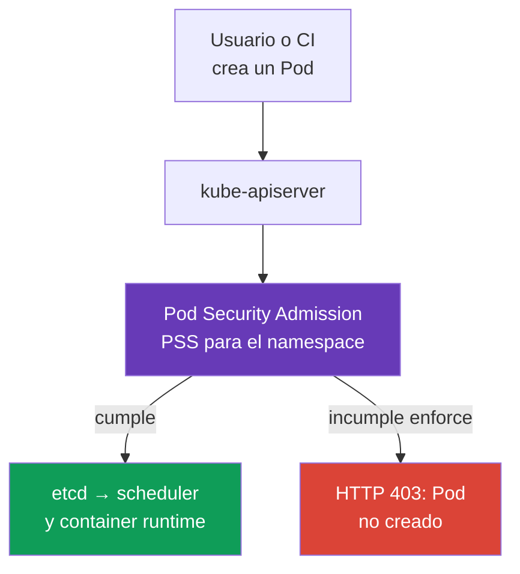
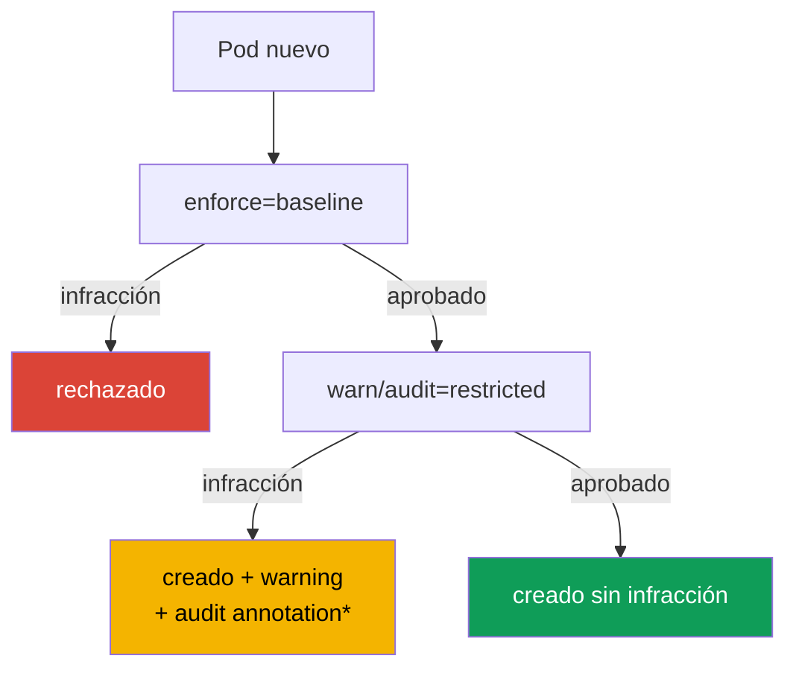

[Русская версия](ru.md) · [Eng version](README.md) · [Version française](fr.md) · [Deutsche Version](de.md) · [ქართული ვერსია](ge.md) · [繁體中文版](tw.md) · [日本語版](jp.md)

# Capítulo 19. Pod Security Admission y Pod Security Standards

> **El problema.** Un desarrollador, un CI comprometido o un Helm chart con el permiso `create pods` puede
> enviar un manifiesto permitido por RBAC con `privileged: true`, `hostPath: /` o un host namespace.
> Tal Pod proporciona al proceso una vía hacia los datos y el kernel de la node, aunque un workload
> individual pudiera tener un buen `SecurityContext`. Se necesita un límite de admission común que, antes
> del inicio, aplique por la fuerza un baseline seguro a todos los Pod del namespace.

> **Qué sigue.** `securityContext` describe con qué privilegios *debe* ejecutarse un Pod concreto, pero por sí solo no impide que otro manifiesto solicite `privileged: true`, `hostPath` o host namespaces. **Pod Security Admission (PSA)** es el admission controller integrado de Kubernetes que comprueba un Pod antes de escribirlo en etcd y aplica al namespace los **Pod Security Standards (PSS)** ya preparados. Es la base del dominio CKS **Minimize Microservice Vulnerabilities**: primero un baseline seguro para todos los workloads, después excepciones acotadas y observables.

> **Lo necesario de CKA.** Los campos `securityContext`, la ejecución non-root, capabilities y `allowPrivilegeEscalation` se tratan en el [capítulo 20 de CKA](../../../cka/course/20/es.md). Aquí los usamos como contrato que PSA comprueba y hace cumplir.

> 🧠 PSA evalúa el Pod durante admission; RBAC determina el permiso para crear el objeto; los PSS `privileged`, `baseline` y `restricted` no sustituyen el runtime hardening, la red ni el scan.

## 19.1. Por qué se necesita PSA

El desarrollador tiene permiso para crear un Pod, pero en el manifiesto aparece, accidental o intencionadamente, una configuración peligrosa:

```yaml
apiVersion: v1
kind: Pod
metadata:
  name: node-breakout
spec:
  hostPID: true
  containers:
  - name: shell
    image: busybox:1.36.1
    command: ["sh", "-c", "sleep 3600"]
    securityContext:
      privileged: true
```

Ese contenedor obtiene un acceso casi ilimitado al kernel y a los dispositivos de la node; junto con `hostPID`, `hostNetwork` o `hostPath`, es una vía habitual desde el compromiso de la aplicación a los datos de la node y de los Pod vecinos. Revisar el YAML no basta: el manifiesto puede llegar desde CI, un Helm chart o la API. Se necesita un control **durante admission**, antes de iniciar el contenedor.



PSA es un validating admission controller con estándares fijos. No sustituye RBAC: RBAC responde **quién** tiene el permiso `create pods`; PSA responde **qué Pod** puede crear ese usuario. Tampoco sustituye NetworkPolicy, seccomp, AppArmor, image scanning ni un policy engine: cada control cubre una capa distinta.

## 19.2. PSS: tres niveles de seguridad

Los Pod Security Standards definen tres perfiles acumulativos. El nivel se elige por separado para cada namespace.

| Perfil | Propósito | Qué permite o exige |
|---|---|---|
| `privileged` | componentes del sistema y workloads plenamente confiables | sin restricciones de PSA intencionadamente |
| `baseline` | nivel general mínimamente seguro | bloquea vías conocidas de escalada: privileged containers, host namespaces, hostPath, capabilities peligrosas y configuraciones inseguras |
| `restricted` | workloads de aplicación habituales en production | todo lo de baseline más un least privilege estricto: non-root, `allowPrivilegeEscalation: false`, `seccomp`, drop capabilities y volumes limitados |

### `privileged`: no es una política, sino ausencia de restricciones

`privileged` es útil donde un componente de Kubernetes realmente debe administrar la node: CNI, CSI, node agent. **No** es un default razonable para un namespace de aplicaciones. Un Namespace sin labels de PSA se comporta de hecho como `privileged` solo con la configuración estándar de PSA, donde `PodSecurityConfiguration.defaults` tiene `enforce: privileged`. El administrador del clúster puede establecer `baseline` o `restricted` y su versión en `defaults`, por lo que la effective policy siempre se comprueba según el namespace y la configuración del admission controller, no por la ausencia de un label.

Incluso para un namespace del sistema, no entregue `privileged` al equipo de aplicaciones «para arreglarlo». Primero averigüe la capability, el volume o el syscall necesario; de otro modo, una depuración temporal se convierte en una elusión permanente del límite de seguridad.

### `baseline`: bloquear las vías evidentes de escape del contenedor

`baseline` prohíbe mecanismos peligrosos que una aplicación rara vez necesita: `privileged: true`, `hostNetwork`, `hostPID`, `hostIPC`, volumes `hostPath`, configuraciones inseguras de SELinux/AppArmor/seccomp y capabilities peligrosas de Linux. Es adecuado como mínimo transitorio, incluso para un namespace con workloads antiguos.

Baseline no promete que el proceso no sea root ni exige el hardening completo de `securityContext`; su tarea es impedir las vías más conocidas de salida hacia el host. Para un namespace de aplicaciones en production, normalmente es un estado intermedio, no el objetivo final.

### `restricted`: el contrato de seguridad para workloads de aplicación habituales

`restricted` exige least privilege. Los detalles concretos dependen de la versión de PSS, por lo que la versión del estándar debe fijarse durante el rollout, pero el manifiesto clave tiene este aspecto:

```yaml
apiVersion: v1
kind: Pod
metadata:
  name: web
  namespace: payments
spec:
  securityContext:
    runAsNonRoot: true
    seccompProfile:
      type: RuntimeDefault
  containers:
  - name: web
    image: nginxinc/nginx-unprivileged:1.30.4-alpine-slim
    ports:
    - containerPort: 8080
    securityContext:
      allowPrivilegeEscalation: false
      capabilities:
        drop: ["ALL"]
```

A continuación hay una matriz compacta para **PSS `restricted` v1.36**. Incluye `baseline`; la regla para cada container se aplica también a `initContainers` y `ephemeralContainers`, salvo que se indique lo contrario.

> **⚠️ El examen se realiza con v1.35.** La matriz usa v1.36 como training baseline. En el examen, use la versión indicada en el enunciado, `v1.35`, o no defina `pod-security.kubernetes.io/*-version`; no copie el label `v1.36` a un clúster más antiguo sin comprobarlo.

| Control v1.36 | Valor permitido o requisito |
|---|---|
| Host namespaces y Windows HostProcess | `hostNetwork`, `hostPID`, `hostIPC`: solo `false`/sin definir; `windowsOptions.hostProcess`: `false`/sin definir |
| Privileged | `securityContext.privileged`: `false`/sin definir |
| Capabilities | solo se puede añadir `NET_BIND_SERVICE`; es obligatorio `capabilities.drop: ["ALL"]` |
| Host storage y ports | `hostPath` está prohibido; cada `hostPort`: sin definir/`0` o un allowlist predefinido (el PSA integrado solo admite sin definir/`0`) |
| AppArmor | `appArmorProfile.type`: sin definir, `RuntimeDefault` o `Localhost`; legacy annotation: solo `runtime/default` o `localhost/*` |
| SELinux | `type`: sin definir/vacío, `container_t`, `container_init_t`, `container_kvm_t` o `container_engine_t`; no se definen `user` ni `role` |
| `procMount`, seccomp y sysctls | `procMount`: sin definir o `Default`; seccomp explícitamente `RuntimeDefault`/`Localhost`; sysctls: solo el safe allowlist v1.36: `kernel.shm_rmid_forced`, `net.ipv4.ip_local_port_range`, `net.ipv4.ip_unprivileged_port_start`, `net.ipv4.tcp_syncookies`, `net.ipv4.ping_group_range`, `net.ipv4.ip_local_reserved_ports`, `net.ipv4.tcp_keepalive_time`, `net.ipv4.tcp_fin_timeout`, `net.ipv4.tcp_keepalive_intvl`, `net.ipv4.tcp_keepalive_probes` |
| Probes y lifecycle | no se definen los campos `host` en probes `httpGet`/`tcpSocket` ni en lifecycle hooks `httpGet`/`tcpSocket` |
| Volumes | solo `configMap`, `csi`, `downwardAPI`, `emptyDir`, `ephemeral`, `persistentVolumeClaim`, `projected`, `secret` |
| APE | `allowPrivilegeEscalation: false` |
| Run as | `runAsNonRoot: true` en el Pod o en cada container; `runAsUser`, si se define, no es `0` |

**Regla específica del sistema operativo.** Desde PSS v1.25, para un Pod con `.spec.os.name: windows`,
no se aplican las restricciones de Linux sobre privilege escalation, seccomp y capabilities. No
exija a un Pod de Windows `allowPrivilegeEscalation: false`, `seccompProfile` o `drop: ALL`
igual que a un Pod de Linux; Windows HostProcess y los demás controles aplicables de Windows se
comprueban por separado.

`readOnlyRootFilesystem: true` es una práctica de protección sólida, pero no un requisito independiente de PSS restricted. No lo sustituya por los campos obligatorios. Si la aplicación necesita un puerto inferior a 1024, después de `drop: ["ALL"]` se puede devolver puntualmente `NET_BIND_SERVICE`, si la versión de PSS elegida lo permite y la tarea lo justifica.

**User namespaces en v1.36.** Para un Pod Linux con `spec.hostUsers: false`, PSA relaja precisamente las comprobaciones de `runAsNonRoot` y `runAsUser`, incluso en `baseline`/`restricted`: root dentro de un user namespace separado se asigna a un UID no privilegiado del host. Esto no anula las demás reglas de la matriz ni permite host namespaces. No transfiera esta excepción a un Pod normal con `hostUsers` sin definir o en `true`.

> 🎯 Migración: `warn`/`audit` → `enforce`; compruebe namespace labels/PSS version y diagnostique el rechazo de un Pod directo mediante server-side dry run.

## 19.3. Modos de PSA: enforce, audit y warn

El mismo perfil PSS se puede aplicar en tres modos independientes. Esto permite ver primero el impacto de la política y después activar la prohibición.

| Modo | Resultado ante una infracción | Dónde buscar la señal |
|---|---|---|
| `enforce` | API server rechaza los create infractores y los update comprobados por policy: create no crea un Pod nuevo; update no guarda el cambio | respuesta de `kubectl`, CI/CD, Event/API audit |
| `audit` | se admite el Pod; PSA añade una annotation al audit event correspondiente | audit log del control plane, si está habilitado |
| `warn` | se admite el Pod; el cliente recibe una advertencia | stderr/respuesta de `kubectl`, log de CI |

`warn` y `audit` **no protegen**: el Pod infractor todavía se inicia. Su objetivo es inventariar antes de pasar a `enforce`. Los modos son independientes: en un namespace se puede usar `enforce=baseline`, pero ya recopilar `warn` y `audit` para `restricted`.

`audit` PSA añade una annotation a un Kubernetes audit event, pero por sí mismo no habilita un API audit backend ni garantiza el almacenamiento del evento. Para disponer de evidence, compruebe con antelación que API auditing está habilitado, que la policy registra los requests/stages necesarios y que el operador tiene acceso al audit sink elegido; de lo contrario, use `warn`, server-side dry run y PSA metrics como señales adicionales. No todo update de un Pod existente vuelve a pasar el policy check: se excluyen los metadata-only updates (salvo las deprecated annotations de seccomp/AppArmor), así como los cambios válidos de `.spec.activeDeadlineSeconds` y `.spec.tolerations`.



*Un audit record observable existe solo si Kubernetes API auditing está habilitado y la audit policy/backend conserva el event correspondiente.*

## 19.4. Namespace labels y versión del estándar

PSA se configura mediante labels del namespace. El formato de la clave es:

```text
pod-security.kubernetes.io/<mode>=<level>
pod-security.kubernetes.io/<mode>-version=<version>
```

`<mode>` es `enforce`, `audit` o `warn`; `<level>` es `privileged`, `baseline` o `restricted`. El valor de la versión es una Kubernetes minor version, por ejemplo `v1.36`, o `latest`. La versión se puede definir por separado para cada modo.

Los PSA labels forman parte del security boundary. Una identity autorizada a crear workloads en un application namespace no debería recibir automáticamente `create`, `patch` o `update` para Namespace: al cambiar o eliminar los PSA labels, cambia la policy aplicada.

```bash
# Primero observamos restricted, pero ya prohibimos los Pod más peligrosos.
kubectl label namespace payments \
  pod-security.kubernetes.io/enforce=baseline \
  pod-security.kubernetes.io/enforce-version=v1.36 \
  pod-security.kubernetes.io/warn=restricted \
  pod-security.kubernetes.io/warn-version=v1.36 \
  pod-security.kubernetes.io/audit=restricted \
  pod-security.kubernetes.io/audit-version=v1.36

# Tras corregir los workloads, activamos la prohibición real de restricted.
kubectl label namespace payments \
  pod-security.kubernetes.io/enforce=restricted \
  pod-security.kubernetes.io/enforce-version=v1.36 --overwrite
```

PSA aplica la policy a los Pod nuevos y a los update que entran en sus policy checks. No espere que un cambio de label elimine los Pod que ya se ejecutan: PSA no es un controller y no corrige objetos existentes. Cuando cambia el level `enforce` o el version label de un namespace, PSA comprueba los Pod existentes y devuelve warnings sobre infracciones; es una señal de migración, no una eliminación automática. No todo cambio del namespace desencadena esa comprobación.

`latest` es conveniente para un pequeño clúster de test, pero en production introduce un riesgo: tras actualizar Kubernetes, el contenido del estándar puede hacerse más estricto y se rechazará un rollout que antes funcionaba. Por eso, en los ejemplos formativos de este capítulo la versión está fijada en `v1.36`: el **training baseline** del curso y los core labs. Para su clúster de production, elija un PSS pin que corresponda a la versión efectiva de su API server; no use una versión superior a ella.

> **Límite de versiones entre formación, examen y production.** El archivo curriculum relacionado se llama actualmente
> `CKS_Curriculum v1.34`; es la versión del documento formativo, no una versión de runtime. El training baseline
> del curso y los core labs son Kubernetes `v1.36`, por lo que los labels y la matriz anteriores usan `v1.36`.
> El entorno de examen CKS en la instantánea fijada del curso es Kubernetes `v1.35`; antes del intento,
> compruebe la versión efectiva en ExamUI. La versión PSS de production siempre se elige según la versión del API server
> del clúster concreto: el pin formativo `v1.36` no es ni una promesa de los requisitos del examen ni una
> recomendación de «usar siempre v1.36» en el futuro.

**Version drift de PSS.** Los perfiles `baseline`/`restricted` se hacen más estrictos con el tiempo: por ejemplo, en Kubernetes `v1.34` se añadieron a Baseline/Restricted restricciones sobre campos host en probes y lifecycle hooks. Por ello, un Pod que pasa un pin más antiguo (por ejemplo, `v1.31`) puede ser rechazado con una versión más reciente del estándar. Una vía práctica de migración es fijar la versión admitida actual, evaluar primero el efecto con `warn`/`audit`, comparar si hace falta con el pin antiguo (`v1.31`) como ejemplo de migración y luego elevar conscientemente `enforce`. Por eso, «funciona con una versión antigua de PSS» no significa «pasará con la nueva».

La comprobación de la configuración efectiva comienza por el namespace, no por el manifiesto del Pod:

```bash
kubectl get namespace payments --show-labels
kubectl get namespace payments -o jsonpath='{.metadata.labels}' ; echo
kubectl get namespace -L pod-security.kubernetes.io/enforce \
  -L pod-security.kubernetes.io/enforce-version \
  -L pod-security.kubernetes.io/warn \
  -L pod-security.kubernetes.io/audit
```

## 19.5. Migración a restricted sin interrumpir la entrega

Activar `enforce=restricted` de inmediato en un namespace antiguo es arriesgado: Deployment no creará nuevas replicas, Job no se iniciará y el autoscaler o rollback quedarán bloqueados. Una migración segura separa la observación de la prohibición.

1. **Inventaríe el namespace y los propietarios.** Busque Pod templates en Deployments, StatefulSets, DaemonSets, Jobs y CronJobs. Hay que corregir el template del controller, no el Pod en ejecución: de otro modo, la siguiente réplica volverá a infringir la policy.
2. **Empiece con `warn=restricted` y `audit=restricted`.** El tráfico existente y CI mostrarán a los infractores, pero no bloquearán nada. Antes de confiar en los audit records, compruebe la disponibilidad de API audit logging y del sink elegido; guarde los warnings/audit records disponibles como lista de trabajo.
3. **Corrija las infracciones en los templates.** Añada `runAsNonRoot`, seccomp, prohibición de escalada y drop capabilities; sustituya `hostPath` por un volume permitido y la función privilegiada por un componente del sistema separado.
4. **Compruebe los escenarios negativo y positivo.** Un Pod que cumple debe crearse sin warning; uno deliberadamente infractor debe producir warning/audit antes de enforce y rechazo después.
5. **Pase primero a `enforce=baseline` y después a `enforce=restricted`.** Mantenga `warn` y `audit` en restricted al menos durante el período de rollout, para ver la deriva de los templates.
6. **Fije la PSS version.** Actualícela junto con la actualización de Kubernetes y una nueva comprobación del manifest.

Ejemplo de corrección mínima de un Pod template:

```yaml
spec:
  template:
    spec:
      securityContext:
        runAsNonRoot: true
        seccompProfile:
          type: RuntimeDefault
      containers:
      - name: api
        image: registry.example/api@sha256:<digest>
        securityContext:
          allowPrivilegeEscalation: false
          capabilities:
            drop: ["ALL"]
```

Si la imagen realmente necesita root, no desactive PSA como primera acción. Compruebe `USER` en el Dockerfile, el ownership de archivos, el puerto de la aplicación y los writable directories; por lo general, la imagen se puede adaptar a un UID non-root y asignar un `emptyDir` para `/tmp` o la caché. Una excepción debe ser consecuencia de una necesidad técnica demostrada, no un atajo alrededor de la migración.

## 19.6. Rechazo: cómo leer y reproducir un rechazo

Con `enforce`, admission responde con un error antes de crear el Pod. No es `ImagePullBackOff`, ni un error de scheduler ni un runtime denial: el Pod puede no tener siquiera UID ni aparecer en `kubectl get pods`.

```bash
# En un namespace restricted infringimos deliberadamente la policy.
kubectl -n payments run privileged-test --image=busybox:1.36.1 \
  --restart=Never \
  --overrides='{
    "spec": {
      "containers": [{
        "name": "privileged-test",
        "image": "busybox:1.36.1",
        "securityContext": {"privileged": true}
      }]
    }
  }'
```

Se espera un rechazo con la lista de infracciones PodSecurity. El mensaje sirve como lista de comprobación: indicará, por ejemplo, `privileged`, la ausencia de `runAsNonRoot`, `allowPrivilegeEscalation`, capabilities o seccomp. Para el template de un controller, use dry run antes del rollout, pero no lo considere prueba de enforce:

```bash
# Para Deployment PSA aplicará warn/audit a spec.template, pero no enforce.
kubectl apply --dry-run=server -f deployment.yaml

# Para comprobar enforce, cree desde spec.template un manifiesto Pod separado
# y compruébelo en un namespace con los mismos PSA labels.
kubectl -n payments apply --dry-run=server -f rendered-pod.yaml
kubectl auth can-i create pods -n payments
kubectl get deployment -n payments api -o yaml
```

`--dry-run=server` realiza la comprobación de admission, pero no guarda el objeto. Para workload resources, PSA aplica `warn` y `audit` al Pod template, pero `enforce` comprobará el Pod solo más tarde, cuando lo cree el controller. Por eso, un dry-run exitoso de Deployment no demuestra que el Pod creado por el controller pasará `enforce`: compruebe un Pod separado del mismo template o haga un rollout real en un namespace de test aislado con PSA labels idénticos, y controle `kubectl rollout status` y Events. `kubectl auth can-i` separa un rechazo de RBAC de uno de PSA. Si el Pod ya fue creado por el controller y no inicia, revise primero `kubectl describe pod` y Events: el rechazo de PSA ocurre antes del inicio; un error de image, node, seccomp o AppArmor ocurre después y en otra capa.

> 🏭 Excepción de PSA: alcance mínimo de namespace/identity, propietario, motivo, controles compensatorios y fecha de eliminación.

## 19.7. Excepciones: puntuales, con propietario y vencimiento

Algunos componentes del sistema objetivamente no cumplen con restricted: CNI, CSI node plugin, device plugin o un agente de diagnóstico. La elección no es «desactivar PSA para el clúster», sino una excepción mínima con propietario, motivo y fecha de revisión.

**Opción preferida: un namespace separado y el nivel suficiente más débil.** Por ejemplo, un DaemonSet del sistema permanece en `kube-system` o en un `platform-system` dedicado con `enforce=baseline` o, si hay una necesidad demostrada, `privileged`; los namespaces de aplicaciones permanecen en `restricted`. El Namespace no debe mezclar un node agent confiable y workloads de usuario.

**Las exemptions de PSA del sistema** se definen mediante la configuración del admission controller, no con un label de namespace. En `AdmissionConfiguration`, `PodSecurity` dispone de listas `usernames`, `runtimeClasses` y `namespaces`; la excepción se aplica a todos los modos PSA. Estas dimensiones son independientes: la coincidencia de **cualquiera** de ellas (`namespace` **o** `runtimeClass` **o** `username`) elude PSA por completo. Por ello, no combine varias dimensiones en una excepción esperando reducir el alcance.

A continuación se muestra solo una excepción de namespace. Los `defaults` se muestran completos; al cambiar la configuración real, conserve todos los valores vigentes y añada solo la excepción mínima necesaria.

```yaml
apiVersion: apiserver.config.k8s.io/v1
kind: AdmissionConfiguration
plugins:
- name: PodSecurity
  configuration:
    apiVersion: pod-security.admission.config.k8s.io/v1
    kind: PodSecurityConfiguration
    defaults:
      enforce: restricted
      enforce-version: v1.36
      audit: restricted
      audit-version: v1.36
      warn: restricted
      warn-version: v1.36
    exemptions:
      usernames: []
      runtimeClasses: []
      namespaces:
      - platform-system
```

No copie este ejemplo a ciegas en un clúster gestionado: la forma de definir admission configuration depende de quién administre kube-apiserver. Antes de añadir una exemption, documente el motivo, la identity/namespace, el propietario, los controles compensatorios y la fecha de eliminación. No añada un grupo amplio de usuarios ni incluya un namespace de aplicaciones en las excepciones solo porque un Deployment no superó la migración.

Una exemption de username se refiere a la identity de un API request concreto. El Pod creado desde un Deployment, DaemonSet o Job suele crearlo un controller, no el usuario original; su exemption no se transmite al Pod creado por el controller. No haga exempt a los ServiceAccounts de controllers por un workload: esto puede eludir PSA para todos los recursos que cree tal controller. Tampoco confunda una exemption de PSA con RBAC. Una exemption no concede el permiso para crear un Pod; solo omite la comprobación PSS si RBAC ya permitió el request.

> 🔬 `PodSecurityPolicy` se eliminó en Kubernetes v1.25; las restricciones estándar se trasladan a PSA/PSS, las organizativas, a un policy engine.

## 19.8. PSP: por qué los manifiestos antiguos no funcionan

**PodSecurityPolicy (PSP)** era el mecanismo anterior para restringir Pod, pero se eliminó de Kubernetes en la versión 1.25. PSA no es un reemplazo de API para `kind: PodSecurityPolicy`: utiliza tres perfiles PSS fijos y namespace labels, no un spec PSP arbitrario ni RBAC `use`.

Indicadores de una configuración obsoleta:

```yaml
apiVersion: policy/v1beta1
kind: PodSecurityPolicy
metadata:
  name: restricted
```

Tras eliminar la API, tal objeto no se crea, y un ClusterRole con `use` para PSP no habilita protección. Durante la migración:

- elimine de los manifiestos y Helm charts `PodSecurityPolicy`, `policy/v1beta1` y los permisos RBAC `use` sobre PSP;
- relacione la intención de la policy antigua con PSS: traslade los requisitos estándar a labels `baseline` o `restricted`;
- traslade a Kyverno, Gatekeeper o `ValidatingAdmissionPolicy` las reglas que PSA no expresa (registry confiable, labels obligatorios, resource limits, StorageClass concretas);
- inicie PSA primero en `warn`/`audit`, porque PSP y PSA difieren en semántica y alcance;
- tras la transición, compruebe que el admission controller está habilitado, los labels están asignados y no quedan antiguos bypass de todo el clúster.

PSA no se puede ampliar con campos propios. Es una ventaja para el hardening básico: el comportamiento está estandarizado y se entiende en el examen y en la respuesta a incidentes. Para las reglas de la organización, use un policy engine **además de**, no en lugar de PSS.

> 🎯 Evidencia: labels fijados, un Pod **directo** admitido y uno infractor en el namespace, y el `securityContext` efectivo del workload.

## 19.9. Checklist operativo y comprobación

La comprobación de PSA debe demostrar tanto la configuración como el resultado:

```bash
NS=payments
SUBJECT='system:serviceaccount:payments:ci'  # identidad que se comprueba

# Los PSA labels son un límite de seguridad: el creador de workloads no debe modificar por sí mismo la policy del namespace.
kubectl auth can-i create pods -n "$NS" --as="$SUBJECT"
kubectl auth can-i create namespaces --as="$SUBJECT"
kubectl auth can-i patch namespaces/"$NS" --as="$SUBJECT"
kubectl auth can-i update namespaces/"$NS" --as="$SUBJECT"

# 1. Nivel asignado y pin de versión.
kubectl get ns "$NS" -o jsonpath='{.metadata.labels}{"\n"}'

# 2. Un Pod directo seguro pasa la admission del lado del servidor, incluido enforce.
kubectl -n "$NS" apply --dry-run=server -f restricted-pod.yaml

# 3. Un Pod directo infractor recibe warning/audit o rechazo, según el modo.
kubectl -n "$NS" apply --dry-run=server -f privileged-pod.yaml

# 4. Para Deployment, el dry-run del servidor muestra warn/audit para spec.template,
# pero solo un Pod confirmará enforce. Compruebe un Pod renderizado o un rollout en un namespace de test.
kubectl -n "$NS" apply --dry-run=server -f deployment.yaml
kubectl -n "$NS" apply --dry-run=server -f rendered-pod.yaml

# 5. El securityContext efectivo del Pod creado.
kubectl -n "$NS" get pod web -o jsonpath='{.spec.securityContext}{"\n"}'
kubectl -n "$NS" get pod web -o jsonpath='{.spec.containers[*].securityContext}{"\n"}'
```

| Observación | Causa probable | Acción |
|---|---|---|
| El Pod `privileged` pasó en un namespace presuntamente restricted | falta/error del label `enforce`, Pod exempt, o se comprueba otro namespace | muestre los labels del namespace, el creador y la admission configuration |
| CI ve un warning, pero el Deployment aun se creó | funciona `warn` o `audit`, no `enforce` | es la fase esperada de migración; no la llame protección |
| Se rechaza un rollout nuevo; los Pods antiguos funcionan | PSA no elimina los Pods existentes, pero comprueba los nuevos | corrija el template del controller y repita el rollout |
| `kubectl apply` responde Forbidden; el Pod no se creó | PSA o RBAC rechazó antes de persistence | compare el texto de error con `auth can-i` y los labels del namespace |
| Un componente del sistema falla tras restricted | el componente necesita un namespace separado permitido o una exemption limitada | no debilite el namespace de aplicaciones; fije la excepción |

Para una identity de application/CI, espere `no` para `create namespaces`, `patch namespaces/<application-namespace>` y `update namespaces/<application-namespace>`. La creación delegada de un namespace es un privileged workflow aparte: los PSA labels deben ser asignados y protegidos por un platform control/admission policy.

Para observabilidad, recopile API audit logs y las métricas PSA `pod_security_evaluations_total`, `pod_security_errors_total` y `pod_security_exemptions_total`, si están disponibles en su distribución. Los conjuntos de labels difieren: evaluations tiene `decision`, `mode`, `policy_level`, `policy_version`, `request_operation`, `resource`, `subresource`; errors tiene `fatal`, `request_operation`, `resource`, `subresource`; exemptions solo tiene dimensiones request/resource. Aquí no existe el label `policy`. Para `audit`/`warn`, `decision="deny"` significa que se encontró una infracción de la policy comprobada, no un rechazo de API: solo `mode="enforce"` rechaza el request. En CI, añada `kubectl apply --dry-run=server` de un Pod directo contra un namespace de test con los mismos PSA labels que production; compruebe además el template del workload con un rollout real allí.

> 🏭 IaC crea un namespace con `enforce=restricted` fijado; las excepciones se conservan con vencimiento, y un policy engine añade reglas organizativas.

## 19.10. Cómo se aplica en production

- **restricted por defecto para aplicaciones.** Cree namespaces mediante plantilla/IaC ya con `enforce=restricted` fijado; no deje la seguridad al criterio de cada chart. Deje el permiso para modificar las labels de PSA a un rol de platform/security de confianza.
- **Advertencia antes de la prohibición.** Un nivel PSS nuevo comienza con `warn` y `audit`, y luego pasa a ser `enforce`; así la policy no convierte un rollout planificado en un incidente.
- **Límites de componentes del sistema.** CNI/CSI y node agents se aíslan de los workloads de negocio mediante namespaces, ServiceAccounts y RBAC separados. `privileged` no se extiende a toda la plataforma.
- **La excepción es una deuda de seguridad temporal.** Tiene propietario, test, ticket, controles compensatorios y fecha de eliminación. Una exemption no es una forma de «arreglar» una imagen que se puede hacer non-root.
- **PSA más policy engine.** PSA mantiene el PSS-baseline conocido; Kyverno/Gatekeeper o una CEL policy integrada añaden requisitos de la organización: registries permitidos, image digest, labels, `requests`/`limits` y restricciones de Service/Ingress.

## 19.11. Cómo resulta útil: en el examen y en el trabajo real

En el examen CKS es importante distinguir rápido el rechazo de PSA de problemas de RBAC, scheduler o container runtime: compruebe los PSA labels del namespace, aplique el manifiesto mediante `kubectl apply --dry-run=server` y lea la lista de infracciones en el admission error. Debe saber asignar `enforce`, `warn` y `audit`, fijar la PSS version y corregir precisamente el template del controller.

En el trabajo real, estos mismos pasos permiten migrar un namespace a `restricted` sin interrumpir la entrega: primero recopile las infracciones mediante `warn`/`audit`, después corrija los templates y solo tras comprobarlos habilite `enforce`. Aísle los componentes del sistema en namespaces especiales con el nivel mínimo necesario, y documente cada exemption con propietario y fecha de eliminación.

## 19.12. Mini glosario

- **PSA (Pod Security Admission)**: validating admission controller integrado para PSS.
- **PSS (Pod Security Standards)**: perfiles de seguridad preparados para Pod: `privileged`, `baseline`, `restricted`.
- **`enforce`**: modo PSA que rechaza un Pod infractor.
- **`audit`**: modo PSA que no rechaza un Pod y añade información sobre la infracción a un Kubernetes audit event; un audit log observable requiere API auditing habilitado por separado y una audit policy/backend adecuada.
- **`warn`**: modo que devuelve un warning al cliente sin rechazar el Pod.
- **PSS version**: versión del estándar para un PSA mode concreto; el pin protege el rollout de un cambio inesperado de reglas tras un upgrade.
- **exemption**: elusión de PSA para un namespace, username o RuntimeClass previamente confiable; no concede permisos RBAC.
- **PSP (PodSecurityPolicy)**: predecesor de PSA eliminado en Kubernetes 1.25.

## 19.13. Resumen del capítulo

- PSA comprueba el Pod antes de escribirlo en etcd; complementa RBAC y `securityContext`, pero no sustituye otros security controls.
- PSS ofrece tres perfiles: `privileged` sin restricciones, `baseline` contra vías explícitas de node-breakout y `restricted` para aplicaciones non-root con least privilege; la ausencia de namespace labels significa `privileged` solo con los PSA defaults estándar.
- `enforce`, `audit` y `warn` son independientes y se definen mediante namespace labels `pod-security.kubernetes.io/<mode>`; se puede añadir `<mode>-version` a cada uno. El permiso para cambiar estas labels cambia el security boundary y no debe seguir automáticamente del permiso para crear workloads.
- Una migración fiable va de `warn`/`audit` a `enforce=baseline`, después a `enforce=restricted`, corrigiendo templates, no Pod en ejecución.
- El rechazo de PSA ocurre antes de crear el Pod. Compruebe los labels del namespace, los effective defaults, un Pod directo mediante server-side dry run, RBAC y el texto del admission error; un dry-run exitoso de Deployment no confirma enforce para el Pod que posteriormente creará un controller.
- PSP se eliminó en 1.25. No se puede recuperar con un manifiesto: las reglas estándar se trasladan a PSA y las organizativas, a un policy engine.
- Las excepciones deben ser acotadas, separadas de los application namespaces, documentadas y temporales.

## 19.14. Preguntas de autoevaluación

<details>
<summary>1. ¿En qué se diferencian las responsabilidades de RBAC, `securityContext` y PSA?</summary>

RBAC responde quién puede ejecutar `create pods`. `securityContext` define los privilegios y restricciones del proceso de un Pod concreto, mientras que PSA, antes de escribir en etcd, comprueba qué Pod permite el PSS del namespace. Son capas complementarias, no intercambiables.
</details>

<details>
<summary>2. ¿Por qué no se debe considerar protegido un namespace sin labels de PSA?</summary>

Con los PSA defaults estándar, tal namespace se comporta de hecho como `privileged`, pero el administrador puede configurar otros defaults. Por tanto, la ausencia de labels no demuestra la effective policy. Se comprueban los labels del namespace y la configuración del admission controller.
</details>

<details>
<summary>3. ¿Qué tres perfiles PSS existen y cuándo se justifica cada uno?</summary>

`privileged` no restringe el Pod con PSA y solo es necesario para componentes de sistema confiables. `baseline` bloquea vías conocidas de breakout, incluidos privileged container, host namespaces y hostPath, y es útil como mínimo transitorio. `restricted` añade non-root, APE false, seccomp y drop capabilities para los workloads de production habituales.
</details>

<details>
<summary>4. ¿En qué se diferencian `warn` y `audit` de `enforce`, y por qué no son protección?</summary>

`warn` admite el Pod con una advertencia al cliente; `audit` añade una annotation al audit event y también admite el Pod; para evidence de audit observable hace falta API audit logging habilitado. Solo `enforce` rechaza un create infractor y un PSA update pertinente antes de persistence. Por eso los dos primeros modos están destinados al inventario y a la migración.
</details>

<details>
<summary>5. ¿Cómo se escribe el label para `enforce=restricted` con una PSS version fijada (la versión del clúster de formación)?</summary>

El training baseline del capítulo usa `pod-security.kubernetes.io/enforce=restricted` y `pod-security.kubernetes.io/enforce-version=v1.36`. Se asignan al namespace, por ejemplo mediante `kubectl label namespace payments`. El pin de production se elige conforme a la versión efectiva del API server, no se transfiere el valor formativo automáticamente.
</details>

<details>
<summary>6. ¿Por qué es mejor fijar la PSS version antes de actualizar Kubernetes en lugar de dejar `latest`?</summary>

PSS se hace más estricto con el tiempo: el capítulo cita las restricciones sobre campos host de probes y lifecycle hooks añadidas en v1.34. Con `latest`, un upgrade puede rechazar inesperadamente un rollout que funcionaba. Un pin permite primero evaluar los manifests mediante warn/audit y actualizar el estándar conscientemente.
</details>

<details>
<summary>7. ¿Por qué se corrige el template de Deployment y no un Pod ya creado?</summary>

PSA no corrige ni elimina los Pod existentes, y el controller creará la siguiente réplica según su template. Una edición manual de un Pod en ejecución no elimina la fuente de la siguiente infracción. Por ello se cambia el template de Deployment, StatefulSet, Job o CronJob y se realiza un rollout.
</details>

<details>
<summary>8. ¿En qué se diferencia un admission rejection de PSA de `ImagePullBackOff` y de un rechazo de RBAC?</summary>

PSA rechaza antes de crear el Pod y devuelve un error con infracciones PSS; el objeto puede no obtener un UID. Los errores de `ImagePullBackOff` y runtime/scheduler ocurren después de admission y se ven en Events. RBAC también rechaza antes de persistence, pero se distingue por el texto de la respuesta y `kubectl auth can-i`.
</details>

<details>
<summary>9. ¿Por qué es mejor un namespace separado que una exemption amplia para CNI o CSI?</summary>

Un namespace separado permite dar al componente de sistema el nivel PSS mínimo necesario sin debilitar los workloads de aplicaciones. Una exemption en AdmissionConfiguration elude PSA en todos los modos para un namespace, username o RuntimeClass. Por eso se aplica solo de forma acotada, documentada y temporal.
</details>

<details>
<summary>10. ¿Qué ocurrió con PodSecurityPolicy y con qué se cubren las reglas que no están en PSS?</summary>

PodSecurityPolicy se eliminó en Kubernetes 1.25, por lo que los manifests PSP antiguos y RBAC `use` no habilitan protección. Los requisitos estándar se trasladan a PSA `baseline` o `restricted`. Registry, labels, límites y las demás reglas fuera de PSS se implementan con Kyverno, Gatekeeper o ValidatingAdmissionPolicy.
</details>

<details>
<summary>11. **Flashback (capítulo 30).** PSA toma una decisión una vez, durante admission, al crear un Pod. Si un Pod pasó honestamente `enforce=restricted`, pero más tarde el proceso dentro del contenedor intenta ejecutar algo sospechoso (por ejemplo, un binario descargado), ¿puede PSA detenerlo? ¿Qué capa del capítulo 30 cubre precisamente este momento de runtime, no de admission-time?</summary>

No: PSA toma una decisión solo durante admission y no observa la ejecución posterior del proceso. El momento de runtime lo cubren las herramientas de runtime security del capítulo 30, que observan eventos del proceso y pueden detectar o reaccionar al comportamiento sospechoso. Admission previene una configuración peligrosa, y runtime detection la complementa después del inicio.
</details>

## Práctica

Practique PSA y `securityContext` en el [lab 107: PSA y SecurityContext](../../labs/107/README_ES.MD). Cree un namespace de test, habilite `warn=restricted` y `audit=restricted`, y después aplique un Pod seguro y otro deliberadamente privilegiado. Corrija el template hasta obtener un resultado limpio, habilite `enforce=restricted` y confirme que el Pod malo recibe un rechazo de admission y el bueno se crea. Después compruebe los labels y el `securityContext` efectivo con los comandos de la sección 19.9.

Referencias oficiales útiles: [Pod Security Admission](https://kubernetes.io/docs/concepts/security/pod-security-admission/), [Pod Security Standards](https://kubernetes.io/docs/concepts/security/pod-security-standards/) y [migración desde PodSecurityPolicy](https://kubernetes.io/docs/tasks/configure-pod-container/migrate-from-psp/).

---
[Índice](../README_ES.md) · [Capítulo 18](../18/es.md) · [Capítulo 20](../20/es.md)
