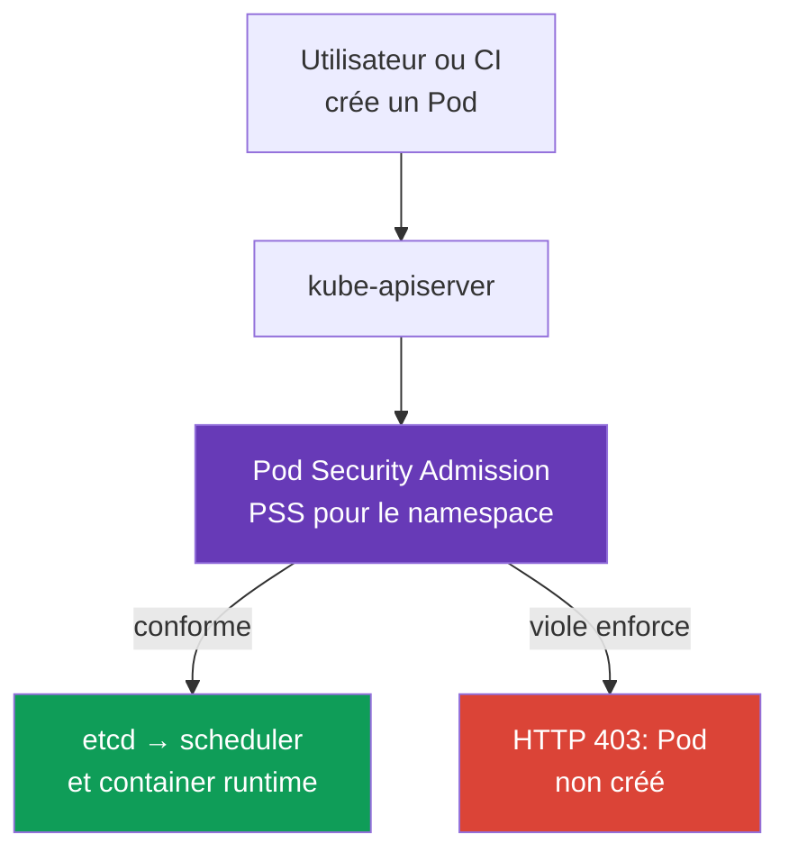
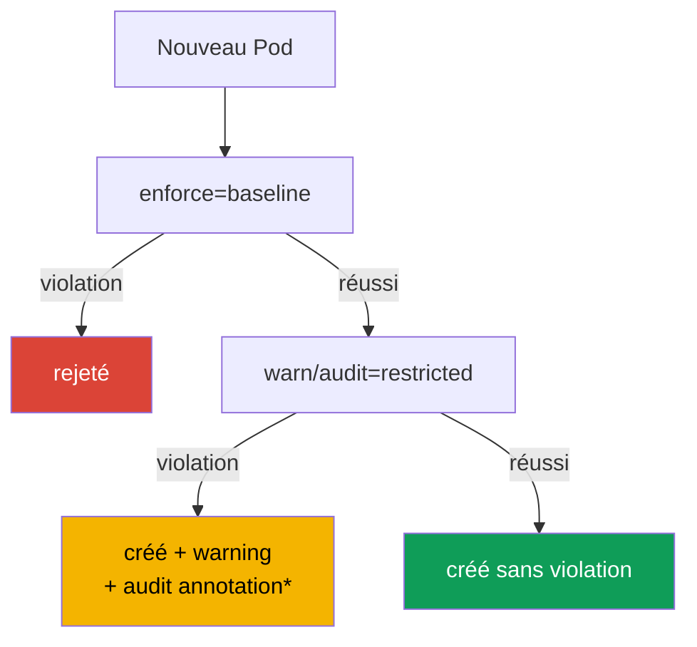

[Русская версия](ru.md) · [Eng version](README.md) · [Versión en español](es.md) · [Deutsche Version](de.md) · [ქართული ვერსია](ge.md) · [繁體中文版](tw.md) · [日本語版](jp.md)

# Chapitre 19. Pod Security Admission et Pod Security Standards

> **Problème.** Un développeur, un CI compromis ou un Helm chart disposant du droit `create pods` peut soumettre un manifeste autorisé par RBAC contenant `privileged: true`, `hostPath: /` ou un host namespace. Un tel Pod donne à son processus un accès aux données et au noyau du node, même si un autre workload dispose d'un bon `SecurityContext`. Une frontière d'admission partagée doit imposer un baseline sécurisé à tous les Pod d'un namespace avant leur démarrage.

> **Suite.** `securityContext` décrit avec quels privilèges un Pod donné *doit* s'exécuter, mais n'empêche pas à lui seul un autre manifeste de demander `privileged: true`, `hostPath` ou des host namespaces. **Pod Security Admission (PSA)** est l'admission controller Kubernetes intégré qui contrôle les Pod avant leur écriture dans etcd et applique au namespace les **Pod Security Standards (PSS)** prêts à l'emploi. C'est le fondement du domaine CKS **Minimize Microservice Vulnerabilities**: d'abord un baseline sécurisé pour tous les workloads, puis des exceptions étroites et observables.

> **Prérequis CKA.** Les champs `securityContext`, l'exécution non-root, les capabilities et `allowPrivilegeEscalation` sont traités dans le [chapitre 20 de CKA](../../../cka/course/20/fr.md). Nous les utilisons ici comme contrat que PSA vérifie et impose.

> 🧠 PSA évalue un Pod à l'admission, RBAC contrôle le droit de créer l'objet; les profils PSS `privileged`, `baseline` et `restricted` ne remplacent ni le runtime hardening, ni le réseau, ni le scan.

## 19.1. Pourquoi PSA est nécessaire

Un développeur a le droit de créer un Pod, mais le manifeste contient accidentellement ou volontairement un paramètre dangereux:

```yaml
apiVersion: v1
kind: Pod
metadata:
  name: node-breakout
spec:
  hostPID: true
  containers:
  - name: shell
    image: busybox:1.36.1
    command: ["sh", "-c", "sleep 3600"]
    securityContext:
      privileged: true
```

Un tel container obtient un accès presque illimité au noyau et aux périphériques du node; avec `hostPID`, `hostNetwork` ou `hostPath`, c'est une voie courante qui mène d'une compromission applicative aux données du node et aux Pod voisins. La revue YAML ne suffit pas: le manifeste peut venir d'un CI, d'un Helm chart ou de l'API. Un contrôle **à l'admission** est nécessaire, avant le démarrage du container.



PSA est un validating admission controller aux standards fixes. Il ne remplace pas RBAC: RBAC répond à la question de savoir **qui** peut faire `create pods`; PSA répond à la question de savoir **quel Pod** cet utilisateur peut créer. Il ne remplace pas non plus NetworkPolicy, seccomp, AppArmor, le image scanning ou un policy engine: chaque contrôle protège une couche différente.

## 19.2. PSS: trois niveaux de sécurité

Pod Security Standards définit trois profils cumulatifs. Le niveau est choisi séparément pour chaque namespace.

| Profil | Finalité | Ce qu'il permet ou exige |
|---|---|---|
| `privileged` | composants système et workloads entièrement approuvés | volontairement sans restriction PSA |
| `baseline` | niveau partagé minimalement sécurisé | bloque les voies d'escalade connues: privileged containers, host namespaces, hostPath, capabilities dangereuses et paramètres non sûrs |
| `restricted` | workloads applicatifs ordinaires en production | tout ce qui est dans baseline, plus un least privilege strict: non-root, `allowPrivilegeEscalation: false`, `seccomp`, capabilities supprimées et volumes limités |

### `privileged`: pas une politique, mais l'absence de restrictions

`privileged` est utile lorsqu'un composant Kubernetes doit réellement gérer un node: CNI, CSI ou node agent. Ce n'est **pas** un default raisonnable pour un namespace applicatif. Un namespace sans PSA labels se comporte effectivement comme `privileged` uniquement dans la configuration PSA standard, où `PodSecurityConfiguration.defaults` contient `enforce: privileged`. Un administrateur de cluster peut définir `baseline` ou `restricted` et leur version dans `defaults`; vérifiez donc toujours l'effective policy à partir du namespace et de la configuration de l'admission controller, non de l'absence d'un label.

Même dans un namespace système, n'accordez pas `privileged` à une équipe applicative «pour réparer». Déterminez d'abord la capability, le volume ou le syscall nécessaire; sinon, un débogage temporaire devient un contournement permanent de la frontière de sécurité.

### `baseline`: bloquer les voies évidentes de container escape

`baseline` interdit les mécanismes dangereux dont une application a rarement besoin: `privileged: true`, `hostNetwork`, `hostPID`, `hostIPC`, les volumes `hostPath`, les paramètres SELinux/AppArmor/seccomp non sûrs et les Linux capabilities dangereuses. Il convient comme minimum de transition, notamment pour un namespace contenant des workloads existants.

Baseline ne garantit pas qu'un processus est non-root et n'exige pas le hardening complet de `securityContext`; son but est d'empêcher les voies les plus connues vers l'hôte. Pour un namespace applicatif de production, c'est habituellement un état intermédiaire et non l'objectif final.

### `restricted`: le contrat des workloads applicatifs ordinaires

`restricted` exige le least privilege. Les détails précis dépendent de la version PSS, il faut donc fixer la version du standard pendant le rollout, mais le manifeste essentiel ressemble à ceci:

```yaml
apiVersion: v1
kind: Pod
metadata:
  name: web
  namespace: payments
spec:
  securityContext:
    runAsNonRoot: true
    seccompProfile:
      type: RuntimeDefault
  containers:
  - name: web
    image: nginxinc/nginx-unprivileged:1.30.4-alpine-slim
    ports:
    - containerPort: 8080
    securityContext:
      allowPrivilegeEscalation: false
      capabilities:
        drop: ["ALL"]
```

Voici une matrice compacte pour **PSS `restricted` v1.36**. Elle inclut `baseline`; une règle pour chaque container s'applique aussi à `initContainers` et `ephemeralContainers`, sauf indication contraire.

> **⚠️ L'examen utilise v1.35.** Cette matrice emploie v1.36 comme training baseline. À l'examen, utilisez la version demandée, `v1.35`, ou ne définissez pas `pod-security.kubernetes.io/*-version`; ne copiez pas le label `v1.36` vers un cluster plus ancien sans vérification.

| Contrôle v1.36 | Valeur autorisée ou exigence |
|---|---|
| Host namespaces et Windows HostProcess | `hostNetwork`, `hostPID`, `hostIPC` - uniquement `false`/non définis; `windowsOptions.hostProcess` - `false`/non défini |
| Privileged | `securityContext.privileged` - `false`/non défini |
| Capabilities | seul `NET_BIND_SERVICE` peut être ajouté; `capabilities.drop: ["ALL"]` est obligatoire |
| Host storage et ports | `hostPath` est interdit; chaque `hostPort` est non défini/`0` ou dans un allowlist prédéfini (PSA intégré ne prend en charge que non défini/`0`) |
| AppArmor | `appArmorProfile.type` - non défini, `RuntimeDefault` ou `Localhost`; legacy annotation - seulement `runtime/default` ou `localhost/*` |
| SELinux | `type`: non défini/vide, `container_t`, `container_init_t`, `container_kvm_t` ou `container_engine_t`; `user` et `role` ne sont pas définis |
| `procMount`, seccomp et sysctls | `procMount` - non défini ou `Default`; seccomp explicitement `RuntimeDefault`/`Localhost`; sysctls - uniquement le safe allowlist v1.36: `kernel.shm_rmid_forced`, `net.ipv4.ip_local_port_range`, `net.ipv4.ip_unprivileged_port_start`, `net.ipv4.tcp_syncookies`, `net.ipv4.ping_group_range`, `net.ipv4.ip_local_reserved_ports`, `net.ipv4.tcp_keepalive_time`, `net.ipv4.tcp_fin_timeout`, `net.ipv4.tcp_keepalive_intvl`, `net.ipv4.tcp_keepalive_probes` |
| Probes et lifecycle | ne définissez pas les champs `host` dans les probes `httpGet`/`tcpSocket` ni dans les lifecycle hooks `httpGet`/`tcpSocket` |
| Volumes | seulement `configMap`, `csi`, `downwardAPI`, `emptyDir`, `ephemeral`, `persistentVolumeClaim`, `projected`, `secret` |
| APE | `allowPrivilegeEscalation: false` |
| Run as | `runAsNonRoot: true` sur le Pod ou chaque container; si défini, `runAsUser` n'est pas `0` |

**Règle spécifique à l'OS.** À partir de PSS v1.25, les restrictions Linux concernant l'escalade de privilèges, seccomp et les capabilities ne s'appliquent pas aux Pod ayant `.spec.os.name: windows`. N'exigez pas d'un Pod Windows `allowPrivilegeEscalation: false`, `seccompProfile` ou `drop: ALL` de la même façon que pour un Pod Linux; Windows HostProcess et les autres contrôles Windows applicables sont vérifiés séparément.

`readOnlyRootFilesystem: true` est une bonne pratique de sécurité forte, mais pas une exigence PSS restricted indépendante. Ne le substituez pas aux champs obligatoires. Si une application a besoin d'un port inférieur à 1024, `NET_BIND_SERVICE` peut être réajouté de façon ciblée après `drop: ["ALL"]` si la version PSS choisie le permet et si la tâche le justifie.

**User namespaces en v1.36.** Pour un Pod Linux avec `spec.hostUsers: false`, PSA assouplit uniquement les vérifications `runAsNonRoot` et `runAsUser`, même sous `baseline`/`restricted`: root à l'intérieur d'un user namespace séparé est mappé vers un UID hôte non privilégié. Cela n'annule pas les autres règles de la matrice et n'autorise pas les host namespaces. Ne transposez pas cette exception à un Pod ordinaire où `hostUsers` est non défini ou `true`.

> 🎯 Migration: `warn`/`audit` → `enforce`; vérifiez les namespace labels/PSS version et diagnostiquez le rejet d'un Pod direct avec un server-side dry run.

## 19.3. Modes PSA: enforce, audit et warn

Le même profil PSS peut être appliqué dans trois modes indépendants. Cela permet d'abord de voir l'effet de la politique, puis d'activer l'interdiction.

| Mode | Résultat d'une violation | Où trouver le signal |
|---|---|---|
| `enforce` | L'API server rejette les create violant la politique et les update contrôlés par la policy: create ne crée pas de nouveau Pod, update n'enregistre pas la modification | réponse `kubectl`, CI/CD, Event/API audit |
| `audit` | Le Pod est admis; PSA ajoute une annotation au audit event correspondant | audit log du control plane, s'il est activé |
| `warn` | Le Pod est admis; le client reçoit un warning | stderr/réponse `kubectl`, log CI |

`warn` et `audit` **ne protègent pas**: un Pod qui viole la politique continue de démarrer. Leur but est l'inventaire avant le passage à `enforce`. Les modes sont indépendants: un namespace peut avoir `enforce=baseline` tout en collectant déjà `warn` et `audit` pour `restricted`.

PSA `audit` ajoute une annotation à un Kubernetes audit event, mais n'active pas lui-même un API audit backend et ne garantit pas la conservation de l'événement. Pour disposer de preuves, vérifiez d'avance que API auditing est activé, que la policy enregistre les requests/stages nécessaires et que l'opérateur a accès au audit sink sélectionné. Sinon, utilisez `warn`, server-side dry run et les metrics PSA comme signaux complémentaires. Toute mise à jour d'un Pod existant ne passe pas de nouveau une policy check: les metadata-only updates (à l'exception des annotations seccomp/AppArmor deprecated), ainsi que les modifications valides de `.spec.activeDeadlineSeconds` et `.spec.tolerations`, sont exclues.



*Un audit record observable n'existe que si Kubernetes API auditing est activé et si audit policy/backend conserve l'événement correspondant.*

## 19.4. Namespace labels et version du standard

PSA est configuré par les namespace labels. Le format de clé est:

```text
pod-security.kubernetes.io/<mode>=<level>
pod-security.kubernetes.io/<mode>-version=<version>
```

`<mode>` est `enforce`, `audit` ou `warn`; `<level>` est `privileged`, `baseline` ou `restricted`. Une valeur de version est une version mineure Kubernetes, par exemple `v1.36`, ou `latest`. Une version peut être définie séparément pour chaque mode.

Les PSA labels font partie de la frontière de sécurité. Une identity autorisée à créer des workloads dans un application namespace ne doit pas recevoir automatiquement `create`, `patch` ou `update` sur `Namespace`: modifier ou supprimer les PSA labels modifie la policy appliquée.

```bash
# Observer d'abord restricted tout en interdisant déjà les Pod les plus dangereux.
kubectl label namespace payments \
  pod-security.kubernetes.io/enforce=baseline \
  pod-security.kubernetes.io/enforce-version=v1.36 \
  pod-security.kubernetes.io/warn=restricted \
  pod-security.kubernetes.io/warn-version=v1.36 \
  pod-security.kubernetes.io/audit=restricted \
  pod-security.kubernetes.io/audit-version=v1.36

# Après correction des workloads, activer l'interdiction restricted réelle.
kubectl label namespace payments \
  pod-security.kubernetes.io/enforce=restricted \
  pod-security.kubernetes.io/enforce-version=v1.36 --overwrite
```

PSA applique la policy aux nouveaux Pod et aux update qui font partie de ses policy checks. N'attendez pas d'un changement de label qu'il supprime les Pod déjà actifs: PSA n'est pas un controller et ne corrige pas les objets existants. Lorsqu'un label de niveau ou de version `enforce` d'un namespace change, PSA vérifie les Pod existants et renvoie des warnings sur les violations; c'est un signal de migration, non une suppression automatique. Tout changement de namespace ne déclenche pas nécessairement une telle vérification.

`latest` est pratique pour un petit test-cluster, mais crée un risque en production: après une mise à jour Kubernetes, le standard peut devenir plus strict et rejeter un rollout qui fonctionnait auparavant. C'est pourquoi les exemples de ce chapitre fixent la version à `v1.36` - le training baseline du cours et des core labs. Pour votre production-cluster, choisissez un PSS pin correspondant à la version réelle de son API server; n'utilisez pas une version supérieure.

> **Frontière de version entre formation, examen et production.** Le fichier curriculum associé s'appelle maintenant `CKS_Curriculum v1.34`; c'est la version du document pédagogique, non la version runtime. Le training baseline du cours et les core labs utilisent Kubernetes `v1.36`, d'où les labels et la matrice ci-dessus. L'environnement d'examen CKS du snapshot fixé du cours utilise Kubernetes `v1.35`; vérifiez la version effective dans ExamUI avant une tentative. Choisissez toujours la version PSS de production selon la version de l'API server de ce cluster: le pin de formation `v1.36` ne promet ni les exigences de l'examen ni l'usage permanent de `v1.36` à l'avenir.

**PSS version drift.** Les profils `baseline`/`restricted` deviennent plus stricts avec le temps: par exemple, Kubernetes `v1.34` a ajouté des restrictions sur les champs host dans les probes et lifecycle hooks de Baseline/Restricted. Un Pod qui passe avec un pin plus ancien (par exemple `v1.31`) peut donc être rejeté sous une version plus récente du standard. Une voie de migration pratique consiste à fixer la version actuellement prise en charge, à évaluer d'abord l'effet dans `warn`/`audit`, à comparer avec l'ancien pin (`v1.31`) comme exemple de migration si nécessaire, puis à augmenter `enforce` délibérément. C'est pourquoi «fonctionne sur une ancienne version PSS» ne signifie pas «passe sur une nouvelle».

La vérification de l'effective configuration commence par le namespace, non par le manifeste Pod:

```bash
kubectl get namespace payments --show-labels
kubectl get namespace payments -o jsonpath='{.metadata.labels}' ; echo
kubectl get namespace -L pod-security.kubernetes.io/enforce \
  -L pod-security.kubernetes.io/enforce-version \
  -L pod-security.kubernetes.io/warn \
  -L pod-security.kubernetes.io/audit
```

## 19.5. Migrer vers restricted sans interrompre la livraison

Activer immédiatement `enforce=restricted` dans un namespace existant est risqué: un Deployment ne créera pas de nouvelles replicas, un Job ne démarrera pas et un autoscaler ou rollback peut être bloqué. Une migration sûre sépare l'observation de l'interdiction.

1. **Inventoriez les namespaces et les propriétaires.** Trouvez les Pod templates des Deployments, StatefulSets, DaemonSets, Jobs et CronJobs. Corrigez le template du controller, non un Pod actif: sinon la prochaine replica violera encore la policy.
2. **Commencez par `warn=restricted` et `audit=restricted`.** Existing traffic et CI révèlent les contrevenants mais ne bloquent rien. Avant de vous fier aux audit records, vérifiez la disponibilité de API audit logging et du sink choisi; conservez warnings/audit records disponibles comme liste de travail.
3. **Éliminez les violations dans les templates.** Ajoutez `runAsNonRoot`, seccomp, l'interdiction d'escalade et la suppression de capabilities; remplacez `hostPath` par un volume autorisé et une fonction privileged par un composant système séparé.
4. **Testez les scénarios négatif et positif.** Un bon Pod doit être créé sans warning; un Pod volontairement mauvais doit produire un warning/audit avant enforce et un rejet après.
5. **Passez d'abord à `enforce=baseline`, puis à `enforce=restricted`.** Laissez `warn` et `audit` sur restricted au moins durant le rollout afin de voir la dérive des templates.
6. **Fixez la PSS version.** Mettez-la à jour avec Kubernetes et une nouvelle validation du manifeste.

Exemple de correction minimale d'un Pod template:

```yaml
spec:
  template:
    spec:
      securityContext:
        runAsNonRoot: true
        seccompProfile:
          type: RuntimeDefault
      containers:
      - name: api
        image: registry.example/api@sha256:<digest>
        securityContext:
          allowPrivilegeEscalation: false
          capabilities:
            drop: ["ALL"]
```

Si une image exige réellement root, ne désactivez pas PSA comme première action. Vérifiez `USER` dans le Dockerfile, le ownership des fichiers, le port applicatif et les writable directories; une image peut généralement être adaptée à un UID non-root et recevoir un `emptyDir` pour `/tmp` ou le cache. Une exception doit résulter d'un besoin technique démontré, pas d'un raccourci autour de la migration.

## 19.6. Rejection: lire et reproduire un refus

Avec `enforce`, l'admission renvoie une erreur avant la création du Pod. Ce n'est ni `ImagePullBackOff`, ni une erreur du scheduler, ni un runtime denial: le Pod peut ne pas avoir de UID et ne pas apparaître dans `kubectl get pods`.

```bash
# Violer volontairement la policy dans un namespace restricted.
kubectl -n payments run privileged-test --image=busybox:1.36.1 \
  --restart=Never \
  --overrides='{
    "spec": {
      "containers": [{
        "name": "privileged-test",
        "image": "busybox:1.36.1",
        "securityContext": {"privileged": true}
      }]
    }
  }'
```

Un refus énumérant les violations PodSecurity est attendu. Le message est utile comme checklist: il indique, par exemple, `privileged`, l'absence de `runAsNonRoot`, `allowPrivilegeEscalation`, les capabilities ou seccomp. Pour un template de controller, utilisez dry run avant le rollout, mais ne le considérez pas comme une preuve de enforce:

```bash
# Pour un Deployment, PSA applique warn/audit à spec.template, mais pas enforce.
kubectl apply --dry-run=server -f deployment.yaml

# Pour tester enforce, créez un manifeste Pod séparé à partir de spec.template
# et vérifiez-le dans un namespace ayant les mêmes PSA labels.
kubectl -n payments apply --dry-run=server -f rendered-pod.yaml
kubectl auth can-i create pods -n payments
kubectl get deployment -n payments api -o yaml
```

`--dry-run=server` effectue la vérification d'admission sans persister l'objet. Pour les workload resources, PSA applique `warn` et `audit` au Pod template, mais `enforce` ne vérifie le Pod que plus tard, lorsqu'un controller le crée. Un dry-run Deployment réussi ne prouve donc pas qu'un Pod créé par le controller passera `enforce`: vérifiez un Pod séparé issu du même template ou réalisez un vrai rollout dans un test namespace isolé avec des PSA labels identiques, puis surveillez `kubectl rollout status` et les Events. `kubectl auth can-i` distingue un refus RBAC d'un refus PSA. Si un Pod a déjà été créé par un controller et ne démarre pas, inspectez d'abord `kubectl describe pod` et les Events: le refus PSA intervient avant le démarrage, tandis qu'une erreur d'image, de node, de seccomp ou d'AppArmor arrive plus tard et sur une autre couche.

> 🏭 Exception PSA: scope namespace/identity minimal, propriétaire, justification, compensating controls et date de suppression.

## 19.7. Exceptions: étroites, attribuées et limitées dans le temps

Certains composants système ne respectent objectivement pas restricted: CNI, CSI node plugin, device plugin ou diagnostic agent. Le choix n'est pas «désactiver PSA pour le cluster», mais une exception minimale avec un propriétaire, une raison et une date de révision.

**Option préférée - un namespace séparé et le niveau suffisant le moins permissif.** Par exemple, un DaemonSet système reste dans `kube-system` ou dans un `platform-system` dédié avec `enforce=baseline` ou, lorsque c'est démontré nécessaire, `privileged`; les application namespaces restent `restricted`. Un namespace ne doit pas mélanger un node agent approuvé et des user workloads.

**Les PSA exemptions système** sont définies dans la configuration de l'admission controller, non par un namespace label. `AdmissionConfiguration` pour `PodSecurity` fournit les listes `usernames`, `runtimeClasses` et `namespaces`; une exemption s'applique à tous les modes PSA. Ces dimensions sont indépendantes: une correspondance dans **n'importe laquelle** d'entre elles (`namespace` **ou** `runtimeClass` **ou** `username`) contourne entièrement PSA. Ne combinez pas plusieurs dimensions dans une exemption en espérant réduire le scope.

Seule une namespace exemption est présentée ci-dessous. Les `defaults` sont montrés en entier; en modifiant une configuration réelle, conservez chaque valeur active et n'ajoutez que l'exception étroite nécessaire.

```yaml
apiVersion: apiserver.config.k8s.io/v1
kind: AdmissionConfiguration
plugins:
- name: PodSecurity
  configuration:
    apiVersion: pod-security.admission.config.k8s.io/v1
    kind: PodSecurityConfiguration
    defaults:
      enforce: restricted
      enforce-version: v1.36
      audit: restricted
      audit-version: v1.36
      warn: restricted
      warn-version: v1.36
    exemptions:
      usernames: []
      runtimeClasses: []
      namespaces:
      - platform-system
```

Ne copiez pas cet exemple aveuglément dans un managed cluster: la façon de préciser la admission configuration dépend de la personne qui gère kube-apiserver. Avant d'ajouter une exemption, documentez la raison, l'identity/namespace, le owner, les compensating controls et la date de suppression. N'ajoutez pas un groupe d'utilisateurs large ou un application namespace aux exemptions simplement parce qu'un Deployment n'a pas passé la migration.

Une username exemption s'applique à l'identity d'une API request particulière. Un Pod créé depuis un Deployment, DaemonSet ou Job est normalement créé par un controller, et non par l'utilisateur initial; son exemption n'est pas transmise au Pod créé par le controller. N'exemptez pas les controller ServiceAccounts pour un workload: cela peut contourner PSA pour chaque ressource créée par ce controller. Ne confondez pas non plus une PSA exemption avec RBAC. Une exemption ne donne pas le droit de créer un Pod; elle ignore seulement la vérification PSS lorsque RBAC a déjà autorisé la request.

> 🔬 `PodSecurityPolicy` a été supprimé dans Kubernetes v1.25; déplacez les restrictions standard dans PSA/PSS et les règles organisationnelles dans un policy engine.

## 19.8. PSP: pourquoi les anciens manifestes ne fonctionnent pas

**PodSecurityPolicy (PSP)** était l'ancien mécanisme de restriction des Pod, mais a été supprimé de Kubernetes en version 1.25. PSA n'est pas un remplacement API de `kind: PodSecurityPolicy`: il utilise trois profils PSS fixes et des namespace labels, pas un spec PSP arbitraire et RBAC `use`.

Signes d'une configuration obsolète:

```yaml
apiVersion: policy/v1beta1
kind: PodSecurityPolicy
metadata:
  name: restricted
```

Après la suppression de l'API, un tel objet ne peut pas être créé, et un ClusterRole avec PSP `use` n'active aucune protection. Pendant la migration:

- supprimez `PodSecurityPolicy`, `policy/v1beta1` et les règles RBAC `use` pour PSP des manifestes et Helm charts;
- mappez l'intention de l'ancienne policy sur PSS: déplacez les exigences standard vers les labels `baseline` ou `restricted`;
- déplacez les règles que PSA ne peut exprimer (trusted registry, labels obligatoires, resource limits, StorageClass spécifique) vers Kyverno, Gatekeeper ou `ValidatingAdmissionPolicy`;
- démarrez PSA en `warn`/`audit`, car PSP et PSA diffèrent par leur sémantique et leur portée;
- après le cutover, vérifiez que l'admission controller est activé, que les labels sont assignés et qu'aucun ancien cluster-wide bypass ne subsiste.

PSA ne peut pas être étendu avec des champs personnalisés. C'est un avantage pour le hardening de base: le comportement est standardisé et clair à l'examen comme en incident response. Pour les règles d'organisation, utilisez un policy engine **en complément** de PSS, et non à sa place.

> 🎯 Preuve: des pinned labels, un **direct Pod** autorisé et un autre en violation dans le namespace, ainsi que le `securityContext` effectif du workload.

## 19.9. Checklist opérationnelle et vérification

La vérification PSA doit prouver à la fois la configuration et le résultat:

```bash
NS=payments
SUBJECT='system:serviceaccount:payments:ci'  # identity vérifiée

# Les PSA labels sont une security boundary: le créateur de workload ne doit pas modifier lui-même la policy du namespace.
kubectl auth can-i create pods -n "$NS" --as="$SUBJECT"
kubectl auth can-i create namespaces --as="$SUBJECT"
kubectl auth can-i patch namespaces/"$NS" --as="$SUBJECT"
kubectl auth can-i update namespaces/"$NS" --as="$SUBJECT"

# 1. Niveau assigné et version pin.
kubectl get ns "$NS" -o jsonpath='{.metadata.labels}{"\n"}'

# 2. Un Pod direct sûr passe server-side admission, enforce inclus.
kubectl -n "$NS" apply --dry-run=server -f restricted-pod.yaml

# 3. Un Pod direct en violation reçoit warning/audit ou rejection selon le mode.
kubectl -n "$NS" apply --dry-run=server -f privileged-pod.yaml

# 4. Pour un Deployment, server dry run montre warn/audit pour spec.template,
# mais seul un Pod confirme enforce. Vérifiez un Pod rendu ou un rollout dans un test namespace.
kubectl -n "$NS" apply --dry-run=server -f deployment.yaml
kubectl -n "$NS" apply --dry-run=server -f rendered-pod.yaml

# 5. securityContext effectif du Pod créé.
kubectl -n "$NS" get pod web -o jsonpath='{.spec.securityContext}{"\n"}'
kubectl -n "$NS" get pod web -o jsonpath='{.spec.containers[*].securityContext}{"\n"}'
```

| Observation | Cause probable | Action |
|---|---|---|
| Un Pod `privileged` passe dans un namespace supposément restricted | label `enforce` absent/incorrect, Pod exempté ou autre namespace vérifié | montrez les namespace labels, le créateur et la admission configuration |
| Le CI voit un warning mais le deployment est créé | `warn` ou `audit`, et non `enforce`, est actif | c'est une phase de migration attendue; ne l'appelez pas protection |
| Un nouveau rollout est rejeté alors que les anciens Pod tournent | PSA ne supprime pas les Pod existants mais vérifie les nouveaux | corrigez le template du controller et recommencez le rollout |
| `kubectl apply` renvoie Forbidden et le Pod n'est pas créé | PSA ou RBAC a refusé avant persistence | comparez le texte de l'erreur à `auth can-i` et aux namespace labels |
| Un composant système échoue après restricted | le composant a besoin d'un namespace séparé autorisé ou d'une exemption étroite | n'affaiblissez pas le namespace applicatif; consignez l'exception |

Pour une application/CI identity, attendez-vous à `no` pour `create namespaces`, `patch namespaces/<application-namespace>` et `update namespaces/<application-namespace>`. La création déléguée de namespace est un privileged workflow distinct: les PSA labels doivent être assignés et protégés par un platform control/admission policy.

Pour l'observability, collectez les API audit logs et les metrics PSA `pod_security_evaluations_total`, `pod_security_errors_total` et `pod_security_exemptions_total`, si elles sont disponibles dans votre distribution. Leurs ensembles de labels diffèrent: evaluations contient `decision`, `mode`, `policy_level`, `policy_version`, `request_operation`, `resource`, `subresource`; errors contient `fatal`, `request_operation`, `resource`, `subresource`; exemptions ne contient que les dimensions request/resource. Le label `policy` n'existe pas ici. Pour `audit`/`warn`, `decision="deny"` signifie qu'une violation de la policy contrôlée a été trouvée, non un API rejection: seul `mode="enforce"` rejette une request. Dans le CI, ajoutez `kubectl apply --dry-run=server` d'un Pod direct dans un test namespace ayant les mêmes PSA labels que la production; vérifiez également le workload template via un vrai rollout à cet endroit.

> 🏭 IaC crée des namespaces avec `enforce=restricted` fixé; les exceptions sont stockées avec une expiry, et un policy engine ajoute les règles organisationnelles.

## 19.10. Comment cela s'applique en production

- **restricted par défaut pour les applications.** Créez les namespaces via un template/IaC déjà doté de `enforce=restricted` fixé; ne laissez pas la sécurité au choix de chaque chart. Laissez le droit de modifier les PSA labels à un rôle platform/security de confiance.
- **Avertissement avant interdiction.** Un nouveau niveau PSS commence par `warn` et `audit`, puis devient `enforce`; ainsi la policy ne transforme pas un rollout planifié en incident.
- **Frontières des composants système.** CNI/CSI et node agents sont isolés des business workloads par des namespaces, ServiceAccounts et RBAC séparés. `privileged` n'est pas étendu à toute la plateforme.
- **Une exception est une dette de sécurité temporaire.** Elle a un propriétaire, un test, un ticket, des compensating controls et une date de suppression. Une exemption n'est pas un moyen de «réparer» une image qui peut être rendue non-root.
- **PSA plus un policy engine.** PSA fournit le PSS baseline connu; Kyverno/Gatekeeper ou une CEL policy intégrée ajoute les exigences de l'organisation: registries autorisés, image digest, labels, `requests`/`limits` et restrictions Service/Ingress.

## 19.11. Utilité à l'examen et au travail réel

À l'examen CKS, il est important de distinguer rapidement un rejet PSA des problèmes RBAC, scheduler ou container runtime: vérifiez les PSA labels du namespace, appliquez le manifeste via `kubectl apply --dry-run=server` et lisez la liste des violations dans l'admission error. Sachez assigner `enforce`, `warn` et `audit`, fixer la version PSS et corriger le template du controller lui-même.

En travail réel, ces mêmes étapes permettent de faire passer un namespace à `restricted` sans arrêter la livraison: collectez d'abord les violations via `warn`/`audit`, corrigez ensuite les templates et activez `enforce` seulement après validation. Isolez les composants système dans des namespaces dédiés au niveau minimal nécessaire, et documentez chaque exemption avec un propriétaire et une date de suppression.

## 19.12. Mini-glossaire

- **PSA (Pod Security Admission)** - validating admission controller intégré pour PSS.
- **PSS (Pod Security Standards)** - profils de sécurité Pod prêts à l'emploi: `privileged`, `baseline`, `restricted`.
- **`enforce`** - mode PSA qui rejette un Pod en violation.
- **`audit`** - mode PSA qui ne rejette pas un Pod et ajoute des informations sur la violation au Kubernetes audit event; un audit log observable exige API auditing activé séparément et une audit policy/backend appropriée.
- **`warn`** - mode qui renvoie un warning au client sans rejeter le Pod.
- **PSS version** - version du standard pour un PSA mode donné; un pin protège le rollout d'un changement de règles inattendu après upgrade.
- **exemption** - bypass PSA pour un namespace, username ou RuntimeClass préapprouvé; elle ne donne pas de droit RBAC.
- **PSP (PodSecurityPolicy)** - prédécesseur de PSA, supprimé dans Kubernetes 1.25.

## 19.13. Résumé du chapitre

- PSA vérifie un Pod avant son écriture dans etcd; il complète RBAC et `securityContext`, mais ne remplace pas les autres security controls.
- PSS fournit trois profils: `privileged` sans restrictions, `baseline` contre les voies explicites de node-breakout, et `restricted` pour une application non-root avec least privilege; l'absence de namespace labels signifie `privileged` uniquement avec les PSA defaults standard.
- `enforce`, `audit` et `warn` sont indépendants et définis par les namespace labels `pod-security.kubernetes.io/<mode>`; chacun peut recevoir `<mode>-version`. Le droit de modifier ces labels change la frontière de sécurité et ne doit pas suivre automatiquement le droit de créer des workloads.
- Une migration fiable va de `warn`/`audit` vers `enforce=baseline`, puis vers `enforce=restricted`, en corrigeant les templates plutôt que les Pod actifs.
- Le rejet PSA arrive avant la création du Pod. Vérifiez les namespace labels, les effective defaults, un Pod direct avec server-side dry run, RBAC et le texte de l'admission error; un dry-run Deployment réussi ne confirme pas enforce pour un Pod que le controller créera plus tard.
- PSP a été supprimé en 1.25. Il ne peut pas être restauré avec un manifeste: déplacez les règles standard dans PSA et les règles organisationnelles dans un policy engine.
- Les exceptions doivent être étroites, séparées des application namespaces, documentées et temporaires.

## 19.14. Questions d'auto-évaluation

<details>
<summary>1. En quoi diffèrent les responsabilités de RBAC, `securityContext` et PSA?</summary>

RBAC détermine qui peut effectuer `create pods`. `securityContext` définit les privilèges et restrictions du processus d'un Pod donné, tandis que PSA vérifie avant l'écriture dans etcd quel Pod PSS autorise pour le namespace. Ces couches se complètent au lieu de se remplacer.
</details>

<details>
<summary>2. Pourquoi un namespace sans PSA labels ne doit-il pas être considéré comme protégé?</summary>

Avec les PSA defaults standard, un tel namespace se comporte effectivement comme `privileged`, mais un administrateur peut configurer d'autres defaults. L'absence de labels ne prouve donc pas l'effective policy. Vérifiez les namespace labels et la configuration de l'admission controller.
</details>

<details>
<summary>3. Quels sont les trois profils PSS et quand chacun est-il justifié?</summary>

`privileged` ne restreint pas un Pod via PSA et n'est nécessaire que pour les composants système de confiance. `baseline` bloque les voies de breakout connues, notamment privileged containers, host namespaces et hostPath, et sert de minimum de transition. `restricted` ajoute non-root, APE false, seccomp et drop capabilities pour les workloads ordinaires de production.
</details>

<details>
<summary>4. En quoi `warn` et `audit` diffèrent-ils de `enforce`, et pourquoi ne protègent-ils pas?</summary>

`warn` admet un Pod avec un avertissement au client, tandis que `audit` ajoute une annotation à un audit event et admet également le Pod; une preuve d'audit observable exige API audit logging activé. Seul `enforce` rejette un create violant la policy et un PSA update pertinent avant persistence. Les deux premiers modes sont donc destinés à l'inventaire et à la migration.
</details>

<details>
<summary>5. Comment écrire le label pour `enforce=restricted` avec une PSS version fixée (celle du training cluster)?</summary>

Le training baseline du chapitre utilise `pod-security.kubernetes.io/enforce=restricted` et `pod-security.kubernetes.io/enforce-version=v1.36`. Assignez-les à un namespace, par exemple avec `kubectl label namespace payments`. Choisissez un production pin selon la version réelle de l'API server au lieu de recopier automatiquement la valeur de formation.
</details>

<details>
<summary>6. Pourquoi vaut-il mieux fixer une PSS version avant une mise à jour Kubernetes que laisser `latest`?</summary>

PSS se durcit avec le temps: le chapitre mentionne les restrictions des champs host dans les probes et lifecycle hooks ajoutées en v1.34. Avec `latest`, une mise à jour peut rejeter de façon inattendue un rollout qui fonctionnait. Un pin permet d'abord d'évaluer les manifestes avec warn/audit, puis de mettre le standard à jour délibérément.
</details>

<details>
<summary>7. Pourquoi corriger le Deployment template plutôt qu'un Pod déjà créé?</summary>

PSA ne corrige ni ne supprime les Pod existants, et le controller créera la prochaine replica depuis son template. Modifier manuellement un Pod actif n'élimine pas la source de la prochaine violation. Modifiez donc le template Deployment, StatefulSet, Job ou CronJob et effectuez un rollout.
</details>

<details>
<summary>8. En quoi un admission rejection PSA diffère-t-il de `ImagePullBackOff` et d'un refus RBAC?</summary>

PSA refuse avant la création du Pod et renvoie une erreur contenant les violations PSS; l'objet peut ne pas recevoir de UID. `ImagePullBackOff` et les erreurs runtime/scheduler arrivent après admission et sont visibles dans les Events. RBAC refuse aussi avant persistence, mais se distingue par le texte de réponse et `kubectl auth can-i`.
</details>

<details>
<summary>9. Pourquoi un namespace séparé est-il préférable à une exemption large pour CNI ou CSI?</summary>

Un namespace séparé permet au composant système de recevoir le niveau PSS minimal dont il a besoin sans affaiblir les workloads applicatifs. Une exemption dans AdmissionConfiguration contourne PSA dans chaque mode pour un namespace, username ou RuntimeClass. Utilisez-la donc seulement de façon étroite, documentée et temporaire.
</details>

<details>
<summary>10. Qu'est-il arrivé à PodSecurityPolicy et comment couvrir les règles absentes de PSS?</summary>

PodSecurityPolicy a été supprimé dans Kubernetes 1.25, donc les anciens manifestes PSP et RBAC `use` n'activent pas de protection. Déplacez les exigences standard vers PSA `baseline` ou `restricted`. Implémentez les registries, labels, limits et autres règles absentes de PSS avec Kyverno, Gatekeeper ou ValidatingAdmissionPolicy.
</details>

<details>
<summary>11. **Flashback (chapitre 30).** PSA prend une décision une seule fois - à l'admission, lors de la création d'un Pod. Si un Pod a honnêtement passé `enforce=restricted`, mais qu'un processus dans le container tente plus tard d'exécuter quelque chose de suspect (par exemple, un downloaded binary), PSA peut-il l'arrêter? Quelle couche du chapitre 30 couvre ce moment runtime, et non admission-time?</summary>

Non. PSA ne prend une décision qu'à l'admission et n'observe pas l'exécution ultérieure du processus. Les outils de runtime security du chapitre 30 couvrent ce moment: ils observent les événements de processus et peuvent détecter ou répondre à un comportement suspect. L'admission prévient une configuration dangereuse, tandis que runtime detection la complète après le démarrage.
</details>

## Pratique

Exercez-vous à PSA et `securityContext` dans la [laba 107 - PSA et SecurityContext](../../labs/107/README_FR.MD). Créez un test namespace, activez `warn=restricted` et `audit=restricted`, puis appliquez un Pod sûr et un Pod volontairement privileged. Corrigez le template jusqu'à obtenir un résultat propre, activez `enforce=restricted` et vérifiez que le mauvais Pod reçoit un admission rejection alors que le bon est créé. Vérifiez ensuite les labels et le `securityContext` effectif avec les commandes de la section 19.9.

Références officielles utiles: [Pod Security Admission](https://kubernetes.io/docs/concepts/security/pod-security-admission/), [Pod Security Standards](https://kubernetes.io/docs/concepts/security/pod-security-standards/) et [migration from PodSecurityPolicy](https://kubernetes.io/docs/tasks/configure-pod-container/migrate-from-psp/).

---
[Table des matières](../README_FR.md) · [Chapitre 18](../18/fr.md) · [Chapitre 20](../20/fr.md)
