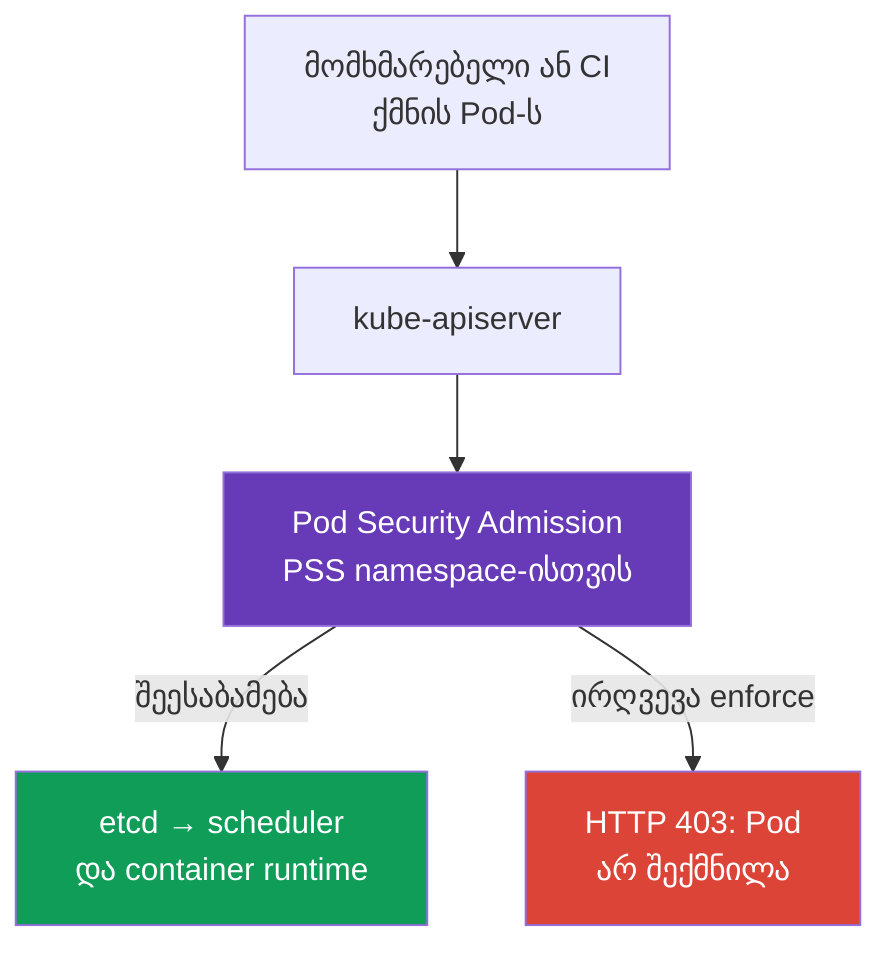
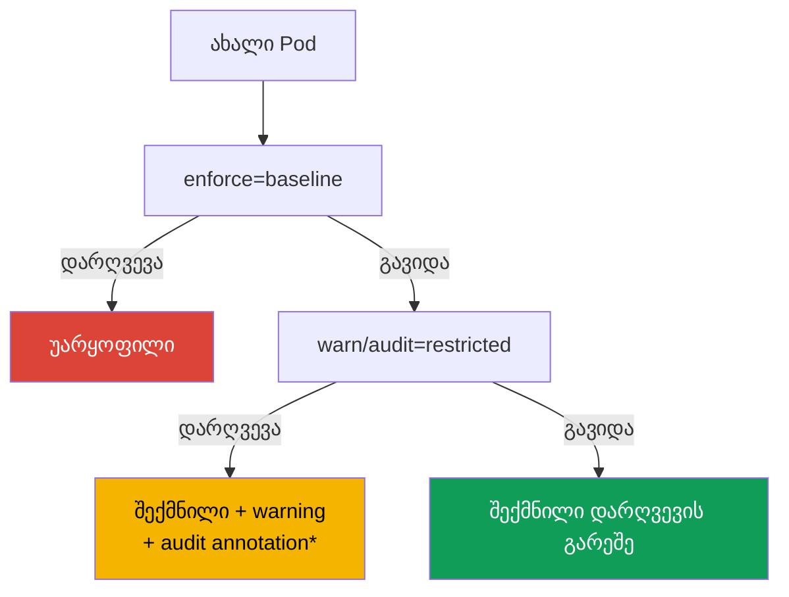

[Русская версия](ru.md) · [Eng version](README.md) · [Versión en español](es.md) · [Version française](fr.md) · [Deutsche Version](de.md) · [繁體中文版](tw.md) · [日本語版](jp.md)

# თავი 19. Pod Security Admission და Pod Security Standards

> **პრობლემა.** დეველოპერს, კომპრომეტირებულ CI-ს ან Helm chart-ს, რომელსაც აქვს უფლება
> `create pods`, შეუძლია გაგზავნოს RBAC-ის მიერ ნებადართული manifest `privileged: true`-ით,
> `hostPath: /`-ით ან host namespace-ით. ასეთი Pod-ი პროცესს აძლევს გზას node-ის მონაცემებთან
> და ბირთვთან, თუნდაც ცალკეულ workload-ს ჰქონდეს კარგი `SecurityContext`. საჭირო არ არის
> ცალკე workload-ის შემოწმება, არამედ ერთი საერთო admission-საზღვარი, რომელიც გაშვებამდე
> ყველა Pod-ს namespace-ში აიძულებს დაცულ baseline-ს.

> **რა არის შემდეგ.** `securityContext` აღწერს, რა უფლებებით *უნდა* მუშაობდეს კონკრეტული
> Pod, მაგრამ თავისთავად არ კრძალავს სხვა manifest-ს მოითხოვოს `privileged: true`, `hostPath`
> ან host namespaces. **Pod Security Admission (PSA)** - Kubernetes-ის ჩაშენებული
> admission-controller-ია, რომელიც Pod-ს ამოწმებს etcd-ში ჩაწერამდე და namespace-ს
> ანიჭებს მზა **Pod Security Standards (PSS)**-ს. ეს არის CKS-ის დომენის **Minimize
> Microservice Vulnerabilities** საფუძველი: ჯერ დაცული baseline ყველა workload-ისთვის,
> შემდეგ ვიწრო და დაკვირვებადი გამონაკლისები.

> **რა გჭირდებათ CKA-დან.** ველები `securityContext`, non-root გაშვება, capabilities და
> `allowPrivilegeEscalation` განხილულია [CKA-ს 20-ე თავში](../../../cka/course/20/ge.md).
> აქ ვიყენებთ მათ როგორც კონტრაქტს, რომელსაც PSA ამოწმებს და აიძულებს.

> 🧠 PSA აფასებს Pod-ს admission-ის დროს, RBAC - უფლებას შექმნას ობიექტი; PSS `privileged`, `baseline` და `restricted` არ ანაცვლებს runtime hardening-ს, ქსელს ან scan-ს.

## 19.1. რისთვის არის საჭირო PSA

დეველოპერს აქვს უფლება შექმნას Pod, ხოლო manifest-ში შემთხვევით ან განზრახ ხვდება საშიში
პარამეტრი:

```yaml
apiVersion: v1
kind: Pod
metadata:
  name: node-breakout
spec:
  hostPID: true
  containers:
  - name: shell
    image: busybox:1.36.1
    command: ["sh", "-c", "sleep 3600"]
    securityContext:
      privileged: true
```

ასეთი კონტეინერი იღებს თითქმის შეუზღუდავ წვდომას node-ის ბირთვსა და მოწყობილობებზე;
`hostPID`-თან, `hostNetwork`-თან ან `hostPath`-თან ერთად ეს ჩვეულებრივი გზაა
კომპრომეტირებული აპლიკაციისგან node-ის მონაცემებამდე და მეზობელ Pod-ებამდე. YAML-ის review
საკმარისი არ არის: manifest შეიძლება მოვიდეს CI-დან, Helm chart-იდან ან API-დან. საჭიროა
კონტროლი **admission-ის დროს**, კონტეინერის გაშვებამდე.



PSA - validating admission controller ფიქსირებული სტანდარტებით. ის არ ანაცვლებს RBAC-ს:
RBAC პასუხობს, **ვის** აქვს უფლება `create pods`; PSA პასუხობს, **რომელი Pod**-ის შექმნა
ეს მომხმარებელს ეშვება. ის ასევე არ ანაცვლებს NetworkPolicy-ს, seccomp-ს, AppArmor-ს,
image scanning-ს ან policy engine-ს: ყოველი კონტროლი მოიცავს სხვა შრეს.

## 19.2. PSS: სამი უსაფრთხოების დონე

Pod Security Standards განსაზღვრავს სამ cumulative-პროფილს. დონე ირჩევა ცალკე ყოველი
namespace-ისთვის.

| პროფილი | დანიშნულება | რას უშვებს ან მოითხოვს |
|---|---|---|
| `privileged` | სისტემური კომპონენტები და სავსებით სანდო workload-ები | განზრახ PSA-ის შეზღუდვების გარეშე |
| `baseline` | მინიმალურად უსაფრთხო საერთო დონე | ბლოკავს ესკალაციის ცნობილ გზებს: privileged კონტეინერები, host namespaces, hostPath, საშიში capabilities და დაუცველი პარამეტრები |
| `restricted` | ჩვეულებრივი აპლიკაციური workload-ები production-ში | ყველაფერი baseline-იდან პლუს მკაცრი least privilege: non-root, `allowPrivilegeEscalation: false`, `seccomp`, capabilities-ის მოცილება და შეზღუდული volumes |

### `privileged`: არა policy, არამედ შეზღუდვების არარსებობა

`privileged` სასარგებლოა იქ, სადაც Kubernetes-კომპონენტს რეალურად სჭირდება node-ის
მართვა: CNI, CSI, node agent. ეს **არ არის** გონივრული default აპლიკაციური namespace-ისთვის.
Namespace PSA-ლეიბლების გარეშე ეფექტურად იქცევა როგორც `privileged` მხოლოდ PSA-ის
სტანდარტული კონფიგურაციისას, სადაც `PodSecurityConfiguration.defaults`-ს აქვს
`enforce: privileged`. კლასტერის ადმინისტრატორს შეუძლია `defaults`-ში დააყენოს `baseline`
ან `restricted` და მათი ვერსია, ამიტომ effective policy ყოველთვის მოწმდება namespace-ისა
და admission controller-ის კონფიგურაციის მიხედვით და არა ლეიბლის არარსებობის მიხედვით.

სისტემური namespace-ისთვისაც არ გადასცემთ `privileged`-ს აპლიკაციურ გუნდს „გასასწორებლად“.
ჯერ დაამტკიცეთ საჭირო capability, volume ან syscall; სხვა შემთხვევაში დროებითი debugging
გადაიქცევა უსაფრთხოების საზღვრის მუდმივ შემოვლად.

### `baseline`: აშკარა breakout-ის მოცილება

`baseline` კრძალავს საშიშ მექანიზმებს, რომლებიც აპლიკაციას იშვიათად სჭირდება:
`privileged: true`, `hostNetwork`, `hostPID`, `hostIPC`, `hostPath` volumes, დაუცველი
SELinux/AppArmor/seccomp-პარამეტრები და საშიში Linux capabilities. ის ვარგისია როგორც
გარდამავალი მინიმუმი, მათ შორის legacy workload-ების მქონე namespace-ისთვის.

Baseline არ იძლევა გარანტიას, რომ პროცესი არ არის root და არ მოითხოვს `securityContext`-ის
სავსებით hardening-ს; მისი ამოცანაა host-ისკენ გასასვლელი ყველაზე ცნობილი გზების
გამორიცხვა. აპლიკაციური production namespace-ისთვის ეს ჩვეულებრივ შუალედური მდგომარეობაა
და არა საბოლოო მიზანი.

### `restricted`: ჩვეულებრივი აპლიკაციის კონტრაქტი

`restricted` მოითხოვს least privilege-ს. კონკრეტული დეტალები დამოკიდებულია PSS-ის
ვერსიაზე, ამიტომ სტანდარტის ვერსია დაფიქსირდეს rollout-ის დროს, მაგრამ ძირეული manifest
ასე გამოიყურება:

```yaml
apiVersion: v1
kind: Pod
metadata:
  name: web
  namespace: payments
spec:
  securityContext:
    runAsNonRoot: true
    seccompProfile:
      type: RuntimeDefault
  containers:
  - name: web
    image: nginxinc/nginx-unprivileged:1.30.4-alpine-slim
    ports:
    - containerPort: 8080
    securityContext:
      allowPrivilegeEscalation: false
      capabilities:
        drop: ["ALL"]
```

ქვემოთ მოცემულია კომპაქტური მატრიცა **PSS `restricted` v1.36**-ისთვის. ის შედის
`baseline`-ს; წესი ყოველი container-ისთვის ვრცელდება ასევე `initContainers`-სა და
`ephemeralContainers`-ზე, თუ სხვა რამ არ არის ნათქვამი.

> **⚠️ გამოცდა მიდის v1.35-ზე.** მატრიცა იყენებს v1.36-ს, როგორც training baseline-ს.
> გამოცდაზე გამოიყენეთ პირობიდან მოცემული ვერსია, `v1.35`, ან არ დააყენოთ
> `pod-security.kubernetes.io/*-version`; არ დააკოპიროთ label `v1.36` უფრო ძველ
> კლასტერზე შემოწმების გარეშე.

| კონტროლი v1.36 | დასაშვები მნიშვნელობა ან მოთხოვნა |
|---|---|
| Host namespaces და Windows HostProcess | `hostNetwork`, `hostPID`, `hostIPC` - მხოლოდ `false`/არ არის დაყენებული; `windowsOptions.hostProcess` - `false`/არ არის დაყენებული |
| Privileged | `securityContext.privileged` - `false`/არ არის დაყენებული |
| Capabilities | დამატება შესაძლებელია მხოლოდ `NET_BIND_SERVICE`-ისთვის; ვალდებულია `capabilities.drop: ["ALL"]` |
| Host storage და ports | `hostPath` აკრძალულია; ყოველი `hostPort` - არ არის დაყენებული/`0` ან წინასწარ განსაზღვრული allowlist (ჩაშენებული PSA უჭერს მხარს მხოლოდ არ არის დაყენებული/`0`-ს) |
| AppArmor | `appArmorProfile.type` - არ არის დაყენებული, `RuntimeDefault` ან `Localhost`; legacy annotation - მხოლოდ `runtime/default` ან `localhost/*` |
| SELinux | `type`: არ არის დაყენებული/ცარიელი, `container_t`, `container_init_t`, `container_kvm_t` ან `container_engine_t`; `user` და `role` არ დაყენდება |
| `procMount`, seccomp და sysctls | `procMount` - არ არის დაყენებული ან `Default`; seccomp აშკარად `RuntimeDefault`/`Localhost`; sysctls - მხოლოდ უსაფრთხო allowlist v1.36: `kernel.shm_rmid_forced`, `net.ipv4.ip_local_port_range`, `net.ipv4.ip_unprivileged_port_start`, `net.ipv4.tcp_syncookies`, `net.ipv4.ping_group_range`, `net.ipv4.ip_local_reserved_ports`, `net.ipv4.tcp_keepalive_time`, `net.ipv4.tcp_fin_timeout`, `net.ipv4.tcp_keepalive_intvl`, `net.ipv4.tcp_keepalive_probes` |
| Probes და lifecycle | ველი `host` `httpGet`/`tcpSocket` probes-ში და `httpGet`/`tcpSocket` lifecycle hooks-ში არ დაყენდება |
| Volumes | მხოლოდ `configMap`, `csi`, `downwardAPI`, `emptyDir`, `ephemeral`, `persistentVolumeClaim`, `projected`, `secret` |
| APE | `allowPrivilegeEscalation: false` |
| Run as | `runAsNonRoot: true` Pod-ზე ან ყოველ container-ზე; `runAsUser`, თუ დაყენებულია, არ არის `0` |

**OS-სპეციფიკური წესი.** PSS v1.25-იდან Pod-ისთვის `.spec.os.name: windows`-ით Linux-ის
შეზღუდვები privilege escalation-ზე, seccomp-ზე და capabilities-ზე არ გამოიყენება. არ
მოითხოვოთ Windows Pod-ისგან `allowPrivilegeEscalation: false`, `seccompProfile` ან
`drop: ALL` ისევე, როგორც Linux Pod-ისგან; Windows HostProcess და დანარჩენი
გამოსაყენებელი Windows-კონტროლები მოწმდება ცალკე.

`readOnlyRootFilesystem: true` - დაცვის ძლიერი პრაქტიკა, მაგრამ არა PSS restricted-ის
დამოუკიდებელი მოთხოვნა. არ შეაცვალოთ ის სავალდებულო ველების ნაცვლად. თუ აპლიკაციას
სჭირდება პორტი 1024-ზე ქვევით, `drop: ["ALL"]`-ის შემდეგ დასაშვებია წერტილოვნად
დაბრუნდეს `NET_BIND_SERVICE`, თუ ამას უშვებს არჩეული PSS-ვერსია და ამოცანა ამას
ამართლებს.

**User namespaces v1.36-ში.** Linux Pod-ისთვის `spec.hostUsers: false`-ით PSA ასუსტებს
ზუსტად `runAsNonRoot`-ისა და `runAsUser`-ის შემოწმებებს, თუნდაც `baseline`/`restricted`-ის
დროს: root ცალკე user namespace-ის შიგნით შესატყვისებულია host-ის არაპრივილეგირებულ
UID-თან. ეს არ აუქმებს მატრიცის დანარჩენ წესებს და არ უშვებს host namespaces-ს. არ
გადაატანოთ ეს გამონაკლისი ჩვეულებრივ Pod-ზე, რომელსაც `hostUsers` არ აქვს დაყენებული ან
დაყენებული აქვს `true`.

> 🎯 მიგრაცია: `warn`/`audit` → `enforce`; შეამოწმეთ namespace-ის label-ები/PSS-ის ვერსია და დაადიაგნოსტიკეთ პირდაპირი Pod-ის უარყოფა server-side dry run-ით.

## 19.3. PSA-ის რეჟიმები: enforce, audit და warn

ერთი და იმავე PSS-პროფილის გამოყენება შესაძლებელია სამი დამოუკიდებელი რეჟიმით. ეს
საშუალებას გვაძლევს ჯერ დავაკვირდეთ policy-ის ეფექტს, შემდეგ კი ჩავრთოთ აკრძალვა.

| რეჟიმი | შედეგი დარღვევის შემთხვევაში | სად ვეძებოთ სიგნალი |
|---|---|---|
| `enforce` | API server უარყოფს დარღვევის შემცველ create-სა და policy-checked update-ს: create არ ქმნის ახალ Pod-ს, update არ ინახავს ცვლილებას | `kubectl`-ის პასუხი, CI/CD, Event/API audit |
| `audit` | Pod ეშვება; PSA დაუმატებს annotation-ს შესაბამის audit event-ს | control plane-ის audit log, თუ ის ჩართული არ |
| `warn` | Pod ეშვება, client იღებს გაფრთხილებას | `kubectl`-ის stderr/პასუხი, CI-ის log |

`warn` და `audit` **არ იცავს**: დამრღვევი Pod მაინც გაშვებული რჩება. მათი მიზანია
ინვენტარიზაცია `enforce`-ზე გადასვლამდე. რეჟიმები დამოუკიდებელია: ერთ namespace-ზე
შესაძლებელია `enforce=baseline`, მაგრამ უკვე გავაგროვოთ `warn` და `audit`
`restricted`-ისთვის.

PSA-ის `audit` დაუმატებს annotation-ს Kubernetes audit event-ს, მაგრამ თავად არ ჩაურთავს
API audit backend-ს და არ იძლევა გარანტიას event-ის შენახვის შესახებ. evidence-ისთვის
წინასწარ დარწმუნდით, რომ API auditing ჩართულია, policy იწერს საჭირო requests/stages-ს და
ოპერატორს აქვს წვდომა არჩეულ audit sink-ზე; სხვა შემთხვევაში გამოიყენეთ `warn`,
server-side dry run და PSA-ის metrics, როგორც დამატებითი სიგნალები. არა ყოველი update
უკვე არსებული Pod-ისთვის კვლავ გადადის policy check-ს: გამორიცხულია metadata-only
updates (deprecated seccomp/AppArmor annotations-ის გარდა), ასევე `.spec.activeDeadlineSeconds`-ისა
და `.spec.tolerations`-ის ვალიდური ცვლილებები.



*დაკვირვებადი audit-ჩანაწერი არსებობს მხოლოდ იმ შემთხვევაში, თუ Kubernetes API auditing
ჩართულია და audit policy/backend ინახავს შესაბამის event-ს.*

## 19.4. Namespace-ის label-ები და სტანდარტის ვერსია

PSA კონფიგურირდება namespace-ის label-ებით. გასაღების ფორმატი:

```text
pod-security.kubernetes.io/<mode>=<level>
pod-security.kubernetes.io/<mode>-version=<version>
```

`<mode>` - `enforce`, `audit` ან `warn`; `<level>` - `privileged`, `baseline` ან
`restricted`. ვერსიის მნიშვნელობა - Kubernetes-ის minor ვერსია, მაგალითად `v1.36`, ან
`latest`. ყოველი რეჟიმისთვის ვერსია შესაძლებელია ცალკე დაყენდეს.

PSA-ის label-ები - security boundary-ის ნაწილია. Identity-ს, რომელსაც ეშვება workload-ების
შექმნა აპლიკაციურ namespace-ში, არ უნდა ჰქონდეს ავტომატურად `create`, `patch` ან `update`
`Namespace`-ზე: PSA-ის label-ების შეცვლა ან წაშლა ცვლის გამოყენებულ policy-ს.

```bash
# ჯერ ვაკვირდებით restricted-ს, მაგრამ უკვე ვკრძალავთ ყველაზე საშიშ Pod-ებს.
kubectl label namespace payments \
  pod-security.kubernetes.io/enforce=baseline \
  pod-security.kubernetes.io/enforce-version=v1.36 \
  pod-security.kubernetes.io/warn=restricted \
  pod-security.kubernetes.io/warn-version=v1.36 \
  pod-security.kubernetes.io/audit=restricted \
  pod-security.kubernetes.io/audit-version=v1.36

# სამუშაო დატვირთვების გასწორების შემდეგ ჩავრთავთ restricted-ის რეალურ აკრძალვას.
kubectl label namespace payments \
  pod-security.kubernetes.io/enforce=restricted \
  pod-security.kubernetes.io/enforce-version=v1.36 --overwrite
```

PSA policy-ს ანიჭებს ახალ Pod-ებსა და update-ს, რომლებიც შედის მისი policy checks-ში. არ
ელოდოთ, რომ label-ის შეცვლა წაშლის უკვე მომუშავე Pod-ებს: PSA არ არის controller და არ
ასწორებს არსებულ ობიექტებს. როცა namespace-ის `enforce`-დონე ან ვერსია-label იცვლება, PSA
ამოწმებს არსებულ Pod-ებს და დაბრუნებს გაფრთხილებებს დარღვევების შესახებ; ეს migration
signal-ია და არა ავტომატური წაშლა. არა ყოველი namespace-ის ცვლილება იწვევს ასეთ შემოწმებას.

`latest` მოსახერხებელია პატარა test-კლასტერისთვის, მაგრამ production-ში ქმნის რისკს:
Kubernetes-ის განახლების შემდეგ სტანდარტის შემცველობა შესაძლოა უფრო მკაცრი გახდეს, და
ადრე მომუშავე rollout უარყოფილი იქნება. ამიტომ ამ თავის სასწავლო მაგალითებში ვერსია
დაფიქსირებულია `v1.36`-ზე — კურსის და core labs-ის **training baseline**. თქვენი
production-კლასტერისთვის აირჩიეთ PSS pin, რომელიც შეესატყვისება მისი API server-ის
ფაქტობრივ ვერსიას; არ გამოიყენოთ ვერსია მასზე მაღალი.

> **სწავლების, გამოცდისა და production-ის ვერსიის საზღვარი.** დაკავშირებული curriculum-ის
> ფაილს ახლა ჰქვია `CKS_Curriculum v1.34`; ეს არის სასწავლო დოკუმენტის ვერსია და არა
> runtime-ის ვერსია. კურსისა და core labs-ის training baseline - Kubernetes `v1.36`,
> ამიტომ label-ები და ზემოთ მოცემული მატრიცა იყენებს `v1.36`-ს. CKS-ის გამოცდის
> გარემო კურსის დაფიქსირებულ snapshot-ში - Kubernetes `v1.35`; მცდელობამდე გადაამოწმეთ
> ExamUI-ში ფაქტობრივი ვერსია. Production-ის PSS-ვერსია ყოველთვის ირჩევა კონკრეტული
> კლასტერის API server-ის ვერსიის მიხედვით: სასწავლო pin `v1.36` არც გამოცდის
> მოთხოვნების დაპირებაა და არც რჩევა „ყოველთვის გამოვიყენოთ v1.36“ მომავალში.

**PSS-ის ვერსია drift.** პროფილები `baseline`/`restricted` დროთა განმავლობაში მკაცრდება:
მაგალითად, Kubernetes `v1.34`-ში Baseline/Restricted-ს დაუმატეს probes-ისა და lifecycle
hooks-ის host-ველების შეზღუდვები. ამის გამო Pod, რომელიც გაივლის უფრო ძველ pin-ს
(ვთქვათ, `v1.31`-ს), შესაძლოა უარყოფილ იქნეს სტანდარტის უფრო ახალი ვერსიით. პრაქტიკული
მიგრაციის გზა: დაფიქსირდეს მიმდინარე მხარდაჭერილი ვერსია, ჯერ შეფასდეს ეფექტი
`warn`/`audit`-ში, საჭიროებისას შედარდეს ძველ pin-თან (`v1.31`) როგორც მიგრაციის
მაგალითთან, შემდეგ შეგნებულად ავიდეს `enforce`. ამიტომაც „მუშაობს PSS-ის ძველ ვერსიაზე“
არ ნიშნავს „გაივლის ახალზე“.

Effective კონფიგურაციის შემოწმება იწყება namespace-ით, და არა Pod-ის manifest-ით:

```bash
kubectl get namespace payments --show-labels
kubectl get namespace payments -o jsonpath='{.metadata.labels}' ; echo
kubectl get namespace -L pod-security.kubernetes.io/enforce \
  -L pod-security.kubernetes.io/enforce-version \
  -L pod-security.kubernetes.io/warn \
  -L pod-security.kubernetes.io/audit
```

## 19.5. მიგრაცია restricted-ზე delivery-ის შეჩერების გარეშე

`enforce=restricted`-ის მყისიერი ჩართვა ძველ namespace-ზე - რისკიანია: Deployment არ
შექმნის ახალ replicas-ს, Job არ დაიწყება, ხოლო autoscaler ან rollback შესაძლოა
დაბლოკილი აღმოჩნდეს. უსაფრთხო მიგრაცია ჰყოფს დაკვირვებას აკრძალვისგან.

1. **დააინვენტარეთ namespace და owner-ები.** მოძებნეთ Pod-ის template-ები
   Deployments-ში, StatefulSets-ში, DaemonSets-ში, Jobs-ში და CronJobs-ში. გასასწორებელია
   controller-ის template და არა ცოცხალი Pod: სხვა შემთხვევაში შემდეგი replica ისევ
   დაარღვევს policy-ს.
2. **დაიწყეთ `warn=restricted`-ითა და `audit=restricted`-ით.** არსებული traffic და CI
   გაჩვენებთ დამრღვევებს, მაგრამ არაფერს დაბლოკავენ. სანამ audit-ჩანაწერებზე
   დაანდობდეთ, შეამოწმეთ API audit logging-ისა და არჩეული sink-ის ხელმისაწვდომობა;
   შეინახეთ ხელმისაწვდომი warnings/audit-ჩანაწერები, როგორც სამუშაოთა სია.
3. **გამოასწორეთ დარღვევები template-ებში.** დაამატეთ `runAsNonRoot`, seccomp,
   ესკალაციის აკრძალვა, capabilities-ის მოცილება; შეცვალეთ `hostPath` დასაშვები
   volume-ით, ხოლო privileged ფუნქცია - ცალკე სისტემური კომპონენტით.
4. **გადაამოწმეთ უარყოფითი და დადებითი სცენარი.** კარგი Pod უნდა შეიქმნას warning-ის
   გარეშე; განზრახ ცუდი - მისცეს warning/audit enforce-მდე და უარყოფა მას შემდეგ.
5. **გადადით ჯერ `enforce=baseline`-ზე, შემდეგ `enforce=restricted`-ზე.** დატოვეთ
   `warn` და `audit` restricted-ზე მინიმუმ rollout-ის პერიოდისთვის, რომ დაინახოთ
   template-ის drift.
6. **დააფიქსირეთ PSS-ის ვერსია.** განაახლეთ ის Kubernetes-ის განახლებასთან და manifest-ის
   ხელახალ შემოწმებასთან ერთად.

Pod template-ის მინიმალური გასწორების მაგალითი:

```yaml
spec:
  template:
    spec:
      securityContext:
        runAsNonRoot: true
        seccompProfile:
          type: RuntimeDefault
      containers:
      - name: api
        image: registry.example/api@sha256:<digest>
        securityContext:
          allowPrivilegeEscalation: false
          capabilities:
            drop: ["ALL"]
```

თუ image-ს რეალურად სჭირდება root, არ გამორთოთ PSA პირველ ნაბიჯად. შეამოწმეთ `USER`
Dockerfile-ში, ფაილების ownership, აპლიკაციის პორტი და writable დირექტორიები; ჩვეულებრივ
image-ის non-root UID-თან ადაპტირება შესაძლებელია და `/tmp`-ისთვის ან cache-ისთვის
გამოყოფილია `emptyDir`. გამონაკლისი უნდა გამომდინარეობდეს დამტკიცებული ტექნიკური
საჭიროებისგან და არა იქცეს მიგრაციის შემოვლის მოკლე გზად.

## 19.6. Rejection: როგორ წავიკითხოთ და ხელახლა გამოვიწვიოთ უარყოფა

`enforce`-ის დროს admission Pod-ის შექმნამდე პასუხობს შეცდომით. ეს არ არის
`ImagePullBackOff`, არც scheduler-ის შეცდომა და არც runtime denial: Pod-ს შესაძლოა
საერთოდ არ ჰქონდეს UID და არ გამოჩნდეს `kubectl get pods`-ში.

```bash
# Restricted namespace-ში განზრახ ვარღვევთ policy-ს.
kubectl -n payments run privileged-test --image=busybox:1.36.1 \
  --restart=Never \
  --overrides='{
    "spec": {
      "containers": [{
        "name": "privileged-test",
        "image": "busybox:1.36.1",
        "securityContext": {"privileged": true}
      }]
    }
  }'
```

მოსალოდნელია უარყოფა PodSecurity-ის დარღვევების ჩამონათვალით. შეტყობინება სასარგებლოა
როგორც checklist: ის მიუთითებს, მაგალითად, `privileged`-ს, ნაკლულ `runAsNonRoot`-ს,
`allowPrivilegeEscalation`-ს, capabilities-ს ან seccomp-ს. Controller-ის template-ისთვის
გამოიყენეთ dry run rollout-ამდე, მაგრამ არ ჩათვალოთ ის enforce-ის მტკიცებულებად:

```bash
# Deployment-ისთვის PSA დააყენებს warn/audit-ს spec.template-ზე, მაგრამ არა enforce-ს.
kubectl apply --dry-run=server -f deployment.yaml

# enforce-ის შესამოწმებლად შექმენით spec.template-იდან ცალკე Pod-manifest
# და შეამოწმეთ ის namespace-ში იმავე PSA label-ებით.
kubectl -n payments apply --dry-run=server -f rendered-pod.yaml
kubectl auth can-i create pods -n payments
kubectl get deployment -n payments api -o yaml
```

`--dry-run=server` ატარებს admission-შემოწმებას, მაგრამ არ ინახავს ობიექტს. Workload
resources-ისთვის PSA დააყენებს Pod template-ზე `warn`-ს და `audit`-ს, ხოლო `enforce`
Pod-ს შემოწმდება მხოლოდ მოგვიანებით, როცა მას ქმნის controller. ამიტომ Deployment-ის
წარმატებული dry-run არ ამტკიცებს, რომ controller-created Pod გაივლის `enforce`-ს:
შემოწმეთ ცალკე Pod იმავე template-იდან ან ჩაატარეთ რეალური rollout იზოლირებულ
test-namespace-ში იდენტური PSA label-ებით და გააკონტროლეთ `kubectl rollout status` და
Events. `kubectl auth can-i` ჰყოფს RBAC-ის უარყოფას PSA-ის უარყოფისგან. თუ Pod უკვე
შექმნილია controller-ის მიერ და არ იწყება, ჯერ დახედეთ `kubectl describe pod`-ს და
Events-ს: PSA-ის უარყოფა ხდება გაშვებამდე, ხოლო image-ის, node-ის, seccomp-ის ან
AppArmor-ის შეცდომა - მოგვიანებით და სხვა შრეზე.

> 🏭 PSA exception: მინიმალური namespace/identity scope, owner, მიზეზი, კომპენსირებადი controls და წაშლის თარიღი.

## 19.7. გამონაკლისები: წერტილოვნად, owner-ითა და ვადით

ზოგიერთი სისტემური კომპონენტი ობიექტურად არ შეესაბამება restricted-ს: CNI, CSI node
plugin, device plugin ან დიაგნოსტიკური agent. არჩევანი არ არის „გამორთეთ PSA მთელი
კლასტერისთვის“, არამედ მინიმალური გამონაკლისი owner-ით, მიზეზითა და გადასინჯვის ვადით.

**სასურველი ვარიანტი - ცალკე namespace და ყველაზე სუსტი საკმარისი დონე.** მაგალითად,
სისტემური DaemonSet რჩება `kube-system`-ში ან გამოყოფილ `platform-system`-ში
`enforce=baseline`-ით ან, დამტკიცებული საჭიროებისას, `privileged`-ით; აპლიკაციური
namespaces რჩება `restricted`. Namespace არ უნდა ერეოდეს სანდო node agent-ს
მომხმარებლის workload-ებთან.

**სისტემური PSA exemptions** დაყენებულია admission controller-ის კონფიგურაციით, და არა
namespace-ის label-ით. `AdmissionConfiguration`-ში `PodSecurity`-ისთვის გათვალისწინებულია
სიები `usernames`, `runtimeClasses` და `namespaces`; გამონაკლისი ვრცელდება PSA-ის ყველა
რეჟიმზე. ეს dimensions დამოუკიდებელია: **ნებისმიერის** დამთხვევა (`namespace` **ან**
`runtimeClass` **ან** `username`) სავსებით უვლის გვერდს PSA-ს. ამიტომ ერთ გამონაკლისში
არ გააერთიანოთ რამდენიმე dimension იმ მოლოდინით, რომ ეს დაუზუსტებს არეალს.

ქვემოთ ჩვენებულია მხოლოდ namespace exemption. `defaults` მოცემულია სავსებით; რეალური
კონფიგურაციის ცვლილებისას შეინახეთ ყველა მოქმედი მნიშვნელობა და დაამატეთ მხოლოდ საჭირო
ვიწრო გამონაკლისი.

```yaml
apiVersion: apiserver.config.k8s.io/v1
kind: AdmissionConfiguration
plugins:
- name: PodSecurity
  configuration:
    apiVersion: pod-security.admission.config.k8s.io/v1
    kind: PodSecurityConfiguration
    defaults:
      enforce: restricted
      enforce-version: v1.36
      audit: restricted
      audit-version: v1.36
      warn: restricted
      warn-version: v1.36
    exemptions:
      usernames: []
      runtimeClasses: []
      namespaces:
      - platform-system
```

არ დააკოპიროთ ეს მაგალითი წვდომაში ნაცნობი managed კლასტერზე ჩაუფიქრებლად: admission
configuration-ის მითითების ხერხი დამოკიდებულია იმაზე, ვინ მართავს kube-apiserver-ს.
გამონაკლისის დამატებამდე დააფიქსირეთ მიზეზი, identity/namespace, owner, კომპენსირებადი
controls და წაშლის თარიღი. არ დაამატოთ ფართო მომხმარებელთა ჯგუფი და არ ჩაწეროთ
აპლიკაციური namespace გამონაკლისებში მხოლოდ იმის გამო, რომ ერთმა Deployment-მა ვერ
გაიარა მიგრაცია.

Username-გამონაკლისი ვრცელდება კონკრეტული API request-ის identity-ზე. Pod, შექმნილი
Deployment-იდან, DaemonSet-იდან ან Job-იდან, ჩვეულებრივ ქმნის controller და არა
საწყისი მომხმარებელი; მისი გამონაკლისი არ გადადის controller-created Pod-ზე. არ
გახადოთ exempt controller ServiceAccounts workload-ისთვის: ეს შესაძლოა bypass-ს
გაუწიოს PSA-ს ყველა resource-ისთვის, რომელსაც ასეთი controller ქმნის. ასევე არ
აურიოთ PSA-ის exemption RBAC-თან. Exemption არ იძლევა უფლებას შექმნას Pod; ის მხოლოდ
გამოტოვებს PSS-შემოწმებას, თუ RBAC-მა request უკვე დაუშვა.

> 🔬 `PodSecurityPolicy` წაშლილია Kubernetes v1.25-ში; სტანდარტული შეზღუდვები გადადის PSA/PSS-ში, ორგანიზაციული - policy engine-ში.

## 19.8. PSP: რატომ არ მუშაობს ძველი manifests

**PodSecurityPolicy (PSP)** იყო Pod-ის შეზღუდვის ადრინდელი მექანიზმი, მაგრამ წაშლილია
Kubernetes-იდან ვერსია 1.25-ში. PSA არ არის API-ჩანაცვლება `kind: PodSecurityPolicy`-სთვის:
ის იყენებს სამ ფიქსირებულ PSS-პროფილს და namespace-ის label-ებს, და არა PSP-ის
თვითნებურ spec-ს და RBAC `use`-ს.

მოძველებული კონფიგურაციის ნიშნები:

```yaml
apiVersion: policy/v1beta1
kind: PodSecurityPolicy
metadata:
  name: restricted
```

API-ის წაშლის შემდეგ ასეთი ობიექტი არ შეიქმნება, ხოლო ClusterRole PSP `use`-ით არ ჩართავს
დაცვას. მიგრაციის დროს:

- წაშალეთ manifests-იდან და Helm charts-იდან `PodSecurityPolicy`, `policy/v1beta1` და
  RBAC-წესები `use` PSP-ზე;
- დააკავშირეთ ძველი policy-ის ჩანაფიქრი PSS-თან: სტანდარტული მოთხოვნები გადაიტანეთ
  `baseline` ან `restricted` label-ებში;
- წესები, რომლებსაც PSA არ გამოხატავს (სანდო registry, სავალდებულო labels, resource
  limits, კონკრეტული StorageClass), გადაიტანეთ Kyverno-ში, Gatekeeper-ში ან
  `ValidatingAdmissionPolicy`-ში;
- ჯერ გაუშვათ PSA `warn`/`audit`-ში, რადგან PSP-სა და PSA-ს semantics-ითა და
  მოქმედების არეალით განსხვავდება;
- cutover-ის შემდეგ შეამოწმეთ, რომ admission controller ჩართულია, label-ები
  მინიჭებულია და ძველი cluster-wide bypass-ები არ დარჩენილა.

PSA არ შეიძლება გაფართოვდეს საკუთარი ველებით. ეს უპირატესობაა საბაზისო hardening-ისთვის:
ქცევა სტანდარტიზებულია და გასაგები გამოცდაზე და incident response-ში. ორგანიზაციული
წესებისთვის გამოიყენეთ policy engine **დამატებით**, და არა PSS-ის ნაცვლად.

> 🎯 მტკიცებულება: pinned labels, დასაშვები და დამრღვევი **პირდაპირი Pod** namespace-ში და workload-ის effective `securityContext`.

## 19.9. ოპერაციული checklist და შემოწმება

PSA-ის შემოწმებამ უნდა დაამტკიცოს ორივე: კონფიგურაცია და შედეგი:

```bash
NS=payments
SUBJECT='system:serviceaccount:payments:ci'  # identity, რომელსაც ვამოწმებთ

# PSA-ის label-ები - security boundary-ია: workload-ის შემქმნელს არ უნდა შეეძლოს თავად შეცვალოს namespace-ის policy.
kubectl auth can-i create pods -n "$NS" --as="$SUBJECT"
kubectl auth can-i create namespaces --as="$SUBJECT"
kubectl auth can-i patch namespaces/"$NS" --as="$SUBJECT"
kubectl auth can-i update namespaces/"$NS" --as="$SUBJECT"

# 1. მინიჭებული დონე და ვერსია pin.
kubectl get ns "$NS" -o jsonpath='{.metadata.labels}{"\n"}'

# 2. პირდაპირი უსაფრთხო Pod გადის server-side admission-ს, enforce-ის ჩათვლით.
kubectl -n "$NS" apply --dry-run=server -f restricted-pod.yaml

# 3. პირდაპირი დამრღვევი Pod იღებს warning/audit-ს ან rejection-ს - რეჟიმის მიხედვით.
kubectl -n "$NS" apply --dry-run=server -f privileged-pod.yaml

# 4. Deployment-ისთვის server dry-run გვიჩვენებს warn/audit-ს spec.template-ისთვის,
# მაგრამ enforce-ს დაადასტურებს მხოლოდ Pod. შეამოწმეთ rendered Pod ან rollout test-namespace-ში.
kubectl -n "$NS" apply --dry-run=server -f deployment.yaml
kubectl -n "$NS" apply --dry-run=server -f rendered-pod.yaml

# 5. შექმნილი Pod-ის effective securityContext.
kubectl -n "$NS" get pod web -o jsonpath='{.spec.securityContext}{"\n"}'
kubectl -n "$NS" get pod web -o jsonpath='{.spec.containers[*].securityContext}{"\n"}'
```

| დაკვირვება | სავარაუდო მიზეზი | ქმედება |
|---|---|---|
| `privileged` Pod გავიდა თითქოსდა restricted namespace-ში | `enforce`-ლეიბლი არ არსებობს/შეცდომითია, Pod exempt-ია, ან მოწმდება სხვა namespace | გვიჩვენეთ namespace-ის label-ები, creator და admission configuration |
| CI ხედავს warning-ს, მაგრამ deployment მაინც შეიქმნა | მოქმედებს `warn` ან `audit`, და არა `enforce` | ეს მოსალოდნელი migration-ის ეტაპია; არ დაარქმევთ მას დაცვას |
| ახალი rollout უარყოფილია, ძველი Pods მუშაობს | PSA არ შლის არსებულ Pods-ს, მაგრამ ამოწმებს ახლებს | გაასწორეთ controller-ის template და გაიმეორეთ rollout |
| `kubectl apply` პასუხობს Forbidden-ით, Pod არ შეიქმნა | PSA ან RBAC უარყო persistence-მდე | შეადარეთ შეცდომის ტექსტი `auth can-i`-სთან და namespace-ის label-ებთან |
| სისტემური კომპონენტი გატყდა restricted-ის შემდეგ | კომპონენტს სჭირდება დასაშვები ცალკე namespace ან ვიწრო exemption | არ შეასუსტოთ აპლიკაციური namespace; დააფიქსირეთ გამონაკლისი |

აპლიკაციური/CI identity-სთვის ელოდეთ `no`-ს `create namespaces`-ისთვის,
`patch namespaces/<application-namespace>`-ისთვის და
`update namespaces/<application-namespace>`-ისთვის. Namespace-ის დელეგირებული შექმნა -
ცალკე privileged workflow-ია: PSA-ის label-ები უნდა მინიჭდეს და დაცული იქნეს platform
control/admission policy-ით.

Observability-ისთვის შეაგროვეთ API audit logs და PSA-ის metrics
`pod_security_evaluations_total`, `pod_security_errors_total` და
`pod_security_exemptions_total`, თუ ისინი ხელმისაწვდომია თქვენ დისტრიბუციაში. Label-ების
ნაკრებები განსხვავდება: evaluations-ს აქვს `decision`, `mode`, `policy_level`,
`policy_version`, `request_operation`, `resource`, `subresource`; errors-ს - `fatal`,
`request_operation`, `resource`, `subresource`; exemptions-ს - მხოლოდ request/resource
dimensions. Label `policy` აქ არ არსებობს. `audit`/`warn`-ისთვის `decision="deny"`
ნიშნავს, რომ ნაპოვნია მოწმებული policy-ის დარღვევა, და არა API rejection-ს: request-ს
უარყოფს მხოლოდ `mode="enforce"`. CI-ში დაამატეთ `kubectl apply --dry-run=server`
პირდაპირი Pod-ისთვის test-namespace-ის მიმართ იმავე PSA-label-ებით, როგორც
production-ს; workload-ის template დამატებით შემოწმეთ იმავე ადგილზე რეალური rollout-ით.

> 🏭 IaC ქმნის namespace-ს pinned `enforce=restricted`-ით; გამონაკლისები ინახება expiry-ით, policy engine ამატებს ორგანიზაციულ წესებს.

## 19.10. როგორ გამოიყენება production-ში

- **restricted default-ად აპლიკაციებისთვის.** შექმენით namespace template-ის/IaC-ის
  მეშვეობით უკვე pinned `enforce=restricted`-ით; არ დატოვოთ უსაფრთხოება ყოველი
  chart-ის შეხედულებაზე. Უფლება, შეცვალოს PSA-ის label-ები, დატოვეთ სანდო
  platform/security როლისთვის.
- **გაფრთხილება აკრძალვამდე.** ახალი PSS-დონე იწყება `warn`-ითა და `audit`-ით, შემდეგ
  ხდება `enforce`; ასე policy არ გადააქცევს დაგეგმილ rollout-ს incident-ად.
- **სისტემური კომპონენტების საზღვრები.** CNI/CSI და node agents იზოლირებულია ბიზნეს
  workload-ებისგან ცალკე namespaces-ით, ServiceAccounts-ითა და RBAC-ით. `privileged`
  არ ვრცელდება მთელ პლატფორმაზე.
- **გამონაკლისი - დროებითი security debt-ია.** მას აქვს owner, ტესტი, ticket,
  კომპენსირებადი controls და წაშლის თარიღი. Exemption არ არის image-ის „გასწორების“
  გზა, თუ ის შესაძლებელია გახდეს non-root.
- **PSA პლუს policy engine.** PSA ინარჩუნებს ცნობილ PSS-baseline-ს; Kyverno/Gatekeeper
  ან ჩაშენებული CEL policy ამატებს ორგანიზაციის მოთხოვნებს: დასაშვები registries,
  image digest, labels, `requests`/`limits` და Service/Ingress-ის შეზღუდვები.

## 19.11. როგორ გამოგვადგება ეს: გამოცდაზე და რეალურ სამუშაოში

CKS-ის გამოცდაზე მნიშვნელოვანია სწრაფად გამოვარჩიოთ PSA-ის უარყოფა RBAC-ის,
scheduler-ის ან container runtime-ის პრობლემებისგან: შეამოწმეთ namespace-ის PSA-label-ები,
გამოიყენეთ manifest `kubectl apply --dry-run=server`-ით და წაიკითხეთ დარღვევების
ჩამონათვალი admission error-ში. შეძლეთ დააყენოთ `enforce`, `warn` და `audit`, დააფიქსიროთ
PSS-ის ვერსია და გაასწოროთ ზუსტად controller-ის template.

რეალურ სამუშაოში ეს ნაბიჯები საშუალებას გვაძლევს namespace-ს გადავიყვანოთ `restricted`-ზე
delivery-ის შეჩერების გარეშე: ჯერ შევკრიბოთ დარღვევები `warn`/`audit`-ის მეშვეობით,
შემდეგ გავასწოროთ template-ები და მხოლოდ შემოწმების შემდეგ ჩავრთოთ `enforce`. ცალკეული
სისტემური კომპონენტები იზოლირეთ სპეციალურ namespace-ებში მინიმალურად საჭირო დონეზე, ხოლო
ყოველი გამონაკლისი დააფიქსირეთ owner-ითა და წაშლის ვადით.

## 19.12. მინი-გლოსარი

- **PSA (Pod Security Admission)** - PSS-ისთვის ჩაშენებული validating admission controller.
- **PSS (Pod Security Standards)** - Pod-ის დაცულობის მზა პროფილები: `privileged`,
  `baseline`, `restricted`.
- **`enforce`** - PSA-ის რეჟიმი, რომელიც უარყოფს დამრღვევ Pod-ს.
- **`audit`** - რეჟიმი, რომელიც არ უარყოფს Pod-ს და დარღვევის შესახებ ინფორმაციას
  ამატებს Kubernetes-audit event-ს; დაკვირვებადი audit log მოითხოვს ცალკე ჩართულ API
  auditing-ს და შესატყვის audit policy/backend-ს.
- **`warn`** - რეჟიმი, რომელიც აბრუნებს გაფრთხილებას client-ს Pod-ის უარყოფის გარეშე.
- **PSS-ის ვერსია** - სტანდარტის ვერსია კონკრეტული PSA-რეჟიმისთვის; pin იცავს
  rollout-ს upgrade-ის შემდეგ წესების მოულოდნელი ცვლილებისგან.
- **exemption** - PSA-ის bypass წინასწარ სანდო namespace-ისთვის, username-ისთვის ან
  RuntimeClass-ისთვის; არ იძლევა RBAC-უფლებას.
- **PSP (PodSecurityPolicy)** - Kubernetes 1.25-ში წაშლილი PSA-ის წინამორბედი.

## 19.13. თავის შედეგები

- PSA ამოწმებს Pod-ს etcd-ში ჩაწერამდე; ის ავსებს RBAC-ს და `securityContext`-ს, მაგრამ
  არ ანაცვლებს დანარჩენ security controls-ს.
- PSS აძლევს სამ პროფილს: შეზღუდვების გარეშე `privileged`, `baseline` აშკარა
  node-breakout-გზების წინააღმდეგ, `restricted` - non-root აპლიკაციისთვის least
  privilege-ით; namespace-ის label-ების არარსებობა ნიშნავს `privileged`-ს მხოლოდ
  PSA-ის სტანდარტული defaults-ის დროს.
- `enforce`, `audit` და `warn` დამოუკიდებელია და დაყენებულია namespace-ის label-ებით
  `pod-security.kubernetes.io/<mode>`; ყოველთან შესაძლებელია დაემატოს `<mode>-version`.
  Უფლება, შეცვალოს ეს label-ები, ცვლის security boundary-ს და არ უნდა გამომდინარეობდეს
  ავტომატურად workload-ების შექმნის უფლებისგან.
- საიმედო მიგრაცია მიდის `warn`/`audit`-იდან `enforce=baseline`-ზე, შემდეგ
  `enforce=restricted`-ზე, template-ების გასწორებით და არა ცოცხალი Pod-ების.
- PSA-ის Rejection ხდება Pod-ის შექმნამდე. შეამოწმეთ namespace-ის label-ები, effective
  defaults, პირდაპირი Pod server-side dry run-ით, RBAC და admission error-ის ტექსტი;
  Deployment-ის წარმატებული dry-run არ ადასტურებს enforce-ს Pod-ისთვის, რომელსაც
  მოგვიანებით შექმნის controller.
- PSP წაშლილია 1.25-ში. მისი დაბრუნება manifest-ით შეუძლებელია: სტანდარტული წესები
  გადადის PSA-ში, ხოლო ორგანიზაციული - policy engine-ში.
- გამონაკლისები უნდა იყოს ვიწრო, აპლიკაციური namespaces-გან ცალკე, დოკუმენტირებული და
  დროებითი.

## 19.14. კითხვები თვითშემოწმებისთვის

<details>
<summary>1. როგორ განსხვავდება RBAC-ის, `securityContext`-ისა და PSA-ის ვალდებულებები?</summary>

RBAC პასუხობს, ვის შეუძლია `create pods`-ის შესრულება. `securityContext` აყალიბებს
კონკრეტული Pod-ის პროცესის უფლებებსა და შეზღუდვებს, ხოლო PSA etcd-ში ჩაწერამდე ამოწმებს,
რომელი Pod-ის შექმნას უშვებს PSS namespace-ისთვის. ეს ურთიერთშემვსები, და არა
ურთიერთშემცვლელი, შრეებია.
</details>

<details>
<summary>2. რატომ არ ღირს PSA-ლეიბლების არარსებობის მქონე namespace დაცულად ჩავთვალოთ?</summary>

PSA-ის სტანდარტული defaults-ის დროს ასეთი namespace ეფექტურად იქცევა როგორც
`privileged`, მაგრამ ადმინისტრატორს შეუძლია სხვა defaults დააკონფიგურიროს. ამიტომ
label-ების არარსებობა არ ამტკიცებს effective policy-ს. მოწმდება namespace-ის label-ები
და admission controller-ის კონფიგურაცია.
</details>

<details>
<summary>3. რომელი სამი PSS-პროფილი არსებობს და როდის არის თითოეული გამართლებული?</summary>

`privileged` PSA-ით არ შემოსაზღვრავს Pod-ს და საჭიროა მხოლოდ სანდო სისტემური
კომპონენტებისთვის. `baseline` ბლოკავს breakout-ის ცნობილ გზებს, privileged
კონტეინერის, host namespaces-ის და hostPath-ის ჩათვლით, და სასარგებლოა როგორც
გარდამავალი მინიმუმი. `restricted` ამატებს non-root-ს, APE false-ს, seccomp-ს და
capabilities-ის მოცილებას ჩვეულებრივი production-workload-ებისთვის.
</details>

<details>
<summary>4. რით განსხვავდება `warn` და `audit` `enforce`-ისგან და რატომ არ არიან ისინი დაცვა?</summary>

`warn` უშვებს Pod-ს client-ისთვის გაფრთხილებით, ხოლო `audit` ამატებს annotation-ს audit
event-ს და ასევე უშვებს Pod-ს; დაკვირვებადი audit-evidence მოითხოვს ჩართულ API audit
logging-ს. მხოლოდ `enforce` უარყოფს დამრღვევ create-სა და შესატყვის PSA-update-ს
persistence-მდე. ამიტომ პირველი ორი რეჟიმი განკუთვნილია ინვენტარიზაციისა და
მიგრაციისთვის.
</details>

<details>
<summary>5. როგორ ჩავწეროთ label `enforce=restricted`-ისთვის დაფიქსირებული PSS-ვერსიით (სასწავლო კლასტერის ვერსიით)?</summary>

თავის training baseline-ისთვის გამოიყენება `pod-security.kubernetes.io/enforce=restricted`
და `pod-security.kubernetes.io/enforce-version=v1.36`. ისინი მინიჭდება namespace-ს,
მაგალითად `kubectl label namespace payments`-ის მეშვეობით. Production-pin ირჩევა
API server-ის ფაქტობრივი ვერსიის მიხედვით და არ გადადის ავტომატურად სასწავლო
მნიშვნელობიდან.
</details>

<details>
<summary>6. რატომ არჩევანი Kubernetes-ის განახლებამდე PSS-ის ვერსია დავაფიქსიროთ, და არ დავტოვოთ `latest`?</summary>

PSS დროთა განმავლობაში მკაცრდება: თავი მოგვითხრობს v1.34-ში დამატებულ probes-ის და
lifecycle hooks-ის host-ველების შეზღუდვებზე. `latest`-ის დროს upgrade-ს შეუძლია
მოულოდნელად უარყოს ადრე მომუშავე rollout. Pin საშუალებას იძლევა ჯერ შევაფასოთ
manifests warn/audit-ის მეშვეობით და შეგნებულად განვაახლოთ სტანდარტი.
</details>

<details>
<summary>7. რატომ ასწორებთ Deployment template-ს და არა უკვე შექმნილ Pod-ს?</summary>

PSA არ ასწორებს და არ შლის არსებულ Pod-ებს, ხოლო controller შემდეგ replica-ს შექმნის
თავისი template-იდან. ცოცხალი Pod-ის ხელით შესწორება არ აქრობს შემდეგი დარღვევის
წყაროს. ამიტომ იცვლება Deployment-ის, StatefulSet-ის, Job-ის ან CronJob-ის template
და ტარდება rollout.
</details>

<details>
<summary>8. რით განსხვავდება PSA-ის admission rejection `ImagePullBackOff`-ისგან და RBAC-ის უარყოფისგან?</summary>

PSA უარყოფს Pod-ის შექმნამდე და აბრუნებს შეცდომას PSS-დარღვევებით; ობიექტს შესაძლოა
UID-ც არ მიენიჭოს. `ImagePullBackOff` და runtime/scheduler-ის შეცდომები ხდება
admission-ის შემდეგ და ჩნდება Events-ში. RBAC-იც უარყოფს persistence-მდე, მაგრამ ისინი
გამოირჩევა პასუხის ტექსტისა და `kubectl auth can-i`-ის მიხედვით.
</details>

<details>
<summary>9. რატომ არის ცალკე namespace უკეთესი, ვიდრე ფართო exemption CNI-სთვის ან CSI-სთვის?</summary>

ცალკე namespace სისტემურ კომპონენტს აძლევს მინიმალურად საჭირო PSS-დონეს, აპლიკაციური
workload-ების შესუსტების გარეშე. Exemption AdmissionConfiguration-ში PSA-ს გვერდს
უვლის ყოველ რეჟიმში namespace-ისთვის, username-ისთვის ან RuntimeClass-ისთვის. ამიტომ
ის გამოიყენება მხოლოდ ვიწროდ, დოკუმენტირებულად და დროებით.
</details>

<details>
<summary>10. რა დაემართა PodSecurityPolicy-ს და რით ივსება წესები, რომლებიც PSS-ში არ არსებობს?</summary>

PodSecurityPolicy წაშლილია Kubernetes 1.25-ში, ამიტომ ძველი PSP manifests და RBAC
`use` არ ჩართავს დაცვას. სტანდარტული მოთხოვნები გადადის PSA-ის `baseline`-ში ან
`restricted`-ში. Registry, labels, ლიმიტები და სხვა PSS-გარეთა წესები ხორციელდება
Kyverno-ით, Gatekeeper-ით ან ValidatingAdmissionPolicy-ით.
</details>

<details>
<summary>11. **Flashback (თავი 30).** PSA გადაწყვეტილებას იღებს ერთხელ - admission-ის დროს, Pod-ის შექმნისას. თუ Pod-მა `enforce=restricted` პატიოსნად გავიდა, მაგრამ პროცესი კონტეინერის შიგნით მოგვიანებით შეეცადება რაღაც საეჭვოს შესრულებას (მაგალითად, ჩამოტვირთული binary), შეძლებს თუ არა PSA ეს შეაჩეროს? რომელი შრე 30-ე თავიდან მოიცავს ზუსტად ამ - runtime, და არა admission-time - მომენტს?</summary>

არა: PSA გადაწყვეტილებას იღებს მხოლოდ admission-ის დროს და არ აკვირდება პროცესის
შემდგომ შესრულებას. Runtime-მომენტს მოიცავს 30-ე თავის runtime security-ის საშუალებები,
რომლებიც აკვირდება პროცესის event-ებს და შეუძლიათ გამოავლინონ ან რეაგირება
გაუწიონ საეჭვო ქცევას. Admission აღკვეთს საშიშ კონფიგურაციას, ხოლო runtime detection
ავსებს მას გაშვების შემდეგ.
</details>

## პრაქტიკა

დაამუშავეთ PSA და `securityContext` [ლაბა 107-ში - PSA და SecurityContext](../../labs/107/README_GE.MD).
შექმენით test namespace, ჩართეთ `warn=restricted` და `audit=restricted`, შემდეგ
გამოიყენეთ უსაფრთხო და განზრახ privileged Pod. გაასწორეთ template სუფთა შედეგამდე,
ჩართეთ `enforce=restricted` და დარწმუნდით, რომ ცუდი Pod იღებს admission rejection-ს,
ხოლო კარგი შეიქმნება. ამის შემდეგ შეამოწმეთ label-ები და effective `securityContext`
19.9-ე ნაწილის ბრძანებებით.

სასარგებლო ოფიციალური საცნობარო მასალები: [Pod Security Admission](https://kubernetes.io/docs/concepts/security/pod-security-admission/), [Pod Security Standards](https://kubernetes.io/docs/concepts/security/pod-security-standards/) და [migration from PodSecurityPolicy](https://kubernetes.io/docs/tasks/configure-pod-container/migrate-from-psp/).

---
[სარჩევი](../README_GE.md) · [თავი 18](../18/ge.md) · [თავი 20](../20/ge.md)
