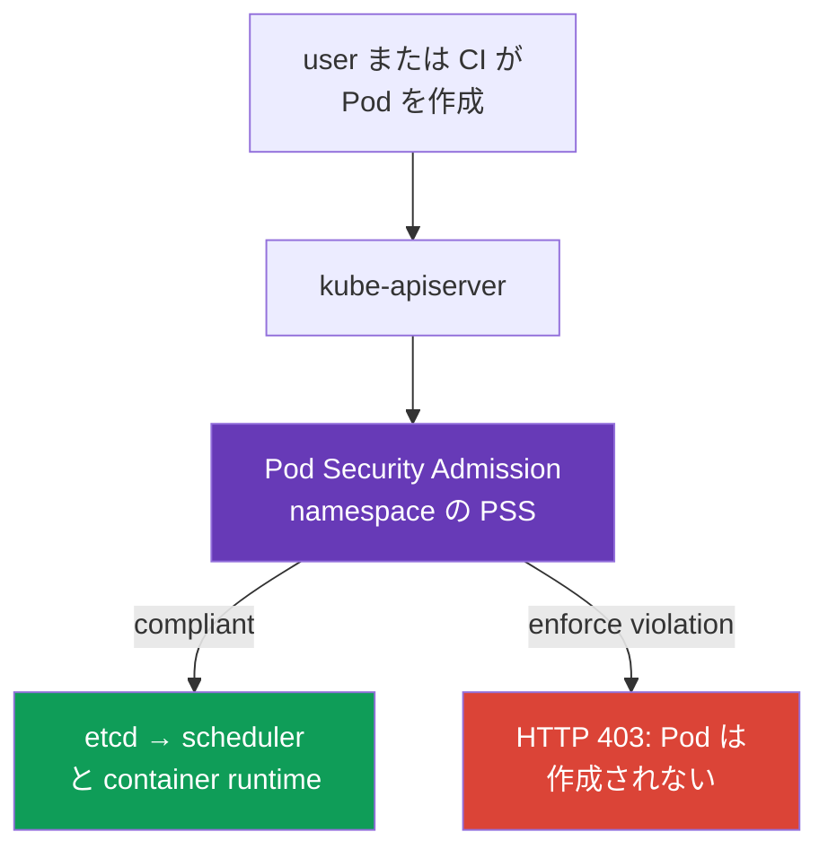
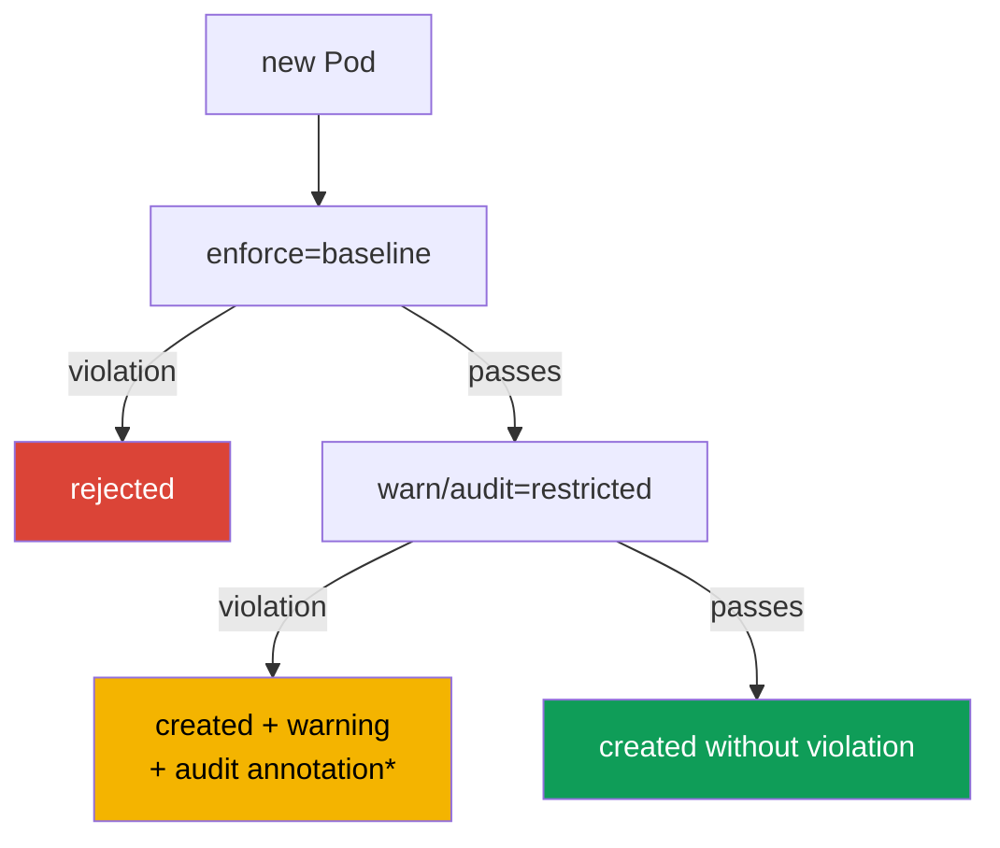

[Русская версия](ru.md) · [Eng version](README.md) · [Versión en español](es.md) · [Version française](fr.md) · [Deutsche Version](de.md) · [ქართული ვერსია](ge.md) · [繁體中文版](tw.md)

# 第19章. Pod Security Admission と Pod Security Standards

> **課題。** `create pods` 権限を持つ developer、compromised CI、または Helm chart は、`privileged: true`、`hostPath: /`、host namespace を含む RBAC 許可済み manifest を submit できます。このような Pod は、individual workload に良い `SecurityContext` があっても、process に node data と kernel への path を与えます。start 前に namespace のすべての Pod へ safe baseline を強制する common admission boundary が必要です。

> **この後。** `securityContext` は particular Pod がどの privilege で動く*べきか*を記述しますが、別 manifest が `privileged: true`、`hostPath`、host namespace を request すること自体は禁じません。**Pod Security Admission（PSA）**は Kubernetes built-in admission controller で、etcd への write 前に Pod を check し、namespace ごとに ready-made **Pod Security Standards（PSS）**を適用します。これは CKS の **Minimize Microservice Vulnerabilities** domain の基盤です。まずすべての workload に safe baseline を与え、次に narrow で observable な exception を扱います。

> **CKA で必要な知識。** `securityContext` field、non-root execution、capability、`allowPrivilegeEscalation` は[CKA 第20章](../../../cka/course/20/jp.md)で扱います。ここでは PSA が検査して強制する contract として使います。

> 🧠 PSA は admission 時に Pod を評価し、RBAC は object create の権利を評価します。PSS の `privileged`、`baseline`、`restricted` は runtime hardening、network、scan を置き換えません。

## 19.1. PSA が必要な理由

developer には Pod 作成権限があり、manifest に accidental または intentional な dangerous setting が入ります。

```yaml
apiVersion: v1
kind: Pod
metadata:
  name: node-breakout
spec:
  hostPID: true
  containers:
  - name: shell
    image: busybox:1.36.1
    command: ["sh", "-c", "sleep 3600"]
    securityContext:
      privileged: true
```

この container は node kernel と device へのほぼ unlimited access を得ます。`hostPID`、`hostNetwork`、`hostPath` と組み合わせると、application compromise から node data と neighbor Pod へ向かう一般的な path です。YAML review は不十分です。manifest は CI、Helm chart、API から来ることがあります。container start 前の**admission**で control が必要です。



PSA は fixed standard を持つ validating admission controller です。RBAC を置き換えません。RBAC は**誰が** `create pods` できるかを、PSA はこの user が**どの Pod を**作れるかを答えます。NetworkPolicy、seccomp、AppArmor、image scanning、policy engine も置き換えません。各 control は別 layer を閉じます。

## 19.2. PSS: 三つの security level

Pod Security Standards は三つの cumulative profile を定義します。level は namespace ごとに選びます。

| Profile | Purpose | 許可または要求するもの |
|---|---|---|
| `privileged` | system component と fully trusted workload | 意図的に PSA restriction なし |
| `baseline` | minimally secure common level | privileged container、host namespace、hostPath、dangerous capability、unsafe setting という known escalation path を block |
| `restricted` | production の通常 application workload | baseline のすべてに加え strict least privilege: non-root、`allowPrivilegeEscalation: false`、seccomp、drop capability、restricted volume |

### `privileged`: policy ではなく restriction がない状態

`privileged` は Kubernetes component が実際に node を manage する必要がある場所、CNI、CSI、node agent に有用です。application namespace の合理的な default **ではありません**。PSA label のない namespace は、`PodSecurityConfiguration.defaults` が `enforce: privileged` の standard PSA configuration に限り effective に `privileged` と同様に動作します。cluster administrator は `defaults` を `baseline` または `restricted` とその version に設定できます。そのため effective policy は label がないことからでなく、namespace と admission controller configuration で常に確認します。

system namespace でも、application team に「fix」のための `privileged` を与えてはいけません。最初に必要な capability、volume、syscall を確認します。そうしなければ temporary debug は permanent security-boundary bypass になります。

### `baseline`: obvious breakout を遮断する

`baseline` は application にほぼ不要な dangerous mechanism を禁止します。`privileged: true`、`hostNetwork`、`hostPID`、`hostIPC`、`hostPath` volume、unsafe SELinux/AppArmor/seccomp setting、dangerous Linux capability です。old workload を持つ namespace を含め transition minimum として適します。

Baseline は process が non-root であることを約束せず、complete hardened `securityContext` を要求しません。その task は最も known な host breakout path を防ぐことです。application production namespace では通常 final goal でなく intermediate state です。

### `restricted`: 通常 application の contract

`restricted` は least privilege を要求します。specific detail は PSS version に依存するため rollout 中に standard version を pin する必要がありますが、key manifest は次のとおりです。

```yaml
apiVersion: v1
kind: Pod
metadata:
  name: web
  namespace: payments
spec:
  securityContext:
    runAsNonRoot: true
    seccompProfile:
      type: RuntimeDefault
  containers:
  - name: web
    image: nginxinc/nginx-unprivileged:1.30.4-alpine-slim
    ports:
    - containerPort: 8080
    securityContext:
      allowPrivilegeEscalation: false
      capabilities:
        drop: ["ALL"]
```

以下は **PSS `restricted` v1.36** の compact matrix です。`baseline` を含みます。特記しない限り各 container rule は `initContainers` と `ephemeralContainers` にも適用されます。

> **⚠️ 試験は v1.35 です。** matrix は v1.36 を training baseline として使います。試験では task の version、`v1.35` を使うか、`pod-security.kubernetes.io/*-version` を設定しません。older cluster に確認なく `v1.36` label を copy してはいけません。

| v1.36 control | Allowed value または requirement |
|---|---|
| Host namespace と Windows HostProcess | `hostNetwork`、`hostPID`、`hostIPC` は `false`/unset のみ。`windowsOptions.hostProcess` は `false`/unset |
| Privileged | `securityContext.privileged` は `false`/unset |
| Capabilities | add できるのは `NET_BIND_SERVICE` のみ。`capabilities.drop: ["ALL"]` は必須 |
| Host storage と port | `hostPath` は禁止。各 `hostPort` は unset/`0` または predefined allowlist（built-in PSA は unset/`0` だけを support） |
| AppArmor | `appArmorProfile.type` は unset、`RuntimeDefault`、`Localhost`。legacy annotation は `runtime/default` または `localhost/*` のみ |
| SELinux | `type` は unset/empty、`container_t`、`container_init_t`、`container_kvm_t`、`container_engine_t`。`user` と `role` は未設定 |
| `procMount`、seccomp、sysctl | `procMount` は unset または `Default`。seccomp は explicit `RuntimeDefault`/`Localhost`。sysctl は v1.36 safe allowlist のみ: `kernel.shm_rmid_forced`、`net.ipv4.ip_local_port_range`、`net.ipv4.ip_unprivileged_port_start`、`net.ipv4.tcp_syncookies`、`net.ipv4.ping_group_range`、`net.ipv4.ip_local_reserved_ports`、`net.ipv4.tcp_keepalive_time`、`net.ipv4.tcp_fin_timeout`、`net.ipv4.tcp_keepalive_intvl`、`net.ipv4.tcp_keepalive_probes` |
| Probe と lifecycle | `httpGet`/`tcpSocket` probe と `httpGet`/`tcpSocket` lifecycle hook の `host` field は unset |
| Volume | `configMap`、`csi`、`downwardAPI`、`emptyDir`、`ephemeral`、`persistentVolumeClaim`、`projected`、`secret` のみ |
| APE | `allowPrivilegeEscalation: false` |
| Run as | Pod または各 container の `runAsNonRoot: true`。設定する `runAsUser` は `0` 以外 |

**OS-specific rule。** PSS v1.25 以降、`.spec.os.name: windows` を持つ Pod には privilege escalation、seccomp、capability の Linux restriction は適用されません。Windows Pod に、Linux Pod と同じ `allowPrivilegeEscalation: false`、`seccompProfile`、`drop: ALL` を要求してはいけません。Windows HostProcess と他の applicable Windows control は別に確認します。

`readOnlyRootFilesystem: true` は strong defense practice ですが、独立した PSS restricted requirement ではありません。required field の代わりにしてはいけません。application が 1024 未満の port を必要とする場合、`drop: ["ALL"]` の後、selected PSS version が許可し task が正当化するなら、`NET_BIND_SERVICE` を pinpoint で戻せます。

**v1.36 の user namespace。** `spec.hostUsers: false` を持つ Linux Pod では、PSA は `baseline`/`restricted` 下でも `runAsNonRoot` と `runAsUser` check だけを relax します。separate user namespace 内の root は unprivileged host UID に map されるためです。これは matrix の他 rule を取り消さず、host namespace を許可もしません。この exception を `hostUsers` が unset または `true` の ordinary Pod に移してはいけません。

> 🎯 Migration: `warn`/`audit` → `enforce`。namespace label/PSS version を確認し、server-side dry run で direct Pod の reject を診断します。

## 19.3. PSA mode: enforce、audit、warn

同じ PSS profile は三つの independent mode で適用できます。まず policy impact を見て、次に denial を有効にできます。

| Mode | Violation 時の result | signal を探す場所 |
|---|---|---|
| `enforce` | API server が violating create と policy-checked update を reject。create は new Pod を作らず、update は change を保存しない | `kubectl` response、CI/CD、Event/API audit |
| `audit` | Pod は admission され、PSA は corresponding audit event に annotation を追加 | enabled なら control plane audit log |
| `warn` | Pod は admission され、client は warning を受ける | stderr/`kubectl` response、CI log |

`warn` と `audit` は**保護しません**。violating Pod はなお start します。目的は `enforce` への移行前の inventory です。mode は independent です。一 namespace で `enforce=baseline` にしつつ、`restricted` の `warn` と `audit` をすでに集められます。

PSA の `audit` は Kubernetes audit event に annotation を追加しますが、API audit backend を有効にしたり event storage を保証したりしません。evidence では API auditing が enabled、policy が required request/stage を記録、operator が selected audit sink に access できることを最初に確認します。そうでなければ `warn`、server-side dry run、PSA metric を additional signal とします。既存 Pod の全 update が再度 policy check を通るわけではありません。metadata-only update（deprecated seccomp/AppArmor annotation を除く）、valid な `.spec.activeDeadlineSeconds` と `.spec.tolerations` の change は除外されます。



*observable audit record は Kubernetes API auditing が enabled で audit policy/backend が corresponding event を保存する場合だけ存在します。*

## 19.4. Namespace label と standard version

PSA は namespace label で設定します。key format:

```text
pod-security.kubernetes.io/<mode>=<level>
pod-security.kubernetes.io/<mode>-version=<version>
```

`<mode>` は `enforce`、`audit`、`warn`、`<level>` は `privileged`、`baseline`、`restricted` です。version value は `v1.36` のような Kubernetes minor version または `latest` です。mode ごとに version を別々に設定できます。

PSA label は security boundary の一部です。application namespace に workload を作成できる identity が、`Namespace` に対する `create`、`patch`、`update` も自動的に得てはいけません。PSA label を change または delete すれば、適用される policy を変えられるためです。

```bash
# まず restricted を observe しつつ、最も危険な Pod はすでに deny する。
kubectl label namespace payments \
  pod-security.kubernetes.io/enforce=baseline \
  pod-security.kubernetes.io/enforce-version=v1.36 \
  pod-security.kubernetes.io/warn=restricted \
  pod-security.kubernetes.io/warn-version=v1.36 \
  pod-security.kubernetes.io/audit=restricted \
  pod-security.kubernetes.io/audit-version=v1.36

# workload の修正後、real restricted deny を有効にする。
kubectl label namespace payments \
  pod-security.kubernetes.io/enforce=restricted \
  pod-security.kubernetes.io/enforce-version=v1.36 --overwrite
```

PSA は new Pod と policy check に含まれる update に policy を適用します。label change がすでに running の Pod を remove すると期待してはいけません。PSA は controller ではなく existing object を fix しません。namespace の `enforce` level または version label が変わると、PSA は existing Pod を check し violation warning を返します。これは migration signal であり automatic deletion ではありません。namespace のすべての change がこの check を起こすわけではありません。

`latest` は small test cluster には便利ですが、production では risk を作ります。Kubernetes update 後に standard content が strict になり、previously working rollout が reject される可能性があります。そのため本章の training example は `v1.36` に version を pin します。course と core lab の **training baseline** です。production cluster では actual API server version に対応する PSS pin を選び、それより高い version は使いません。

> **training、試験、production の version boundary。** related curriculum file は現在 `CKS_Curriculum v1.34` と呼ばれます。これは runtime version でなく training document version です。course と core lab の training baseline は Kubernetes `v1.36` のため、上の label と matrix は `v1.36` を使います。course の fixed snapshot における CKS exam environment は Kubernetes `v1.35` です。attempt 前に ExamUI の actual version を確認します。production PSS version は常に particular cluster の API server version で選びます。training pin の `v1.36` は exam requirement の promise でも、将来「常に v1.36 を使う」recommendation でもありません。

**PSS version drift。** `baseline`/`restricted` profile は時間と共に stricter になります。たとえば Kubernetes `v1.34` では Baseline/Restricted に probe と lifecycle hook の host field restriction が追加されました。このため older pin（たとえば `v1.31`）を pass する Pod が newer standard version では reject され得ます。practical migration path は、current supported version を pin し、まず `warn`/`audit` で impact を評価し、必要なら migration example として older pin（`v1.31`）と比較してから、意識的に `enforce` を上げることです。だから「old PSS version で動く」は「new version を pass する」ことを意味しません。

effective configuration の check は Pod manifest でなく namespace から始めます。

```bash
kubectl get namespace payments --show-labels
kubectl get namespace payments -o jsonpath='{.metadata.labels}' ; echo
kubectl get namespace -L pod-security.kubernetes.io/enforce \
  -L pod-security.kubernetes.io/enforce-version \
  -L pod-security.kubernetes.io/warn \
  -L pod-security.kubernetes.io/audit
```

## 19.5. delivery を止めない restricted への migration

old namespace で直ちに `enforce=restricted` を有効にするのは risky です。Deployment が new replica を作れず、Job が start せず、autoscaler または rollback が block され得ます。safe migration は observation と denial を分けます。

1. **namespace と owner を inventory する。** Deployment、StatefulSet、DaemonSet、Job、CronJob の Pod template を見つけます。live Pod ではなく controller template を fix します。そうでなければ next replica が再び policy に違反します。
2. **`warn=restricted` と `audit=restricted` から開始する。** existing traffic と CI が violator を示しますが、何も block しません。audit record を頼りにする前に API audit logging と selected sink の availability を確認し、available warning/audit record を work list として保存します。
3. **template の violation を除去する。** `runAsNonRoot`、seccomp、escalation deny、drop capability を追加します。`hostPath` は allowed volume に、privileged function は separate system component に置き換えます。
4. **negative/positive scenario を確認する。** good Pod は warning なしで作成され、known-bad Pod は enforce 前に warning/audit、後に reject される必要があります。
5. **最初に `enforce=baseline`、次に `enforce=restricted` へ移す。** template drift を見るため rollout period 中は少なくとも restricted の `warn` と `audit` を残します。
6. **PSS version を pin する。** Kubernetes update と manifest の再検証と共に update します。

minimal Pod template fix の例:

```yaml
spec:
  template:
    spec:
      securityContext:
        runAsNonRoot: true
        seccompProfile:
          type: RuntimeDefault
      containers:
      - name: api
        image: registry.example/api@sha256:<digest>
        securityContext:
          allowPrivilegeEscalation: false
          capabilities:
            drop: ["ALL"]
```

image が実際に root を必要とする場合、最初の action として PSA を disable してはいけません。Dockerfile の `USER`、file ownership、application port、writable directory を確認します。通常、image は non-root UID に adapt でき、`/tmp` または cache 用に `emptyDir` を分けられます。exception は proven technical need の結果であり、migration を迂回する short path ではありません。

## 19.6. Rejection: deny を読む・再現する

`enforce` では admission は Pod 作成前に error を返します。これは `ImagePullBackOff`、scheduler error、runtime denial ではありません。Pod は UID をまったく持たず、`kubectl get pods` にも現れないことがあります。

```bash
# restricted namespace で意図的に policy に違反する。
kubectl -n payments run privileged-test --image=busybox:1.36.1 \
  --restart=Never \
  --overrides='{
    "spec": {
      "containers": [{
        "name": "privileged-test",
        "image": "busybox:1.36.1",
        "securityContext": {"privileged": true}
      }]
    }
  }'
```

PodSecurity violation の list を持つ reject が expected です。message は checklist として有用です。たとえば `privileged`、absent `runAsNonRoot`、`allowPrivilegeEscalation`、capability、seccomp を示します。controller template では rollout 前に dry run を使いますが、enforce の証明とは見なしません。

```bash
# Deployment では PSA は spec.template に warn/audit を適用するが enforce はしない。
kubectl apply --dry-run=server -f deployment.yaml

# enforce check では spec.template から separate Pod manifest を作り、
# 同一の PSA label を持つ namespace で確認する。
kubectl -n payments apply --dry-run=server -f rendered-pod.yaml
kubectl auth can-i create pods -n payments
kubectl get deployment -n payments api -o yaml
```

`--dry-run=server` は admission check を実行しますが object を保存しません。workload resource では PSA は Pod template に `warn` と `audit` を適用しますが、`enforce` は controller が後で Pod を作る時だけ check します。したがって successful Deployment dry-run は controller-created Pod が `enforce` を pass する証明ではありません。同じ template の separate Pod を確認するか、identical PSA label を持つ isolated test namespace で real rollout を行い、`kubectl rollout status` と Event を監視します。`kubectl auth can-i` は RBAC deny と PSA deny を分けます。controller がすでに Pod を作って start しない場合、最初に `kubectl describe pod` と Event を見ます。PSA deny は start 前、image/node/seccomp/AppArmor error は後の別 layer で起きます。

> 🏭 PSA exception: minimal namespace/identity scope、owner、reason、compensating control、removal date。

## 19.7. Exception: pinpoint、owner、expiry

CNI、CSI node plugin、device plugin、diagnostic agent のように objectively restricted に適合しない system component もあります。選択は「cluster の PSA を disable」ではなく、owner、reason、review expiry を持つ minimal exception です。

**preferred variant は separate namespace と weakest sufficient level です。** たとえば system DaemonSet は `kube-system` または dedicated `platform-system` に置き、`enforce=baseline`、proven need があれば `privileged` にします。application namespace は `restricted` のままです。namespace に trusted node agent と user workload を混在させてはいけません。

**system PSA exemption** は namespace label でなく admission controller configuration で設定します。`PodSecurity` の `AdmissionConfiguration` には `usernames`、`runtimeClasses`、`namespaces` list があります。exception は PSA の全 mode に適用されます。これらの dimension は independent です。**いずれか**一つ（`namespace` **または** `runtimeClass` **または** `username`）が match すると PSA を完全に bypass します。そのため一 exception 内で複数 dimension を組み合わせ、scope が narrow になると期待してはいけません。

以下は namespace exemption だけを示します。`defaults` は完全に記載しています。real configuration を変更する場合は active value をすべて保ち、必要な narrow exception だけを追加します。

```yaml
apiVersion: apiserver.config.k8s.io/v1
kind: AdmissionConfiguration
plugins:
- name: PodSecurity
  configuration:
    apiVersion: pod-security.admission.config.k8s.io/v1
    kind: PodSecurityConfiguration
    defaults:
      enforce: restricted
      enforce-version: v1.36
      audit: restricted
      audit-version: v1.36
      warn: restricted
      warn-version: v1.36
    exemptions:
      usernames: []
      runtimeClasses: []
      namespaces:
      - platform-system
```

managed cluster にこの example を blind に copy してはいけません。admission configuration の方法は kube-apiserver を誰が manage するかに依存します。exemption 前に reason、identity/namespace、owner、compensating control、removal date を document します。broad user group を追加したり、一 Deployment が migration を pass しないだけで application namespace を exemption に加えたりしてはいけません。

Username exemption は particular API request の identity に関係します。Deployment、DaemonSet、Job から作る Pod は通常 original user でなく controller が作ります。その exemption は controller-created Pod に transfer されません。workload のために controller ServiceAccount を exempt してはいけません。その controller が作るすべての resource で PSA を bypass できるためです。PSA exemption と RBAC も混同してはいけません。exemption は Pod 作成権限を与えず、RBAC が request をすでに許可した場合だけ PSS check を skip します。

> 🔬 `PodSecurityPolicy` は Kubernetes v1.25 で remove されました。standard restriction は PSA/PSS に、organization rule は policy engine に移します。

## 19.8. PSP: old manifest が動かない理由

**PodSecurityPolicy（PSP）**は以前の Pod restriction mechanism でしたが、Kubernetes v1.25 で remove されました。PSA は `kind: PodSecurityPolicy` の API replacement ではありません。arbitrary PSP spec と RBAC `use` でなく、three fixed PSS profile と namespace label を使います。

obsolete configuration の sign:

```yaml
apiVersion: policy/v1beta1
kind: PodSecurityPolicy
metadata:
  name: restricted
```

API removal 後、この object は作成されず、PSP の ClusterRole `use` も protection を有効にしません。migration では:

- manifest と Helm chart から `PodSecurityPolicy`、`policy/v1beta1`、PSP の RBAC `use` rule を remove する。
- old policy intent を PSS に map する。standard requirement は `baseline` または `restricted` label に移す。
- PSA が表現しない rule（trusted registry、required label、resource limit、specific StorageClass）は Kyverno、Gatekeeper、`ValidatingAdmissionPolicy` に移す。
- PSP と PSA は semantic と scope が違うため、最初に PSA を `warn`/`audit` で実行する。
- cutover 後、admission controller が enabled、label が assigned、old cluster-wide bypass が残っていないことを確認する。

PSA は custom field で拡張できません。これは basic hardening では利点です。standard behavior は試験と incident response で明確です。organization rule には PSS の**代わりに**ではなく**追加で**policy engine を使います。

> 🎯 Proof: pinned label、namespace 内で allowed/violating **direct Pod**、workload の effective `securityContext`。

## 19.9. Operational checklist と verification

PSA verification は configuration と result の両方を証明する必要があります。

```bash
NS=payments
SUBJECT='system:serviceaccount:payments:ci'  # 確認する identity

# PSA label は security boundary: workload creator 自身が policy namespace を変えてはいけない。
kubectl auth can-i create pods -n "$NS" --as="$SUBJECT"
kubectl auth can-i create namespaces --as="$SUBJECT"
kubectl auth can-i patch namespaces/"$NS" --as="$SUBJECT"
kubectl auth can-i update namespaces/"$NS" --as="$SUBJECT"

# 1. assigned level と version pin。
kubectl get ns "$NS" -o jsonpath='{.metadata.labels}{"\n"}'

# 2. direct safe Pod は enforce を含む server-side admission を pass する。
kubectl -n "$NS" apply --dry-run=server -f restricted-pod.yaml

# 3. direct violating Pod は mode に従って warning/audit または rejection を受ける。
kubectl -n "$NS" apply --dry-run=server -f privileged-pod.yaml

# 4. Deployment の server dry-run は spec.template の warn/audit を示すが、
# enforce は Pod だけで確認する。rendered Pod または test namespace rollout を確認する。
kubectl -n "$NS" apply --dry-run=server -f deployment.yaml
kubectl -n "$NS" apply --dry-run=server -f rendered-pod.yaml

# 5. created Pod の effective securityContext。
kubectl -n "$NS" get pod web -o jsonpath='{.spec.securityContext}{"\n"}'
kubectl -n "$NS" get pod web -o jsonpath='{.spec.containers[*].securityContext}{"\n"}'
```

| Observation | Likely cause | Action |
|---|---|---|
| `privileged` Pod が supposedly restricted namespace を pass | `enforce` label がない/誤り、Pod が exempt、または別 namespace を check | namespace label、creator、admission configuration を示す |
| CI は warning を見るが deployment は作成された | `enforce` でなく `warn` または `audit` が動作 | expected migration phase。protection と呼ばない |
| new rollout は reject されるが old Pod は動く | PSA は existing Pod を remove せず new Pod を check | controller template を fix し rollout を繰り返す |
| `kubectl apply` が Forbidden を返し Pod が作られない | PSA または RBAC が persistence 前に deny | error text を `auth can-i`、namespace label と比較 |
| restricted 後に system component が壊れた | component には allowed separate namespace または narrow exemption が必要 | application namespace を弱めず exception を記録 |

application/CI identity では `create namespaces`、`patch namespaces/<application-namespace>`、`update namespaces/<application-namespace>` は `no` が expected です。delegated namespace creation は separate privileged workflow です。PSA label は platform control/admission policy で assign し protect する必要があります。

observability では、利用可能なら API audit log と PSA metric `pod_security_evaluations_total`、`pod_security_errors_total`、`pod_security_exemptions_total` を集めます。label set は異なります。evaluations には `decision`、`mode`、`policy_level`、`policy_version`、`request_operation`、`resource`、`subresource`、errors には `fatal`、`request_operation`、`resource`、`subresource`、exemptions には request/resource dimension だけがあります。ここに `policy` label は存在しません。`audit`/`warn` の `decision="deny"` は check した policy の violation を意味し、API reject を意味しません。request を reject するのは `mode="enforce"` だけです。CI では production と同じ PSA label の test namespace に対し direct Pod の `kubectl apply --dry-run=server` を追加し、workload template は同じ場所で real rollout により追加確認します。

> 🏭 IaC は pinned `enforce=restricted` を持つ namespace を作成。exception は expiry と共に保管し、policy engine は organization rule を追加。

## 19.10. production での適用

- **application の default は restricted。** namespace を template/IaC で pinned `enforce=restricted` と共に作ります。security を各 chart の判断に残しません。PSA label の変更権限は trusted platform/security role にだけ残します。
- **deny 前の warning。** new PSS level は `warn` と `audit` で始め、後に `enforce` になります。policy が planned rollout を incident にしないためです。
- **system component boundary。** CNI/CSI と node agent は business workload から separate namespace、ServiceAccount、RBAC で isolate します。`privileged` を platform 全体に広げません。
- **exception は temporary security debt。** owner、test、ticket、compensating control、removal date を持ちます。non-root にできる image を「fix」する方法ではありません。
- **PSA + policy engine。** PSA は known PSS baseline を保ち、Kyverno/Gatekeeper または built-in CEL policy が allowed registry、image digest、label、`requests`/`limits`、Service/Ingress restriction という organization requirement を追加します。

## 19.11. この知識が役立つ場面: 試験と実務

CKS 試験では PSA deny と RBAC、scheduler、container runtime の問題を素早く区別することが重要です。namespace の PSA label を確認し、`kubectl apply --dry-run=server` で manifest を apply し、admission error の violation list を読みます。`enforce`、`warn`、`audit` の設定、PSS version の pin、controller template の修正を行えるようにします。

実務では同じ step により delivery を止めず namespace を `restricted` に移せます。まず `warn`/`audit` で violation を集め、template を fix してから `enforce` を有効にします。separate system component は special namespace に isolate し minimal required level を与え、各 exemption に owner と removal deadline を document します。

## 19.12. ミニ glossary

- **PSA（Pod Security Admission）** - PSS 用の built-in validating admission controller。
- **PSS（Pod Security Standards）** - ready-made Pod security profile: `privileged`、`baseline`、`restricted`。
- **`enforce`** - violating Pod を reject する PSA mode。
- **`audit`** - Pod を reject せず Kubernetes audit event に violation information を追加する mode。observable audit log には separately enabled API auditing と appropriate audit policy/backend が必要。
- **`warn`** - Pod を reject せず client に warning を返す mode。
- **PSS version** - particular PSA mode の standard version。pin は upgrade 後の unexpected rule change から rollout を守る。
- **exemption** - pre-trusted namespace、username、RuntimeClass の PSA bypass。RBAC right は与えない。
- **PSP（PodSecurityPolicy）** - Kubernetes 1.25 で remove された PSA の predecessor。

## 19.13. 章のまとめ

- PSA は etcd write 前に Pod を check します。RBAC と `securityContext` を補完しますが、other security control を置き換えません。
- PSS は三 profile を提供します。restriction のない `privileged`、obvious node-breakout path 対策の `baseline`、least privilege の non-root application 用 `restricted`。namespace label の absence が `privileged` を意味するのは standard PSA default の場合だけです。
- `enforce`、`audit`、`warn` は independent で、namespace label `pod-security.kubernetes.io/<mode>` に設定します。各々へ `<mode>-version` を加えられます。これらの label を変える right は security boundary を変えるため、workload create right から自動で続いてはいけません。
- reliable migration は `warn`/`audit` から `enforce=baseline`、次に `enforce=restricted` へ進み、live Pod でなく template を fix します。
- PSA rejection は Pod creation 前に起きます。namespace label、effective default、server-side dry run による direct Pod、RBAC、admission error text を確認します。successful Deployment dry-run は controller が後で作る Pod の enforce を証明しません。
- PSP は 1.25 で remove されました。manifest で戻せません。standard rule は PSA に、organization rule は policy engine に移します。
- exception は narrow、application namespace とは separate、documented、temporary でなければなりません。

## 19.14. Self-check question

<details>
<summary>1. RBAC、`securityContext`、PSA の責務はどう違いますか？</summary>

RBAC は誰が `create pods` を実行できるかを答えます。`securityContext` は particular Pod process の privilege と restriction を指定し、PSA は etcd write 前に namespace の PSS によりどの Pod を許可するかを check します。これらは interchangeable でなく complementary layer です。
</details>

<details>
<summary>2. PSA label のない namespace を protected と見なせないのはなぜですか？</summary>

standard PSA default では namespace は effective に `privileged` と同様に動作しますが、administrator は別の default を設定できます。そのため label の absence は effective policy を証明しません。namespace label と admission controller configuration を確認します。
</details>

<details>
<summary>3. 三つの PSS profile は何で、各々はいつ正当化されますか？</summary>

`privileged` は PSA で Pod を制限せず trusted system component だけに必要です。`baseline` は privileged container、host namespace、hostPath を含む known breakout path を block し transition minimum に有用です。`restricted` は通常 production workload に non-root、APE false、seccomp、drop capability を追加します。
</details>

<details>
<summary>4. `warn` と `audit` は `enforce` とどう異なり、なぜ protection ではないのですか？</summary>

`warn` は client warning と共に Pod を admit し、`audit` は audit event に annotation を追加して同じく admit します。observable audit evidence には enabled API audit logging が必要です。`enforce` だけが violating create と relevant PSA update を persistence 前に reject します。そのため最初の二 mode は inventory と migration 用です。
</details>

<details>
<summary>5. pinned PSS version（training cluster version）を持つ `enforce=restricted` label はどう書きますか？</summary>

chapter training baseline には `pod-security.kubernetes.io/enforce=restricted` と `pod-security.kubernetes.io/enforce-version=v1.36` を使います。たとえば `kubectl label namespace payments` で namespace に設定します。production pin は actual API server version で選び、training value を自動的に持ち込みません。
</details>

<details>
<summary>6. Kubernetes update 前に `latest` を残さず PSS version を pin するほうがよい理由は？</summary>

PSS は時間と共に strict になります。本章の例では v1.34 で probe と lifecycle hook の host field restriction が加わりました。`latest` では upgrade が previously working rollout を unexpected に reject できます。pin はまず warn/audit で manifest を評価し、standard を意識的に update できます。
</details>

<details>
<summary>7. すでに作られた Pod ではなく Deployment template を fix する理由は？</summary>

PSA は existing Pod を fix/remove せず、controller は自身の template により next replica を作ります。live Pod の manual fix は next violation の source を除去しません。そのため Deployment、StatefulSet、Job、CronJob の template を change し rollout します。
</details>

<details>
<summary>8. PSA admission rejection は `ImagePullBackOff` と RBAC deny とどう異なりますか？</summary>

PSA は Pod creation 前に deny し PSS violation を持つ error を返します。object は UID を持たないことがあります。`ImagePullBackOff` と runtime/scheduler error は admission 後で Event に見えます。RBAC も persistence 前に deny しますが、response text と `kubectl auth can-i` で区別します。
</details>

<details>
<summary>9. CNI または CSI に broad exemption より separate namespace がよい理由は？</summary>

separate namespace は application workload を弱めず system component に minimal required PSS level を与えます。AdmissionConfiguration の exemption は namespace、username、RuntimeClass の PSA を全 mode で bypass します。したがって narrow、documented、temporary にだけ使います。
</details>

<details>
<summary>10. PodSecurityPolicy はどうなり、PSS にない rule は何で閉じますか？</summary>

PodSecurityPolicy は Kubernetes 1.25 で remove されたため、old PSP manifest と RBAC `use` は protection を有効にしません。standard requirement は PSA の `baseline` または `restricted` に移します。registry、label、limit、その他 PSS 外の rule は Kyverno、Gatekeeper、ValidatingAdmissionPolicy で実装します。
</details>

<details>
<summary>11. **Flashback（第30章）。** PSA は Pod create 時の admission で一度 decision します。Pod が `enforce=restricted` を正しく pass した後、container 内 process が suspicious な action（たとえば downloaded binary）を実行しようとした場合、PSA は止められますか？ admission-time でなくこの runtime moment を閉じる第30章の layer は何ですか？</summary>

いいえ。PSA は admission 時だけ decision し、後の process execution を observe しません。runtime moment は第30章の runtime security tool が扱い、process event を observe し suspicious behavior を detect または respond できます。admission は dangerous configuration を防ぎ、runtime detection は start 後に補完します。
</details>

## Practice

[Lab 107 - PSA と SecurityContext](../../labs/107/README_JP.MD)で PSA と `securityContext` を練習します。test namespace を作り、`warn=restricted` と `audit=restricted` を有効にしてから safe Pod と intentionally privileged Pod を apply します。clean result まで template を fix し、`enforce=restricted` を有効にします。bad Pod が admission rejection を受け、good Pod が作成されることを確認します。最後に §19.9 の command で label と effective `securityContext` を確認します。

有用な official reference: [Pod Security Admission](https://kubernetes.io/docs/concepts/security/pod-security-admission/)、[Pod Security Standards](https://kubernetes.io/docs/concepts/security/pod-security-standards/)、[migration from PodSecurityPolicy](https://kubernetes.io/docs/tasks/configure-pod-container/migrate-from-psp/)。

---
[目次](../README_JP.md) · [第18章](../18/jp.md) · [第20章](../20/jp.md)
