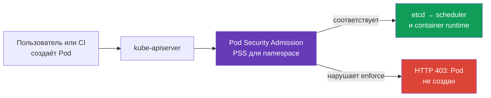
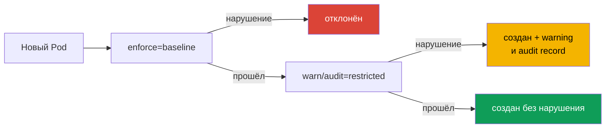

<!-- Standalone RU release: ссылки на переводы удалены, потому что соответствующие файлы не входят в архив. -->

# Глава 19. Pod Security Admission и Pod Security Standards

> **Что дальше.** `securityContext` описывает, с какими правами *должен* работать конкретный Pod, но сам по себе не запрещает другому манифесту запросить `privileged: true`, `hostPath` или host namespaces. **Pod Security Admission (PSA)** - встроенный admission-контроллер Kubernetes, который проверяет Pod до записи в etcd и применяет к namespace готовые **Pod Security Standards (PSS)**. Это основа домена CKS **Minimize Microservice Vulnerabilities**: сначала безопасный baseline для всех workloads, затем узкие и наблюдаемые исключения.

> **Что нужно из CKA.** Поля `securityContext`, non-root запуск, capabilities и `allowPrivilegeEscalation` разобраны в [главе 20 CKA](../../../cka/course/20/ru.md). Здесь используем их как контракт, который PSA проверяет и принудительно соблюдает.

## 19.1. Зачем нужен PSA

У разработчика есть право создать Pod, а в манифесте случайно или намеренно оказывается опасная настройка:

```yaml
apiVersion: v1
kind: Pod
metadata:
  name: node-breakout
spec:
  hostPID: true
  containers:
  - name: shell
    image: busybox:1.36.1
    command: ["sh", "-c", "sleep 3600"]
    securityContext:
      privileged: true
```

Такой контейнер получает почти неограниченный доступ к ядру и устройствам ноды; вместе с `hostPID`, `hostNetwork` или `hostPath` это обычный путь от компрометации приложения к данным ноды и соседних Pod. Review YAML недостаточен: манифест может прийти из CI, Helm chart или API. Нужен контроль **на admission**, до запуска контейнера.



PSA - validating admission controller с фиксированными стандартами. Он не заменяет RBAC: RBAC отвечает, **кто** имеет право `create pods`; PSA отвечает, **какой Pod** этому пользователю разрешено создать. Он также не заменяет NetworkPolicy, seccomp, AppArmor, image scanning или policy engine: каждый контроль закрывает другой слой.

## 19.2. PSS: три уровня безопасности

Pod Security Standards определяют три cumulative-профиля. Уровень выбирают отдельно для каждого namespace.

| Профиль | Назначение | Что разрешает или требует |
|---|---|---|
| `privileged` | системные компоненты и полностью доверенные workloads | намеренно без ограничений PSA |
| `baseline` | минимально безопасный общий уровень | блокирует известные пути эскалации: privileged containers, host namespaces, hostPath, опасные capabilities и небезопасные настройки |
| `restricted` | обычные прикладные workloads в production | всё из baseline плюс строгий least privilege: non-root, `allowPrivilegeEscalation: false`, `seccomp`, drop capabilities и ограниченные volumes |

### `privileged`: не политика, а отсутствие ограничений

`privileged` полезен там, где Kubernetes-компонент действительно должен управлять нодой: CNI, CSI, node agent. Это **не** разумный default для прикладного namespace. Namespace без PSA-лейблов фактически ведёт себя как `privileged` только при стандартной конфигурации PSA, где `PodSecurityConfiguration.defaults` имеет `enforce: privileged`. Администратор кластера может задать в `defaults` `baseline` или `restricted` и их версию, поэтому effective policy всегда проверяют по namespace и конфигурации admission controller, а не по отсутствию лейбла.

Даже для системного namespace не выдавайте `privileged` прикладной команде «для починки». Сначала выясните нужную capability, volume или syscall; иначе временная отладка превращается в постоянный обход границы безопасности.

### `baseline`: отсечь очевидный breakout

`baseline` запрещает опасные механизмы, которые редко нужны приложению: `privileged: true`, `hostNetwork`, `hostPID`, `hostIPC`, `hostPath` volumes, небезопасные SELinux/AppArmor/seccomp-настройки и опасные Linux capabilities. Он подходит как переходный минимум, в том числе для namespace со старыми workloads.

Baseline не обещает, что процесс не root и не требует полного hardening `securityContext`; его задача - не допустить наиболее известных путей выхода к хосту. Для прикладного production namespace это обычно промежуточное состояние, а не конечная цель.

### `restricted`: контракт обычного приложения

`restricted` требует least privilege. Конкретные детали зависят от версии PSS, поэтому версию стандарта нужно фиксировать во время rollout, но ключевой манифест выглядит так:

```yaml
apiVersion: v1
kind: Pod
metadata:
  name: web
  namespace: payments
spec:
  securityContext:
    runAsNonRoot: true
    seccompProfile:
      type: RuntimeDefault
  containers:
  - name: web
    image: nginxinc/nginx-unprivileged:1.30.4-alpine-slim
    ports:
    - containerPort: 8080
    securityContext:
      allowPrivilegeEscalation: false
      capabilities:
        drop: ["ALL"]
```

Ниже компактная матрица для **PSS `restricted` v1.36**. Она включает `baseline`; правило для каждого container распространяется также на `initContainers` и `ephemeralContainers`, если не сказано иное.

| Контроль v1.36 | Допустимое значение или требование |
|---|---|
| Host namespaces и Windows HostProcess | `hostNetwork`, `hostPID`, `hostIPC` - только `false`/не заданы; `windowsOptions.hostProcess` - `false`/не задан |
| Privileged | `securityContext.privileged` - `false`/не задан |
| Capabilities | добавить можно только `NET_BIND_SERVICE`; обязательно `capabilities.drop: ["ALL"]` |
| Host storage и ports | `hostPath` запрещён; каждый `hostPort` - не задан/`0` или заранее определённый allowlist (встроенный PSA поддерживает только не задан/`0`) |
| AppArmor | `appArmorProfile.type` - не задан, `RuntimeDefault` или `Localhost`; legacy annotation - только `runtime/default` или `localhost/*` |
| SELinux | `type`: не задан/пустой, `container_t`, `container_init_t`, `container_kvm_t` или `container_engine_t`; `user` и `role` не задают |
| `procMount`, seccomp и sysctls | `procMount` - не задан или `Default`; seccomp явно `RuntimeDefault`/`Localhost`; sysctls - только safe allowlist v1.36: `kernel.shm_rmid_forced`, `net.ipv4.ip_local_port_range`, `net.ipv4.ip_unprivileged_port_start`, `net.ipv4.tcp_syncookies`, `net.ipv4.ping_group_range`, `net.ipv4.ip_local_reserved_ports`, `net.ipv4.tcp_keepalive_time`, `net.ipv4.tcp_fin_timeout`, `net.ipv4.tcp_keepalive_intvl`, `net.ipv4.tcp_keepalive_probes` |
| Probes и lifecycle | поля `host` в `httpGet`/`tcpSocket` probes и в `httpGet`/`tcpSocket` lifecycle hooks не задают |
| Volumes | только `configMap`, `csi`, `downwardAPI`, `emptyDir`, `ephemeral`, `persistentVolumeClaim`, `projected`, `secret` |
| APE | `allowPrivilegeEscalation: false` |
| Run as | `runAsNonRoot: true` на Pod или каждом container; `runAsUser`, если задан, не `0` |

`readOnlyRootFilesystem: true` - сильная практика защиты, но не самостоятельное требование PSS restricted. Не подменяйте им обязательные поля. Если приложению нужен порт ниже 1024, после `drop: ["ALL"]` допускается точечно вернуть `NET_BIND_SERVICE`, если это разрешает выбранная версия PSS и оправдано задачей.

**User namespaces в v1.36.** Для Linux Pod с `spec.hostUsers: false` PSA ослабляет именно проверки `runAsNonRoot` и `runAsUser` даже при `baseline`/`restricted`: root внутри отдельного user namespace сопоставлен с непривилегированным UID хоста. Это не отменяет остальные правила матрицы и не разрешает host namespaces. Не переносите это исключение на обычный Pod с `hostUsers` не заданным или `true`.

## 19.3. Режимы PSA: enforce, audit и warn

Один и тот же PSS-профиль можно применить тремя независимыми режимами. Это позволяет сначала увидеть влияние политики, а затем включить запрет.

| Режим | Результат при нарушении | Где искать сигнал |
|---|---|---|
| `enforce` | API server отклоняет create/update Pod; объект не появляется | ответ `kubectl`, CI/CD, Event/API audit |
| `audit` | Pod допускается, нарушение записывается в audit event | audit log control plane |
| `warn` | Pod допускается, клиент получает предупреждение | stderr/ответ `kubectl`, лог CI |

`warn` и `audit` **не защищают**: нарушающий Pod всё ещё запускается. Их цель - инвентаризация до перехода к `enforce`. Режимы независимы: на одном namespace можно `enforce=baseline`, но уже собирать `warn` и `audit` для `restricted`.



## 19.4. Namespace labels и версия стандарта

PSA настраивается лейблами namespace. Формат ключа:

```text
pod-security.kubernetes.io/<mode>=<level>
pod-security.kubernetes.io/<mode>-version=<version>
```

`<mode>` - `enforce`, `audit` или `warn`; `<level>` - `privileged`, `baseline` либо `restricted`. Значение версии - Kubernetes minor version, например `v1.36`, или `latest`. Для каждого режима версию можно задать отдельно.

```bash
# Сначала наблюдаем restricted, но уже запрещаем самые опасные Pod.
kubectl label namespace payments \
  pod-security.kubernetes.io/enforce=baseline \
  pod-security.kubernetes.io/enforce-version=v1.36 \
  pod-security.kubernetes.io/warn=restricted \
  pod-security.kubernetes.io/warn-version=v1.36 \
  pod-security.kubernetes.io/audit=restricted \
  pod-security.kubernetes.io/audit-version=v1.36

# После исправления рабочих нагрузок включаем реальный запрет restricted.
kubectl label namespace payments \
  pod-security.kubernetes.io/enforce=restricted \
  pod-security.kubernetes.io/enforce-version=v1.36 --overwrite
```

Лейбл применяется к **новым и обновляемым** Pod. Не ожидайте, что смена лейбла удалит уже работающие Pod: PSA не является controller, не сканирует и не исправляет существующие объекты. При изменении namespace PSA также проверяет существующие Pods для предупреждений, поэтому label change может показать workload, который надо мигрировать.

`latest` удобно для небольшого test-кластера, но в production создаёт риск: после обновления Kubernetes содержание стандарта может стать строже, и ранее работающий rollout будет отклонён. Поэтому в примерах выше версия зафиксирована на версии production-current расширения (`v1.36`). Не используйте версию выше фактической версии API server.

> **Версионная граница обучения.** Гарантированный публичный CKS curriculum ориентирован на Kubernetes `v1.34`. Матрица, user namespaces и примеры с pin `v1.36` выше - дополнительный актуальный production-контекст, а не обещание требований экзамена. Для подготовки к CKS сверяйте формулировку задания и используйте PSS `v1.34`; для работающего кластера фиксируйте его реальную поддерживаемую minor-версию.

**Version drift PSS.** Профили `baseline`/`restricted` со временем ужесточаются: например, в Kubernetes `v1.34` в Baseline/Restricted добавили ограничения host-полей в probes и lifecycle hooks. Из-за этого Pod, проходящий более старый pin (скажем, `v1.31`), может быть отклонён под более новой версией стандарта. Практичный путь миграции: зафиксировать текущую поддерживаемую версию, сначала оценить эффект в `warn`/`audit`, при необходимости сравнить со старым pin (`v1.31`) как миграционным примером, затем сознательно поднять `enforce`. Именно поэтому «работает на старой версии PSS» не значит «пройдёт на новой».

Проверка эффективной конфигурации начинается с namespace, а не с манифеста Pod:

```bash
kubectl get namespace payments --show-labels
kubectl get namespace payments -o jsonpath='{.metadata.labels}' ; echo
kubectl get namespace -L pod-security.kubernetes.io/enforce \
  -L pod-security.kubernetes.io/enforce-version \
  -L pod-security.kubernetes.io/warn \
  -L pod-security.kubernetes.io/audit
```

## 19.5. Миграция к restricted без остановки delivery

Включить `enforce=restricted` сразу на старом namespace - рискованно: Deployment не создаст новые replicas, Job не стартует, а автоскейлер или rollback окажутся заблокированы. Безопасная миграция отделяет наблюдение от запрета.

1. **Инвентаризируйте namespace и владельцев.** Найдите Pod templates у Deployments, StatefulSets, DaemonSets, Jobs и CronJobs. Исправлять надо template контроллера, не живой Pod: иначе следующая реплика снова нарушит policy.
2. **Начните с `warn=restricted` и `audit=restricted`.** Existing traffic и CI покажут нарушителей, но ничего не заблокируют. Сохраните предупреждения и audit records как список работ.
3. **Устраните нарушения в шаблонах.** Добавьте `runAsNonRoot`, seccomp, запрет эскалации, drop capabilities; замените `hostPath` допустимым volume, а привилегированную функцию - отдельным системным компонентом.
4. **Проверьте отрицательный и положительный сценарии.** Хороший Pod должен создаваться без warning; заведомо плохой - дать warning/audit до enforce и отказ после него.
5. **Переведите сначала в `enforce=baseline`, затем в `enforce=restricted`.** Оставьте `warn` и `audit` на restricted хотя бы на период rollout, чтобы видеть дрейф шаблонов.
6. **Фиксируйте PSS version.** Обновляйте её вместе с обновлением Kubernetes и повторной проверкой manifest.

Пример минимального исправления Pod template:

```yaml
spec:
  template:
    spec:
      securityContext:
        runAsNonRoot: true
        seccompProfile:
          type: RuntimeDefault
      containers:
      - name: api
        image: registry.example/api@sha256:<digest>
        securityContext:
          allowPrivilegeEscalation: false
          capabilities:
            drop: ["ALL"]
```

Если образ действительно требует root, не выключайте PSA первым действием. Проверьте `USER` в Dockerfile, ownership файлов, порт приложения и writable directories; обычно образ можно адаптировать к non-root UID и выделить `emptyDir` для `/tmp` или кеша. Исключение должно быть следствием доказанной технической необходимости, а не коротким путём вокруг migration.

## 19.6. Rejection: как читать и воспроизводить отказ

При `enforce` admission отвечает ошибкой до создания Pod. Это не `ImagePullBackOff`, не ошибка scheduler и не runtime denial: Pod может вообще не иметь UID и не появиться в `kubectl get pods`.

```bash
# В restricted namespace намеренно нарушаем policy.
kubectl -n payments run privileged-test --image=busybox:1.36.1 \
  --restart=Never \
  --overrides='{
    "spec": {
      "containers": [{
        "name": "privileged-test",
        "image": "busybox:1.36.1",
        "securityContext": {"privileged": true}
      }]
    }
  }'
```

Ожидается отказ с перечислением нарушений PodSecurity. Сообщение полезно как чеклист: оно укажет, например, `privileged`, отсутствующий `runAsNonRoot`, `allowPrivilegeEscalation`, capabilities или seccomp. Для шаблона контроллера используйте dry run до rollout, но не считайте его доказательством enforce:

```bash
# Для Deployment PSA применит warn/audit к spec.template, но не enforce.
kubectl apply --dry-run=server -f deployment.yaml

# Для проверки enforce создайте из spec.template отдельный Pod manifest
# и проверьте его в namespace с теми же PSA labels.
kubectl -n payments apply --dry-run=server -f rendered-pod.yaml
kubectl auth can-i create pods -n payments
kubectl get deployment -n payments api -o yaml
```

`--dry-run=server` выполняет admission-проверку, но не сохраняет объект. Для workload resources PSA применяет к Pod template `warn` и `audit`, однако `enforce` проверит Pod только позднее, когда его создаст controller. Поэтому успешный dry-run Deployment не доказывает, что controller-created Pod пройдёт `enforce`: проверяйте отдельный Pod из того же template либо делайте реальный rollout в изолированном test namespace с идентичными PSA labels и контролируйте `kubectl rollout status` и Events. `kubectl auth can-i` отделяет отказ RBAC от отказа PSA. Если Pod уже был создан контроллером и не стартует, сначала смотрите `kubectl describe pod` и Events: PSA-отказ происходит до запуска, а ошибка image, node, seccomp или AppArmor - позже и на другом слое.

## 19.7. Исключения: точечно, с владельцем и сроком

Некоторые системные компоненты объективно не соответствуют restricted: CNI, CSI node plugin, device plugin или диагностический агент. Выбор - не «отключить PSA для кластера», а минимальное исключение с владельцем, причиной и сроком пересмотра.

**Предпочтительный вариант - отдельный namespace и самый слабый достаточный уровень.** Например, системный DaemonSet остаётся в `kube-system` или в выделенном `platform-system` с `enforce=baseline` либо, при доказанной необходимости, `privileged`; прикладные namespace остаются `restricted`. Namespace не должен смешивать доверенный node agent и пользовательские workloads.

**Системные PSA exemptions** задаются конфигурацией admission controller, а не лейблом namespace. В `AdmissionConfiguration` для `PodSecurity` предусмотрены списки `usernames`, `runtimeClasses` и `namespaces`; исключение применяется ко всем режимам PSA. Оно обходит policy целиком, поэтому подходит только для заранее известных, доверенных компонентов под управлением платформенной команды.

```yaml
apiVersion: apiserver.config.k8s.io/v1
kind: AdmissionConfiguration
plugins:
- name: PodSecurity
  configuration:
    apiVersion: pod-security.admission.config.k8s.io/v1
    kind: PodSecurityConfiguration
    defaults:
      enforce: restricted
      enforce-version: v1.36
    exemptions:
      namespaces:
      - platform-system
      runtimeClasses:
      - trusted-sandbox
      usernames:
      - system:serviceaccount:platform-system:node-agent
```

Не копируйте этот пример в управляемый кластер вслепую: способ задания admission configuration зависит от того, кто управляет kube-apiserver. Перед добавлением exemption документируйте причину, identity/namespace, owner, компенсирующие controls и дату удаления. Не добавляйте широкую группу пользователей и не вносите прикладной namespace в исключения только потому, что один Deployment не прошёл migration.

Также не путайте exemption PSA с RBAC. Exemption не даёт право создать Pod; он лишь пропускает PSS-проверку, если RBAC уже разрешил запрос. Поэтому системный ServiceAccount должен иметь и минимальный RBAC, и узкую область exemption.

## 19.8. PSP: почему старые манифесты не работают

**PodSecurityPolicy (PSP)** был прежним механизмом ограничения Pod, но удалён из Kubernetes в версии 1.25. PSA не является API-заменой `kind: PodSecurityPolicy`: он использует три фиксированных PSS-профиля и namespace labels, а не произвольный spec PSP и RBAC `use`.

Признаки устаревшей конфигурации:

```yaml
apiVersion: policy/v1beta1
kind: PodSecurityPolicy
metadata:
  name: restricted
```

После удаления API такой объект не создаётся, а ClusterRole с `use` PSP не включает защиту. Во время migration:

- удалите из manifests и Helm charts `PodSecurityPolicy`, `policy/v1beta1` и RBAC-правила `use` на PSP;
- сопоставьте intent старой policy с PSS: стандартные требования переносите в `baseline` или `restricted` labels;
- правила, которых PSA не выражает (доверенный registry, обязательные labels, resource limits, конкретные StorageClass), перенесите в Kyverno, Gatekeeper или `ValidatingAdmissionPolicy`;
- сначала запускайте PSA в `warn`/`audit`, потому что PSP и PSA отличаются по semantics и области действия;
- после cutover проверьте, что admission controller включён, labels назначены и старые cluster-wide bypass не остались.

PSA нельзя расширить собственными полями. Это преимущество для базового hardening: поведение стандартизировано и понятно на экзамене и в incident response. Для правил организации используйте policy engine **в дополнение**, а не вместо PSS.

## 19.9. Операционный чеклист и проверка

Проверка PSA должна доказывать и конфигурацию, и результат:

```bash
NS=payments

# 1. Назначенный уровень и pin версии.
kubectl get ns "$NS" -o jsonpath='{.metadata.labels}{"\n"}'

# 2. Прямой безопасный Pod проходит server-side admission, включая enforce.
kubectl -n "$NS" apply --dry-run=server -f restricted-pod.yaml

# 3. Прямой нарушающий Pod получает warning/audit либо rejection - согласно режиму.
kubectl -n "$NS" apply --dry-run=server -f privileged-pod.yaml

# 4. Для Deployment server dry-run показывает warn/audit для spec.template,
# но enforce подтвердит только Pod. Проверяйте rendered Pod или rollout в test namespace.
kubectl -n "$NS" apply --dry-run=server -f deployment.yaml
kubectl -n "$NS" apply --dry-run=server -f rendered-pod.yaml

# 5. Effective securityContext у созданного Pod.
kubectl -n "$NS" get pod web -o jsonpath='{.spec.securityContext}{"\n"}'
kubectl -n "$NS" get pod web -o jsonpath='{.spec.containers[*].securityContext}{"\n"}'
```

| Наблюдение | Вероятная причина | Действие |
|---|---|---|
| `privileged` Pod прошёл в supposedly restricted namespace | нет/ошибка лейбла `enforce`, Pod exempt, или проверяется другой namespace | покажите labels namespace, creator и admission configuration |
| CI видит warning, но deployment всё же создался | работает `warn` или `audit`, а не `enforce` | это ожидаемая фаза migration; не называйте её защитой |
| Новый rollout отвергнут, старые Pods работают | PSA не удаляет существующие Pods, но проверяет новые | исправьте template контроллера и повторите rollout |
| `kubectl apply` отвечает Forbidden, Pod не создан | PSA или RBAC отказал до persistence | сравните текст ошибки с `auth can-i` и labels namespace |
| System component сломан после restricted | компоненту нужен допустимый отдельный namespace или узкое exemption | не ослабляйте прикладной namespace; зафиксируйте исключение |

Для observability собирайте audit logs API server и метрики PSA `pod_security_evaluations_total`, `pod_security_errors_total` и `pod_security_exemptions_total`, если они доступны в вашей дистрибуции. Первая показывает результаты проверок, вторая - ошибки проверки, третья - применения exemption; разрез по labels метрик, включая `decision`, `mode` и policy, показывает, какие команды и workloads ещё не готовы к следующему уровню. В CI добавьте `kubectl apply --dry-run=server` прямого Pod против test namespace с теми же PSA-лейблами, что и production; template workload дополнительно проверяйте реальным rollout там же.

## 19.10. Как это применяют в продакшене

- **restricted по умолчанию для приложений.** Создавайте namespace через шаблон/IaC уже с pinned `enforce=restricted`; не оставляйте безопасность на усмотрение каждого chart.
- **Предупреждение перед запретом.** Новый PSS level начинается с `warn` и `audit`, потом становится `enforce`; так политика не превращает плановый rollout в инцидент.
- **Границы системных компонентов.** CNI/CSI и node agents изолированы от бизнес-workloads отдельными namespaces, ServiceAccounts и RBAC. `privileged` не распространяется на всю платформу.
- **Исключение - временный security debt.** У него есть владелец, тест, ticket, компенсирующие controls и дата удаления. Exemption не является способом «починить» образ, который можно сделать non-root.
- **PSA плюс policy engine.** PSA держит известный PSS-baseline; Kyverno/Gatekeeper или встроенная CEL policy добавляют требования организации: допустимые registries, image digest, labels, `requests`/`limits` и ограничения Service/Ingress.

## 19.11. Как это пригодится: на экзамене и в реальной работе

На экзамене CKS важно быстро отличить отказ PSA от проблем RBAC, scheduler или container runtime: проверьте PSA-лейблы namespace, примените манифест через `kubectl apply --dry-run=server` и прочитайте перечень нарушений в admission error. Умейте назначить `enforce`, `warn` и `audit`, зафиксировать версию PSS и исправить именно template контроллера.

В реальной работе эти же шаги позволяют переводить namespace к `restricted` без остановки delivery: сначала собрать нарушения через `warn`/`audit`, затем исправить шаблоны и только после проверки включить `enforce`. Отдельные системные компоненты изолируйте в специальных namespace с минимально необходимым уровнем, а каждое exemption документируйте владельцем и сроком удаления.

## 19.12. Мини-глоссарий

- **PSA (Pod Security Admission)** - встроенный validating admission controller для PSS.
- **PSS (Pod Security Standards)** - готовые профили безопасности Pod: `privileged`, `baseline`, `restricted`.
- **`enforce`** - режим PSA, который отклоняет нарушающий Pod.
- **`audit`** - режим, записывающий нарушение в audit log без отклонения Pod.
- **`warn`** - режим, возвращающий warning клиенту без отклонения Pod.
- **PSS version** - версия стандарта для конкретного PSA mode; pin защищает rollout от неожиданной смены правил после upgrade.
- **exemption** - bypass PSA для заранее доверенной namespace, username или RuntimeClass; не даёт RBAC-права.
- **PSP (PodSecurityPolicy)** - удалённый в Kubernetes 1.25 предшественник PSA.

## 19.13. Итоги главы

- PSA проверяет Pod до записи в etcd; он дополняет RBAC и `securityContext`, но не заменяет другие security controls.
- PSS даёт три профиля: `privileged` без ограничений, `baseline` против явных node-breakout путей, `restricted` для non-root приложения с least privilege; отсутствие namespace labels означает `privileged` только при стандартных PSA defaults.
- `enforce`, `audit` и `warn` независимы и задаются namespace labels `pod-security.kubernetes.io/<mode>`; к каждому можно добавить `<mode>-version`.
- Надёжная migration идёт от `warn`/`audit` к `enforce=baseline`, затем к `enforce=restricted`, с исправлением templates, а не живых Pod.
- Rejection PSA происходит до создания Pod. Проверяйте labels namespace, effective defaults, прямой Pod через server-side dry run, RBAC и текст admission error; успешный dry-run Deployment не подтверждает enforce для Pod, который позднее создаст controller.
- PSP удалён в 1.25. Его нельзя вернуть манифестом: стандартные правила переносят в PSA, а организационные - в policy engine.
- Исключения должны быть узкими, отдельными от application namespaces, документированными и временными.

## 19.14. Вопросы для самопроверки

1. Как различаются обязанности RBAC, `securityContext` и PSA?
2. Почему namespace без PSA-лейблов не стоит считать защищённым?
3. Какие три PSS-профиля существуют и когда оправдан каждый из них?
4. Чем `warn` и `audit` отличаются от `enforce`, и почему они не являются защитой?
5. Как записать label для `enforce=restricted` с зафиксированной PSS version (версией обучающего кластера)?
6. Почему перед обновлением Kubernetes лучше фиксировать PSS version, а не оставлять `latest`?
7. Почему исправляют Deployment template, а не уже созданный Pod?
8. Чем admission rejection PSA отличается от `ImagePullBackOff` и отказа RBAC?
9. Почему отдельный namespace лучше широкого exemption для CNI или CSI?
10. Что случилось с PodSecurityPolicy и чем закрывают правила, которых нет в PSS?

## Практика

Отработайте PSA и `securityContext` в [лабе 107 - PSA и SecurityContext](../../labs/107/README_RU.MD). Создайте test namespace, включите `warn=restricted` и `audit=restricted`, затем примените безопасный и заведомо привилегированный Pod. Исправьте template до чистого результата, включите `enforce=restricted` и убедитесь, что плохой Pod получает admission rejection, а хороший создаётся. После этого проверьте labels и effective `securityContext` командами из раздела 19.9.

Полезные официальные справки: [Pod Security Admission](https://kubernetes.io/docs/concepts/security/pod-security-admission/), [Pod Security Standards](https://kubernetes.io/docs/concepts/security/pod-security-standards/) и [migration from PodSecurityPolicy](https://kubernetes.io/docs/tasks/configure-pod-container/migrate-from-psp/).

---
[Оглавление](../README_RU.md) · [Глава 18](../18/ru.md) · [Глава 20](../20/ru.md)
