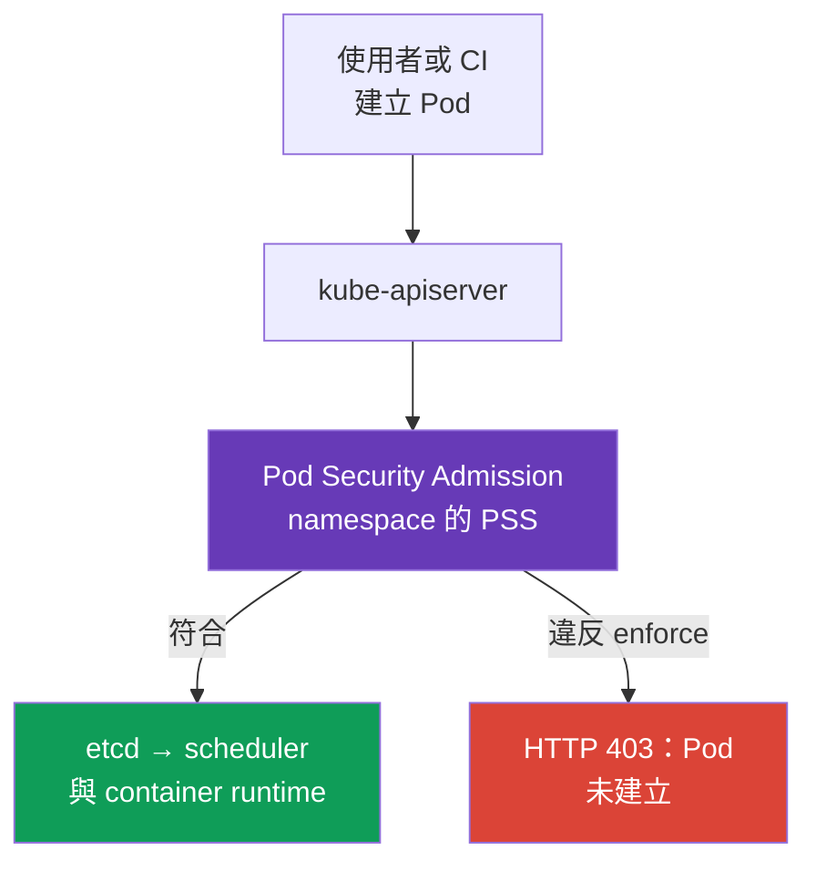
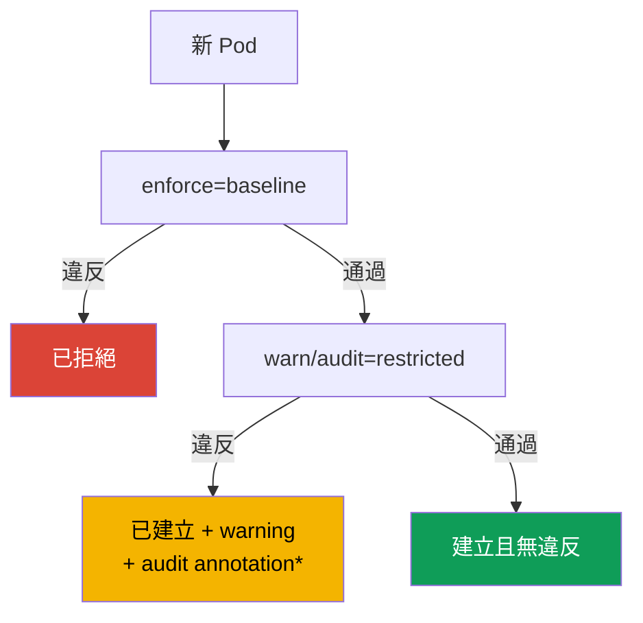

[Русская версия](ru.md) · [Eng version](README.md) · [Versión en español](es.md) · [Version française](fr.md) · [Deutsche Version](de.md) · [ქართული ვერსია](ge.md) · [日本語版](jp.md)

# 第 19 章：Pod Security Admission 與 Pod Security Standards

> **問題。** 具有 `create pods` 權限的 developer、遭入侵的 CI，或 Helm chart，可能送出 RBAC 允許的
> manifest，其中包含 `privileged: true`、`hostPath: /` 或 host namespace。即使個別 workload 有良好的
> `SecurityContext`，這樣的 Pod 仍會讓 process 取得通往 node data 與 kernel 的路徑。需要一條共用的
> admission boundary，在啟動前對 namespace 中的所有 Pod 強制執行安全 baseline。

> **接下來。** `securityContext` 描述特定 Pod *應*以何種權限執行，但本身無法阻止其他 manifest 請求
> `privileged: true`、`hostPath` 或 host namespaces。**Pod Security Admission (PSA)** 是 Kubernetes
> 內建的 admission controller，在 Pod 寫入 etcd 前檢查它，並對 namespace 套用現成的
> **Pod Security Standards (PSS)**。這是 CKS **Minimize Microservice Vulnerabilities** 領域的基礎：
> 先為所有 workloads 建立安全 baseline，再建立狹窄且可觀察的 exceptions。

> **需要從 CKA 了解的內容。** `securityContext` 欄位、non-root 執行、capabilities 和
> `allowPrivilegeEscalation` 請見 [CKA 第 20 章](../../../cka/course/20/tw.md)。這裡將它們視為 PSA
> 檢查與強制執行的 contract。

> 🧠 PSA 在 admission 評估 Pod，RBAC 決定建立物件的權限；PSS `privileged`、`baseline` 與 `restricted` 無法取代 runtime hardening、network 或 scan。

## 19.1. 為什麼需要 PSA

Developer 有建立 Pod 的權限，而 manifest 中可能意外或故意出現危險設定：

```yaml
apiVersion: v1
kind: Pod
metadata:
  name: node-breakout
spec:
  hostPID: true
  containers:
  - name: shell
    image: busybox:1.36.1
    command: ["sh", "-c", "sleep 3600"]
    securityContext:
      privileged: true
```

這類 container 幾乎可無限制存取 node kernel 與 devices；與 `hostPID`、`hostNetwork` 或 `hostPath` 結合時，
它是從 application compromise 通往 node data 與相鄰 Pod 的常見路徑。Review YAML 不夠：manifest 可能來自
CI、Helm chart 或 API。必須在**admission** 時、container 啟動前進行控制。



PSA 是具有固定 standards 的 validating admission controller。它不會取代 RBAC：RBAC 回答**誰**有權
`create pods`；PSA 回答該使用者可以建立**哪種 Pod**。它也不會取代 NetworkPolicy、seccomp、AppArmor、
image scanning 或 policy engine：每項 control 關閉不同層次。

## 19.2. PSS：三個安全層級

Pod Security Standards 定義三種 cumulative profiles。每個 namespace 可各自選擇層級。

| Profile | 用途 | 允許或要求的內容 |
|---|---|---|
| `privileged` | system components 與完全受信任 workloads | 有意不設 PSA restrictions |
| `baseline` | 最低限度的安全通用層級 | 阻止已知 escalation paths：privileged containers、host namespaces、hostPath、危險 capabilities 與不安全設定 |
| `restricted` | production 中一般 application workloads | 包含 baseline 的一切，加上嚴格 least privilege：non-root、`allowPrivilegeEscalation: false`、`seccomp`、drop capabilities 與受限 volumes |

### `privileged`：不是 policy，而是沒有限制

`privileged` 適用於 Kubernetes component 確實須管理 node 的位置：CNI、CSI、node agent。它**不是**
application namespace 的合理 default。沒有 PSA labels 的 namespace，僅在 PSA 標準 configuration
（`PodSecurityConfiguration.defaults` 包含 `enforce: privileged`）下才實際如同 `privileged`。Cluster
administrator 可以在 `defaults` 中設定 `baseline` 或 `restricted` 及其版本，因此 effective policy 應始終
由 namespace 與 admission controller configuration 確認，而非只從缺少 label 推論。

即使是 system namespace，也不要為了「修正問題」而把 `privileged` 授予 application team。先找出所需的
capability、volume 或 syscall；否則暫時 debug 會變成長期繞過 security boundary。

### `baseline`：阻斷顯而易見的 breakout

`baseline` 禁止 applications 很少需要的危險機制：`privileged: true`、`hostNetwork`、`hostPID`、`hostIPC`、
`hostPath` volumes、不安全的 SELinux/AppArmor/seccomp settings 和危險 Linux capabilities。它適合作為
過渡期的最低標準，包括具有 legacy workloads 的 namespace。

Baseline 不保證 process 不是 root，也不要求完整 hardening `securityContext`；它的工作是防止最常見的
host breakout paths。對 application production namespace 而言，這通常是中間狀態而非最終目標。

### `restricted`：一般 application 的 contract

`restricted` 要求 least privilege。具體細節依 PSS version 而定，因此 rollout 時須固定 standard version，
但關鍵 manifest 如下：

```yaml
apiVersion: v1
kind: Pod
metadata:
  name: web
  namespace: payments
spec:
  securityContext:
    runAsNonRoot: true
    seccompProfile:
      type: RuntimeDefault
  containers:
  - name: web
    image: nginxinc/nginx-unprivileged:1.30.4-alpine-slim
    ports:
    - containerPort: 8080
    securityContext:
      allowPrivilegeEscalation: false
      capabilities:
        drop: ["ALL"]
```

下方是 **PSS `restricted` v1.36** 的精簡矩陣。它包含 `baseline`；除非另有說明，每個 container 的規則也
適用於 `initContainers` 與 `ephemeralContainers`。

> **⚠️ 考試使用 v1.35。** 此矩陣使用 v1.36 作為 training baseline。考試中應使用題目給定的版本、`v1.35`，
> 或不設定 `pod-security.kubernetes.io/*-version`；不要未經確認就將 `v1.36` label 複製到較舊 cluster。

| v1.36 control | 允許值或要求 |
|---|---|
| Host namespaces 與 Windows HostProcess | `hostNetwork`、`hostPID`、`hostIPC` - 僅 `false`/未設定；`windowsOptions.hostProcess` - `false`/未設定 |
| Privileged | `securityContext.privileged` - `false`/未設定 |
| Capabilities | 僅可新增 `NET_BIND_SERVICE`；必須有 `capabilities.drop: ["ALL"]` |
| Host storage 與 ports | 禁止 `hostPath`；每個 `hostPort` - 未設定/`0` 或預先定義的 allowlist（內建 PSA 僅支援未設定/`0`） |
| AppArmor | `appArmorProfile.type` - 未設定、`RuntimeDefault` 或 `Localhost`；legacy annotation - 僅 `runtime/default` 或 `localhost/*` |
| SELinux | `type`：未設定/空白、`container_t`、`container_init_t`、`container_kvm_t` 或 `container_engine_t`；不設定 `user` 與 `role` |
| `procMount`、seccomp 與 sysctls | `procMount` - 未設定或 `Default`；明確設定 seccomp 為 `RuntimeDefault`/`Localhost`；sysctls 僅限 v1.36 safe allowlist：`kernel.shm_rmid_forced`、`net.ipv4.ip_local_port_range`、`net.ipv4.ip_unprivileged_port_start`、`net.ipv4.tcp_syncookies`、`net.ipv4.ping_group_range`、`net.ipv4.ip_local_reserved_ports`、`net.ipv4.tcp_keepalive_time`、`net.ipv4.tcp_fin_timeout`、`net.ipv4.tcp_keepalive_intvl`、`net.ipv4.tcp_keepalive_probes` |
| Probes 與 lifecycle | 不設定 `httpGet`/`tcpSocket` probes 的 `host` 欄位，以及 `httpGet`/`tcpSocket` lifecycle hooks 的 `host` 欄位 |
| Volumes | 僅 `configMap`、`csi`、`downwardAPI`、`emptyDir`、`ephemeral`、`persistentVolumeClaim`、`projected`、`secret` |
| APE | `allowPrivilegeEscalation: false` |
| Run as | Pod 或每個 container 使用 `runAsNonRoot: true`；若設定 `runAsUser`，不得為 `0` |

**OS-specific 規則。** 從 PSS v1.25 開始，具有 `.spec.os.name: windows` 的 Pod 不套用 Linux 的 privilege
escalation、seccomp 與 capabilities restrictions。不要像對 Linux Pod 一樣，要求 Windows Pod 使用
`allowPrivilegeEscalation: false`、`seccompProfile` 或 `drop: ALL`；Windows HostProcess 與其他適用的
Windows controls 會個別檢查。

`readOnlyRootFilesystem: true` 是強大的 protection practice，但不是 PSS restricted 的獨立要求。不要以它
取代必填欄位。若 application 需要低於 1024 的 port，`drop: ["ALL"]` 後可有針對性地還原
`NET_BIND_SERVICE`，前提是選擇的 PSS version 允許且工作需求合理。

**v1.36 的 User namespaces。** 對 `spec.hostUsers: false` 的 Linux Pod，即使在 `baseline`/`restricted` 下，
PSA 也會僅放寬 `runAsNonRoot` 與 `runAsUser` checks：獨立 user namespace 中的 root 會對應至 unprivileged
host UID。這不會取消矩陣中的其他規則，也不允許 host namespaces。不要將此 exception 套用至 `hostUsers`
未設定或為 `true` 的一般 Pod。

> 🎯 Migration：`warn`/`audit` → `enforce`；請檢查 namespace labels/PSS version，並透過 server-side dry run 診斷 direct Pod 的 rejection。

## 19.3. PSA modes：enforce、audit 與 warn

同一 PSS profile 可透過三種獨立 modes 套用。如此可先看見 policy 的影響，再開啟拒絕。

| Mode | 違反時的結果 | 在何處找訊號 |
|---|---|---|
| `enforce` | API server 拒絕違規 create 和已由 policy check 的 update：create 不會建立新 Pod，update 不會保存變更 | `kubectl` response、CI/CD、Event/API audit |
| `audit` | Pod 被允許；PSA 對相應 audit event 加入 annotation | control-plane audit log（若已啟用） |
| `warn` | Pod 被允許，client 收到 warning | `kubectl` stderr/response、CI log |

`warn` 與 `audit` **不提供保護**：違規 Pod 仍會啟動。它們的目的是在轉為 `enforce` 前進行 inventory。
Modes 相互獨立：同一 namespace 可以 `enforce=baseline`，同時收集 `restricted` 的 `warn` 與 `audit`。

PSA `audit` 會向 Kubernetes audit event 加入 annotation，但它本身不會啟用 API audit backend，也不保證 event
會被保留。為取得 evidence，請事先確認 API auditing 已啟用、policy 記錄所需 requests/stages，且 operator
可存取選定的 audit sink；否則應使用 `warn`、server-side dry run 與 PSA metrics 作為額外訊號。不是每個既有
Pod 的 update 都會再次進行 policy check：metadata-only updates（deprecated seccomp/AppArmor annotations 除外），
以及對 `.spec.activeDeadlineSeconds` 和 `.spec.tolerations` 的有效變更均被排除。



*僅在 Kubernetes API auditing 已啟用，且 audit policy/backend 保存對應 event 時，才能觀察到 audit record。*

## 19.4. Namespace labels 與 standard version

PSA 以 namespace labels 設定。Key format：

```text
pod-security.kubernetes.io/<mode>=<level>
pod-security.kubernetes.io/<mode>-version=<version>
```

`<mode>` 為 `enforce`、`audit` 或 `warn`；`<level>` 為 `privileged`、`baseline` 或 `restricted`。Version
value 是 Kubernetes minor version（例如 `v1.36`）或 `latest`。每個 mode 可分別設定 version。

PSA labels 是 security boundary 的一部分。具有在 application namespace 建立 workloads 權限的 identity，
不應自動同時擁有對 `Namespace` 的 `create`、`patch` 或 `update` 權限：變更或刪除 PSA labels，即會變更
套用的 policy。

```bash
# 先觀察 restricted，但已禁止最危險的 Pod。
kubectl label namespace payments \
  pod-security.kubernetes.io/enforce=baseline \
  pod-security.kubernetes.io/enforce-version=v1.36 \
  pod-security.kubernetes.io/warn=restricted \
  pod-security.kubernetes.io/warn-version=v1.36 \
  pod-security.kubernetes.io/audit=restricted \
  pod-security.kubernetes.io/audit-version=v1.36

# 修正 workloads 後，開啟真正的 restricted 拒絕。
kubectl label namespace payments \
  pod-security.kubernetes.io/enforce=restricted \
  pod-security.kubernetes.io/enforce-version=v1.36 --overwrite
```

PSA 會對新的 Pod，以及屬於其 policy checks 的 update 套用 policy。不要預期變更 label 會移除已在執行的
Pod：PSA 不是 controller，也不會修正現有 objects。當 namespace 的 `enforce` level 或 version label 改變時，
PSA 會檢查現有 Pod 並回傳違規 warnings；這是 migration signal，而非自動刪除。不是每項 namespace 變更都會
觸發這項檢查。

`latest` 對小型 test cluster 很方便，但在 production 有風險：Kubernetes 升級後，standard 內容可能變得更嚴格，
先前正常的 rollout 可能遭拒。因此，本章的學習範例將 version 固定為 `v1.36` - 課程及 core labs 的
**training baseline**。針對自己的 production cluster，選擇符合其實際 API server version 的 PSS pin；
不要使用高於它的 version。

> **Training、exam 與 production 的 version boundary。** 相關 curriculum file 目前名稱為
> `CKS_Curriculum v1.34`；這是學習文件版本，而不是 runtime version。課程與 core labs 的 training baseline
> 是 Kubernetes `v1.36`，故上方 labels 與矩陣使用 `v1.36`。本課程固定快照中的 CKS exam environment 為
> Kubernetes `v1.35`；嘗試前請在 ExamUI 確認實際 version。Production 的 PSS version 始終依特定 cluster
> 的 API server version 選擇：學習用 pin `v1.36` 並非 exam requirements 的承諾，也不是未來「永遠使用
> v1.36」的建議。

**PSS version drift。** `baseline`/`restricted` profiles 會隨時間變得更嚴格：例如 Kubernetes `v1.34`
在 Baseline/Restricted 新增 probes 與 lifecycle hooks host fields 的 restrictions。因此，通過較舊 pin（例如
`v1.31`）的 Pod，可能在較新的 standard version 下遭拒。實用 migration path 是：固定目前受支援 version，
先在 `warn`/`audit` 評估影響，必要時將舊 pin（`v1.31`）作為 migration 範例進行比較，然後有意識地提升
`enforce`。這正是「在舊 PSS version 可運作」不等於「可通過新版本」的原因。

檢查 effective configuration 應從 namespace 而非 Pod manifest 開始：

```bash
kubectl get namespace payments --show-labels
kubectl get namespace payments -o jsonpath='{.metadata.labels}' ; echo
kubectl get namespace -L pod-security.kubernetes.io/enforce \
  -L pod-security.kubernetes.io/enforce-version \
  -L pod-security.kubernetes.io/warn \
  -L pod-security.kubernetes.io/audit
```

## 19.5. 不停止 delivery 地遷移至 restricted

直接在 legacy namespace 開啟 `enforce=restricted` 有風險：Deployment 無法建立新 replicas、Job 無法啟動，
autoscaler 或 rollback 也會被阻擋。安全 migration 應將觀察與拒絕分開。

1. **盤點 namespace 與 owners。** 找出 Deployments、StatefulSets、DaemonSets、Jobs 與 CronJobs 的
   Pod templates。應修正 controller template，而非正在執行的 Pod：否則下一個 replica 仍會違反 policy。
2. **從 `warn=restricted` 與 `audit=restricted` 開始。** Existing traffic 與 CI 會顯示違規者，但不會阻擋
   任何內容。在依賴 audit records 前，請檢查 API audit logging 與選定 sink 的可用性；保存可取得的
   warnings/audit records 作為工作清單。
3. **修正 templates 中的違規。** 加入 `runAsNonRoot`、seccomp、禁止 escalation、drop capabilities；以允許的
   volume 取代 `hostPath`，並以獨立 system component 取代 privileged function。
4. **檢查負向與正向情境。** Good Pod 應在沒有 warning 時建立；明知不良的 Pod 應在 enforce 前產生
   warning/audit，之後則遭拒。
5. **先轉為 `enforce=baseline`，再轉為 `enforce=restricted`。** 至少在 rollout 期間，保持 `warn` 和
   `audit` 為 restricted，以看見 template drift。
6. **固定 PSS version。** 升級 Kubernetes 時，同步更新它並重新檢查 manifests。

Pod template 的最小修正範例：

```yaml
spec:
  template:
    spec:
      securityContext:
        runAsNonRoot: true
        seccompProfile:
          type: RuntimeDefault
      containers:
      - name: api
        image: registry.example/api@sha256:<digest>
        securityContext:
          allowPrivilegeEscalation: false
          capabilities:
            drop: ["ALL"]
```

若 image 確實需要 root，不要將停用 PSA 當成第一步。檢查 Dockerfile 的 `USER`、file ownership、application
port 與 writable directories；通常可將 image 調整為 non-root UID，並為 `/tmp` 或 cache 指定 `emptyDir`。
Exception 應是已證明的技術需求所產生的結果，而非繞過 migration 的捷徑。

## 19.6. Rejection：如何閱讀與重現拒絕

在 `enforce` 下，admission 會在 Pod 建立前回傳 error。這不是 `ImagePullBackOff`、scheduler error 或 runtime
denial：Pod 甚至可能沒有 UID，也不會出現在 `kubectl get pods`。

```bash
# 在 restricted namespace 中刻意違反 policy。
kubectl -n payments run privileged-test --image=busybox:1.36.1 \
  --restart=Never \
  --overrides='{
    "spec": {
      "containers": [{
        "name": "privileged-test",
        "image": "busybox:1.36.1",
        "securityContext": {"privileged": true}
      }]
    }
  }'
```

預期會收到列出 PodSecurity violations 的 rejection。訊息可作為 checklist：它會指出例如 `privileged`、
缺少 `runAsNonRoot`、`allowPrivilegeEscalation`、capabilities 或 seccomp。對 controller template，rollout 前
使用 dry run，但不要將它當作 enforce 的證明：

```bash
# 對 Deployment，PSA 會對 spec.template 套用 warn/audit，但不會 enforce。
kubectl apply --dry-run=server -f deployment.yaml

# 如要檢查 enforce，請從 spec.template 建立獨立 Pod manifest，
# 並在相同 PSA labels 的 namespace 中檢查它。
kubectl -n payments apply --dry-run=server -f rendered-pod.yaml
kubectl auth can-i create pods -n payments
kubectl get deployment -n payments api -o yaml
```

`--dry-run=server` 會執行 admission check，但不保存 object。對 workload resources，PSA 對 Pod template
套用 `warn` 與 `audit`，但只會在 controller 稍後建立 Pod 時才由 `enforce` 檢查。因此，成功的 Deployment
dry-run 無法證明 controller-created Pod 可通過 `enforce`：檢查同一 template 的獨立 Pod，或在具備相同 PSA
labels 的隔離 test namespace 中進行實際 rollout，並監看 `kubectl rollout status` 與 Events。`kubectl auth can-i`
可將 RBAC rejection 與 PSA rejection 分開。若 Pod 已由 controller 建立但未啟動，先查看 `kubectl describe pod`
及 Events：PSA rejection 發生於啟動前，而 image、node、seccomp 或 AppArmor error 較晚發生且屬於不同層次。

> 🏭 PSA exception：最小 namespace/identity scope、owner、原因、compensating controls 與移除日期。

## 19.7. Exceptions：精確指定、具備 owner 與期限

一些 system components 客觀上不符合 restricted：CNI、CSI node plugin、device plugin 或 diagnostics agent。
選擇不是「為整個 cluster 停用 PSA」，而是具有 owner、理由及 review deadline 的最小 exception。

**首選做法 - 獨立 namespace 與最弱但足夠的層級。** 例如，system DaemonSet 保留於 `kube-system` 或專用
`platform-system`，採用 `enforce=baseline`，或確有證據需要時採用 `privileged`；application namespaces 保持
`restricted`。Namespace 不應混合可信 node agent 與 user workloads。

**System PSA exemptions** 由 admission controller configuration 設定，而非 namespace label。`PodSecurity`
的 `AdmissionConfiguration` 提供 `usernames`、`runtimeClasses` 與 `namespaces` 清單；exception 會套用於所有
PSA modes。這些 dimensions 相互獨立：任一項符合（`namespace` **或** `runtimeClass` **或** `username`）即會
完全繞過 PSA。因此，不要在一項 exception 中合併多個 dimensions 並期待縮小 scope。

下方僅顯示 namespace exemption。`defaults` 完整列出；變更實際 configuration 時，保存所有現有值，僅新增
必要的窄 exception。

```yaml
apiVersion: apiserver.config.k8s.io/v1
kind: AdmissionConfiguration
plugins:
- name: PodSecurity
  configuration:
    apiVersion: pod-security.admission.config.k8s.io/v1
    kind: PodSecurityConfiguration
    defaults:
      enforce: restricted
      enforce-version: v1.36
      audit: restricted
      audit-version: v1.36
      warn: restricted
      warn-version: v1.36
    exemptions:
      usernames: []
      runtimeClasses: []
      namespaces:
      - platform-system
```

不要未經思考就將此範例複製到 managed cluster：指定 admission configuration 的方法取決於誰管理
`kube-apiserver`。加入 exemption 前，記錄理由、identity/namespace、owner、compensating controls 與移除日期。
不要新增寬泛的 user group，也不要因單一 Deployment 未通過 migration，就將 application namespace 放進
exemptions。

Username exemption 適用於特定 API request 的 identity。從 Deployment、DaemonSet 或 Job 建立的 Pod，通常由
controller 而非原始 user 建立；它的 exemption 不會傳遞至 controller-created Pod。不要為 workload exempt
controller ServiceAccounts：這可能為該 controller 建立的所有 resources bypass PSA。同時不要混淆 PSA exemption
與 RBAC。Exemption 不授予建立 Pod 的權限；它只會在 RBAC 已允許 request 時略過 PSS check。

> 🔬 `PodSecurityPolicy` 已於 Kubernetes v1.25 移除；standard restrictions 應遷移至 PSA/PSS，organizational restrictions 應遷移至 policy engine。

## 19.8. PSP：為什麼舊 manifests 無法運作

**PodSecurityPolicy (PSP)** 是先前限制 Pod 的機制，但已於 Kubernetes 1.25 移除。PSA 並不是
`kind: PodSecurityPolicy` 的 API replacement：它使用三種固定 PSS profiles 與 namespace labels，而非
自訂 PSP spec 和 RBAC `use`。

過時 configuration 的特徵：

```yaml
apiVersion: policy/v1beta1
kind: PodSecurityPolicy
metadata:
  name: restricted
```

API 移除後，這類 object 無法建立，而具有 PSP `use` 的 ClusterRole 也不會啟用 protection。Migration 時：

- 從 manifests 與 Helm charts 移除 `PodSecurityPolicy`、`policy/v1beta1` 與 PSP 的 RBAC `use` rules；
- 將舊 policy intent 對應至 PSS：standard requirements 遷移到 `baseline` 或 `restricted` labels；
- 將 PSA 無法表示的 rules（trusted registry、required labels、resource limits、特定 StorageClass）遷移至
  Kyverno、Gatekeeper 或 `ValidatingAdmissionPolicy`；
- 先以 `warn`/`audit` 執行 PSA，因 PSP 與 PSA 的 semantics 和 scope 不同；
- cutover 後，檢查 admission controller 已啟用、labels 已指定，且沒有遺留的舊 cluster-wide bypass。

PSA 無法以自訂欄位擴充。對 baseline hardening 而言這是優點：行為標準化，並在 exam 和 incident response 中
可預期。對 organization rules，使用 policy engine **作為補充**，而非取代 PSS。

> 🎯 Evidence：pinned labels、namespace 中允許與違反的**direct Pod**，以及 workload 的 effective `securityContext`。

## 19.9. Operational checklist 與驗證

PSA validation 必須同時證明 configuration 與結果：

```bash
NS=payments
SUBJECT='system:serviceaccount:payments:ci'  # 正在檢查的 identity

# PSA labels 是 security boundary：workload creator 不應自行變更 namespace policy。
kubectl auth can-i create pods -n "$NS" --as="$SUBJECT"
kubectl auth can-i create namespaces --as="$SUBJECT"
kubectl auth can-i patch namespaces/"$NS" --as="$SUBJECT"
kubectl auth can-i update namespaces/"$NS" --as="$SUBJECT"

# 1. 指定的 level 與 version pin。
kubectl get ns "$NS" -o jsonpath='{.metadata.labels}{"\n"}'

# 2. Direct safe Pod 通過 server-side admission，包括 enforce。
kubectl -n "$NS" apply --dry-run=server -f restricted-pod.yaml

# 3. Direct violating Pod 依 mode 取得 warning/audit 或 rejection。
kubectl -n "$NS" apply --dry-run=server -f privileged-pod.yaml

# 4. 對 Deployment，server dry-run 顯示 spec.template 的 warn/audit，
# 但僅 Pod 能確認 enforce。檢查 rendered Pod 或 test namespace 中的 rollout。
kubectl -n "$NS" apply --dry-run=server -f deployment.yaml
kubectl -n "$NS" apply --dry-run=server -f rendered-pod.yaml

# 5. 已建立 Pod 的 effective securityContext。
kubectl -n "$NS" get pod web -o jsonpath='{.spec.securityContext}{"\n"}'
kubectl -n "$NS" get pod web -o jsonpath='{.spec.containers[*].securityContext}{"\n"}'
```

| 觀察結果 | 可能原因 | 動作 |
|---|---|---|
| `privileged` Pod 在 supposedly restricted namespace 中通過 | `enforce` label 缺少/錯誤、Pod exempt，或檢查的是其他 namespace | 顯示 namespace labels、creator 與 admission configuration |
| CI 看見 warning，但 deployment 仍建立 | 運作的是 `warn` 或 `audit`，而非 `enforce` | 這是預期的 migration 階段；不要將其稱為 protection |
| 新 rollout 遭拒，舊 Pods 仍運作 | PSA 不移除既有 Pods，但會檢查新的 | 修正 controller template 並重試 rollout |
| `kubectl apply` 回覆 Forbidden，Pod 未建立 | PSA 或 RBAC 在 persistence 前拒絕 | 將 error text 與 `auth can-i` 和 namespace labels 比較 |
| System component 在 restricted 後故障 | component 需要允許的獨立 namespace 或窄 exemption | 不要弱化 application namespace；記錄 exception |

對 application/CI identity，預期 `create namespaces`、`patch namespaces/<application-namespace>` 和
`update namespaces/<application-namespace>` 均為 `no`。Delegated namespace creation 是獨立 privileged workflow：
PSA labels 必須由 platform control/admission policy 指定並保護。

為 observability，若你的 distribution 可用，收集 API audit logs 和 PSA metrics `pod_security_evaluations_total`、
`pod_security_errors_total` 與 `pod_security_exemptions_total`。Label sets 不同：evaluations 包含 `decision`、`mode`、
`policy_level`、`policy_version`、`request_operation`、`resource`、`subresource`；errors 包含 `fatal`、
`request_operation`、`resource`、`subresource`；exemptions 僅有 request/resource dimensions。此處不存在
`policy` label。對 `audit`/`warn`，`decision="deny"` 表示檢查的 policy 發現 violation，而非 API rejection：
僅 `mode="enforce"` 會拒絕 request。在 CI 中，對具有與 production 相同 PSA labels 的 test namespace，
加入 direct Pod 的 `kubectl apply --dry-run=server`；workload template 則在相同位置以真實 rollout 追加驗證。

> 🏭 IaC 建立帶有 pinned `enforce=restricted` 的 namespace；exceptions 以 expiry 保存，policy engine 增加 organizational rules。

## 19.10. 如何在 production 中套用

- **應用程式預設為 restricted。** 透過 template/IaC 建立已設定 pinned `enforce=restricted` 的 namespace；
  不要讓每個 chart 自行決定 security。變更 PSA labels 的權限僅保留給可信的 platform/security role。
- **禁止前先警告。** 新 PSS level 先以 `warn` 與 `audit` 開始，再成為 `enforce`；如此 policy 不會讓
  計畫的 rollout 演變為 incident。
- **System component boundaries。** CNI/CSI 和 node agents 透過獨立 namespaces、ServiceAccounts 與 RBAC，
  與 business workloads 隔離。`privileged` 不會擴展至整個 platform。
- **Exception 是暫時的 security debt。** 它具有 owner、test、ticket、compensating controls 與移除日期。
  Exemption 不是「修正」可改為 non-root 的 image 的方法。
- **PSA 加上 policy engine。** PSA 維持已知 PSS baseline；Kyverno/Gatekeeper 或內建 CEL policy 加入
  organization requirements：允許的 registries、image digest、labels、`requests`/`limits` 和 Service/Ingress restrictions。

## 19.11. 這如何派上用場：考試與實際工作

在 CKS exam 中，快速區分 PSA rejection 與 RBAC、scheduler 或 container runtime problems 很重要：檢查
namespace PSA labels，透過 `kubectl apply --dry-run=server` 套用 manifest，並閱讀 admission error 中的 violations
清單。應能設定 `enforce`、`warn` 和 `audit`、固定 PSS version，並修正正是 controller template。

在實際工作中，這些步驟可讓 namespace 遷移至 `restricted` 而不停止 delivery：先以 `warn`/`audit` 收集
violations，然後修正 templates，僅在驗證後開啟 `enforce`。將個別 system components 隔離於具備最低必要
level 的特殊 namespaces 中，並為每項 exemption 記錄 owner 與移除期限。

## 19.12. 小型詞彙表

- **PSA (Pod Security Admission)** - PSS 的內建 validating admission controller。
- **PSS (Pod Security Standards)** - 現成 Pod security profiles：`privileged`、`baseline`、`restricted`。
- **`enforce`** - 拒絕違規 Pod 的 PSA mode。
- **`audit`** - 不拒絕 Pod，並在 Kubernetes audit event 加入 violation 資訊的 PSA mode；可觀察 audit log
  需要另外啟用 API auditing 及適合的 audit policy/backend。
- **`warn`** - 對 client 回傳 warning 而不拒絕 Pod 的 mode。
- **PSS version** - 特定 PSA mode 的 standard version；pin 可保護 rollout 不受 upgrade 後規則意外變動影響。
- **exemption** - 對預先信任 namespace、username 或 RuntimeClass 的 PSA bypass；不授予 RBAC rights。
- **PSP (PodSecurityPolicy)** - 於 Kubernetes 1.25 移除的 PSA 前身。

## 19.13. 本章摘要

- PSA 在 Pod 寫入 etcd 前檢查它；它補充 RBAC 與 `securityContext`，但不會取代其他 security controls。
- PSS 提供三種 profiles：無限制的 `privileged`、針對明顯 node-breakout paths 的 `baseline`、以及提供
  non-root application least privilege 的 `restricted`；缺少 namespace labels 僅在標準 PSA defaults 下表示 `privileged`。
- `enforce`、`audit` 和 `warn` 相互獨立，並以 namespace labels `pod-security.kubernetes.io/<mode>` 設定；
  每個都可加入 `<mode>-version`。變更這些 labels 的權限會改變 security boundary，不應自動隨建立 workloads
  的權限授予。
- 可靠 migration 從 `warn`/`audit` 進入 `enforce=baseline`，再進入 `enforce=restricted`，並修正 templates，
  而不是已執行的 Pods。
- PSA rejection 發生於 Pod 建立前。檢查 namespace labels、effective defaults、透過 server-side dry run 的
  direct Pod、RBAC 及 admission error text；成功的 Deployment dry-run 不證明 controller 稍後建立的 Pod 可通過 enforce。
- PSP 已於 1.25 移除。無法透過 manifest 將它恢復：standard rules 應遷移至 PSA，organization rules 應遷移至 policy engine。
- Exceptions 必須狹窄、與 application namespaces 分離、有文件記錄且為暫時性。

## 19.14. 自我檢查問題

<details>
<summary>1. RBAC、`securityContext` 與 PSA 的責任如何不同？</summary>

RBAC 回答誰可執行 `create pods`。`securityContext` 設定特定 Pod process 的 privileges 與 restrictions，而 PSA 在寫入 etcd 前檢查 namespace 的 PSS 允許何種 Pod。它們是互補而非可互換的層次。
</details>

<details>
<summary>2. 為什麼不應將沒有 PSA labels 的 namespace 視為受保護？</summary>

在標準 PSA defaults 下，這類 namespace 實際行為如同 `privileged`，但 administrator 可設定不同 defaults。因此，缺少 labels 無法證明 effective policy。應檢查 namespace labels 與 admission controller configuration。
</details>

<details>
<summary>3. 有哪三個 PSS profiles，各自何時合理？</summary>

`privileged` 不限制 PSA Pod，僅適用於可信 system components。`baseline` 阻止已知 breakout paths，包括 privileged container、host namespaces 和 hostPath，適合作為過渡最低標準。`restricted` 為一般 production workloads 加入 non-root、APE false、seccomp 和 drop capabilities。
</details>

<details>
<summary>4. `warn` 和 `audit` 與 `enforce` 有何差異？為什麼它們不提供 protection？</summary>

`warn` 允許 Pod 並向 client 發出 warning，`audit` 對 audit event 加入 annotation 並同樣允許 Pod；可觀察的 audit evidence 需要啟用 API audit logging。只有 `enforce` 在 persistence 前拒絕違規 create 與相關 PSA update。因此前兩者用於 inventory 和 migration。
</details>

<details>
<summary>5. 如何寫出帶有固定 PSS version（訓練 cluster version）的 `enforce=restricted` label？</summary>

本章的 training baseline 使用 `pod-security.kubernetes.io/enforce=restricted` 和 `pod-security.kubernetes.io/enforce-version=v1.36`。可透過例如 `kubectl label namespace payments` 指派給 namespace。Production pin 應依實際 API server version 選擇，而非自動沿用學習值。
</details>

<details>
<summary>6. 為什麼 Kubernetes upgrade 前最好固定 PSS version，而非使用 `latest`？</summary>

PSS 會隨時間變得更嚴格：本章列舉 v1.34 新增的 probes 與 lifecycle hooks host fields restrictions。使用 `latest` 時，upgrade 可能意外拒絕先前正常的 rollout。Pin 可讓你先以 warn/audit 評估 manifests，並有意識地更新 standard。
</details>

<details>
<summary>7. 為什麼要修正 Deployment template，而非已建立的 Pod？</summary>

PSA 不會修正或移除既有 Pod，controller 會根據自己的 template 建立下一個 replica。手動修改正在執行的 Pod 不會消除下次 violation 的來源。因此，變更 Deployment、StatefulSet、Job 或 CronJob template，然後 rollout。
</details>

<details>
<summary>8. PSA admission rejection 與 `ImagePullBackOff`、RBAC denial 有何不同？</summary>

PSA 在 Pod 建立前拒絕並回傳 PSS violations 的 error；object 可能沒有 UID。`ImagePullBackOff` 和 runtime/scheduler errors 在 admission 後發生，並可在 Events 中看見。RBAC 也會在 persistence 前拒絕，但可用 response text 與 `kubectl auth can-i` 區分。
</details>

<details>
<summary>9. 為什麼對 CNI 或 CSI 使用獨立 namespace 優於寬泛 exemption？</summary>

獨立 namespace 可為 system component 指定最小必要 PSS level，而不弱化 application workloads。AdmissionConfiguration 中的 exemption 會為 namespace、username 或 RuntimeClass 的所有 PSA modes bypass PSA。因此，僅狹窄、已記錄且暫時地使用它。
</details>

<details>
<summary>10. PodSecurityPolicy 發生什麼事？PSS 沒有的 rules 如何處理？</summary>

PodSecurityPolicy 已於 Kubernetes 1.25 移除，因此舊 PSP manifests 與 RBAC `use` 不會啟用 protection。Standard requirements 遷移至 PSA `baseline` 或 `restricted`。PSS 以外的 registry、labels、limits 和其他 rules，以 Kyverno、Gatekeeper 或 ValidatingAdmissionPolicy 實作。
</details>

<details>
<summary>11. **Flashback（第 30 章）。** PSA 在 Pod 建立時只於 admission 作出一次決定。若 Pod 誠實通過 `enforce=restricted`，但 container 中的 process 稍後嘗試執行可疑動作（例如 downloaded binary），PSA 能停止它嗎？第 30 章哪一層涵蓋這個 runtime 而非 admission-time 時刻？</summary>

不能：PSA 僅在 admission 作出決定，並不觀察後續 process execution。第 30 章的 runtime security tools 涵蓋 runtime 時刻，它們會觀察 process events，並能發現或回應可疑行為。Admission 防止危險 configuration，runtime detection 則在啟動後補充它。
</details>

## 練習

在 [Lab 107 - PSA 與 SecurityContext](../../labs/107/README_TW.MD) 練習 PSA 與 `securityContext`。建立 test namespace，
啟用 `warn=restricted` 與 `audit=restricted`，接著套用安全與明知 privileged 的 Pod。將 template 修正至乾淨結果，
啟用 `enforce=restricted`，並確認不良 Pod 得到 admission rejection，而良好 Pod 可以建立。然後以第 19.9 節的
命令檢查 labels 與 effective `securityContext`。

實用的官方參考資料：[Pod Security Admission](https://kubernetes.io/docs/concepts/security/pod-security-admission/)、[Pod Security Standards](https://kubernetes.io/docs/concepts/security/pod-security-standards/) 與 [migration from PodSecurityPolicy](https://kubernetes.io/docs/tasks/configure-pod-container/migrate-from-psp/)。

---
[目錄](../README_TW.md) · [第 18 章](../18/tw.md) · [第 20 章](../20/tw.md)
