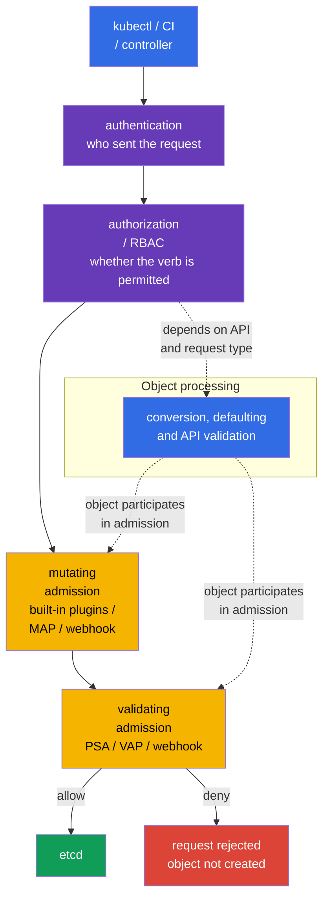

[Русская версия](ru.md) · [Versión en español](es.md) · [Version française](fr.md) · [Deutsche Version](de.md) · [ქართული ვერსია](ge.md) · [繁體中文版](tw.md) · [日本語版](jp.md)

# Chapter 20. Admission controllers and policy engines: OPA/Gatekeeper and Kyverno

> **Problem.** RBAC can legitimately allow CI to create a Deployment, but it does not verify that
> its image comes from a trusted registry, that its Pod has no dangerous fields, or that the object
> has required organizational labels. A manual YAML review is easily bypassed by a template, API
> client, or pipeline error; without policy, the object reaches etcd and starts. Admission control
> must check or safely supplement such a request before it is persisted.

> **What comes next.** Pod Security Admission from [chapter 19](../19/README.md) applies ready-made
> Pod Security Standards, but does not cover every organizational rule: whether a registry is
> permitted, an owner label is mandatory, a secure field must be added, or a related object must
> be created. Admission control is the final programmable barrier before an object is written to
> etcd. It is part of the CKS **Minimize Microservice Vulnerabilities** domain (20%): here we build
> custom rules with OPA/Gatekeeper, Kyverno, and built-in CEL.

> **What you need from CKA.** The basic request path `authentication -> authorization ->
> admission -> etcd`, ServiceAccount, and RBAC are covered in
> [CKA chapter 21](../../../cka/course/21/README.md); basic container restrictions are in
> [CKA chapter 20](../../../cka/course/20/README.md). Here we do not repeat these mechanisms, but
> turn security requirements into verifiable cluster-wide policy.

> 🧠 Admission evaluates fields of an already authorized API request before it is written to etcd; RBAC does not assess YAML security.

## 20.1. Threat model: an insecure manifest as an entry point into the cluster

RBAC answers whether an identity can create a Pod. If a developer is allowed to
`create pods`, RBAC does not inspect what is in the YAML. Consequently, the cluster can receive
a `privileged` container, `hostPath: /`, an image from an unknown registry, a Pod without
`runAsNonRoot`, or a Deployment without an owner label. Such an object can be fully authorized
by RBAC while still violating the security baseline.

Admission control receives an already authenticated and authorized request, but before persistence.
A mutating controller can supplement the object; a validating controller admits or rejects it. If
any validating stage returns a denial, the object does not appear in etcd.



Admission ordering matters: mutating controllers run before validating ones, so a validating
policy sees the resulting object. The diagram shows conversion, defaulting, and API validation as
conceptual object processing rather than one rigidly positioned stage: details depend on the API
and request type. Built-in admission plugins and webhooks have their own ordering and can be
called again after another mutating webhook changes an object. Mutation must be idempotent:
reapplying it must not add a second identical volume, label, or sidecar.

| Layer | Question | Example |
|---|---|---|
| RBAC | who may `create pods`? | CI may create Pods only in `team-a` |
| PSA | does a Pod comply with `baseline`/`restricted`? | privileged Pod is prohibited in a restricted namespace |
| custom policy | does an object comply with organizational rules? | image only from `registry.example.com`; `owner` label exists |
| mutating policy | which secure default should be added? | set `allowPrivilegeEscalation: false` |

PSA and a policy engine do not replace each other. PSA quickly and consistently applies standard
Pod restrictions. Gatekeeper, Kyverno, or CEL cover specific requirements. Do not duplicate the
same strict check in three places without a reason: denial becomes harder to diagnose, and
different messages and exceptions will drift apart.

> 🏭 `failurePolicy` defines the reaction to a **technical or evaluation error** on the admission-webhook path, not to an explicit policy decision. It applies, for example, to a timeout, TLS/DNS/Service/Pod error, malformed HTTP/AdmissionReview response, or evaluation error in `matchConditions`.
>
> The API server evaluates `matchConditions` **before** invoking the webhook. If at least one condition returns `false`, the webhook is normally skipped. If none is `false`, but at least one ends in an error, the webhook is not called: with `Fail`, the API server rejects the request; with `Ignore`, it continues without this webhook. If the webhook was successfully called and explicitly returns `allowed: false`, the request is rejected with both `Fail` and `Ignore`.
>
> With `Fail`, such a technical/evaluation error also rejects create/update: policy cannot be silently bypassed, but a webhook failure **or an error in its `matchConditions`** can stop deployment and some control-plane operations. A security-critical webhook must therefore be more reliable than one Pod: multiple replicas reduce failure risk, a PDB prevents voluntary disruption from removing all replicas at once, correct TLS provides a trusted HTTPS connection, and error/latency metrics and alerts reveal degradation before an outage.
>
> With `Ignore`, the API remains available, but during such an error the object passes **without this webhook's check** - this is a deliberate policy-bypass window, not a "softer deny" mode. A critical mature prohibition normally uses `Fail`; `Ignore` can be a temporary rollout compromise or fit a noncritical control when the bypass risk is explicitly accepted.

## 20.2. Webhook: availability is also a security decision

Gatekeeper and Kyverno usually run as admission webhooks: `kube-apiserver` sends them an
`AdmissionReview` over HTTPS, then awaits `allowed: true/false` and possible JSON patches. A
webhook has two especially important parameters in `MutatingWebhookConfiguration` or
`ValidatingWebhookConfiguration`:

| Parameter | Security meaning | Risk |
|---|---|---|
| `failurePolicy: Fail` | an error in the webhook path or `matchConditions` (when no condition is `false`) rejects the request | an engine outage or erroneous CEL condition blocks deploy and sometimes control-plane operations |
| `failurePolicy: Ignore` | on such an error, API server continues the request without this webhook check | policy-bypass window during an outage or condition error |
| `timeoutSeconds` | limits API server wait time | an excessive timeout delays every create/update |
| `namespaceSelector`/`objectSelector` | narrows webhook scope | an erroneous selector can skip a critical namespace |
| `matchPolicy` | determines API-version matching | an unexpected match can apply a rule too broadly or narrowly |

Do not blindly change `failurePolicy` on a Helm-chart-installed webhook: the chart can overwrite
the change. First ensure the engine has multiple replicas, PodDisruptionBudget, TLS, and an alert
on errors/latency. A new prohibition is safer when introduced as audit/warn, after existing
violations are remediated, and only then enforced. A critical mature rule normally uses `Fail`;
for an initial rollout, preventing a cluster outage matters more than mistaking it for proof that
protection works.

Minimal webhook configuration must explicitly define an endpoint, TLS trust, and the
`AdmissionReview` contract. For example, the validating webhook below uses a Service; the
mutating-webhook structure is analogous, but add `reinvocationPolicy: IfNeeded` or `Never` and
make mutation idempotent. `caBundle` is abbreviated here: a working manifest contains the
webhook's base64-encoded CA certificate.

```yaml
apiVersion: admissionregistration.k8s.io/v1
kind: ValidatingWebhookConfiguration
metadata:
  name: require-owner.example.com
webhooks:
- name: require-owner.example.com
  clientConfig:
    service:
      namespace: policy-system
      name: policy-webhook
      path: /validate
      port: 443
    caBundle: <base64-ca>
  rules:
  - apiGroups: [""]
    apiVersions: ["v1"]
    operations: ["CREATE", "UPDATE"]
    resources: ["pods"]
    scope: "*"
  admissionReviewVersions: ["v1"]
  sideEffects: None
  failurePolicy: Fail
  timeoutSeconds: 5
  matchPolicy: Equivalent
  namespaceSelector:
    matchLabels:
      policy.example.com/enforce-owner: "true"
  matchConditions:
  - name: skip-kube-system
    expression: "request.namespace != 'kube-system'"
```

The custom namespace label in `namespaceSelector` is part of the security boundary: an identity
subject to the rule must not have permission to remove or change it. For a fixed scope, matching
the immutable `kubernetes.io/metadata.name` is safer; only a platform/security role changes
custom enforcement labels. The same applies to `objectSelector`: a label that a user can change
on their object to leave scope is unsuitable as a deny boundary.

```bash
SUBJECT='system:serviceaccount:team-a:ci'
NS='team-a'
kubectl auth can-i patch namespaces/"$NS" --as="$SUBJECT"
kubectl auth can-i update namespaces/"$NS" --as="$SUBJECT"
# Both answers must be `no` for an application/CI identity.
```

For a mutating webhook, the same contract gains a reinvocation rule:

```yaml
apiVersion: admissionregistration.k8s.io/v1
kind: MutatingWebhookConfiguration
metadata:
  name: default-security.example.com
webhooks:
- name: default-security.example.com
  clientConfig:
    service:
      namespace: policy-system
      name: policy-webhook
      path: /mutate
    caBundle: <base64-ca>
  rules:
  - apiGroups: [""]
    apiVersions: ["v1"]
    operations: ["CREATE"]
    resources: ["pods"]
  admissionReviewVersions: ["v1"]
  sideEffects: None
  reinvocationPolicy: IfNeeded
  failurePolicy: Fail
  timeoutSeconds: 5
```

```bash
# Which webhooks are actually registered and how they behave on error.
kubectl get validatingwebhookconfigurations,mutatingwebhookconfigurations
kubectl get validatingwebhookconfiguration <name> -o yaml
kubectl -n gatekeeper-system get pods
kubectl -n kyverno get pods
```

Admission checks only an API request. It does not replace image scanning, runtime detection,
NetworkPolicy, RBAC, or audit logs. An image permitted at admission must still pass the
supply-chain checks from chapters 25-28; chapters 29-32 control an already running process.

> 🎯 Connect `ConstraintTemplate` (code/schema) to `Constraint` (scope/parameters/`enforcementAction`), then prove `dryrun` → `deny`.
>
> In this example, the template declares the `K8sRequiredLabels` type, its Rego check, and the permitted `labels` parameter; the `pods-must-have-owner` constraint is a concrete instance of this type. Follow the connection: `match` limits Pods and excluded namespaces, `parameters.labels: ["owner"]` passes the Rego requirement, and `enforcementAction` selects the response to a detected violation.
>
> Make the proof with new one-shot Pods: in `dryrun`, create a Pod without `owner`, ensure the API admits it, then wait for it to appear in `status.violations`. After patching to `deny`, try creating **another** Pod without `owner`: the API must reject it. As a positive control, a Pod with `owner` must be admitted in both modes. Do not use only an existing Pod or `--dry-run` for this: they do not prove admission and audit ran for a new object.

## 20.3. OPA/Gatekeeper: `ConstraintTemplate` and `Constraint`

**OPA** (Open Policy Agent) is an engine that can make policy decisions. **Gatekeeper** connects
it to Kubernetes admission: when someone tries to create or change an object, API server sends
the object to Gatekeeper for checking. If a rule finds a violation, Gatekeeper reports the result -
record it as an observation, warn, or reject the request. You do not need to write Rego or CEL to
read the first example; what matters first is understanding **which rule is checked, where it
applies, and what happens on violation**.

Gatekeeper splits policy into two resources. This is not duplication, but a way to write a rule
once and apply it differently:

1. `ConstraintTemplate` - the **rule template/blueprint**. It stores checking code in Rego or
   CEL, the target admission handler, and OpenAPI schema for permitted parameters. Schema checks
   parameters of the `Constraint` itself, not the Pod directly - for example, that `labels` is a
   list of strings. After the template is applied, Gatekeeper creates a CRD (Custom Resource
   Definition), registering a new resource type in the Kubernetes API for this rule.
2. `Constraint` - the **enabled rule instance**. It selects a `match` scope (which objects and
   namespaces to check), passes values through `parameters`, and sets `enforcementAction` - what
   to do on a violation. Reuse one template for different teams, namespaces, or required-label
   sets by creating a separate constraint for each case.

Remember the flow: **template defines the rule -> constraint configures and enables it -> object
creation/change falls in `match` -> Gatekeeper runs the check with `parameters` ->
`enforcementAction` determines the result**. It resembles a class and instance: a template holds
code that requires review and tests; a constraint is normally changed more often as policy scope
expands. Select one engine in one target: legacy `rego` has higher priority, and CEL
(`K8sNativeValidation`) in `code[]` has priority over Rego.

### Gatekeeper installation and quick check

Installation is performed centrally, not during an exam task. For a Helm release, first pin the
chart version in the GitOps manifest and check the values of that exact version:

```bash
helm repo add gatekeeper https://open-policy-agent.github.io/gatekeeper/charts
helm repo update
GATEKEEPER_CHART_VERSION="${GATEKEEPER_CHART_VERSION:?set exact chart version}"
helm upgrade --install gatekeeper gatekeeper/gatekeeper \
  --namespace gatekeeper-system --create-namespace \
  --version "$GATEKEEPER_CHART_VERSION"

kubectl -n gatekeeper-system get deploy,pods
kubectl get crd | grep -E 'gatekeeper|constraints.gatekeeper' 
```

The policy below requires the `owner` label on Pods outside system namespaces. It is more compact
than a `privileged` check, but demonstrates every part of the model and gives an understandable
denial.

```yaml
# Gatekeeper API for a reusable policy template.
apiVersion: templates.gatekeeper.sh/v1
# The template defines a new constraint type but does not yet enable checking.
kind: ConstraintTemplate
metadata:
  # Kubernetes template name; it normally matches the Rego package name.
  name: k8srequiredlabels
spec:
  crd:
    spec:
      names:
        # Kind of Constraint resource Gatekeeper creates from this template.
        kind: K8sRequiredLabels
      validation:
        # Schema checks Constraint spec.parameters, not the incoming Pod.
        openAPIV3Schema:
          type: object
          properties:
            labels:
              # Constraint passes the policy a list of required label keys.
              type: array
              items:
                type: string
  targets:
  # Built-in target invoked for admission create/update requests.
  - target: admission.k8s.gatekeeper.sh
    # Rego block that returns a violation when the rule is broken.
    rego: |
      # Namespace of the Rego policy.
      package k8srequiredlabels

      # Create a violation for every missing required label.
      violation[{"msg": msg}] {
        # Takes one value at a time from Constraint spec.parameters.labels.
        required := input.parameters.labels[_]
        # input.review.object is the Pod from the current admission request.
        not input.review.object.metadata.labels[required]
        # Message appears in audit status or a deny response.
        msg := sprintf("missing required label: %v", [required])
      }
---
# API and kind of the instance created by this ConstraintTemplate.
apiVersion: constraints.gatekeeper.sh/v1beta1
kind: K8sRequiredLabels
metadata:
  # Unique name of this specifically enabled policy.
  name: pods-must-have-owner
spec:
  # Audit-only: record violation but do not block Pods yet.
  enforcementAction: dryrun
  match:
    # Do not apply the rule to system namespaces.
    excludedNamespaces: ["kube-system", "gatekeeper-system", "kyverno"]
    kinds:
    # Empty API group means core/v1 API.
    - apiGroups: [""]
      # Check only Pods, not every Kubernetes object.
      kinds: ["Pod"]
  parameters:
    # Value for input.parameters.labels in Rego: owner label is required.
    labels: ["owner"]
```

#### How to read this policy

First Gatekeeper examines `match` in the `Constraint`. Here it checks only Pods and skips the
listed system namespaces; an object outside scope never reaches this rule. For every matching
create/update, Gatekeeper forms `input.review.object`: the incoming Pod in Kubernetes API form.
At the same time, it passes the constraint's `spec.parameters` into `input.parameters`. Therefore,
in this example `input.parameters.labels` equals `["owner"]`.

In Rego, a rule is a set of conditions connected by logical **AND**. Read it from the bottom up as
"create a violation if every line in the body succeeds":

- `required := input.parameters.labels[_]` iterates each required label; `_` means "the next
  array element". Here the only value is `owner`.
- `not input.review.object.metadata.labels[required]` is true when the incoming Pod has no such
  label key.
- `msg := ...` forms a clear message and `violation[{"msg": msg}]` is the special result that
  Gatekeeper considers a violation. With `dryrun`, it appears in `status.violations`; with
  `deny`, API server returns this message and does not create the Pod.

For a first policy, remember four Rego ideas: `input` is read-only input data, `:=` stores a
found value in a variable, `[_]` iterates a list, and `not` describes absence/failure of a
condition. You do not need separate `if/else`: if the rule body cannot be proven, no `violation`
is created. This policy checks the **presence** of the `owner` key; if an organization needs a
non-empty or formatted value, add a separate condition.

#### Quick exam pattern: namespace scope and disallowing `latest`

First turn a task into four fields: **what** to check (Pod and image), **where**
(`match.namespaces`), the **violation condition** (image uses `latest`), and the **response**
(`dryrun`, then `deny`). For `owner` in one namespace, no new template is needed: replace
`excludedNamespaces` in `K8sRequiredLabels` with `namespaces: ["team-a"]` and leave
`parameters.labels: ["owner"]`.

For a separate `latest` prohibition, write and apply the template below as one file. It checks
regular, init, and ephemeral containers: checking only `spec.containers` would leave a bypass.
The function treats both explicit `:latest` and an image without a tag (for example `nginx`, for
which Kubernetes implies `latest`) as violations; a digest `@sha256:...` is not latest.

```yaml
# Gatekeeper API for a template that prohibits the latest image tag.
apiVersion: templates.gatekeeper.sh/v1
# The template contains Rego; Constraint below selects its scope and response mode.
kind: ConstraintTemplate
metadata:
  # Kubernetes template name.
  name: k8sdisallowlatest
spec:
  crd:
    spec:
      names:
        # Kind of Constraint that uses this template.
        kind: K8sDisallowLatest
      validation:
        # This policy has no configurable parameters, but schema still describes an object.
        openAPIV3Schema:
          type: object
          properties: {}
  targets:
  # Attach the check to Gatekeeper's admission handler.
  - target: admission.k8s.gatekeeper.sh
    rego: |
      # Namespace of the Rego policy.
      package k8sdisallowlatest

      # Collect containers from all three PodSpec lists so a bypass is not left behind.
      pod_containers[container] {
        container := input.review.object.spec.containers[_]
      }
      pod_containers[container] {
        container := input.review.object.spec.initContainers[_]
      }
      pod_containers[container] {
        container := input.review.object.spec.ephemeralContainers[_]
      }

      # An explicit :latest tag is prohibited.
      image_uses_latest(image) {
        endswith(image, ":latest")
      }
      # An image without a tag (for example nginx) Kubernetes treats as latest; digest is allowed.
      image_uses_latest(image) {
        not contains(image, "@")
        path := split(image, "/")
        last := path[count(path) - 1]
        not contains(last, ":")
      }

      # Return a Gatekeeper violation for every container with a latest image.
      violation[{"msg": msg}] {
        container := pod_containers[_]
        image_uses_latest(container.image)
        msg := sprintf("image %q must not use the latest tag", [container.image])
      }
---
# Template instance: enables the prohibition only in the selected scope.
apiVersion: constraints.gatekeeper.sh/v1beta1
kind: K8sDisallowLatest
metadata:
  # Unique name of a policy with namespace-specific scope.
  name: pods-without-latest-in-team-a
spec:
  # Start with audit; replace with deny after verification.
  enforcementAction: dryrun
  match:
    # Scope: the policy applies only to Pods in namespace team-a.
    namespaces: ["team-a"]
    kinds:
    # Core/v1 API group.
    - apiGroups: [""]
      # Check exactly Pod admission requests.
      kinds: ["Pod"]
```

On the exam, do not first attempt to build a universal framework: use the minimum
`ConstraintTemplate`, specify exact `kind`/`match`, and one `violation` condition. Then test
negative and positive cases: in `team-a`, a Pod with `nginx:latest` must first appear in
violations, then be rejected after switching to `deny`, while a Pod with `nginx:1.27` must pass.
Check scope separately: the same attempt outside `team-a` must not match this constraint.

```bash
kubectl apply -f gatekeeper-owner.yaml
kubectl get constrainttemplates
kubectl get k8srequiredlabels
kubectl describe k8srequiredlabels pods-must-have-owner
```

`enforcementAction: dryrun` collects violations in `status.violations` but does not block a
request. After correcting existing Pods and checking scope, change it to `deny`. Some Gatekeeper
versions also support `warn`; verify the exact available actions against the installed CRD, not a
random example from another version.

```bash
kubectl get k8srequiredlabels pods-must-have-owner \
  -o jsonpath='{range .status.violations[*]}{.kind}/{.name}{": "}{.message}{"\n"}{end}'

# Only after audit and workload remediation.
kubectl patch k8srequiredlabels pods-must-have-owner --type merge \
  -p '{"spec":{"enforcementAction":"deny"}}'
```

### Gatekeeper example for dangerous `privileged`

For a security-critical prohibition, a template must check regular, `initContainers`, and
`ephemeralContainers`; otherwise one list remains a bypass path.

```rego
package k8sdisallowprivileged

violation[{"msg": msg}] {
  container := input.review.object.spec.containers[_]
  container.securityContext.privileged == true
  msg := sprintf("privileged container %q is not allowed", [container.name])
}

violation[{"msg": msg}] {
  container := input.review.object.spec.initContainers[_]
  container.securityContext.privileged == true
  msg := sprintf("privileged initContainer %q is not allowed", [container.name])
}

violation[{"msg": msg}] {
  container := input.review.object.spec.ephemeralContainers[_]
  container.securityContext.privileged == true
  msg := sprintf("privileged ephemeralContainer %q is not allowed", [container.name])
}
```

The condition `container.securityContext.privileged == true` does not match an absent field, so
the default `false` is admitted. PSA `restricted` already covers this requirement class - use
custom Rego only when you need custom scope, exemptions, or extended logic.

> 🔬 Kyverno CEL API for validation, mutation, generation, and other admission scenarios.

## 20.4. Kyverno 1.19: CEL-based policy types

> **Compatibility note.** Kyverno v1.19 officially supports Kubernetes v1.33-v1.35
> (`kyverno.io/docs/installation/releases/`, released Aug 2026). This chapter's core lab
> (Lab108) runs on Kubernetes v1.36 - a deliberate forward-looking combination that **is not**
> in Kyverno v1.19's tested and guaranteed support matrix. Installation and basic scenarios
> normally work, but this version pair is not covered by officially tested compatibility, so do
> not treat a successful installation as proof of full v1.36 support. For current-exam preparation
> (oriented to v1.35), check behavior separately on v1.35, where Kyverno v1.19 is officially
> tested. Check compatibility of third-party admission components (Kyverno, Gatekeeper, and
> equivalents) against their own release matrix separately from the course Kubernetes version.

### How to read a Kyverno CEL policy

Kyverno is a Kubernetes policy engine: its controllers and admission webhook read policy resources
from the API and respond to object operations. In the new CEL-based policy types, policy is an
ordinary YAML resource, while CEL is a short expression language inside an `expression` field. It
does not replace YAML and is not a shell script: an expression receives input data, such as
`object` - the object of the current admission request - and evaluates a value.

For a first reading, follow every example through one flow: **which operation and resource match
`matchConstraints` -> which extra conditions pass -> what the policy does**. A
`ValidatingPolicy` evaluates a Boolean expression: `true` admits an object and `false` produces a
violation; `Audit` only records it, while `Deny` rejects the request. A `MutatingPolicy` returns
an object change before persistence. A `GeneratingPolicy` asks a background controller to create
or synchronize another object after a source resource matches. Generation is therefore not an
instant admission denial.

Choose the type by result, not CEL syntax: `ValidatingPolicy` checks and, when needed, prohibits;
`MutatingPolicy` adds a secure default; `GeneratingPolicy` creates a related resource;
`DeletingPolicy` deletes by rule; `ImageValidatingPolicy` checks an image. Cluster-wide types act
in their defined scope; `Namespaced...` variants exist and act only in their namespace. Do not mix
these resources with legacy `Policy`/`ClusterPolicy`: they have another API and fields.

Starting with Kyverno 1.19, the main path is separate CEL-based cluster-wide types in group
`policies.kyverno.io/v1`: `ValidatingPolicy`, `MutatingPolicy`, `GeneratingPolicy`,
`DeletingPolicy`, and `ImageValidatingPolicy`. Each has a namespaced variant -
`NamespacedValidatingPolicy`, `NamespacedMutatingPolicy`, `NamespacedGeneratingPolicy`,
`NamespacedDeletingPolicy`, or `NamespacedImageValidatingPolicy` - which acts only in its own
namespace. Legacy `Policy` and `ClusterPolicy` (`kyverno.io/v1`) and `CleanupPolicy`
(`kyverno.io/v2`) are deprecated in 1.19 and will be removed in 1.20. Do not mix fields from the
two models in one object.

The course tested Kyverno `v1.19.x` with Helm chart `3.9.0`. After installation, verify the new
CRDs specifically and the actual controller image:

```bash
helm upgrade --install kyverno kyverno/kyverno \
  --namespace kyverno --create-namespace --version 3.9.0
kubectl get crd validatingpolicies.policies.kyverno.io \
  mutatingpolicies.policies.kyverno.io \
  generatingpolicies.policies.kyverno.io \
  deletingpolicies.policies.kyverno.io \
  imagevalidatingpolicies.policies.kyverno.io
kubectl -n kyverno get deploy -o jsonpath='{..image}'
```

### `ValidatingPolicy`: require `runAsNonRoot`

`ValidatingPolicy` changes nothing: it answers "may this object be admitted?" First the policy
matches Pod create/update, then CEL receives the Pod as `object`. The expression must return
`true`; otherwise Kyverno creates a violation with `message`. `Audit` permits the request and
collects the result for manifest remediation; after checking the actual scope, switch to `Deny`,
which rejects such a Pod. The check below requires an explicit pod-level baseline; it does not
replace full PSS `restricted`.

```yaml
# API of the new CEL-based Kyverno policy.
apiVersion: policies.kyverno.io/v1
# Validation does not change the object: it admits or records/rejects a violation.
kind: ValidatingPolicy
metadata:
  # Unique policy name in the cluster.
  name: require-pod-run-as-non-root
spec:
  # Audit-only initially: request is not blocked and violation can be studied.
  validationActions: [Audit]
  matchConstraints:
    resourceRules:
    # Core/v1 Pod; check both creation and later changes.
    - apiGroups: [""]
      apiVersions: ["v1"]
      operations: ["CREATE", "UPDATE"]
      resources: ["pods"]
  validations:
  # Expression must return true for every matching Pod.
  - message: "Pod spec.securityContext.runAsNonRoot must be true"
    expression: >-
      // has prevents access to an absent securityContext.
      has(object.spec.securityContext) &&
      // ? safely reads an optional field; absence or false yields false.
      object.spec.securityContext.?runAsNonRoot.orValue(false)
```

```bash
kubectl apply -f kyverno-run-as-non-root.yaml
kubectl get validatingpolicy require-pod-run-as-non-root
kubectl patch validatingpolicy require-pod-run-as-non-root --type merge \
  -p '{"spec":{"validationActions":["Deny"]}}'
```

### `MutatingPolicy`: transparent marking

`MutatingPolicy` does not answer "admit or reject", but "which secure default should be added to
an already admitted object?" After matching, it builds a changed object fragment and API server
persists the result. Mutation must not mask an insecure image: explicit validation is usually
better for security-critical fields. This safe instructional example adds only an audit label.
`ApplyConfiguration` means CEL constructs the desired fragment as `Object{...}`, which Kyverno
applies instead of legacy `patchStrategicMerge`:

```yaml
# API CEL-based Kyverno policy that changes an object before persistence.
apiVersion: policies.kyverno.io/v1
kind: MutatingPolicy
metadata:
  # Policy name that adds a traceable audit label.
  name: mark-kyverno-managed-pods
spec:
  matchConstraints:
    resourceRules:
    # Change only new core/v1 Pods, not every resource.
    - apiGroups: [""]
      apiVersions: ["v1"]
      operations: ["CREATE"]
      resources: ["pods"]
  mutations:
  # ApplyConfiguration applies the CEL-constructed fragment to the incoming object.
  - patchType: ApplyConfiguration
    applyConfiguration:
      expression: >-
        // Object{...} is the CEL representation of the desired Kubernetes-object fragment.
        Object{
          metadata: Object.metadata{
            // Add a label without replacing other metadata.labels.
            labels: {"security.example.com/policy": "kyverno"}
          }
        }
```

### `GeneratingPolicy`: default deny for a new Namespace

`GeneratingPolicy` responds to a source object and asks a separate background controller to
create a downstream resource. In this example, the source is a new Namespace and the result is
a `NetworkPolicy` within it. The YAML template remains readable while CEL computes and substitutes
the Namespace name. With `synchronize.enabled: true`, Kyverno continues to compare and
synchronize the generated object with the policy. This is not a claim about Kubernetes
`ownerReferences` and does not replace explicit assignment of responsibility: do not assign a
GitOps controller and Kyverno to synchronize the same object simultaneously.

```yaml
# API CEL-based policy that creates/synchronizes a downstream resource.
apiVersion: policies.kyverno.io/v1
kind: GeneratingPolicy
metadata:
  # Policy name for NetworkPolicy of a new Namespace.
  name: generate-default-deny-ingress
spec:
  evaluation:
    synchronize:
      # Background controller continues to compare generated NetworkPolicy with the template.
      enabled: true
  matchConstraints:
    resourceRules:
    # Trigger is creation of a core/v1 Namespace.
    - apiGroups: [""]
      apiVersions: ["v1"]
      operations: ["CREATE"]
      resources: ["namespaces"]
  matchConditions:
  # Do not generate policy in system namespaces.
  - name: skip-system-namespaces
    expression: >-
      !(object.metadata.name in
      ["kube-system", "kube-public", "kube-node-lease", "kyverno"])
  variables:
  # Preserve source Namespace name for use inside the YAML template.
  - name: namespaceName
    expression: object.metadata.name
  generate:
  - template:
      # Substitute CEL variable into YAML between (( ... )).
      interpolate: cel
      value: |
        apiVersion: networking.k8s.io/v1
        kind: NetworkPolicy
        metadata:
          # Fixed name of downstream NetworkPolicy.
          name: default-deny-ingress
          # Create it in the Namespace that triggered the policy.
          namespace: (( variables.namespaceName ))
          labels:
            # Makes it possible to identify the generated object's owner.
            app.kubernetes.io/managed-by: kyverno
        spec:
          # Empty selector covers every Pod in the Namespace.
          podSelector: {}
          # Default deny only ingress; define egress separately.
          policyTypes: [Ingress]
```

This is ingress default deny only. Define egress, DNS, and allowed connections in separate
`NetworkPolicy` resources - see [chapter 04](../04/README.md).

`GeneratingPolicy` is a provisioning/reconciliation mechanism, not an atomic admission barrier:
a Namespace is created before a background controller can be guaranteed to create the downstream
`NetworkPolicy`. Before handing namespace workload identity over, confirm the actual baseline,
for example with `kubectl -n <new-namespace> get networkpolicy default-deny-ingress`; existence
of `GeneratingPolicy` alone does not prove it.

Before using generation, check the permissions of the actual background-controller ServiceAccount
on the target resource. With `synchronize.enabled: true`, both read/watch and management of the
downstream resource are required; all six checks below must return `yes`:

```bash
KYVERNO_BG='system:serviceaccount:kyverno:kyverno-background-controller'
for verb in get list watch create update delete; do
  kubectl auth can-i "$verb" networkpolicies.networking.k8s.io \
    --all-namespaces --as="$KYVERNO_BG"
done
```

### Migrating legacy policy

Inventory legacy resources with
`kubectl get policies.kyverno.io,clusterpolicies.kyverno.io` (or `kubectl get pol,cpol`), and
also `CleanupPolicy`, recording behavior with positive and negative tests. Move
validate/mutate/generate/delete/image rules to the relevant new type and remove a legacy object
only after admission and background reports are verified. For production, compare the
[Kyverno migration guide](https://kyverno.io/docs/guides/migration-to-cel/) with the installed
minor version.

> 🏭 Engine selection depends on policy ownership, language, CI, and webhook; do not duplicate a deny control without a reason.

## 20.5. Gatekeeper and Kyverno: what to choose

Both engines can deny an insecure Pod, collect audit violations, and operate through an admission
webhook. The language, model, and convenience for a particular rule differ.

| Criterion | Gatekeeper / OPA | Kyverno |
|---|---|---|
| Check language | Rego or CEL in `ConstraintTemplate` | CEL and YAML templates |
| Resource model | `ConstraintTemplate` with Rego/CEL + `Constraint` | separate CEL-based policy types, including namespaced variants |
| Validate | yes | yes |
| Mutate | separate mutator resources, capabilities depend on version | `MutatingPolicy` |
| Generate | not the main scenario | `GeneratingPolicy` |
| Delete / cleanup | not the main scenario | `DeletingPolicy` |
| Complex logic and external OPA use | Rego strength | possible, but YAML is easier to read for K8s policy |
| Learning curve for a team used to Kubernetes YAML | higher | lower |

The choice does not mean the other tool is worse. If an organization already uses OPA for
Terraform, API gateway, and CI, Gatekeeper reduces the number of policy languages. If mutation,
generation, and review in familiar Kubernetes YAML are needed, Kyverno is often simpler. Do not
install both solely for identical rules: two webhooks increase latency, operational surface, and
the risk of conflicting denials. Separation of responsibility is acceptable when documented -
for example, Gatekeeper for complex Rego constraints and Kyverno for mutation and image
verification.

In both cases, policy is code: keep `ConstraintTemplate`/`Constraint` or CEL-based Kyverno
policy in Git, assign an owner and tests, apply in staging, start with audit/warn, and retain
violation evidence. Before the cluster, add a CI mini-lab with allowed and denied fixtures. For
Gatekeeper, use declarative Suite/Test/Case (`apiVersion: test.gatekeeper.sh/v1alpha1`,
`kind: Suite`), rather than direct `gator test` of a denied fixture: with a deny Constraint, a
found violation gives `gator test` exit code 1 even when policy works correctly. Test Kyverno
with `kyverno test --require-tests` so a missing test manifest does not make a pipeline green.
CI must fail if an allowed manifest is rejected or a denied manifest is admitted. An exception
must be narrow, time-limited, and visible in review - not global `excludedNamespaces: ["*"]`.

> 🏭 CI fixtures must admit the permitted object and reject the prohibited one before cluster admission.

### CI mini-lab: test policy before rollout

Positive and negative manifests must live next to policy in Git. Save the template and constraint
as `templates-and-constraints/template.yaml` and `templates-and-constraints/constraint.yaml`,
fixtures as `allowed.yaml` and `denied.yaml`, and create `suite.yaml` beside them:

```yaml
apiVersion: test.gatekeeper.sh/v1alpha1
kind: Suite
tests:
- name: require-owner
  template: templates-and-constraints/template.yaml
  constraint: templates-and-constraints/constraint.yaml
  cases:
  - name: allowed-has-owner
    object: allowed.yaml
    assertions:
    - violations: no
  - name: denied-missing-owner
    object: denied.yaml
    assertions:
    - violations: yes
```

```bash
# Both expected results give successful exit code: denied fixture must have a violation.
gator verify suite.yaml                    # or: gator verify ./...

# Kyverno: pipeline fails if kyverno-test.yaml is absent.
kyverno test --require-tests ./policy/kyverno
```

`gator verify` treats `violations: no` for allowed and `violations: yes` for denied as expected
assertions, so the job goes red only on a policy or fixture regression. Use commands and file
layout that match the pinned CLI version; a cluster-admission test remains a separate integration
CI stage.

> 🔬 Native CEL runs in API server without a webhook, but does not cover generation, reports, signature verification, or complex Rego logic.

## 20.6. Native CEL: validation and mutation without an external webhook

`ValidatingAdmissionPolicy` (VAP) and `ValidatingAdmissionPolicyBinding` provide built-in CEL
validation. In Kubernetes 1.36, `MutatingAdmissionPolicy` (MAP) and
`MutatingAdmissionPolicyBinding` became stable and enabled by default. MAP is in-process mutation
inside API server: CEL returns either `ApplyConfiguration`, merged under server-side-apply rules,
or `JSONPatch`. Both native APIs require a binding: it binds policy to scope, and policy does not
act without the binding.

VAP remains a validating-only mechanism: it neither changes nor generates objects. Together,
the VAP + MAP native stack can mutate and validate without a webhook, but it does not replace an
engine for generation, policy reports, image-signature verification, complex external data, or
Rego.

### `MutatingAdmissionPolicy`: add a secure label in limited scope

The example below applies only to Pods in namespaces labeled
`policy.example.com/native-mutation=true`. `ApplyConfiguration` is convenient for adding a field;
for precise operations on arrays or paths use `JSONPatch` with a CEL list `JSONPatch{...}`.
`spec.reinvocationPolicy` is required: `Never` does not call MAP again, while `IfNeeded` permits
re-evaluation after mutation by other admission stages. Ordering with other mutating
plugins/webhooks is not guaranteed, so mutation must be idempotent. Do not use mutation as a
replacement for required security validation.

```yaml
apiVersion: admissionregistration.k8s.io/v1
kind: MutatingAdmissionPolicy
metadata:
  name: add-native-admission-label
spec:
  failurePolicy: Fail
  reinvocationPolicy: IfNeeded
  matchConstraints:
    resourceRules:
    - apiGroups: [""]
      apiVersions: ["v1"]
      operations: ["CREATE"]
      resources: ["pods"]
  mutations:
  - patchType: ApplyConfiguration
    applyConfiguration:
      expression: >-
        Object{
          metadata: Object.metadata{
            labels: {"admission.example.com/mutated": "true"}
          }
        }
---
apiVersion: admissionregistration.k8s.io/v1
kind: MutatingAdmissionPolicyBinding
metadata:
  name: add-native-admission-label
spec:
  policyName: add-native-admission-label
  matchResources:
    namespaceSelector:
      matchLabels:
        policy.example.com/native-mutation: "true"
```

Practice must test both scope and its negative boundary. Save the YAML above as
`map-add-label.yaml`, then run:

```bash
kubectl apply -f map-add-label.yaml
kubectl create namespace native-map-on
kubectl label namespace native-map-on policy.example.com/native-mutation=true
kubectl create namespace native-map-off

cat <<'EOF' >/tmp/native-map-pod.yaml
apiVersion: v1
kind: Pod
metadata:
  name: native-map-test
spec:
  containers:
  - name: pause
    image: registry.k8s.io/pause:3.10
EOF

# Scope binding matched: server-side dry run returns the added label.
kubectl -n native-map-on create --dry-run=server -o yaml -f /tmp/native-map-pod.yaml

# Negative binding test: mutation is absent from a namespace without the selector label.
if kubectl -n native-map-off create --dry-run=server -o yaml \
  -f /tmp/native-map-pod.yaml | grep -q 'admission.example.com/mutated: "true"'; then
  echo "MAP was applied outside its intended scope"
  exit 1
fi
```

### `ValidatingAdmissionPolicy`: require effective non-root

VAP must check each process's effective setting, not only a pod-level default:
container-level `securityContext.runAsNonRoot` takes precedence. The expression below allows
container-level `true`, or absence of that field when the pod-level value is `true`, but rejects
explicit `false` and `runAsUser: 0` both at pod level and for regular, init, and ephemeral
containers.

```yaml
apiVersion: admissionregistration.k8s.io/v1
kind: ValidatingAdmissionPolicy
metadata:
  name: require-pod-run-as-non-root
spec:
  failurePolicy: Fail
  matchConstraints:
    resourceRules:
    - apiGroups: [""]
      apiVersions: ["v1"]
      operations: ["CREATE", "UPDATE"]
      resources: ["pods"]
  variables:
  - name: podRunAsNonRoot
    expression: >-
      has(object.spec.securityContext) &&
      has(object.spec.securityContext.runAsNonRoot) &&
      object.spec.securityContext.runAsNonRoot == true
  - name: allContainers
    expression: >-
      object.spec.containers +
      (has(object.spec.initContainers) ? object.spec.initContainers : []) +
      (has(object.spec.ephemeralContainers) ? object.spec.ephemeralContainers : [])
  validations:
  - expression: >-
      !has(object.spec.securityContext) ||
      !has(object.spec.securityContext.runAsUser) ||
      object.spec.securityContext.runAsUser != 0
    message: "Pod-level runAsUser: 0 is forbidden"
  - expression: >-
      variables.allContainers.all(c,
        (!has(c.securityContext) || !has(c.securityContext.runAsUser) ||
          c.securityContext.runAsUser != 0) &&
        ((has(c.securityContext) && has(c.securityContext.runAsNonRoot)) ?
          c.securityContext.runAsNonRoot == true : variables.podRunAsNonRoot)
      )
    message: "Every app, init and ephemeral container must effectively run non-root; runAsUser: 0 is forbidden"
---
apiVersion: admissionregistration.k8s.io/v1
kind: ValidatingAdmissionPolicyBinding
metadata:
  name: require-pod-run-as-non-root
spec:
  policyName: require-pod-run-as-non-root
  validationActions: ["Deny"]
  matchResources:
    namespaceSelector:
      matchLabels:
        policy.example.com/enforce-non-root: "true"
```

`object` in CEL is the object being checked; request context, `oldObject`, and binding
parameters are also available. `failurePolicy` for VAP/MAP refers to a policy-evaluation error,
not network availability: there is no external webhook here. Do not publish an untested CEL
expression with `Deny` immediately to the whole cluster: narrow the selector, start with
`Audit`/`Warn`, and test positive and negative cases.

```bash
kubectl apply -f vap-run-as-non-root.yaml
kubectl label namespace team-example policy.example.com/enforce-non-root=true
kubectl get validatingadmissionpolicy,validatingadmissionpolicybinding
kubectl get mutatingadmissionpolicy,mutatingadmissionpolicybinding
```

### Parameterized VAP: policy logic separate from a team limit

`paramKind` determines the parameter-resource type, a binding selects a particular object through
`paramRef`, and CEL receives it as `params`. Here, one `ConfigMap` limits replicas;
`matchConditions` does not evaluate policy for kubelet requests.

```yaml
apiVersion: admissionregistration.k8s.io/v1
kind: ValidatingAdmissionPolicy
metadata:
  name: deployment-replica-limit
spec:
  failurePolicy: Fail
  paramKind:
    apiVersion: v1
    kind: ConfigMap
  matchConstraints:
    resourceRules:
    - apiGroups: ["apps"]
      apiVersions: ["v1"]
      operations: ["CREATE", "UPDATE"]
      resources: ["deployments"]
  matchConditions:
  - name: exclude-kubelet
    expression: '!("system:nodes" in request.userInfo.groups)'
  variables:
  - name: limit
    expression: 'int(params.data["maxReplicas"])'
  validations:
  - expression: "params != null && object.spec.replicas <= variables.limit"
    message: "replicas exceed the team limit"
---
apiVersion: v1
kind: ConfigMap
metadata:
  name: team-a-replica-limit
  namespace: policy-system
data:
  maxReplicas: "5"
---
apiVersion: admissionregistration.k8s.io/v1
kind: ValidatingAdmissionPolicyBinding
metadata:
  name: deployment-replica-limit-team-a
spec:
  policyName: deployment-replica-limit
  validationActions: [Deny]
  paramRef:
    name: team-a-replica-limit
    namespace: policy-system
    parameterNotFoundAction: Deny
  matchResources:
    namespaceSelector:
      matchLabels:
        team: a
```

One policy can have multiple bindings and parameter resources for different teams; all matching
combinations must pass. `parameterNotFoundAction: Deny` together with `failurePolicy: Fail` does
not turn missing configuration into a bypass.

VAP performs an authorization check on the parameter resource: the matched requester must have
`read` access to `paramKind`/`paramRef`, otherwise a correct request can be rejected. Before
`Deny`, check the real identity; grant only `get`, not permission to change the parameter, and do
not store security-sensitive data in a ConfigMap that workload identities must read.

```bash
SUBJECT='system:serviceaccount:team-a:ci'
kubectl auth can-i get configmap/team-a-replica-limit   -n policy-system --as="$SUBJECT"
```

> 🔬 **Deep Dive - Manifest-Based Admission Control.** In the Kubernetes v1.36 training baseline, this feature is Alpha and disabled by default. In upstream Kubernetes v1.37, it moved to Beta and is enabled by default. The primary workflow of this chapter remains tied to v1.36; see the production-current delta in [Kubernetes v1.37 Security Delta](../APPENDIX_K8S_137_SECURITY_DELTA.md).
>
> In v1.36, enable feature gate `ManifestBasedAdmissionControlConfig`; the feature loads webhook and CEL policy manifests from the API server disk. Pass an `AdmissionConfiguration` with a separate absolute `staticManifestsDir` for the required admission plugin through `--admission-control-config-file`. Such policies are active at startup, independent from etcd, and can protect API-based admission configuration from deletion or change. This is an experimental control-plane feature: `metadata.name` of **every** static admission object in v1.36 must end in `.static.k8s.io`; an invalid static manifest during initial load can keep API server from becoming ready. Static manifests are limited to supported admission resources; policy cannot use `paramKind`, and `ValidatingAdmissionPolicyBinding` and `MutatingAdmissionPolicyBinding` prohibit `spec.paramRef`. A static webhook permits `clientConfig.url`, but not `clientConfig.service`. Every HA API server must receive identical files; do not introduce this feature without startup/reload testing and managed configuration delivery.

### Native CEL and webhook-engine comparison

| Capability | VAP | MAP + VAP native stack | Gatekeeper / Kyverno webhook |
|---|---|---|---|
| Where it runs | inside API server | inside API server | separate controller/webhook Pods |
| Webhook network failure | absent | absent | depends on availability and `failurePolicy` |
| Validate | yes | yes | yes |
| Mutate | no | yes, `ApplyConfiguration` or `JSONPatch` | Kyverno - yes; Gatekeeper - separate mutator resources |
| Generate / reports / signature verification | no | no | available depending on engine |
| Complex logic | limited to CEL and API context | limited to CEL and API context | Rego or policy-engine features |
| Lifecycle | upstream Kubernetes API | upstream Kubernetes API | separate installation, upgrade, and CRD |

Native CEL is a good first option for small, clean validation or mutation. An engine is justified
when generation, signature verification, policy reports, or a shared policy platform is needed.
Both options require scope, positive and negative tests, and a rollout plan.

> 🎯 A permitted manifest is admitted, a violating one is rejected; for mutation, compare the object with the result of server-side dry run.

## 20.7. Verification: prove allow, deny, and mutation

Policy verification is not `kubectl apply` without an error, but two controlled scenarios: a
correct object is admitted and a violating one is rejected with a clear reason. Apply these tests
only in a test namespace because `Deny` deliberately changes admission.

```bash
kubectl create namespace admission-test
kubectl label namespace admission-test policy.example.com/enforce-non-root=true

cat <<'EOF' | kubectl -n admission-test apply -f -
apiVersion: v1
kind: Pod
metadata:
  name: allowed-non-root
  labels:
    owner: platform
spec:
  securityContext:
    runAsNonRoot: true
  containers:
  - name: nginx
    image: nginxinc/nginx-unprivileged:1.30.4-alpine-slim
    securityContext:
      allowPrivilegeEscalation: false
      capabilities:
        drop: ["ALL"]
    ports:
    - containerPort: 8080
EOF

cat <<'EOF' | kubectl -n admission-test apply -f -
apiVersion: v1
kind: Pod
metadata:
  name: rejected-root-default
  labels:
    owner: platform
spec:
  containers:
  - name: nginx
    image: nginx:1.30.4
EOF
# Expected: admission webhook or ValidatingAdmissionPolicy ... denied the request
```

After `Enforce`, look for a Kyverno violation in the API response and policy report if reports
are enabled. With Gatekeeper, check Constraint `status.violations` and the denial message. For
VAP, policy/binding status and the API server denial are sufficient; for MAP, additionally compare
the object from server-side dry run to the source and check the negative scope binding.

```bash
kubectl get events -n admission-test --sort-by=.lastTimestamp
kubectl get policyreport -A 2>/dev/null || true
kubectl get k8srequiredlabels pods-must-have-owner -o yaml
kubectl get validatingadmissionpolicy require-pod-run-as-non-root -o yaml
```

If the permitted Pod is not created, first identify the denial source rather than disable every
policy: read the `kubectl` message, event, `kubectl describe`, and logs of the relevant
controller. Then verify the selector, `match`/`exclude`, namespace labels, and the actual object
after mutation. If policy did not run, check that webhook/engine is healthy, the rule covers the
API version and kind, and the test object is not excluded by namespace or label.

> 🏭 Rollout: narrow scope -> `Audit`/`dryrun`/`Warn` -> remediation -> `Deny`/`Enforce`.

## 20.8. Common errors and safe rollout

| Error | Consequence | Safe approach |
|---|---|---|
| Enable `Deny`/`Enforce` for all namespaces immediately | legacy workloads and system components are blocked | audit/warn -> violation list -> remediation -> enforcement |
| Exclude `kube-system` but not the engine's own namespace | engine can block itself | explicitly exclude only required system namespaces |
| Check only `containers` | bypass through `initContainers` or `ephemeralContainers` | cover every container list or use PSA |
| Use mutation instead of a security requirement | YAML looks safe but image/architecture remains unsuitable | mutate only secure defaults; validate mandatory invariants |
| Keep `failurePolicy: Ignore` permanently | policy is bypassed during an outage | alert, HA, controlled rollout, then deliberate `Fail` for critical rules |
| Treat `Audit` as a prohibition | violating object still starts | use `Audit` only as a migration stage |
| Create identical deny in PSA, Gatekeeper, and Kyverno at once | duplicate errors and difficult maintenance | assign one layer ownership of each requirement |
| Enable `synchronize.enabled: true` without ownership assignment | Kyverno continues synchronization while GitOps can conflict | document which controller synchronizes the resource; this is not an `ownerReferences` issue |

Before upgrading Gatekeeper/Kyverno, check CRD migration, compatibility with Kubernetes v1.36,
certificate rotation, resource requests/limits, and PDB. An admission outage is an incident:
define in advance who may temporarily narrow scope or roll back a release, and log the change
through GitOps/audit.

> 🏭 Policy as code: owner, Git review, fixtures, CI, narrow exceptions, admission metrics, and verifiable rollout.

## 20.9. How this is applied in production

- **Layers instead of a single prohibition.** PSA `restricted` establishes a broad baseline;
  custom policy adds business rules: approved registry, owner/cost labels,
  `resources.requests`, signature verification. RBAC still limits who may create objects.
- **Policy as code.** Store templates, constraints, policies, test fixtures, and exceptions in
  a repository. Code review must see both a positive and negative example, and CI must test
  policy before cluster rollout.
- **Gradual enablement.** Start with one namespace and `Audit`/`dryrun`/`Warn`, collect real
  violations, help teams remediate manifests, then enable `Enforce`/`Deny`.
- **Admission observability.** Collect webhook latency/error metrics, violation count, API server
  audit events, and alerts for absent ready replicas. Check policy after Kubernetes and engine upgrades.
- **Minimal exceptions.** Set an exception for a particular namespace, service account,
  RuntimeClass, or approved image, with an owner and expiry. Do not use a broad bypass to "fix"
  one deployment.

## 20.10. Mini-glossary

- **Admission control** - API server stage after authentication and authorization, before an
  object is written to etcd.
- **Mutating admission webhook** - webhook that adds/changes an object before validation.
- **Validating admission webhook** - webhook that admits or rejects an object.
- **OPA** - Open Policy Agent, a Rego policy engine.
- **Gatekeeper** - Kubernetes OPA policy engine with the `ConstraintTemplate` + `Constraint`
  model.
- **ConstraintTemplate** - Rego or CEL policy code and parameter schema for a new constraint type.
- **Constraint** - Gatekeeper template instance with parameters, match scope, and response.
- **Kyverno** - Kubernetes-native policy engine; in 1.19 its primary API uses
  `ValidatingPolicy`, `MutatingPolicy`, `GeneratingPolicy`, `DeletingPolicy`, and
  `ImageValidatingPolicy`, plus their namespaced variants.
- **ValidatingAdmissionPolicy** - built-in API server CEL validation without an external webhook;
  applied by a binding.
- **MutatingAdmissionPolicy** - built-in API server CEL mutation through
  `ApplyConfiguration` or `JSONPatch`; applied by a binding.
- **CEL** - Common Expression Language, expression language for ValidatingAdmissionPolicy.
- **`failurePolicy`** - API server action when webhook/policy evaluation is unavailable or ends
  with an error: normally `Fail` or `Ignore`.

## 20.11. Chapter summary

- Admission is the final barrier before etcd: mutation changes an object and validation admits
  or rejects it. RBAC answers a different question and does not replace policy.
- Gatekeeper builds policy from `ConstraintTemplate` with Rego or CEL and `Constraint` with
  scope/params; `dryrun` is useful first, then `deny`.
- Kyverno 1.19 describes validation, mutation, generation, delete/cleanup, and image
  verification in separate CEL-based policy types. Mutation is convenient for secure defaults,
  but does not replace validation.
- Gatekeeper and Kyverno are webhook engines, so their availability, TLS, replicas,
  `timeoutSeconds`, and `failurePolicy` are part of security design.
- VAP with CEL runs in API server without an external webhook and is suited only to validation.
  In Kubernetes 1.36, stable MAP adds native-stack mutation through `ApplyConfiguration` or
  `JSONPatch`, but cannot generate resources.
- Reliable rollout: small scope -> audit/warn -> violation remediation -> `Enforce`/`Deny`,
  with verification of both admitted and rejected manifests.

## 20.12. How this helps: on the exam and in real work

**On the exam.** The related public curriculum file is now called `CKS_Curriculum v1.34`, whereas
the CKS exam environment currently uses Kubernetes v1.35. These are different versions:
curriculum describes topics, while runtime determines available APIs and cluster behavior. Quickly
identify where a control resides, read `ConstraintTemplate` and `Constraint`, create/check policy,
distinguish `Audit` from `Deny`, and find the reason for `denied the request`. Do not attribute
course extensions to the exam: Kubernetes 1.36 native MAP and Kyverno 1.19 are
production-oriented additions to this chapter, not guaranteed tasks in the linked curriculum.
Before the exam, check the current Linux Foundation/CNCF publication.

**In real work.** Admission policy prevents insecure configuration before a workload starts,
rather than looking for it after an incident. Kubernetes 1.36 native MAP/VAP and Kyverno 1.19 are
useful as production extensions after checking compatibility of the particular cluster and engine.
The most valuable result is not the number of policies, but a clear, testable baseline with narrow
exceptions, observability, and assigned responsibility. This is also an entry point to
supply-chain control: the next course part applies policy to registries, signatures, and artifacts.

## 20.13. Self-check questions

<details>
<summary>1. Why cannot RBAC itself prohibit `privileged: true` for a user allowed to create a Pod?</summary>

RBAC decides whether an identity has the `create` verb for a Pod, not by inspecting YAML fields. A permitted user can submit a Pod with `privileged: true` unless validating admission applies a separate rule. PSA, VAP, Gatekeeper, or Kyverno check the object content itself before etcd.
</details>

<details>
<summary>2. In what order do mutating and validating admission run, and why must mutation be idempotent?</summary>

Mutating admission runs before validating admission, so validation sees the already changed object. Webhooks can be called again after another mutating webhook changes an object, and MAP with `IfNeeded` also permits re-evaluation. Therefore reapplying mutation must not add a second identical volume, label, or sidecar.
</details>

<details>
<summary>3. How does `ConstraintTemplate` differ from `Constraint` in Gatekeeper?</summary>

`ConstraintTemplate` defines a new policy type: Rego or CEL code, admission target, and OpenAPI parameter schema; after it is applied, Gatekeeper creates the CRD constraint kind. `Constraint` is an instance of the type with parameters, `match` scope, and `enforcementAction`. A template requires review and tests as policy code, while a constraint is normally changed when scope expands.
</details>

<details>
<summary>4. When is Kyverno `mutate` justified, and when should a requirement be expressed with `validate`?</summary>

Mutation is justified for a transparent secure default, for example adding an audit label through `ApplyConfiguration`. A critical security invariant that cannot be silently repaired requires explicit validation: it must reject the insecure object. The chapter warns specifically against using mutation to mask an insecure image or architecture.
</details>

<details>
<summary>5. Why are permanent `failurePolicy: Ignore` and premature `failurePolicy: Fail` dangerous?</summary>

With `Ignore`, an object passes this check on timeout, TLS error, or webhook unavailability, creating a policy-bypass window. `Fail` preserves the boundary under such an error, but an engine outage can halt deploy and control-plane operations. Strict mode needs replicas, PDB, TLS, latency/error alerting, and safe rollout first.
</details>

<details>
<summary>6. Why is a policy first run in `Audit`/`dryrun` rather than immediately in `Enforce`/`Deny`?</summary>

Audit/dryrun collects real violations without blocking legacy workloads and system components. Owners then remediate manifests and test scope and positive/negative scenarios. Only then is `Deny`/`Enforce` introduced as a controlled prohibition, rather than a sudden outage.
</details>

<details>
<summary>7. What are the CEL `ValidatingAdmissionPolicy` limitations compared with Kyverno?</summary>

VAP runs CEL validation inside API server and acts only through a binding; it neither changes nor generates objects. Native MAP adds mutation, but not generation, policy reports, image-signature verification, or Rego. Kyverno supplies separate CEL-based types for validate, mutate, generate, delete, and image validation, plus namespaced variants.
</details>

<details>
<summary>8. Which container lists must not be forgotten in a custom `privileged` check?</summary>

Check `containers`, `initContainers`, and `ephemeralContainers`. Checking only ordinary containers leaves a bypass through an init or debug ephemeral container. For the standard requirement class, the chapter recommends PSA `restricted`; custom Rego must explicitly cover all these lists.
</details>

<details>
<summary>9. **Flashback (chapter 04).** NetworkPolicy default deny (chapter 04) and `failurePolicy: Fail` with `enforce`/`Deny` in admission policy (this chapter) apply the same allowlist principle at different layers of the stack. State the analogy explicitly: what corresponds to "default deny for all ingress/egress" in admission policy, and what corresponds to a "narrow permitted rule"?</summary>

In admission policy, the default-deny equivalent is an enforcing rule under which an object that does not satisfy requirements is rejected, while `failurePolicy: Fail` prevents bypass when the webhook errors. The narrow-permit equivalent is exact `match`/selectors, conditions, and checked fields through which a particular valid object passes policy. As with NetworkPolicy, a broad exception destroys the allowlist model and complicates audit.
</details>

## Practice

The main practice for this topic is [CKS lab 108: Kyverno admission policies](../../labs/108/README.MD).
In it, apply policy for a trusted registry and a restricted workload, check audit and deny, and
find the cause of rejection in the admission response. An optional lab stage checks Kyverno
mutation; practice native in-process mutation separately using the
[MAP policy and binding from section 20.6](#206-native-cel-validation-and-mutation-without-an-external-webhook).
The lab's automated check runs with `check_result`.

For an independent sandbox, prepare a separate cluster or namespace: admission policy can block
system controllers. Start with `dryrun`/`Audit`, record a rollback command in advance, and do not
test `failurePolicy` by disabling a production webhook.

## Reference materials

- [Kubernetes: Admission Control](https://kubernetes.io/docs/reference/access-authn-authz/admission-controllers/)
- [Kubernetes: Validating Admission Policy](https://kubernetes.io/docs/reference/access-authn-authz/validating-admission-policy/)
- [OPA Gatekeeper documentation](https://open-policy-agent.github.io/gatekeeper/website/)
- [Kyverno documentation](https://kyverno.io/docs/)
- [Kyverno policy reports](https://kyverno.io/docs/policy-reports/)

---
[Table of contents](../README.md) · [Chapter 19](../19/README.md) · [Chapter 21](../21/README.md)
