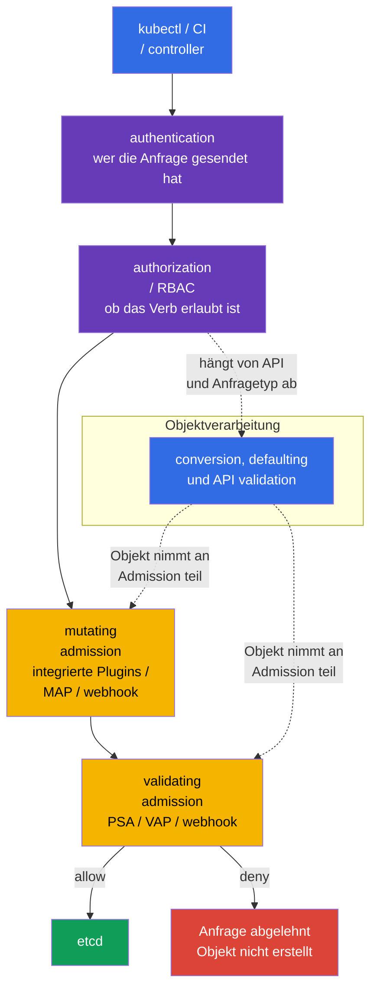

[Русская версия](ru.md) · [Eng version](README.md) · [Versión en español](es.md) · [Version française](fr.md) · [ქართული ვერსია](ge.md) · [繁體中文版](tw.md) · [日本語版](jp.md)

# Kapitel 20. Admission-Controller und Policy Engines: OPA/Gatekeeper und Kyverno

> **Problem.** RBAC kann CI rechtmäßig erlauben, ein Deployment zu erstellen, prüft aber nicht, ob das Image aus einer vertrauenswürdigen Registry stammt, der Pod keine gefährlichen Felder besitzt und das Objekt die erforderlichen organisatorischen Labels enthält. Ein manuelles YAML-Review lässt sich leicht durch ein Template, einen API-Client oder einen Fehler in der Pipeline umgehen; ohne Policy gelangt das Objekt in etcd und wird gestartet. Admission Control muss eine solche Anfrage vor ihrer Speicherung prüfen oder sicher ergänzen.

> **Was folgt.** Pod Security Admission aus [Kapitel 19](../19/de.md) wendet fertige Pod Security Standards an, deckt jedoch nicht alle organisatorischen Regeln ab: ob eine Image-Registry erlaubt ist, ein Owner-Label Pflicht ist, ein sicheres Feld ergänzt oder ein Begleitobjekt erstellt werden muss. Admission Control ist die letzte programmierbare Barriere vor dem Schreiben eines Objekts in etcd. Sie ist Teil der CKS-Domain **Minimize Microservice Vulnerabilities** (20%): Hier bauen wir eigene Regeln mit OPA/Gatekeeper, Kyverno und integriertem CEL.

> **Was Sie aus CKA benötigen.** Der grundlegende Request-Pfad `authentication -> authorization -> admission -> etcd`, ServiceAccount und RBAC werden in [CKA-Kapitel 21](../../../cka/course/21/de.md) behandelt; grundlegende Container-Einschränkungen stehen in [CKA-Kapitel 20](../../../cka/course/20/de.md). Hier wiederholen wir diese Mechanismen nicht, sondern verwandeln Sicherheitsanforderungen in überprüfbare clusterweite Policy.

> 🧠 Admission prüft die Felder einer bereits autorisierten API-Anfrage vor dem Schreiben in etcd; RBAC bewertet die Sicherheit von YAML nicht.

## 20.1. Bedrohungsmodell: ein unsicheres Manifest als Eingang in den Cluster

RBAC beantwortet, ob eine Identity einen Pod erstellen darf. Darf ein Entwickler `create pods` ausführen, prüft RBAC nicht, was genau im YAML steht. Daher können ein `privileged` Container, `hostPath: /`, ein Image aus einer unbekannten Registry, ein Pod ohne `runAsNonRoot` oder ein Deployment ohne Owner-Label in den Cluster gelangen. Ein solches Objekt kann durch RBAC vollständig autorisiert sein und dennoch die Security Baseline verletzen.

Admission Control empfängt eine bereits authentifizierte und autorisierte Anfrage, jedoch vor der Speicherung. Ein mutating Controller kann das Objekt ergänzen; ein validating Controller lässt es zu oder lehnt es ab. Gibt eine beliebige validating Stufe eine Ablehnung zurück, erscheint das Objekt nicht in etcd.



Die Admission-Reihenfolge ist wichtig: Mutating Controller laufen vor validating Controllern, sodass eine Validating Policy das resultierende Objekt sieht. Das Diagramm zeigt Conversion, Defaulting und API Validation als konzeptionelle Objektverarbeitung und nicht als eine starr positionierte Stufe: Details hängen von API und Anfragetyp ab. Integrierte Admission Plugins und Webhooks haben ihre eigene Reihenfolge und können erneut aufgerufen werden, nachdem ein anderer mutating Webhook ein Objekt geändert hat. Mutation muss idempotent sein: Eine erneute Anwendung darf kein zweites identisches Volume, Label oder Sidecar hinzufügen.

| Schicht | Frage | Beispiel |
|---|---|---|
| RBAC | wer darf `create pods`? | CI darf Pods nur in `team-a` erstellen |
| PSA | erfüllt ein Pod `baseline`/`restricted`? | privileged Pod ist in einem restricted Namespace verboten |
| Custom Policy | erfüllt ein Objekt organisatorische Regeln? | Image nur aus `registry.example.com`; Label `owner` ist vorhanden |
| Mutating Policy | welcher sichere Default soll hinzugefügt werden? | `allowPrivilegeEscalation: false` setzen |

PSA und eine Policy Engine ersetzen einander nicht. PSA wendet Standardbeschränkungen für Pods schnell und einheitlich an. Gatekeeper, Kyverno oder CEL decken spezifische Anforderungen ab. Duplizieren Sie dieselbe strikte Prüfung nicht ohne Grund an drei Stellen: Eine Ablehnung wird schwerer zu diagnostizieren, und unterschiedliche Meldungen und Ausnahmen driften auseinander.

> 🏭 `failurePolicy` definiert die Reaktion auf einen **technischen oder Evaluation-Fehler** im Admission-Webhook-Pfad, nicht auf eine explizite Policy-Entscheidung. Sie gilt beispielsweise bei Timeout, TLS-/DNS-/Service-/Pod-Fehler, fehlerhafter HTTP-/AdmissionReview-Antwort oder einem Fehler bei der Auswertung von `matchConditions`.
>
> Der API server wertet `matchConditions` **vor** dem Aufruf des Webhooks aus. Gibt mindestens eine Bedingung `false` zurück, wird der Webhook regulär übersprungen. Ist keine `false`, endet jedoch mindestens eine mit einem Fehler, wird der Webhook nicht aufgerufen: Bei `Fail` lehnt der API server die Anfrage ab, bei `Ignore` setzt er sie ohne diesen Webhook fort. Wurde der Webhook erfolgreich aufgerufen und gibt ausdrücklich `allowed: false` zurück, wird die Anfrage sowohl bei `Fail` als auch bei `Ignore` abgelehnt.
>
> Bei `Fail` lehnt ein solcher technischer/Evaluation-Fehler Create/Update ebenfalls ab: Die Policy kann nicht stillschweigend umgangen werden, aber ein Webhook-Ausfall **oder ein Fehler in seinen `matchConditions`** kann ein Deployment und Teile der Control-Plane-Operationen anhalten. Ein security-kritischer Webhook muss daher zuverlässiger als ein einzelner Pod sein: Mehrere Replicas verringern das Ausfallrisiko, ein PDB verhindert, dass ein freiwilliges Disruption alle Replicas gleichzeitig entfernt, korrektes TLS stellt eine vertrauenswürdige HTTPS-Verbindung bereit und Error-/Latency-Metriken und Alerts zeigen eine Verschlechterung vor dem Outage.
>
> Bei `Ignore` bleibt die API verfügbar, doch während eines solchen Fehlers passiert das Objekt **ohne die Prüfung dieses Webhooks** - dies ist ein bewusstes Fenster zum Umgehen der Policy, nicht ein Modus für ein "weicheres Deny". Für ein kritisches, ausgereiftes Verbot wird gewöhnlich `Fail` gewählt; `Ignore` kann beim Rollout ein temporärer Kompromiss oder für eine nicht kritische Kontrolle passend sein, wenn das Bypass-Risiko ausdrücklich akzeptiert wird.

## 20.2. Webhook: Verfügbarkeit ist ebenfalls eine Sicherheitsentscheidung

Gatekeeper und Kyverno laufen gewöhnlich als Admission Webhooks: `kube-apiserver` sendet ihnen über HTTPS ein `AdmissionReview` und wartet dann auf `allowed: true/false` sowie mögliche JSON Patches. Ein Webhook hat in `MutatingWebhookConfiguration` oder `ValidatingWebhookConfiguration` zwei besonders wichtige Parameter:

| Parameter | Bedeutung für die Sicherheit | Risiko |
|---|---|---|
| `failurePolicy: Fail` | ein Fehler im Webhook-Pfad oder in `matchConditions` (wenn keine Bedingung `false` ist) lehnt die Anfrage ab | Ausfall der Engine oder fehlerhafte CEL-Bedingung blockiert Deploy und manchmal Control-Plane-Operationen |
| `failurePolicy: Ignore` | bei einem solchen Fehler setzt der API server die Anfrage ohne diese Webhook-Prüfung fort | Fenster zum Umgehen der Policy bei einem Ausfall oder Condition-Fehler |
| `timeoutSeconds` | begrenzt die Wartezeit des API server | ein zu hoher Timeout verzögert jedes Create/Update |
| `namespaceSelector`/`objectSelector` | schränkt den Webhook-Scope ein | ein fehlerhafter Selector kann einen kritischen Namespace überspringen |
| `matchPolicy` | bestimmt das API-Version-Matching | ein unerwartetes Match kann eine Regel zu breit oder zu eng anwenden |

Ändern Sie `failurePolicy` eines durch Helm Chart installierten Webhooks nicht blind: Das Chart kann die Änderung überschreiben. Stellen Sie zuerst sicher, dass die Engine mehrere Replicas, PodDisruptionBudget, TLS und einen Alert für Fehler/Latency besitzt. Ein neues Verbot wird sicherer als Audit/Warn eingeführt, bestehende Verstöße werden korrigiert und erst danach wird Enforcement aktiviert. Eine kritische, ausgereifte Regel verwendet gewöhnlich `Fail`; bei einem ersten Rollout ist es wichtiger, einen Cluster-Outage zu vermeiden, als dies mit einem Beweis funktionierenden Schutzes zu verwechseln.

Eine minimale Webhook-Konfiguration muss Endpoint, TLS-Vertrauen und den `AdmissionReview`-Vertrag explizit definieren. Der validating Webhook unten verwendet zum Beispiel einen Service; die Struktur für einen mutating Webhook ist analog, fügen Sie jedoch `reinvocationPolicy: IfNeeded` oder `Never` hinzu und machen Sie die Mutation idempotent. `caBundle` ist hier abgekürzt: Ein funktionierendes Manifest enthält das base64-kodierte CA-Zertifikat des Webhooks.

```yaml
apiVersion: admissionregistration.k8s.io/v1
kind: ValidatingWebhookConfiguration
metadata:
  name: require-owner.example.com
webhooks:
- name: require-owner.example.com
  clientConfig:
    service:
      namespace: policy-system
      name: policy-webhook
      path: /validate
      port: 443
    caBundle: <base64-ca>
  rules:
  - apiGroups: [""]
    apiVersions: ["v1"]
    operations: ["CREATE", "UPDATE"]
    resources: ["pods"]
    scope: "*"
  admissionReviewVersions: ["v1"]
  sideEffects: None
  failurePolicy: Fail
  timeoutSeconds: 5
  matchPolicy: Equivalent
  namespaceSelector:
    matchLabels:
      policy.example.com/enforce-owner: "true"
  matchConditions:
  - name: skip-kube-system
    expression: "request.namespace != 'kube-system'"
```

Das Custom Namespace-Label in `namespaceSelector` ist Teil der Sicherheitsgrenze: Eine Identity, für die die Regel gilt, darf kein Recht besitzen, es zu entfernen oder zu ändern. Für einen festen Scope ist das Matching auf das unveränderliche `kubernetes.io/metadata.name` sicherer; nur eine Platform-/Security-Rolle ändert Custom Enforcement Labels. Dasselbe gilt für `objectSelector`: Ein Label, das ein Benutzer an seinem Objekt ändern kann, um den Scope zu verlassen, eignet sich nicht als Deny-Grenze.

```bash
SUBJECT='system:serviceaccount:team-a:ci'
NS='team-a'
kubectl auth can-i patch namespaces/"$NS" --as="$SUBJECT"
kubectl auth can-i update namespaces/"$NS" --as="$SUBJECT"
# Beide Antworten müssen für eine Application-/CI-Identity `no` sein.
```

Für einen mutating Webhook erhält derselbe Vertrag zusätzlich eine Regel zum erneuten Aufruf:

```yaml
apiVersion: admissionregistration.k8s.io/v1
kind: MutatingWebhookConfiguration
metadata:
  name: default-security.example.com
webhooks:
- name: default-security.example.com
  clientConfig:
    service:
      namespace: policy-system
      name: policy-webhook
      path: /mutate
    caBundle: <base64-ca>
  rules:
  - apiGroups: [""]
    apiVersions: ["v1"]
    operations: ["CREATE"]
    resources: ["pods"]
  admissionReviewVersions: ["v1"]
  sideEffects: None
  reinvocationPolicy: IfNeeded
  failurePolicy: Fail
  timeoutSeconds: 5
```

```bash
# Welche Webhooks tatsächlich registriert sind und wie sie sich bei Fehlern verhalten.
kubectl get validatingwebhookconfigurations,mutatingwebhookconfigurations
kubectl get validatingwebhookconfiguration <name> -o yaml
kubectl -n gatekeeper-system get pods
kubectl -n kyverno get pods
```

Admission prüft nur eine API-Anfrage. Sie ersetzt weder Image Scanning, Runtime Detection, NetworkPolicy, RBAC noch Audit Logs. Ein bei der Admission zugelassenes Image muss die Supply-Chain-Prüfungen aus den Kapiteln 25-28 weiterhin bestehen; einen bereits laufenden Prozess kontrollieren die Kapitel 29-32.

> 🎯 Verbinden Sie `ConstraintTemplate` (Code/Schema) mit `Constraint` (Scope/Parameter/`enforcementAction`) und beweisen Sie danach `dryrun` → `deny`.
>
> In diesem Beispiel deklariert das Template den Typ `K8sRequiredLabels`, dessen Rego-Prüfung und den zulässigen Parameter `labels`; der Constraint `pods-must-have-owner` ist eine konkrete Instanz dieses Typs. Folgen Sie der Verbindung: `match` beschränkt Pods und ausgeschlossene Namespaces, `parameters.labels: ["owner"]` übergibt Rego die Anforderung und `enforcementAction` wählt die Reaktion auf einen gefundenen Verstoß.
>
> Erbringen Sie den Nachweis mit neuen einmaligen Pods: Erstellen Sie in `dryrun` einen Pod ohne `owner`, stellen Sie sicher, dass die API ihn zulässt, und warten Sie dann auf seinen Eintrag in `status.violations`. Versuchen Sie nach einem Patch auf `deny`, **einen anderen** Pod ohne `owner` zu erstellen: Die API muss ihn ablehnen. Als positiver Kontrollfall muss ein Pod mit `owner` in beiden Modi zugelassen werden. Verwenden Sie dafür nicht nur einen bestehenden Pod oder `--dry-run`: Das beweist nicht, dass Admission und Audit für ein neues Objekt gelaufen sind.

## 20.3. OPA/Gatekeeper: `ConstraintTemplate` und `Constraint`

**OPA** (Open Policy Agent) ist eine Engine für Policy-Entscheidungen. **Gatekeeper** bindet sie an Kubernetes Admission an: Beim Erstellen oder Ändern eines Objekts übergibt der API server es zur Prüfung an Gatekeeper. Findet eine Regel einen Verstoß, meldet Gatekeeper das Ergebnis - als Beobachtung speichern, warnen oder die Anfrage ablehnen. Für die erste Lektüre müssen Sie weder Rego noch CEL schreiben können: Zuerst ist wichtig, **welche Regel geprüft wird, wo sie gilt und was bei einem Verstoß geschieht**.

Gatekeeper teilt eine Policy dazu in zwei Ressourcen auf - keine Duplizierung, sondern die Möglichkeit, eine Regel einmal zu schreiben und verschieden anzuwenden:

1. `ConstraintTemplate` - **Template/Bauplan der Regel**. Es enthält prüfenden Rego- oder CEL-Code, den Ziel-Admission-Handler und das OpenAPI Schema zulässiger Parameter. Das Schema prüft die Parameter des `Constraint`, nicht direkt den Pod, etwa ob `labels` eine Liste von Strings ist. Nach dem Anwenden des Templates erstellt Gatekeeper eine CRD (Custom Resource Definition), registriert also einen neuen Ressourcentyp dieser Regel in der Kubernetes-API.
2. `Constraint` - **aktivierte Instanz der Regel**. Sie wählt den `match`-Scope (welche Objekte und Namespaces geprüft werden), übergibt Werte in `parameters` und setzt `enforcementAction` - was bei einem Verstoß passieren soll. Ein Template kann für verschiedene Teams, Namespaces oder Sätze verpflichtender Labels wiederverwendet werden, indem für jeden Fall ein eigener Constraint erstellt wird.

Merken Sie sich den Flow: **Template definiert die Regel → Constraint konfiguriert und aktiviert sie → die Erstellung/Änderung eines Objekts trifft auf `match` → Gatekeeper führt die Prüfung mit `parameters` aus → `enforcementAction` bestimmt das Ergebnis**. Dies ähnelt Klasse und Instanz: Das Template enthält Code, der Review und Tests verlangt; der Constraint wird gewöhnlich häufiger geändert, wenn der Policy-Scope erweitert wird. Wählen Sie für ein Target eine Engine: Bei Legacy hat `rego` Vorrang, während in `code[]` CEL (`K8sNativeValidation`) Vorrang vor Rego hat.

### Installation und schneller Gatekeeper-Check

Die Installation erfolgt zentral und nicht während einer Prüfungsaufgabe. Pinnen Sie bei einem Helm Release zuerst die Chart-Version im GitOps-Manifest und prüfen Sie die Values der konkreten Version:

```bash
helm repo add gatekeeper https://open-policy-agent.github.io/gatekeeper/charts
helm repo update
GATEKEEPER_CHART_VERSION="${GATEKEEPER_CHART_VERSION:?set exact chart version}"
helm upgrade --install gatekeeper gatekeeper/gatekeeper \
  --namespace gatekeeper-system --create-namespace \
  --version "$GATEKEEPER_CHART_VERSION"

kubectl -n gatekeeper-system get deploy,pods
kubectl get crd | grep -E 'gatekeeper|constraints.gatekeeper' 
```

Die folgende Policy verlangt das Label `owner` für Pods außerhalb von System-Namespaces. Sie ist kompakter als eine `privileged`-Prüfung, zeigt jedoch alle Teile des Modells und liefert eine verständliche Ablehnung.

```yaml
# Gatekeeper-API für ein wiederverwendbares Policy Template.
apiVersion: templates.gatekeeper.sh/v1
# Das Template definiert einen neuen Constraint-Typ, aktiviert die Prüfung aber noch nicht.
kind: ConstraintTemplate
metadata:
  # Kubernetes-Name des Templates; entspricht normalerweise dem Namen des Rego Package.
  name: k8srequiredlabels
spec:
  crd:
    spec:
      names:
        # Kind der Constraint-Ressource, die Gatekeeper aus diesem Template erstellt.
        kind: K8sRequiredLabels
      validation:
        # Das Schema prüft Constraint spec.parameters, nicht den eingehenden Pod.
        openAPIV3Schema:
          type: object
          properties:
            labels:
              # Constraint übergibt der Policy eine Liste verpflichtender Label Keys.
              type: array
              items:
                type: string
  targets:
  # Integriertes Target, das bei Admission-Create-/Update-Anfragen aufgerufen wird.
  - target: admission.k8s.gatekeeper.sh
    # Rego-Block, der bei einer Verletzung violation zurückgibt.
    rego: |
      # Namensraum der Rego Policy.
      package k8srequiredlabels

      # Für jedes fehlende verpflichtende Label eine violation erzeugen.
      violation[{"msg": msg}] {
        # Nimmt jeweils einen Wert aus Constraint spec.parameters.labels.
        required := input.parameters.labels[_]
        # input.review.object ist der Pod der aktuellen Admission-Anfrage.
        not input.review.object.metadata.labels[required]
        # Die Meldung erscheint im Audit Status oder bei einer Deny-Ablehnung.
        msg := sprintf("missing required label: %v", [required])
      }
---
# API und Kind der Instanz, die aus diesem ConstraintTemplate erstellt wurde.
apiVersion: constraints.gatekeeper.sh/v1beta1
kind: K8sRequiredLabels
metadata:
  # Eindeutiger Name der konkret aktivierten Policy.
  name: pods-must-have-owner
spec:
  # Audit-only: Violation aufzeichnen, den Pod aber noch nicht blockieren.
  enforcementAction: dryrun
  match:
    # Die Regel nicht auf System-Namespaces anwenden.
    excludedNamespaces: ["kube-system", "gatekeeper-system", "kyverno"]
    kinds:
    # Leere API Group bedeutet core/v1 API.
    - apiGroups: [""]
      # Nur Pods und nicht alle Kubernetes-Objekte prüfen.
      kinds: ["Pod"]
  parameters:
    # Wert für input.parameters.labels in Rego: Label owner ist verpflichtend.
    labels: ["owner"]
```

#### Wie diese Policy zu lesen ist

Zuerst betrachtet Gatekeeper den `match` im `Constraint`. Hier prüft er nur Pods und überspringt die aufgezählten System-Namespaces; ein Objekt außerhalb des Scope gelangt überhaupt nicht in diese Regel. Für jedes passende Create/Update bildet Gatekeeper `input.review.object`: Dies ist der eingehende Pod in der Form der Kubernetes-API. Gleichzeitig übergibt er `spec.parameters` des Constraints in `input.parameters`. Daher ist in diesem Beispiel `input.parameters.labels` gleich `["owner"]`.

Eine Rego-Regel ist eine Menge von Bedingungen, die durch ein logisches **UND** verbunden sind. Sie liest sich von unten nach oben als "erzeuge eine Violation, wenn alle Zeilen im Rumpf erfüllt sind":

- `required := input.parameters.labels[_]` durchläuft jedes verpflichtende Label; `_` bedeutet "nächstes Array-Element". Hier ist der einzige Wert `owner`.
- `not input.review.object.metadata.labels[required]` ist wahr, wenn der eingehende Pod diesen Label Key nicht besitzt.
- `msg := ...` bildet eine verständliche Meldung, und `violation[{"msg": msg}]` ist das spezielle Ergebnis, das Gatekeeper als Verstoß betrachtet. Bei `dryrun` erscheint es in `status.violations`; bei `deny` liefert der API server diese Meldung zurück und erstellt keinen Pod.

Für die erste Policy reichen vier Rego-Ideen: `input` sind read-only Eingabedaten, `:=` speichert einen gefundenen Wert in einer Variablen, `[_]` durchläuft eine Liste und `not` beschreibt das Fehlen oder Nichterfüllen einer Bedingung. Sie müssen kein separates `if/else` schreiben: Kann der Regelrumpf nicht bewiesen werden, wird keine `violation` erzeugt. Diese Policy prüft die **Existenz** des Keys `owner`; benötigt die Organisation einen nicht leeren oder formatierten Wert, muss dies eine getrennte Bedingung sein.

#### Schnelles Prüfungs-Pattern: Namespace-Scope und Verbot von `latest`

Übersetzen Sie die Aufgabe zunächst in vier Felder: **was** ist zu prüfen (Pod und Image), **wo** (`match.namespaces`), **Bedingung für die Verletzung** (Image nutzt `latest`) und **Reaktion** (`dryrun`, dann `deny`). Für `owner` in einem Namespace wird kein neues Template benötigt: Ersetzen Sie bei `K8sRequiredLabels` `excludedNamespaces` durch `namespaces: ["team-a"]` und behalten Sie `parameters.labels: ["owner"]` bei.

Das folgende Template für ein separates `latest`-Verbot kann als eine Datei geschrieben und angewendet werden. Es prüft gewöhnliche, Init- und Ephemeral Container: Eine Prüfung allein von `spec.containers` ließe einen Bypass zu. Die Funktion betrachtet sowohl explizites `:latest` als auch ein Image ohne Tag (zum Beispiel `nginx`, für das Kubernetes `latest` annimmt) als Verstoß; ein Digest `@sha256:...` gilt nicht als latest.

```yaml
# Gatekeeper-API für ein Template, das den latest Image Tag verbietet.
apiVersion: templates.gatekeeper.sh/v1
# Das Template enthält Rego; der Constraint unten wählt Scope und Reaktionsmodus.
kind: ConstraintTemplate
metadata:
  # Kubernetes-Name des Templates.
  name: k8sdisallowlatest
spec:
  crd:
    spec:
      names:
        # Constraint-Kind, das dieses Template verwenden wird.
        kind: K8sDisallowLatest
      validation:
        # Diese Policy hat keine konfigurierbaren parameters, das Schema beschreibt aber weiter object.
        openAPIV3Schema:
          type: object
          properties: {}
  targets:
  # Prüfung an den Gatekeeper Admission Handler anbinden.
  - target: admission.k8s.gatekeeper.sh
    rego: |
      # Namensraum der Rego Policy.
      package k8sdisallowlatest

      # Container aus allen drei PodSpec-Listen sammeln, damit kein Bypass bleibt.
      pod_containers[container] {
        container := input.review.object.spec.containers[_]
      }
      pod_containers[container] {
        container := input.review.object.spec.initContainers[_]
      }
      pod_containers[container] {
        container := input.review.object.spec.ephemeralContainers[_]
      }

      # Explizites Tag :latest ist verboten.
      image_uses_latest(image) {
        endswith(image, ":latest")
      }
      # Ein Image ohne Tag (zum Beispiel nginx) behandelt Kubernetes als latest; Digest ist erlaubt.
      image_uses_latest(image) {
        not contains(image, "@")
        path := split(image, "/")
        last := path[count(path) - 1]
        not contains(last, ":")
      }

      # Für jeden Container mit einem latest Image eine Gatekeeper Violation zurückgeben.
      violation[{"msg": msg}] {
        container := pod_containers[_]
        image_uses_latest(container.image)
        msg := sprintf("image %q must not use the latest tag", [container.image])
      }
---
# Template-Instanz: aktiviert das Verbot nur für den gewählten Scope.
apiVersion: constraints.gatekeeper.sh/v1beta1
kind: K8sDisallowLatest
metadata:
  # Eindeutiger Policy-Name mit Namespace-spezifischem Scope.
  name: pods-without-latest-in-team-a
spec:
  # Mit Audit beginnen; nach der Prüfung durch deny ersetzen.
  enforcementAction: dryrun
  match:
    # Scope: Die Policy gilt nur für Pods im Namespace team-a.
    namespaces: ["team-a"]
    kinds:
    # Core/v1 API Group.
    - apiGroups: [""]
      # Genau Pod Admission Requests prüfen.
      kinds: ["Pod"]
```

Versuchen Sie in der Prüfung nicht zuerst, ein universelles Framework zu bauen: Nehmen Sie das minimale `ConstraintTemplate`, setzen Sie exaktes `kind`/`match` und eine `violation`-Bedingung. Prüfen Sie dann negative und positive Fälle: In `team-a` muss ein Pod mit `nginx:latest` zunächst in Violations erscheinen und nach dem Wechsel zu `deny` abgelehnt werden, während ein Pod mit `nginx:1.27` durchgeht. Prüfen Sie den Scope getrennt: Derselbe Versuch außerhalb von `team-a` darf diesen Constraint nicht treffen.

```bash
kubectl apply -f gatekeeper-owner.yaml
kubectl get constrainttemplates
kubectl get k8srequiredlabels
kubectl describe k8srequiredlabels pods-must-have-owner
```

`enforcementAction: dryrun` sammelt Verstöße in `status.violations`, blockiert die Anfrage jedoch nicht. Nach der Korrektur bereits bestehender Pods und der Scope-Prüfung ersetzen Sie es durch `deny`. Einige Gatekeeper-Versionen unterstützen zusätzlich die Action `warn`; prüfen Sie die genau verfügbaren Actions anhand des installierten CRD und nicht anhand eines beliebigen Beispiels aus einer anderen Version.

```bash
kubectl get k8srequiredlabels pods-must-have-owner \
  -o jsonpath='{range .status.violations[*]}{.kind}/{.name}{": "}{.message}{"\n"}{end}'

# Erst nach Audit und der Korrektur des Workloads.
kubectl patch k8srequiredlabels pods-must-have-owner --type merge \
  -p '{"spec":{"enforcementAction":"deny"}}'
```

### Gatekeeper-Beispiel für gefährliches `privileged`

Für ein security-kritisches Verbot muss das Template gewöhnliche Container, `initContainers` und `ephemeralContainers` prüfen; sonst bleibt eine der Listen ein Bypass-Weg.

```rego
package k8sdisallowprivileged

violation[{"msg": msg}] {
  container := input.review.object.spec.containers[_]
  container.securityContext.privileged == true
  msg := sprintf("privileged container %q is not allowed", [container.name])
}

violation[{"msg": msg}] {
  container := input.review.object.spec.initContainers[_]
  container.securityContext.privileged == true
  msg := sprintf("privileged initContainer %q is not allowed", [container.name])
}

violation[{"msg": msg}] {
  container := input.review.object.spec.ephemeralContainers[_]
  container.securityContext.privileged == true
  msg := sprintf("privileged ephemeralContainer %q is not allowed", [container.name])
}
```

Die Bedingung `container.securityContext.privileged == true` trifft bei einem fehlenden Feld nicht zu, das heißt, der Default `false` ist zulässig. PSA `restricted` deckt diese Klasse von Anforderungen bereits ab - verwenden Sie Custom Rego nur, wenn eigene Scopes, Ausnahmen oder erweiterte Logik erforderlich sind.

> 🔬 Kyverno CEL API für Validation, Mutation, Generation und andere Admission-Szenarien.

## 20.4. Kyverno 1.19: CEL-basierte Policy-Typen

> **Kompatibilitätshinweis.** Kyverno v1.19 unterstützt Kubernetes v1.33-v1.35 offiziell
> (`kyverno.io/docs/installation/releases/`, veröffentlicht im August 2026). Das Core Lab dieses
> Kapitels (Lab108) läuft auf Kubernetes v1.36 - dies ist eine bewusst zukunftsorientierte
> Kombination, die **nicht** zur getesteten und garantierten Support Matrix von Kyverno v1.19
> gehört. Installation und grundlegende Szenarien funktionieren normalerweise, doch gerade dieses
> Versionspaar ist nicht durch offiziell getestete Kompatibilität abgedeckt. Betrachten Sie eine
> erfolgreiche Installation daher nicht als Nachweis vollständiger v1.36-Unterstützung. Prüfen Sie
> zur Vorbereitung auf die aktuelle Prüfung (ausgerichtet auf v1.35) das Verhalten getrennt auf
> v1.35, wo Kyverno v1.19 offiziell getestet ist. Die Kompatibilität von Third-Party-Admission-
> Komponenten (Kyverno, Gatekeeper und ähnliche) muss unabhängig von der Kubernetes-Version des
> Kurses mit ihrer eigenen Release Matrix geprüft werden.

### Kyverno-CEL-Policy lesen

Kyverno ist eine Kubernetes Policy Engine: Seine Controller und Admission Webhook lesen
Policy-Ressourcen aus der API und reagieren auf Objektoperationen. Bei den neuen CEL-basierten
Policy-Typen ist die Policy eine gewöhnliche YAML-Ressource, und CEL ist eine kurze
Ausdruckssprache im Feld `expression`. Sie ersetzt YAML nicht und ist kein Shell-Skript: Der
Ausdruck erhält Eingabedaten, zum Beispiel `object` - das Objekt der aktuellen Admission-Anfrage -
und wertet einen Wert aus.

Lesen Sie jedes Beispiel zunächst in einem Flow: **Welche Operation und Ressource treffen auf
`matchConstraints` → welche zusätzlichen Bedingungen sind erfüllt → was macht die Policy**.
`ValidatingPolicy` wertet einen booleschen Ausdruck aus: `true` lässt das Objekt zu, `false`
erzeugt einen Verstoß; die Action `Audit` zeichnet ihn nur auf, `Deny` lehnt die Anfrage ab.
`MutatingPolicy` gibt eine Objektänderung vor dessen Speicherung zurück. `GeneratingPolicy`
fordert einen Background Controller auf, nach dem Match einer Source Resource ein anderes Objekt
zu erstellen oder zu synchronisieren. Generation ist daher kein unmittelbarer Admission Deny.

Wählen Sie den Typ zunächst nach dem Ergebnis, nicht nach der CEL-Syntax: `ValidatingPolicy`
prüft und verbietet bei Bedarf, `MutatingPolicy` fügt einen sicheren Default hinzu,
`GeneratingPolicy` erstellt eine verknüpfte Ressource, `DeletingPolicy` löscht nach einer Regel
und `ImageValidatingPolicy` prüft ein Image. Clusterweite Typen gelten im festgelegten Scope;
`Namespaced...`-Varianten leben und gelten nur im eigenen Namespace. Verwechseln Sie diese
Ressourcen nicht mit Legacy `Policy`/`ClusterPolicy`: Sie haben eine andere API und andere Felder.

Seit Kyverno 1.19 sind getrennte CEL-basierte clusterweite Typen der Gruppe
`policies.kyverno.io/v1` der Hauptweg: `ValidatingPolicy`, `MutatingPolicy`,
`GeneratingPolicy`, `DeletingPolicy` und `ImageValidatingPolicy`. Für jeden existiert eine
Namespaced-Variante, `NamespacedValidatingPolicy`, `NamespacedMutatingPolicy`,
`NamespacedGeneratingPolicy`, `NamespacedDeletingPolicy` oder
`NamespacedImageValidatingPolicy`, die nur in ihrem Namespace gilt. Legacy `Policy` und
`ClusterPolicy` (`kyverno.io/v1`) sowie `CleanupPolicy` (`kyverno.io/v2`) sind in 1.19
deprecated und werden in 1.20 entfernt. Vermischen Sie die Felder der beiden Modelle nicht in
einem Objekt.

Im Kurs wurde die Kombination Kyverno `v1.19.x` und Helm Chart `3.9.0` geprüft. Prüfen Sie nach
der Installation genau die neuen CRD und das tatsächliche Controller-Image:

```bash
helm upgrade --install kyverno kyverno/kyverno \
  --namespace kyverno --create-namespace --version 3.9.0
kubectl get crd validatingpolicies.policies.kyverno.io \
  mutatingpolicies.policies.kyverno.io \
  generatingpolicies.policies.kyverno.io \
  deletingpolicies.policies.kyverno.io \
  imagevalidatingpolicies.policies.kyverno.io
kubectl -n kyverno get deploy -o jsonpath='{..image}'
```

### `ValidatingPolicy`: `runAsNonRoot` verlangen

`ValidatingPolicy` ändert nichts: Sie beantwortet die Frage "darf dieses Objekt zugelassen
werden?". Zunächst trifft die Policy auf Create/Update eines Pods, dann erhält CEL den Pod als
`object`. Der Ausdruck muss `true` zurückgeben, anderenfalls erzeugt Kyverno einen Verstoß mit
dem Feld `message`. `Audit` lässt die Anfrage zu und sammelt das Ergebnis zur Korrektur von
Manifesten; nach Prüfung des realen Scope schalten Sie auf `Deny`, das einen solchen Pod ablehnt.
Die folgende Prüfung verlangt eine explizite Baseline auf Pod-Ebene; sie ersetzt nicht das
vollständige PSS `restricted`.

```yaml
# API der neuen CEL-basierten Kyverno Policy.
apiVersion: policies.kyverno.io/v1
# Validation ändert das Objekt nicht: Sie lässt zu oder zeichnet/lehnen einen Verstoß ab.
kind: ValidatingPolicy
metadata:
  # Eindeutiger Name der Policy im Cluster.
  name: require-pod-run-as-non-root
spec:
  # Zunächst audit-only: Anfrage wird nicht blockiert, Violation kann untersucht werden.
  validationActions: [Audit]
  matchConstraints:
    resourceRules:
    # Core/v1 Pod; sowohl Erstellen als auch spätere Änderungen prüfen.
    - apiGroups: [""]
      apiVersions: ["v1"]
      operations: ["CREATE", "UPDATE"]
      resources: ["pods"]
  validations:
  # Für jeden gematchten Pod muss der Ausdruck true zurückgeben.
  - message: "Pod spec.securityContext.runAsNonRoot must be true"
    expression: >-
      // has verhindert Zugriff auf einen fehlenden securityContext.
      has(object.spec.securityContext) &&
      // ? liest das optionale Feld sicher; Fehlen oder false ergibt false.
      object.spec.securityContext.?runAsNonRoot.orValue(false)
```

```bash
kubectl apply -f kyverno-run-as-non-root.yaml
kubectl get validatingpolicy require-pod-run-as-non-root
kubectl patch validatingpolicy require-pod-run-as-non-root --type merge \
  -p '{"spec":{"validationActions":["Deny"]}}'
```

### `MutatingPolicy`: transparente Kennzeichnung

`MutatingPolicy` beantwortet nicht "zulassen oder verbieten", sondern "welchen sicheren Default
dem bereits akzeptierten Objekt hinzufügen". Sie wird nach dem Match ausgelöst, erstellt ein
geändertes Fragment des Objekts und der API server speichert das Ergebnis. Mutation darf ein
unsicheres Image nicht verdecken: Für security-kritische Felder ist meist explizite Validation
besser. Das sichere Lernbeispiel fügt nur ein Audit Label hinzu. `ApplyConfiguration` bedeutet,
dass CEL das gewünschte Fragment als `Object{...}` erstellt und Kyverno es anstelle des Legacy
`patchStrategicMerge` anwendet:

```yaml
# API einer CEL-basierten Kyverno Policy, die das Objekt vor der Speicherung ändert.
apiVersion: policies.kyverno.io/v1
kind: MutatingPolicy
metadata:
  # Name der Policy, die ein nachvollziehbares Audit Label hinzufügt.
  name: mark-kyverno-managed-pods
spec:
  matchConstraints:
    resourceRules:
    # Nur neue core/v1 Pods ändern, nicht alle Ressourcen.
    - apiGroups: [""]
      apiVersions: ["v1"]
      operations: ["CREATE"]
      resources: ["pods"]
  mutations:
  # ApplyConfiguration wendet das durch CEL erstellte Fragment auf das eingehende Objekt an.
  - patchType: ApplyConfiguration
    applyConfiguration:
      expression: >-
        // Object{...} ist die CEL-Repräsentation des gewünschten Kubernetes-Objektfragments.
        Object{
          metadata: Object.metadata{
            // Label hinzufügen, ohne andere metadata.labels zu ersetzen.
            labels: {"security.example.com/policy": "kyverno"}
          }
        }
```

### `GeneratingPolicy`: Default-Deny für einen neuen Namespace

`GeneratingPolicy` reagiert auf ein Source Object und fordert einen getrennten Background
Controller auf, eine Downstream Resource zu erstellen. In diesem Beispiel ist die Source ein
neuer Namespace und das Ergebnis eine `NetworkPolicy` darin. Das YAML Template bleibt lesbar,
während CEL den Namespace-Namen auswertet und einsetzt. Bei `synchronize.enabled: true`
gleicht Kyverno das generierte Objekt weiterhin mit der Policy ab und synchronisiert es. Dies ist
keine Aussage über Kubernetes `ownerReferences` und ersetzt keine klare Aufteilung der
Verantwortung: Beauftragen Sie GitOps Controller und Kyverno nicht gleichzeitig, dasselbe Objekt
zu synchronisieren.

```yaml
# API einer CEL-basierten Policy, die eine Downstream Resource erstellt/synchronisiert.
apiVersion: policies.kyverno.io/v1
kind: GeneratingPolicy
metadata:
  # Name der Policy für die NetworkPolicy eines neuen Namespace.
  name: generate-default-deny-ingress
spec:
  evaluation:
    synchronize:
      # Der Background Controller gleicht die generierte NetworkPolicy weiter mit dem Template ab.
      enabled: true
  matchConstraints:
    resourceRules:
    # Trigger ist die Erstellung eines core/v1 Namespace.
    - apiGroups: [""]
      apiVersions: ["v1"]
      operations: ["CREATE"]
      resources: ["namespaces"]
  matchConditions:
  # Keine Policy in System-Namespaces generieren.
  - name: skip-system-namespaces
    expression: >-
      !(object.metadata.name in
      ["kube-system", "kube-public", "kube-node-lease", "kyverno"])
  variables:
  # Namen des Source Namespace zur Verwendung im YAML Template speichern.
  - name: namespaceName
    expression: object.metadata.name
  generate:
  - template:
      # CEL-Variable im YAML zwischen (( ... )) einsetzen.
      interpolate: cel
      value: |
        apiVersion: networking.k8s.io/v1
        kind: NetworkPolicy
        metadata:
          # Fester Name der Downstream NetworkPolicy.
          name: default-deny-ingress
          # Sie im Namespace erstellen, der die Policy ausgelöst hat.
          namespace: (( variables.namespaceName ))
          labels:
            # Ermöglicht, den Owner des generierten Objekts zu bestimmen.
            app.kubernetes.io/managed-by: kyverno
        spec:
          # Leerer Selector deckt alle Pods des Namespace ab.
          podSelector: {}
          # Default deny nur für Ingress; Egress wird getrennt gesetzt.
          policyTypes: [Ingress]
```

Dies ist nur ein Ingress Default Deny. Egress, DNS und erlaubte Verbindungen legen Sie mit
getrennten `NetworkPolicy` fest - siehe [Kapitel 04](../04/de.md).

`GeneratingPolicy` ist ein Provisioning-/Reconciliation-Mechanismus und keine atomare
Admission-Barriere: Der Namespace wird erstellt, bevor der Background Controller die Downstream
`NetworkPolicy` garantiert erzeugt hat. Bevor Sie einer Workload Identity den Namespace übergeben,
bestätigen Sie die tatsächliche Baseline, etwa mit
`kubectl -n <new-namespace> get networkpolicy default-deny-ingress`; die bloße Existenz der
`GeneratingPolicy` beweist dies nicht.

Prüfen Sie vor der Verwendung von Generation die Rechte des tatsächlichen ServiceAccount des
Background Controllers auf die Zielressource. Für `synchronize.enabled: true` sind sowohl
Read/Watch als auch die Verwaltung der Downstream Resource erforderlich; alle sechs Prüfungen
unten müssen `yes` zurückgeben:

```bash
KYVERNO_BG='system:serviceaccount:kyverno:kyverno-background-controller'
for verb in get list watch create update delete; do
  kubectl auth can-i "$verb" networkpolicies.networking.k8s.io \
    --all-namespaces --as="$KYVERNO_BG"
done
```

### Migration von Legacy Policy

Inventarisieren Sie Legacy-Ressourcen mit
`kubectl get policies.kyverno.io,clusterpolicies.kyverno.io` (oder `kubectl get pol,cpol`)
sowie `CleanupPolicy` und halten Sie das Verhalten mit positiven und negativen Tests fest.
Übertragen Sie Validate-/Mutate-/Generate-/Delete-/Image-Regeln in den passenden neuen Typ und
löschen Sie das Legacy-Objekt erst nach Prüfung von Admission und Background Reports. Prüfen Sie
für Production den [Kyverno-Migrationsleitfaden](https://kyverno.io/docs/guides/migration-to-cel/)
gegen die installierte Minor-Version.

> 🏭 Die Wahl der Engine hängt von Policy-Ownership, Sprache, CI und Webhook ab; duplizieren Sie einen Deny-Check nicht ohne Grund.

## 20.5. Gatekeeper und Kyverno: Was wählen?

Beide Engines können einen unsicheren Pod ablehnen, Audit-Verstöße sammeln und über einen
Admission Webhook arbeiten. Sie unterscheiden sich in Sprache, Modell und der Eignung für eine
konkrete Regel.

| Kriterium | Gatekeeper / OPA | Kyverno |
|---|---|---|
| Prüfsprache | Rego oder CEL in `ConstraintTemplate` | CEL und YAML Templates |
| Ressourcenmodell | `ConstraintTemplate` mit Rego/CEL + `Constraint` | getrennte CEL-basierte Policy-Typen einschließlich Namespaced Variants |
| Validate | ja | ja |
| Mutate | getrennte Mutator-Ressourcen, Möglichkeiten hängen von der Version ab | `MutatingPolicy` |
| Generate | kein Hauptszenario | `GeneratingPolicy` |
| Delete / Cleanup | kein Hauptszenario | `DeletingPolicy` |
| Komplexe Logik und externe OPA-Nutzung | Stärke von Rego | möglich, doch YAML ist für K8s Policy leichter lesbar |
| Einstiegshürde für ein an Kubernetes YAML gewöhntes Team | höher | niedriger |

Die Wahl bedeutet nicht, dass das andere Tool schlechter ist. Nutzt eine Organisation OPA bereits
für Terraform, API Gateway und CI, verringert Gatekeeper die Anzahl der Policy-Sprachen. Werden
Mutation, Generation und Review im vertrauten Kubernetes YAML benötigt, ist Kyverno oft einfacher.
Installieren Sie nicht beide allein für identische Regeln: Zwei Webhooks erhöhen Latenz,
Betriebsoberfläche und das Risiko widersprüchlicher Ablehnungen. Eine Aufteilung der Verantwortung
ist zulässig, wenn sie dokumentiert ist, etwa Gatekeeper für komplexe Rego Constraints und Kyverno
für Mutation und Image Verification.

In beiden Fällen ist die Policy Code: Bewahren Sie `ConstraintTemplate`/`Constraint` oder
CEL-basierte Kyverno Policy in Git auf, benennen Sie Owner und Tests, wenden Sie sie in Staging an,
beginnen Sie mit Audit/Warn und speichern Sie Evidence von Verstößen. Fügen Sie vor dem Cluster ein
CI Mini-Lab mit erlaubtem und verbotenem Fixture hinzu. Nutzen Sie für Gatekeeper deklarative
Suite/Test/Case (`apiVersion: test.gatekeeper.sh/v1alpha1`, `kind: Suite`) und nicht ein direktes
`gator test` für ein abgelehntes Fixture: Bei einem Deny Constraint liefert ein gefundener Verstoß
bei `gator test` Exit Code 1, obwohl die Policy korrekt arbeitet. Prüfen Sie Kyverno mit
`kyverno test --require-tests`, damit ein fehlendes Testmanifest keine grüne Pipeline ergibt.
CI muss fehlschlagen, wenn ein erlaubtes Manifest abgelehnt oder ein verbotenes akzeptiert wird.
Eine Ausnahme muss eng, zeitlich begrenzt und im Review sichtbar sein - nicht ein globales
`excludedNamespaces: ["*"]`.

> 🏭 CI Fixtures müssen ein erlaubtes Objekt zulassen und ein verbotenes ablehnen, bevor die Admission im Cluster erfolgt.

### CI Mini-Lab: Policy vor dem Rollout prüfen

Positive und negative Manifeste müssen neben der Policy in Git liegen. Speichern Sie Template
und Constraint in `templates-and-constraints/template.yaml` und
`templates-and-constraints/constraint.yaml`, Fixtures in `allowed.yaml` und `denied.yaml` und
erstellen Sie daneben `suite.yaml`:

```yaml
apiVersion: test.gatekeeper.sh/v1alpha1
kind: Suite
tests:
- name: require-owner
  template: templates-and-constraints/template.yaml
  constraint: templates-and-constraints/constraint.yaml
  cases:
  - name: allowed-has-owner
    object: allowed.yaml
    assertions:
    - violations: no
  - name: denied-missing-owner
    object: denied.yaml
    assertions:
    - violations: yes
```

```bash
# Beide erwarteten Ergebnisse liefern einen erfolgreichen Exit Code: Das Deny Fixture muss eine Violation haben.
gator verify suite.yaml                    # oder: gator verify ./...

# Kyverno: Die Pipeline schlägt fehl, wenn kyverno-test.yaml nicht gefunden wird.
kyverno test --require-tests ./policy/kyverno
```

`gator verify` behandelt `violations: no` für allowed und `violations: yes` für denied als
erwartete Assertions. Der Job wird daher nur bei einer Regression der Policy oder Fixtures rot.
Verwenden Sie Befehle und eine Dateistruktur, die zu der gepinnten CLI-Version passen; der
Cluster-Admission-Test bleibt eine getrennte Stufe des Integrations-CI.

> 🔬 Native CEL läuft im API server ohne Webhook, deckt jedoch Generation, Reports, Signature Verification und komplexe Rego-Logik nicht ab.

## 20.6. Native CEL: Validation und Mutation ohne externen Webhook

`ValidatingAdmissionPolicy` (VAP) und `ValidatingAdmissionPolicyBinding` definieren integrierte
Validation mit CEL. In Kubernetes 1.36 wurden `MutatingAdmissionPolicy` (MAP) und
`MutatingAdmissionPolicyBinding` stable und sind standardmäßig aktiviert. MAP ist eine
In-Process-Mutation im API server: CEL gibt entweder `ApplyConfiguration` zurück, die gemäß den
Regeln von server-side apply gemergt wird, oder `JSONPatch`. Für beide nativen APIs ist ein
Binding erforderlich: Es bindet die Policy an den Scope, und ohne Binding wirkt die Policy nicht.

VAP bleibt ein reiner Validating-Mechanismus: Er ändert und generiert keine Objekte. Mit VAP +
MAP kann der native Stack Mutation und Validation ohne Webhook leisten, ersetzt jedoch keine
Engine für Generate, Policy Reports, Image Signature Verification, komplexe externe Daten oder
Rego.

### `MutatingAdmissionPolicy`: ein sicheres Label in begrenztem Scope hinzufügen

Das folgende Beispiel gilt nur für Pods in Namespaces mit dem Label
`policy.example.com/native-mutation=true`. `ApplyConfiguration` eignet sich zum Hinzufügen eines
Feldes; für genaue Operationen auf Arrays oder Pfaden verwenden Sie `JSONPatch` mit einer
CEL-Liste `JSONPatch{...}`. `spec.reinvocationPolicy` ist verpflichtend: `Never` ruft MAP nicht
erneut auf, `IfNeeded` erlaubt eine erneute Bewertung nach der Mutation durch andere
Admission-Stufen. Die Reihenfolge mit anderen mutating Plugins/Webhooks ist nicht garantiert,
daher muss die Mutation idempotent sein. Nutzen Sie Mutation nicht als Ersatz für erforderliche
Security Validation.

```yaml
apiVersion: admissionregistration.k8s.io/v1
kind: MutatingAdmissionPolicy
metadata:
  name: add-native-admission-label
spec:
  failurePolicy: Fail
  reinvocationPolicy: IfNeeded
  matchConstraints:
    resourceRules:
    - apiGroups: [""]
      apiVersions: ["v1"]
      operations: ["CREATE"]
      resources: ["pods"]
  mutations:
  - patchType: ApplyConfiguration
    applyConfiguration:
      expression: >-
        Object{
          metadata: Object.metadata{
            labels: {"admission.example.com/mutated": "true"}
          }
        }
---
apiVersion: admissionregistration.k8s.io/v1
kind: MutatingAdmissionPolicyBinding
metadata:
  name: add-native-admission-label
spec:
  policyName: add-native-admission-label
  matchResources:
    namespaceSelector:
      matchLabels:
        policy.example.com/native-mutation: "true"
```

Die Praxis muss sowohl den Scope als auch seine negative Grenze prüfen. Speichern Sie das obige
YAML als `map-add-label.yaml` und führen Sie dann Folgendes aus:

```bash
kubectl apply -f map-add-label.yaml
kubectl create namespace native-map-on
kubectl label namespace native-map-on policy.example.com/native-mutation=true
kubectl create namespace native-map-off

cat <<'EOF' >/tmp/native-map-pod.yaml
apiVersion: v1
kind: Pod
metadata:
  name: native-map-test
spec:
  containers:
  - name: pause
    image: registry.k8s.io/pause:3.10
EOF

# Das Scope Binding trifft zu: Server-side dry run gibt das hinzugefügte Label zurück.
kubectl -n native-map-on create --dry-run=server -o yaml -f /tmp/native-map-pod.yaml

# Negativer Binding-Test: In einem Namespace ohne Selector-Label fehlt die Mutation.
if kubectl -n native-map-off create --dry-run=server -o yaml \
  -f /tmp/native-map-pod.yaml | grep -q 'admission.example.com/mutated: "true"'; then
  echo "MAP wurde außerhalb des Scopes angewendet"
  exit 1
fi
```

### `ValidatingAdmissionPolicy`: wirksames Non-root verlangen

VAP muss die wirksame Einstellung jedes Prozesses und nicht nur den Pod-Level-Default prüfen:
`securityContext.runAsNonRoot` auf Container-Ebene hat Vorrang. Der folgende Ausdruck erlaubt
`true` auf Container-Ebene oder das Fehlen dieses Feldes bei `true` auf Pod-Ebene, lehnt jedoch
explizites `false` und `runAsUser: 0` sowohl auf Pod-Ebene als auch bei normalen, Init- und
Ephemeral Containern ab.

```yaml
apiVersion: admissionregistration.k8s.io/v1
kind: ValidatingAdmissionPolicy
metadata:
  name: require-pod-run-as-non-root
spec:
  failurePolicy: Fail
  matchConstraints:
    resourceRules:
    - apiGroups: [""]
      apiVersions: ["v1"]
      operations: ["CREATE", "UPDATE"]
      resources: ["pods"]
  variables:
  - name: podRunAsNonRoot
    expression: >-
      has(object.spec.securityContext) &&
      has(object.spec.securityContext.runAsNonRoot) &&
      object.spec.securityContext.runAsNonRoot == true
  - name: allContainers
    expression: >-
      object.spec.containers +
      (has(object.spec.initContainers) ? object.spec.initContainers : []) +
      (has(object.spec.ephemeralContainers) ? object.spec.ephemeralContainers : [])
  validations:
  - expression: >-
      !has(object.spec.securityContext) ||
      !has(object.spec.securityContext.runAsUser) ||
      object.spec.securityContext.runAsUser != 0
    message: "Pod-level runAsUser: 0 is forbidden"
  - expression: >-
      variables.allContainers.all(c,
        (!has(c.securityContext) || !has(c.securityContext.runAsUser) ||
          c.securityContext.runAsUser != 0) &&
        ((has(c.securityContext) && has(c.securityContext.runAsNonRoot)) ?
          c.securityContext.runAsNonRoot == true : variables.podRunAsNonRoot)
      )
    message: "Every app, init and ephemeral container must effectively run non-root; runAsUser: 0 is forbidden"
---
apiVersion: admissionregistration.k8s.io/v1
kind: ValidatingAdmissionPolicyBinding
metadata:
  name: require-pod-run-as-non-root
spec:
  policyName: require-pod-run-as-non-root
  validationActions: ["Deny"]
  matchResources:
    namespaceSelector:
      matchLabels:
        policy.example.com/enforce-non-root: "true"
```

`object` in CEL ist das geprüfte Objekt; außerdem stehen der Request-Kontext, `oldObject` und
Binding-Parameter zur Verfügung. `failurePolicy` von VAP/MAP bezieht sich auf einen Fehler bei
der Policy-Auswertung, nicht auf Netzwerkverfügbarkeit: Hier gibt es keinen externen Webhook.
Veröffentlichen Sie einen ungeprüften CEL-Ausdruck nicht sofort mit `Deny` für den gesamten
Cluster: Begrenzen Sie den Selector, beginnen Sie mit `Audit`/`Warn` und prüfen Sie positive und
negative Fälle.

```bash
kubectl apply -f vap-run-as-non-root.yaml
kubectl label namespace team-example policy.example.com/enforce-non-root=true
kubectl get validatingadmissionpolicy,validatingadmissionpolicybinding
kubectl get mutatingadmissionpolicy,mutatingadmissionpolicybinding
```

### Parametrisierte VAP: Policy-Logik getrennt vom Team-Limit

`paramKind` definiert den Typ der Parameterressource, das Binding wählt über `paramRef` ein
konkretes Objekt und CEL erhält es als `params`. Hier begrenzt eine `ConfigMap` die Replicas;
`matchConditions` wertet die Policy nicht für Anfragen des kubelet aus.

```yaml
apiVersion: admissionregistration.k8s.io/v1
kind: ValidatingAdmissionPolicy
metadata:
  name: deployment-replica-limit
spec:
  failurePolicy: Fail
  paramKind:
    apiVersion: v1
    kind: ConfigMap
  matchConstraints:
    resourceRules:
    - apiGroups: ["apps"]
      apiVersions: ["v1"]
      operations: ["CREATE", "UPDATE"]
      resources: ["deployments"]
  matchConditions:
  - name: exclude-kubelet
    expression: '!("system:nodes" in request.userInfo.groups)'
  variables:
  - name: limit
    expression: 'int(params.data["maxReplicas"])'
  validations:
  - expression: "params != null && object.spec.replicas <= variables.limit"
    message: "replicas exceed the team limit"
---
apiVersion: v1
kind: ConfigMap
metadata:
  name: team-a-replica-limit
  namespace: policy-system
data:
  maxReplicas: "5"
---
apiVersion: admissionregistration.k8s.io/v1
kind: ValidatingAdmissionPolicyBinding
metadata:
  name: deployment-replica-limit-team-a
spec:
  policyName: deployment-replica-limit
  validationActions: [Deny]
  paramRef:
    name: team-a-replica-limit
    namespace: policy-system
    parameterNotFoundAction: Deny
  matchResources:
    namespaceSelector:
      matchLabels:
        team: a
```

Eine Policy kann mehrere Bindings und Parameterressourcen für unterschiedliche Teams haben; alle
zutreffenden Kombinationen müssen bestehen. `parameterNotFoundAction: Deny` wird zusammen mit
`failurePolicy: Fail` nicht zu einem Bypass, wenn Konfiguration fehlt.

VAP führt eine Authorization-Prüfung der Parameterressource durch: Der passende Requester muss
`read`-Zugriff auf `paramKind`/`paramRef` haben, sonst kann eine korrekte Anfrage abgelehnt
werden. Prüfen Sie vor `Deny` die tatsächliche Identity; geben Sie ihr nur `get` und nicht das
Recht, den Parameter zu ändern. Speichern Sie keine sicherheitssensitiven Daten in einer
ConfigMap, die Workload Identities lesen müssen.

```bash
SUBJECT='system:serviceaccount:team-a:ci'
kubectl auth can-i get configmap/team-a-replica-limit   -n policy-system --as="$SUBJECT"
```

> 🔬 **Deep Dive - Manifest-Based Admission Control.** In der Trainingsbaseline Kubernetes v1.36
> ist das Feature Alpha und standardmäßig deaktiviert. Im Upstream Kubernetes v1.37 wechselte es
> zu Beta und ist standardmäßig aktiviert. Der primäre Workflow dieses Kapitels bleibt an v1.36
> gebunden; das Production-current Delta finden Sie in [Kubernetes v1.37 Security Delta](../APPENDIX_K8S_137_SECURITY_DELTA_DE.md).
>
> Aktivieren Sie in v1.36 das Feature Gate `ManifestBasedAdmissionControlConfig`; das Feature
> lädt Webhook- und CEL-Policy-Manifeste von der Platte des API server. Übergeben Sie über
> `--admission-control-config-file` eine `AdmissionConfiguration` mit einem separaten absoluten
> `staticManifestsDir` für das benötigte Admission Plugin. Solche Policies sind beim Start aktiv,
> unabhängig von etcd und können eine API-basierte Admission-Konfiguration vor Löschung oder
> Änderung schützen. Dies ist eine experimentelle Control-Plane-Funktion: `metadata.name`
> **jedes** statischen Admission-Objekts in v1.36 muss auf `.static.k8s.io` enden; ein ungültiges
> statisches Manifest beim initialen Laden kann verhindern, dass der API server ready wird.
> Statische Manifeste sind auf unterstützte Admission-Ressourcen beschränkt; eine Policy kann
> `paramKind` nicht verwenden, und `ValidatingAdmissionPolicyBinding` sowie
> `MutatingAdmissionPolicyBinding` verbieten `spec.paramRef`. Ein statischer Webhook erlaubt
> `clientConfig.url`, jedoch nicht `clientConfig.service`. Jeder HA API server muss identische
> Dateien erhalten; führen Sie dieses Feature nicht ohne Startup-/Reload-Tests und verwaltete
> Konfigurationsauslieferung ein.

### Vergleich von Native CEL und Webhook Engine

| Fähigkeit | VAP | MAP + VAP Native Stack | Gatekeeper / Kyverno Webhook |
|---|---|---|---|
| Ausführungsort | innerhalb des API server | innerhalb des API server | separate Controller-/Webhook-Pods |
| Netzwerkfehler des Webhooks | keiner | keiner | hängt von Verfügbarkeit und `failurePolicy` ab |
| Validate | ja | ja | ja |
| Mutate | nein | ja, `ApplyConfiguration` oder `JSONPatch` | Kyverno - ja; Gatekeeper - getrennte Mutator-Ressourcen |
| Generate / Reports / Signature Verification | nein | nein | je nach Engine verfügbar |
| Komplexe Logik | auf CEL und API-Kontext beschränkt | auf CEL und API-Kontext beschränkt | Rego oder Policy-Engine-Features |
| Lebenszyklus | Upstream Kubernetes API | Upstream Kubernetes API | getrennte Installation, Update und CRD |

Native CEL ist eine gute erste Option für kleine, saubere Validation oder Mutation. Eine Engine
ist gerechtfertigt, wenn Generation, Signature Verification, Policy Reports oder eine gemeinsame
Policy-Plattform benötigt werden. In beiden Varianten sind Scope, positive und negative Tests
sowie ein Rollout-Plan verpflichtend.

> 🎯 Ein zulässiges Manifest wird zugelassen, ein verletzendes abgelehnt; vergleichen Sie bei Mutation das Objekt mit dem Ergebnis des server-side dry run.

## 20.7. Prüfung: Allow, Deny und Mutation nachweisen

Eine Policy-Prüfung besteht nicht aus einem fehlerfreien `kubectl apply`, sondern aus zwei kontrollierten Szenarien: Ein korrektes Objekt wird zugelassen, ein verletzendes mit einem verständlichen Grund abgelehnt. Führen Sie solche Prüfungen nur in einem Test-Namespace aus, weil `Deny` die Admission absichtlich verändert.

```bash
kubectl create namespace admission-test
kubectl label namespace admission-test policy.example.com/enforce-non-root=true

cat <<'EOF' | kubectl -n admission-test apply -f -
apiVersion: v1
kind: Pod
metadata:
  name: allowed-non-root
  labels:
    owner: platform
spec:
  securityContext:
    runAsNonRoot: true
  containers:
  - name: nginx
    image: nginxinc/nginx-unprivileged:1.30.4-alpine-slim
    securityContext:
      allowPrivilegeEscalation: false
      capabilities:
        drop: ["ALL"]
    ports:
    - containerPort: 8080
EOF

cat <<'EOF' | kubectl -n admission-test apply -f -
apiVersion: v1
kind: Pod
metadata:
  name: rejected-root-default
  labels:
    owner: platform
spec:
  containers:
  - name: nginx
    image: nginx:1.30.4
EOF
# Erwartet: admission webhook oder ValidatingAdmissionPolicy ... denied the request
```

Nach `Enforce` suchen Sie einen Kyverno-Verstoß in der API-Antwort und im Policy Report, falls Reports aktiviert sind. Bei Gatekeeper prüfen Sie `status.violations` des Constraint und die Ablehnungsmeldung. Für VAP reichen der Status von Policy/Binding und die Ablehnung durch den API server; für MAP vergleichen Sie zusätzlich das Objekt aus server-side dry run mit dem Original und prüfen das negative Scope Binding.

```bash
kubectl get events -n admission-test --sort-by=.lastTimestamp
kubectl get policyreport -A 2>/dev/null || true
kubectl get k8srequiredlabels pods-must-have-owner -o yaml
kubectl get validatingadmissionpolicy require-pod-run-as-non-root -o yaml
```

Wird der erlaubte Pod nicht erstellt, bestimmen Sie zuerst die Quelle der Ablehnung, statt alle Policies zu deaktivieren: Lesen Sie die `kubectl`-Meldung, Events, `kubectl describe` und Logs des konkreten Controllers. Prüfen Sie danach Selector, `match`/`exclude`, Namespace-Labels und das tatsächliche Objekt nach der Mutation. Hat die Policy nicht gewirkt, prüfen Sie, ob Webhook/Engine healthy ist, die Regel API Version und Kind abdeckt und das Testobjekt nicht durch Namespace oder Label ausgeschlossen ist.

> 🏭 Rollout: enger Scope → `Audit`/`dryrun`/`Warn` → Remediation → `Deny`/`Enforce`.

## 20.8. Häufige Fehler und sicherer Rollout

| Fehler | Folge | Sicherer Ansatz |
|---|---|---|
| `Deny`/`Enforce` sofort für alle Namespaces aktivieren | Legacy Workloads und Systemkomponenten werden blockiert | Audit/Warn -> Liste der Verstöße -> Remediation -> Enforcement |
| `kube-system`, aber nicht den Namespace der Engine selbst ausschließen | die Engine kann sich selbst blockieren | nur die erforderlichen System-Namespaces explizit ausschließen |
| nur `containers` prüfen | Bypass über `initContainers` oder `ephemeralContainers` | alle Container-Listen abdecken oder PSA verwenden |
| Mutation anstelle einer Security Requirement verwenden | YAML wirkt sicher, doch Image/Architektur bleiben ungeeignet | nur sichere Defaults mutieren; verpflichtende Invarianten validieren |
| `failurePolicy: Ignore` dauerhaft einsetzen | bei Outage wird die Policy umgangen | Alerting, HA, kontrollierter Rollout, danach bewusst `Fail` für kritische Regeln |
| sich auf `Audit` als Verbot verlassen | das verletzende Objekt startet trotzdem | `Audit` nur als Migrationsphase nutzen |
| identisches Deny gleichzeitig in PSA, Gatekeeper und Kyverno anlegen | doppelte Fehler und schwierige Wartung | jeder Anforderung einen Owner in einer Schicht zuweisen |
| `synchronize.enabled: true` ohne Verteilung der Verantwortung aktivieren | Kyverno synchronisiert das Objekt weiter, während GitOps in Konflikt geraten kann | dokumentieren, welcher Controller die Ressource synchronisiert; dies ist keine `ownerReferences`-Frage |

Prüfen Sie vor einem Gatekeeper-/Kyverno-Update CRD Migration, Kompatibilität mit Kubernetes v1.36, Certificate Rotation, Resource Requests/Limits und PDB. Ein Admission Outage ist ein Incident: Legen Sie im Voraus fest, wer Scope temporär einengen oder ein Release zurückrollen darf, und protokollieren Sie diese Änderung über GitOps/Audit.

> 🏭 Policy as Code: Owner, Git Review, Fixtures, CI, enge Ausnahmen, Admission-Metriken und überprüfbarer Rollout.

## 20.9. Anwendung in Production

- **Schichten statt eines einzelnen Verbots.** PSA `restricted` setzt eine breite Baseline; Custom Policy ergänzt Business-Regeln: approved Registry, Owner-/Cost-Labels, `resources.requests`, Signature Verification. RBAC begrenzt weiterhin, wer Objekte erstellen darf.
- **Policy as Code.** Bewahren Sie Templates, Constraints, Policies, Test Fixtures und Ausnahmen im Repository auf. Code Review muss positive wie negative Beispiele sehen, und CI muss die Policy vor dem Cluster Rollout prüfen.
- **Schrittweise Aktivierung.** Beginnen Sie mit einem Namespace, `Audit`/`dryrun`/`Warn`, sammeln Sie reale Verstöße, helfen Sie Teams bei der Korrektur ihrer Manifeste und aktivieren Sie erst danach `Enforce`/`Deny`.
- **Admission Observability.** Sammeln Sie Webhook Latency-/Error-Metriken, die Zahl der Violations, API-server-Audit-Events und Alerts für fehlende ready Replicas. Prüfen Sie die Policy nach Updates von Kubernetes und der Engine.
- **Minimale Ausnahmen.** Eine Ausnahme gilt für einen konkreten Namespace, Service Account, RuntimeClass oder ein approved Image, mit Owner und Ablaufdatum. Verwenden Sie keinen breiten Bypass, um ein einzelnes Deployment zu "reparieren".

## 20.10. Mini-Glossar

- **Admission Control** - eine API-server-Phase nach Authentication und Authorization, vor dem Schreiben eines Objekts in etcd.
- **Mutating Admission Webhook** - ein Webhook, der ein Objekt vor der Validation ergänzt oder ändert.
- **Validating Admission Webhook** - ein Webhook, der ein Objekt zulässt oder ablehnt.
- **OPA** - Open Policy Agent, eine Policy Engine für Rego.
- **Gatekeeper** - Kubernetes Policy Engine auf OPA mit dem Modell `ConstraintTemplate` + `Constraint`.
- **ConstraintTemplate** - Rego- oder CEL-Policy-Code und Parameter-Schema für einen neuen Constraint-Typ.
- **Constraint** - Instanz eines Gatekeeper Templates mit Parametern, Match Scope und Reaktion.
- **Kyverno** - Kubernetes-native Policy Engine; in 1.19 nutzt die Haupt-API `ValidatingPolicy`, `MutatingPolicy`, `GeneratingPolicy`, `DeletingPolicy` und `ImageValidatingPolicy` sowie deren Namespaced Variants.
- **ValidatingAdmissionPolicy** - integrierte API-server-Validation auf CEL ohne externen Webhook; sie wird durch ein Binding angewendet.
- **MutatingAdmissionPolicy** - integrierte API-server-Mutation auf CEL mit `ApplyConfiguration` oder `JSONPatch`; sie wird durch ein Binding angewendet.
- **CEL** - Common Expression Language, eine Ausdruckssprache für ValidatingAdmissionPolicy.
- **`failurePolicy`** - Aktion des API server, wenn Webhook/Policy-Auswertung nicht verfügbar ist oder mit einem Fehler endet: meist `Fail` oder `Ignore`.

## 20.11. Zusammenfassung des Kapitels

- Admission ist die letzte Barriere vor etcd: Mutation ändert ein Objekt, Validation lässt es zu oder lehnt es ab. RBAC beantwortet nicht dieselbe Frage und ersetzt keine Policy.
- Gatekeeper erstellt Policy aus `ConstraintTemplate` mit Rego oder CEL und `Constraint` mit Scope/Params; zuerst ist `dryrun`, dann `deny` sinnvoll.
- Kyverno 1.19 beschreibt Validation, Mutation, Generation, Delete/Cleanup und Image Verification mit getrennten CEL-basierten Policy-Typen. Mutation eignet sich für sichere Defaults, ersetzt aber keine Validation.
- Gatekeeper und Kyverno sind Webhook Engines, daher gehören Availability, TLS, Replicas, `timeoutSeconds` und `failurePolicy` zum Security Design.
- VAP mit CEL läuft ohne externen Webhook im API server und eignet sich nur für Validation. In Kubernetes 1.36 ergänzt die stabile MAP den Native Stack mit Mutation über `ApplyConfiguration` oder `JSONPatch`, kann aber keine Generation.
- Zuverlässiger Rollout: kleiner Scope -> Audit/Warn -> Korrektur von Violations -> `Enforce`/`Deny`, mit Prüfung eines zugelassenen und eines abgelehnten Manifests.

## 20.12. Nutzen: in der Prüfung und in der realen Arbeit

**In der Prüfung.** Die verlinkte öffentliche Curriculum-Datei heißt derzeit `CKS_Curriculum
v1.34`, während die CKS-Prüfungsumgebung derzeit Kubernetes v1.35 verwendet. Das sind
unterschiedliche Versionen: das Curriculum beschreibt Themen, die Runtime bestimmt die
verfügbaren APIs und das Cluster-Verhalten. Bestimmen Sie schnell, wo der Control liegt, lesen
Sie `ConstraintTemplate` und `Constraint`, erstellen/prüfen Sie Policy, unterscheiden Sie `Audit`
von `Deny` und finden Sie die Ursache von `denied the request`. Schreiben Sie der Prüfung keine
Erweiterungen des Kurses zu: Kubernetes 1.36 native MAP und Kyverno 1.19 sind
produktionsorientierte Ergänzungen dieses Kapitels, keine garantierten Aufgaben des verlinkten
Curriculums. Prüfen Sie vor der Prüfung die aktuelle Veröffentlichung der Linux
Foundation/CNCF.

**In der realen Arbeit.** Admission Policy verhindert eine unsichere Konfiguration vor dem Start
des Workloads, statt sie nach einem Incident zu suchen. Kubernetes 1.36 native MAP/VAP und
Kyverno 1.19 sind als Production Extension nützlich, nachdem die Compatibility mit dem
konkreten Cluster und der Engine geprüft wurde. Das wertvollste Ergebnis ist nicht die Anzahl
der Policies, sondern eine verständliche, testbare Baseline mit engen Ausnahmen,
Observability und klarer Verantwortungsverteilung. Das ist zugleich der Einstiegspunkt für
Supply-Chain-Control: der nächste Teil des Kurses wendet Policy auf Registry, Signaturen und
Artefakte an.

## 20.13. Fragen zur Selbstkontrolle

<details>
<summary>1. Warum kann RBAC allein `privileged: true` nicht einem Benutzer verbieten, der einen Pod erstellen darf?</summary>

RBAC entscheidet, ob eine Identity das Verb `create` für Pod besitzt, und inspiziert nicht die Felder des YAML. Ein berechtigter Benutzer kann einen Pod mit `privileged: true` senden, wenn kein Validating Admission eine gesonderte Regel durchsetzt. PSA, VAP, Gatekeeper oder Kyverno prüfen genau den Inhalt des Objekts vor etcd.
</details>

<details>
<summary>2. In welcher Reihenfolge laufen Mutating und Validating Admission ab, und warum muss Mutation idempotent sein?</summary>

Mutating Admission läuft vor Validating, daher sieht Validation bereits das geänderte Objekt. Webhooks können nach einer Änderung durch einen anderen Mutating Webhook erneut aufgerufen werden, und MAP mit `IfNeeded` erlaubt ebenfalls eine wiederholte Auswertung. Deshalb darf ein erneutes Anwenden der Mutation nicht ein zweites Mal denselben Volume, Label oder Sidecar hinzufügen.
</details>

<details>
<summary>3. Wodurch unterscheidet sich `ConstraintTemplate` von `Constraint` in Gatekeeper?</summary>

`ConstraintTemplate` definiert einen neuen Policy-Typ: Rego- oder CEL-Code, Admission Target und OpenAPI-Schema der Parameter; nach der Anwendung erstellt Gatekeeper eine CRD des Constraint-Kind. `Constraint` ist eine Instanz dieses Typs mit Parametern, `match`-Scope und `enforcementAction`. Das Template erfordert Review und Tests wie Policy Code, während der Constraint bei einer Erweiterung des Scopes meist geändert wird.
</details>

<details>
<summary>4. Wann ist Kyverno `mutate` gerechtfertigt, und wann muss eine Anforderung über `validate` ausgedrückt werden?</summary>

Mutation ist für einen transparenten, sicheren Default gerechtfertigt, etwa das Hinzufügen eines Audit-Labels über `ApplyConfiguration`. Für eine kritische Security-Invariante, die nicht stillschweigend korrigiert werden darf, ist explizite Validation nötig: sie muss das unsichere Objekt ablehnen. Das Kapitel warnt gesondert davor, ein unsicheres Image oder eine unsichere Architektur durch Mutation zu maskieren.
</details>

<details>
<summary>5. Warum sind ein dauerhaftes `failurePolicy: Ignore` und ein voreiliges `failurePolicy: Fail` gefährlich?</summary>

Bei `Ignore` passiert das Objekt bei Timeout, TLS-Fehler oder Nichtverfügbarkeit des Webhooks ohne diese Prüfung und erzeugt ein Bypass-Fenster für die Policy. `Fail` erhält die Grenze bei einem solchen Fehler, aber ein Outage der Engine kann Deploys und Control-Plane-Operationen stoppen. Vor einem strikten Modus braucht es Replicas, PDB, TLS, Latency-/Error-Alerting und einen sicheren Rollout.
</details>

<details>
<summary>6. Warum wird Policy zuerst in `Audit`/`dryrun` ausgeführt und nicht sofort in `Enforce`/`Deny`?</summary>

Audit/dryrun sammelt reale Verstöße, ohne Legacy-Workloads und Systemkomponenten zu blockieren. Danach korrigieren die Owner die Manifests und prüfen Scope sowie positives/negatives Szenario. Erst danach wird `Deny`/`Enforce` als kontrolliertes Verbot eingeführt, nicht als plötzlicher Outage.
</details>

<details>
<summary>7. Worin liegen die Grenzen von `ValidatingAdmissionPolicy` auf CEL im Vergleich zu Kyverno?</summary>

VAP führt CEL-Validation innerhalb des API server aus und wird nur über ein Binding angewendet; es ändert oder generiert keine Objekte. Native MAP ergänzt den Stack um Mutation, bietet aber keine Generation, Policy Reports, Image Signature Verification oder Rego. Kyverno stellt separate CEL-basierte Typen für Validate, Mutate, Generate, Delete und Image Validation bereit, sowie Namespaced Variants.
</details>

<details>
<summary>8. Welche Container-Listen dürfen bei einer selbstgeschriebenen `privileged`-Prüfung nicht vergessen werden?</summary>

Es müssen `containers`, `initContainers` und `ephemeralContainers` geprüft werden. Eine Prüfung nur der gewöhnlichen Container lässt einen Bypass über einen Init- oder Debug-Ephemeral-Container offen. Für die Standardanforderung empfiehlt das Kapitel PSA `restricted`, und selbstgeschriebenes Rego muss explizit alle diese Listen abdecken.
</details>

<details>
<summary>9. **Flashback (Kapitel 04).** `NetworkPolicy` Default-Deny (Kapitel 04) und `failurePolicy: Fail` mit `enforce`/`Deny` in Admission Policy (dieses Kapitel) - beide setzen dasselbe Allow-List-Prinzip auf verschiedenen Ebenen des Stacks um. Formulieren Sie diese Analogie explizit: Was entspricht in Admission Policy dem "Default-Deny für alle Ingress/Egress", und was entspricht der "engen erlaubten Regel"?</summary>

In Admission Policy entspricht dem Default-Deny die Enforcing Rule, bei der ein Objekt, das die Anforderungen nicht erfüllt, abgelehnt wird, und `failurePolicy: Fail` lässt bei einem Webhook-Fehler keinen Bypass zu. Das Äquivalent der engen Erlaubnis sind die genauen `match`/Selectors, Conditions und geprüften Felder, durch die ein konkretes zulässiges Objekt die Policy passiert. Wie bei NetworkPolicy zerstört eine breite Ausnahme das Allow-List-Modell und erschwert das Audit.
</details>

## Praxis

Die Hauptpraxis dieses Themas ist [Lab 108 CKS: Kyverno-Admission-Policies](../../labs/108/README_DE.MD).
Wenden Sie darin Policy für Trusted Registry und Restricted Workload an, prüfen Sie Audit und
Deny, und finden Sie die Ursache einer Admission-Ablehnung in der Antwort. Der optionale
Schritt des Labs prüft Kyverno-Mutation; native In-Process-Mutation üben Sie separat anhand
von [MAP Policy und Binding aus Abschnitt 20.6](#206-native-cel-validation-und-mutation-ohne-externen-webhook).
Die automatische Prüfung des Labs wird mit dem Befehl `check_result` gestartet.

Bereiten Sie für die eigenständige Sandbox einen separaten Cluster oder Namespace vor: Admission
Policy kann System-Controller blockieren. Beginnen Sie mit `dryrun`/`Audit`, notieren Sie sich
vorab den Rollback-Befehl und testen Sie `failurePolicy` nicht durch Deaktivieren eines
Production-Webhooks.

## Referenzmaterial

- [Kubernetes: Admission Control](https://kubernetes.io/docs/reference/access-authn-authz/admission-controllers/)
- [Kubernetes: Validating Admission Policy](https://kubernetes.io/docs/reference/access-authn-authz/validating-admission-policy/)
- [OPA Gatekeeper documentation](https://open-policy-agent.github.io/gatekeeper/website/)
- [Kyverno documentation](https://kyverno.io/docs/)
- [Kyverno policy reports](https://kyverno.io/docs/policy-reports/)

---
[Inhaltsverzeichnis](../README_DE.md) · [Kapitel 19](../19/de.md) · [Kapitel 21](../21/de.md)
