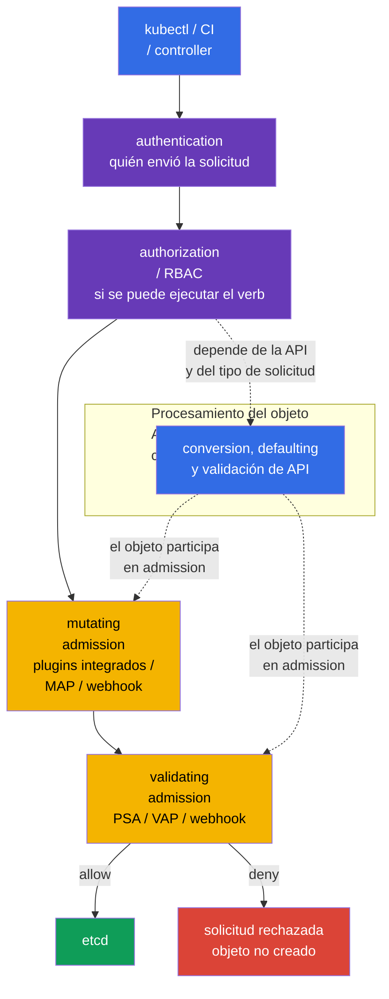

[Русская версия](ru.md) · [Eng version](README.md) · [Version française](fr.md) · [Deutsche Version](de.md) · [ქართული ვერსია](ge.md) · [繁體中文版](tw.md) · [日本語版](jp.md)

# Capítulo 20. Controladores de admission y motores de policy: OPA/Gatekeeper y Kyverno

> **El problema.** RBAC puede permitir legítimamente que CI cree un Deployment, pero no comprueba que la image
> proceda de un registry de confianza, que el Pod no tenga campos peligrosos ni que el objeto contenga las
> labels organizativas obligatorias. Un review manual de YAML se elude fácilmente mediante una plantilla,
> un cliente de API o un error en el pipeline; sin policy, el objeto llegará a etcd y se ejecutará. El control
> de admission debe comprobar o completar de forma segura esa solicitud antes de guardarla.

> **Qué sigue.** Pod Security Admission de [capítulo 19](../19/es.md) aplica los
> Pod Security Standards preparados, pero no responde a todas las reglas de la organización: si se permite
> el registry de images, si es obligatoria una label de propietario, si hay que añadir un campo seguro o crear
> un objeto relacionado. Admission control es la última barrera programable antes de escribir un objeto en
> etcd. Es parte del dominio **Minimize Microservice Vulnerabilities** de CKS (20%): aquí creamos nuestras
> propias reglas con OPA/Gatekeeper, Kyverno y CEL integrado.

> **Lo necesario de CKA.** El flujo básico de solicitud `authentication -> authorization ->
> admission -> etcd`, ServiceAccount y RBAC se explican en el
> [capítulo 21 de CKA](../../../cka/course/21/es.md); las restricciones básicas de contenedor, en el
> [capítulo 20 de CKA](../../../cka/course/20/es.md). Aquí no repetimos estos mecanismos, sino que
> convertimos los requisitos de seguridad en policy verificable para todo el cluster.

> 🧠 Admission comprueba los campos de una solicitud de API ya autorizada antes de escribirla en etcd; RBAC no evalúa la seguridad del YAML.

## 20.1. Modelo de amenazas: un manifiesto inseguro como punto de entrada al clúster

RBAC responde a la pregunta de si una identity puede crear un Pod. Si un desarrollador tiene permitido
`create pods`, RBAC no comprueba qué contiene exactamente el YAML. Por eso pueden llegar al cluster un
contenedor `privileged`, `hostPath: /`, una image de un registry desconocido, un Pod sin
`runAsNonRoot` o un Deployment sin label de propietario. Tal objeto puede estar completamente
permitido por RBAC y aun así infringir el baseline de seguridad.

Admission control recibe una solicitud ya autenticada y autorizada, pero antes de guardarla. Un
controlador mutating puede completar el objeto; un controlador validating lo acepta o rechaza. Si
cualquier etapa validating responde con un rechazo, el objeto no aparecerá en etcd.



El orden de admission importa: los controladores mutating se ejecutan antes de validating, por lo que
una validating-policy ve el objeto resultante. Conversion, defaulting y API validation se muestran en
el diagrama como procesamiento conceptual del objeto, no como una única etapa de posición rígida:
los detalles dependen de la API y del tipo de solicitud. Los admission plugins integrados y los webhooks
tienen su propio orden y pueden invocarse de nuevo cuando otro mutating webhook modifica el objeto.
La mutation debe ser idempotente: aplicarla de nuevo no debe añadir un segundo volume, label o sidecar
idéntico.

| Capa | Pregunta | Ejemplo |
|---|---|---|
| RBAC | ¿quién puede hacer `create pods`? | CI solo puede crear Pod en `team-a` |
| PSA | ¿cumple el Pod el estándar `baseline`/`restricted`? | se prohíbe un Pod privileged en un namespace restricted |
| custom policy | ¿cumple el objeto las reglas de la organización? | image solo de `registry.example.com`; existe la label `owner` |
| mutating policy | ¿qué default seguro se debe añadir? | establecer `allowPrivilegeEscalation: false` |

PSA y un policy engine no se sustituyen mutuamente. PSA aplica rápidamente y de forma uniforme
restricciones estándar de Pod. Gatekeeper, Kyverno o CEL cubren requisitos específicos. No duplique la
misma comprobación estricta en tres lugares sin motivo: será más difícil diagnosticar el rechazo, y los
mensajes y las excepciones diferentes empezarán a divergir.

> 🏭 `failurePolicy` define la reacción ante un **error técnico o de evaluación** en la ruta del admission webhook, no ante una decisión explícita de policy. Se aplica, por ejemplo, ante timeout, errores de TLS/DNS/Service/Pod, una respuesta HTTP/AdmissionReview incorrecta, así como ante un error al calcular `matchConditions`.
>
> API server calcula `matchConditions` **antes** de invocar el webhook. Si al menos un condition devuelve `false`, el webhook se omite normalmente. Si ninguno devuelve `false`, pero al menos uno termina con error, el webhook no se invoca: con `Fail` API server rechaza la solicitud; con `Ignore` la continúa sin ese webhook. Si el webhook se invocó correctamente y devolvió explícitamente `allowed: false`, la solicitud se rechaza tanto con `Fail` como con `Ignore`.
>
> Con `Fail`, ese error técnico/de evaluación también rechaza create/update: la policy no se puede eludir silenciosamente, pero una caída del webhook **o un error de sus `matchConditions`** puede detener un deploy y parte de las operaciones del control plane. Por ello, un webhook crítico para seguridad debe ser más fiable que un solo Pod: varias replicas reducen el riesgo de fallo, PDB evita que un disruption voluntario elimine todas las replicas a la vez, TLS correcto proporciona una conexión HTTPS de confianza, y las métricas y alerts de error/latency permiten detectar degradación antes de un outage.
>
> Con `Ignore`, la API permanece disponible, pero durante ese error el objeto pasa **sin la comprobación de ese webhook**: es una ventana consciente de elusión de policy, no un modo de «deny más suave». Para una prohibición crítica y madura se suele elegir `Fail`; `Ignore` puede ser un compromiso temporal durante el rollout o para un control no crítico, si el riesgo de bypass se acepta explícitamente.

## 20.2. Webhook: la disponibilidad también es una decisión de seguridad

Gatekeeper y Kyverno normalmente funcionan como admission webhook: `kube-apiserver` les envía un
`AdmissionReview` por HTTPS, y luego espera una respuesta `allowed: true/false` y posibles JSON
patches. Un webhook tiene dos parámetros especialmente importantes en `MutatingWebhookConfiguration` o
`ValidatingWebhookConfiguration`:

| Parámetro | Significado para la seguridad | Riesgo |
|---|---|---|
| `failurePolicy: Fail` | un error en la ruta del webhook o en `matchConditions` (si ningún condition es `false`) rechaza la solicitud | un outage del engine o un CEL condition erróneo bloquea el deploy y a veces operaciones del control plane |
| `failurePolicy: Ignore` | ante tal error, API server continúa la solicitud sin esta comprobación de webhook | ventana de bypass de policy durante fallo o error de condition |
| `timeoutSeconds` | limita cuánto espera API server | un timeout demasiado alto retrasa todos los create/update |
| `namespaceSelector`/`objectSelector` | reduce el scope del webhook | un selector erróneo puede omitir un namespace crítico |
| `matchPolicy` | define la coincidencia de versiones de API | una coincidencia inesperada puede aplicar la regla en un scope más amplio o más estrecho |

No cambie sin pensar `failurePolicy` de un webhook instalado por un Helm chart: el chart puede sobrescribir
el cambio. Primero compruebe que el engine tiene varias replicas, PodDisruptionBudget, TLS y una alerta
por errores/latency. Es más seguro introducir una nueva prohibición como audit/warn, corregir las
infracciones existentes y solo después activar enforcement. Para una regla crítica y madura se suele
elegir `Fail`; en el primer rollout es más importante no detener el cluster y no confundirlo con una
prueba de que la protección funciona.

La configuración mínima de webhook debe definir explícitamente el endpoint, la confianza TLS y el contrato
`AdmissionReview`. Por ejemplo, el validating webhook siguiente usa un Service; la estructura para un
mutating webhook es análoga, pero añada `reinvocationPolicy: IfNeeded` o `Never` y haga la mutation
idempotente. `caBundle` está abreviado aquí: en un manifest de trabajo es el certificado CA del webhook
codificado en base64.

```yaml
apiVersion: admissionregistration.k8s.io/v1
kind: ValidatingWebhookConfiguration
metadata:
  name: require-owner.example.com
webhooks:
- name: require-owner.example.com
  clientConfig:
    service:
      namespace: policy-system
      name: policy-webhook
      path: /validate
      port: 443
    caBundle: <base64-ca>
  rules:
  - apiGroups: [""]
    apiVersions: ["v1"]
    operations: ["CREATE", "UPDATE"]
    resources: ["pods"]
    scope: "*"
  admissionReviewVersions: ["v1"]
  sideEffects: None
  failurePolicy: Fail
  timeoutSeconds: 5
  matchPolicy: Equivalent
  namespaceSelector:
    matchLabels:
      policy.example.com/enforce-owner: "true"
  matchConditions:
  - name: skip-kube-system
    expression: "request.namespace != 'kube-system'"
```

La label personalizada de namespace en `namespaceSelector` es parte de la security boundary: una identity
para la cual la regla es obligatoria no debe poder eliminar ni modificar esa label. Para un scope fijo es
más seguro hacer coincidir el inmutable `kubernetes.io/metadata.name`; las labels personalizadas de
enforcement solo las modifica el rol de platform/security. Lo mismo se aplica a `objectSelector`: una
label con la que un usuario puede modificar por sí mismo el objeto y salir del scope no es adecuada como
deny-boundary.

```bash
SUBJECT='system:serviceaccount:team-a:ci'
NS='team-a'
kubectl auth can-i patch namespaces/"$NS" --as="$SUBJECT"
kubectl auth can-i update namespaces/"$NS" --as="$SUBJECT"
# Para una identity de application/CI ambas respuestas deben ser `no`.
```

Para un mutating webhook se añade al mismo contrato una regla de reinvocación:

```yaml
apiVersion: admissionregistration.k8s.io/v1
kind: MutatingWebhookConfiguration
metadata:
  name: default-security.example.com
webhooks:
- name: default-security.example.com
  clientConfig:
    service:
      namespace: policy-system
      name: policy-webhook
      path: /mutate
    caBundle: <base64-ca>
  rules:
  - apiGroups: [""]
    apiVersions: ["v1"]
    operations: ["CREATE"]
    resources: ["pods"]
  admissionReviewVersions: ["v1"]
  sideEffects: None
  reinvocationPolicy: IfNeeded
  failurePolicy: Fail
  timeoutSeconds: 5
```

```bash
# Qué webhooks están realmente registrados y cómo se comportan ante errores.
kubectl get validatingwebhookconfigurations,mutatingwebhookconfigurations
kubectl get validatingwebhookconfiguration <name> -o yaml
kubectl -n gatekeeper-system get pods
kubectl -n kyverno get pods
```

Admission solo comprueba una solicitud a la API. No sustituye image scanning, runtime detection,
NetworkPolicy, RBAC ni audit logs. Una image permitida en admission aún debe superar las comprobaciones
de supply chain de los capítulos 25-28; los procesos que ya se ejecutan se controlan en los capítulos 29-32.

> 🎯 Relacione `ConstraintTemplate` (code/schema) con `Constraint` (scope/parámetros/`enforcementAction`), y luego demuestre `dryrun` → `deny`.
>
> En este ejemplo, el template declara el tipo `K8sRequiredLabels`, su comprobación Rego y el parámetro permitido `labels`; el constraint `pods-must-have-owner` es una instancia concreta de este tipo. Siga la relación: `match` limita los Pod y los namespaces excluidos, `parameters.labels: ["owner"]` entrega a Rego el requisito, y `enforcementAction` selecciona la reacción ante una infracción encontrada.
>
> Demuestre el resultado con nuevos Pod de un solo uso: en `dryrun` cree un Pod sin `owner`, confirme que la API lo acepta y espere después a que se escriba en `status.violations`. Tras hacer patch a `deny`, intente crear **otro** Pod sin `owner`: la API debe rechazarlo. Como escenario positivo de control, un Pod con `owner` debe aceptarse en ambos modos. No utilice para ello solo un Pod existente o `--dry-run`: no prueban que admission y audit funcionaron para un objeto nuevo.

## 20.3. OPA/Gatekeeper: `ConstraintTemplate` y `Constraint`

**OPA** (Open Policy Agent) es un motor capaz de tomar decisiones de policy. **Gatekeeper** lo
conecta con Kubernetes admission: cuando alguien intenta crear o modificar un objeto, API server entrega
el objeto a Gatekeeper para comprobarlo. Si la regla encuentra una infracción, Gatekeeper comunica el
resultado: registrarlo como observación, advertir o rechazar la solicitud. Para la primera lectura no es
necesario saber escribir Rego o CEL: primero es importante comprender **qué regla se comprueba, dónde
actúa y qué ocurre ante una infracción**.

Para ello Gatekeeper divide una policy en dos recursos: no es duplicación, sino la posibilidad de escribir
una regla una vez y aplicarla de distintas formas:

1. `ConstraintTemplate`: la **plantilla/plano de la regla**. Contiene el code de comprobación en Rego o
   CEL, el admission handler objetivo y el OpenAPI schema de los parámetros permitidos. El schema
   comprueba los parámetros del propio `Constraint`, no el Pod directamente: por ejemplo, que `labels` sea
   una lista de strings. Tras aplicar el template, Gatekeeper crea un CRD (Custom Resource Definition), es
   decir, registra en la API de Kubernetes un nuevo tipo de recurso para esa regla.
2. `Constraint`: la **instancia activada de la regla**. Elige el scope de `match` (qué objetos y
   namespaces comprobar), entrega valores en `parameters` y establece `enforcementAction`: qué hacer ante
   una infracción. Un template se puede reutilizar para distintos equipos, namespaces o conjuntos de
   labels obligatorias, creando un constraint separado para cada caso.

Recuerde el flujo: **template define la regla → constraint la configura y activa → la
creación/modificación de un objeto entra en `match` → Gatekeeper ejecuta la comprobación con
`parameters` → `enforcementAction` determina el resultado**. Se parece a una clase y una instancia:
el template contiene code que requiere review y pruebas; normalmente el constraint cambia con mayor
frecuencia al ampliar la cobertura de policy. En un target elija un solo motor: en el `rego` legacy tiene
prioridad, y en `code[]` CEL (`K8sNativeValidation`) tiene prioridad sobre Rego.

### Instalación y comprobación rápida de Gatekeeper

La instalación se realiza de forma centralizada, no durante una tarea de examen. Para un Helm release,
primero fije la versión del chart en el manifest de GitOps y compruebe los values de la versión concreta:

```bash
helm repo add gatekeeper https://open-policy-agent.github.io/gatekeeper/charts
helm repo update
GATEKEEPER_CHART_VERSION="${GATEKEEPER_CHART_VERSION:?set exact chart version}"
helm upgrade --install gatekeeper gatekeeper/gatekeeper \
  --namespace gatekeeper-system --create-namespace \
  --version "$GATEKEEPER_CHART_VERSION"

kubectl -n gatekeeper-system get deploy,pods
kubectl get crd | grep -E 'gatekeeper|constraints.gatekeeper'
```

La policy siguiente exige la label `owner` en los Pod fuera de los namespaces de sistema. Es más compacta
que una comprobación de `privileged`, pero muestra todas las partes del modelo y produce un rechazo claro.

```yaml
# API de Gatekeeper para una plantilla de policy reutilizable.
apiVersion: templates.gatekeeper.sh/v1
# La plantilla define un nuevo tipo de constraint, pero todavía no habilita la comprobación.
kind: ConstraintTemplate
metadata:
  # Nombre Kubernetes de la plantilla; normalmente coincide con el nombre del package Rego.
  name: k8srequiredlabels
spec:
  crd:
    spec:
      names:
        # Kind del recurso Constraint que Gatekeeper creará a partir de este template.
        kind: K8sRequiredLabels
      validation:
        # El schema comprueba spec.parameters de Constraint, no el Pod entrante.
        openAPIV3Schema:
          type: object
          properties:
            labels:
              # Constraint pasa a policy una lista de keys de label obligatorias.
              type: array
              items:
                type: string
  targets:
  # Target integrado invocado en solicitudes admission create/update.
  - target: admission.k8s.gatekeeper.sh
    # Bloque Rego que devuelve una violation ante una infracción.
    rego: |
      # Namespace de nombres de la policy Rego.
      package k8srequiredlabels

      # Crear una violation por cada label obligatorio ausente.
      violation[{"msg": msg}] {
        # Toma de uno en uno los valores de spec.parameters.labels del Constraint.
        required := input.parameters.labels[_]
        # input.review.object es el Pod de la solicitud admission actual.
        not input.review.object.metadata.labels[required]
        # El mensaje aparece en el estado audit o en el rechazo deny.
        msg := sprintf("missing required label: %v", [required])
      }
---
# API y kind de la instancia creada por este ConstraintTemplate.
apiVersion: constraints.gatekeeper.sh/v1beta1
kind: K8sRequiredLabels
metadata:
  # Nombre único de la policy concreta habilitada.
  name: pods-must-have-owner
spec:
  # Solo auditoría: registrar la violation, pero aún no bloquear el Pod.
  enforcementAction: dryrun
  match:
    # No aplicar la regla a namespaces de sistema.
    excludedNamespaces: ["kube-system", "gatekeeper-system", "kyverno"]
    kinds:
    # Un API group vacío significa core/v1 API.
    - apiGroups: [""]
      # Comprobar solo Pod, no todos los objetos Kubernetes.
      kinds: ["Pod"]
  parameters:
    # Valor para input.parameters.labels en Rego: la label owner es obligatoria.
    labels: ["owner"]
```

#### Cómo leer esta policy

Primero Gatekeeper observa `match` del `Constraint`. Aquí solo comprueba Pod y omite los namespaces de
sistema enumerados; un objeto fuera del scope no entra en absoluto en esta regla. Para cada create/update
que coincide, Gatekeeper forma `input.review.object`: es el Pod entrante en formato Kubernetes API. A la
vez entrega `spec.parameters` del constraint en `input.parameters`. Por eso, en este ejemplo,
`input.parameters.labels` es igual a `["owner"]`.

En Rego una regla es un conjunto de condiciones unidas por **Y** lógico. Se lee de abajo arriba como
«crea una violation si se cumplen todas las líneas del cuerpo»:

- `required := input.parameters.labels[_]` recorre cada label obligatorio; `_` significa «el siguiente
  elemento del array». Aquí el único valor será `owner`.
- `not input.review.object.metadata.labels[required]` es verdadero cuando el Pod entrante no tiene esa
  key de label.
- `msg := ...` forma un mensaje comprensible, y `violation[{"msg": msg}]` es el resultado especial que
  Gatekeeper considera una infracción. Con `dryrun` llegará a `status.violations`; con `deny`, API server
  devolverá el mensaje y no creará el Pod.

Para la primera policy basta recordar cuatro ideas de Rego: `input` son datos de entrada de solo lectura,
`:=` guarda el valor encontrado en una variable, `[_]` recorre una lista y `not` describe que falta una
condición o que no se cumple. No necesita escribir `if/else` separados: si no se puede demostrar el cuerpo
de la regla, no se crea `violation`. Esta policy comprueba la **presencia** de la key `owner`; si la
organización necesita un value no vacío o con formato, debe ser una condición separada.

#### Pattern rápido para el examen: scope de namespace y prohibir `latest`

Primero traduzca la tarea en cuatro campos: **qué** comprobar (Pod e image), **dónde**
(`match.namespaces`), **condición de infracción** (la image usa `latest`) y **reacción**
(`dryrun`, después `deny`). Para owner en un namespace no hace falta un template nuevo: en
`K8sRequiredLabels`, sustituya `excludedNamespaces` por `namespaces: ["team-a"]` y mantenga
`parameters.labels: ["owner"]`.

Para una prohibición separada de `latest`, el template siguiente se puede escribir y aplicar como un único
archivo. Comprueba contenedores normales, init y ephemeral: comprobar solo `spec.containers` dejaría un
bypass. La función considera infracción tanto `:latest` explícito como una image sin tag (por ejemplo,
`nginx`, para la que Kubernetes presupone `latest`); un digest `@sha256:...` no se considera latest.

```yaml
# API Gatekeeper para la plantilla que prohíbe el image tag latest.
apiVersion: templates.gatekeeper.sh/v1
# Template contiene Rego; el Constraint de abajo elegirá su scope y modo de reacción.
kind: ConstraintTemplate
metadata:
  # Nombre Kubernetes del template.
  name: k8sdisallowlatest
spec:
  crd:
    spec:
      names:
        # Kind del Constraint que usará este template.
        kind: K8sDisallowLatest
      validation:
        # Esta policy no tiene parameters configurables, pero el schema aún describe el object.
        openAPIV3Schema:
          type: object
          properties: {}
  targets:
  # Conectar la comprobación al admission handler de Gatekeeper.
  - target: admission.k8s.gatekeeper.sh
    rego: |
      # Namespace de nombres de la policy Rego.
      package k8sdisallowlatest

      # Reunir contenedores de las tres listas de PodSpec para no dejar un bypass.
      pod_containers[container] {
        container := input.review.object.spec.containers[_]
      }
      pod_containers[container] {
        container := input.review.object.spec.initContainers[_]
      }
      pod_containers[container] {
        container := input.review.object.spec.ephemeralContainers[_]
      }

      # Se prohíbe el tag explícito :latest.
      image_uses_latest(image) {
        endswith(image, ":latest")
      }
      # Una image sin tag (por ejemplo nginx) Kubernetes la interpreta como latest; se permite digest.
      image_uses_latest(image) {
        not contains(image, "@")
        path := split(image, "/")
        last := path[count(path) - 1]
        not contains(last, ":")
      }

      # Devolver una violation de Gatekeeper por cada contenedor con image latest.
      violation[{"msg": msg}] {
        container := pod_containers[_]
        image_uses_latest(container.image)
        msg := sprintf("image %q must not use the latest tag", [container.image])
      }
---
# Instancia del template: habilita la prohibición solo para el scope elegido.
apiVersion: constraints.gatekeeper.sh/v1beta1
kind: K8sDisallowLatest
metadata:
  # Nombre único de la policy con scope específico de namespace.
  name: pods-without-latest-in-team-a
spec:
  # Empezar con audit; tras comprobar, sustituir por deny.
  enforcementAction: dryrun
  match:
    # Scope: la policy se aplica solo a Pod en namespace team-a.
    namespaces: ["team-a"]
    kinds:
    # Core/v1 API group.
    - apiGroups: [""]
      # Comprobar precisamente solicitudes admission de Pod.
      kinds: ["Pod"]
```

En el examen no intente crear primero un framework universal: use un `ConstraintTemplate` mínimo, defina
un `kind`/`match` preciso y una condición `violation`. Luego compruebe los casos negativo y positivo: en
`team-a`, un Pod con `nginx:latest` debe aparecer primero en violations; después de pasar a `deny`, debe
ser rechazado; un Pod con `nginx:1.27` debe pasar. Compruebe el scope por separado: el mismo intento fuera
de `team-a` no debe coincidir con este constraint.

```bash
kubectl apply -f gatekeeper-owner.yaml
kubectl get constrainttemplates
kubectl get k8srequiredlabels
kubectl describe k8srequiredlabels pods-must-have-owner
```

`enforcementAction: dryrun` reúne infracciones en `status.violations`, pero no bloquea la solicitud.
Después de corregir los Pod existentes y comprobar el scope, sustitúyalo por `deny`. Algunas versiones de
Gatekeeper también admiten la action `warn`; compruebe las actions exactas en el CRD instalado, no en un
ejemplo casual de otra versión.

```bash
kubectl get k8srequiredlabels pods-must-have-owner \
  -o jsonpath='{range .status.violations[*]}{.kind}/{.name}{": "}{.message}{"\n"}{end}'

# Solo después de audit y de corregir el workload.
kubectl patch k8srequiredlabels pods-must-have-owner --type merge \
  -p '{"spec":{"enforcementAction":"deny"}}'
```

### Ejemplo Gatekeeper para `privileged` peligroso

Para una prohibición crítica para seguridad, el template debe comprobar los contenedores normales,
`initContainers` y `ephemeralContainers`; de lo contrario, una de las listas queda como vía de bypass.

```rego
package k8sdisallowprivileged

violation[{"msg": msg}] {
  container := input.review.object.spec.containers[_]
  container.securityContext.privileged == true
  msg := sprintf("privileged container %q is not allowed", [container.name])
}

violation[{"msg": msg}] {
  container := input.review.object.spec.initContainers[_]
  container.securityContext.privileged == true
  msg := sprintf("privileged initContainer %q is not allowed", [container.name])
}

violation[{"msg": msg}] {
  container := input.review.object.spec.ephemeralContainers[_]
  container.securityContext.privileged == true
  msg := sprintf("privileged ephemeralContainer %q is not allowed", [container.name])
}
```

La condición `container.securityContext.privileged == true` no coincide cuando falta el campo; por tanto,
se permite el default `false`. PSA `restricted` ya cubre esta clase de requisitos: use Rego personalizado
solo cuando necesite sus propios scope, excepciones o lógica ampliada.

> 🔬 API Kyverno CEL para validation, mutation, generation y otros escenarios de admission.

## 20.4. Kyverno 1.19: tipos de policy basados en CEL

> **Nota de compatibilidad.** Kyverno v1.19 admite oficialmente Kubernetes v1.33-v1.35
> (`kyverno.io/docs/installation/releases/`, publicado en agosto de 2026). El core-lab de este capítulo
> (Lab108) se ejecuta en Kubernetes v1.36: es una combinación intencionada y orientada al futuro que
> **no forma parte** de la support matrix probada y garantizada de Kyverno v1.19. La instalación y los
> escenarios básicos suelen funcionar, pero precisamente este par de versiones no está cubierto por
> compatibility probada oficialmente; por ello, no considere una instalación correcta prueba de soporte
> completo de v1.36. Para prepararse para el examen actual (orientado a v1.35), compruebe por separado el
> comportamiento en v1.35, donde Kyverno v1.19 está probado oficialmente. La compatibility de componentes
> admission de terceros (Kyverno, Gatekeeper y análogos) se debe contrastar con su propia release matrix,
> aparte de la versión Kubernetes del curso.

### Cómo leer una policy CEL de Kyverno

Kyverno es un Kubernetes policy engine: sus controllers y admission webhook leen recursos de policy de la
API y reaccionan a operaciones con objetos. En los nuevos tipos basados en CEL, una policy es un recurso
YAML normal, y CEL es un lenguaje breve de expresiones dentro del campo `expression`. No sustituye YAML
ni es un shell-script: la expresión recibe datos de entrada, por ejemplo `object`, el objeto de la
solicitud admission actual, y calcula un valor.

Para la primera lectura, recorra cada ejemplo por un flujo: **qué operación y resource coinciden con
`matchConstraints` → qué condiciones adicionales pasan → qué hace la policy**. `ValidatingPolicy` calcula
una expresión booleana: `true` permite el objeto, `false` crea una infracción; la action `Audit` solo la
registra, y `Deny` rechaza la solicitud. `MutatingPolicy` devuelve una modificación del objeto antes de
guardarlo. `GeneratingPolicy` pide a un background controller que cree o sincronice otro objeto después de
que coincida el source resource. Por eso generation no es un admission deny instantáneo.

Elija primero el tipo por el resultado, no por la sintaxis: `ValidatingPolicy` comprueba y, si es
necesario, prohíbe; `MutatingPolicy` añade un default seguro; `GeneratingPolicy` crea un resource
relacionado; `DeletingPolicy` elimina según una rule; `ImageValidatingPolicy` comprueba una image. Los
tipos cluster-wide actúan en el scope indicado; las variantes `Namespaced...` viven y actúan solo en su
propio namespace. No mezcle estos recursos con el `Policy`/`ClusterPolicy` legacy: tienen otra API y otros
campos.

Desde Kyverno 1.19, la vía principal son los tipos cluster-wide separados basados en CEL del grupo
`policies.kyverno.io/v1`: `ValidatingPolicy`, `MutatingPolicy`, `GeneratingPolicy`, `DeletingPolicy` e
`ImageValidatingPolicy`. Para cada uno existe una variante namespaced, `NamespacedValidatingPolicy`,
`NamespacedMutatingPolicy`, `NamespacedGeneratingPolicy`, `NamespacedDeletingPolicy` o
`NamespacedImageValidatingPolicy`, que actúa solo en su namespace. Los `Policy` y `ClusterPolicy` legacy
(`kyverno.io/v1`), así como `CleanupPolicy` (`kyverno.io/v2`), están deprecated en 1.19 y se eliminarán en
1.20. No mezcle los campos de ambos modelos en un objeto.

En el curso se ha comprobado la combinación Kyverno `v1.19.x` y Helm chart `3.9.0`. Tras instalar,
compruebe precisamente los CRD nuevos y la image efectiva del controller:

```bash
helm upgrade --install kyverno kyverno/kyverno \
  --namespace kyverno --create-namespace --version 3.9.0
kubectl get crd validatingpolicies.policies.kyverno.io \
  mutatingpolicies.policies.kyverno.io \
  generatingpolicies.policies.kyverno.io \
  deletingpolicies.policies.kyverno.io \
  imagevalidatingpolicies.policies.kyverno.io
kubectl -n kyverno get deploy -o jsonpath='{..image}'
```

### `ValidatingPolicy`: exigir `runAsNonRoot`

`ValidatingPolicy` no cambia nada: responde a la pregunta «¿se puede aceptar este objeto?». Primero la
policy coincide con create/update de Pod; después CEL recibe el Pod como `object`. La expression debe
devolver `true`; de otro modo Kyverno crea una violation con el campo `message`. `Audit` permite la
solicitud y reúne el resultado para corregir manifests; después de comprobar el scope real, cambie a
`Deny`, que rechazará tal Pod. La comprobación siguiente exige un baseline explícito a nivel Pod; no
sustituye PSS `restricted` completo.

```yaml
# API de la nueva policy Kyverno basada en CEL.
apiVersion: policies.kyverno.io/v1
# Validation no modifica el objeto: permite o registra/rechaza una infracción.
kind: ValidatingPolicy
metadata:
  # Nombre único de la policy en el cluster.
  name: require-pod-run-as-non-root
spec:
  # Primero solo auditoría: la solicitud no se bloquea y se puede estudiar la violation.
  validationActions: [Audit]
  matchConstraints:
    resourceRules:
    # Core/v1 Pod; comprobar tanto la creación como las modificaciones posteriores.
    - apiGroups: [""]
      apiVersions: ["v1"]
      operations: ["CREATE", "UPDATE"]
      resources: ["pods"]
  validations:
  # Para cada Pod coincidente la expression debe devolver true.
  - message: "Pod spec.securityContext.runAsNonRoot must be true"
    expression: >-
      // has evita acceder a un securityContext ausente.
      has(object.spec.securityContext) &&
      // ? lee de forma segura un campo optional; si falta o es false, da false.
      object.spec.securityContext.?runAsNonRoot.orValue(false)
```

```bash
kubectl apply -f kyverno-run-as-non-root.yaml
kubectl get validatingpolicy require-pod-run-as-non-root
kubectl patch validatingpolicy require-pod-run-as-non-root --type merge \
  -p '{"spec":{"validationActions":["Deny"]}}'
```

### `MutatingPolicy`: etiquetado transparente

`MutatingPolicy` no responde «permitir o prohibir», sino «qué default seguro añadir al objeto ya aceptado».
Se activa tras el match, construye un fragment modificado del objeto y API server guarda el resultado. Una
mutation no debe ocultar una image insegura: para campos críticos de seguridad suele ser mejor una
validation explícita. El ejemplo didáctico seguro añade solo una audit-label. `ApplyConfiguration` significa
que CEL construye el fragment deseado como `Object{...}`, y Kyverno lo aplica en lugar de legacy
`patchStrategicMerge`:

```yaml
# API de policy Kyverno basada en CEL que modifica el objeto antes de guardarlo.
apiVersion: policies.kyverno.io/v1
kind: MutatingPolicy
metadata:
  # Nombre de la policy que añade una audit label rastreable.
  name: mark-kyverno-managed-pods
spec:
  matchConstraints:
    resourceRules:
    # Cambiar solo los nuevos core/v1 Pod, no todos los resources.
    - apiGroups: [""]
      apiVersions: ["v1"]
      operations: ["CREATE"]
      resources: ["pods"]
  mutations:
  # ApplyConfiguration aplica al incoming object un fragment construido con CEL.
  - patchType: ApplyConfiguration
    applyConfiguration:
      expression: >-
        // Object{...} es la representación CEL del fragment Kubernetes object deseado.
        Object{
          metadata: Object.metadata{
            // Añade una label sin sustituir las demás metadata.labels.
            labels: {"security.example.com/policy": "kyverno"}
          }
        }
```

### `GeneratingPolicy`: default-deny para un Namespace nuevo

`GeneratingPolicy` reacciona a un source object y solicita a un background controller crear un downstream
resource. En este ejemplo el source es un Namespace nuevo, y el resultado es un `NetworkPolicy` dentro de
él. El template YAML sigue siendo legible, y CEL calcula e inserta el nombre del Namespace. Con
`synchronize.enabled: true`, Kyverno continúa comprobando y sincronizando el objeto generado con la
policy. Esto no afirma nada sobre Kubernetes `ownerReferences` ni sustituye una distribución explícita de
responsabilidades: no encargue a GitOps-controller y Kyverno que sincronicen el mismo objeto a la vez.

```yaml
# API de policy basada en CEL que crea/sincroniza un downstream resource.
apiVersion: policies.kyverno.io/v1
kind: GeneratingPolicy
metadata:
  # Nombre de la policy para NetworkPolicy de Namespace nuevo.
  name: generate-default-deny-ingress
spec:
  evaluation:
    synchronize:
      # Background controller sigue comparando el NetworkPolicy generado con el template.
      enabled: true
  matchConstraints:
    resourceRules:
    # Trigger: creación de core/v1 Namespace.
    - apiGroups: [""]
      apiVersions: ["v1"]
      operations: ["CREATE"]
      resources: ["namespaces"]
  matchConditions:
  # No generar policy en namespaces de sistema.
  - name: skip-system-namespaces
    expression: >-
      !(object.metadata.name in
      ["kube-system", "kube-public", "kube-node-lease", "kyverno"])
  variables:
  # Guardar el nombre del source Namespace para usarlo dentro del template YAML.
  - name: namespaceName
    expression: object.metadata.name
  generate:
  - template:
      # Insertar una variable CEL en YAML entre (( ... )).
      interpolate: cel
      value: |
        apiVersion: networking.k8s.io/v1
        kind: NetworkPolicy
        metadata:
          # Nombre fijo del NetworkPolicy downstream.
          name: default-deny-ingress
          # Crearlo en el Namespace que activó la policy.
          namespace: (( variables.namespaceName ))
          labels:
            # Permite identificar al propietario del objeto generado.
            app.kubernetes.io/managed-by: kyverno
        spec:
          # Selector vacío cubre todos los Pod del Namespace.
          podSelector: {}
          # Default deny solo para ingress; egress se define por separado.
          policyTypes: [Ingress]
```

Esto es solo ingress default deny. Configure egress, DNS y las conexiones permitidas con
`NetworkPolicy` separadas: véase el [capítulo 04](../04/es.md).

`GeneratingPolicy` es un mecanismo de provisioning/reconciliation, no una admission barrier atómica: el
Namespace se crea antes de que el background controller garantice que crea el `NetworkPolicy` downstream.
Antes de entregar la identity de workload del namespace, confirme el baseline efectivo, por ejemplo con
`kubectl -n <new-namespace> get networkpolicy default-deny-ingress`; la mera existencia de la
`GeneratingPolicy` no lo demuestra.

Antes de usar generation, compruebe los permisos del ServiceAccount efectivo del background controller
sobre el resource de destino. Para `synchronize.enabled: true` se necesitan read/watch y gestión del
downstream resource; las seis comprobaciones siguientes deben devolver `yes`:

```bash
KYVERNO_BG='system:serviceaccount:kyverno:kyverno-background-controller'
for verb in get list watch create update delete; do
  kubectl auth can-i "$verb" networkpolicies.networking.k8s.io \
    --all-namespaces --as="$KYVERNO_BG"
done
```

### Migración de policy legacy

Haga inventario de los recursos legacy con
`kubectl get policies.kyverno.io,clusterpolicies.kyverno.io` (o `kubectl get pol,cpol`), así como de
`CleanupPolicy`, y fije el comportamiento con pruebas positivas y negativas. Traslade las rules de
validate/mutate/generate/delete/image al tipo nuevo correspondiente y elimine el objeto legacy solo después
de comprobar admission y los background reports. Para producción, consulte la
[guía de migración de Kyverno](https://kyverno.io/docs/guides/migration-to-cel/)
con la minor-version instalada.

> 🏭 La elección del engine depende de quién posee la policy, el lenguaje, CI y el webhook; no duplique un control deny sin motivo.

## 20.5. Gatekeeper y Kyverno: qué elegir

Ambos engines pueden hacer deny de un Pod inseguro, recoger infracciones de audit y funcionar mediante
admission webhook. Se diferencian en lenguaje, modelo y comodidad para una regla concreta.

| Criterio | Gatekeeper / OPA | Kyverno |
|---|---|---|
| Lenguaje de comprobación | Rego o CEL en `ConstraintTemplate` | CEL y templates YAML |
| Modelo de recurso | `ConstraintTemplate` con Rego/CEL + `Constraint` | tipos de policy separados basados en CEL, incluidos variants namespaced |
| Validate | sí | sí |
| Mutate | recursos mutator separados; las posibilidades dependen de la versión | `MutatingPolicy` |
| Generate | no es el escenario principal | `GeneratingPolicy` |
| Delete / cleanup | no es el escenario principal | `DeletingPolicy` |
| Lógica compleja y uso externo de OPA | punto fuerte de Rego | posible, pero YAML es más sencillo de leer para policy K8s |
| Umbral para un equipo acostumbrado a Kubernetes YAML | mayor | menor |

La elección no significa que la otra herramienta sea peor. Si la organización ya usa OPA para Terraform,
API gateway y CI, Gatekeeper reduce la cantidad de lenguajes de policy. Si se necesita mutation,
generation y review en Kubernetes YAML conocido, Kyverno suele ser más sencillo. No instale ambos solo para
reglas idénticas: dos webhooks aumentan latency, superficie operativa y riesgo de rechazos contradictorios.
Se admite una división de responsabilidades si está documentada: por ejemplo, Gatekeeper para constraints
Rego complejos y Kyverno para mutation e image verification.

En ambos casos policy es code: guarde `ConstraintTemplate`/`Constraint` o policy Kyverno basada en CEL en
Git, asigne un propietario y pruebas, aplique en staging, empiece con audit/warn y conserve evidence de las
infracciones. Antes del cluster, añada a CI un mini-lab con fixture permitido y prohibido. Para Gatekeeper,
use Suite/Test/Case declarativos (`apiVersion: test.gatekeeper.sh/v1alpha1`, `kind: Suite`), y no un fixture
denied directo de `gator test`: con un Constraint deny, una infracción encontrada hace que `gator test`
termine con exit code 1 aunque la policy funcione correctamente. Compruebe Kyverno con
`kyverno test --require-tests`, para que la ausencia de test manifest no dé un pipeline verde. CI debe
terminar con error si se rechaza un manifest allowed o se acepta un manifest denied. Una excepción debe ser
estrecha, limitada en el tiempo y visible en el review, no un `excludedNamespaces: ["*"]` global.

> 🏭 Los fixtures de CI deben aceptar el objeto permitido y rechazar el prohibido antes de admission en el cluster.

### Mini-lab de CI: comprobar la policy antes del rollout

Los manifests positivo y negativo deben vivir junto a la policy en Git. Guarde el template y el constraint
en `templates-and-constraints/template.yaml` y `templates-and-constraints/constraint.yaml`, los fixtures
en `allowed.yaml` y `denied.yaml`, y cree al lado `suite.yaml`:

```yaml
apiVersion: test.gatekeeper.sh/v1alpha1
kind: Suite
tests:
- name: require-owner
  template: templates-and-constraints/template.yaml
  constraint: templates-and-constraints/constraint.yaml
  cases:
  - name: allowed-has-owner
    object: allowed.yaml
    assertions:
    - violations: no
  - name: denied-missing-owner
    object: denied.yaml
    assertions:
    - violations: yes
```

```bash
# Ambos resultados esperados producen un exit code correcto: el fixture deny debe tener una violation.
gator verify suite.yaml                    # o bien: gator verify ./...

# Kyverno: el pipeline falla si no se encuentra kyverno-test.yaml.
kyverno test --require-tests ./policy/kyverno
```

`gator verify` considera `violations: no` para allowed y `violations: yes` para denied como assertions
esperadas; por ello, el job solo se pondrá rojo ante una regresión en la policy o los fixtures. Use los
comandos y la estructura de archivos correspondientes a la versión fijada de CLI; la prueba de admission
en cluster sigue siendo una etapa separada del CI de integración.

> 🔬 CEL native se ejecuta en API server sin webhook, pero no cubre generation, reports, signature verification ni lógica Rego compleja.

## 20.6. CEL native: validation y mutation sin webhook externo

`ValidatingAdmissionPolicy` (VAP) y `ValidatingAdmissionPolicyBinding` definen validation integrada en
CEL. En Kubernetes 1.36, `MutatingAdmissionPolicy` (MAP) y `MutatingAdmissionPolicyBinding` se volvieron
stable y se habilitan por default. MAP es mutation in-process dentro de API server: CEL devuelve un
`ApplyConfiguration`, que se combina conforme a las reglas de server-side apply, o un `JSONPatch`. Para
ambas API native, el binding es obligatorio: es el que vincula la policy al scope; sin binding, la policy
no actúa.

VAP sigue siendo solo un mecanismo validating: no modifica ni genera objetos. En conjunto, VAP + MAP native
stack ya permite mutation y validation sin webhook, pero no sustituye un engine para generate, policy
reports, image signature verification, datos externos complejos o Rego.

### `MutatingAdmissionPolicy`: añadir una label segura en un scope limitado

El ejemplo siguiente se aplica solo a Pod en un namespace con la label
`policy.example.com/native-mutation=true`. `ApplyConfiguration` es cómodo para añadir un campo; para
operaciones precisas en arrays o rutas use `JSONPatch` con una lista CEL `JSONPatch{...}`.
`spec.reinvocationPolicy` es obligatorio: `Never` no invoca MAP de nuevo, mientras que `IfNeeded` permite
una evaluación repetida tras la mutation de otras etapas de admission. El orden con otros mutating
plugins/webhooks no está garantizado, por lo que la mutation debe ser idempotente. No use mutation como
sustituto de una security validation obligatoria.

```yaml
apiVersion: admissionregistration.k8s.io/v1
kind: MutatingAdmissionPolicy
metadata:
  name: add-native-admission-label
spec:
  failurePolicy: Fail
  reinvocationPolicy: IfNeeded
  matchConstraints:
    resourceRules:
    - apiGroups: [""]
      apiVersions: ["v1"]
      operations: ["CREATE"]
      resources: ["pods"]
  mutations:
  - patchType: ApplyConfiguration
    applyConfiguration:
      expression: >-
        Object{
          metadata: Object.metadata{
            labels: {"admission.example.com/mutated": "true"}
          }
        }
---
apiVersion: admissionregistration.k8s.io/v1
kind: MutatingAdmissionPolicyBinding
metadata:
  name: add-native-admission-label
spec:
  policyName: add-native-admission-label
  matchResources:
    namespaceSelector:
      matchLabels:
        policy.example.com/native-mutation: "true"
```

La práctica debe comprobar tanto el scope como su frontera negativa. Guarde el YAML anterior como
`map-add-label.yaml` y ejecute después:

```bash
kubectl apply -f map-add-label.yaml
kubectl create namespace native-map-on
kubectl label namespace native-map-on policy.example.com/native-mutation=true
kubectl create namespace native-map-off

cat <<'EOF' >/tmp/native-map-pod.yaml
apiVersion: v1
kind: Pod
metadata:
  name: native-map-test
spec:
  containers:
  - name: pause
    image: registry.k8s.io/pause:3.10
EOF

# El scope binding coincidió: el server-side dry-run devuelve la label añadida.
kubectl -n native-map-on create --dry-run=server -o yaml -f /tmp/native-map-pod.yaml

# Prueba negativa del binding: en un namespace sin la selector-label no hay mutation.
if kubectl -n native-map-off create --dry-run=server -o yaml \
  -f /tmp/native-map-pod.yaml | grep -q 'admission.example.com/mutated: "true"'; then
  echo "MAP se aplicó fuera de su ámbito previsto"
  exit 1
fi
```

### `ValidatingAdmissionPolicy`: exigir non-root efectivo

VAP debe comprobar la configuración efectiva de cada proceso, no solo el default a nivel Pod: el
`securityContext.runAsNonRoot` del contenedor tiene prioridad. La expresión siguiente permite `true` a
nivel de contenedor o la ausencia de este campo cuando a nivel Pod es `true`, pero rechaza `false` explícito
y `runAsUser: 0` tanto a nivel Pod como en los contenedores normales, init y ephemeral.

```yaml
apiVersion: admissionregistration.k8s.io/v1
kind: ValidatingAdmissionPolicy
metadata:
  name: require-pod-run-as-non-root
spec:
  failurePolicy: Fail
  matchConstraints:
    resourceRules:
    - apiGroups: [""]
      apiVersions: ["v1"]
      operations: ["CREATE", "UPDATE"]
      resources: ["pods"]
  variables:
  - name: podRunAsNonRoot
    expression: >-
      has(object.spec.securityContext) &&
      has(object.spec.securityContext.runAsNonRoot) &&
      object.spec.securityContext.runAsNonRoot == true
  - name: allContainers
    expression: >-
      object.spec.containers +
      (has(object.spec.initContainers) ? object.spec.initContainers : []) +
      (has(object.spec.ephemeralContainers) ? object.spec.ephemeralContainers : [])
  validations:
  - expression: >-
      !has(object.spec.securityContext) ||
      !has(object.spec.securityContext.runAsUser) ||
      object.spec.securityContext.runAsUser != 0
    message: "Pod-level runAsUser: 0 is forbidden"
  - expression: >-
      variables.allContainers.all(c,
        (!has(c.securityContext) || !has(c.securityContext.runAsUser) ||
          c.securityContext.runAsUser != 0) &&
        ((has(c.securityContext) && has(c.securityContext.runAsNonRoot)) ?
          c.securityContext.runAsNonRoot == true : variables.podRunAsNonRoot)
      )
    message: "Every app, init and ephemeral container must effectively run non-root; runAsUser: 0 is forbidden"
---
apiVersion: admissionregistration.k8s.io/v1
kind: ValidatingAdmissionPolicyBinding
metadata:
  name: require-pod-run-as-non-root
spec:
  policyName: require-pod-run-as-non-root
  validationActions: ["Deny"]
  matchResources:
    namespaceSelector:
      matchLabels:
        policy.example.com/enforce-non-root: "true"
```

`object` en CEL es el objeto comprobado; también están disponibles el contexto de solicitud, `oldObject` y
los parámetros de binding. `failurePolicy` de VAP/MAP se refiere a un error al evaluar la policy, no a la
disponibilidad de red: aquí no hay webhook externo. No publique una expresión CEL no probada con `Deny`
inmediatamente en todo el cluster: reduzca el selector, empiece con `Audit`/`Warn` y compruebe los casos
positivo y negativo.

```bash
kubectl apply -f vap-run-as-non-root.yaml
kubectl label namespace team-example policy.example.com/enforce-non-root=true
kubectl get validatingadmissionpolicy,validatingadmissionpolicybinding
kubectl get mutatingadmissionpolicy,mutatingadmissionpolicybinding
```

### VAP parametrizado: lógica de policy separada del límite del equipo

`paramKind` define el tipo de parameter resource, binding elige un objeto concreto con `paramRef`, y CEL
lo recibe como `params`. Aquí un solo `ConfigMap` limita replicas; `matchConditions` no evalúa la policy
para las solicitudes de kubelet.

```yaml
apiVersion: admissionregistration.k8s.io/v1
kind: ValidatingAdmissionPolicy
metadata:
  name: deployment-replica-limit
spec:
  failurePolicy: Fail
  paramKind:
    apiVersion: v1
    kind: ConfigMap
  matchConstraints:
    resourceRules:
    - apiGroups: ["apps"]
      apiVersions: ["v1"]
      operations: ["CREATE", "UPDATE"]
      resources: ["deployments"]
  matchConditions:
  - name: exclude-kubelet
    expression: '!("system:nodes" in request.userInfo.groups)'
  variables:
  - name: limit
    expression: 'int(params.data["maxReplicas"])'
  validations:
  - expression: "params != null && object.spec.replicas <= variables.limit"
    message: "replicas exceed the team limit"
---
apiVersion: v1
kind: ConfigMap
metadata:
  name: team-a-replica-limit
  namespace: policy-system
data:
  maxReplicas: "5"
---
apiVersion: admissionregistration.k8s.io/v1
kind: ValidatingAdmissionPolicyBinding
metadata:
  name: deployment-replica-limit-team-a
spec:
  policyName: deployment-replica-limit
  validationActions: [Deny]
  paramRef:
    name: team-a-replica-limit
    namespace: policy-system
    parameterNotFoundAction: Deny
  matchResources:
    namespaceSelector:
      matchLabels:
        team: a
```

Una policy puede tener varios bindings y parameter resources para distintos equipos; todas las
combinations que coincidan deben pasar. `parameterNotFoundAction: Deny` junto con `failurePolicy: Fail`
no convierte una configuración ausente en un bypass.

VAP realiza una authorization check sobre el parameter resource: quien solicita y coincide debe tener
acceso `read` a `paramKind`/`paramRef`; de lo contrario, una solicitud correcta puede ser rechazada. Antes
de `Deny`, compruebe la identity real; concédale solo `get`, no el permiso para modificar el parameter, y no
guarde datos sensibles de seguridad en un ConfigMap que deban leer las identities de workload.

```bash
SUBJECT='system:serviceaccount:team-a:ci'
kubectl auth can-i get configmap/team-a-replica-limit   -n policy-system --as="$SUBJECT"
```

> 🔬 **Deep Dive — Manifest-Based Admission Control.** En el training baseline Kubernetes v1.36, la función es Alpha y está desactivada por default. En upstream Kubernetes v1.37 pasó a Beta y está enabled by default. El workflow principal de este capítulo sigue vinculado a v1.36; consulte el delta actual de producción en [Kubernetes v1.37 Security Delta](../APPENDIX_K8S_137_SECURITY_DELTA_ES.md).
>
> En v1.36, active el feature gate `ManifestBasedAdmissionControlConfig`; la función carga manifests de webhook y policy CEL desde el disco de API server. Entregue mediante `--admission-control-config-file` un `AdmissionConfiguration` con un `staticManifestsDir` absoluto separado para el admission plugin necesario. Esas policies están activas al iniciar, son independientes de etcd y pueden proteger la configuración de admission basada en API contra eliminación o modificación. Es una función experimental de control plane: `metadata.name` **de cada** static admission object en v1.36 debe terminar en `.static.k8s.io`; un static manifest inválido en la carga inicial puede impedir que API server esté ready. Los static manifests se limitan a los admission resources admitidos; las policy no pueden usar `paramKind`, y en `ValidatingAdmissionPolicyBinding` y `MutatingAdmissionPolicyBinding` está prohibido `spec.paramRef`. Un static webhook permite `clientConfig.url`, pero no `clientConfig.service`. Cada HA API server debe recibir los mismos archivos; no introduzca esta función sin probar startup/reload y la entrega gestionada de configuración.

### Comparación de CEL native y webhook engine

| Capacidad | VAP | Stack native MAP + VAP | Webhook Gatekeeper / Kyverno |
|---|---|---|---|
| Dónde se ejecuta | dentro de API server | dentro de API server | Pod controller/webhook separados |
| Fallo de red de webhook | ausente | ausente | depende de disponibilidad y `failurePolicy` |
| Validate | sí | sí | sí |
| Mutate | no | sí, `ApplyConfiguration` o `JSONPatch` | Kyverno: sí; Gatekeeper: recursos mutator separados |
| Generate / reports / signature verification | no | no | disponibles según el engine |
| Lógica compleja | limitada a CEL y API context | limitada a CEL y API context | Rego o features del policy engine |
| Ciclo de vida | upstream Kubernetes API | upstream Kubernetes API | instalación, actualización y CRD separados |

CEL native es una buena primera opción para una validation o mutation pequeña y limpia. Un engine se
justifica cuando se requieren generation, signature verification, policy reports o una plataforma de policy
común. En ambas variantes son obligatorios scope, prueba positiva y negativa, además de un plan de rollout.

> 🎯 El manifest válido se acepta y el infractor se rechaza; para mutation, compare el objeto con el resultado de server-side dry-run.

## 20.7. Comprobación: demostrar allow, deny y mutation

La comprobación de policy no consiste en que `kubectl apply` termine sin error, sino en dos escenarios
controlados: se acepta un objeto correcto y se rechaza uno infractor con una causa clara. Aplique estas
comprobaciones solo en un namespace de prueba, ya que `Deny` cambia admission intencionadamente.

```bash
kubectl create namespace admission-test
kubectl label namespace admission-test policy.example.com/enforce-non-root=true

cat <<'EOF' | kubectl -n admission-test apply -f -
apiVersion: v1
kind: Pod
metadata:
  name: allowed-non-root
  labels:
    owner: platform
spec:
  securityContext:
    runAsNonRoot: true
  containers:
  - name: nginx
    image: nginxinc/nginx-unprivileged:1.30.4-alpine-slim
    securityContext:
      allowPrivilegeEscalation: false
      capabilities:
        drop: ["ALL"]
    ports:
    - containerPort: 8080
EOF

cat <<'EOF' | kubectl -n admission-test apply -f -
apiVersion: v1
kind: Pod
metadata:
  name: rejected-root-default
  labels:
    owner: platform
spec:
  containers:
  - name: nginx
    image: nginx:1.30.4
EOF
# Se espera: admission webhook o ValidatingAdmissionPolicy ... denied the request
```

Después de `Enforce` en Kyverno se busca la infracción en la respuesta de API y el policy report, si los
reports están activados. En Gatekeeper se comprueban `status.violations` del Constraint y el mensaje de
rechazo. Para VAP basta con el estado de policy/binding y el rechazo de API server; para MAP, además,
compare el objeto de server-side dry-run con el original y compruebe el scope binding negativo.

```bash
kubectl get events -n admission-test --sort-by=.lastTimestamp
kubectl get policyreport -A 2>/dev/null || true
kubectl get k8srequiredlabels pods-must-have-owner -o yaml
kubectl get validatingadmissionpolicy require-pod-run-as-non-root -o yaml
```

Si el Pod permitido no se crea, determine primero la fuente del rechazo, no desactive todas las policy:
lea el mensaje de `kubectl`, el event, `kubectl describe` y los logs del controller concreto. Después
compruebe selector, `match`/`exclude`, labels de namespace y el objeto real después de mutation. Si la
policy no actuó, compruebe que webhook/engine está healthy, que la regla cubre API version y kind, y que el
objeto de prueba no está excluido por namespace o label.

> 🏭 Rollout: scope estrecho → `Audit`/`dryrun`/`Warn` → remediation → `Deny`/`Enforce`.

## 20.8. Errores típicos y rollout seguro

| Error | Consecuencia | Enfoque seguro |
|---|---|---|
| Activar inmediatamente `Deny`/`Enforce` en todos los namespaces | se bloquean workloads legacy y system components | audit/warn -> lista de infracciones -> remediation -> enforcement |
| Excluir `kube-system`, pero no el propio namespace del engine | el engine puede bloquearse a sí mismo | excluir explícitamente solo los namespaces de sistema necesarios |
| Comprobar solo `containers` | bypass mediante `initContainers` o `ephemeralContainers` | cubrir todas las container lists o usar PSA |
| Usar mutation en vez de un requisito de seguridad | el YAML parece seguro, pero la image/arquitectura sigue siendo inadecuada | mutar solo defaults seguros; validar invariantes obligatorios |
| `failurePolicy: Ignore` para siempre | durante un outage se elude la policy | alert, HA, control de rollout y después `Fail` consciente para reglas críticas |
| Confiar en `Audit` como prohibición | el objeto infractor se sigue ejecutando | usar `Audit` solo como fase de migración |
| Introducir simultáneamente el mismo deny en PSA, Gatekeeper y Kyverno | errores duplicados y mantenimiento complejo | asignar a una capa el propietario de cada requisito |
| Activar `synchronize.enabled: true` sin reparto de responsabilidades | Kyverno sigue sincronizando el objeto y GitOps puede entrar en conflicto | documentar qué controller sincroniza el resource; no es una cuestión de `ownerReferences` |

Antes de actualizar Gatekeeper/Kyverno, compruebe CRD migration, compatibility con Kubernetes v1.36,
certificate rotation, resource requests/limits y PDB. Un admission outage es un incident: defina de
antemano quién puede reducir temporalmente el scope o revertir el release, y registre ese cambio mediante
GitOps/audit.

> 🏭 Policy as code: propietario, Git review, fixtures, CI, excepciones estrechas, admission-metrics y rollout verificable.

## 20.9. Cómo se aplica en producción

- **Capas en vez de una única prohibición.** PSA `restricted` establece un baseline masivo; la custom
  policy añade reglas de negocio: registry aprobado, labels de owner/cost, `resources.requests`, signature
  verification. RBAC sigue limitando quién puede crear objetos.
- **Policy as code.** Guarde templates, constraints, policies, test fixtures y excepciones en un
  repositorio. El code review debe ver los ejemplos positivo y negativo, y CI debe comprobar la policy antes
  del cluster rollout.
- **Activación gradual.** Empiece con un namespace, `Audit`/`dryrun`/`Warn`, reúna infracciones reales,
  ayude a los equipos a corregir manifests y solo entonces active `Enforce`/`Deny`.
- **Observabilidad de admission.** Recoja métricas de latency/error del webhook, número de violations,
  eventos de audit de API server y alerts por ausencia de replicas ready. Compruebe la policy tras actualizar
  Kubernetes y el engine.
- **Excepciones mínimas.** La excepción se establece para un namespace, service account, RuntimeClass o
  image aprobada concretos, con propietario y fecha de vencimiento. No use un bypass amplio para «arreglar»
  un deployment.

## 20.10. Mini-glosario

- **Admission control**: etapa de API server posterior a authentication y authorization, anterior a escribir
  el objeto en etcd.
- **Mutating admission webhook**: webhook que añade/modifica el objeto antes de validation.
- **Validating admission webhook**: webhook que permite o rechaza el objeto.
- **OPA**: Open Policy Agent, motor de policy sobre Rego.
- **Gatekeeper**: Kubernetes policy engine sobre OPA con el modelo `ConstraintTemplate` +
  `Constraint`.
- **ConstraintTemplate**: code de policy Rego o CEL y schema de parámetros para un nuevo constraint type.
- **Constraint**: instancia de un template Gatekeeper con parámetros, match scope y reacción.
- **Kyverno**: Kubernetes-native policy engine; en 1.19 la API principal usa
  `ValidatingPolicy`, `MutatingPolicy`, `GeneratingPolicy`, `DeletingPolicy` e
  `ImageValidatingPolicy`, además de sus variants namespaced.
- **ValidatingAdmissionPolicy**: validation integrada de API server con CEL sin webhook externo; se aplica
  mediante un binding.
- **MutatingAdmissionPolicy**: mutation integrada de API server con CEL mediante
  `ApplyConfiguration` o `JSONPatch`; se aplica mediante un binding.
- **CEL**: Common Expression Language, lenguaje de expresiones para ValidatingAdmissionPolicy.
- **`failurePolicy`**: acción de API server cuando el webhook/la evaluación de policy no están disponibles o
  terminan con error: normalmente `Fail` o `Ignore`.

## 20.11. Conclusiones del capítulo

- Admission es la última barrera ante etcd: mutation cambia el objeto y validation lo permite o lo
  rechaza. RBAC no responde a la misma pregunta ni sustituye una policy.
- Gatekeeper construye una policy a partir de un `ConstraintTemplate` con Rego o CEL y un `Constraint` con
  scope/params; primero es útil usar `dryrun`, después `deny`.
- Kyverno 1.19 describe validation, mutation, generation, delete/cleanup e image verification mediante
  tipos de policy separados basados en CEL. Mutation es cómoda para defaults seguros, pero no sustituye
  validation.
- Gatekeeper y Kyverno son webhook engines; por ello, su availability, TLS, replicas,
  `timeoutSeconds` y `failurePolicy` forman parte del security design.
- VAP con CEL funciona en API server sin webhook externo y es adecuado solo para validation. En Kubernetes
  1.36, MAP stable completa el native stack con mutation mediante `ApplyConfiguration` o `JSONPatch`, pero
  no sabe hacer generation.
- Rollout fiable: scope pequeño -> audit/warn -> corrección de violations -> `Enforce`/`Deny`, comprobando
  el manifest aceptado y el rechazado.

## 20.12. Para qué sirve: en el examen y en el trabajo real

**En el examen.** El archivo público relacionado de curriculum se llama actualmente `CKS_Curriculum
v1.34`, mientras que el entorno de examen CKS usa ahora Kubernetes v1.35. Son versiones diferentes: el
curriculum describe temas, y el runtime determina las API disponibles y el comportamiento del cluster.
Identifique rápidamente dónde reside el control, lea `ConstraintTemplate` y `Constraint`,
cree/compruebe una policy, distinga `Audit` de `Deny` y encuentre la causa de `denied the request`. No
atribuya al examen extensiones del curso: Kubernetes 1.36 native MAP y Kyverno 1.19 son complementos de
este capítulo orientados a producción, no tareas garantizadas por el curriculum enlazado. Antes del examen,
consulte la publicación actual de Linux Foundation/CNCF.

**En el trabajo real.** Admission policy evita una configuración insegura antes de iniciar el workload, en
lugar de buscarla tras un incident. Kubernetes 1.36 native MAP/VAP y Kyverno 1.19 son útiles como extensión
de producción tras comprobar la compatibility del cluster y engine concretos. El resultado más valioso no
es el número de policies, sino un baseline claro y comprobable con excepciones estrechas, observabilidad y
reparto de responsabilidades. También es el punto de entrada al control de supply chain: la siguiente parte
del curso aplicará policy a registry, firmas y artefactos.

## 20.13. Preguntas de autoevaluación

<details>
<summary>1. ¿Por qué RBAC no puede por sí solo prohibir `privileged: true` a un usuario que tiene permitido crear un Pod?</summary>

RBAC resuelve si una identity tiene el verb `create` para Pod, pero no inspecciona campos YAML. Un usuario
con permiso puede enviar un Pod con `privileged: true` si validating admission no impone una regla separada.
PSA, VAP, Gatekeeper o Kyverno comprueban precisamente el contenido del objeto antes de etcd.
</details>

<details>
<summary>2. ¿En qué orden pasan mutating y validating admission, y por qué mutation debe ser idempotente?</summary>

Mutating admission se ejecuta antes de validating, por lo que validation ve el objeto ya modificado. Un
webhook puede invocarse de nuevo tras la modificación de otro mutating webhook, y MAP con `IfNeeded`
también permite evaluación repetida. Por eso aplicar mutation de nuevo no debe añadir un segundo volume,
label o sidecar igual.
</details>

<details>
<summary>3. ¿En qué se diferencia `ConstraintTemplate` de `Constraint` en Gatekeeper?</summary>

`ConstraintTemplate` define un nuevo tipo de policy: code Rego o CEL, admission target y OpenAPI schema de
parámetros; al aplicarlo Gatekeeper crea un CRD constraint kind. `Constraint` es una instancia de ese tipo
con parámetros, match scope y `enforcementAction`. Template requiere review y pruebas como policy code, y
normalmente constraint cambia al ampliar la cobertura.
</details>

<details>
<summary>4. ¿Cuándo se justifica `mutate` de Kyverno y cuándo se debe expresar el requisito mediante `validate`?</summary>

Mutation se justifica para un default seguro transparente, por ejemplo añadir una audit-label mediante
`ApplyConfiguration`. Para un security-invariant crítico que no se puede corregir silenciosamente, hace
falta validation explícita: debe rechazar el objeto inseguro. El capítulo advierte por separado no ocultar
mediante mutation una image o arquitectura insegura.
</details>

<details>
<summary>5. ¿Qué peligro tienen `failurePolicy: Ignore` permanente y un `failurePolicy: Fail` apresurado?</summary>

Con `Ignore`, ante timeout, error TLS o indisponibilidad del webhook el objeto pasa sin esta comprobación,
creando una ventana de bypass de policy. `Fail` mantiene la boundary ante tal error, pero un outage del
engine puede detener el deploy y las operaciones de control plane. Antes del modo estricto se necesitan
replicas, PDB, TLS, alerting de latency/error y rollout seguro.
</details>

<details>
<summary>6. ¿Por qué primero se ejecuta una policy en `Audit`/`dryrun`, en vez de inmediatamente en `Enforce`/`Deny`?</summary>

Audit/dryrun recoge infracciones reales sin bloquear workloads legacy ni system components. Después los
propietarios corrigen manifests, comprueban el scope y los escenarios positivo/negativo. Solo entonces se
introduce `Deny`/`Enforce` como prohibición controlada, no como outage inesperado.
</details>

<details>
<summary>7. ¿Cuáles son las limitaciones de `ValidatingAdmissionPolicy` en CEL frente a Kyverno?</summary>

VAP ejecuta validation CEL dentro de API server y se aplica solo con un binding; no modifica ni genera
objetos. Native MAP completa el stack con mutation, pero no aporta generation, policy reports, image
signature verification ni Rego. Kyverno ofrece tipos separados basados en CEL para validate, mutate,
generate, delete e image validation, además de variants namespaced.
</details>

<details>
<summary>8. ¿Qué container lists no se deben olvidar en una comprobación propia de `privileged`?</summary>

Hay que comprobar `containers`, `initContainers` y `ephemeralContainers`. Comprobar solo containers
normales deja bypass por init o debug ephemeral container. Para una clase estándar de requisitos, el capítulo
aconseja PSA `restricted`; el Rego personalizado debe cubrir explícitamente las tres listas.
</details>

<details>
<summary>9. **Flashback (capítulo 04).** NetworkPolicy default-deny (capítulo 04) y `failurePolicy: Fail` con `enforce`/`Deny` en admission policy (este capítulo) implementan el mismo principio allow-list en diferentes niveles del stack. Formule explícitamente la analogía: ¿qué corresponde en admission-policy a «default-deny para todo ingress/egress», y qué corresponde a «una regla permitida estrecha»?</summary>

En admission-policy, el equivalente de default-deny es una enforcing rule por la que se rechaza un objeto
que no satisface los requisitos, y `failurePolicy: Fail` no permite bypass ante un error de webhook. El
equivalente de permiso estrecho son `match`/selectors precisos, conditions y campos comprobados por los que
un objeto permitido concreto pasa la policy. Como con NetworkPolicy, una excepción amplia destruye el
modelo allow-list y dificulta audit.
</details>

## Práctica

La práctica principal de este tema es el [lab 108 CKS: admission policies de Kyverno](../../labs/108/README_ES.MD).
En él aplicará policy para registry de confianza y workload restricted, comprobará audit y deny, y también
encontrará la causa de rechazo en la respuesta admission. La etapa opcional del lab comprueba mutation de
Kyverno; practique por separado native in-process mutation con la
[MAP policy y binding de la sección 20.6](#206-cel-native-validation-y-mutation-sin-webhook-externo).
La comprobación automática del lab se ejecuta con el comando `check_result`.

Para un sandbox propio, prepare un cluster o namespace separado: admission policy puede bloquear
controllers de sistema. Empiece con `dryrun`/`Audit`, anote de antemano el comando de rollback y no pruebe
`failurePolicy` desconectando un webhook de producción.

## Materiales de referencia

- [Kubernetes: Admission Control](https://kubernetes.io/docs/reference/access-authn-authz/admission-controllers/)
- [Kubernetes: Validating Admission Policy](https://kubernetes.io/docs/reference/access-authn-authz/validating-admission-policy/)
- [Documentación de OPA Gatekeeper](https://open-policy-agent.github.io/gatekeeper/website/)
- [Documentación de Kyverno](https://kyverno.io/docs/)
- [Informes de policy de Kyverno](https://kyverno.io/docs/policy-reports/)

---
[Índice](../README_ES.md) · [Capítulo 19](../19/es.md) · [Capítulo 21](../21/es.md)
