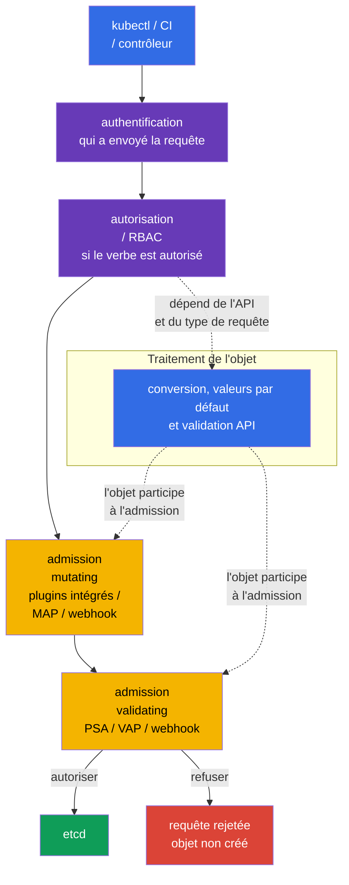

[Русская версия](ru.md) · [Eng version](README.md) · [Versión en español](es.md) · [Deutsche Version](de.md) · [ქართული ვერსია](ge.md) · [繁體中文版](tw.md) · [日本語版](jp.md)

# Chapitre 20. Contrôleurs d'admission et moteurs de politiques : OPA/Gatekeeper et Kyverno

> **Problème.** RBAC peut légitimement autoriser un CI à créer un Deployment, mais il ne vérifie pas que
> son image provient d'un registre approuvé, que son Pod ne contient pas de champs dangereux, ou que l'objet
> possède les labels organisationnels requis. Une revue manuelle du YAML est facilement contournée par un template,
> un client API ou une erreur de pipeline ; sans politique, l'objet atteint etcd et démarre. Le contrôle d'admission
> doit vérifier ou compléter de façon sûre une telle requête avant sa persistance.

> **La suite.** Pod Security Admission du [chapitre 19](../19/fr.md) applique les
> Pod Security Standards prêts à l'emploi, mais ne couvre pas toutes les règles organisationnelles : si un registre est
> autorisé, si un label de propriétaire est obligatoire, si un champ sûr doit être ajouté, ou si un objet lié doit
> être créé. Le contrôle d'admission est la dernière barrière programmable avant l'écriture d'un objet dans
> etcd. Il fait partie du domaine CKS **Minimize Microservice Vulnerabilities** (20 %) : nous construisons ici des
> règles personnalisées avec OPA/Gatekeeper, Kyverno et CEL intégré.

> **Ce dont vous avez besoin depuis CKA.** Le chemin de requête de base `authentication -> authorization ->
> admission -> etcd`, ServiceAccount et RBAC sont traités dans le
> [chapitre 21 de CKA](../../../cka/course/21/fr.md) ; les restrictions de base des containers le sont dans le
> [chapitre 20 de CKA](../../../cka/course/20/fr.md). Ici, nous ne répétons pas ces mécanismes, mais
> transformons les exigences de sécurité en politique vérifiable à l'échelle du cluster.

> 🧠 L'admission évalue les champs d'une requête API déjà autorisée avant son écriture dans etcd ; RBAC n'évalue pas la sécurité du YAML.

## 20.1. Modèle de menace : un manifeste non sûr comme point d'entrée dans le cluster

RBAC répond à la question de savoir si une identité peut créer un Pod. Si un développeur est autorisé à
`create pods`, RBAC n'inspecte pas le contenu du YAML. Le cluster peut donc recevoir
un container `privileged`, `hostPath: /`, une image provenant d'un registre inconnu, un Pod sans
`runAsNonRoot`, ou un Deployment sans label de propriétaire. Un tel objet peut être entièrement autorisé
par RBAC tout en violant le baseline de sécurité.

Le contrôle d'admission reçoit une requête déjà authentifiée et autorisée, mais avant la persistance.
Un contrôleur mutating peut compléter l'objet ; un contrôleur validating l'admet ou le rejette. Si
une étape validating renvoie un refus, l'objet n'apparaît pas dans etcd.



L'ordre d'admission est important : les contrôleurs mutating s'exécutent avant les contrôleurs validating, une
politique validating voit donc l'objet résultant. Le diagramme montre la conversion, les valeurs par défaut et la validation API comme
un traitement conceptuel de l'objet plutôt que comme une étape rigidement positionnée : les détails dépendent de l'API
et du type de requête. Les plugins d'admission intégrés et les webhooks ont leur propre ordre et peuvent être
appelés à nouveau après qu'un autre webhook mutating modifie un objet. La mutation doit être idempotente :
la réappliquer ne doit pas ajouter un deuxième volume, label ou sidecar identique.

| Couche | Question | Exemple |
|---|---|---|
| RBAC | qui peut `create pods` ? | le CI peut créer des Pod uniquement dans `team-a` |
| PSA | un Pod est-il conforme à `baseline`/`restricted` ? | un Pod privileged est interdit dans un namespace restricted |
| politique personnalisée | un objet est-il conforme aux règles organisationnelles ? | image uniquement depuis `registry.example.com` ; label `owner` présent |
| politique mutating | quelle valeur sûre par défaut faut-il ajouter ? | définir `allowPrivilegeEscalation: false` |

PSA et un moteur de politiques ne se remplacent pas l'un l'autre. PSA applique rapidement et uniformément les
restrictions Pod standard. Gatekeeper, Kyverno ou CEL couvrent des exigences spécifiques. Ne dupliquez pas la
même vérification stricte à trois endroits sans raison : un refus devient plus difficile à diagnostiquer, et les
différents messages et exceptions finiront par diverger.

> 🏭 `failurePolicy` définit la réaction à une **erreur technique ou d'évaluation** sur le chemin du webhook d'admission, et non à une décision explicite de politique. Elle s'applique, par exemple, à un timeout, une erreur TLS/DNS/Service/Pod, une réponse HTTP/AdmissionReview malformée, ou une erreur d'évaluation dans `matchConditions`.
>
> L'API server évalue `matchConditions` **avant** d'invoquer le webhook. Si au moins une condition renvoie `false`, le webhook est normalement ignoré. Si aucune n'est `false`, mais qu'au moins une se termine par une erreur, le webhook n'est pas appelé : avec `Fail`, l'API server rejette la requête ; avec `Ignore`, il continue sans ce webhook. Si le webhook a été appelé avec succès et renvoie explicitement `allowed: false`, la requête est rejetée avec `Fail` comme avec `Ignore`.
>
> Avec `Fail`, une telle erreur technique/d'évaluation rejette aussi create/update : la politique ne peut pas être contournée silencieusement, mais une panne du webhook **ou une erreur dans ses `matchConditions`** peut arrêter le déploiement et certaines opérations du control plane. Un webhook critique pour la sécurité doit donc être plus fiable qu'un seul Pod : plusieurs replicas réduisent le risque de panne, un PDB empêche qu'une interruption volontaire retire tous les replicas simultanément, un TLS correct fournit une connexion HTTPS de confiance, et des métriques et alertes d'erreur/latence révèlent une dégradation avant une panne.
>
> Avec `Ignore`, l'API reste disponible, mais lors d'une telle erreur l'objet passe **sans la vérification de ce webhook** - il s'agit d'une fenêtre de contournement délibérée de la politique, et non d'un mode de « refus plus souple ». Une interdiction critique et mature utilise normalement `Fail` ; `Ignore` peut être un compromis temporaire de déploiement ou convenir à un contrôle non critique lorsque le risque de contournement est explicitement accepté.

## 20.2. Webhook : la disponibilité est aussi une décision de sécurité

Gatekeeper et Kyverno s'exécutent généralement comme webhooks d'admission : `kube-apiserver` leur envoie un
`AdmissionReview` via HTTPS, puis attend `allowed: true/false` et d'éventuels patches JSON. Un
webhook possède deux paramètres particulièrement importants dans `MutatingWebhookConfiguration` ou
`ValidatingWebhookConfiguration` :

| Paramètre | Signification de sécurité | Risque |
|---|---|---|
| `failurePolicy: Fail` | une erreur dans le chemin du webhook ou dans `matchConditions` (lorsqu'aucune condition n'est `false`) rejette la requête | une panne du moteur ou une condition CEL erronée bloque le déploiement et parfois des opérations du control plane |
| `failurePolicy: Ignore` | lors d'une telle erreur, l'API server continue la requête sans cette vérification de webhook | fenêtre de contournement de politique pendant une panne ou une erreur de condition |
| `timeoutSeconds` | limite le temps d'attente de l'API server | un timeout excessif retarde chaque create/update |
| `namespaceSelector`/`objectSelector` | restreint le périmètre du webhook | un selector erroné peut ignorer un namespace critique |
| `matchPolicy` | détermine la correspondance des versions d'API | une correspondance inattendue peut appliquer une règle trop largement ou trop étroitement |

Ne modifiez pas aveuglément `failurePolicy` sur un webhook installé par un Helm chart : le chart peut écraser
la modification. Assurez-vous d'abord que le moteur possède plusieurs replicas, un PodDisruptionBudget, TLS et une alerte
sur les erreurs/la latence. Une nouvelle interdiction est plus sûre lorsqu'elle est introduite en audit/warn, après que les
violations existantes ont été corrigées, puis seulement appliquée. Une règle critique et mature utilise normalement `Fail` ;
pour un déploiement initial, empêcher une panne du cluster importe davantage que de la prendre à tort pour la preuve que
la protection fonctionne.

La configuration minimale d'un webhook doit définir explicitement un endpoint, la confiance TLS et le
contrat `AdmissionReview`. Par exemple, le webhook validating ci-dessous utilise un Service ; la structure du
webhook mutating est analogue, mais ajoutez `reinvocationPolicy: IfNeeded` ou `Never` et
rendez la mutation idempotente. `caBundle` est abrégé ici : un manifeste fonctionnel contient le certificat CA
encodé en base64 du webhook.

```yaml
apiVersion: admissionregistration.k8s.io/v1
kind: ValidatingWebhookConfiguration
metadata:
  name: require-owner.example.com
webhooks:
- name: require-owner.example.com
  clientConfig:
    service:
      namespace: policy-system
      name: policy-webhook
      path: /validate
      port: 443
    caBundle: <base64-ca>
  rules:
  - apiGroups: [""]
    apiVersions: ["v1"]
    operations: ["CREATE", "UPDATE"]
    resources: ["pods"]
    scope: "*"
  admissionReviewVersions: ["v1"]
  sideEffects: None
  failurePolicy: Fail
  timeoutSeconds: 5
  matchPolicy: Equivalent
  namespaceSelector:
    matchLabels:
      policy.example.com/enforce-owner: "true"
  matchConditions:
  - name: skip-kube-system
    expression: "request.namespace != 'kube-system'"
```

Le label personnalisé de namespace dans `namespaceSelector` fait partie de la frontière de sécurité : une identité
soumise à la règle ne doit pas pouvoir le supprimer ni le modifier. Pour un périmètre fixe, la correspondance avec
le `kubernetes.io/metadata.name` immuable est plus sûre ; seul un rôle de plateforme/sécurité modifie les
labels d'application personnalisés. Il en va de même pour `objectSelector` : un label qu'un utilisateur peut modifier
sur son objet pour sortir du périmètre ne convient pas comme frontière de refus.

```bash
SUBJECT='system:serviceaccount:team-a:ci'
NS='team-a'
kubectl auth can-i patch namespaces/"$NS" --as="$SUBJECT"
kubectl auth can-i update namespaces/"$NS" --as="$SUBJECT"
# Les deux réponses doivent être `no` pour une identité d'application/CI.
```

Pour un webhook mutating, le même contrat gagne une règle de réinvocation :

```yaml
apiVersion: admissionregistration.k8s.io/v1
kind: MutatingWebhookConfiguration
metadata:
  name: default-security.example.com
webhooks:
- name: default-security.example.com
  clientConfig:
    service:
      namespace: policy-system
      name: policy-webhook
      path: /mutate
    caBundle: <base64-ca>
  rules:
  - apiGroups: [""]
    apiVersions: ["v1"]
    operations: ["CREATE"]
    resources: ["pods"]
  admissionReviewVersions: ["v1"]
  sideEffects: None
  reinvocationPolicy: IfNeeded
  failurePolicy: Fail
  timeoutSeconds: 5
```

```bash
# Quels webhooks sont réellement enregistrés et comment ils se comportent en cas d'erreur.
kubectl get validatingwebhookconfigurations,mutatingwebhookconfigurations
kubectl get validatingwebhookconfiguration <name> -o yaml
kubectl -n gatekeeper-system get pods
kubectl -n kyverno get pods
```

L'admission ne vérifie qu'une requête API. Elle ne remplace pas le scan d'image, la détection à l'exécution,
NetworkPolicy, RBAC ou les logs d'audit. Une image autorisée à l'admission doit toujours passer les
vérifications de supply chain des chapitres 25-28 ; les chapitres 29-32 contrôlent un processus déjà en cours d'exécution.

> 🎯 Reliez `ConstraintTemplate` (code/schema) à `Constraint` (périmètre/paramètres/`enforcementAction`), puis prouvez `dryrun` → `deny`.
>
> Dans cet exemple, le template déclare le type `K8sRequiredLabels`, sa vérification Rego et le paramètre `labels` autorisé ; la contrainte `pods-must-have-owner` est une instance concrète de ce type. Suivez le lien : `match` limite les Pods et les namespaces exclus, `parameters.labels: ["owner"]` transmet l'exigence Rego, et `enforcementAction` sélectionne la réponse à une violation détectée.
>
> Effectuez la preuve avec de nouveaux Pods à exécution unique : en `dryrun`, créez un Pod sans `owner`, vérifiez que l'API l'admet, puis attendez qu'il apparaisse dans `status.violations`. Après avoir appliqué le patch vers `deny`, essayez de créer **un autre** Pod sans `owner` : l'API doit le rejeter. Comme contrôle positif, un Pod avec `owner` doit être admis dans les deux modes. N'utilisez pas seulement un Pod existant ou `--dry-run` pour cela : ils ne prouvent pas que l'admission et l'audit ont été exécutés pour un nouvel objet.

## 20.3. OPA/Gatekeeper : `ConstraintTemplate` et `Constraint`

**OPA** (Open Policy Agent) est un moteur capable de prendre des décisions de politique. **Gatekeeper** le connecte
à l'admission Kubernetes : lorsque quelqu'un essaie de créer ou modifier un objet, l'API server envoie
l'objet à Gatekeeper pour vérification. Si une règle détecte une violation, Gatekeeper signale le résultat -
l'enregistre comme observation, avertit ou rejette la requête. Vous n'avez pas besoin d'écrire Rego ou CEL pour
lire le premier exemple ; l'essentiel est d'abord de comprendre **quelle règle est vérifiée, où elle
s'applique, et ce qui se produit en cas de violation**.

Gatekeeper divise la politique en deux ressources. Ce n'est pas une duplication, mais une façon d'écrire une
règle une fois et de l'appliquer différemment :

1. `ConstraintTemplate` - le **template/plan de règle**. Il stocke le code de vérification en Rego ou
   CEL, le gestionnaire d'admission cible et le schéma OpenAPI des paramètres autorisés. Le schéma vérifie
   les paramètres de la `Constraint` elle-même, et non le Pod directement - par exemple, que `labels` est une
   liste de chaînes. Une fois le template appliqué, Gatekeeper crée une CRD (Custom Resource
   Definition), qui enregistre un nouveau type de ressource dans l'API Kubernetes pour cette règle.
2. `Constraint` - l'**instance de règle activée**. Elle sélectionne un périmètre `match` (quels objets et
   namespaces vérifier), transmet des valeurs par `parameters` et définit `enforcementAction` - ce qu'il faut
   faire lors d'une violation. Réutilisez un template pour différentes équipes, namespaces ou ensembles de
   labels requis en créant une contrainte distincte pour chaque cas.

Retenez le flux : **le template définit la règle -> la contrainte la configure et l'active -> la
création/modification de l'objet entre dans `match` -> Gatekeeper exécute la vérification avec `parameters` ->
`enforcementAction` détermine le résultat**. Cela ressemble à une classe et une instance : un template contient
du code qui nécessite revue et tests ; une contrainte est normalement modifiée plus souvent à mesure que le périmètre de
la politique s'étend. Sélectionnez un moteur dans une cible : le `rego` historique a une priorité plus élevée, et CEL
(`K8sNativeValidation`) dans `code[]` a priorité sur Rego.

### Installation de Gatekeeper et vérification rapide

L'installation est réalisée de façon centralisée, et non lors d'une tâche d'examen. Pour une release Helm, épinglez d'abord la
version du chart dans le manifeste GitOps et vérifiez les valeurs de cette version exacte :

```bash
helm repo add gatekeeper https://open-policy-agent.github.io/gatekeeper/charts
helm repo update
GATEKEEPER_CHART_VERSION="${GATEKEEPER_CHART_VERSION:?set exact chart version}"
helm upgrade --install gatekeeper gatekeeper/gatekeeper \
  --namespace gatekeeper-system --create-namespace \
  --version "$GATEKEEPER_CHART_VERSION"

kubectl -n gatekeeper-system get deploy,pods
kubectl get crd | grep -E 'gatekeeper|constraints.gatekeeper' 
```

La politique ci-dessous exige le label `owner` sur les Pods hors des namespaces système. Elle est plus compacte
qu'une vérification `privileged`, mais démontre chaque partie du modèle et produit un refus compréhensible.

```yaml
# API Gatekeeper pour un template de politique réutilisable.
apiVersion: templates.gatekeeper.sh/v1
# Le template définit un nouveau type de contrainte, mais n'active pas encore la vérification.
kind: ConstraintTemplate
metadata:
  # Nom du template Kubernetes ; il correspond normalement au nom du package Rego.
  name: k8srequiredlabels
spec:
  crd:
    spec:
      names:
        # Type de ressource Constraint que Gatekeeper crée à partir de ce template.
        kind: K8sRequiredLabels
      validation:
        # Le schéma vérifie Constraint spec.parameters, et non le Pod entrant.
        openAPIV3Schema:
          type: object
          properties:
            labels:
              # Constraint transmet à la politique une liste de clés de labels requises.
              type: array
              items:
                type: string
  targets:
  # Cible intégrée invoquée pour les requêtes d'admission create/update.
  - target: admission.k8s.gatekeeper.sh
    # Bloc Rego qui renvoie une violation lorsque la règle est enfreinte.
    rego: |
      # Namespace de la politique Rego.
      package k8srequiredlabels

      # Crée une violation pour chaque label requis manquant.
      violation[{"msg": msg}] {
        # Prend une valeur à la fois depuis Constraint spec.parameters.labels.
        required := input.parameters.labels[_]
        # input.review.object est le Pod de la requête d'admission actuelle.
        not input.review.object.metadata.labels[required]
        # Le message apparaît dans le statut d'audit ou dans une réponse de refus.
        msg := sprintf("missing required label: %v", [required])
      }
---
# API et kind de l'instance créée par ce ConstraintTemplate.
apiVersion: constraints.gatekeeper.sh/v1beta1
kind: K8sRequiredLabels
metadata:
  # Nom unique de cette politique spécifiquement activée.
  name: pods-must-have-owner
spec:
  # Audit uniquement : enregistre la violation mais ne bloque pas encore les Pods.
  enforcementAction: dryrun
  match:
    # N'appliquez pas la règle aux namespaces système.
    excludedNamespaces: ["kube-system", "gatekeeper-system", "kyverno"]
    kinds:
    # Un groupe API vide désigne l'API core/v1.
    - apiGroups: [""]
      # Vérifie uniquement les Pods, et non chaque objet Kubernetes.
      kinds: ["Pod"]
  parameters:
    # Valeur de input.parameters.labels dans Rego : le label owner est requis.
    labels: ["owner"]
```

#### Comment lire cette politique

Gatekeeper examine d'abord `match` dans la `Constraint`. Ici, il vérifie uniquement les Pods et ignore les
namespaces système indiqués ; un objet hors du périmètre n'atteint jamais cette règle. Pour chaque
create/update correspondant, Gatekeeper forme `input.review.object` : le Pod entrant sous la forme de l'API Kubernetes.
En même temps, il transmet les `spec.parameters` de la contrainte dans `input.parameters`. Ainsi,
dans cet exemple, `input.parameters.labels` est égal à `["owner"]`.

En Rego, une règle est un ensemble de conditions reliées par un **ET** logique. Lisez-la de bas en haut comme
« créez une violation si chaque ligne du corps réussit » :

- `required := input.parameters.labels[_]` itère sur chaque label requis ; `_` signifie « l'élément
  suivant du tableau ». Ici, la seule valeur est `owner`.
- `not input.review.object.metadata.labels[required]` est vrai lorsque le Pod entrant ne possède pas cette
  clé de label.
- `msg := ...` forme un message clair et `violation[{"msg": msg}]` est le résultat spécial que
  Gatekeeper considère comme une violation. Avec `dryrun`, il apparaît dans `status.violations` ; avec
  `deny`, l'API server renvoie ce message et ne crée pas le Pod.

Pour une première politique, retenez quatre idées Rego : `input` est des données d'entrée en lecture seule, `:=` stocke une
valeur trouvée dans une variable, `[_]` itère sur une liste, et `not` décrit l'absence/l'échec d'une
condition. Vous n'avez pas besoin de `if/else` séparés : si le corps de la règle ne peut pas être prouvé, aucune `violation`
n'est créée. Cette politique vérifie la **présence** de la clé `owner` ; si une organisation exige une valeur
non vide ou formatée, ajoutez une condition distincte.

#### Modèle rapide d'examen : périmètre de namespace et interdiction de `latest`

Transformez d'abord une tâche en quatre champs : **quoi** vérifier (Pod et image), **où**
(`match.namespaces`), la **condition de violation** (l'image utilise `latest`) et la **réponse**
(`dryrun`, puis `deny`). Pour `owner` dans un namespace, aucun nouveau template n'est nécessaire : remplacez
`excludedNamespaces` dans `K8sRequiredLabels` par `namespaces: ["team-a"]` et conservez
`parameters.labels: ["owner"]`.

Pour une interdiction distincte de `latest`, écrivez et appliquez le template ci-dessous dans un seul fichier. Il vérifie les
containers ordinaires, init et ephemeral : vérifier seulement `spec.containers` laisserait un contournement.
La fonction traite à la fois le tag explicite `:latest` et une image sans tag (par exemple `nginx`, pour
laquelle Kubernetes implique `latest`) comme des violations ; un digest `@sha256:...` n'est pas latest.

```yaml
# API Gatekeeper pour un template qui interdit le tag d'image latest.
apiVersion: templates.gatekeeper.sh/v1
# Le template contient Rego ; la Constraint ci-dessous sélectionne son périmètre et son mode de réponse.
kind: ConstraintTemplate
metadata:
  # Nom du template Kubernetes.
  name: k8sdisallowlatest
spec:
  crd:
    spec:
      names:
        # Kind de Constraint qui utilise ce template.
        kind: K8sDisallowLatest
      validation:
        # Cette politique n'a pas de paramètres configurables, mais le schéma décrit toujours un objet.
        openAPIV3Schema:
          type: object
          properties: {}
  targets:
  # Attache la vérification au gestionnaire d'admission de Gatekeeper.
  - target: admission.k8s.gatekeeper.sh
    rego: |
      # Namespace de la politique Rego.
      package k8sdisallowlatest

      # Collecte les containers des trois listes PodSpec afin de ne pas laisser de contournement.
      pod_containers[container] {
        container := input.review.object.spec.containers[_]
      }
      pod_containers[container] {
        container := input.review.object.spec.initContainers[_]
      }
      pod_containers[container] {
        container := input.review.object.spec.ephemeralContainers[_]
      }

      # Un tag :latest explicite est interdit.
      image_uses_latest(image) {
        endswith(image, ":latest")
      }
      # Kubernetes traite une image sans tag (par exemple nginx) comme latest ; le digest est autorisé.
      image_uses_latest(image) {
        not contains(image, "@")
        path := split(image, "/")
        last := path[count(path) - 1]
        not contains(last, ":")
      }

      # Renvoie une violation Gatekeeper pour chaque container avec une image latest.
      violation[{"msg": msg}] {
        container := pod_containers[_]
        image_uses_latest(container.image)
        msg := sprintf("image %q must not use the latest tag", [container.image])
      }
---
# Instance du template : active l'interdiction uniquement dans le périmètre sélectionné.
apiVersion: constraints.gatekeeper.sh/v1beta1
kind: K8sDisallowLatest
metadata:
  # Nom unique d'une politique à périmètre spécifique au namespace.
  name: pods-without-latest-in-team-a
spec:
  # Commencez par l'audit ; remplacez par deny après vérification.
  enforcementAction: dryrun
  match:
    # Périmètre : la politique s'applique uniquement aux Pods du namespace team-a.
    namespaces: ["team-a"]
    kinds:
    # Groupe API core/v1.
    - apiGroups: [""]
      # Vérifie exactement les requêtes d'admission Pod.
      kinds: ["Pod"]
```

Lors de l'examen, ne tentez pas d'abord de construire un framework universel : utilisez le minimum de
`ConstraintTemplate`, spécifiez le `kind`/`match` exact et une condition `violation`. Testez ensuite les
cas négatif et positif : dans `team-a`, un Pod avec `nginx:latest` doit d'abord apparaître dans
les violations, puis être rejeté après le passage à `deny`, tandis qu'un Pod avec `nginx:1.27` doit passer.
Vérifiez le périmètre séparément : la même tentative hors de `team-a` ne doit pas correspondre à cette contrainte.

```bash
kubectl apply -f gatekeeper-owner.yaml
kubectl get constrainttemplates
kubectl get k8srequiredlabels
kubectl describe k8srequiredlabels pods-must-have-owner
```

`enforcementAction: dryrun` collecte les violations dans `status.violations`, mais ne bloque pas une
requête. Après avoir corrigé les Pods existants et vérifié le périmètre, passez à `deny`. Certaines versions de Gatekeeper
prennent aussi en charge `warn` ; vérifiez les actions exactement disponibles par rapport à la CRD installée, et non à un
exemple aléatoire d'une autre version.

```bash
kubectl get k8srequiredlabels pods-must-have-owner \
  -o jsonpath='{range .status.violations[*]}{.kind}/{.name}{": "}{.message}{"\n"}{end}'

# Seulement après l'audit et la correction des workloads.
kubectl patch k8srequiredlabels pods-must-have-owner --type merge \
  -p '{"spec":{"enforcementAction":"deny"}}'
```

### Exemple Gatekeeper pour le champ dangereux `privileged`

Pour une interdiction critique pour la sécurité, un template doit vérifier les `containers` ordinaires, `initContainers` et
`ephemeralContainers` ; sinon, une liste demeure un chemin de contournement.

```rego
package k8sdisallowprivileged

violation[{"msg": msg}] {
  container := input.review.object.spec.containers[_]
  container.securityContext.privileged == true
  msg := sprintf("privileged container %q is not allowed", [container.name])
}

violation[{"msg": msg}] {
  container := input.review.object.spec.initContainers[_]
  container.securityContext.privileged == true
  msg := sprintf("privileged initContainer %q is not allowed", [container.name])
}

violation[{"msg": msg}] {
  container := input.review.object.spec.ephemeralContainers[_]
  container.securityContext.privileged == true
  msg := sprintf("privileged ephemeralContainer %q is not allowed", [container.name])
}
```

La condition `container.securityContext.privileged == true` ne correspond pas à un champ absent, donc
la valeur par défaut `false` est admise. PSA `restricted` couvre déjà cette classe d'exigence - utilisez
Rego personnalisé seulement lorsque vous avez besoin d'un périmètre, d'exemptions ou d'une logique étendue personnalisés.

> 🔬 API Kyverno CEL pour la validation, la mutation, la génération et d'autres scénarios d'admission.

## 20.4. Kyverno 1.19 : types de politiques basés sur CEL

> **Note de compatibilité.** Kyverno v1.19 prend officiellement en charge Kubernetes v1.33-v1.35
> (`kyverno.io/docs/installation/releases/`, publiée en août 2026). Le lab principal de ce chapitre
> (Lab108) s'exécute sur Kubernetes v1.36 - une combinaison délibérément tournée vers l'avenir qui
> **ne fait pas partie** de la matrice de prise en charge de Kyverno v1.19 testée et garantie.
> L'installation et les scénarios de base fonctionnent normalement, mais cette paire de versions
> n'est pas couverte par une compatibilité officiellement testée ; ne considérez donc pas une
> installation réussie comme la preuve d'une prise en charge complète de v1.36. Pour préparer
> l'examen actuel (orienté vers v1.35), vérifiez séparément le comportement sur v1.35, où Kyverno
> v1.19 est officiellement testé. Vérifiez la compatibilité des composants d'admission tiers
> (Kyverno, Gatekeeper et équivalents) avec leur propre matrice de publication, indépendamment de
> la version de Kubernetes du cours.

### Comment lire une politique Kyverno CEL

Kyverno est un moteur de politiques Kubernetes : ses contrôleurs et son webhook d'admission lisent
des ressources de politique depuis l'API et réagissent aux opérations sur les objets. Dans les
nouveaux types basés sur CEL, la politique est une ressource YAML ordinaire, tandis que CEL est un
langage d'expressions concis dans un champ `expression`. Il ne remplace pas YAML et n'est pas un
script shell : une expression reçoit des données d'entrée, telles que `object` - l'objet de la
requête d'admission actuelle - et évalue une valeur.

Lors de la première lecture, parcourez chaque exemple selon un même flux : **quelle opération et
quelle ressource correspondent à `matchConstraints` -> quelles conditions supplémentaires sont
satisfaites -> ce que fait la politique**. Une `ValidatingPolicy` évalue une expression booléenne :
`true` admet un objet et `false` produit une violation ; `Audit` ne fait que l'enregistrer, tandis
que `Deny` rejette la requête. Une `MutatingPolicy` renvoie une modification de l'objet avant sa
persistance. Une `GeneratingPolicy` demande à un contrôleur d'arrière-plan de créer ou de
synchroniser un autre objet après qu'une ressource source correspond. La génération n'est donc pas
un refus d'admission instantané.

Choisissez le type selon le résultat, et non selon la syntaxe CEL : `ValidatingPolicy` vérifie et,
si nécessaire, interdit ; `MutatingPolicy` ajoute une valeur par défaut sécurisée ;
`GeneratingPolicy` crée une ressource associée ; `DeletingPolicy` supprime selon une règle ;
`ImageValidatingPolicy` vérifie une image. Les types à l'échelle du cluster agissent dans leur
périmètre défini ; des variantes `Namespaced...` existent et n'agissent que dans leur namespace.
Ne mélangez pas ces ressources avec les anciennes `Policy`/`ClusterPolicy` : elles utilisent une
autre API et d'autres champs.

À partir de Kyverno 1.19, la voie principale est constituée de types distincts à l'échelle du
cluster, basés sur CEL et appartenant au groupe `policies.kyverno.io/v1` : `ValidatingPolicy`,
`MutatingPolicy`, `GeneratingPolicy`, `DeletingPolicy` et `ImageValidatingPolicy`. Chacun possède
une variante namespaced - `NamespacedValidatingPolicy`, `NamespacedMutatingPolicy`,
`NamespacedGeneratingPolicy`, `NamespacedDeletingPolicy` ou `NamespacedImageValidatingPolicy` -
qui agit uniquement dans son propre namespace. Les anciennes `Policy` et `ClusterPolicy`
(`kyverno.io/v1`), ainsi que `CleanupPolicy` (`kyverno.io/v2`), sont dépréciées dans 1.19 et seront
supprimées dans 1.20. Ne mélangez pas les champs des deux modèles dans un même objet.

Le cours a testé Kyverno `v1.19.x` avec le chart Helm `3.9.0`. Après l'installation, vérifiez
spécifiquement les nouvelles CRD et l'image effective du contrôleur :

```bash
helm upgrade --install kyverno kyverno/kyverno \
  --namespace kyverno --create-namespace --version 3.9.0
kubectl get crd validatingpolicies.policies.kyverno.io \
  mutatingpolicies.policies.kyverno.io \
  generatingpolicies.policies.kyverno.io \
  deletingpolicies.policies.kyverno.io \
  imagevalidatingpolicies.policies.kyverno.io
kubectl -n kyverno get deploy -o jsonpath='{..image}'
```

### `ValidatingPolicy` : exiger `runAsNonRoot`

Une `ValidatingPolicy` ne modifie rien : elle répond à la question « cet objet peut-il être admis ? ».
La politique correspond d'abord à la création/mise à jour d'un Pod, puis CEL reçoit le Pod comme
`object`. L'expression doit renvoyer `true` ; sinon Kyverno crée une violation avec `message`.
`Audit` autorise la requête et collecte le résultat afin de corriger les manifestes ; après avoir
vérifié le périmètre réel, passez à `Deny`, qui rejette un tel Pod. La vérification ci-dessous
exige une base de référence explicite au niveau du Pod ; elle ne remplace pas PSS `restricted` dans son
intégralité.

```yaml
# API de la nouvelle politique Kyverno basée sur CEL.
apiVersion: policies.kyverno.io/v1
# La validation ne modifie pas l'objet : elle admet ou enregistre/rejette une violation.
kind: ValidatingPolicy
metadata:
  # Nom de politique unique dans le cluster.
  name: require-pod-run-as-non-root
spec:
  # Uniquement Audit au départ : la requête n'est pas bloquée et la violation peut être étudiée.
  validationActions: [Audit]
  matchConstraints:
    resourceRules:
    # Pod core/v1 ; vérifier à la fois la création et les modifications ultérieures.
    - apiGroups: [""]
      apiVersions: ["v1"]
      operations: ["CREATE", "UPDATE"]
      resources: ["pods"]
  validations:
  # L'expression doit renvoyer true pour chaque Pod correspondant.
  - message: "Pod spec.securityContext.runAsNonRoot must be true"
    expression: >-
      // has empêche l'accès à un securityContext absent.
      has(object.spec.securityContext) &&
      // ? lit un champ facultatif en toute sécurité ; l'absence ou false donne false.
      object.spec.securityContext.?runAsNonRoot.orValue(false)
```

```bash
kubectl apply -f kyverno-run-as-non-root.yaml
kubectl get validatingpolicy require-pod-run-as-non-root
kubectl patch validatingpolicy require-pod-run-as-non-root --type merge \
  -p '{"spec":{"validationActions":["Deny"]}}'
```

### `MutatingPolicy` : marquage transparent

Une `MutatingPolicy` ne répond pas à « admettre ou rejeter », mais à « quelle valeur par défaut
sécurisée ajouter à un objet déjà admis ? ». Après correspondance, elle construit un fragment
d'objet modifié et le serveur API persiste le résultat. Une mutation ne doit pas masquer une image
non sécurisée : une validation explicite est généralement préférable pour les champs critiques
pour la sécurité. Cet exemple pédagogique sûr ajoute seulement un label d'audit.
`ApplyConfiguration` signifie que CEL construit le fragment souhaité sous la forme `Object{...}`
et que Kyverno l'applique à la place de l'ancien `patchStrategicMerge` :

```yaml
# API de politique Kyverno basée sur CEL qui modifie un objet avant sa persistance.
apiVersion: policies.kyverno.io/v1
kind: MutatingPolicy
metadata:
  # Nom de politique qui ajoute un label d'audit traçable.
  name: mark-kyverno-managed-pods
spec:
  matchConstraints:
    resourceRules:
    # Ne modifier que les nouveaux Pods core/v1, et non chaque ressource.
    - apiGroups: [""]
      apiVersions: ["v1"]
      operations: ["CREATE"]
      resources: ["pods"]
  mutations:
  # ApplyConfiguration applique le fragment construit par CEL à l'objet entrant.
  - patchType: ApplyConfiguration
    applyConfiguration:
      expression: >-
        // Object{...} est la représentation CEL du fragment d'objet Kubernetes souhaité.
        Object{
          metadata: Object.metadata{
            // Ajoute un label sans remplacer les autres metadata.labels.
            labels: {"security.example.com/policy": "kyverno"}
          }
        }
```

### `GeneratingPolicy` : refus entrant par défaut pour un nouveau Namespace

Une `GeneratingPolicy` répond à un objet source et demande à un contrôleur d'arrière-plan distinct
de créer une ressource en aval. Dans cet exemple, la source est un nouveau Namespace et le résultat
est une `NetworkPolicy` dans celui-ci. Le modèle YAML reste lisible, tandis que CEL calcule et
substitue le nom du Namespace. Avec `synchronize.enabled: true`, Kyverno continue de comparer et
de synchroniser l'objet généré avec la politique. Cela ne constitue pas une affirmation sur les
`ownerReferences` de Kubernetes et ne remplace pas une attribution explicite des responsabilités :
ne chargez pas simultanément un contrôleur GitOps et Kyverno de synchroniser le même objet.

```yaml
# API de politique basée sur CEL qui crée/synchronise une ressource en aval.
apiVersion: policies.kyverno.io/v1
kind: GeneratingPolicy
metadata:
  # Nom de politique pour la NetworkPolicy d'un nouveau Namespace.
  name: generate-default-deny-ingress
spec:
  evaluation:
    synchronize:
      # Le contrôleur d'arrière-plan continue de comparer la NetworkPolicy générée avec le modèle.
      enabled: true
  matchConstraints:
    resourceRules:
    # Le déclencheur est la création d'un Namespace core/v1.
    - apiGroups: [""]
      apiVersions: ["v1"]
      operations: ["CREATE"]
      resources: ["namespaces"]
  matchConditions:
  # Ne pas générer de politique dans les namespaces système.
  - name: skip-system-namespaces
    expression: >-
      !(object.metadata.name in
      ["kube-system", "kube-public", "kube-node-lease", "kyverno"])
  variables:
  # Conserver le nom du Namespace source pour l'utiliser dans le modèle YAML.
  - name: namespaceName
    expression: object.metadata.name
  generate:
  - template:
      # Substituer la variable CEL dans YAML entre (( ... )).
      interpolate: cel
      value: |
        apiVersion: networking.k8s.io/v1
        kind: NetworkPolicy
        metadata:
          # Nom fixe de la NetworkPolicy en aval.
          name: default-deny-ingress
          # La créer dans le Namespace qui a déclenché la politique.
          namespace: (( variables.namespaceName ))
          labels:
            # Permet d'identifier le propriétaire de l'objet généré.
            app.kubernetes.io/managed-by: kyverno
        spec:
          # Un sélecteur vide couvre chaque Pod du Namespace.
          podSelector: {}
          # Refus par défaut uniquement pour le trafic entrant ; définir l'egress séparément.
          policyTypes: [Ingress]
```

Il s'agit uniquement d'un refus entrant par défaut. Définissez l'egress, DNS et les connexions
autorisées dans des ressources `NetworkPolicy` distinctes - voir le [chapitre 04](../04/fr.md).

Une `GeneratingPolicy` est un mécanisme de provisionnement/réconciliation, et non une barrière
d'admission atomique : un Namespace est créé avant qu'il puisse être garanti qu'un contrôleur
d'arrière-plan crée la `NetworkPolicy` en aval. Avant de confier l'identité de workload du namespace,
confirmez la base de référence effective, par exemple avec `kubectl -n <new-namespace> get networkpolicy default-deny-ingress` ;
l'existence de la `GeneratingPolicy` seule ne le prouve pas.

Avant d'utiliser la génération, vérifiez les autorisations du ServiceAccount réel du contrôleur
d'arrière-plan sur la ressource cible. Avec `synchronize.enabled: true`, la lecture/surveillance et
la gestion de la ressource en aval sont toutes deux nécessaires ; les six vérifications ci-dessous
doivent toutes renvoyer `yes` :

```bash
KYVERNO_BG='system:serviceaccount:kyverno:kyverno-background-controller'
for verb in get list watch create update delete; do
  kubectl auth can-i "$verb" networkpolicies.networking.k8s.io \
    --all-namespaces --as="$KYVERNO_BG"
done
```

### Migration d'une politique legacy

Inventoriez les ressources legacy avec
`kubectl get policies.kyverno.io,clusterpolicies.kyverno.io` (ou `kubectl get pol,cpol`), ainsi
que `CleanupPolicy`, en consignant le comportement à l'aide de tests positifs et négatifs.
Déplacez les règles de validation/mutation/génération/suppression/image vers le nouveau type
pertinent et ne retirez un objet legacy qu'après avoir vérifié les rapports d'admission et
d'arrière-plan. En production, comparez le [guide de migration Kyverno](https://kyverno.io/docs/guides/migration-to-cel/)
avec la version mineure installée.

> 🏭 Le choix du moteur dépend de la propriété des politiques, du langage, de la CI et du webhook ; ne dupliquez pas un contrôle de refus sans raison.

## 20.5. Gatekeeper et Kyverno : que choisir

Les deux moteurs peuvent refuser un Pod non sûr, collecter les violations d'audit et fonctionner via
un webhook d'admission. Le langage, le modèle et la facilité d'utilisation d'une règle donnée diffèrent.

| Critère | Gatekeeper / OPA | Kyverno |
|---|---|---|
| Langage de vérification | Rego ou CEL dans `ConstraintTemplate` | CEL et modèles YAML |
| Modèle de ressource | `ConstraintTemplate` avec Rego/CEL + `Constraint` | types de politiques distincts basés sur CEL, y compris les variantes namespaced |
| Validate | oui | oui |
| Mutate | ressources mutator distinctes, possibilités selon la version | `MutatingPolicy` |
| Generate | pas le scénario principal | `GeneratingPolicy` |
| Delete / cleanup | pas le scénario principal | `DeletingPolicy` |
| Logique complexe et utilisation externe d'OPA | point fort de Rego | possible, mais YAML est plus simple à lire pour les politiques K8s |
| Seuil d'adoption pour une équipe habituée au YAML Kubernetes | plus élevé | plus bas |

Ce choix ne signifie pas que l'autre outil est moins bon. Si l'organisation utilise déjà OPA pour
Terraform, la passerelle API et la CI, Gatekeeper réduit le nombre de langages de politiques. Si
la mutation, la génération et la revue dans le YAML Kubernetes habituel sont nécessaires, Kyverno
est souvent plus simple. N'installez pas les deux uniquement pour des règles identiques : deux
webhooks augmentent la latence, la surface opérationnelle et le risque de refus contradictoires.
Un partage des responsabilités est acceptable s'il est documenté : par exemple, Gatekeeper pour
les contraintes Rego complexes, Kyverno pour la mutation et la vérification d'image.

Dans les deux cas, la politique est du code : conservez `ConstraintTemplate`/`Constraint` ou les
politiques Kyverno basées sur CEL dans Git, désignez un responsable et des tests, appliquez-les en
staging, commencez par audit/warn et conservez les preuves des violations. Avant le cluster,
ajoutez à la CI un mini-lab avec un fixture autorisé et un fixture refusé. Pour Gatekeeper,
utilisez les Suite/Test/Case déclaratifs (`apiVersion: test.gatekeeper.sh/v1alpha1`, `kind: Suite`)
plutôt qu'un fixture refusé directement avec `gator test` : avec une Constraint de refus, une
violation trouvée donne à `gator test` le code de sortie 1, bien que la politique fonctionne
correctement. Vérifiez Kyverno avec `kyverno test --require-tests`, afin que l'absence de manifest
de test ne rende pas le pipeline vert. La CI doit échouer si un manifest autorisé est refusé ou
si un manifest refusé est accepté. Une exception doit être étroite, limitée dans le temps et
visible dans la revue - pas un `excludedNamespaces: ["*"]` global.

> 🏭 Les fixtures de CI doivent accepter l'objet autorisé et refuser l'objet interdit avant l'admission dans le cluster.

### Mini-lab CI : vérifier la politique avant le rollout

Les manifests positifs et négatifs doivent vivre à côté de la politique dans Git. Conservez le
template et la constraint dans `templates-and-constraints/template.yaml` et
`templates-and-constraints/constraint.yaml`, les fixtures dans `allowed.yaml` et `denied.yaml`, et
créez à côté `suite.yaml` :

```yaml
apiVersion: test.gatekeeper.sh/v1alpha1
kind: Suite
tests:
- name: require-owner
  template: templates-and-constraints/template.yaml
  constraint: templates-and-constraints/constraint.yaml
  cases:
  - name: allowed-has-owner
    object: allowed.yaml
    assertions:
    - violations: no
  - name: denied-missing-owner
    object: denied.yaml
    assertions:
    - violations: yes
```

```bash
# Les deux résultats attendus donnent un code de sortie réussi : le fixture refusé doit avoir une violation.
gator verify suite.yaml                    # ou : gator verify ./...

# Kyverno : le pipeline échoue si kyverno-test.yaml est introuvable.
kyverno test --require-tests ./policy/kyverno
```

`gator verify` traite `violations: no` pour le fixture autorisé et `violations: yes` pour le
fixture refusé comme des assertions attendues ; le job ne deviendra donc rouge qu'en cas de
régression de la politique ou des fixtures. Utilisez les commandes et la structure de fichiers
correspondant à la version épinglée de la CLI ; le test d'admission du cluster reste une étape
distincte de la CI d'intégration.

> 🔬 CEL natif s'exécute dans l'API server sans webhook, mais ne couvre ni la génération, ni les rapports, ni la vérification de signature, ni la logique Rego complexe.

## 20.6. CEL natif : validation et mutation sans webhook externe

`ValidatingAdmissionPolicy` (VAP) et `ValidatingAdmissionPolicyBinding` définissent une
validation intégrée en CEL. Dans Kubernetes 1.36, `MutatingAdmissionPolicy` (MAP) et
`MutatingAdmissionPolicyBinding` sont devenus stable et activés par défaut. MAP est une mutation
in-process à l'intérieur de l'API server : CEL renvoie soit un `ApplyConfiguration`, qui est
fusionné selon les règles de server-side apply, soit un `JSONPatch`. Pour les deux API natives,
un binding est obligatoire : c'est lui qui lie la politique à son scope, et sans binding la
politique ne s'applique pas.

VAP reste un mécanisme de validation uniquement : il ne modifie ni ne génère d'objets. Associée
à MAP, la pile native VAP + MAP sait déjà réaliser la mutation et la validation sans webhook,
mais ne remplace pas un moteur pour la génération, les rapports de politique, la vérification de
signature d'image, les données externes complexes ou Rego.

### `MutatingAdmissionPolicy` : ajouter un label sûr dans un scope limité

L'exemple ci-dessous s'applique uniquement aux Pod dans un namespace portant le label
`policy.example.com/native-mutation=true`. `ApplyConfiguration` est pratique pour ajouter un
champ ; pour des opérations précises sur des tableaux ou des chemins, utilisez `JSONPatch` avec
la liste CEL `JSONPatch{...}`. `spec.reinvocationPolicy` est obligatoire : `Never` ne rappelle
pas MAP, tandis que `IfNeeded` permet une nouvelle évaluation après la mutation d'autres étapes
d'admission. L'ordre avec les autres plugins/webhooks mutating n'est pas garanti ; la mutation
doit donc être idempotente. N'utilisez pas la mutation comme substitut à une validation de
sécurité obligatoire.

```yaml
apiVersion: admissionregistration.k8s.io/v1
kind: MutatingAdmissionPolicy
metadata:
  name: add-native-admission-label
spec:
  failurePolicy: Fail
  reinvocationPolicy: IfNeeded
  matchConstraints:
    resourceRules:
    - apiGroups: [""]
      apiVersions: ["v1"]
      operations: ["CREATE"]
      resources: ["pods"]
  mutations:
  - patchType: ApplyConfiguration
    applyConfiguration:
      expression: >-
        Object{
          metadata: Object.metadata{
            labels: {"admission.example.com/mutated": "true"}
          }
        }
---
apiVersion: admissionregistration.k8s.io/v1
kind: MutatingAdmissionPolicyBinding
metadata:
  name: add-native-admission-label
spec:
  policyName: add-native-admission-label
  matchResources:
    namespaceSelector:
      matchLabels:
        policy.example.com/native-mutation: "true"
```

La pratique doit vérifier à la fois le scope et sa frontière négative. Enregistrez le YAML
ci-dessus sous `map-add-label.yaml`, puis exécutez :

```bash
kubectl apply -f map-add-label.yaml
kubectl create namespace native-map-on
kubectl label namespace native-map-on policy.example.com/native-mutation=true
kubectl create namespace native-map-off

cat <<'EOF' >/tmp/native-map-pod.yaml
apiVersion: v1
kind: Pod
metadata:
  name: native-map-test
spec:
  containers:
  - name: pause
    image: registry.k8s.io/pause:3.10
EOF

# Le binding de scope correspond : le server-side dry-run renvoie le label ajouté.
kubectl -n native-map-on create --dry-run=server -o yaml -f /tmp/native-map-pod.yaml

# Test négatif du binding : dans un namespace sans label de sélecteur, la mutation est absente.
if kubectl -n native-map-off create --dry-run=server -o yaml \
  -f /tmp/native-map-pod.yaml | grep -q 'admission.example.com/mutated: "true"'; then
  echo "MAP a été appliquée hors du scope"
  exit 1
fi
```

### `ValidatingAdmissionPolicy` : exiger un non-root effectif

VAP doit vérifier la configuration effective de chaque processus, et pas seulement la valeur par
défaut au niveau du Pod : `securityContext.runAsNonRoot` au niveau du conteneur est prioritaire.
L'expression ci-dessous autorise `true` au niveau du conteneur ou l'absence de ce champ lorsque
la valeur au niveau du Pod est `true`, mais refuse `false` explicite et `runAsUser: 0` tant au
niveau du Pod que des conteneurs ordinaires, init et ephemeral.

```yaml
apiVersion: admissionregistration.k8s.io/v1
kind: ValidatingAdmissionPolicy
metadata:
  name: require-pod-run-as-non-root
spec:
  failurePolicy: Fail
  matchConstraints:
    resourceRules:
    - apiGroups: [""]
      apiVersions: ["v1"]
      operations: ["CREATE", "UPDATE"]
      resources: ["pods"]
  variables:
  - name: podRunAsNonRoot
    expression: >-
      has(object.spec.securityContext) &&
      has(object.spec.securityContext.runAsNonRoot) &&
      object.spec.securityContext.runAsNonRoot == true
  - name: allContainers
    expression: >-
      object.spec.containers +
      (has(object.spec.initContainers) ? object.spec.initContainers : []) +
      (has(object.spec.ephemeralContainers) ? object.spec.ephemeralContainers : [])
  validations:
  - expression: >-
      !has(object.spec.securityContext) ||
      !has(object.spec.securityContext.runAsUser) ||
      object.spec.securityContext.runAsUser != 0
    message: "Pod-level runAsUser: 0 is forbidden"
  - expression: >-
      variables.allContainers.all(c,
        (!has(c.securityContext) || !has(c.securityContext.runAsUser) ||
          c.securityContext.runAsUser != 0) &&
        ((has(c.securityContext) && has(c.securityContext.runAsNonRoot)) ?
          c.securityContext.runAsNonRoot == true : variables.podRunAsNonRoot)
      )
    message: "Every app, init and ephemeral container must effectively run non-root; runAsUser: 0 is forbidden"
---
apiVersion: admissionregistration.k8s.io/v1
kind: ValidatingAdmissionPolicyBinding
metadata:
  name: require-pod-run-as-non-root
spec:
  policyName: require-pod-run-as-non-root
  validationActions: ["Deny"]
  matchResources:
    namespaceSelector:
      matchLabels:
        policy.example.com/enforce-non-root: "true"
```

`object` dans CEL est l'objet vérifié ; le contexte de requête, `oldObject` et les paramètres du
binding sont également disponibles. `failurePolicy` de VAP/MAP concerne une erreur d'évaluation
de la politique, et non la disponibilité réseau : il n'y a pas de webhook externe ici. Ne publiez
pas une expression CEL non vérifiée avec `Deny` sur l'ensemble du cluster : restreignez le
sélecteur, commencez par `Audit`/`Warn` et vérifiez les cas positif et négatif.

```bash
kubectl apply -f vap-run-as-non-root.yaml
kubectl label namespace team-example policy.example.com/enforce-non-root=true
kubectl get validatingadmissionpolicy,validatingadmissionpolicybinding
kubectl get mutatingadmissionpolicy,mutatingadmissionpolicybinding
```

### VAP paramétrée : logique de politique séparée de la limite de l'équipe

`paramKind` définit le type de ressource de paramètre, le binding sélectionne un objet concret
via `paramRef`, et CEL le reçoit comme `params`. Ici, un `ConfigMap` limite les replicas ;
`matchConditions` n'évalue pas la politique pour les requêtes du kubelet.

```yaml
apiVersion: admissionregistration.k8s.io/v1
kind: ValidatingAdmissionPolicy
metadata:
  name: deployment-replica-limit
spec:
  failurePolicy: Fail
  paramKind:
    apiVersion: v1
    kind: ConfigMap
  matchConstraints:
    resourceRules:
    - apiGroups: ["apps"]
      apiVersions: ["v1"]
      operations: ["CREATE", "UPDATE"]
      resources: ["deployments"]
  matchConditions:
  - name: exclude-kubelet
    expression: '!("system:nodes" in request.userInfo.groups)'
  variables:
  - name: limit
    expression: 'int(params.data["maxReplicas"])'
  validations:
  - expression: "params != null && object.spec.replicas <= variables.limit"
    message: "replicas exceed the team limit"
---
apiVersion: v1
kind: ConfigMap
metadata:
  name: team-a-replica-limit
  namespace: policy-system
data:
  maxReplicas: "5"
---
apiVersion: admissionregistration.k8s.io/v1
kind: ValidatingAdmissionPolicyBinding
metadata:
  name: deployment-replica-limit-team-a
spec:
  policyName: deployment-replica-limit
  validationActions: [Deny]
  paramRef:
    name: team-a-replica-limit
    namespace: policy-system
    parameterNotFoundAction: Deny
  matchResources:
    namespaceSelector:
      matchLabels:
        team: a
```

Une même politique peut avoir plusieurs bindings et ressources de paramètres pour différentes
équipes ; toutes les combinaisons correspondantes doivent réussir. `parameterNotFoundAction: Deny`
associé à `failurePolicy: Fail` ne transforme pas une configuration absente en contournement.

VAP effectue un contrôle d'autorisation sur la ressource de paramètre : le demandeur correspondant
doit avoir l'accès `read` à `paramKind`/`paramRef`, sinon une requête correcte peut être refusée.
Avant `Deny`, vérifiez l'identité réelle ; accordez-lui seulement `get`, et non le droit de
modifier le paramètre, et ne stockez pas de données sensibles à la sécurité dans un ConfigMap que
les identités de workload doivent lire.

```bash
SUBJECT='system:serviceaccount:team-a:ci'
kubectl auth can-i get configmap/team-a-replica-limit   -n policy-system --as="$SUBJECT"
```

> 🔬 **Approfondissement — Contrôle d'admission basé sur les manifestes.** Dans la baseline de formation Kubernetes v1.36, la fonctionnalité est Alpha et désactivée par défaut. Dans Kubernetes upstream v1.37, elle est passée en Beta et est activée par défaut. Le workflow principal de ce chapitre reste lié à v1.36 ; consultez la différence pour la production actuelle dans [Kubernetes v1.37 Security Delta](../APPENDIX_K8S_137_SECURITY_DELTA_FR.md).
>
> Dans v1.36, activez le feature gate `ManifestBasedAdmissionControlConfig` ; cette fonctionnalité charge les manifests de webhook et de politique CEL depuis le disque de l'API server. Passez, via `--admission-control-config-file`, une `AdmissionConfiguration` avec un `staticManifestsDir` absolu distinct pour le plugin d'admission concerné. Ces politiques sont actives au démarrage, indépendantes d'etcd, et peuvent protéger la configuration d'admission basée sur l'API contre la suppression ou la modification. Il s'agit d'une fonctionnalité expérimentale du control plane : `metadata.name` de **chaque** objet d'admission statique dans v1.36 doit se terminer par `.static.k8s.io` ; un manifest statique non valide au chargement initial peut empêcher l'API server de devenir ready. Les manifests statiques sont limités aux ressources d'admission prises en charge ; les politiques ne peuvent pas utiliser `paramKind`, et `spec.paramRef` est interdit dans `ValidatingAdmissionPolicyBinding` et `MutatingAdmissionPolicyBinding`. Un webhook statique accepte `clientConfig.url`, mais pas `clientConfig.service`. Chaque API server HA doit recevoir les mêmes fichiers ; n'introduisez pas cette fonctionnalité sans tester le démarrage/rechargement et une livraison de configuration maîtrisée.

### Comparaison entre CEL natif et un moteur webhook

| Capacité | VAP | Pile native MAP + VAP | Webhook Gatekeeper / Kyverno |
|---|---|---|---|
| Où s'exécute-t-il ? | dans l'API server | dans l'API server | Pod controller/webhook distinct |
| Défaillance réseau du webhook | absente | absente | dépend de la disponibilité et de `failurePolicy` |
| Validate | oui | oui | oui |
| Mutate | non | oui, `ApplyConfiguration` ou `JSONPatch` | Kyverno - oui ; Gatekeeper - ressources mutator distinctes |
| Generate / rapports / vérification de signature | non | non | disponibles selon le moteur |
| Logique complexe | limitée à CEL et au contexte API | limitée à CEL et au contexte API | Rego ou fonctionnalités du moteur de politique |
| Cycle de vie | API Kubernetes upstream | API Kubernetes upstream | installation, mise à jour et CRD distincts |

CEL natif est une bonne première option pour une petite validation ou mutation propre. Un moteur
est justifié lorsque la génération, la vérification de signature, les rapports de politique ou
une plateforme de politique commune sont nécessaires. Dans les deux cas, un scope, un test positif
et négatif, ainsi qu'un plan de rollout sont obligatoires.

> 🎯 Le manifest conforme est accepté, celui qui enfreint la règle est refusé ; pour la mutation, comparez l'objet au résultat du server-side dry-run.

## 20.7. Vérification : démontrer allow, deny et mutation

Tester une policy ne consiste pas à exécuter `kubectl apply` sans erreur, mais à suivre deux
scénarios contrôlés : un objet conforme est accepté, un objet non conforme est rejeté avec une
raison claire. Effectuez ces tests uniquement dans un Namespace de test, car `Deny` modifie
intentionnellement l'admission.

```bash
kubectl create namespace admission-test
kubectl label namespace admission-test policy.example.com/enforce-non-root=true

cat <<'EOF' | kubectl -n admission-test apply -f -
apiVersion: v1
kind: Pod
metadata:
  name: allowed-non-root
  labels:
    owner: platform
spec:
  securityContext:
    runAsNonRoot: true
  containers:
  - name: nginx
    image: nginxinc/nginx-unprivileged:1.30.4-alpine-slim
    securityContext:
      allowPrivilegeEscalation: false
      capabilities:
        drop: ["ALL"]
    ports:
    - containerPort: 8080
EOF

cat <<'EOF' | kubectl -n admission-test apply -f -
apiVersion: v1
kind: Pod
metadata:
  name: rejected-root-default
  labels:
    owner: platform
spec:
  containers:
  - name: nginx
    image: nginx:1.30.4
EOF
# Attendu : admission webhook ou ValidatingAdmissionPolicy ... denied the request
```

Après `Enforce` dans Kyverno, recherchez la violation dans la réponse de l'API et dans le
policy report, si les reports sont activés. Avec Gatekeeper, vérifiez `status.violations` du
Constraint et le message de refus. Avec VAP, le statut de la policy/du binding et le refus de
l'API server suffisent ; avec MAP, comparez également l'objet issu du server-side dry-run à
l'original et vérifiez le scope négatif du binding.

```bash
kubectl get events -n admission-test --sort-by=.lastTimestamp
kubectl get policyreport -A 2>/dev/null || true
kubectl get k8srequiredlabels pods-must-have-owner -o yaml
kubectl get validatingadmissionpolicy require-pod-run-as-non-root -o yaml
```

Si le Pod autorisé n'est pas créé, identifiez d'abord la source du refus plutôt que de désactiver
toutes les policies : lisez le message de `kubectl`, l'event, `kubectl describe` et les logs du
controller concerné. Vérifiez ensuite le selector, `match`/`exclude`, les labels du Namespace et
l'objet réel après mutation. Si la policy n'a pas fonctionné, vérifiez que le webhook/l'engine est
sain, que la règle couvre l'API version et le kind, et que l'objet de test n'est pas exclu par son
Namespace ou un label.

> 🏭 Rollout : scope étroit → `Audit`/`dryrun`/`Warn` → remédiation → `Deny`/`Enforce`.

## 20.8. Erreurs courantes et rollout sûr

| Erreur | Conséquence | Approche sûre |
|---|---|---|
| Activer immédiatement `Deny`/`Enforce` sur tous les Namespaces | les workloads historiques et les composants système sont bloqués | audit/warn -> liste des violations -> remédiation -> enforcement |
| Exclure `kube-system`, mais pas le propre Namespace de l'engine | l'engine peut se bloquer lui-même | exclure explicitement uniquement les Namespaces système requis |
| Vérifier uniquement `containers` | contournement via `initContainers` ou `ephemeralContainers` | couvrir toutes les listes de containers ou utiliser PSA |
| Utiliser la mutation à la place d'une exigence de sécurité | le YAML semble sûr, mais l'image/l'architecture reste inadaptée | ne muter que des valeurs par défaut sûres ; valider les invariants obligatoires |
| Laisser `failurePolicy: Ignore` indéfiniment | la policy est contournée lors d'une panne | alertes, HA, contrôle du rollout, puis `Fail` assumé pour les règles critiques |
| Considérer `Audit` comme une interdiction | l'objet non conforme démarre quand même | n'utiliser `Audit` que comme étape de migration |
| Créer simultanément le même deny dans PSA, Gatekeeper et Kyverno | erreurs dupliquées et maintenance complexe | attribuer à une seule couche la responsabilité de chaque exigence |
| Activer `synchronize.enabled: true` sans répartir les responsabilités | Kyverno continue de synchroniser l'objet, et GitOps peut entrer en conflit avec lui | documenter quel controller synchronise la ressource ; ce n'est pas une question d'`ownerReferences` |

Avant de mettre à jour Gatekeeper/Kyverno, vérifiez la migration des CRD, la compatibilité avec
Kubernetes v1.36, la rotation des certificats, les resource requests/limits et le PDB. Une panne
d'admission est un incident : définissez à l'avance qui peut temporairement restreindre le scope
ou revenir à la release précédente, et consignez ce changement via GitOps/audit.

> 🏭 Policy as code : propriétaire, revue Git, fixtures, CI, exceptions étroites, métriques d'admission et rollout vérifiable.

## 20.9. Application en production

- **Des couches plutôt qu'une interdiction unique.** PSA `restricted` établit une baseline
  générale ; une policy personnalisée ajoute des règles métier : registre approuvé, labels
  owner/cost, `resources.requests`, vérification de signature. RBAC continue de limiter qui
  peut créer des objets.
- **Policy as code.** Conservez templates, constraints, policies, fixtures de test et
  exceptions dans le dépôt. La revue de code doit montrer un exemple positif et un exemple
  négatif, et la CI doit vérifier la policy avant le rollout dans le cluster.
- **Activation progressive.** Commencez avec un seul Namespace, `Audit`/`dryrun`/`Warn`,
  recueillez les violations réelles, aidez les équipes à corriger leurs manifests et activez
  seulement ensuite `Enforce`/`Deny`.
- **Observabilité de l'admission.** Collectez les métriques de latence/erreurs du webhook, le
  nombre de violations, les events d'audit de l'API server et des alertes sur l'absence de
  replicas ready. Vérifiez les policies après une mise à jour de Kubernetes et de l'engine.
- **Exceptions minimales.** Une exception se définit pour un Namespace, service account,
  RuntimeClass ou image approuvée précis, avec un propriétaire et une échéance. N'utilisez pas
  un contournement large pour « réparer » un seul Deployment.

## 20.10. Mini-glossaire

- **Admission control** - étape de l'API server après authentication et authorization, avant
  l'écriture de l'objet dans etcd.
- **Mutating admission webhook** - webhook qui ajoute/modifie l'objet avant validation.
- **Validating admission webhook** - webhook qui autorise ou rejette l'objet.
- **OPA** - Open Policy Agent, moteur de policy en Rego.
- **Gatekeeper** - moteur de policy Kubernetes sur OPA avec le modèle `ConstraintTemplate` +
  `Constraint`.
- **ConstraintTemplate** - code de policy Rego ou CEL et schema de paramètres pour un nouveau
  type de constraint.
- **Constraint** - instance d'un template Gatekeeper avec des paramètres, un scope `match` et
  une réaction.
- **Kyverno** - moteur de policy Kubernetes natif ; dans la version 1.19, l'API principale
  utilise `ValidatingPolicy`, `MutatingPolicy`, `GeneratingPolicy`, `DeletingPolicy` et
  `ImageValidatingPolicy`, ainsi que leurs variantes namespaced.
- **ValidatingAdmissionPolicy** - validation CEL intégrée à l'API server sans webhook externe ;
  elle est appliquée par un binding.
- **MutatingAdmissionPolicy** - mutation CEL intégrée à l'API server via
  `ApplyConfiguration` ou `JSONPatch` ; elle est appliquée par un binding.
- **CEL** - Common Expression Language, langage d'expressions pour ValidatingAdmissionPolicy.
- **`failurePolicy`** - action de l'API server lorsque le webhook/l'évaluation de la policy est
  indisponible ou se termine par une erreur : habituellement `Fail` ou `Ignore`.

## 20.11. Bilan du chapitre

- L'admission est la dernière barrière avant etcd : la mutation modifie l'objet, la validation
  l'autorise ou le rejette. RBAC ne répond pas à la même question et ne remplace pas une policy.
- Gatekeeper construit une policy à partir d'un `ConstraintTemplate` avec Rego ou CEL et d'un
  `Constraint` avec scope/params ; il est utile de commencer par `dryrun`, puis par `deny`.
- Kyverno 1.19 décrit validation, mutation, génération, delete/cleanup et vérification d'image
  dans des types de policy distincts fondés sur CEL. La mutation est pratique pour les valeurs
  par défaut sûres, mais ne remplace pas la validation.
- Gatekeeper et Kyverno sont des engines webhook ; leur disponibilité, TLS, replicas,
  `timeoutSeconds` et `failurePolicy` font donc partie du security design.
- VAP avec CEL s'exécute dans l'API server sans webhook externe et ne convient qu'à la validation.
  Dans Kubernetes 1.36, MAP stable complète la pile native avec la mutation via
  `ApplyConfiguration` ou `JSONPatch`, mais ne sait pas faire de génération.
- Un rollout fiable : petit scope -> audit/warn -> correction des violations ->
  `Enforce`/`Deny`, avec vérification du manifest accepté et rejeté.

## 20.12. En quoi cela aide : à l'examen et dans le travail réel

**À l'examen.** Le fichier public associé du curriculum s'appelle actuellement `CKS_Curriculum
v1.34`, tandis que l'environnement d'examen CKS utilise actuellement Kubernetes v1.35. Ce sont
deux versions différentes : le curriculum décrit les thèmes, tandis que le runtime détermine les
API disponibles et le comportement du cluster. Identifiez rapidement où se trouve le contrôle,
lisez `ConstraintTemplate` et `Constraint`, créez/vérifiez une policy, distinguez `Audit` de
`Deny` et trouvez la raison de `denied the request`. N'attribuez pas à l'examen les extensions du
cours : Kubernetes 1.36 native MAP et Kyverno 1.19 sont des compléments de ce chapitre orientés
production, et non des tâches garanties par le curriculum associé. Avant l'examen, consultez la
publication actuelle de la Linux Foundation/CNCF.

**Dans le travail réel.** Une policy d'admission empêche une configuration non sûre avant le
démarrage du workload, au lieu de la rechercher après un incident. Kubernetes 1.36 native MAP/VAP
et Kyverno 1.19 sont utiles comme extensions de production après avoir vérifié la compatibilité du
cluster et de l'engine concernés. Le résultat le plus précieux n'est pas le nombre de policies,
mais une baseline claire et testable, avec des exceptions étroites, de l'observabilité et une
répartition des responsabilités. C'est aussi le point d'entrée du contrôle de la supply chain : la
partie suivante du cours appliquera une policy au registre, aux signatures et aux artefacts.

## 20.13. Questions d'auto-évaluation

<details>
<summary>1. Pourquoi RBAC ne peut-il pas, à lui seul, interdire `privileged: true` à un utilisateur autorisé à créer un Pod ?</summary>

RBAC décide si une identity possède le verbe `create` pour un Pod, et n'inspecte pas les champs du
YAML. Un utilisateur disposant de cette autorisation peut envoyer un Pod avec `privileged: true`
si la validating admission n'impose pas une règle distincte. PSA, VAP, Gatekeeper ou Kyverno
vérifient précisément le contenu de l'objet avant etcd.
</details>

<details>
<summary>2. Dans quel ordre se déroulent mutating et validating admission, et pourquoi la mutation doit-elle être idempotente ?</summary>

La mutating admission s'exécute avant la validating admission ; la validation voit donc l'objet
déjà modifié. Les webhooks peuvent être appelés à nouveau après une modification par un autre
mutating webhook, et MAP avec `IfNeeded` permet également une nouvelle évaluation. Par conséquent,
réappliquer une mutation ne doit pas ajouter un deuxième volume, label ou sidecar identique.
</details>

<details>
<summary>3. Quelle est la différence entre `ConstraintTemplate` et `Constraint` dans Gatekeeper ?</summary>

`ConstraintTemplate` définit un nouveau type de policy : le code Rego ou CEL, l'admission target
et le schema OpenAPI des paramètres ; après son application, Gatekeeper crée le CRD du constraint
kind. `Constraint` est une instance de ce type avec des paramètres, un scope `match` et
`enforcementAction`. Le template exige une revue et des tests comme policy code, tandis que le
constraint est généralement modifié lorsque la couverture s'étend.
</details>

<details>
<summary>4. Quand le `mutate` de Kyverno est-il justifié, et quand faut-il exprimer l'exigence avec `validate` ?</summary>

La mutation est justifiée pour une valeur par défaut sûre et transparente, par exemple l'ajout
d'un audit-label via `ApplyConfiguration`. Pour un invariant de sécurité critique qui ne peut pas
être corrigé silencieusement, une validation explicite est nécessaire : elle doit rejeter l'objet
non sûr. Le chapitre avertit séparément de ne pas masquer par mutation une image ou une architecture
non sûre.
</details>

<details>
<summary>5. Pourquoi un `failurePolicy: Ignore` permanent et un `failurePolicy: Fail` précipité sont-ils dangereux ?</summary>

Avec `Ignore`, lors d'un timeout, d'une erreur TLS ou de l'indisponibilité du webhook, l'objet
passe sans cette vérification, ce qui crée une fenêtre de contournement de la policy. `Fail`
préserve la frontière lors d'une telle erreur, mais une panne de l'engine peut arrêter le deploy
et les control-plane operations. Avant le mode strict, il faut des replicas, un PDB, TLS, des
alertes de latence/erreurs et un rollout sûr.
</details>

<details>
<summary>6. Pourquoi lance-t-on d'abord une policy en `Audit`/`dryrun`, plutôt qu'immédiatement en `Enforce`/`Deny` ?</summary>

Audit/dryrun recueille les violations réelles sans bloquer les workloads historiques et les
composants système. Les propriétaires corrigent ensuite les manifests, vérifient le scope et les
scénarios positif/négatif. Ce n'est qu'après cela que `Deny`/`Enforce` est mis en place comme une
interdiction contrôlée, et non comme une panne soudaine.
</details>

<details>
<summary>7. Quelles sont les limites de `ValidatingAdmissionPolicy` avec CEL comparé à Kyverno ?</summary>

VAP exécute la validation CEL dans l'API server et ne s'applique que par un binding ; il ne modifie
ni ne génère d'objets. MAP natif complète la pile avec la mutation, mais n'apporte ni génération,
policy reports, vérification de signature d'image ni Rego. Kyverno fournit des types distincts
fondés sur CEL pour validate, mutate, generate, delete et image validation, ainsi que des variantes
namespaced.
</details>

<details>
<summary>8. Quelles listes de containers ne faut-il pas oublier dans une vérification personnalisée de `privileged` ?</summary>

Il faut vérifier `containers`, `initContainers` et `ephemeralContainers`. Vérifier uniquement les
containers ordinaires laisse un contournement via un container init ou un container ephemeral de
débogage. Pour une classe d'exigences standard, le chapitre recommande PSA `restricted`, et le
Rego personnalisé doit couvrir explicitement toutes ces listes.
</details>

<details>
<summary>9. **Retour en arrière (chapitre 04).** Le default-deny de `NetworkPolicy` (chapitre 04) et `failurePolicy: Fail` avec `enforce`/`Deny` dans une policy d'admission (ce chapitre) appliquent le même principe d'allow-list à différents niveaux de la pile. Formulez explicitement cette analogie : dans une policy d'admission, qu'est-ce qui correspond au « default-deny de tout ingress/egress », et qu'est-ce qui correspond à la « règle autorisée étroite » ?</summary>

Dans une policy d'admission, l'équivalent du default-deny est une règle appliquée, où l'objet qui
ne satisfait pas aux exigences est rejeté, et où `failurePolicy: Fail` n'autorise pas de
contournement en cas d'erreur du webhook. L'équivalent de l'autorisation étroite est constitué par
des `match`/selectors précis, des conditions et des champs vérifiables, selon lesquels un objet
autorisé particulier passe la policy. Comme avec NetworkPolicy, une exception large détruit le
modèle d'allow-list et complique l'audit.
</details>

## Pratique

La pratique principale de ce thème est le [lab 108 CKS : policies d'admission Kyverno](../../labs/108/README_FR.MD).
Vous y appliquerez une policy pour un registre approuvé et un workload restricted, vérifierez audit
et deny, et trouverez la raison du rejet dans la réponse d'admission. L'étape optionnelle du lab
vérifie la mutation Kyverno ; exercez séparément la mutation native in-process avec la
[policy MAP et le binding de la section 20.6](#206-cel-natif-validation-et-mutation-sans-webhook-externe).
La vérification automatisée du lab se lance avec la commande `check_result`.

Pour un sandbox autonome, préparez un cluster ou un Namespace distinct : une policy d'admission
peut bloquer des controllers système. Commencez avec `dryrun`/`Audit`, notez à l'avance la
commande de retour arrière et ne testez pas `failurePolicy` en désactivant un webhook de production.

## Ressources de référence

- [Kubernetes : Admission Control](https://kubernetes.io/docs/reference/access-authn-authz/admission-controllers/)
- [Kubernetes : Validating Admission Policy](https://kubernetes.io/docs/reference/access-authn-authz/validating-admission-policy/)
- [Documentation OPA Gatekeeper](https://open-policy-agent.github.io/gatekeeper/website/)
- [Documentation Kyverno](https://kyverno.io/docs/)
- [Rapports de policy Kyverno](https://kyverno.io/docs/policy-reports/)

---
[Table des matières](../README_FR.md) · [Chapitre 19](../19/fr.md) · [Chapitre 21](../21/fr.md)
