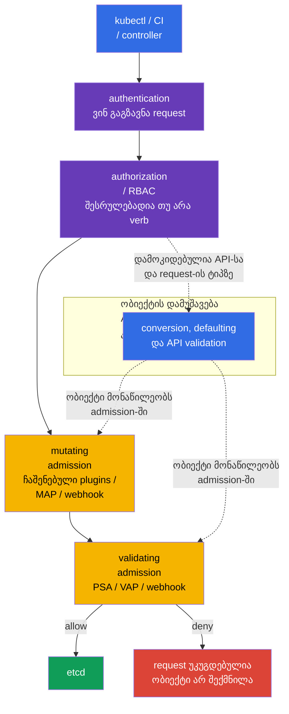

[Русская версия](ru.md) · [Eng version](README.md) · [Versión en español](es.md) · [Version française](fr.md) · [Deutsche Version](de.md) · [繁體中文版](tw.md) · [日本語版](jp.md)

# თავი 20. Admission-კონტროლერები და policy engines: OPA/Gatekeeper და Kyverno

> **პრობლემა.** RBAC-ს კანონიერად შეუძლია CI-ს Deployment-ის შექმნის უფლება მისცეს, მაგრამ
> არ ამოწმებს, არის თუ არა image აღებული სანდო registry-დან, აქვს თუ არა Pod-ს
> საშიშ ველები, და შეიცავს თუ არა ობიექტი სავალდებულო ორგანიზაციულ label-ებს. YAML-ის
> ხელით review მარტივად შემოივლება template-ით, API-კლიენტით ან pipeline-ის შეცდომით;
> policy-ის გარეშე ობიექტი მოხვდება etcd-ში და გაეშვება. Admission-კონტროლი ვალდებულია
> შემოწმოს ან უსაფრთხოდ შეავსოს ასეთი request მისი შენახვამდე.

> **რა არის შემდეგ.** Pod Security Admission [მე-19 თავიდან](../19/ge.md) იყენებს
> მზა Pod Security Standards-ს, მაგრამ არ პასუხობს ორგანიზაციის ყველა წესზე: დაშვებულია
> თუ არა images-ის registry, სავალდებულოა თუ არა owner-ის label, საჭიროა თუ არა
> უსაფრთხო ველის დამატება ან თანმხლები ობიექტის შექმნა. Admission control - ბოლო
> პროგრამირებადი ბარიერია ობიექტის etcd-ში ჩაწერამდე. ეს არის CKS-ის დომენის
> **Minimize Microservice Vulnerabilities** (20%) ნაწილი: აქ ვაშენებთ საკუთარ წესებს
> OPA/Gatekeeper-ზე, Kyverno-ზე და ჩაშენებულ CEL-ზე.

> **რა გჭირდებათ CKA-დან.** request-ის საბაზისო გზა `authentication -> authorization ->
> admission -> etcd`, ServiceAccount და RBAC განხილულია
> [CKA-ს 21-ე თავში](../../../cka/course/21/ge.md); კონტეინერის საბაზისო შეზღუდვები -
> [CKA-ს 20-ე თავში](../../../cka/course/20/ge.md). აქ ეს მექანიზმები არ ვიმეორებთ, არამედ
> უსაფრთხოების მოთხოვნებს ვაქცევთ შემოწმებად cluster-wide policy-დ.

> 🧠 Admission ამოწმებს უკვე დაშვებული API-request-ის ველებს etcd-ში ჩაწერამდე; RBAC არ აფასებს YAML-ის უსაფრთხოებას.

## 20.1. საფრთხის მოდელი: არაუსაფრთხო manifest როგორც შესასვლელი კლასტერში

RBAC პასუხობს კითხვას, შეუძლია თუ არა identity-ს Pod-ის შექმნა. თუ დეველოპერს
დაშვებული აქვს `create pods`, RBAC არ ამოწმებს, ზუსტად რა წერია YAML-ში. ამიტომ
კლასტერში შესაძლოა მოხვდეს `privileged`-კონტეინერი, `hostPath: /`, image
უცნობი registry-დან, Pod `runAsNonRoot`-ის გარეშე ან Deployment owner-ის label-ის
გარეშე. ასეთი ობიექტი შესაძლოა სავსებით დაშვებული იყოს RBAC-ის მიერ, მაგრამ ისევ
დაარღვევდეს security baseline-ს.

Admission control იღებს უკვე authenticated და authorized request-ს, მაგრამ
შენახვამდე. Mutating-კონტროლერს შეუძლია ობიექტი შეავსოს, validating-კონტროლერი
იღებს ან უკუაგდებს მას. თუ ერთი validating ეტაპიც უპასუხებს უარით, ობიექტი
etcd-ში არ გამოჩნდება.



Admission-ის რიგი მნიშვნელოვანია: mutating-კონტროლერები სრულდება validating-ის
წინ, ამიტომ validating-policy ხედავს მიღებულ ობიექტს. Conversion, defaulting და
API validation დიაგრამაზე ნაჩვენებია როგორც ობიექტის დამუშავების კონცეპტუალური
ეტაპი, არა როგორც ერთი მკაცრად განლაგებული ეტაპი: დეტალები დამოკიდებულია API-სა
და request-ის ტიპზე. ჩაშენებულ admission plugins-ს და webhooks-ს აქვთ საკუთარი
რიგი და შესაძლოა გამოძახებულ იქნან ხელახლა, როცა ობიექტს ცვლის სხვა mutating
webhook. Mutation უნდა იყოს idempotent-ური: ხელახალი გამოყენება არ უნდა ამატებდეს
მეორე ერთნაირ volume-ს, label-ს ან sidecar-ს.

| Layer | კითხვა | მაგალითი |
|---|---|---|
| RBAC | ვის შეუძლია `create pods`? | CI-ს შეუძლია Pod-ის შექმნა მხოლოდ `team-a`-ში |
| PSA | შეესაბამება თუ არა Pod სტანდარტს `baseline`/`restricted`? | დაუშვებელია privileged Pod restricted namespace-ში |
| custom policy | შეესაბამება თუ არა ობიექტი ორგანიზაციის წესებს? | image მხოლოდ `registry.example.com`-იდან; არსებობს label `owner` |
| mutating policy | რომელი უსაფრთხო default უნდა დაემატოს? | დავაყენოთ `allowPrivilegeEscalation: false` |

PSA და policy engine ერთმანეთს არ ანაცვლებენ. PSA სწრაფად და ერთგვაროვნად
იყენებს Pod-ის სტანდარტულ შეზღუდვებს. Gatekeeper, Kyverno ან CEL ხურავს
სპეციფიკურ მოთხოვნებს. არ დააკოპიროთ ერთი და იმავე მკაცრი შემოწმება უსაფუძვლოდ
სამ ადგილზე: უარის დიაგნოსტიკა გართულდება, ხოლო სხვადასხვა message-ები და
exceptions-ები დაშორდება ერთმანეთს.

> 🏭 `failurePolicy` განსაზღვრავს რეაქციას **ტექნიკურ ან evaluation-შეცდომაზე** admission webhook path-ზე, არა ცალსახა policy-გადაწყვეტილებაზე. ის მოქმედებს, მაგალითად, timeout-ის, TLS/DNS/Service/Pod-შეცდომის, არასათანადო HTTP/AdmissionReview response-ის, ასევე `matchConditions`-ის გამოთვლის შეცდომის შემთხვევაში.
>
> `matchConditions` API server-ი გამოთვლის webhook-ის გამოძახებამდე. თუ თუნდაც ერთი condition დააბრუნა `false`, webhook რეგულარულად გამოტოვება. თუ არცერთი არ არის `false`, მაგრამ თუნდაც ერთი დასრულდა შეცდომით, webhook არ გამოძახება: `Fail`-ის დროს API server უკუაგდებს request-ს, `Ignore`-ის დროს აგრძელებს მას ამ webhook-ის გარეშე. თუ webhook წარმატებით გამოძახდა და ცალსახად დააბრუნა `allowed: false`, request უკუაგდება როგორც `Fail`-ისას, ისევე `Ignore`-ისას.
>
> `Fail`-ის დროს ასეთი ტექნიკური/evaluation-შეცდომაც უკუაგდებს create/update-ს: policy-ის ჩუმად შემოვლა შეუძლებელია, მაგრამ webhook-ის ჩავარდნას **ან მისი `matchConditions`-ის შეცდომას** შეუძლია deploy-ისა და control plane-ის ოპერაციების ნაწილის შეჩერება. ამიტომ security-კრიტიკული webhook უნდა იყოს ერთ Pod-ზე უფრო საიმედო: რამდენიმე replica ამცირებს ჩავარდნის რისკს, PDB არ ანებებს ნებაყოფლობით disruption-ს ერთდროულად წაშალოს ყველა replica, სწორი TLS უზრუნველყოფს სანდო HTTPS-კავშირს, ხოლო error/latency-ის მეტრიკები და alerts-ები საშუალებას გვაძლევს შევნიშნოთ დეგრადაცია outage-მდე.
>
> `Ignore`-ის დროს API ხელმისაწვდომია, მაგრამ ასეთი შეცდომის მომენტში ობიექტი გაივლის **ამ webhook-ის შემოწმების გარეშე** — ეს არის policy-ის შემოვლის შეგნებული ფანჯარა, არა უფრო "მსუბუქი deny"-ის რეჟიმი. კრიტიკული, მოწიფული აკრძალვისთვის ხშირად ირჩევენ `Fail`-ს; `Ignore` შესაძლოა იყოს დროებითი კომპრომისი rollout-ზე ან არაკრიტიკული კონტროლისთვის, თუ bypass-ის რისკი ცალსახად მიღებულია.

## 20.2. Webhook: ხელმისაწვდომობაც security-გადაწყვეტილებაა

Gatekeeper და Kyverno ჩვეულებრივ მუშაობს როგორც admission webhook: `kube-apiserver`
HTTPS-ით უგზავნის მათ `AdmissionReview`-ს, შემდეგ ელოდება პასუხს `allowed: true/false`
და შესაძლო JSON patches-ს. Webhook-ს `MutatingWebhookConfiguration`-ში ან
`ValidatingWebhookConfiguration`-ში აქვს ორი განსაკუთრებით მნიშვნელოვანი პარამეტრი:

| პარამეტრი | მნიშვნელობა უსაფრთხოებისთვის | რისკი |
|---|---|---|
| `failurePolicy: Fail` | webhook path-ის ან `matchConditions`-ის შეცდომა (თუ არცერთი condition არ არის `false`) უკუაგდებს request-ს | engine-ის outage-ი ან შეცდომაში მყოფი CEL condition ბლოკავს deploy-ს და ზოგჯერ control plane-ის ოპერაციებს |
| `failurePolicy: Ignore` | ასეთი შეცდომის დროს API server აგრძელებს request-ს ამ webhook-შემოწმების გარეშე | policy-ის შემოვლის ფანჯარა ჩავარდნის ან condition-შეცდომის დროს |
| `timeoutSeconds` | ზღუდავს API server-ის მოლოდინის დროს | ზედმეტად დიდი timeout აყოვნებს ყველა create/update-ს |
| `namespaceSelector`/`objectSelector` | ავიწროვებს webhook-ის scope-ს | არასწორი selector-ს შეუძლია გამოტოვოს კრიტიკული namespace |
| `matchPolicy` | განსაზღვრავს API-ვერსიების შესატყვისებას | არაერსახული match-ს შეუძლია წესი უფრო ფართოდ ან ვიწროდ გამოიყენოს |

არ ცვალოთ დაუფიქრებლად `failurePolicy` Helm chart-ით დაყენებულ webhook-ზე: chart-ს
შესაძლოა შეცვლილი გადააწეროს. ჯერ დარწმუნდით, რომ engine-ს აქვს რამდენიმე replica,
PodDisruptionBudget, TLS და alert შეცდომებზე/latency-ზე. ახალი აკრძალვის შემოღება
უსაფრთხოა როგორც audit/warn, არსებული დარღვევების გამოსწორება და მხოლოდ შემდეგ
enforcement-ის ჩართვა. კრიტიკული, მოწიფული წესისთვის ჩვეულებრივ ირჩევენ `Fail`-ს;
პირველი rollout-ისთვის უფრო მნიშვნელოვანია არ გააჩერო კლასტერი და არ ჩააგდო ეს
მოქმედი დაცვის მტკიცებულებად.

Webhook-ის მინიმალურ კონფიგურაციას ცალსახად უნდა ჰქონდეს დაწერილი endpoint, TLS-ის
ნდობა და `AdmissionReview`-ის კონტრაქტი. მაგალითად, ქვემოთ მოცემული validating
webhook იყენებს Service-ს; mutating webhook-ის სტრუქტურა ანალოგიურია, მაგრამ
დაამატეთ `reinvocationPolicy: IfNeeded` ან `Never` და გახადეთ mutation
idempotent-ური. `caBundle` აქ შემოკლებულია: სამუშაო manifest-ში ეს არის
base64-კოდირებული webhook-ის CA-სერტიფიკატი.

```yaml
apiVersion: admissionregistration.k8s.io/v1
kind: ValidatingWebhookConfiguration
metadata:
  name: require-owner.example.com
webhooks:
- name: require-owner.example.com
  clientConfig:
    service:
      namespace: policy-system
      name: policy-webhook
      path: /validate
      port: 443
    caBundle: <base64-ca>
  rules:
  - apiGroups: [""]
    apiVersions: ["v1"]
    operations: ["CREATE", "UPDATE"]
    resources: ["pods"]
    scope: "*"
  admissionReviewVersions: ["v1"]
  sideEffects: None
  failurePolicy: Fail
  timeoutSeconds: 5
  matchPolicy: Equivalent
  namespaceSelector:
    matchLabels:
      policy.example.com/enforce-owner: "true"
  matchConditions:
  - name: skip-kube-system
    expression: "request.namespace != 'kube-system'"
```

Custom namespace label `namespaceSelector`-ში — security boundary-ის ნაწილია: identity-ს,
რომლისთვისაც წესი სავალდებულოა, არ უნდა ჰქონდეს ამ label-ის წაშლის ან შეცვლის
უფლება. ფიქსირებული scope-ისთვის უსაფრთხოა შესატყვისება ურეცხივი
`kubernetes.io/metadata.name`-ის მიხედვით; custom enforcement labels-ს ცვლის
მხოლოდ platform/security როლი. იგივე ეხება `objectSelector`-ს: label, რომლის
შეცვლაც მომხმარებელს თავად შეუძლია საკუთარ ობიექტზე scope-დან გამოსასვლელად,
არ ვარგა როგორც deny-boundary.

```bash
SUBJECT='system:serviceaccount:team-a:ci'
NS='team-a'
kubectl auth can-i patch namespaces/"$NS" --as="$SUBJECT"
kubectl auth can-i update namespaces/"$NS" --as="$SUBJECT"
# application/CI identity-სთვის ორივე პასუხი უნდა იყოს `no`.
```

Mutating webhook-ისთვის იმავე კონტრაქტს ემატება ხელახალი გამოძახების წესი:

```yaml
apiVersion: admissionregistration.k8s.io/v1
kind: MutatingWebhookConfiguration
metadata:
  name: default-security.example.com
webhooks:
- name: default-security.example.com
  clientConfig:
    service:
      namespace: policy-system
      name: policy-webhook
      path: /mutate
    caBundle: <base64-ca>
  rules:
  - apiGroups: [""]
    apiVersions: ["v1"]
    operations: ["CREATE"]
    resources: ["pods"]
  admissionReviewVersions: ["v1"]
  sideEffects: None
  reinvocationPolicy: IfNeeded
  failurePolicy: Fail
  timeoutSeconds: 5
```

```bash
# რომელი webhook-ები რეალურად არის დარეგისტრირებული და როგორ იქცევიან შეცდომისას.
kubectl get validatingwebhookconfigurations,mutatingwebhookconfigurations
kubectl get validatingwebhookconfiguration <name> -o yaml
kubectl -n gatekeeper-system get pods
kubectl -n kyverno get pods
```

Admission ამოწმებს მხოლოდ API-request-ს. ის არ ანაცვლებს image scanning-ს, runtime
detection-ს, NetworkPolicy-ს, RBAC-ს და audit logs-ს. Image, დაშვებული admission-ში,
ისევ უნდა გაივლის supply-chain-შემოწმებებს 25-28 თავებიდან; უკვე გაშვებულ პროცესს
აკონტროლებს 29-32 თავები.

> 🎯 დაუკავშირეთ `ConstraintTemplate` (code/schema) `Constraint`-ს (scope/პარამეტრები/`enforcementAction`), შემდეგ დაამტკიცეთ `dryrun` → `deny`.
>
> ამ მაგალითში template აცხადებს ტიპს `K8sRequiredLabels`, მისი Rego-შემოწმებას და
> დაშვებულ პარამეტრს `labels`; constraint `pods-must-have-owner` — ამ ტიპის კონკრეტული
> instance-ია. მიაკვლიეთ კავშირს: `match` ზღუდავს Pod-ს და გამორიცხულ namespaces-ს,
> `parameters.labels: ["owner"]` გადასცემს Rego-ს მოთხოვნას, ხოლო `enforcementAction`
> ირჩევს რეაქციას ნაპოვნ დარღვევაზე.
>
> მტკიცებულება ახალი ერთჯერადი Pod-ებით გააკეთეთ: `dryrun`-ში შექმენით Pod
> `owner`-ის გარეშე, დარწმუნდით, რომ ის API-მ მიიღო, შემდეგ დაელოდეთ მის ჩაწერას
> `status.violations`-ში. `deny`-ზე patch-ის შემდეგ სცადეთ შექმნათ **სხვა** Pod
> `owner`-ის გარეშე: API უნდა უკუაგდოს ის. საკონტროლო დადებით სცენარად Pod-ი
> `owner`-ით ორივე რეჟიმში უნდა იქნას მიღებული. ამისთვის არ გამოიყენოთ მხოლოდ
> არსებული Pod ან `--dry-run`: ისინი არ ამტკიცებენ, რომ admission და audit ახალ
> ობიექტზეც გამოსრულა.

## 20.3. OPA/Gatekeeper: `ConstraintTemplate` და `Constraint`

**OPA** (Open Policy Agent) — engine-ია, რომელსაც შეუძლია policy-გადაწყვეტილებების
მიღება. **Gatekeeper** მას აკავშირებს Kubernetes-ის admission-თან: როცა ვინმე ცდილობს
ობიექტის შექმნას ან შეცვლას, API server ობიექტს გადასცემს Gatekeeper-ს შესამოწმებლად.
თუ წესი აღმოაჩენს დარღვევას, Gatekeeper აცნობებს შედეგს — ჩაწეროს ის როგორც
დაკვირვება, გააფრთხილოს ან უკუაგდოს request. პირველი წაკითხვისთვის არ არის
საჭირო Rego-ს ან CEL-ის ცოდნა: ჯერ მნიშვნელოვანია გავიგოთ, **რომელი წესი
მოწმდება, სად მოქმედებს ის და რა მოხდება დარღვევის შემთხვევაში**.

ამისთვის Gatekeeper policy-ს ორ რესურსად ყოფს — ეს არ არის დუბლირება, არამედ
შესაძლებლობა წესი ერთხელ დაიწეროს და სხვადასხვანაირად გამოყენდეს:

1. `ConstraintTemplate` — **წესის template/ჩანახატი**. მასში ინახება Rego- ან
   CEL-შემმოწმებელი კოდი, სამიზნე admission handler და დაშვებული პარამეტრების
   OpenAPI schema. Schema ამოწმებს თავად `Constraint`-ის პარამეტრებს, არა Pod-ს
   პირდაპირ: მაგალითად, რომ `labels` — სტრიქონების სია. Template-ის გამოყენების
   შემდეგ Gatekeeper ქმნის CRD-ს (Custom Resource Definition) — ანუ Kubernetes-ის
   API-ში ამ წესისთვის რეგისტრირებს ახალი ტიპის რესურსს.
2. `Constraint` — **წესის ჩართული instance**. ის ირჩევს `match`-scope-ს (რომელი
   ობიექტები და namespaces მოწმდება), გადასცემს მნიშვნელობებს `parameters`-ში და
   განსაზღვრავს `enforcementAction`-ს — რა უნდა გაკეთდეს დარღვევის შემთხვევაში.
   ერთი template შესაძლოა ხელახლა გამოყენებულ იქნას სხვადასხვა გუნდისთვის,
   namespaces-ისთვის ან სავალდებულო labels-ის ნაკრებისთვის, ცალკე constraint-ის
   შექმნით ყოველი შემთხვევისთვის.

დაიმახსოვრეთ flow: **template განსაზღვრავს წესს → constraint მას აკონფიგურირებს
და ჩართავს → ობიექტის შექმნა/შეცვლა ხდება `match`-ის ტოლფასი → Gatekeeper
უშვებს შემოწმებას `parameters`-ით → `enforcementAction` განსაზღვრავს შედეგს**.
ეს მოგვაგონებს კლასს და instance-ს: template შეიცავს code-ს, რომელიც მოითხოვს
review-ს და tests-ს; constraint-ს ჩვეულებრივ ხშირად ცვლიან, როცა ფართოვდება
policy-ის დაფარვის ზონა. ერთ target-ში ერთი engine-ს ირჩევენ: legacy `rego`-ს
აქვს უფრო მაღალი პრიორიტეტი, ხოლო `code[]`-ში CEL-ს (`K8sNativeValidation`)
აქვს პრიორიტეტი Rego-ზე.

### Gatekeeper-ის დაყენება და სწრაფი შემოწმება

დაყენება ცენტრალიზებულად ხდება, არა გამოცდის დავალების დროს. Helm release-ისთვის
ჯერ დაფიქსირეთ chart-ის ვერსია GitOps-manifest-ში და შემოწმეთ კონკრეტული
ვერსიის values:

```bash
helm repo add gatekeeper https://open-policy-agent.github.io/gatekeeper/charts
helm repo update
GATEKEEPER_CHART_VERSION="${GATEKEEPER_CHART_VERSION:?set exact chart version}"
helm upgrade --install gatekeeper gatekeeper/gatekeeper \
  --namespace gatekeeper-system --create-namespace \
  --version "$GATEKEEPER_CHART_VERSION"

kubectl -n gatekeeper-system get deploy,pods
kubectl get crd | grep -E 'gatekeeper|constraints.gatekeeper' 
```

ქვემოთ მოცემული policy მოითხოვს label `owner`-ს Pod-ისთვის სისტემურ namespaces-ის
გარეთ. ის უფრო კომპაქტურია, ვიდრე `privileged`-ის შემოწმება, მაგრამ აჩვენებს
მოდელის ყველა ნაწილს და აძლევს გასაგებ უკუგდებას.

```yaml
# Gatekeeper-ის API ხელახლა-გამოსაყენებელი policy template-ისთვის.
apiVersion: templates.gatekeeper.sh/v1
# Template განსაზღვრავს constraint-ის ახალ ტიპს, მაგრამ თავად ჯერ არ ჩართავს შემოწმებას.
kind: ConstraintTemplate
metadata:
  # Template-ის Kubernetes-სახელი; ჩვეულებრივ ემთხვევა Rego package-ის სახელს.
  name: k8srequiredlabels
spec:
  crd:
    spec:
      names:
        # Constraint-რესურსის kind, რომელსაც Gatekeeper ამ template-იდან შექმნის.
        kind: K8sRequiredLabels
      validation:
        # Schema ამოწმებს Constraint-ის spec.parameters-ს, არა incoming Pod-ს.
        openAPIV3Schema:
          type: object
          properties:
            labels:
              # Constraint policy-ს გადასცემს სავალდებულო label keys-ის სიას.
              type: array
              items:
                type: string
  targets:
  # ჩაშენებული target, გამოძახებული admission create/update request-ებზე.
  - target: admission.k8s.gatekeeper.sh
    # Rego-ბლოკი, რომელიც დარღვევისას აბრუნებს violation-ს.
    rego: |
      # Rego policy-ის namespace-სახელი.
      package k8srequiredlabels

      # ვქმნით violation-ს ყოველი დაკლებული სავალდებულო label-ისთვის.
      violation[{"msg": msg}] {
        # Constraint-ის spec.parameters.labels-იდან ვიღებთ თითო მნიშვნელობას.
        required := input.parameters.labels[_]
        # input.review.object — Pod მიმდინარე admission request-იდან.
        not input.review.object.metadata.labels[required]
        # message გამოჩნდება audit status-ში ან deny-ის უკუგდებისას.
        msg := sprintf("missing required label: %v", [required])
      }
---
# API და kind instance-ისთვის, შექმნილი ამ ConstraintTemplate-ით.
apiVersion: constraints.gatekeeper.sh/v1beta1
kind: K8sRequiredLabels
metadata:
  # კონკრეტულად ჩართული policy-ის უნიკალური სახელი.
  name: pods-must-have-owner
spec:
  # Audit-only: ვაფიქსირებთ violation-ს, მაგრამ Pod-ს ჯერ არ ვბლოკავთ.
  enforcementAction: dryrun
  match:
    # წესს არ ვახორციელებთ სისტემურ namespaces-ზე.
    excludedNamespaces: ["kube-system", "gatekeeper-system", "kyverno"]
    kinds:
    # ცარიელი API group ნიშნავს core/v1 API-ს.
    - apiGroups: [""]
      # ვამოწმებთ მხოლოდ Pod-ს, არა ყველა Kubernetes-ობიექტს.
      kinds: ["Pod"]
  parameters:
    # მნიშვნელობა input.parameters.labels-ისთვის Rego-ში: label owner სავალდებულოა.
    labels: ["owner"]
```

#### როგორ წავიკითხოთ ეს policy

ჯერ Gatekeeper უყურებს `match`-ს `Constraint`-ში. აქ ის ამოწმებს მხოლოდ Pod-ს და
გამოტოვებს ჩამოთვლილ სისტემურ namespaces-ს; scope-ის გარეთ მყოფი ობიექტი
ამ წესში საერთოდ არ ხვდება. ყოველი შესატყვისი create/update-სთვის Gatekeeper
ქმნის `input.review.object`-ს: ეს არის incoming Pod Kubernetes API-ის ფორმით.
ამავდროულად ის constraint-ის `spec.parameters`-ს გადასცემს `input.parameters`-ში.
ამიტომ ამ მაგალითში `input.parameters.labels` ტოლია `["owner"]`.

Rego-ში წესი — ლოგიკური **AND**-ით შეერთებული პირობების ნაკრებია. ის ქვემოდან
ზემოთ იკითხება როგორც "შექმენი violation, თუ სხეულში ყველა სტრიქონი შესრულდა":

- `required := input.parameters.labels[_]` გადაივლის ყოველ სავალდებულო label-ს;
  `_` ნიშნავს "მასივის მორიგი ელემენტი". აქ ერთადერთი მნიშვნელობა იქნება `owner`.
- `not input.review.object.metadata.labels[required]` ჭეშმარიტია, როცა
  incoming Pod-ს ეს label-key არ აქვს.
- `msg := ...` ქმნის გასაგებ message-ს, ხოლო `violation[{"msg": msg}]` — სპეციალური
  შედეგია, რომელსაც Gatekeeper თვლის დარღვევად. `dryrun`-ის დროს ის მოხვდება
  `status.violations`-ში; `deny`-ის დროს API server დააბრუნებს ამ message-ს და
  Pod-ს არ შექმნის.

პირველი policy-სთვის საკმარისია დავიმახსოვროთ Rego-ის ოთხი იდეა: `input` —
read-only შემავალი მონაცემები, `:=` ინახავს ნაპოვნ მნიშვნელობას ცვლადში, `[_]`
გადაივლის სიას, `not` აღწერს არარსებობას/შეუსრულებლობას. ცალკე `if/else`-ის
დაწერა საჭირო არ არის: თუ წესის სხეულის დამტკიცება ვერ ხერხდება, `violation`
არ ქმნის. ეს policy ამოწმებს key `owner`-ის **არსებობას**; თუ ორგანიზაციას
საჭიროა არაცარიელი ან ფორმატირებული value, ეს ცალკე პირობა უნდა იყოს.

#### გამოცდისთვის სწრაფი pattern: namespace-scope და `latest`-ის აკრძალვა

ჯერ ამოცანა გადაითარგმნეთ ოთხ ველად: **რა** უნდა შემოწმდეს (Pod და image),
**სად** (`match.namespaces`), **დარღვევის პირობა** (image იყენებს `latest`-ს) და
**რეაქცია** (`dryrun`, შემდეგ `deny`). owner-ისთვის ერთ namespace-ში ახალი template
საჭირო არ არის: `K8sRequiredLabels`-ში `excludedNamespaces` შეცვალეთ
`namespaces: ["team-a"]`-ით და დატოვეთ `parameters.labels: ["owner"]`.

`latest`-ის ცალკე აკრძალვისთვის ქვემოთ მოცემული template შესაძლოა ერთ ფაილად
დაიწეროს და გამოყენდეს. ის ამოწმებს ჩვეულებრივ, init- და ephemeral კონტეინერებს:
მხოლოდ `spec.containers`-ის შემოწმება bypass-ს დაუტოვებდა. ფუნქცია დარღვევად
თვლის ცალსახა `:latest`-საც და tag-ის გარეშე image-საც (მაგალითად, `nginx`,
რომლისთვისაც Kubernetes გულისხმობს `latest`-ს); digest `@sha256:...`
latest-ად არ ითვლება.

```yaml
# Gatekeeper-ის API latest image tag-ის აკრძალვის template-ისთვის.
apiVersion: templates.gatekeeper.sh/v1
# Template შეიცავს Rego-ს; ქვემოთ მოცემული Constraint ირჩევს scope-ს და რეაქციის რეჟიმს.
kind: ConstraintTemplate
metadata:
  # Kubernetes template-ის სახელი.
  name: k8sdisallowlatest
spec:
  crd:
    spec:
      names:
        # Constraint-ის kind, რომელიც ამ template-ს გამოიყენებს.
        kind: K8sDisallowLatest
      validation:
        # ამ policy-ს არ აქვს კონფიგურირებადი parameters, მაგრამ schema მაინც აღწერს object-ს.
        openAPIV3Schema:
          type: object
          properties: {}
  targets:
  # შემოწმების დაკავშირება Gatekeeper admission handler-თან.
  - target: admission.k8s.gatekeeper.sh
    rego: |
      # Rego policy-ის namespace-სახელი.
      package k8sdisallowlatest

      # კონტეინერების შეკრება PodSpec-ის სამივე სიიდან, რომ bypass არ დარჩეს.
      pod_containers[container] {
        container := input.review.object.spec.containers[_]
      }
      pod_containers[container] {
        container := input.review.object.spec.initContainers[_]
      }
      pod_containers[container] {
        container := input.review.object.spec.ephemeralContainers[_]
      }

      # ცალსახა tag :latest დაუშვებელია.
      image_uses_latest(image) {
        endswith(image, ":latest")
      }
      # tag-ის გარეშე image-ს (მაგალითად nginx) Kubernetes ითვლის latest-ად; digest დაშვებულია.
      image_uses_latest(image) {
        not contains(image, "@")
        path := split(image, "/")
        last := path[count(path) - 1]
        not contains(last, ":")
      }

      # დავაბრუნოთ Gatekeeper violation ყოველი კონტეინერისთვის, რომელსაც აქვს latest image.
      violation[{"msg": msg}] {
        container := pod_containers[_]
        image_uses_latest(container.image)
        msg := sprintf("image %q must not use the latest tag", [container.image])
      }
---
# Template-ის instance: აკრძალვას ჩართავს მხოლოდ არჩეული scope-ისთვის.
apiVersion: constraints.gatekeeper.sh/v1beta1
kind: K8sDisallowLatest
metadata:
  # policy-ის უნიკალური სახელი namespace-specific scope-ით.
  name: pods-without-latest-in-team-a
spec:
  # ვიწყებთ audit-ით; შემოწმების შემდეგ ჩავანაცვლოთ deny-ით.
  enforcementAction: dryrun
  match:
    # Scope: policy მოქმედებს მხოლოდ Pod-ზე namespace team-a-ში.
    namespaces: ["team-a"]
    kinds:
    # Core/v1 API group.
    - apiGroups: [""]
      # ვამოწმებთ კონკრეტულად Pod admission requests-ს.
      kinds: ["Pod"]
```

გამოცდაზე არ ცადოთ ჯერ უნივერსალური framework-ის შექმნა: აიღეთ მინიმალური
`ConstraintTemplate`, დააფიქსირეთ ზუსტი `kind`/`match` და ერთი `violation`-პირობა.
შემდეგ შემოწმეთ უარყოფითი და დადებითი შემთხვევები: `team-a`-ში Pod-ი
`nginx:latest`-ით ჯერ უნდა გამოჩნდეს violations-ში, `deny`-ზე გადასვლის შემდეგ —
უკუგდებულ იქნას, ხოლო Pod-ი `nginx:1.27`-ით — გაიაროს. Scope ცალკე შემოწმეთ:
იმავე ცდას `team-a`-ს გარეთ ამ constraint-თან შესატყვისობა არ უნდა ჰქონდეს.

```bash
kubectl apply -f gatekeeper-owner.yaml
kubectl get constrainttemplates
kubectl get k8srequiredlabels
kubectl describe k8srequiredlabels pods-must-have-owner
```

`enforcementAction: dryrun` აგროვებს დარღვევებს `status.violations`-ში, მაგრამ
request-ს არ ბლოკავს. უკვე არსებული Pod-ების გასწორებისა და scope-ის შემოწმების
შემდეგ ჩავანაცვლოთ ის `deny`-ით. Gatekeeper-ის ზოგიერთი ვერსია ასევე
მხარდაჭერს action `warn`-ს; ზუსტად ხელმისაწვდომ actions-ს ამოწმეთ დაყენებული
CRD-ის მიხედვით, არა სხვა ვერსიის შემთხვევითი მაგალითის მიხედვით.

```bash
kubectl get k8srequiredlabels pods-must-have-owner \
  -o jsonpath='{range .status.violations[*]}{.kind}/{.name}{": "}{.message}{"\n"}{end}'

# მხოლოდ audit-ისა და workload-ის გასწორების შემდეგ.
kubectl patch k8srequiredlabels pods-must-have-owner --type merge \
  -p '{"spec":{"enforcementAction":"deny"}}'
```

### Gatekeeper-ის მაგალითი საშიშ `privileged`-ისთვის

Security-კრიტიკული აკრძალვისთვის template-მა უნდა შემოწმოს ჩვეულებრივი,
`initContainers` და `ephemeralContainers`; სხვაგვარად ერთ-ერთი სია bypass-გზად
დარჩება.

```rego
package k8sdisallowprivileged

violation[{"msg": msg}] {
  container := input.review.object.spec.containers[_]
  container.securityContext.privileged == true
  msg := sprintf("privileged container %q is not allowed", [container.name])
}

violation[{"msg": msg}] {
  container := input.review.object.spec.initContainers[_]
  container.securityContext.privileged == true
  msg := sprintf("privileged initContainer %q is not allowed", [container.name])
}

violation[{"msg": msg}] {
  container := input.review.object.spec.ephemeralContainers[_]
  container.securityContext.privileged == true
  msg := sprintf("privileged ephemeralContainer %q is not allowed", [container.name])
}
```

პირობა `container.securityContext.privileged == true` არ ამუშავდება ველის
არარსებობისას, ანუ default `false` დაშვებულია. PSA `restricted` უკვე ხურავს
ამ კლასის მოთხოვნებს - custom Rego გამოიყენეთ მხოლოდ მაშინ, როცა საჭიროა
საკუთარი scope, exceptions ან გაფართოებული ლოგიკა.

> 🔬 Kyverno-ის CEL API validation-ის, mutation-ის, generation-ის და სხვა admission-სცენარებისთვის.

## 20.4. Kyverno 1.19: CEL-based policy types

> **Compatibility-შესახებ შენიშვნა.** Kyverno v1.19 ოფიციალურად მხარდაჭერს Kubernetes
> v1.33-v1.35-ს (`kyverno.io/docs/installation/releases/`, გამოცემული 2026 წლის
> აგვისტოში). ამ თავის core-ლაბა (Lab108) სრულდება Kubernetes v1.36-ზე - ეს არის
> შეგნებული forward-looking კომბინაცია, რომელიც **არ შედის** Kyverno v1.19-ის
> ტესტირებულ და გარანტირებულ support matrix-ში. დაყენება და საბაზისო სცენარები
> ჩვეულებრივ მუშაობს, მაგრამ ზუსტად ეს ვერსიების წყვილი არ არის დაფარული officially
> tested compatibility-ით, ამიტომ წარმატებული დაყენება არ ჩათვალოთ სრული v1.36-მხარდაჭერის
> მტკიცებულებად. მიმდინარე გამოცდისთვის (ორიენტირებული v1.35-ზე) მომზადებისას
> შემოწმეთ ქცევა ცალკე v1.35-ზე, სადაც Kyverno v1.19 ოფიციალურად ტესტირებულია.
> Third-party admission-კომპონენტების (Kyverno, Gatekeeper და ანალოგები) compatibility
> ცალკე უნდა შემოწმდეს მათი საკუთარი release matrix-ის მიხედვით, კურსის
> Kubernetes-ვერსიისგან დამოუკიდებლად.

### როგორ წავიკითხოთ Kyverno-ს CEL policy

Kyverno — Kubernetes policy engine-ია: მისი controllers და admission webhook კითხულობს
policy-რესურსებს API-დან და რეაგირებს ობიექტებთან ოპერაციებზე. ახალ CEL-based
policy-ტიპებში policy — ჩვეულებრივი YAML-რესურსია, ხოლო CEL — მოკლე
გამონათქვამების ენა `expression`-ველის შიგნით. ის არ ანაცვლებს YAML-ს და არ
წარმოადგენს shell-სკრიპტს: expression იღებს შემავალ მონაცემებს, მაგალითად
`object` — მიმდინარე admission request-ის ობიექტს, — და გამოთვლის მნიშვნელობას.

პირველი წაკითხვისთვის ყოველი მაგალითი გაატარეთ ერთ flow-ზე: **რომელი ოპერაცია
და resource შესატყვისებულია `matchConstraints`-თან → რომელი დამატებითი
პირობები გავიდა → რას აკეთებს policy**. `ValidatingPolicy` გამოთვლის ლოგიკურ
expression-ს: `true` უშვებს ობიექტს, `false` ქმნის დარღვევას; action `Audit`
მხოლოდ აფიქსირებს ამას, ხოლო `Deny` უკუაგდებს request-ს. `MutatingPolicy` აბრუნებს
ობიექტის ცვლილებას მისი შენახვამდე. `GeneratingPolicy` background controller-ს
ითხოვს, source resource-ის ტოლფასის შემდეგ შექმნას ან სინქრონიზაცია გაუწიოს სხვა
ობიექტს. ამიტომ generation არ არის მყისიერი admission deny.

ჯერ ტიპი აირჩიეთ შედეგის მიხედვით, არა CEL-ის სინტაქსის მიხედვით:
`ValidatingPolicy` — შემოწმება და საჭიროებისას აკრძალვა, `MutatingPolicy` —
უსაფრთხო default-ის დამატება, `GeneratingPolicy` — დაკავშირებული რესურსის
შექმნა, `DeletingPolicy` — წაშლა წესის მიხედვით, `ImageValidatingPolicy` —
image-ის შემოწმება. Cluster-wide ტიპები მოქმედებს დაკავშირებული scope-ის
მიხედვით; `Namespaced...` ვარიანტები ცხოვრობს და მოქმედებს მხოლოდ საკუთარ
namespace-ში. არ ერეოთ ეს რესურსები legacy `Policy`/`ClusterPolicy`-სთან: მათ
სხვა API და სხვა ველები აქვთ.

Kyverno 1.19-იდან საბაზისო გზაა `policies.kyverno.io/v1` ჯგუფის ცალკეული
CEL-based cluster-wide ტიპები: `ValidatingPolicy`, `MutatingPolicy`,
`GeneratingPolicy`, `DeletingPolicy` და `ImageValidatingPolicy`. თითოეულისთვის
არსებობს namespaced-ვარიანტი — `NamespacedValidatingPolicy`,
`NamespacedMutatingPolicy`, `NamespacedGeneratingPolicy`,
`NamespacedDeletingPolicy` ან `NamespacedImageValidatingPolicy`, რომელიც
მოქმედებს მხოლოდ საკუთარ namespace-ში. Legacy `Policy` და `ClusterPolicy`
(`kyverno.io/v1`), ასევე `CleanupPolicy` (`kyverno.io/v2`) deprecated-ია
1.19-ში და 1.20-ში წაშლილი იქნება. არ აურიოთ ორი მოდელის ველები ერთ ობიექტში.

კურსში შემოწმებული იქნა Kyverno-ის `v1.19.x` და Helm chart-ის `3.9.0`
ერთობლიობა. დაყენების შემდეგ შემოწმეთ ზუსტად ახალი CRD და controller-ის
ფაქტობრივი image:

```bash
helm upgrade --install kyverno kyverno/kyverno \
  --namespace kyverno --create-namespace --version 3.9.0
kubectl get crd validatingpolicies.policies.kyverno.io \
  mutatingpolicies.policies.kyverno.io \
  generatingpolicies.policies.kyverno.io \
  deletingpolicies.policies.kyverno.io \
  imagevalidatingpolicies.policies.kyverno.io
kubectl -n kyverno get deploy -o jsonpath='{..image}'
```

### `ValidatingPolicy`: `runAsNonRoot`-ის მოთხოვნა

`ValidatingPolicy` არაფერს ცვლის: ის პასუხობს კითხვას "შესაძლებელია თუ არა ამ
ობიექტის მიღება?". ჯერ policy ემთხვევა Pod-ის create/update-ს, შემდეგ CEL Pod-ს
იღებს როგორც `object`-ს. Expression-მა უნდა დააბრუნოს `true`, სხვაგვარად Kyverno
ქმნის violation-ს ველით `message`. `Audit` უშვებს request-ს და აგროვებს შედეგს
manifests-ის გასასწორებლად; რეალური scope-ის შემოწმების შემდეგ გადაერთოთ
`Deny`-ზე, რომელიც ასეთ Pod-ს უკუაგდებს. ქვემოთ მოცემული შემოწმება მოითხოვს
ცალსახა pod-level baseline-ს; ის არ ანაცვლებს სრულ PSS `restricted`-ს.

```yaml
# ახალი CEL-based Kyverno policy-ის API.
apiVersion: policies.kyverno.io/v1
# Validation ობიექტს არ ცვლის: ის უშვებს ან აფიქსირებს/უკუაგდებს დარღვევას.
kind: ValidatingPolicy
metadata:
  # policy-ის უნიკალური სახელი კლასტერში.
  name: require-pod-run-as-non-root
spec:
  # ჯერ audit-only: request არ ბლოკირდება, violation შესაძლებელია გამოკვლეული იქნას.
  validationActions: [Audit]
  matchConstraints:
    resourceRules:
    # Core/v1 Pod; ვამოწმებთ როგორც შექმნას, ისევე შემდგომ ცვლილებებს.
    - apiGroups: [""]
      apiVersions: ["v1"]
      operations: ["CREATE", "UPDATE"]
      resources: ["pods"]
  validations:
  # ყოველი შესატყვისი Pod-ისთვის expression-მა უნდა დააბრუნოს true.
  - message: "Pod spec.securityContext.runAsNonRoot must be true"
    expression: >-
      // has ხელს უშლის მიმართვას არარსებული securityContext-ისკენ.
      has(object.spec.securityContext) &&
      // ? უსაფრთხოდ კითხავს optional field-ს; არარსებობა ან false აძლევს false-ს.
      object.spec.securityContext.?runAsNonRoot.orValue(false)
```

```bash
kubectl apply -f kyverno-run-as-non-root.yaml
kubectl get validatingpolicy require-pod-run-as-non-root
kubectl patch validatingpolicy require-pod-run-as-non-root --type merge \
  -p '{"spec":{"validationActions":["Deny"]}}'
```

### `MutatingPolicy`: გამჭვირვალე მარკირება

`MutatingPolicy` პასუხობს არა "დაშვება თუ აკრძალვა"-ს, არამედ "რომელი უსაფრთხო
default უნდა დაემატოს უკვე მიღებულ ობიექტს". ის ამუშავდება match-ის შემდეგ,
აშენებს ობიექტის შეცვლილ fragment-ს და API server ინახავს შედეგს. Mutation-მა
არ უნდა დაფაროს არაუსაფრთხო image: security-კრიტიკული ველებისთვის ხშირად
უკეთესია ცალსახა validation. უსაფრთხო სასწავლო მაგალითი მხოლოდ audit-label-ს
ამატებს. `ApplyConfiguration` ნიშნავს, რომ CEL აშენებს სასურველ fragment-ს
`Object{...}`-ის სახით, ხოლო Kyverno მას იყენებს legacy `patchStrategicMerge`-ის
ნაცვლად:

```yaml
# CEL-based Kyverno policy-ის API, რომელიც ობიექტს ცვლის შენახვამდე.
apiVersion: policies.kyverno.io/v1
kind: MutatingPolicy
metadata:
  # policy-ის სახელი, რომელიც ამატებს trace-ის შესაძლებელ audit label-ს.
  name: mark-kyverno-managed-pods
spec:
  matchConstraints:
    resourceRules:
    # ვცვლით მხოლოდ ახალ core/v1 Pod-ს, არა ყველა რესურსს.
    - apiGroups: [""]
      apiVersions: ["v1"]
      operations: ["CREATE"]
      resources: ["pods"]
  mutations:
  # ApplyConfiguration იყენებს CEL-constructed fragment-ს incoming object-ზე.
  - patchType: ApplyConfiguration
    applyConfiguration:
      expression: >-
        // Object{...} — Kubernetes ობიექტის სასურველი fragment-ის CEL-representation.
        Object{
          metadata: Object.metadata{
            // ვამატებთ label-ს, დანარჩენი metadata.labels-ის ჩანაცვლების გარეშე.
            labels: {"security.example.com/policy": "kyverno"}
          }
        }
```

### `GeneratingPolicy`: default-deny ახალი Namespace-სთვის

`GeneratingPolicy` რეაგირებს source object-ზე და ითხოვს, რომ ცალკე background
controller-მა შექმნას downstream resource. ამ მაგალითში source — ახალი
Namespace-ია, ხოლო შედეგი — `NetworkPolicy` მის შიგნით. YAML template ნაცნობად
იკითხება, ხოლო CEL გამოთვლის და ჩაანაცვლებს Namespace-ის სახელს.
`synchronize.enabled: true`-ის დროს Kyverno აგრძელებს გენერირებული ობიექტის
policy-სთან შედარებას და სინქრონიზაციას. ეს არ არის Kubernetes
`ownerReferences`-ის შესახებ განცხადება და არ ანაცვლებს ცალსახა
პასუხისმგებლობის განაწილებას: არ დაავალოთ GitOps-controller-ს და Kyverno-ს
ერთდროულად ერთი და იმავე ობიექტის სინქრონიზაცია.

```yaml
# CEL-based policy-ის API, რომელიც ქმნის/სინქრონიზებას უწევს downstream resource-ს.
apiVersion: policies.kyverno.io/v1
kind: GeneratingPolicy
metadata:
  # policy-ის სახელი ახალი Namespace-ის NetworkPolicy-სთვის.
  name: generate-default-deny-ingress
spec:
  evaluation:
    synchronize:
      # Background controller აგრძელებს generated NetworkPolicy-ის შედარებას template-თან.
      enabled: true
  matchConstraints:
    resourceRules:
    # Trigger — core/v1 Namespace-ის შექმნა.
    - apiGroups: [""]
      apiVersions: ["v1"]
      operations: ["CREATE"]
      resources: ["namespaces"]
  matchConditions:
  # არ გენერირდეს policy სისტემურ namespaces-ში.
  - name: skip-system-namespaces
    expression: >-
      !(object.metadata.name in
      ["kube-system", "kube-public", "kube-node-lease", "kyverno"])
  variables:
  # source Namespace-ის სახელის შენახვა YAML template-ის შიგნით გამოსაყენებლად.
  - name: namespaceName
    expression: object.metadata.name
  generate:
  - template:
      # CEL variable-ის ჩანაცვლება YAML-ში (( ... ))-ს შორის.
      interpolate: cel
      value: |
        apiVersion: networking.k8s.io/v1
        kind: NetworkPolicy
        metadata:
          # downstream NetworkPolicy-ის ფიქსირებული სახელი.
          name: default-deny-ingress
          # შევქმნათ ის იმ Namespace-ში, რომელმაც გამოიწვია policy.
          namespace: (( variables.namespaceName ))
          labels:
            # საშუალებას აძლევს განისაზღვროს generated object-ის owner.
            app.kubernetes.io/managed-by: kyverno
        spec:
          # ცარიელი selector ფარავს Namespace-ის ყველა Pod-ს.
          podSelector: {}
          # Default deny მხოლოდ ingress-ისთვის; egress ცალკე ინიშნება.
          policyTypes: [Ingress]
```

ეს არის მხოლოდ ingress-ის default deny. Egress, DNS და დაშვებული კავშირები
ცალკე `NetworkPolicy`-ებით დააფიქსირეთ - იხილეთ [4-ე თავი](../04/ge.md).

`GeneratingPolicy` — provisioning/reconciliation-მექანიზმია, არა ატომური
admission-ბარიერი: Namespace შექმნილია უფრო ადრე, ვიდრე background controller
გარანტირებულად შექმნის downstream `NetworkPolicy`-ს. სანამ namespace-ს
workload identity-ს გადასცემდეთ, დაადასტურეთ ფაქტობრივი baseline, მაგალითად
`kubectl -n <new-namespace> get networkpolicy default-deny-ingress`; თავად
`GeneratingPolicy`-ის არსებობა ამას არ ამტკიცებს.

Generation-ის გამოყენებამდე შემოწმეთ background controller-ის ფაქტობრივი
ServiceAccount-ის უფლებები სამიზნე რესურსზე. `synchronize.enabled: true`-სთვის
საჭიროა როგორც read/watch, ისევე downstream resource-ის მართვა; ქვემოთ
მოცემულმა ექვსივე შემოწმებამ უნდა დააბრუნოს `yes`:

```bash
KYVERNO_BG='system:serviceaccount:kyverno:kyverno-background-controller'
for verb in get list watch create update delete; do
  kubectl auth can-i "$verb" networkpolicies.networking.k8s.io \
    --all-namespaces --as="$KYVERNO_BG"
done
```

### Legacy policy-ის მიგრაცია

ინვენტარიზაცია გაუკეთეთ legacy რესურსებს ბრძანებით
`kubectl get policies.kyverno.io,clusterpolicies.kyverno.io` (ან `kubectl get pol,cpol`),
ასევე `CleanupPolicy`-ს, დააფიქსირეთ ქცევა დადებითი და უარყოფითი ტესტებით.
გადაიტანეთ validate/mutate/generate/delete/image წესები შესატყვის ახალ ტიპში
და წაშალეთ legacy ობიექტი მხოლოდ admission-ისა და background reports-ის
შემოწმების შემდეგ. Production-ისთვის შემოწმეთ
[Kyverno-ის მიგრაციის სახელმძღვანელო](https://kyverno.io/docs/guides/migration-to-cel/)
დაყენებული minor-ვერსიის მიხედვით.

> 🏭 Engine-ის არჩევანი დამოკიდებულია policy-ის ownership-ზე, ენაზე, CI-ზე და webhook-ზე; არ დააკოპიროთ deny-კონტროლი უსაფუძვლოდ.

## 20.5. Gatekeeper და Kyverno: რომელი ავირჩიოთ

ორივე engine-ს შეუძლია deny არაუსაფრთხო Pod-ისთვის, audit-დარღვევების შეგროვება
და admission webhook-ის მეშვეობით მუშაობა. განსხვავებულია ენა, მოდელი და
კონკრეტული წესის მოსახერხებელობა.

| კრიტერიუმი | Gatekeeper / OPA | Kyverno |
|---|---|---|
| შემმოწმებელი ენა | Rego ან CEL `ConstraintTemplate`-ში | CEL და YAML templates |
| რესურსის მოდელი | `ConstraintTemplate` Rego/CEL-ით + `Constraint` | ცალკეული CEL-based policy types, ჩათვლით namespaced ვარიანტების |
| Validate | დიახ | დიახ |
| Mutate | ცალკეული mutator resources, შესაძლებლობები დამოკიდებულია ვერსიაზე | `MutatingPolicy` |
| Generate | არ არის საბაზისო სცენარი | `GeneratingPolicy` |
| Delete / cleanup | არ არის საბაზისო სცენარი | `DeletingPolicy` |
| რთული ლოგიკა და OPA-ის გარეგანი გამოყენება | Rego-ის ძალა | შესაძლებელია, მაგრამ YAML უფრო მარტივად იკითხება K8s policy-სთვის |
| ბარიერი Kubernetes YAML-ს მიჩვეული გუნდისთვის | უფრო მაღალი | უფრო დაბალი |

არჩევანი არ ნიშნავს, რომ სხვა ინსტრუმენტი უარესია. თუ ორგანიზაცია უკვე
იყენებს OPA-ს Terraform-ისთვის, API gateway-სთვის და CI-სთვის, Gatekeeper
ამცირებს policy-ენების რაოდენობას. თუ საჭიროა mutation, generation და review
ნაცნობ Kubernetes YAML-ში, Kyverno ხშირად უფრო მარტივია. არ დააყენოთ ორივე
მხოლოდ ერთნაირი წესებისთვის: ორი webhook ზრდის latency-ს, ოპერაციულ
ზედაპირს და წინააღმდეგობრივი უკუგდებების რისკს. დასაშვებია
პასუხისმგებლობის განაწილება, თუ ის დოკუმენტირებულია: მაგალითად, Gatekeeper
რთული Rego constraints-ისთვის, Kyverno — mutation-ისა და image
verification-ისთვის.

ორივე შემთხვევაში policy - კოდია: `ConstraintTemplate`/`Constraint` ან
CEL-based Kyverno policy შეინახეთ Git-ში, დანიშნეთ owner და tests, გამოიყენეთ
staging-ში, დაიწყეთ audit/warn-ით და შეინახეთ დარღვევების evidence.
კლასტერამდე დაამატეთ CI mini-lab დაშვებული და აკრძალული fixture-ით.
Gatekeeper-ისთვის გამოიყენეთ დეკლარაციული Suite/Test/Case
(`apiVersion: test.gatekeeper.sh/v1alpha1`, `kind: Suite`), არა უშუალო
`gator test` denied fixture-ისთვის: deny constraint-ისთვის ნაპოვნი დარღვევა
`gator test`-ს აძლევს exit code 1-ს, თუმცა policy სწორად მუშაობს. Kyverno
შემოწმეთ `kyverno test --require-tests`-ით, რომ test manifest-ის არარსებობამ
green pipeline არ გამოიღოს. CI-მ უნდა დამთავრდეს შეცდომით, თუ დაშვებული
manifest უკუგდებულია ან აკრძალული — მიღებულია. Exception უნდა იყოს ვიწრო,
დროში შეზღუდული და review-ში ხილული - არა გლობალური
`excludedNamespaces: ["*"]`.

> 🏭 CI fixtures უნდა მიიღოს დაშვებული და უკუაგდოს აკრძალული ობიექტი კლასტერში admission-მდე.

### CI mini-lab: policy-ის შემოწმება rollout-მდე

დადებითი და უარყოფითი manifests policy-ის გვერდით უნდა ცხოვრობდეს Git-ში.
შეინახეთ template და constraint `templates-and-constraints/template.yaml`-სა
და `templates-and-constraints/constraint.yaml`-ში, fixtures — `allowed.yaml`-სა
და `denied.yaml`-ში, ხოლო გვერდით შექმენით `suite.yaml`:

```yaml
apiVersion: test.gatekeeper.sh/v1alpha1
kind: Suite
tests:
- name: require-owner
  template: templates-and-constraints/template.yaml
  constraint: templates-and-constraints/constraint.yaml
  cases:
  - name: allowed-has-owner
    object: allowed.yaml
    assertions:
    - violations: no
  - name: denied-missing-owner
    object: denied.yaml
    assertions:
    - violations: yes
```

```bash
# ორივე მოსალოდნელი შედეგი აძლევს წარმატებულ exit code-ს: deny fixture-ს ვალდებულია ჰქონდეს violation.
gator verify suite.yaml                    # ან: gator verify ./...

# Kyverno: pipeline ვარდება, თუ kyverno-test.yaml არ იქნა ნაპოვნი.
kyverno test --require-tests ./policy/kyverno
```

`gator verify` `violations: no`-ს allowed-ისთვის და `violations: yes`-ს
denied-ისთვის მოსალოდნელ assertions-ად განიხილავს, ამიტომ job წითელი
გახდება მხოლოდ policy-ის ან fixtures-ის regression-ის შემთხვევაში.
გამოიყენეთ ბრძანებები და ფაილების სტრუქტურა, რომელიც შესატყვისია
დაფიქსირებული CLI-ვერსიისთვის; cluster admission test ცალკე ეტაპად რჩება
ინტეგრაციული CI-ის.

> 🔬 Native CEL სრულდება API server-ში webhook-ის გარეშე, მაგრამ არ ფარავს generation-ს, reports-ს, signature verification-ს და რთულ Rego-ლოგიკას.

## 20.6. Native CEL: validation და mutation გარეგანი webhook-ის გარეშე

`ValidatingAdmissionPolicy` (VAP) და `ValidatingAdmissionPolicyBinding` აყალიბებენ
ჩაშენებულ validation-ს CEL-ზე. Kubernetes 1.36-ში `MutatingAdmissionPolicy` (MAP)
და `MutatingAdmissionPolicyBinding` გახდნენ stable და ჩართული default-ით. MAP -
ეს in-process mutation-ია API server-ის შიგნით: CEL აბრუნებს ან
`ApplyConfiguration`-ს, რომელიც შედუღდება server-side apply-ის წესებით, ან
`JSONPatch`-ს. ორივე native API-სთვის binding სავალდებულოა: ზუსტად ის აკავშირებს
policy-ს scope-თან, ხოლო binding-ის გარეშე policy არ მოქმედებს.

VAP მხოლოდ validating-მექანიზმად რჩება: ის არ ცვლის და არ აგენერირებს ობიექტებს.
VAP + MAP-ის ერთობლიობაში native stack-ს უკვე შესწევს უნარი mutation-ისა და
validation-ის webhook-ის გარეშე, მაგრამ არ ანაცვლებს engine-ს generate-სთვის,
policy reports-სთვის, image signature verification-სთვის, რთული გარეგანი
მონაცემებისთვის ან Rego-სთვის.

### `MutatingAdmissionPolicy`: უსაფრთხო label-ის დამატება შეზღუდულ scope-ში

ქვემოთ მოცემული მაგალითი გამოყენებადია მხოლოდ Pod-ისთვის namespace-ში label-ით
`policy.example.com/native-mutation=true`. `ApplyConfiguration` მოსახერხებელია
ველის დამატებისთვის; მასივებზე ან paths-ზე ზუსტი ოპერაციებისთვის გამოიყენეთ
`JSONPatch` CEL-სიით `JSONPatch{...}`. `spec.reinvocationPolicy` სავალდებულოა:
`Never` MAP-ს ხელახლა არ იძახებს, ხოლო `IfNeeded` საშუალებას აძლევს ხელახალი
შეფასებას სხვა admission-ეტაპების mutation-ის შემდეგ. სხვა mutating
plugins/webhooks-თან რიგი გარანტირებული არ არის, ამიტომ mutation უნდა იყოს
idempotent-ური. არ გამოიყენოთ mutation სავალდებულო security validation-ის
ჩანაცვლებად.

```yaml
apiVersion: admissionregistration.k8s.io/v1
kind: MutatingAdmissionPolicy
metadata:
  name: add-native-admission-label
spec:
  failurePolicy: Fail
  reinvocationPolicy: IfNeeded
  matchConstraints:
    resourceRules:
    - apiGroups: [""]
      apiVersions: ["v1"]
      operations: ["CREATE"]
      resources: ["pods"]
  mutations:
  - patchType: ApplyConfiguration
    applyConfiguration:
      expression: >-
        Object{
          metadata: Object.metadata{
            labels: {"admission.example.com/mutated": "true"}
          }
        }
---
apiVersion: admissionregistration.k8s.io/v1
kind: MutatingAdmissionPolicyBinding
metadata:
  name: add-native-admission-label
spec:
  policyName: add-native-admission-label
  matchResources:
    namespaceSelector:
      matchLabels:
        policy.example.com/native-mutation: "true"
```

პრაქტიკამ უნდა შემოწმოს როგორც scope, ისევე მისი უარყოფითი საზღვარი. შეინახეთ
ზემოთ მოცემული YAML `map-add-label.yaml`-ად, შემდეგ შეასრულეთ:

```bash
kubectl apply -f map-add-label.yaml
kubectl create namespace native-map-on
kubectl label namespace native-map-on policy.example.com/native-mutation=true
kubectl create namespace native-map-off

cat <<'EOF' >/tmp/native-map-pod.yaml
apiVersion: v1
kind: Pod
metadata:
  name: native-map-test
spec:
  containers:
  - name: pause
    image: registry.k8s.io/pause:3.10
EOF

# Scope binding შესატყვისობაშია: server-side dry-run აბრუნებს დამატებულ label-ს.
kubectl -n native-map-on create --dry-run=server -o yaml -f /tmp/native-map-pod.yaml

# Binding-ის უარყოფითი ტესტი: namespace-ში selector-label-ის გარეშე mutation არ არსებობს.
if kubectl -n native-map-off create --dry-run=server -o yaml \
  -f /tmp/native-map-pod.yaml | grep -q 'admission.example.com/mutated: "true"'; then
  echo "MAP scope-ის გარეთ გამოყენდა"
  exit 1
fi
```

### `ValidatingAdmissionPolicy`: effective non-root-ის მოთხოვნა

VAP-მა უნდა შემოწმოს ყოველი პროცესის ეფექტური პარამეტრი, არა მხოლოდ pod-level
default: container-level `securityContext.runAsNonRoot`-ს აქვს პრიორიტეტი.
ქვემოთ მოცემული expression-ი დაშვებულად ითვლის container-level `true`-ს ან
ამ ველის არარსებობას pod-level `true`-ის დროს, მაგრამ უკუაგდებს ცალსახა
`false`-ს და `runAsUser: 0`-ს როგორც pod-level-ზე, ისევე ჩვეულებრივ, init- და
ephemeral კონტეინერებში.

```yaml
apiVersion: admissionregistration.k8s.io/v1
kind: ValidatingAdmissionPolicy
metadata:
  name: require-pod-run-as-non-root
spec:
  failurePolicy: Fail
  matchConstraints:
    resourceRules:
    - apiGroups: [""]
      apiVersions: ["v1"]
      operations: ["CREATE", "UPDATE"]
      resources: ["pods"]
  variables:
  - name: podRunAsNonRoot
    expression: >-
      has(object.spec.securityContext) &&
      has(object.spec.securityContext.runAsNonRoot) &&
      object.spec.securityContext.runAsNonRoot == true
  - name: allContainers
    expression: >-
      object.spec.containers +
      (has(object.spec.initContainers) ? object.spec.initContainers : []) +
      (has(object.spec.ephemeralContainers) ? object.spec.ephemeralContainers : [])
  validations:
  - expression: >-
      !has(object.spec.securityContext) ||
      !has(object.spec.securityContext.runAsUser) ||
      object.spec.securityContext.runAsUser != 0
    message: "Pod-level runAsUser: 0 is forbidden"
  - expression: >-
      variables.allContainers.all(c,
        (!has(c.securityContext) || !has(c.securityContext.runAsUser) ||
          c.securityContext.runAsUser != 0) &&
        ((has(c.securityContext) && has(c.securityContext.runAsNonRoot)) ?
          c.securityContext.runAsNonRoot == true : variables.podRunAsNonRoot)
      )
    message: "Every app, init and ephemeral container must effectively run non-root; runAsUser: 0 is forbidden"
---
apiVersion: admissionregistration.k8s.io/v1
kind: ValidatingAdmissionPolicyBinding
metadata:
  name: require-pod-run-as-non-root
spec:
  policyName: require-pod-run-as-non-root
  validationActions: ["Deny"]
  matchResources:
    namespaceSelector:
      matchLabels:
        policy.example.com/enforce-non-root: "true"
```

`object` CEL-ში - შემოწმებადი ობიექტია; ასევე ხელმისაწვდომია request-ის
context, `oldObject` და binding-ის პარამეტრები. VAP/MAP-ის `failurePolicy`
ეხება policy-ის შეფასების შეცდომას, არა ქსელის ხელმისაწვდომობას: აქ გარეგანი
webhook არ არსებობს. არ გამოაქვეყნოთ შეუმოწმებელი CEL-expression მაშინვე
`Deny`-ით მთელ კლასტერზე: შეავიწროვეთ selector, დაიწყეთ `Audit`/`Warn`-ით და
შემოწმეთ დადებითი და უარყოფითი შემთხვევები.

```bash
kubectl apply -f vap-run-as-non-root.yaml
kubectl label namespace team-example policy.example.com/enforce-non-root=true
kubectl get validatingadmissionpolicy,validatingadmissionpolicybinding
kubectl get mutatingadmissionpolicy,mutatingadmissionpolicybinding
```

### პარამეტრიზირებული VAP: policy-ის ლოგიკა გუნდის ლიმიტისგან ცალკე

`paramKind` განსაზღვრავს parameter resource-ის ტიპს, binding ირჩევს კონკრეტულ
ობიექტს `paramRef`-ის მეშვეობით, ხოლო CEL მას იღებს როგორც `params`-ს. აქ ერთი
`ConfigMap` ზღუდავს replicas-ს; `matchConditions` არ ამოწმებს policy-ს
kubelet-ის request-ებისთვის.

```yaml
apiVersion: admissionregistration.k8s.io/v1
kind: ValidatingAdmissionPolicy
metadata:
  name: deployment-replica-limit
spec:
  failurePolicy: Fail
  paramKind:
    apiVersion: v1
    kind: ConfigMap
  matchConstraints:
    resourceRules:
    - apiGroups: ["apps"]
      apiVersions: ["v1"]
      operations: ["CREATE", "UPDATE"]
      resources: ["deployments"]
  matchConditions:
  - name: exclude-kubelet
    expression: '!("system:nodes" in request.userInfo.groups)'
  variables:
  - name: limit
    expression: 'int(params.data["maxReplicas"])'
  validations:
  - expression: "params != null && object.spec.replicas <= variables.limit"
    message: "replicas exceed the team limit"
---
apiVersion: v1
kind: ConfigMap
metadata:
  name: team-a-replica-limit
  namespace: policy-system
data:
  maxReplicas: "5"
---
apiVersion: admissionregistration.k8s.io/v1
kind: ValidatingAdmissionPolicyBinding
metadata:
  name: deployment-replica-limit-team-a
spec:
  policyName: deployment-replica-limit
  validationActions: [Deny]
  paramRef:
    name: team-a-replica-limit
    namespace: policy-system
    parameterNotFoundAction: Deny
  matchResources:
    namespaceSelector:
      matchLabels:
        team: a
```

ერთ policy-ს შესაძლოა ჰქონდეს რამდენიმე bindings და parameter resources
სხვადასხვა გუნდისთვის; ყველა შესატყვისმა combination-მა უნდა გაიაროს.
`parameterNotFoundAction: Deny` `failurePolicy: Fail`-თან ერთად არ აქცევს
დაკლებულ კონფიგურაციას bypass-ად.

VAP ასრულებს parameter resource-ის authorization check-ს: matched requester-ს
უნდა ჰქონდეს `read`-წვდომა `paramKind`/`paramRef`-ზე, სხვაგვარად სწორი
request შესაძლოა უკუგდებული იქნას. `Deny`-ის წინ შემოწმეთ რეალური identity;
მიეცით მას მხოლოდ `get`, არა parameter-ის შეცვლის უფლება, და არ შეინახოთ
security-sensitive მონაცემები ConfigMap-ში, რომელიც workload identities-მა
უნდა წაიკითხოს.

```bash
SUBJECT='system:serviceaccount:team-a:ci'
kubectl auth can-i get configmap/team-a-replica-limit   -n policy-system --as="$SUBJECT"
```

> 🔬 **Deep Dive — Manifest-Based Admission Control.** Training baseline Kubernetes v1.36-ში ფუნქცია Alpha-ს სტატუსშია და default-ით გამორთულია. Upstream Kubernetes v1.37-ში ის Beta-ზე გადავიდა და enabled by default გახდა. ამ თავის საბაზისო workflow ბმულია v1.36-თან; production-current delta იხილეთ [Kubernetes v1.37 Security Delta](../APPENDIX_K8S_137_SECURITY_DELTA_GE.md)-ში.
>
> v1.36-ში ჩართეთ feature gate `ManifestBasedAdmissionControlConfig`; ფუნქცია
> ატვირთავს webhook და CEL policy manifests-ს API server-ის დისკიდან. გადასცემეთ
> `--admission-control-config-file`-ის მეშვეობით `AdmissionConfiguration` ცალკე
> აბსოლუტური `staticManifestsDir`-ით საჭირო admission plugin-ისთვის. ასეთი
> policies აქტიურია start-ისას, დამოუკიდებელია etcd-სგან და შესწევს უნარი
> დაიცვას API-based admission configuration წაშლისგან ან შეცვლისგან. ეს
> ექსპერიმენტული control-plane ფუნქციაა: **ყოველი** static admission
> object-ის `metadata.name` v1.36-ში ვალდებულია დაიწყოს `.static.k8s.io`-ით
> [ასე: დაბოლოვდეს]; არასწორი static manifest პირველადი ჩატვირთვისას შესწევს
> უნარი API server-ს ready-ობა არ მისცეს. Static manifests შეზღუდულია
> მხარდაჭერილი admission resources-ით; policy-ებს არ შეუძლიათ `paramKind`-ის
> გამოყენება, ხოლო `ValidatingAdmissionPolicyBinding`-სა და
> `MutatingAdmissionPolicyBinding`-ს `spec.paramRef` აკრძალული აქვს. Static
> webhook დაშვებულია `clientConfig.url`-ით, მაგრამ არა
> `clientConfig.service`-ით. ყოველ HA API server-მა უნდა მიიღოს იდენტური
> ფაილები; არ შემოიღოთ ეს ფუნქცია startup/reload-ტესტისა და მართული
> კონფიგურაციის მიწოდების გარეშე.

### Native CEL-ის და webhook engine-ის შედარება

| შესაძლებლობა | VAP | MAP + VAP native stack | Gatekeeper / Kyverno webhook |
|---|---|---|---|
| სად სრულდება | API server-ის შიგნით | API server-ის შიგნით | ცალკეული controller/webhook Pod |
| webhook-ის ქსელური ჩავარდნა | არ არსებობს | არ არსებობს | დამოკიდებულია ხელმისაწვდომობასა და `failurePolicy`-ზე |
| Validate | დიახ | დიახ | დიახ |
| Mutate | არა | დიახ, `ApplyConfiguration` ან `JSONPatch` | Kyverno - დიახ; Gatekeeper - ცალკეული mutator resources |
| Generate / reports / signature verification | არა | არა | ხელმისაწვდომია engine-ის მიხედვით |
| რთული ლოგიკა | შეზღუდული CEL-ითა და API context-ით | შეზღუდული CEL-ითა და API context-ით | Rego ან policy engine-ის features |
| Lifecycle | upstream Kubernetes API | upstream Kubernetes API | ცალკეული დაყენება, განახლება და CRD |

Native CEL - კარგი პირველი ვარიანტია მცირე, სუფთა validation-ისთვის ან
mutation-ისთვის. Engine გამართლებულია, როცა საჭიროა generation, signature
verification, policy reports ან ერთიანი policy-პლატფორმა. ორივე ვარიანტში
სავალდებულოა scope, დადებითი და უარყოფითი ტესტი, ასევე rollout-გეგმა.

> 🎯 დაშვებული manifest მიღებულია, დამრღვევი უკუგდებულია; mutation-ისთვის შეადარეთ ობიექტი server-side dry-run-ის შედეგს.

## 20.7. შემოწმება: დაამტკიცეთ allow, deny და mutation

Policy-ის შემოწმება არ შედგება უშეცდომო `kubectl apply`-სგან, არამედ ორი
კონტროლირებადი სცენარისგან: სწორი ობიექტი მიღებულია, დამრღვევი - უკუგდებული
გასაგები მიზეზით. ასეთი შემოწმებები გამოიყენეთ მხოლოდ test namespace-ში,
რადგან `Deny` შეგნებულად ცვლის admission-ს.

```bash
kubectl create namespace admission-test
kubectl label namespace admission-test policy.example.com/enforce-non-root=true

cat <<'EOF' | kubectl -n admission-test apply -f -
apiVersion: v1
kind: Pod
metadata:
  name: allowed-non-root
  labels:
    owner: platform
spec:
  securityContext:
    runAsNonRoot: true
  containers:
  - name: nginx
    image: nginxinc/nginx-unprivileged:1.30.4-alpine-slim
    securityContext:
      allowPrivilegeEscalation: false
      capabilities:
        drop: ["ALL"]
    ports:
    - containerPort: 8080
EOF

cat <<'EOF' | kubectl -n admission-test apply -f -
apiVersion: v1
kind: Pod
metadata:
  name: rejected-root-default
  labels:
    owner: platform
spec:
  containers:
  - name: nginx
    image: nginx:1.30.4
EOF
# მოსალოდნელია: admission webhook ან ValidatingAdmissionPolicy ... denied the request
```

`Enforce`-ის შემდეგ Kyverno-ის დარღვევას ეძებენ API-ის პასუხში და policy
report-ში, თუ reports ჩართულია. Gatekeeper-ში ამოწმებენ Constraint-ის
`status.violations`-ს და უკუგდების message-ს. VAP-ისთვის საკმარისია
policy/binding-ის სტატუსი და API server-ის უკუგდება; MAP-ისთვის დამატებით
ადარებენ ობიექტს server-side dry-run-იდან საწყისს და ამოწმებენ binding-ის
უარყოფით scope-ს.

```bash
kubectl get events -n admission-test --sort-by=.lastTimestamp
kubectl get policyreport -A 2>/dev/null || true
kubectl get k8srequiredlabels pods-must-have-owner -o yaml
kubectl get validatingadmissionpolicy require-pod-run-as-non-root -o yaml
```

თუ დაშვებული Pod არ იქმნება, ჯერ დაადგინეთ უკუგდების წყარო, ნაცვლად ყველა
policy-ის გამორთვისა: წაიკითხეთ `kubectl`-ის message, event, `kubectl describe`
და კონკრეტული controller-ის logs. შემდეგ შეადარეთ selector, `match`/`exclude`,
namespace labels და ობიექტის ფაქტობრივი მდგომარეობა mutation-ის შემდეგ. თუ
policy არ ამუშავდა, შემოწმეთ, healthy-ია თუ არა webhook/engine, ფარავს თუ არა
წესი API version-სა და kind-ს, და არ არის თუ არა ტესტ-ობიექტი გამორიცხული
namespace-ის ან label-ის მიხედვით.

> 🏭 Rollout: ვიწრო scope → `Audit`/`dryrun`/`Warn` → remediation → `Deny`/`Enforce`.

## 20.8. ტიპური შეცდომები და უსაფრთხო rollout

| შეცდომა | შედეგი | უსაფრთხო მიდგომა |
|---|---|---|
| მაშინვე ჩართეთ `Deny`/`Enforce` ყველა namespace-ზე | ბლოკირდება legacy workload და system components | audit/warn -> დარღვევების სია -> remediation -> enforcement |
| გამორიცხეთ `kube-system`, მაგრამ არა engine-ის საკუთარი namespace | engine-ს შესწევს უნარი დაბლოკოს თავად თავი | ცალსახად გამორიცხეთ მხოლოდ საჭირო system namespaces |
| ამოწმეთ მხოლოდ `containers` | bypass `initContainers`-ის ან `ephemeralContainers`-ის მეშვეობით | დაფარეთ ყველა container list ან გამოიყენეთ PSA |
| გამოიყენეთ mutation security requirement-ის ნაცვლად | YAML გამოიყურება უსაფრთხოდ, მაგრამ image/architecture ისევ არასათანადოა | mutate-ით მხოლოდ უსაფრთხო defaults; სავალდებულო invariants validate-ეთ |
| `failurePolicy: Ignore` სამუდამოდ | outage-ის დროს policy შემოივლება | alert, HA, rollout-ის კონტროლი, შემდეგ შეგნებული `Fail` კრიტიკული წესებისთვის |
| დაეყრდნოთ `Audit`-ს როგორც აკრძალვას | დამრღვევი ობიექტი ისევ ეშვება | გამოიყენეთ `Audit` მხოლოდ როგორც მიგრაციის ეტაპი |
| ერთდროულად შემოიღოთ იდენტური deny PSA-ში, Gatekeeper-სა და Kyverno-ში | დუბლირებული შეცდომები და რთული support | დანიშნეთ ერთი layer-ის owner ყოველი მოთხოვნისთვის |
| ჩართეთ `synchronize.enabled: true` პასუხისმგებლობის განაწილების გარეშე | Kyverno აგრძელებს ობიექტის სინქრონიზაციას, ხოლო GitOps-ს შესწევს უნარი კონფლიქტში მოვიდეს მასთან | დოკუმენტირებულად ჩაწერეთ, რომელი controller-ი სინქრონიზებას უწევს რესურსს; ეს არ არის `ownerReferences`-ის საკითხი |

Gatekeeper/Kyverno-ის განახლებამდე შემოწმეთ CRD migration, compatibility
Kubernetes v1.36-თან, certificate rotation, resource requests/limits და PDB.
Admission-ის outage - ინციდენტია: წინასწარ განსაზღვრეთ, ვის შესწევს
დროებით შევკვეთოს scope ან დააბრუნოს release, და ეს ცვლილება ჟურნალში
გაატარეთ GitOps/audit-ის მეშვეობით.

> 🏭 Policy as code: owner, Git review, fixtures, CI, ვიწრო exceptions, admission-მეტრიკები და შემოწმებადი rollout.

## 20.9. როგორ გამოიყენება ეს production-ში

- **Layers ერთი აკრძალვის ნაცვლად.** PSA `restricted` აყალიბებს მასობრივ
  baseline-ს; custom policy ამატებს ბიზნეს-წესებს: approved registry,
  owner/cost labels, `resources.requests`, signature verification. RBAC
  ისევ ზღუდავს, ვის შეუძლია ობიექტების შექმნა.
- **Policy as code.** Templates, constraints, policies, test fixtures და
  exceptions შეინახეთ repository-ში. Code review-მ უნდა ნახოს როგორც
  დადებითი, ისევე უარყოფითი მაგალითი, ხოლო CI-მ - შემოწმოს policy
  cluster rollout-მდე.
- **თანდათანობითი ჩართვა.** დაიწყეთ ერთი namespace-ით, `Audit`/`dryrun`/`Warn`-ით,
  შეაგროვეთ real violations, დაეხმარეთ გუნდებს manifests-ის გასწორებაში
  და მხოლოდ შემდეგ ჩართეთ `Enforce`/`Deny`.
- **Admission-ის observability.** შეაგროვეთ webhook-ის latency/error
  metrics, violations-ის რაოდენობა, API server-ის audit events და
  alerts ready replicas-ის არარსებობაზე. შემოწმეთ policy Kubernetes-ისა
  და engine-ის განახლების შემდეგ.
- **მინიმალური exceptions.** Exception ინიშნება კონკრეტულ namespace-ზე,
  service account-ზე, RuntimeClass-ზე ან approved image-ზე, owner-ითა და
  ვადით. არ გამოიყენოთ ფართო bypass ერთი deployment-ის "გამოსასწორებლად".

## 20.10. მინი-გლოსარიუმი

- **Admission control** - API server-ის ეტაპი authentication-ისა და
  authorization-ის შემდეგ, ობიექტის etcd-ში ჩაწერამდე.
- **Mutating admission webhook** - webhook, რომელიც ამატებს/ცვლის ობიექტს
  validation-მდე.
- **Validating admission webhook** - webhook, რომელიც უშვებს ან უკუაგდებს
  ობიექტს.
- **OPA** - Open Policy Agent, policy engine Rego-ზე.
- **Gatekeeper** - Kubernetes policy engine OPA-ზე, `ConstraintTemplate` +
  `Constraint` მოდელით.
- **ConstraintTemplate** - Rego ან CEL policy code და პარამეტრების schema
  constraint-ის ახალი ტიპისთვის.
- **Constraint** - Gatekeeper template-ის instance პარამეტრებით, match
  scope-ითა და რეაქციით.
- **Kyverno** - Kubernetes-native policy engine; 1.19-ში საბაზისო API
  იყენებს `ValidatingPolicy`, `MutatingPolicy`, `GeneratingPolicy`,
  `DeletingPolicy` და `ImageValidatingPolicy`, ასევე მათ namespaced-ვარიანტებს.
- **ValidatingAdmissionPolicy** - ჩაშენებული API server validation CEL-ზე
  გარეგანი webhook-ის გარეშე; გამოყენებადია binding-ით.
- **MutatingAdmissionPolicy** - ჩაშენებული API server mutation CEL-ზე
  `ApplyConfiguration`-ის ან `JSONPatch`-ის მეშვეობით; გამოყენებადია
  binding-ით.
- **CEL** - Common Expression Language, გამონათქვამების ენა
  ValidatingAdmissionPolicy-სთვის.
- **`failurePolicy`** - API server-ის მოქმედება, როცა webhook/policy-ის
  შეფასება ხელმისაწვდომი არ არის ან დასრულდა შეცდომით: ჩვეულებრივ `Fail`
  ან `Ignore`.

## 20.11. თავის შედეგები

- Admission - ბოლო ბარიერია etcd-მდე: mutation ცვლის ობიექტს, validation
  უშვებს ან უკუაგდებს მას. RBAC არ პასუხობს იმავე კითხვას და არ ანაცვლებს
  policy-ს.
- Gatekeeper policy-ს აშენებს `ConstraintTemplate`-იდან Rego-ით ან CEL-ით
  და `Constraint`-იდან scope/params-ით; ჯერ სასარგებლოა `dryrun`-ის
  გამოყენება, შემდეგ `deny`.
- Kyverno 1.19 აღწერს validation-ს, mutation-ს, generation-ს,
  delete/cleanup-სა და image verification-ს ცალკეული CEL-based policy
  types-ით. Mutation მოსახერხებელია უსაფრთხო defaults-ისთვის, მაგრამ არ
  ანაცვლებს validation-ს.
- Gatekeeper და Kyverno - webhook engines, ამიტომ მათი availability, TLS,
  replicas, `timeoutSeconds` და `failurePolicy` security design-ის
  ნაწილია.
- VAP CEL-ით მუშაობს API server-ში გარეგანი webhook-ის გარეშე და ვარგა
  მხოლოდ validation-ისთვის. Kubernetes 1.36-ში stable MAP ავსებს native
  stack-ს mutation-ით `ApplyConfiguration`-ის ან `JSONPatch`-ის მეშვეობით,
  მაგრამ არ შესწევს უნარი generation.
- საიმედო rollout: მცირე scope -> audit/warn -> violations-ის გასწორება ->
  `Enforce`/`Deny`, მიღებული და უკუგდებული manifest-ის შემოწმებით.

## 20.12. როგორ გამოგვადგება ეს: გამოცდაზე და რეალურ სამუშაოში

**გამოცდაზე.** დაკავშირებული საჯარო curriculum-ფაილი ამჟამად ეწოდება
`CKS_Curriculum v1.34`, მაშინ როცა CKS-ის გამოცდის გარემო ამჟამად იყენებს
Kubernetes v1.35-ს. ეს განსხვავებული ვერსიებია: curriculum აღწერს თემებს,
ხოლო runtime განსაზღვრავს ხელმისაწვდომ API-ებსა და კლასტერის ქცევას.
სწრაფად განსაზღვრეთ, სად მდებარეობს კონტროლი, წაიკითხეთ `ConstraintTemplate`
და `Constraint`, შექმენით/შემოწმეთ policy, გაარჩიეთ `Audit` `Deny`-სგან და
მოძებნეთ `denied the request`-ის მიზეზი. არ დაუწეროთ გამოცდას კურსის
გაფართოებები: Kubernetes 1.36-ის native MAP და Kyverno 1.19 -
production-ორიენტირებული დამატებებია ამ თავისთვის, არა linked
curriculum-ის გარანტირებული დავალებები. გამოცდის წინ შემოწმეთ Linux
Foundation/CNCF-ის აქტუალური გამოცემა.

**რეალურ სამუშაოში.** Admission policy არაუსაფრთხო კონფიგურაციას აწვდის
workload-ის გაშვებამდე, ნაცვლად მისი ინციდენტის შემდეგ ძებნისა. Kubernetes
1.36-ის native MAP/VAP და Kyverno 1.19 სასარგებლოა როგორც production
extension კონკრეტული კლასტერისა და engine-ის compatibility-ის შემოწმების
შემდეგ. ყველაზე ღირებული შედეგი - არა policies-ის რაოდენობა, არამედ
გასაგები, ტესტირებადი baseline ვიწრო exceptions-ით, observability-ითა და
პასუხისმგებლობის განაწილებით. ეს ასევე შესასვლელი წერტილია
supply-chain-კონტროლისთვის: კურსის შემდეგი ნაწილი policy-ს გამოიყენებს
registry-ზე, ხელმოწერებზე და არტეფაქტებზე.

## 20.13. კითხვები თვითშემოწმებისთვის

<details>
<summary>1. რატომ არ შესწევს RBAC-ს თავად ძალა, დაუკრძალოს `privileged: true` მომხმარებელს, რომელსაც Pod-ის შექმნის უფლება აქვს?</summary>

RBAC წყვეტს, აქვს თუ არა identity-ს verb `create` Pod-ისთვის, და არ ინსპექტირებას
უწევს YAML-ის ველებს. მომხმარებელს დაშვებით შესწევს გაგზავნოს Pod
`privileged: true`-ით, თუ validating admission ცალკე წესს არ დაადგენს. PSA,
VAP, Gatekeeper ან Kyverno ამოწმებს ზუსტად ობიექტის შემცველობას etcd-მდე.
</details>

<details>
<summary>2. რომელი რიგით გავლენ mutating და validating admission, და რატომ უნდა იყოს mutation idempotent-ური?</summary>

Mutating admission სრულდება validating-ის წინ, ამიტომ validation-ი ხედავს
უკვე შეცვლილ ობიექტს. Webhooks შესაძლოა ხელახლა გამოძახდნენ სხვა mutating
webhook-ის მიერ ცვლილების შემდეგ, ხოლო MAP `IfNeeded`-ით ასევე ანებებს
ხელახალი შეფასების. ამიტომ mutation-ის ხელახალი გამოყენება არ უნდა
ამატებდეს იმავე volume-ს, label-ს ან sidecar-ს მეორედ.
</details>

<details>
<summary>3. რით განსხვავდება `ConstraintTemplate` `Constraint`-სგან Gatekeeper-ში?</summary>

`ConstraintTemplate` განსაზღვრავს policy-ის ახალ ტიპს: Rego- ან CEL-კოდს,
admission target-ს და პარამეტრების OpenAPI schema-ს; გამოყენების შემდეგ
Gatekeeper ქმნის constraint kind-ის CRD-ს. `Constraint` — ამ ტიპის instance-ია
პარამეტრებით, `match`-scope-ითა და `enforcementAction`-ით. Template
მოითხოვს review-ს და tests-ს policy code-ის მსგავსად, ხოლო constraint-ს
ჩვეულებრივ ცვლიან, როცა ფართოვდება დაფარვის ზონა.
</details>

<details>
<summary>4. როდის არის Kyverno-ის `mutate` გამართლებული, და როდის უნდა გამოვხატოთ მოთხოვნა `validate`-ის მეშვეობით?</summary>

Mutation გამართლებულია გამჭვირვალე უსაფრთხო default-ისთვის, მაგალითად,
audit-label-ის დამატებისთვის `ApplyConfiguration`-ის მეშვეობით. კრიტიკული
security-invariant-ისთვის, რომლის ჩუმად გასწორება არ შეიძლება, საჭიროა
ცალსახა validation: მან უნდა უკუაგდოს არაუსაფრთხო ობიექტი. თავი ცალკე
გვაფრთხილებს, არ დაფაროთ mutation-ით არაუსაფრთხო image ან architecture.
</details>

<details>
<summary>5. რითი არის საშიში მუდმივი `failurePolicy: Ignore` და გადაჩქარებული `failurePolicy: Fail`?</summary>

`Ignore`-ით timeout-ის, TLS-შეცდომის ან webhook-ის ხელმისაწვდომობის ნაკლების
დროს ობიექტი გაივლის ამ შემოწმების გარეშე, რაც ქმნის policy-ის შემოვლის
ფანჯარას. `Fail` ინარჩუნებს საზღვარს ასეთი შეცდომისას, მაგრამ engine-ის
outage-ს შესწევს ძალა შეაჩეროს deploy და control-plane-ის ოპერაციები.
მკაცრი რეჟიმის წინ საჭიროა replicas, PDB, TLS, latency/error alerting და
უსაფრთხო rollout.
</details>

<details>
<summary>6. რატომ ეშვება policy ჯერ `Audit`/`dryrun`-ში, არა მაშინვე `Enforce`/`Deny`-ში?</summary>

Audit/dryrun აგროვებს რეალურ დარღვევებს, legacy workloads-ისა და
სისტემური კომპონენტების დაბლოკვის გარეშე. შემდეგ owner-ები აგვარებენ
manifests-ს, ამოწმებენ scope-ს და დადებით/უარყოფით სცენარებს. მხოლოდ
ამის შემდეგ შემოდის `Deny`/`Enforce` როგორც კონტროლირებადი აკრძალვა, არა
როგორც მოულოდნელი outage.
</details>

<details>
<summary>7. რა შეზღუდვები აქვს `ValidatingAdmissionPolicy`-ს CEL-ზე Kyverno-სთან შედარებით?</summary>

VAP ასრულებს CEL validation-ს API server-ის შიგნით და გამოყენებადია
მხოლოდ binding-ით; ის არ ცვლის და არ აგენერირებს ობიექტებს. Native MAP
ავსებს stack-ს mutation-ით, მაგრამ არ იძლევა generation-ს, policy
reports-ს, image signature verification-ს ან Rego-ს. Kyverno უზრუნველყოფს
ცალკეულ CEL-based ტიპებს validate, mutate, generate, delete და image
validation-ისთვის, ასევე namespaced ვარიანტებს.
</details>

<details>
<summary>8. რომელი container lists არ უნდა დაგვავიწყდეს `privileged`-ის საკუთარი შემოწმებისას?</summary>

აუცილებელია შემოწმდეს `containers`, `initContainers` და
`ephemeralContainers`. მხოლოდ ჩვეულებრივი containers-ის შემოწმება ტოვებს
bypass-ს init- ან debug ephemeral container-ის მეშვეობით. სტანდარტული
კლასის მოთხოვნისთვის თავი გვირჩევს PSA `restricted`-ს, ხოლო საკუთარმა
Rego-მ ცალსახად უნდა დაფაროს ყველა ეს სია.
</details>

<details>
<summary>9. **Flashback (4-ე თავი).** `NetworkPolicy`-ის default-deny (4-ე თავი) და `failurePolicy: Fail` `enforce`/`Deny`-თან admission policy-ში (ეს თავი) - ორივე ერთი და იმავე allow-list პრინციპს ახორციელებს stack-ის სხვადასხვა დონეზე. ჩამოაყალიბეთ ეს ანალოგია ცალსახად: რა შეესატყვისება admission-policy-ში "default-deny ყველა ingress/egress"-ს, და რა შეესატყვისება "ვიწრო დაშვებულ წესს"?</summary>

Admission-policy-ში default-deny-ის ეკვივალენტია enforcing rule, რომლის
დროსაც ობიექტი, რომელიც არ აკმაყოფილებს მოთხოვნებს, უკუაგდება, ხოლო
`failurePolicy: Fail` არ ანებებს bypass-ს webhook-ის შეცდომისას. ვიწრო
დაშვების ეკვივალენტია ზუსტი `match`/selectors, conditions და შემოწმებადი
ველები, რომლებითაც კონკრეტული დაშვებული ობიექტი გაივლის policy-ს. NetworkPolicy-ის
მსგავსად, ფართო exception ანგრევს allow-list-მოდელს და ართულებს audit-ს.
</details>

## პრაქტიკა

ამ თემის საბაზისო პრაქტიკაა [108-ე CKS-ლაბა: Kyverno-ის admission-policies](../../labs/108/README_GE.MD).
მასში გამოიყენეთ policy trusted registry-სთვის და restricted workload-ისთვის,
შემოწმეთ audit და deny, ასევე მოძებნეთ უკუგდების მიზეზი admission-ის
პასუხში. ლაბის არასავალდებულო ეტაპი ამოწმებს Kyverno-ის mutation-ს; native
in-process mutation ცალკე დაამუშავეთ [MAP policy-ისა და binding-ის 20.6 ნაწილიდან](#206-native-cel-validation-და-mutation-გარეგანი-webhook-ის-გარეშე).
ლაბის ავტომატური შემოწმება ეშვება ბრძანებით `check_result`.

დამოუკიდებელი sandbox-ისთვის მოამზადეთ ცალკე კლასტერი ან namespace: admission
policy-ს შესწევს ძალა დაბლოკოს სისტემური controller. დაიწყეთ `dryrun`/`Audit`-ით,
წინასწარ ჩაწერეთ rollback-ბრძანება და არ შემოწმოთ `failurePolicy` production
webhook-ის გამორთვით.

## საცნობარო მასალები

- [Kubernetes: Admission Control](https://kubernetes.io/docs/reference/access-authn-authz/admission-controllers/)
- [Kubernetes: Validating Admission Policy](https://kubernetes.io/docs/reference/access-authn-authz/validating-admission-policy/)
- [OPA Gatekeeper documentation](https://open-policy-agent.github.io/gatekeeper/website/)
- [Kyverno documentation](https://kyverno.io/docs/)
- [Kyverno policy reports](https://kyverno.io/docs/policy-reports/)

---
[სარჩევი](../README_GE.md) · [თავი 19](../19/ge.md) · [თავი 21](../21/ge.md)
