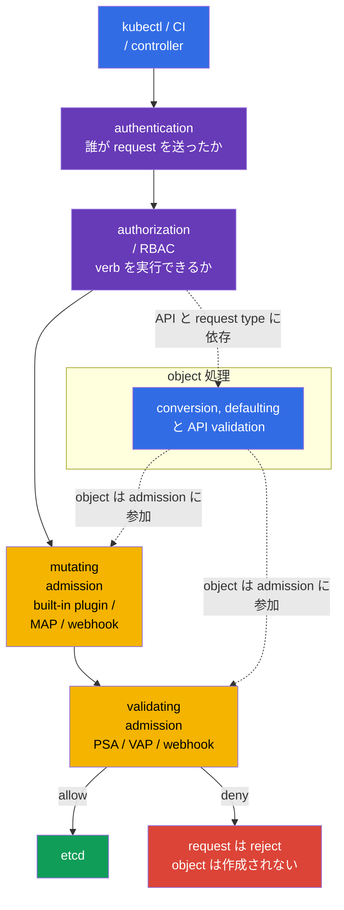

[Русская версия](ru.md) · [Eng version](README.md) · [Versión en español](es.md) · [Version française](fr.md) · [Deutsche Version](de.md) · [ქართული ვერსია](ge.md) · [繁體中文版](tw.md)

# 第20章. Admission controller と policy engine: OPA/Gatekeeper と Kyverno

> **課題。** RBAC は CI に Deployment の作成を正当に許可できますが、image が trusted registry のものか、Pod に危険な field がないか、object に必須の organization label があるかは確認しません。YAML の手動 review は template、API client、pipeline の error で容易に bypass されます。policy がなければ object は etcd に入り起動されます。admission control は保存前にこの request を確認するか安全に補完する必要があります。

> **この後。** [第19章](../19/jp.md)の Pod Security Admission は既製の Pod Security Standards を適用しますが、すべての organization rule には答えません。どの image registry を許可するか、owner label は必須か、安全な field を追加するか、関連 object を作成するかです。admission control は etcd への object write 前にある最後の programmable barrier です。これは CKS の **Minimize Microservice Vulnerabilities** domain（20%）の一部です。ここでは OPA/Gatekeeper、Kyverno、built-in CEL で独自の rule を作成します。

> **CKA で必要な知識。** 基本的な request path `authentication -> authorization -> admission -> etcd`、ServiceAccount、RBAC は[CKA 第21章](../../../cka/course/21/jp.md)、基本的な container restriction は[CKA 第20章](../../../cka/course/20/jp.md)で扱います。ここではこれらの mechanism を繰り返さず、security requirement を検証可能な cluster-wide policy にします。

> 🧠 Admission は、すでに許可された API request の field を etcd への write 前に確認します。RBAC は YAML の安全性を評価しません。

## 20.1. threat model: unsafe manifest は cluster への入口

RBAC は identity が Pod を作成できるかに答えます。developer に `create pods` が許可されていても、RBAC は YAML の内容を確認しません。そのため `privileged` container、`hostPath: /`、unknown registry の image、`runAsNonRoot` のない Pod、owner label のない Deployment が cluster に入ることがあります。この object は RBAC では完全に許可されても、security baseline に違反します。

admission control は authenticated・authorized 済みの request を保存前に受け取ります。mutating controller は object を補完でき、validating controller は accept または reject します。いずれかの validating stage が denial を返せば、object は etcd に現れません。



admission の順序は重要です。mutating controller は validating より先に実行されるため、validating policy は結果の object を見ます。diagram 上の conversion、defaulting、API validation は、一つの固定された stage でなく conceptual な object processing です。詳細は API と request type に依存します。built-in admission plugin と webhook には独自の順序があり、別の mutating webhook が object を変えた場合は再び呼び出されることがあります。mutation は idempotent にしてください。繰り返し適用しても同じ volume、label、sidecar を二つ追加してはいけません。

| layer | 問い | 例 |
|---|---|---|
| RBAC | 誰が `create pods` を実行できるか？ | CI は `team-a` でのみ Pod を作成できる |
| PSA | Pod は `baseline`/`restricted` standard に適合するか？ | restricted namespace で privileged Pod を deny |
| custom policy | object は organization rule に適合するか？ | image は `registry.example.com` のみ、`owner` label がある |
| mutating policy | どの安全な default を追加するか？ | `allowPrivilegeEscalation: false` を設定する |

PSA と policy engine は互いの代替ではありません。PSA は標準 Pod restriction を素早く一貫して適用します。Gatekeeper、Kyverno、CEL は specific requirement を扱います。理由なく同じ hard check を三つの場所で重複させないでください。denial の diagnostic が難しくなり、異なる message と exception が乖離します。

> 🏭 `failurePolicy` は admission webhook path の**technical または evaluation error**への reaction であり、明示的な policy decision へのものではありません。たとえば timeout、TLS/DNS/Service/Pod error、不正な HTTP/AdmissionReview response、`matchConditions` evaluation error に適用されます。
>
> `matchConditions` は API server が webhook call **前に**評価します。condition の一つでも `false` を返した場合、webhook は正常に skip されます。一つも `false` でなく、少なくとも一つが error になった場合、webhook は呼ばれません。`Fail` では API server が request を reject し、`Ignore` ではこの webhook なしで続けます。webhook が成功裏に call され明示的に `allowed: false` を返した場合、`Fail` と `Ignore` のどちらでも request は reject されます。
>
> `Fail` ではこの technical/evaluation error も create/update を reject します。policy を黙って bypass できませんが、webhook failure **またはその `matchConditions` error** が deploy や control plane operation の一部を止めることがあります。そのため security-critical webhook は一つの Pod より reliable である必要があります。複数 replica は failure risk を下げ、PDB は voluntary disruption が全 replica を同時に削除することを防ぎ、正しい TLS は trusted HTTPS connection を確保し、error/latency metric と alert は outage 前に degradation を検出できます。
>
> `Ignore` では API は available のままですが、その error の時点で object は**この webhook の check なしに**通過します。これは「より緩やかな deny」ではなく、意図的な policy bypass window です。critical で成熟した prohibition には通常 `Fail` を選びます。`Ignore` は rollout 中や、bypass risk を明示的に受容した non-critical control の一時的な compromise になり得ます。

## 20.2. Webhook: availability も security decision

Gatekeeper と Kyverno は通常 admission webhook として動作します。`kube-apiserver` は HTTPS で `AdmissionReview` を送信し、`allowed: true/false` と必要に応じた JSON patch を待ちます。`MutatingWebhookConfiguration` または `ValidatingWebhookConfiguration` の webhook には、特に重要な parameter が二つあります。

| parameter | security 上の意味 | risk |
|---|---|---|
| `failurePolicy: Fail` | webhook path または `matchConditions` の error（condition が一つも `false` でない場合）が request を reject する | engine outage または誤った CEL condition が deploy と時には control plane operation を block |
| `failurePolicy: Ignore` | そのような error では API server がこの webhook check なしで request を続ける | failure または condition error 中の policy bypass window |
| `timeoutSeconds` | API server の待機時間を制限する | timeout が長すぎるとすべての create/update が遅延する |
| `namespaceSelector`/`objectSelector` | webhook の scope を絞る | selector の誤りで critical namespace を skip し得る |
| `matchPolicy` | API version の matching を定める | 想定外の match が rule を広すぎる、または狭すぎる範囲に適用し得る |

Helm chart が install した webhook の `failurePolicy` を無考えに変更してはいけません。chart が変更を上書きする可能性があります。まず engine に複数 replica、PodDisruptionBudget、TLS、error/latency alert があることを確認します。新しい prohibition は audit/warn として導入し、既存 violation を修正してから enforcement を有効にする方が安全です。critical で成熟した rule には通常 `Fail` を選びます。最初の rollout では cluster を止めないことが重要であり、それを working protection の証拠と取り違えないでください。

minimal webhook configuration は endpoint、TLS trust、`AdmissionReview` contract を明示的に指定します。たとえば下の validating webhook は Service を使用します。mutating webhook の structure は同じですが、`reinvocationPolicy: IfNeeded` または `Never` を追加し mutation を idempotent にしてください。ここでは `caBundle` を省略しています。working manifest では webhook の base64-encoded CA certificate です。

```yaml
apiVersion: admissionregistration.k8s.io/v1
kind: ValidatingWebhookConfiguration
metadata:
  name: require-owner.example.com
webhooks:
- name: require-owner.example.com
  clientConfig:
    service:
      namespace: policy-system
      name: policy-webhook
      path: /validate
      port: 443
    caBundle: <base64-ca>
  rules:
  - apiGroups: [""]
    apiVersions: ["v1"]
    operations: ["CREATE", "UPDATE"]
    resources: ["pods"]
    scope: "*"
  admissionReviewVersions: ["v1"]
  sideEffects: None
  failurePolicy: Fail
  timeoutSeconds: 5
  matchPolicy: Equivalent
  namespaceSelector:
    matchLabels:
      policy.example.com/enforce-owner: "true"
  matchConditions:
  - name: skip-kube-system
    expression: "request.namespace != 'kube-system'"
```

`namespaceSelector` の custom namespace label は security boundary の一部です。rule が mandatory な identity は、その label を remove または change する権利を持ってはいけません。fixed scope には immutable な `kubernetes.io/metadata.name` を match する方が安全です。custom enforcement label を変えるのは platform/security role だけにします。同じことが `objectSelector` にも当てはまります。user が自ら object を変更して scope 外へ出られる label は deny boundary に適しません。

```bash
SUBJECT='system:serviceaccount:team-a:ci'
NS='team-a'
kubectl auth can-i patch namespaces/"$NS" --as="$SUBJECT"
kubectl auth can-i update namespaces/"$NS" --as="$SUBJECT"
# application/CI identity では、両方の answer が `no` である必要があります。
```

mutating webhook には、同じ contract に reinvocation rule が追加されます。

```yaml
apiVersion: admissionregistration.k8s.io/v1
kind: MutatingWebhookConfiguration
metadata:
  name: default-security.example.com
webhooks:
- name: default-security.example.com
  clientConfig:
    service:
      namespace: policy-system
      name: policy-webhook
      path: /mutate
    caBundle: <base64-ca>
  rules:
  - apiGroups: [""]
    apiVersions: ["v1"]
    operations: ["CREATE"]
    resources: ["pods"]
  admissionReviewVersions: ["v1"]
  sideEffects: None
  reinvocationPolicy: IfNeeded
  failurePolicy: Fail
  timeoutSeconds: 5
```

```bash
# 実際に register された webhook と、error 時の behavior を確認します。
kubectl get validatingwebhookconfigurations,mutatingwebhookconfigurations
kubectl get validatingwebhookconfiguration <name> -o yaml
kubectl -n gatekeeper-system get pods
kubectl -n kyverno get pods
```

admission は API request だけを確認します。image scanning、runtime detection、NetworkPolicy、RBAC、audit log の代替ではありません。admission で許可された image も第25〜28章の supply-chain check を通過する必要があり、すでに running の process は第29〜32章で control します。

> 🎯 `ConstraintTemplate`（code/schema）を `Constraint`（scope/parameter/`enforcementAction`）に結び付け、`dryrun` → `deny` を証明してください。
>
> この例で template は type `K8sRequiredLabels`、その Rego check、許可する parameter `labels` を宣言します。constraint `pods-must-have-owner` はこの type の specific instance です。関係を追ってください。`match` は Pod と excluded namespace を絞り、`parameters.labels: ["owner"]` は requirement を Rego に渡し、`enforcementAction` は見つけた violation への reaction を選びます。
>
> proof には新しい disposable Pod を使います。`dryrun` では `owner` のない Pod を作成し、API に accept されたことを確認してから `status.violations` に記録されるのを待ちます。`deny` へ patch 後、`owner` のない**別の** Pod を作成してください。API はそれを reject する必要があります。positive control として `owner` を持つ Pod は両 mode で accept されます。既存 Pod や `--dry-run` だけを使わないでください。新しい object に admission と audit が動作したことを証明しません。

## 20.3. OPA/Gatekeeper: `ConstraintTemplate` と `Constraint`

**OPA**（Open Policy Agent）は policy decision を行える engine です。**Gatekeeper** はこれを Kubernetes admission に接続します。誰かが object を create または change しようとすると、API server は check のため object を Gatekeeper に渡します。rule が violation を見つけると、Gatekeeper は result を observation として記録、warn、または request を reject します。最初に読むとき Rego や CEL を書ける必要はありません。まず重要なのは、**どの rule を check するか、どこで有効か、violation 時に何が起きるか**を理解することです。

そのため Gatekeeper は policy を二つの resource に分けます。これは重複でなく、rule を一度書いて異なる形で適用するためのものです。

1. `ConstraintTemplate` — **rule の template/blueprint**。Rego または CEL の checking code、target admission handler、許可する parameter の OpenAPI schema を保持します。schema は Pod を直接でなく `Constraint` 自体の parameter を確認します。たとえば `labels` が string list であることです。template を apply すると Gatekeeper は CRD（Custom Resource Definition）を作成します。つまり、この rule 用の新しい resource type を Kubernetes API に register します。
2. `Constraint` — **有効化した rule instance**。`match` scope（どの object と namespace を check するか）を選び、`parameters` に value を渡し、`enforcementAction` で violation 時の action を指定します。一つの template は team、namespace、required label set ごとに再利用でき、各 case で別の constraint を作れます。

flow を覚えてください。**template が rule を定義 → constraint が設定・有効化 → object create/change が `match` に入る → Gatekeeper が `parameters` で check を実行 → `enforcementAction` が result を定める**。これは class と instance に似ています。template は review と test が必要な code を含み、policy coverage を広げるときは通常 constraint の方を頻繁に変更します。一つの target では一つの engine を選びます。legacy `rego` は高い priority を持ち、`code[]` の CEL（`K8sNativeValidation`）は Rego より priority を持ちます。

### Gatekeeper の install と quick check

install は exam task 中でなく centrally 行います。Helm release では、まず chart version を GitOps manifest に固定し、その specific version の value を確認します。

```bash
helm repo add gatekeeper https://open-policy-agent.github.io/gatekeeper/charts
helm repo update
GATEKEEPER_CHART_VERSION="${GATEKEEPER_CHART_VERSION:?set exact chart version}"
helm upgrade --install gatekeeper gatekeeper/gatekeeper \
  --namespace gatekeeper-system --create-namespace \
  --version "$GATEKEEPER_CHART_VERSION"

kubectl -n gatekeeper-system get deploy,pods
kubectl get crd | grep -E 'gatekeeper|constraints.gatekeeper' 
```

以下の policy は system namespace 外の Pod に `owner` label を要求します。`privileged` check より compact ですが、model のすべての部分を示し、分かりやすい denial を返します。

```yaml
# reusable policy template 用の Gatekeeper API。
apiVersion: templates.gatekeeper.sh/v1
# template は新しい constraint type を定義しますが、まだ check 自体を有効にしません。
kind: ConstraintTemplate
metadata:
  # Kubernetes template name。通常 Rego package name と一致します。
  name: k8srequiredlabels
spec:
  crd:
    spec:
      names:
        # Gatekeeper がこの template から作成する Constraint resource の Kind。
        kind: K8sRequiredLabels
      validation:
        # schema は incoming Pod でなく Constraint の spec.parameters を check します。
        openAPIV3Schema:
          type: object
          properties:
            labels:
              # Constraint は required label key の list を policy に渡します。
              type: array
              items:
                type: string
  targets:
  # admission create/update request で呼ばれる built-in target。
  - target: admission.k8s.gatekeeper.sh
    # violation 時に返す Rego block。
    rego: |
      # Rego policy の namespace。
      package k8srequiredlabels

      # missing required label ごとに violation を作成します。
      violation[{"msg": msg}] {
        # Constraint の spec.parameters.labels から一つずつ value を取ります。
        required := input.parameters.labels[_]
        # input.review.object は current admission request の Pod です。
        not input.review.object.metadata.labels[required]
        # message は audit status または deny response に現れます。
        msg := sprintf("missing required label: %v", [required])
      }
---
# この ConstraintTemplate により作られた instance の API と kind。
apiVersion: constraints.gatekeeper.sh/v1beta1
kind: K8sRequiredLabels
metadata:
  # specific に enabled な policy の unique name。
  name: pods-must-have-owner
spec:
  # Audit-only: violation を記録しますが、まだ Pod を block しません。
  enforcementAction: dryrun
  match:
    # system namespace には rule を適用しません。
    excludedNamespaces: ["kube-system", "gatekeeper-system", "kyverno"]
    kinds:
    # empty API group は core/v1 API を意味します。
    - apiGroups: [""]
      # すべての Kubernetes object でなく Pod だけを check します。
      kinds: ["Pod"]
  parameters:
    # Rego の input.parameters.labels の value: owner label は必須です。
    labels: ["owner"]
```

#### この policy の読み方

まず Gatekeeper は `Constraint` の `match` を確認します。ここでは Pod だけを check し、列挙した system namespace を skip します。scope 外の object はこの rule にまったく入りません。各 matching create/update で Gatekeeper は `input.review.object` を作ります。これは Kubernetes API form の incoming Pod です。同時に constraint の `spec.parameters` を `input.parameters` に渡します。したがって、この例の `input.parameters.labels` は `["owner"]` です。

Rego rule は logical **AND** で結ばれた condition set です。「body 内のすべての line が成り立つ場合に violation を作成する」として下から上に読みます。

- `required := input.parameters.labels[_]` は各 required label を iterate します。`_` は「array の次の element」です。ここで唯一の value は `owner` です。
- `not input.review.object.metadata.labels[required]` は incoming Pod にこの label key がないとき true です。
- `msg := ...` は分かりやすい message を作り、`violation[{"msg": msg}]` は Gatekeeper が violation と見なす special result です。`dryrun` では `status.violations` に入り、`deny` では API server が message を返して Pod を作りません。

最初の policy では Rego の四つの idea を覚えれば十分です。`input` は read-only input data、`:=` は見つけた value を variable に保存、`[_]` は list を iterate、`not` は condition の absence/non-fulfillment を表します。個別の `if/else` を書く必要はありません。rule body を証明できなければ `violation` は作成されません。この policy は `owner` key の**存在**を check します。organization に non-empty または formatted value が必要なら、別の condition にします。

#### exam 用 quick pattern: namespace scope と `latest` の prohibition

まず task を四つの field に翻訳します。**何を** check するか（Pod と image）、**どこで**（`match.namespaces`）、**violation condition**（image が `latest` を使う）、**reaction**（`dryrun`、次に `deny`）です。一つの namespace の owner には新しい template は不要です。`K8sRequiredLabels` で `excludedNamespaces` を `namespaces: ["team-a"]` に置き換え、`parameters.labels: ["owner"]` を残します。

別の `latest` prohibition には、下の template を一つの file として書いて apply できます。これは通常、init、ephemeral container を check します。`spec.containers` だけを check すると bypass が残ります。この function は explicit `:latest` と tag のない image（Kubernetes が `latest` を仮定する `nginx` など）を violation とみなします。digest `@sha256:...` は latest とみなしません。

```yaml
# latest image tag prohibition template 用の Gatekeeper API。
apiVersion: templates.gatekeeper.sh/v1
# template は Rego を含み、下の Constraint が scope と reaction mode を選びます。
kind: ConstraintTemplate
metadata:
  # Kubernetes template name。
  name: k8sdisallowlatest
spec:
  crd:
    spec:
      names:
        # この template を使う Constraint Kind。
        kind: K8sDisallowLatest
      validation:
        # この policy に configurable parameter はありませんが、schema は object を記述します。
        openAPIV3Schema:
          type: object
          properties: {}
  targets:
  # check を Gatekeeper admission handler に接続します。
  - target: admission.k8s.gatekeeper.sh
    rego: |
      # Rego policy の namespace。
      package k8sdisallowlatest

      # bypass を残さないよう、PodSpec の三つの list すべてから container を集めます。
      pod_containers[container] {
        container := input.review.object.spec.containers[_]
      }
      pod_containers[container] {
        container := input.review.object.spec.initContainers[_]
      }
      pod_containers[container] {
        container := input.review.object.spec.ephemeralContainers[_]
      }

      # explicit の :latest tag は禁止です。
      image_uses_latest(image) {
        endswith(image, ":latest")
      }
      # tag のない image（例: nginx）は Kubernetes が latest と扱います。digest は許可します。
      image_uses_latest(image) {
        not contains(image, "@")
        path := split(image, "/")
        last := path[count(path) - 1]
        not contains(last, ":")
      }

      # latest image の各 container に Gatekeeper violation を返します。
      violation[{"msg": msg}] {
        container := pod_containers[_]
        image_uses_latest(container.image)
        msg := sprintf("image %q must not use the latest tag", [container.image])
      }
---
# template instance: selected scope でだけ prohibition を有効にします。
apiVersion: constraints.gatekeeper.sh/v1beta1
kind: K8sDisallowLatest
metadata:
  # namespace-specific scope を持つ policy の unique name。
  name: pods-without-latest-in-team-a
spec:
  # audit で開始し、verification 後に deny へ変更します。
  enforcementAction: dryrun
  match:
    # scope: policy は namespace team-a の Pod だけに適用されます。
    namespaces: ["team-a"]
    kinds:
    # Core/v1 API group。
    - apiGroups: [""]
      # Pod admission request だけを check します。
      kinds: ["Pod"]
```

exam ではまず universal framework を作ろうとしないでください。minimal な `ConstraintTemplate`、exact な `kind`/`match`、一つの `violation` condition を選びます。その後 negative と positive case を確認します。`team-a` の `nginx:latest` Pod は、最初は violation に現れ、`deny` 移行後は reject される必要があります。`nginx:1.27` Pod は通過します。scope も別に確認します。同じ attempt は `team-a` の外ではこの constraint に match してはいけません。

```bash
kubectl apply -f gatekeeper-owner.yaml
kubectl get constrainttemplates
kubectl get k8srequiredlabels
kubectl describe k8srequiredlabels pods-must-have-owner
```

`enforcementAction: dryrun` は violation を `status.violations` に集めますが、request を block しません。既存 Pod を修正し scope を確認した後、`deny` に変えます。一部の Gatekeeper version は `warn` action も support します。別 version の偶然の example でなく、installed CRD で exact な available action を確認してください。

```bash
kubectl get k8srequiredlabels pods-must-have-owner \
  -o jsonpath='{range .status.violations[*]}{.kind}/{.name}{": "}{.message}{"\n"}{end}'

# audit と workload correction の後だけ実行します。
kubectl patch k8srequiredlabels pods-must-have-owner --type merge \
  -p '{"spec":{"enforcementAction":"deny"}}'
```

### 危険な `privileged` に対する Gatekeeper の例

security-critical prohibition の template は通常の `containers`、`initContainers`、`ephemeralContainers` を check する必要があります。そうでないと一つの list が bypass path として残ります。

```rego
package k8sdisallowprivileged

violation[{"msg": msg}] {
  container := input.review.object.spec.containers[_]
  container.securityContext.privileged == true
  msg := sprintf("privileged container %q is not allowed", [container.name])
}

violation[{"msg": msg}] {
  container := input.review.object.spec.initContainers[_]
  container.securityContext.privileged == true
  msg := sprintf("privileged initContainer %q is not allowed", [container.name])
}

violation[{"msg": msg}] {
  container := input.review.object.spec.ephemeralContainers[_]
  container.securityContext.privileged == true
  msg := sprintf("privileged ephemeralContainer %q is not allowed", [container.name])
}
```

condition `container.securityContext.privileged == true` は field がない場合には match しません。つまり default の `false` は許可されます。PSA `restricted` はすでにこの requirement class を扱います。custom Rego は独自の scope、exception、extended logic が必要な場合だけ使用してください。

> 🔬 Kyverno CEL API は validation、mutation、generation、その他の admission scenario に対応します。

## 20.4. Kyverno 1.19: CEL-based policy type

> **Compatibility note.** Kyverno v1.19 は Kubernetes v1.33-v1.35 を公式 support します（`kyverno.io/docs/installation/releases/`、released Aug 2026）。この chapter の core lab（Lab108）は Kubernetes v1.36 で実行されます。これは意図的な forward-looking combination で、Kyverno v1.19 の test 済み・保証済み support matrix **には含まれません**。install と basic scenario は通常動作しますが、この version pair は officially tested compatibility の対象外です。successful install を v1.36 の完全 support の証拠とみなさないでください。現行 exam（v1.35 向け）の preparation では、Kyverno v1.19 が公式 test 済みの v1.35 でも behavior を別途確認してください。Kyverno、Gatekeeper、同様の third-party admission component の compatibility は、course の Kubernetes version と別にそれぞれの release matrix で確認する必要があります。

### Kyverno CEL policy の読み方

Kyverno は Kubernetes policy engine です。その controller と admission webhook は API から policy resource を読み、object operation に反応します。新しい CEL-based policy type では policy は通常の YAML resource で、CEL は `expression` field 内の短い expression language です。YAML を置き換えるものでも shell script でもありません。expression は current admission request の object である `object` などの input を受け取り、value を評価します。

最初に読むときは、各 example を一つの flow でたどります。**どの operation と resource が `matchConstraints` に match するか → どの追加 condition を通るか → policy は何をするか**です。`ValidatingPolicy` は boolean expression を評価します。`true` は object を許可し、`false` は violation を作ります。`Audit` action は記録だけを行い、`Deny` は request を reject します。`MutatingPolicy` は保存前の object change を返します。`GeneratingPolicy` は source resource が match した後、background controller に別 object の作成または synchronize を求めます。したがって generation は即時の admission deny ではありません。

最初は CEL syntax ではなく result で type を選びます。`ValidatingPolicy` は check して必要なら deny、`MutatingPolicy` は安全な default を追加、`GeneratingPolicy` は related resource を作成、`DeletingPolicy` は rule により delete、`ImageValidatingPolicy` は image を検査します。cluster-wide type は指定 scope で有効です。`Namespaced...` variant は自身の namespace だけに存在し、作用します。これらの resource を legacy `Policy`/`ClusterPolicy` と混在させないでください。API と field が異なります。

Kyverno 1.19 以降の主な path は、group `policies.kyverno.io/v1` の individual CEL-based cluster-wide type、`ValidatingPolicy`、`MutatingPolicy`、`GeneratingPolicy`、`DeletingPolicy`、`ImageValidatingPolicy` です。それぞれに自身の namespace だけで作用する namespaced variant、`NamespacedValidatingPolicy`、`NamespacedMutatingPolicy`、`NamespacedGeneratingPolicy`、`NamespacedDeletingPolicy`、`NamespacedImageValidatingPolicy` があります。legacy `Policy` と `ClusterPolicy`（`kyverno.io/v1`）、および `CleanupPolicy`（`kyverno.io/v2`）は 1.19 で deprecated され、1.20 で削除されます。一つの object に二つの model の field を混在させないでください。

course では Kyverno `v1.19.x` と Helm chart `3.9.0` の combination を確認しています。install 後に新しい CRD と controller の actual image を確認します。

```bash
helm upgrade --install kyverno kyverno/kyverno \
  --namespace kyverno --create-namespace --version 3.9.0
kubectl get crd validatingpolicies.policies.kyverno.io \
  mutatingpolicies.policies.kyverno.io \
  generatingpolicies.policies.kyverno.io \
  deletingpolicies.policies.kyverno.io \
  imagevalidatingpolicies.policies.kyverno.io
kubectl -n kyverno get deploy -o jsonpath='{..image}'
```

### `ValidatingPolicy`: `runAsNonRoot` を必須にする

`ValidatingPolicy` は何も change しません。「この object を accept できるか」という問いに答えます。policy は最初に Pod の create/update に match し、CEL は Pod を `object` として受け取ります。expression は `true` を返す必要があります。そうでなければ Kyverno は `message` field を持つ violation を作成します。`Audit` は request を許可し manifest 修正用の result を集めます。actual scope の確認後、`Deny` に切り替えればその Pod を reject します。下の check は explicit な pod-level baseline を要求します。完全な PSS `restricted` の代替ではありません。

```yaml
# 新しい CEL-based Kyverno policy の API。
apiVersion: policies.kyverno.io/v1
# validation は object を変更せず、violation を allow、record、reject します。
kind: ValidatingPolicy
metadata:
  # cluster 内で unique な policy name。
  name: require-pod-run-as-non-root
spec:
  # 最初は audit-only: request は block されず、violation を調査できます。
  validationActions: [Audit]
  matchConstraints:
    resourceRules:
    # Core/v1 Pod; create と後続 update の両方を check します。
    - apiGroups: [""]
      apiVersions: ["v1"]
      operations: ["CREATE", "UPDATE"]
      resources: ["pods"]
  validations:
  # 各 matching Pod で expression は true を返す必要があります。
  - message: "Pod spec.securityContext.runAsNonRoot must be true"
    expression: >-
      // has は missing securityContext への access を防ぎます。
      has(object.spec.securityContext) &&
      // ? は optional field を安全に読みます。absence または false は false になります。
      object.spec.securityContext.?runAsNonRoot.orValue(false)
```

```bash
kubectl apply -f kyverno-run-as-non-root.yaml
kubectl get validatingpolicy require-pod-run-as-non-root
kubectl patch validatingpolicy require-pod-run-as-non-root --type merge \
  -p '{"spec":{"validationActions":["Deny"]}}'
```

### `MutatingPolicy`: transparent label

`MutatingPolicy` は「allow または deny」ではなく、「すでに accepted した object にどの安全な default を追加するか」に答えます。match 後に changed object fragment を作り、API server は result を保存します。mutation は unsafe image を隠してはいけません。security-critical field には explicit validation の方がよいことが多いです。安全な learning example は audit-label だけを追加します。`ApplyConfiguration` は CEL が `Object{...}` で desired fragment を作り、Kyverno が legacy `patchStrategicMerge` の代わりにそれを適用することを意味します。

```yaml
# 保存前に object を change する CEL-based Kyverno policy API。
apiVersion: policies.kyverno.io/v1
kind: MutatingPolicy
metadata:
  # traceable audit label を追加する policy name。
  name: mark-kyverno-managed-pods
spec:
  matchConstraints:
    resourceRules:
    # すべての resource でなく、新しい core/v1 Pod だけを change します。
    - apiGroups: [""]
      apiVersions: ["v1"]
      operations: ["CREATE"]
      resources: ["pods"]
  mutations:
  # ApplyConfiguration は CEL-constructed fragment を incoming object に適用します。
  - patchType: ApplyConfiguration
    applyConfiguration:
      expression: >-
        // Object{...} は desired Kubernetes object fragment の CEL representation です。
        Object{
          metadata: Object.metadata{
            // 他の metadata.labels を置き換えずに label を追加します。
            labels: {"security.example.com/policy": "kyverno"}
          }
        }
```

### `GeneratingPolicy`: 新しい Namespace の default-deny

`GeneratingPolicy` は source object に反応し、別の background controller に downstream resource の作成を求めます。この example では source は新しい Namespace で、result はその内部の `NetworkPolicy` です。YAML template は readable なままで、CEL が Namespace name を評価・substitute します。`synchronize.enabled: true` では Kyverno は generated object を policy と照合・synchronize し続けます。これは Kubernetes `ownerReferences` についての主張ではなく、explicit な responsibility allocation の代替でもありません。一つの object を GitOps controller と Kyverno に同時に synchronize させないでください。

```yaml
# downstream resource を create/synchronize する CEL-based policy API。
apiVersion: policies.kyverno.io/v1
kind: GeneratingPolicy
metadata:
  # 新しい Namespace の NetworkPolicy 用 policy name。
  name: generate-default-deny-ingress
spec:
  evaluation:
    synchronize:
      # background controller は generated NetworkPolicy を template と照合し続けます。
      enabled: true
  matchConstraints:
    resourceRules:
    # trigger は core/v1 Namespace の create。
    - apiGroups: [""]
      apiVersions: ["v1"]
      operations: ["CREATE"]
      resources: ["namespaces"]
  matchConditions:
  # system namespace では policy を generate しません。
  - name: skip-system-namespaces
    expression: >-
      !(object.metadata.name in
      ["kube-system", "kube-public", "kube-node-lease", "kyverno"])
  variables:
  # YAML template 内で使用する source Namespace name を保存します。
  - name: namespaceName
    expression: object.metadata.name
  generate:
  - template:
      # (( ... )) 内で CEL variable を YAML に substitute します。
      interpolate: cel
      value: |
        apiVersion: networking.k8s.io/v1
        kind: NetworkPolicy
        metadata:
          # downstream NetworkPolicy の fixed name。
          name: default-deny-ingress
          # policy を trigger した Namespace 内に作成します。
          namespace: (( variables.namespaceName ))
          labels:
            # generated object の owner を識別できます。
            app.kubernetes.io/managed-by: kyverno
        spec:
          # empty selector は Namespace のすべての Pod を対象にします。
          podSelector: {}
          # default deny は ingress のみ。egress は別に指定します。
          policyTypes: [Ingress]
```

これは ingress default deny だけです。egress、DNS、許可する connection は別の `NetworkPolicy` で指定します。[第04章](../04/jp.md)を参照してください。

`GeneratingPolicy` は provisioning/reconciliation mechanism であり atomic な admission barrier ではありません。Namespace は background controller が downstream `NetworkPolicy` を確実に作成する前に作成されます。namespace を workload identity に渡す前に、たとえば `kubectl -n <new-namespace> get networkpolicy default-deny-ingress` で actual baseline を確認してください。`GeneratingPolicy` 自体の存在はこれを証明しません。

generation を使う前に、actual background controller ServiceAccount が target resource に持つ permission を確認します。`synchronize.enabled: true` には read/watch と downstream resource の management の両方が必要です。下の六つの check はすべて `yes` を返す必要があります。

```bash
KYVERNO_BG='system:serviceaccount:kyverno:kyverno-background-controller'
for verb in get list watch create update delete; do
  kubectl auth can-i "$verb" networkpolicies.networking.k8s.io \
    --all-namespaces --as="$KYVERNO_BG"
done
```

### legacy policy の migration

`kubectl get policies.kyverno.io,clusterpolicies.kyverno.io`（または `kubectl get pol,cpol`）と `CleanupPolicy` で legacy resource を inventory し、positive/negative test で behavior を記録します。validate/mutate/generate/delete/image rule を対応する新 type に移し、admission と background report の check 後にのみ legacy object を削除します。production では、installed minor version に対して[Kyverno migration guide](https://kyverno.io/docs/guides/migration-to-cel/)を確認してください。

> 🏭 engine の選択は policy ownership、language、CI、webhook に依存します。理由なく deny control を重複させないでください。

## 20.5. Gatekeeper と Kyverno: どちらを選ぶか

両 engine とも unsafe Pod を deny し、audit violation を集め、admission webhook として動作できます。language、model、specific rule の扱いやすさが異なります。

| criterion | Gatekeeper / OPA | Kyverno |
|---|---|---|
| check language | `ConstraintTemplate` の Rego または CEL | CEL と YAML template |
| resource model | Rego/CEL を持つ `ConstraintTemplate` + `Constraint` | namespaced variant を含む個別の CEL-based policy type |
| Validate | はい | はい |
| Mutate | 個別 mutator resource。capability は version に依存 | `MutatingPolicy` |
| Generate | 主な scenario ではない | `GeneratingPolicy` |
| Delete / cleanup | 主な scenario ではない | `DeletingPolicy` |
| complex logic と external OPA usage | Rego の強み | 可能だが、K8s policy では YAML の方が読みやすい |
| Kubernetes YAML に慣れた team の threshold | 高い | 低い |

選択は他の tool が劣ることを意味しません。organization がすでに Terraform、API gateway、CI で OPA を使うなら、Gatekeeper は policy language の数を減らします。mutation、generation、通常の Kubernetes YAML による review が必要なら、Kyverno の方がしばしば簡単です。同じ rule のためだけに両方を install しないでください。二つの webhook は latency、operational surface、conflicting denial の risk を増やします。responsibility が documented されていれば分担は可能です。たとえば complex Rego constraint は Gatekeeper、mutation と image verification は Kyverno です。

どちらの場合も policy は code です。`ConstraintTemplate`/`Constraint` または CEL-based Kyverno policy を Git に保存し、owner と test を定め、staging に apply し、audit/warn から始め violation evidence を保存します。cluster 前に CI mini-lab を加え、allowed と denied fixture を置きます。Gatekeeper には declarative Suite/Test/Case（`apiVersion: test.gatekeeper.sh/v1alpha1`、`kind: Suite`）を使い、denied fixture に直接 `gator test` を使わないでください。deny Constraint では検出された violation により `gator test` は policy が正しく動作していても exit code 1 になります。Kyverno は `kyverno test --require-tests` で確認し、test manifest がないために pipeline が green にならないようにします。allowed manifest が reject された場合、または denied manifest が accept された場合、CI は failure になる必要があります。exception は narrow、time-bounded、review で visible にします。global な `excludedNamespaces: ["*"]` にはしません。

> 🏭 CI fixture は cluster admission 前に、allowed object を accept し denied object を reject する必要があります。

### CI mini-lab: rollout 前に policy を検証する

positive と negative manifest は Git で policy の隣に置きます。template と constraint を `templates-and-constraints/template.yaml`、`templates-and-constraints/constraint.yaml` に、fixture を `allowed.yaml` と `denied.yaml` に保存し、隣に `suite.yaml` を作ります。

```yaml
apiVersion: test.gatekeeper.sh/v1alpha1
kind: Suite
tests:
- name: require-owner
  template: templates-and-constraints/template.yaml
  constraint: templates-and-constraints/constraint.yaml
  cases:
  - name: allowed-has-owner
    object: allowed.yaml
    assertions:
    - violations: no
  - name: denied-missing-owner
    object: denied.yaml
    assertions:
    - violations: yes
```

```bash
# 両方の expected result は successful exit code になります。deny fixture には violation が必要です。
gator verify suite.yaml                    # または: gator verify ./...

# Kyverno: kyverno-test.yaml がなければ pipeline は failure になります。
kyverno test --require-tests ./policy/kyverno
```

`gator verify` は allowed の `violations: no` と denied の `violations: yes` を expected assertion と見なします。そのため job は policy または fixture の regression 時だけ red になります。固定した CLI version に対応する command と file structure を使ってください。cluster admission test は integration CI の別 stage のままです。

> 🔬 Native CEL は webhook なしに API server で実行されますが、generation、report、signature verification、complex Rego logic は対象にしません。

## 20.6. Native CEL: external webhook なしの validation と mutation

`ValidatingAdmissionPolicy`（VAP）と `ValidatingAdmissionPolicyBinding` は CEL による built-in validation を定めます。Kubernetes 1.36 では `MutatingAdmissionPolicy`（MAP）と `MutatingAdmissionPolicyBinding` が stable となり default で enabled です。MAP は API server 内の in-process mutation です。CEL は server-side apply rule で merge する `ApplyConfiguration`、または `JSONPatch` を返します。どちらの native API でも binding は必須です。binding が policy を scope に bind し、binding のない policy は作用しません。

VAP は validating mechanism のままです。object を change・generate しません。VAP + MAP の native stack は webhook なしに mutation と validation を扱えますが、generation、policy report、image signature verification、complex external data、Rego の engine を置き換えません。

### `MutatingAdmissionPolicy`: limited scope に安全な label を追加する

下の example は label `policy.example.com/native-mutation=true` を持つ namespace の Pod だけに適用します。`ApplyConfiguration` は field の追加に便利です。array や path の exact operation には CEL list `JSONPatch{...}` を持つ `JSONPatch` を使います。`spec.reinvocationPolicy` は必須です。`Never` は MAP を再呼び出しせず、`IfNeeded` は他の admission stage の mutation 後に再評価を許可します。他の mutating plugin/webhook との順序は保証されないため、mutation は idempotent にしてください。mandatory security validation の代わりに mutation を使わないでください。

```yaml
apiVersion: admissionregistration.k8s.io/v1
kind: MutatingAdmissionPolicy
metadata:
  name: add-native-admission-label
spec:
  failurePolicy: Fail
  reinvocationPolicy: IfNeeded
  matchConstraints:
    resourceRules:
    - apiGroups: [""]
      apiVersions: ["v1"]
      operations: ["CREATE"]
      resources: ["pods"]
  mutations:
  - patchType: ApplyConfiguration
    applyConfiguration:
      expression: >-
        Object{
          metadata: Object.metadata{
            labels: {"admission.example.com/mutated": "true"}
          }
        }
---
apiVersion: admissionregistration.k8s.io/v1
kind: MutatingAdmissionPolicyBinding
metadata:
  name: add-native-admission-label
spec:
  policyName: add-native-admission-label
  matchResources:
    namespaceSelector:
      matchLabels:
        policy.example.com/native-mutation: "true"
```

practice では scope とその negative boundary の両方を確認します。上の YAML を `map-add-label.yaml` として保存してから、次を実行します。

```bash
kubectl apply -f map-add-label.yaml
kubectl create namespace native-map-on
kubectl label namespace native-map-on policy.example.com/native-mutation=true
kubectl create namespace native-map-off

cat <<'EOF' >/tmp/native-map-pod.yaml
apiVersion: v1
kind: Pod
metadata:
  name: native-map-test
spec:
  containers:
  - name: pause
    image: registry.k8s.io/pause:3.10
EOF

# scope binding が match: server-side dry-run は追加された label を返します。
kubectl -n native-map-on create --dry-run=server -o yaml -f /tmp/native-map-pod.yaml

# negative binding test: selector label のない namespace では mutation はありません。
if kubectl -n native-map-off create --dry-run=server -o yaml \
  -f /tmp/native-map-pod.yaml | grep -q 'admission.example.com/mutated: "true"'; then
  echo "MAP applied outside scope"
  exit 1
fi
```

### `ValidatingAdmissionPolicy`: effective non-root を必須にする

VAP は Pod-level default だけでなく各 process の effective setting を確認する必要があります。container-level `securityContext.runAsNonRoot` が優先されます。下の expression は container-level の `true`、または Pod-level が `true` の場合にこの field がないことを許可します。一方、明示的な `false` と、Pod-level および通常・init・ephemeral container の `runAsUser: 0` を reject します。

```yaml
apiVersion: admissionregistration.k8s.io/v1
kind: ValidatingAdmissionPolicy
metadata:
  name: require-pod-run-as-non-root
spec:
  failurePolicy: Fail
  matchConstraints:
    resourceRules:
    - apiGroups: [""]
      apiVersions: ["v1"]
      operations: ["CREATE", "UPDATE"]
      resources: ["pods"]
  variables:
  - name: podRunAsNonRoot
    expression: >-
      has(object.spec.securityContext) &&
      has(object.spec.securityContext.runAsNonRoot) &&
      object.spec.securityContext.runAsNonRoot == true
  - name: allContainers
    expression: >-
      object.spec.containers +
      (has(object.spec.initContainers) ? object.spec.initContainers : []) +
      (has(object.spec.ephemeralContainers) ? object.spec.ephemeralContainers : [])
  validations:
  - expression: >-
      !has(object.spec.securityContext) ||
      !has(object.spec.securityContext.runAsUser) ||
      object.spec.securityContext.runAsUser != 0
    message: "Pod-level runAsUser: 0 is forbidden"
  - expression: >-
      variables.allContainers.all(c,
        (!has(c.securityContext) || !has(c.securityContext.runAsUser) ||
          c.securityContext.runAsUser != 0) &&
        ((has(c.securityContext) && has(c.securityContext.runAsNonRoot)) ?
          c.securityContext.runAsNonRoot == true : variables.podRunAsNonRoot)
      )
    message: "Every app, init and ephemeral container must effectively run non-root; runAsUser: 0 is forbidden"
---
apiVersion: admissionregistration.k8s.io/v1
kind: ValidatingAdmissionPolicyBinding
metadata:
  name: require-pod-run-as-non-root
spec:
  policyName: require-pod-run-as-non-root
  validationActions: ["Deny"]
  matchResources:
    namespaceSelector:
      matchLabels:
        policy.example.com/enforce-non-root: "true"
```

CEL の `object` は check 対象 object です。request context、`oldObject`、binding parameter も利用できます。VAP/MAP の `failurePolicy` は policy evaluation error に関するもので、network availability に関するものではありません。ここに external webhook はありません。test していない CEL expression を cluster 全体の `Deny` としてすぐ publish しないでください。selector を絞り、`Audit`/`Warn` から始め、positive と negative case を確認します。

```bash
kubectl apply -f vap-run-as-non-root.yaml
kubectl label namespace team-example policy.example.com/enforce-non-root=true
kubectl get validatingadmissionpolicy,validatingadmissionpolicybinding
kubectl get mutatingadmissionpolicy,mutatingadmissionpolicybinding
```

### parameterized VAP: policy logic と team limit を分離する

`paramKind` は parameter resource type を定義し、binding は `paramRef` で specific object を選び、CEL はそれを `params` として受け取ります。ここでは一つの `ConfigMap` が replica を制限します。`matchConditions` は kubelet request に対して policy を評価しません。

```yaml
apiVersion: admissionregistration.k8s.io/v1
kind: ValidatingAdmissionPolicy
metadata:
  name: deployment-replica-limit
spec:
  failurePolicy: Fail
  paramKind:
    apiVersion: v1
    kind: ConfigMap
  matchConstraints:
    resourceRules:
    - apiGroups: ["apps"]
      apiVersions: ["v1"]
      operations: ["CREATE", "UPDATE"]
      resources: ["deployments"]
  matchConditions:
  - name: exclude-kubelet
    expression: '!("system:nodes" in request.userInfo.groups)'
  variables:
  - name: limit
    expression: 'int(params.data["maxReplicas"])'
  validations:
  - expression: "params != null && object.spec.replicas <= variables.limit"
    message: "replicas exceed the team limit"
---
apiVersion: v1
kind: ConfigMap
metadata:
  name: team-a-replica-limit
  namespace: policy-system
data:
  maxReplicas: "5"
---
apiVersion: admissionregistration.k8s.io/v1
kind: ValidatingAdmissionPolicyBinding
metadata:
  name: deployment-replica-limit-team-a
spec:
  policyName: deployment-replica-limit
  validationActions: [Deny]
  paramRef:
    name: team-a-replica-limit
    namespace: policy-system
    parameterNotFoundAction: Deny
  matchResources:
    namespaceSelector:
      matchLabels:
        team: a
```

一つの policy には異なる team 向けに複数の binding と parameter resource を設定できます。match した combination はすべて通過する必要があります。`parameterNotFoundAction: Deny` と `failurePolicy: Fail` により、missing configuration は bypass になりません。

VAP は parameter resource の authorization check を実行します。matched requester には `paramKind`/`paramRef` の read access が必要です。そうでなければ valid request が reject され得ます。`Deny` 前に actual identity を確認してください。その identity には parameter の change 権限でなく `get` だけを与え、workload identity が read する必要がある ConfigMap に security-sensitive data を保存しないでください。

```bash
SUBJECT='system:serviceaccount:team-a:ci'
kubectl auth can-i get configmap/team-a-replica-limit   -n policy-system --as="$SUBJECT"
```

> 🔬 **Deep Dive — Manifest-Based Admission Control。** training baseline の Kubernetes v1.36 ではこの feature は Alpha で default disabled です。upstream Kubernetes v1.37 では Beta になり default enabled です。この chapter の main workflow は v1.36 に固定されたままです。production-current delta は[Kubernetes v1.37 Security Delta](../APPENDIX_K8S_137_SECURITY_DELTA_JP.md)を参照してください。
>
> v1.36 では feature gate `ManifestBasedAdmissionControlConfig` を enable します。この feature は API server disk から webhook と CEL policy manifest を load します。`--admission-control-config-file` で、対象 admission plugin 用の distinct absolute `staticManifestsDir` を持つ `AdmissionConfiguration` を渡します。この policy は start 時に active になり、etcd から独立し、API-based admission configuration の delete/change を保護できます。これは experimental control-plane feature です。v1.36 の各 static admission object の `metadata.name` は**必ず** `.static.k8s.io` で終わる必要があります。initial load の invalid static manifest は API server が ready にならない原因になります。static manifest は support される admission resource に限られます。policy は `paramKind` を使えず、`ValidatingAdmissionPolicyBinding` と `MutatingAdmissionPolicyBinding` では `spec.paramRef` が forbidden です。static webhook は `clientConfig.url` を許可しますが、`clientConfig.service` は許可しません。各 HA API server は同一 file を受け取る必要があります。startup/reload test と managed configuration delivery なしにこの feature を導入しないでください。

### native CEL と webhook engine の比較

| capability | VAP | MAP + VAP native stack | Gatekeeper / Kyverno webhook |
|---|---|---|---|
| 実行場所 | API server 内 | API server 内 | 別の controller/webhook Pod |
| webhook network failure | ない | ない | availability と `failurePolicy` に依存 |
| Validate | はい | はい | はい |
| Mutate | いいえ | はい、`ApplyConfiguration` または `JSONPatch` | Kyverno ははい。Gatekeeper は個別 mutator resource |
| Generate / report / signature verification | いいえ | いいえ | engine により利用可能 |
| complex logic | CEL と API context に限定 | CEL と API context に限定 | Rego または policy engine feature |
| lifecycle | upstream Kubernetes API | upstream Kubernetes API | 個別の install、update、CRD |

Native CEL は small で pure な validation または mutation の有力な first option です。generation、signature verification、policy report、shared policy platform が必要なら engine が正当化されます。どちらの option でも scope、positive と negative test、rollout plan が必須です。

> 🎯 allowed manifest は accept され、violating manifest は reject されます。mutation では object と server-side dry-run result を比較してください。

## 20.7. 検証: allow、deny、mutation を証明する

policyの検証は、error なしの `kubectl apply` だけではなく、二つの制御されたscenarioで構成されます。正しいobjectはacceptされ、violatingなobjectは分かりやすい理由でrejectされます。`Deny` はadmissionを意図的に変更するため、こうしたテストはtest namespaceでのみ実行してください。

```bash
kubectl create namespace admission-test
kubectl label namespace admission-test policy.example.com/enforce-non-root=true

cat <<'EOF' | kubectl -n admission-test apply -f -
apiVersion: v1
kind: Pod
metadata:
  name: allowed-non-root
  labels:
    owner: platform
spec:
  securityContext:
    runAsNonRoot: true
  containers:
  - name: nginx
    image: nginxinc/nginx-unprivileged:1.30.4-alpine-slim
    securityContext:
      allowPrivilegeEscalation: false
      capabilities:
        drop: ["ALL"]
    ports:
    - containerPort: 8080
EOF

cat <<'EOF' | kubectl -n admission-test apply -f -
apiVersion: v1
kind: Pod
metadata:
  name: rejected-root-default
  labels:
    owner: platform
spec:
  containers:
  - name: nginx
    image: nginx:1.30.4
EOF
# 期待される結果: admission webhook または ValidatingAdmissionPolicy ... denied the request
```

Kyvernoで `Enforce` にした後は、violationをAPIのresponseとpolicy report（reportsがenabledの場合）で確認します。GatekeeperではConstraintの `status.violations` とdenial messageを確認します。VAPではpolicy/bindingのstatusとAPI serverのdenialだけで十分です。MAPではさらにserver-side dry-runのobjectを元のobjectと比較し、negative scopeのbindingを確認します。

```bash
kubectl get events -n admission-test --sort-by=.lastTimestamp
kubectl get policyreport -A 2>/dev/null || true
kubectl get k8srequiredlabels pods-must-have-owner -o yaml
kubectl get validatingadmissionpolicy require-pod-run-as-non-root -o yaml
```

許可されるはずのPodが作成されない場合は、まずすべてのpolicyを無効化するのではなく、denialのsourceを特定してください。`kubectl` のmessage、event、`kubectl describe`、該当controllerのlogを読みます。次に、selector、`match`/`exclude`、namespace label、mutation後のactual objectを確認します。policyが動作しなかった場合は、webhook/engineがhealthyであること、ruleがAPI versionとkindをカバーしていること、テストobjectがnamespaceやlabelで除外されていないことを確認してください。

> 🏭 Rollout: narrow scope → `Audit`/`dryrun`/`Warn` → remediation → `Deny`/`Enforce`。

## 20.8. よくある誤りと安全な rollout

| 誤り | 結果 | 安全な approach |
|---|---|---|
| すべてのnamespaceで即座に `Deny`/`Enforce` を有効にする | legacy workloadとsystem componentがblockされる | audit/warn -> violation一覧 -> remediation -> enforcement |
| `kube-system` は除外するが、engine自身のnamespaceは除外しない | engineが自分自身をblockする可能性がある | 必要なsystem namespaceだけを明示的に除外する |
| `containers` だけを確認する | `initContainers` や `ephemeralContainers` を経由してbypassされる | すべてのcontainer listをカバーするか、PSAを使う |
| security requirementの代わりにmutationを使う | YAMLは安全に見えるが、imageやarchitectureは依然として不適切なままである | mutationは安全なdefaultだけに使い、必須のinvariantはvalidateする |
| `failurePolicy: Ignore` を永続的に使う | outage時にpolicyがbypassされる | alert、HA、rolloutの管理、その上でcriticalなruleには意図的な `Fail` を選ぶ |
| `Audit` をdenyの代わりに信頼する | violationなobjectは依然として実行される | `Audit` はmigrationのstageとしてのみ使う |
| PSA、Gatekeeper、Kyvernoで同じdenyを同時に構築する | 重複したerrorと複雑な保守 | 各requirementの層に一つのownerを割り当てる |
| responsibilityの分担なしに `synchronize.enabled: true` を有効にする | Kyvernoがobjectの同期を続け、GitOpsと衝突する可能性がある | どのcontrollerがresourceを同期するかを文書化する。これは `ownerReferences` の問題ではない |

Gatekeeper/Kyvernoをupdateする前に、CRD migration、Kubernetes v1.36とのcompatibility、certificate rotation、resource requests/limits、PDBを確認してください。admission outageはincidentです。誰がscopeを一時的に狭めるか、またはreleaseをrollbackできるかを事前に定め、その変更をGitOps/auditで記録してください。

> 🏭 Policy as code: owner、Git review、fixture、CI、narrow exception、admission metrics、検証可能なrollout。

## 20.9. production での適用方法

- **単一のdenyではなく複数の層。** PSA `restricted` はmass baselineを設定し、custom policyはbusiness ruleを追加します。approved registry、owner/costのlabel、`resources.requests`、signature verificationです。RBACは依然として誰がobjectを作成できるかを制限します。
- **Policy as code。** template、constraint、policy、test fixture、exceptionをrepositoryに保存します。code reviewはpositiveとnegativeの両方の例を見る必要があり、CIはcluster rollout前にpolicyを検証する必要があります。
- **段階的な有効化。** 一つのnamespace、`Audit`/`dryrun`/`Warn` から始め、real violationを収集し、チームがmanifestを修正するのを支援し、それからだけ `Enforce`/`Deny` を有効にします。
- **admissionのobservability。** webhookのlatency/error metric、violation数、API serverのaudit event、ready replicaがないことへのalertを収集します。Kubernetesとengineをupdateしたあとにもpolicyを確認します。
- **最小限のexception。** exceptionは特定のnamespace、service account、RuntimeClass、approved imageに対して、ownerと期限付きで設定します。一つのdeploymentを「修正する」ためにbroadなbypassを使わないでください。

## 20.10. ミニ用語集

- **Admission control** - authenticationとauthorizationの後、objectをetcdに書き込む前のAPI serverのstage。
- **Mutating admission webhook** - validationの前にobjectを追加/変更するwebhook。
- **Validating admission webhook** - objectをacceptまたはrejectするwebhook。
- **OPA** - Open Policy Agent、Regoによるpolicy engine。
- **Gatekeeper** - `ConstraintTemplate` + `Constraint` のmodelを持つ、OPAによるKubernetes policy engine。
- **ConstraintTemplate** - 新しいconstraint type用のRegoまたはCELのpolicy codeとparameter schema。
- **Constraint** - parameter、match scope、reactionを持つGatekeeper templateのinstance。
- **Kyverno** - Kubernetes-native policy engine。1.19では主なAPIとして `ValidatingPolicy`、`MutatingPolicy`、`GeneratingPolicy`、`DeletingPolicy`、`ImageValidatingPolicy`、およびそれらのnamespaced variantを使用します。
- **ValidatingAdmissionPolicy** - 外部webhookなしのCELによるbuilt-in API server validation。bindingで適用されます。
- **MutatingAdmissionPolicy** - `ApplyConfiguration` または `JSONPatch` によるCELのbuilt-in API server mutation。bindingで適用されます。
- **CEL** - Common Expression Language、ValidatingAdmissionPolicy用のexpression language。
- **`failurePolicy`** - webhook/policy evaluationがunavailableまたはerrorになったときのAPI serverのaction。通常 `Fail` または `Ignore`。

## 20.11. 章のまとめ

- admissionはetcd前の最後のbarrierです。mutationはobjectを変更し、validationはそれをacceptまたはrejectします。RBACは同じ問いに答えるものではなく、policyの代替にはなりません。
- GatekeeperはRegoまたはCELを持つ `ConstraintTemplate` と、scope/paramsを持つ `Constraint` からpolicyを構築します。まず `dryrun` を使い、それから `deny` にするのが有用です。
- Kyverno 1.19はvalidation、mutation、generation、delete/cleanup、image verificationを個別のCEL-based policy typeとして記述します。mutationは安全なdefaultに便利ですが、validationの代替にはなりません。
- GatekeeperとKyvernoはwebhook engineです。そのためavailability、TLS、replicas、`timeoutSeconds`、`failurePolicy` はsecurity designの一部です。
- CELによるVAPは外部webhookなしにAPI server内で動作し、validationにのみ適しています。Kubernetes 1.36でstableになったMAPは `ApplyConfiguration` または `JSONPatch` によるmutationでnative stackを補完しますが、generationはできません。
- 信頼できるrollout: narrow scope -> audit/warn -> violationの修正 -> `Enforce`/`Deny`。acceptされたmanifestとrejectされたmanifestの両方を確認します。

## 20.12. 試験と実務での役立ち方

**試験で。** 関連するpublicなcurriculum fileは現在 `CKS_Curriculum v1.34` という名前ですが、CKSのexam環境は現在Kubernetes v1.35を使用しています。これは異なるversionです。curriculumはtopicを記述し、runtimeはavailableなAPIとcluster behaviorを決定します。controlがどこにあるかを素早く特定し、`ConstraintTemplate` と `Constraint` を読み、policyを作成・検証し、`Audit` と `Deny` を区別し、`denied the request` の原因を見つけてください。courseのextensionをexamに帰属させないでください。Kubernetes 1.36のnative MAPとKyverno 1.19は、この章のproduction指向の追加事項であり、linked curriculumの保証されたtask ではありません。exam前にLinux Foundation/CNCFの最新publicationを確認してください。

**実務で。** admission policyはunsafeなconfigurationを、incidentの後に探すのではなく、workloadの実行前に防ぎます。Kubernetes 1.36のnative MAP/VAPとKyverno 1.19は、specific clusterとengineのcompatibility確認後のproduction extensionとして有用です。最も価値のある結果はpolicyの数ではなく、narrow exception、observability、responsibilityの分担を備えた、理解可能でtestableなbaselineです。これはsupply-chain controlへの入口でもあります。courseの次の部分では、policyをregistry、signature、artifactに適用します。

## 20.13. 自己確認問題

<details>
<summary>1. Podを作成する権限を持つuserに対して、RBACが自ら `privileged: true` を禁止できないのはなぜですか？</summary>

RBACはidentityがPodに対する `create` verbを持っているかを判断するだけで、YAMLのfieldを検査しません。許可を持つuserは、validating admissionが別途ruleを課さない限り、`privileged: true` のPodを送信できます。PSA、VAP、Gatekeeper、Kyvernoは、まさにetcd前のobjectの内容を確認します。
</details>

<details>
<summary>2. mutating admissionとvalidating admissionはどの順序で実行され、なぜmutationはidempotentである必要がありますか？</summary>

mutating admissionはvalidatingより先に実行されるため、validationは既に変更されたobjectを見ます。webhookは別のmutating webhookがobjectを変更した後に再び呼び出されることがあり、`IfNeeded` を持つMAPも再評価を許可します。したがって、mutationを繰り返し適用しても、同じvolume、label、sidecarを二つ追加してはいけません。
</details>

<details>
<summary>3. Gatekeeperにおいて `ConstraintTemplate` と `Constraint` はどう違いますか？</summary>

`ConstraintTemplate` は新しいpolicy typeを定義します。RegoまたはCELのcode、admission target、parameterのOpenAPI schemaです。適用後、GatekeeperはCRD constraint kindを作成します。`Constraint` はこのtypeのinstanceで、parameter、`match` scope、`enforcementAction` を持ちます。templateはpolicy codeとしてreviewとtestを必要とし、constraintはscopeを広げるときに通常変更されます。
</details>

<details>
<summary>4. Kyvernoの `mutate` はどのようなときに適切で、どのようなときにrequirementを `validate` で表現する必要がありますか？</summary>

mutationは、`ApplyConfiguration` によるaudit-labelの追加のような、透明な安全なdefaultに適しています。黙って修正できないcritical security invariantには、明示的なvalidationが必要です。unsafeなobjectをrejectする必要があります。この章は、unsafeなimageやarchitectureをmutationで隠すことのないよう別途警告しています。
</details>

<details>
<summary>5. 永続的な `failurePolicy: Ignore` と、急いだ `failurePolicy: Fail` はそれぞれどのように危険ですか？</summary>

`Ignore` では、timeout、TLS error、webhookのunavailabilityの際に、objectはこのcheckなしで通過し、policy bypassの窓を作ります。`Fail` はそのようなerrorの際にもboundaryを維持しますが、engineのoutageがdeployやcontrol-plane operationを止める可能性があります。厳格なmodeの前には、replicas、PDB、TLS、latency/error alerting、安全なrolloutが必要です。
</details>

<details>
<summary>6. なぜpolicyは最初に `Audit`/`dryrun` で実行され、すぐに `Enforce`/`Deny` にしないのですか？</summary>

Audit/dryrunはlegacy workloadやsystem componentをblockせずに実際のviolationを収集します。次にownerがmanifestを修正し、scopeとpositive/negativeのscenarioを確認します。その後にのみ、`Deny`/`Enforce` は、突然のoutageではなく制御されたprohibitionとして導入されます。
</details>

<details>
<summary>7. CELによる `ValidatingAdmissionPolicy` は、Kyvernoと比較してどのような制限がありますか？</summary>

VAPはAPI server内でCEL validationを実行し、bindingによってのみ適用されます。objectを変更したり生成したりしません。native MAPはstackにmutationを追加しますが、generation、policy reports、image signature verification、Regoは提供しません。Kyvernoはvalidate、mutate、generate、delete、image validation用の個別のCEL-based typeと、namespaced variantを提供します。
</details>

<details>
<summary>8. `privileged` の自作checkで忘れてはならないcontainer listはどれですか？</summary>

`containers`、`initContainers`、`ephemeralContainers` を確認する必要があります。通常のcontainerだけを確認すると、initやdebug用のephemeral containerを経由したbypassが残ります。標準的なrequirement classにはこの章はPSA `restricted` を推奨しますが、自作のRegoはこれらすべてのlistを明示的にカバーする必要があります。
</details>

<details>
<summary>9. **Flashback（第04章）。** `NetworkPolicy` のdefault-deny（第04章）と、admission policyにおける `failurePolicy: Fail` と `enforce`/`Deny` の組み合わせ（この章）は、いずれもstackの異なるlayerで同じallow-list原則を実装しています。このanalogyを明示的に述べてください。admission-policyで「すべてのingress/egressへのdefault-deny」に対応するものは何で、「narrowに許可されたrule」に対応するものは何ですか？</summary>

admission-policyにおけるdefault-denyの等価物は、requirementを満たさないobjectがrejectされるenforcing ruleであり、`failurePolicy: Fail` はwebhookのerror時にbypassを許しません。narrowな許可の等価物は、正確な `match`/selector、condition、check対象のfieldであり、これによって特定の許可されたobjectだけがpolicyを通過します。NetworkPolicyと同様に、broadなexceptionはallow-list modelを破壊し、auditを難しくします。
</details>

## 演習

このtopicの主なpracticeは[Lab 108 CKS: Kyverno admission policy](../../labs/108/README_JP.MD)です。
ここでは、trusted registryとrestricted workload用のpolicyを適用し、auditとdenyを検証し、
admissionのresponseからrejectionの理由を見つけます。labのoptional stageではKyverno mutationを
検証します。native in-process mutationについては、[20.6節のMAP policyとbinding](#206-native-cel-external-webhook-なしの-validation-と-mutation)
を別途練習してください。labの自動チェックは `check_result` コマンドで実行されます。

独自のsandboxのためには、別のclusterまたはnamespaceを用意してください。admission policyは
system controllerをblockする可能性があります。`dryrun`/`Audit` から始め、rollbackのcommandを
事前に記録し、production webhookを無効化して `failurePolicy` をテストしないでください。

## 参考資料

- [Kubernetes: Admission Control](https://kubernetes.io/docs/reference/access-authn-authz/admission-controllers/)
- [Kubernetes: Validating Admission Policy](https://kubernetes.io/docs/reference/access-authn-authz/validating-admission-policy/)
- [OPA Gatekeeper documentation](https://open-policy-agent.github.io/gatekeeper/website/)
- [Kyverno documentation](https://kyverno.io/docs/)
- [Kyverno policy reports](https://kyverno.io/docs/policy-reports/)

---
[目次](../README_JP.md) · [第19章](../19/jp.md) · [第21章](../21/jp.md)
