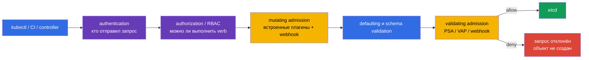

[Eng version](README.md) · [Versión en español](es.md) · [Version française](fr.md) · [Deutsche Version](de.md) · [ქართული ვერსია](ge.md) · [繁體中文版](tw.md) · [日本語版](jp.md)

# Глава 20. Admission-контроллеры и policy-движки: OPA/Gatekeeper и Kyverno

> **Что дальше.** Pod Security Admission из [главы 19](../19/ru.md) применяет готовые
> Pod Security Standards, но не отвечает на все правила организации: разрешён ли реестр
> образов, обязательна ли метка владельца, надо ли добавить безопасное поле или создать
> сопутствующий объект. Admission control - последний программируемый барьер перед записью
> объекта в etcd. Это часть домена **Minimize Microservice Vulnerabilities** CKS (20%):
> здесь строим собственные правила на OPA/Gatekeeper, Kyverno и встроенном CEL.

> **Что нужно знать из CKA.** Базовый путь запроса `authentication -> authorization ->
> admission -> etcd`, ServiceAccount и RBAC разобраны в
> [главе 21 CKA](../../../cka/course/21/ru.md); базовые ограничения контейнера - в
> [главе 20 CKA](../../../cka/course/20/ru.md). Здесь не повторяем эти механизмы, а
> превращаем требования безопасности в проверяемые cluster-wide policy.

## 20.1. Модель угроз: небезопасный манифест как вход в кластер

RBAC отвечает на вопрос, может ли identity создать Pod. Если разработчику разрешён
`create pods`, RBAC не проверяет, что именно находится в YAML. Поэтому в кластер могут
попасть `privileged`-контейнер, `hostPath: /`, образ из неизвестного registry, Pod без
`runAsNonRoot` или Deployment без метки владельца. Такой объект может быть полностью
разрешён RBAC, но всё равно нарушать security baseline.

Admission control получает уже аутентифицированный и авторизованный запрос, но до
сохранения. Mutating-контроллер может дополнить объект, validating-контроллер принимает
или отклоняет его. Если любой validating этап ответит отказом, объект в etcd не появится.



Порядок важен. Mutation выполняется до validation, поэтому validating-policy видит
получившийся объект. Встроенные admission plugins и webhooks имеют свой порядок и могут
вызываться повторно при изменении объекта другим mutating webhook. Mutation должна быть
идемпотентной: повторное применение не должно добавлять второй одинаковый volume, label
или sidecar.

| Слой | Вопрос | Пример |
|---|---|---|
| RBAC | кому можно `create pods`? | CI может создавать Pod только в `team-a` |
| PSA | соответствует ли Pod стандарту `baseline`/`restricted`? | запрещён privileged Pod в restricted namespace |
| custom policy | соответствует ли объект правилам организации? | образ только из `registry.example.com`; есть label `owner` |
| mutating policy | какой безопасный default добавить? | поставить `allowPrivilegeEscalation: false` |

PSA и policy engine не заменяют друг друга. PSA быстро и одинаково применяет стандартные
ограничения Pod. Gatekeeper, Kyverno или CEL закрывают специфические требования. Не
дублируйте одну и ту же жёсткую проверку в трёх местах без причины: отказ станет сложнее
диагностировать, а разные сообщения и исключения начнут расходиться.

## 20.2. Webhook: доступность тоже является security-решением

Gatekeeper и Kyverno обычно работают как admission webhook: `kube-apiserver` по HTTPS
отправляет им `AdmissionReview`, затем ждёт ответ `allowed: true/false` и возможные JSON
patches. У webhook есть два особенно важных параметра в `MutatingWebhookConfiguration` или
`ValidatingWebhookConfiguration`:

| Параметр | Значение для безопасности | Риск |
|---|---|---|
| `failurePolicy: Fail` | timeout, TLS-ошибка или недоступный webhook отклоняет запрос | outage engine останавливает deploy и иногда control plane operations |
| `failurePolicy: Ignore` | при ошибке webhook объект проходит без этой проверки | окно обхода policy во время сбоя |
| `timeoutSeconds` | ограничивает время ожидания API server | слишком большой timeout задерживает все create/update |
| `namespaceSelector`/`objectSelector` | сужает scope webhook | ошибочный selector может пропустить критичный namespace |
| `matchPolicy` | определяет сопоставление версий API | неожиданный match способен применить правило шире или уже |

Нельзя бездумно менять `failurePolicy` у webhook, установленного Helm chart: chart может
перезаписать изменение. Сначала проверьте, что engine имеет несколько replicas, PodDisruptionBudget,
TLS и alert на ошибки/latency. Новый запрет безопаснее вводить как audit/warn, исправить
существующие нарушения и только потом включить enforcement. Для критичного зрелого правила
обычно выбирают `Fail`; для первого rollout важнее не остановить кластер и не принять это за
доказательство работающей защиты.

```bash
# Какие webhook реально зарегистрированы и как они ведут себя при ошибке.
kubectl get validatingwebhookconfigurations,mutatingwebhookconfigurations
kubectl get validatingwebhookconfiguration <name> -o yaml
kubectl -n gatekeeper-system get pods
kubectl -n kyverno get pods
```

Admission проверяет лишь запрос к API. Он не заменяет image scanning, runtime detection,
NetworkPolicy, RBAC и audit logs. Образ, разрешённый в admission, всё ещё должен пройти
supply-chain проверки из глав 25-28; уже запущенный процесс контролируют главы 29-32.

## 20.3. OPA/Gatekeeper: `ConstraintTemplate` и `Constraint`

**OPA** - Open Policy Agent, общий движок решений на Rego. **Gatekeeper** использует OPA
в Kubernetes и даёт ему Kubernetes-native модель из двух объектов:

1. `ConstraintTemplate` описывает новый тип policy: Rego-правило, целевой admission
   handler и OpenAPI schema параметров. После применения Gatekeeper создаёт CRD для
   constraint kind.
2. `Constraint` - экземпляр этого типа: параметры, scope `match` и режим реакции. Один
   template можно переиспользовать для разных namespace или наборов labels.

Это разделение похоже на класс и экземпляр. Template должен быть reviewable code: именно в
нём находится логика, поэтому изменение Rego требует тестов и code review. Constraint
обычно меняют чаще, когда policy надо включить для новой команды или namespace.

### Установка и быстрая проверка Gatekeeper

Установку выполняют централизованно, а не во время экзаменационного задания. Для Helm
release сначала зафиксируйте версию chart в GitOps-манифесте и проверьте values конкретной
версии:

```bash
helm repo add gatekeeper https://open-policy-agent.github.io/gatekeeper/charts
helm repo update
helm upgrade --install gatekeeper gatekeeper/gatekeeper \
  --namespace gatekeeper-system --create-namespace \
  --version <pinned-chart-version>

kubectl -n gatekeeper-system get deploy,pods
kubectl get crd | grep -E 'gatekeeper|constraints.gatekeeper' 
```

Ниже policy требует label `owner` у Pod вне системных namespaces. Она компактнее, чем
проверка `privileged`, но показывает все части модели и даёт понятный отказ.

```yaml
apiVersion: templates.gatekeeper.sh/v1
kind: ConstraintTemplate
metadata:
  name: k8srequiredlabels
spec:
  crd:
    spec:
      names:
        kind: K8sRequiredLabels
      validation:
        openAPIV3Schema:
          type: object
          properties:
            labels:
              type: array
              items:
                type: string
  targets:
  - target: admission.k8s.gatekeeper.sh
    rego: |
      package k8srequiredlabels

      violation[{"msg": msg}] {
        required := input.parameters.labels[_]
        not input.review.object.metadata.labels[required]
        msg := sprintf("missing required label: %v", [required])
      }
---
apiVersion: constraints.gatekeeper.sh/v1beta1
kind: K8sRequiredLabels
metadata:
  name: pods-must-have-owner
spec:
  enforcementAction: dryrun
  match:
    excludedNamespaces: ["kube-system", "gatekeeper-system", "kyverno"]
    kinds:
    - apiGroups: [""]
      kinds: ["Pod"]
  parameters:
    labels: ["owner"]
```

```bash
kubectl apply -f gatekeeper-owner.yaml
kubectl get constrainttemplates
kubectl get k8srequiredlabels
kubectl describe k8srequiredlabels pods-must-have-owner
```

`enforcementAction: dryrun` собирает нарушения в `status.violations`, но не блокирует
запрос. После исправления уже существующих Pod и проверки scope замените его на `deny`.
Некоторые версии Gatekeeper также поддерживают action `warn`; точные доступные действия
проверяйте по установленному CRD, а не по случайному примеру из другой версии.

```bash
kubectl get k8srequiredlabels pods-must-have-owner \
  -o jsonpath='{range .status.violations[*]}{.kind}/{.name}{": "}{.message}{"\n"}{end}'

# Только после audit и исправления workload.
kubectl patch k8srequiredlabels pods-must-have-owner --type merge \
  -p '{"spec":{"enforcementAction":"deny"}}'
```

### Пример Gatekeeper для опасного `privileged`

Для security-critical запрета полезен отдельный template: он проверяет обычные,
`initContainers` и `ephemeralContainers`. В production лучше взять поддерживаемую библиотеку
Gatekeeper или покрыть template unit-тестами, а не копировать упрощённый Rego без проверки
всех полей PodSpec.

```rego
package k8sdisallowprivileged

violation[{"msg": msg}] {
  containers := input.review.object.spec.containers
  container := containers[_]
  container.securityContext.privileged == true
  msg := sprintf("privileged container %q is not allowed", [container.name])
}
```

Условие `container.securityContext.privileged == true` не срабатывает для отсутствующего
поля, то есть default `false` допускается. Аналогичные циклы нужны для `initContainers` и
`ephemeralContainers`; это типичная ошибка самописной policy. PSA `restricted` уже
покрывает этот класс требований - используйте custom Rego только когда нужны свои scope,
исключения или расширенная логика.

## 20.4. Kyverno: policy как Kubernetes YAML

Kyverno хранит policy в обычных Kubernetes-ресурсах и использует YAML-паттерны вместо Rego.
`ClusterPolicy` действует на весь кластер, `Policy` - внутри одного namespace. Для многих
платформенных правил это снижает порог входа: security engineer видит match, YAML-условие и
изменяемые поля в одном документе.

| Тип правила | Что делает | Типичный пример |
|---|---|---|
| `validate` | разрешает или отклоняет объект, либо сообщает нарушение | обязательный `runAsNonRoot`, trusted registry |
| `mutate` | добавляет или меняет поля до сохранения | default `allowPrivilegeEscalation: false` |
| `generate` | создаёт или синхронизирует связанный ресурс | default-deny `NetworkPolicy` при создании Namespace |
| `verifyImages` | проверяет подпись/attestation образа | допуск только образов, подписанных доверенным keyless identity |

Устанавливайте один policy engine как управляемый platform component. Как и у Gatekeeper,
фиксируйте версию chart, затем проверьте контроллер, webhook и CRD:

```bash
helm repo add kyverno https://kyverno.github.io/kyverno/
helm repo update
helm upgrade --install kyverno kyverno/kyverno \
  --namespace kyverno --create-namespace \
  --version <pinned-chart-version>

kubectl -n kyverno get pods
kubectl get clusterpolicy,policy -A
```

### `validate`: требовать `runAsNonRoot`

Следующая `ClusterPolicy` требует явный pod-level baseline. Такая проверка не заменяет
полную `restricted`-проверку: container-level `securityContext` всё ещё может быть
важен, а `runAsNonRoot` не гарантирует безопасный UID образа. Для rollout используйте
`Audit`, найдите offenders, затем переведите policy в `Enforce`.

```yaml
apiVersion: kyverno.io/v1
kind: ClusterPolicy
metadata:
  name: require-pod-run-as-non-root
spec:
  validationFailureAction: Audit
  background: true
  rules:
  - name: require-pod-security-context
    match:
      any:
      - resources:
          kinds: ["Pod"]
    validate:
      message: "Pod spec.securityContext.runAsNonRoot must be true"
      pattern:
        spec:
          securityContext:
            runAsNonRoot: true
```

```bash
kubectl apply -f kyverno-run-as-non-root.yaml
kubectl get clusterpolicy require-pod-run-as-non-root
kubectl get policyreport -A 2>/dev/null || true

# После обработки результатов Audit:
kubectl patch clusterpolicy require-pod-run-as-non-root --type merge \
  -p '{"spec":{"validationFailureAction":"Enforce"}}'
```

В новых версиях Kyverno часть policy-level полей меняется или помечается deprecated.
Проверяйте schema установленной версии командой `kubectl explain clusterpolicy.spec` и
официальную compatibility matrix, а не смешивайте примеры из разных release.

### `mutate`: безопасный default для контейнеров

Mutation не должна скрывать небезопасную архитектуру. Например, безусловно поставить
`runAsNonRoot: true` может сломать образ, который запускается от root. Но default
`allowPrivilegeEscalation: false` обычно уместен как baseline, если приложению не нужна
такая возможность. Оператор `+()` добавляет значение лишь при отсутствии поля.

```yaml
apiVersion: kyverno.io/v1
kind: ClusterPolicy
metadata:
  name: default-no-privilege-escalation
spec:
  rules:
  - name: set-no-privilege-escalation
    match:
      any:
      - resources:
          kinds: ["Pod"]
    mutate:
      foreach:
      - list: "request.object.spec.containers[]"
        patchStrategicMerge:
          spec:
            containers:
            - (name): "{{ element.name }}"
              securityContext:
                +(allowPrivilegeEscalation): false
```

Проверьте результат именно после admission, а не только YAML до `apply`:

```bash
kubectl apply -f kyverno-no-escalation.yaml
kubectl run mutated --image=nginx:1.27.4 --restart=Never
kubectl get pod mutated -o jsonpath='{.spec.containers[0].securityContext.allowPrivilegeEscalation}{"\n"}'
kubectl delete pod mutated
```

### `generate`: создать default-deny вместе с Namespace

`generate` закрывает частую операционную дыру: команда создала новый namespace, но до
первой NetworkPolicy её workload находится в плоской сети. Правило ниже создаёт
`default-deny-ingress` в новом namespace. `synchronize: true` означает, что Kyverno
поддерживает generated resource в соответствии с policy; это надо явно учитывать в
ownership и GitOps, иначе controller вернёт вручную удалённый объект.

```yaml
apiVersion: kyverno.io/v1
kind: ClusterPolicy
metadata:
  name: generate-default-deny-ingress
spec:
  rules:
  - name: default-deny-for-new-namespace
    match:
      any:
      - resources:
          kinds: ["Namespace"]
    exclude:
      any:
      - resources:
          names: ["kube-system", "kube-public", "kube-node-lease", "kyverno"]
    generate:
      apiVersion: networking.k8s.io/v1
      kind: NetworkPolicy
      name: default-deny-ingress
      namespace: "{{ request.object.metadata.name }}"
      synchronize: true
      data:
        metadata:
          labels:
            app.kubernetes.io/managed-by: kyverno
        spec:
          podSelector: {}
          policyTypes: ["Ingress"]
```

```bash
kubectl apply -f kyverno-generate-default-deny.yaml
kubectl create namespace team-example
kubectl -n team-example get networkpolicy default-deny-ingress
```

Это только ingress default deny. Egress, DNS и разрешённые связи задают отдельными
NetworkPolicy - см. [главу 04](../04/ru.md). Не включайте auto-generation в namespace,
где другой controller уже владеет тем же объектом.

## 20.5. Gatekeeper и Kyverno: что выбрать

Оба движка могут deny небезопасный Pod, собирать audit-нарушения и работать через
admission webhook. Различается язык, модель и удобство конкретного правила.

| Критерий | Gatekeeper / OPA | Kyverno |
|---|---|---|
| Язык проверки | Rego | YAML patterns, CEL/conditions и JMESPath expressions |
| Модель ресурса | `ConstraintTemplate` + `Constraint` | `ClusterPolicy`/`Policy` с rules |
| Validate | да | да |
| Mutate | ограниченные mutation patterns зависят от версии | основной сценарий `mutate`, включая `foreach` |
| Generate | не основной сценарий | встроенный `generate` |
| Сложная логика и внешнее использование OPA | сильная сторона Rego | возможна, но YAML читается проще для K8s policy |
| Порог для команды, привыкшей к Kubernetes YAML | выше | ниже |

Выбор не означает, что другой инструмент хуже. Если организация уже использует OPA для
Terraform, API gateway и CI, Gatekeeper уменьшает число языков policy. Если нужны mutation,
generation и review в привычном Kubernetes YAML, Kyverno часто проще. Не устанавливайте
оба только ради одинаковых правил: два webhook увеличивают latency, эксплуатационную
поверхность и риск противоречивых отказов. Допустимо разделение ответственности, если оно
документировано: например, Gatekeeper для сложных Rego constraints, Kyverno для mutation и
image verification.

В обоих случаях policy - код: храните `ConstraintTemplate`/`Constraint` или
`ClusterPolicy` в Git, назначайте владельца и тесты, применяйте в staging, начинайте с
audit/warn и сохраняйте evidence нарушений. Исключение должно быть узким, ограниченным по
времени и видимым в review - не глобальным `excludedNamespaces: ["*"]`.

## 20.6. `ValidatingAdmissionPolicy`: CEL без внешнего webhook

Начиная с Kubernetes 1.30 API server поддерживает встроенный
`ValidatingAdmissionPolicy` (VAP). Логика пишется на **CEL** (Common Expression Language),
а policy соединяется с областью действия и реакцией отдельным
`ValidatingAdmissionPolicyBinding`. Проверка выполняется внутри API server: нет отдельного
engine Pod, Service, TLS-сертификата и сетевого round-trip webhook.

VAP подходит для локальных проверок объекта: labels, поля PodSpec, requests/limits,
запрет `:latest`, namespace scope. Он не умеет mutation или generate и не заменяет
Kyverno/Gatekeeper для сложного Rego, внешних данных или image signature verification.

```yaml
apiVersion: admissionregistration.k8s.io/v1
kind: ValidatingAdmissionPolicy
metadata:
  name: require-pod-run-as-non-root
spec:
  failurePolicy: Fail
  matchConstraints:
    resourceRules:
    - apiGroups: [""]
      apiVersions: ["v1"]
      operations: ["CREATE", "UPDATE"]
      resources: ["pods"]
  validations:
  - expression: "object.spec.securityContext != null && object.spec.securityContext.runAsNonRoot == true"
    message: "Pod spec.securityContext.runAsNonRoot must be true"
---
apiVersion: admissionregistration.k8s.io/v1
kind: ValidatingAdmissionPolicyBinding
metadata:
  name: require-pod-run-as-non-root
spec:
  policyName: require-pod-run-as-non-root
  validationActions: ["Deny"]
  matchResources:
    namespaceSelector:
      matchLabels:
        policy.example.com/enforce-non-root: "true"
```

`object` в CEL - проверяемый объект; также доступны контекст запроса и, в нужных
сценариях, `oldObject` и параметры binding. `failurePolicy` VAP относится к ошибке оценки
policy, а не к доступности сети: самого webhook здесь нет. Тем не менее не публикуйте
непроверенное CEL выражение сразу с `Deny` на весь кластер. Сузьте `namespaceSelector`,
начните с `Audit`/`Warn`, прочитайте warnings и только затем выберите `Deny`.

```bash
kubectl apply -f vap-run-as-non-root.yaml
kubectl label namespace team-example policy.example.com/enforce-non-root=true
kubectl get validatingadmissionpolicy,validatingadmissionpolicybinding
```

### Сравнение встроенного CEL и webhook engine

| Возможность | ValidatingAdmissionPolicy + CEL | Gatekeeper / Kyverno webhook |
|---|---|---|
| Где исполняется | внутри API server | отдельные controller/webhook Pod |
| Сетевой отказ webhook | отсутствует | зависит от доступности и `failurePolicy` |
| Validate | да | да |
| Mutate / generate | нет | Kyverno - да; Gatekeeper - иная модель и возможности версии |
| Сложная логика | ограничена CEL и API context | Rego или policy engine features |
| Жизненный цикл | upstream Kubernetes API | отдельная установка, обновление и CRD |

Встроенный CEL - хорошая первая опция для небольшой чистой validation. Engine оправдан,
когда требуются mutation, generate, signature verification, policy reports или общая policy
платформа. В обоих вариантах обязательны scope, тест отрицательного случая и план rollout.

## 20.7. Проверка: доказать allow, deny и mutation

Проверка policy состоит не из `kubectl apply` без ошибки, а из двух контролируемых
сценариев: корректный объект принят, нарушающий - отклонён с понятной причиной. Применяйте
такие проверки только в test namespace, поскольку `Deny` намеренно меняет admission.

```bash
kubectl create namespace admission-test
kubectl label namespace admission-test policy.example.com/enforce-non-root=true

cat <<'EOF' | kubectl -n admission-test apply -f -
apiVersion: v1
kind: Pod
metadata:
  name: allowed-non-root
  labels:
    owner: platform
spec:
  securityContext:
    runAsNonRoot: true
  containers:
  - name: nginx
    image: nginx:1.27.4
    securityContext:
      allowPrivilegeEscalation: false
      capabilities:
        drop: ["ALL"]
    ports:
    - containerPort: 8080
EOF

cat <<'EOF' | kubectl -n admission-test apply -f -
apiVersion: v1
kind: Pod
metadata:
  name: rejected-root-default
  labels:
    owner: platform
spec:
  containers:
  - name: nginx
    image: nginx:1.27.4
EOF
# Ожидается: admission webhook или ValidatingAdmissionPolicy ... denied the request
```

После `Enforce` в Kyverno нарушение ищут в ответе API и policy report, если reports
включены. У Gatekeeper проверяют `status.violations` Constraint и сообщение отказа. У VAP
достаточно статуса policy/binding и отказа API server.

```bash
kubectl get events -n admission-test --sort-by=.lastTimestamp
kubectl get policyreport -A 2>/dev/null || true
kubectl get k8srequiredlabels pods-must-have-owner -o yaml
kubectl get validatingadmissionpolicy require-pod-run-as-non-root -o yaml
```

Если разрешённый Pod не создаётся, сначала определите источник отказа, а не отключайте все
policy: прочитайте сообщение `kubectl`, event, `kubectl describe` и логи конкретного
controller. Затем сверяйте selector, `match`/`exclude`, namespace labels и actual object
после mutation. Если policy не сработала, проверьте, что webhook/engine healthy, правило
покрывает API version и kind, а тестовый объект не исключён по namespace или label.

## 20.8. Типичные ошибки и безопасный rollout

| Ошибка | Последствие | Безопасный подход |
|---|---|---|
| Сразу включить `Deny`/`Enforce` на все namespaces | блокируются legacy workload и system components | audit/warn -> список нарушений -> remediation -> enforcement |
| Исключить `kube-system`, но не собственный namespace engine | engine может заблокировать самого себя | явно исключить только требуемые system namespaces |
| Проверять только `containers` | обход через `initContainers` или `ephemeralContainers` | покрыть все container lists либо использовать PSA |
| Использовать mutation вместо security requirement | YAML выглядит безопасным, но образ/архитектура остаются неподходящими | mutate только безопасные defaults; обязательные инварианты validate |
| `failurePolicy: Ignore` навсегда | при outage policy обходится | alert, HA, контроль rollout, затем осознанный `Fail` для критичных правил |
| Полагаться на `Audit` как на запрет | нарушающий объект всё равно запускается | применять `Audit` лишь как этап миграции |
| Одновременно завести одинаковый deny в PSA, Gatekeeper и Kyverno | дублирующие ошибки и сложная поддержка | назначить одному слою владельца каждого требования |
| Включить `synchronize: true` без ownership | controller восстанавливает вручную удалённый объект | документировать managed resources и GitOps ownership |

Перед обновлением Gatekeeper/Kyverno проверяйте CRD migration, compatibility с Kubernetes
v1.36, certificate rotation, resource requests/limits и PDB. Admission outage - incident:
заранее определите, кто может временно сузить scope или откатить release, и логируйте это
изменение через GitOps/audit.

## 20.9. Как это применяют в продакшене

- **Слои вместо единственного запрета.** PSA `restricted` задаёт массовый baseline;
  custom policy добавляет бизнес-правила: approved registry, owner/cost labels,
  `resources.requests`, signature verification. RBAC по-прежнему ограничивает, кто может
  создавать объекты.
- **Policy as code.** Храните templates, constraints, policies, test fixtures и
  исключения в репозитории. Code review должен видеть и положительный, и отрицательный
  пример, а CI - проверять policy до cluster rollout.
- **Постепенное включение.** Начните с одного namespace, `Audit`/`dryrun`/`Warn`, соберите
  real violations, помогите командам исправить manifests и лишь затем включайте
  `Enforce`/`Deny`.
- **Наблюдаемость admission.** Собирайте latency/error metrics webhook, число violations,
  API server audit events и alerts на отсутствие ready replicas. Проверяйте policy после
  обновления Kubernetes и engine.
- **Минимальные исключения.** Исключение задают на конкретный namespace, service account,
  RuntimeClass или approved image, с владельцем и сроком. Не используйте broad bypass для
  «починки» одного deployment.

## 20.10. Мини-глоссарий

- **Admission control** - этап API server после authentication и authorization, до записи
  объекта в etcd.
- **Mutating admission webhook** - webhook, который добавляет/изменяет объект до validation.
- **Validating admission webhook** - webhook, который разрешает либо отклоняет объект.
- **OPA** - Open Policy Agent, движок policy на Rego.
- **Gatekeeper** - Kubernetes policy engine на OPA с моделью `ConstraintTemplate` +
  `Constraint`.
- **ConstraintTemplate** - Rego template и schema параметров для нового constraint type.
- **Constraint** - экземпляр Gatekeeper template с параметрами, match scope и реакцией.
- **Kyverno** - Kubernetes-native policy engine с YAML rules `validate`, `mutate`,
  `generate` и `verifyImages`.
- **ValidatingAdmissionPolicy** - встроенная API server validation на CEL без внешнего
  webhook; применяется binding-ом.
- **CEL** - Common Expression Language, язык выражений для ValidatingAdmissionPolicy.
- **`failurePolicy`** - действие API server, когда webhook/оценка policy недоступны или
  завершаются ошибкой: обычно `Fail` либо `Ignore`.

## 20.11. Итоги главы

- Admission - последний барьер перед etcd: mutation изменяет объект, validation разрешает
  или отклоняет его. RBAC отвечает не на тот же вопрос и не заменяет policy.
- Gatekeeper строит policy из `ConstraintTemplate` с Rego и `Constraint` с scope/params;
  сначала полезно использовать `dryrun`, затем `deny`.
- Kyverno описывает `validate`, `mutate` и `generate` в Kubernetes YAML. Mutation удобна
  для безопасных defaults, но не заменяет validation обязательных требований.
- Gatekeeper и Kyverno - webhook engines, поэтому их availability, TLS, replicas,
  `timeoutSeconds` и `failurePolicy` являются частью security design.
- `ValidatingAdmissionPolicy` с CEL работает в API server без внешнего webhook и подходит
  для простой validation, но не умеет mutation/generation.
- Надёжный rollout: малый scope -> audit/warn -> исправление violations ->
  `Enforce`/`Deny`, с проверкой принятого и отклонённого manifest.

## 20.12. Как это пригодится: на экзамене и в реальной работе

**На экзамене.** Быстро определяйте, где находится контроль: RBAC отвечает за право
отправить запрос, admission - за содержимое объекта. Умейте прочитать `ConstraintTemplate`
и `Constraint`, создать/проверить `ClusterPolicy`, отличить audit от enforce и найти
причину `denied the request`. В Kubernetes 1.36 полезно знать пару
`ValidatingAdmissionPolicy` + `ValidatingAdmissionPolicyBinding` и CEL expression.

**В реальной работе.** Admission policy предотвращает небезопасную конфигурацию до запуска
workload, а не ищет её после инцидента. Наиболее ценный результат - не число политик, а
понятный, тестируемый baseline с узкими исключениями, наблюдаемостью и ownership. Это также
входная точка supply-chain контроля: следующая часть курса применит policy к registry,
подписям и артефактам.

## 20.13. Вопросы для самопроверки

1. Почему RBAC не может сам запретить `privileged: true` пользователю, которому разрешено
   создать Pod?
2. В каком порядке проходят mutating и validating admission, и почему mutation должна быть
   идемпотентной?
3. Чем `ConstraintTemplate` отличается от `Constraint` в Gatekeeper?
4. Когда Kyverno `mutate` оправдан, а когда требование нужно выразить через `validate`?
5. Чем опасны постоянный `failurePolicy: Ignore` и поспешный `failurePolicy: Fail`?
6. Почему policy сначала запускают в `Audit`/`dryrun`, а не сразу в `Enforce`/`Deny`?
7. В чём ограничения `ValidatingAdmissionPolicy` на CEL по сравнению с Kyverno?
8. Какие container lists нельзя забыть при самописной проверке `privileged`?

## Практика

Основная практика этой темы - [лаба 108 CKS: admission-политики Kyverno/OPA](../../labs/108/README_RU.MD).
В ней примените policy для trusted registry и restricted workload, проверьте audit и deny,
а также найдите причину отклонения в ответе admission. Структура лабы появится в CKS
каталоге вместе с автоматической проверкой `check_result`.

Для самостоятельного sandbox подготовьте отдельный кластер или namespace: admission policy
может блокировать системные controller. Начните с `dryrun`/`Audit`, заранее запишите команду
отката и не тестируйте `failurePolicy` отключением production webhook.

## Справочные материалы

- [Kubernetes: Admission Control](https://kubernetes.io/docs/reference/access-authn-authz/admission-controllers/)
- [Kubernetes: Validating Admission Policy](https://kubernetes.io/docs/reference/access-authn-authz/validating-admission-policy/)
- [OPA Gatekeeper documentation](https://open-policy-agent.github.io/gatekeeper/website/)
- [Kyverno documentation](https://kyverno.io/docs/)
- [Kyverno policy reports](https://kyverno.io/docs/policy-reports/)

---
[Оглавление](../README_RU.md) · [Глава 19](../19/ru.md) · [Глава 21](../21/ru.md)
