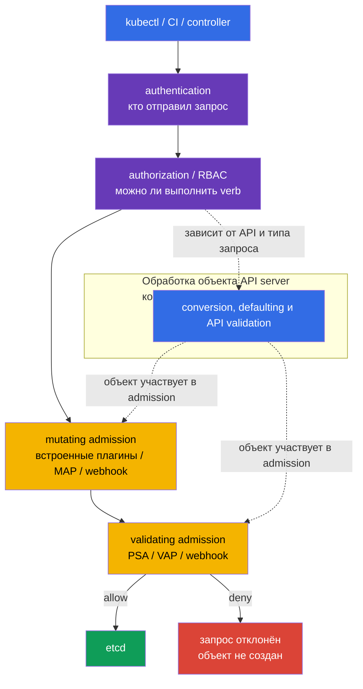

<!-- Standalone RU release: ссылки на переводы удалены, потому что соответствующие файлы не входят в архив. -->

# Глава 20. Admission-контроллеры и policy-движки: OPA/Gatekeeper и Kyverno

> **Что дальше.** Pod Security Admission из [главы 19](../19/ru.md) применяет готовые
> Pod Security Standards, но не отвечает на все правила организации: разрешён ли реестр
> образов, обязательна ли метка владельца, надо ли добавить безопасное поле или создать
> сопутствующий объект. Admission control - последний программируемый барьер перед записью
> объекта в etcd. Это часть домена **Minimize Microservice Vulnerabilities** CKS (20%):
> здесь строим собственные правила на OPA/Gatekeeper, Kyverno и встроенном CEL.

> **Что нужно знать из CKA.** Базовый путь запроса `authentication -> authorization ->
> admission -> etcd`, ServiceAccount и RBAC разобраны в
> [главе 21 CKA](../../../cka/course/21/ru.md); базовые ограничения контейнера - в
> [главе 20 CKA](../../../cka/course/20/ru.md). Здесь не повторяем эти механизмы, а
> превращаем требования безопасности в проверяемые cluster-wide policy.

> 🧠 Admission проверяет поля уже разрешённого API-запроса перед записью в etcd; RBAC не оценивает безопасность YAML.

## 20.1. Модель угроз: небезопасный манифест как вход в кластер

RBAC отвечает на вопрос, может ли identity создать Pod. Если разработчику разрешён
`create pods`, RBAC не проверяет, что именно находится в YAML. Поэтому в кластер могут
попасть `privileged`-контейнер, `hostPath: /`, образ из неизвестного registry, Pod без
`runAsNonRoot` или Deployment без метки владельца. Такой объект может быть полностью
разрешён RBAC, но всё равно нарушать security baseline.

Admission control получает уже аутентифицированный и авторизованный запрос, но до
сохранения. Mutating-контроллер может дополнить объект, validating-контроллер принимает
или отклоняет его. Если любой validating этап ответит отказом, объект в etcd не появится.



Порядок admission важен: mutating-контроллеры выполняются до validating, поэтому
validating-policy видит получившийся объект. Conversion, defaulting и API validation на
диаграмме показаны как концептуальная обработка объекта, а не как один жёстко расположенный
этап: детали зависят от API и типа запроса. Встроенные admission plugins и webhooks имеют
свой порядок и могут вызываться повторно при изменении объекта другим mutating webhook.
Mutation должна быть идемпотентной: повторное применение не должно добавлять второй
одинаковый volume, label или sidecar.

| Слой | Вопрос | Пример |
|---|---|---|
| RBAC | кому можно `create pods`? | CI может создавать Pod только в `team-a` |
| PSA | соответствует ли Pod стандарту `baseline`/`restricted`? | запрещён privileged Pod в restricted namespace |
| custom policy | соответствует ли объект правилам организации? | образ только из `registry.example.com`; есть label `owner` |
| mutating policy | какой безопасный default добавить? | поставить `allowPrivilegeEscalation: false` |

PSA и policy engine не заменяют друг друга. PSA быстро и одинаково применяет стандартные
ограничения Pod. Gatekeeper, Kyverno или CEL закрывают специфические требования. Не
дублируйте одну и ту же жёсткую проверку в трёх местах без причины: отказ станет сложнее
диагностировать, а разные сообщения и исключения начнут расходиться.

> 🏭 `failurePolicy: Fail` требует HA, TLS, PDB и наблюдаемости webhook; `Ignore` — компромисс в пользу доступности API.

## 20.2. Webhook: доступность тоже является security-решением

Gatekeeper и Kyverno обычно работают как admission webhook: `kube-apiserver` по HTTPS
отправляет им `AdmissionReview`, затем ждёт ответ `allowed: true/false` и возможные JSON
patches. У webhook есть два особенно важных параметра в `MutatingWebhookConfiguration` или
`ValidatingWebhookConfiguration`:

| Параметр | Значение для безопасности | Риск |
|---|---|---|
| `failurePolicy: Fail` | timeout, TLS-ошибка или недоступный webhook отклоняет запрос | outage engine останавливает deploy и иногда control plane operations |
| `failurePolicy: Ignore` | при ошибке webhook объект проходит без этой проверки | окно обхода policy во время сбоя |
| `timeoutSeconds` | ограничивает время ожидания API server | слишком большой timeout задерживает все create/update |
| `namespaceSelector`/`objectSelector` | сужает scope webhook | ошибочный selector может пропустить критичный namespace |
| `matchPolicy` | определяет сопоставление версий API | неожиданный match способен применить правило шире или уже |

Нельзя бездумно менять `failurePolicy` у webhook, установленного Helm chart: chart может
перезаписать изменение. Сначала проверьте, что engine имеет несколько replicas, PodDisruptionBudget,
TLS и alert на ошибки/latency. Новый запрет безопаснее вводить как audit/warn, исправить
существующие нарушения и только потом включить enforcement. Для критичного зрелого правила
обычно выбирают `Fail`; для первого rollout важнее не остановить кластер и не принять это за
доказательство работающей защиты.

Минимальная конфигурация webhook должна явно задавать endpoint, доверие TLS и контракт
`AdmissionReview`. Например, validating webhook ниже использует Service; для mutating
webhook структура аналогична, но добавьте `reinvocationPolicy: IfNeeded` или `Never` и
сделайте mutation идемпотентной. `caBundle` здесь сокращён: в рабочем manifest это
base64-кодированный CA сертификат webhook.

```yaml
apiVersion: admissionregistration.k8s.io/v1
kind: ValidatingWebhookConfiguration
metadata:
  name: require-owner.example.com
webhooks:
- name: require-owner.example.com
  clientConfig:
    service:
      namespace: policy-system
      name: policy-webhook
      path: /validate
      port: 443
    caBundle: <base64-ca>
  rules:
  - apiGroups: [""]
    apiVersions: ["v1"]
    operations: ["CREATE", "UPDATE"]
    resources: ["pods"]
    scope: "*"
  admissionReviewVersions: ["v1"]
  sideEffects: None
  failurePolicy: Fail
  timeoutSeconds: 5
  matchPolicy: Equivalent
  namespaceSelector:
    matchLabels:
      policy.example.com/enforce-owner: "true"
  matchConditions:
  - name: skip-kube-system
    expression: "request.namespace != 'kube-system'"
```

Для mutating webhook к тому же контракту добавляется правило повторного вызова:

```yaml
apiVersion: admissionregistration.k8s.io/v1
kind: MutatingWebhookConfiguration
metadata:
  name: default-security.example.com
webhooks:
- name: default-security.example.com
  clientConfig:
    service:
      namespace: policy-system
      name: policy-webhook
      path: /mutate
    caBundle: <base64-ca>
  rules:
  - apiGroups: [""]
    apiVersions: ["v1"]
    operations: ["CREATE"]
    resources: ["pods"]
  admissionReviewVersions: ["v1"]
  sideEffects: None
  reinvocationPolicy: IfNeeded
  failurePolicy: Fail
  timeoutSeconds: 5
```

```bash
# Какие webhook реально зарегистрированы и как они ведут себя при ошибке.
kubectl get validatingwebhookconfigurations,mutatingwebhookconfigurations
kubectl get validatingwebhookconfiguration <name> -o yaml
kubectl -n gatekeeper-system get pods
kubectl -n kyverno get pods
```

Admission проверяет лишь запрос к API. Он не заменяет image scanning, runtime detection,
NetworkPolicy, RBAC и audit logs. Образ, разрешённый в admission, всё ещё должен пройти
supply-chain проверки из глав 25-28; уже запущенный процесс контролируют главы 29-32.

> 🎯 Свяжите `ConstraintTemplate` (code/schema) с `Constraint` (scope/параметры/`enforcementAction`), затем докажите `dryrun` → `deny`.

## 20.3. OPA/Gatekeeper: `ConstraintTemplate` и `Constraint`

**OPA** - Open Policy Agent, общий движок решений на Rego. **Gatekeeper** использует OPA
в Kubernetes и даёт ему Kubernetes-native модель из двух объектов:

1. `ConstraintTemplate` описывает новый тип policy: Rego или CEL-код в
   `spec.targets[].rego` либо `spec.targets[].code[]`, целевой admission handler и OpenAPI
   schema параметров. После применения Gatekeeper создаёт CRD для constraint kind.
2. `Constraint` - экземпляр этого типа: параметры, scope `match` и режим реакции. Один
   template можно переиспользовать для разных namespace или наборов labels.

Это разделение похоже на класс и экземпляр. Template содержит reviewable policy code:
изменение Rego или CEL требует тестов и code review. В одном target выбирайте один движок:
у legacy `rego` выше приоритет, а в `code[]` CEL (`K8sNativeValidation`) имеет приоритет над
Rego. Constraint обычно меняют чаще, когда policy надо включить для новой команды или
namespace.

### Установка и быстрая проверка Gatekeeper

Установку выполняют централизованно, а не во время экзаменационного задания. Для Helm
release сначала зафиксируйте версию chart в GitOps-манифесте и проверьте values конкретной
версии:

```bash
helm repo add gatekeeper https://open-policy-agent.github.io/gatekeeper/charts
helm repo update
GATEKEEPER_CHART_VERSION="${GATEKEEPER_CHART_VERSION:?set exact chart version}"
helm upgrade --install gatekeeper gatekeeper/gatekeeper \
  --namespace gatekeeper-system --create-namespace \
  --version "$GATEKEEPER_CHART_VERSION"

kubectl -n gatekeeper-system get deploy,pods
kubectl get crd | grep -E 'gatekeeper|constraints.gatekeeper' 
```

Ниже policy требует label `owner` у Pod вне системных namespaces. Она компактнее, чем
проверка `privileged`, но показывает все части модели и даёт понятный отказ.

```yaml
apiVersion: templates.gatekeeper.sh/v1
kind: ConstraintTemplate
metadata:
  name: k8srequiredlabels
spec:
  crd:
    spec:
      names:
        kind: K8sRequiredLabels
      validation:
        openAPIV3Schema:
          type: object
          properties:
            labels:
              type: array
              items:
                type: string
  targets:
  - target: admission.k8s.gatekeeper.sh
    rego: |
      package k8srequiredlabels

      violation[{"msg": msg}] {
        required := input.parameters.labels[_]
        not input.review.object.metadata.labels[required]
        msg := sprintf("missing required label: %v", [required])
      }
---
apiVersion: constraints.gatekeeper.sh/v1beta1
kind: K8sRequiredLabels
metadata:
  name: pods-must-have-owner
spec:
  enforcementAction: dryrun
  match:
    excludedNamespaces: ["kube-system", "gatekeeper-system", "kyverno"]
    kinds:
    - apiGroups: [""]
      kinds: ["Pod"]
  parameters:
    labels: ["owner"]
```

```bash
kubectl apply -f gatekeeper-owner.yaml
kubectl get constrainttemplates
kubectl get k8srequiredlabels
kubectl describe k8srequiredlabels pods-must-have-owner
```

`enforcementAction: dryrun` собирает нарушения в `status.violations`, но не блокирует
запрос. После исправления уже существующих Pod и проверки scope замените его на `deny`.
Некоторые версии Gatekeeper также поддерживают action `warn`; точные доступные действия
проверяйте по установленному CRD, а не по случайному примеру из другой версии.

```bash
kubectl get k8srequiredlabels pods-must-have-owner \
  -o jsonpath='{range .status.violations[*]}{.kind}/{.name}{": "}{.message}{"\n"}{end}'

# Только после audit и исправления workload.
kubectl patch k8srequiredlabels pods-must-have-owner --type merge \
  -p '{"spec":{"enforcementAction":"deny"}}'
```

### Пример Gatekeeper для опасного `privileged`

Для security-critical запрета полезен отдельный template: он проверяет обычные,
`initContainers` и `ephemeralContainers`. В production лучше взять поддерживаемую библиотеку
Gatekeeper или покрыть template unit-тестами, а не копировать упрощённый Rego без проверки
всех полей PodSpec.

```rego
package k8sdisallowprivileged

violation[{"msg": msg}] {
  containers := input.review.object.spec.containers
  container := containers[_]
  container.securityContext.privileged == true
  msg := sprintf("privileged container %q is not allowed", [container.name])
}
```

Условие `container.securityContext.privileged == true` не срабатывает для отсутствующего
поля, то есть default `false` допускается. Аналогичные циклы нужны для `initContainers` и
`ephemeralContainers`; это типичная ошибка самописной policy. PSA `restricted` уже
покрывает этот класс требований - используйте custom Rego только когда нужны свои scope,
исключения или расширенная логика.

> 🔬 Kyverno CEL API для validation, mutation, generation и других admission-сценариев.

## 20.4. Kyverno 1.19: CEL-based policy types

> **Compatibility note.** Kyverno v1.19 официально поддерживает Kubernetes v1.33-v1.35
> (`kyverno.io/docs/installation/releases/`, released Aug 2026). Core-лаба этой главы
> (Lab108) выполняется на Kubernetes v1.36 - это осознанная forward-looking комбинация,
> которая **не входит** в протестированную и гарантированную support matrix Kyverno v1.19.
> Установка и базовые сценарии обычно работают, но именно эта пара версий не покрыта
> officially tested compatibility, поэтому не считайте успешную установку доказательством
> полной поддержки v1.36. Для подготовки к текущему экзамену (ориентированному на v1.35)
> сверьте поведение отдельно на v1.35, где Kyverno v1.19 официально протестирован.
> Compatibility third-party admission-компонентов (Kyverno, Gatekeeper и аналоги)
> необходимо сверять с их собственной release matrix отдельно от версии Kubernetes курса.

Начиная с Kyverno 1.19 основной путь - отдельные CEL-based cluster-wide типы группы
`policies.kyverno.io/v1`: `ValidatingPolicy`, `MutatingPolicy`, `GeneratingPolicy`,
`DeletingPolicy` и `ImageValidatingPolicy`. Для каждого есть namespaced-вариант
`NamespacedValidatingPolicy`, `NamespacedMutatingPolicy`, `NamespacedGeneratingPolicy`,
`NamespacedDeletingPolicy` или `NamespacedImageValidatingPolicy`, действующий только в
своём namespace. Legacy `Policy` и `ClusterPolicy` (`kyverno.io/v1`), а также
`CleanupPolicy` (`kyverno.io/v2`) deprecated в 1.19 и будут удалены в 1.20. Не смешивайте
поля двух моделей в одном объекте.

В курсе проверена связка Kyverno `v1.19.x` и Helm chart `3.9.0`. После установки проверьте
именно новые CRD и фактический image контроллера:

```bash
helm upgrade --install kyverno kyverno/kyverno \
  --namespace kyverno --create-namespace --version 3.9.0
kubectl get crd validatingpolicies.policies.kyverno.io \
  mutatingpolicies.policies.kyverno.io \
  generatingpolicies.policies.kyverno.io \
  deletingpolicies.policies.kyverno.io \
  imagevalidatingpolicies.policies.kyverno.io
kubectl -n kyverno get deploy -o jsonpath='{..image}'
```

### `ValidatingPolicy`: требовать `runAsNonRoot`

Начните с `Audit`, устраните нарушения и только затем переключите действие на `Deny`.
Проверка ниже требует явный pod-level baseline; она не заменяет полный PSS `restricted`.

```yaml
apiVersion: policies.kyverno.io/v1
kind: ValidatingPolicy
metadata:
  name: require-pod-run-as-non-root
spec:
  validationActions: [Audit]
  matchConstraints:
    resourceRules:
    - apiGroups: [""]
      apiVersions: ["v1"]
      operations: ["CREATE", "UPDATE"]
      resources: ["pods"]
  validations:
  - message: "Pod spec.securityContext.runAsNonRoot must be true"
    expression: >-
      has(object.spec.securityContext) &&
      object.spec.securityContext.?runAsNonRoot.orValue(false)
```

```bash
kubectl apply -f kyverno-run-as-non-root.yaml
kubectl get validatingpolicy require-pod-run-as-non-root
kubectl patch validatingpolicy require-pod-run-as-non-root --type merge \
  -p '{"spec":{"validationActions":["Deny"]}}'
```

### `MutatingPolicy`: прозрачная маркировка

Mutation не должна маскировать небезопасный image. Для security-critical полей чаще лучше
явная validation. Безопасный учебный пример добавляет только audit-label и показывает
современный `ApplyConfiguration` вместо legacy `patchStrategicMerge`:

```yaml
apiVersion: policies.kyverno.io/v1
kind: MutatingPolicy
metadata:
  name: mark-kyverno-managed-pods
spec:
  matchConstraints:
    resourceRules:
    - apiGroups: [""]
      apiVersions: ["v1"]
      operations: ["CREATE"]
      resources: ["pods"]
  mutations:
  - patchType: ApplyConfiguration
    applyConfiguration:
      expression: >-
        Object{
          metadata: Object.metadata{
            labels: {"security.example.com/policy": "kyverno"}
          }
        }
```

### `GeneratingPolicy`: default-deny для нового Namespace

YAML template остаётся читаемым, а CEL подставляет имя Namespace. При
`synchronize.enabled: true` Kyverno продолжает сверять и синхронизировать сгенерированный
объект с policy. Это не утверждение о Kubernetes `ownerReferences` и не заменяет явного
распределения ответственности: не поручайте GitOps-controller и Kyverno одновременно
синхронизировать один и тот же объект.

```yaml
apiVersion: policies.kyverno.io/v1
kind: GeneratingPolicy
metadata:
  name: generate-default-deny-ingress
spec:
  evaluation:
    synchronize:
      enabled: true
  matchConstraints:
    resourceRules:
    - apiGroups: [""]
      apiVersions: ["v1"]
      operations: ["CREATE"]
      resources: ["namespaces"]
  matchConditions:
  - name: skip-system-namespaces
    expression: >-
      !(object.metadata.name in
      ["kube-system", "kube-public", "kube-node-lease", "kyverno"])
  variables:
  - name: namespaceName
    expression: object.metadata.name
  generate:
  - template:
      interpolate: cel
      value: |
        apiVersion: networking.k8s.io/v1
        kind: NetworkPolicy
        metadata:
          name: default-deny-ingress
          namespace: (( variables.namespaceName ))
          labels:
            app.kubernetes.io/managed-by: kyverno
        spec:
          podSelector: {}
          policyTypes: [Ingress]
```

Это только ingress default deny. Egress, DNS и разрешённые связи задавайте отдельными
`NetworkPolicy` - см. [главу 04](../04/ru.md).

### Миграция legacy policy

Инвентаризируйте legacy ресурсы командой
`kubectl get policies.kyverno.io,clusterpolicies.kyverno.io` (или `kubectl get pol,cpol`),
а также `CleanupPolicy`, зафиксируйте поведение положительными и отрицательными тестами.
Перенесите validate/mutate/generate/delete/image rules в соответствующий новый тип и удалите
legacy объект только после проверки admission и background reports. Для production сверяйте
[руководство миграции Kyverno](https://kyverno.io/docs/guides/migration-to-cel/)
с установленной minor-версией.

> 🏭 Выбор engine зависит от владения policy, языка, CI и webhook; не дублируйте deny-контроль без причины.

## 20.5. Gatekeeper и Kyverno: что выбрать

Оба движка могут deny небезопасный Pod, собирать audit-нарушения и работать через
admission webhook. Различается язык, модель и удобство конкретного правила.

| Критерий | Gatekeeper / OPA | Kyverno |
|---|---|---|
| Язык проверки | Rego или CEL в `ConstraintTemplate` | CEL и YAML templates |
| Модель ресурса | `ConstraintTemplate` с Rego/CEL + `Constraint` | отдельные CEL-based policy types, включая namespaced variants |
| Validate | да | да |
| Mutate | отдельные mutator resources, возможности зависят от версии | `MutatingPolicy` |
| Generate | не основной сценарий | `GeneratingPolicy` |
| Delete / cleanup | не основной сценарий | `DeletingPolicy` |
| Сложная логика и внешнее использование OPA | сильная сторона Rego | возможна, но YAML читается проще для K8s policy |
| Порог для команды, привыкшей к Kubernetes YAML | выше | ниже |

Выбор не означает, что другой инструмент хуже. Если организация уже использует OPA для
Terraform, API gateway и CI, Gatekeeper уменьшает число языков policy. Если нужны mutation,
generation и review в привычном Kubernetes YAML, Kyverno часто проще. Не устанавливайте
оба только ради одинаковых правил: два webhook увеличивают latency, эксплуатационную
поверхность и риск противоречивых отказов. Допустимо разделение ответственности, если оно
документировано: например, Gatekeeper для сложных Rego constraints, Kyverno для mutation и
image verification.

В обоих случаях policy - код: храните `ConstraintTemplate`/`Constraint` или CEL-based
Kyverno policy в Git, назначайте владельца и тесты, применяйте в staging, начинайте с
audit/warn и сохраняйте evidence нарушений. До кластера добавьте CI mini-lab с разрешённым
и запрещённым fixture. Для Gatekeeper используйте декларативные Suite/Test/Case
(`apiVersion: test.gatekeeper.sh/v1alpha1`, `kind: Suite`), а не прямой `gator test` denied
fixture: у deny Constraint найденное нарушение даёт `gator test` exit code 1, хотя policy
работает правильно. Kyverno проверяйте через `kyverno test --require-tests`, чтобы отсутствие
test manifest не давало зелёный pipeline. CI должен завершаться ошибкой, если allowed manifest
отклонён или denied manifest принят. Исключение должно быть узким, ограниченным по времени и
видимым в review - не глобальным `excludedNamespaces: ["*"]`.

> 🏭 CI fixtures должны принять разрешённый и отклонить запрещённый объект до admission в кластере.

### CI mini-lab: проверка policy до rollout

Положительный и отрицательный manifests должны жить рядом с policy в Git. Сохраните template
и constraint в `templates-and-constraints/template.yaml` и
`templates-and-constraints/constraint.yaml`, fixtures — в `allowed.yaml` и `denied.yaml`, а
рядом создайте `suite.yaml`:

```yaml
apiVersion: test.gatekeeper.sh/v1alpha1
kind: Suite
tests:
- name: require-owner
  template: templates-and-constraints/template.yaml
  constraint: templates-and-constraints/constraint.yaml
  cases:
  - name: allowed-has-owner
    object: allowed.yaml
    assertions:
    - violations: no
  - name: denied-missing-owner
    object: denied.yaml
    assertions:
    - violations: yes
```

```bash
# Оба ожидаемых результата дают успешный exit code: deny fixture обязан иметь violation.
gator verify suite.yaml                    # либо: gator verify ./...

# Kyverno: pipeline падает, если kyverno-test.yaml не найден.
kyverno test --require-tests ./policy/kyverno
```

`gator verify` рассматривает `violations: no` для allowed и `violations: yes` для denied как
ожидаемые assertions, поэтому job станет красным лишь при регрессии policy или fixtures.
Используйте команды и структуру файлов, соответствующие закреплённой версии CLI; cluster
admission test остаётся отдельным этапом интеграционного CI.

> 🔬 Native CEL выполняется в API server без webhook, но не покрывает generation, reports, signature verification и сложную Rego-логику.

## 20.6. Native CEL: validation и mutation без внешнего webhook

`ValidatingAdmissionPolicy` (VAP) и `ValidatingAdmissionPolicyBinding` задают встроенную
validation на CEL. В Kubernetes 1.36 `MutatingAdmissionPolicy` (MAP) и
`MutatingAdmissionPolicyBinding` стали stable и включены по умолчанию. MAP - это
in-process mutation внутри API server: CEL возвращает либо `ApplyConfiguration`, который
сливается по правилам server-side apply, либо `JSONPatch`. Для обоих native API binding
обязателен: именно он привязывает policy к scope, а без binding policy не действует.

VAP остаётся только validating-механизмом: он не меняет и не генерирует объекты. В связке
VAP + MAP native stack уже умеет mutation и validation без webhook, но не заменяет engine
для generate, policy reports, image signature verification, сложных внешних данных или
Rego.

### `MutatingAdmissionPolicy`: добавить безопасную метку в ограниченном scope

Пример ниже применяется только к Pod в namespace с label
`policy.example.com/native-mutation=true`. `ApplyConfiguration` удобен для добавления
поля; для точных операций над массивами или путями используйте `JSONPatch` с CEL-списком
`JSONPatch{...}`. `spec.reinvocationPolicy` обязателен: `Never` не вызывает MAP повторно,
а `IfNeeded` допускает повторную оценку после mutation других admission-этапов. Порядок с
другими mutating plugins/webhooks не гарантирован, поэтому mutation должна быть
идемпотентной. Не применяйте mutation как замену обязательной security validation.

```yaml
apiVersion: admissionregistration.k8s.io/v1
kind: MutatingAdmissionPolicy
metadata:
  name: add-native-admission-label
spec:
  failurePolicy: Fail
  reinvocationPolicy: IfNeeded
  matchConstraints:
    resourceRules:
    - apiGroups: [""]
      apiVersions: ["v1"]
      operations: ["CREATE"]
      resources: ["pods"]
  mutations:
  - patchType: ApplyConfiguration
    applyConfiguration:
      expression: >-
        Object{
          metadata: Object.metadata{
            labels: {"admission.example.com/mutated": "true"}
          }
        }
---
apiVersion: admissionregistration.k8s.io/v1
kind: MutatingAdmissionPolicyBinding
metadata:
  name: add-native-admission-label
spec:
  policyName: add-native-admission-label
  matchResources:
    namespaceSelector:
      matchLabels:
        policy.example.com/native-mutation: "true"
```

Практика должна проверить и scope, и его отрицательную границу. Сохраните YAML выше как
`map-add-label.yaml`, затем выполните:

```bash
kubectl apply -f map-add-label.yaml
kubectl create namespace native-map-on
kubectl label namespace native-map-on policy.example.com/native-mutation=true
kubectl create namespace native-map-off

cat <<'EOF' >/tmp/native-map-pod.yaml
apiVersion: v1
kind: Pod
metadata:
  name: native-map-test
spec:
  containers:
  - name: pause
    image: registry.k8s.io/pause:3.10
EOF

# Scope binding совпал: server-side dry-run возвращает добавленную метку.
kubectl -n native-map-on create --dry-run=server -o yaml -f /tmp/native-map-pod.yaml

# Отрицательный тест binding: в namespace без selector-метки mutation отсутствует.
if kubectl -n native-map-off create --dry-run=server -o yaml \
  -f /tmp/native-map-pod.yaml | grep -q 'admission.example.com/mutated: "true"'; then
  echo "MAP применился вне scope"
  exit 1
fi
```

### `ValidatingAdmissionPolicy`: требовать effective non-root

VAP должен проверять effective-настройку каждого процесса, а не только Pod-level default:
container-level `securityContext.runAsNonRoot` имеет приоритет. Выражение ниже допускает
container-level `true` либо отсутствие этого поля при Pod-level `true`, но отклоняет явный
`false` и `runAsUser: 0` как на Pod-level, так и у обычных, init- и ephemeral containers.

```yaml
apiVersion: admissionregistration.k8s.io/v1
kind: ValidatingAdmissionPolicy
metadata:
  name: require-pod-run-as-non-root
spec:
  failurePolicy: Fail
  matchConstraints:
    resourceRules:
    - apiGroups: [""]
      apiVersions: ["v1"]
      operations: ["CREATE", "UPDATE"]
      resources: ["pods"]
  variables:
  - name: podRunAsNonRoot
    expression: >-
      has(object.spec.securityContext) &&
      has(object.spec.securityContext.runAsNonRoot) &&
      object.spec.securityContext.runAsNonRoot == true
  - name: allContainers
    expression: >-
      object.spec.containers +
      (has(object.spec.initContainers) ? object.spec.initContainers : []) +
      (has(object.spec.ephemeralContainers) ? object.spec.ephemeralContainers : [])
  validations:
  - expression: >-
      !has(object.spec.securityContext) ||
      !has(object.spec.securityContext.runAsUser) ||
      object.spec.securityContext.runAsUser != 0
    message: "Pod-level runAsUser: 0 is forbidden"
  - expression: >-
      variables.allContainers.all(c,
        (!has(c.securityContext) || !has(c.securityContext.runAsUser) ||
          c.securityContext.runAsUser != 0) &&
        ((has(c.securityContext) && has(c.securityContext.runAsNonRoot)) ?
          c.securityContext.runAsNonRoot == true : variables.podRunAsNonRoot)
      )
    message: "Every app, init and ephemeral container must effectively run non-root; runAsUser: 0 is forbidden"
---
apiVersion: admissionregistration.k8s.io/v1
kind: ValidatingAdmissionPolicyBinding
metadata:
  name: require-pod-run-as-non-root
spec:
  policyName: require-pod-run-as-non-root
  validationActions: ["Deny"]
  matchResources:
    namespaceSelector:
      matchLabels:
        policy.example.com/enforce-non-root: "true"
```

`object` в CEL - проверяемый объект; также доступны контекст запроса, `oldObject` и
параметры binding. `failurePolicy` VAP/MAP относится к ошибке оценки policy, а не к
доступности сети: внешнего webhook здесь нет. Не публикуйте непроверенное CEL выражение
сразу с `Deny` на весь кластер: сузьте selector, начните с `Audit`/`Warn` и проверьте
положительный и отрицательный случаи.

```bash
kubectl apply -f vap-run-as-non-root.yaml
kubectl label namespace team-example policy.example.com/enforce-non-root=true
kubectl get validatingadmissionpolicy,validatingadmissionpolicybinding
kubectl get mutatingadmissionpolicy,mutatingadmissionpolicybinding
```

### Параметризованный VAP: policy logic отдельно от лимита команды

`paramKind` определяет тип parameter resource, binding выбирает конкретный объект через
`paramRef`, а CEL получает его как `params`. Здесь один `ConfigMap` ограничивает replicas;
`matchConditions` не оценивает policy для запросов kubelet.

```yaml
apiVersion: admissionregistration.k8s.io/v1
kind: ValidatingAdmissionPolicy
metadata:
  name: deployment-replica-limit
spec:
  failurePolicy: Fail
  paramKind:
    apiVersion: v1
    kind: ConfigMap
  matchConstraints:
    resourceRules:
    - apiGroups: ["apps"]
      apiVersions: ["v1"]
      operations: ["CREATE", "UPDATE"]
      resources: ["deployments"]
  matchConditions:
  - name: exclude-kubelet
    expression: '!("system:nodes" in request.userInfo.groups)'
  variables:
  - name: limit
    expression: 'int(params.data["maxReplicas"])'
  validations:
  - expression: "params != null && object.spec.replicas <= variables.limit"
    message: "replicas exceed the team limit"
---
apiVersion: v1
kind: ConfigMap
metadata:
  name: team-a-replica-limit
  namespace: policy-system
data:
  maxReplicas: "5"
---
apiVersion: admissionregistration.k8s.io/v1
kind: ValidatingAdmissionPolicyBinding
metadata:
  name: deployment-replica-limit-team-a
spec:
  policyName: deployment-replica-limit
  validationActions: [Deny]
  paramRef:
    name: team-a-replica-limit
    namespace: policy-system
    parameterNotFoundAction: Deny
  matchResources:
    namespaceSelector:
      matchLabels:
        team: a
```

Один policy может иметь несколько bindings и parameter resources для разных команд; все
совпавшие combinations должны пройти. `parameterNotFoundAction: Deny` вместе с
`failurePolicy: Fail` не превращает отсутствующую конфигурацию в bypass.

> **Advanced — Manifest-Based Admission Control (v1.36 alpha).** Эта выключенная по
> умолчанию функция загружает webhook и CEL policy manifests с диска API server: включите
> feature gate `ManifestBasedAdmissionControlConfig` и передайте через
> `--admission-control-config-file` `AdmissionConfiguration` с отдельным абсолютным
> `staticManifestsDir` для нужного admission plugin. Такие policies активны при старте,
> независимы от etcd и могут защищать API-based admission configuration от удаления или
> изменения. Это экспериментальная control-plane функция: `metadata.name` **каждого** static
> admission object в v1.36 обязан оканчиваться на `.static.k8s.io`; невалидный static manifest
> при первоначальной загрузке способен не дать API server стать ready. Static manifests
> ограничены поддерживаемыми admission resources; policy не могут использовать `paramKind`, а
> у `ValidatingAdmissionPolicyBinding` и `MutatingAdmissionPolicyBinding` запрещён
> `spec.paramRef`. Static webhook допускает `clientConfig.url`, но не
> `clientConfig.service`. Каждый HA API server должен получать одинаковые файлы; не вводите
> эту функцию без теста startup/reload и управляемой доставки конфигурации.

### Сравнение native CEL и webhook engine

| Возможность | VAP | MAP + VAP native stack | Gatekeeper / Kyverno webhook |
|---|---|---|---|
| Где исполняется | внутри API server | внутри API server | отдельные controller/webhook Pod |
| Сетевой отказ webhook | отсутствует | отсутствует | зависит от доступности и `failurePolicy` |
| Validate | да | да | да |
| Mutate | нет | да, `ApplyConfiguration` или `JSONPatch` | Kyverno - да; Gatekeeper - отдельные mutator resources |
| Generate / reports / signature verification | нет | нет | доступны в зависимости от engine |
| Сложная логика | ограничена CEL и API context | ограничена CEL и API context | Rego или policy engine features |
| Жизненный цикл | upstream Kubernetes API | upstream Kubernetes API | отдельная установка, обновление и CRD |

Native CEL - хорошая первая опция для небольшой чистой validation или mutation. Engine
оправдан, когда требуются generation, signature verification, policy reports или общая
policy-платформа. В обоих вариантах обязательны scope, положительный и отрицательный тест,
а также план rollout.

> 🎯 Допустимый manifest принят, нарушающий отклонён; для mutation сравните объект с результатом server-side dry-run.

## 20.7. Проверка: доказать allow, deny и mutation

Проверка policy состоит не из `kubectl apply` без ошибки, а из двух контролируемых
сценариев: корректный объект принят, нарушающий - отклонён с понятной причиной. Применяйте
такие проверки только в test namespace, поскольку `Deny` намеренно меняет admission.

```bash
kubectl create namespace admission-test
kubectl label namespace admission-test policy.example.com/enforce-non-root=true

cat <<'EOF' | kubectl -n admission-test apply -f -
apiVersion: v1
kind: Pod
metadata:
  name: allowed-non-root
  labels:
    owner: platform
spec:
  securityContext:
    runAsNonRoot: true
  containers:
  - name: nginx
    image: nginxinc/nginx-unprivileged:1.30.4-alpine-slim
    securityContext:
      allowPrivilegeEscalation: false
      capabilities:
        drop: ["ALL"]
    ports:
    - containerPort: 8080
EOF

cat <<'EOF' | kubectl -n admission-test apply -f -
apiVersion: v1
kind: Pod
metadata:
  name: rejected-root-default
  labels:
    owner: platform
spec:
  containers:
  - name: nginx
    image: nginx:1.30.4
EOF
# Ожидается: admission webhook или ValidatingAdmissionPolicy ... denied the request
```

После `Enforce` в Kyverno нарушение ищут в ответе API и policy report, если reports
включены. У Gatekeeper проверяют `status.violations` Constraint и сообщение отказа. У VAP
достаточно статуса policy/binding и отказа API server; у MAP дополнительно сравнивают объект
из server-side dry-run с исходным и проверяют отрицательный scope binding.

```bash
kubectl get events -n admission-test --sort-by=.lastTimestamp
kubectl get policyreport -A 2>/dev/null || true
kubectl get k8srequiredlabels pods-must-have-owner -o yaml
kubectl get validatingadmissionpolicy require-pod-run-as-non-root -o yaml
```

Если разрешённый Pod не создаётся, сначала определите источник отказа, а не отключайте все
policy: прочитайте сообщение `kubectl`, event, `kubectl describe` и логи конкретного
controller. Затем сверяйте selector, `match`/`exclude`, namespace labels и actual object
после mutation. Если policy не сработала, проверьте, что webhook/engine healthy, правило
покрывает API version и kind, а тестовый объект не исключён по namespace или label.

> 🏭 Rollout: узкий scope → `Audit`/`dryrun`/`Warn` → remediation → `Deny`/`Enforce`.

## 20.8. Типичные ошибки и безопасный rollout

| Ошибка | Последствие | Безопасный подход |
|---|---|---|
| Сразу включить `Deny`/`Enforce` на все namespaces | блокируются legacy workload и system components | audit/warn -> список нарушений -> remediation -> enforcement |
| Исключить `kube-system`, но не собственный namespace engine | engine может заблокировать самого себя | явно исключить только требуемые system namespaces |
| Проверять только `containers` | обход через `initContainers` или `ephemeralContainers` | покрыть все container lists либо использовать PSA |
| Использовать mutation вместо security requirement | YAML выглядит безопасным, но образ/архитектура остаются неподходящими | mutate только безопасные defaults; обязательные инварианты validate |
| `failurePolicy: Ignore` навсегда | при outage policy обходится | alert, HA, контроль rollout, затем осознанный `Fail` для критичных правил |
| Полагаться на `Audit` как на запрет | нарушающий объект всё равно запускается | применять `Audit` лишь как этап миграции |
| Одновременно завести одинаковый deny в PSA, Gatekeeper и Kyverno | дублирующие ошибки и сложная поддержка | назначить одному слою владельца каждого требования |
| Включить `synchronize.enabled: true` без распределения ответственности | Kyverno продолжает синхронизацию объекта, а GitOps может с ним конфликтовать | документировать, какой controller синхронизирует ресурс; это не вопрос `ownerReferences` |

Перед обновлением Gatekeeper/Kyverno проверяйте CRD migration, compatibility с Kubernetes
v1.36, certificate rotation, resource requests/limits и PDB. Admission outage - incident:
заранее определите, кто может временно сузить scope или откатить release, и логируйте это
изменение через GitOps/audit.

> 🏭 Policy as code: владелец, Git review, fixtures, CI, узкие исключения, admission-метрики и проверяемый rollout.

## 20.9. Как это применяют в продакшене

- **Слои вместо единственного запрета.** PSA `restricted` задаёт массовый baseline;
  custom policy добавляет бизнес-правила: approved registry, owner/cost labels,
  `resources.requests`, signature verification. RBAC по-прежнему ограничивает, кто может
  создавать объекты.
- **Policy as code.** Храните templates, constraints, policies, test fixtures и
  исключения в репозитории. Code review должен видеть и положительный, и отрицательный
  пример, а CI - проверять policy до cluster rollout.
- **Постепенное включение.** Начните с одного namespace, `Audit`/`dryrun`/`Warn`, соберите
  real violations, помогите командам исправить manifests и лишь затем включайте
  `Enforce`/`Deny`.
- **Наблюдаемость admission.** Собирайте latency/error metrics webhook, число violations,
  API server audit events и alerts на отсутствие ready replicas. Проверяйте policy после
  обновления Kubernetes и engine.
- **Минимальные исключения.** Исключение задают на конкретный namespace, service account,
  RuntimeClass или approved image, с владельцем и сроком. Не используйте broad bypass для
  «починки» одного deployment.

## 20.10. Мини-глоссарий

- **Admission control** - этап API server после authentication и authorization, до записи
  объекта в etcd.
- **Mutating admission webhook** - webhook, который добавляет/изменяет объект до validation.
- **Validating admission webhook** - webhook, который разрешает либо отклоняет объект.
- **OPA** - Open Policy Agent, движок policy на Rego.
- **Gatekeeper** - Kubernetes policy engine на OPA с моделью `ConstraintTemplate` +
  `Constraint`.
- **ConstraintTemplate** - Rego или CEL policy code и schema параметров для нового
  constraint type.
- **Constraint** - экземпляр Gatekeeper template с параметрами, match scope и реакцией.
- **Kyverno** - Kubernetes-native policy engine; в 1.19 основной API использует
  `ValidatingPolicy`, `MutatingPolicy`, `GeneratingPolicy`, `DeletingPolicy` и
  `ImageValidatingPolicy`, а также их namespaced-варианты.
- **ValidatingAdmissionPolicy** - встроенная API server validation на CEL без внешнего
  webhook; применяется binding-ом.
- **MutatingAdmissionPolicy** - встроенная API server mutation на CEL через
  `ApplyConfiguration` или `JSONPatch`; применяется binding-ом.
- **CEL** - Common Expression Language, язык выражений для ValidatingAdmissionPolicy.
- **`failurePolicy`** - действие API server, когда webhook/оценка policy недоступны или
  завершаются ошибкой: обычно `Fail` либо `Ignore`.

## 20.11. Итоги главы

- Admission - последний барьер перед etcd: mutation изменяет объект, validation разрешает
  или отклоняет его. RBAC отвечает не на тот же вопрос и не заменяет policy.
- Gatekeeper строит policy из `ConstraintTemplate` с Rego или CEL и `Constraint` с
  scope/params; сначала полезно использовать `dryrun`, затем `deny`.
- Kyverno 1.19 описывает validation, mutation, generation, delete/cleanup и image
  verification отдельными CEL-based policy types. Mutation удобна для безопасных defaults,
  но не заменяет validation.
- Gatekeeper и Kyverno - webhook engines, поэтому их availability, TLS, replicas,
  `timeoutSeconds` и `failurePolicy` являются частью security design.
- VAP с CEL работает в API server без внешнего webhook и подходит только для validation.
  В Kubernetes 1.36 stable MAP дополняет native stack mutation через `ApplyConfiguration`
  или `JSONPatch`, но не умеет generation.
- Надёжный rollout: малый scope -> audit/warn -> исправление violations ->
  `Enforce`/`Deny`, с проверкой принятого и отклонённого manifest.

## 20.12. Как это пригодится: на экзамене и в реальной работе

**На экзамене.** Связанный публичный файл curriculum сейчас называется `CKS_Curriculum
v1.34`, тогда как экзаменационная среда CKS сейчас использует Kubernetes v1.35. Это разные
версии: curriculum описывает темы, а runtime определяет доступные API и поведение кластера.
Быстро определяйте, где находится контроль, читайте `ConstraintTemplate` и `Constraint`,
создавайте/проверяйте policy, отличайте `Audit` от `Deny` и находите причину `denied the
request`. Не приписывайте экзамену расширения курса: Kubernetes 1.36 native MAP и Kyverno
1.19 — production-ориентированные дополнения этой главы, а не гарантированные задания
linked curriculum. Перед экзаменом сверяйте актуальную публикацию Linux Foundation/CNCF.

**В реальной работе.** Admission policy предотвращает небезопасную конфигурацию до запуска
workload, а не ищет её после инцидента. Kubernetes 1.36 native MAP/VAP и Kyverno 1.19
полезны как production extension после проверки compatibility конкретного кластера и engine.
Наиболее ценный результат - не число политик, а понятный, тестируемый baseline с узкими
исключениями, наблюдаемостью и распределением ответственности. Это также входная точка
supply-chain контроля: следующая часть курса применит policy к registry, подписям и
артефактам.

## 20.13. Вопросы для самопроверки

<details>
<summary>1. Почему RBAC не может сам запретить `privileged: true` пользователю, которому разрешено создать Pod?</summary>

RBAC решает, имеет ли identity verb `create` для Pod, а не инспектирует поля YAML. Пользователь с разрешением может прислать Pod с `privileged: true`, если validating admission не наложит отдельное правило. PSA, VAP, Gatekeeper или Kyverno проверяют именно содержание объекта до etcd.
</details>

<details>
<summary>2. В каком порядке проходят mutating и validating admission, и почему mutation должна быть идемпотентной?</summary>

Mutating admission выполняется до validating, поэтому validation видит уже изменённый объект. Webhook могут вызываться повторно после изменения другим mutating webhook, а MAP с `IfNeeded` также допускает повторную оценку. Поэтому повторное применение mutation не должно добавлять второй такой же volume, label или sidecar.
</details>

<details>
<summary>3. Чем `ConstraintTemplate` отличается от `Constraint` в Gatekeeper?</summary>

`ConstraintTemplate` определяет новый тип policy: Rego или CEL-код, admission target и OpenAPI schema параметров; после применения Gatekeeper создаёт CRD constraint kind. `Constraint` — экземпляр этого типа с параметрами, `match` scope и `enforcementAction`. Template требует review и тестов как policy code, а constraint обычно меняют при расширении охвата.
</details>

<details>
<summary>4. Когда Kyverno `mutate` оправдан, а когда требование нужно выразить через `validate`?</summary>

Mutation оправдана для прозрачного безопасного default, например добавления audit-label через `ApplyConfiguration`. Для критичного security-инварианта, который нельзя молча исправить, нужна явная validation: она должна отклонить небезопасный объект. Глава отдельно предупреждает не маскировать mutation небезопасный образ или архитектуру.
</details>

<details>
<summary>5. Чем опасны постоянный `failurePolicy: Ignore` и поспешный `failurePolicy: Fail`?</summary>

С `Ignore` при timeout, TLS-ошибке или недоступности webhook объект проходит без данной проверки, создавая окно обхода policy. `Fail` сохраняет границу при такой ошибке, но outage engine может остановить deploy и control-plane operations. До строгого режима нужны replicas, PDB, TLS, latency/error alerting и безопасный rollout.
</details>

<details>
<summary>6. Почему policy сначала запускают в `Audit`/`dryrun`, а не сразу в `Enforce`/`Deny`?</summary>

Audit/dryrun собирает реальные нарушения, не блокируя legacy workloads и системные компоненты. Затем владельцы исправляют manifests, проверяют scope и положительный/отрицательный сценарии. Только после этого `Deny`/`Enforce` вводят как контролируемый запрет, а не как внезапный outage.
</details>

<details>
<summary>7. В чём ограничения `ValidatingAdmissionPolicy` на CEL по сравнению с Kyverno?</summary>

VAP выполняет CEL validation внутри API server и применяется только binding-ом; он не меняет и не генерирует объекты. Native MAP дополняет stack mutation, но не даёт generation, policy reports, image signature verification или Rego. Kyverno предоставляет отдельные CEL-based типы для validate, mutate, generate, delete и image validation, а также namespaced variants.
</details>

<details>
<summary>8. Какие container lists нельзя забыть при самописной проверке `privileged`?</summary>

Нужно проверять `containers`, `initContainers` и `ephemeralContainers`. Проверка только обычных containers оставляет обход через init или debug ephemeral container. Для стандартного класса требований глава советует PSA `restricted`, а самописный Rego должен явно покрывать все эти списки.
</details>

<details>
<summary>9. **Flashback (глава 04).** `NetworkPolicy` default-deny (глава 04) и `failurePolicy: Fail` с `enforce`/`Deny` в admission policy (эта глава) - оба реализуют один и тот же allow-list принцип на разных уровнях стека. Сформулируйте эту аналогию явно: что в admission-policy соответствует "default-deny всем ingress/egress", а что соответствует "узкому разрешённому правилу"?</summary>

В admission-policy эквивалентом default-deny является enforcing rule, при котором объект, не удовлетворяющий требованиям, отклоняется, а `failurePolicy: Fail` не допускает bypass при ошибке webhook. Эквивалент узкого разрешения — точные `match`/selectors, conditions и проверяемые поля, по которым конкретный допустимый объект проходит policy. Как и у NetworkPolicy, широкое исключение разрушает модель allow-list и усложняет audit.
</details>

## Практика

Основная практика этой темы - [лаба 108 CKS: admission-политики Kyverno](../../labs/108/README_RU.MD).
В ней примените policy для trusted registry и restricted workload, проверьте audit и deny,
а также найдите причину отклонения в ответе admission. Опциональный этап лабы проверяет
Kyverno mutation; native in-process mutation отдельно отработайте по
[MAP policy и binding из раздела 20.6](#206-native-cel-validation-и-mutation-без-внешнего-webhook).
Автоматическая проверка лабы запускается командой `check_result`.

Для самостоятельного sandbox подготовьте отдельный кластер или namespace: admission policy
может блокировать системные controller. Начните с `dryrun`/`Audit`, заранее запишите команду
отката и не тестируйте `failurePolicy` отключением production webhook.

## Справочные материалы

- [Kubernetes: Admission Control](https://kubernetes.io/docs/reference/access-authn-authz/admission-controllers/)
- [Kubernetes: Validating Admission Policy](https://kubernetes.io/docs/reference/access-authn-authz/validating-admission-policy/)
- [OPA Gatekeeper documentation](https://open-policy-agent.github.io/gatekeeper/website/)
- [Kyverno documentation](https://kyverno.io/docs/)
- [Kyverno policy reports](https://kyverno.io/docs/policy-reports/)

---
[Оглавление](../README_RU.md) · [Глава 19](../19/ru.md) · [Глава 21](../21/ru.md)
