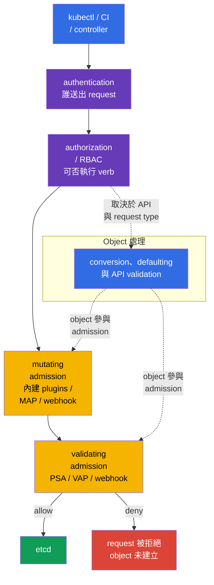

[Русская версия](ru.md) · [Eng version](README.md) · [Versión en español](es.md) · [Version française](fr.md) · [Deutsche Version](de.md) · [ქართული ვერსია](ge.md) · [日本語版](jp.md)

# 第 20 章。Admission controllers 與 policy engines：OPA/Gatekeeper 和 Kyverno

> **問題。** RBAC 可合法允許 CI 建立 Deployment，卻不會檢查 image 是否來自 trusted registry、Pod 是否沒有危險 fields，或 object 是否具有必需的 organizational labels。手動 review YAML 很容易被 template、API client 或 pipeline error 繞過；沒有 policy，object 就會進入 etcd 並被執行。Admission control 必須在儲存前驗證或安全地補充此 request。

> **接下來。** [第 19 章](../19/tw.md) 的 Pod Security Admission 套用既有 Pod Security Standards，卻無法回答所有 organization rules：registry 是否獲允許、owner label 是否必要、是否應加入安全 field 或建立相關 object。Admission control 是 object 寫入 etcd 前最後一道 programmable boundary。它是 CKS **Minimize Microservice Vulnerabilities**（20%）領域的一部分：此處使用 OPA/Gatekeeper、Kyverno 與 built-in CEL 建立自訂 rules。

> **需要的 CKA 基礎。** 基本 request path `authentication -> authorization -> admission -> etcd`、ServiceAccount 與 RBAC，請見 [CKA 第 21 章](../../../cka/course/21/tw.md)；基本 container restrictions 請見 [CKA 第 20 章](../../../cka/course/20/tw.md)。本章不重複這些 mechanisms，而是把 security requirements 化為可驗證的 cluster-wide policy。

> 🧠 Admission 在已獲允許的 API request 寫入 etcd 前檢查其 fields；RBAC 不會評估 YAML 的安全性。

## 20.1. 威脅模型：不安全 manifest 作為 cluster 入口

RBAC 回答 identity 是否能建立 Pod。若 developer 獲允許 `create pods`，RBAC 不會檢查 YAML 中的具體內容。因此 cluster 中可能出現 `privileged` container、`hostPath: /`、來自未知 registry 的 image、未設 `runAsNonRoot` 的 Pod，或沒有 owner label 的 Deployment。這類 object 可能完全符合 RBAC，卻仍違反 security baseline。

Admission control 取得已 authenticated 和 authorized 的 request，但發生在儲存前。Mutating controller 可補充 object；validating controller 會接受或拒絕它。若任何 validating stage 回覆拒絕，object 就不會出現在 etcd。



Admission order 很重要：mutating controllers 先於 validating controllers 執行，因此 validating policy 會看見產生的 object。圖中的 conversion、defaulting 與 API validation 是 object processing 的概念表示，而非一個固定位置的單一 stage：細節取決於 API 和 request type。Built-in admission plugins 與 webhooks 有自己的順序；在 object 被另一個 mutating webhook 修改時，可能再次被呼叫。Mutation 必須具 idempotence：重複套用不應新增第二個相同的 volume、label 或 sidecar。

| Layer | 問題 | 範例 |
|---|---|---|
| RBAC | 誰可以 `create pods`？ | CI 僅可在 `team-a` 建立 Pod |
| PSA | Pod 是否符合 `baseline`/`restricted` standard？ | restricted namespace 禁止 privileged Pod |
| custom policy | object 是否符合 organization rules？ | image 僅能來自 `registry.example.com`；必須有 `owner` label |
| mutating policy | 要加入哪一個安全 default？ | 設定 `allowPrivilegeEscalation: false` |

PSA 與 policy engine 不能彼此取代。PSA 快速且一致地套用標準 Pod restrictions。Gatekeeper、Kyverno 或 CEL 用於特定 requirements。不要無故在三個地方重複同一個 strict check：denial 將更難診斷，不同 messages 與 exceptions 也會逐漸不一致。

> 🏭 `failurePolicy` 決定 admission webhook path 上的**技術或 evaluation error**反應，而非明確的 policy decision。例如 timeout、TLS/DNS/Service/Pod error、無效 HTTP/AdmissionReview response，以及 `matchConditions` evaluation error。
>
> API server 在呼叫 webhook **之前**計算 `matchConditions`。若任一 condition 回傳 `false`，webhook 會正常略過。若沒有 condition 為 `false`，但至少一個完成時有 error，webhook 不會被呼叫：使用 `Fail` 時 API server 拒絕 request；使用 `Ignore` 時則繼續而不經該 webhook。若 webhook 成功被呼叫且明確回傳 `allowed: false`，無論 `Fail` 或 `Ignore` 都會拒絕 request。
>
> 使用 `Fail` 時，這類技術/evaluation error 也會拒絕 create/update：policy 無法被靜默繞過，但 webhook failure **或其 `matchConditions` error** 可能停止 deploy 和部分 control plane operations。因此 security-critical webhook 必須比單一 Pod 更可靠：多個 replicas 降低 failure risk，PDB 防止 voluntary disruption 同時移除所有 replicas，正確 TLS 提供 trusted HTTPS connection，而 error/latency metrics 和 alerts 可在 outage 前察覺 degradation。
>
> 使用 `Ignore` 時 API 仍可用，但在該 error 期間 object 會**不經此 webhook 檢查**而通過——這是刻意的 policy bypass window，而不是「較寬鬆的 deny」。對 critical 且成熟的 denial，通常選擇 `Fail`；`Ignore` 可作為 rollout 或 noncritical control 的暫時 trade-off，但必須明確接受 bypass risk。

## 20.2. Webhook：availability 也是 security decision

Gatekeeper 和 Kyverno 通常作為 admission webhook 運作：`kube-apiserver` 透過 HTTPS 傳送 `AdmissionReview`，接著等待 `allowed: true/false` response 與可能的 JSON patches。`MutatingWebhookConfiguration` 或 `ValidatingWebhookConfiguration` 有兩項特別重要的 parameters：

| Parameter | 對 security 的意義 | 風險 |
|---|---|---|
| `failurePolicy: Fail` | webhook path 或 `matchConditions` error（且沒有 condition 為 `false`）會拒絕 request | engine outage 或錯誤 CEL condition 會阻擋 deploy，有時也阻擋 control plane operations |
| `failurePolicy: Ignore` | 發生該類 error 時，API server 不經該 webhook check 繼續 request | failure 或 condition error 期間的 policy bypass window |
| `timeoutSeconds` | 限制 API server 等待時間 | 過大的 timeout 會延遲所有 create/update |
| `namespaceSelector`/`objectSelector` | 縮小 webhook scope | 錯誤 selector 可能漏掉 critical namespace |
| `matchPolicy` | 決定 API version matching | 非預期 match 可能使 rule 套用更寬或更窄 |

不要不加思考地變更 Helm chart 安裝 webhook 的 `failurePolicy`：chart 可能覆寫變更。首先確認 engine 有多個 replicas、PodDisruptionBudget、TLS 與 error/latency alert。較安全的新 denial 導入方式是先 audit/warn、修正既有 violations，之後才啟用 enforcement。對 critical 且成熟的 rule 通常選擇 `Fail`；首次 rollout 更重要的是不要停止 cluster，且不要誤以為那就證明 protection 正常運作。

最小 webhook configuration 應明確設定 endpoint、TLS trust 和 `AdmissionReview` contract。如下 validating webhook 使用 Service；mutating webhook 的結構相似，但要加入 `reinvocationPolicy: IfNeeded` 或 `Never`，並讓 mutation idempotent。這裡的 `caBundle` 為縮寫：production manifest 中它是 webhook CA certificate 的 base64 encoding。

```yaml
apiVersion: admissionregistration.k8s.io/v1
kind: ValidatingWebhookConfiguration
metadata:
  name: require-owner.example.com
webhooks:
- name: require-owner.example.com
  clientConfig:
    service:
      namespace: policy-system
      name: policy-webhook
      path: /validate
      port: 443
    caBundle: <base64-ca>
  rules:
  - apiGroups: [""]
    apiVersions: ["v1"]
    operations: ["CREATE", "UPDATE"]
    resources: ["pods"]
    scope: "*"
  admissionReviewVersions: ["v1"]
  sideEffects: None
  failurePolicy: Fail
  timeoutSeconds: 5
  matchPolicy: Equivalent
  namespaceSelector:
    matchLabels:
      policy.example.com/enforce-owner: "true"
  matchConditions:
  - name: skip-kube-system
    expression: "request.namespace != 'kube-system'"
```

`namespaceSelector` 中的 custom namespace label 是 security boundary 的一部分：受規則約束的 identity 不應有刪除或變更此 label 的權限。對固定 scope，更安全的是比對 immutable `kubernetes.io/metadata.name`；custom enforcement labels 僅由 platform/security role 變更。`objectSelector` 同樣如此：若 user 能自行變更 object label 並離開 scope，它就不適合作為 deny-boundary。

```bash
SUBJECT='system:serviceaccount:team-a:ci'
NS='team-a'
kubectl auth can-i patch namespaces/"$NS" --as="$SUBJECT"
kubectl auth can-i update namespaces/"$NS" --as="$SUBJECT"
# 對 application/CI identity，兩個 answers 都必須是 `no`。
```

對 mutating webhook，同一 contract 還要增加 reinvocation rule：

```yaml
apiVersion: admissionregistration.k8s.io/v1
kind: MutatingWebhookConfiguration
metadata:
  name: default-security.example.com
webhooks:
- name: default-security.example.com
  clientConfig:
    service:
      namespace: policy-system
      name: policy-webhook
      path: /mutate
    caBundle: <base64-ca>
  rules:
  - apiGroups: [""]
    apiVersions: ["v1"]
    operations: ["CREATE"]
    resources: ["pods"]
  admissionReviewVersions: ["v1"]
  sideEffects: None
  reinvocationPolicy: IfNeeded
  failurePolicy: Fail
  timeoutSeconds: 5
```

```bash
# 哪些 webhook 實際已註冊，以及它們在 error 時如何處理。
kubectl get validatingwebhookconfigurations,mutatingwebhookconfigurations
kubectl get validatingwebhookconfiguration <name> -o yaml
kubectl -n gatekeeper-system get pods
kubectl -n kyverno get pods
```

Admission 僅檢查 API request。它無法取代 image scanning、runtime detection、NetworkPolicy、RBAC 與 audit logs。即使 image 在 admission 被允許，仍必須通過第 25-28 章的 supply-chain checks；已執行 process 則由第 29-32 章控制。

> 🎯 將 `ConstraintTemplate`（code/schema）連結至 `Constraint`（scope/parameters/`enforcementAction`），接著證明 `dryrun` → `deny`。
>
> 此例中 template 宣告 `K8sRequiredLabels` type、其 Rego check 與允許的 `labels` parameter；constraint `pods-must-have-owner` 是此 type 的具體 instance。追蹤這段關係：`match` 限制 Pod 和 excluded namespaces，`parameters.labels: ["owner"]` 將 requirement 傳給 Rego，而 `enforcementAction` 選擇對 violation 的反應。
>
> 請以新的 disposable Pods 證明：在 `dryrun` 中建立沒有 `owner` 的 Pod，確認 API 接受它，再等待其寫入 `status.violations`。patch 為 `deny` 後，建立**另一個**沒有 `owner` 的 Pod：API 必須拒絕它。正向 control case 是有 `owner` 的 Pod 在兩個 modes 都應被接受。不要只使用既有 Pod 或 `--dry-run`：它們不能證明 admission 和 audit 對新 object 生效。

## 20.3. OPA/Gatekeeper：`ConstraintTemplate` 與 `Constraint`

**OPA**（Open Policy Agent）是能做 policy decisions 的 engine。**Gatekeeper** 將它連接至 Kubernetes admission：當有人嘗試建立或變更 object，API server 把 object 傳給 Gatekeeper 檢查。若 rule 發現 violation，Gatekeeper 回報結果——將其記錄為 observation、warning，或拒絕 request。初次閱讀不需要會寫 Rego 或 CEL：先理解**檢查什麼 rule、它在哪裡生效，以及 violation 時會發生什麼**。

為此 Gatekeeper 將 policy 分成兩種 resources——這不是重複，而是能寫一次 rule 並以不同方式套用：

1. `ConstraintTemplate` — **rule template/blueprint**。它包含 Rego 或 CEL checking code、target admission handler，以及允許 parameters 的 OpenAPI schema。Schema 驗證 `Constraint` 本身的 parameters，而不是直接驗證 Pod：例如 `labels` 是 string list。套用 template 後，Gatekeeper 建立 CRD（Custom Resource Definition）——也就是在 Kubernetes API 註冊此 rule 的新 resource type。
2. `Constraint` — **已啟用的 rule instance**。它選擇 `match` scope（哪些 objects 與 namespaces 要檢查）、在 `parameters` 中傳遞 values，並設定 `enforcementAction`——violation 時採取何種動作。可重複使用一個 template 來應對不同 teams、namespaces 或 required labels sets，為每種情況建立單獨 constraint。

請記住 flow：**template 定義 rule → constraint 設定並啟用它 → object create/update 落入 `match` → Gatekeeper 使用 `parameters` 執行 check → `enforcementAction` 決定結果**。這類似 class 與 instance：template 包含須 review 和 test 的 code；當 policy scope 擴大時，constraint 通常變更得更頻繁。在單一 target 中選擇一種 engine：legacy `rego` 優先，而 `code[]` 中的 CEL（`K8sNativeValidation`）優先於 Rego。

### 安裝與快速驗證 Gatekeeper

安裝應集中進行，而非在 exam task 期間執行。對 Helm release，先在 GitOps manifest 固定 chart version，並檢查該版本的 values：

```bash
helm repo add gatekeeper https://open-policy-agent.github.io/gatekeeper/charts
helm repo update
GATEKEEPER_CHART_VERSION="${GATEKEEPER_CHART_VERSION:?set exact chart version}"
helm upgrade --install gatekeeper gatekeeper/gatekeeper \
  --namespace gatekeeper-system --create-namespace \
  --version "$GATEKEEPER_CHART_VERSION"

kubectl -n gatekeeper-system get deploy,pods
kubectl get crd | grep -E 'gatekeeper|constraints.gatekeeper' 
```

以下 policy 要求 system namespaces 以外的 Pod 有 `owner` label。它比檢查 `privileged` 更精簡，卻展示 model 的所有部分，且可產生清楚 denial。

```yaml
# 可重複使用 policy template 的 Gatekeeper API。
apiVersion: templates.gatekeeper.sh/v1
# Template 定義新的 constraint type，但本身尚未啟用 check。
kind: ConstraintTemplate
metadata:
  # Kubernetes template 名稱；通常和 Rego package 名稱相同。
  name: k8srequiredlabels
spec:
  crd:
    spec:
      names:
        # Gatekeeper 會由此 template 建立的 Constraint resource kind。
        kind: K8sRequiredLabels
      validation:
        # Schema 檢查 Constraint 的 spec.parameters，而非 incoming Pod。
        openAPIV3Schema:
          type: object
          properties:
            labels:
              # Constraint 將必需 label keys list 傳給 policy。
              type: array
              items:
                type: string
  targets:
  # 在 admission create/update requests 時呼叫的內建 target。
  - target: admission.k8s.gatekeeper.sh
    # 發生違規時回傳 violation 的 Rego block。
    rego: |
      # Rego policy 的 namespace。
      package k8srequiredlabels

      # 為每個缺少的 required label 建立 violation。
      violation[{"msg": msg}] {
        # 每次從 Constraint 的 spec.parameters.labels 取得一個 value。
        required := input.parameters.labels[_]
        # input.review.object 是目前 admission request 的 Pod。
        not input.review.object.metadata.labels[required]
        # Message 會顯示於 audit status 或 deny response。
        msg := sprintf("missing required label: %v", [required])
      }
---
# 由此 ConstraintTemplate 建立 instance 的 API 與 kind。
apiVersion: constraints.gatekeeper.sh/v1beta1
kind: K8sRequiredLabels
metadata:
  # 已啟用之特定 policy 的唯一名稱。
  name: pods-must-have-owner
spec:
  # 僅 Audit：記錄 violation，但暫不封鎖 Pod。
  enforcementAction: dryrun
  match:
    # 不在 system namespaces 套用 rule。
    excludedNamespaces: ["kube-system", "gatekeeper-system", "kyverno"]
    kinds:
    # 空 API group 代表 core/v1 API。
    - apiGroups: [""]
      # 僅檢查 Pod，而非所有 Kubernetes objects。
      kinds: ["Pod"]
  parameters:
    # Rego 中 input.parameters.labels 的 value：必須有 owner label。
    labels: ["owner"]
```

#### 如何閱讀這個 policy

Gatekeeper 先查看 `Constraint` 中的 `match`。此處它只檢查 Pod，並略過列出的 system namespaces；scope 外的 object 完全不會進入此 rule。對每個符合的 create/update，Gatekeeper 形成 `input.review.object`：即 Kubernetes API 形式的 incoming Pod。同時將 constraint `spec.parameters` 傳入 `input.parameters`。因此本例中 `input.parameters.labels` 等於 `["owner"]`。

Rego rule 是以邏輯**AND**連接的一組 conditions。由下而上讀作「若 body 中所有 lines 都成立，就建立 violation」：

- `required := input.parameters.labels[_]` 逐一走訪每個 required label；`_` 表示「array 的下一個 element」。此處唯一的值為 `owner`。
- `not input.review.object.metadata.labels[required]` 在 incoming Pod 沒有此 label key 時為 true。
- `msg := ...` 形成清楚 message，而 `violation[{"msg": msg}]` 是 Gatekeeper 視為 violation 的特殊 result。`dryrun` 時會寫入 `status.violations`；`deny` 時 API server 回傳此 message 且不建立 Pod。

對第一個 policy，只需記住四個 Rego 概念：`input` 是 read-only input data，`:=` 將找到的 value 儲存至 variable，`[_]` 走訪 list，`not` 表示 condition 的不存在/未滿足。無需撰寫獨立 `if/else`：若 rule body 無法被證明，就不建立 `violation`。此 policy 檢查 `owner` key 的**存在**；若 organization 需要 nonempty 或 formatted value，應是另一個 condition。

#### Exam 快速 pattern：namespace scope 與禁止 `latest`

先將 task 翻譯成四個 fields：檢查**什麼**（Pod 與 image）、**哪裡**（`match.namespaces`）、**violation condition**（image 使用 `latest`）與**reaction**（`dryrun`，然後 `deny`）。若在一個 namespace 要求 owner，無需新的 template：在 `K8sRequiredLabels` 將 `excludedNamespaces` 改為 `namespaces: ["team-a"]`，並保留 `parameters.labels: ["owner"]`。

對單獨禁止 `latest`，可撰寫並套用下方 template 作為一個 file。它檢查一般、init 與 ephemeral containers：只檢查 `spec.containers` 會留下 bypass。function 將明確的 `:latest` 與沒有 tag 的 image（如 Kubernetes 會視為 `latest` 的 `nginx`）都視為 violation；digest `@sha256:...` 不視為 latest。

```yaml
# 禁止 latest image tag 的 template 之 Gatekeeper API。
apiVersion: templates.gatekeeper.sh/v1
# Template 含有 Rego；下方 Constraint 會選取其 scope 和 response mode。
kind: ConstraintTemplate
metadata:
  # Kubernetes template 名稱。
  name: k8sdisallowlatest
spec:
  crd:
    spec:
      names:
        # 將使用此 template 的 Constraint kind。
        kind: K8sDisallowLatest
      validation:
        # 此 policy 沒有 configurable parameters，但 schema 仍描述 object。
        openAPIV3Schema:
          type: object
          properties: {}
  targets:
  # 將 check 連接至 Gatekeeper admission handler。
  - target: admission.k8s.gatekeeper.sh
    rego: |
      # Rego policy 的 namespace。
      package k8sdisallowlatest

      # 收集三個 PodSpec lists 的 containers，以免留下 bypass。
      pod_containers[container] {
        container := input.review.object.spec.containers[_]
      }
      pod_containers[container] {
        container := input.review.object.spec.initContainers[_]
      }
      pod_containers[container] {
        container := input.review.object.spec.ephemeralContainers[_]
      }

      # 明確的 :latest tag 被禁止。
      image_uses_latest(image) {
        endswith(image, ":latest")
      }
      # 沒有 tag 的 image（如 nginx）被 Kubernetes 視為 latest；允許 digest。
      image_uses_latest(image) {
        not contains(image, "@")
        path := split(image, "/")
        last := path[count(path) - 1]
        not contains(last, ":")
      }

      # 為每個使用 latest image 的 container 回傳 Gatekeeper violation。
      violation[{"msg": msg}] {
        container := pod_containers[_]
        image_uses_latest(container.image)
        msg := sprintf("image %q must not use the latest tag", [container.image])
      }
---
# Template instance：僅對選取的 scope 啟用 deny。
apiVersion: constraints.gatekeeper.sh/v1beta1
kind: K8sDisallowLatest
metadata:
  # 具 namespace-specific scope 的 policy 唯一名稱。
  name: pods-without-latest-in-team-a
spec:
  # 以 audit 開始；驗證後改為 deny。
  enforcementAction: dryrun
  match:
    # Scope：policy 僅套用至 team-a namespace 中的 Pod。
    namespaces: ["team-a"]
    kinds:
    # Core/v1 API group.
    - apiGroups: [""]
      # 僅檢查 Pod admission requests。
      kinds: ["Pod"]
```

考試中，別先嘗試建立通用 framework：採用最小 `ConstraintTemplate`、指定精確 `kind`/`match` 與一個 `violation` condition。接著驗證 negative 和 positive cases：`team-a` 中含 `nginx:latest` 的 Pod 先應出現在 violations 中，改為 `deny` 後應被拒絕，而含 `nginx:1.27` 的 Pod 應通過。另行檢查 scope：`team-a` 以外的相同嘗試不應符合此 constraint。

```bash
kubectl apply -f gatekeeper-owner.yaml
kubectl get constrainttemplates
kubectl get k8srequiredlabels
kubectl describe k8srequiredlabels pods-must-have-owner
```

`enforcementAction: dryrun` 會在 `status.violations` 收集 violations，但不會阻擋 request。修正既有 Pods 並檢查 scope 後，將其改為 `deny`。一些 Gatekeeper versions 也支援 `warn` action；請根據已安裝 CRD，而非其他 version 的隨機範例，確認可用 actions。

```bash
kubectl get k8srequiredlabels pods-must-have-owner \
  -o jsonpath='{range .status.violations[*]}{.kind}/{.name}{": "}{.message}{"\n"}{end}'

# 僅在 audit 並修正 workload 後執行。
kubectl patch k8srequiredlabels pods-must-have-owner --type merge \
  -p '{"spec":{"enforcementAction":"deny"}}'
```

### Gatekeeper 對危險 `privileged` 的範例

對 security-critical denial，template 必須檢查一般、`initContainers` 與 `ephemeralContainers`；否則其中一個 lists 會留下 bypass path。

```rego
package k8sdisallowprivileged

violation[{"msg": msg}] {
  container := input.review.object.spec.containers[_]
  container.securityContext.privileged == true
  msg := sprintf("privileged container %q is not allowed", [container.name])
}

violation[{"msg": msg}] {
  container := input.review.object.spec.initContainers[_]
  container.securityContext.privileged == true
  msg := sprintf("privileged initContainer %q is not allowed", [container.name])
}

violation[{"msg": msg}] {
  container := input.review.object.spec.ephemeralContainers[_]
  container.securityContext.privileged == true
  msg := sprintf("privileged ephemeralContainer %q is not allowed", [container.name])
}
```

Condition `container.securityContext.privileged == true` 不會在 field 缺少時觸發，因此允許 default `false`。PSA `restricted` 已涵蓋此類 requirements——僅在需要自訂 scope、exceptions 或 extended logic 時才使用 custom Rego。

> 🔬 Kyverno CEL API 可用於 validation、mutation、generation 及其他 admission scenarios。

## 20.4. Kyverno 1.19：CEL-based policy types

> **Compatibility note。** Kyverno v1.19 正式支援 Kubernetes v1.33-v1.35（`kyverno.io/docs/installation/releases/`，於 2026 年 8 月發布）。本章 Core lab（Lab108）在 Kubernetes v1.36 上執行；這是刻意的 forward-looking 組合，**不在** Kyverno v1.19 已測試且保證的 support matrix 中。安裝與基本 scenarios 通常可運作，但此 versions 組合未涵蓋 officially tested compatibility，因此不要把成功安裝視為完整支援 v1.36 的證據。準備目前 exam（以 v1.35 為目標）時，請另行在 Kyverno v1.19 正式測試的 v1.35 上驗證 behavior。第三方 admission components（Kyverno、Gatekeeper 等）的 compatibility，必須依其自身 release matrix 檢查，而非只看課程 Kubernetes version。

### 如何閱讀 Kyverno CEL policy

Kyverno 是 Kubernetes policy engine：其 controllers 與 admission webhook 從 API 讀取 policy resources，並回應 object operations。在新 CEL-based policy types 中，policy 是一般 YAML resource，而 CEL 是 `expression` field 內的簡短 expression language。它不取代 YAML，也不是 shell script：expression 取得 input data（例如目前 admission request 的 object），並計算 value。

初次閱讀時，逐一追蹤每個範例的 flow：**哪些 operation 與 resource 符合 `matchConstraints` → 哪些 additional conditions 通過 → policy 做什麼**。`ValidatingPolicy` 計算 boolean expression：`true` 允許 object，`false` 產生 violation；`Audit` 僅記錄它，而 `Deny` 拒絕 request。`MutatingPolicy` 在儲存前回傳 object mutation。`GeneratingPolicy` 請 background controller 在 source resource 符合後建立或同步另一個 object。因此 generation 並非即時 admission deny。

先依結果而非 CEL syntax 選擇 type：`ValidatingPolicy` 用於檢查及必要時拒絕，`MutatingPolicy` 加入安全 default，`GeneratingPolicy` 建立關聯 resource，`DeletingPolicy` 依 rule 刪除，`ImageValidatingPolicy` 檢查 image。Cluster-wide types 在設定 scope 生效；`Namespaced...` variants 僅存在和作用於自己的 namespace。不要把這些 resources 與 legacy `Policy`/`ClusterPolicy` 混用：它們是不同 API，fields 也不同。

從 Kyverno 1.19 起，主要 path 是 `policies.kyverno.io/v1` group 的獨立 CEL-based cluster-wide types：`ValidatingPolicy`、`MutatingPolicy`、`GeneratingPolicy`、`DeletingPolicy` 與 `ImageValidatingPolicy`。每種均有只在其 namespace 生效的 `NamespacedValidatingPolicy`、`NamespacedMutatingPolicy`、`NamespacedGeneratingPolicy`、`NamespacedDeletingPolicy` 或 `NamespacedImageValidatingPolicy`。Legacy `Policy` 和 `ClusterPolicy`（`kyverno.io/v1`），以及 `CleanupPolicy`（`kyverno.io/v2`）在 1.19 已 deprecated，並將於 1.20 移除。不要在同一 object 中混用兩種 model 的 fields。

本課程驗證的組合為 Kyverno `v1.19.x` 與 Helm chart `3.9.0`。安裝後，請檢查新 CRD 及 controller 的實際 image：

```bash
helm upgrade --install kyverno kyverno/kyverno \
  --namespace kyverno --create-namespace --version 3.9.0
kubectl get crd validatingpolicies.policies.kyverno.io \
  mutatingpolicies.policies.kyverno.io \
  generatingpolicies.policies.kyverno.io \
  deletingpolicies.policies.kyverno.io \
  imagevalidatingpolicies.policies.kyverno.io
kubectl -n kyverno get deploy -o jsonpath='{..image}'
```

### `ValidatingPolicy`：要求 `runAsNonRoot`

`ValidatingPolicy` 不會變更內容：它回答「此 object 可否被接受？」。Policy 先比對 Pod create/update，接著 CEL 以 `object` 取得 Pod。Expression 必須回傳 `true`；否則 Kyverno 以 `message` field 建立 violation。`Audit` 允許 request 並收集結果以修正 manifests；確認真實 scope 後切換成會拒絕這類 Pod 的 `Deny`。以下 check 要求明確 pod-level baseline；它不能取代完整 PSS `restricted`。

```yaml
# 新 CEL-based Kyverno policy 的 API。
apiVersion: policies.kyverno.io/v1
# Validation 不變更 object：它會允許、記錄或拒絕 violation。
kind: ValidatingPolicy
metadata:
  # Cluster 中唯一的 policy 名稱。
  name: require-pod-run-as-non-root
spec:
  # 先僅 audit：request 不會被封鎖，仍可檢視 violation。
  validationActions: [Audit]
  matchConstraints:
    resourceRules:
    # Core/v1 Pod；檢查建立與後續變更。
    - apiGroups: [""]
      apiVersions: ["v1"]
      operations: ["CREATE", "UPDATE"]
      resources: ["pods"]
  validations:
  # 每個符合的 Pod 的 expression 都必須回傳 true。
  - message: "Pod spec.securityContext.runAsNonRoot must be true"
    expression: >-
      // has 可避免存取不存在的 securityContext。
      has(object.spec.securityContext) &&
      // ? 可安全讀取 optional field；缺少或 false 都得到 false。
      object.spec.securityContext.?runAsNonRoot.orValue(false)
```

```bash
kubectl apply -f kyverno-run-as-non-root.yaml
kubectl get validatingpolicy require-pod-run-as-non-root
kubectl patch validatingpolicy require-pod-run-as-non-root --type merge \
  -p '{"spec":{"validationActions":["Deny"]}}'
```

### `MutatingPolicy`：透明標記

`MutatingPolicy` 回答的不是「允許或拒絕」，而是「要為已接受 object 加入哪個安全 default」。它在 match 後觸發、建構修改過的 object fragment，然後 API server 儲存結果。Mutation 不應遮蔽不安全 image：對 security-critical fields，明確 validation 通常更好。此安全教學範例只新增 audit label。`ApplyConfiguration` 表示 CEL 以 `Object{...}` 建構所需 fragment，而 Kyverno 套用它以取代 legacy `patchStrategicMerge`：

```yaml
# 在儲存前變更 object 的 CEL-based Kyverno policy API。
apiVersion: policies.kyverno.io/v1
kind: MutatingPolicy
metadata:
  # 新增可追蹤 audit label 的 policy 名稱。
  name: mark-kyverno-managed-pods
spec:
  matchConstraints:
    resourceRules:
    # 僅變更新的 core/v1 Pod，而非所有 resources。
    - apiGroups: [""]
      apiVersions: ["v1"]
      operations: ["CREATE"]
      resources: ["pods"]
  mutations:
  # ApplyConfiguration 將 CEL 建構的 fragment 套用到 incoming object。
  - patchType: ApplyConfiguration
    applyConfiguration:
      expression: >-
        // Object{...} 是所需 Kubernetes object fragment 的 CEL representation。
        Object{
          metadata: Object.metadata{
            // 新增 label，但不取代其他 metadata.labels。
            labels: {"security.example.com/policy": "kyverno"}
          }
        }
```

### `GeneratingPolicy`：為新 Namespace 建立 default-deny

`GeneratingPolicy` 對 source object 作出反應，並請獨立 background controller 建立 downstream resource。本例的 source 是新 Namespace，結果是在其中建立 `NetworkPolicy`。YAML template 保持可讀，而 CEL 計算並代入 Namespace name。`synchronize.enabled: true` 時，Kyverno 持續比較並同步 generated object 與 policy。這不是 Kubernetes `ownerReferences` 的聲明，也不取代明確 responsibility allocation：不要讓 GitOps controller 和 Kyverno 同時同步相同 object。

```yaml
# 建立/同步 downstream resource 的 CEL-based policy API。
apiVersion: policies.kyverno.io/v1
kind: GeneratingPolicy
metadata:
  # 為新 Namespace 建立 NetworkPolicy 的 policy 名稱。
  name: generate-default-deny-ingress
spec:
  evaluation:
    synchronize:
      # Background controller 持續將 generated NetworkPolicy 與 template 比較。
      enabled: true
  matchConstraints:
    resourceRules:
    # Trigger 為建立 core/v1 Namespace。
    - apiGroups: [""]
      apiVersions: ["v1"]
      operations: ["CREATE"]
      resources: ["namespaces"]
  matchConditions:
  # 不在 system namespaces 中生成 policy。
  - name: skip-system-namespaces
    expression: >-
      !(object.metadata.name in
      ["kube-system", "kube-public", "kube-node-lease", "kyverno"])
  variables:
  # 保留 source Namespace 名稱以在 YAML template 中使用。
  - name: namespaceName
    expression: object.metadata.name
  generate:
  - template:
      # 在 YAML 中的 (( ... )) 之間代入 CEL variable。
      interpolate: cel
      value: |
        apiVersion: networking.k8s.io/v1
        kind: NetworkPolicy
        metadata:
          # Downstream NetworkPolicy 的固定名稱。
          name: default-deny-ingress
          # 在觸發 policy 的 Namespace 中建立它。
          namespace: (( variables.namespaceName ))
          labels:
            # 可識別 generated object 的擁有者。
            app.kubernetes.io/managed-by: kyverno
        spec:
          # 空 selector 涵蓋 Namespace 的全部 Pod。
          podSelector: {}
          # Default deny 僅針對 ingress；egress 另行設定。
          policyTypes: [Ingress]
```

這只是 ingress default deny。Egress、DNS 與 allowed connections 應透過獨立 `NetworkPolicy` 設定——請見 [第 04 章](../04/tw.md)。

`GeneratingPolicy` 是 provisioning/reconciliation mechanism，而非 atomic admission barrier：Namespace 會在 background controller 可保證建立 downstream `NetworkPolicy` 前先被建立。將 namespace 交給 workload identity 前，請確認實際 baseline，例如 `kubectl -n <new-namespace> get networkpolicy default-deny-ingress`；只存在 `GeneratingPolicy` 無法證明此點。

使用 generation 前，檢查實際 background controller ServiceAccount 對 target resource 的權限。對 `synchronize.enabled: true`，需要 read/watch 與管理 downstream resource 的權限；下方全部六項 checks 都應回傳 `yes`：

```bash
KYVERNO_BG='system:serviceaccount:kyverno:kyverno-background-controller'
for verb in get list watch create update delete; do
  kubectl auth can-i "$verb" networkpolicies.networking.k8s.io \
    --all-namespaces --as="$KYVERNO_BG"
done
```

### 遷移 legacy policy

以 `kubectl get policies.kyverno.io,clusterpolicies.kyverno.io`（或 `kubectl get pol,cpol`）與 `CleanupPolicy` 盤點 legacy resources，並用 positive 和 negative tests 記錄 behavior。將 validate/mutate/generate/delete/image rules 移至對應的新 type，僅在驗證 admission 與 background reports 後才移除 legacy object。Production 應根據已安裝 minor version 比對 [Kyverno migration guide](https://kyverno.io/docs/guides/migration-to-cel/)。

> 🏭 Engine 選擇取決於 policy ownership、language、CI 與 webhook；不要無故重複 deny control。

## 20.5. Gatekeeper 與 Kyverno：如何選擇

兩種 engine 都能 deny 不安全的 Pod、收集 audit violations，並透過 admission webhook
運作。差異在於 language、model 與特定 rule 的便利性。

| 準則 | Gatekeeper / OPA | Kyverno |
|---|---|---|
| 檢查語言 | `ConstraintTemplate` 中的 Rego 或 CEL | CEL 與 YAML templates |
| Resource model | 含 Rego/CEL 的 `ConstraintTemplate` + `Constraint` | 獨立 CEL-based policy types，包括 namespaced variants |
| Validate | 是 | 是 |
| Mutate | 獨立 mutator resources，能力依 version 而定 | `MutatingPolicy` |
| Generate | 非主要 scenario | `GeneratingPolicy` |
| Delete / cleanup | 非主要 scenario | `DeletingPolicy` |
| 複雜 logic 與 OPA 的外部使用 | Rego 的強項 | 可行，但 YAML 對 K8s policy 更易讀 |
| 習慣 Kubernetes YAML 的 team 的門檻 | 較高 | 較低 |

這個選擇不表示另一種 tool 較差。若 organization 已經將 OPA 用於 Terraform、API gateway
及 CI，Gatekeeper 可減少 policy languages 的數量。若需要 mutation、generation 及在熟悉的
Kubernetes YAML 中 review，Kyverno 通常較簡單。不要只為相同 rules 而同時安裝兩者：兩個 webhook
會增加 latency、operational surface 與相互矛盾的拒絕風險。若已文件化，則可分配責任：例如 Gatekeeper
用於複雜 Rego constraints，Kyverno 用於 mutation 與 image verification。

兩種情況中 policy 都是 code：將 `ConstraintTemplate`/`Constraint` 或 CEL-based Kyverno
policy 存放在 Git，指定 owner 與 tests，在 staging 套用，以 audit/warn 開始並保存 violations
evidence。進入 cluster 前，新增同時含 allowed 與 denied fixture 的 CI mini-lab。Gatekeeper 請使用
declarative Suite/Test/Case（`apiVersion: test.gatekeeper.sh/v1alpha1`、`kind: Suite`），而非直接對
denied fixture 執行 `gator test`：對 deny Constraint，找到 violation 時 `gator test` 的 exit code 是 1，
但 policy 實際運作正確。Kyverno 請以 `kyverno test --require-tests` 檢查，確保缺少 test manifest
不會讓 pipeline 顯示綠色。allowed manifest 被拒絕或 denied manifest 被接受時，CI 都必須失敗。
Exception 應狹窄、有期限且在 review 中可見，而不是全域 `excludedNamespaces: ["*"]`。

> 🏭 CI fixtures 必須在 admission 進入 cluster 前接受 allowed object 並拒絕 denied object。

### CI mini-lab：在 rollout 前測試 policy

Positive 與 negative manifests 應和 Git 中的 policy 放在一起。將 template 和 constraint
儲存於 `templates-and-constraints/template.yaml` 與
`templates-and-constraints/constraint.yaml`，fixtures 儲存為 `allowed.yaml` 和 `denied.yaml`，並在旁邊
建立 `suite.yaml`：

```yaml
apiVersion: test.gatekeeper.sh/v1alpha1
kind: Suite
tests:
- name: require-owner
  template: templates-and-constraints/template.yaml
  constraint: templates-and-constraints/constraint.yaml
  cases:
  - name: allowed-has-owner
    object: allowed.yaml
    assertions:
    - violations: no
  - name: denied-missing-owner
    object: denied.yaml
    assertions:
    - violations: yes
```

```bash
# 兩個預期結果都會得到成功 exit code：denied fixture 必須有 violation。
gator verify suite.yaml                    # 或：gator verify ./...

# Kyverno：若找不到 kyverno-test.yaml，pipeline 會失敗。
kyverno test --require-tests ./policy/kyverno
```

`gator verify` 將 allowed 的 `violations: no` 與 denied 的 `violations: yes` 視為預期 assertions，
因此只有 policy 或 fixtures regression 才會讓 job 失敗。使用與固定 CLI version 相符的 commands
及 file structure；cluster admission test 仍是 integration CI 的獨立 stage。

> 🔬 Native CEL 在 API server 中執行，沒有 webhook，但不涵蓋 generation、reports、signature verification 與複雜 Rego logic。

## 20.6. Native CEL：無外部 webhook 的 validation 與 mutation

`ValidatingAdmissionPolicy`（VAP）和 `ValidatingAdmissionPolicyBinding` 定義內建的 CEL
validation。在 Kubernetes 1.36 中，`MutatingAdmissionPolicy`（MAP）和
`MutatingAdmissionPolicyBinding` 已成為 stable，且預設啟用。MAP 是 API server 內的
in-process mutation：CEL 回傳依 server-side apply rules 合併的 `ApplyConfiguration`，或
`JSONPatch`。兩個 native API 都必須有 binding：它將 policy 綁定至 scope；沒有 binding，policy
不會生效。

VAP 仍只是一個 validating mechanism：它不會變更或生成 objects。VAP + MAP 組合使 native stack
能在無 webhook 的情況下進行 mutation 與 validation，但不能取代用於 generate、policy reports、
image signature verification、複雜 external data 或 Rego 的 engine。

### `MutatingAdmissionPolicy`：在受限 scope 新增安全 label

下列範例只套用至帶有 label `policy.example.com/native-mutation=true` 的 namespace 中的 Pod。
`ApplyConfiguration` 適合新增 field；如需對 arrays 或 paths 做精確操作，請使用具有 CEL list
`JSONPatch{...}` 的 `JSONPatch`。`spec.reinvocationPolicy` 是必填欄位：`Never` 不會重新呼叫 MAP，
`IfNeeded` 則允許在其他 admission stages mutation 後重新評估。與其他 mutating plugins/webhooks
的順序沒有保證，因此 mutation 必須具有 idempotence。不要以 mutation 取代必要的 security validation。

```yaml
apiVersion: admissionregistration.k8s.io/v1
kind: MutatingAdmissionPolicy
metadata:
  name: add-native-admission-label
spec:
  failurePolicy: Fail
  reinvocationPolicy: IfNeeded
  matchConstraints:
    resourceRules:
    - apiGroups: [""]
      apiVersions: ["v1"]
      operations: ["CREATE"]
      resources: ["pods"]
  mutations:
  - patchType: ApplyConfiguration
    applyConfiguration:
      expression: >-
        Object{
          metadata: Object.metadata{
            labels: {"admission.example.com/mutated": "true"}
          }
        }
---
apiVersion: admissionregistration.k8s.io/v1
kind: MutatingAdmissionPolicyBinding
metadata:
  name: add-native-admission-label
spec:
  policyName: add-native-admission-label
  matchResources:
    namespaceSelector:
      matchLabels:
        policy.example.com/native-mutation: "true"
```

實作時必須同時驗證 scope 與其 negative boundary。將上面的 YAML 儲存為
`map-add-label.yaml`，接著執行：

```bash
kubectl apply -f map-add-label.yaml
kubectl create namespace native-map-on
kubectl label namespace native-map-on policy.example.com/native-mutation=true
kubectl create namespace native-map-off

cat <<'EOF' >/tmp/native-map-pod.yaml
apiVersion: v1
kind: Pod
metadata:
  name: native-map-test
spec:
  containers:
  - name: pause
    image: registry.k8s.io/pause:3.10
EOF

# Scope binding 符合：server-side dry-run 回傳已新增的 label。
kubectl -n native-map-on create --dry-run=server -o yaml -f /tmp/native-map-pod.yaml

# Binding 的 negative test：沒有 selector label 的 namespace 不會有 mutation。
if kubectl -n native-map-off create --dry-run=server -o yaml \
  -f /tmp/native-map-pod.yaml | grep -q 'admission.example.com/mutated: "true"'; then
  echo "MAP 在 scope 外被套用"
  exit 1
fi
```

### `ValidatingAdmissionPolicy`：要求 effective non-root

VAP 應檢查每個 process 的 effective configuration，而不只是 Pod-level default：
container-level `securityContext.runAsNonRoot` 優先。下列 expression 允許 container-level 的 `true`，
或在 Pod-level 為 `true` 時省略該 field，但拒絕明確的 `false` 與 Pod-level 及普通、init、ephemeral
containers 中的 `runAsUser: 0`。

```yaml
apiVersion: admissionregistration.k8s.io/v1
kind: ValidatingAdmissionPolicy
metadata:
  name: require-pod-run-as-non-root
spec:
  failurePolicy: Fail
  matchConstraints:
    resourceRules:
    - apiGroups: [""]
      apiVersions: ["v1"]
      operations: ["CREATE", "UPDATE"]
      resources: ["pods"]
  variables:
  - name: podRunAsNonRoot
    expression: >-
      has(object.spec.securityContext) &&
      has(object.spec.securityContext.runAsNonRoot) &&
      object.spec.securityContext.runAsNonRoot == true
  - name: allContainers
    expression: >-
      object.spec.containers +
      (has(object.spec.initContainers) ? object.spec.initContainers : []) +
      (has(object.spec.ephemeralContainers) ? object.spec.ephemeralContainers : [])
  validations:
  - expression: >-
      !has(object.spec.securityContext) ||
      !has(object.spec.securityContext.runAsUser) ||
      object.spec.securityContext.runAsUser != 0
    message: "Pod-level runAsUser: 0 is forbidden"
  - expression: >-
      variables.allContainers.all(c,
        (!has(c.securityContext) || !has(c.securityContext.runAsUser) ||
          c.securityContext.runAsUser != 0) &&
        ((has(c.securityContext) && has(c.securityContext.runAsNonRoot)) ?
          c.securityContext.runAsNonRoot == true : variables.podRunAsNonRoot)
      )
    message: "Every app, init and ephemeral container must effectively run non-root; runAsUser: 0 is forbidden"
---
apiVersion: admissionregistration.k8s.io/v1
kind: ValidatingAdmissionPolicyBinding
metadata:
  name: require-pod-run-as-non-root
spec:
  policyName: require-pod-run-as-non-root
  validationActions: ["Deny"]
  matchResources:
    namespaceSelector:
      matchLabels:
        policy.example.com/enforce-non-root: "true"
```

CEL 中的 `object` 是被檢查的 object；也可取得 request context、`oldObject` 和 binding
parameters。VAP/MAP 的 `failurePolicy` 針對 policy evaluation error，而非 network availability：
這裡沒有 external webhook。不要立即以 cluster-wide `Deny` 發布未測試的 CEL expression：縮小
selector，以 `Audit`/`Warn` 開始，並檢查 positive 與 negative cases。

```bash
kubectl apply -f vap-run-as-non-root.yaml
kubectl label namespace team-example policy.example.com/enforce-non-root=true
kubectl get validatingadmissionpolicy,validatingadmissionpolicybinding
kubectl get mutatingadmissionpolicy,mutatingadmissionpolicybinding
```

### Parameterized VAP：將 policy logic 與 team limit 分離

`paramKind` 定義 parameter resource 的 type，binding 透過 `paramRef` 選取特定 object，而 CEL 將它
作為 `params` 取得。此處一個 `ConfigMap` 限制 replicas；`matchConditions` 不會為 kubelet
requests 評估 policy。

```yaml
apiVersion: admissionregistration.k8s.io/v1
kind: ValidatingAdmissionPolicy
metadata:
  name: deployment-replica-limit
spec:
  failurePolicy: Fail
  paramKind:
    apiVersion: v1
    kind: ConfigMap
  matchConstraints:
    resourceRules:
    - apiGroups: ["apps"]
      apiVersions: ["v1"]
      operations: ["CREATE", "UPDATE"]
      resources: ["deployments"]
  matchConditions:
  - name: exclude-kubelet
    expression: '!("system:nodes" in request.userInfo.groups)'
  variables:
  - name: limit
    expression: 'int(params.data["maxReplicas"])'
  validations:
  - expression: "params != null && object.spec.replicas <= variables.limit"
    message: "replicas exceed the team limit"
---
apiVersion: v1
kind: ConfigMap
metadata:
  name: team-a-replica-limit
  namespace: policy-system
data:
  maxReplicas: "5"
---
apiVersion: admissionregistration.k8s.io/v1
kind: ValidatingAdmissionPolicyBinding
metadata:
  name: deployment-replica-limit-team-a
spec:
  policyName: deployment-replica-limit
  validationActions: [Deny]
  paramRef:
    name: team-a-replica-limit
    namespace: policy-system
    parameterNotFoundAction: Deny
  matchResources:
    namespaceSelector:
      matchLabels:
        team: a
```

一個 policy 可為不同 teams 配置多個 bindings 和 parameter resources；全部符合的 combinations
都必須通過。`parameterNotFoundAction: Deny` 與 `failurePolicy: Fail` 的組合不會將缺少 configuration
變成 bypass。

VAP 會對 parameter resource 執行 authorization check：符合的 requester 必須對 `paramKind`/`paramRef`
有 `read` access，否則正確的 request 也可能被拒絕。在 `Deny` 前檢查真實 identity；僅給它 `get`，
不要授與變更 parameter 的權限，也不要把 security-sensitive data 存在 workload identities 必須讀取的
ConfigMap 中。

```bash
SUBJECT='system:serviceaccount:team-a:ci'
kubectl auth can-i get configmap/team-a-replica-limit   -n policy-system --as="$SUBJECT"
```

> 🔬 **Deep Dive — Manifest-Based Admission Control。** 在 training baseline Kubernetes v1.36 中，這項功能為 Alpha 且預設關閉。在 upstream Kubernetes v1.37 中，它已進入 Beta 且預設啟用。本章主要 workflow 仍以 v1.36 為準；production-current delta 請見 [Kubernetes v1.37 Security Delta](../APPENDIX_K8S_137_SECURITY_DELTA_TW.md)。
>
> 在 v1.36 中啟用 feature gate `ManifestBasedAdmissionControlConfig`；此功能從 API server 磁碟載入 webhook 與 CEL policy manifests。透過 `--admission-control-config-file` 傳遞含有所需 admission plugin 專屬絕對 `staticManifestsDir` 的 `AdmissionConfiguration`。這類 policies 在啟動時生效，獨立於 etcd，並可保護 API-based admission configuration 免於被刪除或變更。這是 experimental control-plane 功能：v1.36 的每一個 static admission object 之 `metadata.name` 都必須以 `.static.k8s.io` 結尾；首次載入時 invalid static manifest 可使 API server 無法 ready。Static manifests 僅限支援的 admission resources；policies 不能使用 `paramKind`，且 `ValidatingAdmissionPolicyBinding` 與 `MutatingAdmissionPolicyBinding` 禁止 `spec.paramRef`。Static webhook 可使用 `clientConfig.url`，但不可使用 `clientConfig.service`。每個 HA API server 都必須取得相同 files；未測試 startup/reload 並建立受控 configuration delivery 前，請勿導入此功能。

### Native CEL 與 webhook engine 的比較

| 能力 | VAP | MAP + VAP native stack | Gatekeeper / Kyverno webhook |
|---|---|---|---|
| 執行位置 | API server 內 | API server 內 | 獨立 controller/webhook Pod |
| Webhook network failure | 無 | 無 | 取決於 availability 與 `failurePolicy` |
| Validate | 是 | 是 | 是 |
| Mutate | 否 | 是，`ApplyConfiguration` 或 `JSONPatch` | Kyverno - 是；Gatekeeper - 獨立 mutator resources |
| Generate / reports / signature verification | 否 | 否 | 依 engine 而可用 |
| 複雜 logic | 受限於 CEL 和 API context | 受限於 CEL 和 API context | Rego 或 policy engine features |
| Lifecycle | upstream Kubernetes API | upstream Kubernetes API | 獨立 installation、upgrade 和 CRD |

Native CEL 是小型純 validation 或 mutation 的良好第一選項。當需要 generation、signature verification、
policy reports 或共享 policy platform 時，engine 才合理。不論採用何者，都必須具備 scope、positive
和 negative test，以及 rollout plan。

> 🎯 Allowed manifest 被接受、違規 manifest 被拒絕；對 mutation 請將 object 與 server-side dry-run 的結果比較。

## 20.7. 驗證：證明 allow、deny 與 mutation

Policy validation 並不只是沒有 error 的 `kubectl apply`，而是兩個受控 scenarios：正確 object
會被接受，違規 object 會因清楚原因被拒絕。僅在 test namespace 執行這類檢查，因為 `Deny`
有意變更 admission。

```bash
kubectl create namespace admission-test
kubectl label namespace admission-test policy.example.com/enforce-non-root=true

cat <<'EOF' | kubectl -n admission-test apply -f -
apiVersion: v1
kind: Pod
metadata:
  name: allowed-non-root
  labels:
    owner: platform
spec:
  securityContext:
    runAsNonRoot: true
  containers:
  - name: nginx
    image: nginxinc/nginx-unprivileged:1.30.4-alpine-slim
    securityContext:
      allowPrivilegeEscalation: false
      capabilities:
        drop: ["ALL"]
    ports:
    - containerPort: 8080
EOF

cat <<'EOF' | kubectl -n admission-test apply -f -
apiVersion: v1
kind: Pod
metadata:
  name: rejected-root-default
  labels:
    owner: platform
spec:
  containers:
  - name: nginx
    image: nginx:1.30.4
EOF
# 預期：admission webhook 或 ValidatingAdmissionPolicy ... denied the request
```

在 Kyverno 中啟用 `Enforce` 後，從 API response 與 policy report（若 reports 已啟用）尋找
violation。在 Gatekeeper 中，檢查 Constraint 的 `status.violations` 與 denial message。對 VAP，
policy/binding status 和 API server denial 已足夠；對 MAP，另將 server-side dry-run 的 object
與原始 object 比較，並檢查 negative scope binding。

```bash
kubectl get events -n admission-test --sort-by=.lastTimestamp
kubectl get policyreport -A 2>/dev/null || true
kubectl get k8srequiredlabels pods-must-have-owner -o yaml
kubectl get validatingadmissionpolicy require-pod-run-as-non-root -o yaml
```

若 allowed Pod 無法建立，先找出 denial source，而非關閉所有 policy：讀取 `kubectl` message、event、
`kubectl describe` 和特定 controller logs。接著檢查 selector、`match`/`exclude`、namespace labels，
以及 mutation 後的 actual object。若 policy 沒有生效，確認 webhook/engine 是 healthy、rule 涵蓋 API
version 與 kind，且 test object 未因 namespace 或 label 而被排除。

> 🏭 Rollout：狹窄 scope → `Audit`/`dryrun`/`Warn` → remediation → `Deny`/`Enforce`。

## 20.8. 常見錯誤與安全 rollout

| 錯誤 | 後果 | 安全做法 |
|---|---|---|
| 立即在所有 namespaces 啟用 `Deny`/`Enforce` | legacy workloads 與 system components 被封鎖 | audit/warn -> violations 清單 -> remediation -> enforcement |
| 排除 `kube-system`，卻未排除 engine 自己的 namespace | engine 可能封鎖自身 | 明確僅排除必要的 system namespaces |
| 僅檢查 `containers` | 可經由 `initContainers` 或 `ephemeralContainers` 繞過 | 涵蓋全部 container lists，或使用 PSA |
| 以 mutation 代替 security requirement | YAML 看似安全，但 image/architecture 仍不合適 | 僅 mutate 安全 defaults；必要 invariants 應 validate |
| 永久使用 `failurePolicy: Ignore` | policy 可在 outage 時被繞過 | alert、HA、rollout control，接著為 critical rules 有意識地設為 `Fail` |
| 將 `Audit` 當成拒絕 | 違規 object 仍會啟動 | 僅將 `Audit` 作為 migration stage |
| 在 PSA、Gatekeeper 與 Kyverno 同時建立相同 deny | 重複 errors 與複雜 maintenance | 指定單一 layer 擁有各 requirements |
| 未分配責任就啟用 `synchronize.enabled: true` | Kyverno 持續同步 object，GitOps 可能與之衝突 | 文件化由哪個 controller 同步 resource；這不是 `ownerReferences` 問題 |

升級 Gatekeeper/Kyverno 前，請檢查 CRD migration、與 Kubernetes v1.36 的 compatibility、certificate
rotation、resource requests/limits 及 PDB。Admission outage 是 incident：預先確定誰能暫時縮小 scope
或 rollback release，並透過 GitOps/audit 記錄這項變更。

> 🏭 Policy as code：owner、Git review、fixtures、CI、狹窄 exceptions、admission metrics 與可驗證的 rollout。

## 20.9. 如何在 production 套用

- **Layers 而非單一拒絕。** PSA `restricted` 設定大範圍 baseline；custom policy 加上 business rules：
  approved registry、owner/cost labels、`resources.requests`、signature verification。RBAC 仍限制誰可以
  建立 objects。
- **Policy as code。** 將 templates、constraints、policies、test fixtures 及 exceptions 儲存在
  repository。Code review 應看見 positive 與 negative examples，CI 應在 cluster rollout 前檢查 policy。
- **逐步啟用。** 從一個 namespace 與 `Audit`/`dryrun`/`Warn` 開始，收集 real violations，協助 teams
  修正 manifests，然後才啟用 `Enforce`/`Deny`。
- **Admission observability。** 收集 webhook latency/error metrics、violations 數量、API server audit
  events，以及 ready replicas 缺失 alerts。Kubernetes 與 engine upgrade 後檢查 policy。
- **最小 exceptions。** 對特定 namespace、service account、RuntimeClass 或 approved image 設定 exception，
  並指定 owner 和期限。不要用 broad bypass 來「修正」一個 deployment。

## 20.10. Mini-glossary

- **Admission control** - authentication 和 authorization 後、將 object 寫入 etcd 前的 API server stage。
- **Mutating admission webhook** - 在 validation 前新增/變更 object 的 webhook。
- **Validating admission webhook** - 允許或拒絕 object 的 webhook。
- **OPA** - Open Policy Agent，基於 Rego 的 policy engine。
- **Gatekeeper** - OPA 上的 Kubernetes policy engine，採用 `ConstraintTemplate` + `Constraint`
  model。
- **ConstraintTemplate** - 用於新 constraint type 的 Rego 或 CEL policy code 與 parameters schema。
- **Constraint** - 帶有 parameters、match scope 和 response 的 Gatekeeper template instance。
- **Kyverno** - Kubernetes-native policy engine；在 1.19 中，主要 API 使用
  `ValidatingPolicy`、`MutatingPolicy`、`GeneratingPolicy`、`DeletingPolicy` 和
  `ImageValidatingPolicy`，以及其 namespaced variants。
- **ValidatingAdmissionPolicy** - 無外部 webhook 的 API server 內建 CEL validation；透過 binding 套用。
- **MutatingAdmissionPolicy** - 無外部 webhook 的 API server 內建 CEL mutation，使用
  `ApplyConfiguration` 或 `JSONPatch`；透過 binding 套用。
- **CEL** - Common Expression Language，用於 ValidatingAdmissionPolicy 的 expression language。
- **`failurePolicy`** - webhook/policy evaluation 無法使用或出錯時 API server 的 action：通常為 `Fail`
  或 `Ignore`。

## 20.11. 本章總結

- Admission 是 etcd 前的最後一道 barrier：mutation 變更 object，validation 允許或拒絕它。RBAC
  回答的不是相同問題，無法取代 policy。
- Gatekeeper 以含 Rego 或 CEL 的 `ConstraintTemplate` 和含 scope/params 的 `Constraint` 建立 policy；
  先使用 `dryrun`，再使用 `deny` 通常較好。
- Kyverno 1.19 以獨立 CEL-based policy types 描述 validation、mutation、generation、delete/cleanup
  與 image verification。Mutation 適合安全 defaults，但不能取代 validation。
- Gatekeeper 與 Kyverno 都是 webhook engines，因此其 availability、TLS、replicas、
  `timeoutSeconds` 與 `failurePolicy` 均為 security design 的一部分。
- 使用 CEL 的 VAP 在 API server 中、無外部 webhook 地運作，且僅適用 validation。Kubernetes 1.36 中
  stable MAP 透過 `ApplyConfiguration` 或 `JSONPatch` 補足 native stack 的 mutation，但不支援 generation。
- Reliable rollout：小 scope -> audit/warn -> 修正 violations ->
  `Enforce`/`Deny`，並測試 accepted 與 rejected manifest。

## 20.12. 實用性：考試與實際工作

**在考試中。** 關聯的公開 curriculum file 目前名為 `CKS_Curriculum
v1.34`，而 CKS exam environment 目前使用 Kubernetes v1.35。兩者版本不同：curriculum 說明 topics，
runtime 決定 cluster 可用 APIs 與 behavior。快速辨別 control 位於何處，閱讀 `ConstraintTemplate` 和
`Constraint`，建立/檢查 policy，區分 `Audit` 與 `Deny`，並找出 `denied the request` 的原因。不要把課程
extensions 當作 exam 內容：Kubernetes 1.36 native MAP 與 Kyverno 1.19 是本章面向 production 的補充，
不是 linked curriculum 保證包含的 tasks。考試前，請核對 Linux Foundation/CNCF 的最新 publication。

**在實際工作中。** Admission policy 在 workload 啟動前防止不安全 configuration，而非在 incident 後
才尋找它。Kubernetes 1.36 native MAP/VAP 與 Kyverno 1.19 在檢查特定 cluster 與 engine 的 compatibility 後，
可作為 production extension。最有價值的結果不是 policies 數量，而是具備狹窄 exceptions、observability
與 responsibility allocation 的清晰、可測試 baseline。這也是 supply-chain control 的起點：課程下一部分
會將 policy 套用於 registry、signatures 與 artifacts。

## 20.13. Self-check questions

<details>
<summary>1. 為什麼 RBAC 無法單獨禁止獲准建立 Pod 的使用者設定 `privileged: true`？</summary>

RBAC 判斷 identity 是否擁有 Pod 的 `create` verb，而不檢查 YAML fields。若 validating admission 未另設 rule，具備權限的使用者可送出含 `privileged: true` 的 Pod。PSA、VAP、Gatekeeper 或 Kyverno 檢查的是 object 寫入 etcd 前的內容。
</details>

<details>
<summary>2. Mutating 與 validating admission 按何順序進行，為何 mutation 必須具備 idempotence？</summary>

Mutating admission 在 validating 之前執行，因此 validation 會看見已變更 object。在另一個 mutating webhook 變更後，webhooks 可能再次被呼叫；使用 `IfNeeded` 的 MAP 也允許重新評估。因此重複套用 mutation 不應新增第二個相同的 volume、label 或 sidecar。
</details>

<details>
<summary>3. Gatekeeper 中的 `ConstraintTemplate` 與 `Constraint` 有何不同？</summary>

`ConstraintTemplate` 定義新的 policy type：Rego 或 CEL code、admission target 與 parameters 的 OpenAPI schema；套用後 Gatekeeper 會建立 constraint kind 的 CRD。`Constraint` 是此 type 的 instance，具有 parameters、`match` scope 與 `enforcementAction`。Template 如同 policy code，需要 review 與 tests；而 scope 擴大時通常會變更 constraint。
</details>

<details>
<summary>4. Kyverno `mutate` 何時合理，又何時應透過 `validate` 表達 requirement？</summary>

Mutation 適合透明的安全 default，例如透過 `ApplyConfiguration` 新增 audit label。對無法默默修正的 critical security invariant，需要明確 validation：它應拒絕不安全 object。本章特別警告，勿讓 mutation 遮蔽不安全 image 或 architecture。
</details>

<details>
<summary>5. 永久 `failurePolicy: Ignore` 與過早 `failurePolicy: Fail` 有何風險？</summary>

使用 `Ignore` 時，timeout、TLS error 或 webhook unavailable 後，object 不經該 check 即可通過，產生 policy bypass window。`Fail` 在此類 error 時維持 boundary，但 engine outage 可能停止 deploy 和 control-plane operations。在採取嚴格模式前，需有 replicas、PDB、TLS、latency/error alerting 及安全 rollout。
</details>

<details>
<summary>6. 為何 policy 會先以 `Audit`/`dryrun` 執行，而不是立即使用 `Enforce`/`Deny`？</summary>

Audit/dryrun 收集 real violations，不會阻擋 legacy workloads 與 system components。接著 owners 修正 manifests、檢查 scope 與 positive/negative scenarios。僅在此之後，才將 `Deny`/`Enforce` 作為受控的拒絕啟用，而非突發 outage。
</details>

<details>
<summary>7. 相比 Kyverno，基於 CEL 的 `ValidatingAdmissionPolicy` 有何限制？</summary>

VAP 在 API server 內執行 CEL validation，且僅透過 binding 套用；它不變更或生成 objects。Native MAP 補足 stack 的 mutation，但不提供 generation、policy reports、image signature verification 或 Rego。Kyverno 為 validate、mutate、generate、delete 和 image validation 提供獨立 CEL-based types，也有 namespaced variants。
</details>

<details>
<summary>8. 自訂 `privileged` check 時，哪些 container lists 不能遺漏？</summary>

必須檢查 `containers`、`initContainers` 與 `ephemeralContainers`。只檢查一般 containers 可經由 init 或 debug ephemeral container 繞過。對 standard requirement class，本章建議使用 PSA `restricted`；自訂 Rego 則必須明確涵蓋所有 lists。
</details>

<details>
<summary>9. **Flashback（第 04 章）。** `NetworkPolicy` default-deny（第 04 章）和 admission policy 中搭配 `enforce`/`Deny` 的 `failurePolicy: Fail`（本章），都在 stack 的不同 layers 實作相同 allow-list principle。請明確說明這個類比：admission-policy 中什麼對應「對所有 ingress/egress 的 default-deny」，什麼對應「狹窄的允許 rule」？</summary>

在 admission-policy 中，default-deny 的對應物是 enforcing rule：不符合 requirements 的 object 被拒絕，而 `failurePolicy: Fail` 在 webhook error 時不允許 bypass。狹窄允許的對應物是精確的 `match`/selectors、conditions 與被檢查 fields，使特定允許的 object 通過 policy。如同 NetworkPolicy，寬泛 exception 會破壞 allow-list model，並使 audit 更複雜。
</details>

## 實作練習

本主題的主要實作練習是 [CKS Lab 108：Kyverno admission policies](../../labs/108/README_TW.MD)。
在其中套用 trusted registry 與 restricted workload 的 policy，檢查 audit 與 deny，並從 admission response
找出拒絕原因。Lab 的 optional stage 檢查 Kyverno mutation；native in-process mutation 則請另依
[第 20.6 節中的 MAP policy 和 binding](#206-native-cel無外部-webhook-的-validation-與-mutation) 實作。
Lab 的自動檢查以 `check_result` command 執行。

若自行建立 sandbox，請準備獨立 cluster 或 namespace：admission policy 可能封鎖 system controllers。
從 `dryrun`/`Audit` 開始，預先寫下 rollback command，不要以停用 production webhook 的方式測試
`failurePolicy`。

## 參考資料

- [Kubernetes：Admission Control](https://kubernetes.io/docs/reference/access-authn-authz/admission-controllers/)
- [Kubernetes：Validating Admission Policy](https://kubernetes.io/docs/reference/access-authn-authz/validating-admission-policy/)
- [OPA Gatekeeper documentation](https://open-policy-agent.github.io/gatekeeper/website/)
- [Kyverno documentation](https://kyverno.io/docs/)
- [Kyverno policy reports](https://kyverno.io/docs/policy-reports/)

---
[目錄](../README_TW.md) · [第 19 章](../19/tw.md) · [第 21 章](../21/tw.md)
