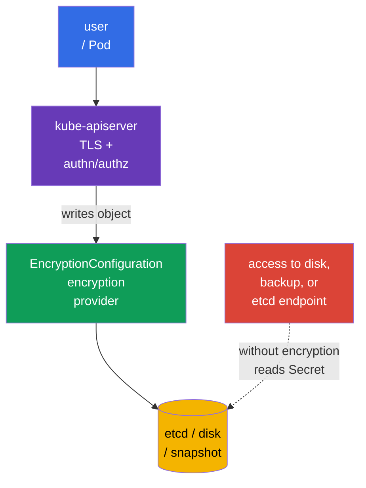
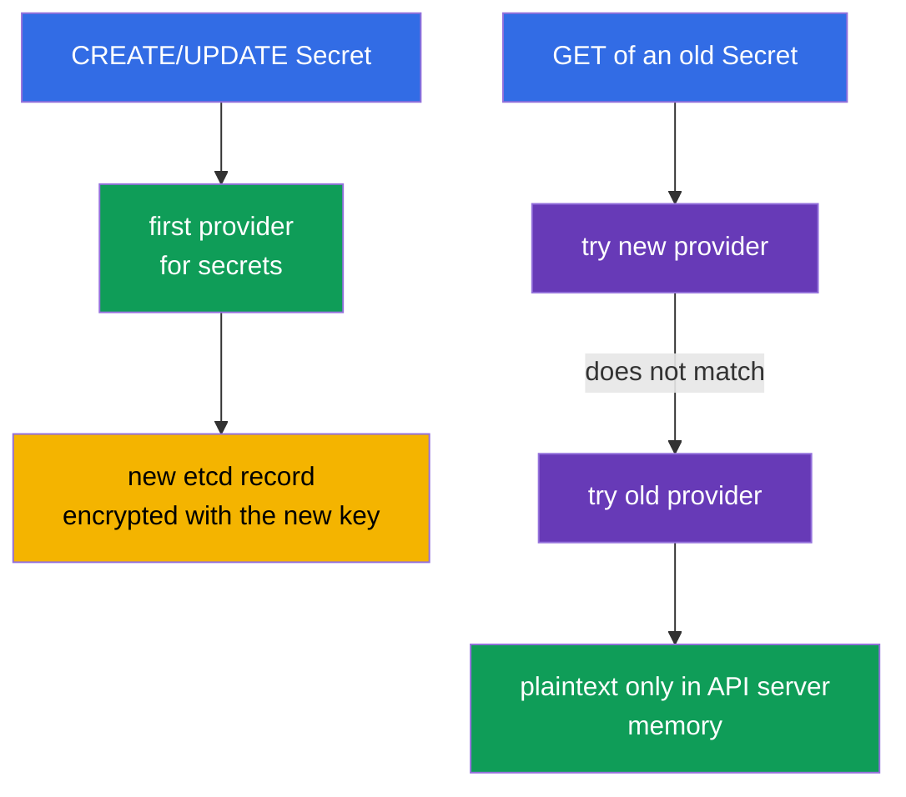
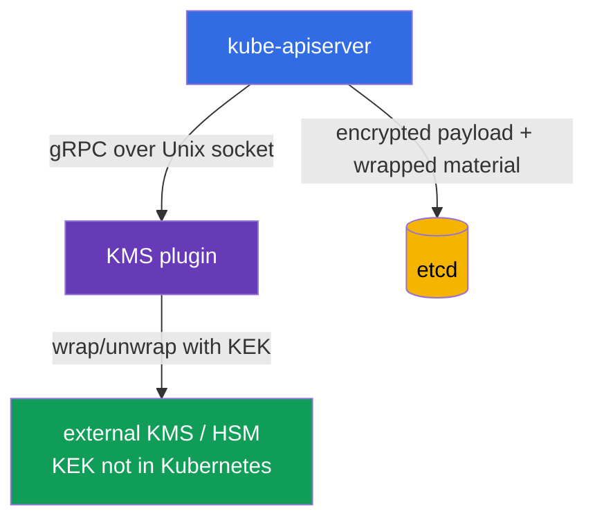
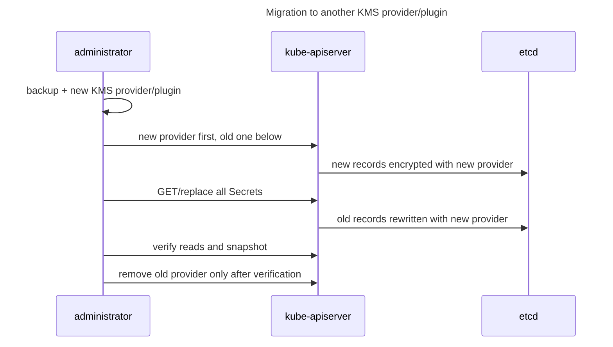

[Русская версия](ru.md) · [Versión en español](es.md) · [Version française](fr.md) · [Deutsche Version](de.md) · [ქართული ვერსია](ge.md) · [繁體中文版](tw.md) · [日本語版](jp.md)

# Chapter 21. Encrypting data in etcd and secure Secret storage

> **The problem.** Anyone who obtains the control-plane disk, access to etcd, a snapshot, or its backup
> bypasses API server RBAC, authentication, and audit and can read `Secret.data` if it is stored
> as ordinary base64. Passwords, tokens, and private keys from such a copy make it possible to continue
> an attack outside the cluster. Encrypting selected API resources before writing them to etcd leaves
> ciphertext in storage and requires separate access to the key material.

> **What comes next.** A `Secret` is an object for sensitive data, but its `data` fields are merely
> base64-encoded. Unless encryption at rest is enabled, anyone who gains access to etcd data, a
> snapshot, or a backup can read the password, token, and private key. This chapter configures
> encryption of selected API resources before writing them to etcd with `EncryptionConfiguration`, covers
> `aescbc`, `aesgcm`, `secretbox`, and `kms`, safe key rotation, and result verification. It is a practical continuation
> of [CKA Chapter 19 on Secrets](../../../cka/course/19/README.md) and the relationship between etcd and cluster data from
> [CKA Chapter 37](../../../cka/course/37/README.md).

> **Protection boundary.** `EncryptionConfiguration` encrypts selected API data before it is written to etcd.
> It is not full-disk encryption and does not independently encrypt disks, a snapshot, or a backup: a snapshot
> contains encrypted values of protected resources, but it still requires separate protection,
> access control, and storage encryption where necessary. Encryption at rest does not encrypt traffic between
> a client and the API server (TLS does that), does not replace RBAC, and does not protect against a user who
> can already run `get secret` or `exec` in a Pod with a secret.

> 🧠 Access to etcd or a snapshot bypasses API authentication, authorization, and audit; base64 does not protect `Secret.data`, while encryption at rest protects storage without the keys.

## 21.1. Threat model: why etcd is an especially valuable target

The API server is the usual path to Kubernetes state, while etcd is its persistent store. etcd contains
> API objects: Secrets, ConfigMaps, ServiceAccounts, RBAC bindings, Deployments, and much more.
> Therefore, reading the database or a copy of it bypasses the usual control point - the API server with
> authentication, authorization, and audit.



Typical leakage paths:

- a control-plane node, its disk, or the etcd data directory is compromised;
- a snapshot is sent to insecure storage, included in a ticket or CI artifact, or copied to a laptop;
- someone has network and TLS access directly to etcd;
- a backup is restored into a test environment with broader access;
- a Secret is accidentally printed to a log, shell history, Git, or an environment variable.

etcd encryption will not fix the last item, but it makes the first four substantially harder: the database
stores ciphertext, and key material must not be there. For CKS, do not draw the wrong conclusion:
**base64 is not encryption**; `kubectl get secret -o yaml` can be decoded without a key.

| Protection | What it helps against | What it does not do |
|---|---|---|
| TLS for API server/etcd | traffic interception | does not encrypt data on disk |
| RBAC | restricts API access to a Secret | does not protect a stolen snapshot |
| Encryption at rest | ciphertext for selected API data in etcd and its snapshot | does not encrypt disks, a snapshot, or a backup as a whole, and does not hide a Secret from an authorized API client |
| external secrets manager | separates master keys and lifecycle from the cluster | does not replace RBAC, TLS, or a secure Pod |

> 🧠 The first matching provider encrypts new records; the API server reads providers in order.

## 21.2. How API-data encryption works

`kube-apiserver` applies the provider chain described in `EncryptionConfiguration`. On **write**,
it uses the first provider matching the resource. On **read**, it tries providers in order
until one can decrypt the existing value. When rotating a local key in HA, first add the new key
second on every API server, make it first only after the new configuration is applied everywhere, and
retain the old key until re-encryption is complete.



Minimum file format:

```yaml
apiVersion: apiserver.config.k8s.io/v1
kind: EncryptionConfiguration
resources:
- resources:
  - secrets
  providers:
  - aescbc:
      keys:
      - name: key1
        secret: <base64-encoded-32-byte-key>
  - identity: {}
```

`resources` lists API resources, not namespaces. Usually, protect `secrets` first; when justified,
you can add `configmaps`, CRDs, or other sensitive resources. Do not encrypt everything blindly:
it increases load, makes recovery more complex, and does not replace data classification.

`resources` entries are processed in order: an earlier matching configuration takes
precedence. Do not duplicate the same explicit resource in independent blocks without a reason, and
do not create overlapping wildcard expressions. The following documented pattern is valid: a more specific
exception comes **before** a broad wildcard, for example to leave `events` plaintext and encrypt the rest:

```yaml
resources:
- resources:
  - events
  providers:
  - identity: {}
- resources:
  - '*.*'
  providers:
  - secretbox:
      keys:
      - name: key1
        secret: <base64-encoded-32-byte-key>
```

Here, `events` matches the first entry and never reaches `*.*`; putting the specific rule before the
wildcard is part of the security boundary.

`identity: {}` encrypts nothing. At the end of the chain, it permits reading old plaintext records during
migration. It is dangerous for a new record only when it is first: the first provider determines the
format of new records. Once all records are re-encrypted, `identity` can be removed if fallback for old
data is no longer needed.

> **Critical dependency.** A lost key, a key removed before re-encryption, or an unavailable KMS
> can make some objects unreadable and disrupt the control plane. Configuration and keys require
> backups, access control, and rehearsed rotation in advance.

> 🎯 `identity` at the end reads old plaintext; first, it leaves new records unencrypted.

## 21.3. Providers: `aescbc`, `aesgcm`, `secretbox`, `kms`, and `identity`

Kubernetes supports several providers. Do not select `identity` as the only protection for production:
it deliberately disables encryption at rest.

| Provider | Mechanism | When appropriate | Main limitation |
|---|---|---|---|
| `identity` | plaintext | temporary fallback for old data | does not encrypt at all |
| `aescbc` | AES-CBC with PKCS#7 padding | training/legacy mechanism; not recommended for new production configurations | weak: no built-in authentication/MAC, padding-oracle attacks are possible; the key is stored on the control plane |
| `aesgcm` | AES-GCM, AEAD | only with automated rotation | not recommended without rotation; limit of 200,000 writes per key |
| `secretbox` | XSalsa20 + Poly1305, AEAD | strong, fast local provider | 32-byte key is stored on the control plane |
| `kms` | envelope encryption through a KMS plugin | production with an external key manager/HSM/cloud KMS | plugin/KMS availability becomes an API server dependency |

> 🔬 AEAD, CBC, write limits, and key placement determine the provider choice.

`aescbc` uses an AES key encoded in base64; the example uses a 32-byte key (AES-256).
Kubernetes accepts keys of 16, 24, or 32 bytes. Unlike the AEAD provider `aesgcm`, `aescbc` has no
built-in authentication/MAC, so current Kubernetes documentation considers the CBC variant weak.
This example is for exam mechanics and compatibility, not as a production recommendation. Generate a
32-byte value for a lab as follows:

```bash
head -c 32 /dev/urandom | base64
```

Example for `aescbc`:

```yaml
apiVersion: apiserver.config.k8s.io/v1
kind: EncryptionConfiguration
resources:
- resources:
  - secrets
  providers:
  - aescbc:
      keys:
      - name: secrets-aescbc-2026-08
        secret: <base64-encoded-32-byte-key>
  - identity: {}
```

`aesgcm` also uses AEAD - encryption and integrity verification. Current Kubernetes documentation
sets a practical limit for one AES-GCM key: no more than 200,000 writes; rotate the key after that.
Therefore, this provider suits controlled volume with automated rotation; for a high rate of Secret
writes, prefer KMS or design the key lifecycle with particular care.

`secretbox` uses XSalsa20 and Poly1305, is an AEAD provider, and requires a 32-byte key.
Kubernetes designates it a strong, fast option. The lab below uses `aescbc` to cover the legacy
mechanism and its limitations; in production, selection of a local provider must account for
rotation and key-storage requirements.

```yaml
apiVersion: apiserver.config.k8s.io/v1
kind: EncryptionConfiguration
resources:
- resources:
  - secrets
  providers:
  - aesgcm:
      keys:
      - name: secrets-aesgcm-2026-08
        secret: <base64-encoded-32-byte-key>
  - identity: {}
```

Do not put a real key in Git, Helm values, Terraform state, a chat, or a ticket. The configuration file
containing a local key must be accessible only to root and the API server process, for example:

```bash
# Create the parent directory in advance: install does not create a missing directory.
sudo install -d -o root -g root -m 0700 /etc/kubernetes/enc
sudo install -o root -g root -m 0600 encryption-config.yaml \
  /etc/kubernetes/enc/encryption-config.yaml
sudo stat -c '%U:%G %a %n' \
  /etc/kubernetes/enc \
  /etc/kubernetes/enc/encryption-config.yaml
```

Local `aescbc`/`aesgcm` protects a snapshot from someone who has only the snapshot, but not the
control-plane filesystem. This is a useful baseline, but the key resides on the same trusted machine.
Use `kms` to separate duties and provide a durable key lifecycle.

> 🎯 Kube-apiserver receives `--encryption-provider-config` with a path accessible through a mount; verify readiness and reading a Secret through the API.

## 21.4. Connecting `EncryptionConfiguration` to kube-apiserver

The file itself changes nothing. The API server must receive the flag
`--encryption-provider-config=<path>`. In a kubeadm cluster, `kube-apiserver` is a static Pod; its
manifest is usually at `/etc/kubernetes/manifests/kube-apiserver.yaml`. Changing the manifest is
picked up by kubelet, which restarts the API server.

```yaml
# /etc/kubernetes/manifests/kube-apiserver.yaml (fragments)
spec:
  containers:
  - name: kube-apiserver
    command:
    - kube-apiserver
    - --encryption-provider-config=/etc/kubernetes/enc/encryption-config.yaml
    volumeMounts:
    - name: encryption-config
      mountPath: /etc/kubernetes/enc
      readOnly: true
  volumes:
  - name: encryption-config
    hostPath:
      path: /etc/kubernetes/enc
      # The directory was prepared above; Directory does not mask a typo with an empty directory.
      type: Directory
```

The flag path is visible **from inside the API server container**, so a file on the host alone is
insufficient: use `hostPath` and `volumeMount`. Check YAML indentation and existing volume names; do
not replace the entire manifest with a template. On an HA control plane, the same protected file and
flag must be present on every API server node, and roll out the change one node at a time while
monitoring health and quorum.

Practical work order:

1. Create and verify a fresh etcd snapshot; the procedure is in [CKA Chapter 37](../../../cka/course/37/README.md).
2. Generate a key outside shell history and save the configuration with mode `0600` at a protected path.
3. Add the volume, mount, and `--encryption-provider-config` to the API server manifest.
4. Wait for the static Pod to restart and verify `kubectl get --raw='/readyz?verbose'`.
5. Create a test Secret, confirm the API can read it, then re-encrypt all old records.

```bash
# Verify the flag and mount in the running static-Pod manifest.
sudo grep -n -- '--encryption-provider-config\|encryption-config' \
  /etc/kubernetes/manifests/kube-apiserver.yaml

# The API server is ready again after the manifest change.
kubectl get --raw='/readyz?verbose'
kubectl -n kube-system get pods -l component=kube-apiserver
```

> **Caution.** An error in a path, YAML, or key can prevent the API server from starting. Work through
> the control-plane node console, retain a backup of the manifest, and do not remove the previous configuration
> until verification is complete. For managed Kubernetes, do not edit a static Pod: enable encryption through
> the provider's supported mechanism and follow its KMS/cluster-update procedure.

> 🏭 KMS separates the KEK, but the plugin and key manager require HA, minimal permissions, and a verified restore.

## 21.5. KMS and envelope encryption

The `kms` provider connects the API server to a local KMS plugin over a Unix socket; the plugin communicates
with an external KMS/HSM where the key encryption key (KEK) is stored. `EncryptionConfiguration` contains
no KEK. KMS v1 and v2 use envelope encryption but obtain the data encryption key (DEK) differently,
so they cannot be described with a single sequence.



Conceptual KMS **v2** fragment:

```yaml
apiVersion: apiserver.config.k8s.io/v1
kind: EncryptionConfiguration
resources:
- resources:
  - secrets
  providers:
  - kms:
      apiVersion: v2
      name: production-kms
      endpoint: unix:///var/run/kmsplugin/socket.sock
      timeout: 3s
  - identity: {}
```

The differences must be made explicit:

| Property | KMS v1 | KMS v2 |
|---|---|---|
| Status | deprecated since Kubernetes 1.28; disabled by default from 1.29 and requires explicit `--feature-gates=KMSv1=true` | stable since Kubernetes 1.29; recommended API for new configurations |
| DEK | a new random DEK for every encryption operation; the plugin wraps every DEK with the KEK | the API server stores a secret seed and uses a KDF to derive a single-use DEK for every operation; the seed is wrapped with the KEK and changes on KEK rotation |
| Config fields | `apiVersion: v1` or the field is absent; `name`, `endpoint`, `cachesize`, `timeout` | `apiVersion: v2`, `name`, `endpoint`, `timeout`; `cachesize` is not allowed |
| Performance | more gRPC/KMS calls; the cache stores unwrapped DEKs | no KMS call to wrap an individual DEK on every write |
| Key identification | depends on the v1 plugin | `Status` returns `version: v2`, `healthz: ok`, and the current KEK `key_id` |

> **Version boundary for this table.** At the verification date, **2026-09-15**, KMS v1 still exists in the v1.35 exam snapshot, but is deprecated and disabled by default; legacy compatibility requires an explicit feature gate. Do not use it for new configurations and check the KMS documentation for your minor version.

In v2, etcd stores the encrypted payload and material sufficient for the API server to obtain a single-use
DEK from the protected seed; this is not a model where the plugin issues a new wrapped DEK for every
write. Rotating `key_id` causes the API server to obtain a new seed, protect it with the new KEK, and
use it for subsequent writes. Old data is rewritten through a separate controlled
re-encryption procedure.

Exact fields and the available API version depend on the Kubernetes version and selected plugin. Check
the official documentation for your version and the plugin deployment; do not copy an arbitrary KMS v1/v2
example into production. The socket must be available to the API server container through an explicit volume
mount, and access to it must be restricted. The plugin itself must use TLS/authentication to the remote
manager, have minimal KMS permissions, and not print plaintext in logs.

Two operational mechanisms are useful for KMS. The
`--encryption-provider-config-automatic-reload=true` flag causes the API server to reread the
configuration without restarting (convenient for key rotation). Plugin health is checked through the
`/healthz/kms-providers` endpoint and general `/healthz`; with automatic reload, individual health checks
are combined into one. The API server polls KMS v2 `Status` about once per minute when healthy and more
often on failure. The cache does not make the plugin/KEK an optional dependency: their unavailability can
break startup/cache warm-up, decryption of material not yet revealed, KEK/`key_id` rotation, and snapshot
restore. The plugin and remote manager must be HA, and restoration requires the same KEK or a documented
migration.

KMS improves separation of secrets, but adds operational requirements:

- For KMS v1, the plugin/KMS is much closer to the synchronous data path: new DEKs are wrapped through
  KMS, and a cache miss requires unwrap. For KMS v2, the API server locally derives single-use DEKs from
  a protected seed, so it does not call the remote KMS on every ordinary API read/write. The plugin and
  manager remain critical for startup/cache warm-up, uncached decryption, key rotation, and
  recovery; monitor `Status` health, `key_id` stability, `EncryptRequest`/
  `DecryptRequest` latency, errors, availability, quota, and credential lifetime;
- design the plugin and KMS for HA: they are a critical dependency, so unavailability of the plugin/KEK
  can lead to failures reading and writing encrypted resources; verify the recovery process in advance;
- back up metadata and document key IDs, but **do not** export master keys into an etcd backup;
- restrict IAM/ACL: the API server receives only the required encrypt/decrypt operations, while a cluster
  administrator does not necessarily receive permissions to manage the KEK;
- test snapshot restoration with access to the same KMS key before an incident.

An external KMS does not mean a Secret no longer appears in Kubernetes. If an application receives an
ordinary Kubernetes Secret, plaintext remains available to those authorized through the API or Pod. Use
Vault Agent, Secrets Store CSI Driver, or External Secrets Operator to deliver secrets by a short-lived
identity, but carefully verify their RBAC and synchronization: an operator that creates a Kubernetes Secret
places a copy in etcd again.

> 🎯 New key/provider first while retaining the old one → rewrite objects → verify reading/storage → remove the old key.

## 21.6. Provider rotation and re-encryption of existing data

Changing the configuration is not enough. A new provider applies only to **new or updated**
objects; old records remain encrypted with the old key or plaintext. Therefore, safe rotation always has
two distinct actions: first ensure old data can be read and new data is written with the new key, then
rewrite the existing objects.

### Rotating an `aescbc`/`aesgcm` key

Suppose `key-old` was initially used. On an HA control plane, do not immediately put `key-new` first:
an already updated API server can write an object with the new key while another API server cannot yet
decrypt it. Rotate in two phases.

1. Add `key-new` **second** after `key-old` in the configuration on every control-plane node.
2. Restart the API server or reload the configuration on **all** API servers. Each can now decrypt both
   keys, while new records still use `key-old`.
3. Make `key-new` **first**, retaining `key-old` second, and apply the configuration to all API
   servers again. Only now are new records created with `key-new`.

Phase 1 - new key second on all API servers:

```yaml
apiVersion: apiserver.config.k8s.io/v1
kind: EncryptionConfiguration
resources:
- resources:
  - secrets
  providers:
  - aescbc:
      keys:
      - name: key-old-2026-01
        secret: <old-base64-32-byte-key>
      - name: key-new-2026-08
        secret: <new-base64-32-byte-key>
  - identity: {}
```

Phase 2 - after applying phase 1 on every API server, make the new key first:

```yaml
apiVersion: apiserver.config.k8s.io/v1
kind: EncryptionConfiguration
resources:
- resources:
  - secrets
  providers:
  - aescbc:
      keys:
      - name: key-new-2026-08
        secret: <new-base64-32-byte-key>
      - name: key-old-2026-01
        secret: <old-base64-32-byte-key>
  - identity: {}
```

After phase 2 is applied on all API servers, rewrite all Secrets. The command below gets every
object and sends it back through the API; precisely the new provider in first position encrypts the write.
Before a bulk operation, create a snapshot and start with a test namespace.

```bash
# Rewrite all Secrets through the API server.
kubectl get secrets --all-namespaces -o json | kubectl replace -f -

# If ConfigMaps are protected, rewrite them in a separate deliberate operation.
# kubectl get configmaps --all-namespaces -o json | kubectl replace -f -
```

> 🔬 Storage Version Migration rewrites storage in bulk and requires a separate feature/operational rollout.

### Production extension: Storage Version Migration

For bulk rewrites in production, there is a Kubernetes-native alternative: **Storage Version
Migration**. In Kubernetes 1.36, it is beta and disabled by default; after explicit enablement and
configuration according to your version's documentation, the migration rewrites objects through the API
storage path. This is suitable, in particular, for re-encryption after changing
`EncryptionConfiguration` or keys. For CKS, it is sufficient to understand provider order and
forced object rewriting; the `kubectl replace` above remains a simple exam route, while Storage Version
Migration requires a separate operational rollout, observability, and a tested rollback/recovery process.

> 🏭 **Upstream v1.37.** In Kubernetes v1.37, the built-in `StorageVersionMigration` API/controller became GA and enabled by default. This changes production-current status, but not this chapter's CKS Core workflow, which remains tied to the exam/training context. See [Kubernetes v1.37 Security Delta](../APPENDIX_K8S_137_SECURITY_DELTA.md).

`kubectl replace` requires a current `resourceVersion`; high contention can cause conflicts.
In production, run a controlled script with retries, API-latency observation, and a coordinated window,
rather than blindly pasting the command into CI. Do not write JSON containing Secrets to disk or to a
pipeline log.

After re-encryption and key verification are complete, remove `key-old` from the config, restart the API
server, and verify reading again. Do not remove the old key before rewriting objects: a restored snapshot
or old record will become unreadable.

### Moving from `identity` to encryption

For an old cluster, the beginning is similar: put the new encryption provider first, retain `identity`
last, then rewrite the resources.

```yaml
providers:
- aesgcm:
    keys:
    - name: key-2026-08
      secret: <base64-encoded-32-byte-key>
- identity: {}
```

After re-encrypting old records, `identity: {}` can be removed. Retaining it below is acceptable only
as an explicit temporary choice for compatibility; do not consider the presence of `identity` proof that
all data is protected.

> 🏭 KEK rotation and changing a provider differ; retain the ability to decrypt old data until restore has been verified.

### Rotating a KMS v2 KEK

Routine remote KEK rotation in KMS v2 happens **inside the external KMS/plugin**. The plugin reports
the current public `key_id` through `Status`; the API server treats this ID as authoritative. When
`key_id` changes, the API server gets a new seed protected by the new KEK and uses it for subsequent
encryption. For this normal KEK rotation, do not add a second `kms` provider, change provider order, or
restart the API server merely to change the KEK.

When healthy, the API server polls `Status` about once per minute and can use the last valid state for
about three minutes. Therefore, do not start re-encryption immediately after rotation: first confirm
that every API server sees the new stable `key_id` and that the plugin is not switching between IDs. Then
rewrite the required objects through the API if storage must move to the new KEK. Upstream recommends
rotating a KMS v2 KEK at least every 90 days. The exact workflow and observability depend on the plugin
and external KMS.

### Migrating to another KMS provider/plugin

This is **not** routine KEK rotation. If the cluster truly moves to another configured KMS
provider, plugin, or endpoint, put the new `kms` provider first and retain the old one below for decryption,
then rewrite the data through the API, and retire the old provider/plugin only after verification.



> 🎯 Prove the API server config, authorized Secret reading, and absence of a plaintext marker in the raw etcd value.

## 21.7. Verification: API, configuration, and etcd

Do not verify only that the file exists. You must prove three facts: the API server actually uses the
flag, the Secret remains accessible through the API, and etcd contains no plaintext. Perform the last
check only on an isolated lab cluster or under an agreed procedure: direct etcd access requires
privileges and can disclose real data.

First, create a harmless canary Secret with a unique value that is easy to search for:

```bash
kubectl -n default create secret generic encryption-check \
  --from-literal=probe='not-a-real-secret-rotate-me'
kubectl -n default get secret encryption-check \
  -o jsonpath='{.data.probe}' | base64 -d; echo
```

The second output proves normal API operation but does not prove encryption at rest: the API server must
decrypt data for an authorized client. Then verify the manifest, readiness, and API server log:

```bash
sudo grep -n -- '--encryption-provider-config' \
  /etc/kubernetes/manifests/kube-apiserver.yaml
kubectl get --raw='/readyz?verbose'
kubectl -n kube-system logs kube-apiserver-$(hostname) --tail=100
```

The static Pod name can differ from `$(hostname)`; first get it with `kubectl -n kube-system
get pods -l component=kube-apiserver`. Do not print production logs to an unprotected location: diagnostic
data can contain object names and access errors.

For a training self-managed cluster, you can obtain the value directly with `etcdctl` and confirm that
the marker is absent from the response bytes. The TLS parameters below are a typical kubeadm example:
first compare the endpoint, CA, and cert/key paths with the **current** etcd manifest. The check is
fail-closed: PASS is possible only if `etcdctl` read a non-empty value for the required key, `strings`
completed successfully, and the marker was not found.

```bash
(
  set -euo pipefail
  raw_file="$(mktemp)"
  trap 'rm -f "$raw_file"' EXIT

  # Replace the endpoint and TLS paths with values from the current etcd manifest.
  if ! ETCDCTL_API=3 etcdctl get /registry/secrets/default/encryption-check \
    --endpoints=https://127.0.0.1:2379 \
    --cacert=/etc/kubernetes/pki/etcd/ca.crt \
    --cert=/etc/kubernetes/pki/etcd/server.crt \
    --key=/etc/kubernetes/pki/etcd/server.key \
    --print-value-only >"$raw_file"; then
    echo 'ERROR: etcdctl could not read the canary object' >&2
    exit 1
  fi

  if [ ! -s "$raw_file" ]; then
    echo 'ERROR: etcd key is absent or has an empty value' >&2
    exit 1
  fi

  # grep=1 means the marker was not found; do not confuse it with an etcdctl/strings error.
  set +e
  strings "$raw_file" | grep -Fq 'not-a-real-secret-rotate-me'
  status=("${PIPESTATUS[@]}")
  set -e

  if [ "${status[0]}" -ne 0 ]; then
    echo 'ERROR: strings could not inspect the etcd value' >&2
    exit 1
  elif [ "${status[1]}" -eq 0 ]; then
    echo 'FAIL: plaintext marker is present in etcd' >&2
    exit 1
  elif [ "${status[1]}" -ne 1 ]; then
    echo 'ERROR: plaintext verification failed unexpectedly' >&2
    exit 1
  fi

  echo 'OK: etcd value was read and plaintext marker was not found'
)
```

For old data, perform this test after re-encryption. etcd data usually has an encryption-provider format
prefix; do not build a check around an internal format that depends on the Kubernetes version.

After the test, delete the canary Secret and verify that the backup/restore runbook has been retained:

```bash
kubectl -n default delete secret encryption-check
```

| What to verify | Expected result |
|---|---|
| API server manifest | contains `--encryption-provider-config` and a correct read-only mount |
| readiness | `/readyz?verbose` succeeds after restart |
| API Secret read | authorized `kubectl get` returns the original value |
| etcd lab check | the unique plaintext marker is not found in the raw stored value |
| after rotation | a Secret created before rotation is readable and rewritten by the new provider |
| backup/restore | the snapshot is safely accessible and required keys/KMS are available during restore |

> 🏭 Encryption at rest does not replace RBAC, TLS, Secret hygiene, or backups; own keys, KMS availability, and restore separately.

## 21.8. How this is applied in production

Encryption at rest is one layer. Useful protection is built from several independent barriers.

- **Least-privilege RBAC.** Do not grant `get`, `list`, or `watch` on `secrets` to broad groups. `list` and
  `watch` also return Secret contents. Separately restrict `pods/exec`, `pods/attach`, and
  `pods/ephemeralcontainers`: a shell in a workload often provides a path to a mounted Secret.
- **Do not pass a Secret through env unless necessary.** Prefer a read-only volume/CSI mount;
  environment variables easily end up in debug output, a crash dump, a child process, or a log.
- **Do not commit plaintext.** `stringData` is convenient, but it is plaintext in Git. Use SOPS, Sealed
  Secrets, or GitOps integration with an external secrets manager; enable pre-commit and server-side scanning.
- **Short lifetime and rotation.** Rotate a database password, API token, certificate, and cloud
  credential. Updating a Kubernetes Secret does not mean an application automatically rereads it:
  env does not update, while a file mount updates with a delay; the application must be able to reload/restart.
- **Limit the API surface.** Do not print `kubectl get secret -o yaml`, decoded values, or KMS
  credentials to a CI log. Revoke an accidentally published secret at the source rather than only deleting
  the line from Git history.
- **Protect backups.** A snapshot of encrypted etcd is still sensitive: store it separately,
  encrypt storage, set retention, MFA/ACL, and a verified restore. Store the secret key or KMS access
  separately from the snapshot.

External Secrets Operator, Vault, cloud Secrets Manager, and Secrets Store CSI Driver solve different
problems. The first often synchronizes an external value into a Kubernetes Secret - convenient, but a copy
remains in etcd and must be encrypted. CSI/Vault Agent can deliver a secret to a Pod as a file without a
persistent Kubernetes Secret - fewer copies in etcd, but trust boundaries arise around the node plugin,
Pod identity, and external backend. Choose a pattern after a threat model, not just because a tool
“encrypts secrets.”

## 21.9. Common mistakes and diagnostics

| Symptom | Likely cause | Safe response |
|---|---|---|
| API server is not Ready after an edit | invalid YAML, unavailable config/mount/socket, invalid key | restore a verified manifest through the console; read the local kubelet/API log |
| A Secret is readable through `kubectl` | this is normal | the API decrypts for an authorized client; verify raw etcd only in a lab |
| An old Secret cannot be read after rotation | old key/provider removed too early | restore the old provider/key from a protected backup, then re-encrypt |
| A new record remains plaintext | `identity` is first or the flag is not applied | check provider order, manifest, restart, and creation of a new canary |
| An API write hangs/fails | KMS plugin or external KMS unavailable/slow | check socket, TLS, KMS health, timeout, and HA; do not weaken security blindly |
| A Secret is found in Git/log | encryption at rest cannot help | rotate the original credential immediately, restrict access, and remove the artifact following the IR procedure |

> 🏭 **Kubernetes v1.37 recovery edge case.** A Beta unsafe force-delete path (`AllowUnsafeMalformedObjectDeletion`) exists for an unreadable/corrupt API object. It is an operation with cluster-breaking potential and a last recovery mechanism, not a normal way to correct encryption rotation. For details and limitations, see [Kubernetes v1.37 Security Delta](../APPENDIX_K8S_137_SECURITY_DELTA.md).

On the exam, first identify the cluster type. For kubeadm, look for the API server manifest and etcd TLS paths.
For a managed control plane, settings can be unavailable: do not try to edit nonexistent
`/etc/kubernetes/manifests`; use provider-supported KMS encryption and confirm its status.

## 21.10. Mini-glossary

- **Encryption at rest** - encryption of selected API data before writing it to etcd; it is not
  encryption of the disk, snapshot, or backup as a whole.
- **EncryptionConfiguration** - the provider configuration read by kube-apiserver for selected
  API resources.
- **provider** - an encryption/decryption mechanism for specific API resources.
- **`aescbc`** - a local AES-CBC provider with PKCS#7 padding and a key from configuration; without
  built-in authentication/MAC, so it is weak.
- **`aesgcm`** - an AES-GCM AEAD provider; keys must be rotated with the write limit in mind.
- **`secretbox`** - an XSalsa20 + Poly1305 AEAD provider with a 32-byte key.
- **`kms`** - a provider that delegates cryptographic operations to an external KMS plugin.
- **envelope encryption** - an object is encrypted with a DEK, while the DEK is protected by an external KEK.
- **KEK/DEK** - key encryption key / data encryption key.
- **re-encryption** - rewriting old API objects through a new provider/key.
- **`identity`** - a provider without encryption; permitted only as a deliberate temporary fallback.

## 21.11. Chapter summary

- etcd stores Secrets and a substantial part of Kubernetes state; base64 does not protect this content.
- `EncryptionConfiguration` is applied by the kube-apiserver flag `--encryption-provider-config`; the first
  provider is used for new records, while providers are tried in order for reads.
- `aescbc`, `aesgcm`, and `secretbox` are local options with a key in a protected file; `kms` makes it
  possible to move the KEK to an external manager and use envelope encryption.
- In HA, rotate a local key in this order: backup -> new key second on all API servers -> apply the
  configuration everywhere -> new key first on all API servers -> apply the configuration again ->
  re-encrypt old objects -> checks -> remove the old key.
- Verify the configuration, API health, API reads, and absence of canary plaintext in a raw etcd lab value.
- Complement encryption at rest with RBAC, TLS, secrets hygiene, safe backups, and an external secret manager.

## 21.12. How this helps: on the exam and in real work

**On CKS.** A task may require finding unencrypted Secrets, enabling encryption at rest,
identifying the correct `--encryption-provider-config`, explaining provider order, or rotating without
breaking a Secret. A fast algorithm: find the API server manifest, create a secure config and mount, add
the flag, wait for health, rewrite the objects, and check etcd. Do not answer “a Secret is encrypted with
base64” - that is wrong.

**In production.** Treat encryption at rest as a standard control-plane baseline, not the final
measure. Own the keys separately from etcd backups, automate rotation, monitor KMS, test
restore, and minimize the number of people, identities, and Pods that can see plaintext. Change the API
server configuration through a change procedure with rollback and backup.

## 21.13. Self-check questions

<details>
<summary>1. Why does base64 in the `Secret.data` field not protect a secret from the owner of an etcd snapshot?</summary>

Base64 is encoding, not encryption: `kubectl get secret -o yaml` can be decoded without a key. The owner of an etcd snapshot obtains stored API state while bypassing API server authentication, authorization, and audit. Encryption at rest changes this by storing ciphertext for selected resources.
</details>

<details>
<summary>2. Which records does encryption at rest protect, and which threats does it not eliminate?</summary>

`EncryptionConfiguration` encrypts selected API data before writing it to etcd, such as Secrets, and ciphertext enters the snapshot. It does not encrypt a disk, snapshot, or backup as a whole, does not protect TLS traffic, and does not hide a Secret from an identity with `get secret` or `exec` in a Pod. RBAC, TLS, and backup protection remain separate controls.
</details>

<details>
<summary>3. How does the API server choose a provider when writing and when reading an old record?</summary>

When writing, the API server uses the first provider matching the resource. When reading, it tries providers in order until one decrypts the existing value. This is precisely what permits retaining the old key below the new one during rotation.
</details>

<details>
<summary>4. Why is `identity` acceptable at the end of a migration chain but not as the first provider?</summary>

`identity` encrypts nothing, but at the end of the chain it permits reading old plaintext records during migration. It is dangerous first because the first provider determines the format of new records, which will remain plaintext. After re-encryption, `identity` can be removed if fallback is no longer needed.
</details>

<details>
<summary>5. What is the operational difference between local `aescbc`/`aesgcm` and `kms`?</summary>

For local providers, the key is in a protected control-plane config file: this protects a snapshot without the node filesystem, but does not separate those secrets. `kms` uses envelope encryption through a Unix-socket plugin and an external KEK/HSM, improving separation of duties. In return, the plugin and external manager become a critical dependency for reading, writing, rotation, and restore.
</details>

<details>
<summary>6. Why can the old key not be removed immediately after adding the new one?</summary>

Old objects can still be plaintext or encrypted with the old key, while the new provider applies only to new/updated records. In HA, every API server must first be able to read both keys; then the new one becomes first and objects are rewritten. Removing the old key before re-encryption makes some records or a restored snapshot unreadable.
</details>

<details>
<summary>7. How can you prove that an old Secret has really undergone re-encryption?</summary>

After putting the new provider first, rewrite the old Secret through the API, for example with `kubectl get secrets --all-namespaces -o json | kubectl replace -f -`, starting with a test namespace. Then verify API reading and, in an isolated lab, inspect the raw etcd canary value: a unique plaintext marker must not be found through `strings | grep`. Remove the old key/provider only after that verification.
</details>

<details>
<summary>8. Which Pod actions can bypass a ban on `get secrets`, and why?</summary>

Broad `pods/exec`, `pods/attach`, or `pods/ephemeralcontainers` permissions can provide a shell in a workload where a Secret is mounted or available to the application. The identity then need not read the Secret directly through the Kubernetes API to see plaintext. Therefore, restrict these subresources with least-privilege RBAC as well.
</details>

<details>
<summary>9. What must be verified to restore an encrypted etcd snapshot?</summary>

Store and restore the snapshot through a secure procedure, but also verify the availability of required local keys or the same KMS KEK/plugin. Test restore in advance, document key IDs, and protect the snapshot separately with ACLs, storage encryption, and retention. Do not export master keys into an etcd backup.
</details>

<details>
<summary>10. **Flashback (Chapter 14).** Encryption at rest protects a Secret specifically in etcd. After mounting it, kubelet provides the Secret to a Pod through a **tmpfs-backed volume**: this excludes an ordinary durable-disk copy, but gives no unconditional guarantee that it will “never reach disk.” With swap enabled, Kubernetes v1.36 mounts memory-backed volumes with `noswap` if the kernel supports the option (officially from Linux 6.3 or with a backport); otherwise, kubelet warns that such a volume, including a Secret, can be swapped out. On such nodes, disable swap or ensure it is encrypted and check the kubelet warning. Which Chapter 14 measures (host footprint, least-privilege host) limit the risk to the secret at this stage - when it is already decrypted and available through tmpfs to an authorized process on the node - and why does host compromise or a privileged workload on the same node remain a serious threat even with no persistent-disk copy?</summary>

Reduce the host footprint: disable unnecessary services and packages, close unneeded listening ports, and update the node promptly to reduce paths to host compromise. A least-privilege host limits who has SSH/sudo and kubelet/runtime access, while a workload must not receive `privileged`, host namespaces, or hostPath. tmpfs and `noswap` reduce durable-disk risk, but root on the node or a privileged neighboring workload can still gain access to memory, the runtime, or the mounted secret.
</details>

## Practice

Before working in production, complete the lab in a separate cluster: create an
`EncryptionConfiguration`, add the API server flag and mount, encrypt a Secret, rotate it, and
confirm the result through etcd. Keep access to the control-plane console and a fresh snapshot: an error
in a static-Pod manifest can temporarily deprive the cluster of its API.

🧪 Lab 109 (EncryptionConfiguration, Secret encryption in etcd, and verification):
[tasks/cks/labs/109](../../labs/109/README.MD)

🌐 Additional interactive practice (killer.sh/killercoda, external resource): [secret-pod-access](https://killercoda.com/killer-shell-cks/scenario/secret-pod-access) · [secret-read-secrets](https://killercoda.com/killer-shell-cks/scenario/secret-read-secrets) · [secret-serviceaccount-pod](https://killercoda.com/killer-shell-cks/scenario/secret-serviceaccount-pod) · [secret-etcd-encryption](https://killercoda.com/killer-shell-cks/scenario/secret-etcd-encryption)

📘 Related material: [CKA Chapter 19 - Secret](../../../cka/course/19/README.md) ·
[CKA Chapter 37 - etcd backup and restore](../../../cka/course/37/README.md)

---
[Table of contents](../README.md) · [Chapter 20](../20/README.md) · [Chapter 22](../22/README.md)
