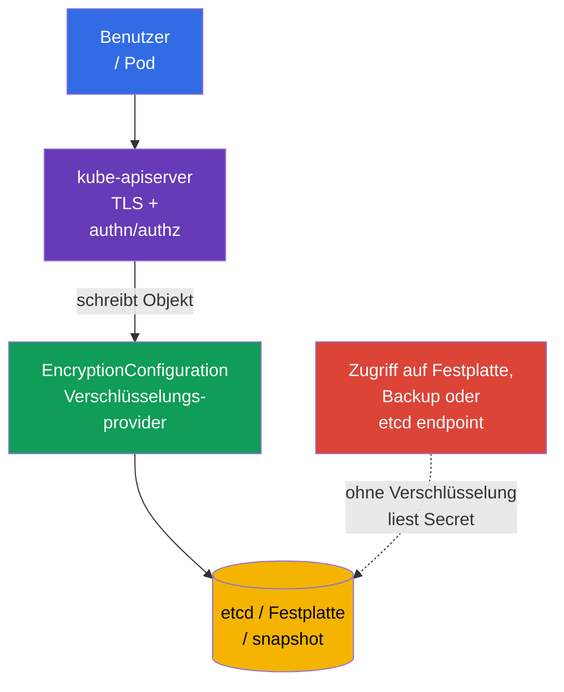
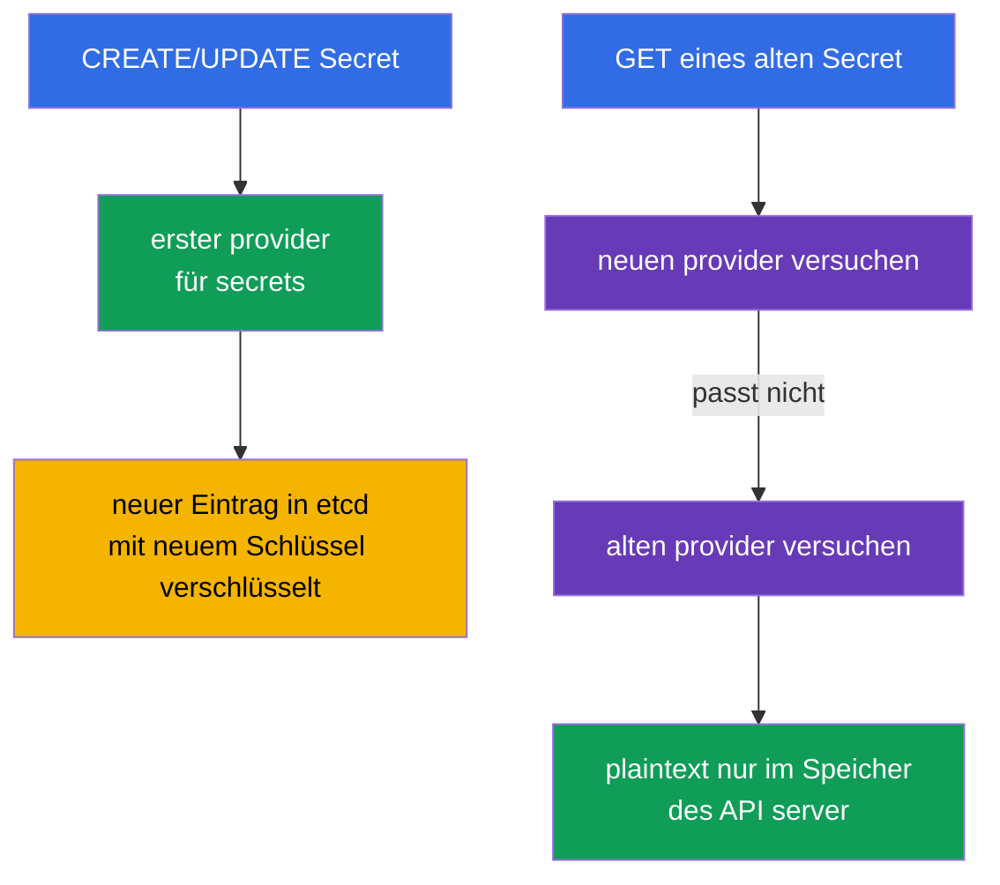
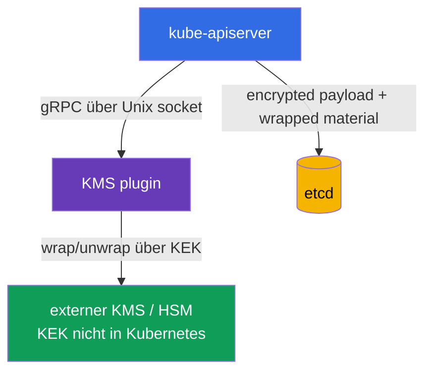
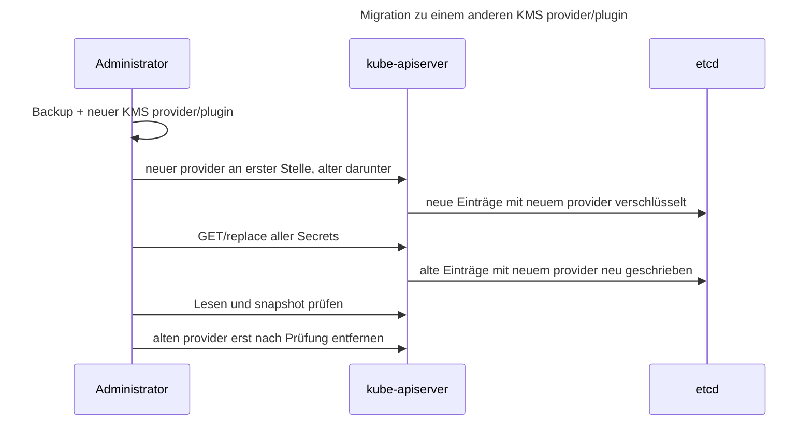

[Русская версия](ru.md) · [Eng version](README.md) · [Versión en español](es.md) · [Version française](fr.md) · [ქართული ვერსია](ge.md) · [繁體中文版](tw.md) · [日本語版](jp.md)

# Kapitel 21. Datenverschlüsselung in etcd und sichere Speicherung von Secret

> **Problem.** Wer die Festplatte des Control Plane, Zugriff auf etcd, einen snapshot oder dessen Backup erhält, umgeht RBAC, Authentication und Audit des API server und liest `Secret.data`, wenn es als gewöhnliches base64 gespeichert ist. Passwörter, Token und private Schlüssel aus einer solchen Kopie ermöglichen die Fortsetzung eines Angriffs außerhalb des Clusters. Die Verschlüsselung ausgewählter API-Ressourcen vor dem Schreiben in etcd hinterlässt ciphertext im Speicher und erfordert einen separaten Zugriff auf das Schlüsselmaterial.

> **Was folgt.** Ein `Secret` ist ein Objekt für sensitive Daten, seine Felder `data` sind jedoch lediglich in base64 kodiert. Ist encryption at rest nicht aktiviert, kann jemand mit Zugriff auf etcd-Daten, snapshot oder Backup Passwort, Token und privaten Schlüssel lesen. In diesem Kapitel konfigurieren wir die Verschlüsselung ausgewählter API-Ressourcen vor dem Schreiben in etcd durch `EncryptionConfiguration`, behandeln `aescbc`, `aesgcm`, `secretbox` und `kms`, sichere Schlüsselrotation und überprüfen das Ergebnis. Dies ist die praktische Fortsetzung von [CKA-Kapitel 19 zu Secret](../../../cka/course/19/de.md) und der Verbindung von etcd mit Clusterdaten aus [CKA-Kapitel 37](../../../cka/course/37/de.md).

> **Schutzgrenze.** `EncryptionConfiguration` verschlüsselt ausgewählte API-Daten vor ihrem Schreiben in etcd. Dies ist weder full-disk encryption noch eine selbstständige Verschlüsselung von Festplatten, snapshot oder Backup: Ein snapshot enthält verschlüsselte Werte geschützter Ressourcen, benötigt aber selbst weiterhin separaten Schutz, Zugriffskontrolle und gegebenenfalls storage encryption. Encryption at rest verschlüsselt weder den Verkehr zwischen Client und API server (dafür dient TLS) noch ersetzt es RBAC oder schützt vor einem Benutzer, der bereits `get secret` ausführen oder in einen Pod mit dem Secret `exec` kann.

> 🧠 Zugriff auf etcd oder einen snapshot umgeht API-Authentication, Authorization und Audit; base64 schützt `Secret.data` nicht, encryption at rest schützt Storage ohne Schlüssel.

## 21.1. Bedrohungsmodell: warum etcd ein besonders wertvolles Ziel ist

Der API server ist der gewöhnliche Weg zum Zustand von Kubernetes, und etcd ist sein persistenter Speicher. In etcd befinden sich
> API-Objekte: Secrets, ConfigMaps, ServiceAccounts, RBAC bindings, Deployments und vieles mehr.
> Daher umgeht das Lesen der Datenbank oder ihrer Kopie den gewohnten Kontrollpunkt - den API server mit Authentication, Authorization und Audit.



Typische Wege für einen Datenabfluss:

- ein Control-Plane-Node, seine Festplatte oder das etcd-Datenverzeichnis wurde kompromittiert;
- ein snapshot wurde in unsicheren Storage übertragen, einem Ticket oder CI-artifact beigefügt oder auf einen Laptop gelangt;
- jemand besitzt Netzwerk- und TLS-Zugriff direkt auf etcd;
- ein Backup wurde in einer Testumgebung mit breiterem Zugriff wiederhergestellt;
- ein Secret wurde versehentlich in einem Log, der shell history, Git oder einer Umgebungsvariable ausgegeben.

Den letzten Punkt behebt die etcd-Verschlüsselung nicht, die ersten vier werden jedoch deutlich schwieriger: In der Datenbank bleibt ciphertext, und dort darf sich kein Schlüsselmaterial befinden. Für CKS ist es wichtig, keinen falschen Schluss zu ziehen: **base64 ist keine Verschlüsselung**; `kubectl get secret -o yaml` kann ohne Schlüssel dekodiert werden.

| Schutz | Wogegen er hilft | Was er nicht tut |
|---|---|---|
| TLS API server/etcd | Abhören des Datenverkehrs | verschlüsselt keine Daten auf der Festplatte |
| RBAC | beschränkt den API-Zugriff auf Secret | schützt keinen gestohlenen snapshot |
| Encryption at rest | ciphertext ausgewählter API-Daten in etcd und dessen snapshot | verschlüsselt weder Festplatten noch snapshot oder Backup vollständig und verbirgt Secret nicht vor einem autorisierten API-Client |
| externer secrets manager | trennt master keys und Lifecycle vom Cluster | ersetzt weder RBAC noch TLS oder einen sicheren Pod |

> 🧠 Der erste passende provider verschlüsselt neue Einträge, der API server liest providers der Reihe nach.

## 21.2. Wie die Verschlüsselung von API-Daten funktioniert

`kube-apiserver` wendet die in `EncryptionConfiguration` beschriebene Kette von providers an. Beim **Schreiben** verwendet er den ersten provider, der zur Ressource passt. Beim **Lesen** versucht er die providers der Reihe nach, bis einer den vorhandenen Wert entschlüsseln kann. Bei der Rotation eines lokalen Schlüssels in HA wird der neue key zunächst auf allen API servers an zweiter Stelle ergänzt und erst dann an die erste Stelle gesetzt, nachdem die neue Konfiguration überall angewendet wurde; der alte key bleibt bis zum Abschluss des re-encryption erhalten.



Minimales Dateiformat:

```yaml
apiVersion: apiserver.config.k8s.io/v1
kind: EncryptionConfiguration
resources:
- resources:
  - secrets
  providers:
  - aescbc:
      keys:
      - name: key1
        secret: <base64-encoded-32-byte-key>
  - identity: {}
```

`resources` listet API-Ressourcen auf, nicht namespaces. Gewöhnlich werden zuerst `secrets` geschützt; bei begründeter Notwendigkeit können `configmaps`, CRD oder andere sensitive Ressourcen ergänzt werden. Verschlüsseln Sie nicht blind alles: Das erhöht die Last, erschwert die Wiederherstellung und ersetzt die Datenklassifizierung nicht.

Die Elemente von `resources` werden der Reihe nach verarbeitet: Eine frühere passende Konfiguration hat Vorrang. Duplizieren Sie nicht dieselbe explizite Ressource ohne Grund in unabhängigen Blöcken und erstellen Sie keine überlappenden wildcard expressions. Das folgende dokumentierte Muster ist zulässig: Eine spezifischere Ausnahme steht **vor** einem breiten wildcard, beispielsweise um `events` als plaintext zu belassen und den Rest zu verschlüsseln:

```yaml
resources:
- resources:
  - events
  providers:
  - identity: {}
- resources:
  - '*.*'
  providers:
  - secretbox:
      keys:
      - name: key1
        secret: <base64-encoded-32-byte-key>
```

Hier trifft `events` auf das erste Element und erreicht `*.*` nicht; die Reihenfolge der specific rule vor dem wildcard ist Teil der Security Boundary.

`identity: {}` verschlüsselt nichts. Am Ende der Kette ermöglicht es während der Migration das Lesen früherer plaintext-Einträge. Für einen neuen Eintrag ist es nur dann gefährlich, wenn es an erster Stelle steht: Der erste provider bestimmt das Format eines neuen Eintrags. Nachdem alle Einträge re-encrypted wurden, kann `identity` entfernt werden, falls kein fallback für alte Daten benötigt wird.

> **Kritische Abhängigkeit.** Ein verlorener Schlüssel, ein vor dem re-encryption entfernter Schlüssel oder ein nicht verfügbares KMS kann Teile der Objekte unlesbar machen und den Betrieb des Control Plane stören. Konfiguration und Schlüssel benötigen Backups, Zugriffskontrolle und eine im Voraus geübte Rotation.

> 🎯 `identity` am Ende liest alten plaintext, an erster Stelle lässt es neue Einträge unverschlüsselt.

## 21.3. Provider: `aescbc`, `aesgcm`, `secretbox`, `kms` und `identity`

Kubernetes unterstützt mehrere provider. Wählen Sie für Production nicht `identity` als einzigen Schutz: Dadurch wird encryption at rest bewusst deaktiviert.

| Provider | Mechanismus | Wann angemessen | Wichtigste Einschränkung |
|---|---|---|---|
| `identity` | plaintext | temporärer fallback für alte Daten | verschlüsselt überhaupt nicht |
| `aescbc` | AES-CBC mit PKCS#7 padding | Lern-/legacy-Mechanismus; für neue Production-Konfigurationen nicht empfohlen | schwach: keine integrierte Authentication/MAC, padding-oracle-Angriffe möglich; Schlüssel liegt auf dem Control Plane |
| `aesgcm` | AES-GCM, AEAD | nur mit automatisierter Rotation | ohne Rotation nicht empfohlen; Limit von 200 000 Schreibvorgängen pro Schlüssel |
| `secretbox` | XSalsa20 + Poly1305, AEAD | starker und schneller lokaler provider | 32-Byte-Schlüssel liegt auf dem Control Plane |
| `kms` | envelope encryption über KMS plugin | Production mit externem key manager/HSM/Cloud-KMS | Verfügbarkeit von plugin/KMS wird zur Abhängigkeit des API server |

> 🔬 AEAD, CBC, Limits für Schreibvorgänge und die Platzierung von Schlüsseln bestimmen die Wahl des provider.

`aescbc` verwendet einen in base64 kodierten AES-Schlüssel; im Beispiel ist dies ein 32-Byte-Schlüssel (AES-256). Kubernetes akzeptiert Schlüssel mit 16, 24 oder 32 Byte. `aescbc` besitzt im Gegensatz zum AEAD-provider `aesgcm` keine integrierte Authentication/MAC; die aktuelle Kubernetes-Dokumentation betrachtet die CBC-Variante daher als schwach. Dieses Beispiel dient der Prüfungsmechanik und Kompatibilität, nicht als Production-Empfehlung. Einen 32-Byte-Wert für ein Lab erhalten Sie so:

```bash
head -c 32 /dev/urandom | base64
```

Beispiel für `aescbc`:

```yaml
apiVersion: apiserver.config.k8s.io/v1
kind: EncryptionConfiguration
resources:
- resources:
  - secrets
  providers:
  - aescbc:
      keys:
      - name: secrets-aescbc-2026-08
        secret: <base64-encoded-32-byte-key>
  - identity: {}
```

`aesgcm` verwendet ebenfalls AEAD - Verschlüsselung und Integritätsprüfung. Die aktuelle Kubernetes-Dokumentation nennt für einen AES-GCM-Schlüssel ein praktisches Limit: höchstens 200 000 Schreibvorgänge; anschließend muss der Schlüssel rotiert werden. Dieser provider eignet sich daher bei kontrolliertem Volumen und automatisierter Rotation; bei einem hohen Durchsatz von Secret-Schreibvorgängen sollte KMS bevorzugt oder der Schlüssel-Lifecycle besonders sorgfältig geplant werden.

`secretbox` verwendet XSalsa20 und Poly1305, ist ein AEAD-provider und erfordert einen 32-Byte-Schlüssel. Kubernetes bezeichnet ihn als starke und schnelle Option. Das Lab verwendet im Folgenden `aescbc`, um den legacy-Mechanismus und seine Grenzen zu behandeln; in Production muss die Wahl eines lokalen provider die Anforderungen an Rotation und Schlüsselspeicherung berücksichtigen.

```yaml
apiVersion: apiserver.config.k8s.io/v1
kind: EncryptionConfiguration
resources:
- resources:
  - secrets
  providers:
  - aesgcm:
      keys:
      - name: secrets-aesgcm-2026-08
        secret: <base64-encoded-32-byte-key>
  - identity: {}
```

Legen Sie keinen echten key in Git, Helm values, Terraform state, Chat oder Ticket ab. Die Konfigurationsdatei mit lokalem Schlüssel darf beispielsweise nur root und dem API-server-Prozess zugänglich sein:

```bash
# Parent-Verzeichnis vorher erstellen: install erzeugt kein fehlendes Verzeichnis.
sudo install -d -o root -g root -m 0700 /etc/kubernetes/enc
sudo install -o root -g root -m 0600 encryption-config.yaml \
  /etc/kubernetes/enc/encryption-config.yaml
sudo stat -c '%U:%G %a %n' \
  /etc/kubernetes/enc \
  /etc/kubernetes/enc/encryption-config.yaml
```

Lokales `aescbc`/`aesgcm` schützt einen snapshot vor jemandem, der nur den snapshot, nicht aber das Control-Plane-Filesystem besitzt. Das ist eine nützliche Baseline, der Schlüssel liegt jedoch auf derselben vertrauenswürdigen Maschine. Für die Trennung von Verantwortlichkeiten und einen belastbaren Schlüssel-Lifecycle wird `kms` verwendet.

> 🎯 Kube-apiserver erhält `--encryption-provider-config` mit einem über mount zugänglichen path; prüfen Sie readiness und das Lesen eines Secret über die API.

## 21.4. `EncryptionConfiguration` mit kube-apiserver verbinden

Die Datei allein ändert nichts. Der API server muss das Flag `--encryption-provider-config=<path>` erhalten. In einem kubeadm-Cluster ist `kube-apiserver` ein static Pod; sein Manifest liegt gewöhnlich unter `/etc/kubernetes/manifests/kube-apiserver.yaml`. Eine Änderung des Manifest erkennt kubelet und startet den API server neu.

```yaml
# /etc/kubernetes/manifests/kube-apiserver.yaml (Auszüge)
spec:
  containers:
  - name: kube-apiserver
    command:
    - kube-apiserver
    - --encryption-provider-config=/etc/kubernetes/enc/encryption-config.yaml
    volumeMounts:
    - name: encryption-config
      mountPath: /etc/kubernetes/enc
      readOnly: true
  volumes:
  - name: encryption-config
    hostPath:
      path: /etc/kubernetes/enc
      # Das Verzeichnis wurde oben vorbereitet; Directory verdeckt keinen Tippfehler mit einem leeren Verzeichnis.
      type: Directory
```

Der Flag-path ist **aus dem Container des API server** sichtbar; daher reicht eine Datei nur auf dem Host nicht aus: `hostPath` und `volumeMount` werden benötigt. Prüfen Sie YAML-Einrückungen und bestehende volume names, ersetzen Sie nicht das gesamte Manifest durch ein Template. Auf einem HA Control Plane müssen dieselbe geschützte Datei und dasselbe Flag auf jedem API-server-Node vorhanden sein, und die Änderung wird Node für Node unter Überwachung von Health und Quorum ausgerollt.

Praktische Arbeitsreihenfolge:

1. Erstellen und prüfen Sie einen aktuellen etcd snapshot; die Vorgehensweise steht in [CKA-Kapitel 37](../../../cka/course/37/de.md).
2. Generieren Sie den Schlüssel außerhalb der shell history und speichern Sie die Konfiguration mit mode `0600` an einem geschützten path.
3. Ergänzen Sie volume, mount und `--encryption-provider-config` im Manifest des API server.
4. Warten Sie auf den Restart des static Pod und prüfen Sie `kubectl get --raw='/readyz?verbose'`.
5. Erstellen Sie ein Test-Secret, stellen Sie sicher, dass die API es liest, und führen Sie dann das re-encryption aller alten Einträge aus.

```bash
# Flag und mount im laufenden static-Pod-Manifest prüfen.
sudo grep -n -- '--encryption-provider-config\|encryption-config' \
  /etc/kubernetes/manifests/kube-apiserver.yaml

# API server nach der Änderung des Manifest wieder bereit.
kubectl get --raw='/readyz?verbose'
kubectl -n kube-system get pods -l component=kube-apiserver
```

> **Vorsicht.** Ein Fehler in path, YAML oder Schlüssel kann den Start des API server verhindern. Arbeiten Sie über die Konsole des Control-Plane-Node, behalten Sie ein Backup des Manifest und entfernen Sie die vorherige Konfiguration nicht, bis die Prüfung abgeschlossen ist. Bei managed Kubernetes wird kein static Pod bearbeitet: Aktivieren Sie encryption über den unterstützten Mechanismus des Providers und befolgen Sie dessen KMS-/Cluster-Update-Verfahren.

> 🏭 KMS lagert den KEK aus, doch plugin und key manager benötigen HA, minimale Permissions und einen überprüften restore.

## 21.5. KMS und envelope encryption

Der provider `kms` verbindet den API server über einen Unix socket mit einem lokalen KMS plugin; das plugin kommuniziert mit einem externen KMS/HSM, in dem der key encryption key (KEK) gespeichert ist. In `EncryptionConfiguration` befindet sich kein KEK. KMS v1 und v2 verwenden envelope encryption, beziehen den data encryption key (DEK) jedoch unterschiedlich und können daher nicht durch eine einzige Abfolge beschrieben werden.



Konzeptioneller Ausschnitt für KMS **v2**:

```yaml
apiVersion: apiserver.config.k8s.io/v1
kind: EncryptionConfiguration
resources:
- resources:
  - secrets
  providers:
  - kms:
      apiVersion: v2
      name: production-kms
      endpoint: unix:///var/run/kmsplugin/socket.sock
      timeout: 3s
  - identity: {}
```

Die Unterschiede müssen ausdrücklich festgehalten werden:

| Eigenschaft | KMS v1 | KMS v2 |
|---|---|---|
| Status | seit Kubernetes 1.28 deprecated; seit 1.29 standardmäßig deaktiviert und erfordert explizites `--feature-gates=KMSv1=true` | seit Kubernetes 1.29 stable; empfohlene API für neue Konfigurationen |
| DEK | neuer zufälliger DEK für jede Verschlüsselungsoperation; plugin umhüllt jeden DEK mit dem KEK | API server speichert einen secret seed und leitet über KDF für jede Operation einen einmaligen DEK ab; seed wird mit KEK umhüllt und bei KEK-Rotation geändert |
| Config-Felder | `apiVersion: v1` oder das Feld fehlt; `name`, `endpoint`, `cachesize`, `timeout` | `apiVersion: v2`, `name`, `endpoint`, `timeout`; `cachesize` ist unzulässig |
| Performance | mehr gRPC-/KMS-Aufrufe; Cache speichert unwrapped DEK | kein KMS-Aufruf zum Umhüllen eines einzelnen DEK bei jedem Schreibvorgang |
| Schlüsselidentifikation | hängt vom v1 plugin ab | `Status` gibt `version: v2`, `healthz: ok` und `key_id` des aktuellen KEK zurück |

> **Versionsgrenze der Tabelle.** Zum Prüfdatum **2026-09-15** existiert KMS v1 im exam snapshot v1.35 noch, ist aber deprecated und standardmäßig deaktiviert; für legacy compatibility ist ein explizites feature gate erforderlich. Verwenden Sie es nicht für neue Konfigurationen und prüfen Sie die KMS documentation Ihrer minor-Version.

In v2 werden in etcd encrypted payload und material gespeichert, die dem API server genügen, um einen einmaligen DEK aus dem geschützten seed zu beziehen; dies ist kein Modell, bei dem das plugin für jeden Schreibvorgang einen neuen wrapped DEK ausgibt. Die Rotation von `key_id` veranlasst den API server, einen neuen seed zu erhalten, ihn mit dem neuen KEK zu schützen und ihn für nachfolgende Schreibvorgänge zu verwenden. Alte Daten werden durch eine eigene kontrollierte re-encryption-Prozedur neu geschrieben.

Die genauen Felder und verfügbare API-Version hängen von der Kubernetes-Version und dem gewählten plugin ab. Prüfen Sie die offizielle Dokumentation Ihrer Version und das deployment des plugin; kopieren Sie kein beliebiges KMS-v1/v2-Beispiel nach Production. Der socket muss dem Container des API server über einen expliziten volume mount zugänglich sein, und sein Zugriff muss beschränkt werden. Das plugin selbst muss TLS/Authentication zum entfernten manager verwenden, minimale KMS permissions haben und plaintext nicht in Logs ausgeben.

Für KMS sind zwei Betriebsmechanismen nützlich. Das Flag `--encryption-provider-config-automatic-reload=true` veranlasst den API server, die Konfiguration ohne Restart erneut zu lesen (praktisch bei Schlüsselrotation). Die Gesundheit des plugin wird über den endpoint `/healthz/kms-providers` und das allgemeine `/healthz` geprüft; bei automatic reload werden einzelne health checks zu einem zusammengefasst. Der API server fragt KMS v2 `Status` im healthy Zustand ungefähr einmal pro Minute und bei einem Fehler häufiger ab. Ein Cache macht plugin/KEK nicht zu einer optionalen Abhängigkeit: Ihre Nichtverfügbarkeit kann Startup/Cache warm-up, decrypt von noch nicht offengelegtem material, KEK-/`key_id`-Rotation und snapshot-Wiederherstellung stören. Plugin und entfernter manager müssen HA sein, und restore erfordert denselben KEK oder eine dokumentierte Migration.

KMS verbessert die Trennung von Secrets, fügt jedoch Betriebsanforderungen hinzu:

- Bei KMS v1 liegen plugin/KMS deutlich näher am synchronous data path: Neue DEK werden über KMS umhüllt, und ein cache miss erfordert unwrap. Bei KMS v2 leitet der API server einmalige DEK lokal aus dem geschützten seed ab und ruft daher nicht für jeden gewöhnlichen API read/write das remote KMS auf. Plugin und manager bleiben dennoch für Startup/Cache warm-up, uncached decryption, key rotation und recovery kritisch; überwachen Sie `Status` health, die Stabilität von `key_id`, die Latenz von `EncryptRequest`/`DecryptRequest`, Fehler, Verfügbarkeit, quota und die Laufzeit von credentials;
- planen Sie plugin und KMS für HA: Dies ist eine kritische Abhängigkeit, daher kann die Nichtverfügbarkeit von plugin/KEK zu Lese- und Schreibfehlern verschlüsselter Ressourcen führen; prüfen Sie den recovery-Prozess im Voraus;
- erstellen Sie Backup metadata und dokumentieren Sie key IDs, aber exportieren Sie **keine** master keys in das etcd-Backup;
- beschränken Sie IAM/ACL: Der API server erhält nur die benötigten encrypt/decrypt-Operationen, und der Cluster-Administrator erhält nicht notwendigerweise Berechtigungen zum Verwalten des KEK;
- testen Sie die Wiederherstellung eines snapshot mit Zugriff auf denselben KMS key vor einem Incident.

Ein externes KMS bedeutet nicht, dass ein Secret nicht mehr in Kubernetes erscheint. Erhält eine Anwendung ein gewöhnliches Kubernetes Secret, bleibt plaintext für diejenigen zugänglich, denen API oder Pod erlaubt ist. Für die Bereitstellung von Secrets über short-lived identity werden Vault Agent, Secrets Store CSI Driver oder External Secrets Operator verwendet, prüfen Sie deren RBAC und Synchronisierung jedoch sorgfältig: Ein operator, der ein Kubernetes Secret erstellt, legt erneut eine Kopie in etcd ab.

> 🎯 Neuer key/provider zuerst bei erhaltenem alten key → Objekte neu schreiben → Lesen/Storage prüfen → alten key entfernen.

## 21.6. Rotation des provider und re-encryption vorhandener Daten

Die Konfiguration zu ändern genügt nicht. Ein neuer provider wird nur auf **neue oder aktualisierte** Objekte angewendet; alte Einträge bleiben mit dem alten Schlüssel verschlüsselt oder plaintext. Eine sichere Rotation umfasst daher immer zwei verschiedene Aktionen: Zuerst muss das Lesen mit dem alten und das Schreiben mit dem neuen Schlüssel sichergestellt werden, danach werden vorhandene Objekte neu geschrieben.

### Schlüsselrotation für `aescbc`/`aesgcm`

Nehmen wir an, zuerst wurde `key-old` verwendet. Auf einem HA Control Plane kann `key-new` nicht sofort an die erste Stelle gesetzt werden: Ein bereits aktualisierter API server kann ein Objekt mit dem neuen Schlüssel schreiben, während ein anderer API server es noch nicht entschlüsseln kann. Führen Sie die Rotation in zwei Phasen aus.

1. Ergänzen Sie `key-new` **an zweiter Stelle** nach `key-old` in der Konfiguration auf jedem Control-Plane-Node.
2. Starten Sie den API server neu oder wenden Sie den Konfigurations-Reload auf **allen** API servers an. Nun kann jeder von ihnen beide Schlüssel entschlüsseln, während neue Einträge noch `key-old` verwenden.
3. Setzen Sie `key-new` **an die erste Stelle**, behalten Sie `key-old` an zweiter Stelle und wenden Sie die Konfiguration erneut auf allen API servers an. Erst jetzt werden neue Einträge mit `key-new` erstellt.

Phase 1 - neuer key an zweiter Stelle auf allen API servers:

```yaml
apiVersion: apiserver.config.k8s.io/v1
kind: EncryptionConfiguration
resources:
- resources:
  - secrets
  providers:
  - aescbc:
      keys:
      - name: key-old-2026-01
        secret: <old-base64-32-byte-key>
      - name: key-new-2026-08
        secret: <new-base64-32-byte-key>
  - identity: {}
```

Phase 2 - nachdem Phase 1 auf allen API servers angewendet wurde, wird der neue key an die erste Stelle gesetzt:

```yaml
apiVersion: apiserver.config.k8s.io/v1
kind: EncryptionConfiguration
resources:
- resources:
  - secrets
  providers:
  - aescbc:
      keys:
      - name: key-new-2026-08
        secret: <new-base64-32-byte-key>
      - name: key-old-2026-01
        secret: <old-base64-32-byte-key>
  - identity: {}
```

Schreiben Sie nach dem Anwenden von Phase 2 auf allen API servers alle Secrets neu. Der folgende Befehl liest jedes Objekt ab und sendet es erneut an die API; genau der neue provider an erster Stelle verschlüsselt den Eintrag. Erstellen Sie vor einer Massenoperation einen snapshot und beginnen Sie mit einem Test-Namespace.

```bash
# Alle Secrets über den API server neu schreiben.
kubectl get secrets --all-namespaces -o json | kubectl replace -f -

# Wenn ConfigMaps geschützt sind, werden sie in einer getrennten bewussten Operation neu geschrieben.
# kubectl get configmaps --all-namespaces -o json | kubectl replace -f -
```

> 🔬 Storage Version Migration schreibt Storage massenhaft neu und erfordert einen separaten feature-/operational rollout.

### Production-Erweiterung: Storage Version Migration

Für das massenhafte Neuschreiben in Production gibt es eine Kubernetes-native Alternative: **Storage Version Migration**. In Kubernetes 1.36 hat sie Beta-Status und ist standardmäßig deaktiviert; nach expliziter Aktivierung und Konfiguration gemäß der Dokumentation Ihrer Version schreibt die Migration Objekte über den API storage path neu. Sie eignet sich insbesondere für re-encryption nach der Änderung von `EncryptionConfiguration` oder Schlüsseln. Für CKS genügt es, die Reihenfolge der providers und das erzwungene Neuschreiben von Objekten zu verstehen; das obige `kubectl replace` bleibt der einfache Prüfungsweg, während Storage Version Migration einen separaten operational rollout, Beobachtung und einen getesteten rollback-/recovery-Prozess erfordert.

> 🏭 **Upstream v1.37.** In Kubernetes v1.37 wurden die integrierte `StorageVersionMigration` API/controller GA und enabled by default. Dies ändert den aktuellen Production-Status, nicht jedoch den CKS-Core-Workflow dieses Kapitels, der an den exam/training context gebunden bleibt. Siehe [Kubernetes v1.37 Security Delta](../APPENDIX_K8S_137_SECURITY_DELTA_DE.md).

`kubectl replace` erfordert ein aktuelles `resourceVersion`; bei hoher Konkurrenz sind Konflikte möglich. Führen Sie in Production ein controlled script mit retry, Beobachtung der API latency und einem abgestimmten Zeitfenster aus, statt den Befehl gedankenlos in CI einzufügen. Schreiben Sie JSON mit Secret nicht auf die Festplatte oder in ein pipeline log.

Entfernen Sie nach Abschluss des re-encryption und der Schlüsselprüfung `key-old` aus der config, starten Sie den API server neu und prüfen Sie das Lesen erneut. Der alte key darf nicht vor dem Neuschreiben der Objekte entfernt werden: Ein wiederhergestellter snapshot oder alter Eintrag würde unlesbar.

### Wechsel von `identity` zu Verschlüsselung

Bei einem alten Cluster ist der Anfang ähnlich: Der neue encryption provider wird an die erste Stelle gesetzt, `identity` bleibt zuletzt, anschließend werden die Ressourcen neu geschrieben.

```yaml
providers:
- aesgcm:
    keys:
    - name: key-2026-08
      secret: <base64-encoded-32-byte-key>
- identity: {}
```

Nach dem re-encryption alter Einträge kann `identity: {}` entfernt werden. Es darunter stehen zu lassen, ist nur als explizite temporäre Wahl für Kompatibilität zulässig; betrachten Sie das Vorhandensein von `identity` nicht als Beleg dafür, dass alle Daten geschützt sind.

> 🏭 KEK-Rotation und der Wechsel des provider sind verschieden; bewahren Sie die Entschlüsselung alter Daten bis zur Prüfung der Wiederherstellung.

### Rotation des KMS-v2-KEK

Die normale Rotation eines remote KEK in KMS v2 erfolgt **innerhalb des externen KMS/plugin**. Das plugin meldet die aktuelle öffentliche `key_id` über `Status`; der API server betrachtet diese ID als authoritative. Wenn sich `key_id` ändert, erhält der API server einen neuen seed, der mit dem neuen KEK geschützt ist, und verwendet ihn für nachfolgende Verschlüsselungen. Für diese reguläre KEK rotation wird kein zweiter `kms` provider ergänzt, die Reihenfolge der provider nicht geändert und der API server nicht nur wegen des KEK-Wechsels neu gestartet.

Im healthy Zustand fragt der API server `Status` ungefähr einmal pro Minute ab und kann den letzten valid Zustand etwa drei Minuten verwenden. Beginnen Sie daher nicht direkt nach der Rotation mit re-encryption: Bestätigen Sie zuerst, dass alle API servers die neue stabile `key_id` gesehen haben und das plugin nicht zwischen IDs wechselt. Schreiben Sie anschließend die benötigten Objekte über die API neu, falls der Storage auf den neuen KEK wechseln soll. Upstream empfiehlt, einen KMS-v2-KEK mindestens alle 90 Tage zu rotieren. Der genaue Workflow und die Observability hängen vom plugin und externen KMS ab.

### Migration zu einem anderen KMS provider/plugin

Dies ist **keine** gewöhnliche KEK rotation. Wechselt der Cluster tatsächlich zu einem anderen konfigurierten KMS provider, plugin oder endpoint, wird der neue `kms` provider an die erste Stelle gesetzt, der alte zum Entschlüsseln darunter behalten, dann schreibt die API die Daten neu, und erst nach der Prüfung werden der alte provider/das alte plugin außer Betrieb genommen.



> 🎯 Belegen Sie die API-server-config, das autorisierte Lesen eines Secret und das Fehlen eines plaintext marker im raw etcd value.

## 21.7. Überprüfung: API, Konfiguration und etcd

Prüfen Sie nicht nur, ob die Datei existiert. Drei Tatsachen müssen belegt werden: Der API server verwendet tatsächlich das Flag, das Secret bleibt über die API verfügbar, und in etcd liegt kein plaintext. Die letzte Prüfung darf nur in einem isolierten Lab-Cluster oder nach einer abgestimmten Vorgehensweise erfolgen: Direkter Zugriff auf etcd erfordert Privilegien und kann reale Daten offenlegen.

Erstellen Sie zuerst ein harmloses canary Secret mit einem eindeutigen, leicht zu suchenden Wert:

```bash
kubectl -n default create secret generic encryption-check \
  --from-literal=probe='not-a-real-secret-rotate-me'
kubectl -n default get secret encryption-check \
  -o jsonpath='{.data.probe}' | base64 -d; echo
```

Die zweite Ausgabe belegt den normalen Betrieb der API, nicht aber encryption at rest: Der API server muss Daten für einen autorisierten Client entschlüsseln. Prüfen Sie anschließend Manifest, readiness und das API-server-Log:

```bash
sudo grep -n -- '--encryption-provider-config' \
  /etc/kubernetes/manifests/kube-apiserver.yaml
kubectl get --raw='/readyz?verbose'
kubectl -n kube-system logs kube-apiserver-$(hostname) --tail=100
```

Der Name des static Pod kann von `$(hostname)` abweichen; ermitteln Sie ihn zuerst mit `kubectl -n kube-system get pods -l component=kube-apiserver`. Geben Sie Production-Logs nicht an einem ungeschützten Ort aus: Diagnosedaten können Objektnamen und Zugriffsfehler enthalten.

In einem Lern-Self-Managed-Cluster können Sie den Wert direkt über `etcdctl` abrufen und sicherstellen, dass der marker in den Antwortbytes fehlt. Die TLS-Parameter unten sind ein typisches kubeadm-Beispiel: Prüfen Sie zuerst endpoint, CA sowie cert/key paths im **aktuellen** etcd-Manifest. Die Prüfung ist fail-closed: PASS ist nur möglich, wenn `etcdctl` einen nicht leeren Wert des benötigten Schlüssels gelesen hat, `strings` erfolgreich ausgeführt wurde und der marker nicht gefunden wurde.

```bash
(
  set -euo pipefail
  raw_file="$(mktemp)"
  trap 'rm -f "$raw_file"' EXIT

  # Ersetzen Sie endpoint und TLS paths durch Werte aus dem aktuellen etcd-Manifest.
  if ! ETCDCTL_API=3 etcdctl get /registry/secrets/default/encryption-check \
    --endpoints=https://127.0.0.1:2379 \
    --cacert=/etc/kubernetes/pki/etcd/ca.crt \
    --cert=/etc/kubernetes/pki/etcd/server.crt \
    --key=/etc/kubernetes/pki/etcd/server.key \
    --print-value-only >"$raw_file"; then
    echo 'ERROR: etcdctl could not read the canary object' >&2
    exit 1
  fi

  if [ ! -s "$raw_file" ]; then
    echo 'ERROR: etcd key is absent or has an empty value' >&2
    exit 1
  fi

  # grep=1 bedeutet, dass der marker nicht gefunden wurde; nicht mit einem Fehler von etcdctl/strings verwechseln.
  set +e
  strings "$raw_file" | grep -Fq 'not-a-real-secret-rotate-me'
  status=("${PIPESTATUS[@]}")
  set -e

  if [ "${status[0]}" -ne 0 ]; then
    echo 'ERROR: strings could not inspect the etcd value' >&2
    exit 1
  elif [ "${status[1]}" -eq 0 ]; then
    echo 'FAIL: plaintext marker is present in etcd' >&2
    exit 1
  elif [ "${status[1]}" -ne 1 ]; then
    echo 'ERROR: plaintext verification failed unexpectedly' >&2
    exit 1
  fi

  echo 'OK: etcd value was read and plaintext marker was not found'
)
```

Für alte Daten wird dieser Test nach dem re-encryption ausgeführt. etcd-Daten haben gewöhnlich ein Präfix des Formats des encryption provider; bauen Sie die Prüfung nicht um ein internes Format auf, das von der Kubernetes-Version abhängt.

Löschen Sie nach dem Test das canary Secret und prüfen Sie, dass das Backup-/Restore-Runbook erhalten ist:

```bash
kubectl -n default delete secret encryption-check
```

| Was geprüft wird | Erwartetes Ergebnis |
|---|---|
| API-server-Manifest | `--encryption-provider-config` und ein korrekter read-only mount sind vorhanden |
| readiness | `/readyz?verbose` ist nach dem Restart erfolgreich |
| API-Lesen von Secret | autorisiertes `kubectl get` gibt den ursprünglichen Wert zurück |
| etcd-Lab-Prüfung | eindeutiger plaintext marker wird im raw stored value nicht gefunden |
| nach Rotation | ein vor der Rotation erstelltes Secret ist lesbar und mit dem neuen provider neu geschrieben |
| Backup/Restore | snapshot ist sicher verfügbar, und benötigte Schlüssel/KMS sind bei Wiederherstellung erreichbar |

> 🏭 Encryption at rest ersetzt weder RBAC noch TLS, Secret hygiene und Backup; verwalten Sie keys, KMS availability und restore separat.

## 21.8. Anwendung in Production

Encryption at rest ist eine Schicht. Nützlicher Schutz entsteht aus mehreren unabhängigen Barrieren.

- **Minimales RBAC.** Erteilen Sie breiten Gruppen nicht `get`, `list` und `watch` auf `secrets`. `list` und `watch` geben ebenfalls den Inhalt von Secret zurück. Beschränken Sie separat `pods/exec`, `pods/attach` und `pods/ephemeralcontainers`: Eine shell in einem Workload bietet häufig einen Weg zu einem gemounteten Secret.
- **Übergeben Sie Secret nicht unnötig über env.** Bevorzugen Sie ein read-only volume/CSI mount; Umgebungsvariablen gelangen leicht in debug output, crash dump, Kindprozess oder Log.
- **Committen Sie keinen plaintext.** `stringData` ist bequem, aber in Git plaintext. Verwenden Sie SOPS, Sealed Secrets oder eine GitOps-Integration mit externem secrets manager; aktivieren Sie pre-commit und server-side scanning.
- **Kurze Laufzeit und Rotation.** Rotieren Sie database password, API token, certificate und cloud credential. Das Aktualisieren eines Kubernetes Secret bedeutet nicht, dass eine Anwendung es automatisch erneut liest: env wird nicht aktualisiert und ein file mount mit Verzögerung; die Anwendung muss reload/restart beherrschen.
- **Beschränken Sie die API-Angriffsfläche.** Geben Sie `kubectl get secret -o yaml`, dekodierte Werte oder KMS credentials nicht in CI log aus. Widerrufen Sie ein versehentlich veröffentlichtes Secret an der Quelle, statt nur die Zeile aus der Git history zu löschen.
- **Schützen Sie Backups.** Ein snapshot von verschlüsseltem etcd ist weiterhin sensitiv: Speichern Sie ihn getrennt, verschlüsseln Sie Storage, legen Sie retention, MFA/ACL und überprüften restore fest. Speichern Sie den geheimen Schlüssel oder KMS-Zugriff getrennt vom snapshot.

External Secrets Operator, Vault, Cloud Secrets Manager und Secrets Store CSI Driver lösen verschiedene Aufgaben. Ersterer synchronisiert häufig einen externen Wert in ein Kubernetes Secret - bequem, aber die Kopie bleibt in etcd und muss verschlüsselt werden. CSI/Vault Agent kann ein Secret als Datei ohne dauerhaftes Kubernetes Secret in einen Pod ausgeben - weniger Kopien in etcd, aber dafür entstehen die Trust Boundary von Node plugin, Pod identity und externem Backend. Wählen Sie das Muster nach dem Bedrohungsmodell, nicht nur weil ein Tool „secrets verschlüsselt“.

## 21.9. Typische Fehler und Diagnose

| Symptom | Wahrscheinliche Ursache | Sichere Reaktion |
|---|---|---|
| API server ist nach der Änderung nicht Ready | fehlerhaftes YAML, nicht verfügbarer config/mount/socket, ungültiger key | geprüftes Manifest über die Konsole wiederherstellen, lokales kubelet-/API-Log lesen |
| Secret ist über `kubectl` lesbar | das ist normal | API entschlüsselt für autorisierten Client; raw etcd nur im Lab prüfen |
| altes Secret ist nach Rotation nicht lesbar | alter key/provider wurde zu früh entfernt | old provider/key aus geschütztem Backup wiederherstellen, dann re-encrypt |
| neuer Eintrag bleibt plaintext | `identity` steht an erster Stelle oder das Flag wird nicht angewendet | Reihenfolge der providers, Manifest, Restart und Erstellen eines neuen canary prüfen |
| API-Schreibvorgang hängt oder schlägt fehl | KMS plugin oder externes KMS ist nicht verfügbar/langsam | socket, TLS, KMS health, timeout und HA prüfen; Security nicht blind abschwächen |
| Secret in Git/Log entdeckt | encryption at rest hilft nicht | ursprüngliches credential sofort rotieren, Zugriff beschränken und artifact gemäß IR-Prozedur entfernen |

> 🏭 **Kubernetes v1.37 Recovery Edge Case.** Für ein unlesbares/korruptes API-Objekt gibt es einen Beta unsafe force-delete path (`AllowUnsafeMalformedObjectDeletion`). Dies ist eine Operation mit cluster-breaking potential und ein letzter recovery mechanism, nicht der übliche Weg, eine encryption rotation zu korrigieren. Details und Einschränkungen: [Kubernetes v1.37 Security Delta](../APPENDIX_K8S_137_SECURITY_DELTA_DE.md).

Bestimmen Sie in der Prüfung zuerst den Clustertyp. Suchen Sie bei kubeadm das API-server-Manifest und die etcd TLS paths. Bei einem managed Control Plane können die Einstellungen geschlossen sein: Versuchen Sie nicht, ein nicht vorhandenes `/etc/kubernetes/manifests` zu bearbeiten; verwenden Sie provider-supported KMS encryption und bestätigen Sie dessen Status.

## 21.10. Mini-Glossar

- **Encryption at rest** - Verschlüsselung ausgewählter API-Daten vor dem Schreiben in etcd; keine Verschlüsselung der gesamten Festplatte, des snapshot oder Backup.
- **EncryptionConfiguration** - Konfiguration der providers, die kube-apiserver für ausgewählte API-Ressourcen liest.
- **provider** - Mechanismus zum Ver- und Entschlüsseln konkreter API-Ressourcen.
- **`aescbc`** - lokaler AES-CBC provider mit PKCS#7 padding und Schlüssel aus der Konfiguration; ohne integrierte Authentication/MAC, daher schwach.
- **`aesgcm`** - AES-GCM AEAD provider; Schlüssel müssen unter Berücksichtigung des Schreiblimits rotiert werden.
- **`secretbox`** - XSalsa20 + Poly1305 AEAD provider mit 32-Byte-Schlüssel.
- **`kms`** - provider, der kryptografische Operationen an ein externes KMS plugin übergibt.
- **envelope encryption** - ein Objekt wird mit DEK verschlüsselt, und der DEK ist durch externen KEK geschützt.
- **KEK/DEK** - key encryption key / data encryption key.
- **re-encryption** - Neuschreiben alter API-Objekte über den neuen provider/Schlüssel.
- **`identity`** - provider ohne Verschlüsselung; nur als bewusster temporärer fallback zulässig.

## 21.11. Zusammenfassung des Kapitels

- etcd speichert Secret und einen wesentlichen Teil des Kubernetes-Zustands; base64 schützt diesen Inhalt nicht.
- `EncryptionConfiguration` wird über das kube-apiserver-Flag `--encryption-provider-config` angewendet; für neue Einträge wird der erste provider verwendet, zum Lesen werden providers der Reihe nach versucht.
- `aescbc`, `aesgcm` und `secretbox` sind lokale Varianten mit Schlüssel in einer geschützten Datei; `kms` ermöglicht, den KEK in einen externen manager auszulagern und envelope encryption zu verwenden.
- In HA werden lokale keys in dieser Reihenfolge rotiert: Backup -> neuer key an zweiter Stelle auf allen API servers -> Konfiguration auf allen anwenden -> neuer key an erster Stelle auf allen -> erneut anwenden -> re-encryption alter Objekte -> Prüfungen -> alten Schlüssel entfernen.
- Prüfen Sie Konfiguration, API health, API-Lesen und das Fehlen von canary plaintext im raw etcd Lab-Wert.
- Encryption at rest wird durch RBAC, TLS, secrets hygiene, sichere Backups und externe secret manager ergänzt.

## 21.12. Nutzen für Prüfung und reale Arbeit

**Bei CKS.** Eine Aufgabe kann verlangen, unverschlüsselte Secrets zu finden, encryption at rest zu aktivieren, das korrekte `--encryption-provider-config` zu bestimmen, die provider order zu erklären oder ein Secret während der Rotation nicht zu beschädigen. Schneller Algorithmus: Finden Sie das API-server-Manifest, erstellen Sie sichere config und mount, ergänzen Sie das Flag, warten Sie auf Health, schreiben Sie Objekte neu und prüfen Sie etcd. Antworten Sie nicht „Secret ist mit base64 verschlüsselt“ - das ist falsch.

**In Production.** Betrachten Sie encryption at rest als Standard-Control-Plane-Baseline, nicht als endgültige Maßnahme. Verwalten Sie Schlüssel getrennt von etcd Backups, automatisieren Sie die Rotation, überwachen Sie KMS, testen Sie restore und minimieren Sie die Anzahl der Personen, identities und Pods, die plaintext sehen können. Führen Sie Änderungen der API-server-Konfiguration nach einer Change Procedure mit Rollback und Backup durch.

## 21.13. Fragen zur Selbstkontrolle

<details>
<summary>1. Warum schützt base64 im Feld `Secret.data` das Secret nicht vor dem Besitzer eines etcd snapshot?</summary>

Base64 ist Kodierung, nicht Verschlüsselung: `kubectl get secret -o yaml` kann ohne Schlüssel dekodiert werden. Der Besitzer eines etcd snapshot erhält gespeicherten API-Zustand unter Umgehung von Authentication, Authorization und Audit des API server. Encryption at rest verändert dies, indem ciphertext ausgewählter Ressourcen gespeichert wird.
</details>

<details>
<summary>2. Welche Einträge schützt encryption at rest, und welche Bedrohungen beseitigt es nicht?</summary>

`EncryptionConfiguration` verschlüsselt ausgewählte API-Daten, beispielsweise Secrets, vor dem Schreiben in etcd, und ciphertext gelangt in den snapshot. Es verschlüsselt weder die gesamte Festplatte, den snapshot oder Backup noch schützt es TLS-Verkehr oder verbirgt ein Secret vor einer Identity mit `get secret` oder `exec` in einem Pod. RBAC, TLS und Backup-Schutz bleiben unabhängige Controls.
</details>

<details>
<summary>3. Wie wählt der API server beim Schreiben und beim Lesen eines alten Eintrags einen provider?</summary>

Beim Schreiben verwendet der API server den ersten provider, der zur Ressource passt. Beim Lesen versucht er die providers der Reihe nach, bis einer den vorhandenen Wert entschlüsselt. Genau dies ermöglicht es, während einer Rotation den alten key unter dem neuen zu behalten.
</details>

<details>
<summary>4. Warum ist `identity` am Ende einer Migrationskette zulässig, aber nicht als erster provider?</summary>

`identity` verschlüsselt nichts, erlaubt jedoch am Ende der Kette das Lesen früherer plaintext-Einträge bei einer Migration. An erster Stelle ist es gefährlich, weil der erste provider das Format neuer Einträge bestimmt und diese plaintext bleiben. Nach re-encryption kann `identity` entfernt werden, wenn kein fallback mehr erforderlich ist.
</details>

<details>
<summary>5. Was ist der betriebliche Unterschied zwischen lokalem `aescbc`/`aesgcm` und `kms`?</summary>

Bei lokalen providers liegt der Schlüssel in einer geschützten config-Datei des Control Plane: Dies schützt einen snapshot ohne Node-Filesystem, trennt diese Secrets aber nicht. `kms` verwendet envelope encryption über ein Unix-socket plugin und externen KEK/HSM und verbessert separation of duties. Dafür werden plugin und externer manager zu einer kritischen Abhängigkeit für Lesen, Schreiben, Rotation und restore.
</details>

<details>
<summary>6. Warum darf der alte key nicht direkt nach dem Hinzufügen eines neuen gelöscht werden?</summary>

Alte Objekte können noch plaintext sein oder mit dem alten key verschlüsselt, und der neue provider wird nur auf neue/aktualisierte Einträge angewendet. In HA müssen zunächst alle API servers beide keys lesen können, danach wird der neue an die erste Stelle gesetzt und die Objekte werden neu geschrieben. Das Entfernen des old key vor re-encryption macht Teile der Einträge oder einen wiederhergestellten snapshot unlesbar.
</details>

<details>
<summary>7. Wie lässt sich belegen, dass ein altes Secret tatsächlich re-encrypted wurde?</summary>

Nachdem der neue provider an die erste Stelle gesetzt wurde, wird das alte Secret über die API neu geschrieben, beispielsweise mit `kubectl get secrets --all-namespaces -o json | kubectl replace -f -`, beginnend mit einem Test-Namespace. Prüfen Sie danach das API-Lesen und in einem isolierten Lab den raw etcd value eines canary: Der eindeutige plaintext marker darf mit `strings | grep` nicht gefunden werden. Erst nach dieser Prüfung wird der alte key/provider entfernt.
</details>

<details>
<summary>8. Welche Pod-Aktionen können das Verbot `get secrets` umgehen und warum?</summary>

Breite Rechte für `pods/exec`, `pods/attach` oder `pods/ephemeralcontainers` können eine shell in einem Workload ermöglichen, in dem ein Secret gemountet oder für die Anwendung zugänglich ist. Die Identity muss das Secret dann nicht direkt über die Kubernetes API lesen, um plaintext zu sehen. Daher beschränken diese subresources ebenfalls Least-Privilege-RBAC.
</details>

<details>
<summary>9. Was muss für die Wiederherstellung eines verschlüsselten etcd snapshot geprüft werden?</summary>

Der snapshot wird nach einer sicheren Vorgehensweise gespeichert und wiederhergestellt, außerdem wird die Verfügbarkeit der benötigten lokalen keys oder desselben KMS KEK/plugin geprüft. Restore muss im Voraus getestet, key IDs dokumentiert und der snapshot separat durch ACL, storage encryption und retention geschützt werden. Master keys dürfen nicht in das etcd-Backup exportiert werden.
</details>

<details>
<summary>10. **Rückblick (Kapitel 14).** Encryption at rest schützt ein Secret speziell in etcd. Nach dem Mount stellt kubelet es dem Pod über ein **tmpfs-backed volume** bereit: Dies vermeidet eine gewöhnliche durable-disk-Kopie, garantiert aber nicht bedingungslos „nie auf der Festplatte“. Bei aktiviertem swap mountet Kubernetes v1.36 memory-backed volumes mit `noswap`, wenn der Kernel diese Option unterstützt (offiziell ab Linux 6.3 oder mit Backport); andernfalls warnt kubelet, dass ein solches volume, einschließlich Secret, in swap ausgelagert werden kann. Auf solchen Nodes wird swap deaktiviert oder dessen Verschlüsselung sichergestellt und die kubelet-Warnung geprüft. Welche Maßnahmen aus Kapitel 14 (Host Footprint, Least-Privilege-Host) begrenzen das Risiko für das Secret in dieser Phase - wenn es bereits entschlüsselt und über tmpfs für einen autorisierten Prozess auf dem Node verfügbar ist - und warum bleiben ein Host Compromise oder ein privileged Workload auf demselben Node eine ernste Bedrohung, selbst wenn keine persistent-disk-Kopie vorliegt?</summary>

Der Host Footprint muss verringert werden: Deaktivieren Sie unnötige Services und Packages, schließen Sie nicht benötigte lauschende Ports und aktualisieren Sie den Node zeitnah, um Wege zum Host Compromise zu verringern. Least-Privilege-Host beschränkt, wer SSH/sudo sowie Zugriff auf kubelet/runtime besitzt, und Workloads dürfen weder `privileged`, Host namespaces noch hostPath erhalten. tmpfs und `noswap` verringern das durable-disk-Risiko, aber root auf dem Node oder ein privilegierter benachbarter Workload kann weiterhin auf Speicher, runtime oder das gemountete Secret zugreifen.
</details>

## Praxis

Führen Sie vor der Arbeit in Production das Lab in einem separaten Cluster durch: Erstellen Sie `EncryptionConfiguration`, ergänzen Sie Flag und mount des API server, verschlüsseln Sie ein Secret, führen Sie die Rotation aus und bestätigen Sie das Ergebnis über etcd. Behalten Sie Zugriff auf die Control-Plane-Konsole und einen aktuellen snapshot: Ein Fehler im static-Pod-Manifest kann dem Cluster vorübergehend die API nehmen.

🧪 Lab 109 (EncryptionConfiguration, Verschlüsselung von Secret in etcd und Überprüfung):
[tasks/cks/labs/109](../../labs/109/README_DE.MD)

🌐 Zusätzliche interaktive Praxis (killer.sh/killercoda, externe Ressource): [secret-pod-access](https://killercoda.com/killer-shell-cks/scenario/secret-pod-access) · [secret-read-secrets](https://killercoda.com/killer-shell-cks/scenario/secret-read-secrets) · [secret-serviceaccount-pod](https://killercoda.com/killer-shell-cks/scenario/secret-serviceaccount-pod) · [secret-etcd-encryption](https://killercoda.com/killer-shell-cks/scenario/secret-etcd-encryption)

📘 Verwandte Materialien: [CKA-Kapitel 19 - Secret](../../../cka/course/19/de.md) ·
[CKA-Kapitel 37 - etcd-Backup und Wiederherstellung](../../../cka/course/37/de.md)

---
[Inhaltsverzeichnis](../README_DE.md) · [Kapitel 20](../20/de.md) · [Kapitel 22](../22/de.md)
