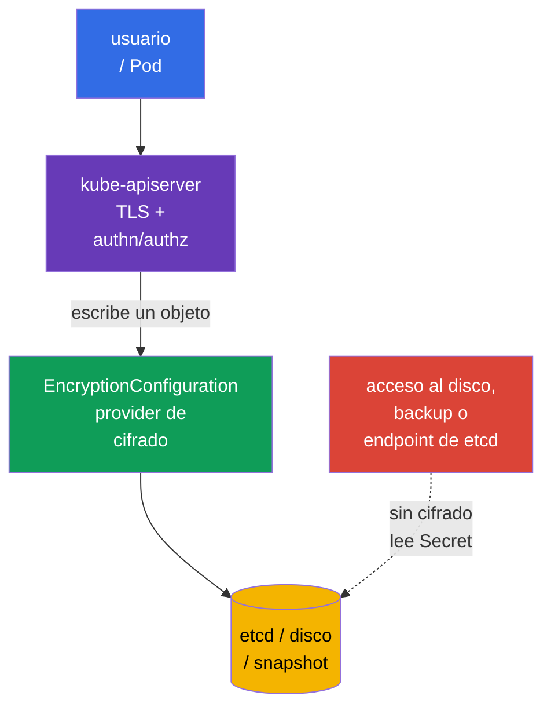
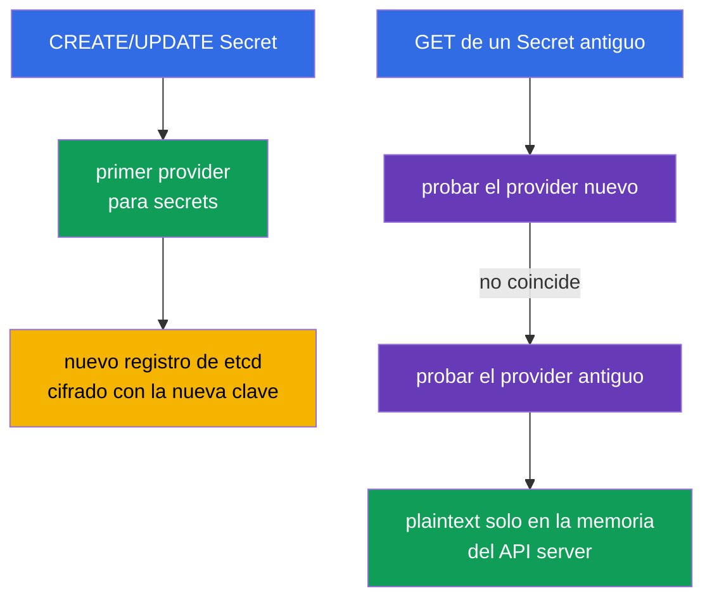
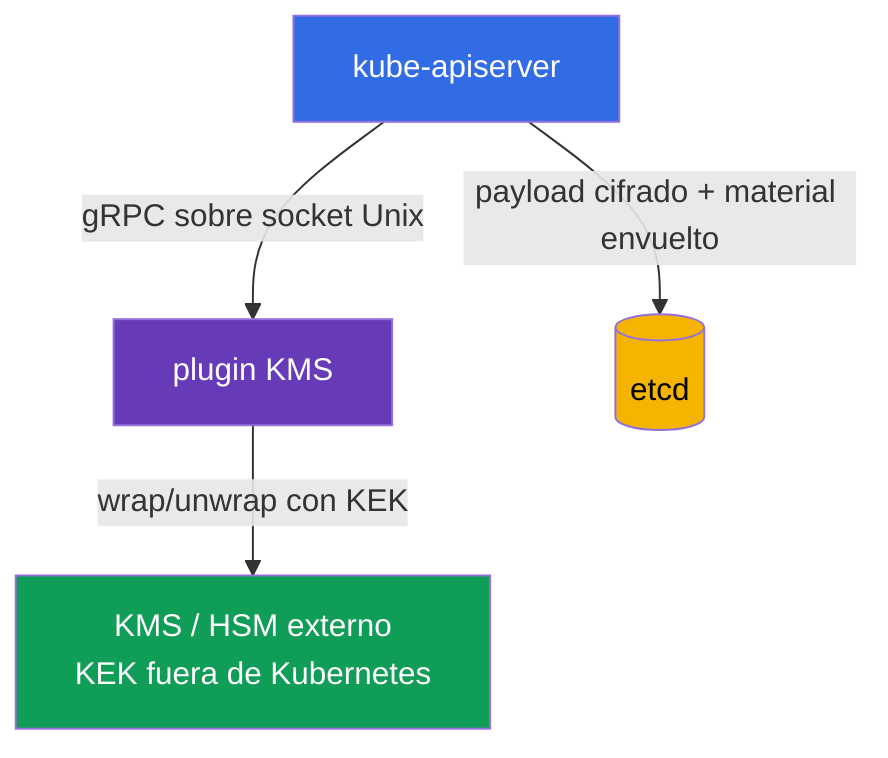
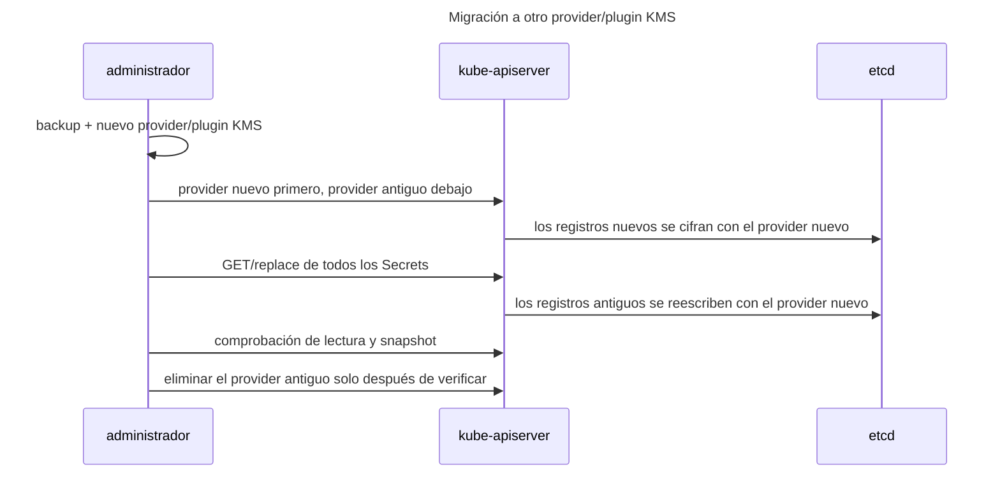

[Русская версия](ru.md) · [Eng version](README.md) · [Version française](fr.md) · [Deutsche Version](de.md) · [ქართული ვერსია](ge.md) · [繁體中文版](tw.md) · [日本語版](jp.md)

# Capítulo 21. Cifrado de datos en etcd y almacenamiento seguro de Secret

> **El problema.** Quien obtenga el disco del control plane, acceso a etcd, un snapshot o su backup
> evita RBAC, authentication y audit del API server y puede leer `Secret.data` si se guarda
> como base64 ordinario. Las contraseñas, tokens y claves privadas de una copia así permiten continuar
> un ataque fuera del clúster. Cifrar recursos de API seleccionados antes de escribirlos en etcd deja
> ciphertext en el almacenamiento y requiere acceso independiente al material de claves.

> **Qué sigue.** Un `Secret` es un objeto para datos sensibles, pero sus campos `data` solo están
> codificados en base64. Si no se habilita el cifrado en reposo, quien obtenga acceso a los datos de etcd,
> a un snapshot o a un backup puede leer la contraseña, el token y la clave privada. En este capítulo configuramos
> el cifrado de recursos de API seleccionados antes de escribirlos en etcd mediante `EncryptionConfiguration`, explicamos
> `aescbc`, `aesgcm`, `secretbox` y `kms`, la rotación segura de claves y la verificación del resultado. Es una continuación práctica
> del [Capítulo 19 de CKA sobre Secret](../../../cka/course/19/es.md) y de la relación de etcd con los datos del clúster del
> [Capítulo 37 de CKA](../../../cka/course/37/es.md).

> **Límite de protección.** `EncryptionConfiguration` cifra datos de API seleccionados antes de escribirlos en etcd.
> No es full-disk encryption ni cifra por sí mismo discos, un snapshot o un backup: un snapshot
> contiene valores cifrados de recursos protegidos, pero aun así exige protección independiente,
> control de acceso y, cuando sea necesario, cifrado del almacenamiento. El cifrado en reposo no cifra el tráfico entre
> un cliente y el API server (TLS lo hace), no sustituye RBAC ni protege frente a un usuario que ya
> puede ejecutar `get secret` o `exec` en un Pod con un secreto.

> 🧠 El acceso a etcd o a un snapshot evita API authentication, authorization y audit; base64 no protege `Secret.data`, mientras que el cifrado en reposo protege el almacenamiento sin las claves.

## 21.1. Modelo de amenazas: por qué etcd es un objetivo especialmente valioso

El API server es la vía habitual al estado de Kubernetes, mientras que etcd es su almacenamiento persistente. etcd contiene
> objetos de API: Secrets, ConfigMaps, ServiceAccounts, RBAC bindings, Deployments y mucho más.
> Por tanto, leer la base de datos o una copia de ella evita el punto de control habitual: el API server con
> authentication, authorization y audit.



Vías típicas de filtración:

- se compromete un control-plane node, su disco o el directorio de datos de etcd;
- un snapshot se envía a almacenamiento inseguro, se incluye en un ticket o CI artifact, o se copia a un portátil;
- alguien tiene acceso de red y TLS directamente a etcd;
- un backup se restaura en un entorno de pruebas con acceso más amplio;
- un Secret se imprime accidentalmente en un log, shell history, Git o una variable de entorno.

El cifrado de etcd no solucionará el último caso, pero dificulta considerablemente los cuatro primeros: la base de datos
guarda ciphertext y el material de claves no debe estar allí. Para CKS, no llegue a una conclusión errónea:
**base64 no es cifrado**; `kubectl get secret -o yaml` puede decodificarse sin una clave.

| Protección | Contra qué ayuda | Qué no hace |
|---|---|---|
| TLS para API server/etcd | intercepción de tráfico | no cifra los datos en disco |
| RBAC | restringe el acceso de API a un Secret | no protege un snapshot robado |
| Cifrado en reposo | ciphertext de datos de API seleccionados en etcd y su snapshot | no cifra por completo discos, un snapshot o un backup, ni oculta un Secret a un cliente de API autorizado |
| gestor de secretos externo | separa las master keys y el lifecycle del clúster | no sustituye RBAC, TLS ni un Pod seguro |

> 🧠 El primer provider coincidente cifra los registros nuevos; el API server lee los providers en orden.

## 21.2. Cómo funciona el cifrado de datos de API

`kube-apiserver` aplica la cadena de providers descrita en `EncryptionConfiguration`. Al **escribir**,
usa el primer provider que coincide con el recurso. Al **leer**, prueba los providers en orden
hasta que uno puede descifrar el valor existente. Al rotar una clave local en HA, primero agregue la nueva clave
en segundo lugar en cada API server, colóquela primera solo después de que la configuración nueva se aplique en todas partes y
conserve la clave anterior hasta completar el re-encryption.



Formato mínimo del archivo:

```yaml
apiVersion: apiserver.config.k8s.io/v1
kind: EncryptionConfiguration
resources:
- resources:
  - secrets
  providers:
  - aescbc:
      keys:
      - name: key1
        secret: <base64-encoded-32-byte-key>
  - identity: {}
```

`resources` enumera recursos de API, no namespaces. Por lo general, proteja primero `secrets`; cuando esté justificado,
puede agregar `configmaps`, CRD u otros recursos sensibles. No cifre todo a ciegas:
aumenta la carga, hace más compleja la recuperación y no sustituye la clasificación de datos.

Las entradas de `resources` se procesan en orden: una configuración coincidente anterior tiene
prioridad. No duplique el mismo recurso explícito en bloques independientes sin motivo ni
cree expresiones wildcard superpuestas. El siguiente patrón documentado es válido: una excepción más específica
va **antes** de un wildcard amplio; por ejemplo, para dejar `events` en plaintext y cifrar el resto:

```yaml
resources:
- resources:
  - events
  providers:
  - identity: {}
- resources:
  - '*.*'
  providers:
  - secretbox:
      keys:
      - name: key1
        secret: <base64-encoded-32-byte-key>
```

Aquí, `events` coincide con la primera entrada y nunca llega a `*.*`; colocar la regla específica antes del
wildcard es parte del límite de seguridad.

`identity: {}` no cifra nada. Al final de la cadena, permite leer registros antiguos en plaintext durante
la migración. Solo es peligroso para un registro nuevo cuando va primero: el primer provider determina el
formato de los registros nuevos. Una vez que todos los registros se han re-encrypted, se puede eliminar `identity`
si ya no se necesita fallback para los datos antiguos.

> **Dependencia crítica.** Una clave perdida, una clave eliminada antes del re-encryption o un KMS no disponible
> puede hacer que algunos objetos sean ilegibles e interrumpir el control plane. La configuración y las claves requieren
> backups, control de acceso y una rotación ensayada con antelación.

> 🎯 `identity` al final lee plaintext antiguo; primero deja sin cifrar los registros nuevos.

## 21.3. Providers: `aescbc`, `aesgcm`, `secretbox`, `kms` e `identity`

Kubernetes admite varios providers. No seleccione `identity` como única protección para production:
deshabilita deliberadamente el cifrado en reposo.

| Provider | Mecanismo | Cuándo es adecuado | Limitación principal |
|---|---|---|---|
| `identity` | plaintext | fallback temporal para datos antiguos | no cifra nada |
| `aescbc` | AES-CBC con padding PKCS#7 | mecanismo educativo/legacy; no se recomienda para configuraciones nuevas de production | débil: sin authentication/MAC integrada, son posibles los ataques padding-oracle; la clave se guarda en el control plane |
| `aesgcm` | AES-GCM, AEAD | solo con rotación automatizada | no se recomienda sin rotación; límite de 200 000 escrituras por clave |
| `secretbox` | XSalsa20 + Poly1305, AEAD | provider local sólido y rápido | la clave de 32 bytes se guarda en el control plane |
| `kms` | envelope encryption mediante un plugin KMS | production con un key manager/HSM/KMS en la nube externo | la disponibilidad del plugin/KMS se convierte en dependencia del API server |

> 🔬 AEAD, CBC, los límites de escritura y la ubicación de las claves determinan la elección del provider.

`aescbc` usa una clave AES codificada en base64; el ejemplo usa una clave de 32 bytes (AES-256).
Kubernetes acepta claves de 16, 24 o 32 bytes. A diferencia del provider AEAD `aesgcm`, `aescbc` no tiene
authentication/MAC integrada, por lo que la documentación actual de Kubernetes considera débil la variante CBC.
Este ejemplo es para la mecánica del examen y la compatibilidad, no como recomendación de production. Genere un
valor de 32 bytes para un lab de la siguiente manera:

```bash
head -c 32 /dev/urandom | base64
```

Ejemplo para `aescbc`:

```yaml
apiVersion: apiserver.config.k8s.io/v1
kind: EncryptionConfiguration
resources:
- resources:
  - secrets
  providers:
  - aescbc:
      keys:
      - name: secrets-aescbc-2026-08
        secret: <base64-encoded-32-byte-key>
  - identity: {}
```

`aesgcm` también usa AEAD: cifrado y verificación de integridad. La documentación actual de Kubernetes
establece un límite práctico para una clave AES-GCM: no más de 200 000 escrituras; rote la clave después.
Por ello, este provider es adecuado para un volumen controlado con rotación automatizada; para una tasa elevada de
escrituras de Secret, prefiera KMS o diseñe el lifecycle de claves con especial cuidado.

`secretbox` usa XSalsa20 y Poly1305, es un provider AEAD y requiere una clave de 32 bytes.
Kubernetes lo designa como una opción sólida y rápida. El lab siguiente usa `aescbc` para explicar el
mecanismo legacy y sus limitaciones; en production, la selección de un provider local debe tener en cuenta
los requisitos de rotación y almacenamiento de claves.

```yaml
apiVersion: apiserver.config.k8s.io/v1
kind: EncryptionConfiguration
resources:
- resources:
  - secrets
  providers:
  - aesgcm:
      keys:
      - name: secrets-aesgcm-2026-08
        secret: <base64-encoded-32-byte-key>
  - identity: {}
```

No coloque una clave real en Git, Helm values, Terraform state, un chat o un ticket. El archivo de configuración
que contiene una clave local debe ser accesible solo para root y el proceso del API server, por ejemplo:

```bash
# Cree el directorio padre de antemano: install no crea un directorio inexistente.
sudo install -d -o root -g root -m 0700 /etc/kubernetes/enc
sudo install -o root -g root -m 0600 encryption-config.yaml \
  /etc/kubernetes/enc/encryption-config.yaml
sudo stat -c '%U:%G %a %n' \
  /etc/kubernetes/enc \
  /etc/kubernetes/enc/encryption-config.yaml
```

Los proveedores locales `aescbc`/`aesgcm` protegen un snapshot de quien tenga solo el snapshot, pero no el
filesystem del control plane. Esta es una base útil, pero la clave reside en la misma máquina de confianza.
Use `kms` para separar responsabilidades y proporcionar un lifecycle de claves duradero.

> 🎯 Kube-apiserver recibe `--encryption-provider-config` con una ruta accesible mediante un mount; verifique la disponibilidad y la lectura de un Secret a través de la API.

## 21.4. Conectar `EncryptionConfiguration` a kube-apiserver

El archivo por sí mismo no cambia nada. El API server debe recibir el flag
`--encryption-provider-config=<path>`. En un clúster kubeadm, `kube-apiserver` es un static Pod; su
manifest suele estar en `/etc/kubernetes/manifests/kube-apiserver.yaml`. kubelet detecta el cambio del manifest
y reinicia el API server.

```yaml
# /etc/kubernetes/manifests/kube-apiserver.yaml (fragmentos)
spec:
  containers:
  - name: kube-apiserver
    command:
    - kube-apiserver
    - --encryption-provider-config=/etc/kubernetes/enc/encryption-config.yaml
    volumeMounts:
    - name: encryption-config
      mountPath: /etc/kubernetes/enc
      readOnly: true
  volumes:
  - name: encryption-config
    hostPath:
      path: /etc/kubernetes/enc
      # El directorio se preparó arriba; Directory no oculta un error tipográfico con un directorio vacío.
      type: Directory
```

La ruta del flag es visible **desde dentro del contenedor del API server**, por lo que un archivo solo en el host
no basta: use `hostPath` y `volumeMount`. Verifique la indentación de YAML y los nombres de volúmenes existentes; no
reemplace el manifest completo por una plantilla. En un control plane HA, el mismo archivo protegido y el flag
deben estar presentes en cada API server node, y el cambio debe desplegarse un node a la vez mientras se
supervisan la salud y el quorum.

Orden de trabajo práctico:

1. Cree y verifique un snapshot de etcd reciente; el procedimiento está en el [Capítulo 37 de CKA](../../../cka/course/37/es.md).
2. Genere una clave fuera del shell history y guarde la configuración con el modo `0600` en una ruta protegida.
3. Agregue el volumen, el mount y `--encryption-provider-config` al manifest del API server.
4. Espere a que el static Pod se reinicie y verifique `kubectl get --raw='/readyz?verbose'`.
5. Cree un Secret de prueba, confirme que la API puede leerlo y luego vuelva a cifrar todos los registros antiguos.

```bash
# Verifique el flag y el mount en el manifest del static Pod en ejecución.
sudo grep -n -- '--encryption-provider-config\|encryption-config' \
  /etc/kubernetes/manifests/kube-apiserver.yaml

# El API server vuelve a estar listo después del cambio del manifest.
kubectl get --raw='/readyz?verbose'
kubectl -n kube-system get pods -l component=kube-apiserver
```

> **Precaución.** Un error en una ruta, YAML o clave puede impedir que el API server se inicie. Trabaje mediante
> la consola del control-plane node, conserve un backup del manifest y no elimine la configuración anterior
> hasta completar la verificación. En Kubernetes gestionado, no edite un static Pod: habilite el cifrado mediante
> el mecanismo admitido por el proveedor y siga su procedimiento de KMS/actualización del clúster.

> 🏭 KMS separa el KEK, pero el plugin y el key manager requieren HA, permisos mínimos y una restauración verificada.

## 21.5. KMS y envelope encryption

El provider `kms` conecta el API server a un plugin KMS local mediante un socket Unix; el plugin se comunica
con un KMS/HSM externo donde se almacena la key encryption key (KEK). `EncryptionConfiguration` no contiene
ningún KEK. KMS v1 y v2 usan envelope encryption, pero obtienen la data encryption key (DEK) de forma diferente,
por lo que no pueden describirse con una única secuencia.



Fragmento conceptual de KMS **v2**:

```yaml
apiVersion: apiserver.config.k8s.io/v1
kind: EncryptionConfiguration
resources:
- resources:
  - secrets
  providers:
  - kms:
      apiVersion: v2
      name: production-kms
      endpoint: unix:///var/run/kmsplugin/socket.sock
      timeout: 3s
  - identity: {}
```

Deben explicitarse las diferencias:

| Propiedad | KMS v1 | KMS v2 |
|---|---|---|
| Estado | deprecated desde Kubernetes 1.28; deshabilitado por defecto desde 1.29 y exige `--feature-gates=KMSv1=true` explícito | estable desde Kubernetes 1.29; API recomendada para configuraciones nuevas |
| DEK | una DEK aleatoria nueva para cada operación de cifrado; el plugin envuelve cada DEK con el KEK | el API server almacena una seed secreta y usa una KDF para derivar una DEK de un solo uso para cada operación; la seed se envuelve con el KEK y cambia al rotar el KEK |
| Campos de configuración | `apiVersion: v1` o el campo está ausente; `name`, `endpoint`, `cachesize`, `timeout` | `apiVersion: v2`, `name`, `endpoint`, `timeout`; `cachesize` no está permitido |
| Rendimiento | más llamadas gRPC/KMS; la caché almacena DEK sin envolver | no hay llamada KMS para envolver una DEK individual en cada escritura |
| Identificación de clave | depende del plugin v1 | `Status` devuelve `version: v2`, `healthz: ok` y el `key_id` del KEK actual |

> **Límite de versión de esta tabla.** En la fecha de verificación, **2026-09-15**, KMS v1 seguía existiendo en el snapshot de examen v1.35, pero está deprecated y deshabilitado por defecto; la compatibilidad legacy exige un feature gate explícito. No lo use para configuraciones nuevas y consulte la documentación de KMS de su versión minor.

En v2, etcd almacena el payload cifrado y material suficiente para que el API server obtenga una DEK de un solo uso
a partir de la seed protegida; no es un modelo en el que el plugin emite una nueva DEK envuelta para cada
escritura. Al rotar `key_id`, el API server obtiene una seed nueva, la protege con el KEK nuevo y
la usa para las escrituras posteriores. Los datos antiguos se reescriben mediante un procedimiento independiente y controlado
de re-encryption.

Los campos exactos y la versión de API disponible dependen de la versión de Kubernetes y del plugin seleccionado. Consulte
la documentación oficial de su versión y el despliegue del plugin; no copie en production un ejemplo arbitrario de KMS v1/v2.
El socket debe estar disponible para el contenedor del API server mediante un volume mount explícito y el acceso a él debe
estar restringido. El propio plugin debe usar TLS/authentication con el gestor remoto, tener permisos KMS mínimos y
no imprimir plaintext en los logs.

Dos mecanismos operativos son útiles para KMS. El flag
`--encryption-provider-config-automatic-reload=true` hace que el API server vuelva a leer la
configuración sin reiniciarse (útil para la rotación de claves). La salud del plugin se comprueba mediante el endpoint
`/healthz/kms-providers` y `/healthz` general; con la recarga automática, las comprobaciones individuales de salud
se combinan en una sola. El API server consulta `Status` de KMS v2 aproximadamente una vez por minuto cuando está sano y con más
frecuencia ante errores. La caché no convierte al plugin/KEK en una dependencia opcional: su falta de disponibilidad puede
impedir el inicio/calentamiento de la caché, el descifrado de material aún no revelado, la rotación de KEK/`key_id` y la restauración
de snapshots. El plugin y el gestor remoto deben tener HA, y la restauración exige el mismo KEK o una migración documentada.

KMS mejora la separación de secretos, pero agrega requisitos operativos:

- Para KMS v1, el plugin/KMS está mucho más cerca de la ruta síncrona de datos: las DEK nuevas se envuelven mediante
  KMS y un fallo de caché exige unwrap. Para KMS v2, el API server deriva localmente DEK de un solo uso a partir
  de una seed protegida, por lo que no llama al KMS remoto en cada lectura/escritura ordinaria de API. El plugin y
  el gestor siguen siendo críticos para el inicio/calentamiento de la caché, el descifrado sin caché, la rotación de claves y
  la recuperación; supervise la salud de `Status`, la estabilidad de `key_id`, la latencia de `EncryptRequest`/
  `DecryptRequest`, los errores, la disponibilidad, la cuota y la duración de las credenciales;
- diseñe el plugin y el KMS para HA: son una dependencia crítica, por lo que la indisponibilidad del plugin/KEK
  puede provocar fallos al leer y escribir recursos cifrados; verifique anticipadamente el proceso de recuperación;
- haga backup de los metadatos y documente los ID de claves, pero **no** exporte master keys a un backup de etcd;
- restrinja IAM/ACL: el API server recibe solo las operaciones encrypt/decrypt requeridas, mientras que un administrador
  del clúster no recibe necesariamente permisos para gestionar el KEK;
- pruebe la restauración de snapshots con acceso a la misma clave KMS antes de un incidente.

Un KMS externo no implica que un Secret deje de aparecer en Kubernetes. Si una aplicación recibe un
Kubernetes Secret ordinario, plaintext sigue disponible para quienes están autorizados mediante la API o un Pod. Use
Vault Agent, Secrets Store CSI Driver o External Secrets Operator para entregar secretos mediante una identidad de corta duración,
pero compruebe cuidadosamente su RBAC y sincronización: un operator que crea un Kubernetes Secret
vuelve a colocar una copia en etcd.

> 🎯 Nuevo key/provider primero conservando el antiguo → reescriba objetos → verifique lectura/almacenamiento → elimine la clave antigua.

## 21.6. Rotación de providers y re-encryption de datos existentes

Cambiar la configuración no basta. Un provider nuevo se aplica solo a objetos **nuevos o actualizados**;
los registros antiguos permanecen cifrados con la clave anterior o en plaintext. Por tanto, la rotación segura siempre tiene
dos acciones distintas: primero asegure que los datos antiguos se pueden leer y que los nuevos se escriben con la clave nueva; después,
reescriba los objetos existentes.

### Rotación de una clave `aescbc`/`aesgcm`

Suponga que inicialmente se usó `key-old`. En un control plane HA, no coloque inmediatamente `key-new` primero:
un API server ya actualizado puede escribir un objeto con la clave nueva mientras otro API server aún no puede
descifrarlo. Rote en dos fases.

1. Agregue `key-new` **segundo** después de `key-old` en la configuración de cada control-plane node.
2. Reinicie el API server o vuelva a cargar la configuración en **todos** los API servers. Cada uno puede ahora descifrar ambas
   claves, mientras los registros nuevos siguen usando `key-old`.
3. Coloque `key-new` **primero**, conservando `key-old` segundo, y aplique de nuevo la configuración a todos los API
   servers. Solo ahora se crean registros nuevos con `key-new`.

Fase 1: clave nueva segunda en todos los API servers:

```yaml
apiVersion: apiserver.config.k8s.io/v1
kind: EncryptionConfiguration
resources:
- resources:
  - secrets
  providers:
  - aescbc:
      keys:
      - name: key-old-2026-01
        secret: <old-base64-32-byte-key>
      - name: key-new-2026-08
        secret: <new-base64-32-byte-key>
  - identity: {}
```

Fase 2: después de aplicar la fase 1 en cada API server, coloque primero la clave nueva:

```yaml
apiVersion: apiserver.config.k8s.io/v1
kind: EncryptionConfiguration
resources:
- resources:
  - secrets
  providers:
  - aescbc:
      keys:
      - name: key-new-2026-08
        secret: <new-base64-32-byte-key>
      - name: key-old-2026-01
        secret: <old-base64-32-byte-key>
  - identity: {}
```

Después de aplicar la fase 2 en todos los API servers, reescriba todos los Secrets. El comando siguiente obtiene cada
objeto y lo envía de vuelta a través de la API; precisamente el provider nuevo en primera posición cifra la escritura.
Antes de una operación masiva, cree un snapshot y comience con un namespace de prueba.

```bash
# Reescriba todos los Secrets mediante el API server.
kubectl get secrets --all-namespaces -o json | kubectl replace -f -

# Si ConfigMaps están protegidos, reescríbalos en una operación independiente y deliberada.
# kubectl get configmaps --all-namespaces -o json | kubectl replace -f -
```

> 🔬 Storage Version Migration reescribe el almacenamiento en bloque y requiere un despliegue operativo/de feature independiente.

### Extensión de production: Storage Version Migration

Para reescrituras masivas en production, existe una alternativa nativa de Kubernetes: **Storage Version
Migration**. En Kubernetes 1.36, es beta y está deshabilitada por defecto; después de habilitarla explícitamente y
configurarla según la documentación de su versión, la migración reescribe objetos mediante la ruta de almacenamiento de API.
Es adecuada, en particular, para el re-encryption después de cambiar `EncryptionConfiguration` o claves. Para CKS,
basta comprender el orden de los providers y la reescritura forzada de objetos; el `kubectl replace` anterior sigue siendo una
ruta sencilla para el examen, mientras que Storage Version Migration requiere un despliegue operativo independiente,
observabilidad y un proceso de rollback/recuperación probado.

> 🏭 **Upstream v1.37.** En Kubernetes v1.37, la API/controller integrada de `StorageVersionMigration` pasó a GA y se habilitó por defecto. Esto cambia el estado actual de production, pero no el flujo CKS Core de este capítulo, que permanece ligado al contexto del examen/formación. Consulte [Delta de seguridad de Kubernetes v1.37](../APPENDIX_K8S_137_SECURITY_DELTA.md).

`kubectl replace` requiere un `resourceVersion` actual; una alta contención puede causar conflictos.
En production, ejecute un script controlado con reintentos, observación de latencia de API y una ventana coordinada,
en lugar de pegar a ciegas el comando en CI. No escriba JSON que contenga Secrets en el disco ni en un log de pipeline.

Después de completar el re-encryption y la verificación de claves, elimine `key-old` de la configuración, reinicie el API
server y vuelva a verificar la lectura. No elimine la clave antigua antes de reescribir los objetos: un snapshot restaurado
o un registro antiguo se volverá ilegible.

### Migrar de `identity` a cifrado

Para un clúster antiguo, el comienzo es similar: coloque primero el provider de cifrado nuevo, conserve `identity`
al final y después reescriba los recursos.

```yaml
providers:
- aesgcm:
    keys:
    - name: key-2026-08
      secret: <base64-encoded-32-byte-key>
- identity: {}
```

Después de volver a cifrar los registros antiguos, se puede eliminar `identity: {}`. Conservarlo debajo es aceptable solo
como elección temporal explícita por compatibilidad; no considere la presencia de `identity` prueba de que todos los datos están protegidos.

> 🏭 La rotación de KEK y el cambio de provider son diferentes; conserve la capacidad de descifrar datos antiguos hasta verificar la restauración.

### Rotación de un KEK de KMS v2

La rotación rutinaria de KEK remoto en KMS v2 ocurre **dentro del KMS/plugin externo**. El plugin informa el
`key_id` público actual mediante `Status`; el API server trata este ID como autoritativo. Cuando `key_id` cambia,
el API server obtiene una seed nueva protegida por el KEK nuevo y la usa para el cifrado posterior. Para esta rotación
normal de KEK, no agregue un segundo provider `kms`, no cambie el orden de providers ni reinicie el API server solo para cambiar el KEK.

Cuando está sano, el API server consulta `Status` aproximadamente una vez por minuto y puede usar el último estado válido durante
unos tres minutos. Por tanto, no inicie el re-encryption inmediatamente después de la rotación: primero confirme
que cada API server ve el `key_id` nuevo y estable, y que el plugin no alterna entre IDs. Después, reescriba los objetos
requeridos mediante la API si el almacenamiento debe pasar al KEK nuevo. Upstream recomienda rotar un KEK de KMS v2
al menos cada 90 días. El flujo exacto y la observabilidad dependen del plugin y del KMS externo.

### Migración a otro provider/plugin KMS

Esto **no** es una rotación rutinaria de KEK. Si el clúster realmente se mueve a otro
provider, plugin o endpoint KMS configurado, coloque primero el provider `kms` nuevo y conserve el antiguo debajo para el descifrado;
después reescriba los datos mediante la API y retire el provider/plugin antiguo solo tras la verificación.



> 🎯 Demuestre la configuración del API server, la lectura autorizada de Secret y la ausencia de un marcador plaintext en el valor raw de etcd.

## 21.7. Verificación: API, configuración y etcd

No verifique únicamente que el archivo existe. Debe demostrar tres hechos: el API server usa realmente el
flag, el Secret sigue siendo accesible mediante la API y etcd no contiene plaintext. Realice la última
comprobación solo en un clúster de lab aislado o mediante un procedimiento acordado: el acceso directo a etcd requiere
privilegios y puede revelar datos reales.

Primero, cree un Secret canary inocuo con un valor único que sea fácil de buscar:

```bash
kubectl -n default create secret generic encryption-check \
  --from-literal=probe='not-a-real-secret-rotate-me'
kubectl -n default get secret encryption-check \
  -o jsonpath='{.data.probe}' | base64 -d; echo
```

La segunda salida demuestra el funcionamiento normal de la API, pero no demuestra el cifrado en reposo: el API server debe
descifrar los datos para un cliente autorizado. Después, verifique el manifest, la disponibilidad y el log del API server:

```bash
sudo grep -n -- '--encryption-provider-config' \
  /etc/kubernetes/manifests/kube-apiserver.yaml
kubectl get --raw='/readyz?verbose'
kubectl -n kube-system logs kube-apiserver-$(hostname) --tail=100
```

El nombre del static Pod puede diferir de `$(hostname)`; obténgalo primero con `kubectl -n kube-system
get pods -l component=kube-apiserver`. No imprima logs de production en una ubicación desprotegida: los datos de diagnóstico
pueden contener nombres de objetos y errores de acceso.

Para un clúster de formación autogestionado, puede obtener el valor directamente con `etcdctl` y confirmar que
el marcador está ausente de los bytes de respuesta. Los parámetros TLS siguientes son un ejemplo típico de kubeadm:
primero compare el endpoint y las rutas de CA y cert/key con el manifest de etcd **actual**. La comprobación es
fail-closed: PASS solo es posible si `etcdctl` leyó un valor no vacío para la clave requerida, `strings`
terminó correctamente y no se encontró el marcador.

```bash
(
  set -euo pipefail
  raw_file="$(mktemp)"
  trap 'rm -f "$raw_file"' EXIT

  # Sustituya el endpoint y las rutas TLS por valores del manifest de etcd actual.
  if ! ETCDCTL_API=3 etcdctl get /registry/secrets/default/encryption-check \
    --endpoints=https://127.0.0.1:2379 \
    --cacert=/etc/kubernetes/pki/etcd/ca.crt \
    --cert=/etc/kubernetes/pki/etcd/server.crt \
    --key=/etc/kubernetes/pki/etcd/server.key \
    --print-value-only >"$raw_file"; then
    echo 'ERROR: etcdctl could not read the canary object' >&2
    exit 1
  fi

  if [ ! -s "$raw_file" ]; then
    echo 'ERROR: etcd key is absent or has an empty value' >&2
    exit 1
  fi

  # grep=1 significa que no se encontró el marcador; no lo confunda con un error de etcdctl/strings.
  set +e
  strings "$raw_file" | grep -Fq 'not-a-real-secret-rotate-me'
  status=("${PIPESTATUS[@]}")
  set -e

  if [ "${status[0]}" -ne 0 ]; then
    echo 'ERROR: strings could not inspect the etcd value' >&2
    exit 1
  elif [ "${status[1]}" -eq 0 ]; then
    echo 'FAIL: plaintext marker is present in etcd' >&2
    exit 1
  elif [ "${status[1]}" -ne 1 ]; then
    echo 'ERROR: plaintext verification failed unexpectedly' >&2
    exit 1
  fi

  echo 'OK: etcd value was read and plaintext marker was not found'
)
```

Para datos antiguos, realice esta prueba después del re-encryption. Los datos de etcd suelen tener un prefijo de formato
de encryption-provider; no construya una comprobación alrededor de un formato interno que depende de la versión de Kubernetes.

Después de la prueba, elimine el Secret canary y verifique que se ha conservado el runbook de backup/restore:

```bash
kubectl -n default delete secret encryption-check
```

| Qué verificar | Resultado esperado |
|---|---|
| Manifest del API server | contiene `--encryption-provider-config` y un mount correcto de solo lectura |
| disponibilidad | `/readyz?verbose` tiene éxito tras el reinicio |
| lectura de Secret mediante API | `kubectl get` autorizado devuelve el valor original |
| comprobación de etcd en lab | el marcador plaintext único no se encuentra en el valor raw almacenado |
| después de la rotación | un Secret creado antes de la rotación es legible y reescrito por el provider nuevo |
| backup/restore | el snapshot es accesible de forma segura y las claves/KMS necesarias están disponibles durante la restauración |

> 🏭 El cifrado en reposo no reemplaza RBAC, TLS, la higiene de Secret ni los backups; gestione por separado las claves, la disponibilidad de KMS y la restauración.

## 21.8. Cómo se aplica esto en production

El cifrado en reposo es una capa. Una protección útil se construye con varias barreras independientes.

- **RBAC de mínimo privilegio.** No conceda `get`, `list` ni `watch` sobre `secrets` a grupos amplios. `list` y
  `watch` también devuelven contenidos de Secret. Restrinja por separado `pods/exec`, `pods/attach` y
  `pods/ephemeralcontainers`: un shell en un workload suele proporcionar una vía a un Secret montado.
- **No pase un Secret mediante env salvo que sea necesario.** Prefiera un volume/CSI mount de solo lectura;
  las variables de entorno terminan fácilmente en la salida de depuración, un crash dump, un proceso hijo o un log.
- **No haga commit de plaintext.** `stringData` es práctico, pero es plaintext en Git. Use SOPS, Sealed
  Secrets o integración GitOps con un gestor de secretos externo; habilite el escaneo pre-commit y del lado del servidor.
- **Vida corta y rotación.** Rote una contraseña de base de datos, token de API, certificado y credencial
  de la nube. Actualizar un Kubernetes Secret no significa que una aplicación lo vuelva a leer automáticamente:
  env no se actualiza, mientras que un file mount se actualiza con retraso; la aplicación debe poder reload/restart.
- **Limite la superficie de API.** No imprima `kubectl get secret -o yaml`, valores decodificados ni credenciales KMS
  en un log de CI. Revoque en el origen un secreto publicado accidentalmente en vez de limitarse a eliminar
  la línea del historial de Git.
- **Proteja los backups.** Un snapshot de etcd cifrado sigue siendo sensible: almacénelo por separado,
  cifre el almacenamiento, establezca retención, MFA/ACL y una restauración verificada. Guarde la clave secreta o el acceso KMS
  por separado del snapshot.

External Secrets Operator, Vault, Secrets Manager de nube y Secrets Store CSI Driver resuelven problemas
diferentes. El primero suele sincronizar un valor externo en un Kubernetes Secret: práctico, pero queda una copia
en etcd que debe cifrarse. CSI/Vault Agent puede entregar un secreto a un Pod como archivo sin un
Kubernetes Secret persistente: menos copias en etcd, pero surgen límites de confianza alrededor del node plugin,
la identidad del Pod y el backend externo. Elija un patrón después de un modelo de amenazas, no solo porque una herramienta
“cifra secretos”.

## 21.9. Errores comunes y diagnóstico

| Síntoma | Causa probable | Respuesta segura |
|---|---|---|
| El API server no está Ready después de una edición | YAML no válido, config/mount/socket no disponible, clave no válida | restaure un manifest verificado mediante la consola; lea el log local de kubelet/API |
| Un Secret se puede leer mediante `kubectl` | esto es normal | la API descifra para un cliente autorizado; verifique etcd raw solo en un lab |
| Un Secret antiguo no se puede leer tras la rotación | la clave/provider antiguo se eliminó demasiado pronto | restaure el provider/clave antiguo desde un backup protegido y después vuelva a cifrar |
| Un registro nuevo sigue en plaintext | `identity` va primero o el flag no se aplica | compruebe el orden de providers, el manifest, el reinicio y la creación de un canary nuevo |
| Una escritura de API se bloquea/falla | el plugin KMS o KMS externo no está disponible/es lento | compruebe socket, TLS, salud de KMS, timeout y HA; no debilite la seguridad a ciegas |
| Se encuentra un Secret en Git/log | el cifrado en reposo no puede ayudar | rote inmediatamente la credencial original, restrinja el acceso y elimine el artefacto siguiendo el procedimiento de IR |

> 🏭 **Caso límite de recuperación de Kubernetes v1.37.** Existe una ruta Beta insegura de force-delete (`AllowUnsafeMalformedObjectDeletion`) para un objeto de API ilegible/corrupto. Es una operación con potencial de romper el clúster y un último mecanismo de recuperación, no una forma normal de corregir la rotación de cifrado. Para detalles y limitaciones, consulte [Delta de seguridad de Kubernetes v1.37](../APPENDIX_K8S_137_SECURITY_DELTA.md).

En el examen, identifique primero el tipo de clúster. Para kubeadm, busque el manifest del API server y las rutas TLS de etcd.
Para un control plane gestionado, los ajustes pueden no estar disponibles: no intente editar
`/etc/kubernetes/manifests` inexistente; use el cifrado KMS admitido por el proveedor y confirme su estado.

## 21.10. Miniglosario

- **Cifrado en reposo** - cifrado de datos de API seleccionados antes de escribirlos en etcd; no es
  cifrado del disco, snapshot o backup en su conjunto.
- **EncryptionConfiguration** - configuración de providers que kube-apiserver lee para recursos de API
  seleccionados.
- **provider** - mecanismo de cifrado/descifrado para recursos de API específicos.
- **`aescbc`** - provider AES-CBC local con padding PKCS#7 y una clave de la configuración; sin
  authentication/MAC integrada, por lo que es débil.
- **`aesgcm`** - provider AES-GCM AEAD; las claves deben rotarse teniendo en cuenta el límite de escrituras.
- **`secretbox`** - provider XSalsa20 + Poly1305 AEAD con una clave de 32 bytes.
- **`kms`** - provider que delega operaciones criptográficas a un plugin KMS externo.
- **envelope encryption** - un objeto se cifra con una DEK, mientras que la DEK se protege con un KEK externo.
- **KEK/DEK** - key encryption key / data encryption key.
- **re-encryption** - reescritura de objetos de API antiguos mediante un provider/clave nuevo.
- **`identity`** - provider sin cifrado; permitido solo como fallback temporal deliberado.

## 21.11. Resumen del capítulo

- etcd almacena Secrets y una parte sustancial del estado de Kubernetes; base64 no protege este contenido.
- `EncryptionConfiguration` se aplica mediante el flag de kube-apiserver `--encryption-provider-config`; el primer
  provider se usa para los registros nuevos, mientras los providers se prueban en orden para las lecturas.
- `aescbc`, `aesgcm` y `secretbox` son opciones locales con una clave en un archivo protegido; `kms` permite
  mover el KEK a un gestor externo y usar envelope encryption.
- En HA, rote una clave local en este orden: backup -> clave nueva segunda en todos los API servers -> aplique la
  configuración en todas partes -> clave nueva primera en todos los API servers -> vuelva a aplicar la configuración ->
  vuelva a cifrar los objetos antiguos -> comprobaciones -> elimine la clave antigua.
- Verifique la configuración, la salud de API, las lecturas de API y la ausencia de plaintext canary en un valor raw de etcd de lab.
- Complemente el cifrado en reposo con RBAC, TLS, higiene de secretos, backups seguros y un gestor de secretos externo.

## 21.12. Cómo ayuda esto: en el examen y en el trabajo real

**En CKS.** Una tarea puede requerir encontrar Secrets sin cifrar, habilitar el cifrado en reposo,
identificar el `--encryption-provider-config` correcto, explicar el orden de providers o rotar sin
romper un Secret. Un algoritmo rápido: encuentre el manifest del API server, cree una config y un mount seguros, agregue
el flag, espere la salud, reescriba los objetos y compruebe etcd. No responda “un Secret está cifrado con
base64”: eso es incorrecto.

**En production.** Trate el cifrado en reposo como una base estándar del control plane, no como la medida
final. Gestione las claves por separado de los backups de etcd, automatice la rotación, supervise KMS, pruebe la
restauración y minimice el número de personas, identidades y Pods que pueden ver plaintext. Cambie la configuración
del API server mediante un procedimiento de cambio con rollback y backup.

## 21.13. Preguntas de autoevaluación

<details>
<summary>1. ¿Por qué base64 en el campo `Secret.data` no protege un secreto frente al propietario de un snapshot de etcd?</summary>

Base64 es codificación, no cifrado: `kubectl get secret -o yaml` puede decodificarse sin una clave. El propietario de un snapshot de etcd obtiene el estado de API almacenado mientras evita API server authentication, authorization y audit. El cifrado en reposo cambia esto al almacenar ciphertext para recursos seleccionados.
</details>

<details>
<summary>2. ¿Qué registros protege el cifrado en reposo y qué amenazas no elimina?</summary>

`EncryptionConfiguration` cifra datos de API seleccionados antes de escribirlos en etcd, como Secrets, y ciphertext entra en el snapshot. No cifra un disco, snapshot o backup en su conjunto, no protege el tráfico TLS y no oculta un Secret a una identidad con `get secret` o `exec` en un Pod. RBAC, TLS y la protección de backups siguen siendo controles independientes.
</details>

<details>
<summary>3. ¿Cómo elige el API server un provider al escribir y al leer un registro antiguo?</summary>

Al escribir, el API server usa el primer provider que coincide con el recurso. Al leer, prueba los providers en orden hasta que uno descifra el valor existente. Esto es precisamente lo que permite conservar la clave antigua debajo de la nueva durante la rotación.
</details>

<details>
<summary>4. ¿Por qué `identity` es aceptable al final de una cadena de migración, pero no como primer provider?</summary>

`identity` no cifra nada, pero al final de la cadena permite leer registros antiguos en plaintext durante la migración. Es peligroso primero porque el primer provider determina el formato de los registros nuevos, que permanecerán en plaintext. Tras el re-encryption, `identity` puede eliminarse si ya no se necesita fallback.
</details>

<details>
<summary>5. ¿Cuál es la diferencia operativa entre `aescbc`/`aesgcm` locales y `kms`?</summary>

Para los providers locales, la clave está en un archivo de configuración protegido del control plane: esto protege un snapshot sin el filesystem del node, pero no separa esos secretos. `kms` usa envelope encryption mediante un plugin de socket Unix y un KEK/HSM externo, lo que mejora la separación de responsabilidades. A cambio, el plugin y el gestor externo se convierten en una dependencia crítica para lectura, escritura, rotación y restauración.
</details>

<details>
<summary>6. ¿Por qué no se puede eliminar la clave antigua inmediatamente después de agregar la nueva?</summary>

Los objetos antiguos aún pueden estar en plaintext o cifrados con la clave antigua, mientras que el provider nuevo se aplica solo a registros nuevos/actualizados. En HA, cada API server primero debe poder leer ambas claves; después la nueva pasa a ser primera y los objetos se reescriben. Eliminar la clave antigua antes del re-encryption vuelve ilegibles algunos registros o un snapshot restaurado.
</details>

<details>
<summary>7. ¿Cómo se puede demostrar que un Secret antiguo ha pasado realmente por re-encryption?</summary>

Después de colocar primero el provider nuevo, reescriba el Secret antiguo mediante la API, por ejemplo con `kubectl get secrets --all-namespaces -o json | kubectl replace -f -`, comenzando con un namespace de prueba. Después verifique la lectura por API y, en un lab aislado, inspeccione el valor canary raw de etcd: no debe encontrarse un marcador plaintext único mediante `strings | grep`. Elimine la clave/provider antiguo solo tras esa verificación.
</details>

<details>
<summary>8. ¿Qué acciones de Pod pueden evitar una prohibición sobre `get secrets` y por qué?</summary>

Permisos amplios de `pods/exec`, `pods/attach` o `pods/ephemeralcontainers` pueden proporcionar un shell en un workload donde un Secret está montado o disponible para la aplicación. Entonces la identidad no necesita leer directamente el Secret mediante la API de Kubernetes para ver plaintext. Por tanto, restrinja también estos subrecursos con RBAC de mínimo privilegio.
</details>

<details>
<summary>9. ¿Qué debe verificarse para restaurar un snapshot de etcd cifrado?</summary>

Almacene y restaure el snapshot mediante un procedimiento seguro, pero compruebe también la disponibilidad de las claves locales requeridas o del mismo KEK/plugin KMS. Pruebe la restauración anticipadamente, documente los ID de claves y proteja el snapshot por separado con ACL, cifrado del almacenamiento y retención. No exporte master keys a un backup de etcd.
</details>

<details>
<summary>10. **Retrospectiva (Capítulo 14).** El cifrado en reposo protege un Secret específicamente en etcd. Tras montarlo, kubelet proporciona el Secret a un Pod mediante un **volumen respaldado por tmpfs**: esto excluye una copia ordinaria en disco persistente, pero no da una garantía incondicional de que “nunca llegará al disco”. Con swap habilitado, Kubernetes v1.36 monta volúmenes respaldados por memoria con `noswap` si el kernel admite la opción (oficialmente desde Linux 6.3 o con un backport); de lo contrario, kubelet advierte que ese volumen, incluido un Secret, puede enviarse a swap. En esos nodes, deshabilite swap o asegúrese de que está cifrado y compruebe la advertencia de kubelet. ¿Qué medidas del Capítulo 14 (host footprint, host de mínimo privilegio) limitan el riesgo para el secreto en esta fase, cuando ya está descifrado y disponible mediante tmpfs para un proceso autorizado en el node, y por qué el compromiso del host o un workload privilegiado en el mismo node sigue siendo una amenaza seria incluso sin una copia en disco persistente?</summary>

Reduzca el host footprint: deshabilite servicios y paquetes innecesarios, cierre puertos de escucha no necesarios y actualice el node pronto para reducir las vías hacia el compromiso del host. Un host de mínimo privilegio limita quién tiene acceso SSH/sudo y kubelet/runtime, mientras que un workload no debe recibir `privileged`, host namespaces ni hostPath. tmpfs y `noswap` reducen el riesgo de disco persistente, pero root en el node o un workload vecino privilegiado aún puede acceder a la memoria, el runtime o el secreto montado.
</details>

## Práctica

Antes de trabajar en production, complete el lab en un clúster separado: cree una
`EncryptionConfiguration`, agregue el flag y el mount del API server, cifre un Secret, rótelo y
confirme el resultado mediante etcd. Mantenga acceso a la consola del control plane y un snapshot reciente: un error
en un manifest de static Pod puede privar temporalmente al clúster de su API.

🧪 Lab 109 (EncryptionConfiguration, cifrado de Secret en etcd y verificación):
[tasks/cks/labs/109](../../labs/109/README_ES.MD)

🌐 Práctica interactiva adicional (killer.sh/killercoda, recurso externo): [secret-pod-access](https://killercoda.com/killer-shell-cks/scenario/secret-pod-access) · [secret-read-secrets](https://killercoda.com/killer-shell-cks/scenario/secret-read-secrets) · [secret-serviceaccount-pod](https://killercoda.com/killer-shell-cks/scenario/secret-serviceaccount-pod) · [secret-etcd-encryption](https://killercoda.com/killer-shell-cks/scenario/secret-etcd-encryption)

📘 Material relacionado: [Capítulo 19 de CKA - Secret](../../../cka/course/19/es.md) ·
[Capítulo 37 de CKA - backup y restauración de etcd](../../../cka/course/37/es.md)

---
[Contenido](../README_ES.md) · [Capítulo 20](../20/es.md) · [Capítulo 22](../22/es.md)
