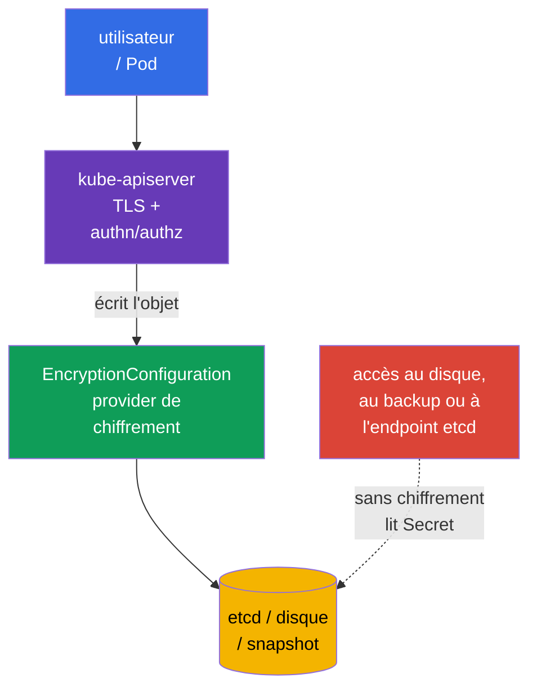
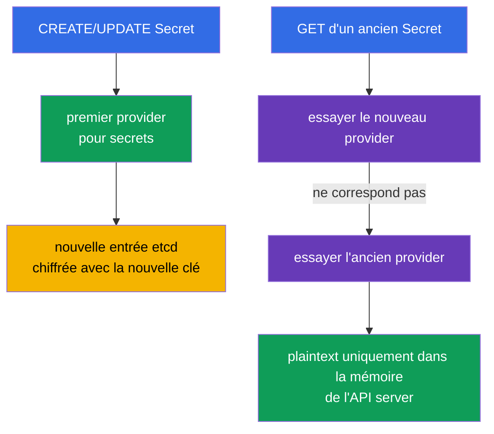
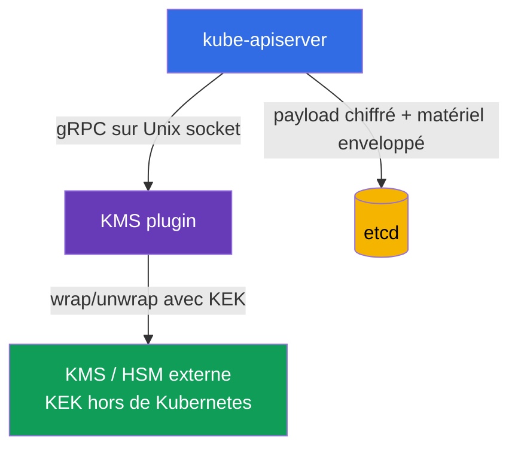
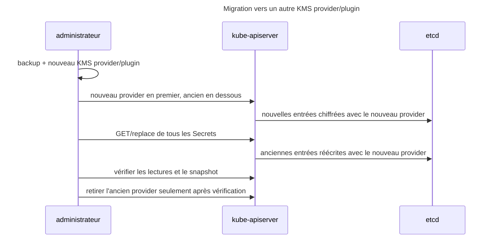

[Русская версия](ru.md) · [Eng version](README.md) · [Versión en español](es.md) · [Deutsche Version](de.md) · [ქართული ვერსია](ge.md) · [繁體中文版](tw.md) · [日本語版](jp.md)

# Chapitre 21. Chiffrement des données dans etcd et stockage sécurisé des Secret

> **Le problème.** Toute personne qui obtient le disque du control plane, un accès à etcd, un snapshot ou son backup
> contourne RBAC, authentication et audit de l'API server et peut lire `Secret.data` si cette donnée est stockée
> sous forme de base64 ordinaire. Les mots de passe, tokens et clés privées provenant d'une telle copie permettent de poursuivre
> une attaque en dehors du cluster. Le chiffrement de ressources API sélectionnées avant leur écriture dans etcd laisse
> du ciphertext dans le stockage et requiert un accès séparé au matériel de clés.

> **La suite.** Un `Secret` est un objet destiné aux données sensibles, mais ses champs `data` sont uniquement
> encodés en base64. Sans chiffrement at rest, toute personne ayant accès aux données etcd,
> à un snapshot ou à une sauvegarde peut lire le mot de passe, le token et la clé privée. Ce chapitre configure le
> chiffrement de ressources API sélectionnées avant leur écriture dans etcd via `EncryptionConfiguration`, présente
> `aescbc`, `aesgcm`, `secretbox` et `kms`, la rotation sûre des clés, puis vérifie le résultat. C'est la suite pratique
> du [chapitre 19 de CKA sur les Secret](../../../cka/course/19/fr.md) et de la relation entre etcd et les données du cluster décrite dans
> le [chapitre 37 de CKA](../../../cka/course/37/fr.md).

> **Limite de protection.** `EncryptionConfiguration` chiffre les données API sélectionnées avant leur écriture dans etcd.
> Ce n'est ni du full-disk encryption ni un chiffrement autonome des disques, d'un snapshot ou d'un backup : un snapshot
> contient les valeurs chiffrées des ressources protégées, mais requiert toujours sa propre protection,
> un contrôle d'accès et, si nécessaire, le chiffrement du stockage. Le chiffrement at rest ne chiffre pas le trafic entre
> le client et l'API server (TLS le fait), ne remplace pas RBAC et ne protège pas contre un utilisateur pouvant déjà
> exécuter `get secret` ou `exec` dans un Pod contenant un secret.

> 🧠 L'accès à etcd ou à un snapshot contourne authentication, authorization et audit de l'API ; base64 ne protège pas `Secret.data`, tandis que le chiffrement at rest protège le stockage sans les clés.

## 21.1. Modèle de menace : pourquoi etcd est une cible particulièrement précieuse

L'API server est le chemin habituel vers l'état de Kubernetes, tandis qu'etcd en est le stockage persistant. etcd contient
> des objets API : Secrets, ConfigMaps, ServiceAccounts, RBAC bindings, Deployments, et bien davantage.
> Ainsi, lire la base de données ou l'une de ses copies contourne le point de contrôle habituel - l'API server avec
> authentication, authorization et audit.



Voies de fuite typiques :

- un control-plane node, son disque ou le répertoire de données etcd est compromis ;
- un snapshot est envoyé vers un stockage non sûr, inclus dans un ticket, un CI-artifact ou copié sur un ordinateur portable ;
- une personne a un accès réseau et TLS directement à etcd ;
- un backup est restauré dans un environnement de test aux accès plus larges ;
- un Secret est accidentellement imprimé dans un log, le shell history, Git ou une variable d'environnement.

Le chiffrement d'etcd ne corrigera pas le dernier point, mais rend les quatre premiers bien plus difficiles : la base
stocke du ciphertext, et le matériel de clés ne doit pas s'y trouver. Pour CKS, ne tirez pas une mauvaise
conclusion : **base64 n'est pas du chiffrement** ; `kubectl get secret -o yaml` peut être décodé sans clé.

| Protection | Ce contre quoi elle aide | Ce qu'elle ne fait pas |
|---|---|---|
| TLS pour l'API server/etcd | interception du trafic | ne chiffre pas les données sur disque |
| RBAC | restreint l'accès à un Secret via l'API | ne protège pas un snapshot volé |
| Chiffrement at rest | ciphertext pour les données API sélectionnées dans etcd et son snapshot | ne chiffre pas les disques, un snapshot ou un backup dans leur ensemble et ne masque pas un Secret à un client API autorisé |
| secrets manager externe | sépare les master keys et leur lifecycle du cluster | ne remplace pas RBAC, TLS ni un Pod sécurisé |

> 🧠 Le premier provider correspondant chiffre les nouvelles entrées ; l'API server lit les providers dans l'ordre.

## 21.2. Fonctionnement du chiffrement des données API

`kube-apiserver` applique la chaîne de providers décrite dans `EncryptionConfiguration`. Lors d'une **écriture**,
il utilise le premier provider correspondant à la ressource. Lors d'une **lecture**, il essaie les providers dans l'ordre,
jusqu'à ce que l'un d'eux puisse déchiffrer la valeur existante. Lors de la rotation d'une clé locale dans un environnement HA,
ajoutez d'abord la nouvelle key en deuxième position sur tous les API servers, puis ne la placez en première position qu'après
l'application de la nouvelle configuration partout ; conservez l'ancienne key jusqu'à la fin du re-encryption.



Format minimal du fichier :

```yaml
apiVersion: apiserver.config.k8s.io/v1
kind: EncryptionConfiguration
resources:
- resources:
  - secrets
  providers:
  - aescbc:
      keys:
      - name: key1
        secret: <base64-encoded-32-byte-key>
  - identity: {}
```

`resources` énumère les ressources API, et non les namespaces. En général, protégez d'abord `secrets` ; si cela est
justifié, vous pouvez ajouter `configmaps`, des CRD ou d'autres ressources sensibles. Ne chiffrez pas tout aveuglément :
cela accroît la charge, complique la récupération et ne remplace pas la classification des données.

Les entrées `resources` sont traitées dans l'ordre : une configuration correspondante antérieure est prioritaire.
Ne dupliquez pas la même ressource explicite dans des blocs indépendants sans raison et ne créez pas
d'expressions wildcard qui se chevauchent. Le schéma documenté suivant est valide : une exception plus spécifique
est placée **avant** un wildcard large, par exemple pour laisser `events` en plaintext et chiffrer le reste :

```yaml
resources:
- resources:
  - events
  providers:
  - identity: {}
- resources:
  - '*.*'
  providers:
  - secretbox:
      keys:
      - name: key1
        secret: <base64-encoded-32-byte-key>
```

Ici, `events` correspond à la première entrée et n'atteint jamais `*.*` ; placer la règle spécifique avant le
wildcard fait partie de la limite de sécurité.

`identity: {}` ne chiffre rien. À la fin de la chaîne, il permet de lire les anciennes entrées en plaintext pendant
la migration. Il n'est dangereux pour une nouvelle entrée que lorsqu'il est premier : le premier provider détermine le
format des nouvelles entrées. Une fois toutes les entrées re-encrypted, `identity` peut être supprimé
si aucun fallback n'est plus nécessaire pour les anciennes données.

> **Dépendance critique.** Une clé perdue, une clé supprimée avant le re-encryption ou un KMS indisponible
> peut rendre certains objets illisibles et perturber le control plane. La configuration et les clés exigent des
> backups, un contrôle d'accès et une rotation répétée à l'avance.

> 🎯 `identity` à la fin lit l'ancien plaintext ; en première position, il laisse les nouvelles entrées non chiffrées.

## 21.3. Providers : `aescbc`, `aesgcm`, `secretbox`, `kms` et `identity`

Kubernetes prend en charge plusieurs providers. Ne choisissez pas `identity` comme unique protection en production :
cela désactive délibérément le chiffrement at rest.

| Provider | Mécanisme | Cas approprié | Limitation principale |
|---|---|---|---|
| `identity` | plaintext | fallback temporaire pour les anciennes données | ne chiffre rien du tout |
| `aescbc` | AES-CBC avec padding PKCS#7 | mécanisme pédagogique/legacy ; déconseillé pour les nouvelles configurations de production | faible : pas d'authentication/MAC intégrée, des attaques padding-oracle sont possibles ; la clé est stockée sur le control plane |
| `aesgcm` | AES-GCM, AEAD | uniquement avec une rotation automatisée | déconseillé sans rotation ; limite de 200 000 écritures par clé |
| `secretbox` | XSalsa20 + Poly1305, AEAD | provider local robuste et rapide | la clé de 32 octets est stockée sur le control plane |
| `kms` | envelope encryption via un KMS plugin | production avec un key manager/HSM/KMS cloud externe | la disponibilité du plugin/KMS devient une dépendance de l'API server |

> 🔬 AEAD, CBC, les limites d'écriture et le placement des clés déterminent le choix du provider.

`aescbc` utilise une clé AES encodée en base64 ; l'exemple emploie une clé de 32 octets (AES-256).
Kubernetes accepte des clés de 16, 24 ou 32 octets. Contrairement au provider AEAD `aesgcm`, `aescbc` n'a pas
d'authentication/MAC intégrée ; la documentation Kubernetes actuelle considère donc la variante CBC comme faible.
Cet exemple sert à la mécanique de l'examen et à la compatibilité, et non de recommandation pour la production.
Générez une valeur de 32 octets pour un lab ainsi :

```bash
head -c 32 /dev/urandom | base64
```

Exemple pour `aescbc` :

```yaml
apiVersion: apiserver.config.k8s.io/v1
kind: EncryptionConfiguration
resources:
- resources:
  - secrets
  providers:
  - aescbc:
      keys:
      - name: secrets-aescbc-2026-08
        secret: <base64-encoded-32-byte-key>
  - identity: {}
```

`aesgcm` utilise également AEAD - chiffrement et vérification d'intégrité. La documentation Kubernetes actuelle
fixe une limite pratique pour une clé AES-GCM : pas plus de 200 000 écritures ; effectuez une rotation de la clé ensuite.
Ainsi, ce provider convient à un volume contrôlé avec une rotation automatisée ; pour un débit élevé
d'écritures de Secret, préférez KMS ou concevez le lifecycle des clés avec une attention particulière.

`secretbox` utilise XSalsa20 et Poly1305, est un provider AEAD et nécessite une clé de 32 octets.
Kubernetes le qualifie d'option robuste et rapide. Le lab ci-dessous utilise `aescbc` pour couvrir le
mécanisme legacy et ses limites ; en production, le choix d'un provider local doit tenir compte des
exigences de rotation et de stockage des clés.

```yaml
apiVersion: apiserver.config.k8s.io/v1
kind: EncryptionConfiguration
resources:
- resources:
  - secrets
  providers:
  - aesgcm:
      keys:
      - name: secrets-aesgcm-2026-08
        secret: <base64-encoded-32-byte-key>
  - identity: {}
```

Ne placez pas une vraie key dans Git, des Helm values, un Terraform state, un chat ou un ticket. Le fichier de configuration
contenant une clé locale ne doit être accessible qu'à root et au processus de l'API server, par exemple :

```bash
# Créez à l'avance le parent directory : install ne crée pas un répertoire manquant.
sudo install -d -o root -g root -m 0700 /etc/kubernetes/enc
sudo install -o root -g root -m 0600 encryption-config.yaml \
  /etc/kubernetes/enc/encryption-config.yaml
sudo stat -c '%U:%G %a %n' \
  /etc/kubernetes/enc \
  /etc/kubernetes/enc/encryption-config.yaml
```

Un `aescbc`/`aesgcm` local protège un snapshot contre une personne qui ne possède que le snapshot, mais pas le
filesystem du control plane. C'est une base utile, mais la clé réside sur la même machine de confiance. Utilisez
`kms` pour séparer les responsabilités et fournir un lifecycle de clés durable.

> 🎯 Kube-apiserver reçoit `--encryption-provider-config` avec un path accessible via un mount ; vérifiez la readiness et la lecture d'un Secret via l'API.

## 21.4. Connexion de `EncryptionConfiguration` à kube-apiserver

Le fichier lui-même ne change rien. L'API server doit recevoir le flag
`--encryption-provider-config=<path>`. Dans un cluster kubeadm, `kube-apiserver` est un static Pod ; son
manifest se trouve généralement dans `/etc/kubernetes/manifests/kube-apiserver.yaml`. kubelet détecte le changement du
manifest et redémarre l'API server.

```yaml
# /etc/kubernetes/manifests/kube-apiserver.yaml (fragments)
spec:
  containers:
  - name: kube-apiserver
    command:
    - kube-apiserver
    - --encryption-provider-config=/etc/kubernetes/enc/encryption-config.yaml
    volumeMounts:
    - name: encryption-config
      mountPath: /etc/kubernetes/enc
      readOnly: true
  volumes:
  - name: encryption-config
    hostPath:
      path: /etc/kubernetes/enc
      # Le répertoire a été préparé plus haut ; Directory ne masque pas une faute de frappe avec un répertoire vide.
      type: Directory
```

Le path du flag est visible **depuis le conteneur de l'API server** ; un fichier présent uniquement sur le host
ne suffit donc pas : utilisez `hostPath` et `volumeMount`. Vérifiez l'indentation YAML et les noms de volume existants ; ne
remplacez pas le manifest entier par un modèle. Sur un control plane HA, le même fichier protégé et le flag
doivent être présents sur chaque API server node ; déployez la modification un node à la fois tout en
surveillant health et quorum.

Ordre de travail pratique :

1. Créez et vérifiez un snapshot etcd récent ; la procédure figure dans le [chapitre 37 de CKA](../../../cka/course/37/fr.md).
2. Générez une clé hors du shell history et enregistrez la configuration avec le mode `0600` dans un path protégé.
3. Ajoutez le volume, le mount et `--encryption-provider-config` au manifest de l'API server.
4. Attendez le redémarrage du static Pod et vérifiez `kubectl get --raw='/readyz?verbose'`.
5. Créez un Secret de test, confirmez que l'API peut le lire, puis effectuez le re-encryption de toutes les anciennes entrées.

```bash
# Vérifiez le flag et le mount dans le manifest du static Pod en cours d'exécution.
sudo grep -n -- '--encryption-provider-config\|encryption-config' \
  /etc/kubernetes/manifests/kube-apiserver.yaml

# L'API server est de nouveau prêt après la modification du manifest.
kubectl get --raw='/readyz?verbose'
kubectl -n kube-system get pods -l component=kube-apiserver
```

> **Attention.** Une erreur dans un path, du YAML ou une clé peut empêcher le démarrage de l'API server. Travaillez depuis
> la console du control-plane node, conservez un backup du manifest et ne retirez pas la configuration précédente
> avant la fin de la vérification. Pour Kubernetes managé, ne modifiez pas un static Pod : activez le chiffrement via
> le mécanisme pris en charge par le provider et suivez sa procédure KMS/cluster update.

> 🏭 KMS sépare le KEK, mais le plugin et le key manager requièrent HA, des permissions minimales et un restore vérifié.

## 21.5. KMS et envelope encryption

Le provider `kms` relie l'API server à un KMS plugin local par un Unix socket ; le plugin communique avec
un KMS/HSM externe qui stocke la key encryption key (KEK). `EncryptionConfiguration` ne contient pas de KEK.
KMS v1 et v2 utilisent l'envelope encryption, mais obtiennent la data encryption key (DEK) de manière différente ;
ils ne peuvent donc pas être décrits par une seule séquence.



Fragment conceptuel de KMS **v2** :

```yaml
apiVersion: apiserver.config.k8s.io/v1
kind: EncryptionConfiguration
resources:
- resources:
  - secrets
  providers:
  - kms:
      apiVersion: v2
      name: production-kms
      endpoint: unix:///var/run/kmsplugin/socket.sock
      timeout: 3s
  - identity: {}
```

Les différences doivent être explicites :

| Propriété | KMS v1 | KMS v2 |
|---|---|---|
| Statut | deprecated depuis Kubernetes 1.28 ; désactivé par défaut depuis 1.29 et requiert l'activation explicite de `--feature-gates=KMSv1=true` | stable depuis Kubernetes 1.29 ; API recommandée pour les nouvelles configurations |
| DEK | un nouveau DEK aléatoire pour chaque opération de chiffrement ; le plugin enveloppe chaque DEK avec le KEK | l'API server stocke une seed secrète et utilise un KDF pour dériver un DEK à usage unique pour chaque opération ; la seed est enveloppée avec le KEK et change lors de la rotation du KEK |
| Champs de configuration | `apiVersion: v1` ou le champ est absent ; `name`, `endpoint`, `cachesize`, `timeout` | `apiVersion: v2`, `name`, `endpoint`, `timeout` ; `cachesize` n'est pas autorisé |
| Performance | davantage d'appels gRPC/KMS ; le cache stocke les DEK désenveloppés | aucun appel KMS pour envelopper un DEK individuel à chaque écriture |
| Identification de clé | dépend du plugin v1 | `Status` renvoie `version: v2`, `healthz: ok` et le `key_id` du KEK actuel |

> **Limite de version pour ce tableau.** À la date de vérification, **2026-09-15**, KMS v1 existait encore dans le snapshot d'examen v1.35, mais il est deprecated et désactivé par défaut ; la compatibilité legacy exige un feature gate explicite. Ne l'utilisez pas pour les nouvelles configurations et consultez la documentation KMS de votre version minor.

Dans v2, etcd stocke l'encrypted payload et le material suffisant pour que l'API server obtienne un DEK à usage unique
depuis la seed protégée ; ce n'est pas un modèle où le plugin émet un nouveau DEK enveloppé à chaque
écriture. La rotation de `key_id` force l'API server à obtenir une nouvelle seed, à la protéger avec le nouveau KEK,
et à l'utiliser pour les écritures suivantes. Les anciennes données sont réécrites par une procédure de
re-encryption distincte et contrôlée.

Les champs exacts et la version d'API disponible dépendent de la version Kubernetes et du plugin sélectionné. Consultez
la documentation officielle de votre version et le déploiement du plugin ; ne copiez pas en production un exemple arbitraire de KMS v1/v2.
Le socket doit être disponible pour le conteneur de l'API server par un volume mount explicite, et son accès doit être
restreint. Le plugin lui-même doit utiliser TLS/authentication vers le manager distant, avoir des permissions KMS minimales et
ne pas imprimer de plaintext dans les logs.

Deux mécanismes opérationnels sont utiles pour KMS. Le flag
`--encryption-provider-config-automatic-reload=true` force l'API server à relire la
configuration sans redémarrer (pratique pour la rotation des clés). La santé du plugin est vérifiée par l'endpoint
`/healthz/kms-providers` et `/healthz` général ; avec l'automatic reload, les health checks individuels
sont regroupés en un seul. L'API server interroge `Status` de KMS v2 environ une fois par minute lorsqu'il est healthy et plus
souvent en cas d'échec. Le cache ne rend pas le plugin/KEK facultatif : son indisponibilité peut
empêcher le startup/cache warm-up, le déchiffrement de material non encore révélé, la rotation de KEK/`key_id` et la restauration
d'un snapshot. Le plugin et le manager distant doivent être HA, et le restore requiert le même KEK ou une migration documentée.

KMS améliore la séparation des secrets, mais ajoute des exigences opérationnelles :

- Pour KMS v1, le plugin/KMS est bien plus proche du synchronous data path : les nouveaux DEK sont enveloppés par
  KMS et un cache miss exige un unwrap. Pour KMS v2, l'API server dérive localement des DEK à usage unique depuis
  une seed protégée ; il n'appelle donc pas le KMS distant à chaque lecture/écriture API ordinaire. Le plugin et le
  manager restent essentiels pour le startup/cache warm-up, le déchiffrement sans cache, la rotation des clés et
  la récupération ; surveillez la santé de `Status`, la stabilité de `key_id`, la latence de `EncryptRequest`/
  `DecryptRequest`, les erreurs, la disponibilité, le quota et la durée de vie des credentials ;
- concevez le plugin et KMS pour HA : ils constituent une dépendance critique ; l'indisponibilité du plugin/KEK
  peut entraîner des échecs de lecture et d'écriture des ressources chiffrées ; vérifiez à l'avance le processus de récupération ;
- sauvegardez les metadata et documentez les ID de clés, mais **n'exportez pas** les master keys dans un backup etcd ;
- restreignez IAM/ACL : l'API server ne reçoit que les opérations encrypt/decrypt requises, tandis qu'un administrateur
  du cluster ne reçoit pas nécessairement les permissions de gérer le KEK ;
- testez la restauration d'un snapshot avec l'accès à la même KMS key avant un incident.

Un KMS externe ne signifie pas qu'un Secret cesse d'apparaître dans Kubernetes. Si une application reçoit un
Kubernetes Secret ordinaire, le plaintext reste disponible pour ceux qui sont autorisés via l'API ou un Pod. Utilisez
Vault Agent, Secrets Store CSI Driver ou External Secrets Operator pour fournir les secrets au moyen d'une identité de courte durée,
mais vérifiez soigneusement leurs RBAC et synchronisation : un operator qui crée un Kubernetes Secret
place de nouveau une copie dans etcd.

> 🎯 Nouvelle key/provider en première position tout en conservant l'ancienne → réécrire les objets → vérifier la lecture/le stockage → retirer l'ancienne key.

## 21.6. Rotation du provider et re-encryption des données existantes

Modifier la configuration ne suffit pas. Un nouveau provider ne s'applique qu'aux objets **nouveaux ou mis à jour** ; les anciens enregistrements restent chiffrés avec l'ancienne clé ou en plaintext. Une rotation sûre comporte donc toujours deux actions distinctes : assurer d'abord la lecture avec l'ancienne clé et l'écriture avec la nouvelle clé, puis réécrire les objets existants.

### Rotation d'une clé `aescbc`/`aesgcm`

Supposons que `key-old` ait d'abord été utilisé. Sur un control plane HA, ne placez pas immédiatement `key-new` en première position : un API server déjà mis à jour peut écrire un objet avec la nouvelle clé tandis qu'un autre API server ne sait pas encore le déchiffrer. Effectuez la rotation en deux phases.

1. Ajoutez `key-new` **en deuxième position** après `key-old` dans la configuration de chaque control-plane node.
2. Redémarrez l'API server ou appliquez le reload de configuration sur **tous** les API servers. Chacun sait désormais déchiffrer avec les deux clés, tandis que les nouvelles entrées utilisent encore `key-old`.
3. Placez `key-new` **en premier**, en conservant `key-old` en deuxième position, puis appliquez de nouveau la configuration sur tous les API servers. Ce n'est qu'à présent que les nouvelles entrées sont créées avec `key-new`.

Phase 1 - nouvelle key en deuxième position sur tous les API servers :

```yaml
apiVersion: apiserver.config.k8s.io/v1
kind: EncryptionConfiguration
resources:
- resources:
  - secrets
  providers:
  - aescbc:
      keys:
      - name: key-old-2026-01
        secret: <old-base64-32-byte-key>
      - name: key-new-2026-08
        secret: <new-base64-32-byte-key>
  - identity: {}
```

Phase 2 - après avoir appliqué la phase 1 sur tous les API servers, placez la nouvelle key en premier :

```yaml
apiVersion: apiserver.config.k8s.io/v1
kind: EncryptionConfiguration
resources:
- resources:
  - secrets
  providers:
  - aescbc:
      keys:
      - name: key-new-2026-08
        secret: <new-base64-32-byte-key>
      - name: key-old-2026-01
        secret: <old-base64-32-byte-key>
  - identity: {}
```

Après avoir appliqué la phase 2 sur tous les API servers, réécrivez tous les Secrets. La commande ci-dessous récupère chaque objet et le renvoie via l'API ; c'est précisément le nouveau provider placé en première position qui chiffre l'écriture. Avant une opération de masse, créez un snapshot et commencez par un namespace de test.

```bash
# Réécrire tous les Secrets via l'API server.
kubectl get secrets --all-namespaces -o json | kubectl replace -f -

# Si des ConfigMaps sont protégées, les réécrire lors d'une opération distincte et réfléchie.
# kubectl get configmaps --all-namespaces -o json | kubectl replace -f -
```

> 🔬 Storage Version Migration réécrit massivement le storage et requiert un feature/operational rollout distinct.

### Extension pour la production : Storage Version Migration

Pour les réécritures de masse en production, il existe une alternative native Kubernetes : **Storage Version Migration**. Dans Kubernetes 1.36, elle est beta et désactivée par défaut ; après une activation explicite et une configuration suivant la documentation de votre version, la migration réécrit les objets via le storage path de l'API. Elle convient notamment au re-encryption après la modification de `EncryptionConfiguration` ou des clés. Pour CKS, il suffit de comprendre l'ordre des providers et la réécriture forcée des objets ; le `kubectl replace` ci-dessus reste une voie d'examen simple, tandis que Storage Version Migration exige un operational rollout distinct, de l'observability et un processus de rollback/recovery testé.

> 🏭 **Upstream v1.37.** Dans Kubernetes v1.37, l'API et le controller `StorageVersionMigration` intégrés sont devenus GA et enabled by default. Cela modifie le statut actuel en production, mais pas le workflow CKS Core de ce chapitre, qui reste lié au contexte d'examen/de formation. Voir [Kubernetes v1.37 Security Delta](../APPENDIX_K8S_137_SECURITY_DELTA_FR.md).

`kubectl replace` requiert un `resourceVersion` actuel ; une forte concurrence peut provoquer des conflits. En production, exécutez un script contrôlé avec retry, observation de la latence de l'API et un créneau coordonné, plutôt que de coller aveuglément la commande dans le CI. N'écrivez pas sur disque ni dans un log de pipeline le JSON contenant des Secrets.

Une fois le re-encryption et la vérification des clés terminés, retirez `key-old` de la configuration, redémarrez l'API server et vérifiez de nouveau la lecture. Ne retirez pas l'ancienne clé avant d'avoir réécrit les objets : un snapshot restauré ou une ancienne entrée deviendrait illisible.

### Passage de `identity` au chiffrement

Pour un ancien cluster, le début est similaire : placez le nouveau encryption provider en premier, conservez `identity` en dernier, puis réécrivez les ressources.

```yaml
providers:
- aesgcm:
    keys:
    - name: key-2026-08
      secret: <base64-encoded-32-byte-key>
- identity: {}
```

Après le re-encryption des anciennes entrées, `identity: {}` peut être retiré. Le conserver en dessous n'est acceptable que comme choix temporaire explicite pour la compatibilité ; ne considérez pas la présence de `identity` comme la preuve que toutes les données sont protégées.

> 🏭 La rotation du KEK et le changement de provider sont distincts ; conservez la capacité de déchiffrer les anciennes données jusqu'à ce que la restauration soit vérifiée.

### Rotation d'un KEK KMS v2

La rotation habituelle d'un KEK distant dans KMS v2 a lieu **à l'intérieur du KMS/plugin externe**. Le plugin communique le `key_id` public actuel via `Status` ; l'API server considère cet ID comme authoritative. Lorsque le `key_id` change, l'API server obtient une nouvelle seed protégée par le nouveau KEK et l'utilise pour les chiffrements suivants. Pour cette rotation de KEK normale, n'ajoutez pas un second provider `kms`, ne changez pas l'ordre des providers et ne redémarrez pas l'API server uniquement pour changer le KEK.

Lorsqu'il est healthy, l'API server interroge `Status` environ une fois par minute et peut utiliser le dernier état valide pendant environ trois minutes. Ne commencez donc pas le re-encryption immédiatement après la rotation : confirmez d'abord que le nouveau `key_id` stable est vu par tous les API servers et que le plugin ne bascule pas entre plusieurs ID. Réécrivez ensuite les objets nécessaires via l'API si le storage doit passer au nouveau KEK. Upstream recommande de faire tourner un KEK KMS v2 au moins tous les 90 jours. Le workflow exact et l'observability dépendent du plugin et du KMS externe.

### Migration vers un autre KMS provider/plugin

Ce n'est **pas** une rotation de KEK habituelle. Si le cluster migre réellement vers un autre KMS provider, plugin ou endpoint configuré, placez le nouveau provider `kms` en premier et conservez l'ancien en dessous pour le decrypt, puis réécrivez les données via l'API et ne retirez l'ancien provider/plugin qu'après vérification.



> 🎯 Démontrez la configuration de l'API server, la lecture autorisée d'un Secret et l'absence d'un marker plaintext dans la valeur etcd brute.

## 21.7. Vérification : API, configuration et etcd

Ne vérifiez pas seulement que le fichier existe. Vous devez démontrer trois faits : l'API server utilise réellement le
flag, le Secret reste accessible via l'API et etcd ne contient aucun plaintext. N'effectuez la dernière
vérification que sur un cluster de lab isolé ou conformément à une procédure convenue : l'accès direct à etcd exige des
privilèges et peut divulguer des données réelles.

Commencez par créer un Secret canari inoffensif avec une valeur unique facile à rechercher :

```bash
kubectl -n default create secret generic encryption-check \
  --from-literal=probe='not-a-real-secret-rotate-me'
kubectl -n default get secret encryption-check \
  -o jsonpath='{.data.probe}' | base64 -d; echo
```

La seconde sortie démontre le fonctionnement normal de l'API, mais ne prouve pas le chiffrement au repos : l'API server doit
déchiffrer les données pour un client autorisé. Vérifiez ensuite le manifest, la disponibilité et le log de l'API server :

```bash
sudo grep -n -- '--encryption-provider-config' \
  /etc/kubernetes/manifests/kube-apiserver.yaml
kubectl get --raw='/readyz?verbose'
kubectl -n kube-system logs kube-apiserver-$(hostname) --tail=100
```

Le nom du Pod statique peut différer de `$(hostname)` ; obtenez-le d'abord avec `kubectl -n kube-system
get pods -l component=kube-apiserver`. N'imprimez pas les logs de production dans un emplacement non protégé : les données
de diagnostic peuvent contenir des noms d'objets et des erreurs d'accès.

Pour un cluster de formation autogéré, vous pouvez obtenir la valeur directement avec `etcdctl` et confirmer que
le marker est absent des octets de réponse. Les paramètres TLS ci-dessous sont un exemple kubeadm typique :
comparez d'abord l'endpoint, l'AC et les chemins du certificat/de la clé avec le manifest etcd **actuel**. La vérification
échoue de manière fermée : PASS n'est possible que si `etcdctl` a lu une valeur non vide pour la clé requise, si `strings`
s'est terminé avec succès et si le marker n'a pas été trouvé.

```bash
(
  set -euo pipefail
  raw_file="$(mktemp)"
  trap 'rm -f "$raw_file"' EXIT

  # Remplacez l'endpoint et les chemins TLS par les valeurs du manifest etcd actuel.
  if ! ETCDCTL_API=3 etcdctl get /registry/secrets/default/encryption-check \
    --endpoints=https://127.0.0.1:2379 \
    --cacert=/etc/kubernetes/pki/etcd/ca.crt \
    --cert=/etc/kubernetes/pki/etcd/server.crt \
    --key=/etc/kubernetes/pki/etcd/server.key \
    --print-value-only >"$raw_file"; then
    echo 'ERROR: etcdctl could not read the canary object' >&2
    exit 1
  fi

  if [ ! -s "$raw_file" ]; then
    echo 'ERROR: etcd key is absent or has an empty value' >&2
    exit 1
  fi

  # grep=1 signifie que le marker n'a pas été trouvé ; ne le confondez pas avec une erreur etcdctl/strings.
  set +e
  strings "$raw_file" | grep -Fq 'not-a-real-secret-rotate-me'
  status=("${PIPESTATUS[@]}")
  set -e

  if [ "${status[0]}" -ne 0 ]; then
    echo 'ERROR: strings could not inspect the etcd value' >&2
    exit 1
  elif [ "${status[1]}" -eq 0 ]; then
    echo 'FAIL: plaintext marker is present in etcd' >&2
    exit 1
  elif [ "${status[1]}" -ne 1 ]; then
    echo 'ERROR: plaintext verification failed unexpectedly' >&2
    exit 1
  fi

  echo 'OK: etcd value was read and plaintext marker was not found'
)
```

Pour les anciennes données, effectuez ce test après le re-encryption. Les données etcd ont habituellement un préfixe
de format encryption-provider ; ne construisez pas une vérification autour d'un format interne qui dépend de la version de Kubernetes.

Après le test, supprimez le Secret canari et vérifiez que le runbook de backup/restauration a été conservé :

```bash
kubectl -n default delete secret encryption-check
```

| Éléments à vérifier | Résultat attendu |
|---|---|
| manifest de l'API server | contient `--encryption-provider-config` et un montage correct en lecture seule |
| disponibilité | `/readyz?verbose` réussit après le redémarrage |
| lecture de Secret par l'API | un `kubectl get` autorisé renvoie la valeur d'origine |
| vérification etcd du lab | le marker plaintext unique est absent de la valeur brute stockée |
| après rotation | un Secret créé avant la rotation est lisible et réécrit par le nouveau provider |
| backup/restauration | le snapshot est accessible de façon sûre et les clés/KMS nécessaires sont disponibles pendant la restauration |

> 🏭 Le chiffrement au repos ne remplace pas RBAC, TLS, l'hygiène des Secrets ni les backups ; gérez séparément les clés, la disponibilité du KMS et la restauration.

## 21.8. Mise en application en production

Le chiffrement au repos est une couche. Une protection utile repose sur plusieurs barrières indépendantes.

- **RBAC de moindre privilège.** N'accordez pas `get`, `list` ni `watch` sur `secrets` à de larges groupes. `list` et
  `watch` renvoient aussi le contenu des Secrets. Restreignez séparément `pods/exec`, `pods/attach` et
  `pods/ephemeralcontainers` : un shell dans une charge de travail donne souvent accès à un Secret monté.
- **Ne transmettez pas un Secret par env sauf nécessité.** Préférez un montage de volume/CSI en lecture seule ;
  les variables d'environnement se retrouvent facilement dans une sortie de débogage, un crash dump, un processus enfant ou un log.
- **Ne commitez pas de plaintext.** `stringData` est pratique, mais est du plaintext dans Git. Utilisez SOPS, Sealed
  Secrets ou une intégration GitOps avec un external secrets manager ; activez l'analyse pre-commit et côté serveur.
- **Durée de vie courte et rotation.** Faites tourner un mot de passe de base de données, un token API, un certificat et un
  credential cloud. Mettre à jour un Secret Kubernetes ne signifie pas qu'une application le relit automatiquement :
  env ne se met pas à jour, tandis qu'un montage de fichier se met à jour avec un délai ; l'application doit pouvoir recharger/redémarrer.
- **Limitez la surface de l'API.** N'imprimez pas `kubectl get secret -o yaml`, des valeurs décodées ou des
  credentials KMS dans un log CI. Révoquez un Secret publié accidentellement à la source plutôt que de seulement supprimer
  la ligne de l'historique Git.
- **Protégez les backups.** Un snapshot etcd chiffré reste sensible : stockez-le séparément,
  chiffrez le stockage, définissez la rétention, MFA/ACL et une restauration vérifiée. Stockez la clé secrète ou l'accès KMS
  séparément du snapshot.

External Secrets Operator, Vault, les Secrets Manager cloud et Secrets Store CSI Driver résolvent des problèmes
différents. Le premier synchronise souvent une valeur externe dans un Secret Kubernetes - pratique, mais une copie
reste dans etcd et doit être chiffrée. CSI/Vault Agent peut fournir un secret à un Pod sous forme de fichier sans Secret
Kubernetes persistant - moins de copies dans etcd, mais des limites de confiance apparaissent autour du plugin de nœud,
de l'identité du Pod et du backend externe. Choisissez un modèle après une analyse des menaces, pas seulement parce qu'un outil
« chiffre les secrets ».

## 21.9. Erreurs fréquentes et diagnostic

| Symptôme | Cause probable | Réponse sûre |
|---|---|---|
| L'API server n'est pas Ready après une modification | YAML invalide, config/montage/socket indisponible, clé invalide | restaurez un manifest vérifié via la console ; lisez le log kubelet/API local |
| Un Secret est lisible avec `kubectl` | cela est normal | l'API déchiffre pour un client autorisé ; ne vérifiez etcd brut que dans un lab |
| Un ancien Secret est illisible après rotation | ancienne clé/provider retiré trop tôt | restaurez l'ancien provider/la clé depuis un backup protégé, puis effectuez le re-encryption |
| Un nouvel enregistrement reste en plaintext | `identity` est premier ou le flag n'est pas appliqué | vérifiez l'ordre des providers, le manifest, le redémarrage et la création d'un nouveau canari |
| Une écriture API se bloque/échoue | plugin KMS ou KMS externe indisponible/lent | vérifiez le socket, TLS, l'état du KMS, le timeout et la HA ; n'affaiblissez pas la sécurité aveuglément |
| Un Secret se trouve dans Git/un log | le chiffrement au repos ne peut pas aider | faites tourner immédiatement le credential d'origine, restreignez l'accès et retirez l'artefact selon la procédure IR |

> 🏭 **Cas limite de récupération Kubernetes v1.37.** Un chemin Beta de suppression forcée non sûre (`AllowUnsafeMalformedObjectDeletion`) existe pour un objet API illisible/corrompu. C'est une opération susceptible de casser le cluster et un dernier mécanisme de récupération, pas une méthode normale pour corriger une rotation de chiffrement. Pour les détails et limitations, consultez [Delta de sécurité Kubernetes v1.37](../APPENDIX_K8S_137_SECURITY_DELTA_FR.md).

À l'examen, identifiez d'abord le type de cluster. Pour kubeadm, recherchez le manifest de l'API server et les chemins TLS etcd.
Pour un control plane managé, les réglages peuvent être indisponibles : n'essayez pas de modifier un
`/etc/kubernetes/manifests` inexistant ; utilisez le chiffrement KMS pris en charge par le provider et confirmez son état.

## 21.10. Mini-glossaire

- **Encryption at rest** - chiffrement de données API sélectionnées avant leur écriture dans etcd ; ce n'est pas le
  chiffrement du disque, du snapshot ou du backup dans son ensemble.
- **EncryptionConfiguration** - configuration des providers lue par kube-apiserver pour les
  ressources API sélectionnées.
- **provider** - mécanisme de chiffrement/déchiffrement pour des ressources API spécifiques.
- **`aescbc`** - provider AES-CBC local avec padding PKCS#7 et une clé issue de la configuration ; sans
  authentification/MAC intégrée, il est donc faible.
- **`aesgcm`** - provider AEAD AES-GCM ; les clés doivent être tournées en tenant compte de la limite d'écritures.
- **`secretbox`** - provider AEAD XSalsa20 + Poly1305 avec une clé de 32 octets.
- **`kms`** - provider qui délègue les opérations cryptographiques à un plugin KMS externe.
- **envelope encryption** - un objet est chiffré avec une DEK, tandis que la DEK est protégée par une KEK externe.
- **KEK/DEK** - key encryption key / data encryption key.
- **re-encryption** - réécriture des anciens objets API via un nouveau provider/une nouvelle clé.
- **`identity`** - provider sans chiffrement ; autorisé uniquement comme solution de repli temporaire délibérée.

## 21.11. Résumé du chapitre

- etcd stocke les Secrets et une part substantielle de l'état Kubernetes ; base64 ne protège pas ce contenu.
- `EncryptionConfiguration` est appliquée par le flag kube-apiserver `--encryption-provider-config` ; le premier
  provider est utilisé pour les nouveaux enregistrements, tandis que les providers sont essayés dans l'ordre pour les lectures.
- `aescbc`, `aesgcm` et `secretbox` sont des options locales avec une clé dans un fichier protégé ; `kms` permet de
  déplacer la KEK vers un gestionnaire externe et d'utiliser l'envelope encryption.
- En HA, tournez une clé locale dans cet ordre : backup -> nouvelle clé en seconde position sur tous les API servers -> appliquez la
  configuration partout -> nouvelle clé en première position sur tous les API servers -> appliquez à nouveau la configuration ->
  effectuez le re-encryption des anciens objets -> vérifications -> retirez l'ancienne clé.
- Vérifiez la configuration, la santé de l'API, les lectures API et l'absence du plaintext canari dans une valeur etcd brute de lab.
- Complétez le chiffrement au repos avec RBAC, TLS, l'hygiène des secrets, des backups sûrs et un external secret manager.

## 21.12. Comment cela aide : à l'examen et dans le travail réel

**Dans CKS.** Une tâche peut exiger de trouver des Secrets non chiffrés, d'activer le chiffrement au repos,
d'identifier le bon `--encryption-provider-config`, d'expliquer l'ordre des providers ou d'effectuer une rotation sans
casser un Secret. Un algorithme rapide : trouvez le manifest de l'API server, créez une config et un montage sûrs, ajoutez
le flag, attendez que le service soit sain, réécrivez les objets et vérifiez etcd. Ne répondez pas « un Secret est chiffré avec
base64 » - c'est faux.

**En production.** Traitez le chiffrement au repos comme une base standard du control plane, pas comme la mesure
finale. Gérez les clés séparément des backups etcd, automatisez la rotation, surveillez le KMS, testez la
restauration et réduisez au minimum le nombre de personnes, d'identités et de Pods pouvant voir le plaintext. Modifiez la configuration de l'API
server par une procédure de changement avec rollback et backup.

## 21.13. Questions d'auto-évaluation

<details>
<summary>1. Pourquoi base64 dans le champ `Secret.data` ne protège-t-il pas un secret contre le propriétaire d'un snapshot etcd ?</summary>

Base64 est un encodage, pas un chiffrement : `kubectl get secret -o yaml` peut être décodé sans clé. Le propriétaire d'un snapshot etcd obtient l'état API stocké tout en contournant l'authentification, l'autorisation et l'audit de l'API server. Le chiffrement au repos change cela en stockant du ciphertext pour les ressources sélectionnées.
</details>

<details>
<summary>2. Quels enregistrements le chiffrement au repos protège-t-il et quelles menaces n'élimine-t-il pas ?</summary>

`EncryptionConfiguration` chiffre des données API sélectionnées avant leur écriture dans etcd, comme les Secrets, et le ciphertext entre dans le snapshot. Il ne chiffre pas un disque, un snapshot ou un backup dans son ensemble, ne protège pas le trafic TLS et ne cache pas un Secret à une identité ayant `get secret` ou `exec` dans un Pod. RBAC, TLS et la protection des backups restent des contrôles distincts.
</details>

<details>
<summary>3. Comment l'API server choisit-il un provider à l'écriture et à la lecture d'un ancien enregistrement ?</summary>

À l'écriture, l'API server utilise le premier provider correspondant à la ressource. À la lecture, il essaie les providers dans l'ordre jusqu'à ce que l'un d'eux déchiffre la valeur existante. C'est précisément ce qui permet de conserver l'ancienne clé sous la nouvelle pendant la rotation.
</details>

<details>
<summary>4. Pourquoi `identity` est-il acceptable à la fin d'une chaîne de migration, mais pas comme premier provider ?</summary>

`identity` ne chiffre rien, mais à la fin de la chaîne il permet de lire les anciens enregistrements plaintext pendant la migration. Il est dangereux en premier, car le premier provider détermine le format des nouveaux enregistrements, qui resteront plaintext. Après le re-encryption, `identity` peut être retiré si la solution de repli n'est plus nécessaire.
</details>

<details>
<summary>5. Quelle est la différence opérationnelle entre les `aescbc`/`aesgcm` locaux et `kms` ?</summary>

Pour les providers locaux, la clé se trouve dans un fichier de configuration du control plane protégé : cela protège un snapshot sans le système de fichiers du nœud, mais ne sépare pas ces secrets. `kms` utilise l'envelope encryption par l'intermédiaire d'un plugin de socket Unix et d'une KEK/HSM externe, ce qui améliore la séparation des responsabilités. En contrepartie, le plugin et le gestionnaire externe deviennent une dépendance critique pour la lecture, l'écriture, la rotation et la restauration.
</details>

<details>
<summary>6. Pourquoi l'ancienne clé ne peut-elle pas être retirée immédiatement après avoir ajouté la nouvelle ?</summary>

Les anciens objets peuvent encore être plaintext ou chiffrés avec l'ancienne clé, tandis que le nouveau provider ne s'applique qu'aux enregistrements nouveaux/mis à jour. En HA, chaque API server doit d'abord pouvoir lire les deux clés ; la nouvelle devient ensuite première et les objets sont réécrits. Retirer l'ancienne clé avant le re-encryption rend certains enregistrements ou un snapshot restauré illisibles.
</details>

<details>
<summary>7. Comment prouver qu'un ancien Secret a réellement subi le re-encryption ?</summary>

Après avoir placé le nouveau provider en premier, réécrivez l'ancien Secret via l'API, par exemple avec `kubectl get secrets --all-namespaces -o json | kubectl replace -f -`, en commençant par un namespace de test. Vérifiez ensuite la lecture par l'API et, dans un lab isolé, inspectez la valeur brute du canari etcd : un marker plaintext unique ne doit pas être trouvé avec `strings | grep`. Ne retirez l'ancien provider/la clé qu'après cette vérification.
</details>

<details>
<summary>8. Quelles actions de Pod peuvent contourner une interdiction de `get secrets`, et pourquoi ?</summary>

Des permissions larges sur `pods/exec`, `pods/attach` ou `pods/ephemeralcontainers` peuvent donner un shell dans une charge de travail où un Secret est monté ou disponible pour l'application. L'identité n'a alors pas besoin de lire directement le Secret via l'API Kubernetes pour voir le plaintext. Restreignez donc aussi ces sous-ressources avec un RBAC de moindre privilège.
</details>

<details>
<summary>9. Que faut-il vérifier pour restaurer un snapshot etcd chiffré ?</summary>

Stockez et restaurez le snapshot selon une procédure sûre, mais vérifiez aussi la disponibilité des clés locales requises ou de la même KEK/du même plugin KMS. Testez la restauration à l'avance, documentez les ID de clé et protégez séparément le snapshot avec des ACL, le chiffrement du stockage et la rétention. N'exportez pas les clés maîtresses dans un backup etcd.
</details>

<details>
<summary>10. **Retour en arrière (Chapitre 14).** Le chiffrement au repos protège un Secret spécifiquement dans etcd. Après son montage, kubelet fournit le Secret à un Pod par un **volume basé sur tmpfs** : cela exclut une copie ordinaire sur disque durable, mais ne garantit pas sans condition qu'il « n'atteindra jamais le disque ». Lorsque le swap est activé, Kubernetes v1.36 monte les volumes basés sur la mémoire avec `noswap` si le kernel prend en charge l'option (officiellement à partir de Linux 6.3 ou avec un backport) ; sinon, kubelet avertit qu'un tel volume, y compris un Secret, peut être échangé vers le swap. Sur de tels nœuds, désactivez le swap ou assurez-vous qu'il est chiffré et vérifiez l'avertissement kubelet. Quelles mesures du Chapitre 14 (surface d'attaque de l'hôte, hôte de moindre privilège) limitent le risque pour le secret à ce stade - lorsqu'il est déjà déchiffré et disponible via tmpfs pour un processus autorisé sur le nœud - et pourquoi une compromission de l'hôte ou une charge de travail privilégiée sur le même nœud reste-t-elle une menace sérieuse même sans copie sur disque persistant ?</summary>

Réduisez la surface d'attaque de l'hôte : désactivez les services et paquets inutiles, fermez les ports en écoute non nécessaires et mettez rapidement à jour le nœud afin de réduire les voies de compromission de l'hôte. Un hôte de moindre privilège limite les personnes disposant de SSH/sudo et d'un accès à kubelet/au runtime, tandis qu'une charge de travail ne doit pas recevoir `privileged`, les host namespaces ni hostPath. tmpfs et `noswap` réduisent le risque lié au disque durable, mais root sur le nœud ou une charge de travail voisine privilégiée peuvent toujours accéder à la mémoire, au runtime ou au Secret monté.
</details>

## Pratique

Avant de travailler en production, effectuez le lab dans un cluster séparé : créez une
`EncryptionConfiguration`, ajoutez le flag et le montage de l'API server, chiffrez un Secret, effectuez sa rotation et
confirmez le résultat via etcd. Conservez l'accès à la console du control plane et un snapshot récent : une erreur
dans un manifest de Pod statique peut temporairement priver le cluster de son API.

🧪 Lab 109 (EncryptionConfiguration, chiffrement de Secret dans etcd et vérification) :
[tasks/cks/labs/109](../../labs/109/README_FR.MD)

🌐 Pratique interactive supplémentaire (killer.sh/killercoda, ressource externe) : [secret-pod-access](https://killercoda.com/killer-shell-cks/scenario/secret-pod-access) · [secret-read-secrets](https://killercoda.com/killer-shell-cks/scenario/secret-read-secrets) · [secret-serviceaccount-pod](https://killercoda.com/killer-shell-cks/scenario/secret-serviceaccount-pod) · [secret-etcd-encryption](https://killercoda.com/killer-shell-cks/scenario/secret-etcd-encryption)

📘 Documents connexes : [CKA Chapitre 19 - Secret](../../../cka/course/19/fr.md) ·
[CKA Chapitre 37 - backup et restauration etcd](../../../cka/course/37/fr.md)

---
[Table des matières](../README_FR.md) · [Chapitre 20](../20/fr.md) · [Chapitre 22](../22/fr.md)
