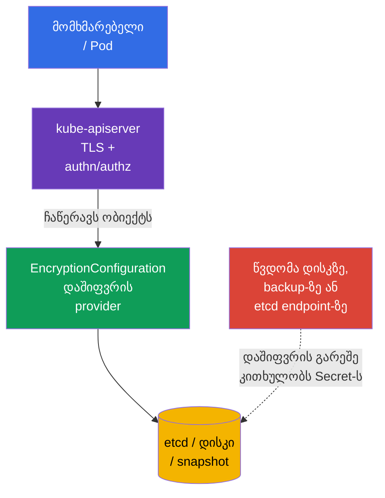
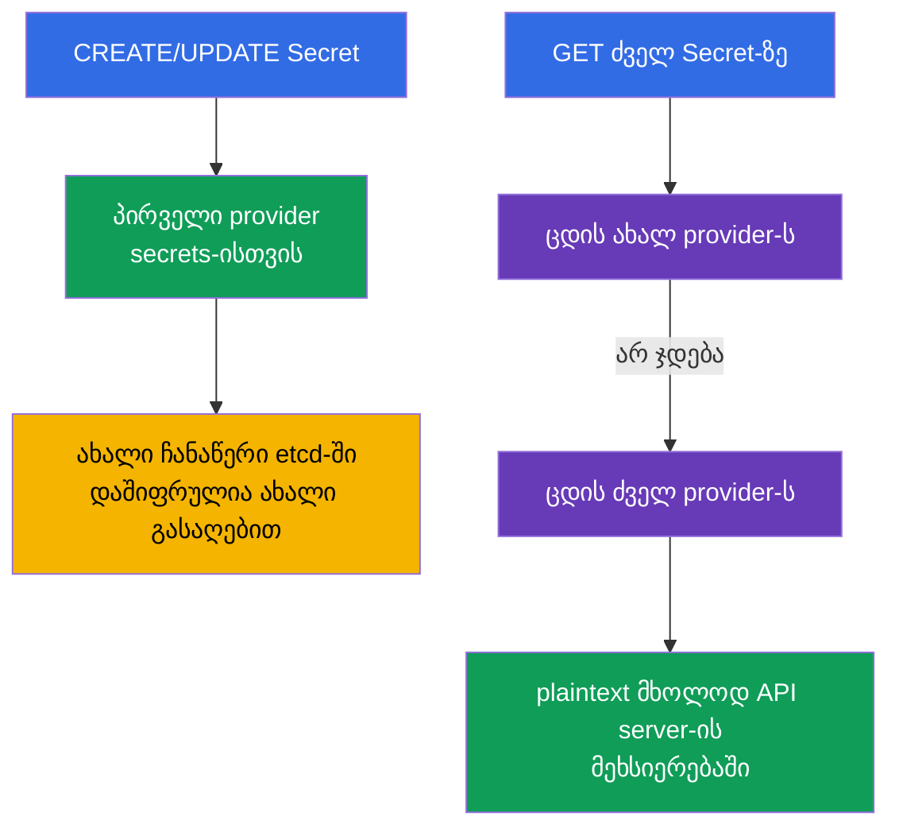
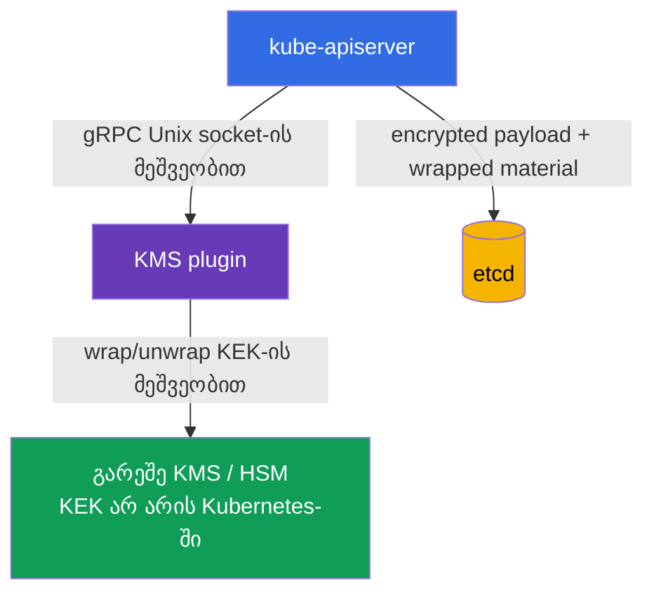
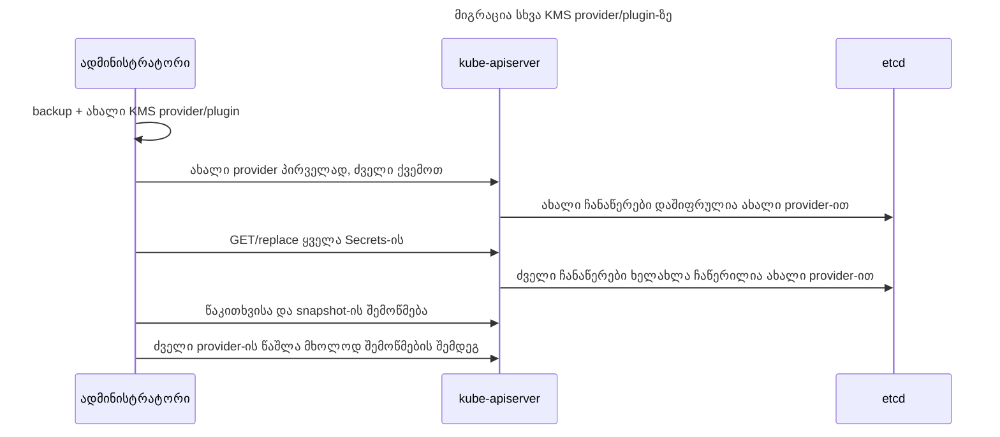

[Русская версия](ru.md) · [Eng version](README.md) · [Versión en español](es.md) · [Version française](fr.md) · [Deutsche Version](de.md) · [繁體中文版](tw.md) · [日本語版](jp.md)

# თავი 21. მონაცემთა დაშიფვრა etcd-ში და Secret-ის უსაფრთხო შენახვა

> **პრობლემა.** ვინც მიიღებს control plane-ის დისკს, წვდომას etcd-ზე, snapshot-ს ან მის backup-ს,
> გვერდზევლის RBAC-ს, authentication-სა და API server-ის audit-ს და კითხულობს `Secret.data`-ს, თუ ის
> ჩვეულებრივი base64-ის სახით არის ჩაწერილი. პაროლები, token-ები და პრივატული გასაღებები ასეთი
> კოპიიდან შესაძლებელს ხდის შეტევის გაგრძელებას უკვე კლასტერის ფარგლებს გარეთ. შერჩეული API-რესურსების
> დაშიფვრა etcd-ში ჩაწერამდე მარაგში ტოვებს ciphertext-ს და მოითხოვს გასაღების მასალაზე ცალკე წვდომას.

> **რა არის შემდეგ.** `Secret` - ეს არის ობიექტი მგრძნობიარე მონაცემებისთვის, მაგრამ მისი ველები
> `data` მხოლოდ base64-ითაა კოდირებული. თუ encryption at rest ჩართული არ არის, ვინც წვდომას მიიღებს
> etcd-ის მონაცემებზე, snapshot-ზე ან backup-ზე, შესძლებს პაროლის, token-ისა და პრივატული გასაღების
> წაკითხვას. ამ თავში ვაწყობთ შერჩეული API-რესურსების დაშიფვრას etcd-ში ჩაწერამდე `EncryptionConfiguration`-ის
> მეშვეობით, ვშლით `aescbc`, `aesgcm`, `secretbox` და `kms`-ს, გასაღების უსაფრთხო ბრუნვას და ვამოწმებთ
> შედეგს. ეს არის პრაქტიკული გაგრძელება [CKA-ს 19-ე თავისა Secret-ის შესახებ](../../../cka/course/19/ge.md)
> და etcd-ისა და კლასტერის მონაცემების კავშირისა [CKA-ს 37-ე თავიდან](../../../cka/course/37/ge.md).

> **დაცვის საზღვარი.** `EncryptionConfiguration` შიფრავს შერჩეულ API-მონაცემებს etcd-ში ჩაწერამდე.
> ეს არ არის full-disk encryption და არც დისკების, snapshot-ის ან backup-ის დამოუკიდებელი დაშიფვრა:
> snapshot შეიცავს დაცული რესურსების დაშიფრულ მნიშვნელობებს, მაგრამ თავად ისევ საჭიროებს ცალკე
> დაცვას, წვდომის კონტროლს და საჭიროებისამებრ storage-ის დაშიფვრას. Encryption at rest არ შიფრავს
> ტრაფიკს client-სა და API server-ს შორის (ამისთვის TLS-ია), არ აუქმებს RBAC-ს და არ გვიხსნის იმ
> მომხმარებლისგან, ვისაც უკვე შესწევს `get secret`-ის ან `exec`-ის შესრულების უნარი Secret-ის
> მქონე Pod-ში.

> 🧠 წვდომა etcd-ზე ან snapshot-ზე გვერდზევლის API-ის authentication-ს, authorization-ს და audit-ს; base64 არ იცავს `Secret.data`-ს, encryption at rest იცავს storage-ს გასაღებების გარეშე.

## 21.1. საფრთხის მოდელი: რატომ არის etcd განსაკუთრებით ღირებული სამიზნე

API server - Kubernetes-ის მდგომარეობასთან ჩვეული გზაა, ხოლო etcd - მისი მუდმივი მარაგსაცავია. etcd-ში
> მდებარეობს API-ობიექტები: Secrets, ConfigMaps, ServiceAccounts, RBAC bindings, Deployments და
> ბევრი სხვა. აქედან გამომდინარე, ბაზის ან მისი კოპიის წაკითხვა გვერდზევლის ჩვეულ საკონტროლო
> წერტილს - API server-ს authentication-ით, authorization-ითა და audit-ით.



გაჟონვის ტიპური გზები:

- დატყვევებულია control-plane node, მისი დისკი ან etcd-ის მონაცემთა კატალოგი;
- snapshot გადმოცემულია დაუცველ საცავში, მოხვდა ticket-ში, CI-artifact-ში ან laptop-ზე;
- ვინმეს გააქვს ქსელური და TLS-წვდომა პირდაპირ etcd-ზე;
- backup აღდგენილია ტესტურ გარემოში ფართო წვდომით;
- Secret შემთხვევით გამოტანილია log-ში, shell history-ში, Git-ში ან environment-ცვლადში.

ბოლო პუნქტს etcd-ის დაშიფვრა არ გამოასწორებს, მაგრამ პირველი ოთხი მნიშვნელოვნად უფრო რთული ხდება:
ბაზაში ciphertext ინახება, ხოლო გასაღების მასალა იქ არ უნდა იყოს. CKS-ისთვის მნიშვნელოვანია არ
გავაკეთოთ არასწორი დასკვნა: **base64 არ არის დაშიფვრა**; `kubectl get secret -o yaml` შესაძლებელია
გასაღების გარეშე decode-ირება.

| დაცვა | რისგან ეხმარება | რას არ აკეთებს |
|---|---|---|
| TLS API server/etcd | ტრაფიკის ჩაჭერას | არ შიფრავს მონაცემებს დისკზე |
| RBAC | ზღუდავს API-წვდომას Secret-ზე | არ იცავს დაქურდულ snapshot-ს |
| Encryption at rest | ciphertext შერჩეული API-მონაცემებისთვის etcd-ში და მის snapshot-ში | არ შიფრავს დისკებს, snapshot-ს ან backup-ს მთლიანად და არ მალავს Secret-ს ავტორიზებული API-client-ისგან |
| გარეშე secrets manager | გამოცალკევებს master keys-ს და lifecycle-ს კლასტერისგან | არ ჩაანაცვლებს RBAC-ს, TLS-ს და უსაფრთხო Pod-ს |

> 🧠 პირველი შესაბამისი provider შიფრავს ახალ ჩანაწერებს, API server კითხულობს providers-ს თანმიმდევრობით.

## 21.2. როგორ მუშაობს API-მონაცემების დაშიფვრა

`kube-apiserver` იყენებს providers-ის ჯერადობას, რომელიც აღწერილია `EncryptionConfiguration`-ში.
**ჩაწერისას** ის იყენებს რესურსისთვის შესაბამის პირველ provider-ს. **წაკითხვისას** ის ცდის
providers-ს თანმიმდევრობით, სანამ ერთი შეძლებს არსებული მნიშვნელობის decrypt-ს. HA-ში ლოკალური
გასაღების ბრუნვისას ახალ key-ს ჯერ ყველა API server-ზე მეორედ ამატებენ, პირველად მხოლოდ მაშინ
აქცევენ, როცა ახალი კონფიგურაცია ყველგან გავრცელდა; ძველი key ინახება re-encryption-ის დასრულებამდე.



ფაილის მინიმალური ფორმატი:

```yaml
apiVersion: apiserver.config.k8s.io/v1
kind: EncryptionConfiguration
resources:
- resources:
  - secrets
  providers:
  - aescbc:
      keys:
      - name: key1
        secret: <base64-encoded-32-byte-key>
  - identity: {}
```

`resources` ჩამოთვლის API-რესურსებს, არა namespace-ს. ჩვეულებრივ, ჯერ იცავენ `secrets`-ს; დასაბუთებული
საჭიროებისას შესაძლებელია დაემატოს `configmaps`, CRD ან სხვა მგრძნობიარე რესურსები. არ ვშიფრავთ
ყველაფერს გაუაზრებლად: ეს ზრდის დატვირთვას, ართულებს აღდგენას და არ ჩაანაცვლებს მონაცემთა
კლასიფიკაციას.

`resources`-ის ელემენტები დამუშავდება თანმიმდევრობით: უფრო ადრეული matching-კონფიგურაცია გამოცალკევდება
პრიორიტეტით. არ დააკოპიროთ ერთი და იმავე explicit resource დამოუკიდებელ ბლოკებში მიზეზის გარეშე და
არ შექმნათ overlapping wildcard გამონათქვამები. მისაღებია documented pattern: უფრო specific
გამონაკლისი უფრო **ადრე** დგება ვიდრე ფართო wildcard, მაგალითად `events` plaintext-ად დარჩენა და
დანარჩენის დაშიფვრა:

```yaml
resources:
- resources:
  - events
  providers:
  - identity: {}
- resources:
  - '*.*'
  providers:
  - secretbox:
      keys:
      - name: key1
        secret: <base64-encoded-32-byte-key>
```

აქ `events` ემთხვევა პირველ ელემენტს და `*.*`-მდე არ მიდის; specific rule-ის თანმიმდევრობა
wildcard-ის წინ security boundary-ის ნაწილია.

`identity: {}` არაფერს არ შიფრავს. ჯერადობის ბოლოში ის საშუალებას აძლევს მიგრაციის პერიოდში ძველი
plaintext-ჩანაწერების წაკითხვას. ახალი ჩანაწერისთვის ის საშიშია მხოლოდ მაშინ, როცა ის პირველია:
პირველი provider განსაზღვრავს ახალი ჩანაწერის ფორმატს. ყველა ჩანაწერის re-encrypted-ის შემდეგ,
`identity` შესაძლებელია მოვხსნათ, თუ ძველი მონაცემებისთვის fallback არ არის საჭირო.

> **კრიტიკული დამოკიდებულება.** დაკარგული გასაღები, re-encryption-მდე წაშლილი, ან მიუწვდომელი
> KMS შესძლებს ობიექტების ნაწილის წაუკითხავად ქცევას და control plane-ის მუშაობის დაზიანებას.
> კონფიგურაცია და გასაღებები საჭიროებენ backup-ს, წვდომის კონტროლს და წინასწარ გავარჯიშებულ ბრუნვას.

> 🎯 `identity` ბოლოში კითხულობს ძველ plaintext-ს, პირველად ტოვებს ახალ ჩანაწერებს დაუშიფრავად.

## 21.3. Providers: `aescbc`, `aesgcm`, `secretbox`, `kms` და `identity`

Kubernetes მხარს უჭერს რამდენიმე provider-ს. Production-ისთვის არ აირჩიოთ `identity`, როგორც
ერთადერთი დაცვა: ეს encryption at rest-ის შეგნებული გამორთვაა.

| Provider | მექანიზმი | როდის ვარგისია | მთავარი შეზღუდვა |
|---|---|---|---|
| `identity` | plaintext | დროებითი fallback ძველი მონაცემებისთვის | არ შიფრავს საერთოდ |
| `aescbc` | AES-CBC PKCS#7 padding-ით | სასწავლო/legacy-მექანიკა; ახალი production-კონფიგურაციებისთვის არ არის რეკომენდებული | სუსტია: არ არსებობს ჩაშენებული authentication/MAC, შესაძლებელია padding-oracle შეტევები; გასაღები ინახება control plane-ზე |
| `aesgcm` | AES-GCM, AEAD | მხოლოდ ავტომატიზებული ბრუნვით | ბრუნვის გარეშე არ არის რეკომენდებული; ლიმიტი 200 000 ჩანაწერი გასაღებზე |
| `secretbox` | XSalsa20 + Poly1305, AEAD | ძლიერი და სწრაფი ლოკალური provider | 32-ბაიტიანი გასაღები ინახება control plane-ზე |
| `kms` | envelope encryption KMS plugin-ის მეშვეობით | production გარეშე key manager/HSM/cloud KMS-ით | plugin/KMS-ის ხელმისაწვდომობა API server-ის დამოკიდებულებად იქცევა |

> 🔬 AEAD, CBC, ჩანაწერების ლიმიტები და გასაღებების განთავსება განსაზღვრავს provider-ის არჩევანს.

`aescbc` იყენებს base64-ით კოდირებულ AES-გასაღებს; მაგალითში ეს 32-ბაიტიანი გასაღებია (AES-256).
Kubernetes ღებულობს 16, 24 ან 32-ბაიტიან გასაღებებს. `aescbc`-ს არ აქვს ჩაშენებული authentication/MAC,
განსხვავებით AEAD-provider `aesgcm`-ისგან; ამიტომ Kubernetes-ის მიმდინარე დოკუმენტაცია CBC-ვარიანტს
სუსტად მიიჩნევს. ეს მაგალითი საჭიროა გამოცდის მექანიკისა და თანხვედრისთვის, არა როგორც production
recommendation. ლაბორატორიისთვის 32-ბაიტიანი მნიშვნელობის მისაღებად:

```bash
head -c 32 /dev/urandom | base64
```

მაგალითი `aescbc`-სთვის:

```yaml
apiVersion: apiserver.config.k8s.io/v1
kind: EncryptionConfiguration
resources:
- resources:
  - secrets
  providers:
  - aescbc:
      keys:
      - name: secrets-aescbc-2026-08
        secret: <base64-encoded-32-byte-key>
  - identity: {}
```

`aesgcm` ასევე იყენებს AEAD-ს - encryption-ს და მთლიანობის შემოწმებას. Kubernetes-ის მიმდინარე
დოკუმენტაციაში ერთი AES-GCM გასაღებისთვის დაწესებულია პრაქტიკული ლიმიტი: არა უმეტეს 200 000
ჩანაწერისა; შემდეგ გასაღები საჭიროებს ბრუნვას. ამიტომ ეს provider ვარგისია კონტროლირებადი მოცულობისა
და ავტომატიზებული ბრუნვის დროს, ხოლო Secret-ჩანაწერების მაღალი ნაკადის შემთხვევაში სასურველია KMS-ის
პრიორიტეტი ან გასაღების lifecycle-ის განსაკუთრებით ფრთხილი დაპროექტება.

`secretbox` იყენებს XSalsa20-ს და Poly1305-ს, წარმოადგენს AEAD-provider-ს და მოითხოვს 32-ბაიტიან
გასაღებს. Kubernetes მას აღნიშნავს, როგორც ძლიერ და სწრაფ ვარიანტს. ლაბორატორიაში ქვემოთ გამოიყენება
`aescbc`, legacy-მექანიკისა და მისი შეზღუდვების გასაანალიზებლად; production-ში ლოკალური provider-ის
არჩევანმა უნდა გაითვალისწინოს ბრუნვისა და გასაღების შენახვის მოთხოვნები.

```yaml
apiVersion: apiserver.config.k8s.io/v1
kind: EncryptionConfiguration
resources:
- resources:
  - secrets
  providers:
  - aesgcm:
      keys:
      - name: secrets-aesgcm-2026-08
        secret: <base64-encoded-32-byte-key>
  - identity: {}
```

არ ჩააგდოთ ნამდვილი key Git-ში, Helm values-ში, Terraform state-ში, chat-ში ან ticket-ში. ლოკალურ
გასაღებთან ერთად კონფიგურაციის ფაილი ხელმისაწვდომი უნდა იყოს მხოლოდ root-ისა და API server-ის
პროცესისთვის, მაგალითად:

```bash
# წინასწარ შევქმნათ parent კატალოგი: install არ ქმნის არარსებულ კატალოგს.
sudo install -d -o root -g root -m 0700 /etc/kubernetes/enc
sudo install -o root -g root -m 0600 encryption-config.yaml \
  /etc/kubernetes/enc/encryption-config.yaml
sudo stat -c '%U:%G %a %n' \
  /etc/kubernetes/enc \
  /etc/kubernetes/enc/encryption-config.yaml
```

ლოკალური `aescbc`/`aesgcm` იცავს snapshot-ს ადამიანისგან, ვისაც მხოლოდ snapshot-ი აქვს, არა
control-plane filesystem-ი. ეს სასარგებლო baseline-ია, თუმცა გასაღები იმავე სანდო მანქანაზე
მდებარეობს. მოვალეობების გამოცალკევებისა და მდგრადი გასაღების lifecycle-ისთვის იყენებენ `kms`-ს.

> 🎯 Kube-apiserver ღებულობს `--encryption-provider-config`-ს mount-ით ხელმისაწვდომი path-ით; შეამოწმეთ readiness და Secret-ის წაკითხვა API-ს მეშვეობით.

## 21.4. `EncryptionConfiguration`-ის დაკავშირება kube-apiserver-თან

ფაილი თავისთავად არაფერს არ ცვლის. API server-მა უნდა მიღოს flag
`--encryption-provider-config=<path>`. kubeadm-კლასტერში `kube-apiserver` - static Pod-ია; მისი
manifest ჩვეულებრივ მდებარეობს `/etc/kubernetes/manifests/kube-apiserver.yaml`-ში. manifest-ის
შეცვლას აღიქვამს kubelet და API server-ს ხელახლა უსტარტავს.

```yaml
# /etc/kubernetes/manifests/kube-apiserver.yaml (ფრაგმენტები)
spec:
  containers:
  - name: kube-apiserver
    command:
    - kube-apiserver
    - --encryption-provider-config=/etc/kubernetes/enc/encryption-config.yaml
    volumeMounts:
    - name: encryption-config
      mountPath: /etc/kubernetes/enc
      readOnly: true
  volumes:
  - name: encryption-config
    hostPath:
      path: /etc/kubernetes/enc
      # კატალოგი მომზადებულია ზემოთ; Directory არ მალავს typo-ს ცარიელი კატალოგით.
      type: Directory
```

flag-ის path ხილულია **API server-ის კონტეინერიდან**, ამიტომ ერთი ფაილი host-ზე არ არის საკმარისი:
საჭირო არის `hostPath` და `volumeMount`. შეადარეთ YAML-ის indent-ები და არსებული volume-სახელები, არ
ჩაანაცვლოთ მთელი manifest შაბლონით. HA control plane-ზე ერთი და იმავე დაცული ფაილი და flag უნდა
იყოს API server-ის ყველა node-ზე, ხოლო ცვლილება ერთი node-ის მიხედვით გადადის health-ისა და
quorum-ის კონტროლით.

პრაქტიკული სამუშაო თანმიმდევრობა:

1. გააკეთეთ და შეამოწმეთ ახალი etcd snapshot; პროცედურა მოცემულია [CKA-ს 37-ე თავში](../../../cka/course/37/ge.md).
2. გენერაცია გაუკეთეთ გასაღებს shell history-ს გარეთ, შეინახეთ კონფიგურაცია mode `0600`-ით დაცულ path-ზე.
3. დაამატეთ volume, mount და `--encryption-provider-config` API server-ის manifest-ში.
4. დაელოდეთ static Pod-ის restart-ს და შეამოწმეთ `kubectl get --raw='/readyz?verbose'`.
5. შექმენით ტესტური Secret, დარწმუნდით, რომ API კითხულობს მას, შემდეგ შეასრულეთ ყველა ძველი ჩანაწერის re-encryption.

```bash
# შევამოწმოთ flag და mount მოქმედ static-Pod manifest-ში.
sudo grep -n -- '--encryption-provider-config\|encryption-config' \
  /etc/kubernetes/manifests/kube-apiserver.yaml

# API server ისევ მზადაა manifest-ის ცვლილების შემდეგ.
kubectl get --raw='/readyz?verbose'
kubectl -n kube-system get pods -l component=kube-apiserver
```

> **ფრთხილად.** შეცდომა path-ში, YAML-ში ან გასაღებში შესძლებს API server-ის ამოუშვებლობას. მუშაობა
> control-plane node-ის console-ის მეშვეობით, შეინახეთ manifest-ის backup და არ წაშალოთ წინა
> კონფიგურაცია, სანამ შემოწმება დასრულებული არ იქნება. managed Kubernetes-ისთვის static Pod არ
> ედიტირდება: ჩაერთოთ encryption provider-ის სტანდარტული მექანიზმით და მიმართეთ მისი KMS/cluster
> update პროცედურას.

> 🏭 KMS გამოაქვს KEK, მაგრამ plugin-ს და key manager-ს საჭიროებთ HA, მინიმალური permissions და შემოწმებული restore.

## 21.5. KMS და envelope encryption

Provider `kms` აკავშირებს API server-ს ლოკალურ KMS plugin-თან Unix socket-ის მეშვეობით; plugin
კონტაქტში შედის გარეშე KMS/HSM-თან, სადაც ინახება key encryption key (KEK). `EncryptionConfiguration`-ში
KEK არ არსებობს. KMS v1 და v2 იყენებენ envelope encryption-ს, მაგრამ სხვადასხვა გზით ღებულობენ data
encryption key-ს (DEK), ამიტომ მათი ერთი და იმავე თანმიმდევრობით აღწერა შეუძლებელია.



KMS **v2**-ის კონცეპტუალური ფრაგმენტი:

```yaml
apiVersion: apiserver.config.k8s.io/v1
kind: EncryptionConfiguration
resources:
- resources:
  - secrets
  providers:
  - kms:
      apiVersion: v2
      name: production-kms
      endpoint: unix:///var/run/kmsplugin/socket.sock
      timeout: 3s
  - identity: {}
```

განსხვავებები საჭიროებს ცალკე ფიქსირებას:

| თვისება | KMS v1 | KMS v2 |
|---|---|---|
| სტატუსი | deprecated Kubernetes 1.28-იდან; 1.29-იდან ნაგულისხმებად გამორთულია და მოითხოვს ცალსახა `--feature-gates=KMSv1=true` | stable Kubernetes 1.29-იდან; რეკომენდებული API ახალი კონფიგურაციებისთვის |
| DEK | ახალი შემთხვევითი DEK ყოველი დაშიფვრის ოპერაციისთვის; plugin ახვევს ყოველ DEK-ს KEK-ით | API server ინახავს secret seed-ს და KDF-ის მეშვეობით იღებს ერთჯერად DEK-ს ყოველი ოპერაციისთვის; seed ახვევა KEK-ით და იცვლება KEK-ის ბრუნვისას |
| Config-ველები | `apiVersion: v1` ან ველი არ არსებობს; `name`, `endpoint`, `cachesize`, `timeout` | `apiVersion: v2`, `name`, `endpoint`, `timeout`; `cachesize` არ არის მისაღები |
| წარმადობა | მეტი gRPC/KMS-გამოძახება; cache ინახავს unwrapped DEK-ს | KMS-გამოძახება ცალკე DEK-ის შესაფუთად ყოველ ჩანაწერზე არ საჭიროებია |
| გასაღების იდენტიფიკაცია | დამოკიდებულია v1 plugin-ზე | `Status` აბრუნებს `version: v2`-ს, `healthz: ok`-ს და მიმდინარე KEK-ის `key_id`-ს |

> **ცხრილის ვერსიული საზღვარი.** შემოწმების თარიღით **2026-09-15** KMS v1 exam snapshot v1.35-ში ჯერ
> კიდევ არსებობს, მაგრამ deprecated და ნაგულისხმებად გამორთულია; legacy compatibility-ისთვის საჭიროა
> ცალსახა feature gate. არ გამოიყენოთ ის ახალი კონფიგურაციებისთვის და შეამოწმეთ თქვენი minor-ვერსიის
> KMS documentation.

v2-ში etcd-ში ინახება encrypted payload და material, საკმარისი API server-ისთვის ერთჯერადი DEK-ის
დაცული seed-იდან მისაღებად; ეს არ არის მოდელი, სადაც «plugin ყოველ ჩანაწერზე გამოსცემს ახალ wrapped
DEK-ს». `key_id`-ის ბრუნვა API server-ს აიძულებს მიღოს ახალი seed, დაიცვას ის ახალი KEK-ით და
გამოიყენოს ის შემდგომი ჩანაწერებისთვის. ძველი მონაცემები ხელახლა იწერება ცალკე კონტროლირებადი
re-encryption პროცედურით.

ზუსტი ველები და ხელმისაწვდომი API-ვერსია დამოკიდებულია Kubernetes-ის ვერსიასა და შერჩეულ plugin-ზე.
შეამოწმეთ თქვენი ვერსიის ოფიციალური დოკუმენტაცია და plugin-ის deployment; არ დააკოპიროთ production-ზე
თვითნებური KMS v1/v2 მაგალითი. Socket ხელმისაწვდომი უნდა იყოს API server-ის კონტეინერისთვის ცალსახა
volume mount-ის მეშვეობით, ხოლო წვდომა მასზე შეზღუდული უნდა იყოს. plugin-ს თავად უნდა გამოიყენოს
TLS/authentication დაშორებულ manager-თან, ჰქონდეს მინიმალური KMS permissions და არ დაბეჭდოს
plaintext logs-ში.

KMS-ისთვის სასარგებლოა ორი ექსპლუატაციური მექანიზმი. Flag `--encryption-provider-config-automatic-reload=true`
API server-ს აიძულებს ხელახლა წაიკითხოს კონფიგურაცია restart-ის გარეშე (მოსახერხებელია გასაღების
ბრუნვისას). plugin-ის ჯანმრთელობა მოწმდება endpoint-ით `/healthz/kms-providers` და საერთო
`/healthz`-ით; automatic reload-ისას ცალკეული health checks ერთდება. API server KMS v2 `Status`-ს
ეკითხება დაახლოებით ერთხელ წუთში healthy მდგომარეობაში და უფრო ხშირად ჩავარდნისას. Cache არ ხდის
plugin/KEK-ს არასავალდებულო დამოკიდებულებად: მათი მიუწვდომლობა შესძლებს დაზიანოს startup/cache
warm-up, ჯერ არ გახსნილი material-ის decrypt, KEK/`key_id` rotation და snapshot-ის აღდგენა. Plugin
და დაშორებული manager უნდა იყოს HA-ში, ხოლო restore საჭიროებს იმავე KEK-ს ან დოკუმენტირებულ მიგრაციას.

KMS აუმჯობესებს Secrets-ის გამოცალკევებას, მაგრამ ამატებს ექსპლუატაციურ მოთხოვნებს:

- KMS v1-ისთვის plugin/KMS მნიშვნელოვნად უფრო ახლოსაა synchronous data path-თან: ახალი DEK
  ახვევა KMS-ის მეშვეობით, ხოლო cache miss მოითხოვს unwrap-ს. KMS v2-ისთვის API server ლოკალურად
  იღებს ერთჯერად DEK-ს დაცული seed-იდან, ამიტომ არ იძახებს remote KMS-ს ყოველ ჩვეულ API
  read/write-ზე. Plugin და manager ისევ კრიტიკულია startup/cache warm-up-ისთვის, uncached
  decryption-ისთვის, key rotation-ისთვის და recovery-ისთვის; დააკვირდით `Status` health-ს,
  `key_id`-ის სტაბილურობას, `EncryptRequest`/`DecryptRequest`-ის latency-ს, შეცდომებს,
  ხელმისაწვდომობას, quota-ს და credentials-ის ვადას;
- დააპროექტეთ plugin-ისა და KMS-ის HA: ეს კრიტიკული დამოკიდებულებაა, ამიტომ plugin/KEK-ის
  მიუწვდომლობას შესძლებია გამოწვევა შეცდომები დაშიფრული რესურსების წაკითხვასა და ჩაწერაში;
  წინასწარ შეამოწმეთ recovery-პროცესი;
- გააკეთეთ backup metadata-სთვის და დაადოკუმენტირეთ key IDs, მაგრამ **არ** ექსპორტირდეთ master
  keys etcd-ის backup-ში;
- შეზღუდეთ IAM/ACL: API server ღებულობს მხოლოდ საჭირო encrypt/decrypt ოპერაციებს, ხოლო
  კლასტერის ადმინისტრატორი აუცილებლად არ ღებულობს KEK-ის მართვის უფლებებს;
- ტესტირება გაუკეთეთ snapshot-ის აღდგენას იმავე KMS key-ზე წვდომით ინციდენტამდე.

გარეშე KMS არ ნიშნავს, რომ Secret არ ჩნდება Kubernetes-ში. თუ აპლიკაცია ღებულობს ჩვეულ Kubernetes
Secret-ს, plaintext ხელმისაწვდომი რჩება მათთვის, ვისაც API ან Pod ხელეწიფება. Secrets-ის short-lived
identity-ით გამოტანისთვის იყენებენ Vault Agent-ს, Secrets Store CSI Driver-ს ან External Secrets
Operator-ს, მაგრამ ფრთხილად ამოწმებენ მათ RBAC-ს და synchronization-ს: operator, რომელიც ქმნის
Kubernetes Secret-ს, ისევ ათავსებს კოპიას etcd-ში.

> 🎯 ახალი key/provider პირველად, ძველის შენარჩუნებით → ობიექტების ხელახლა ჩაწერა → წაკითხვის/storage-ის შემოწმება → ძველი key-ის წაშლა.

## 21.6. Provider-ის ბრუნვა და არსებული მონაცემების re-encryption

კონფიგურაციის შეცვლა არასაკმარისია. ახალი provider ვრცელდება მხოლოდ **ახალ ან განახლებულ**
ობიექტებზე; ძველი ჩანაწერები რჩება დაშიფრული ძველი გასაღებით ან plaintext. ამიტომ უსაფრთხო ბრუნვა
ყოველთვის შეიცავს ორ სხვადასხვა მოქმედებას: ჯერ უზრუნველვყოთ ძველი წაკითხვა და ახალი გასაღებით
ჩაწერა, შემდეგ ხელახლა ჩავწეროთ არსებული ობიექტები.

### `aescbc`/`aesgcm` გასაღების ბრუნვა

ვიგულისხმოთ, რომ ჯერ გამოიყენებოდა `key-old`. HA control plane-ზე `key-new` ერთბაშად პირველად
ვერ დაისმის: უკვე განახლებულ API server-ს შესძლებია ობიექტის ახალი გასაღებით ჩაწერა, სანამ სხვა
API server ჯერ არ შესძლებია მისი decrypt. ჩაატარეთ ბრუნვა ორ ფაზაში.

1. დაამატეთ `key-new` **მეორედ** `key-old`-ის შემდეგ კონფიგურაციაში ყოველ control-plane node-ზე.
2. ხელახლა უსტარტეთ API server ან გაავრცელეთ კონფიგურაციის reload **ყველა** API server-ზე. ახლა
   თითოეულს შესძლებია ორივე გასაღების decrypt, ხოლო ახალი ჩანაწერები ჯერ იყენებენ `key-old`-ს.
3. აქციეთ `key-new` **პირველად**, `key-old`-ის მეორედ შენარჩუნებით, და ისევ გაავრცელეთ
   კონფიგურაცია ყველა API server-ზე. მხოლოდ ახლა იქმნება ახალი ჩანაწერები `key-new`-ით.

ფაზა 1 - ახალი key მეორედ ყველა API server-ზე:

```yaml
apiVersion: apiserver.config.k8s.io/v1
kind: EncryptionConfiguration
resources:
- resources:
  - secrets
  providers:
  - aescbc:
      keys:
      - name: key-old-2026-01
        secret: <old-base64-32-byte-key>
      - name: key-new-2026-08
        secret: <new-base64-32-byte-key>
  - identity: {}
```

ფაზა 2 - ფაზა 1-ის ყველა API server-ზე გავრცელების შემდეგ ახალი key ხდება პირველი:

```yaml
apiVersion: apiserver.config.k8s.io/v1
kind: EncryptionConfiguration
resources:
- resources:
  - secrets
  providers:
  - aescbc:
      keys:
      - name: key-new-2026-08
        secret: <new-base64-32-byte-key>
      - name: key-old-2026-01
        secret: <old-base64-32-byte-key>
  - identity: {}
```

ფაზა 2-ის ყველა API server-ზე გავრცელების შემდეგ ხელახლა ჩაწერეთ ყველა Secrets. ქვემოთ მოცემული
ბრძანება ღებულობს თითოეულ ობიექტს და ისევ უგზავნის API-ს; ზუსტად ახალი provider, პირველად ყოფნის
გამო, დაშიფრავს ჩანაწერს. მასობრივ ოპერაციამდე შექმენით snapshot და დაიწყეთ ტესტური namespace-ით.

```bash
# ხელახლა ჩავწეროთ ყველა Secrets API server-ის მეშვეობით.
kubectl get secrets --all-namespaces -o json | kubectl replace -f -

# თუ დაცული არის ConfigMaps, ისინი ხელახლა იწერება ცალკე გააზრებული ოპერაციით.
# kubectl get configmaps --all-namespaces -o json | kubectl replace -f -
```

> 🔬 Storage Version Migration მასობრივად ხელახლა წერს storage-ს და საჭიროებს ცალკე feature/operational rollout-ს.

### Production-ის გაფართოება: Storage Version Migration

production-ში მასობრივი ხელახლა ჩაწერისთვის არსებობს Kubernetes-native ალტერნატივა: **Storage
Version Migration**. Kubernetes 1.36-ში მას აქვს beta სტატუსი და ნაგულისხმებად გამორთულია;
ცალსახა ჩართვისა და თქვენი ვერსიის დოკუმენტაციის მიხედვით კონფიგურაციის შემდეგ, მიგრაცია ხელახლა
წერს ობიექტებს API storage path-ის მეშვეობით. ეს ვარგისია, კერძოდ, re-encryption-ისთვის
`EncryptionConfiguration`-ის ან გასაღებების შეცვლის შემდეგ. CKS-ისთვის საკმარისია providers-ის
თანმიმდევრობისა და ობიექტების ძალდატანებული ხელახლა ჩაწერის გაგება; ზემოთ მოცემული `kubectl
replace` რჩება მარტივ გამოცდის გზად, ხოლო Storage Version Migration საჭიროებს ცალკე operational
rollout-ს, დაკვირვებას და შემოწმებულ rollback/recovery-პროცესს.

> 🏭 **Upstream v1.37.** Kubernetes v1.37-ში ჩაშენებული `StorageVersionMigration` API/controller გახდა GA და enabled by default. ეს ცვლის production-ის მიმდინარე სტატუსს, მაგრამ არ ცვლის ამ თავის CKS Core workflow-ს, რომელი დარჩენილია მიბმული exam/training context-ზე. იხილეთ [Kubernetes v1.37 Security Delta](../APPENDIX_K8S_137_SECURITY_DELTA_GE.md).

`kubectl replace` საჭიროებს მიმდინარე `resourceVersion`-ს; მაღალი კონკურენციისას შესაძლებელია
კონფლიქტები. Production-ში ჩაატარეთ controlled script retry-ით, API latency-ის დაკვირვებით და
შეთანხმებული ფანჯარით, ვიდრე გაუფიქრებლად ჩასდოთ ბრძანება CI-ში. არ ჩაწეროთ JSON Secret-ით
დისკზე ან pipeline log-ში.

re-encryption-ისა და გასაღების შემოწმების დასრულების შემდეგ წაშალეთ `key-old` config-იდან, ხელახლა
უსტარტეთ API server და ისევ შეამოწმეთ წაკითხვა. ძველი key-ის წაშლა ობიექტების ხელახლა ჩაწერამდე
დაუშვებელია: აღდგენილი snapshot ან ძველი ჩანაწერი წაუკითხავი გახდება.

### გადასვლა `identity`-იდან დაშიფვრაზე

ძველი კლასტერისთვის დასაწყისი მსგავსია: ახალი encryption provider დგება პირველად, `identity` რჩება
ბოლოში, შემდეგ ხელახლა იწერება რესურსები.

```yaml
providers:
- aesgcm:
    keys:
    - name: key-2026-08
      secret: <base64-encoded-32-byte-key>
- identity: {}
```

ძველი ჩანაწერების re-encryption-ის შემდეგ `identity: {}` შესაძლებელია მოვხსნათ. მისი ქვემოთ
დატოვება მისაღებია მხოლოდ როგორც ცალსახა დროებითი არჩევანი თანხვედრისთვის; `identity`-ის
არსებობა არ ჩავთვალოთ მტკიცებულებად, რომ ყველა მონაცემი დაცულია.

> 🏭 KEK-ის ბრუნვა და provider-ის შეცვლა განსხვავებულია; შეინარჩუნეთ ძველი მონაცემების decrypt restore-ის შემოწმებამდე.

### KMS v2 KEK-ის ბრუნვა

remote KEK-ის ჩვეული ბრუნვა KMS v2-ში ხდება **გარეშე KMS/plugin-ის შინაგანად**. plugin აცნობებს
მიმდინარე საჯარო `key_id`-ს `Status`-ის მეშვეობით; API server ამ ID-ს authoritative-ად მიიჩნევს.
როცა `key_id` იცვლება, API server ღებულობს ახალ seed-ს, დაცულს ახალი KEK-ით, და გამოიყენებს მას
შემდგომი დაშიფვრებისთვის. ამ ჩვეული KEK rotation-ისთვის არ ემატება მეორე `kms` provider, არ
იცვლება provider order და API server არ ხელახლა უსტარტდება მხოლოდ KEK-ის შეცვლის გამო.

healthy მდგომარეობაში API server `Status`-ს ეკითხება დაახლოებით ერთხელ წუთში და შესძლებია
გამოიყენოს ბოლო valid მდგომარეობა დაახლოებით სამ წუთს. ამიტომ არ დაიწყოთ re-encryption ბრუნვის
შემდეგ პირდაპირ: ჯერ დაადასტურეთ, რომ ახალი სტაბილური `key_id` დანახულია ყველა API server-ის
მიერ და plugin არ ხტება ID-ებს შორის. შემდეგ ხელახლა ჩაწერეთ საჭირო ობიექტები API-ს მეშვეობით,
თუ storage-მა ახალ KEK-ზე გადასვლა უნდა. Upstream გირჩევთ KMS v2 KEK-ის ბრუნვას არა უფრო
ხშირად, ვიდრე 90 დღეში ერთხელ. ზუსტი workflow და observability დამოკიდებულია plugin-სა და
გარეშე KMS-ზე.

### მიგრაცია სხვა KMS provider/plugin-ზე

ეს **არ არის** ჩვეული KEK rotation. თუ კლასტერი ნამდვილად ინაცვლებს სხვა კონფიგურირებულ KMS
provider-ზე, plugin-ზე ან endpoint-ზე, ახალი `kms` provider დგება პირველად, ძველი decrypt-ისთვის
ინახება ქვემოთ, შემდეგ API ხელახლა წერს მონაცემებს, და მხოლოდ შემოწმების შემდეგ ძველი
provider/plugin გამოსცილდება ექსპლუატაციისგან.



> 🎯 დაამტკიცეთ API server-ის config, Secret-ის ავტორიზებული წაკითხვა და plaintext marker-ის არარსებობა raw etcd value-ში.

## 21.7. შემოწმება: API, კონფიგურაცია და etcd

არ შემოწმდეთ მხოლოდ ფაილის არსებობა. საჭიროა სამი ფაქტის დამტკიცება: API server ნამდვილად
იყენებს flag-ს, Secret ხელმისაწვდომია API-ს მეშვეობით და etcd-ში plaintext არ ინახება. ბოლო
შემოწმება უნდა შესრულდეს მხოლოდ იზოლირებულ lab-კლასტერზე ან შეთანხმებული პროცედურით: პირდაპირი
წვდომა etcd-ზე მოითხოვს privileges-ს და შესძლებია გაამხილოს ნამდვილი მონაცემები.

ჯერ შექმენით უვნებელი canary Secret უნიკალურ, ადვილად საძებნელ მნიშვნელობით:

```bash
kubectl -n default create secret generic encryption-check \
  --from-literal=probe='not-a-real-secret-rotate-me'
kubectl -n default get secret encryption-check \
  -o jsonpath='{.data.probe}' | base64 -d; echo
```

მეორე გამომავალი ადასტურებს API-ის ჩვეულ მუშაობას, მაგრამ არ ადასტურებს encryption at rest-ს:
API server ვალდებულია decrypt-ი ავტორიზებული client-ისთვის. შემდეგ შეამოწმეთ manifest, readiness
და API server-ის journal:

```bash
sudo grep -n -- '--encryption-provider-config' \
  /etc/kubernetes/manifests/kube-apiserver.yaml
kubectl get --raw='/readyz?verbose'
kubectl -n kube-system logs kube-apiserver-$(hostname) --tail=100
```

static Pod-ის სახელი შესძლებია განსხვავდებოდეს `$(hostname)`-ისგან; ჯერ მიიღეთ ის `kubectl -n
kube-system get pods -l component=kube-apiserver`-ის მეშვეობით. არ გამოტანოთ production-logs
დაუცველ ადგილში: დიაგნოსტიკური მონაცემები შესძლებია შეიცავდეს ობიექტების სახელებსა და წვდომის
შეცდომებს.

სასწავლო self-managed კლასტერისთვის შესაძლებელია მნიშვნელობის აღება პირდაპირ `etcdctl`-ის
მეშვეობით და დარწმუნება, რომ marker არ არსებობს პასუხის ბაიტებში. TLS-პარამეტრები ქვემოთ ტიპური
kubeadm-მაგალითია: ჯერ შეადარეთ endpoint, CA და cert/key paths **მიმდინარე** etcd manifest-ს.
შემოწმება fail-closed-ია: PASS შესაძლებელია მხოლოდ იმ შემთხვევაში, თუ `etcdctl`-მა წაიკითხა
საჭირო key-ის არაცარიელი მნიშვნელობა, `strings` წარმატებით დამუშავდა და marker ვერ მოიძებნა.

```bash
(
  set -euo pipefail
  raw_file="$(mktemp)"
  trap 'rm -f "$raw_file"' EXIT

  # ჩაანაცვლეთ endpoint და TLS paths მიმდინარე etcd manifest-ის მნიშვნელობებით.
  if ! ETCDCTL_API=3 etcdctl get /registry/secrets/default/encryption-check \
    --endpoints=https://127.0.0.1:2379 \
    --cacert=/etc/kubernetes/pki/etcd/ca.crt \
    --cert=/etc/kubernetes/pki/etcd/server.crt \
    --key=/etc/kubernetes/pki/etcd/server.key \
    --print-value-only >"$raw_file"; then
    echo 'ERROR: etcdctl could not read the canary object' >&2
    exit 1
  fi

  if [ ! -s "$raw_file" ]; then
    echo 'ERROR: etcd key is absent or has an empty value' >&2
    exit 1
  fi

  # grep=1 ნიშნავს, რომ marker ვერ მოიძებნა; არ დავურიოთ ეს etcdctl/strings-ის შეცდომას.
  set +e
  strings "$raw_file" | grep -Fq 'not-a-real-secret-rotate-me'
  status=("${PIPESTATUS[@]}")
  set -e

  if [ "${status[0]}" -ne 0 ]; then
    echo 'ERROR: strings could not inspect the etcd value' >&2
    exit 1
  elif [ "${status[1]}" -eq 0 ]; then
    echo 'FAIL: plaintext marker is present in etcd' >&2
    exit 1
  elif [ "${status[1]}" -ne 1 ]; then
    echo 'ERROR: plaintext verification failed unexpectedly' >&2
    exit 1
  fi

  echo 'OK: etcd value was read and plaintext marker was not found'
)
```

ძველი მონაცემებისთვის ეს ტესტი შესრულდება re-encryption-ის შემდეგ. etcd-ის მონაცემებს ჩვეულებრივ
აქვს encryption provider-ის ფორმატის prefix; არ დააშენოთ შემოწმება შინაგან ფორმატზე, რომელი
დამოკიდებულია Kubernetes-ის ვერსიაზე.

ტესტის შემდეგ წაშალეთ canary Secret და შეამოწმეთ, რომ backup/restore runbook შენარჩუნებულია:

```bash
kubectl -n default delete secret encryption-check
```

| რის შემოწმებაც | მოსალოდნელი შედეგი |
|---|---|
| API server-ის manifest | არსებობს `--encryption-provider-config` და სწორი read-only mount |
| readiness | `/readyz?verbose` წარმატებულია restart-ის შემდეგ |
| API-ის Secret-ის წაკითხვა | ავტორიზებული `kubectl get` აბრუნებს საწყის მნიშვნელობას |
| etcd lab-შემოწმება | უნიკალური plaintext marker ვერ მოიძებნა raw stored value-ში |
| ბრუნვის შემდეგ | ბრუნვამდე შექმნილი Secret იკითხება და ხელახლა ჩაწერილია ახალი provider-ით |
| backup/restore | snapshot ხელმისაწვდომია უსაფრთხოდ, ხოლო საჭირო გასაღებები/KMS ხელმისაწვდომია აღდგენისას |

> 🏭 Encryption at rest არ ჩაანაცვლებს RBAC-ს, TLS-ს, Secret hygiene-ს და backup-ს; ცალკე დაეხმარეთ keys-ს, KMS availability-ს და restore-ს.

## 21.8. როგორ გამოიყენება ეს production-ში

Encryption at rest - ერთი შრეა. სასარგებლო დაცვა შენდება რამდენიმე დამოუკიდებელი ბარიერიდან.

- **მინიმალური RBAC.** არ გასცეთ `get`, `list` და `watch` `secrets`-ზე ფართო ჯგუფებზე. `list` და
  `watch` ასევე აბრუნებს Secret-ის შინაარსს. ცალკე შეზღუდეთ `pods/exec`, `pods/attach` და
  `pods/ephemeralcontainers`: shell workload-ში ხშირად აძლევს გზას მონტირებულ Secret-ზე.
- **არ გადაცემდეთ Secret-ს env-ის მეშვეობით საჭიროების გარეშე.** უპირატესობა მიანიჭეთ read-only
  volume/CSI mount-ს; environment-ცვლადები ადვილად ხდება debug output-ში, crash dump-ში,
  ბალურ პროცესში ან log-ში.
- **არ commit-ავდეთ plaintext.** `stringData` მოსახერხებელია, მაგრამ Git-ში ეს plaintext-ია.
  გამოიყენეთ SOPS, Sealed Secrets ან GitOps-ინტეგრაცია გარეშე secrets manager-ით; ჩართეთ
  pre-commit და server-side scanning.
- **მოკლე ვადა და ბრუნვა.** ბრუნეთ database password, API token, certificate და cloud credential.
  Kubernetes Secret-ის განახლება არ ნიშნავს, რომ აპლიკაცია ავტომატურად ხელახლა წაიკითხავს მას:
  env არ განახლდება, ხოლო file mount განახლდება დაყოვნებით; აპლიკაციამ უნდა შესძლოს
  reload/restart.
- **შეზღუდეთ API-ის ზედაპირი.** არ დაბეჭდოთ `kubectl get secret -o yaml`, decoded values ან
  KMS credentials CI log-ში. გააუქმეთ შემთხვევით გამოქვეყნებული secret წყაროში, არ მხოლოდ
  წაშალოთ ხაზი Git history-დან.
- **დაიცავთ backups.** დაშიფრული etcd-ის snapshot ისევ მგრძნობიარეა: შეინახეთ ცალკე, დაშიფრეთ
  storage, დაწესეთ retention, MFA/ACL და შემოწმებული restore. საიდუმლო გასაღები ან KMS-წვდომა
  შეინახეთ ცალკე snapshot-ისგან.

External Secrets Operator, Vault, cloud Secrets Manager და Secrets Store CSI Driver წყვეტენ
სხვადასხვა ამოცანებს. პირველი ხშირად synchronize-ავს გარეშე მნიშვნელობას Kubernetes Secret-ში -
მოსახერხებელია, მაგრამ კოპია რჩება etcd-ში და უნდა იყოს encrypted. CSI/Vault Agent შესძლებია
secret-ის Pod-ში ფაილად გამოტანა მუდმივი Kubernetes Secret-ის გარეშე - etcd-ში ნაკლები კოპია,
მაგრამ ჩნდება trust boundary node plugin-ის, Pod identity-ისა და გარეშე backend-ის. აირჩიეთ
pattern threat model-ის შემდეგ, არა მხოლოდ იმის გამო, რომ tool «შიფრავს secrets-ს».

## 21.9. ტიპური შეცდომები და დიაგნოსტიკა

| სიმპტომი | სავარაუდო მიზეზი | უსაფრთხო რეაქცია |
|---|---|---|
| API server არ არის Ready ცვლილების შემდეგ | არასწორი YAML, მიუწვდომელი config/mount/socket, არავალიდური key | აღადგინეთ შემოწმებული manifest console-ის მეშვეობით, წაიკითხეთ ლოკალური kubelet/API log |
| Secret იკითხება `kubectl`-ის მეშვეობით | ეს ჩვეულებრივია | API decrypt-ავს ავტორიზებული client-ისთვის; raw etcd შემოწმეთ მხოლოდ lab-ში |
| ძველი Secret არ იკითხება ბრუნვის შემდეგ | ძველი key/provider ზედმეტად ადრე მოხსნილია | დააბრუნეთ old provider/key დაცული backup-იდან, შემდეგ re-encrypt |
| ახალი ჩანაწერი რჩება plaintext | `identity` დგას პირველად ან flag არ ვრცელდება | შეამოწმეთ providers-ის თანმიმდევრობა, manifest, restart და ახალი canary-ის შექმნა |
| API-ის ჩანაწერი ჩერდება/ვარდება | KMS plugin ან გარეშე KMS მიუწვდომელია/ნელია | შეამოწმეთ socket, TLS, KMS health, timeout და HA; არ დაასუსტოთ security გაუაზრებლად |
| Secret ნაპოვნია Git/log-ში | encryption at rest არ დაეხმარება | დაუყოვნებლივ rotate-ი გაუკეთეთ საწყის credential-ს, შეზღუდეთ წვდომა და წაშალეთ artifact IR-პროცედურის მიხედვით |

> 🏭 **Kubernetes v1.37 recovery edge case.** წაუკითხავი/დაზიანებული API-ობიექტისთვის არსებობს Beta unsafe force-delete path (`AllowUnsafeMalformedObjectDeletion`). ეს ოპერაცია cluster-breaking პოტენციალით ხასიათდება და წარმოადგენს ბოლო recovery mechanism-ს, არა ჩვეულ გზას encryption rotation-ის გამოსასწორებლად. დეტალები და შეზღუდვები: [Kubernetes v1.37 Security Delta](../APPENDIX_K8S_137_SECURITY_DELTA_GE.md).

გამოცდაზე ჯერ განსაზღვრეთ კლასტერის ტიპი. kubeadm-ისთვის მოძებნეთ API server-ის manifest და etcd
TLS paths. managed control plane-ისთვის პარამეტრები შესძლებია დახურული იყოს: არ ცადოთ არარსებული
`/etc/kubernetes/manifests`-ის ედიტირება; გამოიყენეთ provider-supported KMS encryption და
დაადასტურეთ მისი status.

## 21.10. მინი-გლოსარი

- **Encryption at rest** - შერჩეული API-მონაცემების დაშიფვრა etcd-ში ჩაწერამდე; არ არის დისკის,
  snapshot-ის ან backup-ის მთლიანი დაშიფვრა.
- **EncryptionConfiguration** - providers-ის კონფიგურაცია, რომელს კითხულობს kube-apiserver
  შერჩეული API-რესურსებისთვის.
- **provider** - დაშიფვრის/decrypt-ის მექანიზმი კონკრეტული API-რესურსებისთვის.
- **`aescbc`** - ლოკალური AES-CBC provider PKCS#7 padding-ითა და გასაღებით კონფიგურაციისგან;
  ჩაშენებული authentication/MAC-ის გარეშე, ამიტომ სუსტი.
- **`aesgcm`** - AEAD provider AES-GCM; გასაღებები ბრუნდება ჩანაწერების ლიმიტის გათვალისწინებით.
- **`secretbox`** - AEAD provider XSalsa20 + Poly1305 32-ბაიტიანი გასაღებით.
- **`kms`** - provider, რომელი გადასცემს კრიპტოგრაფიულ ოპერაციებს გარეშე KMS plugin-ს.
- **envelope encryption** - ობიექტი დაშიფრულია DEK-ით, ხოლო DEK დაცულია გარეშე KEK-ით.
- **KEK/DEK** - key encryption key / data encryption key.
- **re-encryption** - ძველი API-ობიექტების ხელახლა ჩაწერა ახალი provider-ის/გასაღების მეშვეობით.
- **`identity`** - provider დაშიფვრის გარეშე; მისაღებია მხოლოდ როგორც შეგნებული დროებითი fallback.

## 21.11. თავის შედეგები

- etcd ინახავს Secret-ს და Kubernetes-ის მდგომარეობის მნიშვნელოვან ნაწილს; base64 არ იცავს ამ
  შინაარსს.
- `EncryptionConfiguration` ვრცელდება kube-apiserver-ის flag-ით `--encryption-provider-config`;
  ახალი ჩანაწერებისთვის გამოიყენება პირველი provider, წაკითხვისთვის providers ცდილობს
  თანმიმდევრობით.
- `aescbc`, `aesgcm` და `secretbox` - ლოკალური ვარიანტები გასაღებით დაცულ ფაილში; `kms`
  საშუალებას აძლევს KEK გავიტანოთ გარეშე manager-ში და გამოვიყენოთ envelope encryption.
- HA-ში ლოკალური key ბრუნავს ასეთი თანმიმდევრობით: backup -> ახალი key მეორედ ყველა API
  server-ზე -> კონფიგურაციის ყველგან გავრცელება -> ახალი key პირველად ყველგან -> ისევ
  კონფიგურაციის გავრცელება -> ძველი ობიექტების re-encryption -> შემოწმებები -> ძველი
  გასაღების წაშლა.
- შემოწმეთ configuration, API health, API-ის წაკითხვა და canary plaintext-ის არარსებობა raw
  etcd lab-მნიშვნელობაში.
- Encryption at rest-ს ავსებს RBAC, TLS, secrets hygiene, უსაფრთხო backups და გარეშე secret
  manager.

## 21.12. როგორ დაგვეხმარება ეს: გამოცდაზე და ნამდვილ სამუშაოში

**CKS-ზე.** დავალებამ შესძლებია მოითხოვოს დაუშიფრავი Secrets-ის მოძებნა, encryption at rest-ის
ჩართვა, სწორი `--encryption-provider-config`-ის განსაზღვრა, provider order-ის ახსნა ან Secret-ის
დაუზიანებლად ბრუნვა. სწრაფი ალგორითმი: მოძებნეთ API server-ის manifest, შექმენით უსაფრთხო config
და mount, დაამატეთ flag, დაელოდეთ health-ს, ხელახლა ჩაწერეთ ობიექტები და შეამოწმეთ etcd. არ
გასცეთ პასუხი «Secret დაშიფრულია base64-ით» - ეს არასწორია.

**Production-ში.** მოეპყრობით encryption at rest-ს, როგორც სტანდარტულ control-plane baseline-ს,
არა როგორც საბოლოო ღონისძიებას. მართეთ გასაღებები ცალკე etcd backups-ისგან, ავტომატიზირეთ
ბრუნვა, დააკვირდით KMS-ს, ტესტირება გაუკეთეთ restore-ს და მინიმუმზე დაუყვანეთ ადამიანების,
identities-ისა და Pods-ის რაოდენობა, ვისაც შესძლებია plaintext-ის ხილვა. API server-ის
კონფიგურაციის ცვლილება შეასრულეთ change procedure-ის მიხედვით rollback-ითა და backup-ით.

## 21.13. თვითშემოწმების კითხვები

<details>
<summary>1. რატომ არ იცავს base64 ველში `Secret.data` საიდუმლოს etcd snapshot-ის მფლობელისგან?</summary>

Base64 - კოდირებაა, არა დაშიფვრა: `kubectl get secret -o yaml` შესძლებია decode-ირდეს გასაღების გარეშე. etcd snapshot-ის მფლობელი ღებულობს დამახსოვრებულ API-მდგომარეობას API server-ის authentication-ის, authorization-ისა და audit-ის გვერდზევლის. Encryption at rest ცვლის ამას, ინახავს შერჩეული რესურსების ciphertext-ს.
</details>

<details>
<summary>2. რომელ ჩანაწერებს იცავს encryption at rest და რომელ საფრთხეებს არ აქარწყლებს?</summary>

`EncryptionConfiguration` შიფრავს შერჩეულ API-მონაცემებს, მაგალითად Secrets, etcd-ში ჩაწერამდე, და ciphertext ხდება snapshot-ის ნაწილი. ის არ შიფრავს disk-ს, snapshot-ს ან backup-ს მთლიანად, არ იცავს TLS-ტრაფიკს და არ მალავს Secret-ს identity-სგან `get secret`-ით ან `exec`-ით Pod-ში. RBAC, TLS და backup-ის დაცვა რჩება დამოუკიდებელ controls-ად.
</details>

<details>
<summary>3. როგორ ირჩევს API server provider-ს ჩაწერისას და ძველი ჩანაწერის წაკითხვისას?</summary>

ჩაწერისას API server იყენებს რესურსისთვის შესაბამის პირველ provider-ს. წაკითხვისას ის ცდის providers-ს თანმიმდევრობით, სანამ ერთი decrypt-ავს არსებულ მნიშვნელობას. ზუსტად ეს საშუალებას აძლევს ბრუნვისას ძველი key ახალის ქვემოთ დავიცვათ.
</details>

<details>
<summary>4. რატომ არის `identity` მისაღები მიგრაციული ჯერადობის ბოლოში, მაგრამ არა როგორც პირველი provider?</summary>

`identity` არაფერს არ შიფრავს, მაგრამ ჯერადობის ბოლოში საშუალებას აძლევს მიგრაციისას წაკითხვას ძველი plaintext-ჩანაწერების. პირველად ის საშიშია, რადგან პირველი provider განსაზღვრავს ახალი ჩანაწერების ფორმატს, და ისინი plaintext-ად დარჩება. re-encryption-ის შემდეგ `identity` შესძლებია მოვხსნათ, თუ fallback უკვე საჭირო არ არის.
</details>

<details>
<summary>5. რაშია ექსპლუატაციური განსხვავება ლოკალურ `aescbc`/`aesgcm`-სა და `kms`-ს შორის?</summary>

ლოკალურ providers-ში გასაღები მდებარეობს control plane-ის დაცულ config-ფაილში: ეს იცავს snapshot-ს node-ის filesystem-ის გარეშე, მაგრამ არ ცალკევებს ამ secrets-ს. `kms` იყენებს envelope encryption-ს Unix-socket plugin-ისა და გარეშე KEK/HSM-ის მეშვეობით, აუმჯობესებს separation of duties-ს. სანაცვლოდ plugin და გარეშე manager ხდება კრიტიკული დამოკიდებულება წაკითხვის, ჩაწერის, ბრუნვისა და restore-ისთვის.
</details>

<details>
<summary>6. რატომ არ შესძლება ძველი key-ის წაშლა ახალის დამატებისთანავე?</summary>

ძველი ობიექტები ისევ შესძლებია იყოს plaintext ან დაშიფრული ძველი key-ით, ხოლო ახალი provider ვრცელდება მხოლოდ ახალ/განახლებულ ჩანაწერებზე. HA-ში ჯერ ყველა API server-ს უნდა შესძლოს ორივე key-ის წაკითხვა, შემდეგ ახალი ხდება პირველი და ობიექტები ხელახლა ჩაწერდება. old key-ის წაშლა re-encryption-მდე ნაწილს ჩანაწერებისა ან აღდგენილ snapshot-ს წაუკითხავად აქცევს.
</details>

<details>
<summary>7. როგორ დაამტკიცოთ, რომ ძველ Secret-ს ნამდვილად ჩაუტარდა re-encryption?</summary>

ახალი provider-ის პირველად აქცევის შემდეგ ძველი Secret ხელახლა იწერება API-ს მეშვეობით, მაგალითად `kubectl get secrets --all-namespaces -o json | kubectl replace -f -`, ტესტური namespace-ით დაწყებული. შემდეგ მოწმდება API-ის წაკითხვა და იზოლირებულ lab-ში raw etcd-ის canary-ის მნიშვნელობა: უნიკალური plaintext marker არ უნდა მოიძებნოს `strings | grep`-ის მეშვეობით. მხოლოდ ასეთი შემოწმების შემდეგ წაშლება ძველი key/provider.
</details>

<details>
<summary>8. რომელ Pod-ის ქმედებებს შესძლება გვერდზევლის `get secrets`-ის აკრძალვა და რატომ?</summary>

ფართო უფლებები `pods/exec`, `pods/attach` ან `pods/ephemeralcontainers`-ზე შესძლება მისცემენ shell-ს workload-ში, სადაც Secret მონტირებულია ან ხელმისაწვდომია აპლიკაციისთვის. Identity-ს მაშინ არ უნდა წაკითხოს Secret პირდაპირ Kubernetes API-ის მეშვეობით, plaintext-ის დასანახად. ამიტომ ეს subresources ასევე ზღუდავს least-privilege RBAC-ს.
</details>

<details>
<summary>9. რის შემოწმება უნდა მოხდეს დაშიფრული etcd snapshot-ის აღდგენისთვის?</summary>

Snapshot ინახება და აღდგება უსაფრთხო პროცედურით, ასევე მოწმდება საჭირო ლოკალური keys-ის ან იმავე KMS KEK/plugin-ის ხელმისაწვდომობა. საჭიროა წინასწარ ტესტირება restore-ისთვის, key IDs-ის დოკუმენტირება და snapshot-ის ცალკე დაცვა ACL-ით, storage encryption-ითა და retention-ით. master keys არ შესძლება etcd-ის backup-ში ექსპორტირდეს.
</details>

<details>
<summary>10. **Flashback (14-ე თავი).** Encryption at rest იცავს Secret-ს ზუსტად etcd-ში. Secret-ის მონტირების შემდეგ kubelet მას Pod-ს აწვდის **tmpfs-backed volume**-ის მეშვეობით: ეს გამორიცხავს ჩვეულ durable-disk კოპიას, მაგრამ არ იძლევა უპირობო გარანტიას «არასდროს არ მოხდება დისკზე». swap-ის ჩართვისას Kubernetes v1.36 მონტირავს memory-backed volumes-ს `noswap`-ით, თუ kernel მხარს უჭერს ამ ოპციას (ოფიციალურად Linux 6.3-იდან ან backport-ით); სხვა შემთხვევაში kubelet აფრთხილებს, რომ ასეთი volume, Secret-ის ჩათვლით, შესძლება გახდეს swap-ში გადატანილი. ასეთ node-ებზე გამორთვენ swap-ს ან უზრუნველვყოფენ მის დაშიფვრას და ამოწმებენ kubelet-ის warning-ს. რომელი ღონისძიებები 14-ე თავიდან (host footprint, least-privilege host) ზღუდავს რისკს secret-ისთვის ამ ეტაპზე - როცა ის უკვე decrypt-ული და ხელმისაწვდომია ავტორიზებული პროცესისთვის node-ზე tmpfs-ის მეშვეობით, - და რატომ რჩება host compromise ან privileged workload იმავე node-ზე სერიოზულ საფრთხედ, თუნდაც persistent-disk კოპია არ არსებობდეს?</summary>

საჭიროა host footprint-ის შემცირება: გამორთეთ ზედმეტი services და packages, დახუროთ საჭირო არარსებული listening ports და დროულად განაახლოთ node, host compromise-ის გზების შესამცირებლად. Least-privilege host ზღუდავს, ვისაც ჰყავს SSH/sudo და წვდომა kubelet/runtime-ზე, ხოლო workload-ს არ უნდა მიეცეს `privileged`, host namespaces ან hostPath. tmpfs და `noswap` ამცირებს durable-disk-რისკს, მაგრამ root node-ზე ან privileged მეზობელი workload ისევ შესძლებია მიაწვდინოს წვდომა მეხსიერებაზე, runtime-ზე ან მონტირებულ secret-ზე.
</details>

## პრაქტიკა

Production-ზე მუშაობის შესრულებამდე გაიარეთ ლაბორატორია ცალკე კლასტერზე: შექმენით
`EncryptionConfiguration`, დაამატეთ flag და mount API server-ისთვის, დაშიფრეთ Secret, ჩაატარეთ
ბრუნვა და დაადასტურეთ შედეგი etcd-ის მეშვეობით. შეინარჩუნეთ წვდომა control-plane console-ზე და
ახალი snapshot: შეცდომა static-Pod manifest-ში შესძლება დროებით ჩამოაცილოს კლასტერს API.

🧪 ლაბორატორია 109 (EncryptionConfiguration, Secret-ის დაშიფვრა etcd-ში და შემოწმება):
[tasks/cks/labs/109](../../labs/109/README_GE.MD)

🌐 დამატებითი ინტერაქტიული პრაქტიკა (killer.sh/killercoda, გარეშე რესურსი): [secret-pod-access](https://killercoda.com/killer-shell-cks/scenario/secret-pod-access) · [secret-read-secrets](https://killercoda.com/killer-shell-cks/scenario/secret-read-secrets) · [secret-serviceaccount-pod](https://killercoda.com/killer-shell-cks/scenario/secret-serviceaccount-pod) · [secret-etcd-encryption](https://killercoda.com/killer-shell-cks/scenario/secret-etcd-encryption)

📘 დაკავშირებული მასალები: [CKA-ს 19-ე თავი - Secret](../../../cka/course/19/ge.md) ·
[CKA-ს 37-ე თავი - etcd-ის backup და აღდგენა](../../../cka/course/37/ge.md)

---
[სარჩევი](../README_GE.md) · [თავი 20](../20/ge.md) · [თავი 22](../22/ge.md)
