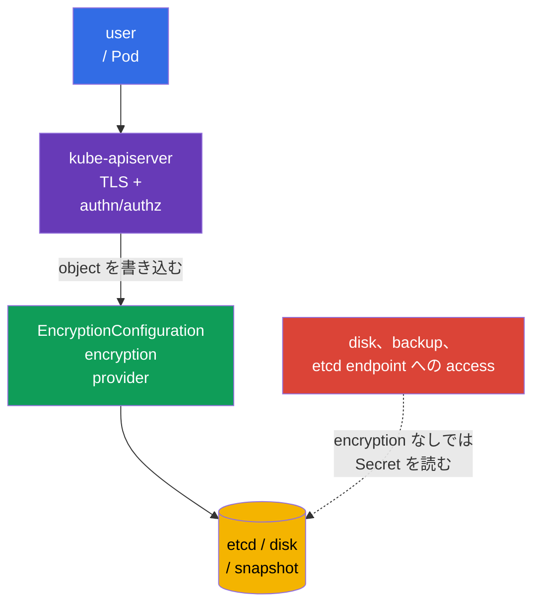
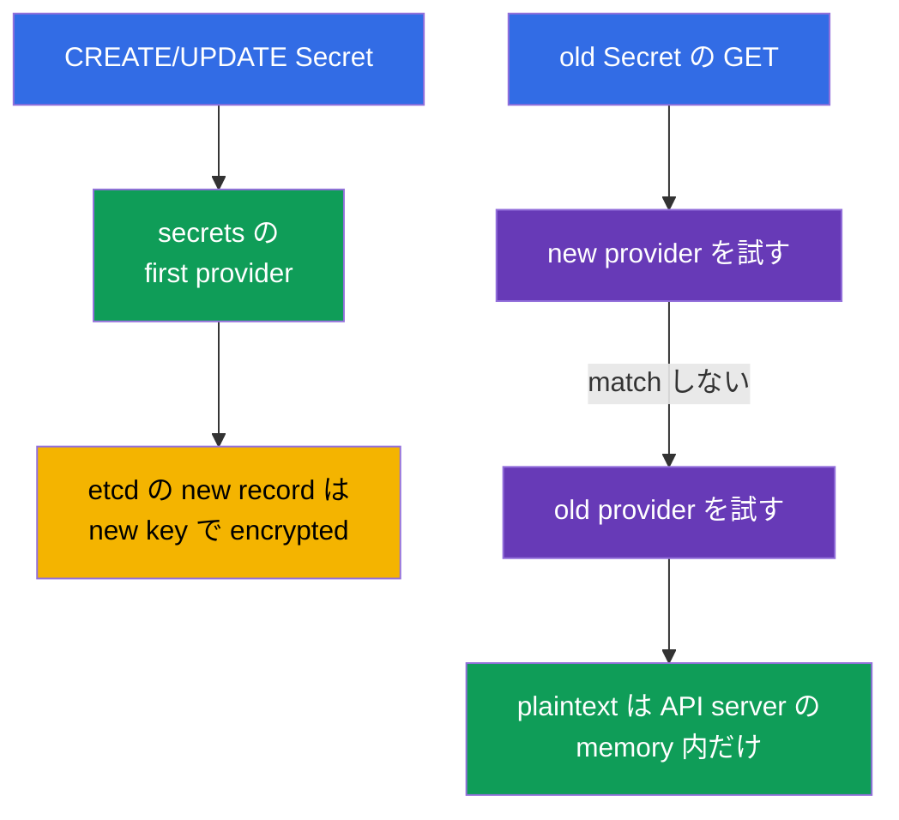
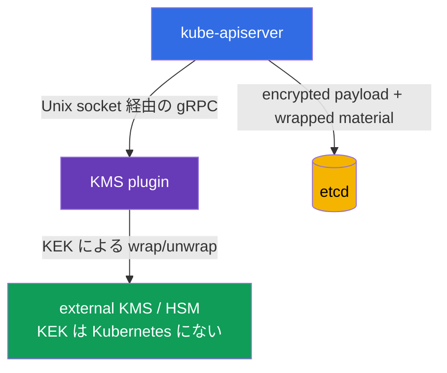
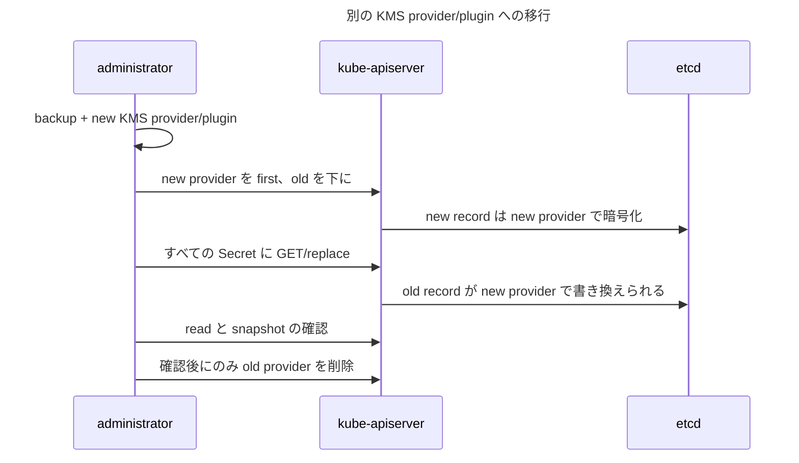

[Русская версия](ru.md) · [Eng version](README.md) · [Versión en español](es.md) · [Version française](fr.md) · [Deutsche Version](de.md) · [ქართული ვერსია](ge.md) · [繁體中文版](tw.md)

# 第21章. etcd の data encryption と Secret の安全な保存

> **課題。** control plane disk、etcd、snapshot、backup を得た者は、`Secret.data` が単なる base64 で書かれていれば、RBAC、authentication、API server audit を bypass して読みます。その copy の password、token、private key は cluster 外で attack を継続させます。etcd write 前に selected API resource を encrypt すると、storage には ciphertext が残り、key material には separate access が必要になります。

> **この後。** `Secret` は sensitive data の object ですが、`data` field は base64 encoded にすぎません。at-rest encryption がなければ etcd data、snapshot、backup に access した者は password、token、private key を読めます。この章では `EncryptionConfiguration` による etcd write 前の selected API resource encryption、`aescbc`、`aesgcm`、`secretbox`、`kms`、safe key rotation、result verification を扱います。これは[CKA 第19章の Secret](../../../cka/course/19/jp.md)と、cluster data に対する etcd の関係を扱う[CKA 第37章](../../../cka/course/37/jp.md)の practical continuation です。

> **Protection boundary。** `EncryptionConfiguration` は selected API data を etcd write 前に encrypt します。full-disk encryption でも disk/snapshot/backup 自体の encryption でもありません。snapshot には protected resource の encrypted value が含まれますが、separate protection、access control、必要なら storage encryption が必要です。encryption at rest は client と API server 間の traffic を encrypt せず（それは TLS）、RBAC を取り消さず、すでに `get secret` または Secret を持つ Pod への `exec` ができる user からも守りません。

> 🧠 etcd または snapshot access は API authentication、authorization、audit を bypass します。base64 は `Secret.data` を守らず、encryption at rest は key のない storage を守ります。

## 21.1. Threat model: etcd が特に価値の高い target である理由

API server は Kubernetes state への通常 path で、etcd は persistent storage です。etcd には Secrets、ConfigMaps、ServiceAccounts、RBAC binding、Deployments など API object があります。よって database またはその copy を読むことは、authentication、authorization、audit を持つ通常の control point - API server - を bypass します。



typical leak path:

- compromised control-plane node、その disk、etcd data directory。
- unsafe storage に渡された snapshot、ticket、CI artifact、laptop に入った snapshot。
- 誰かが etcd への network/TLS access を直接持つ。
- backup が broader access の test environment に restore された。
- Secret が log、shell history、Git、environment variable へ accidental に出力された。

last item は etcd encryption で直りませんが、最初の四つはかなり困難になります。database には ciphertext が残り、key material はそこにあってはいけません。CKS では**base64 は encryption ではない**と理解します。`kubectl get secret -o yaml` は key なしに decode できます。

| Protection | 助けになること | しないこと |
|---|---|---|
| API server/etcd TLS | traffic interception | disk data を encrypt しない |
| RBAC | Secret への API access を制限 | stolen snapshot を守らない |
| Encryption at rest | etcd と snapshot 内 selected API data の ciphertext | disk/snapshot/backup 全体を encrypt せず、authorized API client から Secret を隠さない |
| external secrets manager | master key と lifecycle を cluster から分離 | RBAC、TLS、safe Pod を置き換えない |

> 🧠 最初に match する provider が new write を encrypt し、API server は provider を順に read します。

## 21.2. API data encryption の仕組み

`kube-apiserver` は `EncryptionConfiguration` に記述した provider chain を適用します。**write** では resource に match する first provider を使います。**read** では existing value を decrypt できる provider まで順に試します。HA で local key を rotate する場合、最初に全 API server の second position に new key を追加し、new configuration が全体に適用された後にだけ first にします。old key は re-encryption 完了まで保持します。



minimal file format:

```yaml
apiVersion: apiserver.config.k8s.io/v1
kind: EncryptionConfiguration
resources:
- resources:
  - secrets
  providers:
  - aescbc:
      keys:
      - name: key1
        secret: <base64-encoded-32-byte-key>
  - identity: {}
```

`resources` は namespace でなく API resource を列挙します。通常は `secrets` を最初に保護します。justified need があれば `configmaps`、CRD、other sensitive resource を追加できます。すべてを blind に encrypt してはいけません。load を増やし recovery を複雑にし、data classification の代替にもなりません。

`resources` item は順番に処理されます。earlier matching configuration が priority を持ちます。reason なく同じ explicit resource を independent block に duplicate したり、overlapping wildcard expression を作ったりしてはいけません。documented pattern は broad wildcard より**前**に specific exception を置くことです。たとえば `events` を plaintext のままにして、他を encrypt します。

```yaml
resources:
- resources:
  - events
  providers:
  - identity: {}
- resources:
  - '*.*'
  providers:
  - secretbox:
      keys:
      - name: key1
        secret: <base64-encoded-32-byte-key>
```

ここで `events` は first item に match し、`*.*` には到達しません。wildcard 前の specific rule order は security boundary の一部です。

`identity: {}` は何も encrypt しません。chain end では migration period に old plaintext record を read できます。new record で dangerous なのは first の場合だけです。first provider が new record format を決めます。すべての record を re-encrypt 後、old data の fallback が不要なら `identity` を remove できます。

> **Critical dependency。** lost key、re-encryption 前に remove した key、unavailable KMS は object の一部を unreadable にし control plane を disrupt できます。configuration と key には backup、access control、rehearsed rotation が必要です。

> 🎯 end の `identity` は old plaintext を read し、first の `identity` は new record を unencrypted にします。

## 21.3. Provider: `aescbc`、`aesgcm`、`secretbox`、`kms`、`identity`

Kubernetes は複数 provider を support します。production で `identity` を唯一の protection に選んではいけません。これは intentional に encryption at rest を disable します。

| Provider | Mechanism | 使用する場面 | 主な制限 |
|---|---|---|---|
| `identity` | plaintext | old data の temporary fallback | encryption をまったくしない |
| `aescbc` | PKCS#7 padding を持つ AES-CBC | training/legacy mechanism。new production configuration には非推奨 | weak: built-in authentication/MAC がなく padding-oracle attack が可能。key は control plane に保管 |
| `aesgcm` | AES-GCM、AEAD | automated rotation がある場合だけ | rotation なしでは非推奨。key ごとに 200,000 write limit |
| `secretbox` | XSalsa20 + Poly1305、AEAD | strong で fast な local provider | 32-byte key は control plane に保管 |
| `kms` | KMS plugin による envelope encryption | external key manager/HSM/cloud KMS を持つ production | plugin/KMS availability が API server dependency になる |

> 🔬 AEAD、CBC、write limit、key placement が provider 選択を決めます。

`aescbc` は base64-encoded AES key を使います。example では 32-byte key（AES-256）です。Kubernetes は 16、24、32 byte の key を受け入れます。`aesgcm` の AEAD provider と異なり `aescbc` には built-in authentication/MAC がないため、current Kubernetes documentation は CBC variant を weak と見なします。この example は exam mechanism と compatibility のためで production recommendation ではありません。lab の 32-byte value は次で得られます。

```bash
head -c 32 /dev/urandom | base64
```

`aescbc` example:

```yaml
apiVersion: apiserver.config.k8s.io/v1
kind: EncryptionConfiguration
resources:
- resources:
  - secrets
  providers:
  - aescbc:
      keys:
      - name: secrets-aescbc-2026-08
        secret: <base64-encoded-32-byte-key>
  - identity: {}
```

`aesgcm` も AEAD、つまり encryption と integrity check を使います。current Kubernetes documentation では one AES-GCM key に practical limit を設定します。200,000 write 以下で、その後 key rotation が必要です。そのため controlled volume と automated rotation には適しますが、高い Secret write flow では KMS を優先するか key lifecycle を特に注意して設計します。

`secretbox` は XSalsa20 と Poly1305 を使い AEAD provider で、32-byte key を要求します。Kubernetes は strong/fast option とします。以後の lab は legacy mechanism とその limitation の理解のため `aescbc` を使います。production local provider の選択は rotation と key storage requirement を考慮します。

```yaml
apiVersion: apiserver.config.k8s.io/v1
kind: EncryptionConfiguration
resources:
- resources:
  - secrets
  providers:
  - aesgcm:
      keys:
      - name: secrets-aesgcm-2026-08
        secret: <base64-encoded-32-byte-key>
  - identity: {}
```

actual key を Git、Helm value、Terraform state、chat、ticket に置いてはいけません。local key を持つ configuration file は root と API server process だけが access できる必要があります。たとえば:

```bash
# parent directory を先に作る: file install は nonexistent directory を作成しない。
sudo install -d -o root -g root -m 0700 /etc/kubernetes/enc
sudo install -o root -g root -m 0600 encryption-config.yaml \
  /etc/kubernetes/enc/encryption-config.yaml
sudo stat -c '%U:%G %a %n' \
  /etc/kubernetes/enc \
  /etc/kubernetes/enc/encryption-config.yaml
```

local `aescbc`/`aesgcm` は snapshot だけを持ち control-plane filesystem を持たない者から snapshot を守ります。useful baseline ですが key は同じ trusted machine にあります。duty separation と durable key lifecycle には `kms` を使います。

> 🎯 Kube-apiserver は mount で access できる path の `--encryption-provider-config` を受けます。readiness と API 経由の Secret read を確認します。

## 21.4. `EncryptionConfiguration` を kube-apiserver に接続する

file 自体は何も変えません。API server は flag `--encryption-provider-config=<path>` を受け取る必要があります。kubeadm cluster では `kube-apiserver` は static Pod です。その manifest は通常 `/etc/kubernetes/manifests/kube-apiserver.yaml` にあります。manifest の変更は kubelet が検知し API server を再起動します。

```yaml
# /etc/kubernetes/manifests/kube-apiserver.yaml (fragment)
spec:
  containers:
  - name: kube-apiserver
    command:
    - kube-apiserver
    - --encryption-provider-config=/etc/kubernetes/enc/encryption-config.yaml
    volumeMounts:
    - name: encryption-config
      mountPath: /etc/kubernetes/enc
      readOnly: true
  volumes:
  - name: encryption-config
    hostPath:
      path: /etc/kubernetes/enc
      # 上で用意した directory。Directory は typo を空の directory で隠さない。
      type: Directory
```

flag の path は**API server container 内から**見えます。そのため host に file が一つあるだけでは不十分で、`hostPath` と `volumeMount` が必要です。YAML indent と既存 volume name を確認し、manifest 全体を template で置き換えないでください。HA control plane では、同じ保護された file と flag がすべての API server node に必要で、変更は health と quorum を確認しながら一つの node ずつ rollout します。

practical な作業順序:

1. 最新の etcd snapshot を作成し確認します。手順は[CKA 第37章](../../../cka/course/37/jp.md)にあります。
2. shell history 外で key を生成し、保護された path に mode `0600` で configuration を保存します。
3. API server manifest に volume、mount、`--encryption-provider-config` を追加します。
4. static Pod の restart を待ち、`kubectl get --raw='/readyz?verbose'` を確認します。
5. test 用 Secret を作成し API が読めることを確認してから、すべての old record の re-encryption を実行します。

```bash
# 稼働中の static-Pod manifest の flag と mount を確認する。
sudo grep -n -- '--encryption-provider-config\|encryption-config' \
  /etc/kubernetes/manifests/kube-apiserver.yaml

# manifest 変更後 API server が再び ready になったことを確認する。
kubectl get --raw='/readyz?verbose'
kubectl -n kube-system get pods -l component=kube-apiserver
```

> **注意。** path、YAML、key の error は API server を起動不能にする可能性があります。control-plane node の console から作業し、manifest の backup を保持し、確認が完了するまで前の configuration を削除しないでください。managed Kubernetes では static Pod を編集しません。provider の標準機能で encryption を有効にし、その KMS/cluster update 手順に従います。

> 🏭 KMS は KEK を外に出しますが、plugin と key manager には HA、最小限の permission、検証可能な restore が必要です。

## 21.5. KMS と envelope encryption

provider `kms` は API server を Unix socket 経由で local KMS plugin に接続します。plugin は key encryption key (KEK) を保持する external KMS/HSM と通信します。`EncryptionConfiguration` には KEK は含まれません。KMS v1 と v2 は共に envelope encryption を使いますが、data encryption key (DEK) の取得方法が異なるため、同じ手順として説明できません。



KMS **v2** の conceptual fragment:

```yaml
apiVersion: apiserver.config.k8s.io/v1
kind: EncryptionConfiguration
resources:
- resources:
  - secrets
  providers:
  - kms:
      apiVersion: v2
      name: production-kms
      endpoint: unix:///var/run/kmsplugin/socket.sock
      timeout: 3s
  - identity: {}
```

差異は明示的に記録する必要があります。

| Property | KMS v1 | KMS v2 |
|---|---|---|
| Status | Kubernetes 1.28 で deprecated。1.29 以降 default disabled で明示的な `--feature-gates=KMSv1=true` が必要 | Kubernetes 1.29 で stable。new configuration の推奨 API |
| DEK | encryption 操作ごとに new random DEK。plugin は各 DEK を KEK で wrap する | API server は secret seed を保持し、KDF で操作ごとに one-time DEK を導出する。seed は KEK で wrap され KEK rotation 時に変わる |
| config field | `apiVersion: v1` または field なし。`name`、`endpoint`、`cachesize`、`timeout` | `apiVersion: v2`、`name`、`endpoint`、`timeout`。`cachesize` は不可 |
| Performance | gRPC/KMS call が多い。cache は unwrapped DEK を保持する | 各 write で個別 DEK を wrap する KMS call がない |
| Key identification | v1 plugin に依存 | `Status` が現在の KEK の `version: v2`、`healthz: ok`、`key_id` を返す |

> **表の version boundary。** 確認日 **2026-09-15** の時点で、exam snapshot v1.35 に KMS v1 はまだ存在しますが、deprecated で default disabled です。legacy compatibility には明示的な feature gate が必要です。new configuration には使わず、自分の minor version の KMS documentation を確認してください。

v2 では etcd に encrypted payload と、API server が保護された seed から one-time DEK を得るのに十分な material が保存されます。これは「plugin が write ごとに new wrapped DEK を発行する」モデルではありません。`key_id` の rotation は、API server に new seed を取得させ、それを new KEK で保護し、以降の write に使わせます。old data は別の controlled re-encryption 手順で書き換えられます。

正確な field と利用可能な API version は Kubernetes version と選んだ plugin に依存します。使用中の version の official documentation と plugin deployment を確認してください。任意の KMS v1/v2 example を production にそのままコピーしないでください。socket は明示的な volume mount で API server container から access できる必要があり、access は制限されます。plugin 自体は remote manager への TLS/認証を使用し、最小限の KMS permission を持ち、plaintext を log に出力しないようにします。

KMS には二つの運用機構が有用です。flag `--encryption-provider-config-automatic-reload=true` は API server に restart なしで configuration を再読み込みさせます（key rotation 時に便利）。plugin の health は endpoint `/healthz/kms-providers` と全体の `/healthz` で確認します。automatic reload が有効な場合、個別の health check は一つにまとめられます。API server は healthy 状態で約 1 分ごとに KMS v2 の `Status` を poll し、障害時にはより頻繁に poll します。cache は plugin/KEK を optional な dependency にしません。それらの unavailability は startup/cache warm-up、まだ露出していない material の decrypt、KEK/key_id rotation、snapshot restore を妨げる可能性があります。plugin と remote manager は HA である必要があり、restore には同じ KEK か documented な migration が必要です。

KMS は secret の分離を改善しますが、運用要件を追加します。

- KMS v1 では plugin/KMS が synchronous data path にかなり近くなります。new DEK は KMS 経由で wrap され、cache miss は unwrap を要求します。KMS v2 では API server が保護された seed から one-time DEK をローカルに導出するため、通常の API read/write ごとに remote KMS を呼びません。それでも plugin と manager は startup/cache warm-up、uncached decryption、key rotation、recovery にとって重要です。`Status` health、`key_id` の安定性、`EncryptRequest`/`DecryptRequest` の latency、error、availability、quota、credential の有効期限を監視してください。
- plugin と KMS の HA を設計してください。これは critical な dependency であり、plugin/KEK の unavailability は暗号化された resource の read と write の error につながる可能性があります。recovery 手順を事前に確認してください。
- metadata の backup を作成し key ID を文書化しますが、master key を etcd の backup に**export しない**でください。
- IAM/ACL を制限してください。API server が受け取るのは必要な encrypt/decrypt 操作のみで、cluster administrator が KEK 管理の権限を必ず持つ必要はありません。
- インシデント前に、同じ KMS key への access を伴う snapshot restore をテストしてください。

external KMS を使っても、Secret が Kubernetes に現れなくなるわけではありません。application が通常の Kubernetes Secret を受け取る場合、plaintext は API または Pod を許可された相手には依然 access 可能です。short-lived identity による secret 発行には Vault Agent、Secrets Store CSI Driver、External Secrets Operator が使われますが、それらの RBAC と同期を丁寧に確認してください。Kubernetes Secret を作成する operator は、そのコピーを再び etcd に置きます。

> 🎯 new key/provider を old key を保持したまま first にする → object を re-encrypt する → read/storage を確認する → old key を削除する。

## 21.6. Provider のローテーションと既存データの re-encryption

configuration を変更するだけでは不十分です。new provider は**新規または更新された**object にのみ適用されます。old record は old key で暗号化されたまま、または plaintext のままです。したがって安全な rotation には常に二つの異なる操作が含まれます。まず old key での read と new key での write を両立させ、その後既存の object を書き換えます。

### `aescbc`/`aesgcm` の key rotation

最初 `key-old` が使われていたとします。HA control plane では `key-new` をすぐに first にしてはいけません。すでに更新された API server が new key で object を書き込む一方で、他の API server がまだそれを decrypt できない状態になり得ます。rotation は二段階で行います。

1. 各 control-plane node の configuration で `key-old` の**後に** `key-new` を追加します。
2. **すべて**の API server で API server を再起動するか configuration の reload を適用します。これで各 API server は両方の key を decrypt できるようになりますが、new record はまだ `key-old` を使います。
3. `key-new` を**first**にし、`key-old` を second のまま保持して、再びすべての API server に configuration を適用します。ここでようやく new record が `key-new` で作成されます。

Phase 1 - すべての API server で new key を second に:

```yaml
apiVersion: apiserver.config.k8s.io/v1
kind: EncryptionConfiguration
resources:
- resources:
  - secrets
  providers:
  - aescbc:
      keys:
      - name: key-old-2026-01
        secret: <old-base64-32-byte-key>
      - name: key-new-2026-08
        secret: <new-base64-32-byte-key>
  - identity: {}
```

Phase 2 - phase 1 をすべての API server に適用した後、new key を first にします:

```yaml
apiVersion: apiserver.config.k8s.io/v1
kind: EncryptionConfiguration
resources:
- resources:
  - secrets
  providers:
  - aescbc:
      keys:
      - name: key-new-2026-08
        secret: <new-base64-32-byte-key>
      - name: key-old-2026-01
        secret: <old-base64-32-byte-key>
  - identity: {}
```

phase 2 をすべての API server に適用した後、すべての Secret を書き換えます。以下の command は各 object を取得して API に送り返します。まさに new provider が first として record を暗号化します。massive operation の前に snapshot を作成し、test namespace から始めてください。

```bash
# すべての Secret を API server 経由で書き換える。
kubectl get secrets --all-namespaces -o json | kubectl replace -f -

# ConfigMaps も保護している場合は、別の意識的な操作で書き換える。
# kubectl get configmaps --all-namespaces -o json | kubectl replace -f -
```

> 🔬 Storage Version Migration は storage を大規模に書き換え、独立した feature/operational rollout を必要とします。

### Production extension: Storage Version Migration

production での massive な書き換えには、Kubernetes-native な代替である **Storage Version Migration** があります。Kubernetes 1.36 では beta status で default disabled です。使用中の version の documentation に従って明示的に有効化・設定した後、migration は API storage path 経由で object を書き換えます。これは特に `EncryptionConfiguration` や key の変更後の re-encryption に適しています。CKS では provider の順序と object の強制的な書き換えを理解すれば十分です。上の `kubectl replace` は簡単な exam 向けの道であり続けますが、Storage Version Migration は独立した operational rollout、observation、検証済みの rollback/recovery 手順を必要とします。

> 🏭 **Upstream v1.37。** Kubernetes v1.37 では built-in の `StorageVersionMigration` API/controller が GA になり default enabled になりました。これは production-current status を変えますが、この章の CKS Core workflow は変わらず、exam/training context に固定されています。[Kubernetes v1.37 Security Delta](../APPENDIX_K8S_137_SECURITY_DELTA_JP.md)を参照してください。

`kubectl replace` は current な `resourceVersion` を要求します。高い競合状態では conflict が起こり得ます。production では、CI にコマンドを無意識に入れるのではなく、retry、API latency の監視、合意されたウィンドウを備えた controlled script を実行してください。Secret を含む JSON を disk や pipeline log に書き込まないでください。

re-encryption と key の確認が完了したら、config から `key-old` を削除し、API server を再起動して read を再確認します。object の書き換えが終わる前に old key を削除してはいけません。restore された snapshot や old record が読めなくなります。

### `identity` から encryption への移行

古い cluster の開始も同様です。new encryption provider を first に置き、`identity` を最後に残してから、resource を書き換えます。

```yaml
providers:
- aesgcm:
    keys:
    - name: key-2026-08
      secret: <base64-encoded-32-byte-key>
- identity: {}
```

old record の re-encryption 後、`identity: {}` は削除できます。以下に残すことは compatibility のための明示的な一時選択としてのみ許容されます。`identity` の存在をすべての data が保護されている証拠と考えないでください。

> 🏭 KEK の rotation と provider の変更は異なります。restore の確認までは old data の decrypt を保持してください。

### KMS v2 KEK のローテーション

KMS v2 での通常の remote KEK rotation は **external KMS/plugin の内部**で発生します。plugin は current な public `key_id` を `Status` 経由で報告します。API server はこの ID を authoritative とみなします。`key_id` が変わると、API server は new KEK で保護された new seed を取得し、以降の暗号化に適用します。この通常の KEK rotation のために second の `kms` provider を追加したり、provider order を変えたり、KEK 変更だけのために API server を再起動したりはしません。

healthy な状態では、API server は約 1 分ごとに `Status` を poll し、最後の valid な状態を約 3 分間使用できます。したがって rotation 直後に re-encryption を始めないでください。まず new で stable な `key_id` がすべての API server に見えており、plugin が ID 間で切り替わっていないことを確認します。storage を new KEK に移行する必要があれば、その後 API 経由で必要な object を書き換えます。Upstream は KMS v2 KEK を最低 90 日ごとに rotate することを推奨しています。正確な workflow と observability は plugin と external KMS に依存します。

### 別の KMS provider/plugin への移行

これは**通常の** KEK rotation ではありません。cluster が実際に別の configured KMS provider、plugin、endpoint へ移行する場合、new `kms` provider を first にし、old provider を decrypt のために下に残し、その後 API がデータを書き換え、確認後にのみ old provider/plugin を運用から外します。



> 🎯 API server の config、authorized な Secret の read、raw etcd 値に plaintext marker がないことを証明してください。

## 21.7. 確認: API、configuration、etcd

file の存在だけを確認しないでください。三つの事実を証明する必要があります。API server が実際に flag を使用していること、Secret が API 経由で access 可能であること、etcd に plaintext が残っていないことです。最後の確認は分離された lab cluster または合意された手順でのみ実行してください。etcd への直接 access は privilege を要求し、実際の data を露出させる可能性があります。

まず、探しやすい unique な値を持つ無害な canary Secret を作成します。

```bash
kubectl -n default create secret generic encryption-check \
  --from-literal=probe='not-a-real-secret-rotate-me'
kubectl -n default get secret encryption-check \
  -o jsonpath='{.data.probe}' | base64 -d; echo
```

second の出力は API の通常動作を証明しますが、encryption at rest は証明しません。API server は authorized client のために data を decrypt する義務があるからです。次に manifest、readiness、API server の log を確認します。

```bash
sudo grep -n -- '--encryption-provider-config' \
  /etc/kubernetes/manifests/kube-apiserver.yaml
kubectl get --raw='/readyz?verbose'
kubectl -n kube-system logs kube-apiserver-$(hostname) --tail=100
```

static Pod の name は `$(hostname)` と異なる場合があります。まず `kubectl -n kube-system get pods -l component=kube-apiserver` で取得してください。production の log を保護されていない場所に出力しないでください。診断 data には object 名や access error が含まれる可能性があります。

学習用の self-managed cluster では、`etcdctl` 経由で値を直接取得し、marker が応答バイトに存在しないことを確認できます。以下の TLS parameter は典型的な kubeadm の example です。まず endpoint、CA、cert/key path を**現在の** etcd manifest と照合してください。この確認は fail-closed です。PASS になるのは、`etcdctl` が必要な key の空でない値を読み、`strings` が正常に動作し、marker が見つからなかった場合だけです。

```bash
(
  set -euo pipefail
  raw_file="$(mktemp)"
  trap 'rm -f "$raw_file"' EXIT

  # endpoint と TLS path を現在の etcd manifest の値に置き換える。
  if ! ETCDCTL_API=3 etcdctl get /registry/secrets/default/encryption-check \
    --endpoints=https://127.0.0.1:2379 \
    --cacert=/etc/kubernetes/pki/etcd/ca.crt \
    --cert=/etc/kubernetes/pki/etcd/server.crt \
    --key=/etc/kubernetes/pki/etcd/server.key \
    --print-value-only >"$raw_file"; then
    echo 'ERROR: etcdctl could not read the canary object' >&2
    exit 1
  fi

  if [ ! -s "$raw_file" ]; then
    echo 'ERROR: etcd key is absent or has an empty value' >&2
    exit 1
  fi

  # grep=1 は marker が見つからなかったことを意味する。etcdctl/strings の error と混同しないこと。
  set +e
  strings "$raw_file" | grep -Fq 'not-a-real-secret-rotate-me'
  status=("${PIPESTATUS[@]}")
  set -e

  if [ "${status[0]}" -ne 0 ]; then
    echo 'ERROR: strings could not inspect the etcd value' >&2
    exit 1
  elif [ "${status[1]}" -eq 0 ]; then
    echo 'FAIL: plaintext marker is present in etcd' >&2
    exit 1
  elif [ "${status[1]}" -ne 1 ]; then
    echo 'ERROR: plaintext verification failed unexpectedly' >&2
    exit 1
  fi

  echo 'OK: etcd value was read and plaintext marker was not found'
)
```

old data についてはこのテストを re-encryption の後に実行します。etcd の data は通常 encryption provider の format を示す prefix を持ちます。Kubernetes version に依存する内部 format を前提に確認を組み立てないでください。

テスト後、canary Secret を削除し、backup/restore runbook が保存されていることを確認します。

```bash
kubectl -n default delete secret encryption-check
```

| 確認すること | 期待される結果 |
|---|---|
| API server manifest | `--encryption-provider-config` と正しい read-only mount がある |
| readiness | restart 後 `/readyz?verbose` が成功する |
| API での Secret read | authorized な `kubectl get` が元の値を返す |
| etcd の lab 確認 | raw stored value に unique な plaintext marker が見つからない |
| rotation 後 | rotation 前に作成された Secret が読めて、new provider で書き換えられている |
| backup/restore | snapshot が安全に access 可能で、restore に必要な key/KMS が access 可能 |

> 🏭 Encryption at rest は RBAC、TLS、Secret hygiene、backup を置き換えません。key、KMS availability、restore は別に所有してください。

## 21.8. Production での使い方

at-rest encryption は一つの層です。有用な保護は複数の独立した barrier から構築されます。

- **最小限の RBAC。** `secrets` への `get`、`list`、`watch` を広い group に与えないでください。`list` と `watch` も Secret の内容を返します。`pods/exec`、`pods/attach`、`pods/ephemeralcontainers` も別途制限してください。workload への shell はしばしば mount された Secret への道になります。
- **不必要に env で Secret を渡さない。** read-only volume/CSI mount を優先してください。environment variable は debug output、crash dump、子 process、log に容易に現れます。
- **plaintext を commit しない。** `stringData` は便利ですが、Git では plaintext です。SOPS、Sealed Secrets、または external secrets manager との GitOps integration を使用してください。pre-commit と server-side scanning を有効にしてください。
- **短い寿命と rotation。** database password、API token、certificate、cloud credential を rotate してください。Kubernetes Secret の更新は application が自動的に再読み込みすることを意味しません。env は更新されず、file mount は遅延して更新されます。application は reload/restart できる必要があります。
- **API の露出範囲を制限する。** `kubectl get secret -o yaml`、decode 済みの値、KMS credential を CI log に出力しないでください。誤って公開された secret は、Git history から行を削除するだけでなく、元の source で revoke してください。
- **backup を保護する。** 暗号化された etcd の snapshot もそれ自体が sensitive です。別に保管し、storage を暗号化し、retention、MFA/ACL、検証可能な restore を設定してください。secret key や KMS への access は snapshot と別に保管してください。

External Secrets Operator、Vault、cloud Secrets Manager、Secrets Store CSI Driver はそれぞれ異なる問題を解決します。前者はしばしば external value を Kubernetes Secret に同期します。便利ですが、そのコピーは etcd に残り encrypted である必要があります。CSI/Vault Agent は永続的な Kubernetes Secret なしに secret を file として Pod に渡せます。etcd 内のコピーは減りますが、node plugin、Pod identity、external backend という trust boundary が現れます。tool が「secret を暗号化する」からという理由だけでなく、threat model の後にパターンを選んでください。

## 21.9. 典型的な誤りと診断

| 症状 | 想定される原因 | 安全な対応 |
|---|---|---|
| 編集後 API server が Ready にならない | 誤った YAML、access できない config/mount/socket、無効な key | console から検証済みの manifest を復元し、local kubelet/API log を読む |
| Secret が `kubectl` 経由で読める | これは正常 | API は authorized client のために decrypt する。raw etcd の確認は lab のみで行う |
| rotation 後 old Secret が読めない | old key/provider を早く削除しすぎた | 保護された backup から old provider/key を戻し、その後 re-encrypt する |
| new record が plaintext のまま | `identity` が first になっている、または flag が適用されていない | provider の順序、manifest、restart、new canary の create を確認する |
| API の write が hang/失敗する | KMS plugin または external KMS が unavailable/遅い | socket、TLS、KMS health、timeout、HA を確認する。security を無闇に緩めない |
| Secret が Git/log で見つかった | encryption at rest は助けにならない | 元の credential を即座に rotate し、access を制限し、IR 手順に従って artifact を削除する |

> 🏭 **Kubernetes v1.37 recovery edge case。** unreadable/corrupt な API object には Beta の unsafe force-delete path (`AllowUnsafeMalformedObjectDeletion`) が存在します。これは cluster-breaking potential を持つ操作で、最後の recovery mechanism であり、encryption rotation を修正する通常の方法ではありません。詳細と制限は[Kubernetes v1.37 Security Delta](../APPENDIX_K8S_137_SECURITY_DELTA_JP.md)を参照してください。

試験ではまず cluster の type を判別してください。kubeadm では API server の manifest と etcd TLS path を探します。managed control plane では設定が閉じている場合があります。存在しない `/etc/kubernetes/manifests` を編集しようとせず、provider がサポートする KMS encryption を使用し、その status を確認してください。

## 21.10. Mini-glossary

- **Encryption at rest** - etcd への write 前に selected API data を暗号化すること。disk、snapshot、backup 全体の暗号化ではない。
- **EncryptionConfiguration** - kube-apiserver が selected API resource のために読む provider の configuration。
- **provider** - 特定の API resource のための encryption/decryption mechanism。
- **`aescbc`** - PKCS#7 padding と configuration 内の key を持つ local な AES-CBC provider。built-in の authentication/MAC がないため weak。
- **`aesgcm`** - AEAD provider の AES-GCM。write limit を考慮して key を rotate する必要がある。
- **`secretbox`** - 32-byte key を持つ AEAD provider の XSalsa20 + Poly1305。
- **`kms`** - cryptographic operation を external KMS plugin に渡す provider。
- **envelope encryption** - object は DEK で暗号化され、DEK は external KEK で保護される。
- **KEK/DEK** - key encryption key / data encryption key。
- **re-encryption** - old API object を new provider/key で書き換えること。
- **`identity`** - encryption をしない provider。意識的な一時 fallback としてのみ許容される。

## 21.11. 章のまとめ

- etcd は Secret と Kubernetes state の大部分を保持します。base64 はこの内容を保護しません。
- `EncryptionConfiguration` は kube-apiserver の flag `--encryption-provider-config` で適用されます。new record には first provider が使われ、read では provider が順に試されます。
- `aescbc`、`aesgcm`、`secretbox` は保護された file に key を持つ local な選択肢です。`kms` は KEK を external manager に出し、envelope encryption を使えるようにします。
- HA では local key を次の順序で rotate します: backup -> すべての API server で new key を second に -> すべてに configuration を適用 -> すべての API server で new key を first に -> configuration を再適用 -> old object の re-encryption -> 確認 -> old key の削除。
- configuration、API health、API read、raw etcd の lab 値に canary plaintext がないことを確認してください。
- at-rest encryption は RBAC、TLS、secrets hygiene、安全な backup、external secret manager によって補完されます。

## 21.12. どのように役立つか: 試験と実務で

**CKS では。** タスクは unencrypted な Secret を見つけること、encryption at rest を有効にすること、正しい `--encryption-provider-config` を決めること、provider order を説明すること、rotation 中に Secret を壊さないことを求める場合があります。速い algorithm: API server の manifest を見つけ、安全な config と mount を作り、flag を追加し、health を待ち、object を書き換え、etcd を確認します。「Secret は base64 で暗号化されている」と答えないでください。これは誤りです。

**production では。** encryption at rest を control-plane baseline の standard として扱い、最終的な対策とはみなさないでください。key は etcd backup と別に所有し、rotation を自動化し、KMS を監視し、restore をテストし、plaintext を見られる人、identity、Pod の数を最小化してください。API server の configuration 変更は rollback と backup を伴う change procedure で行ってください。

## 21.13. 自己確認のための質問

<details>
<summary>1. `Secret.data` field の base64 が、etcd snapshot の所有者から secret を保護しないのはなぜですか?</summary>

Base64 は encoding であって encryption ではありません。`kubectl get secret -o yaml` は key なしで decode できます。etcd snapshot の所有者は、API server の authentication、authorization、audit を bypass して保存された API state を取得します。encryption at rest はこれを変え、selected resource の ciphertext を保持します。
</details>

<details>
<summary>2. encryption at rest はどの record を保護し、どの脅威を排除しませんか?</summary>

`EncryptionConfiguration` は etcd への write 前に selected API data、たとえば Secret を暗号化し、ciphertext は snapshot にも入ります。disk、snapshot、backup 全体を暗号化せず、TLS traffic を保護せず、`get secret` や Pod への `exec` を持つ identity から Secret を隠しません。RBAC、TLS、backup の保護は別の control として残ります。
</details>

<details>
<summary>3. API server は write 時と old record の read 時にどのように provider を選びますか?</summary>

write では API server は resource に match する first provider を使います。read では、既存の値を decrypt できる provider まで順に試します。これにより rotation 中は old key を new key より下に保持できます。
</details>

<details>
<summary>4. `identity` は migration chain の最後では許容されるのに first provider では許容されないのはなぜですか?</summary>

`identity` は何も暗号化しませんが、chain の最後にあれば migration 中に以前の plaintext record を読めます。first の場合は危険です。なぜなら first provider が new record の format を決め、それらが plaintext のままになるからです。re-encryption 後、fallback が不要になれば `identity` を削除できます。
</details>

<details>
<summary>5. local な `aescbc`/`aesgcm` と `kms` の運用上の違いは何ですか?</summary>

local provider では key は control plane の保護された configuration file にあります。これは node の filesystem を持たない者から snapshot を保護しますが、これらの secret を分離しません。`kms` は Unix socket plugin と external な KEK/HSM を通じて envelope encryption を使い、separation of duties を改善します。その代わり、plugin と external manager は read、write、rotation、restore の critical な dependency になります。
</details>

<details>
<summary>6. new key を追加した直後に old key を削除できないのはなぜですか?</summary>

old object はまだ plaintext か old key で暗号化されている可能性があり、new provider は new/updated record にしか適用されません。HA では、まずすべての API server が両方の key を read できる必要があり、その後 new key が first になり object が書き換えられます。re-encryption 前に old key を削除すると、一部の record や restore された snapshot が読めなくなります。
</details>

<details>
<summary>7. old Secret が実際に re-encryption を経たことをどう証明しますか?</summary>

new provider を first にした後、old Secret は API 経由で書き換えられます。たとえば `kubectl get secrets --all-namespaces -o json | kubectl replace -f -` を test namespace から始めて実行します。次に API read を確認し、分離された lab で canary の raw etcd 値を確認します。unique な plaintext marker が `strings | grep` で見つからないはずです。このような確認の後にのみ old key/provider を削除します。
</details>

<details>
<summary>8. Pod に対するどの操作が `get secrets` の禁止を回避できますか。なぜですか?</summary>

`pods/exec`、`pods/attach`、`pods/ephemeralcontainers` の広い権限は、Secret が mount または application から access 可能な workload への shell を与える可能性があります。その場合、identity は plaintext を見るために Kubernetes API 経由で Secret を直接読む必要がありません。したがってこれらの subresource も least-privilege RBAC で制限する必要があります。
</details>

<details>
<summary>9. 暗号化された etcd snapshot の restore のために何を確認する必要がありますか?</summary>

snapshot は安全な手順で保存・restore されますが、必要な local key または同じ KMS KEK/plugin の availability も確認する必要があります。事前に restore をテストし、key ID を文書化し、ACL、storage encryption、retention で snapshot を別に保護する必要があります。master key を etcd の backup に export してはいけません。
</details>

<details>
<summary>10. **Flashback（第14章）。** Encryption at rest は etcd 内の Secret を正確に保護します。Secret を mount した後、kubelet は **tmpfs-backed volume** を通じて Pod にそれを提供します。これは通常の durable-disk コピーを排除しますが、「disk に絶対に出ない」という無条件の保証にはなりません。swap が有効な場合、Kubernetes v1.36 は kernel がこの option をサポートしていれば（Linux 6.3 以降、または backport で公式に）`noswap` で memory-backed volume を mount します。そうでなければ、kubelet は Secret を含むそのような volume が swap に追い出される可能性があると warning します。そのような node では swap を無効にするか、その暗号化を確保し、kubelet の warning を確認します。第14章の対策（host footprint、least-privilege host）のうち、この段階、すなわち secret がすでに decrypt されて node 上の authorized process に tmpfs 経由で access 可能な段階でのリスクを制限するものは何ですか。また、persistent-disk のコピーがなくても host compromise や同じ node 上の privileged workload が深刻な脅威のままであるのはなぜですか?</summary>

host footprint を減らす必要があります。不要な service や package を無効化し、不要な listening port を閉じ、host compromise への path を減らすために node を timely に更新します。least-privilege host は SSH/sudo と kubelet/runtime への access を持つ人を制限し、workload は `privileged`、host namespace、hostPath を得るべきではありません。tmpfs と `noswap` は durable-disk のリスクを減らしますが、node の root または隣接する privileged workload は依然として memory、runtime、mount された secret に access できる可能性があります。
</details>

## Practice

production で作業する前に、別の cluster で lab を行ってください。`EncryptionConfiguration` を作成し、API server に flag と mount を追加し、Secret を暗号化し、rotation を実行し、etcd 経由で結果を確認します。control-plane console への access と最新の snapshot を保持してください。static-Pod manifest の error は一時的に cluster から API を奪う可能性があります。

🧪 Lab 109（EncryptionConfiguration、etcd での Secret encryption、確認）:
[tasks/cks/labs/109](../../labs/109/README_JP.MD)

🌐 追加の interactive practice（killer.sh/killercoda、external resource）: [secret-pod-access](https://killercoda.com/killer-shell-cks/scenario/secret-pod-access) · [secret-read-secrets](https://killercoda.com/killer-shell-cks/scenario/secret-read-secrets) · [secret-serviceaccount-pod](https://killercoda.com/killer-shell-cks/scenario/secret-serviceaccount-pod) · [secret-etcd-encryption](https://killercoda.com/killer-shell-cks/scenario/secret-etcd-encryption)

📘 関連資料: [CKA 第19章 - Secret](../../../cka/course/19/jp.md) ·
[CKA 第37章 - etcd のバックアップと復元](../../../cka/course/37/jp.md)

---
[目次](../README_JP.md) · [第20章](../20/jp.md) · [第22章](../22/jp.md)
