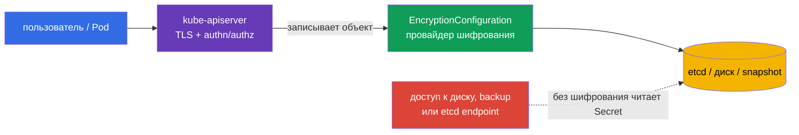
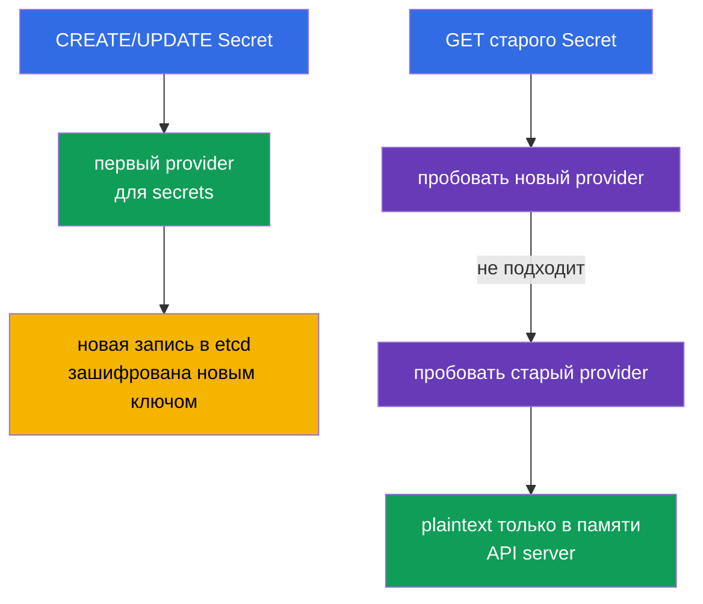
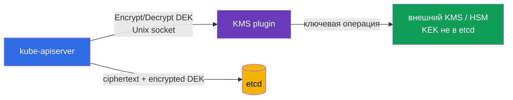
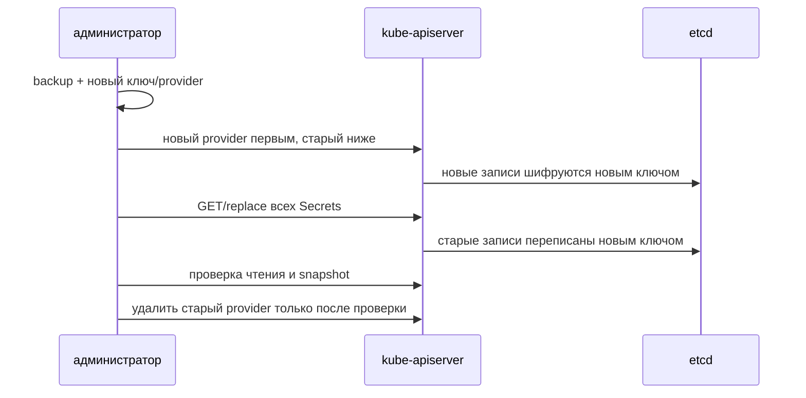

[Eng version](README.md) · [Versión en español](es.md) · [Version française](fr.md) · [Deutsche Version](de.md) · [ქართული ვერსია](ge.md) · [繁體中文版](tw.md) · [日本語版](jp.md)

# Глава 21. Шифрование данных в etcd и безопасное хранение Secret

> **Что дальше.** `Secret` - это объект для чувствительных данных, но его поля `data` всего лишь
> закодированы в base64. Если не включено шифрование at rest, тот, кто получил доступ к данным etcd,
> snapshot или резервной копии, сможет прочитать пароль, токен и закрытый ключ. В этой главе настраиваем
> шифрование ресурсов в etcd через `EncryptionConfiguration`, разбираем `aescbc`, `aesgcm` и `kms`,
> безопасную ротацию ключей и проверяем результат. Это практическое продолжение
> [главы 19 CKA о Secret](../../../cka/course/19/ru.md) и связи etcd с данными кластера из
> [главы 37 CKA](../../../cka/course/37/ru.md).

> **Граница защиты.** Encryption at rest защищает запись в etcd, его диски, snapshots и backups. Оно
> не шифрует трафик между клиентом и API server (для этого TLS), не отменяет RBAC и не спасает от
> пользователя, который уже может выполнить `get secret` или `exec` в Pod с секретом.

## 21.1. Модель угроз: почему etcd - особенно ценная цель

API server - обычный путь к состоянию Kubernetes, а etcd - его постоянное хранилище. В etcd находятся
> объекты API: Secrets, ConfigMaps, ServiceAccounts, RBAC bindings, Deployments и многое другое.
> Следовательно, чтение базы или её копии обходит привычную точку контроля - API server с
> authentication, authorization и audit.



Типичные пути утечки:

- захвачен control-plane node, его диск или каталог данных etcd;
- snapshot передан в небезопасное хранилище, попал в тикет, CI-artifact или на ноутбук;
- кто-то имеет сетевой и TLS-доступ непосредственно к etcd;
- backup восстановлен в тестовой среде с более широким доступом;
- Secret случайно выведен в лог, shell history, Git или переменную окружения.

Последний пункт шифрование etcd не исправит, но первые четыре становятся значительно труднее: в базе
сохраняется ciphertext, а ключевого материала там быть не должно. Для CKS важно не делать неверный
вывод: **base64 не является шифрованием**; `kubectl get secret -o yaml` можно декодировать без ключа.

| Защита | От чего помогает | Чего не делает |
|---|---|---|
| TLS API server/etcd | перехват трафика | не шифрует данные на диске |
| RBAC | ограничивает API-доступ к Secret | не защищает украденный snapshot |
| Encryption at rest | чтение данных в etcd, snapshot, backup | не скрывает Secret от разрешённого API-клиента |
| внешний secrets manager | отделяет master keys и lifecycle от кластера | не заменяет RBAC, TLS и безопасный Pod |

## 21.2. Как работает шифрование API-данных

`kube-apiserver` применяет цепочку providers, описанную в `EncryptionConfiguration`. При **записи**
он использует первый provider, подходящий ресурсу. При **чтении** он пробует providers по порядку,
пока один не сможет расшифровать существующее значение. Поэтому новый key или provider добавляют
в начало, а старый сохраняют ниже до завершения re-encryption.



Минимальный формат файла:

```yaml
apiVersion: apiserver.config.k8s.io/v1
kind: EncryptionConfiguration
resources:
- resources:
  - secrets
  providers:
  - aescbc:
      keys:
      - name: key1
        secret: <base64-encoded-32-byte-key>
  - identity: {}
```

`resources` перечисляет API-ресурсы, а не namespace. Обычно первым защищают `secrets`; при
обоснованной необходимости можно добавить `configmaps`, CRD или другие чувствительные ресурсы.
Не шифруйте всё вслепую: это увеличивает нагрузку, усложняет восстановление и не заменяет
классификацию данных. Один resource не должен быть указан в нескольких блоках `resources`.

`identity: {}` ничего не шифрует. В конце цепочки он позволяет прочитать прежние plaintext-записи в
период миграции. Для новой записи он опасен только тогда, когда стоит первым: первый provider
определяет формат новой записи. После того как все записи re-encrypted, `identity` можно убрать,
если не нужен fallback для старых данных.

> **Критическая зависимость.** Потерянный ключ, удалённый до re-encryption, или недоступный KMS
> способен сделать часть объектов нечитаемыми и нарушить работу control plane. Конфигурация и ключи
> нуждаются в резервировании, контроле доступа и заранее отрепетированной ротации.

## 21.3. Провайдеры: `aescbc`, `aesgcm`, `kms` и `identity`

Kubernetes поддерживает несколько providers. Для production не выбирайте `identity` как единственную
защиту: это сознательное отключение encryption at rest.

| Provider | Механизм | Когда уместен | Главное ограничение |
|---|---|---|---|
| `identity` | plaintext | временный fallback для старых данных | не шифрует вообще |
| `aescbc` | AES-CBC с HMAC | совместимый локальный вариант | ключ хранится рядом с control plane; нужна ручная ротация |
| `aesgcm` | AES-GCM, AEAD | локальное шифрование с аутентификацией | есть ограничение безопасного числа записей на ключ; нужна ротация |
| `kms` | envelope encryption через KMS plugin | production с внешним key manager/HSM/облачным KMS | доступность plugin/KMS становится зависимостью API server |

`aescbc` использует 32-байтный ключ AES-256, закодированный base64. Получить значение можно так:

```bash
head -c 32 /dev/urandom | base64
```

Пример для `aescbc`:

```yaml
apiVersion: apiserver.config.k8s.io/v1
kind: EncryptionConfiguration
resources:
- resources:
  - secrets
  providers:
  - aescbc:
      keys:
      - name: secrets-aescbc-2026-08
        secret: <base64-encoded-32-byte-key>
  - identity: {}
```

`aesgcm` также использует AEAD - encryption и проверку целостности. В актуальной документации
Kubernetes для одного ключа AES-GCM задан практический лимит: не более 200 000 записей; после него
ключ необходимо ротировать. Поэтому этот provider подходит при контролируемом объёме и автоматизированной
ротации, а при высоком потоке Secret-записей следует предпочесть KMS или проектировать lifecycle ключей
особенно внимательно.

```yaml
apiVersion: apiserver.config.k8s.io/v1
kind: EncryptionConfiguration
resources:
- resources:
  - secrets
  providers:
  - aesgcm:
      keys:
      - name: secrets-aesgcm-2026-08
        secret: <base64-encoded-32-byte-key>
  - identity: {}
```

Не кладите настоящий key в Git, Helm values, Terraform state, чат или ticket. Сам файл конфигурации
с локальным ключом должен быть доступен только root и процессу API server, например:

```bash
sudo install -o root -g root -m 0600 encryption-config.yaml \
  /etc/kubernetes/enc/encryption-config.yaml
sudo ls -l /etc/kubernetes/enc/encryption-config.yaml
```

Локальный `aescbc`/`aesgcm` защищает snapshot от человека, у которого есть только snapshot, но не
control-plane filesystem. Это полезный baseline, однако ключ лежит на той же доверенной машине. Для
разделения обязанностей и устойчивого lifecycle ключей используют `kms`.

## 21.4. Подключение `EncryptionConfiguration` к kube-apiserver

Файл сам по себе ничего не меняет. API server должен получить flag
`--encryption-provider-config=<путь>`. В kubeadm-кластере `kube-apiserver` - static Pod; его
manifest обычно находится в `/etc/kubernetes/manifests/kube-apiserver.yaml`. Изменение manifest
подхватит kubelet и перезапустит API server.

```yaml
# /etc/kubernetes/manifests/kube-apiserver.yaml (фрагменты)
spec:
  containers:
  - name: kube-apiserver
    command:
    - kube-apiserver
    - --encryption-provider-config=/etc/kubernetes/enc/encryption-config.yaml
    volumeMounts:
    - name: encryption-config
      mountPath: /etc/kubernetes/enc
      readOnly: true
  volumes:
  - name: encryption-config
    hostPath:
      path: /etc/kubernetes/enc
      type: DirectoryOrCreate
```

Путь flag виден **из контейнера API server**, поэтому одного файла на host недостаточно: нужен
`hostPath` и `volumeMount`. Сверяйте YAML отступы и существующие volume names, не заменяйте целый
manifest шаблоном. На HA control plane одинаковый защищённый файл и flag должны быть на каждом
узле API server, а изменение выкатывают по одному узлу с контролем health и quorum.

Практический порядок работ:

1. Сделайте и проверьте свежий etcd snapshot; процедура приведена в [главе 37 CKA](../../../cka/course/37/ru.md).
2. Сгенерируйте ключ вне shell history, сохраните конфигурацию с mode `0600` на защищённом пути.
3. Добавьте volume, mount и `--encryption-provider-config` в manifest API server.
4. Дождитесь restart static Pod и проверьте `kubectl get --raw='/readyz?verbose'`.
5. Создайте тестовый Secret, убедитесь, что API читает его, затем выполните re-encryption всех старых записей.

```bash
# Проверить flag и mount в работающем static-Pod manifest.
sudo grep -n -- '--encryption-provider-config\|encryption-config' \
  /etc/kubernetes/manifests/kube-apiserver.yaml

# API server снова готов после изменения manifest.
kubectl get --raw='/readyz?verbose'
kubectl -n kube-system get pods -l component=kube-apiserver
```

> **Осторожно.** Ошибка в пути, YAML или ключе может не дать API server подняться. Работайте через
> консоль control-plane node, держите резервную копию manifest и не удаляйте предыдущую конфигурацию,
> пока не завершена проверка. Для managed Kubernetes не редактируют static Pod: включают encryption
> штатным механизмом провайдера и следуют его процедуре KMS/cluster update.

## 21.5. KMS и envelope encryption

Provider `kms` передаёт криптографическую операцию внешнему KMS plugin по Unix socket. API server
не обязан хранить основной ключ в `EncryptionConfiguration`: внешний manager (например, облачный KMS,
HSM или Vault) управляет key encryption key (KEK). Kubernetes получает data encryption key (DEK),
шифрует им объект, а в etcd сохраняет ciphertext и зашифрованный DEK. Это называется envelope
encryption.



Концептуальный фрагмент KMS v2:

```yaml
apiVersion: apiserver.config.k8s.io/v1
kind: EncryptionConfiguration
resources:
- resources:
  - secrets
  providers:
  - kms:
      apiVersion: v2
      name: production-kms
      endpoint: unix:///var/run/kmsplugin/socket.sock
      cachesize: 1000
      timeout: 3s
  - identity: {}
```

Точные поля и доступная API-версия зависят от версии Kubernetes и выбранного plugin. Проверяйте
официальную документацию вашей версии и deployment plugin; не копируйте на production произвольный
пример KMS v1/v2. Socket должен быть доступен контейнеру API server через явный volume mount, а доступ
к нему ограничен. Сам plugin должен использовать TLS/аутентификацию к удалённому manager, иметь
минимальные KMS permissions и не печатать plaintext в logs.

KMS улучшает разделение секретов, но добавляет эксплуатационные требования:

- KMS plugin и удалённый key manager - часть критического пути записи/чтения; мониторьте latency,
  ошибки, доступность, quota и срок действия credentials;
- проектируйте HA plugin и KMS до включения `failurePolicy`-подобного «fail closed» поведения;
- делайте backup metadata и документируйте key IDs, но **не** экспортируйте master keys в backup etcd;
- ограничьте IAM/ACL: API server получает лишь требуемые encrypt/decrypt операции, а администратор
  кластера не обязательно получает права на управление KEK;
- протестируйте восстановление snapshot с доступом к тому же KMS key до инцидента.

Внешний KMS не означает, что Secret перестал появляться в Kubernetes. Если приложение получает
обычный Kubernetes Secret, plaintext всё равно доступен тем, кому разрешён API или Pod. Для выдачи
секретов по short-lived identity применяют Vault Agent, Secrets Store CSI Driver или External Secrets
Operator, но тщательно проверяют их RBAC и синхронизацию: operator, создающий Kubernetes Secret,
снова помещает копию в etcd.

## 21.6. Ротация provider и re-encryption существующих данных

Изменить конфигурацию недостаточно. Новый provider применяется только к **новым или обновлённым**
объектам; старые записи остаются зашифрованными старым ключом либо plaintext. Поэтому безопасная
ротация всегда содержит два разных действия: сначала обеспечить чтение старого и запись новым ключом,
затем переписать существующие объекты.

### Ротация ключа `aescbc`/`aesgcm`

Пусть сначала использовался `key-old`. Добавьте новый key первым, старый оставьте вторым. API server
читает old ciphertext обоими ключами, но все новые записи создаёт с `key-new`.

```yaml
apiVersion: apiserver.config.k8s.io/v1
kind: EncryptionConfiguration
resources:
- resources:
  - secrets
  providers:
  - aescbc:
      keys:
      - name: key-new-2026-08
        secret: <new-base64-32-byte-key>
      - name: key-old-2026-01
        secret: <old-base64-32-byte-key>
  - identity: {}
```

После restart API server перепишите все Secrets. Команда ниже получает каждый объект и отправляет его
обратно в API; именно новый provider первым зашифрует запись. Перед массовой операцией создайте snapshot
и начните с тестового namespace.

```bash
# Перезаписать все Secrets через API server.
kubectl get secrets --all-namespaces -o json | kubectl replace -f -

# Если защищены ConfigMaps, их переписывают отдельной осознанной операцией.
# kubectl get configmaps --all-namespaces -o json | kubectl replace -f -
```

`kubectl replace` требует актуальный `resourceVersion`; при высокой конкуренции возможны конфликты.
В production запускайте controlled script с retry, наблюдением за API latency и согласованным окном,
а не бездумно вставляйте команду в CI. Не записывайте JSON с Secret на диск или в pipeline log.

После завершения re-encryption и проверки ключей удалите `key-old` из config, перезапустите API server
и вновь проверьте чтение. Нельзя удалять old key до переписывания объектов: восстановленный snapshot
или старая запись станет нечитаемой.

### Переход с `identity` на шифрование

Для старого кластера начало похоже: новый encryption provider ставят первым, `identity` оставляют
последним, затем переписывают ресурсы.

```yaml
providers:
- aesgcm:
    keys:
    - name: key-2026-08
      secret: <base64-encoded-32-byte-key>
- identity: {}
```

После re-encryption старых записей `identity: {}` можно убрать. Оставлять его ниже допустимо только
как явный временный выбор для совместимости; не считайте наличие `identity` доказательством, что все
данные защищены.

### Ротация KMS

У KMS есть два слоя. Ротация KEK обычно выполняется внутри внешнего manager по его процедуре и часто
позволяет расшифровать ранее wrapped DEK. Ротация data encryption конфигурации или смена KMS key/plugin
требует той же стратегии provider order и re-encryption. Сначала новый `kms` provider становится
первым, старый остаётся доступным для decrypt, затем API переписывает данные, и лишь после проверки
старый key/plugin выводят из эксплуатации.



## 21.7. Проверка: API, конфигурация и etcd

Проверяйте не только существование файла. Нужно доказать три факта: API server действительно использует
flag, Secret остаётся доступен через API и в etcd не лежит plaintext. Последняя проверка должна выполняться
только на изолированном lab-кластере или по согласованной процедуре: прямой доступ к etcd требует
привилегий и может раскрыть реальные данные.

Сначала создайте безобидный canary Secret с уникальным значением, которое легко искать:

```bash
kubectl -n default create secret generic encryption-check \
  --from-literal=probe='not-a-real-secret-rotate-me'
kubectl -n default get secret encryption-check \
  -o jsonpath='{.data.probe}' | base64 -d; echo
```

Второй вывод доказывает нормальную работу API, но не доказывает encryption at rest: API server обязан
расшифровать данные для авторизованного клиента. Затем проверьте manifest, readiness и журнал API server:

```bash
sudo grep -n -- '--encryption-provider-config' \
  /etc/kubernetes/manifests/kube-apiserver.yaml
kubectl get --raw='/readyz?verbose'
kubectl -n kube-system logs kube-apiserver-$(hostname) --tail=100
```

Имя static Pod может отличаться от `$(hostname)`; сначала получите его через `kubectl -n kube-system
get pods -l component=kube-apiserver`. Не выводите production-логи в незащищённое место: диагностические
данные могут содержать имена объектов и ошибки доступа.

Для учебного self-managed кластера можно взять значение непосредственно через `etcdctl` и убедиться,
что marker отсутствует в байтах ответа. Используйте TLS-параметры текущего etcd manifest, а не
предполагайте пути:

```bash
ETCDCTL_API=3 etcdctl get /registry/secrets/default/encryption-check \
  --endpoints=https://127.0.0.1:2379 \
  --cacert=/etc/kubernetes/pki/etcd/ca.crt \
  --cert=/etc/kubernetes/pki/etcd/server.crt \
  --key=/etc/kubernetes/pki/etcd/server.key \
  --print-value-only | strings | grep 'not-a-real-secret-rotate-me'
```

При корректном encryption at rest `grep` не должен ничего вывести (exit code `1`). Отсутствие строки
само по себе не является единственным доказательством: проверьте, что ключ etcd верный и значение
действительно создано. Для старых данных этот тест надо выполнять после re-encryption. Данные etcd
обычно имеют префикс формата encryption provider; не стройте проверку вокруг внутреннего формата,
который зависит от версии Kubernetes.

После теста удалите canary Secret и проверьте, что backup/restore runbook сохранён:

```bash
kubectl -n default delete secret encryption-check
```

| Что проверить | Ожидаемый результат |
|---|---|
| API server manifest | есть `--encryption-provider-config` и корректный read-only mount |
| readiness | `/readyz?verbose` успешен после restart |
| API чтение Secret | авторизованный `kubectl get` возвращает исходное значение |
| etcd lab-проверка | уникальный plaintext marker не найден в raw stored value |
| после ротации | Secret, созданный до ротации, читается и переписан новым provider |
| backup/restore | snapshot доступен безопасно, а нужные ключи/KMS доступны при восстановлении |

## 21.8. Как это применяют в продакшене

Шифрование at rest - один слой. Полезная защита строится из нескольких независимых барьеров.

- **Минимальный RBAC.** Не выдавайте `get`, `list` и `watch` на `secrets` широким группам. `list` и
  `watch` также возвращают содержимое Secret. Отдельно ограничивайте `pods/exec`, `pods/attach` и
  `pods/ephemeralcontainers`: shell в workload нередко даёт путь к смонтированному Secret.
- **Не передавайте Secret через env без необходимости.** Предпочитайте read-only volume/CSI mount;
  переменные окружения легко оказываются в debug output, crash dump, дочернем процессе или логе.
- **Не коммитьте plaintext.** `stringData` удобен, но в Git это plaintext. Используйте SOPS, Sealed
  Secrets или GitOps-интеграцию с внешним secrets manager; включите pre-commit и server-side scanning.
- **Короткий срок жизни и ротация.** Ротируйте database password, API token, certificate и cloud
  credential. Обновление Kubernetes Secret не означает, что приложение автоматически перечитает его:
  env не обновляется, а file mount обновляется с задержкой; приложение должно уметь reload/restart.
- **Ограничьте поверхность API.** Не печатайте `kubectl get secret -o yaml`, decoded values или KMS
  credentials в CI log. Отзывайте случайно опубликованный секрет в источнике, а не только удаляйте
  строку из Git history.
- **Защитите backups.** Snapshot зашифрованного etcd всё равно является чувствительным: храните его
  отдельно, шифруйте storage, задайте retention, MFA/ACL и проверяемый restore. Секретный ключ или
  доступ к KMS храните отдельно от snapshot.

External Secrets Operator, Vault, облачные Secrets Manager и Secrets Store CSI Driver решают разные
задачи. Первый часто синхронизирует внешнее значение в Kubernetes Secret - удобно, но копия остаётся
в etcd и должна быть encrypted. CSI/Vault Agent может выдать секрет в Pod как файл без постоянного
Kubernetes Secret - меньше копий в etcd, но появляются trust boundary node plugin, Pod identity и
внешний backend. Выбирайте паттерн после threat model, а не только потому, что tool «шифрует secrets».

## 21.9. Типичные ошибки и диагностика

| Симптом | Вероятная причина | Безопасная реакция |
|---|---|---|
| API server не Ready после правки | неверный YAML, недоступный config/mount/socket, невалидный key | восстановить проверенный manifest через console, прочитать локальный kubelet/API log |
| Secret читается через `kubectl` | это нормально | API расшифровывает для авторизованного клиента; проверяйте raw etcd только в lab |
| старый Secret не читается после ротации | старый key/provider удалён слишком рано | вернуть old provider/key из защищённой резервной копии, затем re-encrypt |
| новая запись остаётся plaintext | `identity` стоит первым или flag не применяется | проверить порядок providers, manifest, restart и create нового canary |
| запись API зависает/падает | KMS plugin или внешний KMS недоступен/медленный | проверить socket, TLS, KMS health, timeout и HA; не ослаблять security вслепую |
| Secret обнаружен в Git/log | encryption at rest не поможет | немедленно rotate исходный credential, ограничить доступ и удалить артефакт по IR-процедуре |

На экзамене сначала определите тип кластера. Для kubeadm ищите manifest API server и etcd TLS paths.
Для managed control plane настройки могут быть закрыты: не пытайтесь редактировать несуществующий
`/etc/kubernetes/manifests`; используйте provider-supported KMS encryption и подтвердите его status.

## 21.10. Мини-глоссарий

- **Encryption at rest** - шифрование данных, сохранённых в etcd, на диске, в snapshot и backup.
- **EncryptionConfiguration** - конфигурация providers, которую читает kube-apiserver.
- **provider** - механизм шифрования/дешифрования для конкретных API-ресурсов.
- **`aescbc`** - локальный AES-CBC provider с HMAC и ключом из конфигурации.
- **`aesgcm`** - AEAD provider AES-GCM; ключи надо ротировать с учётом лимита записей.
- **`kms`** - provider, передающий криптографические операции внешнему KMS plugin.
- **envelope encryption** - объект шифруется DEK, а DEK защищён внешним KEK.
- **KEK/DEK** - key encryption key / data encryption key.
- **re-encryption** - переписывание старых API-объектов через новый provider/ключ.
- **`identity`** - provider без шифрования; допустим только как осознанный временный fallback.

## 21.11. Итоги главы

- etcd хранит Secret и значительную часть состояния Kubernetes; base64 не защищает это содержимое.
- `EncryptionConfiguration` применяется kube-apiserver flag `--encryption-provider-config`; для новых
  записей используется первый provider, для чтения providers перебираются по порядку.
- `aescbc` и `aesgcm` - локальные варианты с ключом в защищённом файле; `kms` позволяет вынести KEK
  во внешний manager и использовать envelope encryption.
- Ротация безопасна только в порядке: backup -> новый provider/key первым, старый ниже -> restart ->
  re-encryption всех старых объектов -> проверки -> удаление старого ключа.
- Проверяйте configuration, API health, API read и отсутствие canary plaintext в raw etcd lab-значении.
- Шифрование at rest дополняют RBAC, TLS, secrets hygiene, безопасные backup и external secret manager.

## 21.12. Как это пригодится: на экзамене и в реальной работе

**На CKS.** Задание может потребовать найти незашифрованные Secrets, включить encryption at rest,
определить верный `--encryption-provider-config`, объяснить provider order или не сломать Secret при
ротации. Быстрый алгоритм: найдите manifest API server, создайте безопасный config и mount, добавьте
flag, дождитесь health, перепишите объекты и проверьте etcd. Не отвечайте «Secret зашифрован base64» -
это неверно.

**В production.** Рассматривайте encryption at rest как стандарт control-plane baseline, а не финальную
меру. Владейте ключами отдельно от etcd backups, автоматизируйте ротацию, мониторьте KMS, тестируйте
restore и минимизируйте количество людей, identities и Pods, способных увидеть plaintext. Изменение
конфигурации API server делайте по change procedure с rollback и backup.

## 21.13. Вопросы для самопроверки

1. Почему base64 в поле `Secret.data` не защищает секрет от владельца etcd snapshot?
2. Какие записи защищает encryption at rest, а какие угрозы оно не устраняет?
3. Как API server выбирает provider при записи и при чтении старой записи?
4. Почему `identity` допустим в конце миграционной цепочки, но не первым provider?
5. В чём эксплуатационная разница между локальным `aescbc`/`aesgcm` и `kms`?
6. Почему нельзя удалить старый key сразу после добавления нового?
7. Как доказать, что старый Secret реально прошёл re-encryption?
8. Какие действия с Pod могут обойти запрет `get secrets` и почему?
9. Что должно быть проверено для восстановления зашифрованного etcd snapshot?

## Практика

Прежде чем выполнять работу на production, пройдите лабораторию в отдельном кластере: создайте
`EncryptionConfiguration`, добавьте flag и mount API server, зашифруйте Secret, выполните ротацию и
подтвердите результат через etcd. Держите доступ к консоли control-plane и свежий snapshot: ошибка в
static-Pod manifest может временно лишить кластер API.

🧪 Лаборатория 109 (EncryptionConfiguration, шифрование Secret в etcd и проверка):
[tasks/cka/labs/109](../../../cka/labs/109/README_RU.MD)

📘 Связанные материалы: [глава 19 CKA - Secret](../../../cka/course/19/ru.md) ·
[глава 37 CKA - резервное копирование и восстановление etcd](../../../cka/course/37/ru.md)

---
[Оглавление](../README_RU.md) · [Глава 20](../20/ru.md) · [Глава 22](../22/ru.md)
