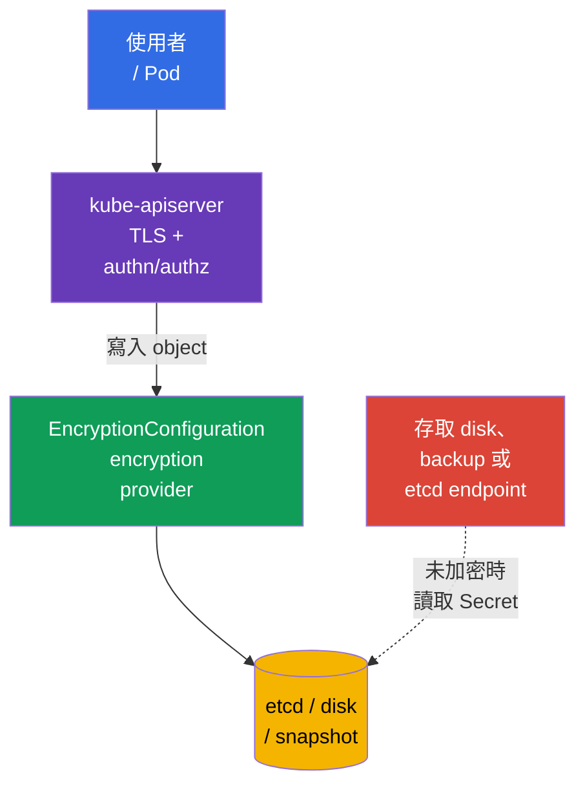
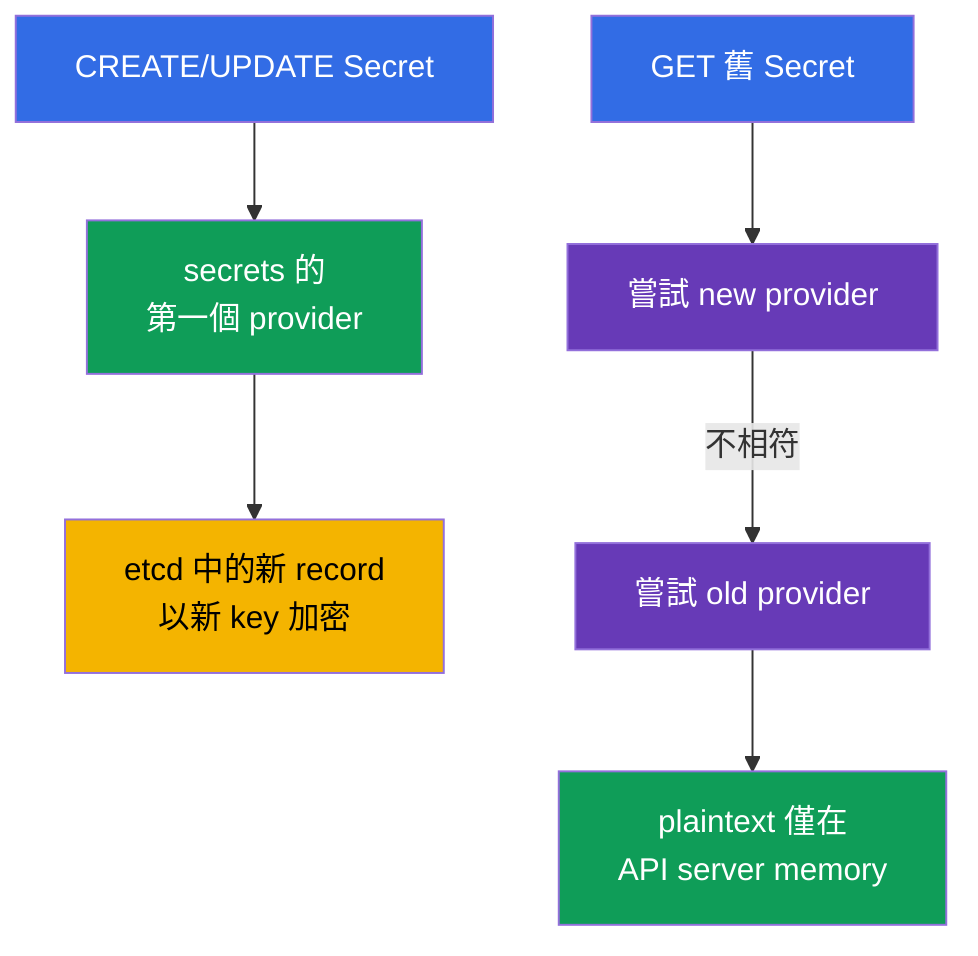
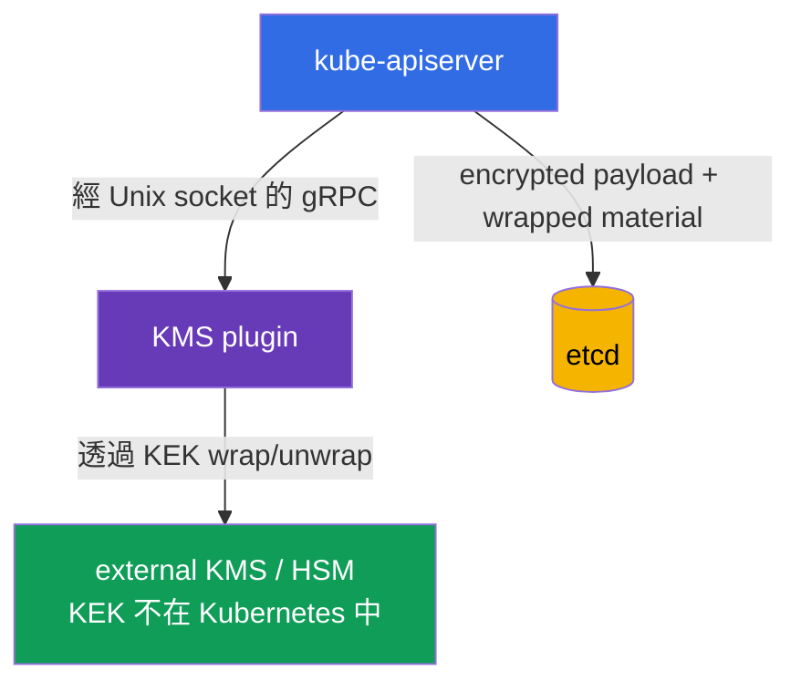
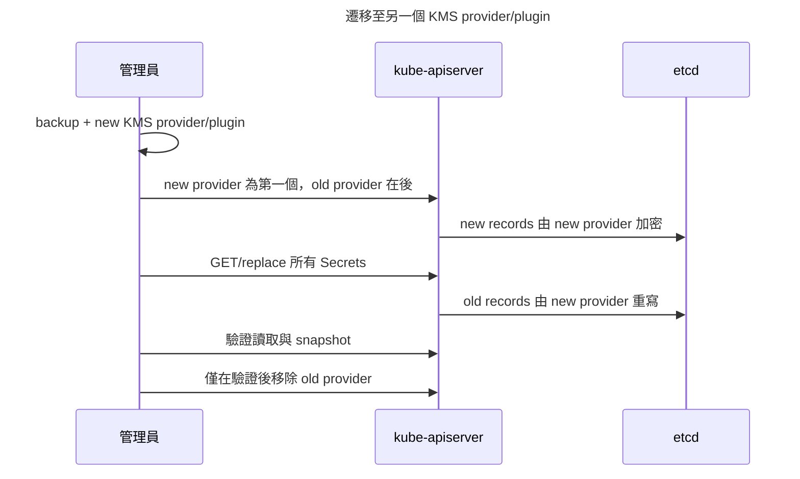

[Русская версия](ru.md) · [Eng version](README.md) · [Versión en español](es.md) · [Version française](fr.md) · [Deutsche Version](de.md) · [ქართული ვერსია](ge.md) · [日本語版](jp.md)

# 第 21 章：etcd 資料加密與 Secret 的安全儲存

> **問題。** 取得 control plane disk、etcd access、snapshot 或其 backup 的人，可繞過 API server 的 RBAC、
> authentication 與 audit，並在 `Secret.data` 僅以普通 base64 寫入時讀取它。這類副本中的 passwords、tokens
> 和 private keys 可讓攻擊在 cluster 外繼續。將選定 API resources 寫入 etcd 前加密，會在 storage 保留
> ciphertext，並要求分開存取 key material。

> **接下來。** `Secret` 用於 sensitive data，但其 `data` fields 僅以 base64 編碼。若未啟用 encryption at rest，
> 存取 etcd data、snapshot 或 backup 的人可讀取 password、token 和 private key。本章透過
> `EncryptionConfiguration` 設定選定 API resources 寫入 etcd 前的 encryption，說明 `aescbc`、`aesgcm`、
> `secretbox` 和 `kms`、安全 key rotation，並驗證結果。這是 [CKA 第 19 章的 Secret](../../../cka/course/19/tw.md)
> 與 etcd 和 cluster data 關係的 [CKA 第 37 章](../../../cka/course/37/tw.md) 的實務延續。

> **Protection boundary。** `EncryptionConfiguration` 在選定 API data 寫入 etcd 前加密它。它不是 full-disk
> encryption，也不會獨立加密 disks、snapshots 或 backups：snapshot 含有受保護 resources 的 encrypted values，
> 但仍需要獨立的 protection、access control，並在必要時加密 storage。Encryption at rest 不加密 client 與
> API server 間 traffic（應使用 TLS）、不取消 RBAC，也不能防禦已可 `get secret` 或在含 secret 的 Pod 中 `exec`
> 的 user。

> 🧠 etcd 或 snapshot access 可繞過 API authentication、authorization 和 audit；base64 不保護 `Secret.data`，encryption at rest 保護沒有 keys 的 storage。

## 21.1. 威脅模型：為什麼 etcd 是特別有價值的目標

API server 是通往 Kubernetes state 的一般路徑，而 etcd 是其 persistent storage。etcd 中有 API objects：
Secrets、ConfigMaps、ServiceAccounts、RBAC bindings、Deployments 等。因此，讀取 database 或其副本會繞過
慣常 control point - 帶有 authentication、authorization 和 audit 的 API server。



典型洩漏路徑：

- control-plane node、其 disk 或 etcd data directory 遭入侵；
- snapshot 傳到不安全 storage、進入 ticket、CI artifact 或 laptop；
- 某人具有直接連至 etcd 的 network 與 TLS access；
- backup 在 access 較寬的 test environment 中還原；
- Secret 意外輸出至 log、shell history、Git 或 environment variable。

etcd encryption 無法修正最後一項，但前四項會顯著困難：database 儲存 ciphertext，且不應有 key material。
對 CKS 而言，不要得出錯誤結論：**base64 不是 encryption**；`kubectl get secret -o yaml` 無需 key 即可解碼。

| Protection | 可防禦的對象 | 不會做的事 |
|---|---|---|
| API server/etcd TLS | traffic interception | 不加密 disk data |
| RBAC | 限制對 Secret 的 API access | 不保護被竊的 snapshot |
| Encryption at rest | etcd 及 snapshot 中選定 API data 的 ciphertext | 不會加密完整 disks、snapshots 或 backups，也不對獲准 API client 隱藏 Secret |
| 外部 secrets manager | 將 master keys 和 lifecycle 與 cluster 分離 | 不取代 RBAC、TLS 和安全 Pod |

> 🧠 第一個符合的 provider 加密新 records，API server 按順序讀取 providers。

## 21.2. API data encryption 的運作方式

`kube-apiserver` 套用 `EncryptionConfiguration` 中描述的 provider chain。**寫入**時使用第一個符合 resource 的
provider。**讀取**時按順序嘗試 providers，直到有一個能解密 existing value。HA 中輪換 local key 時，先在
所有 API servers 將 new key 加為第二個，只有在新 configuration 已套用至所有節點後才把它移到第一個；舊 key
保留到 re-encryption 完成。



最小 file format：

```yaml
apiVersion: apiserver.config.k8s.io/v1
kind: EncryptionConfiguration
resources:
- resources:
  - secrets
  providers:
  - aescbc:
      keys:
      - name: key1
        secret: <base64-encoded-32-byte-key>
  - identity: {}
```

`resources` 列出 API resources，而非 namespaces。通常先保護 `secrets`；若有合理需求，可加入 `configmaps`、
CRD 或其他 sensitive resources。不要盲目加密所有內容：這會增加 load、使 recovery 複雜，且不能取代 data classification。

`resources` elements 依序處理：較早的 matching configuration 優先。不要無故在獨立 blocks 重複同一 explicit
resource，也不要建立 overlapping wildcard expressions。允許的 documented pattern 為：specific exception
**先於** broad wildcard，例如保留 `events` plaintext 而加密其他項目：

```yaml
resources:
- resources:
  - events
  providers:
  - identity: {}
- resources:
  - '*.*'
  providers:
  - secretbox:
      keys:
      - name: key1
        secret: <base64-encoded-32-byte-key>
```

此處 `events` 符合第一個 element，不會到達 `*.*`；specific rule 先於 wildcard 的順序是 security boundary 的一部分。

`identity: {}` 不加密任何內容。它位於 chain 末端時，可在 migration 期間讀取舊 plaintext records。它只在位於
第一個時才對新 record 危險：第一個 provider 決定新 record format。所有 records re-encrypted 後，若不需舊 data
fallback，可移除 `identity`。

> **Critical dependency。** 遺失的 key、在 re-encryption 前刪除的 key，或不可用的 KMS，都可能使部分 objects
> unreadable 並中斷 control plane。Configuration 和 keys 需要 backup、access control 及預先演練的 rotation。

> 🎯 末端的 `identity` 讀取舊 plaintext；第一個 `identity` 讓新 records 保持 unencrypted。

## 21.3. Providers：`aescbc`、`aesgcm`、`secretbox`、`kms` 與 `identity`

Kubernetes 支援多個 providers。Production 不要選擇 `identity` 作為唯一 protection：這是有意停用 encryption at rest。

| Provider | 機制 | 適用時機 | 主要限制 |
|---|---|---|---|
| `identity` | plaintext | 舊 data 的暫時 fallback | 完全不加密 |
| `aescbc` | 使用 PKCS#7 padding 的 AES-CBC | training/legacy 機制；不建議用於新 production configurations | 弱：沒有內建 authentication/MAC，可能有 padding-oracle attacks；key 儲存於 control plane |
| `aesgcm` | AES-GCM、AEAD | 僅搭配 automated rotation | 不建議不做 rotation；每個 key 上限 200,000 records |
| `secretbox` | XSalsa20 + Poly1305、AEAD | 強大且快速的 local provider | 32-byte key 儲存於 control plane |
| `kms` | 透過 KMS plugin 的 envelope encryption | 使用 external key manager/HSM/cloud KMS 的 production | plugin/KMS availability 成為 API server dependency |

> 🔬 AEAD、CBC、record limits 和 key placement 決定 provider 的選擇。

`aescbc` 使用 base64-encoded AES key；範例中為 32-byte key (AES-256)。Kubernetes 接受 16、24 或 32-byte
keys。與 AEAD provider `aesgcm` 不同，`aescbc` 沒有內建 authentication/MAC，因此目前 Kubernetes 文件將 CBC
變體視為 weak。這個範例用於 exam mechanics 與 compatibility，而不是 production recommendation。為 lab 產生
32-byte value：

```bash
head -c 32 /dev/urandom | base64
```

`aescbc` 範例：

```yaml
apiVersion: apiserver.config.k8s.io/v1
kind: EncryptionConfiguration
resources:
- resources:
  - secrets
  providers:
  - aescbc:
      keys:
      - name: secrets-aescbc-2026-08
        secret: <base64-encoded-32-byte-key>
  - identity: {}
```

`aesgcm` 也是 AEAD - encryption 加 integrity check。目前 Kubernetes 文件對一個 AES-GCM key 設定實務限制：
不超過 200,000 records，之後必須 rotation。因此該 provider 適合受控 volume 與 automated rotation；高頻 Secret
writes 時應優先選 KMS，或非常仔細地設計 key lifecycle。

`secretbox` 使用 XSalsa20 與 Poly1305，是 AEAD provider，並需要 32-byte key。Kubernetes 將其標為強大、快速
選項。後續 lab 使用 `aescbc`，以說明 legacy mechanics 和限制；production local provider 的選擇需考慮
rotation 與 key storage requirements。

```yaml
apiVersion: apiserver.config.k8s.io/v1
kind: EncryptionConfiguration
resources:
- resources:
  - secrets
  providers:
  - aesgcm:
      keys:
      - name: secrets-aesgcm-2026-08
        secret: <base64-encoded-32-byte-key>
  - identity: {}
```

不要將實際 key 放入 Git、Helm values、Terraform state、chat 或 ticket。含 local key 的 configuration file 應只供
root 和 API server process 存取，例如：

```bash
# 先建立 parent directory：檔案 install 不會建立不存在的 directory。
sudo install -d -o root -g root -m 0700 /etc/kubernetes/enc
sudo install -o root -g root -m 0600 encryption-config.yaml \
  /etc/kubernetes/enc/encryption-config.yaml
sudo stat -c '%U:%G %a %n' \
  /etc/kubernetes/enc \
  /etc/kubernetes/enc/encryption-config.yaml
```

Local `aescbc`/`aesgcm` 會保護 snapshot 免受僅有 snapshot、沒有 control-plane filesystem 的人讀取。這是
有用 baseline，但 key 位於同一 trusted machine。為分離 duties 與建立更可靠 key lifecycle，應使用 `kms`。

> 🎯 kube-apiserver 透過 `--encryption-provider-config` 取得可由 mount 存取的 path；檢查 readiness 與透過 API 讀取 Secret。

## 21.4. 將 `EncryptionConfiguration` 連接至 kube-apiserver

File 本身不會變更任何事。API server 必須取得 `--encryption-provider-config=<path>` flag。在 kubeadm cluster 中，
`kube-apiserver` 是 static Pod；其 manifest 通常位於 `/etc/kubernetes/manifests/kube-apiserver.yaml`。變更
manifest 後，kubelet 會接收變更並 restart API server。

```yaml
# /etc/kubernetes/manifests/kube-apiserver.yaml（fragments）
spec:
  containers:
  - name: kube-apiserver
    command:
    - kube-apiserver
    - --encryption-provider-config=/etc/kubernetes/enc/encryption-config.yaml
    volumeMounts:
    - name: encryption-config
      mountPath: /etc/kubernetes/enc
      readOnly: true
  volumes:
  - name: encryption-config
    hostPath:
      path: /etc/kubernetes/enc
      # 上方已準備好 directory；Directory 不會以空 directory 隱藏 typo。
      type: Directory
```

Flag path 從 **API server container** 可見，因此僅在 host 建立 file 不夠：需要 `hostPath` 與 `volumeMount`。
核對 YAML indentation 與現有 volume names，不要以 template 取代整個 manifest。在 HA control plane，相同受保護
file 和 flag 必須位於每個 API server node，且變更應逐一 rollout 並控制 health 與 quorum。

實務工作順序：

1. 建立並驗證新 etcd snapshot；程序請見 [CKA 第 37 章](../../../cka/course/37/tw.md)。
2. 在 shell history 外產生 key，將 configuration 以 `0600` mode 儲存於受保護 path。
3. 將 volume、mount 與 `--encryption-provider-config` 加入 API server manifest。
4. 等待 static Pod restart，並檢查 `kubectl get --raw='/readyz?verbose'`。
5. 建立 test Secret，確認 API 可讀取，接著對所有舊 records 執行 re-encryption。

```bash
# 檢查正在執行的 static-Pod manifest 中的 flag 與 mount。
sudo grep -n -- '--encryption-provider-config\|encryption-config' \
  /etc/kubernetes/manifests/kube-apiserver.yaml

# Manifest 變更後，API server 已再次 ready。
kubectl get --raw='/readyz?verbose'
kubectl -n kube-system get pods -l component=kube-apiserver
```

> **注意。** Path、YAML 或 key 的錯誤可能讓 API server 無法啟動。透過 control-plane node console 操作，
> 保留 manifest backup，在驗證完成前不要刪除先前 configuration。Managed Kubernetes 不應編輯 static Pod：
> 以 provider 的標準機制啟用 encryption，並依其 KMS/cluster update procedure 操作。

> 🏭 KMS 將 KEK 移出 cluster，但 plugin 與 key manager 需要 HA、最小 permissions 與可驗證的 restore。

## 21.5. KMS 與 envelope encryption

`kms` provider 經 Unix socket 將 API server 連接至 local KMS plugin；plugin 與 external KMS/HSM 通訊，
其中儲存 key encryption key (KEK)。`EncryptionConfiguration` 不含 KEK。KMS v1 和 v2 都使用 envelope encryption，
但取得 data encryption key (DEK) 的方式不同，因此不可將其描述為同一 sequence。



KMS **v2** 的概念性 fragment：

```yaml
apiVersion: apiserver.config.k8s.io/v1
kind: EncryptionConfiguration
resources:
- resources:
  - secrets
  providers:
  - kms:
      apiVersion: v2
      name: production-kms
      endpoint: unix:///var/run/kmsplugin/socket.sock
      timeout: 3s
  - identity: {}
```

應明確固定差異：

| Property | KMS v1 | KMS v2 |
|---|---|---|
| Status | Kubernetes 1.28 起 deprecated；1.29 起預設停用，需明確 `--feature-gates=KMSv1=true` | Kubernetes 1.29 起 stable；新 configurations 的建議 API |
| DEK | 每個 encryption operation 使用新 random DEK；plugin 以 KEK wrap 每個 DEK | API server 儲存 secret seed，並以 KDF 為每次 operation 導出 unique DEK；seed 由 KEK wrap，並在 KEK rotation 時變更 |
| Config fields | `apiVersion: v1` 或欄位缺少；`name`、`endpoint`、`cachesize`、`timeout` | `apiVersion: v2`、`name`、`endpoint`、`timeout`；不允許 `cachesize` |
| Performance | 更多 gRPC/KMS calls；cache 儲存 unwrapped DEK | 每次 write 不需呼叫 KMS 來 wrap 個別 DEK |
| Key identity | 依 v1 plugin 而定 | `Status` 回傳 `version: v2`、`healthz: ok` 與目前 KEK 的 `key_id` |

> **Table version boundary。** 截至 **2026-09-15**，KMS v1 在 exam snapshot v1.35 仍存在，但已 deprecated 且預設停用；
> legacy compatibility 需要明確 feature gate。不要用於新 configurations，並核對自己 minor version 的 KMS documentation。

在 v2 中，etcd 儲存 encrypted payload，以及足夠讓 API server 從受保護 seed 導出 unique DEK 的 material；
它不是「plugin 在每筆 write 提供新 wrapped DEK」的模型。`key_id` rotation 會讓 API server 取得新 seed、用新 KEK
保護它，並用於後續 writes。舊 data 透過獨立、受控的 re-encryption procedure 重寫。

精確 fields 與可用 API version 取決於 Kubernetes version 和所選 plugin。核對該 version 的官方 documentation 與
plugin deployment；不要將任意 KMS v1/v2 example 複製到 production。Socket 必須透過明確 volume mount 讓 API
server container 存取，且 access 必須受限。Plugin 本身應對 remote manager 使用 TLS/authentication、具備最小 KMS
permissions，並且不可在 logs 輸出 plaintext。

KMS 有兩個有用 operational mechanisms。`--encryption-provider-config-automatic-reload=true` flag 讓 API server
不用 restart 即可重新讀取 configuration（適合 key rotation）。Plugin health 由 `/healthz/kms-providers` endpoint
與整體 `/healthz` 檢查；automatic reload 時，個別 health checks 合併為一項。API server 在 healthy 狀態約每分鐘
poll KMS v2 `Status`，故障時更頻繁。Cache 不會讓 plugin/KEK 成為 optional dependency：不可用可能破壞
startup/cache warm-up、尚未展開 material 的 decrypt、KEK/key_id rotation 和 snapshot restore。Plugin 與 remote
manager 必須具備 HA，而 restore 需要同一 KEK 或已記錄的 migration。

KMS 改善 secret separation，但增加 operational requirements：

- 對 KMS v1，plugin/KMS 更接近 synchronous data path：new DEK 經 KMS wrap，cache miss 需要 unwrap。對 KMS v2，
  API server 本機從受保護 seed 導出 unique DEK，因此不會在每個一般 API read/write 呼叫 remote KMS。Plugin 和
  manager 仍對 startup/cache warm-up、uncached decryption、key rotation 與 recovery 至關重要；監看 `Status` health、
  `key_id` stability、`EncryptRequest`/`DecryptRequest` latency、errors、availability、quota 和 credentials expiry；
- 設計 HA plugin 和 KMS：它是 critical dependency，因此 plugin/KEK 不可用可能造成 encrypted resources read/write
  errors；預先驗證 recovery procedure；
- backup metadata 並記錄 key IDs，但**不要**將 master keys 匯出至 etcd backup；
- 限制 IAM/ACL：API server 僅取得所需 encrypt/decrypt operations，而 cluster administrator 不必取得 KEK management rights；
- 在 incident 前測試具備相同 KMS key access 的 snapshot restore。

External KMS 不表示 Secret 不再出現於 Kubernetes。若 application 取得一般 Kubernetes Secret，plaintext 仍可由
被允許 API 或 Pod 的人存取。為透過 short-lived identity 發放 secrets，可用 Vault Agent、Secrets Store CSI Driver
或 External Secrets Operator，但必須仔細檢查其 RBAC 與 synchronization：建立 Kubernetes Secret 的 operator 會
再次把副本放入 etcd。

> 🎯 先放置 new key/provider 並保留 old key → 重寫 objects → 驗證 read/storage → 移除 old key。

## 21.6. Provider 輪替與現有資料的重新加密

只變更 configuration 並不足夠。新的 provider 僅會套用至**新的或已更新的** objects；舊 records 仍以 old key
加密或仍是 plaintext。因此，安全的 rotation 永遠包含兩個不同動作：先確保能讀取舊資料並以新 key 寫入，接著
重寫現有 objects。

### `aescbc`/`aesgcm` key rotation

假設一開始使用 `key-old`。在 HA control plane 中，不能立即將 `key-new` 放在第一個：已更新的 API server
能以 new key 寫入 object，但另一個 API server 尚不能解密它。請分兩個 phases 進行 rotation。

1. 在每個 control-plane node 的 configuration 中，將 `key-new` 加在 `key-old` **之後作為第二個**。
2. 在**所有** API servers restart API server 或 reload configuration。此時每一個都可解密兩把 keys，而新 records
   暫時仍使用 `key-old`。
3. 將 `key-new` 改為**第一個**，保留 `key-old` 為第二個，再次將 configuration 套用至所有 API servers。只有現在，
   new records 才會以 `key-new` 建立。

Phase 1 — 所有 API servers 上的 new key 為第二個：

```yaml
apiVersion: apiserver.config.k8s.io/v1
kind: EncryptionConfiguration
resources:
- resources:
  - secrets
  providers:
  - aescbc:
      keys:
      - name: key-old-2026-01
        secret: <old-base64-32-byte-key>
      - name: key-new-2026-08
        secret: <new-base64-32-byte-key>
  - identity: {}
```

Phase 2 — 在所有 API servers 套用 phase 1 後，將 new key 改為第一個：

```yaml
apiVersion: apiserver.config.k8s.io/v1
kind: EncryptionConfiguration
resources:
- resources:
  - secrets
  providers:
  - aescbc:
      keys:
      - name: key-new-2026-08
        secret: <new-base64-32-byte-key>
      - name: key-old-2026-01
        secret: <old-base64-32-byte-key>
  - identity: {}
```

在所有 API servers 套用 phase 2 後，重寫所有 Secrets。下列 command 取得每個 object 並將它送回 API；排在第一的
new provider 會加密該 record。大量操作前，先建立 snapshot，並從 test namespace 開始。

```bash
# 透過 API server 重寫所有 Secrets。
kubectl get secrets --all-namespaces -o json | kubectl replace -f -

# 若保護 ConfigMaps，請以獨立且有意識的操作重寫它們。
# kubectl get configmaps --all-namespaces -o json | kubectl replace -f -
```

> 🔬 Storage Version Migration 大量重寫 storage，且需要獨立的 feature/operational rollout。

### Production extension：Storage Version Migration

對 production 中的大量重寫，有一個 Kubernetes-native alternative：**Storage Version Migration**。在 Kubernetes
1.36 中它是 beta，且預設關閉；依你的 version documentation 明確啟用並設定後，migration 會透過 API storage path
重寫 objects。尤其適合在變更 `EncryptionConfiguration` 或 keys 後進行 re-encryption。對 CKS 而言，理解 provider
order 與強制重寫 objects 已足夠；上述 `kubectl replace` 仍是簡單的 exam path，而 Storage Version Migration 需要
獨立的 operational rollout、monitoring 與經過驗證的 rollback/recovery process。

> 🏭 **Upstream v1.37。** 在 Kubernetes v1.37 中，內建 `StorageVersionMigration` API/controller 已成為 GA 且
> 預設啟用。這會改變 production-current status，但不改變本章仍連結到 exam/training context 的 CKS Core workflow。
> 請見 [Kubernetes v1.37 Security Delta](../APPENDIX_K8S_137_SECURITY_DELTA_TW.md)。

`kubectl replace` 需要目前的 `resourceVersion`；高度競爭時可能產生 conflicts。在 production 中請執行帶有 retry、
API latency monitoring 與協調 maintenance window 的 controlled script，不要不加思索地把 command 放進 CI。不要將
含 Secret 的 JSON 寫入 disk 或 pipeline log。

完成 re-encryption 並驗證 keys 後，從 config 移除 `key-old`，restart API server，並再次檢查讀取。不可在重寫
objects 前移除 old key：restored snapshot 或 old record 會變得無法讀取。

### 從 `identity` 遷移至 encryption

對舊 cluster，開始方式相似：將 new encryption provider 放在第一個，將 `identity` 留在最後，接著重寫 resources。

```yaml
providers:
- aesgcm:
    keys:
    - name: key-2026-08
      secret: <base64-encoded-32-byte-key>
- identity: {}
```

重新加密 old records 後，可移除 `identity: {}`。只可作為相容性的明確暫時選擇而將它留在較後面；不要把存在
`identity` 視為所有資料都受到保護的證明。

> 🏭 KEK rotation 與 provider change 不同；在驗證 restore 前，請保留解密 old data 的能力。

### KMS v2 KEK rotation

KMS v2 中正常的 remote KEK rotation 發生於**external KMS/plugin 內**。Plugin 透過 `Status` 報告目前公開的
`key_id`；API server 將此 ID 視為 authoritative。當 `key_id` 改變時，API server 會取得由 new KEK 保護的 new seed，
並將其用於後續 encryption。對這種正常 KEK rotation，不會加入第二個 `kms` provider、不會變更 provider order，也不會
只為切換 KEK 而 restart API server。

在 healthy state，API server 約每分鐘 polling 一次 `Status`，且可使用最後的 valid state 約三分鐘。因此，rotation 後
不要立即開始 re-encryption：先確認所有 API servers 都看見新的穩定 `key_id`，而 plugin 並未在 IDs 之間切換。接著，若
storage 應遷移至 new KEK，才透過 API 重寫所需 objects。Upstream 建議至少每 90 天輪替 KMS v2 KEK 一次。確切的 workflow
與 observability 取決於 plugin 和 external KMS。

### 遷移至另一個 KMS provider/plugin

這**不是**一般的 KEK rotation。若 cluster 確實要移至不同已設定的 KMS provider、plugin 或 endpoint，將 new `kms`
provider 放在第一個，為 decrypt 將 old provider 留在後面，接著由 API 重寫 data，僅在驗證後才將 old provider/plugin
退役。



> 🎯 證明 API server config、授權的 Secret read，以及 raw etcd value 中不存在 plaintext marker。

## 21.7. 驗證：API、configuration 與 etcd

不要只檢查 file 是否存在。需證明三件事：API server 確實使用 flag、Secret 仍可透過 API 存取，以及 etcd 中沒有
plaintext。最後一項 check 應只在 isolated lab cluster 或依協定 procedure 進行：direct etcd access 需要 privileges，
可能暴露真實資料。

先建立一個帶有容易搜尋之 unique value 的無害 canary Secret：

```bash
kubectl -n default create secret generic encryption-check \
  --from-literal=probe='not-a-real-secret-rotate-me'
kubectl -n default get secret encryption-check \
  -o jsonpath='{.data.probe}' | base64 -d; echo
```

第二個 output 證明 API 的正常 operation，但不證明 encryption at rest：API server 必須為授權 client 解密 data。接著檢查
manifest、readiness 與 API server log：

```bash
sudo grep -n -- '--encryption-provider-config' \
  /etc/kubernetes/manifests/kube-apiserver.yaml
kubectl get --raw='/readyz?verbose'
kubectl -n kube-system logs kube-apiserver-$(hostname) --tail=100
```

Static Pod name 可能與 `$(hostname)` 不同；先使用 `kubectl -n kube-system get pods -l component=kube-apiserver`
取得它。不要將 production logs 輸出到未受保護的位置：diagnostic data 可能含有 object names 和 access errors。

對於 training self-managed cluster，可直接透過 `etcdctl` 取得 value，並確認 response bytes 中沒有 marker。以下 TLS
parameters 是典型的 kubeadm example：先將 endpoint、CA 與 cert/key paths 對照**目前的** etcd manifest。此 check
會 fail-closed：唯有 `etcdctl` 讀取目標 key 的非空 value、`strings` 成功執行，且未找到 marker 時才會 PASS。

```bash
(
  set -euo pipefail
  raw_file="$(mktemp)"
  trap 'rm -f "$raw_file"' EXIT

  # 請以目前 etcd manifest 中的值取代 endpoint 與 TLS paths。
  if ! ETCDCTL_API=3 etcdctl get /registry/secrets/default/encryption-check \
    --endpoints=https://127.0.0.1:2379 \
    --cacert=/etc/kubernetes/pki/etcd/ca.crt \
    --cert=/etc/kubernetes/pki/etcd/server.crt \
    --key=/etc/kubernetes/pki/etcd/server.key \
    --print-value-only >"$raw_file"; then
    echo 'ERROR: etcdctl could not read the canary object' >&2
    exit 1
  fi

  if [ ! -s "$raw_file" ]; then
    echo 'ERROR: etcd key is absent or has an empty value' >&2
    exit 1
  fi

  # grep=1 表示找不到 marker；不要將它與 etcdctl/strings error 混淆。
  set +e
  strings "$raw_file" | grep -Fq 'not-a-real-secret-rotate-me'
  status=("${PIPESTATUS[@]}")
  set -e

  if [ "${status[0]}" -ne 0 ]; then
    echo 'ERROR: strings could not inspect the etcd value' >&2
    exit 1
  elif [ "${status[1]}" -eq 0 ]; then
    echo 'FAIL: plaintext marker is present in etcd' >&2
    exit 1
  elif [ "${status[1]}" -ne 1 ]; then
    echo 'ERROR: plaintext verification failed unexpectedly' >&2
    exit 1
  fi

  echo 'OK: etcd value was read and plaintext marker was not found'
)
```

對 old data，請在 re-encryption 後執行此 test。etcd data 通常帶有 encryption provider format prefix；不要圍繞會隨
Kubernetes version 改變的 internal format 建立 check。

Test 後刪除 canary Secret，並確認 backup/restore runbook 已保存：

```bash
kubectl -n default delete secret encryption-check
```

| 要檢查什麼 | 預期結果 |
|---|---|
| API server manifest | 有 `--encryption-provider-config` 與正確的 read-only mount |
| readiness | restart 後 `/readyz?verbose` 成功 |
| API 讀取 Secret | 授權的 `kubectl get` 回傳原始 value |
| etcd lab check | raw stored value 中找不到 unique plaintext marker |
| rotation 後 | rotation 前建立的 Secret 可讀取，且已由 new provider 重寫 |
| backup/restore | snapshot 被安全存取，且 restore 時可使用所需 keys/KMS |

> 🏭 Encryption at rest 不能取代 RBAC、TLS、Secret hygiene 與 backup；請分別管理 keys、KMS availability 與 restore。

## 21.8. 如何在 production 中應用

Encryption at rest 是其中一層。有效防護由數個獨立 barriers 建立。

- **最小 RBAC。** 不要將 `get`、`list` 與 `watch` 對 `secrets` 授予廣泛 groups。`list` 和 `watch` 也會回傳
  Secret contents。也要分別限制 `pods/exec`、`pods/attach` 與 `pods/ephemeralcontainers`：workload 中的 shell
  常可通往 mounted Secret。
- **除非必要，不要經由 env 傳遞 Secret。** 優先選用 read-only volume/CSI mount；environment variables 很容易出現在
  debug output、crash dump、child process 或 log 中。
- **不要 commit plaintext。** `stringData` 很方便，但在 Git 中它是 plaintext。使用 SOPS、Sealed Secrets 或與
  external secrets manager 整合的 GitOps；啟用 pre-commit 與 server-side scanning。
- **短生命週期與 rotation。** 輪替 database password、API token、certificate 與 cloud credential。更新 Kubernetes
  Secret 不代表 application 會自動重新讀取：env 不會更新，file mount 則會延遲更新；application 必須能 reload/restart。
- **限制 API surface。** 不要在 CI log 中輸出 `kubectl get secret -o yaml`、decoded values 或 KMS credentials。撤銷
  意外公開的 secret 應在 source 端進行，而不只是從 Git history 刪除該行。
- **保護 backups。** Encrypted etcd snapshot 仍很敏感：請分開儲存、加密 storage，設定 retention、MFA/ACL 與經過驗證的
  restore。將 secret key 或 KMS access 與 snapshot 分開保存。

External Secrets Operator、Vault、cloud Secrets Manager 與 Secrets Store CSI Driver 解決不同問題。前者經常將
external value 同步至 Kubernetes Secret——很方便，但副本仍在 etcd，且必須 encrypted。CSI/Vault Agent 可將 secret
作為 file 發給 Pod，而不建立持久 Kubernetes Secret——etcd 中的副本較少，但 node plugin、Pod identity 與 external
backend 會形成 trust boundaries。請在完成 threat model 後選擇 pattern，而非只因某個 tool「加密 secrets」。

## 21.9. 常見錯誤與診斷

| Symptom | 可能原因 | 安全的處置 |
|---|---|---|
| 編輯後 API server 不 Ready | YAML 不正確、config/mount/socket 無法存取、key 無效 | 透過 console 還原已驗證的 manifest，讀取 local kubelet/API log |
| 可透過 `kubectl` 讀取 Secret | 這是正常的 | API 會為授權 client 解密；僅在 lab 中檢查 raw etcd |
| rotation 後舊 Secret 無法讀取 | 過早移除 old key/provider | 從受保護 backup 還原 old provider/key，接著 re-encrypt |
| new record 仍是 plaintext | `identity` 在第一個，或 flag 未套用 | 檢查 provider order、manifest、restart，並建立 new canary |
| API write 卡住/失敗 | KMS plugin 或 external KMS unavailable/slow | 檢查 socket、TLS、KMS health、timeout 與 HA；不要盲目降低 security |
| 在 Git/log 發現 Secret | encryption at rest 無法解決 | 立即輪替 source credential、限制 access，並依 IR procedure 移除 artifact |

> 🏭 **Kubernetes v1.37 recovery edge case。** 對於 unreadable/corrupt API object，存在 Beta 的 unsafe force-delete
> path（`AllowUnsafeMalformedObjectDeletion`）。這是具有 cluster-breaking potential 的操作，也是最後的 recovery
> mechanism，並非修正 encryption rotation 的一般方式。詳細資訊與限制請見
> [Kubernetes v1.37 Security Delta](../APPENDIX_K8S_137_SECURITY_DELTA_TW.md)。

考試時先判定 cluster type。對 kubeadm，尋找 API server manifest 與 etcd TLS paths。對 managed control plane，settings
可能被封閉：不要嘗試編輯不存在的 `/etc/kubernetes/manifests`；使用 provider-supported KMS encryption，並確認其 status。

## 21.10. 迷你詞彙表

- **Encryption at rest** — 在寫入 etcd 前加密選定 API data；不是 disk、snapshot 或 backup 整體加密。
- **EncryptionConfiguration** — kube-apiserver 讀取的 configuration，其中包含所選 API resources 的 providers。
- **provider** — 用於特定 API resources 的 encryption/decryption mechanism。
- **`aescbc`** — 使用 PKCS#7 padding 與 configuration 中 key 的 local AES-CBC provider；沒有 built-in
  authentication/MAC，因此較弱。
- **`aesgcm`** — AEAD provider AES-GCM；keys 必須考慮 write limit 進行 rotation。
- **`secretbox`** — 使用 32-byte key 的 AEAD provider XSalsa20 + Poly1305。
- **`kms`** — 將 cryptographic operations 交給 external KMS plugin 的 provider。
- **envelope encryption** — 以 DEK 加密 object，再以 external KEK 保護 DEK。
- **KEK/DEK** — key encryption key / data encryption key。
- **re-encryption** — 透過 new provider/key 重寫 old API objects。
- **`identity`** — 不加密的 provider；只可作為有意識的 temporary fallback。

## 21.11. 本章摘要

- etcd 儲存 Secret 與 Kubernetes state 的重要部分；base64 不保護此內容。
- `EncryptionConfiguration` 透過 kube-apiserver flag `--encryption-provider-config` 套用；new records 使用第一個 provider，
  reads 依序嘗試 providers。
- `aescbc`、`aesgcm` 與 `secretbox` 是將 key 放在受保護 file 的 local options；`kms` 可將 KEK 移至 external manager，
  並使用 envelope encryption。
- 在 HA 中，local key 的 rotation 順序為：backup → 在所有 API servers 將 new key 放第二個 → 在所有 servers 套用
  configuration → 在所有 servers 將 new key 放第一個 → 再次套用 configuration → re-encryption old objects → checks →
  移除 old key。
- 檢查 configuration、API health、API read，以及 raw etcd lab value 中不存在 canary plaintext。
- Encryption at rest 應由 RBAC、TLS、secrets hygiene、安全 backups 與 external secret manager 補強。

## 21.12. 如何派上用場：考試與實際工作

**在 CKS。** 題目可能要求找出未加密的 Secrets、啟用 encryption at rest、判定正確的
`--encryption-provider-config`、解釋 provider order，或在 rotation 時不破壞 Secret。快速 algorithm：找到 API server
manifest、建立安全的 config 與 mount、加入 flag、等待 health、重寫 objects，並檢查 etcd。不要回答「Secret 以 base64
加密」——這是錯的。

**在 production。** 將 encryption at rest 視為 standard control-plane baseline，而非最後一道防線。將 keys 與 etcd
backups 分開管理、自動化 rotation、監控 KMS、測試 restore，並減少能看見 plaintext 的 people、identities 與 Pods。
依 change procedure 對 API server configuration 進行變更，包含 rollback 與 backup。

## 21.13. 自我檢查問題

<details>
<summary>1. 為什麼 `Secret.data` field 中的 base64 無法保護 secret 不受 etcd snapshot owner 存取？</summary>

Base64 是 encoding，而非 encryption：`kubectl get secret -o yaml` 可在沒有 key 時解碼。etcd snapshot owner 可取得持久的
API state，繞過 API server 的 authentication、authorization 和 audit。Encryption at rest 會改變這點，將選定 resources
儲存為 ciphertext。
</details>

<details>
<summary>2. Encryption at rest 保護哪些 records，又不會消除哪些 threats？</summary>

`EncryptionConfiguration` 在將選定 API data（例如 Secrets）寫入 etcd 前加密它，ciphertext 會進入 snapshot。它不加密
disk、snapshot 或 backup 整體，不保護 TLS traffic，也不會向具有 `get secret` 或在 Pod 中 `exec` 權限的 identity 隱藏
Secret。RBAC、TLS 與 backup protection 仍是獨立 controls。
</details>

<details>
<summary>3. API server 如何選擇寫入時的 provider，以及讀取 old record 時的 provider？</summary>

在 write 時，API server 使用與 resource 相符的第一個 provider。在 read 時，它按順序嘗試 providers，直到有一個能
解密 existing value。正因如此，rotation 期間 old key 可以保留在 new key 下方。
</details>

<details>
<summary>4. 為什麼 `identity` 可位於 migration chain 的最後，但不可作為第一個 provider？</summary>

`identity` 不加密任何內容，但在 chain 末端可在 migration 期間讀取先前的 plaintext records。將它放在第一個很危險，
因為第一個 provider 決定 new records 的 format，它們會保持 plaintext。old records 完成 re-encryption 後，如不再需要
fallback，便可移除 `identity`。
</details>

<details>
<summary>5. Local `aescbc`/`aesgcm` 與 `kms` 的 operational difference 是什麼？</summary>

對 local providers，key 位於 control plane 的 protected config file：這可保護不含 node filesystem 的 snapshot，但不會
分離這些 secrets。`kms` 透過 Unix-socket plugin 和 external KEK/HSM 使用 envelope encryption，改善 separation of duties。
作為交換，plugin 和 external manager 成為 read、write、rotation 與 restore 的 critical dependency。
</details>

<details>
<summary>6. 為什麼在加入 new key 後不能立即移除 old key？</summary>

Old objects 仍可能是 plaintext，或以 old key 加密，而 new provider 僅套用於 new/updated records。在 HA 中，先讓所有
API servers 都能讀取兩把 keys，然後讓 new key 成為第一個並重寫 objects。在 re-encryption 前移除 old key，會使部分
records 或 restored snapshot 無法讀取。
</details>

<details>
<summary>7. 如何證明 old Secret 確實已完成 re-encryption？</summary>

將 new provider 放在第一個後，透過 API 重寫 old Secret，例如從 test namespace 開始執行
`kubectl get secrets --all-namespaces -o json | kubectl replace -f -`。接著檢查 API read，並在 isolated lab 中檢查
canary 的 raw etcd value：unique plaintext marker 不得透過 `strings | grep` 找到。只有完成這項驗證後，才移除 old
key/provider。
</details>

<details>
<summary>8. 哪些 Pod actions 可繞過禁止 `get secrets`，為什麼？</summary>

廣泛的 `pods/exec`、`pods/attach` 或 `pods/ephemeralcontainers` permissions 可提供 workload 中的 shell，而 Secret 在其中
可能已 mount 或可由 application 存取。此時 identity 無須透過 Kubernetes API 直接讀取 Secret 也能看見 plaintext。因此，
這些 subresources 也必須以 least-privilege RBAC 加以限制。
</details>

<details>
<summary>9. 還原 encrypted etcd snapshot 時，必須檢查什麼？</summary>

應依安全 procedure 儲存與還原 snapshot，也必須驗證需要的 local keys 或相同 KMS KEK/plugin 可用。必須預先測試
restore、記錄 key IDs，並以 ACL、storage encryption 與 retention 個別保護 snapshot。不可將 master keys 匯出至 etcd
backup。
</details>

<details>
<summary>10. **Flashback（第 14 章）。** Encryption at rest 僅保護 etcd 中的 Secret。mount Secret 後，kubelet 會透過 **tmpfs-backed volume** 將它提供給 Pod：這排除了通常的 durable-disk copy，卻不保證「永遠不會寫入 disk」。啟用 swap 時，若 kernel 支援 `noswap` option（官方支援 Linux 6.3 起或 backport），Kubernetes v1.36 會以 `noswap` mount memory-backed volumes；否則 kubelet 會警告這類 volume（包括 Secret）可能被 swap out。對這類 nodes，應停用 swap，或加密它並檢查 kubelet warning。第 14 章的哪些措施（host footprint、least-privilege host）可在此階段限制 secret risk——也就是它已解密並透過 tmpfs 提供給 node 上的 authorized process 時——以及為什麼即使沒有 persistent-disk copy，host compromise 或同一 node 上的 privileged workload 仍是嚴重 threat？</summary>

應縮小 host footprint：停用多餘 services 與 packages、關閉不必要的 listening ports，並及時更新 node，以減少通往 host
compromise 的 paths。Least-privilege host 限制誰能取得 SSH/sudo 及 kubelet/runtime access，且 workload 不應取得
`privileged`、host namespaces 或 hostPath。Tmpfs 與 `noswap` 可降低 durable-disk risk，但 node 上的 root 或 privileged
neighboring workload 仍可能存取 memory、runtime 或 mounted secret。
</details>

## 練習

在 production 進行工作前，先在獨立 cluster 完成 lab：建立 `EncryptionConfiguration`、加入 API server flag 和 mount、
加密 Secret、執行 rotation，並透過 etcd 確認結果。保留 control-plane console access 和 fresh snapshot：static-Pod
manifest 的錯誤可能暫時讓 cluster 無法提供 API。

🧪 Lab 109（EncryptionConfiguration、etcd 中的 Secret encryption 與 verification）：
[tasks/cks/labs/109](../../labs/109/README_TW.MD)

🌐 額外 interactive practice（killer.sh/killercoda，external resources）：[secret-pod-access](https://killercoda.com/killer-shell-cks/scenario/secret-pod-access) · [secret-read-secrets](https://killercoda.com/killer-shell-cks/scenario/secret-read-secrets) · [secret-serviceaccount-pod](https://killercoda.com/killer-shell-cks/scenario/secret-serviceaccount-pod) · [secret-etcd-encryption](https://killercoda.com/killer-shell-cks/scenario/secret-etcd-encryption)

📘 相關材料：[CKA 第 19 章 — Secret](../../../cka/course/19/tw.md) ·
[CKA 第 37 章 — etcd backup 與 restore](../../../cka/course/37/tw.md)

---
[目錄](../README_TW.md) · [第 20 章](../20/tw.md) · [第 22 章](../22/tw.md)
