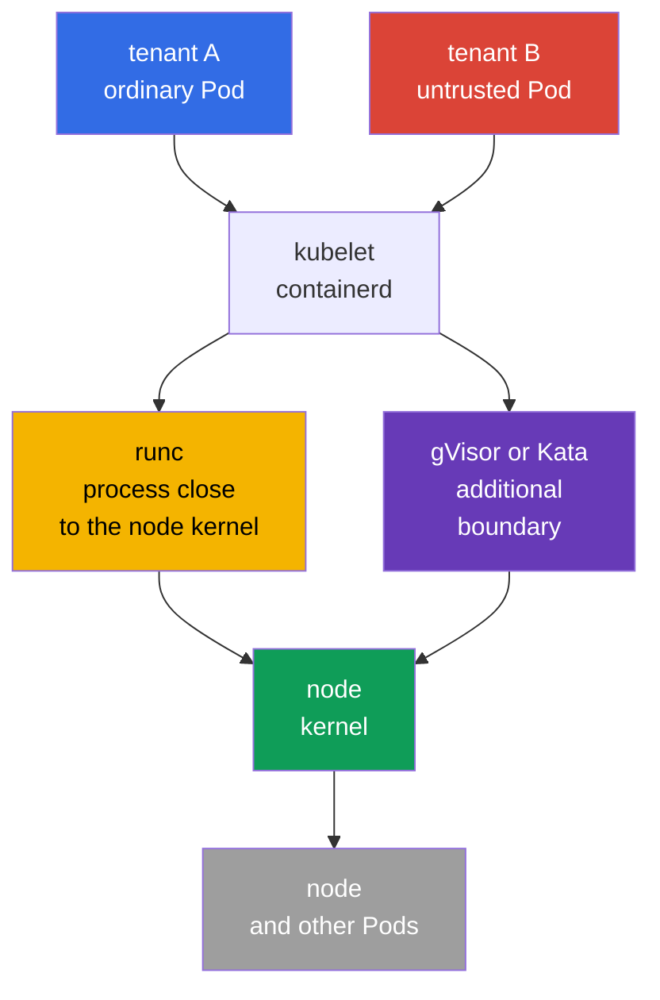
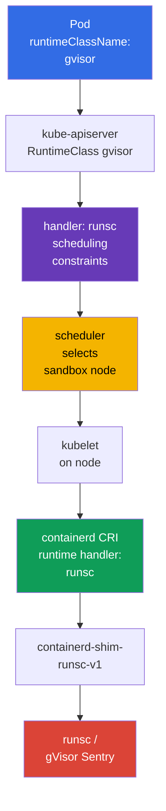

[Русская версия](ru.md) · [Versión en español](es.md) · [Version française](fr.md) · [Deutsche Version](de.md) · [ქართული ვერსია](ge.md) · [繁體中文版](tw.md) · [日本語版](jp.md)

# Chapter 22. Container Runtime Sandbox: gVisor, Kata Containers, and RuntimeClass

> **The problem.** An untrusted tenant, CI job, or user plugin in an ordinary container uses the same node kernel as kubelet and neighboring Pods. A kernel/runtime vulnerability or mistakenly retained privilege can turn code execution into a container escape and access to the host or other tenants. A sandboxed runtime adds a boundary between that workload and the kernel without weakening other Pod policies.

> **What comes next.** `securityContext`, Pod Security Admission, and admission policy reduce process privileges and block dangerous YAML, but an ordinary container still uses the node kernel. Untrusted or especially valuable multi-tenant workloads need a stronger execution boundary: a sandboxed runtime. This chapter selects gVisor (`runsc`) or Kata Containers, connects them to containerd through `RuntimeClass`, and proves that a Pod runs in a sandbox rather than an ordinary OCI runtime.

> **What you need from CKA.** Pods, `nodeSelector`, taints/tolerations, and scheduling diagnostics are covered in [CKA chapter 16](../../../cka/course/16/README.md), `securityContext` and least privilege in [CKA chapter 20](../../../cka/course/20/README.md), and CRI, kubelet, and containerd in [CKA chapter 40](../../../cka/course/40/README.md). Here we use these mechanisms to isolate an untrusted workload rather than repeat their basics.

> 🧠 A sandbox reduces kernel escape for untrusted workloads, but does not replace RBAC, PSA, `securityContext`, or NetworkPolicy.

## 22.1. Why an ordinary container is insufficient for multi-tenancy

A container isolates PID, mount, network, and other namespaces, while cgroups limit resources. But its process normally makes system calls to **the same Linux kernel** as node processes and neighboring Pods. A kernel or container-runtime vulnerability, or an improperly granted capability, can turn code execution into a container escape.

In a single-tenant cluster with verified images, this can be an acceptable risk. In multi-tenancy, trust differs: one team, customer workload, CI job, or supplied plugin must not get a route to the kernel as close as the platform's system components. `privileged`, host namespaces, `hostPath`, the Docker/containerd socket, and broad RBAC remain dangerous **even in a sandbox**.



A sandbox adds a layer between workload and host. It is defence in depth, not permission to weaken other controls:

| Control | What it governs | A sandbox does not replace it |
|---|---|---|
| RBAC and ServiceAccount | who can create or modify an object | sandbox does not limit an identity's API access |
| PSA / Kyverno / Gatekeeper | which Pod fields are allowed | sandbox must not accept a `privileged` Pod |
| `securityContext` | process UID, capabilities, seccomp, filesystem | a secure runtime does not cancel least privilege |
| NetworkPolicy | whom a workload can communicate with | runtime does not set a network allow-list |
| gVisor / Kata | boundary between workload and kernel/host | runtime does not scan an image or verify a signature |

Runtime selection is a workload-class property, not a user property. The platform team creates the RuntimeClass, assigns compatible nodes, sets admission policy, and observes them. A developer specifies an allowed `runtimeClassName`; they do not need access to containerd or SSH on a worker node.

> 🧠 gVisor adds a userspace kernel; Kata adds a lightweight VM with a guest kernel and stronger isolation at a resource cost.

## 22.2. Two approaches: gVisor and Kata Containers

**gVisor** runs a container through `runsc`. Its userspace kernel (`Sentry`) intercepts most system calls and implements them in userspace, reducing the direct attack surface of the host kernel. Supported platforms are `systrap` (default) and `kvm`: `systrap` is the general default, while `kvm` suits available hardware virtualization and compatible infrastructure. `ptrace` is a legacy platform, no longer supported and planned for removal; do not select it for new configuration. This is normally lighter than a VM, but not a fully separate guest kernel.

**Kata Containers** runs a Pod sandbox in a lightweight VM: a separate guest kernel and hypervisor boundary. A container in the VM sees the guest kernel rather than the node kernel. The boundary is stronger and Linux semantics are closer to an ordinary VM, but startup latency, memory consumption, and operational complexity are higher; node and cloud virtualization support is required.

| Property | Ordinary `runc` | gVisor / `runsc` | Kata Containers |
|---|---|---|---|
| Kernel visible to workload | host kernel | gVisor userspace kernel over host kernel | separate VM guest kernel |
| Isolation boundary | namespaces/cgroups | syscall interception + sandbox | VM/hypervisor + guest kernel |
| Density and startup | baseline | normally closer to a container | normally costlier in memory and startup |
| Syscall/kernel-feature compatibility | maximum | unsupported syscalls/features are possible | normally closer to a VM, but runtime-dependent |
| Typical choice | trusted platform workload | untrusted web/CI/multi-tenant code | strong isolation, regulated, or especially risky workload |

Do not evaluate a runtime only by this table. Test real images: eBPF, FUSE, low-level network tools, nested containers, device plugins, huge pages, GPUs, and host mounts can be incompatible or require a separate design. A sandbox must not silently fall back to `runc`: the declared boundary would disappear exactly when it is needed.

> 🎯 A Pod selects a `RuntimeClass`, and its CRI `handler` must exist exactly in the target node configuration.

## 22.3. How Kubernetes selects a runtime: `RuntimeClass` and handler

`RuntimeClass` is a cluster-scoped Kubernetes API. It connects a meaningful workload name to a **handler** in the node CRI configuration. Distinguish these strings:

- `metadata.name: gvisor` - name that a developer specifies in `spec.runtimeClassName`;
- `handler: runsc` - exact runtime name in containerd CRI configuration;
- `runtime_type: io.containerd.runsc.v1` - implementation runtime in containerd configuration; it is not a RuntimeClass name.

The API server does not validate the handler on every node. An error appears when kubelet tries to create the Pod. Therefore prepare the handler, binaries, shim, and compatible nodes before creating the workload.



Minimal RuntimeClass for an already installed `runsc`:

```yaml
apiVersion: node.k8s.io/v1
kind: RuntimeClass
metadata:
  name: gvisor
handler: runsc
```

```bash
kubectl apply -f runtimeclass-gvisor.yaml
kubectl get runtimeclass
kubectl get runtimeclass gvisor -o yaml
```

`RuntimeClass` is not a Namespace and does not grant permission to use a runtime. Limit creation and modification of RuntimeClass to platform administrators. If not every namespace may run an isolated or expensive runtime, restrict `runtimeClassName` with admission policy and assign it through a platform template.

For example, this `ValidatingAdmissionPolicy` allows `gvisor` only in `tenant-a`. The namespace restriction is only an example: in production, bind it to approved namespaces and, if needed, ServiceAccounts. Test policy server-side before rollout:

```yaml
apiVersion: admissionregistration.k8s.io/v1
kind: ValidatingAdmissionPolicy
metadata:
  name: restrict-gvisor-runtimeclass
spec:
  matchConstraints:
    resourceRules:
    - apiGroups: [""]
      apiVersions: ["v1"]
      operations: ["CREATE", "UPDATE"]
      resources: ["pods"]
  validations:
  - expression: "!has(object.spec.runtimeClassName) || object.spec.runtimeClassName != 'gvisor' || object.metadata.namespace == 'tenant-a'"
    message: "runtimeClassName gvisor is allowed only in tenant-a"
---
apiVersion: admissionregistration.k8s.io/v1
kind: ValidatingAdmissionPolicyBinding
metadata:
  name: restrict-gvisor-runtimeclass
spec:
  policyName: restrict-gvisor-runtimeclass
  validationActions: [Deny]
```

```bash
kubectl apply -f restrict-gvisor-runtimeclass.yaml

# Negative check: API server must reject the Pod before the scheduler.
kubectl -n tenant-b run gvisor-not-allowed \
  --image=nginxinc/nginx-unprivileged:1.30.4-alpine-slim \
  --restart=Never \
  --overrides='{"spec":{"runtimeClassName":"gvisor"}}' \
  --dry-run=server
# Expected: runtimeClassName gvisor is allowed only in tenant-a
```

> 🔬 `RuntimeClass.scheduling` combines Pod constraints and sends sandbox workloads to the prepared pool.

## 22.4. RuntimeClass scheduling: `nodeSelector`, taints, and tolerations

Do not install gVisor or Kata on every node "just in case." Separate a sandbox pool with the required binary/shim, verified configuration, capacity, and observability. Ordinary workloads must not accidentally occupy this pool, and a sandbox workload must not land on a node without the handler.

RuntimeClass can contain `scheduling`. Kubernetes adds its `nodeSelector` and `tolerations` to a Pod that references the class. RuntimeClass and Pod selectors are merged at admission: conflicting values reject the Pod at the API server instead of accepting a `Pending`/`Unschedulable` Pod. For this error, look for an admission error, not scheduler Events alone. Tolerations are added but do not replace a taint - the node remains closed to a Pod without the toleration.

```bash
# Run by a platform administrator only on the prepared worker.
kubectl label node worker-sandbox sandbox.runtime/gvisor=true
kubectl taint node worker-sandbox sandbox.runtime/gvisor=true:NoSchedule
```

```yaml
apiVersion: node.k8s.io/v1
kind: RuntimeClass
metadata:
  name: gvisor
handler: runsc
scheduling:
  nodeSelector:
    sandbox.runtime/gvisor: "true"
  tolerations:
  - key: sandbox.runtime/gvisor
    operator: Equal
    value: "true"
    effect: NoSchedule
```

A Pod with `runtimeClassName: gvisor` receives both scheduling constraints automatically:

```yaml
apiVersion: v1
kind: Pod
metadata:
  name: untrusted-web
  namespace: tenant-a
spec:
  runtimeClassName: gvisor
  securityContext:
    runAsNonRoot: true
    seccompProfile:
      type: RuntimeDefault
  containers:
  - name: app
    image: nginxinc/nginx-unprivileged:1.30.4-alpine-slim
    ports:
    - containerPort: 8080
    securityContext:
      allowPrivilegeEscalation: false
      capabilities:
        drop: ["ALL"]
```

Do not copy `nodeSelector` and toleration into every Deployment when they already exist in RuntimeClass: that creates two sources of truth. Explicit Pod-level constraints are appropriate only when they narrow the choice, such as architecture or zone. First inspect the resulting Pod and Event:

```bash
kubectl -n tenant-a apply -f untrusted-web.yaml
kubectl -n tenant-a get pod untrusted-web -o wide
kubectl -n tenant-a get pod untrusted-web -o jsonpath='{.spec.runtimeClassName}{"\n"}'
kubectl -n tenant-a get pod untrusted-web -o jsonpath='{.spec.nodeSelector}{"\n"}'
kubectl -n tenant-a describe pod untrusted-web
```

### Kata RuntimeClass

For Kubernetes, the recommended Kata installation path is the `kata-deploy` Helm chart: it deploys the runtime on a node and creates RuntimeClass for actual shims. In modern releases, runtime-rs class/handler names can look like `kata-qemu-runtime-rs`; use the name created by the chart, not an old example from another distribution. Before rollout, check `kubectl get runtimeclass` and `crictl info` on the target node.

The manual configuration below is a simplified option for an already prepared dedicated pool. The Kata class works the same way, but its handler must match containerd. Do not name a class `kata` when the node handler is `kata-qemu`, otherwise the configuration becomes unclear. One understandable option is the same short name:

```yaml
apiVersion: node.k8s.io/v1
kind: RuntimeClass
metadata:
  name: kata
handler: kata
scheduling:
  nodeSelector:
    sandbox.runtime/kata: "true"
  tolerations:
  - key: sandbox.runtime/kata
    operator: Equal
    value: "true"
    effect: NoSchedule
```

For a Kata pool, first verify that hardware virtualization is available and permitted to the hypervisor. A node label alone does not create this capability.

> 🔬 gVisor binary, shim, and containerd handler require aligned versions, service PATH, and configuration on a dedicated pool.

## 22.5. Installing gVisor and connecting `runsc` to containerd

This is a runbook for a dedicated Linux node with containerd. Versions of `runsc`, shim, Kubernetes, and containerd must be tested in advance and fixed in Git/IaC. Do not replace a production runtime with `latest` during an incident.

### 1. Install `runsc` and shim

The gVisor binary, shim, and sidecar-binary directory must have one verified version and node architecture. The preferred installation method is the `runsc` package from the official (or approved internal) apt repository: it installs the complete file set consistently. Do not mix that package with a manually downloaded shim.

For pinned manual installation, use the current `gvisor.tar.zstd` archive rather than the obsolete two-separate-binary scheme. The archive contains `runsc`, shim, and the `gvisor-bin/` directory; keep the latter next to `runsc` because the runtime uses it when starting a sandbox. Verify the checksum/signature of the approved release and unpack all files with root-only permissions. The commands show the installation form; replace `<VERSION>` and `<ARCH>` with approved values.

```bash
VERSION="${VERSION:?set an approved gVisor version}"
ARCH=$(uname -m)
BASE_URL="https://storage.googleapis.com/gvisor/releases/release/${VERSION}/${ARCH}"

curl -fsSLO "${BASE_URL}/gvisor.tar.zstd"
curl -fsSLO "${BASE_URL}/gvisor.tar.zstd.sha512"
sha512sum -c gvisor.tar.zstd.sha512
mkdir gvisor
zstd -d -c gvisor.tar.zstd | tar -xf - -C gvisor
sudo install -d -o root -g root -m 0755 /usr/local/lib/gvisor
sudo cp -a gvisor/. /usr/local/lib/gvisor/
sudo ln -sf /usr/local/lib/gvisor/runsc /usr/local/bin/runsc
sudo ln -sf /usr/local/lib/gvisor/containerd-shim-runsc-v1 \
  /usr/local/bin/containerd-shim-runsc-v1

runsc --version
command -v containerd-shim-runsc-v1
ls -ld /usr/local/lib/gvisor/gvisor-bin
```

In either approach, the shim path must be in the `PATH` of the containerd systemd service; check `systemctl show containerd -p Environment` and its unit/drop-in. For archive installation, keep the relative adjacency of `runsc` and `gvisor-bin/` rather than copying `runsc` alone. Do not install the runtime only on the control plane when Pods schedule on workers.

### 2. Add the containerd runtime handler

First save the working configuration and read its `version = ...` header. Do not replace a vendor-managed `config.toml` entirely: select the CRI plugin path by the **actual configuration version**, not containerd major version alone.

```bash
sudo cp -a /etc/containerd/config.toml \
  "/etc/containerd/config.toml.before-runsc.$(date +%F-%H%M%S)"
containerd --version
sudo sed -n '1,180p' /etc/containerd/config.toml
```

When the current header is `version = 2`, add the handler in the old CRI plugin path:

```toml
version = 2

[plugins."io.containerd.grpc.v1.cri".containerd.runtimes.runsc]
  runtime_type = "io.containerd.runsc.v1"
```

When the current header is `version = 3` **or** `version = 4`, use the new runtime plugin path (do not change the header in the existing file):

```toml
# Retain the existing header: version = 3 or version = 4.
[plugins.'io.containerd.cri.v1.runtime'.containerd.runtimes.runsc]
  runtime_type = "io.containerd.runsc.v1"
```

containerd 2.x continues to support config v2; config v4 is current in containerd 2.3, and old configs migrate at startup. Therefore do not change the header merely to add a runtime: first compare `version = ...`, effective configuration, and your containerd distribution documentation.

Do not change `default_runtime_name` to `runsc`: system DaemonSet, CNI, CSI, and tested ordinary workloads can require `runc`. RuntimeClass must explicitly select the sandbox.

Validate TOML and restart the daemon only through change management: a containerd restart can affect new-container creation and node operation. On a production node, cordon/drain first with DaemonSet and PDB considered, then apply the verified configuration.

```bash
sudo systemctl restart containerd
sudo systemctl is-active --quiet containerd && echo 'containerd: active'
sudo journalctl -u containerd -b --no-pager | tail -n 80
sudo crictl info | jq '.config.containerd.runtimes.runsc'
```

`crictl info` must show `runsc` with `runtimeType` `io.containerd.runsc.v1`. If the handler is absent or the service is not active, stop: do not create RuntimeClass or move workloads to this node yet.

> 🔬 Kata requires compatible shim, hypervisor, guest components, host virtualization, and KVM/runtime verification.

## 22.6. Installing Kata Containers and the containerd handler

Kata needs not only `containerd-shim-kata-v2`, but also a selected hypervisor, kernel/rootfs, and compatible host virtualization. Use a vendor-supported package or verified Kata release deployed by configuration management to a dedicated pool. Do not copy a binary from a laptop to a production worker.

### First - what is configured

This is **node** configuration, not Pod configuration: before Kubernetes can run a Pod in Kata, every target node needs the complete chain:

`RuntimeClass.spec.handler` → CRI handler in `containerd` → Kata shim → selected virtualization backend → lightweight VM with guest kernel.

- **Kata runtime / shim** - node components through which `containerd` creates a sandbox VM; `containerd-shim-kata-v2` must be available to the `containerd` service.
- **Backend (hypervisor)** - VM mechanism: normally QEMU/KVM; for some Azure/Microsoft Hypervisor configurations, Cloud Hypervisor with `mshv`.
- **CRI handler** - named entry in `config.toml`, such as `kata` or `kata-qemu`; it tells `containerd` which Kata runtime to call. It is neither a Pod nor binary name.
- **RuntimeClass** - Kubernetes object that later passes kubelet the exact handler name. It does not install Kata or repair node configuration.

Therefore do not start by creating a Pod. The safe order is:

1. Choose an approved Kata backend and intended handler for the target node pool.
2. Install the Kata package on **every** pool node and confirm binary, shim, and backend.
3. Add **one** fragment to the existing `config.toml` for its current `version = ...`; do not replace the whole file or change its header for an example.
4. Restart `containerd` and verify the handler appears through `crictl info`.
5. Only then create RuntimeClass with the same handler and run a canary Pod.

In the next check, `KATA_BACKEND` is not auto-detection. Set it to match the already selected RuntimeClass/hypervisor: `qemu-kvm` for QEMU/KVM or `clh-azure` / `clh-azure-runtime-rs` for Microsoft Hypervisor. Presence of another device is not success. After installation, verify the selected runtime and virtualization backend, not only package presence:

```bash
command -v containerd-shim-kata-v2
kata-runtime --version
sudo kata-runtime check

# Set the backend actually selected by RuntimeClass/hypervisor:
# qemu-kvm - QEMU/KVM; clh-azure or clh-azure-runtime-rs - Microsoft Hypervisor.
KATA_BACKEND="${KATA_BACKEND:?set qemu-kvm, clh-azure, or clh-azure-runtime-rs}"
case "$KATA_BACKEND" in
  qemu-kvm)
    sudo test -c /dev/kvm && sudo test -r /dev/kvm || {
      echo 'ERROR: QEMU/KVM RuntimeClass requires accessible /dev/kvm' >&2
      exit 1
    }
    ls -l /dev/kvm
    ;;
  clh-azure|clh-azure-runtime-rs)
    sudo test -c /dev/mshv && sudo test -r /dev/mshv || {
      echo 'ERROR: clh-azure RuntimeClass requires accessible /dev/mshv' >&2
      exit 1
    }
    ls -l /dev/mshv
    ;;
  *)
    echo "ERROR: unsupported selected Kata backend: $KATA_BACKEND" >&2
    exit 2
    ;;
esac
```

`kata-runtime check` and `/dev/kvm` apply to common QEMU/KVM configuration. The general criterion is availability and operation of the backend required by the selected Kata RuntimeClass/hypervisor. On Microsoft Hypervisor, `/dev/mshv` with an mshv-capable VMM, such as Cloud Hypervisor for `clh-azure`/`clh-azure-runtime-rs`, is a supported alternative; missing `/dev/kvm` alone is not a universal failure. Do not label a node `sandbox.runtime/kata=true` until the selected backend, nested virtualization if needed, and instance type are confirmed.

The container needs a separate CRI handler. Select the table by the `version = ...` header rather than containerd major version alone. For config version 2, use the old CRI plugin path:

```toml
version = 2

[plugins."io.containerd.grpc.v1.cri".containerd.runtimes.kata]
  runtime_type = "io.containerd.kata.v2"
  privileged_without_host_devices = true
```

For config version 3 **or** version 4, use the new runtime plugin path and retain the existing header:

```toml
# Retain the existing header: version = 3 or version = 4.
[plugins.'io.containerd.cri.v1.runtime'.containerd.runtimes.kata]
  runtime_type = "io.containerd.kata.v2"
  privileged_without_host_devices = true
```

`privileged_without_host_devices = true` does not pass all host devices into a privileged Kata container. It is required for the sandbox-runtime handler; do not apply it to default `runc` without a separate compatibility review.

In modern Kata Containers, runtime-rs is the default runtime and the Go runtime is deprecated. Paths to `kata-runtime`, shim, and the selected hypervisor depend on installation; before rollout, compare them to your platform package/release rather than an assumed old-example path.

After containerd change/restart, check the handler as for gVisor:

```bash
sudo systemctl restart containerd
sudo systemctl is-active --quiet containerd && echo 'containerd: active'
sudo crictl info | jq '.config.containerd.runtimes.kata'
```

On some distributions, a package creates another handler name such as `kata-qemu`. Then RuntimeClass must use the **actual** handler name, not the example name. Compare `crictl info`, config.toml, and `RuntimeClass.spec.handler` before rollout.

> 🏭 Canary representative Pod and negative test without fallback → application SLO → namespace policy; do not bypass incompatibility with `privileged` or `runc`.

## 22.7. Rollout: from one Pod to namespace policy

A sandbox can change timing, filesystem semantics, network behavior, and resource consumption. A safe rollout starts with a separate test namespace and one representative workload.

1. **Check nodes.** Binary, shim, containerd handler, label, and taint must be present on every target-pool node.
2. **Create RuntimeClass.** Handler and scheduling must reflect already working node configuration.
3. **Run a positive test.** A non-privileged Pod with `runtimeClassName` must become `Running` on a sandbox node.
4. **Check a negative test.** A Pod with a selector conflicting with RuntimeClass must be rejected at admission. A Pod on a node without a handler must not quietly move to an ordinary runtime: expect explicit `FailedCreatePodSandBox`, not fallback to `runc`.
5. **Check the application.** Readiness, egress, DNS, volumes, latency, shutdown, and metrics must meet SLO.
6. **Expand scope.** Migrate Deployment/Job as a canary; admission policy blocks insecure combinations and class use outside approved namespaces.

Normally change a Deployment only like this:

```yaml
apiVersion: apps/v1
kind: Deployment
metadata:
  name: report-worker
  namespace: tenant-a
spec:
  replicas: 2
  selector:
    matchLabels:
      app: report-worker
  template:
    metadata:
      labels:
        app: report-worker
    spec:
      runtimeClassName: gvisor
      securityContext:
        runAsNonRoot: true
        seccompProfile:
          type: RuntimeDefault
      containers:
      - name: worker
        image: registry.example.com/report-worker@sha256:<digest>
        securityContext:
          allowPrivilegeEscalation: false
          capabilities:
            drop: ["ALL"]
```

Do not add `hostNetwork`, `hostPID`, `hostIPC`, `privileged`, hostPath, or device mounts to "fix" sandbox incompatibility. This either breaks the threat model or signals the workload needs redesign or a separate trusted pool with a clearly documented exception.

> 🔬 Measure `RuntimeClass.overhead` for specific versions, node type, and workload; a wrong value overfills the pool or loses capacity.

### Runtime overhead

`RuntimeClass.overhead` tells the scheduler about additional CPU/memory consumed by the runtime per Pod. Derive values from benchmarks of the specific version, node type, and workload, not an arbitrary Internet example. Without overhead the scheduler can overpack sandbox nodes; with an excessive value, capacity is lost.

```yaml
apiVersion: node.k8s.io/v1
kind: RuntimeClass
metadata:
  name: kata
handler: kata
overhead:
  podFixed:
    memory: "<measured-memory-overhead>"
    cpu: "<measured-cpu-overhead>"
scheduling:
  nodeSelector:
    sandbox.runtime/kata: "true"
```

Changing overhead affects new Pods and admission/scheduling, so test it in staging with resource requests/limits and autoscaler behavior.

> 🎯 `runtimeClassName` shows intent; confirm the Pod/node through CRI handler/shim and workload functionality.

## 22.8. Verification: the sandbox actually works rather than merely appearing in YAML

Checking only `spec.runtimeClassName` is insufficient: the field shows intent, not successful startup with the required runtime. Collect evidence at three levels: Kubernetes, CRI/containerd, and inside the workload. During diagnostics, temporarily retain node name, runtime handler, Pod UID, and time; this links the API object to node logs.

```bash
NS=tenant-a
POD=untrusted-web

# 1. Kubernetes intent and placement.
kubectl -n "$NS" get pod "$POD" -o wide
kubectl -n "$NS" get pod "$POD" \
  -o jsonpath='{.spec.runtimeClassName}{" node="}{.spec.nodeName}{" phase="}{.status.phase}{"\n"}'
kubectl -n "$NS" describe pod "$POD"

# 2. On the selected node: CRI runtime and create-sandbox errors.
sudo crictl pods --name "$POD"
sudo crictl ps -a --name "$POD"
sudo crictl info | jq '.config.containerd.runtimes.runsc'
sudo journalctl -u containerd --since '15 minutes ago' --no-pager | \
  grep -Ei 'runsc|gvisor|kata|sandbox|error'
```

`crictl` parameters and output format depend on the release. If CRI does not show the handler directly, use the sandbox/container ID from `crictl inspectp` and match it to the containerd/shim log. Do not conclude from a Pod name alone: evidence is sandbox creation by `runsc` or `kata` with no fallback.

### Observation inside the Pod and on the host

In an ordinary container, `uname -a` normally shows the node kernel. In gVisor, syscall results are virtualized: `uname`, `/proc`, and other data can show a gVisor-specific or restricted view. In Kata, the process sees a guest kernel separate from the host. These are useful indicators but not the only security proof: output can change by version and need not reveal implementation.

```bash
# Inside sandbox Pod: diagnostic fingerprint of workload view.
kubectl -n "$NS" exec "$POD" -- sh -c '
  echo "=== uname ==="; uname -a
  echo "=== pid 1 cgroup ==="; cat /proc/1/cgroup
  echo "=== mounts ==="; mount | head -n 20
  echo "=== dmesg (if permitted) ==="; dmesg 2>&1 | head -n 40 || true
'

# On the host: host kernel remains the node kernel, not guest/Sentry Pod view.
uname -a
sudo journalctl -u containerd --since '15 minutes ago' --no-pager | tail -n 120
```

### What `dmesg` can look like in a gVisor Pod

In a training gVisor scenario, `dmesg` inside a successfully started Pod can look like this:

```text
$ dmesg
...
Starting gVisor
...
```

`...` means other log lines intentionally omitted from the example. `Starting gVisor` is a useful training indicator that the workload sees a gVisor sandbox kernel. If `dmesg` is denied or the marker is absent, do not grant the Pod extra privileges for this line: check `runtimeClassName`, placement, and handler.

Do not extrapolate one `Starting gVisor` line into production proof. In production, the reliable combination is RuntimeClass, placement, CRI handler/shim logs, and an application smoke test.

| Observation | What it proves | What it does not prove |
|---|---|---|
| `runtimeClassName: gvisor` in a Pod | intent to select the class | handler exists on the node |
| Pod `Running` on a sandbox node | scheduler and kubelet accepted the Pod | implementation runtime by itself |
| `crictl info` contains `runsc`/`kata` | node configured for the handler | a specific Pod was not created otherwise |
| containerd/shim log with Pod UID/container ID | the specific sandbox was created by the needed handler | application is functional |
| `uname`/`dmesg` inside | workload view differs from host; useful signal | full correctness of isolation boundary |
| `uname` and logs on host | host-side context and runtime activity | guest/userspace-kernel Pod content |

> 🎯 Diagnose class, node placement, handler, and `FailedCreatePodSandBox`; do not remove `runtimeClassName`.

## 22.9. Typical failures and safe diagnostics

| Symptom | Likely cause | Check and action |
|---|---|---|
| Pod `Pending`, `didn't match Pod's node affinity/selector` | no node has RuntimeClass label or Pod selector conflicts | `kubectl describe pod`; compare `spec.nodeSelector` and node labels |
| Pod `Pending`, taint not tolerated | Pod did not get or does not match RuntimeClass toleration | check `kubectl get runtimeclass -o yaml`, `kubectl describe node` |
| `FailedCreatePodSandBox`, unknown runtime handler | no handler block, wrong name, or containerd not reread | compare `RuntimeClass.handler`, config.toml, `crictl info`; fix and restart by runbook |
| `executable file not found` for shim | shim not installed or outside containerd-service PATH | check `command -v`, permissions, and systemd Environment |
| gVisor Pod starts, application breaks | syscall, mount, or network feature unsupported/different | minimal reproducer, runtime docs, fix app or select another approved runtime |
| Kata does not start | unavailable selected RuntimeClass backend, nested virtualization, hypervisor/kernel config, or capacity | `kata-runtime check`; for QEMU/KVM use `/dev/kvm`, for Microsoft Hypervisor use `/dev/mshv` and an mshv-capable VMM; check cloud instance capabilities and shim logs |
| Pod landed on ordinary node | RuntimeClass has no `scheduling`, pool is not tainted, or another class is used | check class, node name, labels/taints; do not count this as sandbox rollout |

Do not "fix" `FailedCreatePodSandBox` by removing `runtimeClassName`: that turns a security failure into an invisible downgrade. Keep the workload stopped until the platform team confirms another permitted RuntimeClass or separate risk acceptance.

> 🏭 Dedicated pool, compatibility matrix, measured overhead, alerting, and controlled sandbox-runtime upgrades.

## 22.10. How this is applied in production

- **Separate pools by trust.** gVisor/Kata nodes receive only sandbox workloads through RuntimeClass scheduling, label, and `NoSchedule` taint; system agents and trusted workloads live separately.
- **Keep default `runc`.** Moving the entire platform to a new runtime without a compatibility matrix raises blast radius. Enable sandbox by class and canary.
- **Treat the handler as a contract.** Version binaries, shim, containerd configuration, and RuntimeClass in one reviewed change. An accidental difference between `runsc`, `kata`, and `kata-qemu` causes outages.
- **Deny dangerous combinations.** PSA/admission policy must reject `privileged`, host namespaces, hostPath/socket mounts, and broad exemptions in a tenant namespace regardless of RuntimeClass.
- **Calculate capacity.** Measure runtime overhead, startup latency, density, node pressure, and cold start. A Kata pool often needs a separate autoscaling profile.
- **Monitor the boundary.** Alert on `FailedCreatePodSandBox`, containerd/shim errors, sandbox-node NotReady, increased startup latency, and unexpected placement outside the pool.
- **Plan upgrades.** Test host-kernel, containerd, gVisor/Kata, and Kubernetes upgrades as one compatibility matrix. Before drain, check PDB and remove the node from scheduling instead of blindly upgrading runtime beneath active tenant Pods.

## 22.11. How this helps: on the exam and in real work

- **On the exam.** Distinguish `RuntimeClass`, CRI handler, and `runtime_type`; direct a Pod to a prepared sandbox pool through `scheduling`, labels, taints, and tolerations; diagnose `FailedCreatePodSandBox` without insecure fallback to `runc`.
- **In real work.** These skills isolate untrusted tenant, CI, and plugin workloads, safely canary gVisor or Kata, account for overhead, and confirm runtime with Kubernetes, CRI/containerd, and application smoke-test data.

## 22.12. Mini-glossary

- **Container runtime sandbox** - runtime adding a boundary between workload and host kernel.
- **gVisor** - sandbox runtime with a userspace kernel; the CRI handler is often `runsc`.
- **`runsc`** - gVisor OCI runtime and handler name in this example.
- **Kata Containers** - runtime that starts a Pod sandbox in a lightweight VM with a guest kernel.
- **RuntimeClass** - cluster-scoped Kubernetes resource selecting a CRI handler and optional overhead/scheduling constraints.
- **handler** - runtime name in CRI configuration that must match `RuntimeClass.spec.handler`.
- **shim** - containerd process/binary connecting containerd to a specific runtime.
- **sandbox pool** - dedicated nodes with prepared runtime, label, taint, and capacity.
- **runtime overhead** - fixed extra CPU/memory scheduler accounts for on a Pod using a selected RuntimeClass.

## 22.13. Chapter summary

- Ordinary containers share the node kernel; for untrusted multi-tenant workloads gVisor or Kata add a meaningful boundary but do not replace RBAC, PSA, `securityContext`, or NetworkPolicy.
- gVisor (`runsc`) intercepts system calls through a userspace kernel; Kata uses a lightweight VM and guest kernel. The choice follows threat model, compatibility, and SLO.
- `RuntimeClass.metadata.name`, `spec.handler`, and containerd `runtime_type` are different naming levels. A handler must exactly match each target node's CRI configuration.
- `RuntimeClass.scheduling` with `nodeSelector` and tolerations, plus labels/taints, confines sandbox workloads to the prepared node pool.
- containerd needs matching binaries and shim, a handler in config.toml, and controlled daemon restart/verification. Do not change default `runc` without reason.
- Verification must connect Pod class and node to handler/shim in CRI/containerd logs, then confirm workload view and application behavior; `runtimeClassName` alone is insufficient.
- Do not silently delete `runtimeClassName` after failure. It is a security downgrade requiring an explicit decision and compensating controls.

## 22.14. Self-check questions

<details>
<summary>1. Why do namespaces and cgroups not make an ordinary container a complete kernel-security boundary for an untrusted tenant?</summary>

An ordinary container isolates namespaces and limits resources with cgroups, but its process normally calls the same Linux kernel as the node and neighboring Pods. A kernel/runtime vulnerability or incorrect capability can become a container escape. An untrusted tenant needs the additional gVisor or Kata boundary with the remaining controls.
</details>

<details>
<summary>2. What is the key difference between the gVisor userspace kernel and Kata guest kernel?</summary>

gVisor `runsc` intercepts most syscalls and implements them through the userspace Sentry kernel over the host kernel. Kata starts a Pod sandbox in a lightweight VM where the workload sees a separate guest kernel and hypervisor boundary. Kata normally offers stronger, VM-like isolation but needs virtualization and costs more memory and startup time.
</details>

<details>
<summary>3. How do `RuntimeClass.metadata.name`, `handler`, and containerd `runtime_type` differ?</summary>

`metadata.name`, for example `gvisor`, is the value for Pod `spec.runtimeClassName`. `handler`, for example `runsc`, must exactly match the runtime name in node CRI configuration. `runtime_type`, for example `io.containerd.runsc.v1`, is an implementation runtime in containerd configuration, not a RuntimeClass name.
</details>

<details>
<summary>4. Why cannot the API server guarantee that a handler is available on a selected node?</summary>

The API server stores RuntimeClass but does not check binaries, shim, and CRI handler on every node. The error appears when kubelet creates the sandbox, for example as `FailedCreatePodSandBox` or unknown runtime handler. Therefore prepare and verify handler and compatible pool before creating a workload.
</details>

<details>
<summary>5. How do `RuntimeClass.scheduling.nodeSelector` and tolerations interact with sandbox-node-pool labels and taints?</summary>

RuntimeClass adds its `nodeSelector` and tolerations to its Pod. The selector must match a prepared sandbox-node label and the toleration passes its `NoSchedule` taint; the taint remains protection from a Pod without the toleration. A RuntimeClass/Pod selector conflict is rejected at admission rather than becoming Pending.
</details>

<details>
<summary>6. Why is it dangerous to make `runsc` the default runtime for the whole cluster without compatibility testing?</summary>

System DaemonSet, CNI, CSI, and ordinary workloads can require features the sandbox implements differently or does not support. Keep default `runc` and select sandbox explicitly through RuntimeClass for a compatible canary pool. Otherwise, blast radius reaches the whole platform.
</details>

<details>
<summary>7. Which files/binaries must align for gVisor and containerd?</summary>

Verified versions of `runsc`, `containerd-shim-runsc-v1`, and `gvisor-bin/` must match; with archive installation, retain their adjacency to `runsc`. The shim must be in the containerd systemd-service `PATH`. In `config.toml`, handler `runsc` must point to `runtime_type = "io.containerd.runsc.v1"` under the correct plugin path for the containerd generation.
</details>

<details>
<summary>8. Why are `runtimeClassName: gvisor` and `Running` not complete proof of sandbox execution?</summary>

The field shows intent and `Running` proves scheduler and kubelet accepted the Pod, but neither shows the particular sandbox implementation. Evidence needs placement on a sandbox node, CRI configuration, and containerd/shim logs tied to Pod UID or container ID that show `runsc`/Kata handler. Then confirm workload view and application smoke test.
</details>

<details>
<summary>9. What does it mean when `uname` inside a Kata Pod differs from `uname` on the host, and why is that insufficient as the only proof?</summary>

It is a useful sign that the workload sees a guest kernel separate from the node kernel. But output depends on runtime version and does not itself link one Pod to the needed CRI handler. Reliable evidence combines RuntimeClass, node, containerd/shim logs, and a functional application test.
</details>

<details>
<summary>10. **Flashback (chapter 10).** gVisor/Kata (this chapter) isolate a tenant at the kernel syscall-surface level. RBAC (chapter 10) isolates it at Kubernetes API-access level. For a multi-tenant cluster with untrusted namespaces, give a concrete attack scenario stopped by only one of these levels, but not the other.</summary>

RBAC can prohibit a tenant ServiceAccount from reading another namespace's Secrets or creating a privileged Pod, but cannot stop an exploit syscall in an already running permitted container; sandbox is useful there. Conversely, gVisor/Kata cannot prohibit an identity from performing permitted `get secrets` through the API or changing its own Deployment. API least privilege and kernel isolation close different attack paths.
</details>

<details>
<summary>11. Why is deleting `runtimeClassName` for fast recovery a security downgrade?</summary>

Removing the field moves a workload from its declared sandbox boundary to the ordinary runtime, removing protection during a compatibility problem. This chapter prohibits such quiet fallback: leave the Pod stopped until the platform team confirms another permitted RuntimeClass or separate risk acceptance. Otherwise recovery hides reduced security.
</details>

## Practice

Practice RuntimeClass, `runsc`, scheduling, and sandbox verification in [lab 110 - gVisor, Cilium, and Istio](../../labs/110/README.MD). Install `runsc` on a prepared node, create RuntimeClass `gvisor` with handler `runsc`, isolate the node with label/taint, move a workload in namespace `team-purple` to this class, and confirm placement. For the training scenario, retain `dmesg` from a successfully started Pod in the required artifact and compare it with host/containerd data.

🌐 Additional interactive practice (killer.sh/killercoda, external resource): [sandbox-gvisor](https://killercoda.com/killer-shell-cks/scenario/sandbox-gvisor)

Useful official references: [RuntimeClass](https://kubernetes.io/docs/concepts/containers/runtime-class/), [RuntimeClass scheduling](https://kubernetes.io/docs/concepts/containers/runtime-class/#scheduling), [gVisor](https://gvisor.dev/docs/), [gVisor with containerd](https://gvisor.dev/docs/user_guide/containerd/), and [Kata Containers](https://katacontainers.io/).

---
[Table of contents](../README.md) · [Chapter 21](../21/README.md) · [Chapter 23](../23/README.md)
